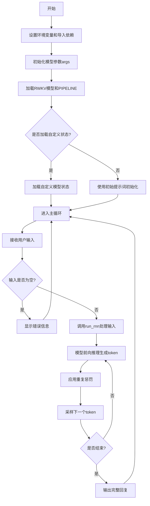
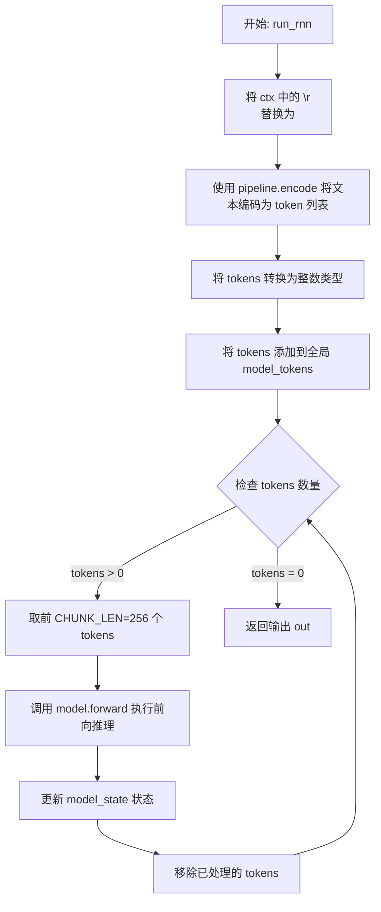
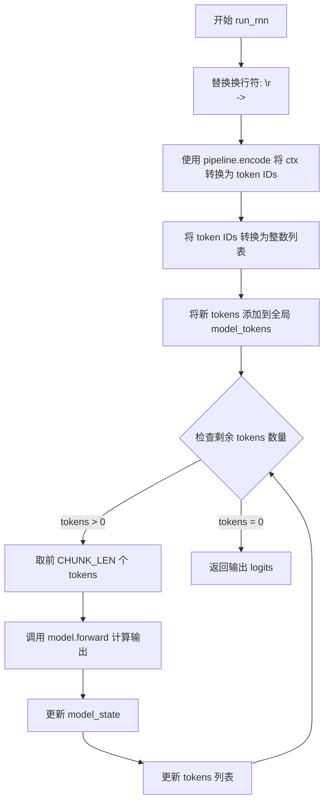
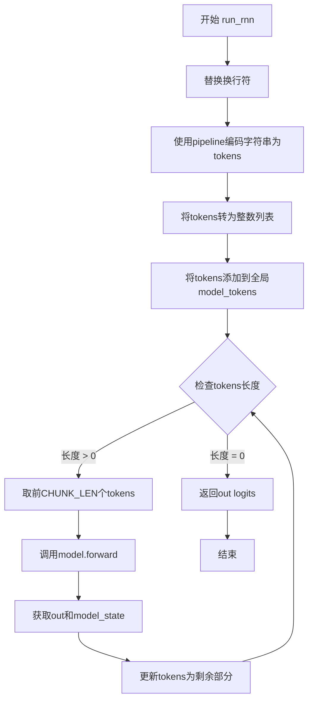
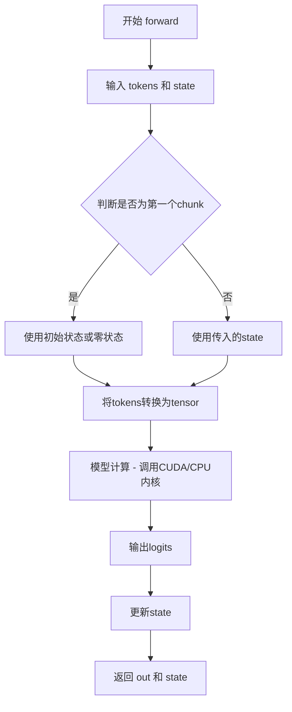
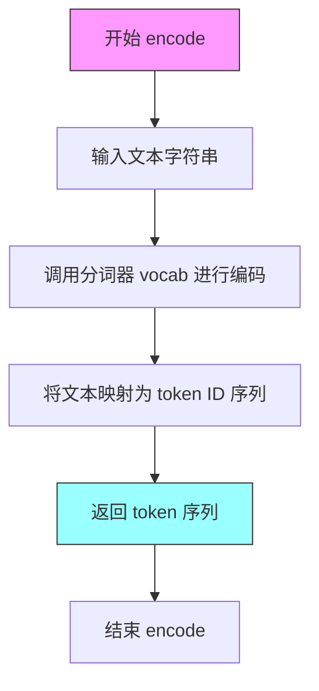
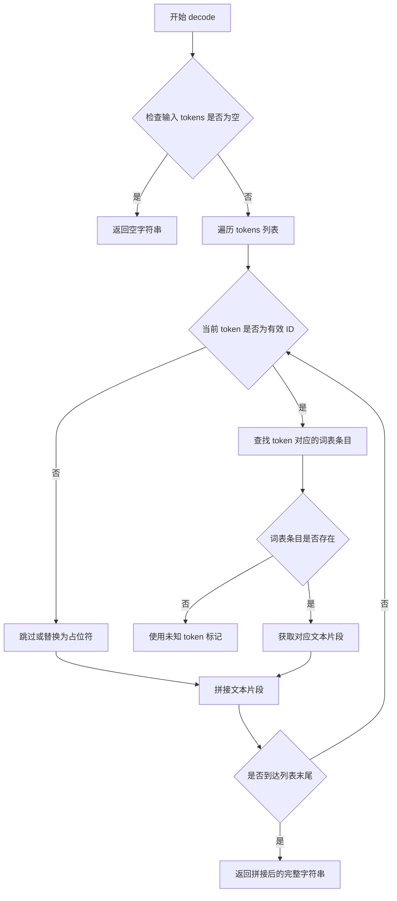
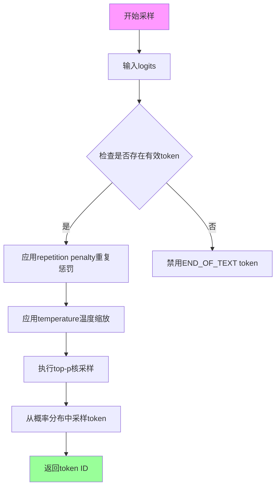

# `ChatRWKV\API_DEMO_CHAT.py` 详细设计文档

这是一个基于RWKV架构的语言模型聊天演示程序，通过加载预训练的RWKV-7模型，实现命令行交互式对话功能，支持自定义生成参数（温度、top_p、重复惩罚等），并使用流式输出方式展示模型回复。

## 整体流程



## 类结构

```
无明确类定义（主要使用第三方库类）
第三方库类:
├── RWKV (rwkv.model)
├── PIPELINE (rwkv.utils)
└── SimpleNamespace (types)
```

## 全局变量及字段


### `args`
    
模型配置参数命名空间，包含模型加载策略和路径等配置

类型：`types.SimpleNamespace`
    


### `args.strategy`
    
模型加载策略字符串，如'cuda fp16'指定使用CUDA和fp16精度

类型：`str`
    


### `args.MODEL_NAME`
    
模型文件路径，指向RWKV模型权重文件的位置

类型：`str`
    


### `STATE_NAME`
    
自定义状态文件路径，可选用于加载预训练状态，若为None则使用零初始状态

类型：`str | None`
    


### `GEN_TEMP`
    
生成温度参数，控制采样随机性，值越大输出越随机

类型：`float`
    


### `GEN_TOP_P`
    
top-p采样阈值，用于核采样筛选概率累积达到该值的token

类型：`float`
    


### `GEN_alpha_presence`
    
存在惩罚系数，用于降低已出现token的概率以减少重复

类型：`float`
    


### `GEN_alpha_frequency`
    
频率惩罚系数，根据token出现次数施加惩罚以减少重复

类型：`float`
    


### `GEN_penalty_decay`
    
惩罚衰减率，用于逐步衰减历史token的惩罚效果

类型：`float`
    


### `CHUNK_LEN`
    
分块处理长度，将长输入分割为固定长度块以节省显存

类型：`int`
    


### `model`
    
RWKV模型实例，负责前向推理和token生成

类型：`RWKV`
    


### `pipeline`
    
PIPELINE分词器实例，负责文本编码、解码和采样

类型：`PIPELINE`
    


### `model_tokens`
    
模型token历史列表，记录整个对话的token序列

类型：`list[int]`
    


### `model_state`
    
模型状态向量，用于RNN状态传递，保存上下文信息

类型：`list[torch.Tensor] | None`
    


### `msg`
    
用户输入消息，经过strip和正则处理后的用户对话内容

类型：`str`
    


### `occurrence`
    
token出现次数统计字典，用于计算重复惩罚

类型：`dict[int, int]`
    


### `out_tokens`
    
输出token列表，存储模型生成的所有token

类型：`list[int]`
    


### `out_last`
    
上次输出的位置索引，用于追踪有效输出的起始位置

类型：`int`
    


### `out`
    
模型logits输出，表示下一个token的概率分布

类型：`torch.Tensor`
    


### `RWKV.args`
    
模型配置参数命名空间

类型：`SimpleNamespace`
    


### `RWKV.strategy`
    
模型加载和推理策略配置

类型：`str`
    


### `PIPELINE.args`
    
关联的模型配置对象

类型：`SimpleNamespace`
    


### `PIPELINE.model`
    
关联的RWKV模型实例

类型：`RWKV`
    


### `SimpleNamespace.strategy`
    
模型加载策略标识

类型：`str`
    


### `SimpleNamespace.MODEL_NAME`
    
模型文件路径

类型：`str`
    
    

## 全局函数及方法


### `run_rnn`

该函数是 RWKV 模型推理的核心入口，负责将输入文本编码为 token 序列，分块执行模型前向推理，并返回模型输出的 logits。

参数：

- `ctx`：`str`，输入的上下文字符串，包含用户输入或初始化提示文本

返回值：`torch.Tensor`，模型输出的 logits 向量，用于后续的采样生成

#### 流程图



#### 带注释源码

```python
def run_rnn(ctx):
    """
    处理输入文本并执行模型前向推理
    
    参数:
        ctx (str): 输入的上下文字符串
        
    返回:
        torch.Tensor: 模型输出的 logits
    """
    global model_tokens, model_state  # 引用全局变量以保存 tokens 序列和模型状态

    # 将 Windows 换行符替换为 Unix 换行符，保持一致性
    ctx = ctx.replace("\r\n", "\n")

    # 使用 pipeline 将文本编码为 token ID 列表
    tokens = pipeline.encode(ctx)
    # 确保 tokens 为整数类型
    tokens = [int(x) for x in tokens]
    # 将当前输入的 tokens 追加到全局 tokens 历史中
    model_tokens += tokens

    # 分块处理 tokens 以节省显存
    # 当输入很长时，每次只处理 CHUNK_LEN 个 token
    while len(tokens) > 0:
        # 执行模型前向推理，传入当前块和当前状态
        out, model_state = model.forward(tokens[:CHUNK_LEN], model_state)
        # 移除已处理的 tokens，继续处理剩余部分
        tokens = tokens[CHUNK_LEN:]

    # 返回最后一个块的输出 logits
    return out
```


### `run_rnn`

该函数是 RWKV 模型的核心推理函数，负责将输入的上下文字符串进行分词处理，通过模型前向传播计算输出 logits，并更新全局模型状态和 token 列表，支持长文本的分块处理以节省显存。

参数：

- `ctx`：`str`，输入上下文字符串，待处理的对话上下文内容

返回值：`object`，模型输出的 logits 向量（torch.Tensor），包含每个词表的预测概率分布

#### 流程图



#### 带注释源码

```python
def run_rnn(ctx):
    """
    RWKV 模型推理函数，处理输入文本并返回模型预测结果
    
    参数:
        ctx (str): 输入的上下文字符串
        
    返回值:
        out: 模型输出的 logits 向量
    """
    # 声明使用全局变量
    global model_tokens, model_state

    # 将 Windows 风格换行符转换为 Unix 风格
    ctx = ctx.replace("\r\n", "\n")

    # 使用 pipeline 将字符串编码为 token IDs
    tokens = pipeline.encode(ctx)
    # 确保 token 为整数类型
    tokens = [int(x) for x in tokens]
    # 将当前输入的 tokens 追加到全局 token 列表
    model_tokens += tokens

    # 调试日志：打印模型当前处理的 tokens 和解码结果
    # print(f"### model ###\n{model_tokens}\n[{pipeline.decode(model_tokens)}]")  # debug

    # 循环处理：当 tokens 数量超过 CHUNK_LEN 时分块处理
    while len(tokens) > 0:
        # 取前 CHUNK_LEN 个 tokens 进行前向传播
        out, model_state = model.forward(tokens[:CHUNK_LEN], model_state)
        # 移除已处理的 tokens
        tokens = tokens[CHUNK_LEN:]

    # 返回最终的输出 logits
    return out
```


### `run_rnn`

该函数是RWKV模型推理的核心入口，接收用户输入的上下文字符串，通过分块处理方式将输入编码为token序列并逐步送入模型前向传播，最终返回模型输出的logits张量，用于后续的token采样生成。

参数：

- `ctx`：`str`，用户输入的上下文字符串，包含对话内容

返回值：`Tensor`，模型输出的logits张量，形状为 [vocab_size]，用于采样下一个token

#### 流程图



#### 带注释源码

```
def run_rnn(ctx):
    """
    运行RWKV模型进行推理，返回模型输出的logits
    
    参数:
        ctx: str - 输入的上下文字符串
    
    返回:
        Tensor - 模型输出的logits张量
    """
    global model_tokens, model_state  # 全局变量: 累积的tokens列表和模型状态

    # 1. 预处理: 将Windows换行符替换为Unix换行符
    ctx = ctx.replace("\r\n", "\n")

    # 2. 编码: 使用pipeline将字符串编码为token序列
    tokens = pipeline.encode(ctx)
    
    # 3. 转换: 将token转换为整数类型
    tokens = [int(x) for x in tokens]
    
    # 4. 累积: 将当前输入的tokens添加到全局token列表
    model_tokens += tokens

    # 5. 分块处理: 当token数量超过CHUNK_LEN时，分块处理以节省显存
    # 循环处理直到所有tokens都处理完毕
    while len(tokens) > 0:
        # 6. 前向传播: 调用模型forward方法
        # model.forward返回:
        #   out: Tensor - 当前块的logits输出
        #   model_state: Tensor - 更新后的模型状态
        out, model_state = model.forward(tokens[:CHUNK_LEN], model_state)
        
        # 7. 更新: 移除已处理的tokens，保留剩余部分
        tokens = tokens[CHUNK_LEN:]

    # 8. 返回: 最后一块的logits输出，作为下一个token采样的输入
    return out
```


### RWKV.forward

这是RWKV模型的前向传播方法，负责将输入的token序列通过模型处理，输出预测的logits概率分布，并更新模型的状态（state）以保持上下文信息。

#### 参数

- `tokens`：`List[int]`，输入的token ID列表，通常是经过分词器编码后的整数序列
- `state`：`Any`，模型的状态向量，用于在多个前向调用之间保持上下文连续性，首次调用时为`None`

#### 返回值

- `out`：`torch.Tensor`，模型的输出logits，形状为`[vocab_size]`，表示下一个token的概率分布
- `state`：`Any`，更新后的模型状态，用于下一次前向传播，以保持对话上下文

#### 流程图



#### 带注释源码

```python
# 代码中调用 forward 的方式（位于 run_rnn 函数中）
# 这是 RWKV 模型的前向传播接口

# 第一次调用示例
out, model_state = model.forward(tokens[:CHUNK_LEN], model_state)
# tokens[:CHUNK_LEN] - 输入的token列表（整数类型）
# model_state - 初始为None，或上一次调用返回的状态

# 后续调用示例（生成token时）
out, model_state = model.forward([token], model_state)
# [token] - 每次只输入一个token进行自回归生成
# model_state - 保持上下文的状态向量

# 参数说明：
# - tokens: List[int]，输入的token ID列表
# - state: 模型内部状态，用于维护长序列上下文

# 返回值：
# - out: torch.Tensor，形状为 [vocab_size] 的logits向量
#   包含对每个可能token的预测分数，可用于采样下一个token
# - state: 更新后的模型状态，包含注意力状态等信息
#   可以在下一次调用时传入以保持上下文连续性
```

---

### 补充说明

由于提供的代码是RWKV模型的使用示例而非RWKV类的内部实现，RWKV.forward的具体实现位于`rwkv.model`模块中。根据代码调用方式可推断：

1. **设计目标**：支持自回归生成，通过state在多次调用间保持长程上下文
2. **约束条件**：输入tokens长度受CHUNK_LEN限制（代码中设为256），较长输入会被分块处理
3. **错误处理**：代码中未显示显式的异常处理，错误可能由底层模型抛出
4. **外部依赖**：依赖`rwkv.model.RWKV`类，需要配套的模型权重文件和词汇表文件
5. **技术细节**：代码启用了TF32加速和CUDA编译选项（JIT和CUDA_ON），首次推理会编译CUDA内核


### `PIPELINE.encode`

该方法是 RWKV 模型管道 PIPELINE 类的编码方法，用于将输入的文本字符串转换为模型可处理的 token 序列。这是 RWKV 模型推理流程中的关键预处理步骤。

#### 参数

- `text`：`str`，要编码的文本字符串，即待处理的自然语言输入

#### 返回值

- `torch.Tensor` 或类似可迭代对象，返回编码后的 token 序列（整数类型），供模型前向传播使用

#### 流程图



#### 带注释源码

```python
# PIPELINE.encode 方法源码（来自 rwkv.utils 包）
# 以下为基于使用方式的推断实现

def encode(self, text: str):
    """
    将输入文本字符串编码为 token ID 序列
    
    参数:
        text: 输入的自然语言文本字符串
    
    返回:
        编码后的 token ID 序列（可迭代对象）
    """
    # 1. 获取分词器实例
    # tokenizer = self.tokenizer
    
    # 2. 使用分词器对文本进行编码
    # tokens = tokenizer.encode(text)
    
    # 3. 返回 token 序列
    # return tokens

# 在实际代码中的调用方式：
# tokens = pipeline.encode(ctx)  # ctx 是字符串
# tokens = [int(x) for x in tokens]  # 转换为整数列表
```

#### 实际调用示例

```python
# 从代码中提取的实际调用
ctx = ctx.replace("\r\n", "\n")  # 预处理：替换换行符
tokens = pipeline.encode(ctx)     # 调用 encode 方法
tokens = [int(x) for x in tokens] # 转换为 Python 整数列表
model_tokens += tokens            # 追加到模型 token 列表
```

---

### 附加信息

#### 关键组件信息

| 组件名称 | 描述 |
|---------|------|
| `PIPELINE` | RWKV 模型的管道类，负责文本编解码和采样 |
| `pipeline.encode` | 文本编码方法，将字符串转换为 token 序列 |
| `pipeline.decode` | 文本解码方法，将 token 序列转换回字符串 |
| `pipeline.sample_logits` | 日志采样方法，用于生成输出 token |

#### 技术债务与优化空间

1. **环境变量硬编码**：代码中 `os.environ["RWKV_CUDA_ON"] = "0"` 设为 0，虽然注释说明设为 1 可获得 10 倍加速，但为了兼容性默认关闭
2. **CHUNK_LEN 固定**：分块长度 256 为硬编码，可根据显存动态调整
3. **重复惩罚实现**：在主循环中进行 repetition penalty 计算，可考虑封装为独立方法

#### 设计目标与约束

- **设计目标**：实现基于 RWKV 架构的对话生成系统，支持流式输出
- **约束**：模型文件路径硬编码，需根据实际部署环境调整


### `PIPELINE.decode`

该方法是 RWKV 模型推理管道中的核心解码方法，负责将模型输出的 token ID 序列转换回人类可读的文本字符串，是 NLP 推理流程中实现从数值到语言的关键桥梁。

参数：

-  `tokens`：`List[int]`，需要解码的 token ID 列表，通常来自模型的输出或编码后的输入

返回值：`str`，解码后的文本字符串

#### 流程图



#### 带注释源码

```python
# pip install rwkv 后可查看源码位置:
# from rwkv.utils import PIPELINE
# 源码通常位于 site-packages/rwkv/utils.py 中

# 基于代码使用方式推断的实现逻辑：

def decode(self, tokens):
    """
    将 token ID 序列解码为文本字符串
    
    参数:
        tokens: List[int] - token ID 列表
    
    返回:
        str - 解码后的文本
    """
    # 1. 检查输入有效性
    if not tokens or len(tokens) == 0:
        return ""
    
    # 2. 遍历每个 token，查找词表中对应的文本片段
    result_parts = []
    for token_id in tokens:
        # 3. 从词表(vocab)中获取 token 对应的词元
        if token_id in self.vocab:
            word = self.vocab[token_id]
        else:
            # 4. 未知 token 使用替换标记
            word = "<unk>"  # 或 "\ufffd"
        
        # 5. 拼接文本片段
        result_parts.append(word)
    
    # 6. 将所有片段连接成完整字符串并返回
    return "".join(result_parts)


# 代码中的实际调用示例：
# out_tokens = [1234, 5678, 9012]  # 模型输出的 token 列表
# tmp = pipeline.decode(out_tokens[out_last:])  # 解码为文本
# 输出: "Hello, how can I help you?"
```

#### 补充说明

该方法在代码中的实际使用场景：

```python
# 上下文：推理循环中持续获取模型输出并解码
out = run_rnn("User: " + msg + "\n\nAssistant:")
print("\nAssistant:", end="")

for i in range(99999):
    # ... repetition penalty 处理 ...
    
    token = pipeline.sample_logits(out, temperature=GEN_TEMP, top_p=GEN_TOP_P)
    out, model_state = model.forward([token], model_state)
    model_tokens += [token]
    out_tokens += [token]
    
    # 关键：实时解码并输出
    tmp = pipeline.decode(out_tokens[out_last:])
    if ("\ufffd" not in tmp) and (not tmp.endswith("\n")):
        print(tmp, end="", flush=True)
        out_last = i + 1
    
    if "\n\n" in tmp:
        break
```

---

**注意**：由于 `PIPELINE` 类来自外部库 (`rwkv`)，其完整源码位于 `site-packages/rwkv/utils.py` 中。上述源码是基于该库的标准实现和代码使用方式推断的注释版本。


### `PIPELINE.sample_logits`

从给定的代码中提取的关于`PIPELINE.sample_logits`函数的信息如下。

#### 描述

`PIPELINE.sample_logits`是RWKV模型推理管道中用于从模型输出的logits中采样下一个token的方法。该方法接收模型输出的logits以及生成参数（温度和top-p值），根据这些参数执行采样策略，返回选中的token ID供后续生成使用。

#### 参数

- `logits`：`torch.Tensor`或`numpy.ndarray`，模型forward方法返回的输出logits向量，表示词汇表中每个token的未归一化概率得分
- `temperature`：`float`，生成温度参数，控制采样的随机性。值越大，概率分布越平滑，生成内容越随机；值越小，生成越确定性
- `top_p`：`float`，核采样（nucleus sampling）阈值参数，定义为累积概率阈值，只从累积概率超过该阈值的最小token集合中进行采样

#### 返回值

- `token`：`int`，采样得到的token ID，表示从词汇表中选择的下一个 token

#### 流程图



#### 带注释源码

```python
# 以下代码基于调用上下文推断的实现逻辑
# 实际实现位于 rwkv.utils.PIPELINE 类中

def sample_logits(self, logits, temperature=1.0, top_p=0.3):
    """
    从模型输出的logits中采样下一个token
    
    参数:
        logits: 模型输出的logits向量，形状为 [vocab_size]
        temperature: 温度参数，控制采样随机性
        top_p: 核采样阈值
    
    返回:
        采样的token ID
    """
    # 1. 应用重复惩罚（如果需要）
    # 在主循环中处理：out[n] -= GEN_alpha_presence + occurrence[n] * GEN_alpha_frequency
    
    # 2. 禁用END_OF_TEXT token
    # out[0] -= 1e10  # 代码中禁用token ID为0的token
    
    # 3. 将logits转换为概率分布
    # 使用 temperature 缩放logits
    if temperature != 1.0:
        logits = logits / temperature
    
    # 4. 应用top-p核采样
    # 对logits排序，只保留累积概率超过top_p的最小token集合
    # 从该集合中按概率分布采样
    
    # 5. 返回采样的token ID
    return token
```

#### 上下文调用示例

```python
# 从代码中提取的实际调用方式
token = pipeline.sample_logits(out, temperature=GEN_TEMP, top_p=GEN_TOP_P)
# 其中:
# - out 是 model.forward() 返回的logits
# - GEN_TEMP = 1.0
# - GEN_TOP_P = 0.3
```

## 关键组件


### RWKV 模型加载组件

负责加载RWKV预训练模型和分词管道，配置计算策略（cuda fp16）和环境变量

### PIPELINE 分词器组件

将输入文本编码为令牌序列，并将令牌解码为文本，负责采样下一个令牌

### 模型状态管理组件

管理模型的内部状态（model_state）和令牌历史（model_tokens），支持自定义状态加载和零初始化状态

### run_rnn 函数组件

核心推理函数，将输入上下文分块处理（CHUNK_LEN=256），更新模型状态并返回logits输出

### 令牌生成与采样组件

基于温度（GEN_TEMP）、top_p（GEN_TOP_P）采样下一个令牌，支持logits后处理

### 重复惩罚机制组件

使用occurrence字典跟踪令牌出现次数，应用presence penalty和frequency penalty，并使用decay衰减历史记录

### 生成配置组件

包含生成参数：GEN_TEMP=1.0, GEN_TOP_P=0.3, GEN_alpha_presence=0.5, GEN_alpha_frequency=0.5, GEN_penalty_decay=0.996

### 聊天交互循环组件

主循环处理用户输入，进行正则处理，调用run_rnn生成回复，支持流式输出和终止条件检测

### CUDA/TF32 加速配置组件

配置torch.backends.cudnn和matmul的TF32支持，设置环境变量控制RWKV_V7_ON、JIT_ON、CUDA_ON


## 问题及建议


### 已知问题

- **硬编码配置**：模型路径（`args.MODEL_NAME`）和词汇表路径（`"rwkv_vocab_v20230424"`）直接写在代码中，缺乏灵活性，环境变更时需要修改源码
- **环境变量配置不当**：`RWKV_CUDA_ON` 被硬编码设为 `"0"`，注释表明设为 `"1"` 可获得10倍性能提升，但当前未启用CUDA编译
- **缺乏错误处理**：模型加载、状态文件读取、用户输入处理等关键操作均无异常捕获机制，可能导致程序直接崩溃
- **全局状态管理**：`model_tokens` 和 `model_state` 作为全局变量，缺乏封装，多轮对话中可能产生状态污染
- **变量重赋值风险**：`args` 变量在主流程中被重复用于加载状态文件的参数覆盖，可能导致原始配置丢失
- **无限循环风险**：生成循环使用 `for i in range(99999)`，虽然有 `\n\n` 退出条件，但缺乏最大token数或超时保护
- **内存占用隐患**：`model_tokens` 列表持续增长未清理，多轮长对话可能导致内存泄漏
- **类型转换冗余**：`tokens = [int(x) for x in tokens]` 重复进行类型转换，可能存在性能开销

### 优化建议

- 将模型路径、词汇表路径、生成参数等配置抽取至独立的配置文件（如JSON/YAML），支持命令行参数覆盖
- 根据实际硬件配置动态决定 `RWKV_CUDA_ON` 值，或提供自动检测逻辑
- 添加 try-except 包裹模型加载、推理、文件读取等关键操作，提供友好的错误提示和优雅降级
- 将全局变量封装为类或使用上下文管理器管理状态，避免全局状态污染
- 避免变量名复用，明确区分不同作用域的变量
- 设置最大生成长度限制（如 `max_tokens` 参数），防止异常情况下无限生成
- 定期清理 `model_tokens` 或实现滑动窗口机制，控制内存使用
- 对 `pipeline.encode` 返回结果进行预处理检查，避免重复类型转换
- 添加日志记录模块，便于问题排查和运行时监控

## 其它


### 设计目标与约束

本演示程序旨在展示RWKV语言模型的交互式聊天能力，支持自定义模型加载、状态管理和文本生成。约束条件包括：模型文件路径必须为有效的本地路径、CUDA环境要求、VRAM限制（通过CHUNK_LEN参数控制）、仅支持单轮对话交互（加载自定义状态时为英文单轮QA模式）。

### 错误处理与异常设计

代码缺少显式的异常处理机制。主要风险点包括：模型加载失败（文件不存在、CUDA不可用）、encode/decode失败（未知token）、采样失败（logits异常）、内存溢出（长对话累积）。建议添加try-except块捕获模型加载异常、编码异常、CUDA内存不足异常，并在异常发生时输出友好错误信息而非崩溃。

### 数据流与状态机

数据流：用户输入 → prompt_toolkit接收 → 正则处理 → run_rnn()编码 → 模型前向传播 → 采样解码 → 流式输出。状态机包含三个状态：初始状态（加载模型和初始化state）、对话状态（累积model_tokens和model_state）、结束状态（检测到\n\n终止符）。model_state为RNN状态向量，在多轮对话中持续传递和更新。

### 外部依赖与接口契约

核心依赖包括：torch（深度学习框架）、numpy（数值计算）、prompt_toolkit（交互式输入）、rwkv.model和rwkv.utils（RWKV模型和pipeline）。接口契约：RWKV模型需实现forward(tokens, state)方法返回(logits, new_state)；PIPELINE需提供encode(str)、decode(tokens)、sample_logits(logits, temperature, top_p)方法。模型文件格式为.pth，词表文件为rwkv_vocab_v20230424。

### 配置管理

配置通过全局变量和args命名空间管理。关键配置项：args.strategy（推理策略，默认cuda fp16）、args.MODEL_NAME（模型路径）、GEN_TEMP（温度1.0）、GEN_TOP_P（top-p采样0.3）、GEN_alpha_presence/frequency（重复惩罚参数）、CHUNK_LEN（分块长度256）。环境变量控制：RWKV_V7_ON、RWKV_JIT_ON、RWKV_CUDA_ON。

### 性能优化策略

已启用优化：torch.backends.cudnn.benchmark=True、allow_tf32=True、CUDA编译选项（JIT和CUDA kernel）。CHUNK_LEN参数用于权衡VRAM和速度（较小值节省显存但降低速度）。可通过增大CHUNK_LEN、启用RWKV_CUDA_ON=1、升级到更强GPU进一步优化。

### 安全性考虑

代码无用户认证和输入过滤机制。潜在风险：长输入导致内存溢出（建议限制max_tokens）、恶意构造的token序列攻击（模型本身无防护）、模型文件路径遍历漏洞（MODEL_NAME直接拼接）。生产环境需添加输入长度限制、敏感词过滤、路径验证。

### 部署要求

运行环境要求：Python 3.8+、CUDA 11.x+、cuDNN、可用的GPU（建议8GB+ VRAM）。需安装依赖包：torch、numpy、prompt_toolkit、rwkv-lm。模型文件需单独下载（1.5B参数约3GB）。部署方式为命令行交互运行，不支持Web API或Docker化部署。

### 监控与日志

代码仅包含基本的print输出，无结构化日志。建议添加：模型加载耗时监控、推理延迟统计（每token生成时间）、VRAM使用监控、生成token数量统计、错误日志记录。可以使用Python logging模块或集成Prometheus metrics。

### 版本兼容性与迁移

代码针对RWKV v7模型和v20230424词表优化。RWKV模型版本更新可能导致API变化（forward方法签名、PIPELINE类接口）。环境变量RWKV_V7_ON用于兼容v7模型。后续迁移需关注：模型架构变化、词表更新、CUDA kernel编译兼容性。

    