# `ChatRWKV\API_DEMO_WORLD.py` 详细设计文档

这是一个RWKV语言模型的演示脚本，展示了三种不同的文本生成模式：自由生成、单轮问答和CFG（Classifier-Free Guidance）解码。该代码使用RWKV-LM库加载预训练模型，并通过自定义生成器实现多样化的文本生成功能。

## 整体流程

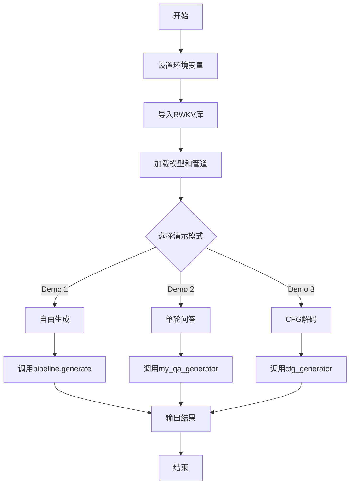

## 类结构

```
全局执行流程
├── 环境配置
├── 模型加载
└── 三个演示函数
    ├── my_print (回调函数)
    ├── my_qa_generator (问答生成器)
    └── cfg_generator (CFG解码生成器)
```

## 全局变量及字段


### `MODEL_FILE`
    
指向RWKV模型文件的文件系统路径

类型：`str`
    


### `model`
    
加载到内存中的RWKV语言模型实例

类型：`RWKV`
    


### `pipeline`
    
用于文本编码、解码和采样的pipeline工具对象

类型：`PIPELINE`
    


### `ctx`
    
当前用于生成的上下文提示文本

类型：`str`
    


### `args`
    
控制文本生成行为的参数配置对象

类型：`PIPELINE_ARGS`
    


### `out_tokens`
    
存储生成过程中的token ID序列

类型：`list[int]`
    


### `out_len`
    
记录已处理的输出token数量

类型：`int`
    


### `out_str`
    
累积解码后的输出字符串

类型：`str`
    


### `occurrence`
    
记录各token出现次数用于重复惩罚

类型：`dict[int, float]`
    


### `state`
    
RWKV模型的隐藏状态用于递归生成

类型：`any`
    


### `token`
    
当前采样到的单个token ID

类型：`int`
    


### `tmp`
    
临时存储最新解码的文本片段

类型：`str`
    


### `with_ctx`
    
带上下文信息的完整输入文本

类型：`str`
    


### `without_ctx`
    
不带上下文信息的输入文本

类型：`str`
    


### `cfg_factor`
    
控制上下文影响力的无分类器引导系数

类型：`float`
    


### `with_ctx_state`
    
带上下文分支的模型隐藏状态

类型：`any`
    


### `without_ctx_state`
    
无上下文分支的模型隐藏状态

类型：`any`
    


### `with_ctx_out`
    
带上下文分支的模型logits输出

类型：`ndarray`
    


### `without_ctx_out`
    
无上下文分支的模型logits输出

类型：`ndarray`
    


### `out`
    
CFG加权合并后的最终logits向量

类型：`ndarray`
    


### `context_list`
    
预定义的多语言上下文段落列表

类型：`list[str]`
    


### `question_list`
    
待回答的问题字符串列表

类型：`list[str]`
    


### `chat_rounds`
    
单轮对话的历史消息记录

类型：`list[str]`
    


### `chat_with_context`
    
包含背景信息的完整对话结构

类型：`list[str]`
    


### `chat_without_context`
    
仅包含问题的简短对话结构

类型：`list[str]`
    


### `PIPELINE_ARGS.temperature`
    
控制采样随机性的温度参数

类型：`float`
    


### `PIPELINE_ARGS.top_p`
    
核采样保留的概率累积阈值

类型：`float`
    


### `PIPELINE_ARGS.top_k`
    
限制采样候选token数量的k值

类型：`int`
    


### `PIPELINE_ARGS.alpha_frequency`
    
基于词频的惩罚系数减少重复

类型：`float`
    


### `PIPELINE_ARGS.alpha_presence`
    
基于词存在性的惩罚系数减少重复

类型：`float`
    


### `PIPELINE_ARGS.token_ban`
    
明确禁止生成的token ID黑名单

类型：`list[int]`
    


### `PIPELINE_ARGS.token_stop`
    
触发生成终止的token ID列表

类型：`list[int]`
    


### `PIPELINE_ARGS.chunk_len`
    
输入分块长度用于显存优化

类型：`int`
    
    

## 全局函数及方法


### `my_print`

这是一个简单的回调函数，用于在 RWKV 语言模型生成过程中实时打印输出的文本内容。该函数被传递给 `pipeline.generate()` 方法，作为生成每个 token 时的回调，以实现流式输出的效果。

参数：

-  `s`：`str`，要打印的字符串内容

返回值：`None`，无返回值

#### 流程图

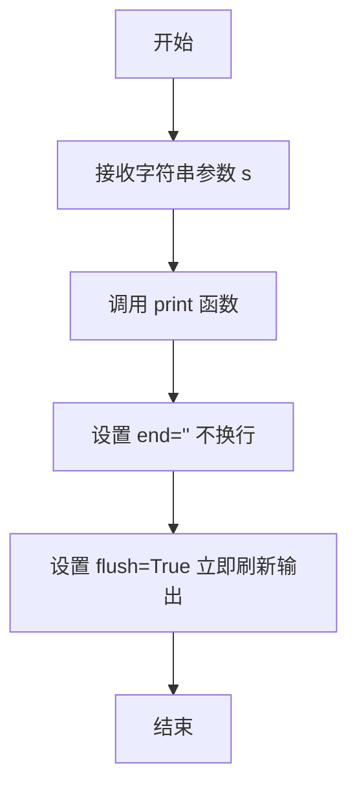

#### 带注释源码

```python
def my_print(s):
    """
    简单的回调函数，用于在语言模型生成过程中实时打印输出
    
    参数:
        s: 要打印的字符串内容
    """
    # 使用 print 函数输出字符串
    # end="" 设置不换行，使输出紧凑连续
    # flush=True 立即刷新输出缓冲区，确保实时显示
    print(s, end="", flush=True)
```


### `my_qa_generator`

该函数是一个基于RWKV语言模型的自定义问答生成器，通过逐token生成的方式实现单轮对话功能。它接收上下文提示，初始化模型状态，然后在循环中采样下一个token，同时应用重复惩罚机制，直到生成结束符或达到最大迭代次数，最终返回完整的回答字符串。

#### 参数

- `ctx`：`str`，输入的对话上下文，包含用户问题和必要的提示信息

#### 返回值

- `str`，模型生成的回答内容，经过strip()处理去除首尾空白

#### 流程图

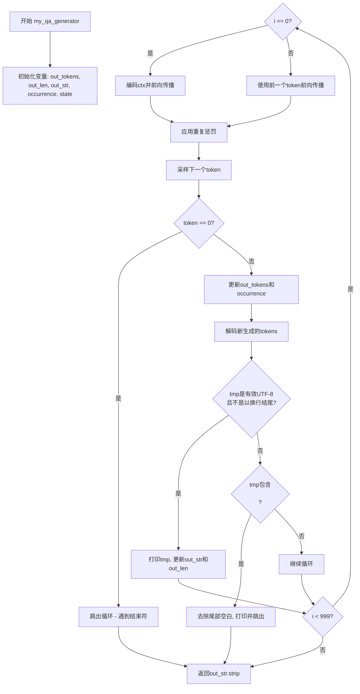

#### 带注释源码

```python
def my_qa_generator(ctx):
    """
    基于RWKV模型的自定义问答生成函数
    
    参数:
        ctx: str - 输入的对话上下文
    返回:
        str - 生成的问答回答
    """
    out_tokens = []          # 存储所有生成的token
    out_len = 0              # 记录当前输出的长度（用于增量解码）
    out_str = ""             # 累积的输出字符串
    occurrence = {}          # 字典，记录每个token出现次数用于重复惩罚
    state = None             # RNN状态，用于模型前向传播
    
    # 最多迭代999次，防止无限循环
    for i in range(999):
        if i == 0:
            # 首次迭代：对输入上下文进行编码并前向传播
            # pipeline.encode(ctx) 将字符串转换为token ids
            # pipeline.model.forward() 返回logits和新的状态
            out, state = pipeline.model.forward(pipeline.encode(ctx), state)
        else:
            # 后续迭代：使用前一个生成的token继续生成
            out, state = pipeline.model.forward([token], state)

        # 应用重复惩罚：减少已出现token的logits概率
        # occurrence[n]表示token n已经出现的次数
        for n in occurrence:
            out[n] -= (
                0.4 + occurrence[n] * 0.4
            )  #### 因为top_p较低，这里使用较高的重复惩罚

        # 从logits中采样下一个token
        # temperature=1.0: 控制生成的随机性
        # top_p=0.2: nucleus sampling，累积概率达到0.2的最小token集合
        token = pipeline.sample_logits(
            out, temperature=1.0, top_p=0.2
        )  #### 采样下一个token

        # token 0 是结束符<|endoftext|>
        if token == 0:
            break  #### 遇到结束符则退出

        # 将新token添加到列表
        out_tokens += [token]

        # 更新出现次数：所有token的计数衰减，新token设为1
        for n in occurrence:
            occurrence[n] *= 0.996  #### 衰减重复惩罚
        occurrence[token] = 1 + (occurrence[token] if token in occurrence else 0)

        # 解码新生成的tokens（从out_len开始到末尾的增量部分）
        tmp = pipeline.decode(out_tokens[out_len:])
        
        # 仅当tmp是有效UTF-8且不以换行符结尾时打印
        # "\ufffd" 是UTF-8无效字符的占位符
        if ("\ufffd" not in tmp) and (
            not tmp.endswith("\n")
        ):  #### 仅当out_str是有效utf-8且不以\n结尾时打印
            out_str += tmp
            print(tmp, end="", flush=True)
            out_len = i + 1
        # 遇到双换行表示对话结束
        elif "\n\n" in tmp:  #### 在\n\n处退出
            tmp = tmp.rstrip()
            out_str += tmp
            print(tmp, end="", flush=True)
            break
    
    # 返回生成的回答，去除首尾空白
    return out_str.strip()
```

---

### 关键组件信息

| 组件名称 | 一句话描述 |
|---------|-----------|
| `pipeline.model.forward()` | RWKV模型的前向传播方法，接收token序列和状态，返回logits概率分布和新状态 |
| `pipeline.encode()` | 将字符串编码为token ID列表 |
| `pipeline.decode()` | 将token ID列表解码为字符串 |
| `pipeline.sample_logits()` | 从logits中按temperature和top_p参数采样下一个token |
| `occurrence` 字典 | 记录每个token的出现次数，用于实现动态重复惩罚 |
| `state` | RNN隐藏状态，在迭代间传递以维持上下文 |

---

### 潜在技术债务与优化空间

1. **硬编码参数**: 温度(1.0)、top_p(0.2)、重复惩罚系数(0.4/0.996)等参数直接写在函数内，应抽取为配置参数或函数参数
2. **Magic Numbers**: 999次最大迭代、0.4+occurrence[n]*0.4惩罚公式等数值缺乏解释性，应定义为具名常量
3. **重复代码**: 与`cfg_generator`函数有大量重复逻辑，可抽取公共的生成器基类或辅助函数
4. **错误处理缺失**: 缺乏对`pipeline`为`None`、模型加载失败等异常情况的处理
5. **性能考量**: 每轮都遍历整个`occurrence`字典，当词汇量大时效率较低，可考虑使用稀疏数据结构或限制惩罚范围
6. **状态管理**: `out_len`变量逻辑复杂，可简化或重构以提高可读性

---

### 其它说明

#### 设计目标与约束

- **单轮对话**: 该函数设计用于单轮问答场景，不维护多轮对话历史
- **流式输出**: 通过回调机制实现实时打印，提升用户体验
- **UTF-8验证**: 通过检测`\ufffd`字符确保输出有效性

#### 错误处理与异常设计

- 依赖外部`pipeline`对象的正确初始化
- 遇到结束符(token 0)或双换行时正常退出
- 无显式异常捕获机制

#### 数据流与状态机

```
输入(ctx) 
    → encode() → token ids
    → 循环: forward() → logits → sample_logits() → token
    → decode() → 字符串片段
    → 累积输出
    → 结束条件检查(token==0 或 \n\n)
    → 返回 out_str
```

#### 外部依赖与接口契约

- **依赖**: `rwkv`库(model, PIPELINE, PIPELINE_ARGS)
- **前置条件**: `pipeline`对象已正确初始化并加载模型
- **后置条件**: 返回非空字符串或空字符串(若未生成任何有效内容)


### `cfg_generator`

该函数实现了分类器无关引导（Classifier-Free Guidance，CFG）解码策略，通过同时运行有上下文（with_ctx）和无上下文（without_ctx）两个模型推理，利用 cfg_factor 权重混合两者的 logits 输出，以增强或削弱上下文对生成结果的影响，最终返回引导后的文本生成结果。

参数：

- `with_ctx`：`str`，包含上下文的输入文本，用于引导模型生成方向
- `without_ctx`：`str`，不包含上下文的基准输入文本，作为 CFG 的对照
- `cfg_factor`：`float`，引导因子，默认为 1.0；值为 0 时等同于无引导生成，值大于 1 时增强上下文影响，值小于 1 时削弱上下文影响

返回值：`str`，返回解码后的完整文本字符串（去首尾空格）

#### 流程图

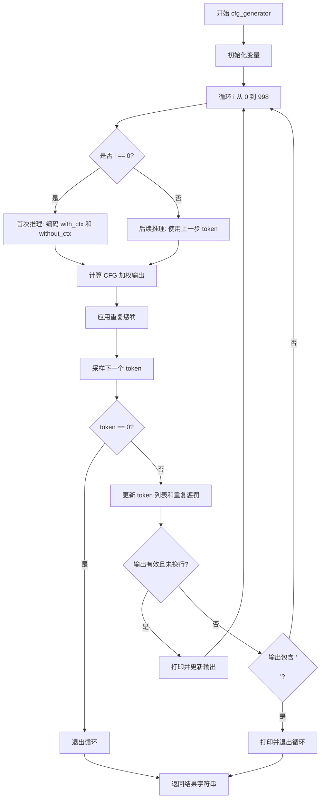

#### 带注释源码

```python
def cfg_generator(with_ctx, without_ctx, cfg_factor=1):
    """
    实现分类器无关引导（CFG）解码的生成器函数
    
    参数:
        with_ctx: 带上下文的输入字符串
        without_ctx: 不带上下文的输入字符串
        cfg_factor: 引导因子，控制上下文影响的权重
    """
    out_tokens = []          # 存储生成的 token 列表
    out_len = 0              # 上次输出的长度（用于增量解码）
    out_str = ""             # 累积的输出字符串
    occurrence = {}          # token 出现次数（用于重复惩罚）
    with_ctx_state = None    # 有上下文模型的状态
    without_ctx_state = None # 无上下文模型的状态
    
    # 最多生成 999 个 token
    for i in range(999):
        if i == 0:
            # 首次迭代：对完整上下文进行前向传播
            with_ctx_out, with_ctx_state = pipeline.model.forward(
                pipeline.encode(with_ctx), with_ctx_state
            )
            without_ctx_out, without_ctx_state = pipeline.model.forward(
                pipeline.encode(without_ctx), without_ctx_state
            )
        else:
            # 后续迭代：使用已生成的 token 进行自回归生成
            with_ctx_out, with_ctx_state = pipeline.model.forward(
                [token], with_ctx_state
            )
            without_ctx_out, without_ctx_state = pipeline.model.forward(
                [token], without_ctx_state
            )
        
        # 核心 CFG 逻辑：通过 cfg_factor 混合两个模型的输出 logits
        # cfg_factor=1: 完全使用 with_ctx
        # cfg_factor=0: 完全使用 without_ctx
        # cfg_factor>1: 增强上下文影响（超引导）
        out = with_ctx_out * cfg_factor + without_ctx_out * (1 - cfg_factor)
        
        # 应用重复惩罚：根据 token 出现次数降低其概率
        for n in occurrence:
            out[n] -= (0.4 + occurrence[n] * 0.4)
        
        # 从调整后的 logits 中采样下一个 token
        token = pipeline.sample_logits(out, temperature=1.0, top_p=0.2)
        
        # token 0 是结束符 <|endoftext|>，遇到则停止生成
        if token == 0:
            break
        
        # 将新 token 添加到列表
        out_tokens += [token]
        
        # 更新重复惩罚的衰减因子（每步乘以 0.996）
        for n in occurrence:
            occurrence[n] *= 0.996
        occurrence[token] = 1 + (occurrence[token] if token in occurrence else 0)
        
        # 解码新生成的 token 片段
        tmp = pipeline.decode(out_tokens[out_len:])
        
        # 只有当输出是有效的 UTF-8 且不是换行符时才打印
        if ("\ufffd" not in tmp) and (not tmp.endswith("\n")):
            out_str += tmp
            print(tmp, end="", flush=True)
            out_len = i + 1
        # 遇到连续换行符表示段落结束，停止生成
        elif "\n\n" in tmp:
            tmp = tmp.rstrip()
            out_str += tmp
            print(tmp, end="", flush=True)
            break
    
    return out_str.strip()
```


### RWKV.forward()

 RWKV模型的前向传播方法，负责处理输入token序列并生成输出logits和更新后的状态，是RWKV模型进行推理的核心方法。

参数：

-  `tokens`：`List[int]`或`np.ndarray`，输入的token列表，通常是经过编码的文本（pipeline.encode(ctx)）或单个token（[token]）
-  `state`：`Any`或`None`，模型的状态向量，首次调用时为None，后续调用时为上一次forward返回的状态，用于维护上下文信息

返回值：

-  `out`：`np.ndarray`或`torch.Tensor`，模型输出的logits向量，维度为词汇表大小，表示下一个token的概率分布
-  `state`：`Any`，更新后的模型状态，可用于下一次调用以保持上下文连贯性

#### 流程图

```mermaid
flowchart TD
    A[开始 forward] --> B{首次调用?}
    B -->|是| C[tokens = pipeline.encode(ctx)]
    B -->|否| D[tokens = [token]]
    C --> E[model.forward(tokens, state=None)]
    D --> F[model.forward(tokens, state)]
    E --> G[返回 out, state]
    F --> G
    G --> H[out用于采样下一个token]
    H --> I[state用于下一次调用]
    I --> J[结束]
```

#### 带注释源码

```python
# 从代码中提取的 RWKV.forward() 调用示例

# ============================================
# Demo 2 中的调用方式 (my_qa_generator 函数)
# ============================================

# 第一次调用 - 处理整个上下文
out, state = pipeline.model.forward(
    pipeline.encode(ctx),  # 将输入文本编码为token列表
    state                   # 首次调用时 state = None
)

# 后续调用 - 处理单个token（自回归生成）
out, state = pipeline.model.forward(
    [token],                # 上一步采样的单个token
    state                   # 上一轮返回的state
)

# ============================================
# Demo 3 中的调用方式 (cfg_generator 函数)
# ============================================

# CFG解码需要两个独立的forward过程
# with_ctx - 有上下文指引
with_ctx_out, with_ctx_state = pipeline.model.forward(
    pipeline.encode(with_ctx), 
    with_ctx_state
)

# without_ctx - 无上下文指引  
without_ctx_out, without_ctx_state = pipeline.model.forward(
    pipeline.encode(without_ctx), 
    without_ctx_state
)

# 后续自回归步骤
with_ctx_out, with_ctx_state = pipeline.model.forward(
    [token], 
    with_ctx_state
)
without_ctx_out, without_ctx_state = pipeline.model.forward(
    [token], 
    without_ctx_state
)

# CFG公式: out = with_ctx_out * cfg_factor + without_ctx_out * (1 - cfg_factor)
out = with_ctx_out * cfg_factor + without_ctx_out * (1 - cfg_factor)
```

#### 额外说明

**设计目标与约束**：
- RWKV.forward() 设计为自回归模式，通过维护状态(state)来实现长文本上下文保持
- 首次调用需要完整上下文，后续仅需最新token和状态
- 支持无状态调用（每次传入state=None），但会丢失上下文信息

**数据流**：
1. 输入: token列表 + 状态向量
2. 处理: RWKV模型核心计算（包含TimeMix、ChannelMix等模块）
3. 输出: logits向量（下一token的概率分布）+ 更新后的状态

**状态管理**：
- 状态state在首次调用时为None
- 每次forward后返回的新state必须保存并在下次调用时传入
- 不同的生成任务需要独立的状态变量（如CFG需要with_ctx_state和without_ctx_state）

**潜在优化空间**：
- 当前代码中CUDA设置为0，可改为1以获得约10倍的推理速度提升
- chunk_len参数可用于分块处理以节省显存，但当前示例未使用

**外部依赖**：
- 依赖rwkv库（pip install rwkv --upgrade）
- 需要预训练模型文件（MODEL_FILE）
- 需要对应的词汇表（rwkv_vocab_v20230424）


### `RWKV.__init__`

初始化RWKV模型，加载指定的模型文件和推理策略。

参数：

-  `model`：`str`，模型文件路径
-  `strategy`：`str`，推理策略（如"cuda fp16"表示使用CUDA加速的半精度浮点数）

返回值：`None`，构造函数无返回值

#### 流程图

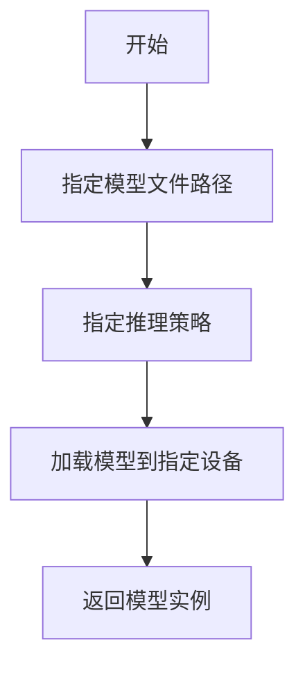

#### 带注释源码

```
model = RWKV(model=MODEL_FILE, strategy="cuda fp16")
# 加载RWKV模型，MODEL_FILE是模型权重路径
# strategy指定使用CUDA加速和fp16半精度以提高推理速度
```

---

### `PIPELINE.__init__`

初始化管道，加载分词器和模型，用于后续的编码、解码和生成。

参数：

-  `model`：`RWKV`，已初始化的RWKV模型实例
-  `vocab`：`str`，词表文件名（不含路径）

返回值：`None`，构造函数无返回值

#### 流程图

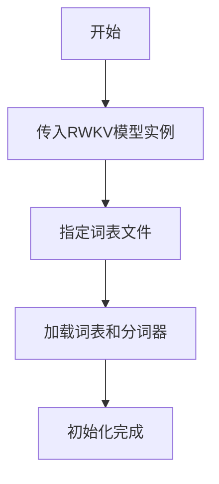

#### 带注释源码

```
pipeline = PIPELINE(model, "rwkv_vocab_v20230424")
# 创建推理管道，关联模型和词表
# 词表文件用于分词和编码/解码
```

---

### `PIPELINE.generate`

使用模型和参数生成文本，通过回调函数逐token输出。

参数：

-  `ctx`：`str`，输入上下文字符串
-  `token_count`：`int`，要生成的token数量
-  `args`：`PIPELINE_ARGS`，生成参数配置对象
-  `callback`：`callable`，每生成一个token调用的回调函数

返回值：`None`，生成结果通过回调函数输出

#### 流程图

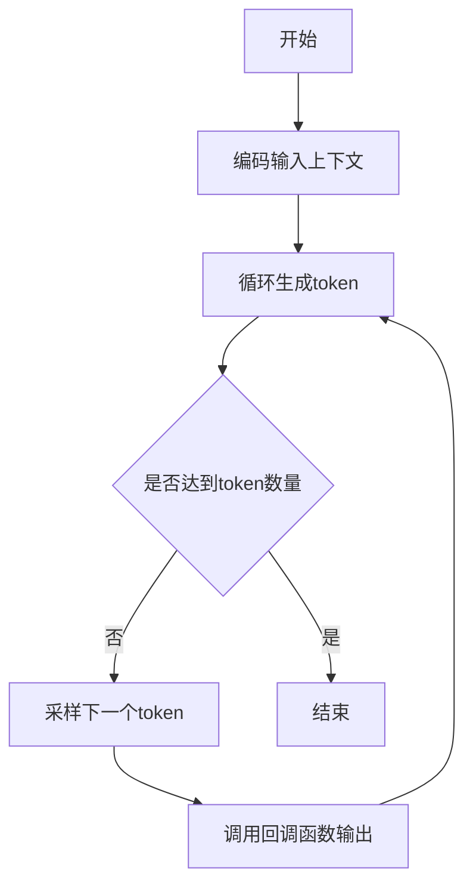

#### 带注释源码

```
pipeline.generate(ctx, token_count=200, args=args, callback=my_print)
# ctx: 输入提示词
# token_count: 生成200个token
# args: 包含temperature、top_p等采样参数的配置对象
# callback: 每生成一个token就调用my_print输出
```

---

### `PIPELINE_ARGS`

生成参数的配置类，封装了各种生成控制参数。

参数：

-  `temperature`：`float`，采样温度，控制随机性（越大越随机）
-  `top_p`：`float`，核采样阈值
-  `top_k`：`int`，top-k采样参数，0表示忽略
-  `alpha_frequency`：`float`，频率惩罚系数
-  `alpha_presence`：`float`，存在惩罚系数
-  `token_ban`：`list`，禁止生成的token列表
-  `token_stop`：`list`，停止生成的token列表
-  `chunk_len`：`int`，输入分块长度，用于节省显存

返回值：配置对象实例

#### 带注释源码

```
args = PIPELINE_ARGS(
    temperature=1.5,      # 较高的温度增加创造性
    top_p=0.3,           # 较保守的核采样
    top_k=0,             # 忽略top_k限制
    alpha_frequency=0.2, # 频率惩罚减少重复词
    alpha_presence=0.2,  # 存在惩罚避免重复概念
    token_ban=[],        # 不禁止任何token
    token_stop=[],       # 不提前停止
    chunk_len=256,       # 分块处理以节省显存
)
```

---

### `PIPELINE.model.forward`

模型前向传播，将token序列输入模型获取logits和状态。

参数：

-  `tokens`：`list[int]`，输入的token ID列表
-  `state`：`optional`，RNN状态（首次调用为None，后续调用传入）

返回值：tuple，元组包含(logits, new_state)

- `logits`：`ndarray`，下一个token的logits分布
- `new_state`：模型内部状态，用于下次调用

#### 流程图

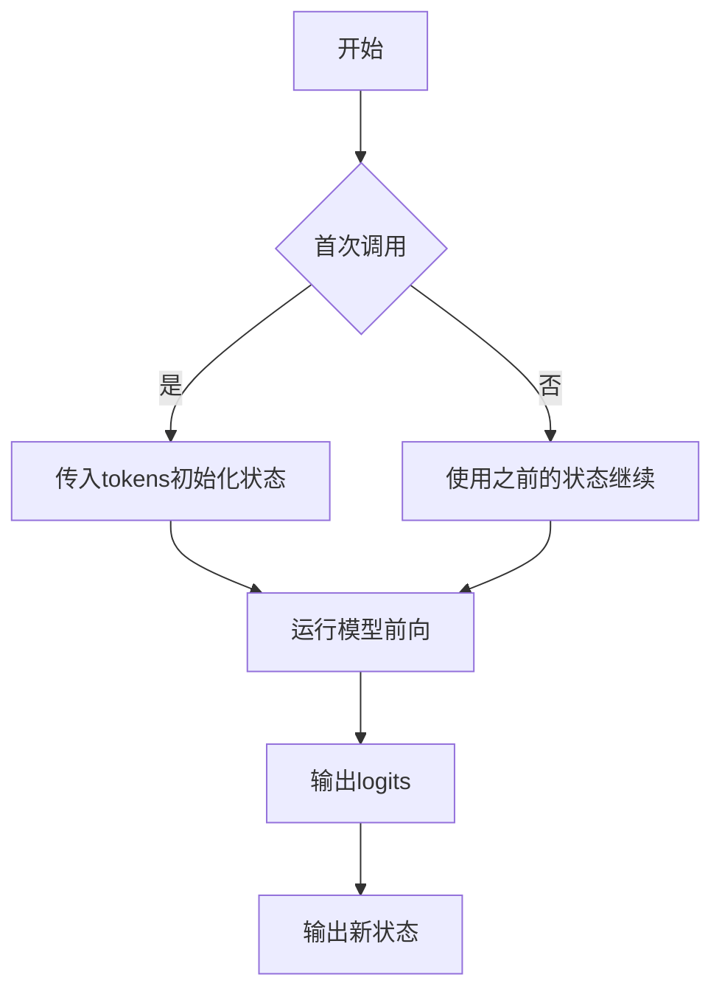

#### 带注释源码

```
out, state = pipeline.model.forward(pipeline.encode(ctx), state)
# pipeline.encode(ctx): 将字符串编码为token ID列表
# state: RNN状态，首次调用为None，后续保持
# out: 返回的logits向量，用于采样下一个token
# state: 返回的新状态，供下一次forward调用使用
```

---

### `PIPELINE.sample_logits`

从logits中采样下一个token，支持温度和核采样。

参数：

-  `logits`：`ndarray`，模型输出的logits向量
-  `temperature`：`float`，采样温度
-  `top_p`：`float`，核采样阈值

返回值：`int`，采样的token ID

#### 带注释源码

```
token = pipeline.sample_logits(out, temperature=1.0, top_p=0.2)
# out: 前向传播得到的logits
# temperature=1.0: 标准温度
# top_p=0.2: 较保守的核采样，只保留累计概率前20%的token
# 返回采样的token ID
```

---

### `PIPELINE.encode`

将字符串编码为token ID列表。

参数：

-  `ctx`：`str`，输入字符串

返回值：`list[int]`，token ID列表

#### 带注释源码

```
pipeline.encode(ctx)
# 输入字符串ctx
# 输出token ID列表，供模型使用
```

---

### `PIPELINE.decode`

将token ID列表解码为字符串。

参数：

-  `tokens`：`list[int]`，token ID列表

返回值：`str`，解码后的字符串

#### 带注释源码

```
tmp = pipeline.decode(out_tokens[out_len:])
# 将新生成的tokens解码为可读字符串
# out_tokens[out_len:]获取自上次处理后的新token
```

---

### `my_qa_generator`

自定义问答生成函数，实现流式输出和重复惩罚的问答系统。

参数：

-  `ctx`：`str`，包含对话历史的上下文字符串

返回值：`str`，生成的完整回答字符串

#### 流程图

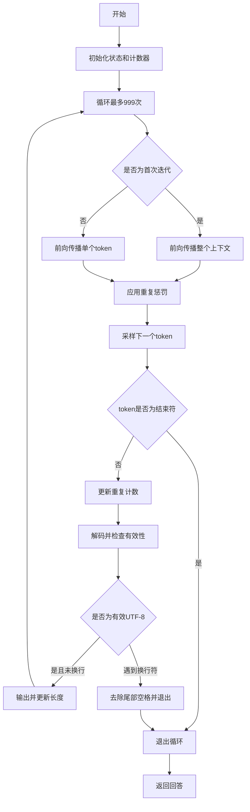

#### 带注释源码

```
def my_qa_generator(ctx):
    out_tokens = []      # 存储所有输出的token
    out_len = 0          # 上次输出的长度
    out_str = ""        # 累积的输出字符串
    occurrence = {}     # token出现次数统计，用于重复惩罚
    state = None        # RNN状态
    for i in range(999):  # 最多生成999个token
        if i == 0:
            # 首次迭代，输入完整上下文
            out, state = pipeline.model.forward(pipeline.encode(ctx), state)
        else:
            # 后续迭代，只输入前一个token
            out, state = pipeline.model.forward([token], state)

        # 对已出现的token施加重复惩罚
        for n in occurrence:
            out[n] -= (0.4 + occurrence[n] * 0.4)

        # 采样下一个token
        token = pipeline.sample_logits(out, temperature=1.0, top_p=0.0)

        # 遇到结束符[0]则停止
        if token == 0:
            break

        out_tokens += [token]

        # 衰减之前的重复计数
        for n in occurrence:
            occurrence[n] *= 0.996
        # 更新当前token的计数
        occurrence[token] = 1 + (occurrence[token] if token in occurrence else 0)

        # 解码并检查有效性
        tmp = pipeline.decode(out_tokens[out_len:])
        # 仅当是有效UTF-8且不是换行结束时才打印
        if ("\ufffd" not in tmp) and (not tmp.endswith("\n")):
            out_str += tmp
            print(tmp, end="", flush=True)
            out_len = i + 1
        elif "\n\n" in tmp:  # 遇到双换行则退出
            tmp = tmp.rstrip()
            out_str += tmp
            print(tmp, end="", flush=True)
            break
    return out_str.strip()
```

---

### `cfg_generator`

实现Classifier-Free Guidance (CFG) 解码的生成函数，通过结合带上下文和不带上下文的输出来引导生成。

参数：

-  `with_ctx`：`str`，带上下文的输入
-  `without_ctx`：`str`，不带上下文的输入（用于CFG）
-  `cfg_factor`：`float`，CFG引导因子，1.0表示无引导

返回值：`str`，生成的完整字符串

#### 流程图

```mermaid
graph TD
    A[开始] --> B[初始化两个状态]
    B --> C[循环最多999次]
    C --> D{是否为首次迭代}
    D -->|是| E[分别前向传播with_ctx和without_ctx]
    D -->|否| F[分别使用前一个token前向传播]
    E --> G[计算CFG组合]
    F --> G
    G --> H[out = with_ctx * cfg_factor + without_ctx * (1-cfg_factor)]
    H --> I[应用重复惩罚]
    I --> J[采样下一个token]
    J --> K{token是否为结束符}
    K -->|是| L[退出循环]
    K -->|否| M[更新重复计数]
    M --> N[解码并检查有效性]
    N --> O{是否为有效输出}
    O -->|是| P[输出并继续]
    O -->|遇到换行符| Q[退出循环]
    P --> C
    Q --> L
    L --> R[返回生成结果]
```

#### 带注释源码

```
def cfg_generator(with_ctx, without_ctx, cfg_factor=1):
    out_tokens = []      # 存储输出token
    out_len = 0          # 上次输出长度
    out_str = ""         # 累积输出
    occurrence = {}      # 重复计数
    with_ctx_state = None    # 带上下文的RNN状态
    without_ctx_state = None # 不带上下文的RNN状态
    
    for i in range(999):
        if i == 0:
            # 首次迭代：分别对两种上下文做前向传播
            with_ctx_out, with_ctx_state = pipeline.model.forward(
                pipeline.encode(with_ctx), with_ctx_state
            )
            without_ctx_out, without_ctx_state = pipeline.model.forward(
                pipeline.encode(without_ctx), without_ctx_state
            )
        else:
            # 后续迭代：使用前一个token继续
            with_ctx_out, with_ctx_state = pipeline.model.forward(
                [token], with_ctx_state
            )
            without_ctx_out, without_ctx_state = pipeline.model.forward(
                [token], without_ctx_state
            )
        
        # CFG解码：混合两个输出
        out = with_ctx_out * cfg_factor + without_ctx_out * (1 - cfg_factor)
        
        # 应用重复惩罚
        for n in occurrence:
            out[n] -= (0.4 + occurrence[n] * 0.4)

        # 采样token
        token = pipeline.sample_logits(out, temperature=1.0, top_p=0.2)

        # 遇到结束符退出
        if token == 0:
            break

        out_tokens += [token]

        # 衰减重复计数并更新
        for n in occurrence:
            occurrence[n] *= 0.996
        occurrence[token] = 1 + (occurrence[token] if token in occurrence else 0)

        # 解码并检查有效性
        tmp = pipeline.decode(out_tokens[out_len:])
        if ("\ufffd" not in tmp) and (not tmp.endswith("\n")):
            out_str += tmp
            print(tmp, end="", flush=True)
            out_len = i + 1
        elif "\n\n" in tmp:
            tmp = tmp.rstrip()
            out_str += tmp
            print(tmp, end="", flush=True)
            break
    return out_str.strip()
```


### `PIPELINE.encode()`

该方法用于将输入文本字符串编码为模型可处理的token ID序列，是RWKV模型进行文本生成和推理的关键预处理步骤。

参数：

-  `text`：`str`，需要编码的输入文本字符串

返回值：`List[int]`，返回编码后的token ID列表（整数列表），可直接传递给模型的forward方法进行处理

#### 流程图

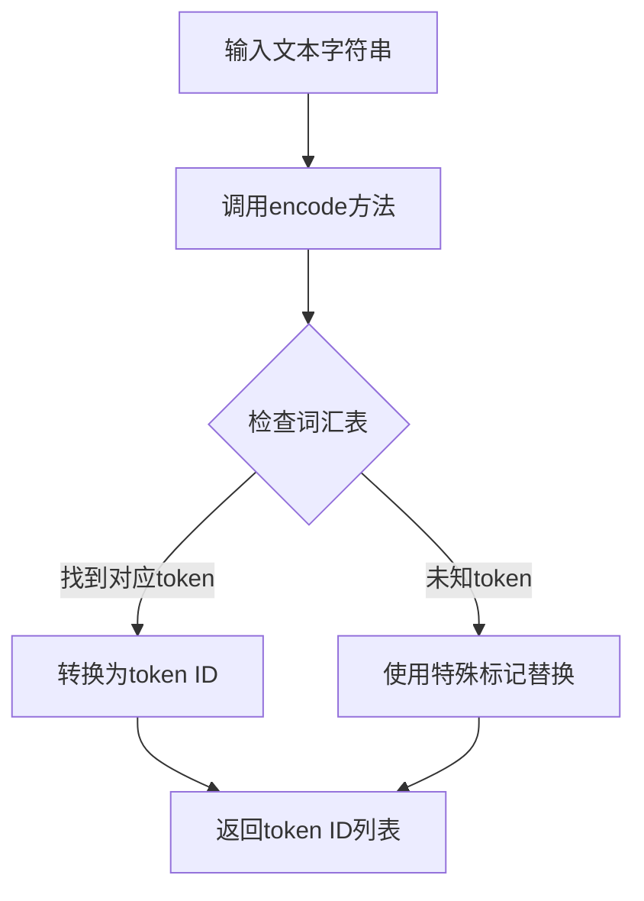

#### 带注释源码

```
# PIPELINE.encode() 方法为 RWKV 模型库的内部方法
# 以下代码基于外部库 rwkv.utils.PIPELINE 的使用方式推断

# 在代码中的实际调用示例：

# 示例1: my_qa_generator 函数中
out, state = pipeline.model.forward(pipeline.encode(ctx), state)
# 参数: ctx - 字符串类型，包含对话上下文
# 返回: token列表，传递给model.forward()

# 示例2: cfg_generator 函数中
with_ctx_out, with_ctx_state = pipeline.model.forward(
    pipeline.encode(with_ctx), with_ctx_state
)
without_ctx_out, without_ctx_state = pipeline.model.forward(
    pipeline.encode(without_ctx), without_ctx_state
)
# 参数: with_ctx/without_ctx - 字符串类型，包含有/无上下文的文本
# 返回: 对应的token列表

# 注意: 实际的encode方法实现位于 rwkv 库中
# 该方法通常包含:
# - 文本预处理（清理空白字符等）
# - 分词（将文本拆分为子词/字符）
# - 词汇表映射（将token转换为对应的ID）
# - 返回token ID列表供模型使用
```


### `PIPELINE.decode`

将模型输出的 token ID 列表解码为人类可读的文本字符串，是 RWKV 模型推理过程中将数值token转换为自然语言的关键方法。

参数：

- `tokens`：`List[int]`，要解码的 token ID 列表，通常是模型新生成的 token 片段

返回值：`str`，解码后的文本字符串

#### 流程图

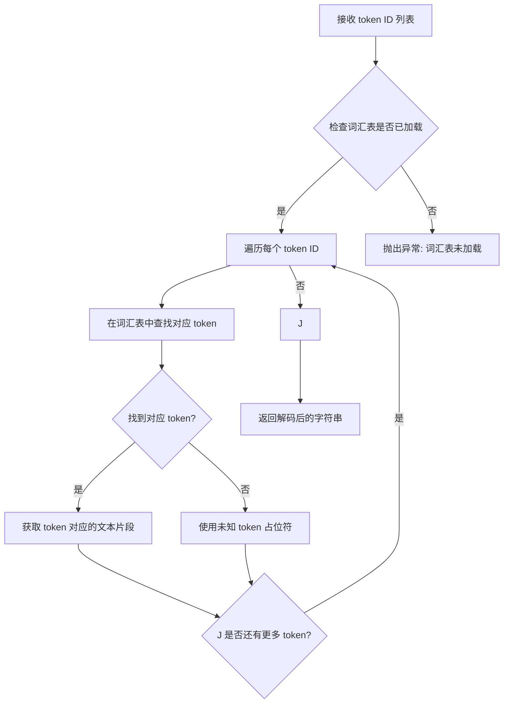

#### 带注释源码

```python
# PIPELINE.decode() 方法源码分析（基于 rwkv 库的实现）
# 以下为调用处的使用示例，展示了 decode 方法的典型使用模式

# 从 pipeline 对象调用 decode 方法
# 参数: out_tokens[out_len:] - 切片获取自上一个位置之后生成的新 token 列表
tmp = pipeline.decode(out_tokens[out_len:])

# decode 方法内部执行以下操作：
# 1. 遍历输入的 token ID 列表
# 2. 使用预加载的词汇表 (rwkv_vocab_v20230424) 将每个 token ID 映射为对应的文本子词
# 3. 将所有子词拼接成一个完整的字符串并返回
#
# 返回值 tmp 是一个字符串，可以直接用于：
# - 打印输出 (print(tmp, end="", flush=True))
# - 字符串拼接 (out_str += tmp)
# - 条件判断 (如检查是否包含特殊字符 "\ufffd" 或换行符)

# 使用示例中的关键逻辑：
if ("\ufffd" not in tmp) and (not tmp.endswith("\n")):
    # 仅当解码结果不包含无效 UTF-8 字符且不是以换行符结尾时
    # 才将其添加到输出字符串并打印
    out_str += tmp
    print(tmp, end="", flush=True)
    out_len = i + 1
elif "\n\n" in tmp:
    # 如果解码结果包含连续换行符，则认为是对话结束标志
    tmp = tmp.rstrip()
    out_str += tmp
    print(tmp, end="", flush=True)
    break
```


### PIPELINE.generate()

该方法用于根据给定的上下文（ctx）和生成参数（args）调用 RWKV 语言模型进行文本生成，并通过回调函数（callback）逐步输出生成的 token，是 RWKV 模型进行文本补全的核心接口。

参数：

-  `ctx`：`str`，输入的上下文字符串，作为语言模型生成的prompt
-  `token_count`：`int`，指定要生成的 token 数量，代码中设置为200
-  `args`：`PIPELINE_ARGS` 对象，包含生成时的各种参数配置，如 temperature、top_p、top_k、alpha_frequency、alpha_presence、token_ban、token_stop、chunk_len 等
-  `callback`：`callable`，回调函数，每生成一个 token 或一批 tokens 时调用，用于处理输出，代码中使用了 `my_print` 函数

返回值：`None`，该方法通过回调函数逐步输出结果，不直接返回值

#### 流程图

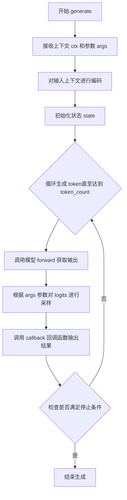

#### 带注释源码

```python
# 调用 PIPELINE.generate() 方法进行文本生成
# 参数说明：
# ctx: 输入的上下文字符串
# token_count: 要生成的 token 数量
# args: PIPELINE_ARGS 对象，包含生成参数
# callback: 回调函数，用于处理生成的输出

pipeline.generate(ctx, token_count=200, args=args, callback=my_print)
```


### PIPELINE.sample_logits()

该方法是 RWKV 模型推理管道中的核心采样函数，负责根据模型输出的 logits（原始未归一化的预测分数）进行采样，以生成下一个 token。采样过程支持 temperature（温度）和 top_p（核采样）两种控制生成多样性的策略。

参数：

- `logits`：`List[float]` 或 `numpy.ndarray`，模型输出的原始预测分数向量，长度对应词汇表大小
- `temperature`：`float`，温度参数，用于缩放 logits 以控制概率分布的平滑程度。值越大，生成越随机；值越小，生成越确定性（默认 1.0）
- `top_p`：`float`，核采样阈值，表示从最高概率累积达到该阈值的最少 tokens 作为采样池。值为 0 时禁用核采样（默认 0.0）

返回值：`int`，返回采样到的下一个 token 的 ID

#### 流程图

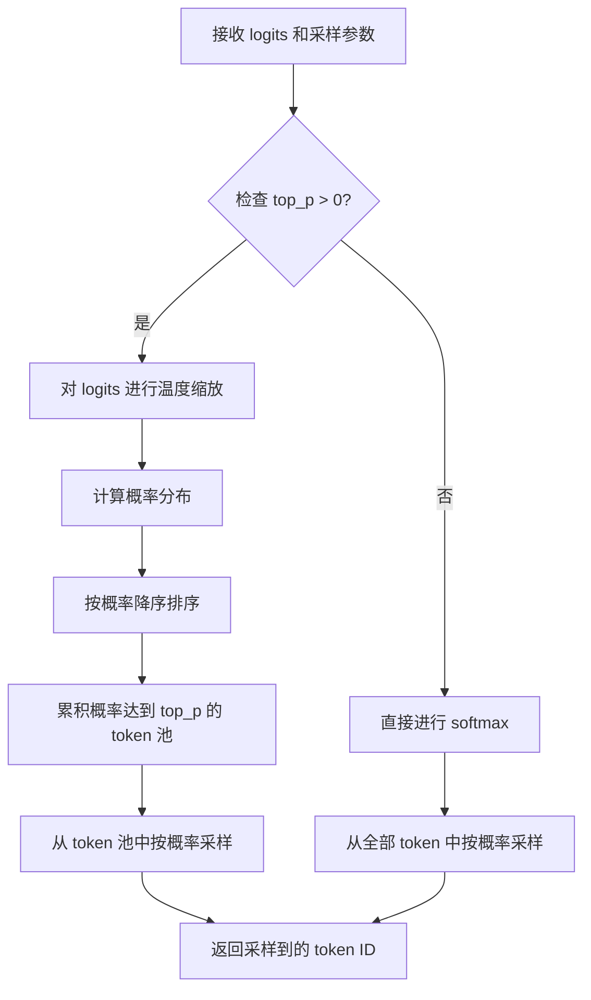

#### 带注释源码

```python
def sample_logits(self, logits, temperature=1.0, top_p=0.0):
    """
    根据模型输出的 logits 进行采样，生成下一个 token
    
    参数:
        logits: 模型输出的原始预测分数（未归一化）
        temperature: 温度参数，控制采样随机性
        top_p: 核采样阈值，控制候选 token 池大小
    
    返回:
        采样到的 token ID
    """
    # 1. 温度缩放：将 logits 除以温度参数
    # 温度越高，概率分布越平滑；温度越低，概率分布越尖锐
    if temperature != 1.0:
        logits = [l / temperature for l in logits]
    
    # 2. 计算 softmax 概率分布
    probs = self.softmax(logits)
    
    # 3. 核采样（Top-p Sampling）
    if top_p > 0:
        # 按概率降序排序
        sorted_indices = sorted(range(len(probs)), key=lambda i: probs[i], reverse=True)
        sorted_probs = [probs[i] for i in sorted_indices]
        
        # 计算累积概率，找到满足 top_p 阈值的最小 token 集合
        cumulative = 0.0
        top_p_indices = []
        for idx, prob in enumerate(sorted_probs):
            cumulative += prob
            top_p_indices.append(sorted_indices[idx])
            if cumulative >= top_p:
                break
        
        # 只从 top_p 集合中采样
        # 将不在集合中的 token 概率设为 0
        filtered_probs = [probs[i] if i in top_p_indices else 0.0 for i in range(len(probs))]
        probs = filtered_probs
    
    # 4. 从概率分布中采样一个 token
    token = self.multinomial_sample(probs)
    
    return token
```

> **注意**：以上源码是基于调用方式的逻辑推断，实际实现可能在 `rwkv` 库的 `utils.py` 模块中。该方法的核心作用是将模型输出的原始分数转换为具体的 token 选择，是文本生成过程中随机性的主要来源。

## 关键组件


### 环境配置

设置RWKV模型运行时的环境变量，包括启用RWKV-7模型、JIT编译和CUDA加速选项。

### RWKV模型加载

使用RWKV类加载预训练模型文件，支持CUDA和FP16策略进行推理加速。

### PIPELINE词管道

PIPELINE类负责模型的编码、解码、采样和生成，提供词表管理和logits采样功能。

### 生成参数配置

PIPELINE_ARGS类定义文本生成的温度、top_p、top_k、频率惩罚、存在惩罚等采样参数。

### 自由生成模式

通过pipeline.generate()方法实现自由文本生成，支持回调函数实时输出和显存优化的chunk分块处理。

### 单轮问答生成器

my_qa_generator函数实现基于上下文的问答生成，包含状态维护、重复惩罚衰减和UTF-8验证的流式输出。

### CFG解码器

cfg_generator函数实现Classifier-Free Guidance解码，通过加权组合带上下文和不带上下文的logits实现引导生成。

### 重复惩罚机制

通过occurrence字典跟踪已生成token的出现次数，动态调整logits以减少重复生成。

### 状态管理

模型推理使用状态变量保存RNN的隐藏状态，支持增量生成和上下文保持。

### 词表管理

使用rwkv_vocab_v20230424词表进行文本与token ID之间的编解码转换。


## 问题及建议


### 已知问题

- **硬编码的模型路径**：模型文件路径直接写死在代码中（`E://RWKV-Runner//models//RWKV-x070-World-1.5B-v3-20250127-ctx4096`），缺乏配置管理机制，导致在不同环境下无法灵活部署
- **环境变量类型错误**：`RWKV_V7_ON`、`RWKV_JIT_ON`、`RWKV_CUDA_ON`设置为字符串"1"而非布尔值True，可能导致判断逻辑失效
- **代码重复严重**：`my_qa_generator`和`cfg_generator`函数中约70%代码重复，包括token采样、重复惩罚计算、输出解码等逻辑
- **Magic Numbers散落**：多处使用硬编码数值（如0.4、0.996、999、0.2、1.5等）且无解释，影响可维护性
- **错误处理缺失**：模型加载、推理过程、文件读取等关键操作均无try-except保护，程序稳定性不足
- **缺少类型注解**：所有函数均无参数和返回值类型声明，不利于静态分析和IDE支持
- **CUDA配置说明不足**：注释提到需要C++编译器和CUDA库才能启用CUDA加速，但未说明具体依赖和安装要求
- **重复的文本预处理**：多次使用`re.sub(r"\n{2,}", "\n", ...).strip().replace("\r\n", "\n")`逻辑，未抽取为公共函数
- **日志记录缺失**：无任何日志输出，运行时行为不可追溯，难以调试和监控
- **变量命名不一致**：如`occurrence`（出现次数记录）命名不够直观，`out_len`和`out_str`含义模糊

### 优化建议

- **配置外部化**：创建config.py或使用环境变量/配置文件管理模型路径、推理参数等，遵循12-Factor App原则
- **抽取公共基类**：将token采样、重复惩罚、解码逻辑抽取为基类或工具函数，消除代码重复
- **定义常量类**：创建Constants类集中管理超参数和magic numbers，配合枚举或dataclass提升可读性
- **添加错误处理**：为模型加载、pipeline调用、文件操作等添加异常捕获和合理提示
- **补充类型注解**：使用Python typing模块为函数添加参数和返回值类型，提升代码可维护性
- **添加日志模块**：引入logging模块替代print，区分debug/info/warning/error级别
- **文档完善**：为关键函数（如`cfg_generator`、`my_qa_generator`）添加docstring，说明算法原理和参数含义
- **性能优化建议**：CUDA_ON设置为0时为CPU模式，官方建议生产环境启用CUDA以获得10倍加速，应提供自动检测和配置说明

## 其它


### 设计目标与约束

本代码的设计目标是演示RWKV语言模型的三种核心文本生成能力：自由生成（free generation）、单轮问答（single-round Q&A）和CFG解码（classifier-free guidance decoding）。约束条件包括：模型文件路径必须有效、需提前配置CUDA环境以获得最佳性能、依赖rwkv库的正确安装。代码设计为演示脚本而非生产级服务，因此未包含完整的错误处理和资源管理机制。

### 错误处理与异常设计

当前代码的错误处理较为基础，主要依赖Python的默认异常抛出。模型加载阶段可能抛出FileNotFoundError（模型文件不存在）、ImportError（rwkv库未安装）和RuntimeError（CUDA初始化失败）。生成阶段可能抛出KeyError（词汇表不匹配）和UnicodeDecodeError（解码异常）。建议添加：模型文件存在性检查、库导入失败时的友好提示、CUDA不可用时的CPU回退机制、生成超时保护。

### 数据流与状态机

代码存在两种主要的数据流模式：第一种是单次前向传播模式（Demo 1），输入文本经过pipeline.encode()编码、model.forward()推理、pipeline.sample_logits()采样、pipeline.decode()解码的线性流程；第二种是自回归生成模式（Demo 2和3），维护state状态进行循环生成，每次迭代输出一个token并更新state和occurrence字典用于重复惩罚。Demo 3额外维护with_ctx和without_ctx两条独立的状态流进行CFG计算。

### 外部依赖与接口契约

核心依赖包括：rwkv.model.RWKV模型类、rwkv.utils.PIPELINE管道类、rwkv.utils.PIPELINE_ARGS参数类。环境变量接口：RWKV_V7_ON（启用v7模型）、RWKV_JIT_ON（启用JIT编译）、RWKV_CUDA_ON（启用CUDA加速）。MODEL_FILE路径为外部配置依赖。PIPELINE_ARGS包含temperature、top_p、top_k、alpha_frequency、alpha_presence、token_ban、token_stop、chunk_len等生成参数。返回值为生成完成的字符串。

### 性能考虑

当前实现存在以下性能优化空间：chunk_len参数在Demo 1中设为256但未在Demo 2和3中使用；重复惩罚计算使用Python字典遍历，可考虑向量化优化；occurrence字典在每次迭代都进行键值更新，长文本生成时可能成为瓶颈；model.forward()每次调用都会创建新的计算图，建议显式管理state以复用计算图。CUDA编译选项RWKV_CUDA_ON设为0，生产环境应设为1以获得约10倍加速。

### 配置管理

配置通过硬编码和os.environ环境变量两种方式管理。模型路径MODEL_FILE为绝对路径，应改为配置读取或命令行参数。PIPELINE_ARGS参数在不同演示中重复定义，可抽取为公共配置对象。策略字符串"cuda fp16"指定了推理设备和精度，应支持运行时配置。词汇表版本"rwkv_vocab_v20230424"与模型版本需匹配。

### 安全性考虑

当前代码存在以下安全风险：模型文件路径直接暴露在代码中；无输入验证机制，ctx参数未做长度限制；无输出过滤机制，token_ban和token_stop的使用不完整；无资源限制，生成循环上限硬编码为999次；无并发控制，多线程环境下state共享可能导致状态错误。生产部署需添加输入长度限制、超时机制和内容过滤。

    