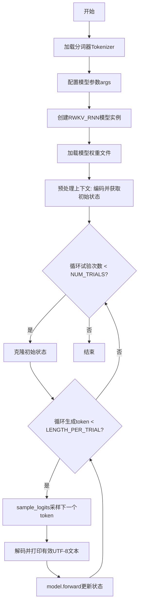
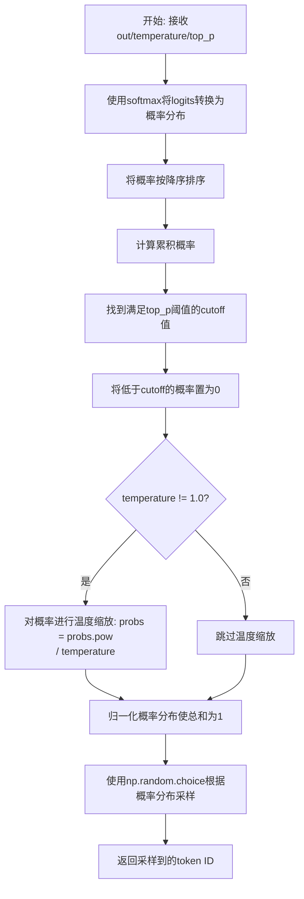
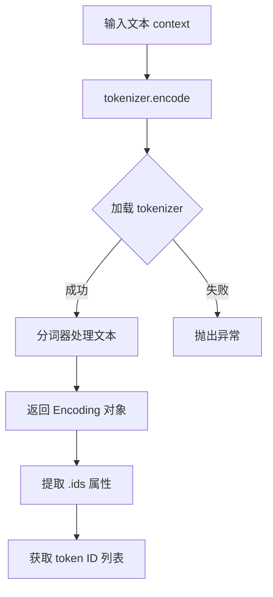
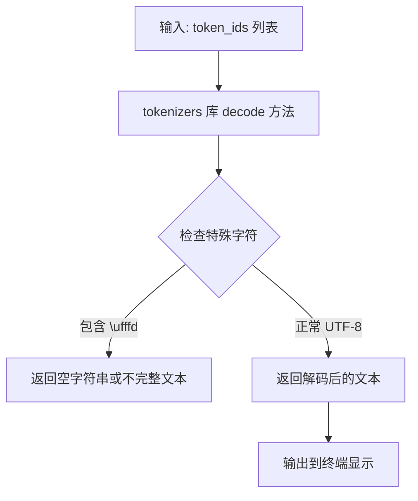
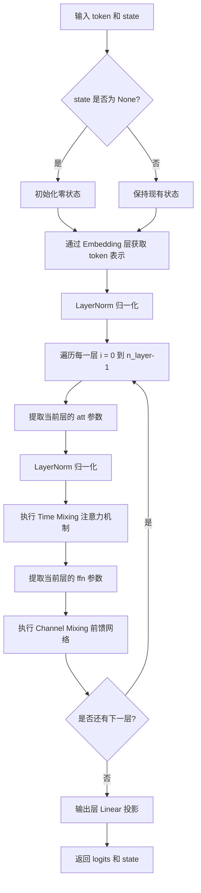

# `ChatRWKV\RWKV_in_150_lines.py` 详细设计文档

这是一个RWKV（Receptance Weighted Key Value）语言模型的推理实现，通过加载预训练模型权重和分词器，对输入上下文进行编码，然后使用时间混合和通道混合机制逐个生成后续token，支持温度采样和top-p采样策略。

## 整体流程



## 类结构

```
RWKV_RNN (torch.jit.ScriptModule)
├── __init__ (构造函数)
├── layer_norm (层归一化)
├── channel_mixing (通道混合方法)
├── time_mixing (时间混合方法)
└── forward (前向传播方法)

Global Functions
└── sample_logits (logits采样函数)
```

## 全局变量及字段


### `tokenizer`
    
分词器对象，用于将文本转换为token id

类型：`Tokenizer`
    


### `args`
    
模型参数命名空间，包含模型配置信息

类型：`SimpleNamespace`
    


### `args.MODEL_NAME`
    
模型文件路径，指向预训练RWKV模型权重文件

类型：`str`
    


### `args.n_layer`
    
模型层数，指定Transformer的层数

类型：`int`
    


### `args.n_embd`
    
嵌入维度，指定词嵌入和隐藏状态的维度

类型：`int`
    


### `context`
    
输入上下文文本，用于引导文本生成

类型：`str`
    


### `NUM_TRIALS`
    
试验次数，指定文本生成的轮数

类型：`int`
    


### `LENGTH_PER_TRIAL`
    
每次试验生成长度，指定每轮生成的token数量

类型：`int`
    


### `TEMPERATURE`
    
采样温度，控制生成文本的随机性

类型：`float`
    


### `TOP_P`
    
top-p采样阈值，用于核采样过滤低概率token

类型：`float`
    


### `model`
    
RWKV_RNN模型实例，用于执行推理

类型：`RWKV_RNN`
    


### `init_state`
    
初始隐藏状态，用于存储RNN的上下文信息

类型：`Tensor`
    


### `init_out`
    
初始输出，表示第一个token的模型输出

类型：`Tensor`
    


### `all_tokens`
    
生成的token列表，存储所有生成的token id

类型：`list[int]`
    


### `out`
    
当前logits输出，表示模型对下一个token的预测分数

类型：`Tensor`
    


### `state`
    
当前隐藏状态，包含模型当前时刻的上下文信息

类型：`Tensor`
    


### `RWKV_RNN.args`
    
模型配置参数，存储模型架构相关信息

类型：`SimpleNamespace`
    


### `RWKV_RNN.w`
    
模型权重容器，以嵌套结构存储所有模型参数

类型：`SimpleNamespace`
    
    

## 全局函数及方法


### `sample_logits`

该函数实现了一种基于温度和Top-P（核采样）的采样策略，用于从语言模型的输出logits中选择下一个token。它首先将logits转换为概率分布，然后根据累积概率阈值过滤低概率词汇，最后通过随机采样确定最终token。

参数：

- `out`：`torch.Tensor`，模型输出的logits向量，通常为最后一层的原始预测值
- `temperature`：`float`，温度参数，用于控制采样的随机性，值越大概率分布越平滑，值越小分布越尖锐，默认为1.0
- `top_p`：`float`，核采样阈值，表示保留累积概率达到该阈值的最少token集合，默认为0.8

返回值：`int`，采样到的token ID

#### 流程图



#### 带注释源码

```python
def sample_logits(out, temperature=1.0, top_p=0.8):
    """
    从模型输出的logits中采样下一个token
    
    参数:
        out: 模型输出的logits向量
        temperature: 温度参数，控制采样随机性
        top_p: 核采样阈值
    返回:
        采样到的token ID
    """
    
    # 步骤1: 将logits通过softmax转换为概率分布
    # 使用PyTorch的softmax沿着最后一个维度计算
    probs = F.softmax(out, dim=-1).numpy()
    
    # 步骤2: 对概率进行降序排序
    # np.sort默认升序，[::-1]实现降序
    sorted_probs = np.sort(probs)[::-1]
    
    # 步骤3: 计算累积概率
    # 用于确定保留哪些高概率token
    cumulative_probs = np.cumsum(sorted_probs)
    
    # 步骤4: 找到cutoff值
    # 找到第一个累积概率超过top_p的位置对应的概率值
    # np.argmax返回第一个True的索引
    cutoff = float(sorted_probs[np.argmax(cumulative_probs > top_p)])
    
    # 步骤5: 过滤低概率token
    # 将低于cutoff的概率置为0
    probs[probs < cutoff] = 0
    
    # 步骤6: 可选的温度缩放
    # 温度 > 1: 使分布更均匀，增加随机性
    # 温度 < 1: 使分布更尖锐，减少随机性
    if temperature != 1.0:
        probs = probs.pow(1.0 / temperature)
    
    # 步骤7: 归一化概率
    # 确保过滤和温度缩放后的概率总和为1
    probs = probs / np.sum(probs)
    
    # 步骤8: 加权随机采样
    # 根据概率分布p随机选择一个索引
    out = np.random.choice(a=len(probs), p=probs)
    
    return out
```


### `tokenizer.encode`

该方法来自 Hugging Face `tokenizers` 库，用于将输入文本字符串转换为对应的 token ID 序列，是 RWKV 模型推理流程的入口点，负责将原始文本转换为模型可处理的离散 token 标识。

参数：

- `text`：`str`，待编码的原始文本字符串，此处传入 `context` 变量

返回值：`Encoding` 对象，包含以下关键属性：

- `ids`：`List[int]`，编码后的 token ID 列表
- `tokens`：`List[str]`，编码后的 token 字符串列表
- `attention_mask`：`List[int]`，注意力掩码（可选）

#### 流程图



#### 带注释源码

```python
# 使用 tokenizers 库加载预训练的 tokenizer
# 20B_tokenizer.json 是针对 20B 语料库训练的词表文件
tokenizer = Tokenizer.from_file("20B_tokenizer.json")

# 待编码的文本内容
context = "\nIn a shocking finding, scientist discovered a herd of dragons living in a remote, previously unexplored valley, in Tibet. Even more surprising to the researchers was the fact that the dragons spoke perfect Chinese."

# 调用 encode 方法进行编码
# 参数: text (str) - 需要编码的原始文本
# 返回: Encoding 对象，包含 ids, tokens, attention_mask 等属性
encoded = tokenizer.encode(context)

# 提取 token IDs 列表用于模型推理
# .ids 属性返回 List[int] 类型的 token ID 序列
token_ids = encoded.ids

# 在主循环中使用：逐个 token 送入模型
for token in token_ids:  # token: int
    init_out, init_state = model.forward(token, init_state)
```

#### 关键细节

| 属性 | 类型 | 描述 |
|------|------|------|
| `encoded.ids` | `List[int]` | 核心输出，模型可直接使用的 token ID 序列 |
| `encoded.tokens` | `List[str]` | 可读性较好的 token 字符串列表 |
| `encoded.offsets` | `List[Tuple[int, int]]` | 每个 token 在原始文本中的位置偏移 |
| `encoded.attention_mask` | `List[int]` | 注意力掩码，用于区分真实 token 与 padding |

#### 技术债务与优化空间

1. **编码性能瓶颈**：代码中使用逐 token 循环处理 (`for token in tokenizer.encode(context).ids`)，在大上下文场景下效率较低，可参考注释中提到的 `v2/rwkv/model.py` 的快速版本
2. **错误处理缺失**：未对 tokenizer 文件加载失败、编码失败等异常情况进行捕获处理
3. **tokenizer 路径硬编码**：`"20B_tokenizer.json"` 为硬编码路径，缺乏灵活性配置


### `tokenizer.decode`

将模型生成的 token ID 列表解码为可读文本字符串的外部方法，属于 Hugging Face `tokenizers` 库。

参数：

-  `token_ids`：`List[int]`，需要解码的 token ID 列表（从 `all_tokens[out_last:]` 切片获取）
-  `skip_special_tokens`：`Optional[bool]`，是否跳过特殊 token，默认为 `False`（代码中未指定）
-  `clean_up_tokenization_spaces`：`Optional[bool]`，是否清理 tokenization 产生的空格，默认为 `True`（代码中未指定）

返回值：`str`，解码后的文本字符串。

#### 流程图



#### 带注释源码

```python
# tokenizer.decode 的调用示例（来自代码第 125 行）
tmp = tokenizer.decode(all_tokens[out_last:])

# 参数说明：
# all_tokens: 模型生成的完整 token 列表
# all_tokens[out_last:]: 从上次输出位置开始的子列表，用于获取新生成的 token
# 返回值 tmp: 解码后的中文字符串

# 使用场景：
# 每次循环生成新 token 后，尝试将新 token 序列解码为文本
# 只有当解码结果不包含 \ufffd（无效 UTF-8 字符）时才打印输出
if '\ufffd' not in tmp:  # only print when we have a valid utf-8 string
    print(tmp, end="", flush=True)
    out_last = i + 1
```

---

### 补充信息

#### 外部依赖与接口契约

| 依赖名称 | 版本 | 用途 |
|---------|------|------|
| `tokenizers` (Hugging Face) | - | Token 编码/解码 |

#### 潜在技术债务

1. **未指定 decode 参数**：代码使用 `tokenizer.decode()` 时未显式传递 `skip_special_tokens` 和 `clean_up_tokenization_spaces` 参数，可能导致不同版本库的默认行为不一致。
2. **错误处理缺失**：未对 `tokenizer.decode` 可能抛出的异常（如文件不存在、编码错误）进行处理。
3. **硬编码路径**：`"20B_tokenizer.json"` 路径硬编码，缺乏灵活性。


### `RWKV_RNN.forward`

该方法是 RWKV（Recurrent Weighted Key-Value）语言模型的核心推理方法，负责处理单个 token 并返回预测的 logits 和更新后的 RNN 状态。它通过 embedding 层获取 token 表示，依次通过多个 transformer 层（每层包含 time mixing 和 channel mixing 机制），最后通过输出头生成预测结果。

参数：

- `self`：隐含的 `RWKV_RNN` 类实例引用
- `token`：`int`，当前输入的 token ID（从词表中）
- `state`：`torch.Tensor` 或 `None`，RNN 的隐藏状态。如果为 `None`，则初始化为零状态

返回值：`tuple`，包含两个元素：

- 第一个元素：`torch.Tensor`，形状为 `[1, n_embd]` 的浮点张量，表示输出 logits（未归一化的预测分数）
- 第二个元素：`torch.Tensor`，更新后的 RNN 状态，用于下一个 token 的计算

#### 流程图



#### 带注释源码

```python
def forward(self, token, state):
    # 使用 no_grad 上下文管理器，禁用梯度计算以提高推理效率
    with torch.no_grad():
        # 如果状态为空，初始化为零状态张量
        # 状态形状为 [n_layer * 5, n_embd]，每层有5个状态向量
        if state == None:
            state = torch.zeros(self.args.n_layer * 5, self.args.n_embd)
            # 将每层的第四个状态向量（pp）初始化为负无穷，用于后续 softmax 计算
            for i in range(self.args.n_layer): state[5*i+4] = -1e30 # -infinity
        
        # 从嵌入矩阵中获取当前 token 的向量表示
        x = self.w.emb.weight[token]
        
        # 第一个 LayerNorm（ln0），用于初始嵌入的归一化
        x = self.layer_norm(x, self.w.blocks[0].ln0)
        
        # 遍历模型的每一层
        for i in range(self.args.n_layer):
            # 获取当前 transformer 块的注意力参数
            att = self.w.blocks[i].att
            
            # 对输入进行 LayerNorm，然后执行 Time Mixing（时间混合注意力机制）
            x = x + self.time_mixing(self.layer_norm(x, self.w.blocks[i].ln1), state, i, 
                att.time_mix_k, att.time_mix_v, att.time_mix_r, att.time_first, att.time_decay, 
                att.key.weight, att.value.weight, att.receptance.weight, att.output.weight)
            
            # 获取当前层的前馈网络参数
            ffn = self.w.blocks[i].ffn
            
            # 执行 Channel Mixing（通道混合前馈网络）
            x = x + self.channel_mixing(self.layer_norm(x, self.w.blocks[i].ln2), state, i, 
                ffn.time_mix_k, ffn.time_mix_r, 
                ffn.key.weight, ffn.value.weight, ffn.receptance.weight)
        
        # 最终输出层：线性投影到词表大小
        # ln_out 是最终的 LayerNorm，head.weight 是输出权重矩阵
        x = self.w.head.weight @ self.layer_norm(x, self.w.ln_out)
        
        # 返回 float 类型的 logits（从 bfloat16/float32 转换）和更新后的状态
        return x.float(), state
```


### `RWKV_RNN.layer_norm`

该方法是 RWKV_RNN 类中的层归一化操作，利用 PyTorch 的 `F.layer_norm` 函数对输入张量进行归一化处理，使用指定的权重和偏置参数。

参数：

- `x`：`torch.Tensor`，需要归一化的输入张量
- `w`：`types.SimpleNamespace`，包含层归一化所需的权重（weight）和偏置（bias）参数

返回值：`torch.Tensor`，返回归一化后的张量

#### 流程图

```mermaid
flowchart TD
    A[输入: x, w] --> B{调用 F.layer_norm}
    B --> C[normalized_shape = (self.args.n_embd,)]
    C --> D[应用权重 weight=w.weight]
    D --> E[应用偏置 bias=w.bias]
    E --> F[输出: 归一化后的张量]
```

#### 带注释源码

```python
def layer_norm(self, x, w):
    """
    对输入张量 x 进行层归一化
    
    参数:
        x: 输入张量，通常是 embeddings 或隐藏状态
        w: 包含 weight 和 bias 属性的 SimpleNamespace 对象，用于归一化的仿射变换
    
    返回:
        归一化后的张量
    """
    # 使用 PyTorch 的 LayerNorm，normalized_shape 设为嵌入维度 n_embd
    # weight 和 bias 来自模型权重，用于仿射变换（可选参数，传入后进行 learnable 变换）
    return F.layer_norm(x, (self.args.n_embd,), weight=w.weight, bias=w.bias)
```


### `RWKV_RNN.channel_mixing`

该方法是RWKV模型中用于处理前馈网络（FFN）通道混合的核心函数，通过时间混合机制结合当前输入与历史状态，使用ReLU平方激活函数进行非线性变换，并通过sigmoid门控机制控制信息流动。

参数：

- `self`：RWKV_RNN类实例，隐式参数
- `x`：`torch.Tensor`，当前层的输入张量
- `state`：`List[torch.Tensor]` 或 `torch.Tensor`，保存层状态的列表，用于存储历史隐藏状态
- `i`：`int`，当前层的索引，用于计算state中的偏移位置
- `time_mix_k`：`torch.Tensor`，用于key的时间混合参数，控制当前输入与历史状态的融合比例
- `time_mix_r`：`torch.Tensor`，用于receptance的时间混合参数，控制当前输入与历史状态的融合比例
- `kw`：`torch.Tensor`，key的权重矩阵，将输入投影到key空间
- `vw`：`torch.Tensor`，value的权重矩阵，将输入投影到value空间
- `rw`：`torch.Tensor`，receptance的权重矩阵，用于计算门控信号

返回值：`torch.Tensor`，经过通道混合处理后的输出张量

#### 流程图

```mermaid
flowchart TD
    A[开始 channel_mixing] --> B[计算 xk: 当前输入与历史状态的加权融合]
    B --> C[计算 xr: 当前输入与历史状态的加权融合]
    C --> D[更新 state[5*i+0] = x 保存当前状态]
    D --> E[计算门控信号 r = sigmoid(rw @ xr)]
    E --> F[计算 k = square(relu(kw @ xk))]
    F --> G[计算输出: r * (vw @ k)]
    G --> H[返回输出张量]
```

#### 带注释源码

```python
@torch.jit.script_method
def channel_mixing(self, x, state, i:int, time_mix_k, time_mix_r, kw, vw, rw):
    # 步骤1: 计算key的时间混合
    # 使用time_mix_k作为线性插值权重，融合当前输入x与历史状态state[5*i+0]
    # 这允许模型在key通道上同时考虑当前信息和历史信息
    xk = x * time_mix_k + state[5*i+0] * (1 - time_mix_k)
    
    # 步骤2: 计算receptance的时间混合
    # 使用time_mix_r作为线性插值权重，融合当前输入与历史状态
    # receptance类似于GRU中的update gate，控制历史信息的保留程度
    xr = x * time_mix_r + state[5*i+0] * (1 - time_mix_r)
    
    # 步骤3: 更新状态
    # 将当前输入x保存到state[5*i+0]位置，供下一时间步使用
    # state数组中每个layer占用5个连续位置: [0]=channel_mixing状态
    state[5*i+0] = x
    
    # 步骤4: 计算门控信号receptance
    # 使用sigmoid函数将receptance权重与xr的点积结果映射到(0,1)区间
    # 这个门控值将决定最终输出中历史信息和当前信息的混合比例
    r = torch.sigmoid(rw @ xr)
    
    # 步骤5: 计算key特征
    # 使用ReLU激活函数引入非线性，然后平方（来自Primer论文的优化）
    # 平方操作可以帮助模型学习更丰富的特征表示
    k = torch.square(torch.relu(kw @ xk)) # square relu, primer paper
    
    # 步骤6: 计算最终输出
    # 将门控信号r与value权重矩阵vw作用后的k相乘
    # 门控机制使得模型可以选择性地使用历史或当前的value信息
    return r * (vw @ k)
```


### `RWKV_RNN.time_mixing`

该方法是 RWKV 模型的核心时间混合（Time Mixing）实现，通过指数移动平均（EMA）机制处理序列数据的长期依赖关系，实现高效的状态传递和上下文感知。

参数：

- `self`：`RWKV_RNN`，RWKV_RNN 类实例本身
- `x`：`torch.Tensor`，当前时间步的输入向量，形状为 `[n_embd]`
- `state`：`torch.Tensor`，模型的状态向量，用于存储历史信息，形状为 `[n_layer * 5, n_embd]`
- `i`：`int`，当前层的索引，用于定位状态向量中的对应位置
- `time_mix_k`：`torch.Tensor`，用于混合输入 x 与状态中历史 k 信息的权重系数
- `time_mix_v`：`torch.Tensor`，用于混合输入 x 与状态中历史 v 信息的权重系数
- `time_mix_r`：`torch.Tensor`，用于混合输入 x 与状态中历史 receptance 信息的权重系数
- `time_first`：`torch.Tensor`，时间衰减的初始偏移量，用于调节早期时间步的注意力
- `time_decay`：`torch.Tensor`，时间衰减系数，控制历史信息的衰减速度
- `kw`：`torch.nn.Linear`，键（Key）权重矩阵，将输入映射到 key 空间
- `vw`：`torch.nn.Linear`，值（Value）权重矩阵，将输入映射到 value 空间
- `rw`：`torch.nn.Linear`，接受度（Receptance）权重矩阵，将输入映射到接受度空间
- `ow`：`torch.nn.Linear`，输出（Output）权重矩阵，将注意力输出映射到最终输出空间

返回值：`torch.Tensor`，经过时间混合和输出变换后的向量，形状为 `[n_embd]`

#### 流程图

```mermaid
flowchart TD
    A[输入 x, state, i 和权重参数] --> B[计算混合输入 xk, xv, xr]
    B --> C[更新状态 state[5*i+1] = x]
    C --> D[计算 r, k, v]
    D --> E[从状态提取 aa, bb, pp]
    E --> F[计算 time_first + k 并进行 softmax 归一化]
    F --> G[计算 wkv = (e1*aa + e2*v) / (e1*bb + e2)]
    G --> H[更新状态 aa, bb, pp]
    H --> I[计算最终输出 ow @ (r * wkv)]
    I --> J[返回输出向量]
    
    subgraph B1 [时间混合计算]
        B1a[xk = x * time_mix_k + state[5*i+1] * 1-time_mix_k]
        B1b[xv = x * time_mix_v + state[5*i+1] * 1-time_mix_v]
        B1c[xr = x * time_mix_r + state[5*i+1] * 1-time_mix_r]
    end
    
    subgraph D1 [线性投影]
        D1a[r = sigmoid(rw @ xr)]
        D1b[k = kw @ xk]
        D1c[v = vw @ xv]
    end
    
    subgraph G1 [WKV 计算]
        G1a[ww = time_first + k]
        G1b[qq = max(pp, ww)]
        G1c[e1 = exp(pp - qq), e2 = exp(ww - qq)]
        G1d[a = e1*aa + e2*v]
        G1e[b = e1*bb + e2]
        G1f[wkv = a / b]
    end
    
    subgraph H1 [状态更新]
        H1a[ww = pp + time_decay]
        H1b[qq = max(ww, k)]
        H1c[e1 = exp(ww - qq), e2 = exp(k - qq)]
        H1d[state[5*i+2] = e1*aa + e2*v]
        H1e[state[5*i+3] = e1*bb + e2]
        H1f[state[5*i+4] = qq]
    end
```

#### 带注释源码

```python
@torch.jit.script_method
def time_mixing(self, x, state, i:int, time_mix_k, time_mix_v, time_mix_r, time_first, time_decay, kw, vw, rw, ow):
    # 步骤1：时间混合 - 将当前输入 x 与历史状态进行线性插值混合
    # xk 用于计算 key，xv 用于计算 value，xr 用于计算 receptance（接受度）
    xk = x * time_mix_k + state[5*i+1] * (1 - time_mix_k)  # 混合当前输入与历史 key 状态
    xv = x * time_mix_v + state[5*i+1] * (1 - time_mix_v)  # 混合当前输入与历史 value 状态
    xr = x * time_mix_r + state[5*i+1] * (1 - time_mix_r)  # 混合当前输入与历史 receptance 状态
    
    # 步骤2：更新状态 - 将当前输入 x 存储到状态向量的对应位置
    state[5*i+1] = x  # 更新位置1：存储当前输入用于下一次计算
    
    # 步骤3：线性投影 - 将混合后的输入通过权重矩阵映射到不同空间
    r = torch.sigmoid(rw @ xr)  # 计算 receptance（接受度），使用 sigmoid 激活函数将值域限制在 (0,1)
    k = kw @ xk  # 通过 key 权重矩阵计算 key 向量
    v = vw @ xv  # 通过 value 权重矩阵计算 value 向量
    
    # 步骤4：从状态中提取历史注意力状态
    # state[5*i+2]: aa - 累积的 value 加权和（分子）
    # state[5*i+3]: bb - 累积的权重和（分母）
    # state[5*i+4]: pp - 累积的最大值（用于数值稳定性）
    aa = state[5*i+2]  # 获取历史累积值 a
    bb = state[5*i+3]  # 获取历史累积值 b
    pp = state[5*i+4]  # 获取历史最大值 p
    
    # 步骤5：计算 time_first 分支的 WKV（Weighted Key-Value）
    # 这是一个特殊的初始化分支，使用 time_first 作为初始偏移量
    ww = time_first + k  # 将初始偏移量与当前 key 相加
    qq = torch.maximum(pp, ww)  # 取最大值用于数值稳定性的 softmax 归一化
    e1 = torch.exp(pp - qq)  # 计算历史状态的权重
    e2 = torch.exp(ww - qq)  # 计算当前状态的权重
    a = e1 * aa + e2 * v  # 加权累积 value
    b = e1 * bb + e2  # 加权累积权重
    wkv = a / b  # 计算 WKV（加权平均的 value）
    
    # 步骤6：更新状态以进行时间衰减传播
    # 将历史信息与当前信息进行衰减混合
    ww = pp + time_decay  # 将衰减因子加到历史最大值上
    qq = torch.maximum(ww, k)  # 取最大值用于数值稳定性
    e1 = torch.exp(ww - qq)  # 计算衰减后的历史权重
    e2 = torch.exp(k - qq)  # 计算当前 key 的权重
    
    # 步骤7：将更新后的状态写回 state 向量
    state[5*i+2] = e1 * aa + e2 * v  # 更新累积 value（包含时间衰减）
    state[5*i+3] = e1 * bb + e2      # 更新累积权重（包含时间衰减）
    state[5*i+4] = qq                # 更新最大值（用于下次计算的数值稳定性）
    
    # 步骤8：计算最终输出
    # 将 receptance (r) 与 WKV 进行元素级相乘，然后通过输出权重矩阵映射
    return ow @ (r * wkv)  # 最终输出向量
```


### `RWKV_RNN.__init__`

该方法是 RWKV 语言模型 RNN 实现的构造函数，负责初始化模型结构、加载预训练权重并将权重转换为适合推理的格式，同时构建嵌套的命名空间结构以便访问。

参数：

- `args`：`types.SimpleNamespace`，包含模型配置参数（如 MODEL_NAME、n_layer、n_embd 等）

返回值：`None`，该方法为构造函数，不返回任何值

#### 流程图

```mermaid
flowchart TD
    A[开始 __init__] --> B[调用父类构造函数 super().__init__]
    B --> C[保存 args 到 self.args]
    C --> D[设置 torch 为推理模式 self.eval]
    E[加载模型权重文件] --> F[遍历权重字典]
    F --> G{检查键名}
    G -->|包含 .time_| H[压缩维度 squeeze]
    G -->|包含 .time_decay| I[应用指数变换 -torch.exp]
    G -->|其他| J[转换为 float32]
    J --> K[创建顶层 SimpleNamespace self.w]
    K --> L[遍历处理后的权重键]
    L --> M[按 '.' 分割键名]
    M --> N{逐层创建嵌套结构}
    N -->|数字索引| O[创建整型索引的 SimpleNamespace]
    N -->|字符串属性| P[创建属性访问的 SimpleNamespace]
    O --> Q[设置最终属性值]
    P --> Q
    Q --> R[返回 self.w 结构]
    R --> S[结束 __init__]
```

#### 带注释源码

```python
def __init__(self, args):
    """
    RWKV RNN 模型初始化构造函数
    
    参数:
        args: 包含模型配置的命名空间对象，必须包含 MODEL_NAME, n_layer, n_embd 等属性
    """
    # 调用父类 torch.jit.ScriptModule 的初始化方法
    super().__init__()
    
    # 保存模型配置参数到实例变量
    self.args = args
    
    # 设置 PyTorch 为推理模式（inference mode）
    # 禁用 dropout 等训练专用操作，优化推理性能
    self.eval() # set torch to inference mode
    
    # 从磁盘加载预训练模型权重文件（PyTorch 字典格式）
    # map_location='cpu' 确保权重加载到 CPU（即使模型训练时用了 GPU）
    w = torch.load(args.MODEL_NAME + '.pth', map_location='cpu')
    
    # 遍历权重字典，对不同类型的权重进行预处理
    for k in w.keys():
        # 时间相关参数（time_*）需要移除批量维度
        if      '.time_' in k: w[k] = w[k].squeeze()
        
        # 时间衰减参数需要取负指数
        # 原始存储的是 log(decay)，实际衰减为 e^{-e^x}
        if '.time_decay' in k: w[k] = -torch.exp(w[k].float())
        
        # 其他所有权重转换为 float32 类型以提高兼容性
        else: w[k] = w[k].float() # convert to f32 type
    
    # 创建顶层命名空间用于组织权重
    self.w = types.SimpleNamespace() # set self.w from w
    self.w.blocks = {}
    
    # 将扁平化的权重字典转换为嵌套的命名空间结构
    # 示例: "blocks.0.att.time_first" => self.w.blocks[0].att.time_first
    for k in w.keys(): 
        # 按 '.' 分割键名得到层级路径
        parts = k.split('.')
        
        # 弹出最后一部分作为最终属性名
        last = parts.pop()
        
        # 从顶层命名空间开始，逐层创建/访问嵌套结构
        here = self.w
        for p in parts:
            if p.isdigit():
                # 数字索引：转换为整数，用于访问 blocks 列表
                p = int(p)
                if p not in here: here[p] = types.SimpleNamespace()
                here = here[p]
            else:
                # 字符串属性：创建或访问子命名空间
                if not hasattr(here, p): setattr(here, p, types.SimpleNamespace())
                here = getattr(here, p)
        
        # 设置最终的权重值到对应的嵌套结构中
        setattr(here, last, w[k])
```


### `RWKV_RNN.layer_norm`

这是RWKV模型中的层归一化（Layer Normalization）实现，使用PyTorch的F.layer_norm函数对输入张量进行归一化处理，支持可学习的权重和偏置参数。

参数：

- `x`：`torch.Tensor`，输入的需要进行归一化的张量
- `w`：`types.SimpleNamespace`，包含`weight`和`bias`属性的命名空间对象，用于层归一化的可学习参数

返回值：`torch.Tensor`，返回经过层归一化处理后的张量

#### 流程图

```mermaid
graph TD
    A[输入 x] --> D[F.layer_norm]
    B[输入 w] --> D
    C[self.args.n_embd] --> D
    D --> E[输出归一化后的张量]
    
    subgraph 详细流程
    D1[获取归一化维度: (self.args.n_embd,)]
    D2[提取权重: w.weight]
    D3[提取偏置: w.bias]
    D1 --> D
    D2 --> D
    D3 --> D
    end
```

#### 带注释源码

```python
def layer_norm(self, x, w):
    """
    对输入张量进行层归一化
    
    参数:
        x: 输入张量
        w: 包含weight和bias的SimpleNamespace对象
    
    返回:
        归一化后的张量
    """
    # 使用PyTorch的layer_norm函数
    # 参数说明:
    #   x: 输入张量
    #   (self.args.n_embd,): 归一化的特征维度大小
    #   weight=w.weight: 可学习的缩放参数
    #   bias=w.bias: 可学习的偏置参数
    return F.layer_norm(x, (self.args.n_embd,), weight=w.weight, bias=w.bias)
```


### `RWKV_RNN.channel_mixing`

该方法是 RWKV 模型中用于处理通道混合（Channel Mixing）的核心函数，采用了类似 GRU 的门控机制，通过时间混合系数融合当前输入与历史状态信息，使用 ReLU 激活和平方操作提取特征，并利用 Sigmoid 门控机制控制信息流动，实现高效的状态更新和特征变换。

参数：

- `self`：RWKV_RNN 类实例，包含模型权重和配置参数
- `x`：`torch.Tensor`，当前层的输入张量，形状为 `[n_embd]`
- `state`：`torch.Tensor`，模型的状态张量，用于存储历史信息，形状为 `[n_layer * 5, n_embd]`
- `i`：`int`，当前层的索引，用于定位状态数组中的位置
- `time_mix_k`：`torch.Tensor`，时间混合系数（用于键值的时间衰减混合），形状为 `[n_embd]`
- `time_mix_r`：`torch.Tensor`，时间混合系数（用于接收门的时间衰减混合），形状为 `[n_embd]`
- `kw`：`torch.nn.Parameter`，键权重矩阵，形状为 `[n_embd, n_embd]`
- `vw`：`torch.nn.Parameter`，值权重矩阵，形状为 `[n_embd, n_embd]`
- `rw`：`torch.nn.Parameter`，接收门权重矩阵，形状为 `[n_embd, n_embd]`

返回值：`torch.Tensor`，通道混合后的输出张量，形状为 `[n_embd]`

#### 流程图

```mermaid
flowchart TD
    A[输入 x, state, i, time_mix_k, time_mix_r, kw, vw, rw] --> B[计算 xk]
    B --> B1[xk = x × time_mix_k + state[5*i+0] × (1 - time_mix_k)]
    
    A --> C[计算 xr]
    C --> C1[xr = x × time_mix_r + state[5*i+0] × (1 - time_mix_r)]
    
    B1 --> D[更新状态]
    D --> D1[state[5*i+0] = x]
    
    C1 --> E[计算接收门 r]
    E --> E1[r = sigmoid(rw @ xr)]
    
    E1 --> F[计算键 k]
    F --> F1[k = relu(kw @ xk)²]
    
    F1 --> G[计算输出]
    G --> H[return r × (vw @ k)]
    
    D1 --> H
```

#### 带注释源码

```python
@torch.jit.script_method
def channel_mixing(self, x, state, i:int, time_mix_k, time_mix_r, kw, vw, rw):
    """
    RWKV 模型的通道混合函数
    
    参数:
        x: 当前输入张量 [n_embd]
        state: 状态张量 [n_layer * 5, n_embd]
        i: 当前层索引
        time_mix_k: 键的时间混合系数
        time_mix_r: 接收门的时间混合系数
        kw: 键权重矩阵
        vw: 值权重矩阵
        rw: 接收门权重矩阵
    
    返回:
        通道混合后的输出张量 [n_embd]
    """
    # 使用时间混合系数混合当前输入 x 和历史状态 state[5*i+0]
    # time_mix_k 控制当前输入的贡献度，(1 - time_mix_k) 控制历史状态的贡献度
    xk = x * time_mix_k + state[5*i+0] * (1 - time_mix_k)
    
    # 同样使用时间混合系数混合当前输入 x 和历史状态
    # 用于计算接收门（receptance）
    xr = x * time_mix_r + state[5*i+0] * (1 - time_mix_r)
    
    # 更新状态：将当前输入 x 存储到状态数组中，供下一时间步使用
    # 状态数组的每个通道存储不同的历史信息，5*i+0 索引存储通道混合的历史状态
    state[5*i+0] = x
    
    # 计算接收门 r：使用 Sigmoid 激活函数将接收门权重与 xr 的矩阵乘积映射到 (0,1) 区间
    # 接收门控制有多少历史信息可以传递到输出
    r = torch.sigmoid(rw @ xr)
    
    # 计算键 k：首先通过键权重矩阵 kw 对 xk 进行线性变换
    # 然后使用 ReLU 激活函数引入非线性
    # 最后使用平方操作（来自 Primer 论文），可以增强特征的表达能力
    k = torch.square(torch.relu(kw @ xk))
    
    # 计算最终输出：接收门 r 与值矩阵 vw 和键 k 的乘积进行逐元素相乘
    # 这种设计使得模型可以选择性地使用历史信息和当前特征
    return r * (vw @ k)
```

#### 技术债务与优化空间

1. **状态管理硬编码**：状态数组使用 `5*i+0` 硬编码索引，缺乏灵活性和可读性，建议使用命名常量或字典明确每个状态槽的用途
2. **矩阵乘法顺序**：代码中使用 `@` 运算符进行矩阵乘法，可考虑使用 `torch.matmul` 以提高可读性和一致性
3. **缺少梯度流说明**：平方操作（`torch.square`）可能导致梯度消失或爆炸问题，需要在文档中明确说明其设计意图
4. **状态复用逻辑**：状态更新和读取交织在一起，没有明确的状态生命周期管理，可能导致状态污染


### `RWKV_RNN.time_mixing`

这是 RWKV 模型中实现时间混合（Time Mixing）机制的核心方法，通过状态向量和可学习的 time mixing 参数来融合当前输入与历史信息，并利用 WKV（Weighted Key Value）计算方式实现高效的时序建模。

参数：

- `self`：RWKV_RNN 类实例本身
- `x`：`torch.Tensor`，当前层的输入隐藏状态向量，维度为 `[n_embd]`
- `state`：`List[torch.Tensor]`，模型维护的状态向量列表，用于保存历史信息，长度为 `n_layer * 5`
- `i`：`int`，当前层的索引，用于计算 state 中的偏移量
- `time_mix_k`：`torch.Tensor`，用于混合键（key）的时间混合权重
- `time_mix_v`：`torch.Tensor`，用于混合值（value）的时间混合权重
- `time_mix_r`：`torch.Tensor`，用于混合接受门（receptance）的时间混合权重
- `time_first`：`torch.Tensor`，时间衰减的初始偏置项
- `time_decay`：`torch.Tensor`，时间衰减系数（负指数形式存储）
- `kw`：`torch.Linear`，键（Key）的线性变换层
- `vw`：`torch.Linear`，值（Value）的线性变换层
- `rw`：`torch.Linear`，接受门（Receptance）的线性变换层
- `ow`：`torch.Linear`，输出（Output）的线性变换层

返回值：`torch.Tensor`，经过时间混合和输出变换后的隐藏状态向量

#### 流程图

```mermaid
flowchart TD
    A[开始 time_mixing] --> B[计算混合后的 xk xr xv]
    B --> C[更新 state[5*i+1] = x]
    C --> D[计算 receptance r = sigmoid(rw @ xr)]
    D --> E[计算 k = kw @ xk, v = vw @ xv]
    E --> F[读取状态 aa=state[5*i+2], bb=state[5*i+3], pp=state[5*i+4]]
    F --> G[计算第一个 WKV: ww = time_first + k]
    G --> H[使用 max-sum-exp 技巧计算 qq, e1, e2]
    H --> I[计算 a = e1*aa + e2*v, b = e1*bb + e2]
    I --> J[wkv = a / b]
    J --> K[更新衰减状态: ww = pp + time_decay]
    K --> L[再次使用 max-sum-exp 计算新的状态]
    L --> M[更新 state[5*i+2], state[5*i+3], state[5*i+4]]
    M --> N[返回 ow @ (r * wkv)]
```

#### 带注释源码

```
@torch.jit.script_method
def time_mixing(self, x, state, i:int, time_mix_k, time_mix_v, time_mix_r, time_first, time_decay, kw, vw, rw, ow):
    # 步骤1: 使用 time mixing 权重混合当前输入 x 和历史状态 state[5*i+1]
    # 这是 RWKV 的核心创新点：可学习的时间信息融合
    xk = x * time_mix_k + state[5*i+1] * (1 - time_mix_k)  # 混合 key
    xv = x * time_mix_v + state[5*i+1] * (1 - time_mix_v)  # 混合 value
    xr = x * time_mix_r + state[5*i+1] * (1 - time_mix_r)  # 混合 receptance
    
    # 步骤2: 更新历史状态，保存当前输入供下一时刻使用
    state[5*i+1] = x
    
    # 步骤3: 计算 receptance 门控，控制历史信息通过的比例
    r = torch.sigmoid(rw @ xr)
    
    # 步骤4: 分别对混合后的输入进行线性变换得到 k, v
    k = kw @ xk  # key 向量
    v = vw @ xv  # value 向量
    
    # 步骤5: 从 state 中读取上一时刻的 WKV 状态
    # aa, bb 保存了历史累积的加权和与权重和
    # pp 保存了上一时刻的最大衰减指数（用于数值稳定性）
    aa = state[5*i+2]
    bb = state[5*i+3]
    pp = state[5*i+4]
    
    # 步骤6: 计算当前时刻的 WKV（使用 time_first 作为初始偏置）
    # 使用 max-sum-exp 技巧避免数值溢出：
    # exp(a) * A + exp(b) * B = exp(max(a,b)) * (exp(a-max)*A + exp(b-max)*B)
    ww = time_first + k
    qq = torch.maximum(pp, ww)  # 找到当前最大值作为新的基准
    e1 = torch.exp(pp - qq)     # 相对指数（相对于最大值）
    e2 = torch.exp(ww - qq)     # 相对指数（相对于最大值）
    a = e1 * aa + e2 * v        # 加权分子
    b = e1 * bb + e2 * 1        # 加权分母
    wkv = a / b                 # 最终 WKV 输出
    
    # 步骤7: 更新衰减状态，为下一时刻做准备
    # 衰减公式：新的衰减 = 上一时刻衰减 + time_decay
    ww = pp + time_decay
    qq = torch.maximum(ww, k)   # 再次使用 max-sum-exp 技巧
    e1 = torch.exp(ww - qq)
    e2 = torch.exp(k - qq)
    
    # 步骤8: 保存更新后的状态到 state 中
    state[5*i+2] = e1 * aa + e2 * v   # 更新累积加权分子
    state[5*i+3] = e1 * bb + e2       # 更新累积加权分母
    state[5*i+4] = qq                 # 更新最大值索引
    
    # 步骤9: 使用输出变换层和 receptance 门控得到最终输出
    # r * wkv 控制了 WKV 信息通过的比例
    return ow @ (r * wkv)
```


### `RWKV_RNN.forward`

该方法是 RWKV 模型的核心推理入口，接收当前 token 和 RNN 状态，计算下一个 token 的 logit 输出并更新 RNN 状态。通过逐层执行时间混合（Time Mixing）注意力机制和通道混合（Channel Mixing）前馈网络，结合层归一化操作，完成整个模型的前向传播过程。

参数：

- `token`：`int`，输入的 token ID，用于从嵌入层获取对应的词向量表示
- `state`：`torch.Tensor` 或 `None`，RNN 状态张量，包含每层的通道状态和时间状态；如果为 `None` 则初始化为零状态

返回值：`tuple`，包含两个元素：

- `torch.Tensor`（shape: `[n_embd]`），下一个 token 的 logit 概率分布（浮点类型），用于采样生成下一个 token
- `torch.Tensor`（shape: `[n_layer * 5, n_embd]`），更新后的 RNN 状态，供下一次前向传播使用

#### 流程图

```mermaid
flowchart TD
    A[开始 forward] --> B{state == None?}
    B -->|是| C[初始化状态张量 zeros<br/>设置 state[5*i+4] = -1e30]
    B -->|否| D[使用已有状态]
    C --> E[获取 token 嵌入向量<br/>x = w.emb.weight[token]]
    D --> E
    E --> F[层归一化 ln0]
    F --> G[遍历每一层 i]
    G --> H[获取 att 权重]
    H --> I[层归一化 ln1]
    I --> J[执行 time_mixing<br/>注意力计算]
    J --> K[获取 ffn 权重]
    K --> L[层归一化 ln2]
    L --> M[执行 channel_mixing<br/>前馈计算]
    M --> N{是否还有更多层?}
    N -->|是| G
    N -->|否| O[层归一化 ln_out]
    O --> P[输出投影<br/>x = w.head.weight @ x]
    P --> Q[返回 logit 和 state]
```

#### 带注释源码

```python
def forward(self, token, state):
    """
    RWKV 模型的前向传播函数
    
    参数:
        token: int - 输入的 token ID
        state: torch.Tensor or None - RNN 状态张量
    
    返回:
        tuple: (logits, new_state)
            - logits: 下一个 token 的 logit 向量 [n_embd]
            - new_state: 更新后的 RNN 状态 [n_layer * 5, n_embd]
    """
    # 禁用梯度计算，推理时使用以提高效率
    with torch.no_grad():
        # 状态初始化：如果 state 为 None，创建全零状态张量
        # 状态形状: [n_layer * 5, n_embd]
        # 每层有 5 个状态：通道状态、时间状态、注意力状态 aa/bb/pp
        if state == None:
            # 初始化为零张量
            state = torch.zeros(self.args.n_layer * 5, self.args.n_embd)
            # 将每层的 pp 状态初始化为负无穷大
            # pp 用于 WKV 计算的 max 缓存，避免数值问题
            for i in range(self.args.n_layer): 
                state[5*i+4] = -1e30 # -infinity
        
        # 1. 嵌入层：从嵌入矩阵中获取当前 token 的向量表示
        x = self.w.emb.weight[token]
        
        # 2. 初始层归一化（Layer 0 的 ln0）
        x = self.layer_norm(x, self.w.blocks[0].ln0)
        
        # 3. 遍历所有 transformer 层
        for i in range(self.args.n_layer):
            # === 注意力层 (Time Mixing) ===
            att = self.w.blocks[i].att
            
            # 对输入进行层归一化
            x_norm = self.layer_norm(x, self.w.blocks[i].ln1)
            
            # 执行时间混合注意力计算
            # 包含: token shift、实时衰减 WKV 计算、输出投影
            x = x + self.time_mixing(
                x_norm, state, i, 
                att.time_mix_k,      # 时间混合权重 k
                att.time_mix_v,      # 时间混合权重 v
                att.time_mix_r,      # 时间混合权重 r
                att.time_first,      # 时间衰减初始值
                att.time_decay,      # 时间衰减系数
                att.key.weight,      # key 投影矩阵
                att.value.weight,    # value 投影矩阵
                att.receptance.weight, # receptance 投影矩阵
                att.output.weight    # 输出投影矩阵
            )
            
            # === 前馈层 (Channel Mixing) ===
            ffn = self.w.blocks[i].ffn
            
            # 对输入进行层归一化
            x_norm = self.layer_norm(x, self.w.blocks[i].ln2)
            
            # 执行通道混合前馈计算
            # 包含: token shift、平方 ReLU 激活、输出投影
            x = x + self.channel_mixing(
                x_norm, state, i, 
                ffn.time_mix_k,      # 时间混合权重 k
                ffn.time_mix_r,      # 时间混合权重 r
                ffn.key.weight,      # key 投影矩阵
                ffn.value.weight,    # value 投影矩阵
                ffn.receptance.weight # receptance 投影矩阵
            )
        
        # 4. 输出投影层
        # 最终层归一化 + 线性投影到词汇表维度
        x = self.w.head.weight @ self.layer_norm(x, self.w.ln_out)
        
        # 5. 返回 logits（转换为 float32）和更新后的状态
        return x.float(), state
```

## 关键组件


### RWKV_RNN 模型类

RWKV循环神经网络的核心实现类，继承自torch.jit.ScriptModule，负责模型权重加载、层归一化、时间混合注意力机制、通道混合前馈网络以及前向推理流程。

### 时间混合机制 (time_mixing)

RWKV模型的核心创新点，实现了基于时间衰减的注意力计算，通过状态(state)维护历史信息，支持token级别的循环推理，避免了传统Transformer的高计算复杂度。

### 通道混合机制 (channel_mixing)

实现前馈网络功能，使用ReLU激活和平方操作（primer paper设计），通过时间混合参数对当前输入和历史状态进行加权融合。

### 层归一化 (layer_norm)

封装PyTorch的F.layer_norm，为模型各层提供标准化操作，确保数值稳定性。

### 采样函数 (sample_logits)

实现带温度调节和top-p nucleus采样的词汇选择策略，根据模型输出的logits生成下一个token，支持多样性和确定性的平衡控制。

### 词表编码器 (tokenizer)

使用HuggingFace tokenizers库加载的BPE分词器，负责原始文本与token id之间的相互转换。

### 模型权重加载与转换

将预训练的.pth权重文件加载到内存，并根据键名特征进行类型转换（时间衰减参数取负指数、权重精度转换为float32），同时将扁平化的权重字典重构为嵌套的SimpleNamespace结构。

### 状态初始化

为每个层初始化5个状态向量，用于存储时间混合注意力机制中的中间计算结果（aa、bb、pp等），其中pp初始值为负无穷以支持正确的衰减计算。

### 推理流程

对输入context进行预处理，逐步更新状态并获取初始输出，然后进入自回归生成循环，每次基于当前logits采样新token并更新状态，直到达到指定长度。


## 问题及建议


### 已知问题

-   **Magic Numbers 缺乏解释**：代码中多处使用 `5*i+0`、`5*i+1` 等魔数（代表状态数组的5个元素），未在注释中说明其含义，降低了可维护性。
-   **动态属性访问效率低**：使用 `types.SimpleNamespace` 和 `getattr`/`setattr` 动态访问权重，而非直接使用 `torch.nn.Module` 的标准参数管理方式，增加了运行时开销。
-   **numpy 与 torch 混用带来性能损耗**：`sample_logits` 函数中将 tensor 转为 numpy 进行采样处理，每次推理都涉及 CPU-GPU 数据迁移（若使用 GPU），引入不必要的开销。
-   **缺少错误处理与输入验证**：模型路径、tokenizer 文件路径硬编码，无文件存在性检查；`tokenizer.encode(context)` 若失败会导致整个程序崩溃。
-   **硬编码配置分散**：模型参数（`n_layer`、`n_embd`）硬编码在 `args` 中，未从模型权重文件中动态读取，若模型文件参数不匹配会导致隐藏 bug。
-   **状态初始化隐式依赖**：`forward` 方法中状态初始化逻辑与模型结构紧密耦合，状态格式（`n_layer * 5`）未在类接口层面显式声明。
-   **缺乏类型提示**：整个代码库无任何类型注解（type hints），不利于静态分析和 IDE 辅助。
-   **重复计算模式**：`channel_mixing` 和 `time_mixing` 中存在相似的状态读写和计算模式，可抽象复用。

### 优化建议

-   **提取常量并添加注释**：将状态数组的结构（如 `5` 代表 att/state/ffn 等）提取为命名常量，并添加注释说明每个索引的含义。
-   **重构为标准 PyTorch 模块**：将权重转换为 `nn.Parameter` 或直接使用 `nn.Linear` 层封装，利用 PyTorch 的自动参数管理，减少动态属性访问。
-   **统一到 torch 采样**：使用 `torch.distributions` 或 `torch.multinomial` 在 GPU/Tensor 上完成采样，避免 tensor-numpy 转换。
-   **添加配置加载与验证**：从模型权重文件中读取 `n_layer`、`n_embd` 等元数据，与代码中的配置进行一致性校验。
-   **完善错误处理**：对文件路径、模型加载、tokenizer 初始化等关键操作添加 try-except 捕获和明确的错误信息。
-   **引入类型提示**：为类方法、全局函数参数添加类型注解，提升代码可读性和可维护性。
-   **状态管理抽象**：将状态初始化逻辑封装为独立方法或在类文档中明确状态格式。


## 其它


### 设计目标与约束

本代码实现RWKV循环语言模型，核心目标是基于给定上下文生成连续文本。设计约束包括：使用CPU进行推理（无GPU优化），模型参数存储于CPU内存，采用FP32精度计算，状态向量维度为n_layer*5*n_embd（24*5*1024=122880），支持的最大生成长度由调用方控制。

### 错误处理与异常设计

代码错误处理机制较为薄弱。主要依赖Python异常传播机制，未进行显式捕获。关键风险点：模型文件加载失败（FileNotFoundError）、tokenizer文件缺失（20B_tokenizer.json）、PyTorch JIT编译失败、状态向量维度不匹配、内存不足。改进建议：添加try-except块捕获文件加载异常，验证state维度合法性，检查tokenizer可用性。

### 数据流与状态机

模型采用有状态循环架构，数据流如下：输入token → Embedding层 → LayerNorm → 循环执行n_layer层（每层包含time_mixing和channel_mixing） → LayerNorm → 输出层。状态机维护两组关键状态：channel_mixing状态（5*i+0位置）和time_mixing状态（5*i+1至5*i+4位置）。每个推理步骤需要传入前一时刻状态，状态在forward方法内就地更新。

### 外部依赖与接口契约

核心依赖包括：torch>=1.9.0、numpy>=1.20.0、tokenizers（huggingface）。模型权重文件（.pth）和tokenizer文件（20B_tokenizer.json）需预先下载并放置于指定路径。接口契约：RWKV_RNN.__init__(args)接受SimpleNamespace对象需包含MODEL_NAME、n_layer、n_embd属性；forward(token, state)输入token为int类型，state为torch.Tensor或None，返回(out_float, state)元组。

### 性能考虑与优化空间

当前实现存在显著性能瓶颈：tokenizer.encode()在主循环外每步调用导致重复计算（代码注释提及"slow version"），建议预计算所有token IDs。模型未启用TorchScript优化（虽然类继承ScriptModule但未充分导出），可考虑将sample_logits移至CUDA加速。channel_mixing和time_mixing的state访问模式（indexed assignment）可能影响缓存效率。

### 安全性考虑

代码无用户输入验证机制，直接使用命令行指定的模型路径存在路径遍历风险。tokenizer.decode()输出未做最终安全过滤（如XSS清理）。模型权重加载无完整性校验。建议添加路径规范化、输入长度限制、输出内容过滤。

### 配置管理

配置硬编码于代码顶部（args对象），包括模型路径、层数、嵌入维度、采样参数。NUM_TRIALS、LENGTH_PER_TRIAL、TEMPERATURE、TOP_P均为可调超参数。缺乏配置文件支持，部署时需修改源码。

### 版本兼容性

代码使用torch.jit.ScriptModule装饰器语法，要求PyTorch 1.9+。numpy随机采样依赖np.random.choice，行为在不同numpy版本间稳定。tokenizers库需与tokenizer文件版本匹配（20B_tokenizer.json）。

### 资源管理

模型加载使用torch.load(map_location='cpu')将权重载入内存，单模型内存占用约1.7GB（430M参数*4字节）。状态向量每步占用约0.5MB。代码未实现模型卸载或内存释放机制，进程终止时资源自动释放。

### 测试考虑

代码缺乏单元测试覆盖。关键测试点：模型加载成功性验证、forward输出维度检查、状态初始化逻辑、sample_logits概率分布有效性、多轮生成一致性。建议添加pytest测试套件验证各模块行为。

### 部署与运维

代码设计为单次加载、多次推理模式。生产部署需考虑：模型预热（首次推理延迟高）、批处理支持缺失、无日志记录机制、无健康检查接口。建议封装为服务进程，添加Prometheus指标导出。


    