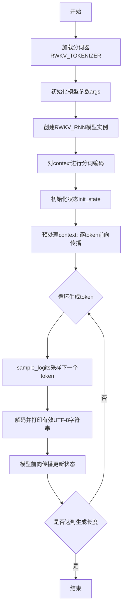
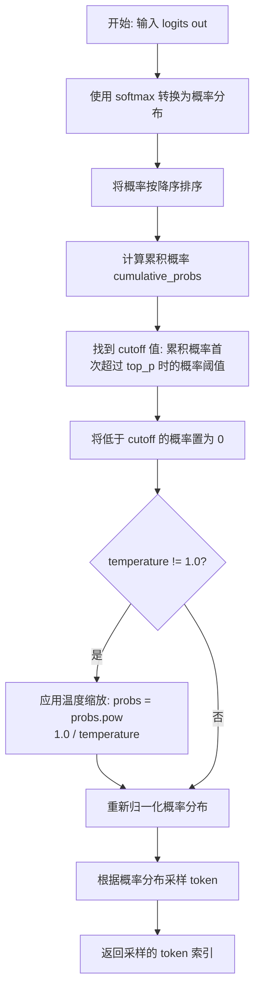
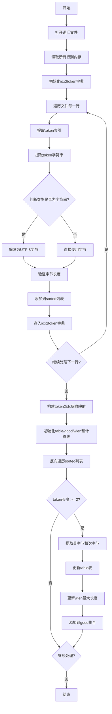
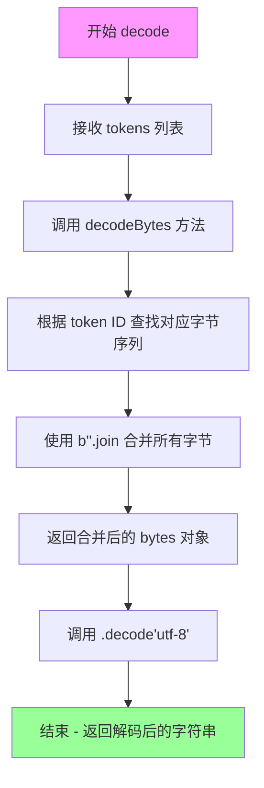
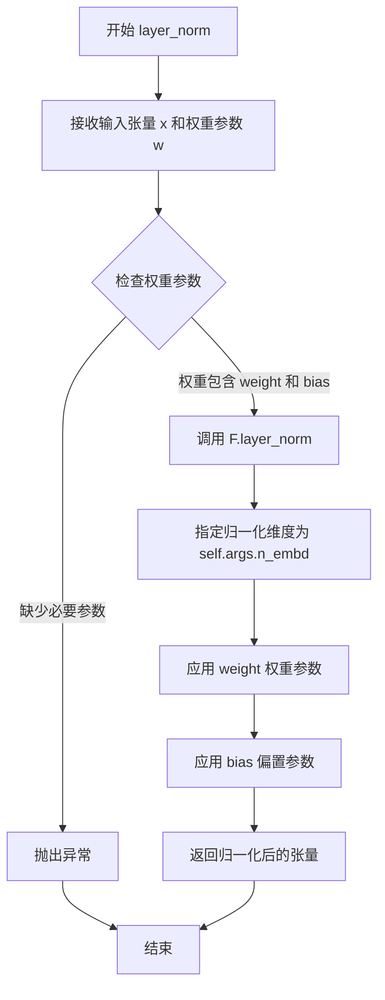
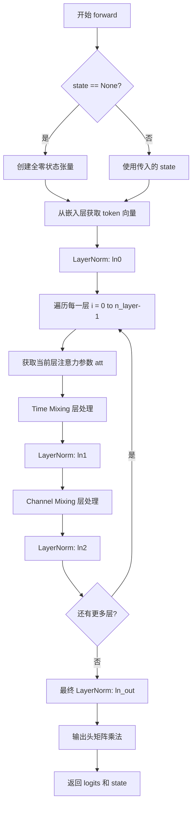

# `ChatRWKV\RWKV_v5_demo.py` 详细设计文档

这是RWKV（Receptance Weighted Key Value）语言模型的实现，包含一个高效的字节级分词器（RWKV_TOKENIZER）和基于RNN架构的推理模型（RWKV_RNN）。RWKV是一种结合了Transformer和RNN优点的的新型语言模型架构，通过time_mixing和channel_mixing机制实现高效的状态传递和文本生成。

## 整体流程



## 类结构

```
RWKV_TOKENIZER (分词器类)
├── 字段: table, good, wlen, idx2token, token2idx
└── 方法: __init__, encodeBytes, decodeBytes, encode, decode, printTokens

RWKV_RNN (RNN模型类)
├── 字段: args, n_head, head_size, w
└── 方法: __init__, layer_norm, channel_mixing, time_mixing, forward

全局函数
└── sample_logits
```

## 全局变量及字段


### `tokenizer`
    
全局分词器实例

类型：`RWKV_TOKENIZER`
    


### `args`
    
模型配置参数对象

类型：`SimpleNamespace`
    


### `args.MODEL_NAME`
    
模型文件路径

类型：`str`
    


### `args.n_layer`
    
层数(24)

类型：`int`
    


### `args.n_embd`
    
嵌入维度(1024)

类型：`int`
    


### `args.vocab_size`
    
词汇表大小(65536)

类型：`int`
    


### `context`
    
输入上下文字符串

类型：`str`
    


### `NUM_TRIALS`
    
生成尝试次数(3)

类型：`int`
    


### `LENGTH_PER_TRIAL`
    
每次生成的token长度(100)

类型：`int`
    


### `TEMPERATURE`
    
采样温度(1.0)

类型：`float`
    


### `TOP_P`
    
nucleus采样阈值(0.7)

类型：`float`
    


### `model`
    
全局模型实例

类型：`RWKV_RNN`
    


### `init_state`
    
初始隐藏状态

类型：`Tensor`
    


### `init_out`
    
初始输出logits

类型：`Tensor`
    


### `all_tokens`
    
累积生成的token列表

类型：`list`
    


### `out`
    
当前输出的logits

类型：`Tensor`
    


### `state`
    
当前隐藏状态

类型：`Tensor`
    


### `RWKV_TOKENIZER.table`
    
用于快速匹配的多级查找表

类型：`list[list[list[bytes]]]`
    


### `RWKV_TOKENIZER.good`
    
记录有效的第二字节起始字符

类型：`list[set[int]]`
    


### `RWKV_TOKENIZER.wlen`
    
记录每个起始字符的最大token长度

类型：`list[int]`
    


### `RWKV_TOKENIZER.idx2token`
    
索引到token字节的映射

类型：`dict`
    


### `RWKV_TOKENIZER.token2idx`
    
token字节到索引的映射

类型：`dict`
    


### `RWKV_RNN.args`
    
模型配置参数，包含MODEL_NAME, n_layer, n_embd, vocab_size

类型：`SimpleNamespace`
    


### `RWKV_RNN.n_head`
    
注意力头数量

类型：`int`
    


### `RWKV_RNN.head_size`
    
每个头的维度大小

类型：`int`
    


### `RWKV_RNN.w`
    
模型权重容器，按块组织

类型：`SimpleNamespace`
    
    

## 全局函数及方法


### `sample_logits`

该函数是 RWKV 模型的语言生成采样函数，负责从模型输出的 logits 中进行采样，支持 temperature（温度）和 top_p（核采样）两种采样策略，以控制生成文本的多样性和随机性。

参数：

- `out`：`torch.Tensor`，模型输出的 logits，通常是原始未归一化的预测分数向量
- `temperature`：`float`，温度参数，用于调整概率分布的平滑度，值越大生成的文本越随机，默认为 1.0
- `top_p`：`float`，核采样（Nucleus Sampling）阈值，保留累积概率达到该阈值的最小 token 集合，默认为 0.8

返回值：`int`，返回根据概率分布采样得到的 token 索引

#### 流程图



#### 带注释源码

```python
def sample_logits(out, temperature=1.0, top_p=0.8):
    """
    从模型输出的 logits 中进行采样，支持 temperature 和 top_p nucleus 采样
    
    参数:
        out: torch.Tensor, 模型输出的 logits (未归一化的预测分数)
        temperature: float, 温度参数，控制采样随机性
        top_p: float, 核采样阈值，保留累积概率达到该值的最小集合
    返回:
        int: 采样的 token 索引
    """
    
    # Step 1: 将 logits 通过 softmax 转换为概率分布，并转为 numpy 数组
    probs = F.softmax(out, dim=-1).numpy()
    
    # Step 2: 按降序排序概率值（从大到小）
    sorted_probs = np.sort(probs)[::-1]
    
    # Step 3: 计算排序后概率的累积和
    cumulative_probs = np.cumsum(sorted_probs)
    
    # Step 4: 找到累积概率首次超过 top_p 的位置，确定截断阈值 cutoff
    # np.argmax 返回第一个满足条件的索引
    cutoff = float(sorted_probs[np.argmax(cumulative_probs > top_p)])
    
    # Step 5: 将概率低于 cutoff 的 token 置零（排除低概率候选）
    probs[probs < cutoff] = 0
    
    # Step 6: 如果设置了温度参数，对概率进行温度缩放
    # 温度 > 1: 使分布更均匀（增加随机性）
    # 温度 < 1: 使分布更尖锐（增加确定性）
    if temperature != 1.0:
        probs = probs.pow(1.0 / temperature)
    
    # Step 7: 重新归一化概率分布（确保总和为 1）
    probs = probs / np.sum(probs)
    
    # Step 8: 根据调整后的概率分布进行随机采样
    # np.random.choice 按概率 p 从 range(len(probs)) 中选择返回一个索引
    out = np.random.choice(a=len(probs), p=probs)
    
    return out
```


### `RWKV_TOKENIZER.__init__`

初始化RWKV分词器，从词汇表文件加载token映射关系，并构建用于快速编码的查找表数据结构。

参数：
- `file_name`：`str`，词汇表文件的路径，文件格式为每行包含索引、空格、token字符串和长度

返回值：`None`，该方法为构造函数，不返回任何值

#### 流程图



#### 带注释源码

```python
def __init__(self, file_name):
    # 初始化索引到token的映射字典
    self.idx2token = {}
    
    # 用于存储排序后的token列表（必须保证文件已排序）
    sorted = []  # must be already sorted
    
    # 打开词汇表文件并读取所有行
    lines = open(file_name, "r", encoding="utf-8").readlines()
    
    # 逐行解析词汇表文件
    for l in lines:
        # 提取行首的token索引（到第一个空格为止）
        idx = int(l[:l.index(' ')])
        
        # 提取token字符串内容（位于第一个和最后一个空格之间）
        x = eval(l[l.index(' '):l.rindex(' ')])
        
        # 如果是字符串则编码为UTF-8字节，否则直接使用字节
        x = x.encode("utf-8") if isinstance(x, str) else x
        
        # 验证token是字节类型
        assert isinstance(x, bytes)
        # 验证token长度与文件记录的长度一致
        assert len(x) == int(l[l.rindex(' '):])
        
        # 添加到排序列表
        sorted += [x]
        # 建立索引到token的映射
        self.idx2token[idx] = x

    # 构建token到索引的反向映射字典
    self.token2idx = {}
    for k, v in self.idx2token.items():
        self.token2idx[v] = int(k)

    # 预计算快速匹配表：table[s0][s1]存储以字节s0,s1开头的所有token
    # good[s0]存储s0后面可以跟的有效字节s1集合
    # wlen[s0]存储以s0开头的token的最大长度
    self.table = [[[] for j in range(256)] for i in range(256)]
    self.good = [set() for i in range(256)]
    self.wlen = [0 for i in range(256)]

    # 反向遍历sorted列表，优先匹配较长的token
    for i in reversed(range(len(sorted))):  # reverse order - match longer tokens first
        s = sorted[i]
        # 只处理长度>=2的token用于双字节前缀查找
        if len(s) >= 2:
            s0 = int(s[0])  # 第一个字节
            s1 = int(s[1])  # 第二个字节
            
            # 将token添加到对应的双字节前缀表中
            self.table[s0][s1] += [s]
            
            # 更新该前缀的最大token长度
            self.wlen[s0] = max(self.wlen[s0], len(s))
            
            # 记录有效的第二字节
            self.good[s0].add(s1)
```


### `RWKV_TOKENIZER.encodeBytes`

将字节序列编码为token索引列表。该方法采用最长匹配策略，通过预计算的查找表（table、good、wlen）快速定位可匹配的token，实现高效的字节到token的转换。

参数：

- `self`：`RWKV_TOKENIZER` 实例，当前tokenizer对象
- `src`：`bytes`，要编码的字节序列输入

返回值：`list[int]`，编码后的token索引列表

#### 流程图

```mermaid
flowchart TD
    A[开始 encodeBytes] --> B[获取输入字节长度 src_len]
    B --> C[初始化 tokens 空列表]
    C --> D[初始化 i = 0]
    D --> E{i < src_len?}
    E -->|否| F[返回 tokens 列表]
    E -->|是| G[提取当前字节 s = src[i:i+1]]
    G --> H{i < src_len - 1?}
    H -->|否| K[将单字节 s 转换为token并添加到 tokens]
    H -->|是| I[获取下一个字节 s1 和当前字节 s0]
    I --> J{s1 in self.good[s0]?}
    J -->|否| K
    J -->|是| L[提取可能匹配的字节段 sss]
    L --> M[从 table[s0][s1] 中查找最长匹配的token]
    M --> N{找到匹配?}
    N -->|是| O[更新 s 为匹配的token]
    N -->|否| K
    O --> K
    K --> P[tokens.append self.token2idx[s]]
    P --> Q[i += len s]
    Q --> D
    
    style A fill:#f9f,color:#000
    style F fill:#9f9,color:#000
```

#### 带注释源码

```python
def encodeBytes(self, src: bytes) -> list[int]:
    """
    将字节序列编码为token索引列表。
    采用最长匹配策略：优先匹配更长的token以获得更好的编码效果。
    
    参数:
        src: 要编码的输入字节序列
    
    返回:
        编码后的token索引列表
    """
    # 获取输入字节序列的长度
    src_len: int = len(src)
    
    # 存储编码结果的token索引列表
    tokens: list[int] = []
    
    # 当前处理位置索引
    i: int = 0
    
    # 遍历整个字节序列
    while i < src_len:
        # 默认提取单字节作为候选token
        s: bytes = src[i : i + 1]

        # 尝试进行最长匹配（需要至少两个字节才能进行匹配优化）
        if i < src_len - 1:
            # 获取下一个字节和当前字节的整数值（0-255）
            s1: int = int(src[i + 1])
            s0: int = int(src[i])
            
            # 检查当前字节是否有对应的有效下一个字节组合
            if s1 in self.good[s0]:
                # 提取从当前位置开始、长度为该字节对应最大token长度的字节段
                sss: bytes = src[i : i + self.wlen[s0]]
                try:
                    # 从预计算的table中查找以sss开头的最长token
                    # table[s0][s1] 存储了所有以(s0,s1)字节对开头的token列表
                    s = next(filter(sss.startswith, self.table[s0][s1]))
                except:
                    # 如果没有找到匹配，保持使用单字节s
                    pass
        
        # 将找到的token字节转换为对应的索引并添加到结果列表
        # token2idx 字典提供了从token字节到索引的快速映射
        tokens.append(self.token2idx[s])
        
        # 根据实际匹配的token长度移动索引
        # 如果匹配到长token，可以一次性跳过多个字节
        i += len(s)

    return tokens
```


### `RWKV_TOKENIZER.decodeBytes`

该方法接收一个token索引列表，通过查表将每个索引映射为对应的字节对象，然后使用 `b''.join()` 将所有字节拼接成一个完整的字节序列并返回。

参数：

- `tokens`：可迭代对象（如 list[int]），要解码的token索引列表

返回值：`bytes`，解码后的字节序列

#### 流程图

```mermaid
flowchart TD
    A[开始 decodeBytes] --> B{检查 tokens 是否为空}
    B -->|是| C[返回空字节 b'']
    B -->|否| D[遍历 tokens 中的每个索引 i]
    D --> E[通过 self.idx2token[i] 查找对应字节]
    E --> F[使用 map 函数将所有索引转换为字节]
    F --> G[使用 b''.join 拼接所有字节]
    G --> H[返回拼接后的字节序列]
```

#### 带注释源码

```python
def decodeBytes(self, tokens):
    """
    将token索引列表解码为字节序列
    
    参数:
        tokens: token索引的列表/可迭代对象
    
    返回:
        拼接后的字节序列
    """
    # 使用 map 对 tokens 中的每个索引 i 执行 lambda 函数
    # lambda i: self.idx2token[i] 表示通过索引查表获取对应的字节
    # b''.join() 将所有字节对象拼接成一个完整的字节序列
    return b''.join(map(lambda i: self.idx2token[i], tokens))
```


### `RWKV_TOKENIZER.encode`

该方法是将输入字符串编码为对应的token索引列表的核心方法，通过将字符串转换为UTF-8字节后调用encodeBytes实现编码功能。

参数：

- `src`：`str`，需要编码的原始字符串

返回值：`list[int]`，返回编码后的token索引列表

#### 流程图

```mermaid
flowchart TD
    A[开始 encode] --> B[src.encode('utf-8')<br/>将字符串转换为UTF-8字节]
    B --> C[调用 encodeBytes 方法]
    C --> D[初始化 src_len 和 tokens]
    E[while i < src_len] --> F{检查是否可匹配更长token}
    F -->|是| G[尝试匹配 table[s0][s1] 中的token]
    G --> H{匹配成功?}
    H -->|是| I[使用匹配的token]
    H -->|否| J[使用单字节token]
    F -->|否| J
    I --> K[tokens.append token2idx[s]]
    J --> K
    K --> L[i += len(s)]
    L --> M{i < src_len?}
    M -->|是| E
    M -->|否| N[返回 tokens 列表]
    O[结束 encodeBytes] --> P[返回 token 索引列表]
```

#### 带注释源码

```
########################################################################################################
# RWKV_TOKENIZER 类的 encode 方法
########################################################################################################

def encode(self, src: str):
    """
    将字符串编码为token索引列表
    
    参数:
        src: str - 要编码的输入字符串
    
    返回:
        list[int] - token索引列表
    """
    # 步骤1: 将字符串编码为UTF-8字节
    # 步骤2: 调用encodeBytes方法处理字节数据
    return self.encodeBytes(src.encode("utf-8"))

########################################################################################################
# 相关的 encodeBytes 方法（完整实现）
########################################################################################################

def encodeBytes(self, src: bytes) -> list[int]:
    """
    将字节序列编码为token索引列表
    
    参数:
        src: bytes - 输入的字节序列
    
    返回:
        list[int] - token索引列表
    """
    src_len: int = len(src)           # 源代码长度
    tokens: list[int] = []            # 存储编码后的token
    i: int = 0                        # 当前处理位置
    
    # 遍历整个字节序列
    while i < src_len:
        s: bytes = src[i : i + 1]     # 默认取单字节
        
        # 尝试匹配更长的token（两个字节开头）
        if i < src_len - 1:
            s1: int = int(src[i + 1]) # 下一个字节
            s0: int = int(src[i])     # 当前字节
            
            # 检查是否存在以这两个字节开头的长token
            if s1 in self.good[s0]:
                # 尝试匹配最长可能长度的token
                sss: bytes = src[i : i + self.wlen[s0]]
                try:
                    # 在table中查找匹配的token
                    s = next(filter(sss.startswith, self.table[s0][s1]))
                except:
                    # 没有找到匹配，保持单字节
                    pass
        
        # 将token转换为索引并添加到列表
        tokens.append(self.token2idx[s])
        i += len(s)                   # 移动到下一个位置
    
    return tokens
```

#### 类属性信息

| 属性名 | 类型 | 描述 |
|--------|------|------|
| `table` | `list[list[list[bytes]]]` | 预计算的查找表，用于快速匹配最长token |
| `good` | `list[set[int]]` | 有效字节对集合，用于快速判断是否存在长token |
| `wlen` | `list[int]]` | 每个起始字节对应的最大token长度 |
| `idx2token` | `dict` | 索引到token字节的映射字典 |
| `token2idx` | `dict` | token字节到索引的映射字典 |

#### 相关全局变量

| 变量名 | 类型 | 描述 |
|--------|------|------|
| `tokenizer` | `RWKV_TOKENIZER` | 全局tokenizer实例，用于文本编码/解码 |

#### 技术债务和优化空间

1. **编码效率**：当前encode方法每次调用都会创建新的字节对象，可以考虑缓存机制
2. **错误处理**：encode方法缺少对无效输入的异常处理（如None值或非UTF-8字符串）
3. **性能优化**：encodeBytes中的异常捕获机制可能影响性能，可考虑使用其他流式处理方式


### `RWKV_TOKENIZER.decode`

将 token 索引列表解码为 UTF-8 字符串。该方法是编码的逆操作，通过 `decodeBytes` 方法将 token 索引转换为原始字节，再使用 UTF-8 编码将字节解码为可读字符串。

参数：

- `self`：`RWKV_TOKENIZER`，Tokenizer 实例，方法的调用者，包含词表和编解码映射关系
- `tokens`：`list[int]` 或 `list`，待解码的 token 索引列表，每个元素为整数类型的 token ID

返回值：`str`，解码后的 UTF-8 字符串

#### 流程图



#### 带注释源码

```python
def decode(self, tokens):
    """
    将 token 索引列表解码为 UTF-8 字符串
    
    参数:
        tokens: list[int] 或 list, 待解码的 token 索引列表
    
    返回:
        str: 解码后的 UTF-8 字符串
    """
    # 步骤1: 调用 decodeBytes 方法将 token 列表转换为字节序列
    # decodeBytes 内部实现: b''.join(map(lambda i: self.idx2token[i], tokens))
    # 即根据每个 token ID 从 idx2token 字典中查找对应的字节数据，然后用空字节连接
    bytes_data = self.decodeBytes(tokens)
    
    # 步骤2: 将字节数据使用 UTF-8 编码解码为字符串
    # 这里可能抛出 UnicodeDecodeError 如果字节序列不是有效的 UTF-8
    return bytes_data.decode('utf-8')
```


### `RWKV_TOKENIZER.printTokens`

该方法用于将token列表转换为对应的文本或字节表示并打印输出，方便调试时查看token序列的具体内容。

参数：

- `tokens`：`list[int]`，要打印的token ID列表

返回值：`None`，该方法无返回值，仅进行打印操作

#### 流程图

```mermaid
flowchart TD
    A[开始 printTokens] --> B[遍历 tokens 列表]
    B --> C{还有更多 token?}
    C -->|是| D[获取 token 对应的字节序列 s = idx2token[i]]
    D --> E{尝试 UTF-8 解码}
    E -->|成功| F[s = 解码后的字符串]
    E -->|失败| G[保持字节序列不变]
    F --> H[打印 repr(s) + token ID]
    G --> H
    H --> C
    C -->|否| I[打印换行符]
    I --> J[结束]
```

#### 带注释源码

```python
def printTokens(self, tokens):
    """
    打印token及其索引，用于调试
    
    参数:
        tokens: list[int], 要打印的token ID列表
    
    返回:
        None, 仅打印输出
    """
    # 遍历传入的每个token ID
    for i in tokens:
        # 通过idx2token字典将token ID转换为对应的字节序列
        s = self.idx2token[i]
        
        # 尝试将字节序列解码为UTF-8字符串
        try:
            s = s.decode('utf-8')
        except:
            # 如果解码失败（如二进制token），保持字节形式
            pass
        
        # 打印token的表示形式和对应的ID
        # repr(s)用于获取安全的字符串表示（处理特殊字符）
        # 格式示例: b'\xe4\xb8\xad'2561 (显示字节) 或 '中'2561 (显示字符)
        print(f'{repr(s)}{i}', end=' ')
        # 备选打印方式（被注释）: print(repr(s), i)
    
    # 打印换行符，结束本次打印
    print()
```


### `RWKV_RNN.__init__`

该方法是 RWKV_RNN 模型的初始化函数，负责加载预训练模型权重、转换数据类型、解析权重结构并初始化模型内部状态。

参数：

- `args`：一个包含模型配置的对象（通常为 `types.SimpleNamespace`），需包含 `MODEL_NAME` 属性指定模型权重文件路径，以及 `n_layer`、`n_embd`、`vocab_size` 等模型结构参数。

返回值：无（`None`），该方法通过修改实例属性完成初始化。

#### 流程图

```mermaid
flowchart TD
    A[__init__ 开始] --> B[调用父类初始化 super().__init__]
    B --> C[保存 args 到 self.args]
    C --> D[设置模型为推理模式 self.eval]
    D --> E[加载模型权重文件 torch.load]
    E --> F[遍历权重字典进行类型转换]
    F --> F1[转换为 float32 类型]
    F --> F2[对 .time_ 开头的权重进行 squeeze]
    F --> F3[对 .time_decay 权重进行 exp 变换]
    F --> F4[对 .time_faaaa 权重进行 unsqueeze]
    F --> G[计算多头数量 n_head 和 head_size]
    G --> H[初始化 self.w 为 SimpleNamespace]
    H --> I[遍历权重键构建层级结构]
    I --> J[__init__ 结束]
    
    style A fill:#f9f,color:#000
    style J fill:#9f9,color:#000
```

#### 带注释源码

```python
def __init__(self, args):
    # 调用父类 nn.Module 的初始化方法
    super().__init__()
    
    # 保存传入的配置参数对象（如 MODEL_NAME, n_layer, n_embd 等）
    self.args = args
    
    # 设置 PyTorch 为推理模式（禁用 dropout 等训练特有操作）
    self.eval() # set torch to inference mode
    
    # 从磁盘加载模型权重文件（.pth 格式），map_location='cpu' 表示将权重加载到 CPU
    w = torch.load(args.MODEL_NAME + '.pth', map_location='cpu')
    
    # 遍历权重字典进行类型转换和形状调整
    for k in w.keys():
        # 将所有权重转换为 float32（FP32）类型以保证计算精度和兼容性
        w[k] = w[k].float() # convert to f32 type
        
        # 对时间相关权重进行 squeeze 操作移除单维度
        if      '.time_' in k: w[k] = w[k].squeeze()
        
        # 对时间衰减权重进行指数变换：exp(-exp(x))，这是 RWKV 独特的衰减机制
        if '.time_decay' in k: w[k] = torch.exp(-torch.exp(w[k])).unsqueeze(-1)
        
        # 对时间首权重进行 unsqueeze 操作扩展维度
        if '.time_faaaa' in k: w[k] = w[k].unsqueeze(-1)

    # 从权重中提取模型结构信息：多头注意力的头数
    self.n_head = w['blocks.0.att.time_decay'].shape[0]
    
    # 计算每个头的维度大小：embedding 维度除以头数
    self.head_size = w['blocks.0.ln1.weight'].shape[0] // self.n_head
    
    # 创建顶层命名空间用于存储权重，替代原本的嵌套字典结构
    self.w = types.SimpleNamespace() # set self.w from w
    self.w.blocks = {}
    
    # 将扁平化的权重键转换为层级属性访问结构
    # 示例："blocks.0.att.time_first" => self.w.blocks[0].att.time_first
    for k in w.keys(): # example: "blocks.0.att.time_first" => self.w.blocks[0].att.time_first
        # 按 "." 分割键名
        parts = k.split('.')
        
        # 取出最后一个部分（实际的权重名）
        last = parts.pop()
        
        # 从根节点开始遍历
        here = self.w
        
        # 遍历中间路径，创建嵌套的 SimpleNamespace
        for p in parts:
            if p.isdigit():
                p = int(p)
                if p not in here: here[p] = types.SimpleNamespace()
                here = here[p]
            else:
                if not hasattr(here, p): setattr(here, p, types.SimpleNamespace())
                here = getattr(here, p)
        
        # 将最终权重值设置为叶子节点的属性
        setattr(here, last, w[k])
```


### `RWKV_RNN.layer_norm`

对输入张量进行层归一化（Layer Normalization）操作，使用 PyTorch 的 `F.layer_norm` 函数对输入进行标准化，并应用可学习的权重和偏置参数进行线性变换。

参数：

- `self`：隐式参数，RWKV_RNN 实例自身
- `x`：`torch.Tensor`，需要进行层归一化的输入张量，通常是嵌入向量或隐藏状态
- `w`：`types.SimpleNamespace`，包含层归一化权重和偏置的对象，需包含 `weight`（权重张量）和 `bias`（偏置张量）属性

返回值：`torch.Tensor`，返回经过层归一化处理后的张量，形状与输入 `x` 相同

#### 流程图



#### 带注释源码

```python
def layer_norm(self, x, w):
    """
    执行层归一化操作（Layer Normalization）
    
    层归一化公式: y = (x - E[x]) / sqrt(Var[x] + eps) * weight + bias
    与批归一化不同，层归一化在特征维度上进行归一化，不依赖于批次大小
    
    参数:
        x: 输入张量，形状为 [batch_size, n_embd] 或 [n_embd]
        w: 包含 weight 和 bias 属性的命名空间对象
           - weight: 可学习的缩放参数，形状为 [n_embd]
           - bias: 可学习的偏移参数，形状为 [n_embd]
    
    返回:
        经过层归一化后的张量，形状与输入相同
    """
    # 使用 PyTorch 的 F.layer_norm 进行层归一化
    # 第一个参数: 输入张量 x
    # 第二个参数: normalized_shape，指定归一化的维度大小，这里使用 n_embd
    # weight: 可学习的缩放系数 gamma
    # bias: 可学习的偏移系数 beta
    return F.layer_norm(x, (self.args.n_embd,), weight=w.weight, bias=w.bias)
```


### `RWKV_RNN.channel_mixing`

通道混合层的前向传播函数，属于 RWKV 架构中的前馈网络（Feed-Forward）部分，通过 time-mixing 机制将当前输入与历史状态进行线性组合，使用 ReLU 平方激活（Primer 论文设计）和 Sigmoid 门控的 receptance 机制实现信息的高效流动与筛选。

参数：

- `x`：`torch.Tensor`，当前层的输入张量，形状为 `[n_embd]`
- `state`：`torch.Tensor`，模型维护的历史状态张量，用于 time-mixing 机制，形状为 `[n_layer * (2+head_size), n_embd]`
- `i`：`int`，当前层的索引，用于从 state 中定位对应的状态位置
- `time_mix_k`：`torch.Tensor`，Key 通道的时间混合系数，控制当前输入与历史状态的混合比例
- `time_mix_r`：`torch.Tensor`，Receptance 通道的时间混合系数，控制历史状态的保留程度
- `kw`：`torch.nn.Linear`，Key 权重矩阵，将输入投影到 key 空间
- `vw`：`torch.nn.Linear`，Value 权重矩阵，将输入投影到 value 空间
- `rw`：`torch.nn.Linear`，Receptance 权重矩阵，将输入投影到门控空间

返回值：`torch.Tensor`，经过通道混合后的输出张量，形状为 `[n_embd]`

#### 流程图

```mermaid
flowchart TD
    A[输入 x, state, i] --> B[计算状态索引 i0 = (2+head_size)*i+0]
    B --> C[xk = x * time_mix_k + state[i0] * (1 - time_mix_k)]
    C --> D[xr = x * time_mix_r + state[i0] * (1 - time_mix_r)]
    D --> E[更新状态 state[i0] = x]
    E --> F[r = sigmoid(rw @ xr)]
    F --> G[k = relu(kw @ xk)²]
    G --> H[输出 = r * (vw @ k)]
    H --> I[返回输出张量]
```

#### 带注释源码

```python
@MyFunction
def channel_mixing(self, x, state, i:int, time_mix_k, time_mix_r, kw, vw, rw):
    # 计算状态索引：每个层占用 (2+head_size) 个状态位置
    # 通道混合使用第一个位置 (偏移0)
    i0 = (2+self.head_size)*i+0
    
    # Time-mixing: 使用线性插值混合当前输入 x 和历史状态 state[i0]
    # time_mix_k 控制当前输入的贡献度，(1-time_mix_k) 控制历史状态的贡献度
    xk = x * time_mix_k + state[i0] * (1 - time_mix_k)
    
    # 同样的 time-mixing 应用于 receptance 通道
    xr = x * time_mix_r + state[i0] * (1 - time_mix_r)
    
    # 更新状态：将当前输入 x 存储到 state 中，供下一时间步使用
    state[i0] = x
    
    # 计算 receptance 门控：使用 sigmoid 函数将输出压缩到 (0,1) 区间
    # receptance 机制允许网络选择性地遗忘历史信息
    r = torch.sigmoid(rw @ xr)
    
    # Key 处理：先线性投影，再使用 ReLU 激活，最后平方
    # 这是 Primer 论文的设计：square(relu(x))
    k = torch.square(torch.relu(kw @ xk))
    
    # 输出：receptance 门控 * value
    # 这种设计使得网络可以学习哪些信息应该被保留/传递
    return r * (vw @ k)
```


### `RWKV_RNN.time_mixing`

时间混合层的前向传播方法，核心包含WKV（Wang-Kovvolgy-Weighted）计算，通过时间衰减机制处理序列数据的注意力计算，实现高效的状态传递和上下文建模。

参数：

- `x`：`torch.Tensor`，输入张量，表示当前 token 的嵌入向量
- `state`：`torch.Tensor`，RNN 状态张量，用于保存上一时刻的隐藏状态
- `i`：`int`，当前层的索引，用于从 state 中提取对应的状态切片
- `time_mix_k`：`torch.Tensor`，用于混合当前输入与历史状态的 K 通道时间混合权重
- `time_mix_v`：`torch.Tensor`，用于混合当前输入与历史状态的 V 通道时间混合权重
- `time_mix_r`：`torch.Tensor`，用于混合当前输入与历史状态的 R（receptance）通道时间混合权重
- `time_mix_g`：`torch.Tensor`，用于混合当前输入与历史状态的 G（gate）通道时间混合权重
- `time_first`：`torch.Tensor`，时间衰减后的首次注意力权重，控制第一时间步的注意力强度
- `time_decay`：`torch.Tensor`，时间衰减系数，控制历史状态随时间的衰减速度
- `kw`：`torch.nn.Linear`，K（Key）权重矩阵，将输入投影到 Key 空间
- `vw`：`torch.nn.Linear`，V（Value）权重矩阵，将输入投影到 Value 空间
- `rw`：`torch.nn.Linear`，R（Receptance）权重矩阵，控制信息 retention 程度
- `gw`：`torch.nn.Linear`，G（Gate）权重矩阵，用于门控机制
- `ow`：`torch.nn.Linear`，O（Output）权重矩阵，将最终输出投影到输出空间
- `ln_w`：`torch.Tensor`，Group Norm 权重，用于输出层的归一化
- `ln_b`：`torch.Tensor`，Group Norm 偏置，用于输出层的归一化

返回值：`torch.Tensor`，经过时间混合层处理后的输出向量

#### 流程图

```mermaid
flowchart TD
    A[输入 x, state, i] --> B[计算索引 i1 = (2+S)*i+1]
    
    B --> C[时间混合: xk, xv, xr, xg]
    C --> D[更新 state[i1] = x]
    
    D --> E[计算 r, k, v, g]
    E --> F[从 state 提取 s]
    
    F --> G[计算 WKV: a = k @ v]
    G --> H[计算 x = r @ (time_first * a + s)]
    H --> I[更新 s = a + time_decay * s]
    
    I --> J[保存 s 到 state]
    J --> K[Group Norm + Gated Output]
    K --> L[输出 ow @ x]
```

#### 带注释源码

```python
@MyFunction
def time_mixing(self, x, state, i:int, time_mix_k, time_mix_v, time_mix_r, time_mix_g, time_first, time_decay, kw, vw, rw, gw, ow, ln_w, ln_b):
    """
    时间混合层的前向传播，包含 WKV 计算
    """
    H = self.n_head      # 注意力头数
    S = self.head_size   # 每个头的维度

    # 计算状态索引：用于访问当前层的状态
    i1 = (2+S)*i+1
    
    # 时间混合：对当前输入 x 和历史状态进行线性插值混合
    # xk: Key 通道的时间混合
    xk = x * time_mix_k + state[i1] * (1 - time_mix_k)
    # xv: Value 通道的时间混合
    xv = x * time_mix_v + state[i1] * (1 - time_mix_v)
    # xr: Receptance 通道的时间混合
    xr = x * time_mix_r + state[i1] * (1 - time_mix_r)
    # xg: Gate 通道的时间混合
    xg = x * time_mix_g + state[i1] * (1 - time_mix_g)
    
    # 更新状态：保存当前输入作为下一时刻的历史状态
    state[i1] = x

    # 投影到多头空间
    r = (rw @ xr).view(H, 1, S)  # Receptance: [H, 1, S]
    k = (kw @ xk).view(H, S, 1)  # Key: [H, S, 1]
    v = (vw @ xv).view(H, 1, S)  # Value: [H, 1, S]
    
    # 门控机制：SiLU 激活函数
    g = F.silu(gw @ xg)

    # 从状态中提取当前层的状态矩阵 s
    # 状态布局: [2+S 个位置 * 层数, n_embd]
    s = state[(2+S)*i+2:(2+S)*(i+1), :].reshape(H, S, S)

    # 初始化输出
    x = torch.zeros(H, S)
    
    # WKV 计算核心
    a = k @ v           # Key-Value 注意力: [H, S, S]
    
    # 融合历史状态 s 和当前注意力 a
    # time_first 控制第一时间步的权重
    x = r @ (time_first * a + s)
    
    # 状态更新：当前注意力 a 加上衰减后的历史状态
    s = a + time_decay * s

    # 保存更新后的状态回 state
    state[(2+S)*i+2:(2+S)*(i+1), :] = s.reshape(S, -1)
    
    # 展平输出
    x = x.flatten()

    # Group Normalization + 门控输出
    # 这里的 group_norm 相当于将输入分为 H 个组进行归一化
    x = F.group_norm(
        x.unsqueeze(0), 
        num_groups=H, 
        weight=ln_w, 
        bias=ln_b, 
        eps=64e-5
    ).squeeze(0) * g
    
    # 最终线性投影
    return ow @ x
```


### `RWKV_RNN.forward`

该方法是 RWKV 语言模型的核心前向传播函数，负责处理单个 token 并返回对应的 logits 输出和更新后的 RNN 状态。模型通过堆叠的 Time Mixing 和 Channel Mixing 层处理输入，结合.layer_norm、注意力机制和前馈网络生成预测结果。

参数：

- `token`：`int`，输入的 token ID，用于从嵌入表中获取对应的词向量
- `state`：`torch.Tensor | None`，RNN 的隐藏状态向量，用于维护序列上下文信息，初始为 None 时自动创建全零状态

返回值：`tuple[torch.Tensor, torch.Tensor]`，返回包含两个元素的元组——第一个是模型输出的 logits（形状为 [vocab_size] 的浮点数张量），第二个是更新后的状态张量（形状为 [n_layer * (2+head_size), n_embd]），供下一个 token 处理使用

#### 流程图



#### 带注释源码

```python
def forward(self, token, state):
    """
    模型前向传播，处理单个 token
    
    参数:
        token: int - 输入的 token ID
        state: torch.Tensor or None - RNN 隐藏状态
    
    返回:
        tuple[torch.Tensor, torch.Tensor] - (logits, state)
    """
    # 使用 torch.no_grad() 禁用梯度计算，节省推理时的内存和计算资源
    with torch.no_grad():
        # 如果 state 为 None，初始化为全零张量
        # 状态张量形状: [n_layer * (2+head_size), n_embd]
        # 其中 2+head_size 包含: channel_mixing状态(1) + time_mixing状态(1+head_size)
        if state == None:
            state = torch.zeros(self.args.n_layer * (2+self.head_size), self.args.n_embd)
        
        # 从嵌入层获取 token 对应的词向量 (形状: [n_embd])
        x = self.w.emb.weight[token]
        
        # 第一个 LayerNorm (ln0)，对嵌入向量进行归一化
        x = self.layer_norm(x, self.w.blocks[0].ln0)
        
        # 遍历所有 transformer 层
        for i in range(self.args.n_layer):
            # 获取当前层的注意力机制参数 (att)
            att = self.w.blocks[i].att
            
            # Time Mixing 层: 处理时间依赖性注意力
            # 包含: key, value, receptance, gate 四个分支的时间混合
            # 使用 time_mix_* 参数进行线性插值混合当前输入和历史状态
            # 输入: x (当前token), state (历史状态), i (层索引)
            # 输出: 注意力机制的残差连接结果
            x = x + self.time_mixing(
                self.layer_norm(x, self.w.blocks[i].ln1),  # 对输入进行 LayerNorm
                state, 
                i, 
                att.time_mix_k,      # key 的时间混合系数
                att.time_mix_v,      # value 的时间混合系数
                att.time_mix_r,      # receptance 的时间混合系数
                att.time_mix_g,      # gate 的时间混合系数
                att.time_faaaa,      # 时间衰减因子 (首)
                att.time_decay,      # 时间衰减因子
                att.key.weight,      # key 权重矩阵
                att.value.weight,    # value 权重矩阵
                att.receptance.weight, # receptance 权重矩阵
                att.gate.weight,     # gate 权重矩阵
                att.output.weight,   # output 权重矩阵
                att.ln_x.weight,     # GroupNorm 权重
                att.ln_x.bias        # GroupNorm 偏置
            )
            
            # 获取当前层的前馈网络参数 (ffn)
            ffn = self.w.blocks[i].ffn
            
            # Channel Mixing 层: 处理通道间的特征变换
            # 包含: key, value, receptance 三个分支
            # 使用 "square relu" 激活函数 (来自 Primer 论文)
            x = x + self.channel_mixing(
                self.layer_norm(x, self.w.blocks[i].ln2),  # 对输入进行 LayerNorm
                state, 
                i, 
                ffn.time_mix_k,      # key 的时间混合系数
                ffn.time_mix_r,      # receptance 的时间混合系数
                ffn.key.weight,      # key 权重矩阵
                ffn.value.weight,    # value 权重矩阵
                ffn.receptance.weight # receptance 权重矩阵
            )
        
        # 最终输出层: 对最后一层输出进行 LayerNorm 后通过线性层
        # 将隐藏维度映射到词汇表大小，得到每个 token 的 logits 分数
        x = self.w.head.weight @ self.layer_norm(x, self.w.ln_out)
        
        # 返回 logits (转换为 float32) 和更新后的 state
        # logits 形状: [vocab_size]
        # state 形状: [n_layer * (2+head_size), n_embd]
        return x.float(), state
```

## 关键组件


### RWKV_TOKENIZER

分词器类，负责将文本编码为token ID以及将token ID解码回文本。内部维护idx2token和token2idx映射表，并预计算table、good、wlen三个查找表以实现高效的字节级匹配，采用逆向遍历实现长token优先匹配。

### sample_logits

采样函数，从模型输出的logits中根据temperature和top_p参数进行采样。支持概率分布的temperature缩放和nucleus采样两种策略，返回采样到的token ID。

### RWKV_RNN

RWKV语言模型的核心RNN实现类，继承自torch.jit.ScriptModule。负责模型权重加载、状态管理和前向推理。包含layer_norm、channel_mixing、time_mixing三个核心方法，实现了RWKV架构的通道混合和时间混合机制。

### channel_mixing

通道混合层方法，接收当前输入x、隐藏状态state、层索引i以及多个时间混合参数和时间线性变换权重。使用time_mix_k和time_mix_r对当前输入和历史状态进行线性插值，再通过receptance和key-value权重矩阵进行变换，实现类似FFN的非线性变换。

### time_mixing

时间混合层方法，实现了RWKV的核心时序建模机制。包含状态读取、Key-Value矩阵乘法、时间衰减计算、状态更新等步骤。使用time_first和time_decay参数控制状态传递，使用group_norm进行归一化，通过gate参数实现门控机制。

### 模型权重处理

权重加载与预处理模块，负责将磁盘上的模型权重文件加载到内存，并进行数据类型转换（转为float32）和特殊参数处理（如time_decay的指数变换、time_*参数的维度调整）。

### 状态管理机制

模型的状态（state）管理模块，负责初始化零状态、根据层索引和头大小计算状态偏移量、在time_mixing和channel_mixing中更新和读取状态。实现了惰性加载，仅在首次调用时创建状态张量。

### 前向传播流程

forward方法实现了模型的整体前向计算流程：嵌入层获取token向量 -> 层归一化 -> 遍历每一层执行time_mixing和channel_mixing -> 输出层归一化 -> 线性变换得到logits。返回当前token的logits和更新后的状态。

### 推理主循环

主程序中的推理循环，负责将上下文编码为token序列、逐token生成新内容。通过sample_logits采样新token，尝试解码并打印有效UTF-8字符串，直至达到指定生成长度。


## 问题及建议


### 已知问题

-   **eval() 安全风险**：在 `RWKV_TOKENIZER.__init__` 中使用 `eval(l[l.index(' '):l.rindex(' ')])` 解析token文件，存在代码注入风险
-   **变量名覆盖内置函数**：使用 `sorted` 作为变量名，会覆盖Python内置的 `sorted()` 函数，可能导致后续代码出现意外行为
-   **魔法数字**：代码中多处使用硬编码数字（如 `64e-5`、`2+self.head_size` 等），缺乏常量定义，降低可读性和可维护性
-   **类型注解不一致**：部分方法有类型注解（如 `encodeBytes`），部分方法缺少类型注解（如 `decodeBytes`、`encode`、`decode`）
-   **TorchScript 使用不完整**：虽然使用了 `@MyFunction` 装饰器，但 `forward` 方法未使用 TorchScript 优化
-   **异常处理过于宽泛**：在 `sample_logits` 中使用 `try-except-pass`，会隐藏潜在的错误
-   **全局状态管理**：tokenizer 作为全局变量，model 也作为全局变量创建，缺乏封装
-   **文件路径硬编码**：模型路径和tokenizer路径直接写在代码中，不利于部署和配置
-   **状态初始化效率低**：每次 `forward` 调用时都检查 `state == None`，可优化为更明确的状态管理
-   **代码重复**：在 `time_mixing` 和 `channel_mixing` 中有类似的 layer_norm 调用模式

### 优化建议

-   **安全性改进**：使用 `ast.literal_eval()` 替代 `eval()`，或使用 JSON 解析器
-   **命名规范**：将 `sorted` 改为 `sorted_tokens` 或 `sorted_list`，避免覆盖内置函数
-   **常量提取**：将所有魔法数字提取为类常量或配置文件
-   **类型注解完善**：为所有公开方法添加完整的类型注解
-   **状态管理优化**：使用 dataclass 或 namedtuple 明确状态结构
-   **异常处理改进**：为 `sample_logits` 添加更具体的异常处理和日志记录
-   **配置管理**：使用配置文件或环境变量管理路径和参数
-   **性能优化**：考虑使用 `torch.jit.script` 优化整个模型，或迁移到 GPU 推理

## 其它


### 设计目标与约束

**设计目标**：实现RWKV（Recurrent Weighted Key Value）语言模型的高效推理，支持RWKV-5 World v2模型，提供tokenizer编码/解码功能和基于RNN架构的文本生成能力。

**主要约束**：
- 使用PyTorch JIT ScriptModule进行性能优化
- 模型权重需转换为float32类型
- 状态向量维度为n_layer * (2+head_size) * n_embd
- 当前版本仅支持CPU推理，未包含GPU加速支持

### 错误处理与异常设计

**异常处理机制**：
1. **Tokenizer部分**：使用assert验证token格式和长度，encodeBytes中使用try-except捕获filter异常
2. **模型加载**：假设模型文件存在且格式正确，缺少文件缺失处理
3. **UTF-8解码**：decodeBytes和decode中未处理解码异常，printTokens中捕获decode异常
4. **生成过程**：try-except捕获tokenizer.decode的异常，避免无效UTF-8字符串导致中断

**潜在问题**：
- 模型文件路径硬编码，缺少文件存在性检查
- 未处理state为None时的初始化边界情况（首次调用）
- 缺少输入token有效性验证

### 数据流与状态机

**数据流向**：
1. 输入文本 → Tokenizer.encode() → token列表
2. token → Model.forward() → 输出logits + 更新后的state
3. logits → sample_logits() → 采样下一个token
4. token → Tokenizer.decode() → 输出的文本

**状态机设计**：
- 初始状态：state = None或torch.zeros初始化
- 每层状态：(2+head_size)个向量块，包含xk/xr/xv/xg混合结果、attention state
- 状态更新：channel_mixing更新state[i0]，time_mixing更新state[i1]和state[2:S+2]
- 状态在token间保持，用于RNN式的序列建模

### 外部依赖与接口契约

**核心依赖**：
- numpy >= 1.x：数值计算
- torch >= 2.0：深度学习框架
- torch.nn：神经网络模块
- torch.nn.functional：F激活函数

**外部资源**：
- tokenizer文件：/fsx/BlinkDL/CODE/_PUBLIC_/ChatRWKV/tokenizer/rwkv_vocab_v20230424.txt
- 模型权重：args.MODEL_NAME + '.pth'

**接口契约**：
- RWKV_TOKENIZER.encode(str) → list[int]：字符串编码为token列表
- RWKV_TOKENIZER.decode(list[int]) → str：token列表解码为字符串
- RWKV_RNN.forward(token, state) → (tensor, state)：单步推理，输入单个token

### 性能特征与优化建议

**当前性能特征**：
- Preprocessing context阶段标记为slow version
- 使用torch.jit.script_method编译核心计算函数
- channel_mixing和time_mixing作为JIT编译函数运行

**优化空间**：
- 移除forward中的torch.no_grad()外的张量克隆操作（init_state.clone()）
- 可考虑使用torch.compile替代jit.script
- 状态缓存机制：避免每次trial重新初始化
- 批量推理支持：当前仅支持单token逐步推理

### 配置参数说明

| 参数名 | 默认值 | 说明 |
|--------|--------|------|
| args.MODEL_NAME | /fsx/BlinkDL/HF-MODEL/temp/RWKV-5-World-0B4-v2-OnlyForTest_71%_trained-20231104-ctx4096 | 模型文件路径 |
| args.n_layer | 24 | Transformer层数 |
| args.n_embd | 1024 | 嵌入维度 |
| args.vocab_size | 65536 | 词汇表大小 |
| NUM_TRIALS | 3 | 生成尝试次数 |
| LENGTH_PER_TRIAL | 100 | 每次生成的长度 |
| TEMPERATURE | 1.0 | 采样温度 |
| TOP_P | 0.7 | 核采样阈值 |

### 安全性考虑

**输入验证缺失**：
- 未验证context字符串编码
- 未检查token是否为有效范围
- 模型文件完整性未校验（md5/sha256）

**潜在风险**：
- 路径注入：模型路径未做安全检查
- 内存安全：大state张量可能导致内存溢出
- 资源消耗：无限循环生成（虽设置了LENGTH_PER_TRIAL限制）

### 版本兼容性说明

**模型版本**：RWKV-5 World v2
- 使用time_faaaa参数（而非旧版的time_first）
- time_decay使用exp(-exp(weight))转换
- 嵌入层使用self.w.emb.weight（非nn.Embedding）

**兼容性限制**：
- 不支持RWKV-4及更早版本
- 不支持非World系列模型
- head_size计算依赖于模型结构，需与实际模型匹配

    