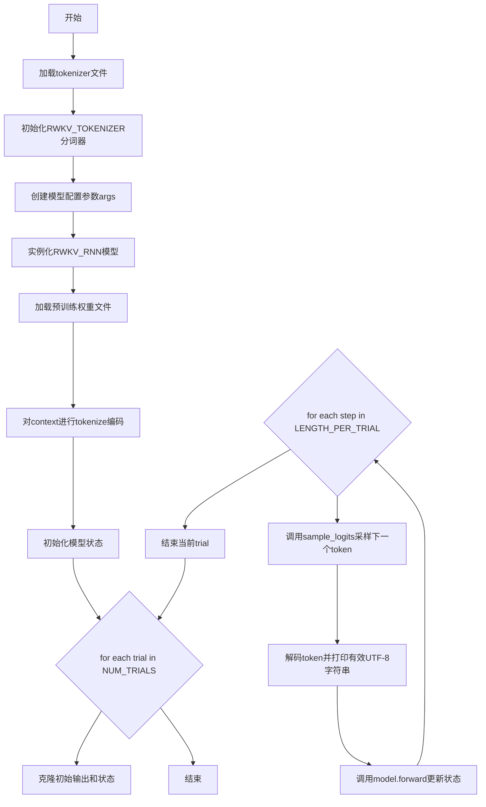
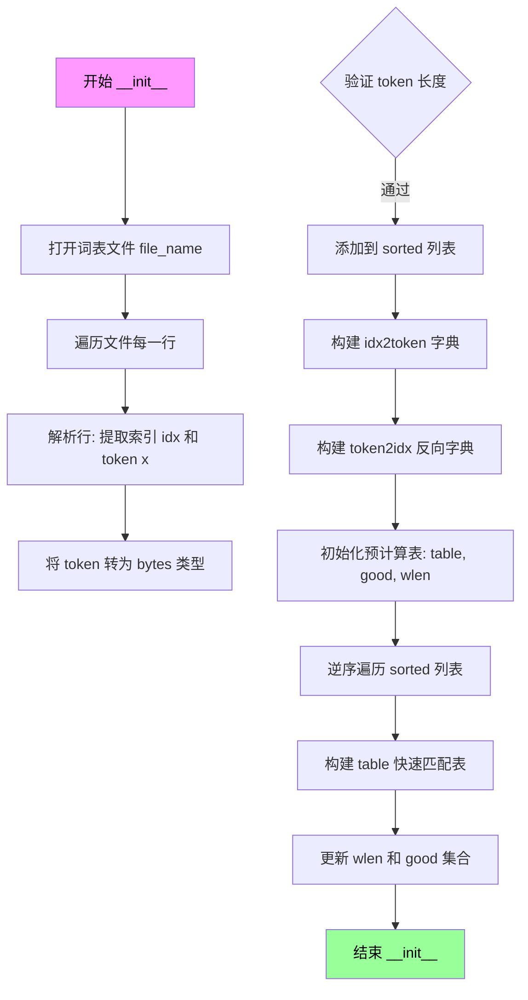
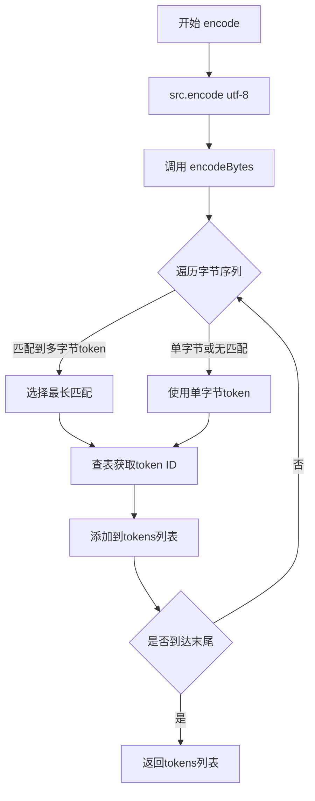
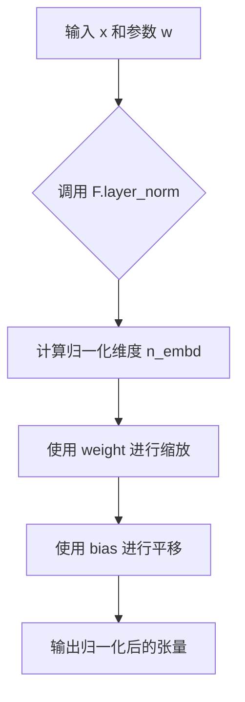
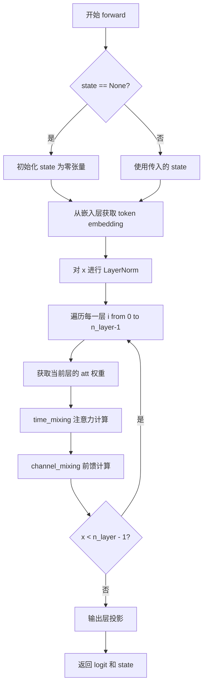

# `ChatRWKV\RWKV_v6_demo.py` 详细设计文档

这是一个RWKV（Receptance Weighted Key Value）语言模型的推理实现，包含自定义分词器、模型加载、时间混合与通道混合层的前向传播逻辑，以及基于温度和top-p采样的文本生成流程。

## 整体流程



## 类结构

```
RWKV_TOKENIZER (分词器类)
├── table: list[list[list[bytes]]]
├── good: list[set[int]]
├── wlen: list[int]
├── idx2token: dict
└── token2idx: dict
RWKV_RNN (PyTorch JIT模块类)
├── args: SimpleNamespace
├── n_head: int
├── head_size: int
└── w: SimpleNamespace (权重命名空间)
```

## 全局变量及字段


### `MyModule`
    
torch.jit.ScriptModule别名，用于创建JIT编译的模块

类型：`torch.jit.ScriptModule`
    


### `MyFunction`
    
torch.jit.script_method装饰器别名，用于JIT编译方法

类型：`torch.jit.script_method`
    


### `tokenizer`
    
RWKV分词器单例实例，用于文本与token的相互转换

类型：`RWKV_TOKENIZER`
    


### `args`
    
模型配置参数命名空间，包含模型名称、层数、嵌入维度、词表大小等

类型：`SimpleNamespace`
    


### `context`
    
输入提示文本，作为语言模型生成的起始上下文

类型：`str`
    


### `NUM_TRIALS`
    
生成试验次数，控制生成文本的轮数

类型：`int`
    


### `LENGTH_PER_TRIAL`
    
每次试验生成token数量，控制每轮生成的长度

类型：`int`
    


### `TEMPERATURE`
    
采样温度参数，控制生成的多样性，值越大越随机

类型：`float`
    


### `TOP_P`
    
nucleus采样阈值，控制候选token的累积概率范围

类型：`float`
    


### `sample_logits`
    
 logits采样函数，根据温度和top_p参数从输出分布中采样token

类型：`function`
    


### `RWKV_TOKENIZER.table`
    
256x256的token查找表，用于快速匹配多字节token

类型：`list[list[list[bytes]]]`
    


### `RWKV_TOKENIZER.good`
    
用于快速匹配的良好字节对集合，过滤无效的字节组合

类型：`list[set[int]]`
    


### `RWKV_TOKENIZER.wlen`
    
每个起始字节对应的最大token长度，用于边界检查

类型：`list[int]`
    


### `RWKV_TOKENIZER.idx2token`
    
token索引到bytes的映射，用于解码

类型：`dict`
    


### `RWKV_TOKENIZER.token2idx`
    
bytes到token索引的映射，用于编码

类型：`dict`
    


### `RWKV_RNN.args`
    
模型配置参数，包含模型结构信息

类型：`SimpleNamespace`
    


### `RWKV_RNN.n_head`
    
注意力头数量，决定并行注意力的数量

类型：`int`
    


### `RWKV_RNN.head_size`
    
每个头的维度大小，影响注意力计算的粒度

类型：`int`
    


### `RWKV_RNN.w`
    
模型权重命名空间，以层级结构组织所有模型参数

类型：`SimpleNamespace`
    
    

## 全局函数及方法


### `sample_logits`

该函数实现了基于温度（Temperature）和 Top-p（Nucleus Sampling）的采样策略，用于从语言模型的logits输出中选择下一个token，支持通过调整温度控制分布的平滑度，以及通过top-p阈值过滤低概率token实现自适应采样。

参数：

- `out`：`torch.Tensor` 或 `numpy.ndarray`，模型输出的原始logits向量（未归一化的分数）
- `temperature`：`float`，温度参数，默认为1.0，值越大概率分布越平滑（增大低概率token的选中机会），值越小分布越尖锐（倾向于选择高概率token）
- `top_p`：`float`，累积概率阈值，默认为0.8，只保留累积概率达到此阈值的最高概率token，其余token概率置零

返回值：`int`，采样的token索引（基于概率分布随机选择）

#### 流程图

```mermaid
flowchart TD
    A[开始 sample_logits] --> B[对out应用softmax得到概率分布]
    B --> C[将概率按降序排序]
    C --> D[计算累积概率数组]
    D --> E[找到第一个累积概率大于top_p的索引]
    E --> F[获取该位置的概率值作为cutoff阈值]
    F --> G[将所有小于cutoff的概率置零]
    G --> H{检查temperature是否等于1.0?}
    H -->|否| I[对概率进行温度缩放: probs = probs^(1/temperature)]
    H -->|是| J[跳过温度缩放]
    I --> K[归一化概率使其总和为1]
    J --> K
    K --> L[使用numpy.random.choice按概率采样]
    L --> M[返回采样的token索引]
```

#### 带注释源码

```python
def sample_logits(out, temperature=1.0, top_p=0.8):
    # 第1步：将模型输出的logits通过softmax转换为概率分布
    # 使用torch.nn.functional.softmax在最后一个维度进行归一化
    # 然后转换为numpy数组以便后续处理
    probs = F.softmax(out, dim=-1).numpy()
    
    # 第2步：对概率进行降序排序（从大到小）
    # np.sort默认升序，[::-1]实现降序排列
    sorted_probs = np.sort(probs)[::-1]
    
    # 第3步：计算累积概率分布
    # cumulative_probs[i] = sum(sorted_probs[0:i+1])
    cumulative_probs = np.cumsum(sorted_probs)
    
    # 第4步：找到累积概率首次超过top_p的阈值
    # np.argmax返回第一个True值的索引
    # 这里找出累积概率刚好超过top_p的概率值作为cutoff
    cutoff = float(sorted_probs[np.argmax(cumulative_probs > top_p)])
    
    # 第5步：将低于cutoff阈值的概率置零（过滤低概率token）
    probs[probs < cutoff] = 0
    
    # 第6步：应用温度缩放（如果temperature不等于1.0）
    # 温度缩放公式: p_i' = p_i^(1/T)
    # T > 1: 分布更平滑（增加多样性）
    # T < 1: 分布更尖锐（增加确定性）
    if temperature != 1.0:
        probs = probs.pow(1.0 / temperature)
    
    # 第7步：再次归一化概率分布（温度缩放后会改变概率总和）
    probs = probs / np.sum(probs)
    
    # 第8步：根据概率分布进行随机采样
    # a=len(probs): 候选token的范围
    # p=probs: 每个token被选中的概率
    out = np.random.choice(a=len(probs), p=probs)
    
    # 返回采样的token索引
    return out
```


### `RWKV_TOKENIZER.__init__`

初始化RWKV分词器，加载词表文件并构建token映射表及快速匹配数据结构，为后续编码/解码操作提供支持。

参数：

- `self`：RWKV_TOKENIZER，RWKV_TOKENIZER类的实例本身
- `file_name`：str，词表文件路径，文件格式为每行包含索引、空格、token字符串（或bytes表示）、空格、token字节长度

返回值：`None`，无返回值（构造函数）

#### 流程图



#### 带注释源码

```python
def __init__(self, file_name):
    # 初始化 idx2token 字典，用于将 token 索引映射到 token 字节数据
    self.idx2token = {}
    
    # 用于存储按长度排序的 token 列表（必须已排序）
    sorted = [] # must be already sorted
    
    # 打开词表文件，读取所有行
    lines = open(file_name, "r", encoding="utf-8").readlines()
    
    # 遍历文件的每一行，解析词表
    for l in lines:
        # 提取行首的索引（第一个空格之前的内容）
        idx = int(l[:l.index(' ')])
        
        # 提取 token 字符串（第一个空格和最后一个空格之间）
        x = eval(l[l.index(' '):l.rindex(' ')])
        
        # 如果是字符串类型则编码为 bytes，否则保持 bytes 类型
        x = x.encode("utf-8") if isinstance(x, str) else x
        
        # 断言确保 token 是 bytes 类型
        assert isinstance(x, bytes)
        
        # 验证 token 长度是否与文件中记录的长度一致
        assert len(x) == int(l[l.rindex(' '):])
        
        # 将 token 添加到 sorted 列表
        sorted += [x]
        
        # 构建 idx2token 映射字典
        self.idx2token[idx] = x

    # 初始化 token2idx 反向映射字典
    self.token2idx = {}
    for k, v in self.idx2token.items():
        self.token2idx[v] = int(k)

    # 预计算一些表格用于快速匹配
    # table[s0][s1] 存储以字节 s0,s1 开头的所有 token 列表
    self.table = [[[] for j in range(256)] for i in range(256)]
    
    # good[s0] 存储 s0 后面可以跟的有效第二个字节集合
    self.good = [set() for i in range(256)]
    
    # wlen[s0] 存储以 s0 开头的 token 的最大长度
    self.wlen = [0 for i in range(256)]

    # 逆序遍历 sorted 列表，优先匹配较长的 token
    for i in reversed(range(len(sorted))): # reverse order - match longer tokens first
        s = sorted[i]
        
        # 只处理长度 >= 2 的 token，构建快速匹配表
        if len(s) >= 2:
            s0 = int(s[0])  # 第一个字节
            s1 = int(s[1])  # 第二个字节
            
            # 将 token 添加到 table[s0][s1] 列表中
            self.table[s0][s1] += [s]
            
            # 更新最大长度
            self.wlen[s0] = max(self.wlen[s0], len(s))
            
            # 记录有效的第二个字节
            self.good[s0].add(s1)
```


### `RWKV_TOKENIZER.encodeBytes`

该方法实现了将原始字节流（bytes）转换为对应的 Token ID 列表的核心功能。它采用基于预计算表（Table）的贪心最长匹配算法：逐字节扫描输入，通过 `good` 集合快速判断是否存在多字节 Token 的可能，若可能则查询 `table` 以找到该位置可匹配的**最长** Token，从而实现高效编码。

参数：

- `self`：类实例，隐含参数，包含词表映射（`token2idx`）和预计算的结构（`table`, `good`, `wlen`）。
- `src`：`bytes`，需要编码的原始字节序列。

返回值：`list[int]`，由 Token ID（整数）组成的列表。

#### 流程图

```mermaid
graph TD
    A([输入: src bytes]) --> B[初始化: i=0, tokens=[], src_len=len(src)]
    B --> C{循环条件: i < src_len}
    C -- Yes --> D[取单字节: s = src[i : i + 1]]
    D --> E{检查 lookahead: i < src_len - 1}
    E -- Yes --> F[s0 = int(src[i]), s1 = int(src[i+1])]
    F --> G{判断: s1 in good[s0]?}
    G -- Yes --> H[预取片段: sss = src[i : i + wlen[s0]]]
    H --> I[查找最长匹配: s = next(filter(sss.startswith, table[s0][s1]))]
    I --> J{是否找到匹配?}
    J -- Yes --> K[更新 s 为匹配到的 Token]
    J -- No --> L[保持 s 为单字节]
    K --> M[添加 Token: tokens.append(token2idx[s])]
    L --> M
    E -- No --> M
    M --> N[更新索引: i += len(s)]
    N --> C
    C -- No --> O([返回: tokens list])
    
    style I fill:#f9f,stroke:#333,stroke-width:2px
    style K fill:#9f9,stroke:#333,stroke-width:2px
```

#### 带注释源码

```python
def encodeBytes(self, src: bytes) -> list[int]:
    src_len: int = len(src)                     # 获取输入字节流的总长度
    tokens: list[int] = []                      # 初始化结果列表
    i: int = 0                                   # 初始化遍历指针

    # 核心循环：遍历整个字节流
    while i < src_len:
        # 默认情况下，优先尝试匹配单字节（作为回退方案）
        s: bytes = src[i : i + 1]

        # 优化：如果当前字节不是最后一个，且存在以当前字节(s0)和下一个字节(s1)开头的 Token
        if i < src_len - 1:
            s1: int = int(src[i + 1])
            s0: int = int(src[i])
            
            # 快速检查：查找表.good[s0]中是否存在s1。如果不存在，说明不可能有超过1字节的匹配，可直接跳过昂贵的查找。
            if s1 in self.good[s0]:
                # 尝试匹配更长的 Token
                # 取出从当前位置开始，最长可能的字节切片（长度由 wlen 决定，这是以 s0 开头所有 Token 的最大长度）
                sss: bytes = src[i : i + self.wlen[s0]]
                
                # 在预计算的 table[s0][s1] 列表中，查找第一个以 sss 为前缀的 Token
                # table[s0][s1] 存储了所有以 s0, s1 字节开头的 Token（已按长度倒序排列，优先匹配长的）
                try:
                    s = next(filter(sss.startswith, self.table[s0][s1]))
                except:
                    # 如果没有找到匹配（filter 返回空），捕获异常并保持 s 为单字节
                    pass
        
        # 将找到的字节序列 s 转换为对应的 ID 并加入列表
        tokens.append(self.token2idx[s])
        
        # 移动指针，移动距离取决于匹配到的 Token 长度（可能是 1 也可能是 >1）
        i += len(s)

    return tokens
```


### `RWKV_TOKENIZER.decodeBytes`

将token列表（整数ID列表）解码为对应的字节序列，这是RWKV分词器的核心反向转换操作，通过查询预构建的idx2token映射表将token ID转换回原始的字节数据。

参数：

- `self`：隐式参数，RWKV_TOKENIZER实例本身，包含idx2token映射表
- `tokens`：`list[int]`，需要解码的token ID列表，每个元素为0到vocab_size-1之间的整数

返回值：`bytes`，解码后的字节序列，由所有token对应的字节拼接而成

#### 流程图

```mermaid
flowchart TD
    A[开始 decodeBytes] --> B{检查tokens是否为空}
    B -->|是| C[返回空字节 b'']
    B -->|否| D[遍历tokens中的每个token_id]
    D --> E[通过idx2token[token_id]获取对应字节]
    E --> F[使用map函数将所有token映射为字节]
    F --> G[使用b''.join拼接所有字节]
    G --> H[返回拼接后的字节序列]
    
    style A fill:#e1f5fe
    style H fill:#e8f5e8
```

#### 带注释源码

```python
def decodeBytes(self, tokens):
    """
    将token列表解码为字节序列
    
    参数:
        tokens: list[int] - token ID列表，每个ID对应一个字节序列
    
    返回:
        bytes - 所有token对应的字节拼接而成的字节序列
    """
    # 使用map函数遍历tokens列表，对每个token_id通过lambda表达式
    # 查询self.idx2token字典获取对应的字节bytes
    # 然后使用b''.join将所有字节拼接成一个完整的字节序列
    return b''.join(map(lambda i: self.idx2token[i], tokens))
```


### `RWKV_TOKENIZER.encode`

将字符串编码为token ID列表，内部调用 `encodeBytes` 方法完成实际的编码工作。

参数：

- `self`：`RWKV_TOKENIZER`，tokenizer实例本身
- `src`：`str`，需要编码的UTF-8字符串

返回值：`list[int]`，编码后的token ID列表

#### 流程图



#### 带注释源码

```python
def encode(self, src: str):
    """
    将字符串编码为token ID列表
    
    参数:
        src: str - 输入的UTF-8字符串
    
    返回:
        list[int] - token ID列表
    """
    # 1. 将字符串编码为UTF-8字节序列
    # 2. 调用encodeBytes方法进行实际的token编码
    # 3. 返回token ID列表
    return self.encodeBytes(src.encode("utf-8"))
```

#### 依赖的内部方法 `encodeBytes` 源码

```python
def encodeBytes(self, src: bytes) -> list[int]:
    """
    将字节序列编码为token ID列表（实际编码逻辑）
    
    使用预计算的查找表(table)进行快速匹配，优先匹配较长的token
    """
    src_len: int = len(src)       # 源字节序列长度
    tokens: list[int] = []        # 存储编码结果的token列表
    i: int = 0                    # 当前处理位置索引
    
    while i < src_len:
        s: bytes = src[i : i + 1] # 默认取单字节作为候选token
        
        # 尝试匹配多字节token（长度>=2）
        if i < src_len - 1:
            s1: int = int(src[i + 1])  # 下一个字节
            s0: int = int(src[i])      # 当前字节
            
            # 快速检查：当前字节是否有可能组成多字节token
            if s1 in self.good[s0]:
                # 尝试匹配最长可能的token
                sss: bytes = src[i : i + self.wlen[s0]]
                try:
                    # 从预排序的表中找到第一个以sss开头的token
                    s = next(filter(sss.startswith, self.table[s0][s1]))
                except:
                    pass  # 未找到匹配，保持单字节
        
        # 将token转换为ID并添加到结果列表
        tokens.append(self.token2idx[s])
        i += len(s)  # 移动到下一个位置
    
    return tokens
```


### `RWKV_TOKENIZER.decode`

该方法将 token 列表解码为 UTF-8 字符串，内部调用 `decodeBytes` 方法将 token 索引转换为字节序列，再通过 UTF-8 解码得到可读字符串。

参数：

- `self`：隐含的 `RWKV_TOKENIZER` 实例，表示 tokenizer 对象本身
- `tokens`：`list[int]`，待解码的 token 索引列表

返回值：`str`，解码后的 UTF-8 格式字符串

#### 流程图

```mermaid
flowchart TD
    A[开始 decode 方法] --> B[接收 tokens 列表]
    B --> C[调用 decodeBytes 方法]
    C --> D[遍历 tokens 列表]
    D --> E[通过 idx2token 字典查找对应字节]
    E --> F[使用 b''.join 合并所有字节为字节串]
    F --> G[返回字节串]
    G --> H[调用 .decode('utf-8') 解码为字符串]
    H --> I[返回解码后的字符串]
    I --> J[结束]
```

#### 带注释源码

```python
def decode(self, tokens):
    """
    将 token 列表解码为 UTF-8 字符串
    
    参数:
        tokens: token 索引列表，类型为 list[int]
    
    返回:
        解码后的 UTF-8 字符串，类型为 str
    """
    # 步骤1: 调用 decodeBytes 将 token 列表转换为字节串
    # decodeBytes 内部通过 self.idx2token 字典将每个 token 索引映射回对应的字节
    # 然后使用 b''.join() 将所有字节合并成一个完整的字节串
    byte_string = self.decodeBytes(tokens)
    
    # 步骤2: 将字节串解码为 UTF-8 字符串
    # Python 的 decode 方法会将字节序列转换为对应的 Unicode 字符串
    return byte_string.decode('utf-8')
```


### `RWKV_TOKENIZER.printTokens`

这是一个调试方法，用于将 token 列表转换为可读的文本表示并打印输出，方便开发者在调试时查看 token 序列的具体内容。

参数：

- `self`：`RWKV_TOKENIZER`，tokenizer 实例，隐式参数，用于访问 `idx2token` 映射表
- `tokens`：`list[int]`，需要打印的 token ID 列表

返回值：`None`，该方法无返回值，仅执行打印操作

#### 流程图

```mermaid
flowchart TD
    A[开始 printTokens] --> B{遍历 tokens}
    B -->|遍历每个 token ID i| C[通过 idx2token[i] 获取 bytes]
    C --> D{尝试 UTF-8 解码}
    D -->|成功| E[使用解码后的字符串]
    D -->|失败| F[保留原始 bytes]
    E --> G[打印 repr(s) + token_id]
    F --> G
    G --> H{是否还有更多 token}
    H -->|是| B
    H -->|否| I[打印换行符]
    I --> J[结束]
```

#### 带注释源码

```python
def printTokens(self, tokens):
    """
    打印 token 列表的调试信息
    @param tokens: token ID 列表
    @return: None
    """
    # 遍历每个 token ID
    for i in tokens:
        # 从 idx2token 字典获取对应的字节数据
        s = self.idx2token[i]
        
        # 尝试将字节解码为 UTF-8 字符串
        try:
            s = s.decode('utf-8')
        except:
            # 解码失败时保留原始字节（如二进制token）
            pass
        
        # 打印 token 的表示形式和 ID，用空格分隔
        # repr(s) 用于显示不可见字符，{i} 显示 token ID
        print(f'{repr(s)}{i}', end=' ')
        # 可选的另一种打印格式：print(repr(s), i)
    
    # 打印换行符，结束本次输出
    print()
```


### `RWKV_RNN.__init__`

该方法是 RWKV_RNN 模型的构造函数，负责初始化模型实例、加载预训练权重、配置模型架构参数（层数、嵌入维度、注意力头数等），并将平铺的权重字典重新组织为嵌套的命名空间结构，以便于后续前向传播时快速访问。

参数：

- `self`：RWKV_RNN 类实例，当前模型的引用
- `args`：`types.SimpleNamespace` 对象，包含模型配置参数，包括 MODEL_NAME（模型文件路径）、n_layer（Transformer 层数）、n_embd（嵌入维度）、vocab_size（词表大小）

返回值：无（`None`），构造函数不返回任何值

#### 流程图

```mermaid
flowchart TD
    A[开始 __init__] --> B[调用 super().__init__ 初始化父模块]
    B --> C[保存 args 到 self.args]
    C --> D[设置 self.eval 推理模式]
    D --> E[加载模型权重文件 .pth]
    E --> F[权重转换为 float32]
    F --> G{检查权重键名}
    G -->|包含 .time_| H[压缩维度 squeeze]
    G -->|包含 .time_faaaa| I[扩展维度 unsqueeze -1]
    H --> J[从权重获取 n_head 和 head_size]
    I --> J
    J --> K[创建空 SimpleNamespace self.w]
    K --> L[遍历所有权重键]
    L --> M{解析键名}
    M --> N[按 . 分割键名]
    N --> O[递归创建嵌套结构]
    O --> P[将权重存入对应路径]
    L --> Q[结束初始化]
```

#### 带注释源码

```python
def __init__(self, args):
    """
    初始化 RWKV RNN 模型，加载权重并配置模型结构
    
    参数:
        args: SimpleNamespace 对象，包含:
            - MODEL_NAME: 模型权重文件路径
            - n_layer: Transformer 层数
            - n_embd: 嵌入维度
            - vocab_size: 词表大小
    """
    super().__init__()  # 调用 torch.jit.ScriptModule 父类初始化
    
    self.args = args  # 保存模型配置参数
    self.eval()  # 设置为推理模式，禁用 dropout 等训练特性和梯度计算
    
    # 从文件加载模型权重，map_location='cpu' 表示将权重加载到 CPU
    w = torch.load(args.MODEL_NAME + '.pth', map_location='cpu')
    
    # 遍历所有权重键值对，进行类型转换和维度调整
    for k in w.keys():
        w[k] = w[k].float()  # 将所有权重转换为 float32 类型
        
        # 时间相关权重进行维度压缩，去除大小为1的维度
        if '.time_' in k: 
            w[k] = w[k].squeeze()
        
        # 特定注意力头权重进行维度扩展
        if '.time_faaaa' in k: 
            w[k] = w[k].unsqueeze(-1)
    
    # 从权重中提取模型架构信息：注意力头数和头大小
    # n_head 由 time_faaaa 的第一维大小决定
    self.n_head = w['blocks.0.att.time_faaaa'].shape[0]
    # head_size 由第一层 LayerNorm 权重维度除以头数得到
    self.head_size = w['blocks.0.ln1.weight'].shape[0] // self.n_head
    
    # 创建空的命名空间用于存储重新组织的权重
    self.w = types.SimpleNamespace()
    self.w.blocks = {}
    
    # 将平铺的权重字典转换为嵌套的命名空间结构
    # 例如: "blocks.0.att.time_first" => self.w.blocks[0].att.time_first
    for k in w.keys():
        parts = k.split('.')  # 按 . 分割键名
        last = parts.pop()    # 取出最后一个部分作为最终属性名
        here = self.w         # 从根命名空间开始
        
        for p in parts:
            if p.isdigit():
                p = int(p)   # 数字字符串转为整数作为字典键
                if p not in here: 
                    here[p] = types.SimpleNamespace()  # 创建新的嵌套命名空间
                here = here[p]
            else:
                # 非数字部分作为属性名创建嵌套命名空间
                if not hasattr(here, p): 
                    setattr(here, p, types.SimpleNamespace())
                here = getattr(here, p)
        
        # 将权重值设置到最终位置
        setattr(here, last, w[k])
```

---

### 类的完整信息

#### `RWKV_RNN` 类

**描述**：RWKV（Receptive Weighted Key Value）循环神经网络模型类，继承自 `torch.jit.ScriptModule`，实现了高效的推理功能。该模型采用时间混合和通道混合机制，结合了 Transformer 的并行计算能力和 RNN 的线性复杂度特性。

**类字段**：

| 字段名称 | 类型 | 描述 |
|---------|------|------|
| `args` | `types.SimpleNamespace` | 模型配置参数容器 |
| `n_head` | `int` | 注意力头数量 |
| `head_size` | `int` | 每个注意力头的维度大小 |
| `w` | `types.SimpleNamespace` | 重新组织的模型权重命名空间 |

**类方法**：

| 方法名称 | 功能描述 |
|---------|---------|
| `__init__` | 构造函数，初始化模型并加载权重 |
| `layer_norm` | 层归一化操作 |
| `channel_mixing` | 通道混合层实现（FFN） |
| `time_mixing` | 时间混合层实现（注意力机制） |
| `forward` | 模型前向传播 |

---

### 关键组件信息

| 组件名称 | 描述 |
|---------|------|
| `RWKV_TOKENIZER` | 字节级 BPE 分词器，用于文本编码解码 |
| `sample_logits` | 温度采样和 Top-P 核采样函数，用于生成文本 |
| `MyModule` | `torch.jit.ScriptModule` 的别名，用于 JIT 编译 |
| `MyFunction` | `torch.jit.script_method` 的别名，用于方法 JIT 编译 |
| `self.w.blocks` | 存储所有 Transformer 块权重的嵌套结构 |
| `self.w.emb` | 词嵌入层权重 |
| `self.w.head` | 输出头权重 |

---

### 潜在技术债务与优化空间

1. **权重加载效率**：使用 `torch.load` 从 CPU 加载大模型权重可能较慢，可考虑使用 `torch.load(..., mmap=True)` 或内存映射方式优化。

2. **状态初始化**：前向传播中 `state == None` 时使用 `torch.zeros` 全零初始化，对于 RWKV 这类模型可能不是最优的，可以考虑预计算初始状态或使用更精细的初始化策略。

3. **类型注解缺失**：部分方法（如 `decodeBytes`、`encode`）缺少完整的类型注解，影响静态分析和 IDE 支持。

4. **硬编码常量**：如 `eps = 64e-5`、`num_groups=H` 等魔法数字应提取为配置参数。

5. **权重组织方式**：使用 `types.SimpleNamespace` 动态构建权重结构虽然灵活，但降低了代码可读性和静态分析能力，可考虑使用数据类或显式模型定义。

6. **错误处理缺失**：权重文件加载、模型文件路径验证等关键操作缺少异常捕获机制。

---

### 其他项目

#### 设计目标与约束

- **目标**：实现高效的 RWKV 语言模型推理，支持 CPU 和 GPU 推理
- **约束**：依赖 PyTorch JIT 编译优化推理速度，模型权重需为 float32 格式

#### 错误处理与异常设计

- 权重文件路径错误：`FileNotFoundError`
- 权重键名不匹配：可能导致属性访问错误
- 设备兼容性：仅支持 CPU 推理（`map_location='cpu'`）

#### 数据流与状态机

1. **初始化阶段**：加载权重 → 解析架构 → 构建权重命名空间
2. **推理阶段**：词嵌入 → 逐层时间混合与通道混合 → 词表概率输出
3. **状态维护**：通过 `state` 张量在时间步之间传递隐藏状态

#### 外部依赖与接口契约

- **依赖库**：`torch`, `numpy`, `types`
- **输入**：单 token ID（整数）
- **输出**：logits 向量（float32）与更新后的状态张量


### `RWKV_RNN.layer_norm`

该函数实现了层归一化（Layer Normalization）操作，利用 PyTorch 的 `F.layer_norm` 对输入张量进行归一化处理，通过可学习的权重和偏置参数调整输出，是 RWKV 模型中维持数值稳定性和训练效果的关键组件。

参数：

- `self`：`RWKV_RNN`，RWKV 模型的 RNN 模块实例，隐式参数用于访问模型配置
- `x`：`torch.Tensor`，输入张量，通常为上一层的输出，形状为 `(batch_size, n_embd)` 或类似维度
- `w`：`types.SimpleNamespace`，包含层归一化参数的命名空间对象，必须包含 `weight`（权重张量）和 `bias`（偏置张量）属性

返回值：`torch.Tensor`，返回经过层归一化处理后的张量，形状与输入 `x` 相同

#### 流程图



#### 带注释源码

```python
def layer_norm(self, x, w):
    """
    执行层归一化操作
    
    参数:
        x: 输入张量，需要进行归一化的数据
        w: 包含权重和偏置的命名空间对象
    
    返回:
        经过层归一化处理的张量
    """
    # 使用 PyTorch 的 F.layer_norm 进行层归一化
    # x: 输入张量
    # (self.args.n_embd): 归一化的特征维度大小
    # weight=w.weight: 可学习的缩放参数（gamma）
    # bias=w.bias: 可学习的平移参数（beta）
    return F.layer_norm(x, (self.args.n_embd,), weight=w.weight, bias=w.bias)
```


### `RWKV_RNN.channel_mixing`

这是 RWKV 模型中的通道混合层（Channel Mixing Layer）的前向传播方法，负责在单个通道/Token 内部进行信息混合。它通过接收场（Receptance）、键（Key）和值（Value）的矩阵乘法，结合时间移动平均（Time Moving Average）机制，实现类似于前馈网络的信息处理功能。

参数：

- `self`：`RWKV_RNN`，类实例本身，包含模型配置和权重
- `x`：`torch.Tensor`，输入张量，形状为 `[n_embd]`，表示当前 token 的嵌入向量
- `state`：`torch.Tensor`，状态张量，形状为 `[n_layer * (2+head_size), n_embd]`，用于存储跨时间步的状态信息
- `i`：`int`，层索引，表示当前处理的是第几层（0 到 n_layer-1）
- `time_maa_k`：`torch.Tensor`，键的时间移动平均权重，用于计算 key 的时间衰减
- `time_maa_r`：`torch.Tensor`，接收场的时间移动平均权重，用于计算接收场的时间衰减
- `kw`：`torch.Tensor`，键权重矩阵，形状为 `[n_embd, n_embd]`，用于线性变换得到 key
- `vw`：`torch.Tensor`，值权重矩阵，形状为 `[n_embd, n_embd]`，用于线性变换得到 value
- `rw`：`torch.Tensor`，接收场权重矩阵，形状为 `[n_embd, n_embd]`，用于线性变换得到接收场

返回值：`torch.Tensor`，经过通道混合层处理后的输出张量，形状为 `[n_embd]`，表示混合后的 token 表示

#### 流程图

```mermaid
flowchart TD
    A[输入 x, state, i] --> B[计算状态索引 i0 = (2+head_size)*i+0]
    B --> C[计算状态差分 sx = state[i0] - x]
    C --> D[更新状态 state[i0] = x]
    D --> E[计算 xk = x + sx * time_maa_k]
    E --> F[计算 xr = x + sx * time_maa_r]
    F --> G[计算 r = sigmoid(rw @ xr)]
    G --> H[计算 k = square(relu(kw @ xk))]
    H --> I[计算 output = r * (vw @ k)]
    I --> J[返回输出张量]
```

#### 带注释源码

```python
@MyFunction
def channel_mixing(self, x, state, i:int, time_maa_k, time_maa_r, kw, vw, rw):
    # 计算当前层在状态向量中的索引位置
    # 状态向量结构: [layer0_channel, layer0_time, layer0_state, layer1_channel, ...]
    # 每个层占用 (2 + head_size) 个位置
    i0 = (2+self.head_size)*i+0
    
    # 计算状态差分 sx，用于时间移动平均
    # state[i0] 存储的是上一时间步的 x 值
    sx = state[i0] - x
    
    # 应用时间移动平均到 key 分量
    # time_maa_k 是可学习的时间移动平均参数
    xk = x + sx * time_maa_k
    
    # 应用时间移动平均到接收场分量
    # time_maa_r 是可学习的时间移动平均参数
    xr = x + sx * time_maa_r
    
    # 更新状态向量，保存当前 x 值用于下一时间步
    state[i0] = x
    
    # 计算接收场 (receptance)，使用 sigmoid 激活函数
    # 接收场控制有多少历史信息需要被遗忘/保留
    r = torch.sigmoid(rw @ xr)
    
    # 计算键 (key) 值，使用 ReLU 激活后平方
    # 这是基于 Primer 论文的优化：square(relU(x))
    # Primer 论文提出这种方法可以更好地捕捉特征
    k = torch.square(torch.relu(kw @ xk)) # square relu, primer paper
    
    # 计算值 (value) 并与接收场相乘
    # 接收场 r 作为一个门控机制，控制输出的信息流动
    return r * (vw @ k)
```


### `RWKV_RNN.time_mixing`

时间混合层的前向传播方法，实现了 RWKV 模型的时间混合机制。该方法通过移动平均近似、时变衰减和状态传递来处理序列数据的时间依赖性，是 RWKV 架构的核心创新点。

参数：

- `self`：RWKV_RNN 实例，模型本身
- `x`：`torch.Tensor`，输入张量，形状为 `[n_embd]`，当前时间步的输入 token 表示
- `state`：`torch.Tensor`，状态张量，形状为 `[n_layer * (2+head_size), n_embd]`，用于存储历史状态信息
- `i`：`int`，当前层索引，指定在状态数组中的位置偏移计算
- `x_maa`：`torch.Tensor`，输入的移动平均系数，用于平滑输入
- `w_maa`：`torch.Tensor`，权重的移动平均系数
- `k_maa`：`torch.Tensor`，键向量的移动平均系数
- `v_maa`：`torch.Tensor`，值向量的移动平均系数
- `r_maa`：`torch.Tensor`，接收向量的移动平均系数
- `g_maa`：`torch.Tensor`，门控向量的移动平均系数
- `tm_w1`：`torch.Tensor`，时间混合第一层权重，用于计算移动平均调制
- `tm_w2`：`torch.Tensor`，时间混合第二层权重
- `td_w1`：`torch.Tensor`，时间衰减第一层权重，用于计算时变衰减
- `td_w2`：`torch.Tensor`，时间衰减第二层权重
- `time_first`：`torch.Tensor`，时间优先注意力权重
- `time_decay`：`torch.Tensor`，时间衰减基础值
- `kw`：`torch.Tensor`，键权重矩阵
- `vw`：`torch.Tensor`，值权重矩阵
- `rw`：`torch.Tensor`，接收权重矩阵
- `gw`：`torch.Tensor`，门控权重矩阵
- `ow`：`torch.Tensor`，输出权重矩阵
- `ln_w`：`torch.Tensor`，GroupNorm 权重
- `ln_b`：`torch.Tensor`，GroupNorm 偏置

返回值：`torch.Tensor`，形状为 `[n_embd]`，经过时间混合层处理后的输出向量

#### 流程图

```mermaid
flowchart TD
    A[输入 x, state, i] --> B[计算状态索引 i1]
    B --> C[计算状态差分 sx = state[i1] - x]
    C --> D[更新状态 state[i1] = x]
    D --> E[计算移动平均调制 xxx]
    E --> F[解包: mw, mk, mv, mr, mg]
    F --> G[应用移动平均到输入 xw, xk, xv, xr, xg]
    G --> H[计算时间衰减 w]
    H --> I[计算注意力: r, k, v, g]
    I --> J[从状态中提取 s]
    J --> K[计算输出 x 和更新状态 s]
    K --> L[保存状态 s]
    L --> M[GroupNorm 归一化]
    M --> N[应用门控 g]
    N --> O[输出投影 ow @ x]
```

#### 带注释源码

```python
@MyFunction
def time_mixing(self, x, state, i:int, x_maa, w_maa, k_maa, v_maa, r_maa, g_maa, tm_w1, tm_w2, td_w1, td_w2, time_first, time_decay, kw, vw, rw, gw, ow, ln_w, ln_b):
    """
    时间混合层前向传播
    核心思想: 使用移动平均近似 RNN，使用固定状态传递实现长距离依赖
    """
    H = self.n_head  # 注意力头数
    S = self.head_size  # 每个头的维度

    # 计算状态索引: 偏移1个位置用于存储当前层的时间混合状态
    i1 = (2+S)*i+1
    
    # 计算当前输入与历史状态的差分 (shifted difference)
    # 这是 RWKV 的关键: 通过状态差分来捕捉时序信息
    sx = state[i1] - x
    
    # 更新状态: 存储当前输入用于下一时间步
    state[i1] = x
    
    # 计算移动平均调制的中间值
    # 使用 tanh 激活的两层 MLP 生成 5 个调制向量
    xxx = x + sx * x_maa  # 基础输入 + 移动平均修正
    xxx = torch.tanh(xxx @ tm_w1).view(5, 1, -1)  # 第一层投影 -> 5个头，每个头1个样本
    xxx = torch.bmm(xxx, tm_w2).view(5, -1)  # 第二层投影 -> 5个调制向量
    
    # 解包5个调制向量: 权重w、键k、值v、接收r、门控g
    mw, mk, mv, mr, mg = xxx.unbind(dim=0)

    # 将移动平均系数应用到输入
    # x + sx * (maa + m) 实现了时变系数的效果
    xw = x + sx * (w_maa + mw)  # 权重调制
    xk = x + sx * (k_maa + mk)  # 键调制
    xv = x + sx * (v_maa + mv)  # 值调制
    xr = x + sx * (r_maa + mr)  # 接收调制
    xg = x + sx * (g_maa + g_maa)  # 门控调制

    # 计算时间衰减权重 w
    # 核心机制: 使用时变衰减，衰减幅度随输入动态变化
    w = (time_decay + (torch.tanh(xw @ td_w1) @ td_w2).float()).view(H, S, 1)
    w = torch.exp(-torch.exp(w.float()))  # 确保衰减在 (0,1) 范围内

    # 计算注意力组件
    r = (rw @ xr).view(H, 1, S)  # 接收向量 (H,1,S)
    k = (kw @ xk).view(H, S, 1)  # 键向量 (H,S,1)
    v = (vw @ xv).view(H, 1, S)  # 值向量 (H,1,S)
    g = F.silu(gw @ xg)  # 门控: SiLU 激活

    # 从状态中提取上一时间步的隐状态 s
    # 状态存储格式: 从 (2+S)*i+2 开始，长度为 S*S
    s = state[(2+S)*i+2:(2+S)*(i+1), :].reshape(H, S, S)

    # 计算输出和更新状态
    # 这是一个简化的注意力机制，类似于线性注意力
    x = torch.zeros(H, S)  # 初始化输出
    a = k @ v  # 键值乘积 (H,S,S)
    x = r @ (time_first * a + s)  # 接收向量注意力输出
    s = a + w * s  # 状态更新: 新注意力 + 衰减后的历史状态

    # 保存更新后的状态
    state[(2+S)*i+2:(2+S)*(i+1), :] = s.reshape(S, -1)
    x = x.flatten()  # 展平为向量

    # GroupNorm 归一化 + 门控
    # RWKV 使用 GroupNorm 替代 LayerNorm，对每个头分别归一化
    x = F.group_norm(x.unsqueeze(0), num_groups=H, weight=ln_w, bias=ln_b, eps = 64e-5).squeeze(0) * g
    
    # 输出投影
    return ow @ x
```


### `RWKV_RNN.forward`

该方法是 RWKV 模型的前向传播主入口，接收当前 token 和 RNN 状态，计算模型输出 logit 和更新后的状态，支持自回归生成。

参数：

- `self`：`RWKV_RNN`，RWKV 模型实例，持有模型权重和配置
- `token`：`int`，输入的 token ID，用于从嵌入表中获取对应的词向量
- `state`：`torch.Tensor | None`，RNN 状态张量，存储所有层的时序状态，初始为 `None`

返回值：`tuple[torch.Tensor, torch.Tensor]`，返回包含两个元素的元组：
- 第一个元素：`torch.Tensor`，模型输出的 logit 向量（形状为 `[vocab_size]`），类型为 float32
- 第二个元素：`torch.Tensor`，更新后的 RNN 状态张量，用于下一次前向传播

#### 流程图



#### 带注释源码

```python
def forward(self, token, state):
    """
    RWKV 模型的前向传播函数
    
    参数:
        token: int - 输入的 token ID
        state: torch.Tensor or None - RNN 状态张量
    
    返回:
        tuple: (logit, new_state) - 输出 logit 和更新后的状态
    """
    # 使用 torch.no_grad() 禁用梯度计算，节省内存加速推理
    with torch.no_grad():
        # 状态初始化：如果 state 为 None，创建一个全零状态张量
        # 状态维度: n_layer * (2 + head_size) 行，n_embd 列
        if state == None:
            state = torch.zeros(self.args.n_layer * (2+self.head_size), self.args.n_embd)
        
        # 1. 嵌入层：从嵌入矩阵中获取当前 token 的向量表示
        x = self.w.emb.weight[token]
        
        # 2. 初始层归一化 (ln0)
        x = self.layer_norm(x, self.w.blocks[0].ln0)
        
        # 3. 遍历所有 Transformer 层
        for i in range(self.args.n_layer):
            # === Attention Block (Time Mixing) ===
            att = self.w.blocks[i].att  # 获取当前层的注意力参数
            # 执行时间混合注意力计算，包含:
            # - 多头注意力 (time_first, time_decay)
            # - 移动平均近似 (x_maa, w_maa, k_maa, v_maa, r_maa, g_maa)
            # - 门控机制 (gate.weight)
            # - 层归一化 (ln_x)
            x = x + self.time_mixing(
                self.layer_norm(x, self.w.blocks[i].ln1),  # 残差连接前的归一化
                state, i,  # 传入状态和层索引
                # Time mixing 参数
                att.time_maa_x, att.time_maa_w, att.time_maa_k, att.time_maa_v, 
                att.time_maa_r, att.time_maa_g, att.time_maa_w1, att.time_maa_w2,
                # Time decay 参数
                att.time_decay_w1, att.time_decay_w2, att.time_faaaa, att.time_decay,
                # 权重矩阵
                att.key.weight, att.value.weight, att.receptance.weight, 
                att.gate.weight, att.output.weight,
                # LayerNorm 参数
                att.ln_x.weight, att.ln_x.bias
            )
            
            # === Feed-Forward Block (Channel Mixing) ===
            ffn = self.w.blocks[i].ffn  # 获取当前层的前馈网络参数
            # 执行通道混合前馈计算
            # 包含: key, value, receptance 三个投影矩阵
            x = x + self.channel_mixing(
                self.layer_norm(x, self.w.blocks[i].ln2),  # 残差连接前的归一化
                state, i,
                ffn.time_maa_k, ffn.time_maa_r,  # 时间移动平均参数
                ffn.key.weight, ffn.value.weight, ffn.receptance.weight  # 权重矩阵
            )
        
        # 4. 输出层投影
        # 最后的层归一化 (ln_out)
        x = self.w.head.weight @ self.layer_norm(x, self.w.ln_out)
        
        # 5. 返回 logit (转为 float32) 和更新后的状态
        return x.float(), state
```

## 关键组件


### RWKV_TOKENIZER（分词器类）

负责将文本编码为token ID以及将token ID解码回文本，使用基于256x256查找表的快速匹配算法，支持长token优先匹配策略。

### sample_logits（logits采样函数）

根据temperature和top_p参数对模型输出的logits进行采样，使用概率累积分布筛选候选token，并根据temperature调整概率分布后进行加权随机采样。

### RWKV_RNN（RWKV循环神经网络类）

核心模型实现，包含token嵌入、层归一化、时间混合通道混合attention机制，支持状态传递的增量推理模式。

### layer_norm（层归一化方法）

使用PyTorch的F.layer_norm对输入进行层归一化，标准化到指定的embedding维度。

### channel_mixing（通道混合层）

实现RWKV的FFN部分，使用receptance、key、value三个线性变换，结合sigmoid门控和ReLU激活实现特征变换。

### time_mixing（时间混合层）

实现RWKV核心的时间状态混合机制，包含可学习的time_maa、time_decay参数，使用tanh门控和状态衰减机制捕捉序列信息。

### forward（前向传播方法）

模型的主推理入口，接收单个token和当前状态，返回当前token的logits输出和更新后的状态，支持增量推理。

### tokenizer（全局分词器实例）

基于指定词汇表文件初始化的RWKV_TOKENIZER单例，提供encode/decode接口。

### args（全局配置对象）

存储模型配置参数，包括模型路径、层数、embedding维度和词汇表大小。

### init_state（推理状态初始化）

预填充context后的模型内部状态，用于后续token生成的初始状态。

### 模型权重加载与转换

加载模型检查点文件，将权重转换为float32格式，处理时间相关参数的维度调整。


## 问题及建议


### 已知问题

- **硬编码路径问题**：模型路径 `'/mnt/e/RWKV-Runner/models/rwkv-final-v6-1b5'` 和词汇表路径 `"tokenizer/rwkv_vocab_v20230424.txt"` 被硬编码，缺乏灵活性
- **文件操作无异常处理**：`open(file_name, "r", encoding="utf-8")` 和 `torch.load()` 缺乏 try-except 保护，文件不存在或损坏时会导致程序崩溃
- **全局变量滥用**：`tokenizer`、`args` 作为全局变量，与 `sample_logits` 函数耦合，测试困难且不符合模块化设计原则
- **UTF-8 解码异常处理不完整**：`decodeBytes` 使用 `b''.join(map(lambda i: self.idx2token[i], tokens))` 拼接后直接 decode，字节序列可能包含无效 UTF-8 导致崩溃
- **类型注解缺失**：`decodeBytes`、`encodeBytes`、`sample_logits` 等方法的参数和返回值缺少类型注解，影响代码可维护性和静态分析
- **魔法数字问题**：`time_mixing` 中硬编码的数字 `5`（`xxx.unbind(dim=0)`）和 `64e-5`（eps 值）缺乏常量定义，可读性差
- **推理状态内存占用**：每次调用 `forward` 都创建新状态 `torch.zeros(...)`，对于长期对话场景会导致内存持续增长
- **torch.no_grad() 冗余**：在 `forward` 方法内部使用 `with torch.no_grad()` 但外部调用链未明确说明是否需要梯度，内外层可能重复
- **模型权重转换低效**：`w[k] = w[k].float()` 对所有权重逐个转换，未使用更高效的批量转换方法

### 优化建议

- 将路径配置提取为配置文件或命令行参数，使用 `argparse` 或配置文件管理
- 对所有文件 IO 操作添加异常捕获，处理 `FileNotFoundError`、`UnicodeDecodeError` 等异常
- 将 `tokenizer` 和 `args` 封装为类属性或依赖注入，避免全局状态污染
- 在 `decodeBytes` 中使用 `errors='replace'` 或 `errors='ignore'` 处理无效 UTF-8，或在拼接前验证字节有效性
- 为所有函数添加完整的类型注解，特别是 `encodeBytes`/`decodeBytes` 的参数和返回值
- 将魔法数字提取为具名常量，如 `TIME_MIXING_HEADS = 5`、`GROUP_NORM_EPS = 64e-5`，提高代码可读性
- 考虑实现状态序列化/反序列化方法，支持定期清理或保存推理状态，避免内存泄漏
- 移除冗余的 `torch.no_grad()`，或在类级别统一管理推理模式
- 使用 `torch.FloatTensor` 批量转换权重，或在加载时指定 `map_location` 和 `weights_only` 参数

## 其它


### 设计目标与约束

- **设计目标**：实现RWKV语言模型的推理功能，能够对给定上下文进行文本续写
- **约束条件**：使用CPU进行推理，模型文件路径固定为/mnt/e/RWKV-Runner/models/rwkv-final-v6-1b5，支持中英文文本

### 错误处理与异常设计

- **文件加载异常**：模型文件加载使用torch.load，若文件不存在或损坏会抛出异常
- **编码异常**：decodeBytes方法中若token对应字节序列不是有效UTF-8，decode('utf-8')会抛出UnicodeDecodeError，在printTokens中通过try-except捕获
- **采样异常**：sample_logits中若所有概率被置0导致np.sum(probs)=0，np.random.choice会抛出异常
- **状态异常**：forward方法中假设state维度正确，若维度不匹配会抛出RuntimeError

### 数据流与状态机

- **输入流程**：原始文本 → tokenizer.encode() → token IDs → model.forward() → logits输出
- **状态维护**：RWKV_RNN维护layer级别的状态state，形状为[n_layer*(2+head_size), n_embd]，用于time mixing中的状态传递
- **推理循环**：for i in range(LENGTH_PER_TRIAL)循环中，每次根据当前logits采样下一个token，再将该token传入forward得到新的logits和更新后的state

### 外部依赖与接口契约

- **核心依赖**：PyTorch 1.7+，NumPy，Python标准库
- ** tokenizer接口**：RWKV_TOKENIZER提供encode(str)->list[int]和decode(list[int])->str
- **模型接口**：RWKV_RNN.forward(token:int, state:tensor)->(logits:tensor, state:tensor)
- **采样接口**：sample_logits(out, temperature, top_p)->int

### 配置参数说明

- **args.MODEL_NAME**：模型权重文件路径前缀
- **args.n_layer**：Transformer层数，值为24
- **args.n_embd**：embedding维度，值为2048
- **args.vocab_size**：词表大小，值为65536
- **TEMPERATURE**：采样温度，控制输出随机性，默认为1.0
- **TOP_P**：核采样阈值，默认为0.7
- **LENGTH_PER_TRIAL**：每次试验生成的token数量，默认为100
- **NUM_TRIALS**：试验次数，默认为3

### 模型架构细节

- **Embedding层**：self.w.emb.weight，形状为[vocab_size, n_embd]
- **Time Mixing**：核心创新点，通过time_maa_*系列参数实现位置编码的线性注意力，通过time_decay实现指数衰减的时间混合
- **Channel Mixing**：使用relu激活的平方（primer paper思想），公式为r * (vw @ k)，其中r=sigmoid(rw @ xr)，k=relu(kw @ xk)^2
- **状态维度**：每个layer维护(2+head_size)*n_embd维状态，用于WKV计算和状态传递

### 性能考虑

- **推理优化**：使用torch.no_grad()禁用梯度计算
- **内存优化**：模型权重加载后转换为float32类型
- **分词优化**：tokenizer使用预计算的table和good集合加速匹配
- **已知瓶颈**：context预处理使用慢速版本（代码注释中提到）

### 安全性考虑

- **输入验证**：未对输入context进行长度或内容验证
- **模型文件**：假设模型文件可信，未进行签名验证
- **内存安全**：状态向量初始化使用torch.zeros，若模型文件被篡改可能导致内存异常

### 测试考虑

- **功能测试**：通过NUM_TRIALS=3次试验验证模型能稳定输出
- **输出验证**：通过检测'\ufffd'字符验证输出是否为有效UTF-8
- **多语言支持**：代码中包含中文注释，测试了中文context（被注释）

### 部署考虑

- **环境要求**：需要PyTorch、NumPy环境，需要模型权重文件
- **资源需求**：1.5B参数模型需要约6GB内存（float32）
- **路径依赖**：代码中硬编码了模型路径和tokenizer路径，部署时需要确保文件存在

    