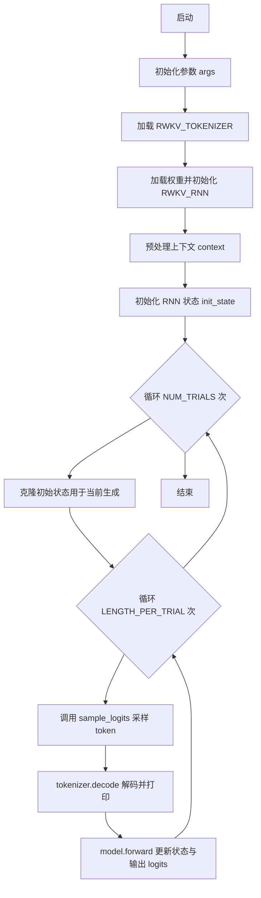
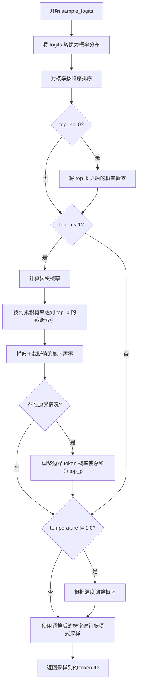
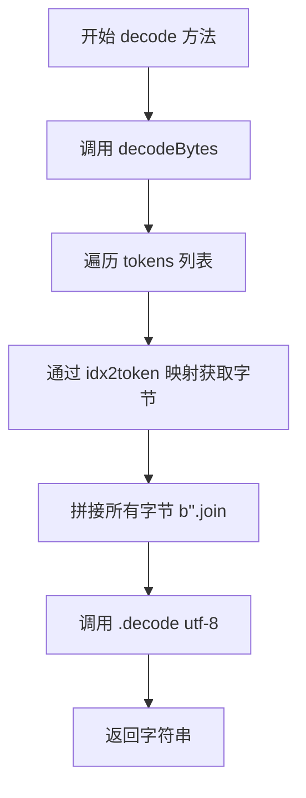

# `ChatRWKV\RWKV_v6_demo_cuda_bf16.py` 详细设计文档

这是一个基于 PyTorch 的 RWKV (Receptance Weighted Key Value) 语言模型推理脚本，实现了自定义的 RNN 前向传播机制（Time Mixing 和 Channel Mixing），并包含Tokenizer工具类以及基于采样策略的文本生成循环。

## 整体流程



## 类结构

```
RWKV_TOKENIZER (独立的分词器类)
RWKV_RNN (继承自 torch.jit.ScriptModule 的模型主类)
```

## 全局变量及字段


### `args`
    
全局配置对象，包含tokenizer路径、模型路径及模型超参数

类型：`types.SimpleNamespace`
    


### `context`
    
输入的初始文本上下文

类型：`str`
    


### `NUM_TRIALS`
    
独立生成任务的次数

类型：`int`
    


### `LENGTH_PER_TRIAL`
    
每次生成的最大token长度

类型：`int`
    


### `TEMPERATURE`
    
生成时的温度参数，用于调节采样概率分布

类型：`float`
    


### `TOP_P`
    
核采样（Nucleus Sampling）的概率阈值，控制采样词的累积概率

类型：`float`
    


### `tokenizer`
    
RWKV_TOKENIZER实例，用于对文本进行编码和解码

类型：`RWKV_TOKENIZER`
    


### `model`
    
RWKV_RNN实例，加载并运行RWKV语言模型进行推理

类型：`RWKV_RNN`
    


### `init_state`
    
初始的RNN隐藏状态列表，包含每层的注意力状态和FFN状态

类型：`List[torch.Tensor]`
    


### `RWKV_RNN.args`
    
存储模型配置 (n_layer, n_embd等)

类型：`types.SimpleNamespace`
    


### `RWKV_RNN.z`
    
加载的模型权重字典 (state_dict)

类型：`Dict[str, torch.Tensor]`
    


### `RWKV_RNN.n_embd`
    
嵌入维度

类型：`int`
    


### `RWKV_RNN.n_layer`
    
Transformer 层数

类型：`int`
    


### `RWKV_RNN.n_head`
    
注意力头数

类型：`int`
    


### `RWKV_RNN.head_size`
    
每个头的维度大小

类型：`int`
    


### `RWKV_TOKENIZER.idx2token`
    
ID到Token的映射

类型：`Dict[int, bytes]`
    


### `RWKV_TOKENIZER.token2idx`
    
Token到ID的映射

类型：`Dict[bytes, int]`
    


### `RWKV_TOKENIZER.table`
    
用于快速编码的256x256查找表

类型：`List[List[List[bytes]]]`
    


### `RWKV_TOKENIZER.good`
    
有效字符对集合

类型：`List[Set[int]]`
    


### `RWKV_TOKENIZER.wlen`
    
字符起始位置对应的最大词长

类型：`List[int]`
    
    

## 全局函数及方法


### `time_mixing`

Time Mixing 是 RWKV 模型中处理时间序列混合的核心逻辑函数，通过可学习的时序混合参数对当前输入与历史状态进行加权融合，计算注意力输出并更新状态，经过 torch.compile 或 jit.script 优化以提升性能。

参数：

- `H`：`int`，头数量（注意力机制中的头数）
- `N`：`int`，每个头的尺寸（head size）
- `x`：`torch.Tensor`，当前时间步的输入向量
- `x_prev`：`torch.Tensor`，上一时间步的输入向量
- `state`：`torch.Tensor`，注意力状态（kv 状态，用于维护历史信息）
- `maa_x`：`torch.Tensor`，时间混合的可学习参数 x，用于调整输入偏差
- `maa_wkvrg`：`torch.Tensor`，时间混合的可学习参数 w,k,v,r,g 拼接，用于混合权重
- `tm_w1`：`torch.Tensor`，时间混合的第一权重矩阵，用于计算混合系数
- `tm_w2`：`torch.Tensor`，时间混合的第二权重矩阵，用于计算混合系数
- `td_w1`：`torch.Tensor`，时间衰减的第一权重矩阵，用于计算衰减因子
- `td_w2`：`torch.Tensor`，时间衰减的第二权重矩阵，用于计算衰减因子
- `time_faaaa`：`torch.Tensor`，时间注意力因子，用于调整注意力分布
- `time_decay`：`torch.Tensor`，时间衰减基础值，用于指数衰减
- `kw`：`torch.Tensor`，键（Key）权重矩阵，用于投影输入到键空间
- `vw`：`torch.Tensor`，值（Value）权重矩阵，用于投影输入到值空间
- `rw`：`torch.Tensor`，接收（Receptance）权重矩阵，用于控制信息通过
- `gw`：`torch.Tensor`，门控（Gate）权重矩阵，用于动态调整输出
- `ow`：`torch.Tensor`，输出权重矩阵，用于投影最终输出
- `ln_w`：`torch.Tensor`，组归一化权重，用于稳定输出分布
- `ln_b`：`torch.Tensor`，组归一化偏置，用于调整输出均值

返回值：`tuple[torch.Tensor, torch.Tensor, torch.Tensor]`，返回一个元组，包含：
- 输出向量（`torch.Tensor`）：经过注意力计算和门控后的输出
- 更新后的输入向量 `x`（`torch.Tensor`）：用于下一时间步的输入
- 更新后的注意力状态 `state`（`torch.Tensor`）：用于维护历史信息

#### 流程图

```mermaid
graph TD
    A[计算 sx = x_prev - x] --> B[计算 xxx = x + sx * maa_x]
    B --> C[通过 tm_w1, tm_w2 计算 xxx: tanh 激活 + 矩阵乘法]
    C --> D[xxx = xxx + maa_wkvrg]
    D --> E[xxx = xxx * sx.expand + x.expand]
    E --> F[解包 w, k, v, r, g]
    F --> G[计算 w: tanh(w@td_w1)@td_w2 + time_decay, 然后 exp(-exp(w))]
    G --> H[计算 k, v, r, g 投影: 分别通过 kw, vw, rw, gw]
    H --> I[计算 kv = k @ v]
    I --> J[计算 out = r @ (time_faaaa * kv + state)]
    J --> K[更新 state: kv + w.view(H,N,1) * state]
    K --> L[Group Norm: out.view(1, H*N) -> group_norm -> view(H*N)]
    L --> M[返回 ow @ (out * g), x, state]
```

#### 带注释源码

```
def time_mixing__(H:int, N:int, x, x_prev, state, maa_x, maa_wkvrg, tm_w1, tm_w2, td_w1, td_w2, time_faaaa, time_decay, kw, vw, rw, gw, ow, ln_w, ln_b):
    # 计算当前输入与上一输入的差值，用于时序混合
    sx = x_prev - x
    
    # 时间混合: 计算混合后的 xxx
    # 步骤1: 调整输入: x + sx * maa_x
    xxx = x + sx * maa_x                            # C
    # 步骤2: 通过两层线性变换和 tanh 激活计算混合权重
    xxx = torch.tanh(xxx @ tm_w1).view(5, 1, -1)    # C @ C*5L => 5L => 5*1*L
    xxx = torch.bmm(xxx, tm_w2).view(5, -1)         # 5*1*L @ 5*L*C => 5*1*C => 5*C
    # 步骤3: 加上偏置并扩展维度
    xxx = xxx + maa_wkvrg
    xxx = xxx * sx.expand(5, -1) + x.expand(5, -1)
    # 步骤4: 解包出五个分量: w (衰减), k (键), v (值), r (接收门), g (门控)
    w, k, v, r, g = xxx.unbind(dim=0)

    # 时间衰减: 计算 w
    # 使用 tanh 激活和矩阵乘法计算衰减因子，然后加上基础衰减并取负指数
    w = torch.tanh(w @ td_w1) @ td_w2
    w = w.float() + time_decay
    # assert w.dtype == torch.float
    w = torch.exp(-torch.exp(w))

    # 计算键、值、接收门和门控投影
    k = (kw @ k).view(H, N, 1)
    v = (vw @ v).view(H, 1, N)
    r = (rw @ r).view(H, 1, N)
    g = torch.nn.functional.silu(gw @ g)

    # 计算 kv 注意力分数 (键与值的乘积)
    kv = (k @ v).float()
    # 计算输出: 接收门乘以 (时间因子乘以 kv 加上状态)
    out = r @ (time_faaaa * kv + state).to(torch.bfloat16)

    # 更新状态: kv 加上衰减后的历史状态
    state = kv + w.view(H, N, 1) * state

    # 组归一化输出: 调整输出分布以稳定训练
    out = torch.nn.functional.group_norm(out.view(1, H*N), num_groups=H, weight=ln_w, bias=ln_b, eps = 64e-5).view(H*N) # same as gn(x/8, eps=1e-5)
    # 返回最终输出、当前输入和更新后的状态
    return ow @ (out * g), x, state
```


### `channel_mixing`

该函数是 RWKV 模型中的通道混合（Channel Mixing）核心逻辑，负责处理前馈网络（FFN）中的非线性变换。它接收当前输入和前一状态，通过可学习的移动平均机制计算 key 和 receptance，然后应用 sigmoid 和 relu 平方激活函数，最后将结果相乘得到输出。该函数已通过 `torch.compile` 或 `jit.script` 优化以提升推理性能。

#### 参数

- `x`：`torch.Tensor`，当前时刻的输入张量（嵌入维度）
- `x_prev`：`torch.Tensor`，前一时刻的状态向量（嵌入维度）
- `time_maa_k`：`torch.Tensor`，用于 key 的时间移动平均权重
- `time_maa_r`：`torch.Tensor`，用于 receptance 的时间移动平均权重
- `kw`：`torch.Tensor`，key 的线性变换权重矩阵
- `vw`：`torch.Tensor`，value 的线性变换权重矩阵
- `rw`：`torch.Tensor`，receptance 的线性变换权重矩阵

#### 返回值

- `tuple[torch.Tensor, torch.Tensor]`：
  - 第一个元素：经过通道混合后的输出张量（嵌入维度）
  - 第二个元素：更新后的状态向量（用于下一时刻，值为当前输入 x）

#### 流程图

```mermaid
flowchart TD
    A[输入 x, x_prev] --> B[计算 sx = x_prev - x]
    B --> C[计算 k = x + sx * time_maa_k]
    B --> D[计算 r = x + sx * time_maa_r]
    D --> E[r = sigmoid(rw @ r)]
    C --> F[k = relu(kw @ k) ** 2]
    E --> G[output = r * (vw @ k)]
    G --> H[返回 output, x]
```

#### 带注释源码

```python
def channel_mixing__(x, x_prev, time_maa_k, time_maa_r, kw, vw, rw):
    """
    RWKV 模型通道混合核心逻辑
    
    参数:
        x: 当前输入张量 [n_embd]
        x_prev: 上一时刻状态 [n_embd]
        time_maa_k: key 的时间移动平均权重 [n_embd]
        time_maa_r: receptance 的时间移动平均权重 [n_embd]
        kw: key 权重矩阵 [n_embd, n_embd]
        vw: value 权重矩阵 [n_embd, n_embd]
        rw: receptance 权重矩阵 [n_embd, n_embd]
    
    返回:
        (output, x): 输出张量和更新后的状态
    """
    # 计算状态差分，用于时间混合
    sx = x_prev - x
    
    # 应用时间移动平均到 key 分支
    # k = x + sx * time_maa_k 实现了一种自适应的时间衰减混合
    k = x + sx * time_maa_k
    
    # 应用时间移动平均到 receptance 分支
    r = x + sx * time_maa_r

    # 对 receptance 应用 sigmoid 门控
    # receptance 类似于 GRU 中的 update gate，控制有多少新信息通过
    r = torch.sigmoid(rw @ r)
    
    # 对 key 应用 ReLU 平方激活
    # 这种激活方式在 RWKV 论文中被证明有效
    k = torch.relu(kw @ k) ** 2

    # 门控机制：r 控制 value 信息的通过量
    # 最终输出 = sigmoid(rw @ r) * (vw @ (relu(kw @ k) ** 2))
    return r * (vw @ k), x

# 尝试使用 torch.compile 优化，若失败则回退到 jit.script
try:
    channel_mixing = torch.compile(channel_mixing__, mode="max-autotune", fullgraph=True, dynamic=False)
except:
    channel_mixing = torch.jit.script(channel_mixing__)
```


### `sample_logits`

该函数是 RWKV 语言模型的采样函数，根据输入的 logits 结合温度（Temperature）、Top-P（核采样）和 Top-K 采样策略，从词汇表中选择一个 token 作为生成结果。

参数：

- `logits`：`torch.Tensor`，模型输出的原始 logits 向量，维度为 [vocab_size]
- `temperature`：`float`，温度参数，用于调整概率分布的平滑程度，值越大概率分布越平缓，值越小分布越尖锐，默认为 1.0
- `top_p`：`float`，核采样（Nucleus Sampling）阈值，保留累积概率达到 top_p 的最小 token 集合，默认为 1.0（表示不做核采样）
- `top_k`：`int`，Top-K 采样参数，只保留概率最高的 K 个 token，默认为 0（表示不做 Top-K 采样）

返回值：`int`，采样得到的 token ID

#### 流程图



#### 带注释源码

```python
@MyStatic
def sample_logits(logits, temperature:float=1.0, top_p:float=1.0, top_k:int=0):
    # 将 logits 转换为概率分布（使用 softmax）
    probs = F.softmax(logits.float(), dim=-1)
    
    # 按概率降序排序，返回排序后的概率值和对应的 token ID
    sorted_probs, sorted_ids = torch.sort(probs, descending=True)
    
    # Top-K 采样：只保留概率最高的 top_k 个 token
    if top_k > 0:
        probs[sorted_ids[top_k:]] = 0

    # Top-P (Nucleus) 采样：保留累积概率达到 top_p 的最小 token 集合
    if top_p < 1:
        # 计算累积概率
        cumulative_probs = torch.cumsum(sorted_probs, dim=-1)
        # 找到累积概率首次超过或达到 top_p 的索引
        cutoff_index = torch.searchsorted(cumulative_probs, top_p)
        # 获取截断处的概率值
        cutoff = sorted_probs[cutoff_index]
        # 将低于截断值的概率置零
        probs[probs < cutoff] = 0

        # 处理边界情况：可能有多个 token 的概率等于截断值
        if top_p > 0:
            idx = torch.where(probs == cutoff)[0]
            if len(idx) > 0:
                # 调整这些边界 token 的概率，使总和精确等于 top_p
                probs[idx] = cutoff + (top_p - torch.sum(probs).item()) / len(idx)
                # 可选：断言验证概率总和是否接近 top_p
                # assert abs(torch.sum(probs).item() - top_p) < 1e-6
    
    # 温度调节：调整概率分布的形状
    if temperature != 1.0:
        probs = probs ** (1.0 / temperature)

    # 从调整后的概率分布中采样一个 token
    return torch.multinomial(probs, num_samples=1).item()
```


### `RWKV_RNN.__init__`

该方法是RWKV语言模型RNN实现的构造函数，负责加载预训练模型权重并进行权重预处理，包括对时间相关参数进行squeeze/unsqueeze操作以适应计算图，以及将分离的MAA（Multi-Head Attention Accumulation）参数合并为统一的kvrg张量，以优化推理时的内存访问和计算效率。

参数：

- `self`：RWKV_RNN，类的实例自身
- `args`：types.SimpleNamespace，包含模型配置的对象，必需参数包括MODEL_NAME（模型文件路径）、n_layer（层数）、n_embd（嵌入维度）、vocab_size（词表大小）、head_size（头维度）

返回值：无（构造函数，不返回任何值）

#### 流程图

```mermaid
flowchart TD
    A[开始 __init__] --> B[调用父类 super().__init__]
    B --> C[保存args到self.args]
    C --> D[提取self.n_embd和self.n_layer]
    D --> E[设置self.eval模式]
    E --> F[加载模型权重 torch.load]
    F --> G[对emb.weight应用LayerNorm]
    G --> H[遍历所有key进行时间参数处理]
    H --> H1[如果包含.time_则squeeze]
    H --> H2[如果以time_decay结尾则转float]
    H --> H3[如果以time_faaaa结尾则unsqueeze并转float]
    H --> H4[合并maa参数: maa_w+k+v+r+g → maa_wkvrg]
    H4 --> I[计算self.n_head]
    I --> J[计算self.head_size]
    J --> K[断言head_size与args.head_size一致]
    K --> L[结束 __init__]
```

#### 带注释源码

```python
def __init__(self, args):
    """
    初始化RWKV_RNN模型
    1. 加载模型权重
    2. 预处理权重（squeeze/unsqueeze）
    3. 合并MAA参数
    """
    # 调用父类MyModule（即torch.jit.ScriptModule）的初始化方法
    super().__init__()
    
    # 保存模型配置参数到实例属性
    self.args = args
    # 从args中提取嵌入维度和层数
    self.n_embd = args.n_embd
    self.n_layer = args.n_layer
    # 设置为评估模式（禁用dropout等训练特性）
    self.eval()
    
    # === 步骤1: 加载模型权重 ===
    # 从指定路径加载模型权重文件(.pth)，映射到CUDA设备
    self.z = torch.load(args.MODEL_NAME + '.pth', map_location='cuda')
    z = self.z  # 使用局部变量z引用权重字典，简化后续代码
    
    # === 步骤2: 预处理嵌入层权重 ===
    # 对embedding权重应用预归一化(LayerNorm)，使用blocks.0的ln0参数
    # 这是一个特殊的预处理步骤，将embedding层与第一层的LN参数结合
    z['emb.weight'] = F.layer_norm(z['emb.weight'], (args.n_embd,), 
                                   weight=z['blocks.0.ln0.weight'], 
                                   bias=z['blocks.0.ln0.bias'])
    
    # === 步骤3: 处理时间相关参数（squeeze/unsqueeze） ===
    # 获取所有权重键名列表
    keys = list(z.keys())
    for k in keys:
        # 对于包含.time_的参数，执行squeeze去除单维度
        # 这些参数原本可能存储为[something,1,...]形式
        if '.time_' in k: 
            z[k] = z[k].squeeze()
        # 对于以time_decay结尾的参数，转换为float32
        # 可能原本是bfloat16或其他精度
        if k.endswith('.time_decay'): 
            z[k] = z[k].float()
        # 对于以time_faaaa结尾的参数，unsqueeze添加最后一维并转float
        # 形状从[head]变为[head,1]
        if k.endswith('.time_faaaa'): 
            z[k] = z[k].unsqueeze(-1).float()
    
    # === 步骤4: 合并MAA参数 ===
    # MAA (Multi-Head Attention Accumulation) 有5个分离的权重:
    # maa_w, maa_k, maa_v, maa_r, maa_g
    # 将它们合并为单个maa_wkvrg张量以优化推理
    for k in keys:
        if k.endswith('maa_w'):
            # 提取5个相关参数并concat
            w = z[k]
            k_param = z[k.replace('maa_w','maa_k')]
            v_param = z[k.replace('maa_w','maa_v')]
            r_param = z[k.replace('maa_w','maa_r')]
            g_param = z[k.replace('maa_w','maa_g')]
            
            # 沿第一维(dim=0)拼接5个张量，然后reshape为[5, -1]
            # 结果形状: [5, n_embd] 或类似维度
            merged = torch.concat([w, k_param, v_param, r_param, g_param]).clone()
            z[k.replace('maa_w','maa_wkvrg')] = merged.reshape(5, -1)
            
            # 删除原始的5个分离参数，释放内存
            del z[k]
            del z[k.replace('maa_w','maa_k')]
            del z[k.replace('maa_w','maa_v')]
            del z[k.replace('maa_w','maa_r')]
            del z[k.replace('maa_w','maa_g')]
            
    # === 步骤5: 计算并验证模型结构参数 ===
    # 从time_faaaa张量形状推断head数量
    # 形状应为[n_head, head_size]或其他相关维度
    self.n_head = z['blocks.0.att.time_faaaa'].shape[0]
    # 从ln1.weight形状推断head_size
    # ln1.weight形状: [n_embd] = [n_head * head_size]
    self.head_size = z['blocks.0.ln1.weight'].shape[0] // self.n_head
    
    # 验证计算的head_size与配置一致
    assert self.head_size == args.head_size
```


### `RWKV_RNN.forward`

执行单步 RNN 前向计算，包含 Time Mixing（时间混合注意力）和 Channel Mixing（通道混合前馈网络）循环，对输入 token 进行推理并返回预测的 logits 和更新后的状态。

参数：
- `token`：`int`，输入的 token ID，用于从嵌入表中获取对应的词向量
- `state`：`List[torch.Tensor]`，长度为 `n_layer * 3` 的状态列表，包含注意力机制的隐藏状态 (att_x_prev, att_kv) 和前馈网络的隐藏状态 (ffn_x_prev)

返回值：
- `x`：`torch.Tensor`，模型输出的 logits 向量，维度为 vocab_size，用于下一步的采样
- `state`：`List[torch.Tensor]`，更新后的状态列表，用于下一次前向计算

#### 流程图

```mermaid
flowchart TD
    A[输入: token, state] --> B[从嵌入表获取词向量 x]
    B --> C{遍历每一层 i = 0 to n_layer-1}
    C --> D[LayerNorm: xx = LN{x}]
    D --> E[Time Mixing: 调用time_mixing函数]
    E --> F[x = x + xx]
    F --> G[LayerNorm: xx = LN{x}]
    G --> H[Channel Mixing: 调用channel_mixing函数]
    H --> I[x = x + xx]
    I --> J{检查是否还有更多层}
    J -->|是| C
    J -->|否| K[最终LayerNorm: x = LN{x}]
    K --> L[线性变换: x = head.weight @ x]
    L --> M[返回: x, state]
```

#### 带注释源码

```python
@MyFunction
def forward(self, token:int, state:List[torch.Tensor]):
    """
    RWKV模型单步前向传播函数
    
    参数:
        token: int - 输入的token ID
        state: List[torch.Tensor] - RNN状态列表，长度为n_layer*3
               包含: att_x_prev, att_kv, ffn_x_prev
    
    返回:
        x: torch.Tensor - 输出logits
        state: List[torch.Tensor] - 更新后的状态
    """
    with torch.no_grad():  # 推理时不需要梯度
        z = self.z  # 获取加载的模型权重字典
        # 1. 从嵌入表获取当前token的词向量
        x = z['emb.weight'][token]
        
        # 2. 遍历每一层Transformer
        for i in range(self.n_layer):
            bbb = f'blocks.{i}.'
            att = f'blocks.{i}.att.'
            ffn = f'blocks.{i}.ffn.'

            # ===== Time Mixing (时间混合注意力机制) =====
            # 第一层LayerNorm
            xx = F.layer_norm(x, (self.n_embd,), weight=z[bbb+'ln1.weight'], bias=z[bbb+'ln1.bias'])
            # 执行Time Mixing计算，更新状态
            # state结构: [att_x_prev, att_kv, ffn_x_prev]
            xx, state[i*3+0], state[i*3+1] = time_mixing(
                self.n_head, self.head_size, 
                xx, 
                state[i*3+0],  # att_x_prev - 上一时刻的x
                state[i*3+1],  # att_kv - 注意力键值状态
                # 传入Time Mixing所需的权重参数
                z[att+'time_maa_x'], z[att+'time_maa_wkvrg'], 
                z[att+'time_maa_w1'], z[att+'time_maa_w2'],
                z[att+'time_decay_w1'], z[att+'time_decay_w2'], 
                z[att+'time_faaaa'], z[att+'time_decay'],
                z[att+'key.weight'], z[att+'value.weight'], 
                z[att+'receptance.weight'], z[att+'gate.weight'], 
                z[att+'output.weight'],
                z[att+'ln_x.weight'], z[att+'ln_x.bias']
            )
            # 残差连接
            x = x + xx

            # ===== Channel Mixing (通道混合前馈网络) =====
            # 第二层LayerNorm
            xx = F.layer_norm(x, (self.n_embd,), weight=z[bbb+'ln2.weight'], bias=z[bbb+'ln2.bias'])
            # 执行Channel Mixing计算
            xx, state[i*3+2] = channel_mixing(
                xx, 
                state[i*3+2],  # ffn_x_prev - 前馈网络上一时刻的x
                z[ffn+'time_maa_k'], z[ffn+'time_maa_r'], 
                z[ffn+'key.weight'], z[ffn+'value.weight'], 
                z[ffn+'receptance.weight']
            )
            # 残差连接
            x = x + xx
        
        # ===== 输出层 =====
        # 最终LayerNorm
        x = F.layer_norm(x, (self.n_embd,), weight=z['ln_out.weight'], bias=z['ln_out.bias'])
        # 线性投影到词汇表维度
        x = z['head.weight'] @ x
        return x, state
```


### `RWKV_TOKENIZER.__init__`

该方法是RWKV词表Tokenizer的初始化函数，读取词表文件并构建用于快速编码的查找表结构，包括正向索引映射、反向索引映射以及基于字节前缀的token匹配优化表。

参数：

- `file_name`：`str`，词表文件路径，文件格式为每行包含索引、空格、token字符串（或bytes表示）、空格和token字节长度

返回值：`None`，该方法为构造函数，不返回任何值

#### 流程图

```mermaid
flowchart TD
    A[开始 __init__] --> B[打开词表文件]
    B --> C[遍历文件每一行]
    C --> D[解析行: 提取idx和token字符串]
    D --> E{判断token类型}
    E -->|str| F[编码为utf-8 bytes]
    E -->|其他| G[保持原样]
    F --> H[验证token长度]
    G --> H
    H --> I[添加到sorted列表和idx2token字典]
    I --> J[构建token2idx反向映射]
    J --> K[初始化table/good/wlen表]
    K --> L{逆序遍历sorted}
    L --> M{token长度>=2?}
    M -->|否| N[跳过]
    M -->|是| O[提取首字节s0和次字节s1]
    O --> P[将token加入table[s0][s1]]
    P --> Q[更新wlen[s0]为最大长度]
    Q --> R[将s1加入good[s0]集合]
    N --> L
    L --> S[结束 __init__]
```

#### 带注释源码

```python
def __init__(self, file_name):
    # 初始化索引到token的映射字典
    self.idx2token = {}
    # 用于存储排序后的token列表（必须已按长度降序排列）
    sorted = [] # must be already sorted
    
    # 读取词表文件，每行格式: "索引 token字符串 字节长度"
    lines = open(file_name, "r", encoding="utf-8").readlines()
    for l in lines:
        # 提取token的索引号（行首到第一个空格）
        idx = int(l[:l.index(' ')])
        # 提取token字符串（第一个空格到最后一个空格之间）
        x = eval(l[l.index(' '):l.rindex(' ')])
        # 如果是字符串则编码为utf-8 bytes，否则保持bytes类型
        x = x.encode("utf-8") if isinstance(x, str) else x
        # 断言确保x是bytes类型
        assert isinstance(x, bytes)
        # 验证token实际长度与文件中记录的长度一致
        assert len(x) == int(l[l.rindex(' '):])
        # 添加到排序列表（用于后续构建查找表）
        sorted += [x]
        # 构建正向索引映射: idx -> token bytes
        self.idx2token[idx] = x

    # 构建反向索引映射: token bytes -> idx
    self.token2idx = {}
    for k, v in self.idx2token.items():
        self.token2idx[v] = int(k)

    # 预计算快速匹配表
    # table[s0][s1]: 存储以字节(s0,s1)开头的所有token列表
    self.table = [[[] for j in range(256)] for i in range(256)]
    # good[s0]: 存储存在有效token的s1值集合（用于快速跳过不存在的前缀）
    self.good = [set() for i in range(256)]
    # wlen[s0]: 存储以s0开头的token的最大长度（用于边界检查）
    self.wlen = [0 for i in range(256)]

    # 逆序遍历 - 优先匹配更长的token
    for i in reversed(range(len(sorted))): # reverse order - match longer tokens first
        s = sorted[i]
        # 只处理长度>=2的token（用于双字节前缀匹配）
        if len(s) >= 2:
            s0 = int(s[0])   # 第一个字节
            s1 = int(s[1])   # 第二个字节
            # 将token添加到对应前缀的查找表中
            self.table[s0][s1] += [s]
            # 更新最大长度记录
            self.wlen[s0] = max(self.wlen[s0], len(s))
            # 记录有效的第二个字节
            self.good[s0].add(s1)
```


### `RWKV_TOKENIZER.encodeBytes`

该方法将输入的原始字节流（bytes）按词表规则进行最长匹配编码，输出对应的 token ID 列表，是 RWKV 分词器的核心编码接口。

参数：

- `self`：`RWKV_TOKENIZER` 类实例，包含词表和编码所需的查找表
- `src`：`bytes`，要编码的原始字节流

返回值：`list[int]`，编码后的 token ID 列表

#### 流程图

```mermaid
flowchart TD
    A[开始 encodeBytes] --> B[获取源字节长度 src_len]
    B --> C[初始化空 token 列表和索引 i=0]
    C --> D{i < src_len?}
    D -- 是 --> E[提取单字节 s = src[i:i+1]]
    E --> F{i < src_len - 1?}
    F -- 是 --> G[获取 s0=src[i], s1=src[i+1]]
    G --> H{s1 in good[s0]?}
    H -- 是 --> I[尝试最长匹配: sss = src[i:i+wlen[s0]]]
    I --> J{查找匹配?}
    J -- 是 --> K[更新 s 为匹配到的最长 token]
    J -- 否 --> L[保持 s 为单字节]
    H -- 否 --> L
    F -- 否 --> L
    L --> M[将 s 转换为 token ID: token2idx[s]]
    M --> N[添加 token 到列表]
    N --> O[i += len(s)]
    O --> D
    D -- 否 --> P[返回 token 列表]
```

#### 带注释源码

```python
def encodeBytes(self, src: bytes) -> list[int]:
    # 获取输入字节流的总长度
    src_len: int = len(src)
    # 初始化用于存储编码结果的 token ID 列表
    tokens: list[int] = []
    # 初始化字节流遍历索引
    i: int = 0
    
    # 遍历整个字节流，直到索引达到末尾
    while i < src_len:
        # 默认提取当前字节位置的单字节作为候选 token
        s: bytes = src[i : i + 1]

        # 检查是否还有下一个字节可用于双字节匹配
        if i < src_len - 1:
            # 获取当前字节和下一个字节的整数值（0-255）
            s1: int = int(src[i + 1])
            s0: int = int(src[i])
            
            # 快速检查：判断 (s0, s1) 组合是否在 good 查找表中
            # good[s0] 存储了所有以 s0 开头且存在多字节 token 的 s1 集合
            if s1 in self.good[s0]:
                # 尝试匹配：从当前位置开始，取可能的最长长度
                sss: bytes = src[i : i + self.wlen[s0]]
                try:
                    # 在 table[s0][s1] 列表中查找第一个以 sss 开头的 token
                    # table 存储了所有以 (s0, s1) 开头的 token 列表（已按长度降序排列）
                    s = next(filter(sss.startswith, self.table[s0][s1]))
                except:
                    # 如果没有找到匹配，保持 s 为单字节
                    pass
        
        # 将找到的 token 字节转换为对应的 token ID 并添加到列表
        tokens.append(self.token2idx[s])
        
        # 移动索引：已处理的字节数等于当前 token 的长度
        i += len(s)

    # 返回编码后的 token ID 列表
    return tokens
```

#### 关键组件信息

- **table**：`list[list[list[bytes]]]`，三维列表，用于双字节前缀快速查找，table[s0][s1] 存储所有以字节 (s0, s1) 开头的 token 列表
- **good**：`list[set[int]]`，256 个集合，每个集合存储以特定字节开头且存在多字节 token 的后续字节值，用于快速剪枝
- **wlen**：`list[int]`，256 个整数，存储以每个字节开头的 token 的最大长度，用于边界控制
- **token2idx**：`dict[bytes, int]`，字节到 token ID 的映射字典
- **idx2token**：`dict[int, bytes]`，token ID 到字节的反向映射字典

#### 潜在技术债务与优化空间

1. **异常处理过于简单**：使用空的 `except:` 捕获所有异常并静默忽略，可能隐藏潜在的编码错误
2. **编码效率**：虽然使用了预计算的查找表，但对于极端情况仍可能进行多次字符串操作（`sss.startswith`）
3. **错误恢复**：当匹配失败时退化为单字节处理，可能导致次优编码结果（如应使用多字节 token 却使用了多个单字节 token）

#### 其它项目

**设计目标与约束**：
- 目标：高效地将任意字节流编码为 token ID 序列，支持 UTF-8 文本和任意二进制数据
- 约束：依赖预计算的 table/good/wlen 表，必须在初始化时完成词表加载

**错误处理与异常设计**：
- 当双字节前缀匹配失败时，自动退化为单字节处理
- 无效字节会通过 token2idx 查找失败抛出 KeyError，但词表通常包含所有单字节因此不会发生

**数据流与状态机**：
- 编码过程是一个线性遍历状态机：读取字节 → 尝试最长匹配 → 输出 token → 前进指针
- 内部状态仅依赖当前索引位置 i，无持久状态

**外部依赖与接口契约**：
- 输入：任意字节序列（bytes）
- 输出：有效的 token ID 列表（list[int]），ID 范围 [0, vocab_size)
- 前置条件：RWKV_TOKENIZER 实例已正确初始化，词表文件已加载


### `RWKV_TOKENIZER.decodeBytes`

该函数用于将 token ID 列表解码为字节流，通过查表方式将每个 token ID 映射回对应的字节数据并拼接返回。

参数：

- `tokens`：`list[int]`，要解码的 token ID 列表

返回值：`bytes`，解码后的字节流

#### 流程图

```mermaid
flowchart TD
    A[开始 decodeBytes] --> B[输入: tokens 列表]
    B --> C{遍历 tokens 中的每个 token}
    C -->|对每个 token i| D[查找 idx2token[i]]
    D --> E[获取对应的字节数据]
    E --> F[使用 map 函数映射所有 token]
    F --> G[使用 b''.join 拼接所有字节]
    G --> H[返回拼接后的字节流]
    C -->|完成| H
```

#### 带注释源码

```python
def decodeBytes(self, tokens):
    """
    将 token ID 列表解码为字节流
    
    参数:
        tokens: list[int] - token ID 列表
    
    返回:
        bytes - 解码后的字节流
    """
    # 使用 map 函数将每个 token ID 通过 idx2token 字典映射为对应的字节
    # 然后使用 b''.join 将所有字节拼接成一个完整的字节流
    return b''.join(map(lambda i: self.idx2token[i], tokens))
```

#### 补充说明

| 项目 | 说明 |
|------|------|
| **设计目标** | 提供将模型输出的 token ID 转换回原始字节数据的能力 |
| **核心逻辑** | 利用预建的 `idx2token` 字典进行 O(1) 查表操作，通过 `map` 和 `join` 实现高效拼接 |
| **调用场景** | 在推理过程中将模型生成的 token 序列转换回文本字节，供 `decode` 方法进一步转码为 UTF-8 字符串 |
| **性能考量** | 该方法时间复杂度为 O(n)，其中 n 为 token 数量；空间复杂度为 O(n)，需存储拼接后的完整字节流 |
| **错误处理** | 假设输入的 token ID 均在词汇表中，若存在无效 ID 会触发 KeyError |
| **数据依赖** | 依赖 `__init__` 中构建的 `idx2token` 字典，该字典在 tokenizer 初始化时从词表文件加载 |


### `RWKV_TOKENIZER.encode`

该方法是将输入的字符串编码为 RWKV 模型可用的 token 列表的入口函数，它接受 UTF-8 字符串并通过调用 `encodeBytes` 方法完成实际的字节到 token 的转换。

**参数：**

- `src`：`str`，要编码的源字符串

**返回值：** `list[int]`，返回编码后的 token ID 列表

#### 流程图

```mermaid
flowchart TD
    A[开始 encode] --> B[将字符串 src 编码为 UTF-8 字节]
    B --> C[调用 encodeBytes 方法]
    C --> D{遍历字节数组 i < src_len}
    D -->|是| E[获取当前字节 s = src[i:i+1]]
    E --> F{i < src_len - 1?}
    F -->|是| G[检查下一个字节是否在 good 集合中]
    G --> H{条件满足?}
    H -->|是| I[尝试匹配更长 token]
    H -->|否| J[保持单字节]
    I --> K[获取匹配的最长 token]
    K --> L[将 token 转换为 idx 并添加到列表]
    I --> L
    F -->|否| L
    H --> J
    J --> L
    D -->|否| M[返回 token 列表]
```

#### 带注释源码

```
def encode(self, src: str):
    # 参数 src: str - 输入的 UTF-8 字符串
    # 返回值: list[int] - 编码后的 token ID 列表
    
    # 1. 将字符串编码为 UTF-8 字节序列
    # 2. 调用内部方法 encodeBytes 进行实际的编码工作
    return self.encodeBytes(src.encode("utf-8"))
```

---

### 关联方法：`RWKV_TOKENIZER.encodeBytes`

该方法是实际执行字节到 token 转换的核心逻辑，采用最长匹配原则进行分词。

**参数：**

- `src`：`bytes`，UTF-8 编码的字节序列

**返回值：** `list[int]`，返回编码后的 token ID 列表

#### 带注释源码

```
def encodeBytes(self, src: bytes) -> list[int]:
    # 参数 src: bytes - UTF-8 编码的字节数据
    # 返回值: list[int] - token ID 列表
    
    src_len: int = len(src)                    # 源字节长度
    tokens: list[int] = []                      # 存储结果的 token 列表
    i: int = 0                                  # 当前遍历位置
    
    while i < src_len:                          # 遍历整个字节序列
        s: bytes = src[i : i + 1]               # 默认取单个字节
        
        # 尝试匹配更长的 token（2字节及以上）
        if i < src_len - 1:
            s1: int = int(src[i + 1])           # 下一个字节值
            s0: int = int(src[i])               # 当前字节值
            
            # 检查是否存在以当前字节开头且下一个字节在 good 集合中的 token
            if s1 in self.good[s0]:
                # 尝试匹配最长 token
                sss: bytes = src[i : i + self.wlen[s0]]
                try:
                    # 从 table 中查找匹配的 token
                    s = next(filter(sss.startswith, self.table[s0][s1]))
                except:
                    pass                        # 未找到匹配，保持单字节
        
        # 将 token 转换为索引并添加到列表
        tokens.append(self.token2idx[s])
        i += len(s)                             # 移动到下一个位置
    
    return tokens
```


### `RWKV_TOKENIZER.decode`

该方法是 RWKV_TOKENIZER 类的实例方法，用于将模型输出的 token ID 列表解码为可读的自然语言文本字符串。内部通过调用 decodeBytes 将 token ID 映射为原始字节序列，再以 UTF-8 编码格式转换为字符串返回。

#### 参数

- `self`：`RWKV_TOKENIZER` 实例，隐式参数，包含词表映射（`idx2token`、`token2idx`）和预计算的快速匹配表
- `tokens`：`list[int]`，待解码的 token ID 列表，每个元素为整型 token 索引

#### 返回值

- `str`，解码后的 UTF-8 文本字符串

#### 流程图



#### 带注释源码

```python
def decode(self, tokens):
    """
    将 token ID 列表解码为 UTF-8 字符串
    :param tokens: token ID 列表（通常来自模型输出）
    :return: 解码后的字符串
    """
    # 步骤 1：调用 decodeBytes 方法将 token 列表转换为字节序列
    # 内部实现：b''.join(map(lambda i: self.idx2token[i], tokens))
    # 其中 self.idx2token 是 dict[int -> bytes]，存储 ID 到原始字节的映射
    byte_sequence = self.decodeBytes(tokens)
    
    # 步骤 2：将字节序列以 UTF-8 编码解码为字符串
    # 若字节序列包含无效 UTF-8 序列，会抛出 UnicodeDecodeError
    # RWKV 词表中所有 token 均为合法 UTF-8 字节，故通常不会出错
    return byte_sequence.decode('utf-8')
```

## 关键组件


### 张量索引与惰性加载

代码通过`torch.load`加载模型权重到`self.z`字典中，然后通过键名直接索引访问各层参数，实现惰性加载。权重在需要时才从字典中取出使用，而非一次性全部加载到计算图中。

### 反量化支持

在`__init__`方法中对加载的权重进行反量化处理：将`.time_`开头的参数进行`squeeze()`操作去除维度，将`time_decay`参数转换为`float`类型，将`time_faaaa`参数进行`unsqueeze(-1)`并转换为`float`。同时将`maa_w/k/v/r/g`五个参数合并重构为`maa_wkvrg`矩阵，实现从量化存储格式到实际计算格式的转换。

### 量化策略

模型采用 bf16 (brain float16) 精度存储和计算，使用`torch.bfloat16`类型。状态向量`state`中att_kv使用float32精度，其余使用bf16。`time_decay`参数存储为float并通过指数运算转换为衰减系数，实现时间维度的量化效果。

### RWKV_RNN 类

核心模型类，继承自`torch.jit.ScriptModule`。负责模型的前向传播，包含32层Transformer结构。初始化时加载模型权重并进行预处理，前向传播时逐层执行time_mixing和channel_mixing操作，最终输出词汇表概率分布。

### time_mixing 函数

实现RWKV的时间混合机制，通过WKV (Weight Key Value) 状态更新实现递归状态传递。包含参数：H(头数)、N(头维度)、x(当前输入)、x_prev(上一时刻输入)、state(KV状态)等。使用tanh门控的时间衰减机制，支持并行计算。

### channel_mixing 函数

实现通道混合层，使用门控线性单元(GLU)结构。通过sigmoid激活的receptance门控relu平方后的key-value乘积，实现通道间信息交互和筛选。

### RWKV_TOKENIZER 类

自定义分词器实现，基于字节级别的最长匹配算法。预计算256x256的查找表和好集(Good Set)加速匹配，支持UTF-8编码的字符串与token id之间的相互转换。

### sample_logits 采样函数

从模型输出的logits中采样下一个token。支持temperature温度调节、top-k截断、top-p(核采样)三种采样策略的组合使用。使用torch.multinomial实现加权随机采样。

### 模型状态管理

使用长度为`n_layer * 3`的列表存储隐状态：每层包含att_x_prev(注意力输入状态)、att_kv(Key-Value状态)、ffn_x_prev(前馈网络状态)三个状态向量。状态在推理过程中持续更新并传递。


## 问题及建议


### 已知问题

- **硬编码的模型路径和参数**: `args.MODEL_NAME` 硬编码为本地路径 `'E:/RWKV-Runner/models/rwkv-v6-2.1-3b'`，且 `head_size=64` 等参数写死在代码中，无法灵活配置
- **缺少文件存在性验证**: 模型权重文件和tokenizer文件在加载前均未检查文件是否存在，会导致程序直接崩溃
- **权重预处理逻辑复杂且不清晰**: `__init__` 中的权重处理逻辑（layer_norm转换、维度压缩、maa_wkvrg拼接）代码可读性差，且缺乏注释说明
- **状态初始化效率低下**: 使用 `list` 存储状态，且 `init_state` 初始化为 `None` 再逐个替换为 tensor，每次 trial 都执行 `copy.deepcopy(init_state)` 造成不必要的开销
- **Tokenizer 重复读取文件**: `RWKV_TOKENIZER.__init__` 每次实例化都重新打开和读取tokenizer文件，没有实现缓存机制
- **异常处理不完善**: `encodeBytes` 中 `next(filter(...))` 的异常捕获过于宽泛（`except: pass`），会静默忽略潜在错误；模型前向传播和采样过程缺乏异常处理
- **魔法数字和硬编码值**: 存在多个未解释的硬编码值，如 `eps=64e-5`、`num_groups=H`、`assert self.head_size == args.head_size`，缺乏配置化管理
- **全局状态管理混乱**: 大量全局变量（`args`, `context`, `tokenizer`, `model`, `init_state`）和全局函数混在一起，缺乏模块化封装
- **torch.compile 回退无提示**: `time_mixing` 和 `channel_mixing` 的 `torch.compile` 失败时静默回退到 `jit.script`，没有任何日志输出，开发者无法感知性能优化未生效
- **采样函数精度问题**: `sample_logits` 中对 `top_p` 的调整逻辑涉及浮点数运算，可能存在精度误差
- **CUDA 同步和打印影响性能**: 主循环中频繁调用 `torch.cuda.synchronize()` 和 `print()`，后者会显著降低推理吞吐量
- **类型注解不完整**: `forward` 方法的 `state:List[torch.Tensor]` 过于宽泛，`RWKV_TOKENIZER` 类中部分方法缺少类型注解

### 优化建议

- **配置管理**: 使用 `dataclass` 或配置文件（如 YAML）管理所有超参数，将模型路径、层数、embedding维度等设为可配置项
- **文件验证**: 在加载模型和tokenizer前检查文件是否存在，提供清晰的错误信息
- **权重预处理重构**: 将复杂的权重预处理逻辑封装成独立函数并添加详细注释，提高可维护性
- **状态管理优化**: 使用 `torch.zeros` 直接创建完整的状态tensor而非分步创建；考虑使用 `torch.clone()` 代替 `deepcopy`
- **Tokenizer 缓存**: 实现单例模式或全局缓存，避免重复读取文件
- **异常处理改进**: 为 `encodeBytes` 添加更精确的异常处理，对关键操作添加合理的错误提示
- **编译失败日志**: 在 `torch.compile` 回退时添加 `logger.warning()` 提示
- **性能优化**: 考虑将采样和打印操作异步化，或批量处理后再输出；评估 `torch.cuda.synchronize()` 的必要性
- **模块化重构**: 将全局变量封装到配置类中，将相关函数归类到模块或类中，提高代码组织性
- **添加类型注解**: 为所有函数和方法添加完整的类型注解，增强代码可读性和静态检查能力


## 其它


### 设计目标与约束

本代码旨在实现RWKV（Receptive Weighted Key Value）语言模型的高效推理，核心目标是在CUDA环境下利用bf16精度进行快速文本生成。主要约束包括：模型权重文件路径硬编码、仅支持特定版本的RWKV词汇表（v20230424）、要求CUDA计算能力支持bf16运算、推理过程中状态显存占用固定（n_layer * 3个张量）。

### 错误处理与异常设计

代码中错误处理较为薄弱，主要依赖try-except块进行torch.compile的降级处理（回退到torch.jit.script）。关键风险点包括：模型文件加载失败（文件不存在或格式错误）、tokenizer初始化失败（词汇表文件格式错误）、显存不足时可能的无提示崩溃、采样过程中无效UTF-8字符导致打印异常被静默捕获。建议增加显式的文件存在性检查、CUDA内存状态监控、详细的错误日志记录机制。

### 数据流与状态机

数据流遵循以下路径：输入文本 → Tokenizer编码 → 模型前向推理 → Logits输出 → 采样策略（temperature/top_p/top_k）→ 选中token → 解码输出 → 状态更新。状态机包含三层状态：init_state（初始化零状态）、运行状态（每层包含att_x_prev、att_kv、ffn_x_prev三个子状态）、采样状态（温度采样、top-p截断、top-k过滤）。每次forward调用同时完成状态更新和输出计算，形成自回归推理闭环。

### 外部依赖与接口契约

核心依赖包括：PyTorch（≥2.0推荐，支持torch.compile）、NumPy（用于打印配置）、CUDA运行时（支持bf16计算）。外部接口契约：model.forward(token, state)接受int类型token和List[Tensor]状态，返回(logits, new_state)元组；tokenizer.encode/decode负责字符串与token id的双向转换；sample_logits(logits, temperature, top_p, top_k)实现贪心/随机采样逻辑。所有张量默认device="cuda"，dtype为bf16/float。

### 性能优化策略

代码已包含多项优化：torch.compile的max-autotune模式编译time_mixing和channel_mixing函数、cudnn.benchmark和TF32启用、layer_norm使用融合算子、state状态复用减少显存分配、torch.cuda.synchronize精确计时。潜在优化空间：ctx encoding阶段可采用并行化处理、状态初始化可预先分配显存避免运行时分配、sample_logits的排序操作可优化、多trial间状态可复用减少warmup开销。

### 配置管理

当前配置通过types.SimpleNamespace对象args管理，包含tokenizer路径、MODEL_NAME、n_layer(32)、n_embd(2560)、vocab_size(65536)、head_size(64)等超参数。运行时参数（context、NUM_TRIALS、LENGTH_PER_TRIAL、TEMPERATURE、TOP_P）以全局变量形式定义。配置硬编码程度较高，建议迁移至配置文件或命令行参数解析（argparse）。

### 资源管理

显存管理：模型权重一次性加载至GPU（约数GB）、状态向量预分配固定显存、推理过程中无动态显存分配。计算资源：单GPU推理、BF16/FP32混合计算（部分操作强制float）、CUDA streams未使用。资源释放：程序结束后自动释放，无显式cleanup逻辑。

### 安全性考虑

代码未包含用户输入校验、模型文件完整性校验、推理超时保护等安全机制。潜在风险：超长context可能导致显存溢出、恶意构造的tokenizer文件可能导致内存放大攻击、模型权重文件替换攻击。建议增加输入长度限制、文件哈希校验、推理时间预算监控。

### 测试策略建议

建议补充以下测试用例：tokenizer边界条件测试（空字符串、单字符、多字节UTF-8）、模型前向传播数值稳定性测试（梯度爆炸检测）、采样函数覆盖率测试（temperature=0/1、top_p=0/1、top_k=0边界）、显存泄漏压力测试（长文本连续推理）、多模型版本兼容性测试。

### 部署注意事项

部署需满足：CUDA 11.0+、PyTorch 2.0+、NVIDIA GPU支持BF16、模型权重文件与代码路径匹配。建议docker化部署确保环境一致性；生产环境应增加日志持久化、指标监控（throughput/latency/显存占用）、优雅终止机制。v2/rwkv/model.py中存在fast version的preprocessing优化，生产环境可考虑迁移。

    