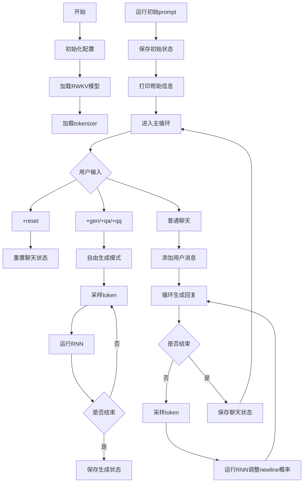
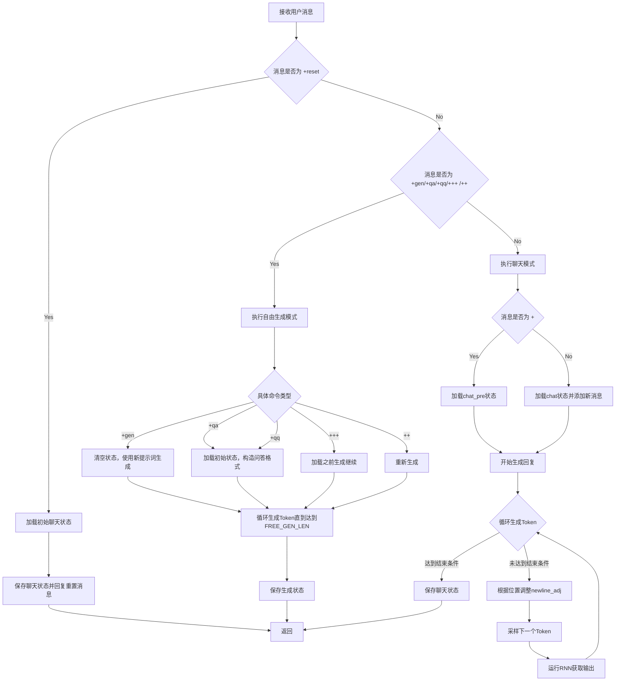

# `ChatRWKV\chat.py` 详细设计文档

ChatRWKV是一个基于RWKV（Receptance Weighted Key Value）语言模型的聊天/问答应用，通过加载预训练的RWKV-4模型，提供交互式对话、问答和自由文本生成功能，支持中英文两种语言模式。

## 整体流程



## 类结构

```
无明确类定义 - 脚本式架构
主要组件:
├── RWKV_RNN (from src.model_run)
├── TOKENIZER (from src.utils)
└── 全局函数模块
```

## 全局变量及字段


### `args`
    
全局配置对象，用于存储模型和运行时的各种参数

类型：`types.SimpleNamespace`
    


### `args.RUN_DEVICE`
    
运行设备标识，指定模型在cuda或cpu上运行

类型：`str`
    


### `args.FLOAT_MODE`
    
浮点运算模式，可选fp16/fp32/bf16影响计算精度和性能

类型：`str`
    


### `args.ctx_len`
    
上下文长度限制，控制模型能处理的最大token数量

类型：`int`
    


### `args.vocab_size`
    
词汇表大小，表示模型使用的token种类数量

类型：`int`
    


### `args.head_qk`
    
头QK参数，用于注意力机制的配置

类型：`int`
    


### `args.pre_ffn`
    
前馈网络参数，控制前馈神经网络的配置

类型：`int`
    


### `args.grad_cp`
    
梯度检查点参数，用于节省显存

类型：`int`
    


### `args.my_pos_emb`
    
位置嵌入参数，控制位置编码的设置

类型：`int`
    


### `MODEL_NAME`
    
模型文件路径，指向预训练RWKV模型的存储位置

类型：`str`
    


### `CHAT_LANG`
    
聊天语言设置，指定为English或Chinese

类型：`str`
    


### `QA_PROMPT`
    
问答模式开关，True为问答模式，False为闲聊模式

类型：`bool`
    


### `CHAT_LEN_SHORT`
    
短回复长度阈值，用于控制生成回复的简短程度

类型：`int`
    


### `CHAT_LEN_LONG`
    
长回复长度阈值，用于控制生成回复的最终截止

类型：`int`
    


### `FREE_GEN_LEN`
    
自由生成长度，+gen等指令的最大生成长度限制

类型：`int`
    


### `GEN_TEMP`
    
生成温度参数，控制采样随机性，值越大越随机

类型：`float`
    


### `GEN_TOP_P`
    
top-p采样核概率阈值，控制词汇选择范围

类型：`float`
    


### `AVOID_REPEAT`
    
避免重复字符集，用于防止模型生成重复内容

类型：`str`
    


### `tokenizer`
    
分词器实例，负责文本与token之间的转换

类型：`TOKENIZER`
    


### `model`
    
RWKV循环神经网络模型实例，负责推理计算

类型：`RWKV_RNN`
    


### `model_tokens`
    
当前对话的token列表，记录已处理的token序列

类型：`list[int]`
    


### `model_state`
    
模型内部状态，保存RNN的隐藏状态用于连续对话

类型：`any`
    


### `AVOID_REPEAT_TOKENS`
    
避免重复的token ID列表，用于采样时屏蔽

类型：`list[int]`
    


### `all_state`
    
所有保存的状态字典，用于存储不同场景的模型状态

类型：`dict`
    


### `srv_list`
    
服务器列表，当前包含dummy_server用于模拟服务

类型：`list[str]`
    


### `user`
    
用户名，对话中代表用户角色的标识

类型：`str`
    


### `bot`
    
机器人名，对话中代表AI角色的标识

类型：`str`
    


### `interface`
    
对话分隔符，用于分隔用户名/机器人名与实际内容

类型：`str`
    


### `init_prompt`
    
初始提示文本，用于设定聊天场景和角色性格

类型：`str`
    


### `HELP_MSG`
    
帮助信息字符串，包含所有可用命令的说明

类型：`str`
    


    

## 全局函数及方法


### `run_rnn`

运行 RNN 前向传播，处理输入 token 序列并返回模型输出的 logits（未归一化的概率分布），同时维护模型内部状态，支持调整换行符概率和避免重复 token。

参数：

- `tokens`：`list` 或 `iterable`，输入的 token 序列，通常是整数列表，表示要处理的 token ID
- `newline_adj`：`int`，可选参数（默认值为 0），用于调整换行符（token ID 187）的概率，正值增加换行概率，负值降低换行概率

返回值：`numpy.ndarray` 或 `torch.Tensor`，模型输出的 logits 向量，维度为词表大小，表示每个 token 的未归一化概率分数

#### 流程图

```mermaid
flowchart TD
    A[开始: run_rnn] --> B[将输入tokens转换为整数列表]
    B --> C[将tokens追加到全局model_tokens]
    C --> D[调用model.forward执行前向传播]
    D --> E[获取输出out和更新后的model_state]
    E --> F[将token ID 0的概率设为-999999999<br/>禁用<|endoftext|>]
    F --> G[根据newline_adj调整token ID 187的概率<br/>调整换行符概率]
    G --> H{最后一个token是否在<br/>AVOID_REPEAT_TOKENS中?}
    H -->|是| I[将该token概率设为-999999999<br/>避免重复]
    H -->|否| J[跳过避免重复处理]
    I --> K[返回处理后的out]
    J --> K
```

#### 带注释源码

```python
def run_rnn(tokens, newline_adj = 0):
    """
    运行RNN前向传播
    
    参数:
        tokens: 输入的token序列，整数列表
        newline_adj: 换行符概率调整值，默认为0
    
    返回:
        out: 模型输出的logits向量
    """
    
    # 声明使用全局变量来维护模型状态和token历史
    global model_tokens, model_state

    # 将输入tokens转换为整数类型（确保是int而不是numpy.int64等）
    tokens = [int(x) for x in tokens]
    
    # 将当前输入的tokens追加到全局token历史中
    model_tokens += tokens
    
    # 调用模型的forward方法执行前向传播
    # model.forward返回:
    #   - out: 输出的logits向量，形状为[vocab_size]
    #   - model_state: 更新后的RNN状态，用于下一次调用
    out, model_state = model.forward(tokens, model_state)

    # 打印调试信息（被注释掉了）
    # print(f'### model ###\n{tokens}\n[{tokenizer.decode(model_tokens)}]')

    # 将token ID 0（<|endoftext|>）的概率设为极负值
    # 强制模型不生成结束标记，防止生成过早终止
    out[0] = -999999999
    
    # 根据newline_adj参数调整token ID 187（换行符\n）的概率
    # 正的newline_adj会增加换行概率，负的会降低换行概率
    out[187] += newline_adj
    
    # 可选的额外调整（被注释掉）
    # if newline_adj > 0:
    #     out[15] += newline_adj / 2 # 同时调整句号概率

    # 检查最后一个token是否在避免重复列表中
    # AVOID_REPEAT_TOKENS包含中文标点符号如'，。：？！'等
    if model_tokens[-1] in AVOID_REPEAT_TOKENS:
        # 如果是，将该token的概率设为极负值，避免连续重复
        out[model_tokens[-1]] = -999999999
    
    # 返回处理后的输出logits
    return out
```


### `save_all_stat`

该函数用于保存当前RWKV模型的推理状态（输出、模型状态和token历史），支持多会话状态的保存和恢复，以便在聊天过程中切换不同的对话分支或继续生成。

参数：

- `srv`：`str`，服务标识符，用于区分不同的服务器或会话实例
- `name`：`str`，状态名称标识符，用于标识保存的状态类型（如 'chat'、'gen_0' 等）
- `last_out`：`torch.Tensor`，模型当前的输出张量，包含下一个token的概率分布

返回值：`None`，该函数无返回值，直接修改全局字典 `all_state`

#### 流程图

```mermaid
flowchart TD
    A[开始 save_all_stat] --> B[拼接状态键名: name_srv]
    B --> C[在 all_state 中创建空字典]
    C --> D[保存 last_out 到 all_state[键名]['out']]
    E[保存 model_state 深拷贝到 all_state[键名]['rnn']]
    D --> E
    E --> F[保存 model_tokens 深拷贝到 all_state[键名]['token']]
    F --> G[结束]
```

#### 带注释源码

```python
def save_all_stat(srv, name, last_out):
    """
    保存当前RWKV模型的推理状态
    
    参数:
        srv: str - 服务标识符，用于区分不同的会话实例
        name: str - 状态名称标识符
        last_out: torch.Tensor - 模型当前输出，包含token概率分布
    返回:
        None - 直接修改全局字典 all_state
    """
    # 拼接状态键名，格式为 "name_srv"
    n = f'{name}_{srv}'
    
    # 在全局状态字典中创建新条目
    all_state[n] = {}
    
    # 保存模型输出（last_out）
    all_state[n]['out'] = last_out
    
    # 深拷贝保存RNN模型状态，确保独立修改不相互影响
    all_state[n]['rnn'] = copy.deepcopy(model_state)
    
    # 深拷贝保存已处理的token列表
    all_state[n]['token'] = copy.deepcopy(model_tokens)
```


### `load_all_stat`

该函数用于从全局状态字典中恢复模型的状态，包括 RNN 状态、token 列表和上一次的输出，使聊天机器人能够在不同会话或不同阶段之间切换或恢复上下文。

参数：

- `srv`：`str`，服务器/会话标识，用于构建状态键名
- `name`：`str`，状态名称，用于构建状态键名

返回值：`numpy.ndarray`，返回之前保存的模型输出状态（logits）

#### 流程图

```mermaid
flowchart TD
    A[开始 load_all_stat] --> B[构建状态键: n = name_srv]
    B --> C[从 all_state[n] 获取 rnn 状态]
    C --> D[深拷贝恢复 model_state]
    E[从 all_state[n] 获取 token 列表] --> F[深拷贝恢复 model_tokens]
    F --> G[返回 all_state[n]['out']]
    D --> G
```

#### 带注释源码

```python
def load_all_stat(srv, name):
    """
    加载之前保存的模型状态
    
    参数:
        srv: 服务器标识字符串
        name: 状态名称字符串
    
    返回:
        模型上一轮的输出 logits
    """
    global model_tokens, model_state  # 声明使用全局变量
    
    # 拼接状态键名，格式为 "name_srv"
    n = f'{name}_{srv}'
    
    # 从全局状态字典中恢复 RNN 状态（深拷贝以避免引用问题）
    model_state = copy.deepcopy(all_state[n]['rnn'])
    
    # 从全局状态字典中恢复 token 列表（深拷贝以避免引用问题）
    model_tokens = copy.deepcopy(all_state[n]['token'])
    
    # 返回之前保存的输出状态，供后续采样使用
    return all_state[n]['out']
```


### `reply_msg`

该函数是 ChatRWKV 项目中的一个简单的消息回复辅助函数，用于将机器人生成的消息打印到控制台输出。它接收一个消息字符串作为参数，并将其格式化为带有机器人名称和界面标识的前缀形式输出。

参数：

- `msg`：`str`，需要打印输出的消息内容，即机器人回复的文本内容

返回值：`None`，该函数不返回任何值，仅执行打印操作

#### 流程图

```mermaid
flowchart TD
    A[开始 reply_msg] --> B[接收 msg 参数]
    B --> C[格式化消息: {bot}{interface} {msg}]
    C --> D[打印消息到控制台]
    D --> E[结束]
```

#### 带注释源码

```python
def reply_msg(msg):
    """
    回复消息函数 - 将消息打印到控制台
    
    参数:
        msg (str): 需要打印的消息内容
    
    返回值:
        None: 该函数不返回任何值，仅执行打印操作
    """
    # 格式化并打印机器人回复消息
    # {bot} 是机器人名称, {interface} 是界面标识符(冒号)
    print(f'{bot}{interface} {msg}\n')
```


### `on_message`

处理用户消息的核心函数，根据消息内容执行聊天、重置对话、自由生成等操作。

参数：

-  `message`：`str`，用户输入的消息内容

返回值：`None`，无返回值（直接打印输出）

#### 流程图



#### 带注释源码

```python
def on_message(message):
    """处理用户消息，根据消息内容执行不同操作"""
    global model_tokens, model_state  # 使用全局模型状态

    srv = 'dummy_server'  # 服务器标识（当前为虚拟服务器）

    # 替换转义字符并去除首尾空白
    msg = message.replace('\\n','\n').strip()
    
    # 解析消息中的温度参数 -temp=
    x_temp = GEN_TEMP
    x_top_p = GEN_TEMP
    if ("-temp=" in msg):
        # 从消息中提取温度值
        x_temp = float(msg.split("-temp=")[1].split(" ")[0])
        msg = msg.replace("-temp="+f'{x_temp:g}', "")
    
    # 解析消息中的top_p参数 -top_p=
    if ("-top_p=" in msg):
        x_top_p = float(msg.split("-top_p=")[1].split(" ")[0])
        msg = msg.replace("-top_p="+f'{x_top_p:g}', "")
    
    # 限制温度和top_p的合理范围
    if x_temp <= 0.2:
        x_temp = 0.2
    if x_temp >= 5:
        x_temp = 5
    if x_top_p <= 0:
        x_top_p = 0
    
    # 处理重置命令 +reset
    if msg == '+reset':
        # 加载初始聊天状态
        out = load_all_stat('', 'chat_init')
        save_all_stat(srv, 'chat', out)
        reply_msg("Chat reset.")
        return

    # 处理自由生成命令：+gen, +qa, +qq, +++, ++
    elif msg[:5].lower() == '+gen ' or msg[:4].lower() == '+qa ' or msg[:4].lower() == '+qq ' or msg.lower() == '+++' or msg.lower() == '++':

        # 处理 +gen 命令：自由文本生成
        if msg[:5].lower() == '+gen ':
            new = '\n' + msg[5:].strip()
            # 清空模型状态，使用新提示词
            model_state = None
            model_tokens = []
            out = run_rnn(tokenizer.encode(new))
            save_all_stat(srv, 'gen_0', out)

        # 处理 +qq 命令：敞开想象力的问答
        elif msg[:4].lower() == '+qq ':
            new = '\nQ: ' + msg[4:].strip() + '\nA:'
            model_state = None
            model_tokens = []
            out = run_rnn(tokenizer.encode(new))
            save_all_stat(srv, 'gen_0', out)

        # 处理 +qa 命令：标准问答
        elif msg[:4].lower() == '+qa ':
            out = load_all_stat('', 'chat_init')

            real_msg = msg[4:].strip()
            # 构造问答格式的输入
            new = f"{user}{interface} {real_msg}\n\n{bot}{interface}"
            
            out = run_rnn(tokenizer.encode(new))
            save_all_stat(srv, 'gen_0', out)

        # 处理 +++ 命令：继续上一次生成
        elif msg.lower() == '+++':
            try:
                out = load_all_stat(srv, 'gen_1')
                save_all_stat(srv, 'gen_0', out)
            except:
                return

        # 处理 ++ 命令：重新生成
        elif msg.lower() == '++':
            try:
                out = load_all_stat(srv, 'gen_0')
            except:
                return

        # 自由生成循环
        begin = len(model_tokens)
        out_last = begin
        for i in range(FREE_GEN_LEN+100):
            # 使用采样方法生成下一个token
            token = tokenizer.sample_logits(
                out,
                model_tokens,
                args.ctx_len,
                temperature=x_temp,
                top_p=x_top_p,
            )
            
            # 对于qa模式，增加换行惩罚以鼓励完整回答
            if msg[:4].lower() == '+qa ':
                out = run_rnn([token], newline_adj=-2)
            else:
                out = run_rnn([token])
            
            # 解码并输出生成的文本
            xxx = tokenizer.decode(model_tokens[out_last:])
            if '\ufffd' not in xxx:  # 避免UTF-8显示问题
                print(xxx, end='', flush=True)
                out_last = begin + i + 1
                if i >= FREE_GEN_LEN:
                    break
        
        print('\n')
        save_all_stat(srv, 'gen_1', out)

    # 处理普通聊天模式
    else:
        # + 命令：让机器人换一种回答
        if msg.lower() == '+':
            try:
                out = load_all_stat(srv, 'chat_pre')
            except:
                return
        else:
            # 正常聊天：加载当前状态并添加用户消息
            out = load_all_stat(srv, 'chat')
            new = f"{user}{interface} {msg}\n\n{bot}{interface}"
            # 增加换行惩罚以鼓励机器人尽快回答
            out = run_rnn(tokenizer.encode(new), newline_adj=-999999999)
            save_all_stat(srv, 'chat_pre', out)

        # 聊天生成循环
        begin = len(model_tokens)
        out_last = begin
        print(f'{bot}{interface}', end='', flush=True)
        
        for i in range(999):
            # 根据生成位置调整换行概率
            if i <= 0:
                newline_adj = -999999999  # 初始禁止换行
            elif i <= CHAT_LEN_SHORT:
                # 短回复区域：逐步增加换行概率
                newline_adj = (i - CHAT_LEN_SHORT) / 10
            elif i <= CHAT_LEN_LONG:
                # 中等长度：允许换行
                newline_adj = 0
            else:
                # 超过长度的强制结束生成
                newline_adj = (i - CHAT_LEN_LONG) * 0.25
            
            # 采样生成下一个token
            token = tokenizer.sample_logits(
                out,
                model_tokens,
                args.ctx_len,
                temperature=x_temp,
                top_p=x_top_p,
            )
            
            # 运行RNN获取下一个输出
            out = run_rnn([token], newline_adj=newline_adj)

            # 解码并输出生成的文本
            xxx = tokenizer.decode(model_tokens[out_last:])
            if '\ufffd' not in xxx:
                print(xxx, end='', flush=True)
                out_last = begin + i + 1
            
            # 检查是否到达结束条件（连续换行）
            send_msg = tokenizer.decode(model_tokens[begin:])
            if '\n\n' in send_msg:
                send_msg = send_msg.strip()
                break

        # 保存最终聊天状态
        save_all_stat(srv, 'chat', out)
```

## 关键组件


### 核心功能概述

ChatRWKV是一个基于RWKV（Receptance Weighted Key Value）语言模型的聊天机器人系统，通过加载预训练的RWKV-4模型并利用RNN前向传播进行文本生成，支持中英文对话、问答、文本续写等多种交互模式，同时提供状态管理、采样控制和生成参数调整功能。

### 文件整体运行流程

1. **初始化阶段**：配置设备(CUDA/CPU)、浮点精度(fp16/bf16/fp32)、模型路径、分词器等参数
2. **模型加载**：实例化RWKV_RNN模型对象，加载预训练权重
3. **对话初始化**：运行初始提示词(init_prompt)建立对话上下文，保存初始状态
4. **交互循环**：进入while True循环，接受用户输入(on_message)，根据指令类型执行不同操作：
   - 普通聊天：追加用户消息到上下文，循环采样生成机器人回复
   - +gen/+qa/+qq指令：自由生成或问答模式
   - +reset：重置对话状态
   - 参数调整：-temp=/-top_p=调整生成温度和top_p
5. **状态管理**：每个交互后保存当前RNN状态、输出概率和token列表，支持状态恢复

### 关键组件信息

#### 1. 张量索引与惰性加载

**描述**：模型权重在首次调用forward时才真正加载到设备，通过模型文件的按需读取实现内存高效利用

#### 2. 反量化支持

**描述**：根据FLOAT_MODE配置(fp16/bf16/fp32)动态调整模型计算精度和权重存储格式，支持不同硬件环境

#### 3. 量化策略

**描述**：支持三种量化模式切换，fp16适合GPU且效率高，fp32适合CPU，bf16在CPU上可用但精度略低

#### 4. 状态管理机制(all_state字典)

**描述**：使用全局字典存储不同服务/场景的RNN状态、输出概率和token历史，支持对话上下文切换和状态恢复

#### 5. 分词器接口(TOKENIZER)

**描述**：封装20B_tokenizer.json实现文本与token ID的双向转换，提供encode/decode/sample_logits方法

#### 6. RNN前向传播(RWKV_RNN.forward)

**描述**：核心推理函数，接收token序列和上一轮状态，返回当前概率分布和更新后的模型状态

#### 7. 采样策略(sample_logits)

**描述**：根据温度temperature和top_p参数从概率分布中采样下一个token，实现多样性和质量平衡

#### 8. 对话状态持久化(save_all_stat/load_all_stat)

**描述**：深度拷贝并保存/恢复模型状态，支持多轮对话上下文管理和对话切换

### 类详细信息

#### args (SimpleNamespace)

**类字段**：
- RUN_DEVICE: str - 运行设备，"cuda"或"cpu"
- FLOAT_MODE: str - 浮点模式，"fp16"/"bf16"/"fp32"
- ctx_len: int - 上下文长度，默认1024
- vocab_size: int - 词表大小，50277
- head_qk: int - 头QK注意力配置
- pre_ffn: int - 前馈网络预激活标志
- grad_cp: int - 梯度检查点标志
- my_pos_emb: int - 位置嵌入配置

#### model (RWKV_RNN实例)

**类方法**：
- forward(tokens, state) → (out, new_state)
  - 参数：tokens(int列表)-输入token序列，state-上一轮RNN状态
  - 返回：out(ndarray)-概率分布，new_state-更新后的模型状态

#### tokenizer (TOKENIZER实例)

**类方法**：
- encode(text) → tokens: 文本转token列表
- decode(tokens) → text: token列表转文本
- sample_logits(out, tokens, ctx_len, temperature, top_p) → token: 采样下一个token

### 全局变量和函数详细信息

**全局变量**：
- model_tokens: list - 当前对话的token历史列表
- model_state: None/dict - 当前RNN模型状态
- all_state: dict - 全局状态存储字典，键格式为"{name}_{srv}"
- AVOID_REPEAT_TOKENS: list - 需要避免重复的token列表
- MODEL_NAME: str - 当前加载的模型路径
- CHAT_LANG: str - 当前语言设置
- QA_PROMPT: bool - 问答模式标志
- GEN_TEMP: float - 生成温度，默认1.0
- GEN_TOP_P: float - 生成top_p参数，默认0.85
- CHAT_LEN_SHORT: int - 短回复阈值，40
- CHAT_LEN_LONG: int - 长回复阈值，150
- FREE_GEN_LEN: int - 自由生成长度，200

**全局函数**：
- run_rnn(tokens, newline_adj=0) → out
  - 参数：tokens-输入token列表，newline_adj-换行概率调整值
  - 返回：out-模型输出的概率分布
  - 功能：执行单步RNN前向传播，更新全局model_tokens和model_state

- save_all_stat(srv, name, last_out)
  - 参数：srv-服务标识，name-状态名称，last_out-输出概率
  - 功能：深度拷贝并保存当前模型状态到all_state字典

- load_all_stat(srv, name) → out
  - 参数：srv-服务标识，name-状态名称
  - 返回：out-保存时的输出概率
  - 功能：从all_state恢复模型状态到全局变量

- reply_msg(msg)
  - 参数：msg-回复消息内容
  - 功能：打印机器人回复格式消息

- on_message(message)
  - 参数：message-用户输入消息
  - 功能：主消息处理函数，解析指令类型并执行对应逻辑

### 潜在技术债务与优化空间

1. **硬编码配置**：模型路径、参数多为硬编码，应迁移至配置文件或命令行参数
2. **全局状态管理**：过度依赖全局变量model_tokens和model_state，缺乏面向对象封装
3. **错误处理薄弱**：多处except直接return，无详细错误日志和用户反馈
4. **状态复制开销**：频繁使用copy.deepcopy()保存状态，大规模部署时内存占用高
5. **串行生成**：token生成为串行循环，可考虑批量推理优化
6. **硬编码提示词**：初始prompt和帮助信息嵌入代码中，多语言扩展需重构
7. **缺乏测试**：代码无单元测试和集成测试覆盖
8. **CUDA设备选择**：通过sys.argv[1]传递设备索引的方式不够优雅

### 其它项目

#### 设计目标与约束

- **目标**：实现基于RWKV-4模型的交互式聊天系统，支持中英文对话
- **约束**：模型文件需从HuggingFace下载，ctx_len受限于模型训练长度(4096)

#### 错误处理与异常设计

- 设备选择异常时忽略，使用默认配置
- 状态加载异常时直接返回，不做重试
- 分词器编码异常时断言终止
- UTF-8显示问题使用\ufffd字符检测规避

#### 数据流与状态机

- 状态转换：chat_init → chat → chat_pre → chat(循环)
- 生成模式：gen_0 → gen_1 → gen_0(继续)
- 参数传递：通过消息字符串解析temp/top_p参数

#### 外部依赖与接口契约

- PyTorch：深度学习框架
- prompt_toolkit：命令行交互
- numpy：数值计算
- RWKV_RNN：模型推理核心(内部实现)
- TOKENIZER：分词器(基于20B_tokenizer.json)


## 问题及建议


### 已知问题

-   **全局变量滥用**：大量使用全局变量（`model_tokens`、`model_state`、`all_state`等），导致状态管理混乱，难以追踪和维护
-   **硬编码配置**：模型路径、参数配置直接写在代码中，缺乏灵活的配置管理机制
-   **内存管理低效**：使用`copy.deepcopy()`深拷贝模型状态，在长对话中会导致显著的内存消耗
-   **错误处理不足**：缺少对模型加载失败、tokenizer初始化失败、CUDA设备不可用等情况的异常处理
-   **参数获取不安全**：`sys.argv[1]`直接使用未验证的命令行参数，可能导致索引越界异常
-   **代码重复**：聊天生成逻辑（`+gen`、`+qa`、`+qq`、普通聊天）在`on_message`函数中重复出现，缺乏抽象
- **Magic Numbers**：大量使用魔数（如`-999999999`、`-2`、`0.25`等），缺乏常量定义，可读性差
- **缺少类型注解**：所有函数均无类型提示，影响代码可维护性和IDE支持
- **Token重复惩罚逻辑不完整**：注释提到"目前没有重复惩罚"，实际通过简单的`AVOID_REPEAT_TOKENS`实现，效果有限

### 优化建议

-   **引入配置管理**：使用`argparse`或`dataclasses`重构配置管理，支持配置文件和环境变量
-   **状态序列化优化**：考虑使用`pickle`或`torch.save`保存/加载模型状态，而非每次深拷贝
-   **模块化重构**：将`on_message`中的重复逻辑抽象为独立函数，如`generate_response`、`handle_command`等
-   **添加类型注解**：为所有函数添加参数和返回值类型注解，提升代码质量
-   **常量提取**：将所有魔数提取为有意义的常量类或枚举
-   **完善错误处理**：为关键操作（模型加载、tokenizer初始化、推理过程）添加try-except和日志记录
-   **参数验证**：在访问`sys.argv`前检查参数长度，或使用`argparse`自动处理
-   **资源清理**：添加上下文管理器或显式资源释放逻辑，确保CUDA内存正确释放

## 其它


### 设计目标与约束

本项目旨在实现一个基于RWKV（Recurrent Weighted Key Value）架构的轻量级聊天机器人系统，核心目标是提供流畅的人机对话交互能力。主要设计约束包括：1）支持中英文双语对话（通过CHAT_LANG配置切换）；2）支持两种交互模式——问答模式（QA_PROMPT=True）和自由聊天模式（QA_PROMPT=False）；3）仅支持模型推理推理，不涉及模型训练；4）依赖PyTorch深度学习框架和CUDA加速；5）上下文窗口长度限制为ctx_len参数（默认1024）。

### 错误处理与异常设计

代码中的错误处理机制相对简单，主要依赖assert语句和异常捕获。关键异常处理点包括：1）CUDA设备配置失败时使用默认设置（try-except捕获sys.argv[1]解析异常）；2）tokenizer编码长度验证（assert len(dd) == 1用于AVOID_REPEAT_TOKENS构建）；3）状态加载失败时使用try-except捕获（load_all_stat函数）；4）模型推理过程中的空值检查（model_state和model_tokens的初始化）。潜在改进方向：增加更详细的错误日志记录、用户友好的错误提示信息、模型加载失败的重试机制、以及网络异常处理。

### 数据流与状态机

系统数据流主要包括：用户输入→消息预处理（换行符转换）→tokenizer编码→RWKV模型推理→logits采样→token解码→输出显示。状态机转换逻辑如下：1）初始状态（chat_init）：加载init_prompt后的模型状态；2）聊天状态（chat）：保存对话上下文的历史token和RNN状态；3）生成状态（gen_0/gen_1）：用于自由生成模式的中间状态；4）重置状态（+reset）：清除当前会话状态，恢复到chat_init状态。状态存储采用字典结构（all_state），以服务名和状态名作为键值对。

### 外部依赖与接口契约

核心外部依赖包括：1）torch：PyTorch深度学习框架（要求支持CUDA和TF32计算）；2）numpy：数值计算库；3）prompt_toolkit：命令行交互工具；4）src.model_run.RWKV_RNN：自定义RWKV模型推理类；5）src.utils.TOKENIZER：分词器类（依赖20B_tokenizer.json词表文件）。接口契约方面：RWKV_RNN.forward()方法接受tokens列表和state状态，返回logits输出和更新后的state；TOKENIZER.encode()和decode()方法分别负责文本与token序列的双向转换；sample_logits()函数负责基于logits进行采样生成下一个token。

### 性能考虑

当前代码包含多项性能优化配置：1）CUDA优化：cudnn.benchmark=True、allow_tf32=True用于加速卷积和矩阵运算；2）JIT编译：RWKV_JIT_ON环境变量启用PyTorch JIT加速；3）内存管理：定期调用gc.collect()和torch.cuda.empty_cache()释放资源；4）上下文长度限制：ctx_len参数控制注意力机制的计算范围。性能瓶颈可能出现在：长对话上下文累积导致的内存占用增长、CPU模式下推理速度较慢、以及单token逐次生成效率不高等方面。

### 安全性考虑

代码中包含基本的安全防护机制：1）特殊token屏蔽：out[0] = -999999999禁用<|endoftext|> token；2）重复字符规避：AVOID_REPEAT_TOKENS列表降低特定字符的生成概率；3）UTF-8显示处理：检查\xfffd字符避免编码显示问题。潜在安全风险：1）用户输入未经过滤直接送入模型，可能受到提示注入攻击；2）模型路径硬编码，存在路径遍历风险；3）无用户认证和会话隔离机制。

### 配置管理

系统采用集中式配置管理，通过args命名空间和全局常量实现。核心配置项包括：1）运行设备：args.RUN_DEVICE（cuda/cpu）；2）浮点精度：args.FLOAT_MODE（fp16/fp32/bf16）；3）模型路径：args.MODEL_NAME；4）上下文长度：args.ctx_len；5）生成参数：GEN_TEMP（温度）、GEN_TOP_P（核采样概率）、CHAT_LEN_SHORT/LONG（对话长度阈值）、FREE_GEN_LEN（自由生成长度）；6）语言配置：CHAT_LANG、QA_PROMPT；7）避免重复：AVOID_REPEAT字符集。配置变更支持运行时参数调整（-temp=和-top_p=命令）。

### 测试策略

当前代码未包含自动化测试套件，建议补充的测试策略包括：1）单元测试：tokenizer编码解码一致性测试、RWKV_RNN模型前向传播测试、状态保存加载功能测试；2）集成测试：端到端对话流程测试、多轮对话上下文保持测试、不同生成参数的输出质量评估；3）性能测试：推理延迟测量、内存占用监控、CPU/GPU切换测试；4）回归测试：确保代码修改后模型输出稳定性。测试数据应覆盖中英文混合输入、长文本输入、特殊字符输入等边界情况。

### 部署注意事项

生产环境部署需考虑以下要点：1）模型文件准备：需提前下载RWKV-4系列模型权重文件并配置MODEL_NAME路径；2）词表文件部署：确保20B_tokenizer.json文件位于正确路径；3）CUDA环境：需安装兼容版本的PyTorch和CUDA驱动；4）资源估算：14B参数模型约需28GB显存（fp16），7B模型约需14GB显存；5）启动参数：支持通过sys.argv传递CUDA设备ID；6）容器化建议：提供Dockerfile实现环境隔离和快速部署；7）监控指标：建议集成模型推理耗时、GPU利用率、内存使用率等监控。

### 版本兼容性

代码明确要求的兼容性：1）PyTorch版本：建议1.13+以支持RWKV_JIT_ON功能；2）Python版本：未做明确限制，建议3.8+；3）CUDA版本：取决于PyTorch版本，当前代码启用TF32需要Ampere架构GPU（RTX 30系列/A100）；4）依赖库版本：numpy、prompt_toolkit应使用较新稳定版本。已知兼容性限制：fp16模式不支持CPU运行，bf16模式精度略有损失但支持CPU。

### 监控与日志

当前代码的日志输出较为基础，主要通过print语句实现。监控内容建议增加：1）模型加载时间；2）首次推理延迟；3）每轮对话的token生成数量和时间；4）GPU显存使用情况；5）异常错误日志记录。日志级别建议区分：INFO级别用于正常流程输出，WARNING级别用于参数异常调整，ERROR级别用于模型加载失败等严重错误。可考虑集成Python logging模块实现结构化日志。

### 授权与许可

代码头部声明基于RWKV项目（https://github.com/BlinkDL/RWKV-LM），ChatRWKV项目地址为https://github.com/BlinkDL/ChatRWKV。RWKV模型采用开源许可证，具体授权条款需参照项目仓库。代码中包含作者信息（彭博）及知乎专栏链接。如需商业使用，请务必确认RWKV模型权重文件的授权状态。

### 文档维护

当前代码的内联注释相对简洁，主要维护建议包括：1）增加模块级文档字符串说明各功能区块用途；2）关键函数（run_rnn、on_message、save_all_stat等）增加docstring说明参数和返回值；3）配置参数（args、GEN_TEMP等）增加注释说明作用和推荐值；4）命令帮助信息（HELP_MSG）可考虑外置到配置文件；5）维护CHANGELOG记录版本变更历史。建议使用Sphinx或Doxygen工具自动生成API文档。

### 社区与支持

项目托管于GitHub（BlinkDL/ChatRWKV），主要社区支持渠道包括：1）GitHub Issues：用于bug报告和功能请求；2）GitHub Discussions：用于技术讨论和用户交流；3）RWKV官方Discord：获取最新模型更新和社区支持；4）知乎专栏（彭博）：获取中文使用指南和项目资讯。开发者在使用时应首先查阅项目README和Wiki获取最新使用文档。


    