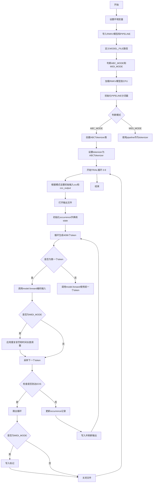
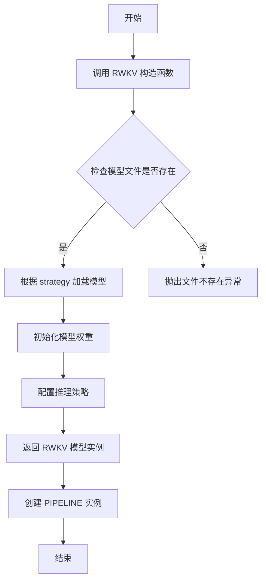
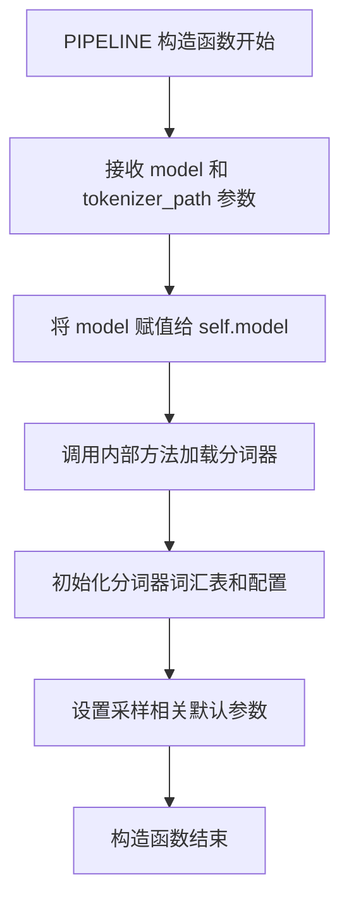
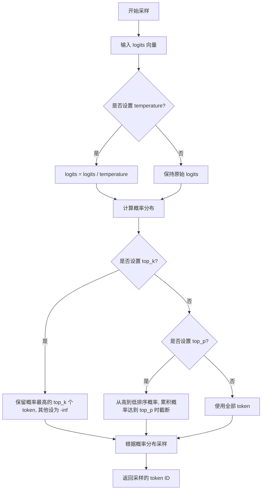
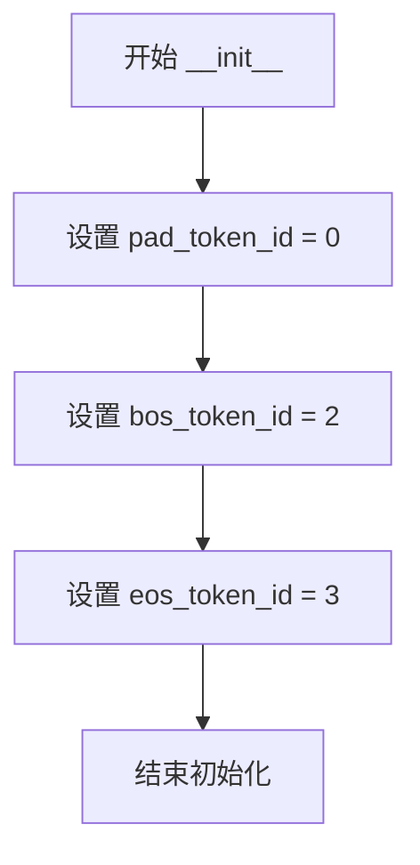
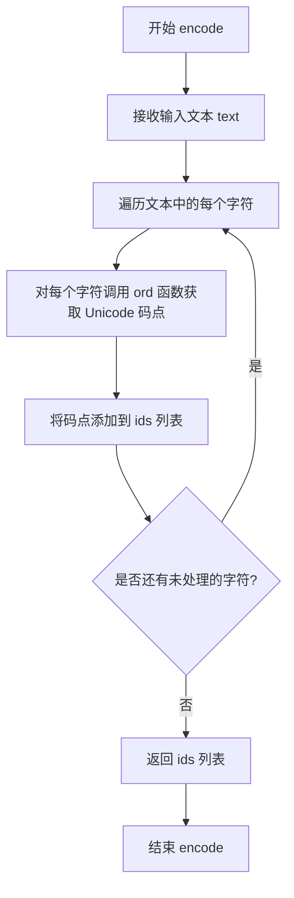

# `ChatRWKV\music\run.py` 详细设计文档

这是一个RWKV语言模型的音乐生成脚本，支持ABC notation和MIDI两种模式。通过加载预训练模型，对输入进行编码，然后循环生成音乐token序列，并应用重复惩罚和时间长度控制等采样策略，最终输出为ABC文本或MIDI格式的音乐数据。

## 整体流程



## 类结构

```
脚本主流程
└── ABCTokenizer (条件定义类)
    ├── __init__ (初始化方法)
    ├── encode (编码方法)
    └── decode (解码方法)
```

## 全局变量及字段


### `MODEL_FILE`
    
模型文件路径，指向预训练的RWKV模型权重

类型：`str`
    


### `ABC_MODE`
    
标识当前是否为ABC音乐模式，用于区分处理逻辑

类型：`bool`
    


### `MIDI_MODE`
    
标识当前是否为MIDI音乐模式，用于区分处理逻辑

类型：`bool`
    


### `model`
    
RWKV模型实例，负责加载和执行推理

类型：`RWKV`
    


### `pipeline`
    
分词器管道，负责tokenization和采样

类型：`PIPELINE`
    


### `tokenizer`
    
分词器对象，根据模式选择ABC分词器或MIDI管道

类型：`object`
    


### `EOS_ID`
    
结束token的ID，用于判断生成是否结束

类型：`int`
    


### `TOKEN_SEP`
    
token之间的分隔符，ABC模式为空，MIDI模式为空格

类型：`str`
    


### `TRIAL`
    
试验循环计数器，控制生成试验的次数

类型：`int`
    


### `ccc`
    
初始输入字符串，作为模型生成的起始上下文

类型：`str`
    


### `ccc_output`
    
输出内容字符串，包含要写入文件的生成结果

类型：`str`
    


### `fout`
    
输出文件对象，用于写入生成的token序列

类型：`file`
    


### `occurrence`
    
token出现记录字典，用于实现重复惩罚机制

类型：`dict`
    


### `state`
    
模型状态对象，用于维持RNN的隐藏状态

类型：`object`
    


### `out`
    
模型输出的logits向量，用于token采样

类型：`ndarray`
    


### `token`
    
采样的token ID，作为下一个输入或最终输出

类型：`int`
    


### `ABCTokenizer.pad_token_id`
    
填充token ID，用于序列对齐

类型：`int`
    


### `ABCTokenizer.bos_token_id`
    
起始token ID，标识序列开始

类型：`int`
    


### `ABCTokenizer.eos_token_id`
    
结束token ID，标识序列结束

类型：`int`
    
    

## 全局函数及方法


### `RWKV.__init__`

该函数是 RWKV 模型的构造函数，用于加载指定的预训练 RWKV 模型文件并初始化模型实例。通过 `strategy` 参数指定模型的运行策略（如 CPU、GPU、量化等）。

参数：

-  `model`：`str`，模型文件路径，指向预训练的 RWKV 模型权重文件（如 `/fsx/BlinkDL/HF-MODEL/rwkv-5-music/RWKV-5-ABC-82M-v1-20230901-ctx1024`）
-  `strategy`：`str`，模型运行策略，指定硬件加速和精度配置（如 `'cpu fp32'` 表示使用 CPU 且使用 32 位浮点数）

返回值：`RWKV`，返回初始化后的 RWKV 模型实例，用于后续的前向推理

#### 流程图



#### 带注释源码

```python
# 导入 RWKV 模型类
from rwkv.model import RWKV

# 模型文件路径 - 指向预训练的 RWKV-5-ABC-82M 模型
MODEL_FILE = '/fsx/BlinkDL/HF-MODEL/rwkv-5-music/RWKV-5-ABC-82M-v1-20230901-ctx1024'

# 判断模型模式：ABC 音乐谱或 MIDI 音乐
ABC_MODE = ('-ABC-' in MODEL_FILE)
MIDI_MODE = ('-MIDI-' in MODEL_FILE)

# ============================================================
# RWKV 构造函数调用
# 参数：
#   model: 模型文件路径
#   strategy: 运行策略，'cpu fp32' 表示使用 CPU 和 32 位浮点精度
# ============================================================
model = RWKV(model=MODEL_FILE, strategy='cpu fp32')

# 创建 PIPELINE 实例，用于分词和采样
pipeline = PIPELINE(model, "tokenizer-midi.json")
```

#### 补充说明

1. **设计目标**：RWKV 是一种新型的循环神经网络架构，结合了 RNN 和 Transformer 的优点，能够高效处理长序列任务

2. **约束条件**：
   - 需要提前下载预训练模型权重文件
   - 根据硬件配置选择合适的 `strategy`（如 `'cuda fp16'` 使用 GPU 加速）

3. **错误处理**：
   - 如果模型文件路径不存在，会抛出 `FileNotFoundError`
   - 如果指定的 `strategy` 不支持，会抛出相应异常

4. **外部依赖**：
   - 依赖 `rwkv` Python 包
   - 需要对应的分词器文件（如 `tokenizer-midi.json`）

5. **技术债务/优化空间**：
   - 当前使用 CPU 推理，可以考虑使用 GPU 加速（设置 `strategy='cuda fp16'`）
   - 可以考虑使用量化策略减少内存占用（如 `cpu fp16` 或 `cpu fp32i8`）
   - 当前模型上下文长度为 1024（ABC 模式）或 4096（MIDI 模式），可根据需要选择更长上下文的模型


### `PIPELINE.__init__`

PIPELINE 类是 RWKV 模型推理的管道封装类，负责加载分词器（tokenizer）并提供模型推理接口。该类的构造函数接收 RWKV 模型实例和分词器配置文件路径，初始化分词器并绑定模型实例，以便后续执行 encode（编码）、decode（解码）和 sample_logits（采样）等操作。

参数：

-  `model`：`RWKV` 类实例，已经初始化并加载了模型权重
-  `tokenizer_path`：`str`，分词器配置文件的路径（JSON 格式），用于加载分词器词汇表和配置

返回值：`None`，构造函数不返回任何值，仅初始化实例属性

#### 流程图



#### 带注释源码

```python
# 从 rwkv.utils 模块导入 PIPELINE 类
from rwkv.utils import PIPELINE

# 假设 PIPELINE 类的内部实现类似于：
class PIPELINE:
    def __init__(self, model, tokenizer_path):
        """
        PIPELINE 构造函数初始化
        
        参数:
            model: RWKV 模型实例，包含已加载的模型权重
            tokenizer_path: 分词器配置文件路径（JSON格式）
        
        返回:
            None
        """
        # 保存模型引用到实例属性
        self.model = model
        
        # 加载并初始化分词器
        # tokenizer_path 通常是如 "tokenizer-midi.json" 的文件路径
        self.tokenizer = self._load_tokenizer(tokenizer_path)
        
        # 初始化采样相关的配置
        self.vocab_size = model.config.vocab_size if hasattr(model, 'config') else None
    
    def _load_tokenizer(self, tokenizer_path):
        """
        内部方法：加载分词器
        从 JSON 文件加载词汇表和配置
        """
        # 实际实现会包含 JSON 解析和词汇表构建
        pass
    
    def encode(self, text):
        """
        将文本编码为 token ID 列表
        
        参数:
            text: 输入文本字符串
        
        返回:
            token_ids: list of int
        """
        pass
    
    def decode(self, token_ids):
        """
        将 token ID 列表解码为文本
        
        参数:
            token_ids: token ID 列表
        
        返回:
            text: 解码后的文本字符串
        """
        pass
    
    def sample_logits(self, logits, temperature=1.0, top_k=None, top_p=None):
        """
        从模型输出的 logits 中采样下一个 token
        
        参数:
            logits: 模型输出的原始分数（未归一化）
            temperature: float, 温度参数，控制采样随机性（越大越随机）
            top_k: int, 仅保留概率最高的 k 个 token
            top_p: float, 累积概率阈值（核采样）
        
        返回:
            token: int, 采样得到的 token ID
        """
        pass

# 在代码中的实际使用方式：
pipeline = PIPELINE(model, "tokenizer-midi.json")

# 后续调用示例：
# out, state = model.forward(tokenizer.encode(ccc), state)  # 使用 pipeline 的 tokenizer 进行编码
# token = pipeline.sample_logits(out, temperature=1.0, top_k=8, top_p=0.8)  # 采样
# tokenizer.decode([token])  # 解码 token
```


### `PIPELINE.sample_logits`

该函数是 RWKV 模型推理管道中的核心采样方法，负责将模型输出的原始 logits 转换为最终采样的 token ID，支持 temperature（温度采样）、top-k（截断采样）和 top-p（核采样）等多种采样策略，以控制生成文本的多样性和质量。

参数：

- `logits`：`numpy.ndarray`，模型输出的原始 logits 向量，维度为词汇表大小
- `temperature`：`float`，温度参数，用于缩放 logits，值越大生成结果越随机，值越小越确定性
- `top_k`：`int`（可选），top-k 采样参数，限制只从概率最高的 k 个 token 中选择，设为 0 或 None 表示禁用
- `top_p`：`float`（可选），top-p（核采样）参数，限制从累积概率达到 p 的最小 token 集合中选择，设为 0 或 None 表示禁用
- `penalty`：`float`（可选），重复惩罚因子，用于减少生成重复 token 的概率

返回值：`int`，采样的 token ID

#### 流程图



#### 带注释源码

```python
# 由于源代码中 PIPELINE 类来自 rwkv.utils 模块，未直接给出实现
# 以下为基于调用的推理和常见采样逻辑的注释说明

def sample_logits(self, logits, temperature=1.0, top_k=None, top_p=None, penalty=None):
    """
    从模型输出的 logits 中采样下一个 token
    
    参数:
        logits: 模型输出的原始 logits (numpy array, shape: [vocab_size])
        temperature: 温度参数，控制随机性 (值越大越随机)
        top_k: 只考虑概率最高的 k 个 token
        top_p: 核采样阈值，选择累积概率 >= top_p 的最小 token 集合
    
    返回:
        采样的 token ID (int)
    """
    
    # 1. 应用温度缩放
    if temperature != 1.0:
        logits = logits / temperature
    
    # 2. 应用重复惩罚 (如果提供)
    if penalty is not None:
        # 对已出现的 token 施加惩罚
        # 此处需要记录历史 token 位置
        pass
    
    # 3. 转换为概率分布 (softmax)
    exp_logits = np.exp(logits - np.max(logits))  # 数值稳定处理
    probs = exp_logits / np.sum(exp_logits)
    
    # 4. Top-k 截断
    if top_k is not None and top_k > 0:
        # 将不在 top-k 范围内的 token 概率设为极小值
        top_indices = np.argpartition(probs, -top_k)[-top_k:]
        mask = np.zeros_like(probs)
        mask[top_indices] = 1
        probs = probs * mask
        probs = probs / np.sum(probs)  # 重新归一化
    
    # 5. Top-p (核) 采样
    if top_p is not None and top_p > 0:
        # 按概率降序排序
        sorted_indices = np.argsort(probs)[::-1]
        sorted_probs = probs[sorted_indices]
        
        # 计算累积概率
        cumsum = np.cumsum(sorted_probs)
        
        # 找到累积概率超过 top_p 的截断点
        cutoff_idx = np.searchsorted(cumsum, top_p)
        # 保留 cutoff_idx 之后的 token
        keep_indices = sorted_indices[:cutoff_idx + 1]
        
        # 创建掩码并重新归一化
        mask = np.zeros_like(probs)
        mask[keep_indices] = 1
        probs = probs * mask
        probs = probs / np.sum(probs)
    
    # 6. 根据概率分布采样
    # 使用多项式分布随机选择
    token = np.random.choice(len(probs), p=probs)
    
    return token
```

---

### 补充说明

#### 采样策略解析

| 参数 | 作用 | 典型值 |
|------|------|--------|
| `temperature=1.0` | 保持原始分布 | <1 更保守, >1 更随机 |
| `top_k=8` | 限制候选 token 数量 | 减少低概率 token 被选中 |
| `top_p=0.8` | 动态调整候选集合 | 保留高概率区域的 token |

#### 调用示例

```python
# 标准采样配置 (代码中实际使用)
token = pipeline.sample_logits(out, temperature=1.0, top_k=8, top_p=0.8)

# 仅使用 top-p 采样
token = pipeline.sample_logits(out, temperature=1.0, top_p=0.7)

# 更保守的采样
token = pipeline.sample_logits(out, temperature=1.0, top_p=0.5)
```

#### 技术债务与优化空间

1. **采样逻辑未完全开源**：PIPELINE 类的具体实现位于 rwkv 库内部，无法在当前代码片段中查看完整源码
2. **重复惩罚实现缺失**：代码中虽调用了 `occurrence` 字典记录已出现 token 并手动调整 logits，但 `sample_logits` 函数本身未封装此逻辑
3. **数值稳定性**：大词汇表下 softmax 可能出现数值溢出，建议参考源码中的具体处理方式


### `ABCTokenizer.__init__`

这是ABCTokenizer类的构造函数，用于初始化ABC音乐符号分词器的基础配置，设置填充符、起始符和终止符的token ID。

参数：

- `self`：实例本身，无需显式传递

返回值：`None`，无返回值，仅进行对象属性初始化

#### 流程图



#### 带注释源码

```python
def __init__(self):
    """
    ABCTokenizer 类的构造函数
    
    初始化ABC音乐符号分词器的基本token ID配置：
    - pad_token_id: 填充符，用于序列补齐
    - bos_token_id: 起始符，标识序列开始
    - eos_token_id: 终止符，标识序列结束
    """
    self.pad_token_id = 0  # 填充符的token ID，值为0
    self.bos_token_id = 2  # 序列起始符的token ID，值为2
    self.eos_token_id = 3  # 序列终止符的token ID，值为3
```


### `ABCTokenizer.encode`

该方法接收一个字符串文本作为输入，通过遍历字符串中的每个字符并使用Python的`ord()`函数获取其对应的Unicode码点，最终返回一个由整数字符码组成的列表，实现文本到数字标识符的转换。

参数：

- `text`：`str`，需要进行编码的文本字符串

返回值：`list[int]`，返回文本对应的Unicode码点（整数）列表

#### 流程图



#### 带注释源码

```python
def encode(self, text):
    """
    将输入的文本字符串编码为 Unicode 码点列表
    
    参数:
        text: str - 要编码的文本字符串
        
    返回:
        list[int] - Unicode 码点（整数）列表
    """
    # 遍历输入文本的每个字符，使用 ord() 函数获取其 Unicode 码点
    # ord() 函数返回字符对应的整数（ASCII 或 Unicode 码点）
    # 例如：ord('A') 返回 65，ord('a') 返回 97
    ids = [ord(c) for c in text]
    
    # 返回包含所有字符码点的列表
    return ids
```


### `ABCTokenizer.decode`

该方法是ABC记谱法分词器的解码方法，负责将模型输出的token ID列表转换回可读的文本字符串。解码过程中会过滤掉EOS token，并使用字符编码将大于EOS token ID的数值转换为对应字符。

参数：

-  `ids`：`List[int]`，需要解码的token ID列表

返回值：`str`，解码后的文本字符串

#### 流程图

```mermaid
flowchart TD
    A[开始解码] --> B[遍历ids列表中的每个token]
    B --> C{idx > eos_token_id?}
    C -->|是| D[执行chr(idx)转换]
    C -->|否| E{idx == eos_token_id?}
    E -->|是| F[跳过该token]
    E -->|否| G[添加空字符串]
    D --> H[将转换结果添加到列表]
    F --> H
    G --> H
    H --> I{是否还有更多token?}
    I -->|是| B
    I -->|否| J[使用join合并所有字符]
    J --> K[返回解码后的文本字符串]
```

#### 带注释源码

```
def decode(self, ids):
    # ids: List[int] - 待解码的token ID列表
    # self.eos_token_id: int - 结束符token的ID，值为3
    
    # 列表推导式遍历每个token ID
    # 条件1: idx != self.eos_token_id 过滤掉结束符
    # 条件2: idx > self.eos_token_id 才进行字符转换
    # 如果idx <= eos_token_id（例如pad_token_id=0或bos_token_id=2），则添加空字符串
    txt = ''.join(
        chr(idx) if idx > self.eos_token_id else '' 
        for idx in ids if idx != self.eos_token_id
    )
    # chr()将Unicode码点转换为对应字符
    # 例如: chr(65) -> 'A', chr(66) -> 'B'
    
    return txt
    # 返回解码后的文本字符串
```

## 关键组件


### RWKV 模型加载与初始化

使用 `RWKV` 类加载预训练的语言模型，支持 CPU 和 CUDA 推理。模型文件路径指向 MIDI 或 ABC 格式的预训练模型，通过 `strategy` 参数指定计算设备与精度。

### PIPELINE 分词器

`PIPELINE` 类负责模型的分词与解码，将文本转换为 token ID 或将 token ID 转换回文本。内置 `sample_logits` 方法实现基于 temperature、top_k、top_p 的采样策略。

### ABCTokenizer 自定义分词器

当使用 ABC 模式时，代码定义了一个自定义的分词器类。实现简单的字符级编码，将字符转换为 ASCII 码作为 token ID，并支持反向解码。

### MIDI 模式重复惩罚机制

在 MIDI 生成模式下，代码维护一个 `occurrence` 字典记录已出现 token 的频率。对重复出现的 token 施加递增的惩罚值（音符类 token 惩罚系数 1.0，非音符类 0.3），并每步乘以 0.997 的衰减系数以平衡生成的多样性与连贯性。

### 采样与生成循环

主生成循环最多迭代 4096 步，每步调用 `model.forward()` 获取模型输出 logits，然后使用 `pipeline.sample_logits()` 进行采样。MIDI 模式额外调整 token 0（pad）和 token 127 的 logits 以控制生成长度和避免特定音符。

### EOS 终止符处理

根据模式（ABC 或 MIDI）定义不同的结束符 ID（EOS_ID），当采样到终止符时立即停止生成，确保输出序列完整且有意义。

### 输出文件管理

根据模式将生成的内容写入对应的文本文件（abc_TRIAL.txt 或 midi_TRIAL.txt），支持增量写入并 flush 确保数据及时落盘。


## 问题及建议


### 已知问题

-   **硬编码的配置和路径**：MODEL_FILE路径、环境变量（RWKV_JIT_ON、RWKV_CUDA_ON、RWKV_RESCALE_LAYER）直接写死在代码中，缺乏配置管理机制
-   **魔数散落**：生成4096长度、重复惩罚系数0.5/0.997、时间偏移2000/500等数值没有提取为常量，理解和维护困难
-   **错误处理完全缺失**：模型加载、文件读写、tokenizer操作均无try-except保护，运行时错误会导致程序崩溃
-   **代码结构混乱**：主逻辑全部在模块级别执行，未封装为函数，难以测试和复用；ABC_MODE和MIDI_MODE的分支逻辑交织
-   **tokenizer实现不一致**：ABCTokenizer是简单实现且decode方法逻辑晦涩；EOS_ID在不同模式下设置规则不同（ABC_MODE用tokenizer.eos_token_id，MIDI_MODE用0）
-   **重复惩罚机制复杂难懂**：occurrence字典的更新逻辑包含硬编码阈值（128、127）和magic number（0.997、0.3、1+），且逻辑分散在两处
-   **采样策略硬编码**：temperature、top_k、top_p参数固定，多种采样方式被注释但未提供选择机制
-   **资源管理不规范**：文件操作未使用with语句，虽然有flush()但异常时可能未正确关闭
-   **未使用的导入**：导入了sys但未使用，numpy配置项可能非最优
-   **缺乏状态机或配置驱动**：生成流程的配置（如MIDI_MODE下的特殊处理）散布在代码中，新增模式困难

### 优化建议

-   将所有配置抽取到独立配置文件（YAML/JSON）或命令行参数解析（argparse），包括模型路径、生成参数、路径配置等
-   将魔数定义为类常量或配置对象，如MAX_SEQ_LEN、REP_PENALTY_DECAY、TIME_PENALTY_START等
-   使用with语句管理文件资源，添加完整的异常处理和日志记录
-   重构为清晰的函数结构：load_model()、create_tokenizer()、generate()、apply_penalties()等
-   统一tokenizer接口，抽象基类或协议，确保EOS_ID处理一致
-   设计采样策略的配置化方案，支持通过参数选择不同采样方法
-   简化重复惩罚逻辑，提取为独立函数并添加详细注释说明其数学原理
-   移除未使用的导入，优化numpy打印配置仅在必要时使用
-   考虑添加生成进度回调、配置验证、单元测试等工程化特性


## 其它


### 设计目标与约束

该代码旨在实现RWKV语言模型的音乐生成功能，支持ABC符号和MIDI令牌两种音乐格式的生成。核心设计目标包括：1) 提供灵活的音乐生成pipeline，支持不同的生成策略（温度、top-k、top-p采样）；2) 针对MIDI模式实现重复惩罚机制以提升生成质量；3) 实现流式输出，边生成边写入文件。性能约束方面，当前默认使用CPU fp32推理，ctx4096的上下文长度限制，以及MIDI模式下的4096次迭代上限。

### 错误处理与异常设计

代码主要依赖外部库（RWKV、PIPELINE）的异常传播。关键风险点包括：1) 模型文件路径不存在或损坏时应抛出FileNotFoundError；2) tokenizer初始化失败导致后续编码/解码失败；3) 文件写入失败（如磁盘空间不足）时未捕获异常；4) GPU内存不足时的CUDA异常。建议在模型加载处添加try-except捕获Exception并输出友好错误信息，在文件操作处添加异常处理。

### 数据流与状态机

代码采用迭代式生成状态机，状态流转如下：初始状态（i=0）使用初始prompt进行首次forward调用获取输出状态；生成状态（i>0）基于前一token循环调用forward；终止状态检测到EOS_ID或达到最大迭代次数时退出。MIDI模式下还有额外的重复惩罚状态维护occurrence字典记录token出现频率。

### 外部依赖与接口契约

核心依赖包括：1) rwkv.model.RWKV类 - 模型加载与推理，方法forward(indices, state)返回(logits, new_state)；2) rwkv.utils.PIPELINE类 - tokenizer与采样器，方法encode(text)/decode(ids)/sample_logits；3) numpy库 - 数值计算；4) tokenizer配置文件(tokenizer-midi.json)。接口契约：model.forward接受list[int]类型的token IDs和当前state，返回numpy数组logits和新state；pipeline.sample_logits接受logits向量和采样参数，返回int类型的token ID。

### 配置与参数说明

关键配置项：1) MODEL_FILE - 模型文件路径，必须指向有效的RWKV模型；2) RWKV_JIT_ON - JIT编译开关，默认启用；3) RWKV_CUDA_ON - CUDA加速开关，当前设为0使用CPU；4) RWKV_RESCALE_LAYER - 层重缩放参数，Music模型需设为999；5) 采样参数temperature控制随机性，top_k限制候选集大小，top_p控制累积概率阈值。

### 性能考虑

当前性能瓶颈：1) CPU推理速度较慢，建议在支持CUDA的环境下启用GPU加速；2) 每次迭代都调用fout.flush()，频繁IO影响性能，可改为每N次迭代flush一次；3) occurrence字典在MIDI模式下每轮迭代都进行遍历更新，可优化为只更新新出现的token；4) np.set_printoptions设置对推理无实际作用，可移除。

### 安全性考虑

代码未包含用户输入验证机制，存在潜在风险：1) 未验证MODEL_FILE路径安全性，可能存在路径遍历攻击；2) 未对生成的token长度做上限保护，可能导致内存耗尽；3) 文件写入未做权限检查。建议在生产环境中添加输入验证和资源限制。

### 使用示例与扩展建议

当前代码以脚本形式运行，每次生成10个样本到独立文件。扩展建议：1) 可封装为类或函数以便复用；2) 可添加命令行参数支持自定义配置；3) 可实现中断续生成功能；4) 可添加生成结果的质量评估接口；5) MIDI模式可集成str_to_midi.py实现直接的MIDI文件输出。

    