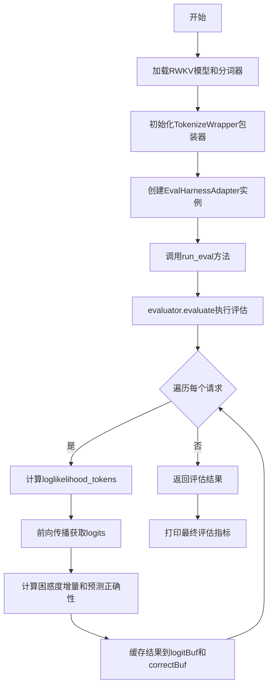
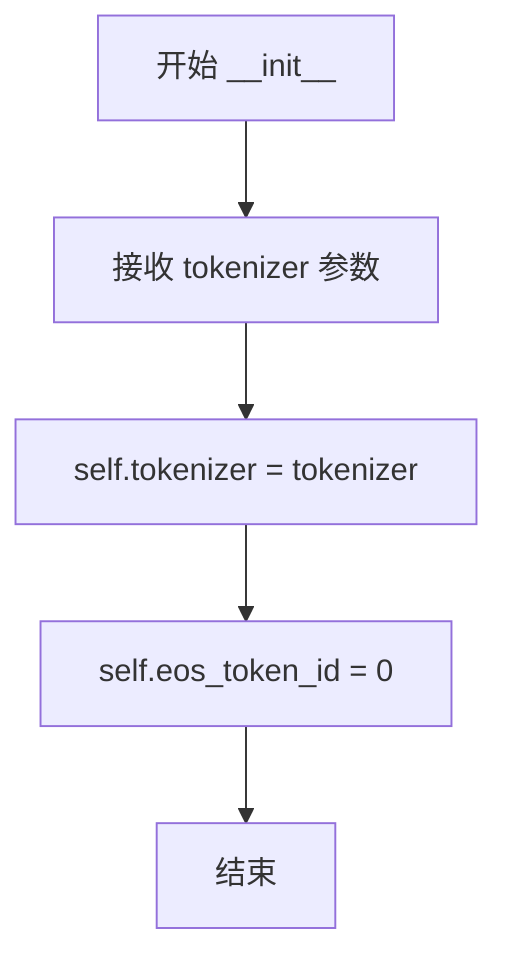
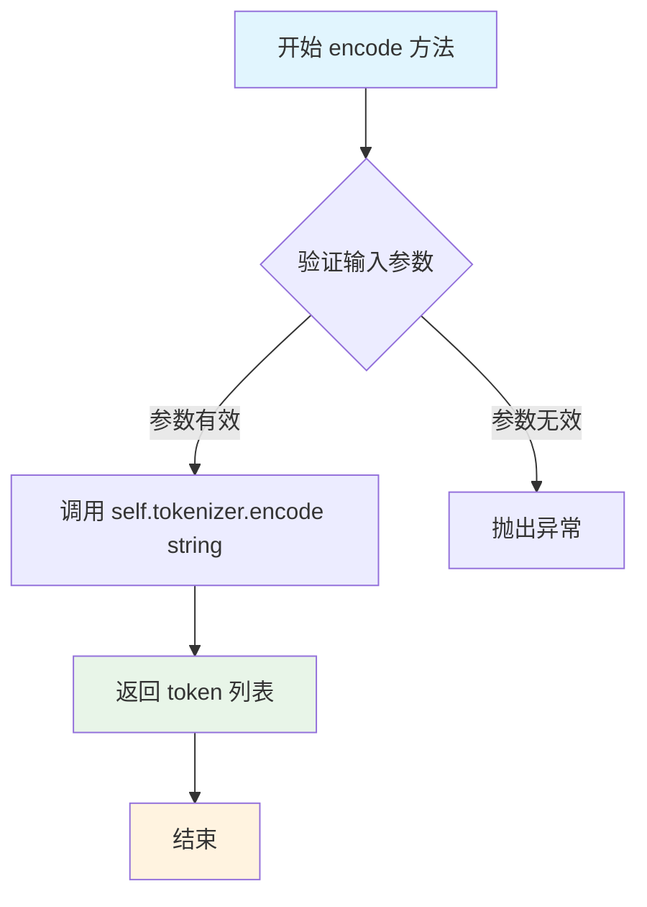
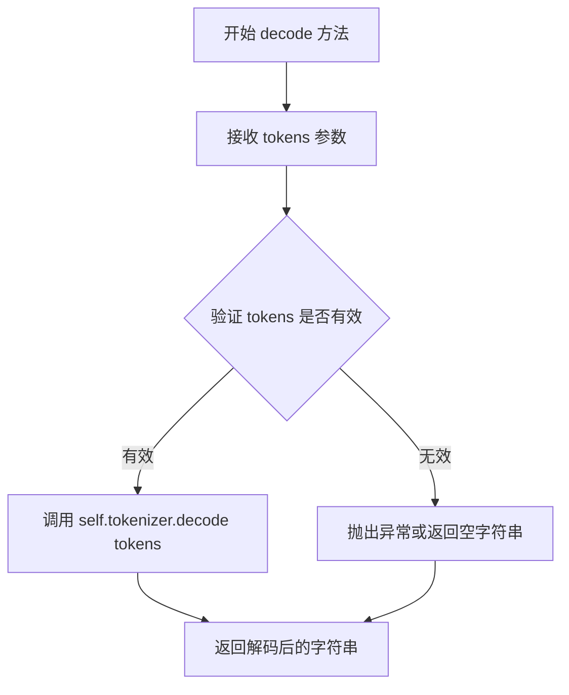
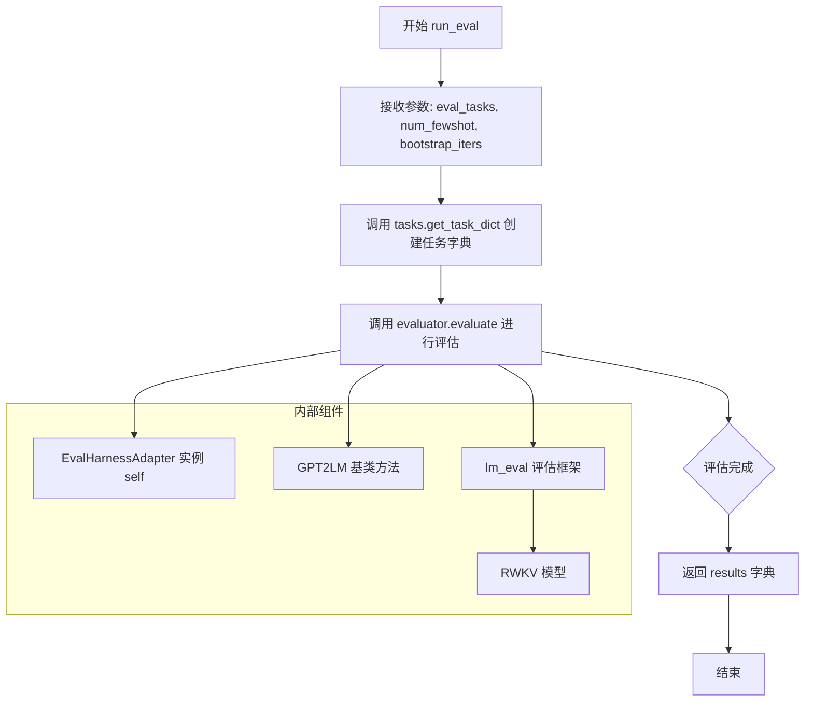

# `ChatRWKV\run_lm_eval.py` 详细设计文档

该代码是一个RWKV语言模型的评估脚本，通过集成lm_eval框架对RWKV-5-World模型进行语言建模评估，使用lambada_openai等标准基准测试集测试模型的困惑度和准确率，并实现了自定义的tokenizer包装器和评估适配器。

## 整体流程



## 类结构

```
GPT2LM (lm_eval基类)
└── EvalHarnessAdapter (评估适配器)
    └── TokenizerWrapper (分词器包装器)
```

## 全局变量及字段


### `MODEL_NAME`
    
File path to the RWKV model to be loaded.

类型：`str`
    


### `logitBuf`
    
Cache dictionary storing computed log likelihood values for processed sequences.

类型：`Dict[str, float]`
    


### `correctBuf`
    
Cache dictionary storing correctness flags for processed sequences.

类型：`Dict[str, bool]`
    


### `RWKV_PAD`
    
Token IDs used for padding, derived from newline character.

类型：`List[int]`
    


### `adapter`
    
Adapter instance for evaluating the RWKV model using lm_eval.

类型：`EvalHarnessAdapter`
    


### `eval_tasks`
    
List of evaluation tasks to run.

类型：`List[str]`
    


### `model`
    
The RWKV model instance loaded from the specified model name.

类型：`RWKV`
    


### `pipeline`
    
The pipeline object for tokenization and model inference.

类型：`PIPELINE`
    


### `results`
    
Dictionary containing evaluation results for the specified tasks.

类型：`Dict[str, Any]`
    


### `TokenizerWrapper.tokenizer`
    
The tokenizer object from the pipeline used for encoding and decoding.

类型：`Any`
    


### `TokenizerWrapper.eos_token_id`
    
End-of-sequence token ID, set to 0.

类型：`int`
    


### `EvalHarnessAdapter.tokenizer`
    
The tokenizer wrapper instance for handling tokenization.

类型：`TokenizerWrapper`
    
    

## 全局函数及方法


### `TokenizerWrapper.__init__`

该方法为 TokenizerWrapper 类的构造函数，用于初始化分词器包装器，将传入的 tokenizer 对象存储为实例属性，并设置默认的 EOS 令牌 ID。

参数：

- `tokenizer`：对象，需要集成的分词器对象（来自 PIPELINE 的 tokenizer）

返回值：`None`，构造函数无返回值

#### 流程图



#### 带注释源码

```python
class TokenizerWrapper:
    def __init__(self, tokenizer):
        """
        初始化 TokenizerWrapper 类
        
        参数:
            tokenizer: 分词器对象，用于编码和解码文本
        """
        # 将传入的分词器对象存储为实例属性，供后续 encode/decode 方法使用
        self.tokenizer = tokenizer
        
        # 设置默认的 EOS (End of Sequence) 令牌 ID 为 0
        # 注意：这里硬编码为 0，可能不够灵活
        self.eos_token_id = 0
```


### TokenizerWrapper.encode

该方法是 TokenizerWrapper 类的编码方法，用于将输入的字符串转换为 token 序列。它封装了底层 tokenizer 的 encode 功能，虽然接收了 add_special_tokens 参数，但实际未使用该参数。

参数：

- `string`：`str`，需要进行编码的字符串
- `add_special_tokens`：`bool`，是否添加特殊标记（默认 False），当前实现中未使用

返回值：`list`，编码后的 token 列表

#### 流程图



#### 带注释源码

```
def encode(self, string: str, add_special_tokens=False):
    """
    将字符串编码为 token 序列
    
    参数:
        string: str - 要编码的输入字符串
        add_special_tokens: bool - 是否添加特殊标记（当前未使用）
    
    返回:
        list - 编码后的 token 列表
    """
    return self.tokenizer.encode(string)  # 委托给底层 tokenizer 进行编码
```


### TokenizerWrapper.decode

该方法是 `TokenizerWrapper` 类的成员方法，负责将 tokenizer 生成的 token 序列解码为人类可读的字符串文本。该方法是对底层 tokenizer `decode` 方法的简单封装，用于在评估框架接口与 RWKV 模型 tokenizer 之间建立桥梁。

参数：

- `tokens`：任意类型，接收待解码的 token 序列（通常为整数列表或 tensor），直接传递给底层 tokenizer 的 decode 方法进行解码

返回值：`str`，返回解码后的字符串文本

#### 流程图



#### 带注释源码

```python
def decode(self, tokens):
    """
    将 token 序列解码为字符串文本
    
    参数:
        tokens: 待解码的 token 序列，通常为整数列表或 tensor
        
    返回:
        解码后的字符串文本
    """
    return self.tokenizer.decode(tokens)  # 直接委托给底层 tokenizer 的 decode 方法
```


### `EvalHarnessAdapter._loglikelihood_tokens`

该函数是 RWKV 模型与 lm_eval 评估框架的适配器的核心方法，用于计算给定文本序列的对数似然度（log-likelihood）和预测准确性。它遍历请求列表，对每个序列进行前向传播，计算每个位置的概率对数，并判断预测是否正确，同时实现了缓存机制以避免重复计算。

参数：

- `requests`：参数类型为列表（List），包含待评估的请求对象，每个请求包含原始上下文、提示和目标序列
- `disable_tqdm`：参数类型为布尔值（bool），用于控制是否禁用 tqdm 进度条显示

返回值：`List[Tuple[float, bool]]`，返回包含（对数似然度, 预测是否正确）元组的列表

#### 流程图

```mermaid
flowchart TD
    A[开始 _loglikelihood_tokens] --> B[初始化空结果列表 res]
    B --> C[遍历 requests 列表]
    C --> D{当前请求是否已缓存}
    D -->|是| E[从缓存获取 logit 和 correct]
    D -->|否| F[计算 q_len = lenrequests[n][1] + lenRWKV_PAD]
    F --> G[使用 model.forward 获取完整输出]
    G --> H[遍历从 q_len-1 到 len src-1 的位置]
    H --> I[计算当前位置的 logit 累加值]
    I --> J{预测token是否等于目标token}
    J -->|否| K[correct = False]
    J -->|是| L[继续]
    K --> M[缓存 logit 和 correct]
    L --> M
    M --> N[将 logit, correct 添加到结果列表]
    E --> N
    N --> O{当前索引是 1000 的倍数}
    O -->|是| P[打印进度信息]
    O -->|否| Q
    P --> Q
    Q --> R{是否遍历完所有请求}
    R -->|否| C
    R -->|是| S[返回结果列表 res]
```

#### 带注释源码

```python
def _loglikelihood_tokens(self, requests, disable_tqdm=False):
    """
    计算给定序列的对数似然度和预测准确性
    
    参数:
        requests: 评估请求列表，每个元素包含原始上下文、提示和目标序列
        disable_tqdm: 是否禁用进度条
    
    返回:
        包含(logit, correct)元组的列表
    """
    # 使用全局缓存字典存储已计算的结果，避免重复计算
    global logitBuf, correctBuf

    # 初始化结果列表
    res = []

    # 遍历所有请求
    for COUNTER in range(len(requests)):
        n = COUNTER
        # raw_src 由请求的第一个元素的两个部分拼接而成（上下文+提示）
        raw_src = requests[n][0][0] + requests[n][0][1]

        # src 由请求的第二和第三个元素拼接（可能是提示+目标）
        src = requests[n][1] + requests[n][2]

        # 预处理：在 raw_src 开头添加换行符，在 src 开头添加 padding token
        raw_src = '\n' + raw_src
        src = RWKV_PAD + src

        # 将 src 转换为字符串作为缓存键
        sss = str(src)
        correct = True  # 初始化预测状态为正确
        
        # 检查缓存中是否已有该序列的计算结果
        if sss in logitBuf:
            # 从缓存中获取 logit 和 correct
            logit = logitBuf[sss]
            correct = correctBuf[sss]
        else:
            # 计算查询长度：提示长度 + padding 长度
            q_len = len(requests[n][1])
            q_len += len(RWKV_PAD)
            logit = 0  # 初始化对数似然度累加器
            
            # 使用 torch.no_grad() 禁用梯度计算，提高推理效率
            with torch.no_grad():
                # 调用模型前向传播，获取完整输出
                outputs, _ = model.forward(src, None, full_output=True)
                
                # 遍历从查询位置开始到序列末尾的每个位置
                for i in range(q_len-1, len(src)-1):
                    # 获取当前位置的输出，并转换为 float 类型
                    oo = outputs[i].detach().float()
                    # 目标 token 是下一个位置的 token
                    dst = src[i+1]
                    # 计算 logit：使用 softmax 获取概率分布，然后取目标 token 的对数概率
                    logit += math.log(F.softmax(oo, dim=-1)[dst])
                    # 对输出进行排序，获取预测结果
                    _, s_index = torch.sort(oo, descending=True)
                    # 预测 token 是排序后的第一个元素
                    pred = s_index[0].item()
                    # 如果预测不等于目标，则标记为不正确
                    if pred != dst:
                        correct = False
                
                # 释放显存
                outputs = None
                pred = None
            
            # 将计算结果存入缓存
            logitBuf[sss] = logit
            correctBuf[sss] = correct
        
        # 将当前请求的结果添加到结果列表
        res += [(logit, correct)]
        
        # 每处理 1000 个请求打印一次进度
        if n % 1000 == 0:
            print(f'{n//1000}/{len(requests)//1000}', end = ' ', flush=True)
    
    # 返回结果列表
    return res
```


### `EvalHarnessAdapter.run_eval`

这是评估适配器的核心方法，用于在RWKV语言模型上运行标准的LM评估任务（如LAMBADA等），通过lm_eval框架进行评估并返回标准化的评估结果。

参数：

- `eval_tasks`：`List[str]`，待评估的任务名称列表，如`['lambada_openai']`
- `num_fewshot`：`int`，few-shot评估时使用的示例数量，默认为0
- `bootstrap_iters`：`int`，bootstrap重采样的迭代次数，用于计算置信区间，默认为2

返回值：`Dict`，评估结果字典，包含各任务的评估指标和统计数据

#### 流程图



#### 带注释源码

```python
@torch.no_grad()  # 禁用梯度计算，减少内存占用
def run_eval(self, eval_tasks=None, num_fewshot=0, bootstrap_iters=2):
    """
    运行评估流程的主方法
    
    参数:
        eval_tasks: 任务名称列表，用于指定要运行哪些评估任务
        num_fewshot: few-shot数量，控制每个任务使用多少个示例进行提示
        bootstrap_iters: bootstrap迭代次数，用于统计置信区间
    
    返回:
        results: 包含所有任务评估结果的字典
    """
    
    # 调用 lm_eval 库的 evaluator.evaluate 方法执行评估
    # 参数说明:
    #   lm=self: 传入当前适配器实例，实现 GPT2LM 接口
    #   task_dict: 任务字典，由 tasks.get_task_dict 创建
    #   provide_description: 是否提供任务描述
    #   num_fewshot: few-shot示例数量
    #   limit: 限制评估样本数量，None表示使用全部数据
    #   bootstrap_iters: bootstrap重采样次数
    results = evaluator.evaluate(
        lm=self,
        task_dict=tasks.get_task_dict(eval_tasks),
        provide_description=False,
        num_fewshot=num_fewshot,
        limit=None,
        bootstrap_iters=bootstrap_iters,
    )
    
    # 返回完整的评估结果，包含:
    # - results: 每个任务的详细指标
    # - configs: 任务配置信息
    # - num_fewshot: 实际使用的few-shot数量
    # 等字段
    return results
```

#### 关键集成说明

该方法依赖于以下组件的协作：

1. **EvalHarnessAdapter类**：继承自`GPT2LM`，实现了lm_eval所需的标准接口
2. **_loglikelihood_tokens方法**：实际执行模型推理的核心方法，计算log-likelihood
3. **RWKV模型**：通过pipeline进行推理，使用自定义的分词器包装器
4. **lm_eval框架**：标准化的评估框架，支持多种任务和评估指标

## 关键组件


### RWKV模型加载与初始化

使用RWKV类加载预训练的RWKV-5-World模型，配置CUDA fp16策略，并通过PIPELINE工具加载对应的分词器。设置环境变量启用JIT编译和CUDA优化。

### PIPELINE分词器封装

封装rwkv.utils中的PIPELINE类，用于对输入文本进行编码和解码，提供encode和decode方法与lm_eval框架对接。

### TokenizerWrapper适配器

将RWKV的分词器适配为lm_eval框架所需的接口，包含encode和decode方法，以及eos_token_id属性。

### EvalHarnessAdapter评估适配器

继承GPT2LM类，实现与lm_eval评估框架的集成。核心方法_loglikelihood_tokens实现对数似然计算，通过model.forward获取模型输出，计算token级别的对数概率。

### _loglikelihood_tokens方法

计算给定上下文的token级对数似然。实现缓存机制避免重复计算，遍历目标token序列，计算每个位置的对数概率并累加。返回值包含对数似然和正确性标志。

### run_eval方法

使用lm_eval的evaluator进行标准基准评估，支持few-shot设置，返回包含各任务指标的评估结果字典。

### logitBuf和correctBuf全局缓存

字典类型缓存变量，存储已计算过的序列的对数似然值和正确性标志，用于减少重复计算提升评估效率。

### RWKV_PAD填充标记

定义填充标记为换行符的编码，用于处理变长输入的批量评估。

### 模型前向传播

通过model.forward获取模型logits输出，支持full_output=True参数返回完整序列输出用于逐token计算对数似然。


## 问题及建议


### 已知问题

- **全局状态管理问题**：使用全局变量`logitBuf`和`correctBuf`缓存logits和正确性标志，无清理机制，会导致内存持续增长，且在多线程/分布式环境下不安全
- **缺少错误处理**：模型加载、tokenizer初始化、forward推理等关键操作均未添加try-except异常捕获，缺乏对文件路径不存在、GPU内存不足、CUDA错误等情况的处理
- **硬编码配置**：模型路径`MODEL_NAME`、PAD token、评估任务列表等配置直接写死在全局变量中，降低了代码的复用性和灵活性
- **代码冗余与维护性**：存在大量被注释掉的代码（如`greedy_until`方法、多个被注释的评估任务），影响代码可读性；变量命名不规范（如`COUNTER`、`n`、`sss`）
- **批处理缺失**：在`_loglikelihood_tokens`方法中逐个处理请求，未使用批处理加速，评估效率低下
- **类型注解缺失**：类方法和函数缺少参数和返回值的类型注解，降低了代码的可维护性和IDE支持
- **魔法数字**：多处使用魔法数字（如`4096`、`10000`、`200`），缺乏有意义的常量定义
- **资源未显式释放**：使用完模型和tensor后未显式调用`del`或`torch.cuda.empty_cache()`，可能导致GPU内存碎片化
- **环境变量设置时机**：在导入模块后才设置`RWKV_JIT_ON`和`RWKV_CUDA_ON`环境变量，时机过晚可能不生效
- **依赖版本未指定**：代码依赖`rwkv`、`lm_eval`、`torch`、`numpy`等库，但未指定版本约束

### 优化建议

- **实现缓存淘汰机制**：为`logitBuf`和`correctBuf`添加最大容量限制或LRU淘汰策略，防止内存无限增长；或考虑使用`functools.lru_cache`替代
- **添加健壮的错误处理**：对模型加载、推理、评估等关键路径添加异常捕获和重试机制；添加配置文件管理配置参数
- **移除死代码**：删除被注释掉的`greedy_until`方法和多余的任务列表，保持代码整洁
- **优化推理性能**：将请求批量处理而非逐个推理；使用`torch.cuda.amp.autocast`混合精度加速；添加梯度清零和缓存清理
- **完善类型注解**：为所有类方法添加类型注解，提升代码可读性和静态检查能力
- **提取魔法数字**：将`4096`、`10000`、`200`等数值定义为具名常量（如`MAX_CONTEXT_LENGTH`、`BOOTSTRAP_ITERS`、`MAX_RESPONSE_LENGTH`）
- **优化资源管理**：在评估完成后显式释放GPU内存；使用`contextlib`管理资源生命周期
- **规范化代码结构**：将配置、模型加载、评估逻辑分离到不同模块或类中
- **添加日志记录**：使用`logging`模块替代print语句，支持不同日志级别和输出目标
- **添加单元测试**：为关键方法（如`_loglikelihood_tokens`）编写单元测试，确保逻辑正确性


## 其它


### 设计目标与约束

本项目旨在使用RWKV语言模型对lm_eval框架支持的任务进行评估，核心目标是将RWKV模型适配到标准化的语言模型评估流程中。主要约束包括：1) 上下文长度限制为4096 tokens；2) 仅支持CUDA加速的fp16推理；3) 使用'\n'作为padding token；4) 评估任务数量和few-shot数量可通过参数配置。

### 错误处理与异常设计

代码中主要采用try-except隐式处理机制，由torch.no_grad()上下文管理器处理梯度计算异常。模型加载失败时会抛出异常并终止程序；tokenizer编码失败返回空列表；评估任务不存在时lm_eval框架会抛出明确错误。潜在改进点：应增加对MODEL_NAME路径不存在、CUDA不可用、GPU内存不足等情况的显式检查和友好提示。

### 数据流与状态机

数据流主要分为三个阶段：初始化阶段加载模型和tokenizer，创建EvalHarnessAdapter实例；评估阶段通过run_eval调用lm_eval框架，框架向adapter请求每个任务的loglikelihood计算，adapter从缓存或重新计算获取结果；结果汇总阶段框架聚合所有任务结果并输出。状态转换：模型加载 → tokenizer初始化 → 创建adapter → 执行评估 → 返回结果。

### 外部依赖与接口契约

主要依赖包括：torch>=1.8.0（张量计算）、numpy（数值运算）、rwkv（模型推理）、lm_eval（评估框架）、transformers（tokenizer支持）。关键接口契约：RWKV模型需提供forward(src, state, full_output)方法返回logits；PIPELINE需提供tokenizer属性；EvalHarnessAdapter需实现_loglikelihood_tokens()方法返回(logit, correct)元组列表。

### 性能考虑与优化空间

当前实现存在以下优化空间：1) logitBuf和correctBuf缓存机制可减少重复计算，但内存占用随任务量线性增长；2) 模型推理未使用batch处理，单样本串行执行效率低；3) softmax计算在循环内重复执行，可预先计算；4) bootstrap_iters=10000导致评估时间过长，实际使用时建议降低；5) 可考虑使用量化模型进一步加速推理。

### 配置与参数说明

关键配置参数：MODEL_NAME指定模型路径；strategy='cuda fp16'指定推理策略；RWKV_PAD定义padding token；eval_tasks定义评估任务列表；bootstrap_iters控制置信区间计算迭代次数；num_fewshot控制few-shot数量。建议将硬编码参数抽取到配置文件或命令行参数。

### 安全性考虑

代码主要运行于服务端评估场景，安全风险较低。潜在风险点：1) MODEL_NAME直接使用文件系统路径，需防止路径遍历攻击；2) 动态执行model.forward()时需确保输入src为合法token列表；3) 评估结果包含模型性能数据外泄风险。代码本身未包含用户输入处理逻辑，安全性主要依赖于运行环境。

### 测试策略

建议补充以下测试用例：单元测试验证TokenizerWrapper的encode/decode功能；集成测试验证模型加载和基本推理；性能测试评估不同batch size下的吞吐量；一致性测试对比不同运行环境的评估结果可复现性。lm_eval框架自带的任务测试可用于验证评估流程正确性。

### 部署注意事项

部署时需确保：1) GPU显存至少8GB（1.5B模型fp16约需3GB）；2) CUDA 11.0+和cuDNN 8.0+；3) Python 3.8+环境；4) 模型文件路径正确且可访问；5) 评估任务名称需与lm_eval支持的任务列表匹配。生产环境建议使用后台进程运行评估任务并记录日志。

### 版本和兼容性

代码依赖特定版本特性：RWKV库需支持full_output参数；lm_eval需支持get_task_dict()接口；torch需支持TF32计算优化。当前实现针对RWKV-5-World系列模型优化，向后兼容性需验证。lm_eval版本更新可能导致任务配置格式变化，建议锁定依赖版本或使用虚拟环境隔离。


    