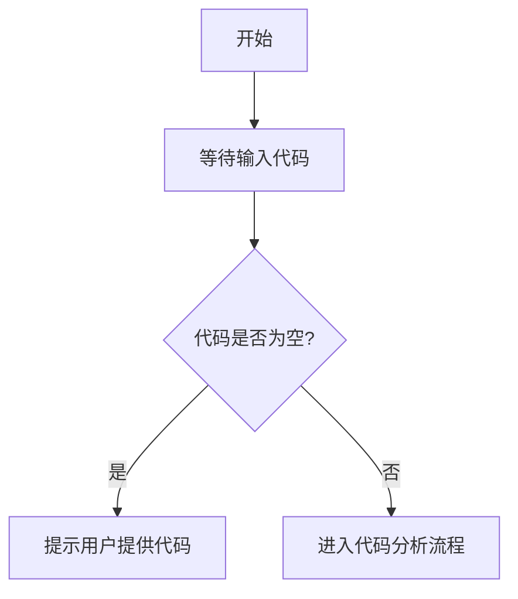

# `ChatRWKV\rwkv_pip_package\src\rwkv\__init__.py` 详细设计文档

未提供代码，无法生成描述。请提供需要分析的源代码。

## 整体流程



## 类结构

```

```

## 全局变量及字段


    

## 全局函数及方法


## 关键组件


## 问题及建议


### 已知问题

-   未提供代码内容，无法进行技术债务或优化空间分析

### 优化建议

-   请提供需要分析的代码，以便进行详细的技术债务识别和优化建议


## 其它


### 一段话描述

由于未提供具体代码，无法生成核心功能概述。

### 文件的整体运行流程

由于未提供具体代码，无法生成整体运行流程。

### 类的详细信息

由于未提供具体代码，无法生成类的详细信息。

### 关键组件信息

由于未提供具体代码，无法生成关键组件信息。

### 潜在的技术债务或优化空间

由于未提供具体代码，无法生成技术债务或优化空间。

### 设计目标与约束

详细设计文档应包含系统的设计目标，包括功能目标、性能目标、安全目标等，以及各种约束条件，如技术约束、时间约束、资源约束等。

### 错误处理与异常设计

应详细描述系统如何处理错误和异常，包括异常的类型、捕获机制、错误码定义、错误信息格式、降级策略等。

### 数据流与状态机

应包含数据的输入输出流向、数据处理流程、状态转换图、状态管理机制等内容的详细说明。

### 外部依赖与接口契约

应列出所有外部依赖项，包括第三方库、服务、API等，以及与外部系统交互的接口契约，包括接口规范、协议、数据格式等。

### 安全性考虑

应包含身份认证、授权机制、数据加密、输入验证、防止常见安全漏洞（如SQL注入、XSS等）的策略。

### 性能要求

应定义系统的性能指标，包括响应时间、吞吐量、并发用户数、资源利用率等要求。

### 兼容性设计

应说明系统对不同平台、浏览器、设备、版本的兼容性设计策略。

### 配置管理

应包含配置项的定义、配置文件的结构、配置加载机制、配置验证等内容的说明。

### 测试策略

应描述单元测试、集成测试、系统测试、验收测试的策略和计划。

### 部署架构

应包含部署环境、部署流程、负载均衡、高可用架构等内容的说明。

### 监控与日志

应定义监控指标、日志级别、日志格式、告警机制等。

### 版本管理

应说明版本号规则、版本发布策略、版本兼容性管理等。

### 编码规范

应包含命名规范、代码风格、注释规范等编码约定。

### 目录结构

应展示项目的目录结构和各目录的职责说明。

### API设计（如适用）

如果涉及API，应包含API端点定义、请求响应格式、认证方式、限流策略等。

### 数据库设计（如适用）

如果涉及数据库，应包含ER图、表结构、索引设计、关系映射等。

### 缓存策略（如适用）

如果涉及缓存，应包含缓存策略、缓存失效机制、缓存一致性等。

### 事务处理（如适用）

如果涉及事务，应包含事务边界、隔离级别、回滚策略等。

### 并发控制（如适用）

如果涉及并发，应包含锁机制、线程安全、竞态条件处理等。

### 国际化/本地化（如适用）

如果需要支持多语言，应包含语言资源管理、本地化策略等。

### 访问控制/权限管理（如适用）

如果需要权限控制，应包含角色定义、权限分配、权限验证机制等。

### 容错处理

应包含故障检测、故障恢复、限流熔断等容错机制的设计。

### 资源管理

应包含内存管理、连接池管理、线程池管理等资源管理策略。

    