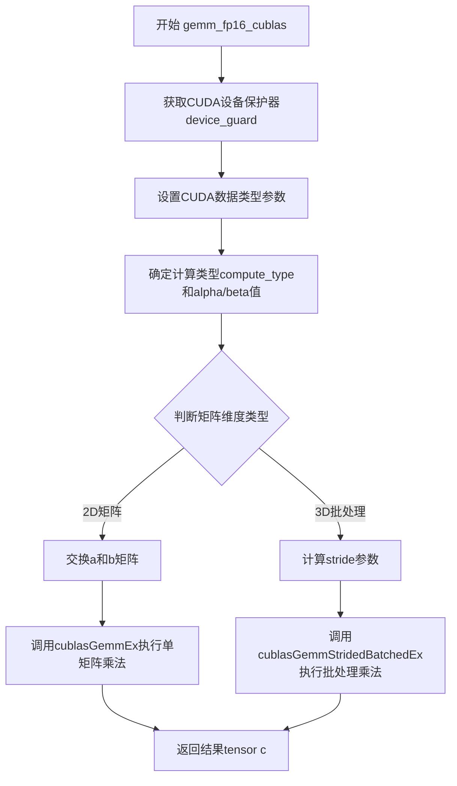

# `ChatRWKV\rwkv_pip_package\src\rwkv\cuda\gemm_fp16_cublas.cpp` 详细设计文档

这是一个CUDA/CuBLAS加速的FP16矩阵乘法（GEMM）实现，支持2D矩阵乘法和3D批处理矩阵乘法，通过PyTorch的ATen库与CUDA进行交互，利用cuBLAS的gemmEx和GemmStridedBatchedEx函数实现高性能的半精度浮点运算。

## 整体流程



## 类结构

```
gemm_fp16_cublas.cu (独立模块，无类层次结构)
└── 主要依赖：ATen/Tensor, cuBLAS, CUDA Runtime
```

## 全局变量及字段


### `CUBLAS_CHECK`
    
Macro for checking cuBLAS API return status and throwing runtime error on failure

类型：`macro`
    


### `CUDA_CHECK`
    
Macro for checking CUDA API return status and throwing runtime error on failure

类型：`macro`
    


### `device_guard`
    
RAII guard for managing CUDA device context scoped to tensor a

类型：`at::cuda::OptionalCUDAGuard`
    


### `cuda_data_type`
    
CUDA data type for input matrices A and B (CUDA_R_16F for FP16)

类型：`cudaDataType_t`
    


### `cuda_c_data_type`
    
CUDA data type for output matrix C, either CUDA_R_32F or CUDA_R_16F based on C's dtype

类型：`cudaDataType_t`
    


### `compute_type`
    
CUDA compute type for cuBLAS GEMM operations (CUDA_R_32F for accumulation)

类型：`cudaDataType_t`
    


### `sp_alpha`
    
Scalar alpha parameter for GEMM operation (set to 1.0f)

类型：`const float`
    


### `cublas_trans_a`
    
cuBLAS operation for matrix A (CUBLAS_OP_N, no transpose)

类型：`cublasOperation_t`
    


### `cublas_trans_b`
    
cuBLAS operation for matrix B (CUBLAS_OP_N, no transpose)

类型：`cublasOperation_t`
    


### `m`
    
Number of rows of matrix C (and columns of matrices A and B after swap)

类型：`int`
    


### `k`
    
Number of columns of matrix A (and rows of matrix B after swap)

类型：`int`
    


### `n`
    
Number of columns of matrix C

类型：`int`
    


### `cublas_lda`
    
Leading dimension of matrix A for cuBLAS (equals m)

类型：`int`
    


### `cublas_ldb`
    
Leading dimension of matrix B for cuBLAS (equals k)

类型：`int`
    


### `cublas_ldc`
    
Leading dimension of matrix C for cuBLAS (equals m)

类型：`int`
    


### `cublas_handle`
    
cuBLAS library handle for current CUDA stream

类型：`cublasHandle_t`
    


### `algo`
    
cuBLAS GEMM algorithm selection (CUBLAS_GEMM_DEFAULT or CUBLAS_GEMM_DFALT_TENSOR_OP)

类型：`cublasGemmAlgo_t`
    


### `sp_beta`
    
Scalar beta parameter for GEMM operation (set to 0.0f, ignoring existing C values)

类型：`const float`
    


### `cublas_stride_a`
    
Stride for batched GEMM, stride between matrices in batch A (m * k)

类型：`long long int`
    


### `cublas_stride_b`
    
Stride for batched GEMM, stride between matrices in batch B (k * n)

类型：`long long int`
    


### `cublas_stride_c`
    
Stride for batched GEMM, stride between matrices in batch C (m * n)

类型：`long long int`
    


    

## 全局函数及方法


### `gemm_fp16_cublas`

该函数是一个使用 cuBLAS 库执行 FP16（半精度浮点）通用矩阵乘法（GEMM）的 CUDA 核函数，支持批量矩阵乘法，通过 Tensor 交换策略解决行主序与列主序的差异，并利用 CUDA 设备守卫确保在正确的 GPU 设备上执行。

参数：

- `a`：`torch::Tensor`，输入矩阵 A（函数内部会与 b 交换，作为矩阵 B 使用）
- `b`：`torch::Tensor`，输入矩阵 B（函数内部会与 a 交换，作为矩阵 A 使用）
- `c`：`torch::Tensor`，输出矩阵 C，存储 A 与 B 的乘积结果

返回值：`void`，无返回值，结果通过 `c` 张量返回

#### 流程图

```mermaid
flowchart TD
    A[开始 gemm_fp16_cublas] --> B[获取CUDA设备守卫<br/>确保在正确GPU设备执行]
    B --> C[设置CUDA数据类型<br/>cuda_data_type = CUDA_R_16F]
    C --> D{判断c张量数据类型}
    D -->|Float32| E[设置cuda_c_data_type = CUDA_R_32F]
    D -->|其他| F[设置cuda_c_data_type = CUDA_R_16F]
    E --> G[设置compute_type = CUDA_R_32F]
    F --> G
    G --> H[设置sp_alpha = 1.0f]
    H --> I[交换a和b张量<br/>解决行主序/列主序问题]
    I --> J[设置cublas操作标志<br/>cublas_trans_a = N<br/>cublas_trans_b = N]
    J --> K[计算矩阵维度<br/>m = a.size(-1)<br/>k = a.size(-2)<br/>n = b.size(-2)]
    K --> L{判断输入维度}
    L -->|2D张量| M[调用cublasGemmEx<br/>执行普通GEMM]
    L -->|3D张量| N[调用cublasGemmStridedBatchedEx<br/>执行批量GEMM]
    M --> O[返回]
    N --> O
```

#### 带注释源码

```cpp
#include <cublas_v2.h>
#include <cuda.h>
#include <cuda_fp16.h>
#include <cuda_runtime.h>
#include <torch/extension.h>
#include <c10/cuda/CUDAGuard.h>
#include <ATen/cuda/CUDAContext.h>

// cuBLAS状态检查宏，若失败则抛出运行时错误
#define CUBLAS_CHECK(condition)                                                \
  for (cublasStatus_t _cublas_check_status = (condition);                      \
       _cublas_check_status != CUBLAS_STATUS_SUCCESS;)                         \
    throw std::runtime_error("cuBLAS error " +                                 \
                             std::to_string(_cublas_check_status) + " at " +   \
                             std::to_string(__LINE__));

// CUDA运行时状态检查宏，若失败则抛出运行时错误
#define CUDA_CHECK(condition)                                                  \
  for (cudaError_t _cuda_check_status = (condition);                           \
       _cuda_check_status != cudaSuccess;)                                     \
    throw std::runtime_error(                                                  \
        "CUDA error " + std::string(cudaGetErrorString(_cuda_check_status)) +  \
        " at " + std::to_string(__LINE__));

/*
  NOTE: blas gemm is column-major by default, but we need row-major output.
  The data of row-major, transposed matrix is exactly the same as the
  column-major, non-transposed matrix, and C = A * B ---> C^T = B^T * A^T
 */
// 执行FP16矩阵乘法的主函数
// 利用cuBLAS库实现半精度浮点GEMM，支持批量矩阵乘法
void gemm_fp16_cublas(torch::Tensor a, torch::Tensor b, torch::Tensor c) {
  // 获取CUDA设备守卫，确保后续CUDA操作在正确的GPU设备上执行
  const at::cuda::OptionalCUDAGuard device_guard(device_of(a));
  
  // 设置输入矩阵的数据类型为FP16（半精度浮点）
  const auto cuda_data_type = CUDA_R_16F;
  
  // 根据输出矩阵c的数据类型确定CUDA数据类型
  // 若c为Float32则使用CUDA_R_32F，否则使用CUDA_R_16F
  const auto cuda_c_data_type =
      c.dtype() == torch::kFloat32 ? CUDA_R_32F : CUDA_R_16F;
  
  // 计算类型设置为FP32以保证计算精度
  const auto compute_type = CUDA_R_32F;
  
  // 设置alpha值为1.0f，用于乘法系数
  const float sp_alpha = 1.f;
  
  // 交换a和b，并使用CUBLAS_OP_N
  // 详细原因见上方注释：将行主序转换为列主序
  // C = A * B 等价于 C^T = B^T * A^T
  std::swap(a, b);
  
  // 设置cuBLAS操作标志为不转置（N表示不转置）
  const cublasOperation_t cublas_trans_a = CUBLAS_OP_N;
  const cublasOperation_t cublas_trans_b = CUBLAS_OP_N;
  
  // 计算矩阵维度
  // m = (B^T).size(0) = B.size(1)，交换后等于a.size(-1)
  // 负轴用于支持批量矩阵乘法
  const int m = a.size(-1);  // 结果矩阵C的行数
  const int k = a.size(-2);  // 共享维度
  const int n = b.size(-2);  // 结果矩阵C的列数
  
  // 设置Leading Dimension参数
  // 在列主序中，Leading Dimension是相邻列之间的元素距离
  const int cublas_lda = m;
  const int cublas_ldb = k;
  const int cublas_ldc = m;
  
  // 获取当前CUDA上下文的cuBLAS句柄
  cublasHandle_t cublas_handle = at::cuda::getCurrentCUDABlasHandle();

#if CUDA_VERSION >= 11000
  // CUDA 11.0及以上版本使用默认算法
  cublasGemmAlgo_t algo = CUBLAS_GEMM_DEFAULT;
#else
  // 早期版本使用带Tensor Core的默认算法
  cublasGemmAlgo_t algo = CUBLAS_GEMM_DFALT_TENSOR_OP;
#endif
  
  // 设置beta值为0.f，表示不累加到现有结果（完全覆盖）
  const float sp_beta = 0.f;
  
  // 判断是否为2D矩阵普通GEMM还是3D批量GEMM
  if (a.sizes().size() == 2 && b.sizes().size() == 2) {
    // 2D矩阵情况：调用cublasGemmEx执行普通GEMM
    CUBLAS_CHECK(cublasGemmEx(
        cublas_handle, cublas_trans_a, cublas_trans_b, m, n, k, &sp_alpha,
        a.data_ptr(), cuda_data_type, cublas_lda, b.data_ptr(), cuda_data_type,
        cublas_ldb, &sp_beta, c.data_ptr(), cuda_c_data_type, cublas_ldc,
        compute_type, algo));
  } else {
    // 批量矩阵乘法情况
    // 断言确保输入是3D张量（batch matmul）
    assert(a.sizes().size() == 3 && b.sizes().size() == 3);

    // 计算批量矩阵乘法的步长（stride）
    const long long int cublas_stride_a = m * k;  // A矩阵相邻批次间的步长
    const long long int cublas_stride_b = k * n;  // B矩阵相邻批次间的步长
    const long long int cublas_stride_c = m * n;  // C矩阵相邻批次间的步长
    
    // 调用cublasGemmStridedBatchedEx执行批量GEMM
    // 最后参数a.size(0)表示批次大小
    CUBLAS_CHECK(cublasGemmStridedBatchedEx(
        cublas_handle, cublas_trans_a, cublas_trans_b, m,
        n, k, &sp_alpha, a.data_ptr(), cuda_data_type, cublas_lda,
        cublas_stride_a, b.data_ptr(), cuda_data_type, cublas_ldb, cublas_stride_b,
        &sp_beta, c.data_ptr(), cuda_c_data_type, cublas_ldc, cublas_stride_c,
        a.size(0), compute_type, algo));
  }
}
```

## 关键组件


### 核心功能概述

该代码是一个PyTorch CUDA扩展模块，通过cuBLAS库执行FP16（半精度浮点）矩阵乘法运算，支持2D和3D批量矩阵乘法，并可根据输出张量数据类型决定是否进行反量化处理。

### 文件整体运行流程

1. 入口函数`gemm_fp16_cublas`接收三个PyTorch张量a、b、c作为输入
2. 设置CUDA设备 guard，确保操作在正确的GPU上执行
3. 根据输出张量c的数据类型确定计算精度（float32或float16）
4. 处理矩阵维度：交换a和b以适应列优先的cuBLAS约定
5. 判断是2D矩阵乘法还是3D批量矩阵乘法
6. 调用相应的cuBLAS API（cublasGemmEx或cublasGemmStridedBatchedEx）执行矩阵运算

### 全局变量和全局函数详细信息

#### 宏定义

**CUBLAS_CHECK**
- 类型：宏
- 描述：cuBLAS API调用错误检查宏，检测cuBLAS状态并抛出异常

**CUDA_CHECK**
- 类型：宏
- 描述：CUDA运行时API调用错误检查宏，检测CUDA错误并抛出异常

#### 函数

**gemm_fp16_cublas**
- 参数：
  - `a`: torch::Tensor，输入张量（FP16）
  - `b`: torch::Tensor，输入张量（FP16）
  - `c`: torch::Tensor，输出张量（FP16或FP32）
- 返回值：void
- 描述：使用cuBLAS执行FP16矩阵乘法，支持2D和批量3D运算

```mermaid
flow TD
    A[入口: gemm_fp16_cublas] --> B[设置CUDA设备guard]
    B --> C[确定CUDA数据类型和计算类型]
    C --> D[交换a和b矩阵]
    D --> E{判断矩阵维度}
    E -->|2D矩阵| F[调用cublasGemmEx]
    E -->|3D批量矩阵| G[调用cublasGemmStridedBatchedEx]
    F --> H[返回结果]
    G --> H
```

```cpp
void gemm_fp16_cublas(torch::Tensor a, torch::Tensor b, torch::Tensor c) {
  // 设置CUDA设备guard，确保在正确的GPU上执行
  const at::cuda::OptionalCUDAGuard device_guard(device_of(a));
  
  // 确定CUDA数据类型为FP16
  const auto cuda_data_type = CUDA_R_16F;
  
  // 根据输出张量c的数据类型决定CUDA数据类型
  // 如果c是float32，则使用CUDA_R_32F进行输出（反量化）
  const auto cuda_c_data_type =
      c.dtype() == torch::kFloat32 ? CUDA_R_32F : CUDA_R_16F;
  
  // 计算类型始终使用FP32以保证精度
  const auto compute_type = CUDA_R_32F;
  const float sp_alpha = 1.f;
  
  // 交换a和b，使用CUBLAS_OP_N
  // 注意：BLAS GEMM是列优先，但需要行优先输出
  std::swap(a, b);
  
  const cublasOperation_t cublas_trans_a = CUBLAS_OP_N;
  const cublasOperation_t cublas_trans_b = CUBLAS_OP_N;
  
  // m = (B^T).size(0) = B.size(1), = A.size(1) after swap
  // 使用负轴以支持批量矩阵乘法
  const int m = a.size(-1);
  const int k = a.size(-2);
  const int n = b.size(-2);
  
  const int cublas_lda = m;
  const int cublas_ldb = k;
  const int cublas_ldc = m;
  
  // 获取当前CUDA BLAS句柄
  cublasHandle_t cublas_handle = at::cuda::getCurrentCUDABlasHandle();

#if CUDA_VERSION >= 11000
  // CUDA 11.0+使用默认算法
  cublasGemmAlgo_t algo = CUBLAS_GEMM_DEFAULT;
#else
  // 早期版本使用Tensor Op默认算法
  cublasGemmAlgo_t algo = CUBLAS_GEMM_DFALT_TENSOR_OP;
#endif
  
  const float sp_beta = 0.f;
  
  // 根据张量维度选择2D或批量矩阵乘法
  if (a.sizes().size() == 2 && b.sizes().size() == 2) {
    // 2D矩阵乘法
    CUBLAS_CHECK(cublasGemmEx(
        cublas_handle, cublas_trans_a, cublas_trans_b, m, n, k, &sp_alpha,
        a.data_ptr(), cuda_data_type, cublas_lda, b.data_ptr(), cuda_data_type,
        cublas_ldb, &sp_beta, c.data_ptr(), cuda_c_data_type, cublas_ldc,
        compute_type, algo));
  } else {
    // 批量矩阵乘法
    assert(a.sizes().size() == 3 && b.sizes().size() == 3);

    const long long int cublas_stride_a = m * k;
    const long long int cublas_stride_b = k * n;
    const long long int cublas_stride_c = m * n;
    
    CUBLAS_CHECK(cublasGemmStridedBatchedEx(
        cublas_handle, cublas_trans_a, cublas_trans_b, m,
        n, k, &sp_alpha, a.data_ptr(), cuda_data_type, cublas_lda,
        cublas_stride_a, b.data_ptr(), cuda_data_type, cublas_ldb, cublas_stride_b,
        &sp_beta, c.data_ptr(), cuda_c_data_type, cublas_ldc, cublas_stride_c,
        a.size(0), compute_type, algo));
  }
}
```

### 关键组件信息

#### 张量索引与惰性加载
使用PyTorch的Tensor对象，通过size(-1)和size(-2)获取矩阵的最后两个维度，支持负索引以兼容批量矩阵乘法场景。

#### 反量化支持
通过检查输出张量c的数据类型（torch::kFloat32），动态选择cuda_c_data_type为CUDA_R_32F或CUDA_R_16F，实现从FP16到FP32的反量化输出。

#### 量化策略
输入始终使用CUDA_R_16F（FP16）进行存储和传输，计算类型使用CUDA_R_32F以保证矩阵乘法的数值精度，输出类型根据需求可选择FP16或FP32。

#### cuBLAS算法选择
根据CUDA版本动态选择算法：CUDA 11.0+使用CUBLAS_GEMM_DEFAULT，早期版本使用CUBLAS_GEMM_DFALT_TENSOR_OP以启用Tensor Core加速。

#### 矩阵乘法转置处理
通过交换a和b矩阵并使用CUBLAS_OP_N操作，解决cuBLAS列优先与行优先输出需求之间的矛盾。

### 潜在技术债务或优化空间

1. **缺乏动态内存分配优化**：未实现输入输出张量的内存预分配和复用
2. **错误处理使用assert**：批量矩阵分支使用assert而非返回错误码，生产环境可能不够健壮
3. **缺少输入验证**：未检查输入张量的连续性、数据类型是否匹配、维度是否合法
4. **算法选择硬编码**：cuBLAS算法选择较为固定，未提供接口供上层调用者指定

### 其它项目

#### 设计目标与约束
- 目标：高性能FP16矩阵乘法，支持2D和批量3D运算
- 约束：依赖PyTorch CUDA扩展、cuBLAS库、CUDA Toolkit

#### 错误处理与异常设计
- 使用宏定义CUBLAS_CHECK和CUDA_CHECK进行API调用错误检测
- 错误发生时抛出std::runtime_error异常，包含错误码和行号信息

#### 数据流与状态机
- 输入：FP16张量a和b
- 处理：矩阵维度解析→数据类型确定→cuBLAS调用
- 输出：FP16或FP32张量c

#### 外部依赖与接口契约
- 依赖：CUDA Runtime、cuBLAS v2、PyTorch ATen、torch::extension
- 接口：Python端通过torch.ops模块调用，返回PyTorch张量


## 问题及建议


### 已知问题

- **输入验证缺失**：未检查输入Tensor的dtype是否为FP16，也未检查Tensor是否为空或连续，可能导致运行时难以追踪的错误
- **不安全的swap操作**：直接修改输入Tensor引用`std::swap(a, b)`会改变传入参数的语义，可能导致调用者预期的矩阵乘法顺序与实际执行不一致
- **批量维度断言不严谨**：使用C++ `assert`进行维度检查，在Release编译模式下会被禁用，失去检查作用
- **错误处理宏设计缺陷**：使用`for`循环执行单次检查的宏写法不直观，虽然功能正确但代码可读性差，且宏内定义的变量可能与外部冲突
- **硬编码版本判断**：CUDA版本判断使用硬编码`11000`，对于更低版本如CUDA 9/10缺乏明确支持，可能导致未定义行为
- **数据类型覆盖不全**：仅显式处理2D和3D Tensor，未对其他维度情况做处理或报错

### 优化建议

- **增加输入校验**：在函数入口添加`TORCH_CHECK`验证输入dtype、维度和连续性，确保参数符合预期
- **避免参数修改**：移除`std::swap`，直接调整`cublasOperation_t`的参数（`CUBLAS_OP_T`），保持调用语义清晰
- **统一错误处理**：使用`ATen`库提供的错误检查宏或自定义函数替代当前的宏，增强可读性和可维护性
- **处理边界情况**：对非2D/3D Tensor显式抛出错误信息而非隐式断言，提供明确的API使用指引
- **算法动态选择**：基于CUDA计算能力动态选择最优算法，而非硬编码版本判断，提升跨平台兼容性
- **添加文档注释**：为关键逻辑（如行优先与列优先的转换）补充更详细的注释，便于后续维护

## 其它


### 设计目标与约束

**设计目标**：提供高效的FP16矩阵乘法算子，支持2D和3D批量矩阵运算，兼容PyTorch tensor接口，利用CUDA和cuBLAS实现高性能计算。

**约束条件**：
- 输入张量必须为CUDA张量（device side）
- 输入数据类型需为FP16（torch::kHalf）
- 输出张量支持FP32或FP16类型
- 仅支持行主序（row-major）矩阵布局
- CUDA计算能力需支持FP16运算（sm_53及以上）

### 错误处理与异常设计

**错误处理机制**：
- 使用CUBLAS_CHECK宏捕获cuBLAS API返回状态，异常时抛出std::runtime_error
- 使用CUDA_CHECK宏捕获CUDA runtime API错误，异常时抛出std::runtime_error
- 异常信息包含错误码和代码行号，便于问题定位

**异常传播**：
- 所有CUDA/cuBLAS错误均以运行时异常形式抛出
- 不进行错误恢复，调用方需捕获异常处理
- 不支持错误码返回值机制

### 数据流与状态机

**数据流**：
1. 输入：两个PyTorch张量a和b，device为CUDA
2. 处理：根据张量维度选择2D gemm或batch gemm
3. 输出：计算结果写入张量c

**状态转换**：
- 2D模式：a.size() == 2 && b.size() == 2 → cublasGemmEx
- 3D模式：a.size() == 3 && b.size() == 3 → cublasGemmStridedBatchedEx

### 外部依赖与接口契约

**依赖库**：
- cuBLAS v2（矩阵运算）
- CUDA Runtime（内存和流管理）
- PyTorch C++ Extension（ATen tensor接口）
- CUDA FP16（半精度浮点支持）

**接口契约**：
- a, b, c必须为torch::Tensor类型
- a, b, c必须位于CUDA设备上
- a, b必须为FP16类型
- c的dtype为kFloat32或kHalf
- a和b的维度需兼容矩阵乘法（最后两维满足乘法规律）
- batch维度需一致

### 性能特征与基准

**计算优化**：
- 使用cublasGemmEx/cublasGemmStridedBatchedEx进行混合精度计算
- 计算类型使用FP32（CUDA_R_32F）以提高精度
- 根据CUDA版本选择最优算法（CUBLAS_GEMM_DEFAULT或CUBLAS_GEMM_DFALT_TENSOR_OP）

**内存布局**：
- 行主序转列主序通过交换a和b实现
- 矩阵维度：m = a.size(-1), k = a.size(-2), n = b.size(-2)

### 并发与线程安全

**线程安全**：
- cuBLAS handle通过at::cuda::getCurrentCUDABlasHandle()获取
- 不创建新的cuBLAS handle，依赖PyTorch内部管理
- 多线程调用需自行保证tensor无数据竞争

### 内存管理策略

**内存分配**：
- 输入输出tensor内存由PyTorch管理
- 不进行额外设备端内存分配

**设备管理**：
- 使用at::cuda::OptionalCUDAGuard确保设备上下文正确
- 通过device_of(a)自动推断设备

### 配置与参数说明

**宏定义**：
- CUBLAS_CHECK：cuBLAS错误检查宏
- CUDA_CHECK：CUDA运行时错误检查宏

**运行时参数**：
- sp_alpha：缩放因子，固定为1.0f
- sp_beta：偏置因子，固定为0.0f（结果直接覆盖）
- cuda_data_type：输入数据类型CUDA_R_16F
- cuda_c_data_type：输出数据类型（根据c.dtype()选择）
- compute_type：计算数据类型CUDA_R_32F

### 版本兼容性说明

**CUDA版本**：
- CUDA >= 11.00：使用CUBLAS_GEMM_DEFAULT算法
- CUDA < 11.00：使用CUBLAS_GEMM_DFALT_TENSOR_OP算法

**cuBLAS版本**：
- 需要cuBLAS v2支持

### 测试策略

**边界测试**：
- 2D矩阵乘法（单矩阵）
- 3D批量矩阵乘法
- 大尺寸矩阵
- 小尺寸矩阵（边界值）
- 不同batch大小

**类型测试**：
- FP16输入输出
- FP16输入、FP32输出
- 类型不匹配情况

**错误测试**：
- CPU tensor输入
- 维度不兼容
- 设备不匹配

### 使用示例与用例

**Python调用**：
```python
import torch
from torch.utils.cpp_extension import load

# 加载C++扩展
gemm = load(name="gemm_fp16", sources=["gemm.cpp"])

# 2D矩阵乘法
a = torch.randn(1024, 512, dtype=torch.float16, device='cuda')
b = torch.randn(512, 2048, dtype=torch.float16, device='cuda')
c = torch.empty(1024, 2048, dtype=torch.float16, device='cuda')
gemm.gemm_fp16_cublas(a, b, c)

# 3D批量矩阵乘法
a = torch.randn(16, 1024, 512, dtype=torch.float16, device='cuda')
b = torch.randn(16, 512, 2048, dtype=torch.float16, device='cuda')
c = torch.empty(16, 1024, 2048, dtype=torch.float16, device='cuda')
gemm.gemm_fp16_cublas(a, b, c)
```

**典型应用场景**：
- 深度学习模型中的线性层加速
- Transformer架构中的注意力机制
- 批量推理场景下的矩阵运算

    