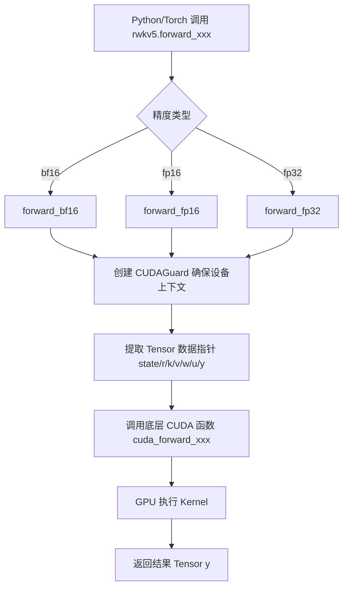
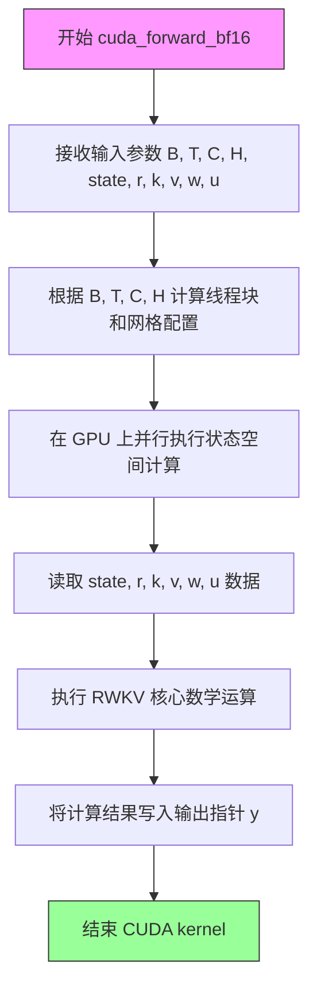
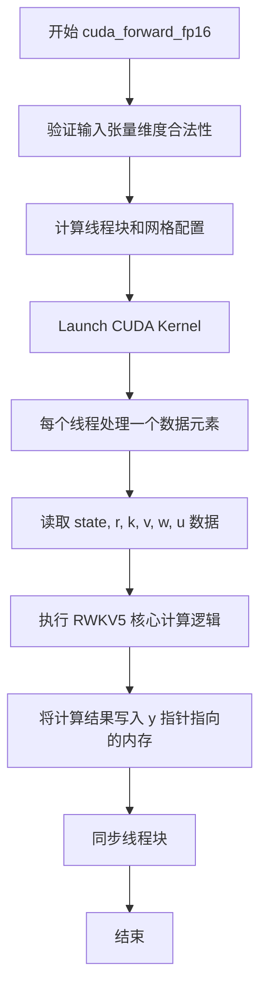
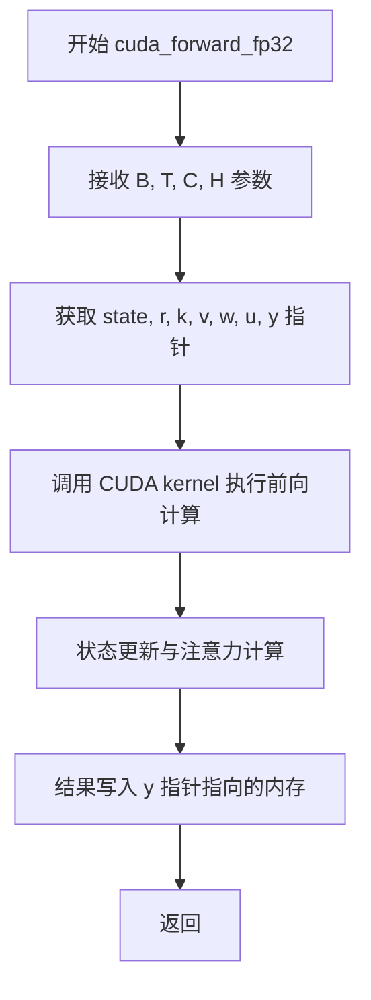
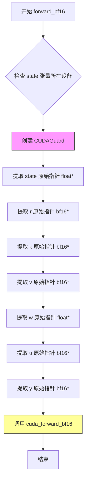
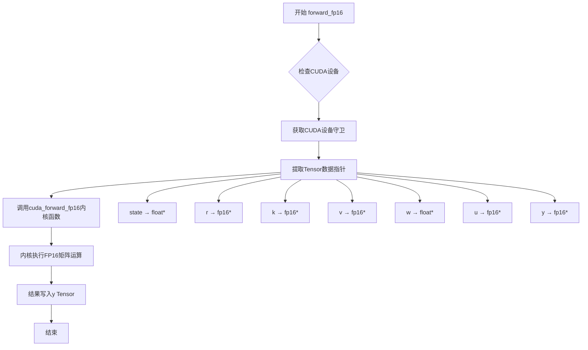
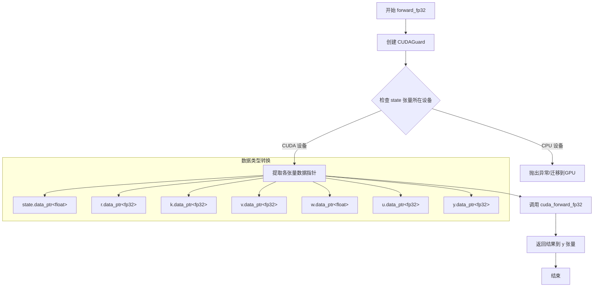

# `ChatRWKV\rwkv_pip_package\src\rwkv\cuda\rwkv5_op.cpp` 详细设计文档

这是一个 PyTorch C++ 扩展模块，封装了 RWKV5 模型基于 CUDA 的前向传播计算逻辑，支持 BFloat16、Float16 和 Float32 三种精度，并通过 PyBind11 和 TorchLibrary 机制注册为 PyTorch 可调用算子。

## 整体流程



## 类结构

```
Global Scope
├── 类型别名 (TypeDef)
│   ├── bf16 (at::BFloat16)
│   ├── fp16 (at::Half)
│   └── fp32 (float)
├── 外部 CUDA 函数声明 (External)
│   ├── cuda_forward_bf16
│   ├── cuda_forward_fp16
│   └── cuda_forward_fp32
├── C++ 封装函数 (Wrapper)
forward_bf16
forward_fp16
forward_fp32
└── PyTorch 绑定模块 (Bindings)
    ├── PYBIND11_MODULE
    └── TORCH_LIBRARY
```

## 全局变量及字段


### `bf16`
    
16位脑浮点类型别名，用于表示bfloat16格式的浮点数

类型：`at::BFloat16`
    


### `fp16`
    
16位半精度浮点类型别名，用于表示half-precision浮点数

类型：`at::Half`
    


### `fp32`
    
32位单精度浮点类型别名，用于表示标准浮点数

类型：`float`
    


    

## 全局函数及方法


### `cuda_forward_bf16`

该函数是 RWKV-v5 模型的核心 CUDA 加速前向传播 kernel，使用 BFloat16 精度执行高效的状态空间计算，接收批量大小 B、序列长度 T、隐藏维度 C、头数 H 以及状态矩阵、查询键值向量、权重和输出矩阵，实现高效的张量运算并返回计算结果。

参数：

- `B`：`int`，批量大小（Batch size），表示同时处理的序列数量
- `T`：`int`，序列长度（Sequence length），表示每个序列的时间步数
- `C`：`int`，隐藏维度（Hidden dimension），表示特征通道数
- `H`：`int`，头数（Head count），用于多头注意力机制的头部数量
- `state`：`float*`，状态矩阵指针，存储模型内部状态数据，类型为单精度浮点
- `r`：`bf16*`，查询向量（Query）指针，BFloat16 类型的输入张量
- `k`：`bf16*`，键向量（Key）指针，BFloat16 类型的输入张量
- `v`：`bf16*`，值向量（Value）指针，BFloat16 类型的输入张量
- `w`：`float*`，权重矩阵指针，存储可学习的权重参数，单精度浮点类型
- `u`：`bf16*`，上三角矩阵或累积权重指针，BFloat16 类型
- `y`：`bf16*`，输出矩阵指针，BFloat16 类型，用于存储计算结果

返回值：`void`，无返回值，结果通过输出指针参数 `y` 回传

#### 流程图



#### 带注释源码

```c
// 定义 BFloat16、Half 和 float 类型别名，便于代码复用
typedef at::BFloat16 bf16;   // BFloat16 类型别名，用于混合精度计算
typedef at::Half fp16;       // Half 类型别名（FP16）
typedef float fp32;          // 单精度浮点类型别名（FP32）

/**
 * CUDA forward kernel 函数声明
 * 该函数执行 RWKV-v5 模型的前向传播，使用 BFloat16 精度
 * 
 * @param B  int    批量大小
 * @param T  int    序列长度  
 * @param C  int    隐藏维度
 * @param H  int    头数
 * @param state float*   状态矩阵，存储中间状态
 * @param r   bf16*  查询向量（Query）
 * @param k   bf16*  键向量（Key）
 * @param v   bf16*  值向量（Value）
 * @param w   float* 权重矩阵
 * @param u   bf16*  累积权重矩阵
 * @param y   bf16*  输出结果矩阵
 */
void cuda_forward_bf16(
    int B, int T, int C, int H,    // 维度参数
    float *state,                  // 状态矩阵（FP32）
    bf16 *r, bf16 *k, bf16 *v,     // QKV 向量（BF16）
    float *w,                      // 权重矩阵（FP32）
    bf16 *u,                       // 累积权重（BF16）
    bf16 *y                        // 输出矩阵（BF16）
);

// Python 调用入口函数（wrapper）
void forward_bf16(
    int64_t B, int64_t T, int64_t C, int64_t H,  // 使用 int64_t 兼容 Python
    torch::Tensor &state,  // PyTorch 张量，自动内存管理
    torch::Tensor &r,
    torch::Tensor &k,
    torch::Tensor &v,
    torch::Tensor &w,
    torch::Tensor &u,
    torch::Tensor &y
) {
    // 创建 CUDA 设备Guard，确保在正确的 GPU 设备上执行
    const at::cuda::OptionalCUDAGuard device_guard(device_of(state));
    
    // 调用底层的 CUDA kernel 实现
    cuda_forward_bf16(
        B, T, C, H,
        state.data_ptr<float>(),    // 提取 float* 指针
        r.data_ptr<bf16>(),         // 提取 bf16* 指针
        k.data_ptr<bf16>(),
        v.data_ptr<bf16>(),
        w.data_ptr<float>(),
        u.data_ptr<bf16>(),
        y.data_ptr<bf16>()
    );
}
```


### `cuda_forward_fp16`

该函数是 RWKV5（实时内核向量）模型的 CUDA 核心前向传播 kernel，采用 FP16（半精度浮点）数据格式进行计算，负责处理状态更新、注意力机制的查询/键/值投影以及输出计算。

参数：

- `B`：`int`，批量大小（Batch size）
- `T`：`int`，序列长度（Sequence length/Time steps）
- `C`：`int`，隐藏层维度（Hidden dimension/Channel count）
- `H`：`int`，头部数量（Number of heads）
- `state`：`float*`，状态矩阵指针，用于存储 RNN 隐藏状态
- `r`：`fp16*`，查询向量指针（Query），由输入投影得到
- `k`：`fp16*`，键向量指针（Key），由输入投影得到
- `v`：`fp16*`，值向量指针（Value），由输入投影得到
- `w`：`float*`，权重矩阵指针，通常为可学习的模型参数
- `u`：`fp16*`，上投影向量指针，用于最终输出计算
- `y`：`fp16*`，输出结果指针，存储计算后的输出

返回值：`void`，该函数直接通过指针参数返回计算结果，无返回值

#### 流程图



#### 带注释源码

```cpp
// 预声明 CUDA 前向传播函数（仅声明，无实现）
// 该函数在独立的 .cu/.cuh 文件中实现
void cuda_forward_fp16(
    int B,      // 批量大小
    int T,      // 序列长度
    int C,      // 隐藏层维度
    int H,      // 头数
    float *state,      // 隐藏状态矩阵，float 精度
    fp16 *r,           // 查询向量，FP16 精度
    fp16 *k,           // 键向量，FP16 精度
    fp16 *v,           // 值向量，FP16 精度
    float *w,          // 权重参数，float 精度
    fp16 *u,           // 上投影向量，FP16 精度
    fp16 *y            // 输出结果，FP16 精度（通过指针返回）
);

// 对应的 Python 绑定包装函数
void forward_fp16(
    int64_t B, int64_t T, int64_t C, int64_t H,  // 使用 int64_t 兼容 PyTorch
    torch::Tensor &state,  // PyTorch 张量封装
    torch::Tensor &r,
    torch::Tensor &k,
    torch::Tensor &v,
    torch::Tensor &w,
    torch::Tensor &u,
    torch::Tensor &y
) {
    // 创建 CUDA 设备_guard，确保在正确的 GPU 上执行
    const at::cuda::OptionalCUDAGuard device_guard(device_of(state));
    
    // 调用底层 CUDA kernel，将 PyTorch 张量数据指针传递给 CUDA 函数
    cuda_forward_fp16(
        B, T, C, H,
        state.data_ptr<float>(),  // 获取 float 指针
        r.data_ptr<fp16>(),        // 获取 fp16 指针
        k.data_ptr<fp16>(),
        v.data_ptr<fp16>(),
        w.data_ptr<float>(),
        u.data_ptr<fp16>(),
        y.data_ptr<fp16>()
    );
}
```

**注意**：提供的代码中仅包含 `cuda_forward_fp16` 的前向声明（forward declaration），实际 kernel 实现位于独立的 `.cu` 或 `.cuh` 源文件中。此函数通常在 CUDA 中通过并行线程实现 RWKV5 模型的核心计算逻辑，涉及状态矩阵运算和注意力机制的混合计算。


### `cuda_forward_fp32`

该函数是 RWKV5 模型的前向传播 CUDA 核心函数，接收 float32 精度的张量数据，执行状态更新、注意力计算等操作并将结果写入输出张量 y。

参数：

- `B`：`int`，批次大小（Batch size）
- `T`：`int`，序列长度（Sequence length）
- `C`：`int`，通道数（Channel dimension）
- `H`：`int`，注意力头数（Number of attention heads）
- `state`：`float*`，模型状态缓冲区指针
- `r`：`fp32*`，查询向量（query）输入张量指针
- `k`：`fp32*`，键向量（key）输入张量指针
- `v`：`fp32*`，值向量（value）输入张量指针
- `w`：`float*`，状态衰减权重参数指针
- `u`：`fp32*`，上界/偏置向量指针
- `y`：`fp32*`，输出张量指针，用于存储计算结果

返回值：`void`，无返回值，结果通过 `y` 指针输出

#### 流程图



#### 带注释源码

```c
// 类型别名定义
typedef at::BFloat16 bf16;    // BFloat16 类型别名
typedef at::Half fp16;        // Half (FP16) 类型别名
typedef float fp32;           // Float32 类型别名

/**
 * RWKV5 FP32 前向传播 CUDA kernel 声明
 * @param B  批次大小
 * @param T  序列长度
 * @param C  通道维度
 * @param H  注意力头数
 * @param state  模型内部状态缓冲区
 * @param r  查询向量 (query) 输入
 * @param k  键向量 (key) 输入
 * @param v  值向量 (value) 输入
 * @param w  状态衰减权重参数
 * @param u  上界/位置偏置向量
 * @param y  输出结果张量
 */
void cuda_forward_fp32(
    int B,      // 批次大小
    int T,      // 序列长度
    int C,      // 通道数
    int H,      // 头数
    float *state,   // 状态缓冲区指针
    fp32 *r,        // 查询向量指针
    fp32 *k,        // 键向量指针
    fp32 *v,        // 值向量指针
    float *w,       // 衰减权重指针
    fp32 *u,        // 偏置向量指针
    fp32 *y         // 输出指针
);
```


### `forward_bf16`

该函数是 RWKV5 模型的前向传播入口函数，接收 PyTorch 张量并使用 BFloat16 精度在 CUDA 设备上执行推理。它首先通过 CUDAGuard 确保正确的 CUDA 设备上下文，然后从张量中提取原始指针并传递给底层的 CUDA 核函数进行实际的张量运算。

参数：

- `B`：`int64_t`，批量大小（Batch size），表示同时处理的序列数量
- `T`：`int64_t`，序列长度（Sequence length），表示每个序列的时间步数
- `C`：`int64_t`，通道数（Channels），表示隐藏层的维度
- `H`：`int64_t`，头数（Heads），用于多头注意力机制
- `state`：`torch::Tensor`，状态张量，存储中间状态信息，数据类型为 float
- `r`：`torch::Tensor`，查询张量（Query），存储 R 矩阵，数据类型为 bf16
- `k`：`torch::Tensor`，键张量（Key），存储 K 矩阵，数据类型为 bf16
- `v`：`torch::Tensor`，值张量（Value），存储 V 矩阵，数据类型为 bf16
- `w`：`torch::Tensor`，权重张量（Weight），存储权重矩阵，数据类型为 float
- `u`：`torch::Tensor`，更新张量（Update），存储更新向量，数据类型为 bf16
- `y`：`torch::Tensor`，输出张量（Output），存储前向传播的输出结果，数据类型为 bf16

返回值：`void`，无返回值。输出结果通过 `y` 张量的引用参数直接返回。

#### 流程图



#### 带注释源码

```cpp
// 定义 BFloat16、Half 和 Float 类型别名，便于代码阅读
typedef at::BFloat16 bf16;   // Brain Float 16：一种 16 位浮点格式
typedef at::Half fp16;       // Half Precision Float16：半精度浮点
typedef float fp32;          // Single Precision Float32：单精度浮点

// 声明外部 CUDA 核函数，由 CUDA (.cu) 文件实现
// 参数：批量 B、序列 T、通道 C、头 H、状态 state、R/K/V 矩阵、权重 w、更新 u、输出 y
extern void cuda_forward_bf16(int B, int T, int C, int H, float *state, bf16 *r, bf16 *k, bf16 *v, float *w, bf16 *u, bf16 *y);

/**
 * RWKV5 BFloat16 前向传播函数
 * 
 * 这是 PyTorch C++ 扩展的入口函数，负责：
 * 1. 管理 CUDA 设备上下文
 * 2. 将 PyTorch 张量转换为原始指针
 * 3. 调用底层 CUDA 核函数执行计算
 * 
 * @param B 批量大小
 * @param T 序列长度  
 * @param C 通道数/隐藏维度
 * @param H 注意力头数
 * @param state 状态张量，float 类型
 * @param r 查询张量，BFloat16 类型
 * @param k 键张量，BFloat16 类型
 * @param v 值张量，BFloat16 类型
 * @param w 权重张量，float 类型
 * @param u 更新张量，BFloat16 类型
 * @param y 输出张量，BFloat16 类型（通过引用返回结果）
 */
void forward_bf16(int64_t B, int64_t T, int64_t C, int64_t H, 
                  torch::Tensor &state, 
                  torch::Tensor &r, 
                  torch::Tensor &k, 
                  torch::Tensor &v, 
                  torch::Tensor &w, 
                  torch::Tensor &u, 
                  torch::Tensor &y) {
    
    // 创建 CUDA 设备守卫，确保后续 CUDA 操作在正确的设备上执行
    // device_of(state) 从 state 张量获取设备信息
    const at::cuda::OptionalCUDAGuard device_guard(device_of(state));
    
    // 调用 CUDA 核函数，传递所有原始指针
    cuda_forward_bf16(
        B, T, C, H,                              // 维度参数
        state.data_ptr<float>(),                // 状态数据指针 (float*)
        r.data_ptr<bf16>(),                      // R 矩阵指针 (bf16*)
        k.data_ptr<bf16>(),                      // K 矩阵指针 (bf16*)
        v.data_ptr<bf16>(),                      // V 矩阵指针 (bf16*)
        w.data_ptr<float>(),                     // 权重数据指针 (float*)
        u.data_ptr<bf16>(),                       // 更新向量指针 (bf16*)
        y.data_ptr<bf16>()                       // 输出指针 (bf16*)
    );
}
```


### `forward_fp16`

该函数是RWKV5模型的前向传播接口的FP16（半精度浮点）版本，负责将输入张量传递给CUDA内核执行实际的矩阵运算，并通过PyTorch的tensor机制返回结果。

参数：

- `B`：`int64_t`，批量大小（Batch size），表示同时处理的序列数量
- `T`：`int64_t`，序列长度（Time steps），表示每个序列的时间步数
- `C`：`int64_t`，通道维度（Channels），表示特征维度
- `H`：`int64_t`，头数（Heads），用于多头注意力机制
- `state`：`torch::Tensor`，状态张量，存储模型的内部状态数据
- `r`：`torch::Tensor`，查询张量（Query），存储用于计算输出的查询向量
- `k`：`torch::Tensor`，键张量（Key），存储用于注意力计算的键向量
- `v`：`torch::Tensor`，值张量（Value），存储用于注意力计算的值向量
- `w`：`torch::Tensor`，权重张量，存储模型的学习参数（FP32精度）
- `u`：`torch::Tensor`，上投影张量，存储用于最终输出的投影矩阵
- `y`：`torch::Tensor`，输出张量，存储前向传播的计算结果

返回值：`void`，无直接返回值，结果通过`y`张量（PyTorch的Tensor引用传递）输出

#### 流程图



#### 带注释源码

```cpp
/**
 * RWKV5 FP16 前向传播函数
 * 
 * 该函数是PyTorch扩展的入口点，负责：
 * 1. 确保CUDA设备正确
 * 2. 从PyTorch Tensor中提取数据指针
 * 3. 调用CUDA内核执行实际计算
 * 
 * @param B 批量大小
 * @param T 序列长度  
 * @param C 通道维度
 * @param H 头数
 * @param state 状态张量（FP32）
 * @param r 查询向量（FP16）
 * @param k 键向量（FP16）
 * @param v 值向量（FP16）
 * @param w 权重矩阵（FP32）
 * @param u 上投影矩阵（FP16）
 * @param y 输出张量（FP16）
 */
void forward_fp16(int64_t B, int64_t T, int64_t C, int64_t H, 
                  torch::Tensor &state, 
                  torch::Tensor &r, 
                  torch::Tensor &k, 
                  torch::Tensor &v, 
                  torch::Tensor &w, 
                  torch::Tensor &u, 
                  torch::Tensor &y) {
    
    // 创建CUDA设备守卫，确保后续CUDA操作在正确的设备上执行
    // device_of(state)从state张量获取设备信息
    const at::cuda::OptionalCUDAGuard device_guard(device_of(state));
    
    // 调用CUDA内核函数，传递所有参数
    // 数据指针通过data_ptr<T>()获取
    cuda_forward_fp16(
        B, T, C, H,                          // 维度参数
        state.data_ptr<float>(),             // state: FP32
        r.data_ptr<fp16>(),                  // r: FP16
        k.data_ptr<fp16>(),                  // k: FP16
        v.data_ptr<fp16>(),                  // v: FP16
        w.data_ptr<float>(),                 // w: FP32
        u.data_ptr<fp16>(),                  // u: FP16
        y.data_ptr<fp16>()                   // y: FP16 (输出)
    );
}
```


### `forward_fp32`

该函数是 RWKV5 模型的前向传播入口函数，封装了 CUDA 核函数调用，通过 CUDAGuard 确保设备正确性，并将 PyTorch 张量转换为原始指针传递给底层 `cuda_forward_fp32` 函数执行 FP32 精度的前向计算。

参数：

- `B`：`int64_t`，批量大小（Batch size），表示同时处理的序列数量
- `T`：`int64_t`，序列长度（Sequence length），表示每个序列的时间步数
- `C`：`int64_t`，通道数（Channels），表示隐藏层的维度
- `H`：`int64_t`，头数（Heads），用于多头注意力机制
- `state`：`torch::Tensor &`，状态张量，内部存储为 float 类型，用于保存 RNN 状态
- `r`：`torch::Tensor &`，查询张量（Read query），FP32 类型，输入数据
- `k`：`torch::Tensor &`，键张量（Key），FP32 类型，输入数据
- `v`：`torch::Tensor &`，值张量（Value），FP32 类型，输入数据
- `w`：`torch::Tensor &`，权重张量，float 类型，用于衰减因子
- `u`：`torch::Tensor &`，额外张量，FP32 类型，用于特殊处理
- `y`：`torch::Tensor &`，输出张量，FP32 类型，存储前向传播结果

返回值：`void`，无返回值，结果通过 `y` 张量引用直接输出

#### 流程图



#### 带注释源码

```cpp
// 定义类型别名，增加代码可读性
typedef at::BFloat16 bf16;  // BFloat16 类型别名
typedef at::Half fp16;      // Half (FP16) 类型别名
typedef float fp32;         // Float (FP32) 类型别名

/**
 * @brief RWKV5 FP32 前向传播封装函数
 * 
 * @param B 批量大小 (Batch size)
 * @param T 序列长度 (Sequence length)
 * @param C 通道数 (Channels)
 * @param H 头数 (Heads)
 * @param state 状态张量，内部为 float 类型
 * @param r 查询张量 (Read query)，FP32
 * @param k 键张量 (Key)，FP32
 * @param v 值张量 (Value)，FP32
 * @param w 权重张量，float 类型（衰减因子）
 * @param u 额外张量，FP32（用于特殊注意力计算）
 * @param y 输出张量，FP32（存储计算结果）
 */
void forward_fp32(int64_t B, int64_t T, int64_t C, int64_t H, 
                  torch::Tensor &state, 
                  torch::Tensor &r, 
                  torch::Tensor &k, 
                  torch::Tensor &v, 
                  torch::Tensor &w, 
                  torch::Tensor &u, 
                  torch::Tensor &y) {
    
    // 创建 CUDA 设备Guard，确保后续 CUDA 操作在正确的设备上执行
    // device_of(state) 从 state 张量获取设备信息
    const at::cuda::OptionalCUDAGuard device_guard(device_of(state));
    
    // 调用底层 CUDA 实现的 FP32 前向传播函数
    // 将 PyTorch 张量提取为原始指针传递给 CUDA 核函数
    cuda_forward_fp32(
        B, T, C, H,                                    // 维度参数
        state.data_ptr<float>(),                      // 状态指针 (float)
        r.data_ptr<fp32>(),                            // 查询指针 (FP32)
        k.data_ptr<fp32>(),                            // 键指针 (FP32)
        v.data_ptr<fp32>(),                            // 值指针 (FP32)
        w.data_ptr<float>(),                           // 权重指针 (float)
        u.data_ptr<fp32>(),                            // 额外张量指针 (FP32)
        y.data_ptr<fp32>()                             // 输出指针 (FP32)
    );
}

// Pybind11 模块绑定，将函数暴露给 Python
PYBIND11_MODULE(TORCH_EXTENSION_NAME, m) {
    m.def("forward_fp32", &forward_fp32, "rwkv5 forward_fp32");
}

// Torch 库绑定，注册自定义算子
TORCH_LIBRARY(rwkv5, m) {
    m.def("forward_fp32", forward_fp32);
}
```

## 关键组件


### CUDA Kernel声明与多精度支持

该模块声明了三个CUDA前向传播函数，分别支持bf16、fp16和fp32三种精度，通过函数重载实现统一的接口，内部调用对应的CUDA kernel，实现张量在GPU上的高效计算。

### Tensor索引与类型转换

通过PyTorch的`data_ptr<T>()`方法直接获取原始指针访问底层数据，实现C++端与CUDA内存的零拷贝交互，同时利用模板参数支持bf16、fp16、fp32等多种数据类型的高效处理。

### 惰性加载与CUDA上下文管理

使用`at::cuda::OptionalCUDAGuard`实现CUDA设备的惰性加载和上下文自动管理，确保在首次访问GPU张量时才初始化CUDA上下文，避免不必要的初始化开销。

### 反量化与精度转换支持

模块支持从bf16和fp16两种低精度格式到内部计算格式的转换，通过独立的函数处理反量化逻辑，允许在保持推理效率的同时使用量化后的权重。

### PyBind11接口绑定

使用pybind11将三个前向传播函数绑定到Python模块，暴露统一的Python调用接口，同时通过`TORCH_LIBRARY`注册为PyTorch自定义算子，实现与PyTorch JIT编译器的集成。

### 量化策略实现

通过预定义的类型别名（bf16、fp16、fp32）统一管理量化策略，允许在编译期选择不同的数值精度，实现显存占用与计算精度的平衡。


## 问题及建议


### 已知问题

- **代码重复**：三个 forward 函数（forward_bf16、forward_fp16、forward_fp32）除了数据类型外几乎完全相同，违反 DRY 原则，维护成本高
- **缺乏输入验证**：未检查 tensor 的设备类型、维度、数据类型是否符合预期，可能导致难以追踪的运行时错误
- **硬编码设备**：仅支持 CUDA 设备，缺少对 CPU 或其他设备的支持，限制了代码的通用性
- **类型安全不足**：直接使用原始指针和 C 风格类型转换，缺乏类型安全保护
- **错误处理缺失**：没有错误处理机制和异常抛出，cuda_forward_* 调用失败时难以定位问题
- **文档缺失**：代码无注释和文档说明，增加了后续维护和理解的难度

### 优化建议

- **消除重复代码**：使用 C++ 模板或预处理器宏来抽象数据类型差异，减少代码重复
- **添加输入验证**：在每个 forward 函数开头增加 tensor 维度、设备、数据类型的校验，提供有意义的错误信息
- **抽象设备管理**：将设备选择抽象出来，支持通过参数或环境变量配置，支持多设备部署
- **增强错误处理**：使用 std::expected 或异常机制处理 CUDA 调用失败，提供详细的调试信息
- **增加文档**：为关键函数和参数添加 Doxygen 风格的注释，说明各参数的用途和约束条件
- **考虑泛化设计**：将精度类型、计算逻辑抽象为可配置参数，便于扩展支持更多数据类型（如 tf32、fp8）

## 其它


### 设计目标与约束

本模块旨在为RWKV5（Receptive Weighted Key Value）模型提供高性能的CUDA前向传播实现，支持bf16/fp16/fp32三种精度模式，以满足不同应用场景对精度与速度的权衡需求。设计约束包括：1）必须使用PyTorch C++扩展接口（PYBIND11和TORCH_LIBRARY）；2）核心计算逻辑由CUDA核函数实现，确保在NVIDIA GPU上的高效执行；3）所有张量必须位于CUDA设备上；4）state张量必须为fp32精度，其他张量精度可选。

### 错误处理与异常设计

本模块主要依赖PyTorch的张量检查机制进行错误处理。具体包括：1）设备检查：通过at::cuda::OptionalCUDAGuard确保所有张量位于同一CUDA设备；2）维度检查：由调用方在Python层保证张量形状正确（B,T,C,H），本模块不进行额外维度验证；3）精度匹配：data_ptr<T>调用要求T与实际张量dtype一致，否则可能引发未定义行为；4）空张量检查：调用前需确保所有张量非空。本模块无自定义异常类，所有错误将通过PyTorch的ATen断言或CUDA运行时错误传播。

### 数据流与状态机

数据流遵循标准的RWKV5前向传播模式：输入包括state（隐藏状态）、r/k/v（查询键值张量）、w（权重）、u（可学习参数），输出为y（预测结果）和更新的state。处理流程为：1）Python层传入PyTorch张量；2）C++层获取张量数据指针并进行设备校验；3）调用对应的CUDA核函数（cuda_forward_bf16/fp16/fp32）执行核心计算；4）结果写回y张量并通过引用更新state。状态机为单向前馈，无内部状态转换逻辑。

### 外部依赖与接口契约

本模块的外部依赖包括：1）PyTorch Core (torch/extension.h, ATen)；2）CUDA Runtime (c10/cuda/CUDAGuard)；3）PyBind11（Python绑定）。接口契约规定：1）Python调用接口为torch.ops.rwkv5.forward_bf16/fp16/fp32；2）输入张量要求：state为float32且shape=[B, C, H, 2]或类似；r/k/v/u/y为对应精度（bf16/fp16/fp32）且shape=[B, T, C, H]；w为float32且shape=[C, H]；3）输出张量y的shape与r相同；4）所有张量必须contiguous且位于CUDA设备。

### 性能特征与基准测试

性能特征：1）内存带宽是主要瓶颈，CUDA核函数应优化内存访问模式；2）不同精度版本的性能排序预计为：fp32 < fp16 ≈ bf16（bf16在Ampere+架构上有专门tensor core加速）；3）state张量重复使用避免全局内存读写。基准测试应覆盖：1）不同batch size (B)、序列长度(T)、通道数(C)、头数(H)组合下的吞吐量；2）三种精度模式的端到端延迟对比；3）显存占用峰值测试。

### 内存管理

内存管理策略：1）输入输出张量由PyTorch负责分配和释放，本模块直接使用data_ptr获取指针；2）CUDA核函数内部使用 Registers 和 Shared Memory 进行中间计算，避免频繁全局内存分配；3）state张量采用in-place更新模式，避免额外显存开销；4）可选优化：对于大模型，可考虑分块处理（tiling）以控制峰值显存。

### 并发与同步机制

并发设计：1）本模块为同步函数，调用方可在Python层使用torch.cuda.synchronize()确保完成；2）CUDA核函数内部使用block/grid并行，block间无依赖；3）可选优化：支持CUDA stream以实现计算与数据传输重叠。同步机制：1）at::cuda::OptionalCUDAGuard仅设置设备上下文，不执行同步；2）核函数完成后自动同步（如需显式同步由调用方控制）。

### 兼容性考虑

兼容性方面：1）PyTorch版本要求≥1.8.0（支持TORCH_LIBRARY）；2）CUDA架构要求≥sm_70（Volta），推荐sm_80+以获得bf16 tensor core加速；3）本模块为纯CUDA实现，不支持CPU fallback；4）Python版本兼容性由PyTorch本身保证；5）跨平台支持仅限Linux/Windows + NVIDIA GPU环境。

### 测试策略

测试策略应包括：1）正确性验证：对比CUDA输出与PyTorch纯Python实现的逐元素误差（允许数值误差范围：bf16≈1e-2, fp16≈1e-3, fp32≈1e-5）；2）梯度检验：使用torch.autograd.gradcheck验证反向传播正确性（如实现backward）；3）边界条件：B=1、T=1、C=1、H=1的最小配置测试；4）压力测试：超大shape（如B=32, T=4096, C=512, H=8）的稳定性；5）精度转换测试：bf16→fp16→fp32的精度衰减曲线。

### 版本演化与迁移

版本演化规划：1）v1.0：支持bf16/fp16/fp32三种精度的前向传播；2）v1.1：计划添加反向传播（backward）支持以实现端到端训练；3）v1.2：考虑添加FlashAttention优化以降低显存占用；4）v2.0：支持多卡并行（Tensor Parallelism）。迁移指南：1）Python接口保持向后兼容，新增算子将使用独立名称；2）如需迁移到PyTorch 2.0+，可考虑使用torch.library自定义算子替代PYBIND11直接导出。


    