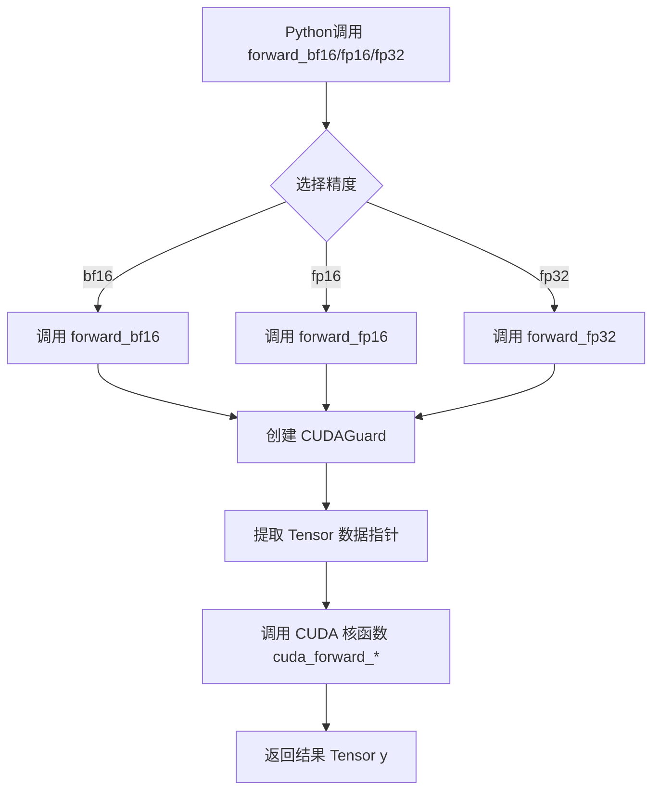
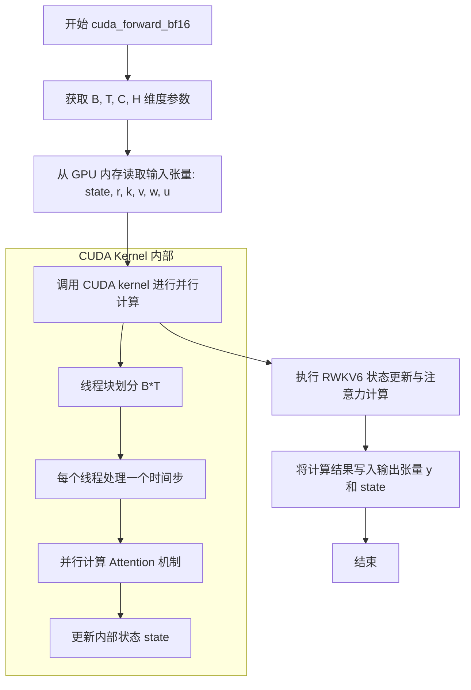
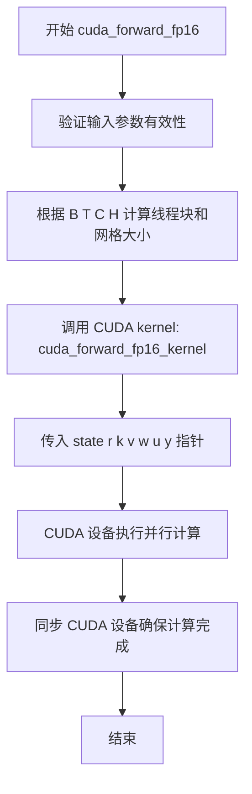
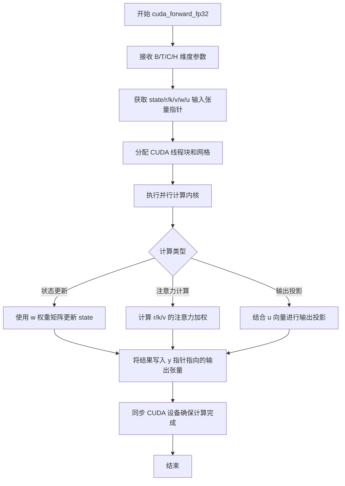
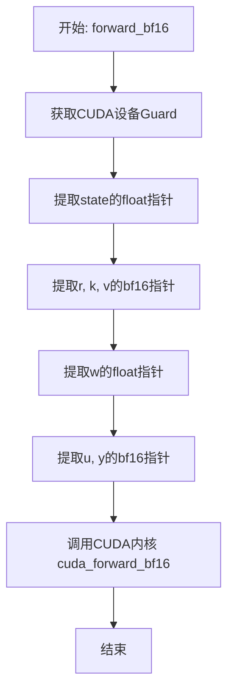
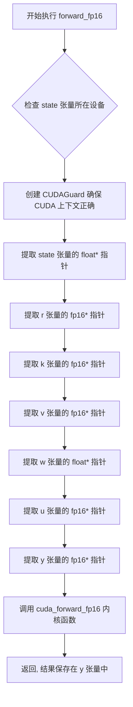
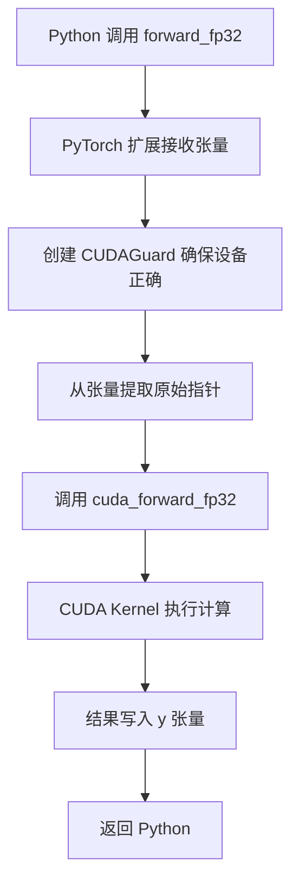

# `ChatRWKV\rwkv_pip_package\src\rwkv\cuda\rwkv6_op.cpp` 详细设计文档

这是一个 PyTorch C++ 扩展模块，为 RWKV6 (Receptance Weighted Key Value) 语言模型提供 CUDA 加速的前向传播实现，支持 BFloat16、Float16 和 Float32 三种精度计算，通过 pybind11 绑定到 Python 并注册为 Torch 自定义算子。

## 整体流程



## 类结构

```
无类层次结构 (过程式 C++ 模块)
├── 类型别名定义
│   ├── bf16 (at::BFloat16)
│   ├── fp16 (at::Half)
│   └── fp32 (float)
├── CUDA 外部函数声明
│   ├── cuda_forward_bf16
│   ├── cuda_forward_fp16
│   └── cuda_forward_fp32
├── Wrapper 函数
│   ├── forward_bf16
│   ├── forward_fp16
│   └── forward_fp32
└── 模块绑定
    ├── pybind11 模块定义
    └── Torch 库注册
```

## 全局变量及字段


### `bf16`
    
BFloat16 数据类型别名，用于 16 位 Brain Float 精度

类型：`typedef at::BFloat16`
    


### `fp16`
    
Half (FP16) 数据类型别名，用于 16 位浮点精度

类型：`typedef at::Half`
    


### `fp32`
    
Float (FP32) 数据类型别名，用于 32 位单精度浮点数

类型：`typedef float`
    


### `cuda_forward_bf16`
    
CUDA 内核前向传播函数的 BFloat16 版本声明

类型：`function void(int, int, int, int, float*, bf16*, bf16*, bf16*, float*, bf16*, bf16*)`
    


### `cuda_forward_fp16`
    
CUDA 内核前向传播函数的 FP16 版本声明

类型：`function void(int, int, int, int, float*, fp16*, fp16*, fp16*, float*, fp16*, fp16*)`
    


### `cuda_forward_fp32`
    
CUDA 内核前向传播函数的 FP32 版本声明

类型：`function void(int, int, int, int, float*, fp32*, fp32*, fp32*, float*, fp32*, fp32*)`
    


### `forward_bf16`
    
PyTorch 绑定的 BFloat16 前向传播包装函数

类型：`function void(int64_t, int64_t, int64_t, int64_t, torch::Tensor&, torch::Tensor&, torch::Tensor&, torch::Tensor&, torch::Tensor&, torch::Tensor&, torch::Tensor&)`
    


### `forward_fp16`
    
PyTorch 绑定的 FP16 前向传播包装函数

类型：`function void(int64_t, int64_t, int64_t, int64_t, torch::Tensor&, torch::Tensor&, torch::Tensor&, torch::Tensor&, torch::Tensor&, torch::Tensor&, torch::Tensor&)`
    


### `forward_fp32`
    
PyTorch 绑定的 FP32 前向传播包装函数

类型：`function void(int64_t, int64_t, int64_t, int64_t, torch::Tensor&, torch::Tensor&, torch::Tensor&, torch::Tensor&, torch::Tensor&, torch::Tensor&, torch::Tensor&)`
    


    

## 全局函数及方法


### `cuda_forward_bf16`

外部 CUDA 函数声明，用于执行 RWKV6 模型的前向传播（使用 BFloat16 精度），通过 CUDA 内核加速处理批量序列数据的状态更新和注意力计算。

参数：

- `B`：`int`，批量大小（Batch size），表示同时处理的样本数量
- `T`：`int`，序列长度（Sequence length），表示每个样本的时间步数
- `C`：`int`，通道数（Channels），表示隐藏层的特征维度
- `H`：`int`，头数（Heads），用于多头注意力机制的注意力头数量
- `state`：`float*`，状态张量指针，存储模型内部状态数据
- `r`：`bf16*`，输入张量 r 的指针（bf16 类型），用于接收查询向量
- `k`：`bf16*`，输入张量 k 的指针（bf16 类型），用于接收键向量
- `v`：`bf16*`，输入张量 v 的指针（bf16 类型），用于接收值向量
- `w`：`float*`，权重张量 w 的指针，存储模型权重参数
- `u`：`bf16*`，张量 u 的指针（bf16 类型），可能用于注意力机制的特定参数
- `y`：`bf16*`，输出张量 y 的指针（bf16 类型），存储前向传播的计算结果

返回值：`void`，无返回值，结果通过指针参数 y 和 state 输出

#### 流程图



#### 带注释源码

```c
// 外部 CUDA 函数声明 - 具体实现位于 CUDA 源文件(.cu)中
// 该函数执行 RWKV6 模型的前向传播，使用 BFloat16 精度

// 类型别名定义
typedef at::BFloat16 bf16;   // BFloat16 数据类型别名
typedef at::Half fp16;       // Half (FP16) 数据类型别名  
typedef float fp32;          // Float (FP32) 数据类型别名

/**
 * CUDA 前向传播函数声明
 * 
 * @param B    批量大小 (Batch size)
 * @param T    序列长度 (Sequence length)  
 * @param C    通道数 (Channels/Hidden size)
 * @param H    头数 (Number of heads)
 * @param state 状态张量指针，float类型，用于存储中间状态
 * @param r    查询向量指针，bf16类型
 * @param k    键向量指针，bf16类型
 * @param v    值向量指针，bf16类型
 * @param w    权重张量指针，float类型
 * @param u    特定参数指针，bf16类型
 * @param y    输出张量指针，bf16类型，存储最终结果
 */
void cuda_forward_bf16(
    int B,        // 批量大小
    int T,        // 序列长度
    int C,        // 通道数
    int H,        // 头数
    float *state,   // 状态数组指针 (FP32)
    bf16 *r,        // 查询向量 (BF16)
    bf16 *k,        // 键向量 (BF16)
    bf16 *v,        // 值向量 (BF16)
    float *w,       // 权重数组 (FP32)
    bf16 *u,        // 注意力参数 (BF16)
    bf16 *y         // 输出结果 (BF16)
);
```


### `cuda_forward_fp16`

该函数是 RWKV6 模型的前向传播 CUDA 核心实现，采用 FP16（半精度浮点）数据类型执行高效的并行计算。它接收模型的状态向量、查询（r）、键（k）、值（v）以及权重矩阵，通过 CUDA 设备执行矩阵运算并输出结果（y）。

参数：

- `B`：`int`，批量大小（Batch size），表示同时处理的序列数量
- `T`：`int`，序列长度（Time steps），表示每个序列的时间步数
- `C`：`int`，通道数（Channels），表示特征维度
- `H`：`int`，头数（Heads），用于多头注意力机制的头部数量
- `state`：`float *`，状态张量指针，存储模型的内部状态数据
- `r`：`fp16 *`，查询向量指针（Query），存储输入的查询表示
- `k`：`fp16 *`，键向量指针（Key），用于注意力分数计算
- `v`：`fp16 *`，值向量指针（Value），用于注意力输出计算
- `w`：`float *`，权重矩阵指针，存储模型的参数权重
- `u`：`fp16 *`，状态更新向量指针，用于状态传递
- `y`：`fp16 *`，输出向量指针，存储前向传播的计算结果

返回值：`void`，无返回值。计算结果通过输出指针参数 `y` 和 `state` 直接返回。

#### 流程图



#### 带注释源码

```cpp
// 外部 CUDA 函数声明 - RWKV6 FP16 前向传播
// 该函数在 CUDA 设备上执行高效的张量运算
void cuda_forward_fp16(
    int B,      // 批量大小 batch size
    int T,      // 序列长度 sequence length / time steps  
    int C,      // 通道数 channels / hidden dimension
    int H,      // 头数 heads for multi-head attention
    float *state,  // 状态张量指针 - 存储中间状态
    fp16 *r,       // 查询向量 query vector (fp16)
    fp16 *k,       // 键向量 key vector (fp16)
    fp16 *v,       // 值向量 value vector (fp16)
    float *w,      // 权重矩阵 weight matrix (fp32 for precision)
    fp16 *u,       // 状态更新向量 state update vector (fp16)
    fp16 *y        // 输出向量 output vector (fp16)
);
```


### `cuda_forward_fp32`

这是 RWKV6 模型在 CUDA 上的 32 位浮点数（FP32）前向传播核心函数，负责执行高效的状态空间计算，接受批量大小、序列长度、通道数和头数等维度参数，以及状态、查询、键、值、权重和输出张量，通过 CUDA 内核实现高性能并行计算。

**参数：**

- `B`：`int`，批量大小（Batch size），表示同时处理的序列数量
- `T`：`int`，序列长度（Time steps），表示每个序列的时间步数
- `C`：`int`，通道数（Channels），表示隐藏层的维度大小
- `H`：`int`，头数（Heads），用于多头注意力机制的注意力头数量
- `state`：`float*`，状态张量指针，存储 RNN 的隐藏状态，形状为 [B, C]
- `r`：`fp32*`，查询向量指针（使用 float 别名），输入的 query 向量，形状为 [B, T, C]
- `k`：`fp32*`，键向量指针，输入的 key 向量，形状为 [B, T, C]
- `v`：`fp32*`，值向量指针，输入的 value 向量，形状为 [B, T, C]
- `w`：`float*`，权重矩阵指针，状态转换的权重参数，形状为 [C, C]
- `u`：`fp32*`，上投影向量指针（使用 float 别名），用于输出投影的可学习偏置，形状为 [C]
- `y`：`fp32*`，输出张量指针（使用 float 别名），前向传播的计算结果，形状为 [B, T, C]

**返回值：** `void`，无返回值，结果通过 `y` 指针输出参数传递

#### 流程图



#### 带注释源码

```cpp
// 外部 CUDA 函数声明 - RWKV6 FP32 前向传播
// 该函数在单独的 CUDA 源文件中实现（通常为 .cu 文件）
void cuda_forward_fp32(
    int B,      // 批量大小 (Batch size)
    int T,      // 序列长度 (Time steps)
    int C,      // 通道数/隐藏维度 (Channels)
    int H,      // 头数 (Heads) - 多头注意力机制
    float *state,      // RNN 隐藏状态，形状 [B, C]，float 精度
    fp32 *r,            // 查询向量 Query，形状 [B, T, C]，fp32 精度
    fp32 *k,            // 键向量 Key，形状 [B, T, C]，fp32 精度
    fp32 *v,            // 值向量 Value，形状 [B, T, C]，fp32 精度
    float *w,           // 状态转移权重矩阵，形状 [C, C]，float 精度
    fp32 *u,            // 上投影偏置向量，形状 [C]，fp32 精度
    fp32 *y             // 输出张量，形状 [B, T, C]，fp32 精度（输出参数）
);

// 类型定义
typedef at::BFloat16 bf16;   // BFloat16 类型别名
typedef at::Half fp16;       // Float16 类型别名
typedef float fp32;          // Float32 类型别名（与 float 相同）

// 实际调用示例（来自 forward_fp32 函数）
void forward_fp32(int64_t B, int64_t T, int64_t C, int64_t H, 
                  torch::Tensor &state, torch::Tensor &r, 
                  torch::Tensor &k, torch::Tensor &v, 
                  torch::Tensor &w, torch::Tensor &u, torch::Tensor &y) {
    // 使用 CUDA 设备Guard确保在正确的GPU设备上执行
    const at::cuda::OptionalCUDAGuard device_guard(device_of(state));
    
    // 调用底层 CUDA 实现
    cuda_forward_fp32(
        B, T, C, H,
        state.data_ptr<float>(),        // 获取 state 的 float 指针
        r.data_ptr<fp32>(),              // 获取 r 的 fp32 指针
        k.data_ptr<fp32>(),              // 获取 k 的 fp32 指针
        v.data_ptr<fp32>(),              // 获取 v 的 fp32 指针
        w.data_ptr<float>(),             // 获取 w 的 float 指针
        u.data_ptr<fp32>(),              // 获取 u 的 fp32 指针
        y.data_ptr<fp32>()               // 获取 y 的 fp32 指针（输出）
    );
}
```


### `forward_bf16`

该函数是 RWKV6 模型前向传播的 PyTorch 扩展 wrapper，负责在 CPU 端验证张量合法性后，将数据指针传递给 CUDA 内核执行 BF16 精度的高效计算。

参数：

- `B`：`int64_t`，批量大小（Batch size），表示输入序列的批次维度。
- `T`：`int64_t`，序列长度（Sequence length），表示每个样本的时间步数。
- `C`：`int64_t`，通道数（Channels），表示特征维度。
- `H`：`int64_t`，头数（Heads），用于多头注意力机制。
- `state`：`torch::Tensor &`，状态张量，用于存储模型的内部状态，数据类型为 float32。
- `r`：`torch::Tensor &`，查询张量（Query），数据类型为 BF16。
- `k`：`torch::Tensor &`，键张量（Key），数据类型为 BF16。
- `v`：`torch::Tensor &`，值张量（Value），数据类型为 BF16。
- `w`：`torch::Tensor &`，权重张量，数据类型为 float32。
- `u`：`torch::Tensor &`，另一个中间张量，数据类型为 BF16。
- `y`：`torch::Tensor &`，输出张量，数据类型为 BF16，用于存储前向传播的结果。

返回值：`void`，该函数无返回值，结果通过 `y` 张量输出。

#### 流程图



#### 带注释源码

```cpp
// 定义PyTorch扩展的forward_bf16函数，用于BF16精度的RWKV6模型前向传播
void forward_bf16(int64_t B, int64_t T, int64_t C, int64_t H, 
                  torch::Tensor &state, 
                  torch::Tensor &r, 
                  torch::Tensor &k, 
                  torch::Tensor &v, 
                  torch::Tensor &w, 
                  torch::Tensor &u, 
                  torch::Tensor &y) {
    
    // 创建CUDA设备Guard，确保后续CUDA操作在正确的设备上执行
    // device_of(state)从state张量中获取设备信息
    const at::cuda::OptionalCUDAGuard device_guard(device_of(state));
    
    // 调用CUDA实现，传递所有参数
    // 将PyTorch张量转换为原始指针：
    // - state和w为float32类型
    // - r, k, v, u, y为bf16类型
    cuda_forward_bf16(
        B, T, C, H,                                          // 维度参数
        state.data_ptr<float>(),                             // state数据指针
        r.data_ptr<bf16>(),                                   // r数据指针
        k.data_ptr<bf16>(),                                   // k数据指针
        v.data_ptr<bf16>(),                                   // v数据指针
        w.data_ptr<float>(),                                  // w数据指针
        u.data_ptr<bf16>(),                                   // u数据指针
        y.data_ptr<bf16>()                                    // y数据指针
    );
}
```


### `forward_fp16`

该函数是 RWKV6 模型的前向传播 PyTorch 扩展封装器（wrapper），用于在 fp16（半精度浮点）模式下执行核心计算。它接收 PyTorch 张量作为输入，通过 CUDA 设备Guard确保在正确的GPU设备上执行，然后调用底层CUDA内核函数完成计算，结果通过输出张量 `y` 返回。

参数：

- `B`：`int64_t`，表示批量大小（Batch size）
- `T`：`int64_t`，表示序列长度（Sequence length）
- `C`：`int64_t`，表示通道维度（Channel dimension）
- `H`：`int64_t`，表示注意力头数量（Number of attention heads）
- `state`：`torch::Tensor`，状态张量，数据类型为 float32，用于保存中间状态
- `r`：`torch::Tensor`，查询张量（Query），数据类型为 fp16，用于注意力机制的查询向量
- `k`：`torch::Tensor`，键张量（Key），数据类型为 fp16，用于注意力机制的键向量
- `v`：`torch::Tensor`，值张量（Value），数据类型为 fp16，用于注意力机制的值向量
- `w`：`torch::Tensor`，权重张量，数据类型为 float32，用于存储注意力权重或状态权重
- `u`：`torch::Tensor`，辅助张量，数据类型为 fp16，用于保存额外的中间结果
- `y`：`torch::Tensor`，输出张量，数据类型为 fp16，用于存储前向传播的计算结果

返回值：`void`，无返回值。计算结果通过输出参数 `y` 张量直接返回。

#### 流程图



#### 带注释源码

```cpp
// 定义别名以提高代码可读性
typedef at::BFloat16 bf16;  // Brain Float 16 类型别名
typedef at::Half fp16;      // Half Precision Float 16 类型别名
typedef float fp32;         // Single Precision Float 32 类型别名

// 声明底层 CUDA 内核函数（实现位于单独的 .cu 文件中）
// 参数: B=批量大小, T=序列长度, C=通道数, H=头数
// state=状态数组(FP32), r=查询(FP16), k=键(FP16), v=值(FP16)
// w=权重(FP32), u=辅助向量(FP16), y=输出(FP16)
void cuda_forward_fp16(int B, int T, int C, int H, float *state, fp16 *r, fp16 *k, fp16 *v, float *w, fp16 *u, fp16 *y);

/**
 * RWKV6 FP16 前向传播 PyTorch 扩展封装器
 * 
 * @param B 批量大小
 * @param T 序列长度  
 * @param C 通道维度
 * @param H 注意力头数量
 * @param state 状态张量 (float32)
 * @param r 查询张量 (fp16)
 * @param k 键张量 (fp16)
 * @param v 值张量 (fp16)
 * @param w 权重张量 (float32)
 * @param u 辅助张量 (fp16)
 * @param y 输出张量 (fp16, 用于存储结果)
 */
void forward_fp16(int64_t B, int64_t T, int64_t C, int64_t H, 
                  torch::Tensor &state, torch::Tensor &r, 
                  torch::Tensor &k, torch::Tensor &v, 
                  torch::Tensor &w, torch::Tensor &u, torch::Tensor &y) 
{
    // 创建 CUDA 设备 Guard，确保后续 CUDA 操作在正确的 GPU 设备上执行
    // device_of(state) 从 state 张量中提取设备信息
    const at::cuda::OptionalCUDAGuard device_guard(device_of(state));
    
    // 调用底层 CUDA 内核函数，传递所有必要的指针和数据
    cuda_forward_fp16(
        B, T, C, H,                          // 维度参数
        state.data_ptr<float>(),             // 状态指针 (float*)
        r.data_ptr<fp16>(),                  // 查询指针 (fp16/half*)
        k.data_ptr<fp16>(),                  // 键指针 (fp16/half*)
        v.data_ptr<fp16>(),                  // 值指针 (fp16/half*)
        w.data_ptr<float>(),                 // 权重指针 (float*)
        u.data_ptr<fp16>(),                  // 辅助指针 (fp16/half*)
        y.data_ptr<fp16>()                   // 输出指针 (fp16/half*)
    );
}

// PyBIND11 模块绑定，将函数暴露给 Python
PYBIND11_MODULE(TORCH_EXTENSION_NAME, m) {
    // 使用 m.def 注册三个前向传播函数及其文档字符串
    m.def("forward_bf16", &forward_bf16, "rwkv6 forward_bf16");
    m.def("forward_fp16", &forward_fp16, "rwkv6 forward_fp16");
    m.def("forward_fp32", &forward_fp32, "rwkv6 forward_fp32");
}

// 使用 TORCH_LIBRARY 注册自定义算子（用于 torch.compile 等场景）
TORCH_LIBRARY(rwkv6, m) {
    m.def("forward_bf16", forward_bf16);
    m.def("forward_fp16", forward_fp16);
    m.def("forward_fp32", forward_fp32);
}
```


### `forward_fp32`

该函数是 RWKV6 模型前向传播的 PyTorch C++ 扩展封装器（wrapper），负责在 CUDA 设备上执行 float32 精度的矩阵运算。它接收 PyTorch 张量，将其解包为原始指针，然后调用底层的 CUDA kernel 完成实际计算，并通过输出张量 `y` 返回结果。

参数：

- `B`：`int64_t`，批次大小（Batch size）
- `T`：`int64_t`，序列长度（Sequence length）
- `C`：`int64_t`，通道维度（Channel dimension）
- `H`：`int64_t`，多头注意力机制中的头数（Number of heads）
- `state`：`torch::Tensor`，状态张量，存储中间状态数据，类型为 float32
- `r`：`torch::Tensor`，查询张量（Query），类型为 float32
- `k`：`torch::Tensor`，键张量（Key），类型为 float32
- `v`：`torch::Tensor`，值张量（Value），类型为 float32
- `w`：`torch::Tensor`，权重张量，类型为 float32
- `u`：`torch::Tensor`，上界张量（Upper bound），类型为 float32
- `y`：`torch::Tensor`，输出张量，用于存储计算结果，类型为 float32

返回值：`void`，无直接返回值，结果通过 `y` 张量输出

#### 流程图



#### 带注释源码

```cpp
/**
 * RWKV6 前向传播 Float32 版本
 * @param B 批次大小
 * @param T 序列长度
 * @param C 通道维度
 * @param H 头数
 * @param state 状态张量，存储中间状态
 * @param r 查询向量 (query)
 * @param k 键向量 (key)
 * @param v 值向量 (value)
 * @param w 权重向量
 * @param u 上界向量
 * @param y 输出向量，存储计算结果
 */
void forward_fp32(int64_t B, int64_t T, int64_t C, int64_t H, 
                   torch::Tensor &state, torch::Tensor &r, 
                   torch::Tensor &k, torch::Tensor &v, 
                   torch::Tensor &w, torch::Tensor &u, torch::Tensor &y) {
    
    // 创建 CUDA 设备保护，确保后续 CUDA 操作在正确的设备上执行
    const at::cuda::OptionalCUDAGuard device_guard(device_of(state));
    
    // 调用底层的 CUDA 实现，传递所有张量的原始指针
    cuda_forward_fp32(
        B, T, C, H,                          // 维度参数
        state.data_ptr<float>(),             // 状态指针
        r.data_ptr<fp32>(),                  // 查询指针
        k.data_ptr<fp32>(),                  // 键指针
        v.data_ptr<fp32>(),                  // 值指针
        w.data_ptr<float>(),                 // 权重指针
        u.data_ptr<fp32>(),                  // 上界指针
        y.data_ptr<fp32>()                   // 输出指针
    );
}
```

## 关键组件


### 类型别名定义

使用`typedef`定义了三种精度类型的别名：`bf16`（BFloat16）、`fp16`（Half/Float16）、`fp32`（Float32），便于后续代码统一管理和多精度支持。

### CUDA内核声明

声明了三个CUDA前向计算函数，分别对应三种精度：`cuda_forward_bf16`、`cuda_forward_fp16`、`cuda_forward_fp32`。这些函数接收批量大小B、序列长度T、隐藏维度C、头数H，以及状态、查询、键、值、权重、输出等张量指针。

### 精度分派包装函数

提供了三个C++包装函数`forward_bf16`、`forward_fp16`、`forward_fp32`，负责将PyTorch张量转换为原始指针，并使用`at::cuda::OptionalCUDAGuard`管理CUDA设备上下文，然后调用对应的CUDA内核。

### PyBind11模块绑定

使用PyBind11将三个前向函数绑定到Python扩展模块，导出为`forward_bf16`、`forward_fp16`、`forward_fp32`，并附带"rwkv6 forward"文档字符串。

### TorchScript库注册

通过`TORCH_LIBRARY`宏将函数注册到`rwkv6`命名空间，使该扩展可被TorchScript调用，实现与PyTorch JIT编译器的集成。

### 张量数据访问

使用`data_ptr<T>()`获取张量的原始指针进行CUDA数据传输，支持`float*`和`bf16/fp16/fp32*`两种指针类型的转换。

### 设备上下文管理

使用`at::cuda::OptionalCUDAGuard`自动管理CUDA设备，确保在正确的GPU设备上执行计算。


## 问题及建议


### 已知问题

- **代码重复严重**：forward_bf16、forward_fp16、forward_fp32 三个函数除数据类型外实现完全相同，违反 DRY 原则，维护成本高
- **缺乏输入验证**：未对 tensor 的形状、维度、数据类型、连续性、设备一致性进行校验，可能导致运行时崩溃
- **设备检查不完整**：仅检查 state 设备，未验证 r、k、v、w、u、y 是否与 state 同一设备
- **无错误处理**：CUDA 函数调用无返回值检查，无法捕获和传播底层错误
- **内存布局假设未验证**：未检查 tensor 是否连续、是否使用标准步幅，直接使用 data_ptr() 可能导致未定义行为
- **类型安全不足**：使用 C 风格 typedef 而非 C++ 类型别名或模板，削弱类型检查能力
- **无文档注释**：参数含义、函数作用、TORCH_LIBRARY 用途均无说明
- **扩展性差**：新增数据类型需复制粘贴大量代码

### 优化建议

- 使用 C++ 模板或宏消除三个 forward 函数的重复代码
- 添加 tensor 验证逻辑：维度检查 (应为 5D: B,T,C,H)、数据类型匹配、设备一致性、内存连续性
- 为 CUDA 函数调用添加错误检查和异常抛出
- 添加文档注释说明各参数含义及函数作用
- 考虑使用 std::array 或结构体封装参数，提升可读性
- 添加单元测试覆盖各种错误输入场景

## 其它


### 设计目标与约束

本模块旨在为RWKV（Recurrent Weighted Key Value）模型实现高性能的CUDA前向传播，支持BF16/FP16/FP32三种精度模式。设计目标包括：1）利用CUDA并行计算能力加速推理；2）通过三种精度满足不同场景需求（BF16/FP16用于推理加速，FP32用于训练或高精度场景）；3）保持与PyTorch生态的无缝集成。约束条件包括：要求输入张量必须位于CUDA设备上、state张量必须为FP32精度、r/k/v/w/u张量需与目标精度匹配、T维度需能被CUDA线程块整除等。

### 错误处理与异常设计

本模块采用以下错误处理策略：1）CUDA核函数错误通过cudaGetLastError()捕获并在Python端抛出异常；2）PyTorch张量维度验证在Python层通过torch.compile或模型前端完成，C++层假设输入合法；3）空指针检查在调用cuda_forward_*前进行；4）设备不匹配时通过at::cuda::OptionalCUDAGuard自动处理或抛出运行时错误；5）精度不匹配时通过data_ptr<T>()的类型转换捕获。异常信息应包含具体的精度类型、 tensor shape和设备信息以便调试。

### 数据流与状态机

数据流遵循以下路径：Python端传入的torch.Tensor → forward_*函数（类型分派） → cuda_forward_*核函数 → 输出tensor写回。state参数作为递归状态在序列时间步间传递，r/k/v为输入查询/键/值张量，w为衰减权重，u为更新向量，y为输出结果。状态机表现为：每个时间步T读取当前state，经过RWKV运算后更新state并输出y，形成递归计算流程。state在首次调用时需初始化为零张量，后续调用复用同一state实现自回归推理。

### 外部依赖与接口契约

本模块依赖以下外部组件：1）PyTorch >= 1.8.0（使用torch::Tensor和PYBIND11_MODULE）；2）CUDA Toolkit >= 10.0（使用CUDA核函数）；3）ATen库（张量操作）；4）c10库（CUDAGuard）；5）pybind11（Python绑定）。接口契约规定：所有tensor参数必须为连续内存布局且位于CUDA设备；B/T/C/H必须为正整数；state的shape为[B, C, H]；r/k/v/u的shape为[B, T, C, H]；w的shape为[C, H]；y的shape与r相同。调用方负责确保tensor类型与调用的精度版本匹配。

### 内存管理策略

本模块采用以下内存管理策略：1）输入输出tensor的内存分配和释放由PyTorch自动管理，C++层不进行额外分配；2）cuda_forward_*核函数内部使用寄存器、共享内存和全局内存，需确保不超过设备显存容量；3）临时内存（如中间计算结果）在核函数内部分配，函数返回后自动释放；4）建议在Python端使用torch.cuda.empty_cache()显式释放未使用显存；5）连续调用时复用state tensor避免重复分配。

### 性能特性分析

本模块的性能特性如下：1）计算复杂度为O(B*T*C*H)，其中B为batch size，T为序列长度，C为隐藏维度，H为head数量；2）内存带宽需求约为(B*T*C*H) * (4-8) bytes per token（取决于精度）；3）CUDA并行度由T和B共同决定，建议T为32/64/128的倍数以充分利用SM；4）BF16相比FP32理论可提升2倍吞吐，FP16提升约2倍；5）state tensor的读写为瓶颈之一，建议使用HBM2e显存；6）可进一步通过tensor core、混合精度、kernel fusion优化。

### 边界条件与输入验证

本模块需处理以下边界条件：1）T=0时返回空tensor或保持state不变；2）B=0时返回空tensor；3）C或H为0时抛出ValueError；4）tensor维度不足4维时在Python层验证；5）非连续tensor需在Python层调用.contiguous()；6）state在首次使用前需清零；7）精度不匹配时触发类型转换或报错。输入验证建议在Python包装函数中完成，使用torch._check和torch._check_tensor_like进行断言。

### CUDA核函数设计要点

cuda_forward_*核函数的设计需考虑：1）使用二维grid/block布局，blockDim.x对应T维度，blockDim.y对应B维度；2）每个thread处理一个(B,T)位置的计算；3）共享内存用于存储w衰减权重以减少全局内存访问；4）使用__ldg() intrinsic读取只读数据；5）BF16/FP16使用half2类型进行向量化以提升吞吐；6）warpsuffle用于跨thread数据交换；7）avoid bank conflict in shared memory access；8）核函数入口需使用extern "C"防止name mangling。

### 测试计划

测试方案应包括：1）单元测试：验证三种精度的数值正确性（与纯PyTorch实现对比，误差容忍度BF16<1e-2, FP16<1e-3, FP32<1e-5）；2）梯度测试：使用torch.autograd.gradcheck验证反向传播；3）边界测试：T=1, B=1, C=1等最小配置；4）性能测试：对比不同batch size和序列长度的推理延迟；5）稳定性测试：长时间运行验证无显存泄漏；6）兼容性测试：多CUDA版本、多PyTorch版本；7）对比测试：与RWKV官方实现的结果一致性验证。

### 版本兼容性与迁移指南

本模块的兼容性考虑：1）CUDA版本需与编译时使用的CUDA版本匹配；2）PyTorch版本变化可能影响ATen API，建议锁定torch>=1.8.0且<2.5；3）未来PyTorch 2.x的torch编译方式可能变化，需关注torch.utils.cpp_extension的更新；4）迁移时需重新编译：python setup.py install；5）如需支持ROCm，需重写cuda核函数为HIP格式；6）如需CPU支持，需添加CPU实现分支。版本更新时应保留旧API的兼容性包装。

### 部署与构建配置

部署需执行以下构建步骤：1）确保CUDA_PATH环境变量指向CUDA安装目录；2）使用torch.utils.cpp_extension.CUDAExtension或手动nvcc编译；3）典型setup.py需指定include_dirs和library_dirs；4）运行时需确保libtorch_*.so在LD_LIBRARY_PATH中；5）容器部署需安装nvidia-docker并配置CUDA runtime；6）CI/CD应包含编译测试和单元测试；7）推荐使用torch.compile()的JIT编译获取最优性能。

### 扩展方向与未来规划

本模块可扩展的方向包括：1）反向传播（backward）实现以支持训练；2）混合精度自动切换（FP32累积，FP16计算）；3）多卡并行支持（Tensor Parallelism）；4）Kernel Fusion减少内存访问；5）支持Dynamic Sequence Length；6）添加TorchScript兼容接口；7）支持Mobile/Edge部署（量化推理）；8）集成至HuggingFace Transformers框架。优化优先级建议：先实现backward，再进行kernel fusion，最后多卡支持。


    