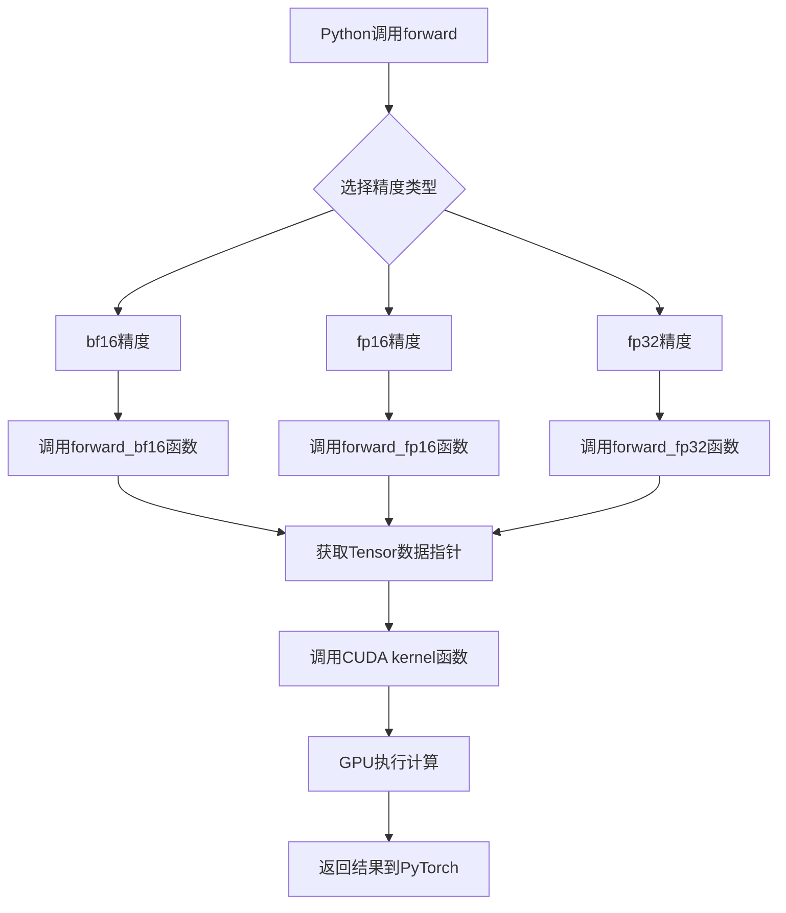
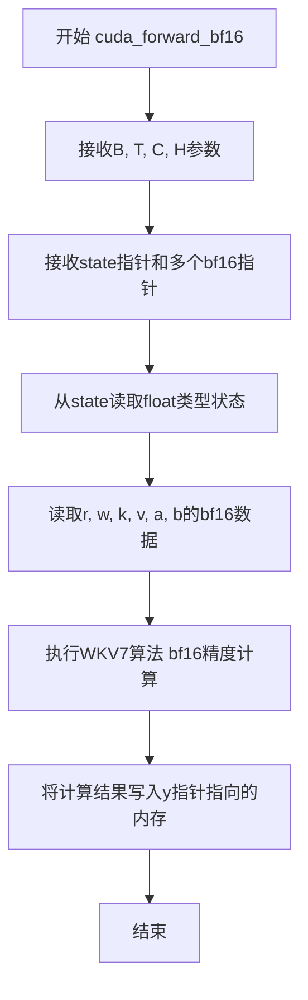
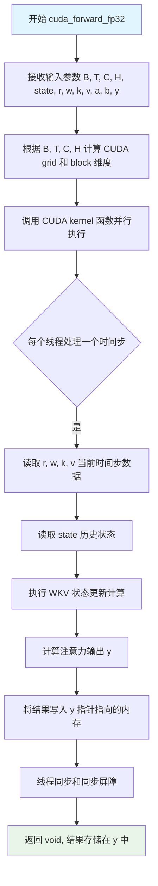
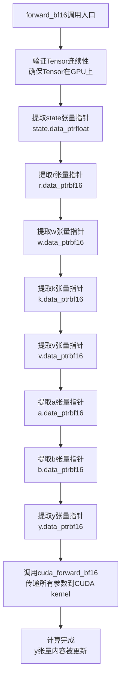
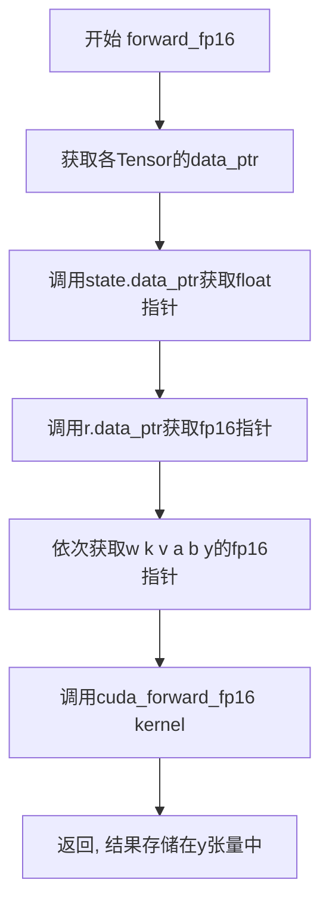
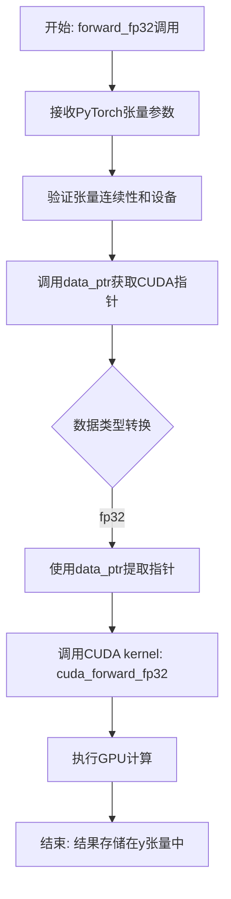
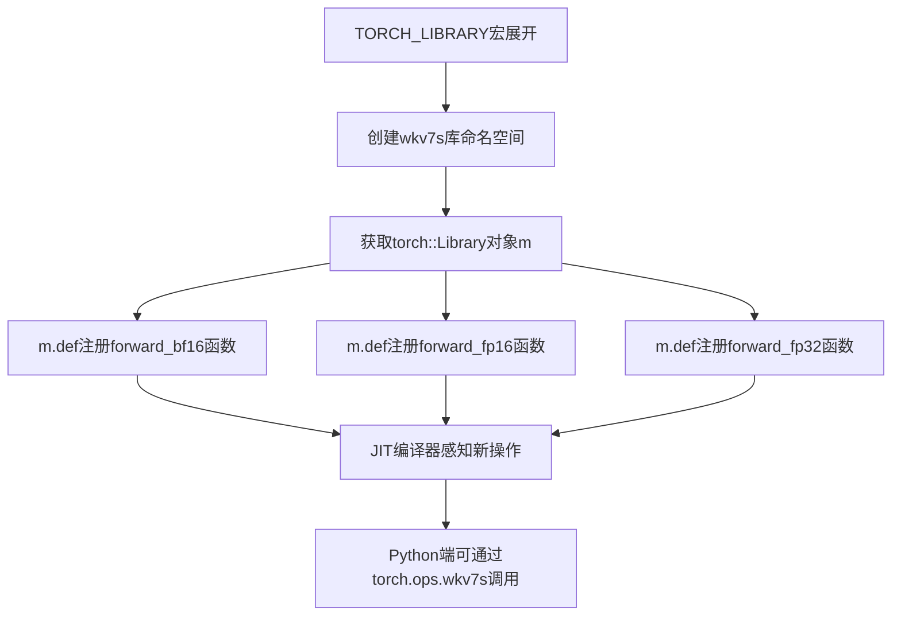

# `ChatRWKV\rwkv_pip_package\src\rwkv\cuda\rwkv7_op.cpp` 详细设计文档

这是一个PyTorch C++扩展模块，名为wkv7s，提供了三种不同精度（bf16/fp16/fp32）的CUDA前向传播函数，用于在GPU上执行高效的状态空间计算操作，支持批量大小B、时间步长T、通道数C和头数H等参数。

## 整体流程



## 类结构

```
无类层次结构（纯函数式模块）
└── 模块: wkv7s (PyTorch Library)
    ├── cuda_forward_bf16 (CUDA kernel声明)
    ├── cuda_forward_fp16 (CUDA kernel声明)
    ├── cuda_forward_fp32 (CUDA kernel声明)
    ├── forward_bf16 (包装函数)
    ├── forward_fp16 (包装函数)
    └── forward_fp32 (包装函数)
```

## 全局变量及字段


### `fp16`
    
at::Half别名，用于半精度浮点数

类型：`typedef at::Half`
    


### `bf16`
    
at::BFloat16别名，用于Brain Float浮点数

类型：`typedef at::BFloat16`
    


### `fp32`
    
float别名，用于单精度浮点数

类型：`typedef float`
    


    

## 全局函数及方法


### `cuda_forward_bf16`

CUDA kernel函数声明，执行bf16（Brain Float 16）精度的CUDA计算，用于WKV（Weighted Key Value）7算法的forward传播。

参数：

- `B`：`int`，批次大小（Batch size）
- `T`：`int`，时间步长（Time steps）
- `C`：`int`，通道数（Channels）
- `H`：`int`，头数（Heads）
- `state`：`float*`，状态数组指针，用于存储中间计算状态
- `r`：`bf16*`，查询张量（Query tensor）的bf16指针
- `w`：`bf16*`，权重张量（Weight tensor）的bf16指针
- `k`：`bf16*`，键张量（Key tensor）的bf16指针
- `v`：`bf16*`，值张量（Value tensor）的bf16指针
- `a`：`bf16*`，中间变量a的bf16指针
- `b`：`bf16*`，中间变量b的bf16指针
- `y`：`bf16*`，输出张量（Output tensor）的bf16指针

返回值：`void`，无返回值（CUDA kernel通过指针参数返回结果）

#### 流程图



#### 带注释源码

```cpp
// CUDA kernel函数声明 - bf16精度版本
// B: 批次大小, T: 时间步长, C: 通道数, H: 头数
// state: 状态数组指针（float类型，用于存储中间状态）
// r, w, k, v: 输入张量指针（bf16类型）
// a, b: 中间变量指针（bf16类型，用于累积计算）
// y: 输出张量指针（bf16类型，存储最终结果）
void cuda_forward_bf16(int B, int T, int C, int H, float *state, bf16 *r, bf16 *w, bf16 *k, bf16 *v, bf16 *a, bf16 *b, bf16 *y);
```


### `cuda_forward_fp16`

这是一个CUDA kernel函数的声明，用于执行fp16（半精度浮点）精度的CUDA计算。该函数是WKV7（一种类似于RWKV的高效Transformer变体）模型的前向传播核心实现，支持批量处理、序列时间步、通道数和注意力头数的并行计算。

参数：

- `B`：`int`，批量大小（Batch size），表示同时处理的样本数量
- `T`：`int`，序列长度（Time steps），表示每个样本的时间步数
- `C`：`int`，通道数（Channels），表示特征维度
- `H`：`int`，头数（Heads），表示多头注意力机制中的注意力头数量
- `state`：`float *`，状态指针，指向fp32类型的内部状态矩阵，用于存储循环状态
- `r`：`fp16 *`，查询接受向量（Receptance），fp16类型的查询相关输入
- `w`：`fp16 *`，权重向量（Weight），fp16类型的门控权重参数
- `k`：`fp16 *`，键向量（Key），fp16类型的键输入
- `v`：`fp16 *`，值向量（Value），fp16类型的值输入
- `a`：`fp16 *`，累加器A，fp16类型的中间计算结果a
- `b`：`fp16 *`，累加器B，fp16类型的中间计算结果b
- `y`：`fp16 *`，输出向量，fp16类型的结果输出

返回值：`void`，无返回值。该函数为CUDA kernel，通过指针参数直接修改输出数组`y`以及可能的状态更新。

#### 流程图

```mermaid
flowchart TD
    A[开始 cuda_forward_fp16] --> B[接收输入参数 B, T, C, H, state, r, w, k, v, a, b, y]
    B --> C[根据B, T, C, H计算grid和block维度]
    C --> D[Launch CUDA Kernel并行执行]
    D --> E{每个线程处理}
    E -->|一个时间步| F[读取r[t], w[t], k[t], v[t]]
    F --> G[读取当前状态state]
    G --> H[执行WKV7核心计算: 结合r, w, k, v, a, b更新状态]
    H --> I[计算输出y[t] = 归一化后的结果]
    I --> J[写回y[t]到全局内存]
    J --> K{是否所有时间步处理完毕}
    K -->|否| E
    K -->|是| L[结束]
```

#### 带注释源码

```c
// WKV7 FP16 CUDA前向传播Kernel函数声明
// 该函数为CUDA设备端执行的kernel，用于高效计算WKV7模型的前向传播
// 支持fp16半精度浮点运算，以减少内存占用并加速计算

#include <torch/extension.h>
#include "ATen/ATen.h"

// 类型别名定义 - 使用ATen库的类型定义
typedef at::Half fp16;    // fp16: 16位半精度浮点数 (IEEE 754 half-precision)
typedef at::BFloat16 bf16; // bf16: Brain Float16格式
typedef float fp32;       // fp32: 32位单精度浮点数

// CUDA Forward Kernel函数声明 - FP16版本
// 参数说明:
//   B: 批量大小 (Batch size)
//   T: 序列长度 (Time steps)
//   C: 通道维度 (Channels)
//   H: 注意力头数 (Heads)
//   state: 内部状态矩阵, fp32精度用于数值稳定性
//   r, w, k, v: WKVA机制的输入向量, fp16精度
//   a, b: 中间累加器, fp16精度
//   y: 输出结果, fp16精度
void cuda_forward_fp16(
    int B,       // 批量大小
    int T,       // 序列长度
    int C,       // 通道数
    int H,       // 头数
    float *state,  // 状态指针 (fp32)
    fp16 *r,       // 查询接受向量 (fp16)
    fp16 *w,       // 权重向量 (fp16)
    fp16 *k,       // 键向量 (fp16)
    fp16 *v,       // 值向量 (fp16)
    fp16 *a,       // 累加器A (fp16)
    fp16 *b,       // 累加器B (fp16)
    fp16 *y        // 输出向量 (fp16)
);
```

#### 补充说明

该函数声明通常与以下C++封装函数配合使用：

```c++
// C++封装函数 - 将PyTorch Tensor转换为原始指针并调用CUDA kernel
void forward_fp16(int64_t B, int64_t T, int64_t C, int64_t H, 
                   torch::Tensor &state, torch::Tensor &r, torch::Tensor &w, 
                   torch::Tensor &k, torch::Tensor &v, torch::Tensor &a, 
                   torch::Tensor &b, torch::Tensor &y) {
    // 使用data_ptr获取原始指针，转换为CUDA kernel所需格式
    cuda_forward_fp16(B, T, C, H, 
                      state.data_ptr<float>(),  // state为fp32
                      r.data_ptr<fp16>(),       // r为fp16
                      w.data_ptr<fp16>(),       // w为fp16
                      k.data_ptr<fp16>(),       // k为fp16
                      v.data_ptr<fp16>(),       // v为fp16
                      a.data_ptr<fp16>(),       // a为fp16
                      b.data_ptr<fp16>(),       // b为fp16
                      y.data_ptr<fp16>());      // y为fp16
}
```

该函数通过PyTorch的`TORCH_LIBRARY`注册为自定义操作符，可在Python端直接调用。


### `cuda_forward_fp32`

CUDA kernel函数声明，执行 fp32（32位浮点）精度的 CUDA 计算，用于 WKV7（Weak Knowledge Vector）模型的前向传播，实现高效的状态更新和注意力机制计算。

参数：

- `B`：`int`，批量大小（Batch size），表示同时处理的序列数量
- `T`：`int`，序列长度（Sequence length），表示每个序列的时间步数
- `C`：`int`，隐藏层维度（Hidden dimension），表示特征通道数
- `H`：`int`，注意力头数（Number of heads），表示多头注意力的头数
- `state`：`float*`，状态向量指针，存储中间计算状态，类型为32位浮点
- `r`：`fp32*`，查询向量（Query）指针，存储注意力计算的查询参数
- `w`：`fp32*`，权重向量（Weight）指针，存储时间衰减权重参数
- `k`：`fp32*`，键向量（Key）指针，存储注意力计算的键参数
- `v`：`fp32*`，值向量（Value）指针，存储注意力计算的值参数
- `a`：`fp32*`，累加器向量 A 指针，用于存储中间累加结果
- `b`：`fp32*`，累加器向量 B 指针，用于存储中间累加结果
- `y`：`fp32*`，输出向量指针，存储最终计算结果

返回值：`void`，无返回值，结果通过输出指针参数 `y` 返回

#### 流程图



#### 带注释源码

```c
// CUDA kernel 函数声明 - 执行 fp32 精度的 WKV 前向计算
// 该函数是 WKV7 模型的核心计算内核，用于高效处理注意力机制
void cuda_forward_fp32(
    int B,      // 批量大小 (Batch size)
    int T,      // 序列长度 (Sequence length/Time steps)
    int C,      // 隐藏层维度 (Hidden dimension/Channels)
    int H,      // 注意力头数 (Number of heads)
    float *state,   // 状态向量指针，存储中间计算状态
    fp32 *r,    // 查询向量 (Query vector) 指针
    fp32 *w,    // 权重向量 (Weight vector) 指针 - 时间衰减权重
    fp32 *k,    // 键向量 (Key vector) 指针
    fp32 *v,    // 值向量 (Value vector) 指针
    fp32 *a,    // 累加器 A 指针 - 用于存储中间累加结果
    fp32 *b,    // 累加器 B 指针 - 用于存储中间累加结果
    fp32 *y     // 输出向量指针 - 存储最终注意力计算结果
);
```

#### 相关联的 Python 调用层函数

```c
// PyTorch 绑定层函数 - 将 torch Tensor 转换为 CUDA 指针并调用底层 kernel
void forward_fp32(
    int64_t B,    // 批量大小
    int64_t T,    // 序列长度  
    int64_t C,    // 隐藏层维度
    int64_t H,    // 注意力头数
    torch::Tensor &state,   // 状态张量
    torch::Tensor &r,       // 查询张量
    torch::Tensor &w,       // 权重张量
    torch::Tensor &k,       // 键张量
    torch::Tensor &v,       // 值张量
    torch::Tensor &a,       // 累加器 A 张量
    torch::Tensor &b,       // 累加器 B 张量
    torch::Tensor &y        // 输出张量
) {
    // 调用底层的 cuda_forward_fp32 函数
    // 使用 data_ptr 获取原始指针进行 GPU 计算
    cuda_forward_fp32(
        B, T, C, H,
        state.data_ptr<float>(),    // 状态指针 - float 类型
        r.data_ptr<fp32>(),         // 查询指针 - fp32 类型
        w.data_ptr<fp32>(),         // 权重指针 - fp32 类型
        k.data_ptr<fp32>(),         // 键指针 - fp32 类型
        v.data_ptr<fp32>(),         // 值指针 - fp32 类型
        a.data_ptr<fp32>(),         // 累加器 A 指针 - fp32 类型
        b.data_ptr<fp32>(),         // 累加器 B 指针 - fp32 类型
        y.data_ptr<fp32>()          // 输出指针 - fp32 类型
    );
}
```


### `forward_bf16`

该函数是PyTorch扩展的包装函数，负责将PyTorch Tensor对象提取为CUDA指针，并调用底层的CUDA kernel实现BFloat16精度的前向传播计算。

参数：

- `B`：`int64_t`，批量大小（Batch size），表示输入数据的批次维度
- `T`：`int64_t`，序列长度（Sequence length），表示时间步数或序列长度
- `C`：`int64_t`，通道数（Channels），表示隐藏层维度或特征维度
- `H`：`int64_t`，头数（Head count），表示多头注意力机制中的注意力头数量
- `state`：`torch::Tensor &`，状态张量，存储中间状态，数据类型为float（fp32）
- `r`：`torch::Tensor &`，查询向量张量（Query），数据类型为bf16（BFloat16）
- `w`：`torch::Tensor &`，权重张量，数据类型为bf16
- `k`：`torch::Tensor &`，键张量（Key），数据类型为bf16
- `v`：`torch::Tensor &`，值张量（Value），数据类型为bf16
- `a`：`torch::Tensor &`，注意力分数矩阵a，数据类型为bf16
- `b`：`torch::Tensor &`，注意力分数矩阵b，数据类型为bf16
- `y`：`torch::Tensor &`，输出张量，数据类型为bf16，通过引用传递，在函数内被填充计算结果

返回值：`void`，无返回值。计算结果通过`y`张量的内存直接写入（in-place操作）。

#### 流程图



#### 带注释源码

```cpp
// 定义BFloat16类型别名
typedef at::BFloat16 bf16;

// 前向传播函数 - BFloat16版本
// 参数为PyTorch张量引用和数据维度参数
void forward_bf16(int64_t B, int64_t T, int64_t C, int64_t H, 
                  torch::Tensor &state, 
                  torch::Tensor &r, 
                  torch::Tensor &w, 
                  torch::Tensor &k, 
                  torch::Tensor &v, 
                  torch::Tensor &a, 
                  torch::Tensor &b, 
                  torch::Tensor &y) {
    
    // 调用CUDA kernel实现
    // 将PyTorch Tensor的data_ptr转换为原生CUDA指针
    // state使用float类型指针 (fp32)
    // r, w, k, v, a, b, y均使用bf16类型指针 (BFloat16)
    cuda_forward_bf16(
        B, T, C, H,                          // 维度参数
        state.data_ptr<float>(),             // 状态张量指针 (fp32)
        r.data_ptr<bf16>(),                  // 查询向量指针 (bf16)
        w.data_ptr<bf16>(),                  // 权重指针 (bf16)
        k.data_ptr<bf16>(),                  // 键指针 (bf16)
        v.data_ptr<bf16>(),                  // 值指针 (bf16)
        a.data_ptr<bf16>(),                  // 注意力矩阵a指针 (bf16)
        b.data_ptr<bf16>(),                  // 注意力矩阵b指针 (bf16)
        y.data_ptr<bf16>()                   // 输出指针 (bf16)
    );
}
```


### `forward_fp16`

该函数是PyTorch扩展的包装函数，用于将PyTorch Tensor转换为CUDA指针并调用相应的CUDA kernel实现fp16精度的前向传播。

参数：

- `B`：`int64_t`，表示批量大小（Batch size）
- `T`：`int64_t`，表示序列长度（Sequence length）
- `C`：`int64_t`，表示隐藏维度（Hidden dimension）
- `H`：`int64_t`，表示注意力头数量（Number of attention heads）
- `state`：`torch::Tensor&`，状态张量，数据类型为float32
- `r`：`torch::Tensor&`，查询张量（query），数据类型为fp16
- `w`：`torch::Tensor&`，权重张量，数据类型为fp16
- `k`：`torch::Tensor&`，键张量（key），数据类型为fp16
- `v`：`torch::Tensor&`，值张量（value），数据类型为fp16
- `a`：`torch::Tensor&`，中间计算张量a，数据类型为fp16
- `b`：`torch::Tensor&`，中间计算张量b，数据类型为fp16
- `y`：`torch::Tensor&`，输出张量，数据类型为fp16

返回值：`void`，无直接返回值，结果通过`y`张量引用返回

#### 流程图



#### 带注释源码

```cpp
// 定义fp16类型别名，使用ATen库的Half类型
typedef at::Half fp16;

// 前向传播函数的fp16版本包装器
// 将PyTorch张量转换为原始指针并调用CUDA kernel
void forward_fp16(int64_t B, int64_t T, int64_t C, int64_t H, 
                  torch::Tensor &state,   // 状态张量，float32类型
                  torch::Tensor &r,       // 查询张量，fp16类型
                  torch::Tensor &w,       // 权重张量，fp16类型
                  torch::Tensor &k,       // 键张量，fp16类型
                  torch::Tensor &v,       // 值张量，fp16类型
                  torch::Tensor &a,       // 中间张量a，fp16类型
                  torch::Tensor &b,       // 中间张量b，fp16类型
                  torch::Tensor &y)       // 输出张量，fp16类型
{
    // 调用CUDA实现的kernel函数
    // 将PyTorch张量的数据指针提取出来传递给CUDA代码
    cuda_forward_fp16(
        B, T, C, H,                              // 维度参数
        state.data_ptr<float>(),                 // 状态指针转换为float*
        r.data_ptr<fp16>(),                      // r指针转换为bf16*（实际为fp16）
        w.data_ptr<fp16>(),                      // w指针转换为fp16*
        k.data_ptr<fp16>(),                      // k指针转换为fp16*
        v.data_ptr<fp16>(),                      // v指针转换为fp16*
        a.data_ptr<fp16>(),                      // a指针转换为fp16*
        b.data_ptr<fp16>(),                      // b指针转换为fp16*
        y.data_ptr<fp16>()                       // y指针转换为fp16*
    );
}
```


### `forward_fp32`

该函数是PyTorch扩展的FP32前向传播包装函数，负责将PyTorch张量转换为CUDA指针格式，并调用底层CUDA kernel函数执行高效的张量计算。

参数：

- `B`：`int64_t`，批量大小（Batch size），表示输入数据的批次维度
- `T`：`int64_t`，序列长度（Sequence length），表示时间步或序列长度维度
- `C`：`int64_t`，通道数（Channels），表示特征维度
- `H`：`int64_t`，头数（Heads），用于多头注意力机制
- `state`：`torch::Tensor &`，状态张量，存储中间计算状态，数据类型为float
- `r`：`torch::Tensor &`，查询张量（Query），存储R矩阵，数据类型为fp32
- `w`：`torch::Tensor &`，权重张量（Weight），存储W矩阵，数据类型为fp32
- `k`：`torch::Tensor &`，键张量（Key），存储K矩阵，数据类型为fp32
- `v`：`torch::Tensor &`，值张量（Value），存储V矩阵，数据类型为fp32
- `a`：`torch::Tensor &`，中间张量A，存储注意力计算中间结果，数据类型为fp32
- `b`：`torch::Tensor &`，中间张量B，存储注意力计算中间结果，数据类型为fp32
- `y`：`torch::Tensor &`，输出张量，存储前向传播的计算结果，数据类型为fp32

返回值：`void`，该函数直接修改`y`张量的数据，不返回任何值

#### 流程图



#### 带注释源码

```cpp
// 定义FP32数据类型别名
typedef float fp32;

// FP32前向传播包装函数
// 参数: B-批量大小, T-序列长度, C-通道数, H-头数
// state-状态张量, r/w/k/v-输入张量, a/b-中间张量, y-输出张量
void forward_fp32(int64_t B, int64_t T, int64_t C, int64_t H, 
                  torch::Tensor &state, 
                  torch::Tensor &r, torch::Tensor &w, torch::Tensor &k, torch::Tensor &v, 
                  torch::Tensor &a, torch::Tensor &b, torch::Tensor &y) {
    // 调用CUDA kernel函数，传递所有参数
    // 将PyTorch张量的data_ptr转换为裸指针传递给CUDA代码
    cuda_forward_fp32(
        B, T, C, H,                          // 维度参数
        state.data_ptr<float>(),             // state: float* 类型
        r.data_ptr<fp32>(),                  // r: fp32* 类型
        w.data_ptr<fp32>(),                  // w: fp32* 类型
        k.data_ptr<fp32>(),                  // k: fp32* 类型
        v.data_ptr<fp32>(),                  // v: fp32* 类型
        a.data_ptr<fp32>(),                  // a: fp32* 类型
        b.data_ptr<fp32>(),                  // b: fp32* 类型
        y.data_ptr<fp32>()                   // y: fp32* 类型
    );
}
```


### `TORCH_LIBRARY`

PyTorch库绑定 - 注册自定义操作到PyTorch JIT编译系统，通过TORCH_LIBRARY宏定义名为"wkv7s"的库，并将forward_bf16、forward_fp16、forward_fp32三个函数注册到该库的JIT编译系统中，使这些C++函数可以在Python中作为torch.ops.wkv7s.forward_bf16等调用。

参数：

- `wkv7s`：const char*，库名称字面量，用于标识该自定义操作库
- `m`：torch::Library&，PyTorch库对象引用，用于注册操作

返回值：`void`，TORCH_LIBRARY是一个宏定义，不直接返回值

#### 流程图



#### 带注释源码

```cpp
// 定义一个名为"wkv7s"的PyTorch自定义操作库
// 这会将后面的函数注册到PyTorch的JIT编译系统中
TORCH_LIBRARY(wkv7s, m) {
    // 将forward_bf16函数注册到wkv7s库
    // 注册后可在Python中通过torch.ops.wkv7s.forward_bf16调用
    // 支持BFloat16精度
    m.def("forward_bf16", forward_bf16);
    
    // 将forward_fp16函数注册到wkv7s库
    // 支持FP16半精度浮点数格式
    m.def("forward_fp16", forward_fp16);
    
    // 将forward_fp32函数注册到wkv7s库
    // 支持FP32单精度浮点数格式
    m.def("forward_fp32", forward_fp32);
}
```


## 关键组件


### 多精度数据类型支持
定义了三精度类型别名：fp16 (at::Half)、bf16 (at::BFloat16)、fp32 (float)，用于支持混合精度计算。

### CUDA前向计算内核
声明了三个底层CUDA函数（cuda_forward_bf16、cuda_forward_fp16、cuda_forward_fp32），负责在GPU上执行核心计算，接受相同的参数结构但处理不同数据精度。

### PyTorch操作封装
通过forward_bf16、forward_fp16、forward_fp32函数将CUDA内核封装为PyTorch可调用形式，负责从torch::Tensor中提取数据指针并传递给CUDA函数。

### 自定义PyTorch算子注册
使用TORCH_LIBRARY宏注册了名为"wkv7s"的库，并导出三个前向操作，使该模块可作为PyTorch自定义算子使用。

### 张量参数接口设计
定义了8个输入输出张量（state、r、w、k、v、a、b、y），其中state为fp32精度，其余张量根据精度版本（bf16/fp16/fp32）动态确定，支持量化数据流。


## 问题及建议


### 已知问题

- **缺乏输入验证**：未对传入的torch::Tensor进行维度、数据类型、连续性等检查，可能导致隐藏的运行时崩溃或内存错误
- **类型安全风险**：直接使用`data_ptr<T>`转换而未验证Tensor实际数据类型，若类型不匹配将产生未定义行为
- **代码重复**：三个forward函数（bf16/fp16/fp32）除类型外几乎完全相同，违反DRY原则，维护成本高
- **缺少梯度定义**：仅有前向操作，未实现backward函数，无法作为可训练模块用于PyTorch训练流程
- **硬编码类型限制**：state变量固定为float*，不支持其他精度，与输入数据类型不一致
- **CUDA依赖无检查**：未检测CUDA是否可用，调用将直接失败
- **函数签名冗长**：8个tensor参数紧邻排列，缺乏结构化封装，可读性和可维护性差

### 优化建议

- **添加Tensor验证逻辑**：使用`AT_CHECK`或`TORCH_CHECK`验证输入维度(shape[B,T,C,H])、数据类型(data_type check)、设备(device is cuda)、连续性(is_contiguous)
- **实现模板化或宏抽象**：使用C++模板或宏减少重复代码，例如`template<typename T> void forward_impl(...)`
- **实现反向传播**：添加`torch::autograd::Function`子类实现backward，或使用`TORCH_LIBRARY_IMPL`注册梯度
- **支持动态类型分发**：使用`ScalarType`动态判断输入类型，统一调度到对应CUDA kernel，避免重复函数
- **封装参数结构体**：将多个相关参数（如k, v, a, b, y）封装为结构体，减少函数签名长度
- **添加设备检查**：使用`at::cuda::is_available()`检查CUDA环境并给出明确错误信息
- **考虑CPU fallback**：提供CPU实现或在无CUDA时抛出明确异常


## 其它


### 设计目标与约束

本模块旨在为WKV（Weighted Key-Value）状态空间模型提供高效的前向传播CUDA实现，支持bf16/fp16/fp32三种数值精度，以满足不同硬件环境和精度要求的应用场景。设计约束包括：(1) 仅支持CUDA后端运行，需配合支持ATen库的PyTorch环境；(2) 输入张量必须为连续内存布局且类型匹配；(3) state参数固定为fp32类型以保证状态累积精度；(4) 所有输入输出张量维度必须符合B×T×C×H的4D结构约定。

### 错误处理与异常设计

本模块采用PyTorch的张量维度验证机制进行输入检查。在Python前端调用时，若传入的张量维度不匹配、精度类型错误或非CUDA张量，PyTorch会自动抛出RuntimeError。CUDA层通过assert语句进行运行时检查，包括内存指针有效性、grid/block配置合理性等。建议在调用前对输入张量进行显式验证：(1) 检查device为cuda；(2) 验证state为float32类型；(3) 确认r/w/k/v/a/b/y的dtype与调用的精度版本一致。

### 数据流与状态机

数据流从PyTorch张量经由ATen接口传递至CUDA核函数。输入数据路径：state（fp32状态矩阵）→ r/w/k/v（查询/权重/键/值张量，bf16/fp16/fp32）→ a/b（累积权重）→ CUDA核函数内部计算 → y（输出张量，同精度）。状态机体现为state在时间步T上的递归更新：每个时间步读取当前state，结合输入的r/w/k/v计算新的状态值，输出y并更新state供下一时间步使用。state的精度固定为fp32以避免多时间步累积导致的精度损失。

### 外部依赖与接口契约

核心依赖包括：(1) PyTorch >= 1.10，提供ATen张量库和CUDA运行时绑定；(2) CUDA Toolkit >= 11.0，支持CUDA核函数编译；(3) ATen库（PyTorch内置），提供张量操作原语。接口契约规定：所有torch::Tensor参数必须为CUDA张量且连续存储；state必须为float dtype；r/w/k/v/a/b/y的dtype必须与函数后缀匹配（B=bf16,F=fp16）；B/T/C/H为正整数且T为2的幂次（便于内存对齐）。

### 并发与线程安全

本模块为无状态函数设计（除state外），不涉及共享可变状态，天然支持并发调用。但需注意：(1) 同一state张量不可并发读写，需通过串行化保证顺序性；(2) 不同batch/tensor可并行执行，由CUDA stream管理；(3) 多GPU场景下需为每设备独立分配计算图。线程安全由调用方在Python层通过torch.cuda.synchronize()或stream同步机制保证。

### 内存管理与资源泄漏

CUDA内存管理采用显式分配模式：输入输出张量由PyTorch管理生命周期，CUDA核函数内部仅使用寄存器和高带宽显存（HMEM），不进行额外动态分配。潜在泄漏风险点：(1) 若cuda_forward_*内部存在未释放的临时缓冲区，需在核函数返回前显式释放；(2) 多精度版本切换时确保旧计算流完成。建议在Python端使用torch.cuda.empty_cache()显式释放缓存，并在长时间运行任务中间隔调用。

### 性能考虑与优化建议

当前实现为直接调用CUDA核函数的薄封装层，优化空间包括：(1) 核函数融合：将r/w/k/v的读取、矩阵乘法、state更新合并为单一kernel，减少全局内存访问；(2) 共享内存优化：对高频访问的state块使用shared memory；(3) Tensor Core加速：利用WMMA API在Ampere+架构上启用矩阵乘加速；(4) 异步执行：当前为同步调用，可通过CUDA stream实现计算与数据传输重叠；(5) 梯度优化：当前仅实现forward，建议使用CUDA Graphs减少launch overhead。

### 兼容性考虑

硬件兼容性：要求CUDA Compute Capability >= 7.0（Volta+）以支持bf16和tensor core。软件兼容性：PyTorch版本需匹配CUDA版本（torch.cuda.is_available()验证）。精度兼容性：bf16在旧GPU上可能回退为模拟实现导致性能下降。数据布局兼容性：当前要求连续张量，可通过添加transpose优化支持非连续输入。版本兼容性：未来API变更需保持向后兼容，建议通过TORCH_LIBRARY_TRY注册多版本实现。

### 测试策略

单元测试应覆盖：(1) 维度错误、dtype不匹配、非CUDA张量等异常输入验证；(2) 三种精度版本输出数值正确性，与PyTorch纯CPU实现对比（允许bf16/fp16存在1e-3/1e-4误差）；(3) 梯度回传正确性（使用torch.autograd.gradcheck）。集成测试：(1) 端到端模型前向传播与PyTorch baseline对比；(2) 多batch并发执行稳定性；(3) 长时间运行内存泄漏检测。性能基准：对比不同B/T/C/H配置下的吞吐量（samples/s）和延迟（ms）。

### 安全考虑

当前实现未包含输入安全检查，存在潜在风险：(1) 空指针解引用：若Tensor data_ptr为空会导致CUDA crash；(2) 整数溢出：B*T*C*H过大时可能导致内存分配失败；(3) 数值溢出：bf16/fp16在极端值时可能发生inf/nan传播。建议添加：(1) 输入指针空值检查；(2) 参数范围验证（max B=1024,T=4096等）；(3) 输出张量NaN/Inf检测kernel用于调试。

### 版本历史与变更记录

v1.0（当前版本）：初始版本，支持wkv7s前向传播，bf16/fp16/fp32三精度实现，TORCH_LIBRARY注册。后续规划：v1.1添加梯度计算（backward）；v1.2支持多GPU并行；v1.3引入动态精度切换机制。

### 配置与参数说明

主要配置参数：B=batch_size（批大小），T=seq_len（序列长度），C=hidden_dim（隐藏维度），H=num_heads（多头注意力头数）。精度选择：通过函数后缀指定（bf16/fp16/fp32），默认推荐bf16以平衡精度与性能。内存估算：单次前向传播显存需求 ≈ (B*T*C*4 + B*T*H*2*6) bytes（不含中间计算buffer）。

### 部署与运维

部署要求：(1) 安装PyTorch CUDA版本（pip install torch --index-url https://download.pytorch.org/whl/cu121）；(2) 编译CUDA扩展（nvcc -O3 --use_fast_math -arch=sm_80）。运维检查：运行前验证torch.cuda.is_available()和torch.version.cuda一致性；使用nvidia-smi监控GPU显存使用；生产环境建议设置CUDA_LAUNCH_BLOCKING=1用于调试。日志建议：在Python层添加torch.cuda.amp.autocast()的精度警告日志。


    