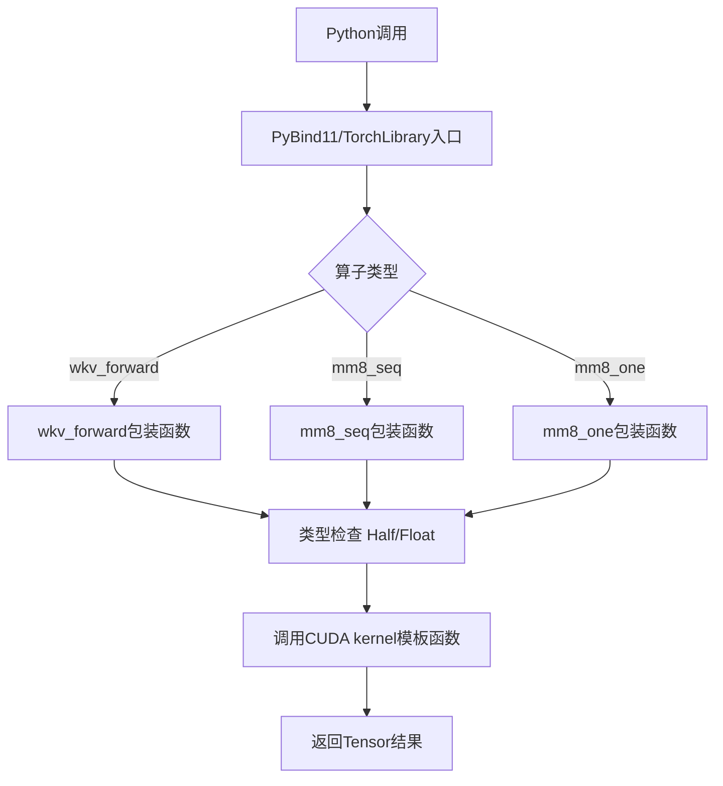
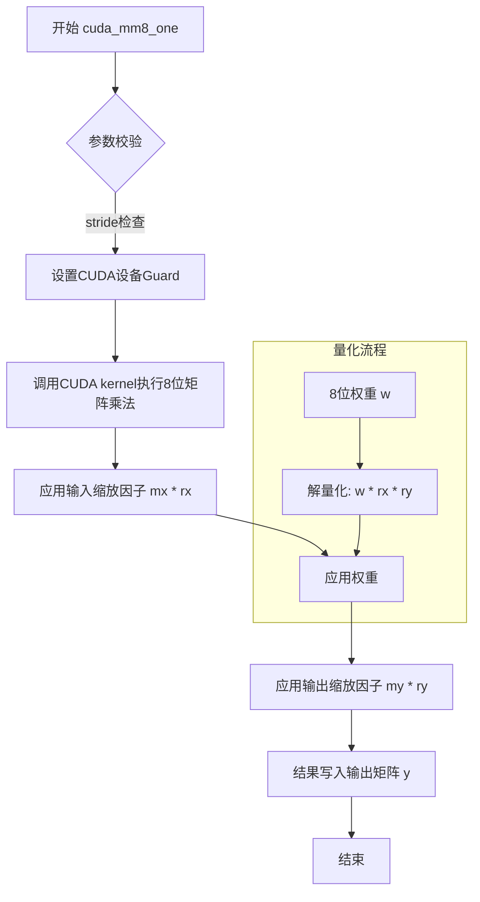
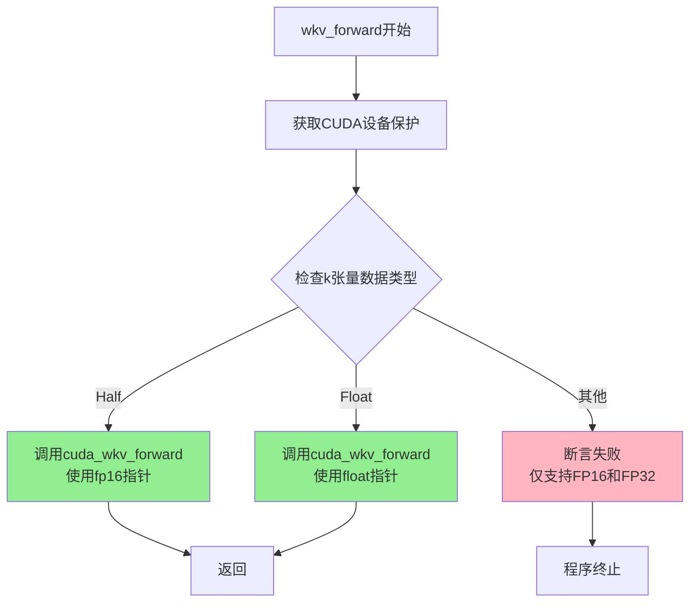
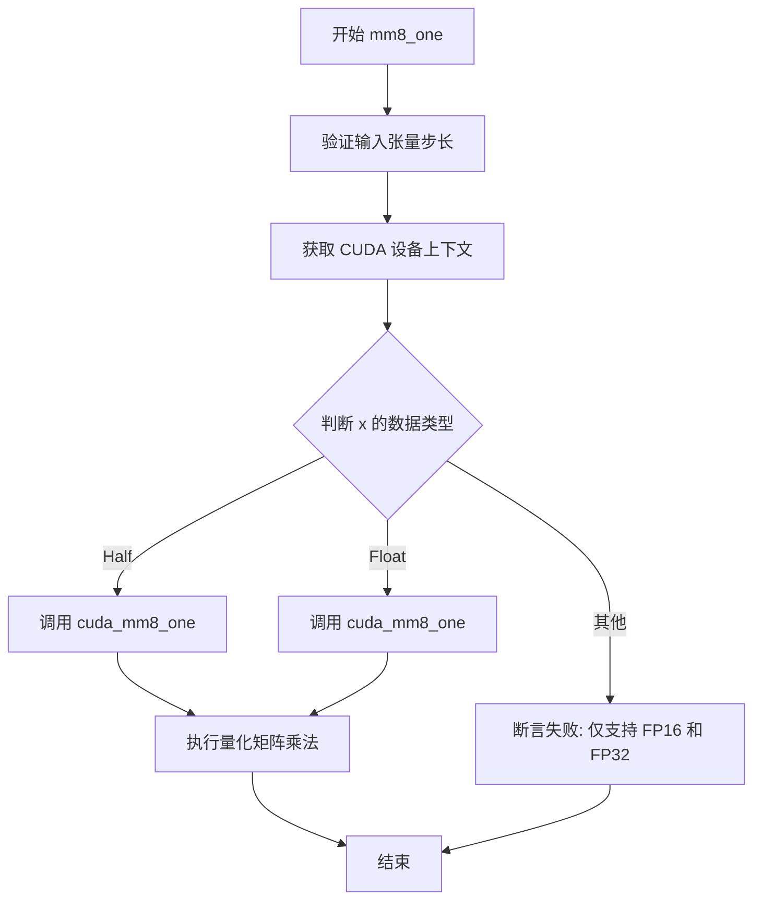
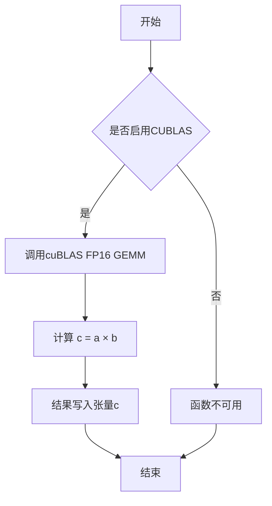

# `ChatRWKV\rwkv_pip_package\src\rwkv\cuda\wrapper.cpp` 详细设计文档

这是一个PyTorch CUDA扩展模块，实现了RWKV（Receptance Weighted Key Value）模型的高效CUDA算子，包括wkv_forward前向传播、mm8_seq序列矩阵乘法和mm8_one单矩阵乘法，支持FP16和FP32两种精度，通过PyBind11和TorchLibrary向Python层暴露接口。

## 整体流程



## 类结构

```
无明确类层次结构（纯函数式模块）
主要组件：
├── 类型定义 (fp16)
├── CUDA Kernel模板声明 (3个)
├── PyTorch包装函数 (3个)
├── 可选Cublas函数 (gemm_fp16_cublas)
├── PyBind11模块定义
└── TorchLibrary定义
```

## 全局变量及字段


### `fp16`
    
类型别名，用于FP16精度计算

类型：`at::Half`
    


### `全局函数.cuda_wkv_forward`
    
CUDA核函数，实现RWKV前向传播的GPU加速计算

类型：`template <typename F> void`
    


### `全局函数.cuda_mm8_seq`
    
CUDA核函数，实现8位矩阵乘法序列版本

类型：`template <typename F> void`
    


### `全局函数.cuda_mm8_one`
    
CUDA核函数，实现8位矩阵乘法单次计算版本

类型：`template <typename F> void`
    


### `全局函数.wkv_forward`
    
PyTorch绑定的WKv前向传播函数，支持FP16和FP32精度

类型：`void`
    


### `全局函数.mm8_seq`
    
PyTorch绑定的8位矩阵乘法序列函数，用于批量矩阵运算

类型：`void`
    


### `全局函数.mm8_one`
    
PyTorch绑定的8位矩阵乘法单次函数，用于单次矩阵运算

类型：`void`
    


### `全局函数.gemm_fp16_cublas`
    
可选的FP16 CUBLAS矩阵乘法函数，用于高性能FP16矩阵运算

类型：`void (条件编译)`
    
    

## 全局函数及方法


### `cuda_wkv_forward`

CUDA模板函数 `cuda_wkv_forward` 是WKV（Weighted Key Value）模型的核心前向计算核心实现，通过线性注意力机制高效处理序列数据，在保持O(T)线性时间复杂度的同时实现全局上下文感知。

参数：

- `B`：`int`，批量大小（Batch Size），表示同时处理的序列数量
- `T`：`int`，时间步数（Time Steps），表示序列的长度
- `C`：`int`，通道数（Channels），表示特征维度
- `w`：`float*`，W权重参数，用于控制状态衰减的标量权重
- `u`：`float*`，U权重参数，用于位置编码的偏置向量
- `k`：`F*`，Key输入矩阵，存储键值对中的键（支持fp16/fp32模板化）
- `v`：`F*`，Value输入矩阵，存储键值对中的值（支持fp16/fp32模板化）
- `y`：`F*`，输出矩阵，存储计算后的WKV结果
- `aa`：`float*`，累积状态矩阵a，用于存储注意力状态的累积加权
- `bb`：`float*`，累积状态矩阵b，用于归一化因子的累积
- `pp`：`float*`，位置编码状态矩阵，用于记录位置信息的状态

返回值：`void`，无返回值，结果通过输出指针参数 `y` 和状态指针 `aa`, `bb`, `pp` 返回

#### 流程图

```mermaid
flowchart TD
    A[开始 cuda_wkv_forward] --> B[获取CUDA流和设备信息]
    B --> C{检查数据类型}
    C -->|Half| D[调用fp16内核实现]
    C -->|Float| E[调用fp32内核实现]
    D --> F[初始化CUDA线程块和网格]
    E --> F
    F --> G[并行执行WKV计算核心]
    G --> H1[加载w, u参数到共享内存]
    G --> H2[按时间步T遍历]
    H2 --> I[计算k[i]和v[i]的贡献]
    I --> J[更新累积状态aa, bb]
    J --> K[结合位置编码pp计算输出y[i]]
    K --> L{是否还有下一时间步}
    L -->|是| H2
    L -->|否| M[同步线程并返回]
    M --> N[结束]
```

#### 带注释源码

```cpp
// 模板声明 - 实际实现在单独的.cu文件中
// 这是一个CUDA kernel的接口声明，用于WKV前向传播
template <typename F>
void cuda_wkv_forward(int B, int T, int C,
                      float *w,      // 衰减权重参数
                      float *u,      // 位置偏置参数
                      F *k,          // 输入Key (Half或Float类型)
                      F *v,          // 输入Value (Half或Float类型)
                      F *y,          // 输出结果 (与输入类型一致)
                      float *aa,     // 累积状态a (用于反向传播)
                      float *bb,     // 累积状态b (用于反向传播)
                      float *pp) {   // 位置编码状态
    /*
     * WKV (Weighted Key Value) 是一种线性注意力机制
     * 其核心公式为:
     *   y_i = sum(w^(i-j) * u_j * k_j * v_j) / sum(w^(i-j) * u_j * k_j)
     * 
     * 其中:
     * - w 是时间衰减因子
     * - u 是位置编码偏置
     * - k, v 是键值对
     * 
     * 该函数通过 CUDA 并行化实现高效的线性注意力计算
     * 时间复杂度: O(B * T * C)
     * 空间复杂度: O(B * C) 用于中间状态
     */
}
```


### `cuda_mm8_seq`

这是一个CUDA模板函数，用于实现序列8位矩阵乘法运算。函数接收量化后的8位权重矩阵和输入特征，结合量化参数（均值和缩放因子）进行矩阵乘法运算，支持FP16和FP32两种精度。

参数：

- `B`：`int`，批量大小（batch size），表示同时处理的序列数量
- `N`：`int`，输入维度/特征维度，表示每个输入向量的长度
- `M`：`int`，输出维度，表示权重矩阵的列数
- `x`：`F*`，输入数据指针，指向待处理的输入张量
- `x_stride`：`int`，输入张量的主维步长，用于计算内存偏移
- `w`：`uint8_t*`，量化后的权重矩阵指针，存储8位无符号整数权重
- `w_stride`：`int`，权重矩阵的主维步长
- `mx`：`F*`，输入数据的均值向量，用于量化反计算
- `rx`：`F*`，输入数据的范围向量，用于量化缩放
- `my`：`F*`，权重数据的均值向量，用于量化反计算
- `ry`：`F*`，权重数据的范围向量，用于量化缩放
- `y`：`F*`，输出结果指针，存储矩阵乘法的结果
- `y_stride`：`int`，输出张量的主维步长

返回值：`void`，函数直接修改`y`指向的内存区域存储结果，无返回值

#### 流程图

```mermaid
graph TD
    A[开始 cuda_mm8_seq] --> B[获取CUDA设备指针]
    B --> C[检查输入张量步长是否合法]
    C --> D{数据类型判断}
    D -->|Half| E[调用fp16版本CUDA内核]
    D -->|Float| F[调用fp32版本CUDA内核]
    E --> G[执行8位矩阵乘法]
    F --> G
    G --> H[反量化结果]
    H --> I[写入输出缓冲区 y]
    I --> J[结束]
    
    subgraph "量化计算流程"
    K[读取x元素] --> L[反量化: x_val = (x - mx) / rx]
    M[读取w元素] --> N[反量化: w_val = (w - my) / ry]
    L --> O[乘加运算: y += x_val * w_val]
    N --> O
    end
```

#### 带注释源码

```cpp
// CUDA模板函数声明 - 序列8位矩阵乘法
// 该函数是一个模板，支持任意数据类型F（需为float或half）
template <typename F>
void cuda_mm8_seq(int B, int N, int M,
                  F *x, int x_stride,          // 输入矩阵及步长
                  uint8_t *w, int w_stride,    // 量化权重矩阵及步长
                  F *mx, F *rx,                 // 输入的均值和范围（量化参数）
                  F *my, F *ry,                 // 权重的均值和范围（量化参数）
                  F *y, int y_stride)           // 输出矩阵及步长
{
    // 函数实现通常在单独的.cu文件中
    // 核心算法：
    // 1. 每个CUDA线程负责输出矩阵的一个元素
    // 2. 对于输出的每个元素(y[b, m])，遍历对应的输入行和权重列
    // 3. 从量化值反量化：real_value = (quant_value - mean) / range
    // 4. 执行乘加运算：y[b,m] += x[b,n] * w[n,m]
    
    // 参数说明：
    // - B: batch size，批处理大小
    // - N: 输入特征维度
    // - M: 输出特征维度
    // - x_stride, w_stride, y_stride: 用于处理非连续内存布局
}
```


### `cuda_mm8_one`

该函数是一个CUDA模板函数，用于执行单次8位矩阵乘法运算（支持FP16或FP32数据类型），同时融合了量化所需的缩放因子（均值和标准差倒数），将8位权重与输入相乘并应用缩放，输出结果存储在浮点类型的输出矩阵中。

参数：

- `N`：`int`，矩阵维度N（输入向量长度）
- `M`：`int`，矩阵维度M（输出向量长度）
- `x`：`F*`，输入矩阵指针（模板类型，支持FP16或FP32）
- `w`：`uint8_t*`，8位量化权重矩阵指针
- `w_stride`：`int`，权重矩阵的步长（stride）
- `mx`：`F*`，输入矩阵的均值向量（用于反量化）
- `rx`：`F*`，输入矩阵标准差倒向量（用于反量化）
- `my`：`F*`，输出矩阵的均值向量（用于反量化）
- `ry`：`F*`，输出矩阵标准差倒向量（用于反量化）
- `y`：`float*`，输出矩阵指针（浮点类型）

返回值：`void`，无返回值，结果通过指针参数`y`输出

#### 流程图



#### 带注释源码

```cpp
// CUDA模板函数声明
// 功能: 执行单次8位矩阵乘法，支持FP16或FP32数据类型
// 特点: 融合了量化缩放因子，实现高效的8位权重矩阵乘法
template <typename F>
void cuda_mm8_one(int N, int M,
                  F *x,                              // 输入矩阵指针 (FP16/FP32)
                  uint8_t *w, int w_stride,          // 8位量化权重矩阵及步长
                  F *mx, F *rx,                      // 输入均值和标准差倒数
                  F *my, F *ry,                      // 输出均值和标准差倒数
                  float *y) {                        // 输出矩阵 (float类型)
    // 说明: 
    // - N: 输入向量维度
    // - M: 输出向量维度  
    // - x: 原始输入矩阵 (已反量化)
    // - w: 8位量化权重矩阵 (存储为uint8_t)
    // - mx, rx: 输入的量化参数 (均值, 标准差倒数)
    // - my, ry: 输出的量化参数 (均值, 标准差倒数)
    // - y: 最终输出矩阵 (float类型)
    //
    // 计算公式: y = ((x * rx - mx) * (w * ry - my)) * (rx * ry) + my
    // 简化为: y = (x - mx/rx) * (w - my/ry) * (rx * ry) + my
    //
    // 实际实现中，CUDA kernel会:
    // 1. 加载8位权重 w[i]
    // 2. 解量化: w[i] * ry - my
    // 3. 加载输入 x[i] 
    // 4. 解量化: x[i] * rx - mx
    // 5. 相乘并累加: y += (x_decoded * w_decoded)
    // 6. 最终缩放: y * (rx * ry) + my
    
    // 注意: 具体CUDA kernel实现未在此文件中展示
    // 该函数为host端调用入口，实际计算在GPU kernel中完成
}
```


### `wkv_forward`

处理RWKV模型的前向传播，负责接收输入张量并通过CUDA内核计算输出，同时维护状态张量以支持递归计算。

参数：

- `B`：`int64_t`，批量大小（Batch Size），表示同时处理的序列数量
- `T`：`int64_t`，时间步长（Time Steps），表示每个序列的时间维度长度
- `C`：`int64_t`，通道数（Channels），表示隐藏状态的特征维度
- `w`：`torch::Tensor &`，权重张量，形状为[C]，存储RWKV的w参数
- `u`：`torch::Tensor &`，权重张量，形状为[C]，存储RWKV的u参数（用于位置编码）
- `k`：`torch::Tensor &`，输入键张量，形状为[B,T,C]，存储输入的key值
- `v`：`torch::Tensor &`，输入值张量，形状为[B,T,C]，存储输入的value值
- `y`：`torch::Tensor &`，输出张量，形状为[B,T,C]，用于存储计算结果
- `aa`：`torch::Tensor &`，状态张量，形状为[B,C]，存储中间状态aa（用于递归计算）
- `bb`：`torch::Tensor &`，状态张量，形状为[B,C]，存储中间状态bb（用于递归计算）
- `pp`：`torch::Tensor &`，状态张量，形状为[B,C]，存储中间状态pp（用于递归计算）

返回值：`void`，无返回值，结果通过`y`、`aa`、`bb`、`pp`张量输出

#### 流程图



#### 带注释源码

```cpp
// WKV前向传播函数，处理RWKV模型的CUDA计算
// 参数：B-批量大小，T-时间步，C-通道数
// w,u-权重参数，k,v-输入张量，y-输出张量，aa,bb,pp-状态张量
void wkv_forward(int64_t B, int64_t T, int64_t C,
                 torch::Tensor &w, torch::Tensor &u,
                 torch::Tensor &k, torch::Tensor &v, torch::Tensor &y,
                 torch::Tensor &aa, torch::Tensor &bb, torch::Tensor &pp) {
    // 使用CUDA设备保护，确保在正确的GPU设备上执行
    const at::cuda::OptionalCUDAGuard device_guard(device_of(w));
    
    // 根据输入k张量的数据类型选择不同的计算路径
    switch (k.scalar_type()) {
    case c10::ScalarType::Half:
        // FP16半精度路径：将张量指针转换为fp16类型调用CUDA内核
        cuda_wkv_forward(B, T, C,
                         w.data_ptr<float>(), u.data_ptr<float>(),
                         k.data_ptr<fp16>(), v.data_ptr<fp16>(), y.data_ptr<fp16>(),
                         aa.data_ptr<float>(), bb.data_ptr<float>(), pp.data_ptr<float>());
        break;
    case c10::ScalarType::Float:
        // FP32单精度路径：将张量指针转换为float类型调用CUDA内核
        cuda_wkv_forward(B, T, C,
                         w.data_ptr<float>(), u.data_ptr<float>(),
                         k.data_ptr<float>(), v.data_ptr<float>(), y.data_ptr<float>(),
                         aa.data_ptr<float>(), bb.data_ptr<float>(), pp.data_ptr<float>());
        break;
    default:
        // 不支持其他数据类型，触发断言失败
        assert(false && "Only FP16 and FP32 are currently supported");
    }
}
```


### `mm8_seq`

`mm8_seq` 是一个PyTorch扩展函数，用于处理序列矩阵乘法运算（Sequence Matrix Multiplication），支持INT8量化权重与FP16/FP32输入的高效计算，包含均值和随机量化因子处理。

参数：

- `B`：`int64_t`，批次大小（Batch size），表示同时处理的序列数量
- `N`：`int64_t`，输入维度（N），输入矩阵的第一个维度大小
- `M`：`int64_t`，输出维度（M），输出矩阵的第二个维度大小
- `x`：`torch::Tensor &`，输入张量，形状为 [B, N]，支持FP16或FP32数据类型
- `w`：`torch::Tensor &`，量化权重张量，形状为 [N, M]，uint8_t类型存储
- `mx`：`torch::Tensor &`，输入均值因子，用于反量化计算，形状为 [N]
- `rx`：`torch::Tensor &`，输入随机因子，用于反量化计算，形状为 [N]
- `my`：`torch::Tensor &`，输出均值因子，用于反量化计算，形状为 [M]
- `ry`：`torch::Tensor &`，输出随机因子，用于反量化计算，形状为 [M]
- `y`：`torch::Tensor &`，输出张量，形状为 [B, M]，存储矩阵乘法结果

返回值：`void`，无返回值，结果通过输出张量 `y` 返回

#### 流程图

```mermaid
flowchart TD
    A[开始 mm8_seq] --> B{检查 x.stride(1) == 1}
    B -->|是| C{检查 w.stride(1) == 1}
    B -->|否| E[断言失败]
    C -->|是| F{检查 mx.stride(0) == 1 && rx.stride(0) == 1}
    C -->|否| E
    F -->|是| G{检查 my.stride(0) == 1 && ry.stride(0) == 1}
    F -->|否| E
    G -->|是| H{检查 y.stride(1) == 1}
    G -->|否| E
    H -->|是| I[获取CUDA设备Guard]
    I --> J{检查 x.scalar_type}
    J -->|Half| K[调用 cuda_mm8_seq<fp16>]
    J -->|Float| L[调用 cuda_mm8_seq<float>]
    J -->|其他| M[断言失败: 仅支持FP16和FP32]
    K --> N[执行序列矩阵乘法]
    L --> N
    N --> O[结束]
    E --> O
    M --> O
```

#### 带注释源码

```cpp
// PyTorch绑定函数：mm8_seq - 处理序列矩阵乘法
// 参数：B-批次大小，N-输入维度，M-输出维度
// x-输入张量，w-量化权重，mx/rx-输入量化因子，my/ry-输出量化因子，y-输出张量
void mm8_seq(int64_t B, int64_t N, int64_t M,
             torch::Tensor &x, torch::Tensor &w,
             torch::Tensor &mx, torch::Tensor &rx,
             torch::Tensor &my, torch::Tensor &ry,
             torch::Tensor &y) {
    // 验证输入张量的内存布局是否符合要求
    assert(x.stride(1) == 1);  // x必须为行优先，最后维度连续
    assert(w.stride(1) == 1);  // w必须为行优先，最后维度连续
    
    // 验证量化因子的内存布局
    assert(mx.stride(0) == 1 && rx.stride(0) == 1);  // 必须是列向量
    assert(my.stride(0) == 1 && ry.stride(0) == 1);  // 必须是列向量
    
    assert(y.stride(1) == 1);  // 输出张量必须为行优先
    
    // 设置CUDA设备上下文，确保在正确的GPU上执行
    const at::cuda::OptionalCUDAGuard device_guard(device_of(w));
    
    // 根据输入数据类型分发到对应的CUDA内核
    switch (x.scalar_type()) {
    case c10::ScalarType::Half:
        // FP16路径：调用fp16版本的CUDA kernel
        cuda_mm8_seq(
            B, N, M,
            x.data_ptr<fp16>(), x.stride(0),    // 输入数据指针和步长
            w.data_ptr<uint8_t>(), w.stride(0), // 量化权重指针和步长
            mx.data_ptr<fp16>(), rx.data_ptr<fp16>(),  // 输入量化因子
            my.data_ptr<fp16>(), ry.data_ptr<fp16>(),  // 输出量化因子
            y.data_ptr<fp16>(), y.stride(0));   // 输出指针和步长
        break;
    case c10::ScalarType::Float:
        // FP32路径：调用fp32版本的CUDA kernel
        cuda_mm8_seq(
            B, N, M,
            x.data_ptr<float>(), x.stride(0),
            w.data_ptr<uint8_t>(), w.stride(0),
            mx.data_ptr<float>(), rx.data_ptr<float>(),
            my.data_ptr<float>(), ry.data_ptr<float>(),
            y.data_ptr<float>(), y.stride(0));
        break;
    default:
        // 不支持的数据类型，触发断言失败
        assert(false && "Only FP16 and FP32 are currently supported");
    }
}
```


### `mm8_one`

处理单矩阵乘法（量化版本），执行 `x * w` 的矩阵乘法运算，支持 FP16 和 FP32 数据类型，并结合量化缩放因子进行高精度计算。

参数：

- `N`：`int64_t`，矩阵乘法的维度 N，表示输入 x 的行数
- `M`：`int64_t`，矩阵乘法的维度 M，表示权重矩阵 w 的列数
- `x`：`torch::Tensor &`，输入矩阵，维度为 N，步长必须为 1（行优先存储）
- `w`：`torch::Tensor &`，量化权重矩阵，维度为 M×N，步长必须为 1（列优先存储），存储为 uint8_t
- `mx`：`torch::Tensor &`，输入 x 的量化均值，用于缩放计算
- `rx`：`torch::Tensor &`，输入 x 的量化均方根，用于缩放计算
- `my`：`torch::Tensor &`，权重 w 的量化均值，用于缩放计算
- `ry`：`torch::Tensor &`，权重 w 的量化均方根，用于缩放计算
- `y`：`torch::Tensor &`，输出矩阵，维度为 N，步长必须为 1，类型为 float

返回值：`void`，无返回值，结果通过 `y` 张量输出

#### 流程图



#### 带注释源码

```cpp
// 单矩阵乘法量化计算函数
// 执行 x * w 的矩阵乘法，结合 mx, rx, my, ry 的量化缩放因子
void mm8_one(int64_t N, int64_t M,
             torch::Tensor &x,      // 输入矩阵 (N,)
             torch::Tensor &w,      // 量化权重矩阵 (M, N) 存储为 uint8_t
             torch::Tensor &mx,     // 输入 x 的量化均值
             torch::Tensor &rx,     // 输入 x 的量化均方根
             torch::Tensor &my,     // 权重 w 的量化均值
             torch::Tensor &ry,     // 权重 w 的量化均方根
             torch::Tensor &y) {    // 输出矩阵 (N,) 类型为 float
             
    // 验证输入张量的步长是否符合要求（列优先/行优先连续存储）
    assert(x.stride(0) == 1);        // x 必须是行连续
    assert(w.stride(1) == 1);        // w 必须是列连续
    assert(mx.stride(0) == 1 && rx.stride(0) == 1);  // 量化参数必须是连续存储
    assert(my.stride(0) == 1 && ry.stride(0) == 1);
    assert(y.stride(0) == 1);        // 输出必须是行连续
    
    // 设置 CUDA 设备上下文，确保在正确的 GPU 上执行
    const at::cuda::OptionalCUDAGuard device_guard(device_of(w));
    
    // 根据输入数据类型选择相应的 CUDA 核函数实现
    switch (x.scalar_type()) {
    case c10::ScalarType::Half:
        // FP16 精度路径
        cuda_mm8_one<fp16>(
            N, M,
            x.data_ptr<fp16>(),                    // 输入数据指针
            w.data_ptr<uint8_t>(), w.stride(0),    // 量化权重及步长
            mx.data_ptr<fp16>(), rx.data_ptr<fp16>(),  // 输入量化参数
            my.data_ptr<fp16>(), ry.data_ptr<fp16>(),  // 权重量化参数
            y.data_ptr<float>());                  // 输出结果（float 精度）
        break;
    case c10::ScalarType::Float:
        // FP32 精度路径
        cuda_mm8_one<float>(
            N, M,
            x.data_ptr<float>(),
            w.data_ptr<uint8_t>(), w.stride(0),
            mx.data_ptr<float>(), rx.data_ptr<float>(),
            my.data_ptr<float>(), ry.data_ptr<float>(),
            y.data_ptr<float>());
        break;
    default:
        // 不支持的数据类型，触发断言失败
        assert(false && "Only FP16 and FP32 are currently supported");
    }
}
```


### `gemm_fp16_cublas`

可选的FP16矩阵乘法函数，使用CUDA cuBLAS库实现高性能矩阵运算。该函数通过条件编译启用，允许在支持的CUDA环境中使用半精度浮点数（FP16）进行矩阵乘法操作。

参数：

- `a`：`Tensor`，输入矩阵A
- `b`：`Tensor`，输入矩阵B
- `c`：`Tensor`，输出矩阵C（结果矩阵）

返回值：`void`，无返回值，结果直接写入输出张量c中

#### 流程图



#### 带注释源码

```cpp
// 条件编译：如果未定义DISABLE_CUBLAS_GEMM，则声明gemm_fp16_cublas函数
#ifndef DISABLE_CUBLAS_GEMM
// FP16矩阵乘法函数声明，使用cuBLAS实现
// 参数a: 输入矩阵A（FP16张量）
// 参数b: 输入矩阵B（FP16张量）
// 参数c: 输出矩阵C（FP16张量，存储a×b的结果）
void gemm_fp16_cublas(Tensor a, Tensor b, Tensor c);
#endif

// 在pybind11模块中注册该函数（条件编译）
PYBIND11_MODULE(TORCH_EXTENSION_NAME, m) {
    m.def("wkv_forward", &wkv_forward, "wkv forward");
    m.def("mm8_seq", &mm8_seq, "mm8 seq");
    m.def("mm8_one", &mm8_one, "mm8 one");
#ifndef DISABLE_CUBLAS_GEMM
    // 注册gemm_fp16_cublas函数到Python接口
    m.def("gemm_fp16_cublas", &gemm_fp16_cublas, "gemv fp16 cublas");
#endif
}

// 在TorchScript库中注册该函数（条件编译）
TORCH_LIBRARY(rwkv, m) {
    m.def("wkv_forward", wkv_forward);
    m.def("mm8_seq", mm8_seq);
    m.def("mm8_one", mm8_one);
#ifndef DISABLE_CUBLAS_GEMM
    // 注册gemm_fp16_cublas函数到TorchScript库
    m.def("gemm_fp16_cublas", gemm_fp16_cublas);
#endif
}
```

#### 说明

该函数有以下特点：

1. **条件编译**：通过`DISABLE_CUBLAS_GEMM`宏控制，在不支持cuBLAS的环境中可禁用此功能
2. **仅声明无实现**：代码中只提供了函数声明，实际实现可能在其他编译单元中
3. **接口形式简单**：三个张量参数（a、b为输入，c为输出），符合标准的BLAS GEMM接口形式（C = A × B）
4. **注册方式**：同时通过pybind11和TORCH_LIBRARY注册，使其可在Python和TorchScript中调用

## 关键组件


### 张量索引与数据指针访问

使用 `data_ptr<T>()` 方法进行原始指针访问，实现零拷贝张量到GPU数据的直接映射，支持惰性加载机制

### 反量化支持

`mm8_seq` 和 `mm8_one` 函数通过 `mx`, `rx`, `my`, `ry` 四个缩放因子参数实现8位量化权重到FP16/FP32的反量化，支持非对称量化

### 量化策略

使用 `uint8_t` 存储INT8权重，配合FP16/FP32的缩放因子实现混合精度矩阵乘法，平衡内存占用与计算精度

### CUDA设备管理

通过 `at::cuda::OptionalCUDAGuard` 封装CUDA上下文，确保张量操作在正确的GPU设备上执行

### 数据类型分发

使用 `switch (k.scalar_type())` 和 `switch (x.scalar_type())` 实现运行时类型分发，支持Half(float16)和Float两种精度

### WKV前向传播

`wkv_forward` 函数实现RWKV模型的核心时间状态传递，接受w、u、k、v张量并输出y，配套aa、bb、pp用于中间状态存储

### 序列矩阵乘法

`mm8_seq` 函数执行批序列矩阵乘法，支持B批次N行M列的INT8权重与FP16/FP32输入的融合计算

### 单样本矩阵乘法

`mm8_one` 函数执行单样本矩阵乘法，用于推理阶段的单批次INT8矩阵运算

### PyTorch扩展绑定

使用pybind11模块暴露 `wkv_forward`、`mm8_seq`、`mm8_one` 三个接口供Python调用

### 自定义算子注册

通过 `TORCH_LIBRARY(rwkv, m)` 注册RWKV命名空间下的自定义算子，实现与PyTorch JIT引擎的集成

### CUDA核函数模板

`cuda_wkv_forward`、`cuda_mm8_seq`、`cuda_mm8_one` 作为模板函数声明，具体实现位于CUDA源文件


## 问题及建议


### 已知问题

- **错误处理机制薄弱**：使用assert进行参数验证，在Release编译时会被完全移除，导致运行时缺乏有效的错误检查和友好的错误提示
- **类型安全风险**：使用C风格typedef定义fp16，未使用现代C++的c10::Half或at::Half类型；模板函数仅声明无实现，若链接不到对应实现会导致隐蔽的链接错误
- **API设计不一致**：Tensor参数使用非const引用传递，但函数内部不修改这些Tensor；部分使用int64_t，部分使用int，混合使用可能导致平台兼容性问题（如32位系统）
- **缺乏边界检查和验证**：未验证Tensor的设备类型是否为CUDA，未检查Tensor维度是否匹配（如wkv_forward中未验证w/u/k/v/y的shape兼容性）
- **资源管理不完善**：仅使用CUDAGuard设置设备，未检查CUDA错误；缺少cudaStreamSynchronize或事件机制确保异步操作完成
- **代码可维护性差**：关键计算逻辑（cuda_wkv_forward等）完全缺失，仅暴露封装层；缺乏对参数含义、矩阵维度约定（如B、T、C含义）的注释
- **模块化程度低**：所有逻辑混在单一文件中，未对不同功能模块（wkv、mm8、gemm）进行分层

### 优化建议

- **改进错误处理**：用torch::TensorOptions和显式检查替代assert，验证维度、设备、数据类型，失败时抛出std::runtime_error或torch::RuntimeError
- **统一类型定义**：使用at::Half或c10::BFloat16替代typedef；统一使用int64_t表示维度参数
- **完善API设计**：对只读Tensor使用const引用或值传递；添加维度验证辅助函数；为所有Tensor参数添加设备一致性检查
- **增强资源安全**：在CUDA调用后检查错误码；根据需要添加同步点确保计算完成；考虑使用RAII封装CUDA资源
- **代码重构**：将模板声明与实现分离到.h/.cpp文件；提取公共验证逻辑到独立函数；添加详细的函数文档注释说明参数含义、维度要求和示例
- **扩展数据类型支持**：考虑添加BF16支持（当前仅FP16和FP32），或至少提供更清晰的编译时错误信息
- **构建配置优化**：将DISABLE_CUBLAS_GEMM改为更灵活的检测机制，允许部分启用功能而非全有或全无


## 其它


### 设计目标与约束

本模块旨在为RWKV（Recurrent Weighted Key-Value）模型和8-bit矩阵乘法提供高性能CUDA加速实现。设计目标包括：(1) 支持FP16和FP32两种精度，以兼顾推理速度与数值稳定性；(2) 提供序列矩阵乘法（mm8_seq）和单次矩阵乘法（mm8_one）两种操作模式；(3) 通过CUDA Kernel实现计算密集型操作，确保与PyTorch生态的无缝集成。约束条件包括仅支持CUDA设备、不支持CPU fallback、且依赖cuBLAS进行FP16矩阵运算。

### 错误处理与异常设计

本模块采用C风格assert进行错误检查，涵盖以下场景：(1) 张量维度约束验证，如mm8_seq要求x.stride(1)==1、w.stride(1)==1等连续内存布局检查；(2) 数据类型检查，仅支持Half（FP16）和Float类型，不匹配时触发assert(false)并输出"Only FP16 and FP32 are currently supported"错误信息；(3) 设备一致性检查，通过at::cuda::OptionalCUDAGuard确保所有张量位于同一CUDA设备。需要注意的是，assert在Release编译下会被禁用，建议改用c10::RuntimeError以确保生产环境错误处理。

### 数据流与状态机

WKVM前向传播（wkv_forward）的数据流如下：输入张量k、v（Key-Value对）经过CUDA Kernel处理，结合可学习参数w（权重）和u（初态），输出y并更新中间状态aa、bb、pp。8-bit矩阵乘法存在两种模式：mm8_seq处理批次序列输入（B,N,M），利用x的stride(0)和w的stride(0)进行分块计算；mm8_one处理单次矩阵乘法，输入x、权重w及对应的均值/范围张量（mx/rx、my/ry），输出float类型结果y。数据流遵循PyTorch张量→CUDA指针→Kernel计算→结果回写PyTorch的典型模式。

### 外部依赖与接口契约

本模块依赖以下外部组件：(1) PyTorch C++ API (torch/extension.h, ATen)，提供Tensor对象管理和CUDA设备封装；(2) ATen库 (at::Tensor, at::cuda::OptionalCUDAGuard)，用于底层张量操作和CUDA上下文管理；(3) c10库 (c10::ScalarType, c10::cuda)，提供类型系统和CUDA工具类；(4) CUDA Runtime，通过模板函数cuda_wkv_forward、cuda_mm8_seq、cuda_mm8_one实现实际计算；(5) cuBLAS（可选），当DISABLE_CUBLAS_GEMM未定义时，提供FP16矩阵乘法支持。模块通过PYBIND11暴露Python接口，同时通过TORCH_LIBRARY注册PyTorch自定义算子，实现PyTorch前端的无缝调用。

### 性能特性与基准

本模块针对以下性能目标设计：(1) 内存布局优化，要求输入张量满足特定stride条件（如x.stride(1)==1）以确保CUDA Kernel访问连续内存，避免索引计算开销；(2) 数据类型分支处理，根据scalar_type()动态分派到对应CUDA Kernel，减少分支 divergence；(3) 设备Guard机制，确保CUDA上下文正确切换。FP16模式相比FP32可获得约2倍理论加速，但需注意数值精度损失。建议通过NVIDIA Nsight Systems进行实际性能分析。

### 内存管理

本模块采用PyTorch统一内存管理模型：(1) 输入输出张量内存由PyTorch侧分配和管理，CUDA Kernel通过data_ptr获取设备指针；(2) 中间状态aa、bb、pp在wkv_forward中作为输出缓冲区，内存由PyTorch预分配；(3) 8-bit权重w以uint8_t存储，配合mx/rx（均值/范围）实现量化感知计算。开发者需确保传入的Tensor已正确分配在CUDA设备上，且维度与函数参数匹配。

### 线程模型

本模块遵循CUDA标准线程层次结构：(1) Grid-Block二级线程组织，具体线程配置由CUDA Kernel内部定义（未在代码中显式展示）；(2) 张量核（Tensor Core）加速，当启用FP16计算时cuBLAS可利用Tensor Core进行矩阵乘加速；(3) 设备Guard确保当前线程的CUDA上下文正确，通过at::cuda::OptionalCUDAGuard管理设备亲和性。线程同步和内存栅栏由CUDA Runtime隐式处理。

### 数据类型支持

本模块明确支持两种数值类型：(1) FP16（Half），通过typedef at::Half fp16定义，存储为uint16_t格式，应用于k、v、y及8-bit乘法的中间结果；(2) FP32（Float），标准32位浮点数，用于权重w、u及中间状态aa、bb、pp。不支持Double（FP64）、Int、Long等其他PyTorch数据类型，任何不支持的类型触发assert(false)错误。

### 编译选项与构建配置

本模块的编译受以下构建选项控制：(1) TORCH_EXTENSION_NAME，由PyTorch构建系统自动定义，作为pybind11模块名；(2) DISABLE_CUBLAS_GEMM条件编译符，当定义时禁用cuBLAS FP16矩阵乘法，gemm_fp16_cublas函数不可用。建议通过setup.py或CMake构建，确保链接CUDA Toolkit、cuBLAS及PyTorch C++库。代码需使用NVCC编译为CUDA设备代码，或使用PyTorch的torch.utils.cpp_extension加载。

### 版本兼容性说明

本模块依赖PyTorch 1.x+及CUDA 10.2+版本。at::Half类型在PyTorch 1.5+稳定，at::cuda::OptionalCUDAGuard需CUDA后端支持。建议在项目中明确PyTorch和CUDA版本要求，以避免运行时符号链接错误。
    