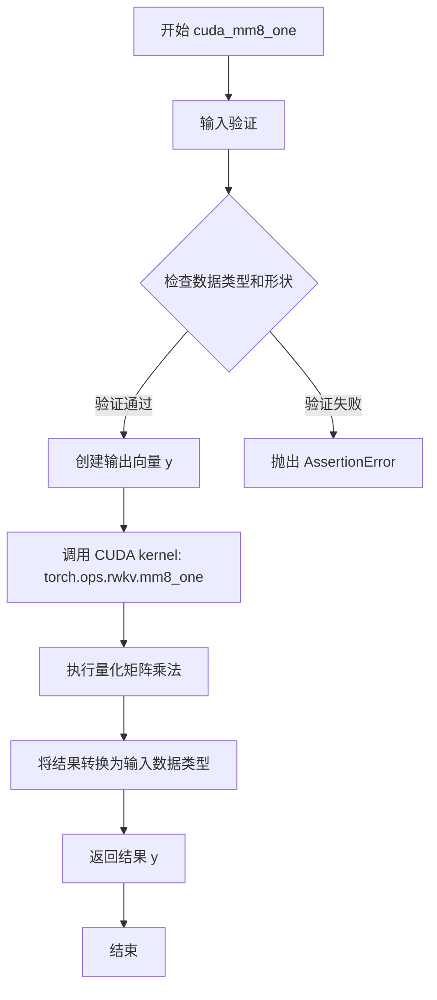
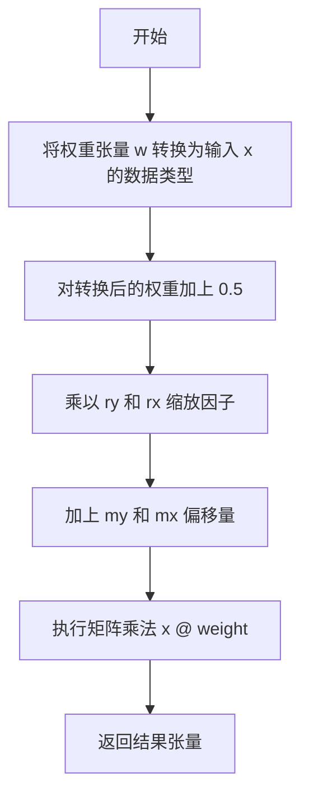
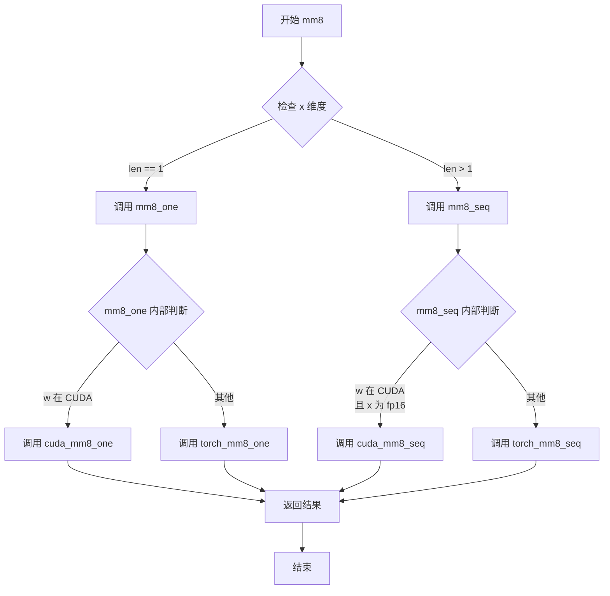
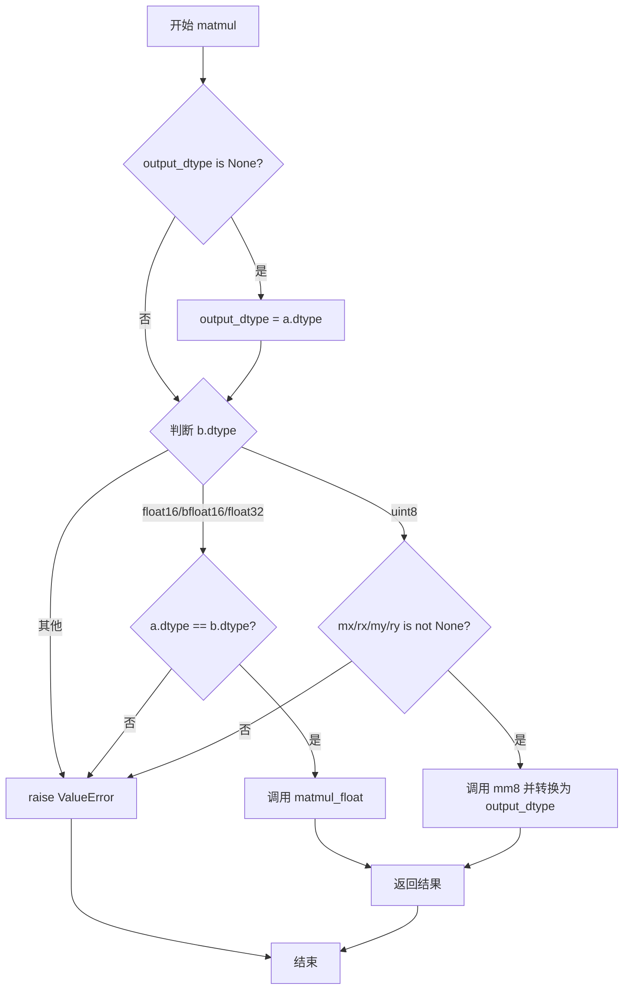
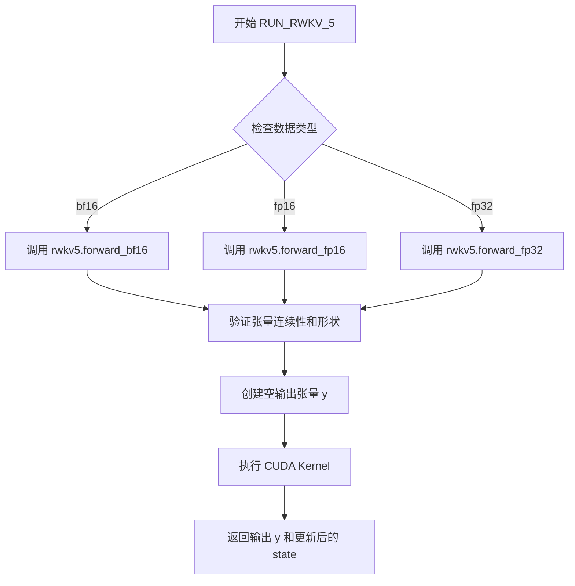

# `ChatRWKV\rwkv_pip_package\src\rwkv\model.py` 详细设计文档

这是 RWKV (Receptance Weighted Key Value) 语言模型的推理核心模块，支持多种版本（v4-v7）、设备（CPU/CUDA/MPS）和量化策略（fp16/bf16/int8），实现了高效的线性Transformer类架构前向传播。

## 整体流程

```mermaid
graph TD
    Start[脚本加载] --> EnvSetup{环境配置}
    EnvSetup --> JIT[设置 TorchScript (MyModule/MyFunction)]
    EnvSetup --> CUDA{是否启用 CUDA?}
    CUDA -- 是 --> LoadCUDA[加载 C++/CUDA 扩展 (wkv_cuda)]
    CUDA -- 否 --> LoadTorch[回退到 PyTorch 实现]
    
    subgraph ModelInit [模型初始化]
        Init[RWKV.__init__ / RWKV_x070.__init__]
        ParseStrat[解析策略字符串 (设备/数据类型/量化)]
        LoadWeights[加载 .pth 权重文件]
        Convert[权重转换 (转置/量化/重缩放)]
    end
    
    subgraph Inference [推理循环]
        Forward[调用 forward(tokens, state)]
        CheckState{State 是否为空?}
        CheckState -- 是 --> GenState[生成初始 State (全零)]
        CheckState -- 否 --> UseState[使用传入 State]
        
        Embed[Embedding 层]
        LayerLoop[遍历每一层 Block]
        ATT{根据版本选择注意力}: ATT / ATT_v5 / ATT_v6
        FFN{根据版本选择前馈}: FFN / FFN_v6
        OutProj[Layer Norm + 线性输出头]
    end
    
    Init --> Forward
    Forward --> CheckState
    GenState --> Embed
    UseState --> Embed
    Embed --> LayerLoop
    LayerLoop --> ATT
    ATT --> FFN
    FFN --> LayerLoop
    LayerLoop --> OutProj
    OutProj --> Return[返回 Logits 和 新 State]
```

## 类结构

```
MyModule (基础模块封装，支持 TorchScript)
├── RWKV (主模型类，支持 v4-v6)
│   ├── 权重加载与策略解析逻辑
│   ├── 前向传播 forward()
│   ├── 注意力机制 (att_one/seq, v4-v6 variants)
│   └── 前馈网络 (ffn_one/seq, v4-v6 variants)
├── RWKV_x070 (v7 'Goose' 模型类，条件定义)
│   ├── RWKV7_OP (CUDA 加速核心)
│   ├── forward_one / forward_seq
│   └── TMix / CMix 核心计算逻辑
└── 辅助类 (Autograd Functions)
    ├── WKV_7 (for v7 CUDA)
    ├── RWKV_5 (for v5 CUDA)
    └── RWKV_6 (for v6 CUDA)
```

## 全局变量及字段


### `current_path`
    
脚本当前目录路径

类型：`str`
    


### `DISABLE_CUBLAS_GEMM`
    
是否禁用 cuBLAS 矩阵乘法

类型：`bool`
    


### `DTYPE`
    
全局数据类型 (fp16/bf16/fp32)

类型：`torch.dtype`
    


### `DEVICE`
    
全局设备 (cuda/cpu)

类型：`str`
    


### `HEAD_SIZE`
    
注意力头大小常量 (64)

类型：`int`
    


### `MyModule`
    
torch.jit.ScriptModule 或 torch.nn.Module

类型：`type`
    


### `MyFunction`
    
torch.jit.script_method 或空函数装饰器

类型：`callable`
    


### `MyStatic`
    
torch.jit.script 或空函数装饰器

类型：`callable`
    


### `RWKV.args`
    
模型配置参数

类型：`SimpleNamespace`
    


### `RWKV.w`
    
模型权重字典

类型：`Dict[str, torch.Tensor]`
    


### `RWKV.strategy`
    
每一层的部署策略配置

类型：`List`
    


### `RWKV.version`
    
模型版本号 (4, 5, 5.1, 5.2, 6.0)

类型：`int`
    


### `RWKV.RESCALE_LAYER`
    
fp16 重缩放层间隔

类型：`int`
    


### `RWKV_x070.args`
    
模型参数

类型：`SimpleNamespace`
    


### `RWKV_x070.n_head`
    
头数量

类型：`int`
    


### `RWKV_x070.head_size`
    
头大小

类型：`int`
    


### `RWKV_x070.n_embd`
    
嵌入维度

类型：`int`
    


### `RWKV_x070.n_layer`
    
层数

类型：`int`
    


### `RWKV_x070.z`
    
模型权重字典 (v7 权重命名)

类型：`Dict[str, torch.Tensor]`
    
    

## 全局函数及方法


### `cuda_wkv`

CUDA 优化的 WKV（Weighted Key-Value）算子，用于在 GPU 上高效计算 RWKV 模型的时间混合 Attention 机制，支持 fp16 和 fp32 两种精度。

参数：

- `T`：`int`，时间步数（sequence length），表示输入序列的长度
- `C`：`int`，通道数（channel dimension），即隐藏层维度
- `w`：`torch.Tensor`（float32），时间衰减权重参数，用于控制历史信息的衰减
- `u`：`torch.Tensor`（float32），位置编码权重，用于注意力机制
- `k`：`torch.Tensor`（float16 或 float32），键（key）向量
- `v`：`torch.Tensor`（float16 或 float32），值（value）向量
- `aa`：`torch.Tensor`（float32），WKV 状态累积变量 a
- `bb`：`torch.Tensor`（float32），WKV 状态累积变量 b
- `pp`：`torch.Tensor`（float32），WKV 状态累积变量 p（用于数值稳定性的最大值）

返回值：`Tuple[torch.Tensor, torch.Tensor, torch.Tensor, torch.Tensor]`，返回包含：

- `y`：`torch.Tensor`（与 k dtype 相同），WKV 算子的输出结果，形状为 (T, C)
- `aa`：更新后的状态累积变量 a
- `bb`：更新后的状态累积变量 b
- `pp`：更新后的状态累积变量 p

#### 流程图

```mermaid
flowchart TD
    A[开始 cuda_wkv] --> B[断言检查: C % 32 == 0]
    B --> C[断言检查: k, v 类型一致且为 fp16/fp32]
    C --> D[断言检查: w, u, aa, bb, pp 类型为 fp32]
    D --> E[确保 w, u, k, v 为连续内存]
    E --> F[创建输出张量 y, 形状 (T, C)]
    F --> G[调用 CUDA 算子 torch.ops.rwkv.wkv_forward]
    G --> H[返回 y, aa, bb, pp]
```

#### 带注释源码

```python
@MyStatic
def cuda_wkv(T: int, C: int, w, u, k, v, aa, bb, pp):
    """
    CUDA 优化的 WKV 算子实现
    
    参数:
        T: 时间步数 (sequence length)
        C: 通道数/隐藏维度 (channel dimension)
        w: 时间衰减权重 (float32)
        u: 位置编码权重 (float32)
        k: 键向量 (float16/float32)
        v: 值向量 (float16/float32)
        aa, bb, pp: WKV 状态累积变量 (float32)
    """
    # 确保通道数 C 能被 32 整除，这是 CUDA 优化的要求
    assert 1 * C % min(C, 32) == 0
    
    # 验证 k 和 v 的数据类型一致且为 fp16 或 fp32
    assert k.dtype == v.dtype == torch.float16 or k.dtype == v.dtype == torch.float32
    
    # 验证其他参数必须为 float32 类型
    assert w.dtype == u.dtype == aa.dtype == bb.dtype == pp.dtype == torch.float32
    
    # 确保所有输入张量都是连续的（CUDA 优化的要求）
    w = w.contiguous()
    u = u.contiguous()
    k = k.contiguous()
    v = v.contiguous()
    
    # 创建输出张量 y，与 k 使用相同的 dtype，形状为 (T, C)
    y = torch.empty((T, C), device=w.device, memory_format=torch.contiguous_format, dtype=k.dtype)
    
    # 调用底层的 CUDA 算子执行 WKV 前向计算
    # 参数 1 表示 batch size = 1
    torch.ops.rwkv.wkv_forward(1, T, C, w, u, k, v, y, aa, bb, pp)
    
    # 返回输出和更新后的状态变量（用于下一时间步的计算）
    return y, aa, bb, pp
```


### `cuda_mm8_seq`

CUDA 量化矩阵乘法（序列），用于在 GPU 上执行批量 int8 量化矩阵乘法运算，通过预计算的缩放因子（mx, rx, my, ry）进行反量化，返回浮点结果。

参数：

- `B`：`int`，批量大小（batch size），表示输入矩阵 x 的批次数量
- `N`：`int`，输入维度，表示输入矩阵 x 的列数（也是权重矩阵 w 的行数）
- `M`：`int`，输出维度，表示输出矩阵 y 的列数（也是权重矩阵 w 的列数）
- `x`：`torch.Tensor`，输入矩阵，形状为 (B, N)，数据类型为 float32 或 float16
- `w`：`torch.Tensor`，量化权重矩阵，形状为 (N, M)，数据类型为 uint8
- `mx`：`torch.Tensor`，权重的最小值，形状为 (M,)，用于反量化计算
- `rx`：`torch.Tensor`，权重的缩放因子，形状为 (M,)，用于反量化计算
- `my`：`torch.Tensor`，输入的最小值，形状为 (N, 1)，用于反量化计算
- `ry`：`torch.Tensor`，输入的缩放因子，形状为 (N, 1)，用于反量化计算

返回值：`torch.Tensor`，结果矩阵，形状为 (B, M)，数据类型与输入 x 相同（float32 或 float16）

#### 流程图

```mermaid
flowchart TD
    A[开始 cuda_mm8_seq] --> B[断言检查数据类型一致性]
    B --> C[断言 x 为 float32 或 float16]
    C --> D[断言 w 为 uint8]
    D --> E[断言形状: x=(B,N), w=(N,M), rx/mx=(M,), ry/my=(N,1)]
    E --> F[创建空输出张量 y, 形状 (B, M), 设备与 w 相同, dtype=x.dtype]
    F --> G[调用 CUDA 核函数 torch.ops.rwkv.mm8_seq]
    G --> H[返回结果矩阵 y]
```

#### 带注释源码

```python
@MyStatic
def cuda_mm8_seq(B: int, N: int, M: int, x, w, mx, rx, my, ry):
    """
    CUDA 量化矩阵乘法（序列版本）
    用于执行批量 int8 量化矩阵乘法，权重存储为 uint8 格式，
    通过预计算的缩放因子进行反量化
    
    参数:
        B: 批量大小
        N: 输入维度 (x 的列数, w 的行数)
        M: 输出维度 (w 的列数)
        x: 输入矩阵 (B, N), float32 或 float16
        w: 量化权重 (N, M), uint8
        mx: 权重最小值 (M,)
        rx: 权重缩放因子 (M,)
        my: 输入最小值 (N, 1)
        ry: 输入缩放因子 (N, 1)
    返回:
        y: 结果矩阵 (B, M), dtype 与 x 相同
    """
    # 断言所有张量的数据类型一致性
    assert x.dtype == mx.dtype == rx.dtype == my.dtype == ry.dtype
    # 断言输入数据类型为浮点数
    assert x.dtype == torch.float32 or x.dtype == torch.float16
    # 断言权重数据类型为无符号整型
    assert w.dtype == torch.uint8
    # 断言输入形状
    assert x.shape == (B, N)
    # 断言权重形状
    assert w.shape == (N, M)
    # 断言缩放因子形状
    assert rx.shape == mx.shape == (M,)
    assert ry.shape == my.shape == (N, 1)
    
    # 创建空的输出张量，形状为 (B, M)，设备与权重相同，数据类型与输入相同
    y = torch.empty((B, M), device=w.device, dtype=x.dtype)
    
    # 调用 CUDA 扩展的矩阵乘法算子执行量化乘法
    # 传入所有参数包括输出张量 y
    torch.ops.rwkv.mm8_seq(B, N, M, x, w, mx, rx, my, ry, y)
    
    # 返回结果矩阵
    return y
```


### `cuda_mm8_one`

CUDA 量化矩阵乘法（单步），用于在 CUDA 设备上执行高效的 8 位权重矩阵乘法运算，适用于单行输入向量与量化权重的乘积计算。

参数：

-  `N`：`int`，矩阵的行数，也是输入向量 `x` 的维度
-  `M`：`int`，矩阵的列数，也是输出向量 `y` 的维度
-  `x`：`torch.Tensor`，输入向量，形状为 `(N,)`，数据类型为 `float32` 或 `float16`
-  `w`：`torch.Tensor`，量化权重矩阵，形状为 `(N, M)`，数据类型为 `uint8`
-  `mx`：`torch.Tensor`，权重矩阵的最小值，用于反量化，形状为 `(M,)`，数据类型与 `x` 相同
-  `rx`：`torch.Tensor`，权重矩阵的缩放因子（反向），形状为 `(M,)`，数据类型与 `x` 相同
-  `my`：`torch.Tensor`，权重矩阵在行方向的最小值偏移，形状为 `(N, 1)`，数据类型与 `x` 相同
-  `ry`：`torch.Tensor`，权重矩阵在行方向的缩放因子，形状为 `(N, 1)`，数据类型与 `x` 相同

返回值：`torch.Tensor`，矩阵乘法结果，形状为 `(M,)`，数据类型与输入 `x` 相同

#### 流程图



#### 带注释源码

```python
@MyStatic
def cuda_mm8_one(N: int, M: int, x, w, mx, rx, my, ry):
    """
    CUDA 量化矩阵乘法（单步）
    
    在 CUDA 设备上执行高效的 8 位权重矩阵乘法。
    该函数是 mm8_one 的 CUDA 实现，通过 torch.ops.rwkv.mm8_one 调用
    自定义的 CUDA kernel 进行计算。
    
    参数:
        N: 矩阵行数/输入向量维度
        M: 矩阵列数/输出向量维度
        x: 输入向量 (N,)
        w: 量化权重矩阵 (N, M) uint8
        mx: 权重最小值 (M,)
        rx: 权重缩放因子反向 (M,)
        my: 权重行方向最小值 (N, 1)
        ry: 权重行方向缩放因子 (N, 1)
    
    返回:
        矩阵乘法结果 (M,)
    """
    # 验证所有输入张量的数据类型一致性
    assert x.dtype == mx.dtype == rx.dtype == my.dtype == ry.dtype
    # 验证输入数据类型为浮点数
    assert x.dtype == torch.float32 or x.dtype == torch.float16
    # 验证权重数据类型为 8 位无符号整数
    assert w.dtype == torch.uint8
    # 验证输入向量形状
    assert x.shape == (N,)
    # 验证权重矩阵形状
    assert w.shape == (N, M)
    # 验证缩放因子形状
    assert rx.shape == mx.shape == (M,)
    assert ry.shape == my.shape == (N, 1)
    
    # 创建输出向量，使用 float32 避免精度损失
    y = torch.zeros((M,), device=w.device, dtype=torch.float32)
    
    # 调用自定义 CUDA kernel 执行量化矩阵乘法
    # 传入参数: N, M, x, w, mx, rx, my, ry, y
    torch.ops.rwkv.mm8_one(N, M, x, w, mx, rx, my, ry, y)
    
    # 将结果转换回输入数据类型并返回
    return y.to(dtype=x.dtype)
```


### `torch_mm8_seq`

该函数是 PyTorch 量化矩阵乘法（序列版本），通过将 uint8 类型的权重张量反量化后与输入张量进行矩阵乘法运算，实现高效的量化推理。

参数：

- `x`：`torch.Tensor`，输入张量，形状为 (B, N)，数据类型为 float16 或 float32
- `w`：`torch.Tensor`，量化权重张量，形状为 (N, M)，数据类型为 uint8
- `mx`：`torch.Tensor`，权重的最小值偏移，形状为 (M,)
- `rx`：`torch.Tensor`，权重的缩放因子，形状为 (M,)
- `my`：`torch.Tensor`，输入的最小值偏移，形状为 (N, 1)
- `ry`：`torch.Tensor`，输入的缩放因子，形状为 (N, 1)

返回值：`torch.Tensor`，矩阵乘法结果，形状为 (B, M)，数据类型与输入 x 相同

#### 流程图



#### 带注释源码

```python
@MyStatic
def torch_mm8_seq(x, w, mx, rx, my, ry):
    """
    PyTorch 量化矩阵乘法（序列版本）
    
    量化公式: y = x @ ((w + 0.5) * ry * rx + my + mx)
    - w: uint8 量化权重
    - mx, rx: 权重的最小值和缩放因子
    - my, ry: 输入的最小值和缩放因子
    """
    # 将 uint8 权重转换为输入张量的数据类型，并加上 0.5（反量化）
    # 然后乘以缩放因子 ry 和 rx
    # 最后加上偏移量 my 和 mx
    return x @ ((w.to(dtype=x.dtype) + 0.5) * ry * rx + my + mx)
```


### `torch_mm8_one`

#### 描述

这是一个使用纯 PyTorch 实现的 8 位量化矩阵乘法（单步/向量版本）函数。作为 `RWKV` 模型量化推理的 CPU 回退方案（Fallback），它接收量化的输入向量 `x` 和权重矩阵 `w`，以及对应的反量化参数（零点 `mx`/`my` 和 缩放因子 `rx`/`ry`）。函数内部将 `uint8` 类型的权重张量根据输入张量 `x` 的数据类型进行转换和反量化，最后通过标准的矩阵乘法操作 `x @ w_dequantized` 得到结果。

#### 参数

- `x`：`torch.Tensor`，输入向量，形状为 `(N,)`。
- `w`：`torch.Tensor`，量化后的权重矩阵，形状为 `(N, M)`，数据类型通常为 `torch.uint8`。
- `mx`：`torch.Tensor`，权重的列方向最小值（Zero Point），形状为 `(M,)`。
- `rx`：`torch.Tensor`，权重的列方向范围（Scale），形状为 `(M,)`。
- `my`：`torch.Tensor`，输入向量的行方向最小值（Zero Point），形状为 `(N, 1)`。
- `ry`：`torch.Tensor`，输入向量的行方向范围（Scale），形状为 `(N, 1)`。

#### 返回值

`torch.Tensor`，返回矩阵乘法的结果向量，形状为 `(M,)`，数据类型与输入 `x` 一致。

#### 流程图

```mermaid
graph TD
    subgraph Input [输入参数]
        direction LR
        I1[x: 输入向量 (N,)]
        I2[w: 量化权重 (N, M)]
        I3[mx, rx: 权重反量化参数]
        I4[my, ry: 输入反量化参数]
    end

    subgraph Process [处理流程]
        P1[类型转换: w.to(dtype=x.dtype)]
        P2[反量化计算: <br/>(w + 0.5) * ry * rx + my + mx]
        P3[矩阵乘法: x @ w_dequantized]
    end

    Output[Result: 结果向量 (M,)]

    Input --> P1
    P1 --> P2
    P2 --> P3
    P3 --> Output
```

#### 带注释源码

```python
@MyStatic
def torch_mm8_one(x, w, mx, rx, my, ry):
    """
    执行单步（向量 x 乘以 矩阵 w）的量化矩阵乘法。
    
    参数:
        x: 输入向量 (N,)
        w: uint8 量化权重 (N, M)
        mx: 权重列最小值 (M,)
        rx: 权重列缩放 (M,)
        my: 输入行最小值 (N, 1)
        ry: 输入行缩放 (N, 1)
    
    返回:
        乘积结果 (M,)
    """
    # 1. 将权重 w 从 uint8 转换为输入 x 的数据类型 (如 fp16/fp32)
    # 2. 执行反量化和矩阵乘法
    #    公式解读: (w + 0.5) 对应权重从 0-255 映射回 0-1 (假设原先归一化了)
    #    * ry * rx: 乘以输入和权重的缩放因子
    #    + my + mx: 加上输入和权重的零点偏移
    #    最后与 x 进行矩阵乘法
    return x @ ((w.to(dtype=x.dtype) + 0.5) * ry * rx + my + mx)
```


### `mm8`

量化矩阵乘法调度器，根据输入张量的维度自动选择 CUDA 或 Torch 后端执行量化矩阵乘法运算。对于一维输入调用 `mm8_one`，对于多维输入调用 `mm8_seq`。

参数：

- `x`：`torch.Tensor`，输入矩阵（批处理为 2D，单样本为 1D）
- `w`：`torch.Tensor`，量化权重矩阵（uint8 类型）
- `mx`：`torch.Tensor`，权重的最小值缩放因子
- `rx`：`torch.Tensor`，权重的范围缩放因子
- `my`：`torch.Tensor`，输入的最小值缩放因子
- `ry`：`torch.Tensor`，输入的范围缩放因子

返回值：`torch.Tensor`，量化矩阵乘法的结果，类型与输入 `x` 相同

#### 流程图



#### 带注释源码

```python
def mm8(x: torch.Tensor, w: torch.Tensor, mx: torch.Tensor, rx: torch.Tensor, my: torch.Tensor, ry: torch.Tensor):
    """
    量化矩阵乘法调度器，根据输入维度自动选择后端
    
    参数:
        x: 输入张量，1D 为单样本，2D+ 为批处理
        w: uint8 量化权重矩阵 (N, M)
        mx: 权重最小值缩放因子 (M,)
        rx: 权重范围缩放因子 (M,)
        my: 输入最小值缩放因子 (N, 1)
        ry: 输入范围缩放因子 (N, 1)
    
    返回:
        量化矩阵乘法结果，dtype 与 x 相同
    """
    # 判断输入维度：一维调用单样本版本，多维调用批处理版本
    if len(x.shape) == 1:
        return mm8_one(x, w, mx, rx, my, ry)
    return mm8_seq(x, w, mx, rx, my, ry)
```


### `matmul`

通用矩阵乘法调度器，根据输入矩阵的数据类型（float16/bfloat16/float32 或 uint8）选择合适的乘法实现，支持 dtype 转换和量化矩阵运算。

参数：

- `a`：`torch.Tensor`，第一个输入矩阵
- `b`：`torch.Tensor`，第二个输入矩阵
- `mx`：`Optional[torch.Tensor]`，量化参数，用于 uint8 矩阵乘法时存储权重最小值
- `rx`：`Optional[torch.Tensor]`，量化参数，用于 uint8 矩阵乘法时存储权重范围
- `my`：`Optional[torch.Tensor]`，量化参数，用于 uint8 矩阵乘法时存储输入最小值
- `ry`：`Optional[torch.Tensor]`，量化参数，用于 uint8 矩阵乘法时存储输入范围
- `output_dtype`：`Optional[torch.dtype]`，输出数据类型，默认为输入矩阵 a 的数据类型

返回值：`torch.Tensor`，矩阵乘法结果

#### 流程图



#### 带注释源码

```python
def matmul(a, b, mx: Optional[torch.Tensor]=None, rx: Optional[torch.Tensor]=None, my: Optional[torch.Tensor]=None, ry: Optional[torch.Tensor]=None, output_dtype: Optional[torch.dtype]=None) -> torch.Tensor:
    """
    通用矩阵乘法调度器，根据 b 的数据类型选择不同的实现
    
    参数:
        a: 第一个输入矩阵 (Tensor)
        b: 第二个输入矩阵 (Tensor)
        mx, rx, my, ry: uint8 量化所需的缩放参数
        output_dtype: 输出数据类型，默认为 a 的 dtype
    返回:
        矩阵乘法结果 (Tensor)
    """
    # 如果未指定输出类型，默认使用输入矩阵 a 的数据类型
    if output_dtype is None:
        output_dtype = a.dtype
    
    # 根据 b 的数据类型选择不同的矩阵乘法实现
    if b.dtype in [torch.float16, torch.bfloat16, torch.float32]:
        # 浮点类型矩阵乘法
        assert a.dtype == b.dtype, "输入矩阵数据类型必须一致"
        return matmul_float(a, b, output_dtype=output_dtype)
    elif b.dtype == torch.uint8:
        # 量化 uint8 矩阵乘法，需要提供量化参数
        assert mx is not None, "量化参数 mx 不能为空"
        assert rx is not None, "量化参数 rx 不能为空"
        assert my is not None, "量化参数 my 不能为空"
        assert ry is not None, "量化参数 ry 不能为空"
        return mm8(a, b, mx, rx, my, ry).to(output_dtype)
    else:
        raise ValueError("Unsupported dtype")
```


### `matmul_float`

浮点矩阵乘法函数，支持在 CUDA 设备上使用 cuBLAS 加速 fp16（半精度浮点）矩阵运算，当条件不满足时回退到 PyTorch 标准矩阵乘法。

#### 参数

- `a`：`torch.Tensor`，输入矩阵（张量），可以是 1D、2D 或 3D 张量
- `b`：`torch.Tensor`，权重矩阵（张量），维度需与 `a` 兼容
- `output_dtype`：`Optional[torch.dtype]`，可选参数，指定输出张量的数据类型，默认为 `a` 的数据类型

#### 返回值

- `torch.Tensor`，矩阵乘法的结果，数据类型由 `output_dtype` 指定

#### 流程图

```mermaid
flowchart TD
    A[开始 matmul_float] --> B{output_dtype is None?}
    B -->|是| C[output_dtype = a.dtype]
    B -->|否| D[使用指定的 output_dtype]
    C --> E{a.dtype == b.dtype == torch.float16<br/>且 a.device.type == 'cuda'?}
    D --> E
    E -->|是| F{len(a.shape) == 1?}
    E -->|否| I[使用 torch.matmul]
    F -->|是| G[调整 a 为 2D]
    F -->|否| H{len(a.shape) == 2 或 3?}
    G --> J[创建输出张量 c]
    H -->|否| I
    H -->|是| J
    J --> K[调用 torch.ops.rwkv.gemm_fp16_cublas]
    K --> L[返回结果 c]
    I --> M[执行 a @ b]
    M --> N[转换为 output_dtype]
    N --> L
```

#### 带注释源码

```python
def matmul_float(a, b, output_dtype: Optional[torch.dtype]=None):
    """
    浮点矩阵乘法，支持 cuBLAS fp16 加速
    
    参数:
        a: 输入张量，支持 1D/2D/3D
        b: 权重张量
        output_dtype: 输出数据类型，默认为输入张量的数据类型
    """
    # 如果未指定输出类型，使用输入张量 a 的数据类型
    if output_dtype is None:
        output_dtype = a.dtype
    
    # 检查是否满足 cuBLAS 加速条件：
    # 1. a 和 b 都是 fp16 类型
    # 2. a 在 CUDA 设备上
    if a.dtype == b.dtype == torch.float16 and a.device.type == 'cuda':
        
        # 处理 1D 输入的情况（向量与矩阵相乘）
        if len(a.shape) == 1:
            assert len(b.shape) == 2
            # 创建输出向量
            c = torch.empty((b.shape[-1],), dtype=output_dtype, device=a.device)
            # 将 1D 向量扩展为 2D 以便矩阵乘法
            a = a.unsqueeze(0)
        else:
            # 确保输入是 2D 或 3D
            assert len(a.shape) == len(b.shape)
            assert len(a.shape) == 2 or len(a.shape) == 3
            
            # 根据输入维度创建相应形状的输出张量
            # 注意：(*a.shape[:-1], b.shape[-1]) 在 JIT 模式下不工作
            if len(a.shape) == 2:
                c = torch.empty((a.shape[0], b.shape[-1]), dtype=output_dtype, device=a.device)
            else:  # 3D
                c = torch.empty((a.shape[0], a.shape[1], b.shape[-1]), dtype=output_dtype, device=a.device)
        
        # 调用 cuBLAS 加速的 GEMM 操作
        torch.ops.rwkv.gemm_fp16_cublas(a, b, c)
        return c
    else:
        # 条件不满足，回退到 PyTorch 标准矩阵乘法
        return (a @ b).to(output_dtype)
```


### `RWKV.RUN_RWKV_5`

运行 v5 CUDA 核心，执行 RWKV 模型的时间混合注意力计算。该函数调用底层的 `RWKV_5` autograd Function，利用 CUDA 加速进行高效的前向传播计算。

参数：

- `B`：`int`，批量大小（Batch Size），表示同时处理的序列数量
- `T`：`int`，序列长度（Time steps），表示每个序列的时间步数
- `C`：`int`，通道数/隐藏维度（Channel），表示模型的隐藏层维度
- `H`：`int`，注意力头数（Head Count），表示多头注意力的头数量
- `state`：`torch.Tensor`，隐藏状态，类型为 float32，用于保存时间步之间的上下文状态
- `r`：`torch.Tensor`，接收向量（Receptance），通过 sigmoid 激活的注意力门控向量
- `k`：`torch.Tensor`，键向量（Key），用于计算注意力分数
- `v`：`torch.Tensor`，值向量（Value），用于加权求和的原始值
- `w`：`torch.Tensor`，衰减权重（Decay Weights），控制历史信息的衰减，类型为 float32
- `u`：`torch.Tensor`，上界权重（Upper Weights），用于初始化注意力状态

返回值：`Tuple[torch.Tensor, torch.Tensor]`，返回包含两个元素的元组：
  - `y`：输出张量，形状为 `(B, T, C)`，类型与输入 `r` 相同
  - `state`：更新后的隐藏状态，用于下一次调用

#### 流程图



#### 带注释源码

```python
def RUN_RWKV_5(self, B, T, C, H, state, r, k, v, w, u):
    """
    运行 v5 CUDA 核心，执行 RWKV 模型的时间混合注意力计算
    
    参数:
        B: 批量大小 (batch size)
        T: 序列长度 (time steps)  
        C: 通道数/隐藏维度
        H: 注意力头数
        state: 隐藏状态 (float32)
        r: 接收向量 (receptance)
        k: 键向量 (key)
        v: 值向量 (value)
        w: 衰减权重 (float32)
        u: 上界权重 (float32)
    
    返回:
        y: 输出张量 (B, T, C)
        state: 更新后的隐藏状态
    """
    return self.RWKV_5.apply(B, T, C, H, state, r, k, v, w, u)
```

#### RWKV_5 Function 详细实现

```python
class RWKV_5(torch.autograd.Function):
    @staticmethod
    def forward(ctx, B, T, C, H, state, r, k, v, w, u):
        with torch.no_grad():
            # 验证 HEAD_SIZE 与通道/头数匹配
            assert HEAD_SIZE == C // H
            ctx.B = B
            ctx.T = T
            ctx.C = C
            ctx.H = H
            
            # 类型检查：state 和 w 必须为 float32
            assert state.dtype == torch.float32
            assert w.dtype == torch.float32
            
            # 连续性检查：确保所有输入张量都是连续的
            assert r.is_contiguous()
            assert k.is_contiguous()
            assert v.is_contiguous()
            assert w.is_contiguous()                            
            assert u.is_contiguous()                            
            assert state.is_contiguous()

            # 创建输出张量 y，形状为 (B, T, C)，使用与 r 相同的 dtype
            y = torch.empty((B, T, C), device=w.device, dtype=r.dtype, memory_format=torch.contiguous_format)
            
            # 根据数据类型调用不同的 CUDA kernel
            if r.dtype == torch.bfloat16:
                rwkv5.forward_bf16(B, T, C, H, state, r, k, v, w, u, y)
            elif r.dtype == torch.float16:
                rwkv5.forward_fp16(B, T, C, H, state, r, k, v, w, u, y)
            elif r.dtype == torch.float32:
                rwkv5.forward_fp32(B, T, C, H, state, r, k, v, w, u, y)
            
            # 返回输出张量和更新后的状态
            return y, state
```


### `RWKV.RUN_RWKV_6`

运行 RWKV v6 CUDA 核心，执行高效的 WKV (W key value) 状态更新计算，用于 Transformer 的状态传递和注意力机制加速。

参数：

- `self`：`RWKV` 类实例，隐式参数
- `B`：`int`，批量大小 (Batch size)
- `T`：`int`，序列长度 (Sequence length)
- `C`：`int`，通道数/隐藏维度 (Channel/Hidden dimension)
- `H`：`int`，注意力头数 (Number of attention heads)
- `state`：`torch.Tensor`，隐藏状态张量，用于维护时间步之间的状态
- `r`：`torch.Tensor`，接收向量 (Receptance vector)，形状为 (B, T, C)
- `k`：`torch.Tensor`，键向量 (Key vector)，形状为 (B, T, C)
- `v`：`torch.Tensor`，值向量 (Value vector)，形状为 (B, T, C)
- `w`：`torch.Tensor`，衰减权重 (Decay weight)，形状为 (B, T, C) 或 (H, N, 1)
- `u`：`torch.Tensor`，上界向量 (Upper bound vector)，用于时间衰减

返回值：`tuple[torch.Tensor, torch.Tensor]`

- 第一个元素：`y` - 输出张量，形状为 (B, T, C)
- 第二个元素：`state` - 更新后的隐藏状态张量

#### 流程图

```mermaid
flowchart TD
    A[开始 RUN_RWKV_6] --> B[验证 head_size == C / H]
    B --> C[验证 state dtype == float32]
    B --> D[验证 w dtype == float32]
    B --> E[验证 r, k, v, w, u, state 连续]
    C --> F[计算 eew = exp(-exp(w.float()))]
    F --> G{根据 r.dtype 选择 kernel}
    G -->|bf16| H[调用 rwkv6.forward_bf16]
    G -->|fp16| I[调用 rwkv6.forward_fp16]
    G -->|fp32| J[调用 rwkv6.forward_fp32]
    H --> K[分配输出张量 y]
    I --> K
    J --> K
    K --> L[执行 CUDA kernel]
    L --> M[返回 y 和 state]
```

#### 带注释源码

```python
def RUN_RWKV_6(self, B, T, C, H, state, r, k, v, w, u):
    """
    运行 RWKV v6 CUDA 核心
    
    参数:
        B: 批量大小 (Batch size)
        T: 序列长度 (Sequence length)
        C: 通道数/隐藏维度 (Channel dimension)
        H: 注意力头数 (Number of attention heads)
        state: 隐藏状态张量
        r: 接收向量 (receptance)
        k: 键向量 (key)
        v: 值向量 (value)
        w: 衰减权重 (decay)
        u: 上界向量 (用于时间衰减)
    
    返回:
        (y, state): 输出张量和更新后的状态
    """
    return self.RWKV_6.apply(B, T, C, H, state, r, k, v, w, u)

# 相关的 RWKV_6 类定义（在 __init__ 中）:
class RWKV_6(torch.autograd.Function):
    @staticmethod
    def forward(ctx, B, T, C, H, state, r, k, v, w, u):
        with torch.no_grad():
            # 验证 head_size 正确性
            assert HEAD_SIZE == C // H
            # 保存维度信息到 ctx 以便反向传播使用
            ctx.B = B
            ctx.T = T
            ctx.C = C
            ctx.H = H
            
            # 验证数据类型和连续性
            assert state.dtype == torch.float32
            assert w.dtype == torch.float32
            assert r.is_contiguous()
            assert k.is_contiguous()
            assert v.is_contiguous()
            assert w.is_contiguous()
            assert u.is_contiguous()
            assert state.is_contiguous()
            
            # 计算衰减权重: eew = exp(-exp(w.float()))
            # 这是一个关键的数值变换，用于时间衰减
            eew = torch.exp(-torch.exp(w.float())).contiguous()
            
            # 分配输出张量 y，形状为 (B, T, C)
            y = torch.empty((B, T, C), device=w.device, dtype=r.dtype, 
                          memory_format=torch.contiguous_format)
            
            # 根据输入数据类型选择对应的 CUDA kernel
            if r.dtype == torch.bfloat16:
                rwkv6.forward_bf16(B, T, C, H, state, r, k, v, eew, u, y)
            elif r.dtype == torch.float16:
                rwkv6.forward_fp16(B, T, C, H, state, r, k, v, eew, u, y)
            elif r.dtype == torch.float32:
                rwkv6.forward_fp32(B, T, C, H, state, r, k, v, eew, u, y)
            
            # 返回输出和更新后的状态
            return y, state
```


### `RWKV.ffn_one`

前馈网络单步计算函数，用于在 RWKV v4 架构中对单个 token 执行前馈网络（FFN）计算，包含 LayerNorm、时间混合、门控和矩阵乘法操作。

参数：

- `self`：RWKV 类实例，RWKV 模型对象本身
- `x`：torch.Tensor，输入的 token embedding 向量，形状为 (C,)，其中 C 是 embedding 维度
- `sx`：torch.Tensor，上一时刻的隐藏状态，用于时间混合
- `ln_w`：torch.Tensor，LayerNorm 的权重参数
- `ln_b`：torch.Tensor，LayerNorm 的偏置参数
- `k_mix`：torch.Tensor，key 通道的时间混合系数
- `r_mix`：torch.Tensor，receptance 通道的时间混合系数
- `kw`：torch.Tensor，key 权重矩阵
- `vw`：torch.Tensor，value 权重矩阵
- `rw`：torch.Tensor，receptance 权重矩阵
- `kmx`：torch.Tensor，key 权重的量化均值（如未量化则等于 x）
- `krx`：torch.Tensor，key 权重的量化范围（如未量化则等于 x）
- `kmy`：torch.Tensor，key 权重的量化均值（行）（如未量化则等于 x）
- `kry`：torch.Tensor，key 权重的量化范围（列）（如未量化则等于 x）
- `vmx`：torch.Tensor，value 权重的量化均值（如未量化则等于 x）
- `vrx`：torch.Tensor，value 权重的量化范围（如未量化则等于 x）
- `vmy`：torch.Tensor，value 权重的量化均值（行）（如未量化则等于 x）
- `vry`：torch.Tensor，value 权重的量化范围（列）（如未量化则等于 x）
- `rmx`：torch.Tensor，receptance 权重的量化均值（如未量化则等于 x）
- `rrx`：torch.Tensor，receptance 权重的量化范围（如未量化则等于 x）
- `rmy`：torch.Tensor，receptance 权重的量化均值（行）（如未量化则等于 x）
- `rry`：torch.Tensor，receptance 权重的量化范围（列）（如未量化则等于 x）

返回值：`Tuple[torch.Tensor, torch.Tensor]`，返回两个张量：

- 第一个：x + out，即输入与 FFN 输出的残差连接结果，形状为 (C,)
- 第二个：xx，即 LayerNorm 后的输出，用于更新状态 sx

#### 流程图

```mermaid
flowchart TD
    A[输入 x, sx] --> B[LayerNorm: xx = F.layer_norm(x)]
    B --> C[时间混合: kx = xx * k_mix + sx * (1 - k_mix)]
    C --> D[时间混合: rx = xx * r_mix + sx * (1 - r_mix)]
    D --> E[矩阵乘法: r = sigmoid(matmul(rx, rw))]
    D --> F[矩阵乘法: vx = relu(matmul(kx, kw))^2]
    E --> G[逐元素乘法: out = r * matmul(vx, vw)]
    F --> G
    G --> H[残差连接: return x + out, xx]
```

#### 带注释源码

```python
@MyFunction
def ffn_one(self, x, sx, ln_w, ln_b, k_mix, r_mix, kw, vw, rw, kmx, krx, kmy, kry, vmx, vrx, vmy, vry, rmx, rrx, rmy, rry):
    # 1. 对输入 x 进行 LayerNorm 归一化
    #    ln_w 和 ln_b 是可学习的 LayerNorm 权重和偏置
    #    x.shape[-1] 获取最后一个维度（即 embedding 维度 C）
    xx = F.layer_norm(x, (x.shape[-1],), weight=ln_w, bias=ln_b)
    
    # 2. 时间混合（Time Mixing）- Key 通道
    #    将当前层的归一化输出 xx 与上一时刻的状态 sx 进行线性插值
    #    k_mix 是混合系数，控制当前时刻和历史时刻的权重
    kx = xx * k_mix + sx * (1 - k_mix)
    
    # 3. 时间混合（Time Mixing）- Receptance 通道
    #    同样对 receptance 通道进行时间混合
    rx = xx * r_mix + sx * (1 - r_mix)

    # 4. 计算 Receptance（门控向量）
    #    使用 sigmoid 激活函数将矩阵乘法结果限制在 (0,1) 区间
    #    rw 是 receptance 权重矩阵，用于决定哪些信息应该被保留
    #    matmul 函数支持量化权重（uint8）和 FP16/BF16/FP32 权重
    r = torch.sigmoid(matmul(rx, rw, rmx, rrx, rmy, rry))
    
    # 5. 计算 Value 通道
    #    首先通过 relu 激活函数，然后平方（相当于 ReLU^2）
    #    kw 是 key 权重矩阵
    vx = torch.relu(matmul(kx, kw, kmx, krx, kmy, kry)) ** 2
    
    # 6. 门控输出
    #    将 sigmoid 门控 r 与 value 矩阵乘法结果逐元素相乘
    #    vw 是 value 权重矩阵
    out = r * matmul(vx, vw, vmx, vrx, vmy, vry)
    
    # 7. 残差连接
    #    返回更新后的输入（加上 FFN 输出）和 LayerNorm 输出 xx
    #    xx 将作为下一时刻的状态 sx 使用
    return x + out, xx
```


### `RWKV.ffn_seq`

前馈网络序列计算函数（FFN Sequence），用于在 RWKV 模型中处理序列形式的输入，通过 Layer Normalization、时间混合机制、ReLU 激活的键值投影以及 Sigmoid 门控的接收函数，生成前馈网络的输出并更新状态。

参数：

- `self`：`RWKV` 类实例，指向前馈网络所属的模型对象
- `x`：`torch.Tensor`，当前层的输入张量，形状为 `(T, C)`，其中 T 为序列长度， C 为嵌入维度
- `sx`：`torch.Tensor`，上一时间步的状态向量，形状为 `(C,)`，用于时间混合
- `ln_w`：`torch.Tensor`，Layer Normalization 的权重参数，形状为 `(C,)`
- `ln_b`：`torch.Tensor`，Layer Normalization 的偏置参数，形状为 `(C,)`
- `k_mix`：`torch.Tensor`，键（key）的时间混合系数，形状为 `(C,)`
- `r_mix`：`torch.Tensor`，接收（receptance）的时间混合系数，形状为 `(C,)`
- `kw`：`torch.Tensor`，键（key）权重矩阵，形状为 `(C, n_ffn)`
- `vw`：`torch.Tensor`，值（value）权重矩阵，形状为 `(n_ffn, C)`
- `rw`：`torch.Tensor`，接收（receptance）权重矩阵，形状为 `(C, n_ffn)`
- `kmx`：`torch.Tensor`，键权重的最小值（用于量化），形状为 `(n_ffn,)` 或与 `x` 形状相同的张量
- `krx`：`torch.Tensor`，键权重的范围（用于量化），形状为 `(n_ffn,)` 或与 `x` 形状相同的张量
- `kmy`：`torch.Tensor`，键权重的最小值（用于量化），形状为 `(C, 1)` 或与 `x` 形状相同的张量
- `kry`：`torch.Tensor`，键权重的范围（用于量化），形状为 `(C, 1)` 或与 `x` 形状相同的张量
- `vmx`：`torch.Tensor`，值权重的最小值（用于量化），形状为 `(C,)` 或与 `x` 形状相同的张量
- `vrx`：`torch.Tensor`，值权重的范围（用于量化），形状为 `(C,)` 或与 `x` 形状相同的张量
- `vmy`：`torch.Tensor`，值权重的最小值（用于量化），形状为 `(n_ffn, 1)` 或与 `x` 形状相同的张量
- `vry`：`torch.Tensor`，值权重的范围（用于量化），形状为 `(n_ffn, 1)` 或与 `x` 形状相同的张量
- `rmx`：`torch.Tensor`，接收权重的最小值（用于量化），形状为 `(n_ffn,)` 或与 `x` 形状相同的张量
- `rrx`：`torch.Tensor`，接收权重的范围（用于量化），形状为 `(n_ffn,)` 或与 `x` 形状相同的张量
- `rmy`：`torch.Tensor`，接收权重的最小值（用于量化），形状为 `(C, 1)` 或与 `x` 形状相同的张量
- `rry`：`torch.Tensor`，接收权重的范围（用于量化），形状为 `(C, 1)` 或与 `x` 形状相同的张量

返回值：`Tuple[torch.Tensor, torch.Tensor]`，返回一个元组

- 第一个元素：`torch.Tensor`，输入 `x` 加上前馈网络输出 `out` 的残差连接结果，形状为 `(T, C)`
- 第二个元素：`torch.Tensor`，Layer Normalization 后的最后一层输出 `xx[-1,:]`，形状为 `(C,)`，作为下一时间步的状态

#### 流程图

```mermaid
flowchart TD
    A[输入 x, sx, 权重参数] --> B[Layer Normalization: xx = F.layer_norm(x)]
    B --> C[状态拼接: sx = torch.cat([sx.unsqueeze(0), xx[:-1,:]])]
    C --> D[时间混合: kx = xx * k_mix + sx * (1 - k_mix)]
    D --> E[时间混合: rx = xx * r_mix + sx * (1 - r_mix)]
    E --> F[接收投影: r = sigmoid(matmul(rx, rw...))]
    E --> G[键投影: vx = relu(matmul(kx, kw...)) ** 2]
    G --> H[值投影: matmul(vx, vw...)]
    F --> I[门控: out = r * matmul(vx, vw...)]
    I --> J[残差连接: x + out]
    J --> K[输出: x + out, xx[-1,:]]
```

#### 带注释源码

```python
@MyFunction
def ffn_seq(self, x, sx, ln_w, ln_b, k_mix, r_mix, kw, vw, rw, kmx, krx, kmy, kry, vmx, vrx, vmy, vry, rmx, rrx, rmy, rry):
    """
    前馈网络序列计算函数 (FFN Sequence)
    - 对输入序列 x 进行 Layer Normalization
    - 使用时间混合机制混合当前输入与历史状态 sx
    - 通过键、值、接收权重矩阵进行线性变换
    - 使用 ReLU 激活函数对键进行非线性变换
    - 使用 Sigmoid 门控机制控制值的输出
    - 残差连接后返回输出及最后一层归一化结果作为新状态
    """
    # 1. 对输入 x 进行 Layer Normalization，得到归一化后的 xx
    #    形状: (T, C) -> (T, C)
    xx = F.layer_norm(x, (x.shape[-1],), weight=ln_w, bias=ln_b)
    
    # 2. 将上一时间步的状态 sx 与当前序列拼接
    #    sx: (C,) -> (1, C); xx[:-1,:]: (T-1, C) -> (T, C)
    sx = torch.cat((sx.unsqueeze(0), xx[:-1,:]))
    
    # 3. 计算键的时间混合：通过 k_mix 系数平衡当前输入与历史状态
    #    xx * k_mix: (T, C) * (C,) -> (T, C)
    #    sx * (1 - k_mix): (T, C) * (C,) -> (T, C)
    kx = xx * k_mix + sx * (1 - k_mix)
    
    # 4. 计算接收（receptance）的时间混合
    rx = xx * r_mix + sx * (1 - r_mix)
    
    # 5. 对接收进行 Sigmoid 门控投影
    #    matmul 返回形状: (T, n_ffn) -> (T, n_ffn) 经 sigmoid 后仍为 (T, n_ffn)
    r = torch.sigmoid(matmul(rx, rw, rmx, rrx, rmy, rry))
    
    # 6. 对键进行 ReLU 激活的平方操作（Key 投影）
    #    matmul 返回形状: (T, n_ffn) -> relu ** 2 后仍为 (T, n_ffn)
    vx = torch.relu(matmul(kx, kw, kmx, krx, kmy, kry)) ** 2
    
    # 7. 对激活后的键进行值投影，并与门控 r 逐元素相乘
    #    matmul(vx, vw): (T, n_ffn) @ (n_ffn, C) -> (T, C)
    #    r * matmul(...): element-wise 乘法，形状 (T, C)
    out = r * matmul(vx, vw, vmx, vrx, vmy, vry)
    
    # 8. 残差连接：输入加上前馈网络输出
    #    x + out: (T, C) + (T, C) -> (T, C)
    return x + out, xx[-1,:]
    #    返回：
    #    - x + out: 残差连接后的输出，形状 (T, C)
    #    - xx[-1,:]: 最后一层的归一化结果，作为下一时间步的状态，形状 (C,)
```

#### 关键组件信息

- **Layer Normalization**：对输入进行归一化处理，稳定训练过程
- **时间混合机制（Time Mixing）**：通过线性插值混合当前输入与历史状态，实现 token 之间的信息传递
- **ReLU 激活平方**：对键进行非线性变换，模拟门控选择性
- **Sigmoid 门控**：控制信息流动，实现类似 LSTM 的门控功能
- **残差连接**：缓解深层网络梯度消失问题

#### 潜在技术债务与优化空间

1. **量化支持复杂性**：大量量化相关参数（kmx, krx, kmy, kry 等）导致函数签名复杂，可考虑封装为配置对象
2. **重复代码模式**：`ffn_seq` 与 `ffn_one` 存在较高相似度，可通过参数抽象公共逻辑
3. **性能优化**：可考虑将矩阵运算融合以减少 kernel 启动开销
4. **内存占用**：中间张量如 `kx`, `rx`, `vx` 未显式释放，大批量推理时注意显存管理

#### 其它项目

- **设计目标**：在保持 RNN 因果关系的同时，提供类似 Transformer 的并行计算能力
- **约束**：序列模式（seq_mode）下使用，需配合 `att_seq` 交替调用
- **错误处理**：依赖外部 `matmul` 函数进行 dtype 检查和维度验证
- **数据流**：输入 tokens -> Embedding -> 循环层（att + ffn）-> LayerNorm -> Head Projection
- **外部依赖**：PyTorch, torch.nn.functional, 自定义 matmul/mm8 量化函数


### `RWKV.ffn_one_v6`

前馈网络单步计算函数（v6版本），是RWKV模型中用于处理单个token的前馈网络实现，采用MAA（Mixing of All Tokens）机制进行计算。

参数：

- `self`：RWKV类实例
- `x`：`torch.Tensor`，当前token的输入张量
- `sx`：`torch.Tensor`，上一时刻的状态向量
- `ln_w`：`torch.Tensor`，LayerNorm的权重参数
- `ln_b`：`torch.Tensor`，LayerNorm的偏置参数
- `k_maa`：`torch.Tensor`，key的MAA混合权重
- `r_maa`：`torch.Tensor`，receptance的MAA混合权重
- `kw`：`torch.Tensor`，key的权重矩阵
- `vw`：`torch.Tensor`，value的权重矩阵
- `rw`：`torch.Tensor`，receptance的权重矩阵
- `kmx`：`torch.Tensor`，key权重矩阵的量化参数mx（用于INT8推理）
- `krx`：`torch.Tensor`，key权重矩阵的量化参数rx
- `kmy`：`torch.Tensor`，key权重矩阵的量化参数my
- `kry`：`torch.Tensor`，key权重矩阵的量化参数ry
- `vmx`：`torch.Tensor`，value权重矩阵的量化参数mx
- `vrx`：`torch.Tensor`，value权重矩阵的量化参数rx
- `vmy`：`torch.Tensor`，value权重矩阵的量化参数my
- `vry`：`torch.Tensor`，value权重矩阵的量化参数ry
- `rmx`：`torch.Tensor`，receptance权重矩阵的量化参数mx
- `rrx`：`torch.Tensor`，receptance权重矩阵的量化参数rx
- `rmy`：`torch.Tensor`，receptance权重矩阵的量化参数my
- `rry`：`torch.Tensor`，receptance权重矩阵的量化参数ry

返回值：`Tuple[torch.Tensor, torch.Tensor]`，包含两个张量：
- 第一个是`x + out`：残差连接后的输出
- 第二个是`xx`：LayerNorm后的表示，用于更新状态

#### 流程图

```mermaid
graph TD
    A[输入x和sx] --> B[LayerNorm: xx = F.layer_norm(x)]
    B --> C[计算状态差: sx = sx - xx]
    C --> D[计算key: kx = xx + sx * k_maa]
    C --> E[计算receptance: rx = xx + sx * r_maa]
    D --> F[矩阵乘法: vx = relu(matmul(kx, kw)) ** 2]
    E --> G[矩阵乘法: r = sigmoid(matmul(rx, rw))]
    F --> H[矩阵乘法: vx = matmul(vx, vw)]
    G --> I[逐元素乘: out = r * vx]
    I --> J[残差连接: x + out]
    B --> K[返回xx用于状态更新]
    J --> L[最终输出]
```

#### 带注释源码

```python
@MyFunction
def ffn_one_v6(self, x, sx, ln_w, ln_b, k_maa, r_maa, kw, vw, rw, kmx, krx, kmy, kry, vmx, vrx, vmy, vry, rmx, rrx, rmy, rry):
    # 第一步：对输入x进行LayerNorm标准化
    # ln_w和ln_b是可学习的LayerNorm权重和偏置
    xx = F.layer_norm(x, (x.shape[-1],), weight=ln_w, bias=ln_b)
    
    # 第二步：计算当前状态与LayerNorm后状态的差值
    # 这是v6版本的核心：使用状态差值进行MAA计算
    sx = sx - xx
    
    # 第三步：计算key和receptance的混合表示
    # 通过MAA机制将当前输入与历史状态进行混合
    kx = xx + sx * k_maa  # key的混合：当前输入 + 历史状态差 * MAA权重
    rx = xx + sx * r_maa  # receptance的混合：当前输入 + 历史状态差 * MAA权重
    
    # 第四步：计算receptance门控
    # 使用sigmoid函数将receptance值压缩到(0,1)区间，作为门控因子
    r = torch.sigmoid(matmul(rx, rw, rmx, rrx, rmy, rry))
    
    # 第五步：计算value路径
    # 使用ReLU激活函数的平方来增强非线性表达能力
    vx = torch.relu(matmul(kx, kw, kmx, krx, kmy, kry)) ** 2
    
    # 第六步：将value与receptance门控相乘
    # receptance作为门控，控制value的通过量
    out = r * matmul(vx, vw, vmx, vrx, vmy, vry)
    
    # 第七步：残差连接并返回
    # 返回两个值：残差连接后的输出 + LayerNorm后的表示（用于状态更新）
    return x + out, xx
```


### `RWKV.ffn_seq_v6`

这是 RWKV 模型中的前馈网络（Feed-Forward Network）序列计算函数 v6 版本，用于处理变长输入序列，执行门控机制和特征变换。

参数：

- `self`：RWKV 类实例
- `x`：`torch.Tensor`，当前层的输入张量，形状为 `(T, C)`，其中 T 是序列长度，C 是嵌入维度
- `sx`：`torch.Tensor`，上一时刻的状态向量，形状为 `(C,)`
- `ln_w`：`torch.Tensor`，LayerNorm 权重，用于归一化
- `ln_b`：`torch.Tensor`，LayerNorm 偏置，用于归一化
- `k_maa`：`torch.Tensor`，key 移动平均注意力权重（moving average of attention），用于动态调整 key
- `r_maa`：`torch.Tensor`，receptance 移动平均注意力权重，用于动态调整 receptance
- `kw`：`torch.Tensor`，key 权重矩阵
- `vw`：`torch.Tensor`，value 权重矩阵
- `rw`：`torch.Tensor`，receptance 权重矩阵
- `kmx`、`krx`、`kmy`、`kry`、`vmx`、`vrx`、`vmy`、`vry`、`rmx`、`rrx`、`rmy`、`rry`：`torch.Tensor`，量化相关的缩放因子（用于 INT8 量化推理）

返回值：`tuple`，包含两个元素：

- 第一个元素：`torch.Tensor`，输出结果 `x + out`，形状为 `(T, C)`
- 第二个元素：`torch.Tensor`，最后一时刻的归一化输出 `xx[-1,:]`，形状为 `(C,)`

#### 流程图

```mermaid
flowchart TD
    A[输入 x, sx] --> B[LayerNorm: xx = F.layer_norm]
    B --> C[状态拼接: sx = torch.cat]
    C --> D[状态偏移: sx = sx - xx]
    D --> E[计算 key: kx = xx + sx * k_maa]
    D --> F[计算 receptance: rx = xx + sx * r_maa]
    E --> G[矩阵乘法: matmul kx * kw]
    F --> H[矩阵乘法: matmul rx * rw]
    G --> I[ReLU 激活: vx = relu(...) ** 2]
    H --> J[Sigmoid 激活: r = sigmoid(...)]
    I --> K[矩阵乘法: matmul vx * vw]
    J --> L[逐元素乘法: out = r * K]
    L --> M[残差连接: x + out]
    M --> N[返回输出和 xx[-1]]
```

#### 带注释源码

```python
@MyFunction
def ffn_seq_v6(self, x, sx, ln_w, ln_b, k_maa, r_maa, kw, vw, rw, kmx, krx, kmy, kry, vmx, vrx, vmy, vry, rmx, rrx, rmy, rry):
    # 第一步：对输入 x 进行 LayerNorm 归一化
    # 输入 x 形状: (T, C)，其中 T 是序列长度，C 是嵌入维度
    xx = F.layer_norm(x, (x.shape[-1],), weight=ln_w, bias=ln_b)
    
    # 第二步：将上一时刻状态 sx 与当前序列拼接
    # sx 原始形状: (C,)，拼接后形状: (T, C)
    sx = torch.cat((sx.unsqueeze(0), xx[:-1,:]))
    
    # 第三步：计算状态偏移（shifted state），实现 MAA（Moving Average Attention）
    sx = sx - xx
    
    # 第四步：使用 MAA 权重动态调整 key 和 receptance
    kx = xx + sx * k_maa  # 动态 key
    rx = xx + sx * r_maa  # 动态 receptance
    
    # 第五步：计算 receptance 门控（sigmoid 激活，值域 0-1）
    r = torch.sigmoid(matmul(rx, rw, rmx, rrx, rmy, rry))
    
    # 第六步：计算 value 中间状态（ReLU 激活后平方）
    vx = torch.relu(matmul(kx, kw, kmx, krx, kmy, kry)) ** 2
    
    # 第七步：计算最终输出（门控 * value 投影）
    out = r * matmul(vx, vw, vmx, vrx, vmy, vry)
    
    # 第八步：残差连接并返回
    # 返回: (输出张量, 最后一时刻的归一化结果)
    return x + out, xx[-1,:]
```


### `RWKV.att_one`

该方法是 RWKV 模型 v4 版本中的单步注意力计算函数，负责在单个时间步内计算注意力机制的核心操作，包括层归一化、时间混合、接收向量计算、键值向量计算、WKV（加权键值）状态更新以及输出矩阵乘法，最终返回残差连接后的输出、归一化后的值和更新后的注意力状态（aa、bb、pp）。

参数：

- `self`：RWKV 类实例
- `x`：`torch.Tensor`，当前时间步的输入向量
- `sx`：`torch.Tensor`，上一时间步的状态向量
- `aa`：`torch.Tensor`，WKV 状态的累加器 A
- `bb`：`torch.Tensor`，WKV 状态的累加器 B
- `pp`：`torch.Tensor`，WKV 状态的上一个最大概率值
- `ln_w`：`torch.Tensor`，层归一化的权重
- `ln_b`：`torch.Tensor`，层归一化的偏置
- `k_mix`：`torch.Tensor`，键向量的时间混合权重
- `v_mix`：`torch.Tensor`，值向量的时间混合权重
- `r_mix`：`torch.Tensor`，接收向量的时间混合权重
- `t_decay`：`torch.Tensor`，时间衰减参数
- `t_first`：`torch.Tensor`，时间首次出现参数
- `kw`：`torch.Tensor`，键权重矩阵
- `vw`：`torch.Tensor`，值权重矩阵
- `rw`：`torch.Tensor`，接收权重矩阵
- `ow`：`torch.Tensor`，输出权重矩阵
- `kmx`：`torch.Tensor`，键权重矩阵的量化参数（mx）
- `krx`：`torch.Tensor`，键权重矩阵的量化参数（rx）
- `kmy`：`torch.Tensor`，键权重矩阵的量化参数（my）
- `kry`：`torch.Tensor`，键权重矩阵的量化参数（ry）
- `vmx`：`torch.Tensor`，值权重矩阵的量化参数（mx）
- `vrx`：`torch.Tensor`，值权重矩阵的量化参数（rx）
- `vmy`：`torch.Tensor`，值权重矩阵的量化参数（my）
- `vry`：`torch.Tensor`，值权重矩阵的量化参数（ry）
- `rmx`：`torch.Tensor`，接收权重矩阵的量化参数（mx）
- `rrx`：`torch.Tensor`，接收权重矩阵的量化参数（rx）
- `rmy`：`torch.Tensor`，接收权重矩阵的量化参数（my）
- `rry`：`torch.Tensor`，接收权重矩阵的量化参数（ry）
- `omx`：`torch.Tensor`，输出权重矩阵的量化参数（mx）
- `orx`：`torch.Tensor`，输出权重矩阵的量化参数（rx）
- `omy`：`torch.Tensor`，输出权重矩阵的量化参数（my）
- `ory`：`torch.Tensor`，输出权重矩阵的量化参数（ry）

返回值：`Tuple[torch.Tensor, torch.Tensor, torch.Tensor, torch.Tensor, torch.Tensor]`，包含：

- `x + out`：输入与注意力输出的残差连接
- `xx`：层归一化后的值
- `e1 * aa + e2 * v`：更新后的 WKV 状态累加器 A
- `e1 * bb + e2`：更新后的 WKV 状态累加器 B
- `p`：更新后的 WKV 状态最大概率值

#### 流程图

```mermaid
graph TD
    A[输入 x, sx, aa, bb, pp] --> B[LayerNorm: xx = F.layer_norm(x)]
    B --> C[时间混合: kx, vx, rx]
    C --> D[矩阵乘法: r, k, v]
    D --> E[计算 ww = t_first + k]
    E --> F[数值稳定性处理: p = max(pp, ww)]
    F --> G[计算 e1, e2 指数项]
    G --> H[计算 wkv 加权键值]
    H --> I[更新 aa, bb, pp 状态]
    I --> J[计算输出: out = r * wkv]
    J --> K[输出矩阵乘法并残差连接]
    K --> L[返回结果和状态]
```

#### 带注释源码

```python
@MyFunction
def att_one(self, x, sx, aa, bb, pp, ln_w, ln_b, k_mix, v_mix, r_mix, t_decay, t_first, kw, vw, rw, ow, kmx, krx, kmy, kry, vmx, vrx, vmy, vry, rmx, rrx, rmy, rry, omx, orx, omy, ory):
    # 1. 对输入 x 进行层归一化，得到 xx
    xx = F.layer_norm(x, (x.shape[-1],), weight=ln_w, bias=ln_b)
    
    # 2. 时间混合：根据 k_mix, v_mix, r_mix 混合当前输入 xx 和上一状态 sx
    kx = xx * k_mix + sx * (1 - k_mix)
    vx = xx * v_mix + sx * (1 - v_mix)
    rx = xx * r_mix + sx * (1 - r_mix)

    # 3. 矩阵乘法计算接收向量 r（经过 sigmoid 激活）、键向量 k、值向量 v
    r = torch.sigmoid(matmul(rx, rw, rmx, rrx, rmy, rry))
    k = matmul(kx, kw, kmx, krx, kmy, kry, output_dtype=torch.float32)
    v = matmul(vx, vw, vmx, vrx, vmy, vry, output_dtype=torch.float32)

    # 4. 第一次 WKV 计算（使用 t_first）：ww = t_first + k
    ww = t_first + k
    # 数值稳定性处理：取最大值 p
    p = torch.maximum(pp, ww)
    e1 = torch.exp(pp - p)
    e2 = torch.exp(ww - p)
    # 计算加权键值 wkv
    wkv = ((e1 * aa + e2 * v) / (e1 * bb + e2)).to(dtype=x.dtype)
    
    # 5. 第二次 WKV 计算（使用 t_decay）：ww = t_decay + pp
    ww = t_decay + pp
    p = torch.maximum(ww, k)
    e1 = torch.exp(ww - p)
    e2 = torch.exp(k - p)

    # 6. 计算最终输出：r * wkv 与输出权重矩阵 ow 相乘
    out = matmul(r * wkv, ow, omx, orx, omy, ory)
    
    # 7. 返回残差连接后的结果以及更新后的状态
    return x + out, xx, e1 * aa + e2 * v, e1 * bb + e2, p
```


### `RWKV.att_seq`

该方法是 RWKV 类中的注意力序列计算函数（版本4），用于在序列模式下对输入 token 序列执行自注意力计算，通过时间混合机制融合历史状态信息，并利用 RWKV 特有的 WKV（加权键值）运算高效地计算注意力输出。

参数：

- `self`：RWKV 类实例
- `x`：`torch.Tensor`，当前层的输入张量，形状为 (T, C)，其中 T 是序列长度，C 是隐藏维度
- `sx`：`torch.Tensor`，上一时间步的隐藏状态，用于与当前输入混合
- `aa`：`torch.Tensor`，注意力状态变量 a，用于 WKV 计算的累积分子
- `bb`：`torch.Tensor`，注意力状态变量 b，用于 WKV 计算的累积分母
- `pp`：`torch.Tensor`，注意力状态变量 p，用于数值稳定性维护的最大值记录
- `ln_w`：`torch.Tensor`，层归一化的权重参数
- `ln_b`：`torch.Tensor`，层归一化的偏置参数
- `k_mix`：`torch.Tensor`，键值的混合权重，用于融合当前输入与历史状态
- `v_mix`：`torch.Tensor`，值的混合权重
- `r_mix`：`torch.Tensor`，接收值的混合权重
- `t_decay`：`torch.Tensor`，时间衰减参数，控制历史信息的保留程度
- `t_first`：`torch.Tensor`，第一时间步参数，用于初始化注意力
- `kw`：`torch.Tensor`，键的权重矩阵
- `vw`：`torch.Tensor`，值的权重矩阵
- `rw`：`torch.Tensor`，接收值的权重矩阵
- `ow`：`torch.Tensor`，输出的权重矩阵
- `kmx`、`krx`、`kmy`、`kry`：`torch.Tensor`，键的量化参数（用于 INT8 推理）
- `vmx`、`vrx`、`vmy`、`vry`：`torch.Tensor`，值的量化参数
- `rmx`、`rrx`、`rmy`、`rry`：`torch.Tensor`，接收值的量化参数
- `omx`、`orx`、`omy`、`ory`：`torch.Tensor`，输出的量化参数

返回值：`tuple`，包含以下五个元素：
- `x + out`：`torch.Tensor`，注意力计算后的输出，与输入残差相加
- `xx[-1,:]`：`torch.Tensor`，归一化后的当前状态，用于下一层的输入
- `aa`：`torch.Tensor`，更新后的注意力状态变量 a
- `bb`：`torch.Tensor`，更新后的注意力状态变量 b
- `pp`：`torch.Tensor`，更新后的注意力状态变量 p

#### 流程图

```mermaid
flowchart TD
    A[输入: x, sx, aa, bb, pp, 权重参数] --> B[层归一化: xx = LayerNorm(x)]
    B --> C[状态拼接: sx = concat sx 和 xx[:-1]]
    C --> D[键值混合: kx, vx, rx = mix 当前输入与历史状态]
    D --> E[矩阵乘法: r, k, v = rx@rw, kx@kw, vx@vw]
    E --> F{逐时间步循环 t}
    F -->|t=0| G[计算第一个时间步]
    F -->|t>0| H[计算后续时间步]
    G --> I[ww = t_first + k]
    H --> I
    I --> J[p = max pp, ww]
    J --> K[e1 = exp pp-p, e2 = exp ww-p]
    K --> L[sx[t] = (e1*aa + e2*v) / (e1*bb + e2)]
    L --> M[更新状态: ww = t_decay + pp]
    M --> N[p = max ww, kk]
    N --> O[e1 = exp ww-p, e2 = exp kk-p]
    O --> P[更新 aa, bb, pp]
    P --> Q{是否还有后续时间步}
    Q -->|是| F
    Q -->|否| R[计算输出: out = matmul r * sx, ow]
    R --> S[残差输出: x + out, xx, aa, bb, pp]
```

#### 带注释源码

```python
@MyFunction
def att_seq(self, x, sx, aa, bb, pp, ln_w, ln_b, k_mix, v_mix, r_mix, t_decay, t_first, kw, vw, rw, ow, kmx, krx, kmy, kry, vmx, vrx, vmy, vry, rmx, rrx, rmy, rry, omx, orx, omy, ory):
    """
    RWKV v4 版本的自注意力序列计算函数
    
    参数:
        x: 当前层输入, 形状 (T, C), T 为序列长度, C 为隐藏维度
        sx: 上一层的隐藏状态
        aa, bb, pp: WKV 算法的状态变量
        ln_w, ln_b: 层归一化参数
        k_mix, v_mix, r_mix: 时间混合权重
        t_decay, t_first: 时间衰减和第一时间步参数
        kw, vw, rw, ow: 键值接收输出权重矩阵
        *mx, *rx, *my, *ry: 量化参数 (INT8 推理用)
    
    返回:
        (输出, 归一化状态, aa, bb, pp)
    """
    # 1. 对输入进行层归一化
    xx = F.layer_norm(x, (x.shape[-1],), weight=ln_w, bias=ln_b)
    
    # 2. 将历史状态与当前输入拼接: 使用上一层的输出作为当前序列的历史上下文
    sx = torch.cat((sx.unsqueeze(0), xx[:-1,:]))
    
    # 3. 时间混合: 通过可学习的混合权重融合当前输入与历史状态
    kx = xx * k_mix + sx * (1 - k_mix)  # 键的混合
    vx = xx * v_mix + sx * (1 - v_mix)  # 值的混合
    rx = xx * r_mix + sx * (1 - r_mix)  # 接收值的混合
    
    # 4. 矩阵乘法: 计算查询、键、值向量
    r = torch.sigmoid(matmul(rx, rw, rmx, rrx, rmy, rry))  # 接收值经 sigmoid 变换
    k = matmul(kx, kw, kmx, krx, kmy, kry, output_dtype=torch.float32)  # 键
    v = matmul(vx, vw, vmx, vrx, vmy, vry, output_dtype=torch.float32)  # 值
    
    # 5. 序列长度
    T = x.shape[0]
    
    # 6. 遍历序列的每个时间步, 执行 WKV (加权键值) 计算
    for t in range(T):
        kk = k[t]      # 当前时间步的键
        vv = v[t]      # 当前时间步的值
        
        # 计算注意力权重: 第一时间步使用 t_first, 后续使用累积的 k
        ww = t_first + kk
        p = torch.maximum(pp, ww)  # 数值稳定性: 取最大值
        e1 = torch.exp(pp - p)     # 指数运算
        e2 = torch.exp(ww - p)
        
        # WKV 核心公式: 融合历史注意力状态与当前输入
        sx[t] = ((e1 * aa + e2 * vv) / (e1 * bb + e2)).to(dtype=x.dtype)
        
        # 更新注意力状态变量 (用于下一个时间步)
        ww = t_decay + pp
        p = torch.maximum(ww, kk)
        e1 = torch.exp(ww - p)
        e2 = torch.exp(kk - p)
        aa = e1 * aa + e2 * vv  # 累积分子
        bb = e1 * bb + e2       # 累积分母
        pp = p                  # 更新最大值记录
    
    # 7. 计算最终输出: 接收值 * 注意力输出 @ 输出权重矩阵
    out = matmul(r * sx, ow, omx, orx, omy, ory)
    
    # 8. 残差连接: 输入 + 注意力输出, 返回所有状态变量
    return x + out, xx[-1,:], aa, bb, pp
```


### `RWKV.att_one_v5`

该函数是 RWKV 模型 v5 版本中的单步注意力机制实现，负责处理单个 token 的注意力计算，通过混合键/值/接收向量、时间衰减和 first-token 偏置，结合 group normalization 和输出矩阵计算注意力输出，并更新状态向量。

参数：

- `self`：RWKV 类实例，包含模型权重和配置
- `x`：`torch.Tensor`，当前输入 token 的嵌入向量，形状为 `[C]`（C 为隐藏层维度）
- `sx`：`torch.Tensor`，上一时间步的中间状态，用于时间混合
- `s`：`torch.Tensor`，注意力状态向量，用于存储键值对的累积信息，形状为 `[H, N, N]`（H 为头数，N 为每头维度）
- `ln_w`：`torch.Tensor`，LayerNorm 权重，用于归一化输入
- `ln_b`：`torch.Tensor`，LayerNorm 偏置，用于归一化输入
- `lx_w`：`torch.Tensor`，GroupNorm 权重，用于注意力输出的归一化
- `lx_b`：`torch.Tensor`，GroupNorm 偏置，用于注意力输出的归一化
- `k_mix`：`torch.Tensor`，键向量的时间混合权重
- `v_mix`：`torch.Tensor`，值向量的时间混合权重
- `r_mix`：`torch.Tensor`，接收向量的时间混合权重
- `t_decay`：`torch.Tensor`，时间衰减参数，形状为 `[H]`（每个注意力头一个）
- `t_first`：`torch.Tensor`，first-token 偏置参数，形状为 `[H]`
- `kw`：`torch.Tensor`，键权重矩阵
- `vw`：`torch.Tensor`，值权重矩阵
- `rw`：`torch.Tensor`，接收权重矩阵
- `ow`：`torch.Tensor`，输出权重矩阵
- `kmx, krx, kmy, kry`：`torch.Tensor`，键权重矩阵的量化参数（可选，用于 int8 推理）
- `vmx, vrx, vmy, vry`：`torch.Tensor`，值权重矩阵的量化参数
- `rmx, rrx, rmy, rry`：`torch.Tensor`，接收权重矩阵的量化参数
- `omx, orx, omy, ory`：`torch.Tensor`，输出权重矩阵的量化参数

返回值：`Tuple[torch.Tensor, torch.Tensor, torch.Tensor]`

- 第一个元素：`x + out`，残差连接后的输出向量
- 第二个元素：`xx`，LayerNorm 后的输入向量，用于下一层的时间混合
- 第三个元素：`s`，更新后的注意力状态向量

#### 流程图

```mermaid
flowchart TD
    A[输入 x, sx, s] --> B[LayerNorm: xx = F.layer_norm(x)]
    B --> C[时间混合: kx, vx, rx]
    C --> D[计算 H 和 N]
    D --> E[矩阵乘法: r, k, v]
    E --> F[计算注意力: a = k @ v]
    F --> G[计算输出: out = r @ (t_first * a + s)]
    G --> H[更新状态: s = a + t_decay * s]
    H --> I[GroupNorm 归一化]
    I --> J[矩阵乘法: out = out @ ow]
    J --> K[残差连接: return x + out, xx, s]
```

#### 带注释源码

```python
@MyFunction
def att_one_v5(self, x, sx, s, ln_w, ln_b, lx_w, lx_b, k_mix, v_mix, r_mix, t_decay, t_first, kw, vw, rw, ow, kmx, krx, kmy, kry, vmx, vrx, vmy, vry, rmx, rrx, rmy, rry, omx, orx, omy, ory):
    # 第一步：对输入进行 LayerNorm 归一化
    # x: 当前 token 的嵌入向量 [C]
    # ln_w, ln_b: LayerNorm 的权重和偏置
    xx = F.layer_norm(x, (x.shape[-1],), weight=ln_w, bias=ln_b)
    
    # 第二步：时间混合 - 使用当前输入和上一状态进行加权混合
    # k_mix, v_mix, r_mix: 分别是 key, value, receptance 的混合权重
    # sx: 上一时间步的状态
    kx = xx * k_mix + sx * (1 - k_mix)
    vx = xx * v_mix + sx * (1 - v_mix)
    rx = xx * r_mix + sx * (1 - r_mix)

    # 第三步：获取注意力头数和每头维度
    # H: 注意力头数, N: 每头的维度
    H = t_decay.shape[0]
    N = x.shape[-1] // H

    # 第四步：计算 Q, K, V 向量
    # 使用 matmul 函数进行矩阵乘法，支持量化推理
    # r: receptance 向量, k: key 向量, v: value 向量
    # view(H, 1, N) 将向量 reshaping 为多头注意力格式
    r = matmul(rx, rw, rmx, rrx, rmy, rry, output_dtype=torch.float32).view(H, 1, N)
    k = matmul(kx, kw, kmx, krx, kmy, kry, output_dtype=torch.float32).view(H, N, 1)
    v = matmul(vx, vw, vmx, vrx, vmy, vry, output_dtype=torch.float32).view(H, 1, N)
    
    # 第五步：计算注意力分数 a = k @ v
    # 这是标准注意力机制的 key-value 乘积
    a = matmul(k, v)
    
    # 第六步：计算输出
    # t_first: first-token 偏置，用于强化序列开头的信息
    # s: 累积的注意力状态
    # out = r @ (t_first * a + s) 类似于加权求和
    out = r @ (t_first * a + s)
    
    # 第七步：更新注意力状态
    # s = a + t_decay * s 实现了状态的时间衰减更新
    s = a + t_decay * s

    # 第八步：对输出进行 GroupNorm 归一化
    # 使用与头数相同的组数进行归一化
    out = out.flatten()
    out = F.group_norm(out.unsqueeze(0), num_groups=H, weight=lx_w, bias=lx_b, eps = 64e-5).squeeze(0)
    
    # 第九步：转换数据类型并与输出权重矩阵相乘
    out = out.to(dtype=x.dtype)
    out = matmul(out, ow, omx, orx, omy, ory)

    # 第十步：残差连接并返回
    # 返回: 更新后的输出, LayerNorm 后的输入, 新的注意力状态
    return x + out, xx, s
```


### RWKV.att_seq_v5

这是 RWKV 模型中实现第5代注意力机制的核心方法，用于处理序列形式的输入。该方法通过创新的 wkv 线性递归计算注意力，结合 group normalization 和多头设计，能够在保持线性复杂度的同时有效捕获长距离依赖关系。

参数：

- `self`：RWKV 类实例的隐式参数
- `x`：`torch.Tensor`，输入序列张量，形状为 (T, C)，其中 T 为序列长度，C 为嵌入维度
- `sx`：`torch.Tensor`，上一层的隐藏状态，用于时间混合
- `s`：`torch.Tensor`，注意力状态（kv 状态的累积），用于递归计算
- `ln_w`：`torch.Tensor`，LayerNorm 权重
- `ln_b`：`torch.Tensor`，LayerNorm 偏置
- `lx_w`：`torch.Tensor`，GroupNorm 权重
- `lx_b`：`torch.Tensor`，GroupNorm 偏置
- `k_mix`：`torch.Tensor`，key 通道的时间混合权重
- `v_mix`：`torch.Tensor`，value 通道的时间混合权重
- `r_mix`：`torch.Tensor`，receptance 通道的时间混合权重
- `t_decay`：`torch.Tensor`，时间衰减参数
- `t_first`：`torch.Tensor`，时间首步参数
- `kw`：`torch.Tensor`，key 权重矩阵
- `vw`：`torch.Tensor`，value 权重矩阵
- `rw`：`torch.Tensor`，receptance 权重矩阵
- `ow`：`torch.Tensor`，output 权重矩阵
- `kmx`, `krx`, `kmy`, `kry`：`torch.Tensor`，key 量化参数（用于 INT8 推理）
- `vmx`, `vrx`, `vmy`, `vry`：`torch.Tensor`，value 量化参数
- `rmx`, `rrx`, `rmy`, `rry`：`torch.Tensor`，receptance 量化参数
- `omx`, `orx`, `omy`, `ory`：`torch.Tensor`，output 量化参数

返回值：`tuple`，包含三个元素：

- `x + out`：`torch.Tensor`，残差连接后的输出
- `xx[-1,:]`：`torch.Tensor`，最后一层的归一化输出（用于下一层的时间混合）
- `s`：`torch.Tensor`，更新后的注意力状态

#### 流程图

```mermaid
flowchart TD
    A[输入 x, sx, s] --> B[LayerNorm: xx = LayerNorm(x)]
    B --> C[构建历史状态: sx = concat sx与xx[:-1]]
    C --> D[时间混合: kx, vx, rx = xx * mix + sx * 1-mix]
    D --> E[提取头维度: H, N, T = t_decay.shape[0], C//H, x.shape[0]]
    E --> F{是否使用CUDA}
    F -->|是| G[调用 cuda_wkv 算子]
    F -->|否| H[计算衰减权重矩阵 w]
    G --> I[矩阵乘法: r@k, k@v]
    H --> I
    I --> J[加权求和: out = r@k * w @ v + r@s * wb]
    J --> K[更新状态: s = ws * s + k*wk @ v]
    K --> L[GroupNorm 归一化]
    L --> M[数据类型转换与输出投影]
    M --> N[残差连接并返回]
```

#### 带注释源码

```python
@MyFunction
def att_seq_v5(self, x, sx, s, ln_w, ln_b, lx_w, lx_b, k_mix, v_mix, r_mix, t_decay, t_first, kw, vw, rw, ow, kmx, krx, kmy, kry, vmx, vrx, vmy, vry, rmx, rrx, rmy, rry, omx, orx, omy, ory):
    """
    RWKV-v5 序列注意力机制核心实现
    
    参数:
        x: 输入序列 (T, C)
        sx: 上一层的隐藏状态
        s: 注意力状态（kv累积）
        ln_w/ln_b: LayerNorm 权重偏置
        lx_w/lx_b: GroupNorm 权重偏置
        k_mix/v_mix/r_mix: 时间混合权重
        t_decay: 时间衰减参数 (H, 1)
        t_first: 时间首步参数 (H, 1)
        kw/vw/rw/ow: 权重矩阵
        *mx/*rx/*my/*ry: 量化参数
    """
    # 1. 输入归一化
    xx = F.layer_norm(x, (x.shape[-1],), weight=ln_w, bias=ln_b)
    
    # 2. 构建历史状态：将上一时刻的隐藏状态与当前序列拼接
    # sx[0] = xx[-1], sx[1] = xx[0], ..., sx[T-1] = xx[T-2]
    sx = torch.cat((sx.unsqueeze(0), xx[:-1,:]))
    
    # 3. 时间混合：通过可学习的权重融合当前输入与历史状态
    kx = xx * k_mix + sx * (1 - k_mix)
    vx = xx * v_mix + sx * (1 - v_mix)
    rx = xx * r_mix + sx * (1 - r_mix)

    # 4. 提取维度信息
    H = t_decay.shape[0]          # 头数量
    N = x.shape[-1] // H           # 每个头的维度
    T = x.shape[0]                # 序列长度

    # 5. 构建线性衰减权重矩阵（RWKV 核心创新）
    # w[t][i] = t_decay^(i-t) for i >= t, 否则为 0
    w = t_decay.reshape(-1, 1)    # (H,1)
    u = t_first.reshape(-1, 1)    # (H,1)
    ws = w.pow(T).reshape(H, 1, 1)  # w^T, 用于最终状态
    
    # 构建指数衰减索引
    ind = torch.arange(T-1, -1, -1, device=w.device).unsqueeze(0).repeat(H, 1)  # (H,T)
    w = w.repeat(1, T).pow(ind)   # w^(ind), 指数衰减
    wk = w.reshape(H, 1, T)       # 衰减核
    wb = wk.transpose(-2, -1).flip(1)  # 转置翻转，用于最终输出
    
    # 构建完整的注意力权重矩阵
    w = torch.cat([w[:, 1:], u], dim=1)  # 去掉第一个，拼接 u
    w = F.pad(w, (0, T))                  # 填充到长度 2T
    w = torch.tile(w, [T])
    w = w[:, :-T].reshape(-1, T, 2 * T - 1)
    w = w[:, :, T-1:].reshape(H, T, T)   # (H,T,T) 注意力矩阵

    # 6. 矩阵乘法：计算 Q, K, V
    r = matmul(rx, rw, rmx, rrx, rmy, rry, output_dtype=torch.float32).view(T, H, N).transpose(0, 1)
    k = matmul(kx, kw, kmx, krx, kmy, kry, output_dtype=torch.float32).view(T, H, N).permute(1, 2, 0)
    v = matmul(vx, vw, vmx, vrx, vmy, vry, output_dtype=torch.float32).view(T, H, N).transpose(0, 1)

    # 7. RWKV 核心计算：线性递归形式的注意力
    # out = r@k * w @ v + r@s * wb
    # s = ws * s + k * wk @ v
    out = ((r @ k) * w) @ v + (r @ s) * wb
    s = ws * s + (k * wk) @ v
    
    # 8. 整理输出形状并归一化
    out = out.transpose(0, 1).contiguous().reshape(T, H*N)
    out = F.group_norm(out, num_groups=H, weight=lx_w, bias=lx_b, eps = 64e-5)
    
    # 9. 类型转换与输出投影
    out = out.to(dtype=x.dtype)
    out = matmul(out, ow, omx, orx, omy, ory)

    # 10. 残差连接并返回
    return x + out, xx[-1,:], s
```


### RWKV.att_one_v5_1

这是 RWKV 模型 v5.1 版本中带门控的注意力单步计算函数，用于在单步推理（single token generation）时计算注意力机制，包含了门控（gate）机制以增强模型的表达能力。

参数：

- `self`：RWKV 类实例
- `x`：`torch.Tensor`，当前输入 token 的嵌入向量
- `sx`：`torch.Tensor`，上一时刻的状态向量（用于时间混合）
- `s`：`torch.Tensor`，注意力状态（用于跨时间步的信息传递）
- `ln_w`：`torch.Tensor`，LayerNorm 权重
- `ln_b`：`torch.Tensor`，LayerNorm 偏置
- `lx_w`：`torch.Tensor`，GroupNorm 权重（用于注意力输出）
- `lx_b`：`torch.Tensor`，GroupNorm 偏置（用于注意力输出）
- `k_mix`：`torch.Tensor`，key 向量的时间混合权重
- `v_mix`：`torch.Tensor`，value 向量的时间混合权重
- `r_mix`：`torch.Tensor`，receptance 向量的时间混合权重
- `g_mix`：`torch.Tensor`，gate 向量的时间混合权重
- `t_decay`：`torch.Tensor`，时间衰减参数（每个头的标量）
- `t_first`：`torch.Tensor`，时间优先参数（用于初始化注意力状态）
- `kw`：`torch.Tensor`，key 权重矩阵
- `vw`：`torch.Tensor`，value 权重矩阵
- `rw`：`torch.Tensor`，receptance 权重矩阵
- `gw`：`torch.Tensor`，gate 权重矩阵
- `ow`：`torch.Tensor`，output 权重矩阵
- `kmx`, `krx`, `kmy`, `kry`：`torch.Tensor`，key 权重矩阵的量化参数（用于 INT8 推理）
- `vmx`, `vrx`, `vmy`, `vry`：`torch.Tensor`，value 权重矩阵的量化参数
- `rmx`, `rrx`, `rmy`, `rry`：`torch.Tensor`，receptance 权重矩阵的量化参数
- `gmx`, `grx`, `gmy`, `gry`：`torch.Tensor`，gate 权重矩阵的量化参数
- `omx`, `orx`, `omy`, `ory`：`torch.Tensor`，output 权重矩阵的量化参数

返回值：`Tuple[torch.Tensor, torch.Tensor, torch.Tensor]`，返回三个张量：
- 第一个：`x + out`，残差连接后的输出
- 第二个：`xx`，LayerNorm 后的输入（用于下一层）
- 第三个：`s`，更新后的注意力状态

#### 流程图

```mermaid
flowchart TD
    A[输入 x, sx, s] --> B[LayerNorm: xx = LayerNorm(x)]
    B --> C[时间混合: kx, vx, rx, gx]
    C --> D[矩阵乘法: r, k, v, g]
    D --> E[计算注意力: a = k*v, out = r @ (t_first * a + s)]
    E --> F[更新状态: s = a + t_decay * s]
    F --> G[GroupNorm 归一化]
    G --> H[门控: out = out * silu(g)]
    H --> I[输出投影: out = out @ ow]
    I --> J[残差连接: x + out]
    J --> K[返回: x+out, xx, s]
```

#### 带注释源码

```python
@MyFunction
def att_one_v5_1(self, x, sx, s, ln_w, ln_b, lx_w, lx_b, k_mix, v_mix, r_mix, g_mix, t_decay, t_first, kw, vw, rw, gw, ow, kmx, krx, kmy, kry, vmx, vrx, vmy, vry, rmx, rrx, rmy, rry, gmx, grx, gmy, gry, omx, orx, omy, ory):
    # 1. 对输入 x 进行 LayerNorm 归一化
    xx = F.layer_norm(x, (x.shape[-1],), weight=ln_w, bias=ln_b)
    
    # 2. 时间混合：使用 mix 权重将当前输入与历史状态 sx 混合
    kx = xx * k_mix + sx * (1 - k_mix)  # key 向量的时间混合
    vx = xx * v_mix + sx * (1 - v_mix)  # value 向量的时间混合
    rx = xx * r_mix + sx * (1 - r_mix)  # receptance 向量的时间混合
    gx = xx * g_mix + sx * (1 - g_mix)  # gate 向量的时间混合

    # 3. 获取多头注意力的头数 H 和每个头的维度 N
    H = t_decay.shape[0]
    N = x.shape[-1] // H

    # 4. 通过矩阵乘法计算 r, k, v, g（可选择使用量化优化）
    r = matmul(rx, rw, rmx, rrx, rmy, rry, output_dtype=torch.float32).view(H, 1, N)
    k = matmul(kx, kw, kmx, krx, kmy, kry, output_dtype=torch.float32).view(H, N, 1)
    v = matmul(vx, vw, vmx, vrx, vmy, vry, output_dtype=torch.float32).view(H, 1, N)
    g = F.silu(matmul(gx, gw, gmx, grx, gmy, gry))  # SiLU 门控激活
    
    # 5. 计算注意力输出：a = k@v，然后 out = r @ (t_first * a + s)
    a = matmul(k, v)
    out = r @ (t_first * a + s)
    
    # 6. 更新注意力状态 s
    s = a + t_decay * s

    # 7. 展平输出并进行 GroupNorm 归一化
    out = out.flatten()
    out = F.group_norm(out.unsqueeze(0), num_groups=H, weight=lx_w, bias=lx_b, eps = 64e-5).squeeze(0)
    
    # 8. 将输出转换为输入数据类型并乘以门控 g
    out = out.to(dtype=x.dtype) * g
    
    # 9. 通过输出投影矩阵 ow 进行投影
    out = matmul(out, ow, omx, orx, omy, ory)

    # 10. 残差连接并返回：更新后的输入、LayerNorm 后的 xx、更新的状态 s
    return x + out, xx, s
```


### RWKV.att_seq_v5_1

这是 RWKV 类中的注意力序列处理方法，属于 v5.1 版本（带门机制）。该方法实现了一个高效的序列注意力机制，通过时间混合和状态更新来处理变长序列输入，支持门控（gate）机制来控制信息流动，适用于需要长期依赖建模的场景。

参数：

- `self`：RWKV 类实例
- `x`：`torch.Tensor`，输入序列张量，形状为 (T, C)，其中 T 是序列长度，C 是隐藏维度
- `sx`：`torch.Tensor`，上一时刻的状态向量，用于时间混合
- `s`：`torch.Tensor`，注意力状态，用于维护键值对的累积信息
- `ln_w`：`torch.Tensor`，LayerNorm 权重
- `ln_b`：`torch.Tensor`，LayerNorm 偏置
- `lx_w`：`torch.Tensor`，GroupNorm 权重（用于注意力输出）
- `lx_b`：`torch.Tensor`，GroupNorm 偏置（用于注意力输出）
- `k_mix`：`torch.Tensor`，键的混合权重
- `v_mix`：`torch.Tensor`，值的混合权重
- `r_mix`：`torch.Tensor`，接收向量的混合权重
- `g_mix`：`torch.Tensor`，门控的混合权重
- `t_decay`：`torch.Tensor`，时间衰减权重
- `t_first`：`torch.Tensor`，时间首次出现权重
- `kw`：`torch.Tensor`，键的权重矩阵
- `vw`：`torch.Tensor`，值的权重矩阵
- `rw`：`torch.Tensor`，接收向量的权重矩阵
- `gw`：`torch.Tensor`，门控的权重矩阵
- `ow`：`torch.Tensor`，输出的权重矩阵
- `kmx, krx, kmy, kry`：`torch.Tensor`，键的量化参数（可选）
- `vmx, vrx, vmy, vry`：`torch.Tensor`，值的量化参数（可选）
- `rmx, rrx, rmy, rry`：`torch.Tensor`，接收向量的量化参数（可选）
- `gmx, grx, gmy, gry`：`torch.Tensor`，门控的量化参数（可选）
- `omx, orx, omy, ory`：`torch.Tensor`，输出的量化参数（可选）

返回值：`tuple[torch.Tensor, torch.Tensor, torch.Tensor]`，包含：
- 输出张量：`torch.Tensor`，形状为 (T, C)，处理后的序列输出
- 最后一层状态：`torch.Tensor`，形状为 (C,)，用于下一个序列的处理
- 更新后的注意力状态：`torch.Tensor`，形状为 (H, N, N)，用于维护长期依赖

#### 流程图

```mermaid
flowchart TD
    A[输入 x, sx, s] --> B[LayerNorm: xx = F.layer_norm(x)]
    B --> C[拼接状态: sx = cat([sx, xx[:-1]])]
    C --> D[时间混合: 计算 kx, vx, rx, gx]
    D --> E[矩阵变换: r, k, v, g = matmul]
    E --> F[计算注意力权重 w, wk, wb]
    F --> G{循环遍历序列}
    G -->|t=0| H[计算当前时刻注意力]
    H --> I[a = k @ v]
    I --> J[out = r @ (t_first * a + s)]
    J --> K[s = a + t_decay * s]
    K --> G
    G -->|完成| L[GroupNorm: out]
    L --> M[激活: out = out * g]
    M --> N[输出投影: out = matmul(out, ow)]
    N --> O[残差连接: x + out]
    O --> P[返回 out, xx[-1,:], s]
```

#### 带注释源码

```python
@MyFunction
def att_seq_v5_1(self, x, sx, s, ln_w, ln_b, lx_w, lx_b, k_mix, v_mix, r_mix, g_mix, t_decay, t_first, kw, vw, rw, gw, ow, kmx, krx, kmy, kry, vmx, vrx, vmy, vry, rmx, rrx, rmy, rry, gmx, grx, gmy, gry, omx, orx, omy, ory):
    # 1. 对输入进行 LayerNorm 归一化
    xx = F.layer_norm(x, (x.shape[-1],), weight=ln_w, bias=ln_b)
    
    # 2. 将上一时刻状态与当前序列拼接，用于时间混合
    # sx 形状: (T, C)，通过拼接 (1, C) 的 sx 和 (T-1, C) 的 xx[:-1]
    sx = torch.cat((sx.unsqueeze(0), xx[:-1,:]))
    
    # 3. 时间混合：使用 mix 权重融合当前输入和历史状态
    kx = xx * k_mix + sx * (1 - k_mix)  # 键的混合
    vx = xx * v_mix + sx * (1 - v_mix)  # 值的混合
    rx = xx * r_mix + sx * (1 - r_mix)  # 接收向量的混合
    gx = xx * g_mix + sx * (1 - g_mix)  # 门控的混合
    
    # 4. 获取注意力机制参数
    H = t_decay.shape[0]  # 注意力头数
    N = x.shape[-1] // H  # 每个头的维度
    T = x.shape[0]        # 序列长度
    
    # 5. 矩阵乘法得到 r, k, v, g
    # 将结果 reshape 为 (T, H, N) 并转置为 (H, N, T) 或 (H, T, N) 形式
    r = matmul(rx, rw, rmx, rrx, rmy, rry, output_dtype=torch.float32).view(T, H, N).transpose(0, 1)
    k = matmul(kx, kw, kmx, krx, kmy, kry, output_dtype=torch.float32).view(T, H, N).permute(1, 2, 0)
    v = matmul(vx, vw, vmx, vrx, vmy, vry, output_dtype=torch.float32).view(T, H, N).transpose(0, 1)
    g = F.silu(matmul(gx, gw, gmx, grx, gmy, gry))
    
    # 6. 预计算注意力权重矩阵 w
    # w 用于加权历史键值对，wk 用于加权当前键，wb 用于偏置
    w = t_decay.reshape(-1, 1)
    u = t_first.reshape(-1, 1)
    ws = w.pow(T).reshape(H, 1, 1)  # w^T 用于最终状态
    # 构建索引: (T-1, T-2, ..., 0)
    ind = torch.arange(T-1, -1, -1, device=w.device).unsqueeze(0).repeat(H, 1)
    w = w.repeat(1, T).pow(ind)  # 构建 w 矩阵
    wk = w.reshape(H, 1, T)
    wb = wk.transpose(-2, -1).flip(1)
    w = torch.cat([w[:, 1:], u], dim=1)
    w = F.pad(w, (0, T))
    w = torch.tile(w, [T])
    w = w[:, :-T].reshape(-1, T, 2 * T - 1)
    w = w[:, :, T-1:].reshape(H, T, T)
    
    # 7. 计算输出和状态更新
    # 使用高效的矩阵乘法计算注意力输出
    out = ((r @ k) * w) @ v + (r @ s) * wb
    s = ws * s + (k * wk) @ v
    
    # 8. 后处理：重塑、GroupNorm、激活、输出投影
    out = out.transpose(0, 1).contiguous().reshape(T, H*N)
    out = F.group_norm(out, num_groups=H, weight=lx_w, bias=lx_b, eps = 64e-5)
    out = out.to(dtype=x.dtype) * g  # 门控激活
    out = matmul(out, ow, omx, orx, omy, ory)
    
    # 9. 返回：输出、残差输入、注意力状态
    return x + out, xx[-1,:], s
```


### `RWKV.att_seq_v5_2`

这是 RWKV 模型中实现 v5.2 版本优化的注意力机制序列处理函数。它通过融合时间混合（Time Mixing）和通道混合（Channel Mixing）的改进版本，利用分块矩阵计算和分组归一化（Group Normalization）来高效处理序列注意力计算，支持多头注意力机制，并引入了门控（Gate）机制来增强模型表达能力。

参数：

- `self`：RWKV 类实例，RWKV 模型主体对象
- `x`：`torch.Tensor`，当前层的输入张量，形状为 (T, C)，其中 T 为序列长度，C 为隐藏层维度
- `sx`：`torch.Tensor`，上一时刻的状态向量，用于时间混合的残差连接，形状为 (C,)
- `s`：`torch.Tensor`，注意力状态，用于存储注意力机制的中间结果，形状为 (H, N, N)
- `ln_w`：`torch.Tensor`，层归一化的权重参数，形状为 (C,)
- `ln_b`：`torch.Tensor`，层归一化的偏置参数，形状为 (C,)
- `lx_w`：`torch.Tensor`，分组归一化的权重参数，用于注意力输出，形状为 (C,)
- `lx_b`：`torch.Tensor`，分组归一化的偏置参数，用于注意力输出，形状为 (C,)
- `k_mix`：`torch.Tensor`，键（Key）的时间混合权重，用于混合当前输入与历史状态
- `v_mix`：`torch.Tensor`，值（Value）的时间混合权重
- `r_mix`：`torch.Tensor`，接受度（Receptance）的时间混合权重
- `g_mix`：`torch.Tensor`，门控（Gate）的时间混合权重
- `t_decay`：`torch.Tensor`，时间衰减参数，形状为 (H,)，控制注意力随时间的衰减
- `t_first`：`torch.Tensor`，第一时间偏置参数，形状为 (H,)，用于初始化注意力状态
- `kw`：`torch.Tensor`，键（Key）的权重矩阵
- `vw`：`torch.Tensor`，值（Value）的权重矩阵
- `rw`：`torch.Tensor`，接受度（Receptance）的权重矩阵
- `gw`：`torch.Tensor`，门控（Gate）的权重矩阵
- `ow`：`torch.Tensor`，输出（Output）的权重矩阵
- `kmx`, `krx`, `kmy`, `kry`：`torch.Tensor`，键权重矩阵的量化参数（当使用 INT8 量化时）
- `vmx`, `vrx`, `vmy`, `vry`：`torch.Tensor`，值权重矩阵的量化参数
- `rmx`, `rrx`, `rmy`, `rry`：`torch.Tensor`，接受度权重矩阵的量化参数
- `gmx`, `grx`, `gmy`, `gry`：`torch.Tensor`，门控权重矩阵的量化参数
- `omx`, `orx`, `omy`, `ory`：`torch.Tensor`，输出权重矩阵的量化参数

返回值：`Tuple[torch.Tensor, torch.Tensor, torch.Tensor]`，返回三个元素的元组：
- 第一个元素：`torch.Tensor`，经过注意力机制和残差连接后的输出，形状为 (T, C)
- 第二个元素：`torch.Tensor`，当前序列最后一个位置的归一化输出 xx[-1,:]，用于下一层输入
- 第三个元素：`torch.Tensor`，更新后的注意力状态 s，用于自回归生成

#### 流程图

```mermaid
flowchart TD
    A[输入 x, sx, s] --> B[层归一化 LayerNorm]
    B --> C[构建时间上下文 sx]
    C --> D[时间混合: 计算 kx, vx, rx, gx]
    D --> E[矩阵乘法: 计算 r, k, v, g]
    E --> F[重塑形状为 T×H×N]
    F --> G{循环每个时间步 t}
    G -->|t=0| H[计算 at = kt @ vt]
    H --> I[计算输出 out[t]]
    I --> J[更新状态 s = at + t_decay × s]
    J --> K[t = t + 1]
    K --> G
    G -->|循环结束| L[重塑输出形状]
    L --> M[分组归一化 GroupNorm]
    M --> N[激活函数: g × out]
    N --> O[输出矩阵乘法]
    O --> P[残差连接: x + out]
    P --> Q[返回 output, xx[-1,:], s]
```

#### 带注释源码

```python
@MyFunction
def att_seq_v5_2(self, x, sx, s, ln_w, ln_b, lx_w, lx_b, k_mix, v_mix, r_mix, g_mix, t_decay, t_first, kw, vw, rw, gw, ow, kmx, krx, kmy, kry, vmx, vrx, vmy, vry, rmx, rrx, rmy, rry, gmx, grx, gmy, gry, omx, orx, omy, ory):
    # 1. 对输入进行层归一化，使用预定义的权重 ln_w 和偏置 ln_b
    xx = F.layer_norm(x, (x.shape[-1],), weight=ln_w, bias=ln_b)
    
    # 2. 构建时间上下文：将上一时刻状态 sx 与当前序列拼接
    # sx_unsqueeze: (C,) -> (1, C)
    # xx[:-1,:]: 取当前序列的前 T-1 个位置
    # 结果 sx 的形状为 (T, C)，用于获取历史信息
    sx = torch.cat((sx.unsqueeze(0), xx[:-1,:]))
    
    # 3. 时间混合（Time Mixing）：使用混合权重混合当前输入与历史状态
    # kx: 键的混合结果，通过 k_mix 控制当前与历史信息的比例
    kx = xx * k_mix + sx * (1 - k_mix)
    # vx: 值的混合结果
    vx = xx * v_mix + sx * (1 - v_mix)
    # rx: 接受度的混合结果
    rx = xx * r_mix + sx * (1 - r_mix)
    # gx: 门控的混合结果，用于控制信息流动
    gx = xx * g_mix + sx * (1 - g_mix)

    # 4. 获取注意力机制的关键维度参数
    # H: 注意力头数，等于 t_decay 的第一维
    H = t_decay.shape[0]
    # N: 每个头的维度，等于隐藏层维度除以头数
    N = x.shape[-1] // H
    # T: 序列长度
    T = x.shape[0]

    # 5. 执行矩阵乘法计算 r, k, v, g，并调整形状为 (H, N, T) 等形式
    # r: 接受度向量，控制信息通过率，使用 sigmoid 激活
    r = matmul(rx, rw, rmx, rrx, rmy, rry, output_dtype=torch.float32).view(T, H, N).transpose(0, 1)
    # k: 键向量，用于计算注意力权重
    k = matmul(kx, kw, kmx, krx, kmy, kry, output_dtype=torch.float32).view(T, H, N).permute(1, 2, 0)
    # v: 值向量，用于聚合信息
    v = matmul(vx, vw, vmx, vrx, vmy, vry, output_dtype=torch.float32).view(T, H, N).transpose(0, 1)
    # g: 门控向量，使用 SiLU 激活函数 (swish: x * sigmoid(x))
    g = F.silu(matmul(gx, gw, gmx, grx, gmy, gry))

    # 6. 为每个时间步分配输出空间
    out = torch.empty((T, H, N), dtype=r.dtype, device=r.device)
    
    # 7. 遍历序列的每个时间步，执行自回归的注意力计算
    for t in range(T):
        # 获取当前时间步的 r, k, v
        rt = r[:,t:t+1,:]      # 形状: (H, 1, N)
        kt = k[:,:,t:t+1]      # 形状: (H, N, 1)
        vt = v[:,t:t+1,:]      # 形状: (H, 1, N)
        
        # 计算注意力分数: at = k_t @ v_t，形状 (H, N, N)
        at = matmul(kt, vt)
        
        # 计算当前时间步的输出
        # out[t] = r_t @ (t_first * at + s)，使用第一时刻的注意力偏置
        out[t] = (rt @ (t_first * at + s)).squeeze(1)
        
        # 更新注意力状态: s = at + decay * s
        # 新的注意力状态由当前注意力分数和历史状态加权组合
        s = at + t_decay * s

    # 8. 将输出重塑为 (T, H*N) 的形状以进行后续处理
    out = out.reshape(T, H*N)
    
    # 9. 分组归一化（Group Normalization）
    # 将输出划分为 H 个组，每组包含 N 个特征，进行归一化处理
    # lx_w 和 lx_b 是分组归一化的可学习参数
    out = F.group_norm(out, num_groups=H, weight=lx_w, bias=lx_b, eps = 64e-5)
    
    # 10. 将输出转换为输入数据类型，并与门控 g 进行逐元素相乘
    out = out.to(dtype=x.dtype) * g
    
    # 11. 输出矩阵乘法：使用 ow 权重矩阵得到最终的注意力输出
    out = matmul(out, ow, omx, orx, omy, ory)

    # 12. 残差连接：将原始输入 x 与注意力输出相加
    # 返回三个值：输出、最后一个位置的 xx、当前注意力状态 s
    return x + out, xx[-1,:], s
```


### `RWKV.att_one_v6_0`

这是 RWKV 模型中实现注意力机制的单步推理方法（v6.0 版本），用于处理单个 token 的注意力计算。该方法通过时间混合（time-mixing）和通道混合（channel-mixing）机制，结合层归一化、动态衰减权重和门控机制，计算当前 token 的注意力输出并更新状态向量。

参数：

- `self`：RWKV 类实例本身
- `x`：`torch.Tensor`，当前输入 token 的嵌入向量
- `sx`：`torch.Tensor`，上一时刻的状态向量（用于时间混合）
- `s`：`torch.Tensor`，注意力状态向量（键值状态的累积）
- `ln_w`：`torch.Tensor`，层归一化的权重
- `ln_b`：`torch.Tensor`，层归一化的偏置
- `lx_w`：`torch.Tensor`，GroupNorm 的权重
- `lx_b`：`torch.Tensor`，GroupNorm 的偏置
- `x_maa`：`torch.Tensor`，时间混合的 x 偏移量
- `w_maa`：`torch.Tensor`，时间混合的 w 偏移量
- `k_maa`：`torch.Tensor`，时间混合的 k 偏移量
- `v_maa`：`torch.Tensor`，时间混合的 v 偏移量
- `r_maa`：`torch.Tensor`，时间混合的 r 偏移量
- `g_maa`：`torch.Tensor`，时间混合的 g 偏移量
- `tm_w1`：`torch.Tensor`，时间混合的第一层权重矩阵
- `tm_w2`：`torch.Tensor`，时间混合的第二层权重矩阵
- `td_w1`：`torch.Tensor`，时间衰减的第一层权重矩阵
- `td_w2`：`torch.Tensor`，时间衰减的第二层权重矩阵
- `t_decay`：`torch.Tensor`，时间衰减向量
- `t_first`：`torch.Tensor`，第一时间向量
- `kw`：`torch.Tensor`，键（key）权重矩阵
- `vw`：`torch.Tensor`，值（value）权重矩阵
- `rw`：`torch.Tensor`，接受度（receptance）权重矩阵
- `gw`：`torch.Tensor`，门控（gate）权重矩阵
- `ow`：`torch.Tensor`，输出权重矩阵
- `kmx`：`torch.Tensor`，键的量化参数 mx
- `krx`：`torch.Tensor`，键的量化参数 rx
- `kmy`：`torch.Tensor`，键的量化参数 my
- `kry`：`torch.Tensor`，键的量化参数 ry
- `vmx`：`torch.Tensor`，值的量化参数 mx
- `vrx`：`torch.Tensor`，值的量化参数 rx
- `vmy`：`torch.Tensor`，值的量化参数 my
- `vry`：`torch.Tensor`，值的量化参数 ry
- `rmx`：`torch.Tensor`，接受度的量化参数 mx
- `rrx`：`torch.Tensor`，接受度的量化参数 rx
- `rmy`：`torch.Tensor`，接受度的量化参数 my
- `rry`：`torch.Tensor`，接受度的量化参数 ry
- `gmx`：`torch.Tensor`，门控的量化参数 mx
- `grx`：`torch.Tensor`，门控的量化参数 rx
- `gmy`：`torch.Tensor`，门控的量化参数 my
- `gry`：`torch.Tensor`，门控的量化参数 ry
- `omx`：`torch.Tensor`，输出的量化参数 mx
- `orx`：`torch.Tensor`，输出的量化参数 rx
- `omy`：`torch.Tensor`，输出的量化参数 my
- `ory`：`torch.Tensor`，输出的量化参数 ry

返回值：`Tuple[torch.Tensor, torch.Tensor, torch.Tensor]`，包含：
- `x + out`：输入与注意力输出之和（最终输出）
- `xx`：归一化后的输入向量（用于下一层）
- `s`：更新后的注意力状态向量

#### 流程图

```mermaid
flowchart TD
    A[输入 x, sx, s] --> B[LayerNorm: xx = LN(x)]
    B --> C[计算偏移: sx = sx - xx]
    C --> D[时间混合: xxx = xx + sx * x_maa]
    D --> E[TANH激活: xxx = tanh(xxx @ tm_w1)]
    E --> F[矩阵分解: xxx = xxx @ tm_w2]
    F --> G[解绑: mw, mk, mv, mr, mg = xxx.unbind]
    G --> H[计算各分支: wx, kx, vx, rx, gx]
    H --> I[矩阵乘法: r, k, v, g = matmul]
    I --> J[计算动态衰减: w = tanh(wx @ td_w1) @ td_w2]
    J --> K[指数衰减: w = exp(-exp(w))]
    K --> L[注意力计算: a = k @ v]
    L --> M[输出计算: out = r @ (t_first * a + s)]
    M --> N[状态更新: s = a + w * s]
    N --> O[GroupNorm: out = GN(out)]
    O --> P[门控: out = out * g]
    P --> Q[输出投影: out = out @ ow]
    Q --> R[残差连接: x + out]
    R --> S[返回: output, xx, s]
```

#### 带注释源码

```python
@MyFunction
def att_one_v6_0(self, x, sx, s, ln_w, ln_b, lx_w, lx_b, x_maa, w_maa, k_maa, v_maa, r_maa, g_maa, tm_w1, tm_w2, td_w1, td_w2, t_decay, t_first, kw, vw, rw, gw, ow, kmx, krx, kmy, kry, vmx, vrx, vmy, vry, rmx, rrx, rmy, rry, gmx, grx, gmy, gry, omx, orx, omy, ory):
    # 1. 对输入进行层归一化
    xx = F.layer_norm(x, (x.shape[-1],), weight=ln_w, bias=ln_b)
    
    # 2. 计算状态差异（用于时间混合）
    sx = sx - xx
    
    # 3. 通过可学习的线性变换计算混合权重
    xxx = xx + sx * x_maa
    # 使用双层感知机生成5个混合向量（mw, mk, mv, mr, mg）
    xxx = torch.tanh(xxx @ tm_w1).view(5, 1, -1)
    xxx = torch.bmm(xxx, tm_w2).view(5, -1)
    mw, mk, mv, mr, mg = xxx.unbind(dim=0)

    # 4. 将混合权重应用到各个分支
    wx = xx + sx * (w_maa + mw)  # 衰减分支
    kx = xx + sx * (k_maa + mk)  # 键分支
    vx = xx + sx * (v_maa + mv)  # 值分支
    rx = xx + sx * (r_maa + mr)  # 接受度分支
    gx = xx + sx * (g_maa + mg)  # 门控分支

    # 5. 获取注意力头信息
    H = t_decay.shape[0]  # 头数量
    N = x.shape[-1] // H  # 每个头的维度

    # 6. 计算查询、键、值、门控向量（使用量化矩阵乘法）
    r = matmul(rx, rw, rmx, rrx, rmy, rry, output_dtype=torch.float32).view(H, 1, N)
    k = matmul(kx, kw, kmx, krx, kmy, kry, output_dtype=torch.float32).view(H, N, 1)
    v = matmul(vx, vw, vmx, vrx, vmy, vry, output_dtype=torch.float32).view(H, 1, N)
    g = F.silu(matmul(gx, gw, gmx, grx, gmy, gry))  # SiLU门控
    
    # 7. 计算动态衰减权重
    w = t_decay + (torch.tanh(wx @ td_w1) @ td_w2).float().view(H, N, 1)
    w = torch.exp(-torch.exp(w.float()))  # 负指数衰减

    # 8. 注意力计算：结合当前键值对和历史状态
    a = matmul(k, v)  # 键值乘积
    out = r @ (t_first * a + s)  # 当前输出 + 历史状态
    s = a + w * s  # 更新状态

    # 9. Group Normalization
    out = out.flatten()
    out = F.group_norm(out.unsqueeze(0), num_groups=H, weight=lx_w, bias=lx_b, eps = 64e-5).squeeze(0)
    
    # 10. 应用门控并转换数据类型
    out = out.to(dtype=x.dtype) * g
    
    # 11. 输出投影
    out = matmul(out, ow, omx, orx, omy, ory)

    # 12. 残差连接并返回
    return x + out, xx, s
```


### `RWKV.att_seq_v6_0`

该函数是 RWKV 模型 v6.0 版本的注意力机制序列处理函数，用于处理完整的输入序列，实现基于时间混合和状态更新的自注意力计算。

参数：

- `self`：`RWKV`，RWKV 模型实例
- `x`：`torch.Tensor`，输入序列张量，形状为 (T, C)，其中 T 为序列长度，C 为嵌入维度
- `sx`：`torch.Tensor`，上一层的状态向量，用于时间混合
- `s`：`torch.Tensor`，注意力状态，用于存储键值对的注意力累积
- `ln_w`：`torch.Tensor`，LayerNorm 权重
- `ln_b`：`torch.Tensor`，LayerNorm 偏置
- `lx_w`：`torch.Tensor`，GroupNorm 权重，用于注意力输出归一化
- `lx_b`：`torch.Tensor`，GroupNorm 偏置
- `x_maa`：`torch.Tensor`，时间混合参数 x 的移动平均值
- `w_maa`：`torch.Tensor`，时间混合参数 w 的移动平均值
- `k_maa`：`torch.Tensor`，时间混合参数 k 的移动平均值
- `v_maa`：`torch.Tensor`，时间混合参数 v 的移动平均值
- `r_maa`：`torch.Tensor`，时间混合参数 r 的移动平均值
- `g_maa`：`torch.Tensor`，时间混合参数 g 的移动平均值
- `tm_w1`：`torch.Tensor`，时间混合第一层权重矩阵
- `tm_w2`：`torch.Tensor`，时间混合第二层权重矩阵
- `td_w1`：`torch.Tensor`，时间衰减第一层权重矩阵
- `td_w2`：`torch.Tensor`，时间衰减第二层权重矩阵
- `t_decay`：`torch.Tensor`，时间衰减向量
- `t_first`：`torch.Tensor`，时间初始值向量
- `kw`：`torch.Tensor`，键权重矩阵
- `vw`：`torch.Tensor`，值权重矩阵
- `rw`：`torch.Tensor`，接收权重矩阵
- `gw`：`torch.Tensor`，门控权重矩阵
- `ow`：`torch.Tensor`，输出权重矩阵
- `kmx`, `krx`, `kmy`, `kry`：`torch.Tensor`，键的量化参数（可选）
- `vmx`, `vrx`, `vmy`, `vry`：`torch.Tensor`，值的量化参数（可选）
- `rmx`, `rrx`, `rmy`, `rry`：`torch.Tensor`，接收的量化参数（可选）
- `gmx`, `grx`, `gmy`, `gry`：`torch.Tensor`，门控的量化参数（可选）
- `omx`, `orx`, `omy`, `ory`：`torch.Tensor`，输出的量化参数（可选）

返回值：`Tuple[torch.Tensor, torch.Tensor, torch.Tensor]`，包含：
- 第一个元素：输出张量，与输入形状相同 (T, C)
- 第二个元素：最后的归一化输出 (C,)
- 第三个元素：更新后的注意力状态 s

#### 流程图

```mermaid
flowchart TD
    A[输入序列 x, 状态 sx, s] --> B[LayerNorm 归一化]
    B --> C[拼接上一状态与当前输入 sx = concat(sx, xx[:-1]) - xx]
    C --> D[计算时间混合偏移 xxx = xx + sx * x_maa]
    D --> E[通过 tanh 和矩阵乘法计算 mw, mk, mv, mr, mg]
    E --> F[计算各分支输入 wx, kx, vx, rx, gx]
    F --> G[矩阵乘法计算 r, k, v, g]
    G --> H[计算时间衰减 w = t_decay + tanh(wx @ td_w1) @ td_w2]
    H --> I[遍历序列长度 T]
    I --> J[计算注意力输出 at = k * v]
    J --> K[更新状态 s = at + w[t] * s]
    K --> L[计算输出 out = r @ (t_first * at + s)]
    L --> M[GroupNorm 归一化]
    M --> N[激活函数与门控 out = out * g]
    N --> O[输出投影 out = out @ ow]
    O --> P[残差连接 return x + out, xx[-1], s]
```

#### 带注释源码

```python
@MyFunction
def att_seq_v6_0(self, x, sx, s, ln_w, ln_b, lx_w, lx_b, x_maa, w_maa, k_maa, v_maa, r_maa, g_maa, tm_w1, tm_w2, td_w1, td_w2, t_decay, t_first, kw, vw, rw, gw, ow, kmx, krx, kmy, kry, vmx, vrx, vmy, vry, rmx, rrx, rmy, rry, gmx, grx, gmy, gry, omx, orx, omy, ory):
    # 获取头数和每个头的维度
    H = t_decay.shape[0]
    N = x.shape[-1] // H
    T = x.shape[0]

    # 第一步：对输入进行 LayerNorm 归一化
    xx = F.layer_norm(x, (x.shape[-1],), weight=ln_w, bias=ln_b)
    
    # 第二步：计算状态差异并拼接之前的状态
    # 将上一时刻的状态与当前输入拼接，然后减去当前输入得到差异
    sx = torch.cat((sx.unsqueeze(0), xx[:-1,:])) - xx
    
    # 第三步：计算时间混合的偏移量
    # 使用可学习的移动平均参数 x_maa 来调整输入
    xxx = xx + sx * x_maa
    
    # 第四步：通过两层 MLP 计算各个分支的偏移量
    # tm_w1 和 tm_w2 是时间混合的可学习权重
    # 将结果按维度0拆分为5个部分：mw, mk, mv, mr, mg
    xxx = torch.tanh(xxx @ tm_w1).view(T, 5, -1).transpose(0, 1)
    xxx = torch.bmm(xxx, tm_w2).view(5, T, -1)
    mw, mk, mv, mr, mg = xxx.unbind(dim=0)

    # 第五步：应用各分支的偏移量到输入
    wx = xx + sx * (w_maa + mw)  # 衰减分支
    kx = xx + sx * (k_maa + mk)  # 键分支
    vx = xx + sx * (v_maa + mv)  # 值分支
    rx = xx + sx * (r_maa + mr)  # 接收分支
    gx = xx + sx * (g_maa + mg)  # 门控分支

    # 第六步：计算 Q、K、V、G（使用量化矩阵乘法）
    # 将结果变形为 (T, H, N) 并调整维度顺序
    r = matmul(rx, rw, rmx, rrx, rmy, rry, output_dtype=torch.float32).view(T, H, N).transpose(0, 1)
    k = matmul(kx, kw, kmx, krx, kmy, kry, output_dtype=torch.float32).view(T, H, N).permute(1, 2, 0)
    v = matmul(vx, vw, vmx, vrx, vmy, vry, output_dtype=torch.float32).view(T, H, N).transpose(0, 1)
    g = F.silu(matmul(gx, gw, gmx, grx, gmy, gry))

    # 第七步：计算动态时间衰减权重
    # 使用 td_w1 和 td_w2 组成的 MLP 计算，然后取负指数
    w = t_decay.view(1, H, N, 1) + (torch.tanh(wx @ td_w1) @ td_w2).float().view(T, H, N, 1)
    w = torch.exp(-torch.exp(w.float()))
    
    # 第八步：初始化输出张量
    out = torch.empty((T, H, N), dtype=r.dtype, device=r.device)
    
    # 第九步：遍历序列的每个时间步
    for t in range(T):
        # 获取当前时间步的 r, k, v
        rt = r[:,t:t+1,:]      # (H, 1, N)
        kt = k[:,:,t:t+1]      # (H, N, 1)
        vt = v[:,t:t+1,:]      # (H, 1, N)
        
        # 计算注意力分数 at = k * v
        at = matmul(kt, vt)    # (H, N, N)
        
        # 计算输出：使用当前的 r 与 (t_first * at + s) 相乘
        out[t] = (rt @ (t_first * at + s)).squeeze(1)  # (H, N)
        
        # 更新状态：当前注意力分数加上衰减后的之前状态
        s = at + w[t] * s      # (H, N, N)

    # 第十步：输出后处理
    # reshape 为 (T, H*N) 并应用 GroupNorm
    out = out.reshape(T, H*N)
    out = F.group_norm(out, num_groups=H, weight=lx_w, bias=lx_b, eps = 64e-5)
    
    # 转换为输入数据类型并应用门控
    out = out.to(dtype=x.dtype) * g
    
    # 第十一步：输出投影
    out = matmul(out, ow, omx, orx, omy, ory)

    # 第十二步：残差连接，返回输出、最后的归一化结果和更新后的状态
    return x + out, xx[-1,:], s
```


### `RWKV.cuda_att_seq`

#### 描述
这是一个 CUDA 优化的序列注意力方法（`att_seq`），专用于 RWKV v4 版本。它接收一个输入序列张量 `x` 和注意力状态（`aa`, `bb`, `pp`），通过 `cuda_wkv` 内核执行高效的 CUDA 序列注意力计算，并返回更新后的输入残差连接、当前的序列状态（用于下一时刻推理）以及归一化后的输出。

#### 参数

-  `self`：RWKV 类实例本身。
-  `x`：`torch.Tensor`，输入张量，形状为 `(T, C)`，其中 T 是序列长度，C 是隐藏层维度。
-  `sx`：`torch.Tensor`，上一时刻的序列状态（xx），形状为 `(C,)`。
-  `aa`：`torch.Tensor`，WKV 状态张量 A，形状为 `(C,)`，用于时间衰减累积。
-  `bb`：`torch.Tensor`，WKV 状态张量 B，形状为 `(C,)`，用于归一化因子。
-  `pp`：`torch.Tensor`，WKV 状态张量 P，形状为 `(C,)`，用于最大值缓存。
-  `ln_w`：`torch.Tensor`，LayerNorm 权重。
-  `ln_b`：`torch.Tensor`，LayerNorm 偏置。
-  `k_mix`：`torch.Tensor`，Key 混合系数，用于时间混合。
-  `v_mix`：`torch.Tensor`，Value 混合系数。
-  `r_mix`：`torch.Tensor`，Receptance 混合系数。
-  `t_decay`：`torch.Tensor`，时间衰减权重。
-  `t_first`：`torch.Tensor`，时间首次出现权重。
-  `kw`：`torch.Tensor`，Key 权重矩阵。
-  `vw`：`torch.Tensor`，Value 权重矩阵。
-  `rw`：`torch.Tensor`，Receptance 权重矩阵。
-  `ow`：`torch.Tensor`，Output 投影权重矩阵。
-  `kmx, krx, kmy, kry, vmx, vrx, vmy, vry, rmx, rrx, rmy, rry, omx, orx, omy, ory`：`torch.Tensor`，权重矩阵的量化参数（如果模型使用了 INT8 量化），否则作为占位符传入。

#### 返回值

-  `x + out`：`torch.Tensor`，输入与注意力输出的残差连接结果，形状为 `(T, C)`。
-  `xx[-1,:]`：`torch.Tensor`，当前序列最后一个 token 的 LayerNorm 输出，形状为 `(C,)`，作为下一时刻的 `sx` 状态。
-  `aa`：`torch.Tensor`，更新后的 WKV 状态 A。
-  `bb`：`torch.Tensor`，更新后的 WKV 状态 B。
-  `pp`：`torch.Tensor`，更新后的 WKV 状态 P。

#### 流程图

```mermaid
flowchart TD
    Start([Input x, state, weights]) --> Norm[LayerNorm on x]
    Norm --> Shift[Shift State: concat sx and xx[:-1]]
    Shift --> Mix[Time Mixing: kx, vx, rx]
    Mix --> Linear[Matmul: Compute r, k, v]
    Linear --> CUDA_WKV[Call cuda_wkv<br/>T, C, t_decay, t_first, k, v, state]
    CUDA_WKV --> ElementMul[Element-wise: r * y]
    ElementMul --> OutProj[Matmul Output: (r * y) @ ow]
    OutProj --> Residual[Add: x + out]
    Residual --> Return[Return new_x, xx_last, aa, bb, pp]
```

#### 带注释源码

```python
@MyFunction
def cuda_att_seq(self, x, sx, aa, bb, pp, ln_w, ln_b, k_mix, v_mix, r_mix, t_decay, t_first, kw, vw, rw, ow, kmx, krx, kmy, kry, vmx, vrx, vmy, vry, rmx, rrx, rmy, rry, omx, orx, omy, ory):
    T, C = x.shape
    
    # 1. Layer Normalization
    # 对输入序列 x 进行层归一化，得到 xx
    xx = F.layer_norm(x, (C,), weight=ln_w, bias=ln_b)
    
    # 2. State Shift
    # 将上一时刻的状态 sx 与当前序列的隐含状态拼接，实现时序信息的传递
    # 例如：sx 是 t-1 的输出，xx[:-1] 是 t-2 到 t-1 的序列
    sx = torch.cat((sx.unsqueeze(0), xx[:-1,:]))
    
    # 3. Time Mixing
    # 使用混合系数 (k_mix, v_mix, r_mix) 混合当前输入与历史状态
    kx = xx * k_mix + sx * (1 - k_mix)
    vx = xx * v_mix + sx * (1 - v_mix)
    rx = xx * r_mix + sx * (1 - r_mix)

    # 4. Linear Projection
    # 计算 Q (r), K (k), V (v)
    # r (receptance) 经过 sigmoid 激活，作为门控
    r = torch.sigmoid(matmul(rx, rw, rmx, rrx, rmy, rry))
    # k 和 v 转换为 float32 以保证计算精度
    k = matmul(kx, kw, kmx, krx, kmy, kry, output_dtype=torch.float32)
    v = matmul(vx, vw, vmx, vrx, vmy, vry, output_dtype=torch.float32)
    
    # 5. CUDA WKV Operator
    # 调用底层的 CUDA 融合内核，执行核心的 WKV 注意力机制
    # 返回: y (注意力输出), 以及更新后的状态 aa, bb, pp
    y, aa, bb, pp = cuda_wkv(T, C, t_decay, t_first, k, v, aa, bb, pp)

    # 6. Output Projection
    # 将 r (门控) 与 注意力输出 y 相乘 (element-wise)，然后投影到输出空间
    out = matmul(r * y.to(x.dtype), ow, omx, orx, omy, ory)
    
    # 7. Residual Connection
    # 残差连接：原始输入 x + 注意力输出 out
    # 同时返回当前序列最后一个token的LN输出 xx[-1,:]，作为下一个时间步的初始状态 sx
    return x + out, xx[-1,:], aa, bb, pp
```

#### 潜在技术债务与优化空间

1.  **冗余的量化参数传递**：该方法的签名极其复杂，包含大量的量化参数（`kmx`, `krx` 等）。虽然 JIT 编译可以内联这些常量，但如果模型不使用量化，这些张量作为“假参数”传递会造成一定的接口污染和调试困难。
2.  **混合逻辑的重复**：时间混合逻辑（`xx * mix + sx * (1 - mix)`）在 CPU 版本的 `att_seq` 和 CUDA 版本的 `cuda_att_seq` 中几乎相同。可以考虑提取为一个独立的辅助函数（Helper Function），尽管对于 JIT 来说，内联可能性能更好。
3.  **内存拷贝开销**：在第 2 步 `sx = torch.cat(...)` 中，每次调用都会在 GPU 上分配新的内存并进行拷贝。对于长序列推理，这可能带来内存压力。考虑使用视图（View）或就地操作（In-place operation）来优化状态更新逻辑（尽管需要小心处理梯度流）。
4.  **类型转换**：`k` 和 `v` 被强制转换为 `float32` 进行计算，然后 `y` 被转回 `x.dtype`。这种频繁的 dtype 转换（在 GPU 核心内部也通过 `cuda_wkv` 进行）虽然保证了精度，但增加了显存带宽和计算开销。


### `RWKV.forward`

主前向接口，处理 token 流和状态管理，支持单token推理和批量序列推理，根据模型版本（v4/v5/v5.1/v5.2/v6.0）选择不同的注意力机制实现，并通过策略（strategy）管理不同层的设备分配和计算精度。

参数：

- `tokens`：`List[int]` 或 `List[List[int]]`，输入的 token ID 序列，单token推理时为单元素列表，序列推理时为 token ID 列表
- `state`：`Optional[List[torch.Tensor]]`， RNN 状态向量，包含每层的注意力状态（att_xx, att_aa/att_kv 等）和 FFN 状态（ffn_xx），首次推理时为 None
- `full_output`：`bool`，是否返回完整序列输出（仅在序列模式有效），默认为 False

返回值：`Tuple[torch.Tensor, List[torch.Tensor]]`，返回 logits 向量（shape: [vocab_size]）和更新后的状态向量

#### 流程图

```mermaid
flowchart TD
    A[forward called] --> B{state is None?}
    B -->|Yes| C[Initialize state]
    B -->|No| D[Skip init]
    C --> C1{v == 4?}
    C1 -->|Yes| C2[Create 5*layer states]
    C1 -->|No| C3[Create 3*layer states]
    C2 --> E[seq_mode = len>1]
    C3 --> E
    D --> E
    E --> F[Get embedding x]
    F --> G[Loop over layers]
    G --> H{Select ATT method}
    H --> I[version==4: att_one/att_seq]
    H --> J[version==5: att_one_v5/att_seq_v5]
    H --> K[version==5.1: att_one_v5_1/att_seq_v5_1]
    H --> L[version==5.2: att_one_v5_1/att_seq_v5_2]
    H --> M[version==6.0: att_one_v6_0/att_seq_v6_0]
    H --> N{cuda_applicable?}
    N -->|Yes| O[Use cuda_att_seq variants]
    N -->|No| P[Use PyTorch implementations]
    I --> Q[Load layer weights]
    J --> Q
    K --> Q
    L --> Q
    M --> Q
    O --> Q
    P --> Q
    Q --> R[Execute ATT]
    R --> S[Execute FFN]
    S --> G
    G --> T[Apply ln_out and head.weight]
    T --> U{seq_mode and not full_output?}
    U -->|Yes| V[x = x[-1,:]]
    U --> No| W
    V --> W
    W --> X[Return logits and state]
```

#### 带注释源码

```python
def forward(self, tokens, state, full_output=False):
    """
    主前向接口，处理 token 流和状态管理
    
    参数:
        tokens: 输入的 token ID，单token为列表[int]，序列模式为 List[int]
        state: RNN 状态，首次推理为 None
        full_output: 是否返回完整序列输出
    
    返回:
        logits: 预测的 logits 向量
        state: 更新后的状态向量
    """
    with torch.no_grad():
        w = self.w          # 模型权重字典
        args = self.args    # 模型配置参数

        # ===== 状态初始化 =====
        if state == None:
            if self.version == 4:
                # v4: 5个状态 (att_xx, att_aa, att_bb, att_pp, ffn_xx)
                state = [None] * args.n_layer * 5
                for i in range(args.n_layer):
                    dd = self.strategy[i]
                    dev = dd.device
                    atype = dd.atype
                    state[i*5+0] = torch.zeros(args.n_embd, dtype=atype, requires_grad=False, device=dev).contiguous()
                    state[i*5+1] = torch.zeros(args.n_att, dtype=torch.float, requires_grad=False, device=dev).contiguous()
                    state[i*5+2] = torch.zeros(args.n_att, dtype=torch.float, requires_grad=False, device=dev).contiguous()
                    state[i*5+3] = torch.zeros(args.n_att, dtype=torch.float, requires_grad=False, device=dev).contiguous() - 1e30
                    state[i*5+4] = torch.zeros(args.n_embd, dtype=atype, requires_grad=False, device=dev).contiguous()
            elif int(self.version) in [5,6]:
                # v5/v6: 3个状态 (att_xx, att_kv, ffn_xx)
                state = [None] * args.n_layer * 3
                for i in range(args.n_layer):
                    dd = self.strategy[i]
                    dev = dd.device
                    atype = dd.atype
                    state[i*3+0] = torch.zeros(args.n_embd, dtype=atype, requires_grad=False, device=dev).contiguous()
                    if args.time_state:
                        # 从预训练权重加载时间状态
                        state[i*3+1] = w[f'blocks.{i}.att.time_state'].transpose(1,2).to(dtype=torch.float, device=dev).requires_grad_(False).contiguous()
                    else:
                        state[i*3+1] = torch.zeros((args.n_head, args.n_att//args.n_head, args.n_att//args.n_head), dtype=torch.float, requires_grad=False, device=dev).contiguous()
                    state[i*3+2] = torch.zeros(args.n_embd, dtype=atype, requires_grad=False, device=dev).contiguous()

        # ===== 模式判断 =====
        seq_mode = len(tokens) > 1  # 序列模式 vs 单token模式

        # ===== 嵌入层 =====
        x = w['emb.weight'][tokens if seq_mode else tokens[0]]

        # ===== 主循环: 遍历所有层 =====
        for i in range(args.n_layer):
            bbb = f'blocks.{i}.'
            att = f'blocks.{i}.att.'
            ffn = f'blocks.{i}.ffn.'
            dd = self.strategy[i]
            dev = dd.device
            atype = dd.atype
            wtype = dd.wtype
            
            # ===== 选择 ATT 和 FFN 实现 =====
            if seq_mode:
                cuda_applicable = os.environ["RWKV_CUDA_ON"] == '1' and 'cuda' in str(dev)
                if cuda_applicable:
                    ATT = self.cuda_att_seq
                else:
                    ATT = self.att_seq
                # 根据版本选择不同的实现
                if self.version == 5:
                    ATT = self.att_seq_v5
                elif self.version == 5.1:
                    ATT = self.att_seq_v5_1
                elif self.version == 5.2:
                    ATT = self.att_seq_v5_2
                    if cuda_applicable:
                        ATT = self.cuda_att_seq_v5_2
                elif self.version == 6.0:
                    ATT = self.att_seq_v6_0
                    if cuda_applicable:
                        ATT = self.cuda_att_seq_v6_0
                FFN = self.ffn_seq
                if self.version >= 6.0:
                    FFN = self.ffn_seq_v6
            else:
                ATT = self.att_one
                if self.version == 5:
                    ATT = self.att_one_v5
                elif self.version == 5.1:
                    ATT = self.att_one_v5_1
                elif self.version == 5.2:
                    ATT = self.att_one_v5_1  # v5.2 uses v5.1 attention
                elif self.version == 6.0:
                    ATT = self.att_one_v6_0
                FFN = self.ffn_one
                if self.version >= 6.0:
                    FFN = self.ffn_one_v6

            # ===== 加载注意力权重 =====
            x = x.to(dtype=atype, device=dev)

            kw = w[f'{att}key.weight']
            vw = w[f'{att}value.weight']
            rw = w[f'{att}receptance.weight']
            ow = w[f'{att}output.weight']
            if dd.stream:
                kw = kw.to(device=dev, non_blocking=True)
                vw = vw.to(device=dev, non_blocking=True)
                rw = rw.to(device=dev, non_blocking=True)
                ow = ow.to(device=dev, non_blocking=True)
            
            # 量化权重支持 (int8)
            kmx = w[f'{att}key.weight_mx'] if wtype == torch.uint8 else x
            krx = w[f'{att}key.weight_rx'] if wtype == torch.uint8 else x
            kmy = w[f'{att}key.weight_my'] if wtype == torch.uint8 else x
            kry = w[f'{att}key.weight_ry'] if wtype == torch.uint8 else x
            vmx = w[f'{att}value.weight_mx'] if wtype == torch.uint8 else x
            vrx = w[f'{att}value.weight_rx'] if wtype == torch.uint8 else x
            vmy = w[f'{att}value.weight_my'] if wtype == torch.uint8 else x
            vry = w[f'{att}value.weight_ry'] if wtype == torch.uint8 else x
            rmx = w[f'{att}receptance.weight_mx'] if wtype == torch.uint8 else x
            rrx = w[f'{att}receptance.weight_rx'] if wtype == torch.uint8 else x
            rmy = w[f'{att}receptance.weight_my'] if wtype == torch.uint8 else x
            rry = w[f'{att}receptance.weight_ry'] if wtype == torch.uint8 else x
            omx = w[f'{att}output.weight_mx'] if wtype == torch.uint8 else x
            orx = w[f'{att}output.weight_rx'] if wtype == torch.uint8 else x
            omy = w[f'{att}output.weight_my'] if wtype == torch.uint8 else x
            ory = w[f'{att}output.weight_ry'] if wtype == torch.uint8 else x
            
            # v5.1+ 额外的 gate 权重
            if self.version in [5.1, 5.2, 6.0]:
                gw = w[f'{att}gate.weight']
                if dd.stream:
                    gw = gw.to(device=dev, non_blocking=True)
                gmx = w[f'{att}gate.weight_mx'] if wtype == torch.uint8 else x
                grx = w[f'{att}gate.weight_rx'] if wtype == torch.uint8 else x
                gmy = w[f'{att}gate.weight_my'] if wtype == torch.uint8 else x
                gry = w[f'{att}gate.weight_ry'] if wtype == torch.uint8 else x

            # ===== 执行注意力层 =====
            if self.version == 4:
                x, state[i*5+0], state[i*5+1], state[i*5+2], state[i*5+3] = ATT(
                    x, state[i*5+0], state[i*5+1], state[i*5+2], state[i*5+3],
                    w[f'{bbb}ln1.weight'], w[f'{bbb}ln1.bias'],
                    w[f'{att}time_mix_k'], w[f'{att}time_mix_v'], w[f'{att}time_mix_r'],
                    w[f'{att}time_decay'], w[f'{att}time_first'],
                    kw, vw, rw, ow,
                    kmx, krx, kmy, kry,
                    vmx, vrx, vmy, vry,
                    rmx, rrx, rmy, rry,
                    omx, orx, omy, ory,
                )
            elif self.version == 5:
                x, state[i*3+0], state[i*3+1] = ATT(
                    x, state[i*3+0], state[i*3+1],
                    w[f'{bbb}ln1.weight'], w[f'{bbb}ln1.bias'],
                    w[f'{att}ln_x.weight'], w[f'{att}ln_x.bias'],
                    w[f'{att}time_mix_k'], w[f'{att}time_mix_v'], w[f'{att}time_mix_r'],
                    w[f'{att}time_decay'], w[f'{att}time_first'],
                    kw, vw, rw, ow,
                    kmx, krx, kmy, kry,
                    vmx, vrx, vmy, vry,
                    rmx, rrx, rmy, rry,
                    omx, orx, omy, ory,
                )
            elif self.version in [5.1, 5.2]:
                x, state[i*3+0], state[i*3+1] = ATT(
                    x, state[i*3+0], state[i*3+1],
                    w[f'{bbb}ln1.weight'], w[f'{bbb}ln1.bias'],
                    w[f'{att}ln_x.weight'], w[f'{att}ln_x.bias'],
                    w[f'{att}time_mix_k'], w[f'{att}time_mix_v'], w[f'{att}time_mix_r'], w[f'{att}time_mix_g'],
                    w[f'{att}time_decay'], w[f'{att}time_first'],
                    kw, vw, rw, gw, ow,
                    kmx, krx, kmy, kry,
                    vmx, vrx, vmy, vry,
                    rmx, rrx, rmy, rry,
                    gmx, grx, gmy, gry,
                    omx, orx, omy, ory,
                )
            elif self.version == 6.0:
                x, state[i*3+0], state[i*3+1] = ATT(
                    x, state[i*3+0], state[i*3+1],
                    w[f'{bbb}ln1.weight'], w[f'{bbb}ln1.bias'],
                    w[f'{att}ln_x.weight'], w[f'{att}ln_x.bias'],
                    w[f'{att}time_maa_x'], w[f'{att}time_maa_w'], w[f'{att}time_maa_k'], w[f'{att}time_maa_v'], w[f'{att}time_maa_r'], w[f'{att}time_maa_g'],
                    w[f'{att}time_maa_w1'], w[f'{att}time_maa_w2'], w[f'{att}time_decay_w1'], w[f'{att}time_decay_w2'],
                    w[f'{att}time_decay'], w[f'{att}time_first'],
                    kw, vw, rw, gw, ow,
                    kmx, krx, kmy, kry,
                    vmx, vrx, vmy, vry,
                    rmx, rrx, rmy, rry,
                    gmx, grx, gmy, gry,
                    omx, orx, omy, ory,
                )
            
            # 释放流式权重
            if dd.stream:
                del kw, vw, rw, ow
                if self.version in [5.1, 5.2, 6.0]:
                    del gw

            # ===== 执行 FFN 层 =====
            kw = w[f'{ffn}key.weight']
            vw = w[f'{ffn}value.weight']
            rw = w[f'{ffn}receptance.weight']
            if dd.stream:
                kw = kw.to(device=dev, non_blocking=True)
                vw = vw.to(device=dev, non_blocking=True)
                rw = rw.to(device=dev, non_blocking=True)
            # FFN 权重加载 (类似 ATT)
            kmx = w[f'{ffn}key.weight_mx'] if wtype == torch.uint8 else x
            krx = w[f'{ffn}key.weight_rx'] if wtype == torch.uint8 else x
            kmy = w[f'{ffn}key.weight_my'] if wtype == torch.uint8 else x
            kry = w[f'{ffn}key.weight_ry'] if wtype == torch.uint8 else x
            vmx = w[f'{ffn}value.weight_mx'] if wtype == torch.uint8 else x
            vrx = w[f'{ffn}value.weight_rx'] if wtype == torch.uint8 else x
            vmy = w[f'{ffn}value.weight_my'] if wtype == torch.uint8 else x
            vry = w[f'{ffn}value.weight_ry'] if wtype == torch.uint8 else x
            rmx = w[f'{ffn}receptance.weight_mx'] if wtype == torch.uint8 else x
            rrx = w[f'{ffn}receptance.weight_rx'] if wtype == torch.uint8 else x
            rmy = w[f'{ffn}receptance.weight_my'] if wtype == torch.uint8 else x
            rry = w[f'{ffn}receptance.weight_ry'] if wtype == torch.uint8 else x
            
            if self.version == 4:
                offset = i*5+4
            elif int(self.version) in [5,6]:
                offset = i*3+2
            
            if self.version < 6.0:
                x, state[offset] = FFN(
                    x, state[offset],
                    w[f'{bbb}ln2.weight'], w[f'{bbb}ln2.bias'],
                    w[f'{ffn}time_mix_k'], w[f'{ffn}time_mix_r'],
                    kw, vw, rw,
                    kmx, krx, kmy, kry,
                    vmx, vrx, vmy, vry,
                    rmx, rrx, rmy, rry,                    
                )
            else:
                x, state[offset] = FFN(
                    x, state[offset],
                    w[f'{bbb}ln2.weight'], w[f'{bbb}ln2.bias'],
                    w[f'{ffn}time_maa_k'], w[f'{ffn}time_maa_r'],
                    kw, vw, rw,
                    kmx, krx, kmy, kry,
                    vmx, vrx, vmy, vry,
                    rmx, rrx, rmy, rry,                    
                )
            if dd.stream:                
                del kw, vw, rw
            
            # ===== 层级重缩放 (防止 fp16 溢出) =====
            if self.RESCALE_LAYER > 0:
                if (i+1) % self.RESCALE_LAYER == 0:
                    x = x / 2
        
        # ===== 输出层 =====
        dd = self.strategy[args.n_layer]
        x = x[-1,:] if (seq_mode and (not full_output)) else x  # 序列模式只取最后一个
        x = x.to(dtype=dd.atype, device=dd.device)
        
        # LayerNorm + 线性投影
        x = F.layer_norm(x, (args.n_embd,), weight=w['ln_out.weight'], bias=w['ln_out.bias'])
        if w['head.weight'].dtype != torch.uint8:
            x = x @ w['head.weight']
        else:
            # 量化 head 权重
            if seq_mode and full_output:
                x = mm8_seq(x, w['head.weight'], w['head.weight_mx'], w['head.weight_rx'], w['head.weight_my'], w['head.weight_ry'])
            else:
                x = mm8_one(x, w['head.weight'], w['head.weight_mx'], w['head.weight_rx'], w['head.weight_my'], w['head.weight_ry'])

        return x.float(), state
```


### `RWKV_x070.generate_zero_state`

生成 RWKV-v7 (Goose) 模型的零初始状态，用于自回归生成过程的起点。该方法为模型的每一层初始化三个状态向量：注意力机制的前一状态、键值注意力状态、以及前馈网络的前一状态。

参数：
- 该方法无显式输入参数（隐式接收 `self` 实例引用）

返回值：`List[torch.Tensor]`，返回包含 `n_layer * 3` 个张量的列表，其中每个层包含三个状态：张量索引 `i*3+0` 为注意力机制的前一输入状态 `att_x_prev`，索引 `i*3+1` 为注意力键值状态 `att_kv`（形状为 `[n_embd // head_size, head_size, head_size]` 的三维张量），索引 `i*3+2` 为前馈网络的前一状态 `ffn_x_prev`。

#### 流程图

```mermaid
flowchart TD
    A[开始 generate_zero_state] --> B[计算状态列表长度<br/>n_layer * 3]
    B --> C{循环遍历每一层<br/>i from 0 to n_layer-1}
    C -->|第 i 层| D[初始化 att_x_prev 状态<br/>torch.zeros n_embd]
    D --> E[初始化 att_kv 状态<br/>torch.zeros n_embd//head_size, head_size, head_size]
    E --> F[初始化 ffn_x_prev 状态<br/>torch.zeros n_embd]
    F --> G{是否还有下一层?}
    G -->|是| C
    G -->|否| H[返回状态列表 state]
    H --> I[结束]
```

#### 带注释源码

```python
def generate_zero_state(self):
    """
    生成 RWKV-v7 模型的零初始状态
    
    状态结构说明:
    - state[i*3+0]: att_x_prev - 注意力机制的前一输入状态
    - state[i*3+1]: att_kv    - 注意力键值状态，用于 WKV 操作
    - state[i*3+2]: ffn_x_prev - 前馈网络的前一状态
    """
    # 状态列表长度为 n_layer * 3，每层包含3个状态向量
    state = [None for _ in range(self.args.n_layer * 3)]
    
    # 遍历每一层，初始化三种状态
    for i in range(self.args.n_layer):
        # 注意力机制的前一输入状态：形状为 [n_embd]，数据类型为模型精度(DTYPE)
        state[i*3+0] = torch.zeros(
            self.args.n_embd, 
            dtype=DTYPE, 
            requires_grad=False, 
            device=DEVICE
        )
        
        # 注意力键值状态：形状为 [n_embd//head_size, head_size, head_size]
        # 这是一个三维张量，用于存储 WKV 操作的内部状态
        # 使用 float32 精度以保证数值稳定性
        state[i*3+1] = torch.zeros(
            (self.args.n_embd // self.args.head_size, self.args.head_size, self.args.head_size), 
            dtype=torch.float, 
            requires_grad=False, 
            device=DEVICE
        )
        
        # 前馈网络的前一状态：形状为 [n_embd]，数据类型为模型精度(DTYPE)
        state[i*3+2] = torch.zeros(
            self.args.n_embd, 
            dtype=DTYPE, 
            requires_grad=False, 
            device=DEVICE
        )
    
    # 返回初始化后的状态列表
    return state
```


### `RWKV_x070.forward`

RWKV_x070.forward 是 RWKV-7 模型的主分发入口方法，根据输入的索引类型（单个 token、token 列表或 tensor）分发到不同的前向传播方法（forward_one 或 forward_seq），并管理隐藏状态的初始化和传递。

参数：

-  `idx`：`int | list[int] | torch.Tensor`，输入的 token 索引，可以是单个整数、整数列表或 PyTorch 张量
-  `state`：`List[torch.Tensor] | None`，模型的隐藏状态，用于维护上下文信息，如果为 None 则自动初始化为零状态
-  `full_output`：`bool = False`，是否返回完整的序列输出（仅在 forward_seq 时有效）

返回值：`tuple[torch.Tensor, List[torch.Tensor]]`，返回模型输出的 logits 张量和更新后的隐藏状态

#### 流程图

```mermaid
flowchart TD
    A[开始 forward] --> B{state == None?}
    B -->|是| C[调用 generate_zero_state 初始化状态]
    B -->|否| D{idx 类型判断}
    C --> D
    D -->|list| E{len(idx) > 1?}
    D -->|非list| F[调用 forward_one]
    E -->|是| G[调用 forward_seq]
    E -->|否| H[取 idx[0] 调用 forward_one]
    F --> I[返回 output, state]
    G --> I
    H --> I
```

#### 带注释源码

```python
def forward(self, idx, state, full_output=False):
    """
    主分发入口，根据输入类型路由到不同的前向传播方法
    
    参数:
        idx: 输入的 token 索引，支持单个 int、list[int] 或 tensor
        state: 隐藏状态，None 时自动初始化
        full_output: 是否返回完整序列输出
    """
    # 如果没有提供状态，则生成零状态
    # 状态结构: [att_x_prev, att_kv, ffn_x_prev] * n_layer
    if state == None:
        state = self.generate_zero_state()

    # 根据输入类型分发到不同的处理方法
    if type(idx) is list:
        # 输入是列表（多个 token）
        if len(idx) > 1:
            # 多个 token 调用序列处理
            return self.forward_seq(idx, state, full_output)
        else:
            # 单个 token 调用单步处理
            return self.forward_one(idx[0], state)
    else:
        # 其他类型（int 或 tensor）调用单步处理
        return self.forward_one(idx, state)
```


### `RWKV_x070.forward_one`

单 token 生成方法，根据 `RWKV_DE_VERSION` 环境变量判断是否启用 DeepEmbed 优化。该方法接收一个 token 索引和当前模型状态，经过多层 Transformer 和 FFN 处理后输出 logits 并更新状态。

参数：

- `idx`：`int`，输入的 token 索引，用于从嵌入表中获取对应的词向量
- `state`：`List[torch.Tensor]`，模型的状态列表，包含注意力机制的前一状态和 FFN 的前一状态，用于自回归生成

返回值：`Tuple[torch.Tensor, List[torch.Tensor]]`，返回输出的 logits 张量和更新后的状态列表

#### 流程图

```mermaid
flowchart TD
    A[开始 forward_one] --> B{state 是否为空?}
    B -->|是| C[调用 generate_zero_state 初始化状态]
    B -->|否| D[直接使用传入的 state]
    C --> E[获取嵌入向量 x = z['emb.weight'][idx]]
    E --> F[初始化 v_first 为空张量]
    F --> G[遍历每一层 i from 0 to n_layer-1]
    G --> H[执行 LayerNorm: xx = F.layer_norm(x, ...)]
    H --> I[调用 RWKV_x070_TMix_one 处理注意力]
    I --> J[更新 x = x + xx]
    J --> K[对 x 执行 LayerNorm]
    K --> L{DeepEmbed 版本?}
    L -->|是| M[调用 RWKV_x070_CMix_one with s_emb]
    L -->|否| N[调用 RWKV_x070_CMix_one without s_emb]
    M --> O[x = x + xx]
    N --> O
    O --> P{是否还有更多层?}
    P -->|是| G
    P -->|否| Q[对最终 x 执行 LayerNorm]
    Q --> R[计算输出: x = x @ z['head.weight']]
    R --> S[返回 x 和 state]
```

#### 带注释源码

```python
@MyFunction
def forward_one(self, idx:int, state:List[torch.Tensor]):
    # 使用 torch.no_grad() 禁用梯度计算以提高推理效率
    with torch.no_grad(): 
        z = self.z  # 获取模型权重字典
        
        # 根据 token 索引从嵌入表中获取对应的词向量
        x = z['emb.weight'][idx]

        # 初始化 v_first 用于存储第一层的 value 输出
        v_first = torch.empty_like(x)
        
        # 遍历模型的每一层
        for i in range(self.n_layer):
            # 构建每层权重键的前缀字符串
            bbb = f'blocks.{i}.'
            att = f'blocks.{i}.att.'
            ffn = f'blocks.{i}.ffn.'

            # 第一阶段：注意力机制前的 LayerNorm
            xx = F.layer_norm(x, (self.n_embd,), weight=z[bbb+'ln1.weight'], bias=z[bbb+'ln1.bias'])

            # 调用 Time Mixing 模块处理注意力计算
            # 包含 DeepEmbed 判断逻辑的版本会传入额外的 s_emb 参数
            xx, state[i*3+0], state[i*3+1], v_first = RWKV_x070_TMix_one(
                i, self.n_head, self.head_size, 
                xx, state[i*3+0], v_first, state[i*3+1],
                # Time Mixing 的权重参数
                z[att+'x_r'], z[att+'x_w'], z[att+'x_k'], z[att+'x_v'], z[att+'x_a'], z[att+'x_g'],
                z[att+'w0'], z[att+'w1'], z[att+'w2'], z[att+'a0'], z[att+'a1'], z[att+'a2'], 
                z[att+'v0'], z[att+'v1'], z[att+'v2'],
                z[att+'g1'], z[att+'g2'], z[att+'k_k'], z[att+'k_a'], z[att+'r_k'],
                # 线性层的权重
                z[att+'receptance.weight'], z[att+'key.weight'], z[att+'value.weight'], z[att+'output.weight'],
                # LayerNorm 参数
                z[att+'ln_x.weight'], z[att+'ln_x.bias'])
            
            # 残差连接：将注意力输出加到输入上
            x = x + xx

            # 第二阶段：FFN 前的 LayerNorm
            xx = F.layer_norm(x, (self.n_embd,), weight=z[bbb+'ln2.weight'], bias=z[bbb+'ln2.bias'])
            
            # 根据环境变量判断是否使用 DeepEmbed 版本
            if os.environ.get('RWKV_DE_VERSION') == '1':
                # DeepEmbed 版本：传入 s_emb 相关参数用于融合嵌入信息
                xx, state[i*3+2] = RWKV_x070_CMix_one(
                    xx, state[i*3+2], 
                    z[ffn+'x_k'], z[ffn+'key.weight'], z[ffn+'value.weight'], 
                    z[ffn+'s_emb.weight'][idx], z[ffn+'s1'], z[ffn+'s2'], z[ffn+'s0'])
            else:
                # 普通版本：不传入 s_emb 相关参数
                xx, state[i*3+2] = RWKV_x070_CMix_one(
                    xx, state[i*3+2], 
                    z[ffn+'x_k'], z[ffn+'key.weight'], z[ffn+'value.weight'])
            
            # 残差连接：将 FFN 输出加到输入上
            x = x + xx

        # 输出前的最终 LayerNorm
        x = F.layer_norm(x, (self.n_embd,), weight=z['ln_out.weight'], bias=z['ln_out.bias'])
        
        # 通过输出层权重得到最终的 logits
        x = x @ z['head.weight']
        
        # 返回输出 logits 和更新后的状态
        return x, state
```


### `RWKV_x070.forward_seq`

该方法是 RWKV-x070 模型的前向传播方法，用于处理序列输入（多个 token），执行完整的前向计算流程，包括 embedding 查找、Time Mixing（注意力机制）、Channel Mixing（FFN）以及残差连接，支持 DeepEmbed 模式的特殊处理。

参数：

- `self`：RWKV_x070 实例，模型对象自身
- `idx`：`List[int]`，输入的 token 索引列表，代表待处理的序列
- `state`：`List[torch.Tensor]`，模型状态列表，用于维护注意力状态和 FFN 状态，长度为 `n_layer * 3`，包括 `att_x_prev`、`att_kv`、`ffn_x_prev`
- `full_output`：`bool`，是否返回完整输出，默认为 `False`；若为 `True`，返回整个序列的输出，否则仅返回最后一个 token 的输出

返回值：`Tuple[torch.Tensor, List[torch.Tensor]]`

- 第一个元素：`torch.Tensor`，输出 logits，形状为 `(vocab_size,)`（`full_output=False` 时）或 `(seq_len, vocab_size)`（`full_output=True` 时）
- 第二个元素：`List[torch.Tensor]`，更新后的模型状态，供后续调用使用

#### 流程图

```mermaid
flowchart TD
    A[开始 forward_seq] --> B{state is None?}
    B -->|是| C[调用 generate_zero_state 初始化状态]
    B -->|否| D[直接使用传入的 state]
    C --> E[获取 Embedding: x = z['emb.weight'][idx]]
    E --> F[初始化 v_first = torch.empty_like(x)]
    F --> G[遍历每一层 i from 0 to n_layer-1]
    G --> H[构建键名: bbb, att, ffn]
    H --> I[LayerNorm1: xx = F.layer_norm(x, ...)]
    I --> J[Time Mixing: xx, state[i*3+0], state[i*3+1], v_first = RWKV_x070_TMix_seq ...]
    J --> K[残差连接: x = x + xx]
    K --> L[LayerNorm2: xx = F.layer_norm(x, ...)]
    L --> M{DeepEmbed 模式?}
    M -->|是| N[调用 RWKV_x070_CMix_seq with s_emb 等额外参数]
    M -->|否| O[调用 RWKV_x070_CMix_seq 基础版本]
    N --> P[残差连接: x = x + xx]
    O --> P
    P --> Q{是否最后一层?}
    Q -->|否| G
    Q -->|是| R{full_output == True?}
    R -->|否| S[x = x[-1, :]]
    R -->|是| T[保留完整序列输出]
    S --> U[最终 LayerNorm: x = F.layer_norm(x, ...)]
    T --> U
    U --> V[线性变换: x = x @ z['head.weight']]
    V --> W[返回 x, state]
```

#### 带注释源码

```python
@MyFunction
def forward_seq(self, idx: List[int], state: List[torch.Tensor], full_output: bool = False):
    """
    序列前向传播方法，处理多个 token 的输入序列
    
    参数:
        idx: 输入的 token 索引列表
        state: 模型状态列表，包含注意力状态和 FFN 状态
        full_output: 是否返回完整序列输出
    
    返回:
        x: 输出 logits
        state: 更新后的状态
    """
    with torch.no_grad():  # 推理时不计算梯度，节省显存
        z = self.z  # 获取模型权重字典
        
        # ===== Embedding 查找 =====
        # 根据 token 索引列表从 embedding 矩阵中获取对应的嵌入向量
        # 形状: (seq_len, n_embd)
        x = z['emb.weight'][idx]
        
        # ===== 初始化 v_first =====
        # 用于存储第一层的 value，在后续层中用于 v 的插值计算
        v_first = torch.empty_like(x)
        
        # ===== 遍历所有 Transformer 层 =====
        for i in range(self.n_layer):
            # 构建层相关的键名前缀
            bbb = f'blocks.{i}.'        # 当前块的键名前缀
            att = f'blocks.{i}.att.'    # 注意力子层的键名前缀
            ffn = f'blocks.{i}.ffn.'    # FFN 子层的键名前缀
            
            # ===== 第一个残差分支：注意力机制 =====
            # Layer Normalization
            xx = F.layer_norm(x, (self.n_embd,), weight=z[bbb + 'ln1.weight'], bias=z[bbb + 'ln1.bias'])
            
            # Time Mixing: 核心 RWKV 注意力计算
            # 包含: 接受度 (receptance)、时间衰减 (time_decay)、键 (key)、值 (value) 的计算
            # 返回: 新的 xx、更新的 att_x_prev、更新的 att_kv、更新的 v_first
            xx, state[i * 3 + 0], state[i * 3 + 1], v_first = RWKV_x070_TMix_seq(
                i, self.n_head, self.head_size, xx, state[i * 3 + 0], v_first, state[i * 3 + 1],
                z[att + 'x_r'], z[att + 'x_w'], z[att + 'x_k'], z[att + 'x_v'], z[att + 'x_a'], z[att + 'x_g'],
                z[att + 'w0'], z[att + 'w1'], z[att + 'w2'], z[att + 'a0'], z[att + 'a1'], z[att + 'a2'],
                z[att + 'v0'], z[att + 'v1'], z[att + 'v2'],
                z[att + 'g1'], z[att + 'g2'], z[att + 'k_k'], z[att + 'k_a'], z[att + 'r_k'],
                z[att + 'receptance.weight'], z[att + 'key.weight'], z[att + 'value.weight'], z[att + 'output.weight'],
                z[att + 'ln_x.weight'], z[att + 'ln_x.bias']
            )
            
            # 残差连接
            x = x + xx
            
            # ===== 第二个残差分支：FFN (Channel Mixing) =====
            # Layer Normalization
            xx = F.layer_norm(x, (self.n_embd,), weight=z[bbb + 'ln2.weight'], bias=z[bbb + 'ln2.bias'])
            
            # DeepEmbed 模式下的 Channel Mixing
            if os.environ.get('RWKV_DE_VERSION') == '1':
                # 包含额外的 s_emb 嵌入偏置，用于 DeepEmbed 优化
                xx, state[i * 3 + 2] = RWKV_x070_CMix_seq(
                    xx, state[i * 3 + 2],
                    z[ffn + 'x_k'], z[ffn + 'key.weight'], z[ffn + 'value.weight'],
                    z[ffn + 's_emb.weight'][idx],  # DeepEmbed: token 特定的嵌入偏置
                    z[ffn + 's1'], z[ffn + 's2'], z[ffn + 's0']
                )
            else:
                # 标准 Channel Mixing
                xx, state[i * 3 + 2] = RWKV_x070_CMix_seq(
                    xx, state[i * 3 + 2],
                    z[ffn + 'x_k'], z[ffn + 'key.weight'], z[ffn + 'value.weight']
                )
            
            # 残差连接
            x = x + xx
        
        # ===== 输出处理 =====
        # 根据 full_output 决定输出范围
        # full_output=False: 只取最后一个 token 的输出（用于自回归生成）
        # full_output=True: 返回整个序列的输出（用于训练或特征提取）
        if not full_output:
            x = x[-1, :]  # 取序列中最后一个 token 的表示
        
        # ===== 最终输出层 =====
        # Layer Normalization
        x = F.layer_norm(x, (self.n_embd,), weight=z['ln_out.weight'], bias=z['ln_out.bias'])
        
        # 线性投影到词汇表维度
        # 得到每个 token 的 logits（未归一化的概率）
        x = x @ z['head.weight']
        
        return x, state
```


### `RWKV_x070_TMix_one`

该函数是 RWKV-x070 模型中时间混合（Time Mixing）计算的核心实现，用于单时间步（one-shot）推理场景。通过接收当前时间步的输入向量与前一时间步的状态，执行 receptance、key、value 等多维度的线性变换与状态更新，并结合 group normalization 与门控机制输出最终结果。

参数：

- `layer_id`：`int`，当前层的索引 ID，用于判断是否为第零层以执行特定初始化逻辑
- `H`：`int`，注意力头数量（Head Count），将通道维度分割为多个头
- `N`：`int`，每个头的维度（Head Size），等于 `embed_dim / H`
- `x`：`torch.Tensor`，当前时间步的输入向量，形状为 `[embed_dim]`
- `x_prev`：`torch.Tensor`，前一时间步的输入向量，用于计算时间差分 `xx = x_prev - x`
- `v_first`：`torch.Tensor`，第零层的初始 value 向度，在非第零层用于 value 修正
- `state`：`torch.Tensor`，时间混合的循环状态，形状为 `[H, N, N]`，存储注意力状态矩阵
- `x_r`：`torch.Tensor`，receptance 通道的时间混合权重向量
- `x_w`：`torch.Tensor`，time decay 通道的时间混合权重向量
- `x_k`：`torch.Tensor`，key 通道的时间混合权重向量
- `x_v`：`torch.Tensor`，value 通道的时间混合权重向量
- `x_a`：`torch.Tensor`，a 矩阵的时间混合权重向量，用于注意力平滑
- `x_g`：`torch.Tensor`，gate 门控的时间混合权重向量
- `w0`：`torch.Tensor`，time decay 的基础偏置项，形状为 `[H, N]`
- `w1`：`torch.Tensor`，time decay 变换矩阵第一层，用于 `tanh` 非线性
- `w2`：`torch.Tensor`，time decay 变换矩阵第二层
- `a0`：`torch.Tensor`，a 矩阵计算的基础偏置项
- `a1`：`torch.Tensor`，a 矩阵计算的变换矩阵第一层
- `a2`：`torch.Tensor`，a 矩阵计算的变换矩阵第二层
- `v0`：`torch.Tensor`，value 修正的基础偏置项（非第零层使用）
- `v1`：`torch.Tensor`，value 修正的变换矩阵第一层
- `v2`：`torch.Tensor`，value 修正的变换矩阵第二层
- `g1`：`torch.Tensor`，gate 门控的变换矩阵第一层
- `g2`：`torch.Tensor`，gate 门控的变换矩阵第二层
- `k_k`：`torch.Tensor`，key 归一化系数向量，用于 L2 归一化后的缩放
- `k_a`：`torch.Tensor`，key 与 a 的交互系数，控制 a 对 key 的调制强度
- `r_k`：`torch.Tensor`，receptance 与 key 的交互系数，用于输出门控计算
- `R_`：`torch.Tensor`，receptance 的输出投影权重矩阵 `[embed_dim, H*N]`
- `K_`：`torch.Tensor`，key 的输出投影权重矩阵 `[embed_dim, H*N]`
- `V_`：`torch.Tensor`，value 的输出投影权重矩阵 `[embed_dim, H*N]`
- `O_`：`torch.Tensor`，最终的输出投影权重矩阵 `[H*N, embed_dim]`
- `ln_w`：`torch.Tensor`，Group Normalization 的可学习权重，形状为 `[H*N]`
- `ln_b`：`torch.Tensor`，Group Normalization 的可学习偏置，形状为 `[H*N]`

返回值：`Tuple[torch.Tensor, torch.Tensor, torch.Tensor, torch.Tensor]`

- 第一个元素：`(xx * g) @ O_`，经输出投影后的最终输出向量 `[embed_dim]`
- 第二个元素：`x`，透传的当前输入向量，用于残差连接
- 第三个元素：`state`，更新后的时间混合状态，用于下一时间步
- 第四个元素：`v_first`，更新后的 v_first（若当前为第零层则为当前 v，否则保持原值）

#### 流程图

```mermaid
flowchart TD
    A[输入: x, x_prev, state, 权重矩阵] --> B[计算时间差分<br/>xx = x_prev - x]
    B --> C{时间混合投影}
    C --> C1[xr = x + xx * x_r]
    C --> C2[xw = x + xx * x_w]
    C --> C3[xk = x + xx * x_k]
    C --> C4[xv = x + xx * x_v]
    C --> C5[xa = x + xx * x_a]
    C --> C6[xg = x + xx * x_g]
    C1 --> D[线性投影计算]
    C2 --> D
    C3 --> D
    C4 --> D
    C5 --> D
    C6 --> D
    D --> D1[r = xr @ R_]
    D --> D2[w = tanh(xw @ w1) @ w2]
    D --> D3[k = xk @ K_]
    D --> D4[v = xv @ V_]
    D --> D5[a = sigmoid(a0 + (xa @ a1) @ a2)]
    D --> D6[g = sigmoid(xg @ g1) @ g2]
    D3 --> E[Key 归一化与调制]
    E --> E1[kk = normalize(k * k_k, dim=-1, p=2.0)]
    E --> E2[k = k * (1 + (a - 1) * k_a)]
    D4 --> F{是否为第零层?}
    F -->|Yes| F1[v_first = v]
    F -->|No| F2[v = v + (v_first - v) * sigmoid(v0 + (xv @ v1) @ v2)]
    E2 --> G[Time Decay 计算<br/>w = exp(-0.606531 * sigmoid(w0 + w))]
    D1 --> H[状态更新: 循环状态矩阵运算]
    G --> H
    E1 --> H
    D4 --> H
    H --> I[state = state * w + state @ ab + vk]
    I --> J[计算输出: xx = state @ r]
    J --> K[GroupNorm: xx = GroupNorm(xx, ln_w, ln_b)]
    K --> L[门控输出: xx = xx + (r * k * r_k).sum(dim=-1) * v]
    L --> M[最终输出: (xx * g) @ O_]
    M --> N[返回: output, x, state, v_first]
```

#### 带注释源码

```python
@MyStatic
def RWKV_x070_TMix_one(
    layer_id: int,           # 当前层 ID，用于判断是否初始化 v_first
    H: int,                  # 注意力头数量 (Head Count)
    N: int,                  # 每个头的维度 (Head Size)
    x,                       # 当前时间步输入向量 [embed_dim]
    x_prev,                 # 前一时间步输入向量 [embed_dim]
    v_first,                 # 第零层的初始 value，非第零层用于 value 修正
    state,                   # 时间混合状态矩阵 [H, N, N]
    x_r, x_w, x_k, x_v, x_a, x_g,  # 时间混合权重向量 [embed_dim]
    w0, w1, w2,              # time decay 变换参数 [H, N], [N, M], [M, N]
    a0, a1, a2,              # a 矩阵计算参数
    v0, v1, v2,              # value 修正参数
    g1, g2,                  # gate 门控参数
    k_k, k_a, r_k,           # key 归一化与交互系数
    R_, K_, V_, O_,          # 线性投影权重矩阵 [embed_dim, H*N]
    ln_w, ln_b               # Group Normalization 参数 [H*N]
):
    # 1. 计算时间差分向量: xx = x_prev - x
    #    用于实现时间维度上的信息传递与衰减
    xx = x_prev - x
    
    # 2. 应用时间混合权重，计算各通道的输入表示
    #    每个通道通过残差连接: current + time_diff * mix_weight
    xr = x + xx * x_r  # receptance 通道
    xw = x + xx * x_w  # time decay 通道
    xk = x + xx * x_k  # key 通道
    xv = x + xx * x_v  # value 通道
    xa = x + xx * x_a  # a 矩阵通道（注意力平滑）
    xg = x + xx * x_g  # gate 门控通道

    # 3. 线性投影计算
    #    将输入向量投影到不同的语义空间
    r = xr @ R_           # receptance 向量 [H*N]
    w = torch.tanh(xw @ w1) @ w2  # time decay 向量 [H*N]
    k = xk @ K_           # key 向量 [H*N]
    v = xv @ V_           # value 向量 [H*N]
    
    # 4. a 矩阵计算（注意力平滑因子）
    #    通过 sigmoid 将其映射到 (0,1) 区间
    a = torch.sigmoid(a0 + (xa @ a1) @ a2)
    
    # 5. gate 门控计算
    #    控制信息的通过量
    g = torch.sigmoid(xg @ g1) @ g2

    # 6. Key 归一化与调制
    #    对 key 进行 L2 归一化，并结合 a 矩阵进行调制
    kk = torch.nn.functional.normalize(
        (k * k_k).view(H, N), dim=-1, p=2.0
    ).view(H * N)  # 归一化后的 key
    
    # a 对 key 的调制：控制不同位置的重要性
    k = k * (1 + (a - 1) * k_a)

    # 7. Value 修正（非第零层）
    #    第零层保存初始 value，非第零层使用初值进行插值修正
    if layer_id == 0:
        v_first = v
    else:
        v = v + (v_first - v) * torch.sigmoid(v0 + (xv @ v1) @ v2)

    # 8. Time Decay 计算
    #    使用指数衰减: exp(-0.606531 * sigmoid(w))
    #    其中 0.606531 = exp(-0.5)
    w = torch.exp(-0.606531 * torch.sigmoid((w0 + w).float()))

    # 9. 状态矩阵运算（核心递归更新）
    #    使用向量化矩阵乘法实现高效的状态更新
    #    state: [H, N, N] 存储每个头的注意力状态
    #    vk = v @ k^T: [H, N, 1] @ [H, 1, N] -> [H, N, N]
    vk = v.view(H, N, 1) @ k.view(H, 1, N)
    
    # ab = (-kk) @ (kk * a): 注意力衰减矩阵
    ab = (-kk).view(H, N, 1) @ (kk * a).view(H, 1, N)
    
    # 状态更新公式: state = state * w + state @ ab + vk
    #    - state * w: 旧状态的时间衰减
    #    - state @ ab: 注意力权重的累积效应
    #    - vk: 当前时间步的 value-key 外积贡献
    state = state * w.view(H, 1, N) + state @ ab.float() + vk.float()

    # 10. 计算输出向量
    #     将状态矩阵与 receptance 向量相乘
    xx = (state.to(dtype=x.dtype) @ r.view(H, N, 1))

    # 11. Group Normalization
    #     对每个头分别进行归一化，稳定训练
    xx = torch.nn.functional.group_norm(
        xx.view(1, H * N), 
        num_groups=H, 
        weight=ln_w, 
        bias=ln_b, 
        eps=64e-5
    ).view(H * N)

    # 12. 添加额外的门控交互
    #     (r * k * r_k).sum(dim=-1) * v: receptance-key 交互增强
    xx = xx + ((r * k * r_k).view(H, N).sum(dim=-1, keepdim=True) * v.view(H, N)).view(H * N)

    # 13. 最终输出投影
    #     乘以 gate 门控后进行输出投影
    return (xx * g) @ O_, x, state, v_first
```


### `RWKV_x070_TMix_seq`

该函数是 RWKV-x070 模型中时间混合（Time Mixing）模块的序列计算核心，负责处理整个输入序列的时间依赖关系，通过线性变换、归一化、门控机制和 CUDA 加速的 WKV 操作实现高效的时间信息融合。

参数：

- `layer_id`：`int`，当前层的索引，用于判断是否为第一层以决定是否使用 v_first
- `H`：`int`，注意力头数量（Head Count）
- `N`：`int`，每个头的维度（Head Size）
- `x`：`torch.Tensor`，当前层的输入张量，形状为 `(T, C)`，其中 T 为序列长度，C 为嵌入维度
- `x_prev`：`torch.Tensor`，上一层的输出（用于残差计算）
- `v_first`：`torch.Tensor`，第一层的 value 缓存，用于跨层传递初始 value
- `state`：`torch.Tensor`，WKV 状态矩阵，形状为 `(H, N, N)`，存储注意力状态
- `x_r` ~ `x_g`：分别为 receptance、weight、key、value、a、gate 的时间混合系数，用于计算输入的线性组合
- `w0, w1, w2`：weight 相关的参数矩阵，用于计算时间衰减权重
- `a0, a1, a2`：a 相关的参数矩阵，用于计算注意力权重调整
- `v0, v1, v2`：value 混合相关参数
- `g1, g2`：gate 相关的参数矩阵
- `k_k, k_a, r_k`：归一化和注意力调整系数
- `R_, K_, V_, O_`：分别为 receptance、key、value、output 的权重矩阵
- `ln_w, ln_b`：Group Normalization 的权重和偏置

返回值：`tuple`，包含四个元素：
- 第一个元素：输出张量 `(T, C)`，经过时间混合和输出投影后的结果
- 第二个元素：更新后的 `x_prev`，即当前层输入的最后一个时间步
- 第三个元素：更新后的 WKV 状态 `state`
- 第四个元素：更新后的 `v_first`，如果 layer_id 为 0 则为当前层的 v，否则保持不变

#### 流程图

```mermaid
flowchart TD
    A[输入 x, x_prev, state] --> B[计算 xx = cat(x_prev, x[:-1]) - x]
    B --> C[计算混合输入: xr, xw, xk, xv, xa, xg]
    C --> D[计算 r = xr @ R_]
    C --> E[计算 w = tanh(xw @ w1) @ w2]
    C --> F[计算 k = xk @ K_, v = xv @ V_]
    C --> G[计算 a = sigmoid(a0 + xa @ a1 @ a2)]
    C --> H[计算 g = sigmoid(xg @ g1) @ g2]
    D --> I[kk = normalize(k * k_k)]
    F --> I
    I --> J[k = k * (1 + (a-1) * k_a)]
    J --> K{判断 layer_id == 0?}
    K -->|是| L[v_first = v]
    K -->|否| M[v = v + (v_first - v) * sigmoid(v0 + xv @ v1 @ v2)]
    L --> N[计算 w = -softplus(w0 + w) - 0.5]
    M --> N
    N --> O[调用 RWKV7_OP 或循环计算 WKV]
    O --> P[GroupNorm 归一化]
    P --> Q[xx = xx + sum(r*k*r_k) * v]
    Q --> R[xx = (xx * g) @ O_]
    R --> S[返回 xx, x[-1,:], state, v_first]
```

#### 带注释源码

```python
@MyStatic
def RWKV_x070_TMix_seq(layer_id: int, H:int, N:int, x, x_prev, v_first, state, x_r, x_w, x_k, x_v, x_a, x_g, w0, w1, w2, a0, a1, a2, v0, v1, v2, g1, g2, k_k, k_a, r_k, R_, K_, V_, O_, ln_w, ln_b):
    """
    RWKV-x070 时间混合序列计算核心函数
    
    参数:
        layer_id: 当前层ID，用于决定是否使用v_first
        H: 头数量
        N: 头大小
        x: 输入序列 (T, C)
        x_prev: 上一层的输出 (C,)
        v_first: 第一层的v缓存
        state: WKV状态矩阵 (H, N, N)
        x_r~x_g: 时间混合系数
        w0~w2: 权重参数
        a0~a2: a参数
        v0~v2: v混合参数
        g1~g2: 门控参数
        k_k, k_a, r_k: 归一化和调整系数
        R_, K_, V_, O_: 权重矩阵
        ln_w, ln_b: GroupNorm参数
    
    返回:
        (output, x_last, state, v_first)
    """
    T = x.shape[0]  # 获取序列长度
    
    # 计算差分: 将x_prev与x[:-1]拼接后减去x，得到时间差分信息
    # 这里使用cat将上一时刻的x_prev与当前序列的前T-1个时刻拼接
    xx = torch.cat((x_prev.unsqueeze(0), x[:-1,:])) - x
    
    # 时间混合: 通过可学习的系数将原始输入x与差分xx进行线性组合
    # 公式: x + xx * coefficient
    xr, xw, xk, xv, xa, xg = x+xx*x_r, x+xx*x_w, x+xx*x_k, x+xx*x_v, x+xx*x_a, x+xx*x_g

    # 线性投影: 将混合后的输入通过权重矩阵投影到不同空间
    r = xr @ R_      # 接收门控 (receptance)
    w = torch.tanh(xw @ w1) @ w2  # 时间衰减权重 (通过tanh约束范围)
    k = xk @ K_      # 键 (key)
    v = xv @ V_      # 值 (value)
    a = torch.sigmoid(a0 + (xa @ a1) @ a2)  # 注意力调整系数
    g = torch.sigmoid(xg @ g1) @ g2  # 门控信号

    # 键的归一化: 对k乘以k_k后进行L2归一化
    kk = torch.nn.functional.normalize((k * k_k).view(T,H,N), dim=-1, p=2.0).view(T,H*N)
    
    # 键的注意力调整: 根据a值调整k的强度
    k = k * (1 + (a-1) * k_a)
    
    # v_first处理: 第一层保存v，后续层使用v_first进行插值
    if layer_id == 0: 
        v_first = v
    else: 
        # 使用v_first和当前v的混合，融入历史信息
        v = v + (v_first - v) * torch.sigmoid(v0 + (xv @ v1) @ v2)

    # 时间衰减计算: 使用softplus确保w为负数（衰减）
    w = -torch.nn.functional.softplus(-(w0 + w)) - 0.5
    
    # WKV计算: 对于CUDA版本调用RWKV7_OP加速
    # 对于非CUDA版本使用Python循环逐时间步计算
    xx = RWKV7_OP(state, r, w, k, v, -kk, kk*a)

    # GroupNorm归一化: 在头维度上进行分组归一化
    xx = torch.nn.functional.group_norm(xx.view(T,H*N), num_groups=H, weight=ln_w, bias=ln_b, eps = 64e-5).view(T,H*N)
    
    # 额外的注意力分数: 考虑r、k、r_k的交互
    xx = xx + ((r * k * r_k).view(T,H,N).sum(dim=-1, keepdim=True) * v.view(T,H,N)).view(T,H*N)
    
    # 输出投影: 乘以门控信号g并通过输出权重矩阵
    return (xx * g) @ O_, x[-1,:], state, v_first
```


### `RWKV_x070.RWKV_x070_CMix_one`

通道混合计算核心函数（Channel Mix），用于 RWKV-x070 模型的前馈网络（FFN）部分，执行基于门控的通道混合非线性变换。

参数：

- `x`：`torch.Tensor`，当前层的输入向量
- `x_prev`：`torch.Tensor`，前一步的隐藏状态（用于时间差分计算）
- `x_k`：`torch.Tensor`，键混合权重，用于调整当前输入与历史状态的混合比例
- `K_`：`torch.Tensor`，FFN 键权重矩阵，用于计算键特征
- `V_`：`torch.Tensor`，FFN 值权重矩阵，用于计算输出值特征
- `semb_`：`torch.Tensor`（可选，仅在 `RWKV_DE_VERSION` 启用时存在），embedding 权重
- `s1_`：`torch.Tensor`（可选，仅在 `RWKV_DE_VERSION` 启用时存在），中间状态变换矩阵1
- `s2_`：`torch.Tensor`（可选，仅在 `RWKV_DE_VERSION` 启用时存在），中间状态变换矩阵2
- `s0_`：`torch.Tensor`（可选，仅在 `RWKV_DE_VERSION` 启用时存在），偏置项

返回值：`Tuple[torch.Tensor, torch.Tensor]`

- 第一个返回值：`torch.Tensor`，通道混合后的输出向量
- 第二个返回值：`torch.Tensor`，更新后的 `x`（即当前输入的副本）

#### 流程图

```mermaid
flowchart TD
    A[输入 x, x_prev, x_k, K_, V_] --> B[计算差分: xx = x_prev - x]
    B --> C[混合输入: k = x + xx * x_k]
    C --> D{是否启用DE_VERSION?}
    D -->|是| E[计算 ss = (x @ s1_) @ semb_.view(32,32)]
    D -->|否| F[跳过ss计算]
    E --> G[k = k * ((ss @ s2_) + s0_)]
    F --> H[k = torch.relu(k @ K_) ** 2]
    G --> H
    H --> I[输出: k @ V_]
    I --> J[返回 k @ V_, x]
```

#### 带注释源码

```python
@MyStatic
def RWKV_x070_CMix_one(x, x_prev, x_k, K_, V_, semb_=None, s1_=None, s2_=None, s0_=None):
    """
    通道混合计算核心函数（CPU版本）
    
    参数:
        x: 当前层的输入向量 [emb_dim]
        x_prev: 前一步的隐藏状态 [emb_dim]
        x_k: 键混合权重 [emb_dim]
        K_: FFN键权重矩阵 [emb_dim, ffn_dim]
        V_: FFN值权重矩阵 [ffn_dim, emb_dim]
        semb_: embedding权重（可选，用于DeepEmbed版本）
        s1_: 状态变换矩阵1（可选）
        s2_: 状态变换矩阵2（可选）
        s0_: 偏置项（可选）
    
    返回:
        output: 通道混合后的输出向量
        x: 更新后的输入副本
    """
    
    # 1. 计算当前输入与历史状态的差分
    #    这模拟了时间维度的信息流动
    xx = x_prev - x
    
    # 2. 通过混合权重调整输入
    #    结合当前输入和历史差异信息
    k = x + xx * x_k
    
    # 3. 根据是否启用DeepEmbed版本执行不同计算路径
    if semb_ is not None:
        # DeepEmbed版本：包含embedding相关的门控机制
        # 计算状态embedding交互
        ss = (x @ s1_) @ semb_.view(32, 32)
        # 应用门控：k * (ss @ s2_ + s0_)
        k = k * ((ss @ s2_) + s0_)
    
    # 4. 核心非线性变换：
    #    - 先通过K_线性变换
    #    - ReLU激活（稀疏特性）
    #    - 平方操作（增强非线性）
    k = torch.relu(k @ K_) ** 2
    
    # 5. 最终线性变换并输出
    #    通过V_将特征映射回原始维度
    return k @ V_, x
```


### `RWKV_x070_CMix_seq`

通道混合计算核心函数（序列模式），用于 RWKV-x070 模型中处理 FFN（Feed-Forward Network）层的序列计算，通过残差连接和特定的非线性变换实现通道信息的混合。

参数：

- `x`：`torch.Tensor`，当前层的输入张量，形状为 `(T, C)`，其中 T 为序列长度， C 为嵌入维度
- `x_prev`：`torch.Tensor`，上一时刻的状态向量，用于残差计算，形状为 `(C,)`
- `x_k`：`torch.Tensor`，键的混合权重，用于调整输入的键方向
- `K_`：`torch.Tensor`，FFN 层的键权重矩阵，形状为 `(C, C)`
- `V_`：`torch.Tensor`，FFN 层的值权重矩阵，形状为 `(C, C)`
- `semb_`：`torch.Tensor`（可选，仅在 `RWKV_DE_VERSION` 模式下存在），嵌入层权重，用于深度嵌入增强
- `s1_`、`s2_`、`s0_`（可选，仅在 `RWKV_DE_VERSION` 模式下存在），深度嵌入的辅助参数

返回值：`(torch.Tensor, torch.Tensor)`，第一项为混合后的输出张量 `k @ V_`，形状为 `(T, C)`；第二项为返回的 `x[-1,:]`，即序列最后一个位置的隐藏状态，形状为 `(C,)`

#### 流程图

```mermaid
flowchart TD
    A[输入 x, x_prev, x_k, K_, V_] --> B[计算差分向量 xx]
    B --> C{检查 RWKV_DE_VERSION}
    C -->|是| D[使用深度嵌入计算]
    C -->|否| E[跳过深度嵌入]
    D --> F[计算 k = x + xx * x_k]
    E --> F
    F --> G[k = relu(k @ K_) ** 2]
    G --> H{检查 RWKV_DE_VERSION}
    H -->|是| I[计算 ss 深度嵌入因子并调整 k]
    H -->|否| J[跳过调整]
    I --> K[输出 k @ V_ 和 x[-1,:]]
    J --> K
```

#### 带注释源码

```python
@MyStatic
def RWKV_x070_CMix_seq(x, x_prev, x_k, K_, V_, semb_=None, s1_=None, s2_=None, s0_=None):
    """
    RWKV-x070 通道混合计算核心（序列模式）
    
    参数:
        x: 当前层输入 tensor, shape (T, C)
        x_prev: 上一时刻状态, shape (C,)
        x_k: 键混合权重
        K_: FFN键权重矩阵
        V_: FFN值权重矩阵
        semb_, s1_, s2_, s0_: 深度嵌入参数 (可选)
    """
    
    # 计算当前输入与上一时刻的差分
    # 通过拼接 x_prev 和 x[:-1] 来获取前一时刻的状态
    xx = torch.cat((x_prev.unsqueeze(0), x[:-1,:])) - x
    
    # 计算混合后的键值
    # 使用可学习的混合权重 x_k 来调整输入
    k = x + xx * x_k
    
    # 应用 ReLU 激活函数并平方
    # 这是 RWKV 架构中的核心非线性变换
    k = torch.relu(k @ K_) ** 2
    
    # 如果启用了深度嵌入版本
    if os.environ.get('RWKV_DE_VERSION') == '1':
        # 计算序列嵌入的交互
        # 使用 s1_、semb_、s2_、s0_ 对 k 进行进一步调整
        ss = (x @ s1_).view(T,1,32) @ semb_.view(T,32,32)
        k = k * ((ss.view(T,32) @ s2_) + s0_)
    
    # 返回混合后的输出和序列最后一个隐藏状态
    return k @ V_, x[-1,:]
```


### `WKV_7.forward`

这是 RWKV-7 模型的核心 CUDA 自定义前向传播函数，封装为 PyTorch 的 `torch.autograd.Function`，用于在 GPU 上高效执行 WKV (Web Key-Value) 注意力机制的前向计算，支持 fp16/bf16/fp32 三种浮点精度。

参数：

- `ctx`：`torch.autograd.Function` 的上下文对象，用于保存反向传播所需的变量（此处未使用）
- `state`：`torch.Tensor`，RWKV 模型的状态张量，存储注意力机制的中间状态信息
- `r`：`torch.Tensor`，接收场向量 (receptance)，形状为 [T, C]，其中 T 为序列长度，C 为隐藏层维度
- `w`：`torch.Tensor`，时间衰减权重向量，形状为 [T, C]
- `k`：`torch.Tensor`，键向量 (key)，形状为 [T, C]
- `v`：`torch.Tensor`，值向量 (value)，形状为 [T, C]
- `a`：`torch.Tensor`，状态累积变量 a，形状为 [T, C]
- `b`：`torch.Tensor`，状态累积变量 b，形状为 [T, C]

返回值：`torch.Tensor`，形状为 [T, C] 的输出张量 y，经过 WKV 注意力机制计算后的结果

#### 流程图

```mermaid
flowchart TD
    A[开始 WKV_7.forward] --> B[获取张量尺寸: T, C]
    B --> C[计算头数 H 和头大小 N]
    C --> D{验证 HEAD_SIZE == C / H}
    D -->|是| E{验证所有输入张量 dtype == DTYPE}
    D -->|否| F[抛出 AssertionError]
    E -->|是| G{验证所有张量 is_contiguous}
    E -->|否| F
    G -->|是| H[创建空输出张量 y]
    G -->|否| F
    H --> I{根据 DTYPE 调用对应 CUDA 内核}
    I -->|fp16| J[调用 wkv7s.forward_fp16]
    I -->|bfloat16| K[调用 wkv7s.forward_bf16]
    I -->|float32| L[调用 wkv7s.forward_fp32]
    J --> M[返回输出张量 y]
    K --> M
    L --> M
```

#### 带注释源码

```python
class WKV_7(torch.autograd.Function):
    """
    RWKV-7 模型的自定义 autograd Function
    实现 WKV 注意力机制的前向传播，调用底层 CUDA 算子
    """
    @staticmethod
    def forward(ctx, state, r, w, k, v, a, b):
        """
        前向传播函数
        
        参数:
            ctx: PyTorch autograd 上下文（未使用）
            state: 模型状态张量
            r: 接收场向量 [T, C]
            w: 时间衰减权重 [T, C]
            k: 键向量 [T, C]
            v: 值向量 [T, C]
            a: 状态累积变量 a [T, C]
            b: 状态累积变量 b [T, C]
        
        返回:
            y: 输出张量 [T, C]
        """
        with torch.no_grad():
            # 获取输入张量的序列长度 T 和隐藏维度 C
            T, C = r.size()
            # 计算注意力头数 H 和头大小 N
            H = C // HEAD_SIZE
            N = HEAD_SIZE
            
            # 验证头大小一致性
            assert HEAD_SIZE == C // H, "HEAD_SIZE 与 C/H 不匹配"
            
            # 验证所有输入张量的数据类型一致性
            assert all(x.dtype == DTYPE for x in [r,w,k,v,a,b]), \
                "所有输入张量必须具有相同的 dtype (DTYPE)"
            
            # 验证所有张量是否为连续内存布局
            assert all(x.is_contiguous() for x in [r,w,k,v,a,b]), \
                "所有输入张量必须是连续的 (contiguous)"
            
            # 创建输出张量，形状为 [T, C]，使用与输入相同的设备和数据类型
            y = torch.empty(
                (T, C), 
                device=DEVICE, 
                dtype=r.dtype, 
                requires_grad=False,  # 前向传播不需要梯度
                memory_format=torch.contiguous_format
            )
            
            # 根据全局 DTYPE 选择对应的 CUDA 内核进行计算
            # 支持 fp16, bf16, fp32 三种精度
            if DTYPE == torch.float16:
                torch.ops.wkv7s.forward_fp16(
                    1, T, C, H, state, r, w, k, v, a, b, y
                )
            elif DTYPE == torch.bfloat16:
                torch.ops.wkv7s.forward_bf16(
                    1, T, C, H, state, r, w, k, v, a, b, y
                )
            elif DTYPE == torch.float32:
                torch.ops.wkv7s.forward_fp32(
                    1, T, C, H, state, r, w, k, v, a, b, y
                )
            
            return y
```

## 关键组件


### RWKV模型核心类

主语言模型类，支持多种版本(v4-v7)和设备(CPU/CUDA/MPS/DML)的推理实现

### 量化与反量化系统

支持int8/int4/int3量化权重，并提供mm8_seq/mm8_one函数实现动态反量化推理

### CUDA扩展加载模块

通过torch.utils.cpp_extension加载自定义CUDA内核(wkv_cuda/rwkv5/rwkv6/rwkv7)以加速推理

### JIT编译支持

根据RWKV_JIT_ON环境变量动态选择torch.jit.script或原生nn.Module实现

### 矩阵乘法分发器

matmul函数根据权重dtype(float16/bfloat16/float32/uint8)自动选择cuda_mm8_seq、torch_mm8_seq或标准matmul

### RWKV-7"Goose"实现

全新的第7代模型架构，包含WKV_7自定义CUDA算子和RWKV_x070模块化实现

### 设备与精度策略

通过strategy字符串(如"cuda fp16 -> cpu fp32")灵活配置多设备层分配和混合精度策略

### 推理状态管理

generate_zero_state和forward函数维护att_xx/att_aa/att_bb/att_pp/ffn_xx等状态实现自回归推理

### 多版本注意力机制

针对v4/v5/v5.1/v5.2/v6.0分别实现att_one/att_seq系列函数处理不同时间混合逻辑

### 前馈网络实现

ffn_one/ffn_seq(版本4-5)和ffn_one_v6/ffn_seq_v6(版本6)实现Channel Mixing层

### 时间混合TMix算子

RWKV_x070_TMix_one/TMix_seq实现基于WKV(state-based)算法的time mixing核心计算

### 通道混合CMix算子

RWKV_x070_CMix_one/CMix_seq实现FFN中的通道混合和状态更新

### 权重预处理器

load函数中对权重进行转置、缩放(rescale_layer)、量化参数提取和设备迁移

### 流式推理支持

通过pin_memory和non_blocking机制实现部分权重流式加载以节省显存

### 直接ML后端

当RWKV_DML_ON=1时支持DirectML实现Windows平台GPU推理

## 问题及建议


### 已知问题

-   **硬编码的魔数**：代码中多处出现硬编码的数值，如 `0.606531`（即 exp(-0.5)）、`HEAD_SIZE = 64`、`64e-5`（group_norm 的 epsilon）、`-1e30`（state 初始化）等，缺乏统一的配置管理。
-   **大量重复代码**：不同版本（v4、v5、v5.1、v5.2、v6.0）的 `att_one`、`att_seq`、`ffn_one`、`ffn_seq` 等函数实现高度相似，CUDA 和非 CUDA 路径也存在大量重复逻辑，导致维护困难。
-   **版本判断逻辑散落**：在整个 `forward` 方法中遍布 `if self.version == ...` 的条件判断，版本逻辑与业务逻辑高度耦合，新增版本时需要修改大量代码。
-   **环境变量过度使用**：使用大量环境变量（`RWKV_JIT_ON`、`RWKV_CUDA_ON`、`RWKV_V7_ON`、`RWKV_DE_VERSION` 等）控制代码行为，导致运行时行为难以追踪和调试。
- **类型检查使用已废弃方法**：使用 `type(idx) is list` 而非 `isinstance(idx, list)` 进行类型检查，这是已废弃的写法。
- **CUDA 扩展加载错误处理薄弱**：CUDA 扩展加载失败时仅打印警告然后 fallback，缺乏详细的错误日志记录，可能掩盖真正的构建问题。
- **权重处理逻辑复杂且重复**：权重加载、格式转换、重缩放（rescale）等逻辑集中在 `__init__` 方法中，代码行数过长（超过 300 行），且与模型定义混在一起。
- **缺少类型注解**：部分全局函数（如 `mm8`、`matmul`）缺少参数类型注解，影响代码可读性和 IDE 支持。
- **变量命名不一致**：混合使用 `ATYPE`、`atype`、`dtype` 等命名风格，`H`、`N`、`C` 等变量名的含义在全文件中不统一。
- **潜在的内存泄漏风险**：在循环中频繁创建临时张量（如 `torch.empty_like`），且 `gc.collect()` 和 `torch.cuda.empty_cache()` 的调用时机不够精细。

### 优化建议

-   **抽取配置层**：创建专门的配置类或配置文件，集中管理所有魔数和超参数（如 HEAD_SIZE、epsilon 等），避免散落在代码各处。
-   **重构版本逻辑**：将不同版本的实现抽象为独立的策略类或函数，通过工厂模式或注册机制动态选择，消除大量 `if version == ...` 的条件判断。
-   **消除重复代码**：提取 CUDA 和非 CUDA 路径的公共逻辑，通过参数化或模板方法模式减少代码 duplication，考虑使用 decorator 或 mixin。
-   **规范环境变量使用**：将环境变量读取封装为配置对象，提供默认值和类型校验，增加运行时日志记录环境变量状态。
-   **改进错误处理**：为 CUDA 扩展加载、权重文件读取等关键路径添加详细的异常捕获和日志记录，区分不同类型的失败并给出明确的修复建议。
-   **分离关注点**：将模型初始化（权重加载、格式转换）抽取为独立的 `ModelLoader` 类，使 `RWKV` 主类专注于前向推理逻辑。
-   **完善类型注解**：为所有全局函数添加完整的类型注解，考虑使用 `typing.Optional` 和 `typing.Union` 明确参数类型。
-   **统一命名规范**：制定并遵循命名规范（如所有版本相关变量使用 `version` 而非混用 `self.version` 和 `int(self.version)`），明确 `H`、`N`、`C`、`T`、`B` 等缩写代表的意义。
-   **优化内存管理**：引入内存池或预分配策略，减少前向传播中的动态内存分配，考虑使用 `torch.inference_mode()` 替代 `torch.no_grad()` 以获得更好的性能。
-   **添加单元测试**：针对不同版本（v4-v7）、不同精度（fp16/fp32/bf16）、不同设备（CPU/CUDA）的组合编写测试用例，确保重构后行为一致。


## 其它


### 设计目标与约束

本代码旨在实现RWKV（Recurrent Weighted Key Value）高效语言模型推理框架，核心目标包括：
1. **高性能推理**：通过CUDA加速、JIT编译、量化技术（int8/int4）实现低延迟推理
2. **多版本支持**：兼容v4至v7多个RWKV模型版本，支持fp16/fp32/bf16等多种精度
3. **灵活部署**：支持cuda/cpu/mps/dml多设备，以及流式推理（streaming）模式
4. **内存优化**：通过模型切分、权重分片、量化压缩降低显存占用

关键约束：
- 依赖PyTorch 1.7+及CUDA 11.0+
- 量化功能仅支持cuBLAS GEMM或自定义CUDA kernel
- RWKV_V7需要特定CUDA扩展支持

### 错误处理与异常设计

代码中的错误处理机制：

1. **参数校验**：
   - `assert`语句用于验证tensor维度、数据类型、连续性等前置条件
   - 例如：`assert k.dtype == v.dtype == torch.float16 or k.dtype == v.dtype == torch.float32`

2. **环境变量校验**：
   - 策略字符串需符合正则：`^(?:(?:^|->) *(?:cuda(?::[\d]+)?|cpu|mps|dml) (?:fp(?:16|32)|bf16)(?:i8|i4|i3)?(?: \*[\d]+\+?)? *)+$`
   - 不符合时抛出`ValueError`

3. **CUDA构建失败处理**：
   - `try-except`捕获扩展加载异常，回退到torch.matmul
   - 设置`DISABLE_CUBLAS_GEMM`标志位控制后续逻辑

4. **模型加载容错**：
   - 检测已转换模型版本（`_version`字段），版本不兼容时提示重新转换
   - 权重转换失败时降级到float32

5. **异常传播**：
   - 关键路径使用`with torch.no_grad()`防止梯度计算异常
   - CUDA OOM时提示"out of CPU RAM"以区分显存和内存不足

### 数据流与状态机

**推理模式区分**：
- **单token模式**（`forward_one`）：逐token生成，状态（state）携带历史注意力缓存
- **序列模式**（`forward_seq`）：批量处理完整序列，支持全量输出

**状态结构**：
- v4版本：每层5个状态 `[att_xx, att_aa, att_bb, att_pp, ffn_xx]`
- v5/v6版本：每层3个状态 `[att_x_prev, att_kv, ffn_x_prev]`
- v7版本：类似v5/v6但状态张量形状更复杂

**数据流转**：
```
输入token → 嵌入层 → 循环层遍历（每层）:
  → 层归一化 → 注意力计算（att_one/att_seq）
  → 残差连接 → 层归一化 → FFN计算（ffn_one/ffn_seq）
  → 残差连接 → 输出层归一化 → 线性头
```

**状态更新机制**：
- 注意力状态通过WKV（Weighted Key Value）递归公式更新
- FFN状态通过简单的残差混合更新
- 状态在设备间移动时保持连续性（contiguous）

### 外部依赖与接口契约

**核心依赖**：
- `torch>=1.7.0`：张量运算与自动求导
- `torch.nn.functional`：归一化、激活函数
- `torch.jit`：JIT编译加速
- `torch.utils.cpp_extension`：CUDA C++扩展加载
- `torch_directml`（可选）：DirectML后端支持

**CUDA扩展**：
- `wkv_cuda`：通用WKV算子（wrapper.cpp + operators.cu）
- `rwkv5/rwkv6`：`cuda/wkv`优化的版本特定算子
- `gemm_fp16_cublas`：FP16矩阵乘法加速
- `wkv7s`：RWKV-V7专用算子

**环境变量接口**：
| 变量名 | 作用 | 默认值 |
|--------|------|--------|
| RWKV_JIT_ON | 启用JIT编译 | '1' |
| RWKV_CUDA_ON | 启用CUDA | '0' |
| RWKV_V7_ON | 启用RWKV-V7 | '0' |
| RWKV_DML_ON | 启用DirectML | '0' |
| RWKV_RESCALE_LAYER | FP16溢出重缩放层间隔 | 6或0 |
| RWKV_DE_VERSION | DeepEmbed版本 | - |

**模型文件格式**：
- 标准PyTorch `.pth`格式
- 包含预计算的嵌入层（`emb.weight`已归一化）
- 量化权重附带 `_mx, _rx, _my, _ry` 缩放因子
- 转换后模型含 `_strategy`, `_version`, `_rescale_layer` 元数据

### 性能优化策略

1. **计算图优化**：
   - JIT ScriptModule将Python代码编译为TorchScript
   - `@MyStatic`/`@MyFunction`装饰器标记静态方法

2. **内存优化**：
   - 权重`pin_memory()`加速GPU加载
   - 批量内存释放：`gc.collect()`, `torch.cuda.empty_cache()`
   - 量化int8减少75%显存

3. **算子融合**：
   - CUDA kernel融合WKV递归计算
   - cuBLAS GEMM加速矩阵乘法
   - GroupNorm与矩阵乘法融合

4. **动态精度**：
   - 内部计算使用float32累积，输出转目标精度
   - `output_dtype`参数控制输出类型

5. **流式推理**：
   - 分离"存储层"与"流式层"
   - 流式层权重保留在GPU，使用`non_blocking`传输

### 内存管理策略

1. **分片策略**：
   - 策略字符串格式：`device dtype *count+stream_count`
   - 示例：`cuda fp16 *10+2` 表示10层存GPU，2层流式

2. **权重生命周期**：
   - 加载时按层策略分配设备
   - 流式层使用后不立即释放，供下次推理复用

3. **状态缓存**：
   - 状态张量预分配（zeros）并标记`requires_grad=False`
   - v5/v6状态形状：`[n_head, head_size, head_size]`

4. **量化内存**：
   - uint8权重附带4个float缩放因子（mx, rx, my, ry）
   - 缩放因子与量化权重分离存储

### 版本兼容性说明

| 版本 | 特征键 | 状态维度 | 注意力机制 | CUDA算子 |
|------|--------|----------|------------|----------|
| v4 | time_decay, time_first | 5个/层 | WKV原始形式 | - |
| v5 | ln_x, time_mix_* | 3个/层 | 矩阵形式 | rwkv5 |
| v5.1 | gate.weight | 3个/层 | 新增门控 | rwkv5 |
| v5.2 | time_mix_g | 3个/层 | 迭代优化 | rwkv5 |
| v6.0 | time_maa_*, time_decay_w* | 3个/层 | MAA机制 | rwkv6 |
| v7 | x_r/x_w/x_k... | 3个/层 | 全新架构 | wkv7s |

转换要求：
- 低于当前支持的最低版本（0.7）需重新转换
- 不同策略（device/dtype）需重新转换

### 量化策略与实现

**量化格式**：
- 权重存储为uint8，范围[0,255]
- 缩放公式：`W = (W_uint8 / 16 + 0.5) * ry * rx + my + mx`
- 其中：
  - `mx/rx`：全局行缩放（shape: [M,]）
  - `my/ry`：全局列缩放（shape: [N,1]）

**量化流程**：
```python
# 行缩放
w_my = torch.amin(w, dim=1).unsqueeze(1)
w = w - w_my
w_mx = torch.amin(w, dim=0)
w = w - w_mx
w_rx = torch.amax(w, dim=0)
w = w / w_rx
# 列缩放
w_ry = torch.amax(w, dim=1).unsqueeze(1)
w = w / w_ry
# 量化
w = torch.clip(torch.floor(w * 256), 0, 255).to(torch.uint8)
```

**混合精度矩阵乘法**：
- `mm8_seq`：批量矩阵乘（支持B>1）
- `mm8_one`：单向量矩阵乘（用于输出层）
- 自动回退：CUDA不可用时使用PyTorch实现

### 并发与异步处理

1. **流式加载**：
   - `non_blocking=True`异步传输权重到GPU
   - 配合`pin_memory()`实现CPU-GPU流水线

2. **CUDA异步操作**：
   - 所有CUDA kernel默认异步执行
   - `torch.cuda.synchronize()`在调试时显式同步

3. **多线程支持**：
   - Python GIL在推理中影响较小（PyTorch操作已释放GIL）
   - 建议单进程多模型实例并发

4. **状态复用**：
   - 连续推理时保留状态，避免重复初始化
   - 状态需显式管理生命周期


    