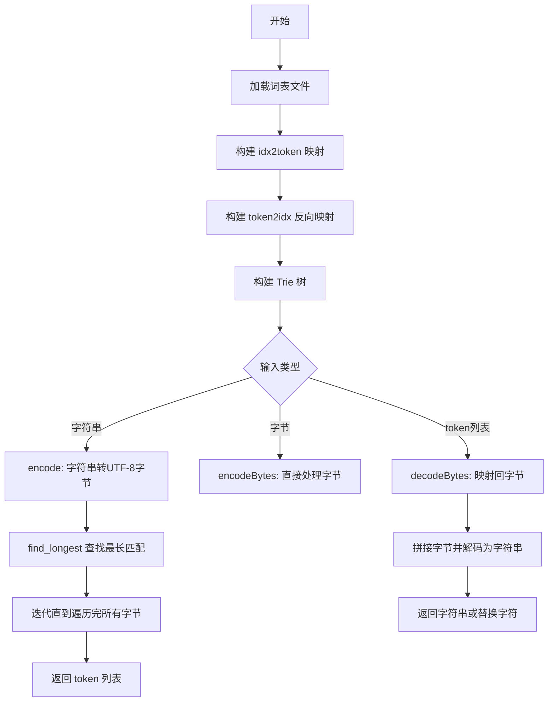
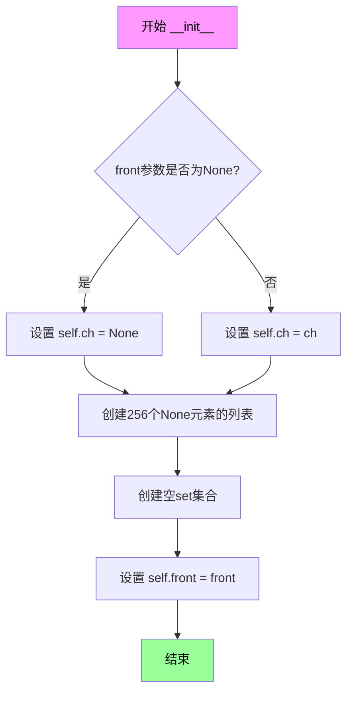
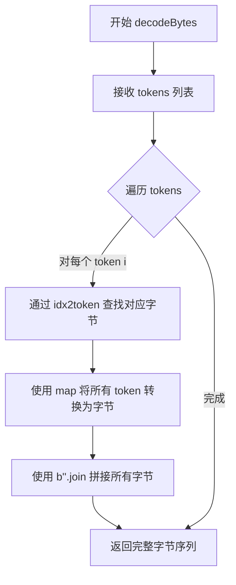
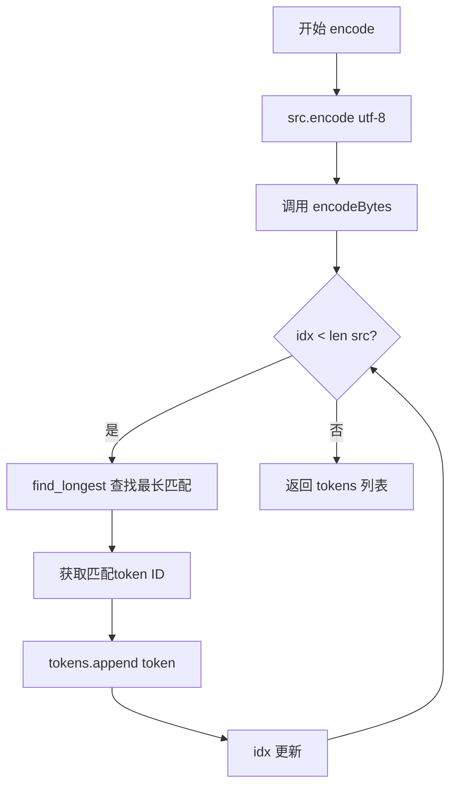
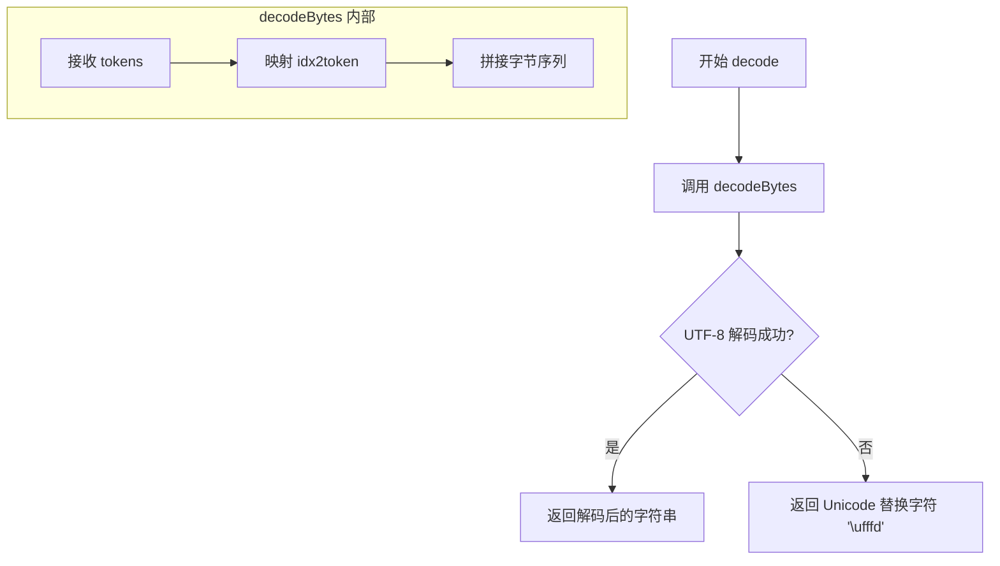

# `ChatRWKV\rwkv_pip_package\src\rwkv\rwkv_tokenizer.py` 详细设计文档

这是一个基于 Trie 树结构的分词器实现，用于 RWKV 语言模型。它通过构建高效的前缀树结构来实现字节级别的快速编码和解码，支持从词表文件加载token映射，并提供字符串与token序列之间的相互转换功能。

## 整体流程



## 类结构

```
TRIE (前缀树节点)
TRIE_TOKENIZER (分词器封装)
```

## 全局变量及字段


### `TRIE.ch`
    
当前节点对应的字符

类型：`Any`
    


### `TRIE.to`
    
256个元素的列表，存储256个可能的子节点

类型：`list`
    


### `TRIE.values`
    
存储当前节点对应的token值集合

类型：`set`
    


### `TRIE.front`
    
指向父节点的引用，用于回溯

类型：`TRIE`
    


### `TRIE_TOKENIZER.idx2token`
    
索引到token字节的映射字典

类型：`dict`
    


### `TRIE_TOKENIZER.token2idx`
    
token字节到索引的反向映射字典

类型：`dict`
    


### `TRIE_TOKENIZER.root`
    
Trie树的根节点

类型：`TRIE`
    
    

## 全局函数及方法


### `TRIE.__init__`

该方法是TRIE（前缀树）数据结构的构造函数，用于初始化一个新的Trie节点。它接收可选的front（父节点引用）和ch（当前节点字符）参数，初始化节点的字符属性、子节点数组（256个位置对应可能的字节值）、值集合以及父节点引用。

参数：

- `front`：`TRIE | None`，指向当前节点的父节点的引用，用于构建路径回溯
- `ch`：`int | None`，当前节点所代表的字节字符值（0-255）

返回值：`None`，构造函数不返回任何值

#### 流程图



#### 带注释源码

```python
def __init__(self, front=None, ch=None):
    """
    Trie节点的构造函数，初始化一个新的前缀树节点。
    
    参数:
        front: 父节点引用，用于构建从根到当前节点的路径
        ch: 当前节点代表的字节字符（0-255的整数）
    """
    # 设置当前节点的字符值，如果是根节点则为None
    self.ch = ch
    
    # 初始化子节点数组，共256个位置对应可能的字节值(0-255)
    # 每个位置初始为None，表示该分支尚未创建
    self.to = [None for ch in range(256)]
    
    # 初始化值集合，用于存储以该节点为结尾的词（可以是token或其他数据）
    self.values = set()
    
    # 保存父节点引用，便于后续路径回溯
    self.front = front
```


### `TRIE.__repr__`

该方法实现了 Python 的魔法方法 `__repr__`，用于返回 TRIE 树节点的字符串表示形式。它从当前节点向前遍历到根节点，收集路径上的所有字符，然后逆序排列形成完整的键路径，并与当前节点的值集合一起组成可读的错误信息。

参数：此方法无显式参数（仅有隐式参数 `self`）

返回值：`str`，返回格式为 `<TRIE [字符路径] [值集合]>` 的字符串表示

#### 流程图

```mermaid
flowchart TD
    A[开始 __repr__] --> B[fr = self]
    B --> C[创建空列表 ret]
    C --> D{fr 不为 None?}
    D -->|是| E{fr.ch 不为 None?}
    E -->|是| F[ret.append(fr.ch)]
    E -->|否| G[fr = fr.front]
    F --> G
    G --> D
    D -->|否| H[ret[::-1] 逆序]
    H --> I[返回格式化字符串 <TRIE %s %s> % (ret[::-1], self.values)]
    I --> J[结束]
```

#### 带注释源码

```
def __repr__(self):
    """
    返回 TRIE 节点的字符串表示形式
    
    该方法从当前节点开始，沿着 front 指针（父节点引用）向前遍历，
    收集路径上的所有字符，然后逆序排列以获得正确的键顺序。
    最终返回格式为 <TRIE [字符路径] [值集合]> 的字符串。
    
    Returns:
        str: TRIE 节点的字符串表示，包含从根到当前节点的路径字符和当前节点的值集合
    """
    fr = self          # 从当前节点开始遍历
    ret = []           # 用于存储路径上的字符
    
    # 沿着 front 指针向前遍历到根节点
    while(fr != None):
        if(fr.ch != None):      # 如果当前节点有字符，则添加到列表
            ret.append(fr.ch)
        fr = fr.front           # 移动到父节点
    
    # 逆序以获得从根到当前节点的正确字符顺序
    return "<TRIE %s %s>" % (ret[::-1], self.values)
```


### TRIE.add

向 Trie（前缀树）中插入一个键值对。如果键已存在，则更新其对应的值；如果不存在，则创建新的路径。该方法支持递归插入字节序列的每个字符，并返回当前节点以支持链式调用。

参数：

- `key`：`bytes`，要添加的键，为字节序列类型
- `idx`：`int`，当前处理的字符索引，默认为 0，表示从键的第一个字符开始
- `val`：`any`，要存储的值，默认为 None，此时会使用 key 本身作为值

返回值：`TRIE`，返回当前节点（递归调用中的子节点），支持链式调用

#### 流程图

```mermaid
flowchart TD
    A[开始 add 方法] --> B{idx == len(key)?}
    B -- 是 --> C[val 为 None?]
    C -- 是 --> D[val = key]
    C -- 否 --> E[values.add(val)]
    E --> F[返回 self]
    B -- 否 --> G[ch = key[idx]]
    G --> H{to[ch] is None?}
    H -- 是 --> I[创建新 TRIE 节点 to[ch]]
    H -- 否 --> J[递归调用子节点 add]
    I --> J
    J --> K[返回子节点.add 的结果]
    
    style A fill:#f9f,stroke:#333
    style F fill:#9f9,stroke:#333
    style K fill:#9f9,stroke:#333
```

#### 带注释源码

```python
def add(self, key:bytes, idx:int=0, val=None):
    """
    向 Trie 树中添加一个键值对
    
    参数:
        key: bytes - 要添加的键（字节序列）
        idx: int - 当前处理的字符索引，默认为0
        val: any - 要存储的值，默认为None
    
    返回:
        TRIE - 返回当前节点（子节点），支持链式调用
    """
    
    # 递归终止条件：已处理完整个键的所有字符
    if(idx == len(key)):
        # 如果未指定值，则使用键本身作为值
        if(val is None):
            val = key
        # 将值添加到当前节点的 values 集合中
        self.values.add(val)
        # 返回当前节点，支持链式调用
        return self
    
    # 获取当前索引位置的字节值（0-255）
    ch = key[idx]
    
    # 如果对应的子节点不存在，则创建新的 TRIE 节点
    # front=self 表示新节点的父节点是当前节点
    # ch=ch 表示新节点对应的字符
    if(self.to[ch] is None):
        self.to[ch] = TRIE(front=self, ch=ch)
    
    # 递归调用子节点的 add 方法，处理下一个字符
    # idx+1 移动到下一个字符位置
    # 传入相同的 val，确保值只在叶子节点存储
    return self.to[ch].add(key, idx=idx+1, val=val)
```


### `TRIE.find_longest`

在 Trie 树中，从指定的起始索引开始，遍历输入的字节序列（key），寻找能够匹配的最长路径。如果在遍历过程中遇到存储了具体 Token 值（values）的节点，则记录该节点信息。该方法主要用于分词（Tokenization）场景，通过最大匹配原则找到最长的有效词元。

参数：

- `key`：`bytes`，要搜索的字节数据流。
- `idx`：`int`，开始搜索的起始索引位置。

返回值：`tuple`，包含三个元素的元组：
1. `int`：匹配结束后的下一个索引位置（即 `idx`）。
2. `TRIE`：最后一个包含有效值（values）的 Trie 树节点。
3. `set`：该节点对应的值集合（通常为 `(token_bytes, token_id)` 元组的集合）。

#### 流程图

```mermaid
flowchart TD
    START(["find_longest(key, idx)"]) --> INIT["u = self<br>ch = key[idx]"]
    
    COND{"u.to[ch] is not None"}
    
    COND -->|Yes| TRAVERSE["u = u.to[ch]<br>idx = idx + 1"]
    
    TRAVERSE --> CHECK_VAL{"u.values is not empty"}
    
    CHECK_VAL -->|Yes| UPDATE_RET["ret = (idx, u, u.values)"]
    CHECK_VAL -->|No| SKIP_UPDATE
    
    UPDATE_RET --> CHECK_END{"idx == len(key)"}
    SKIP_UPDATE --> CHECK_END
    
    CHECK_END -->|Yes| BREAK["Break Loop"]
    CHECK_END -->|No| GET_NEXT_CH["ch = key[idx]"]
    
    GET_NEXT_CH --> COND
    COND -->|No| RETURN["Return ret"]
    BREAK --> RETURN
    
    %% 潜在异常处理
    STYLE COND fill:#f9f,stroke:#333,stroke-width:2px
    STYLE RETURN fill:#9f9,stroke:#333,stroke-width:2px
```

#### 带注释源码

```python
def find_longest(self, key:bytes, idx:int=0):
    """
    在Trie树中查找从key[idx]开始的最长匹配。
    
    参数:
        key: bytes, 输入的字节流
        idx: int, 起始索引
    
    返回:
        tuple: (匹配终止索引, 最后的有效节点, 有效节点的值集合)
    """
    u:TRIE = self  # 从当前节点（通常为根节点）开始
    ch:int = key[idx] # 获取当前索引对应的字节字符
    
    # 如果第一个字符就没有对应子节点，循环不会执行，
    # 此时若外部直接调用此方法而不检查前缀存在性，会导致ret未定义报错（潜在技术债务）
    while(u.to[ch] is not None):
        u = u.to[ch] # 移动到子节点
        idx += 1     # 索引前移
        
        # 如果当前节点存储了具体的Token值（表示一个完整的词结尾），则记录下来
        if(u.values):
            ret = idx, u, u.values
            
        # 如果已经到达输入key的末尾，则停止搜索
        if(idx==len(key)):
            break
            
        ch = key[idx] # 继续获取下一个字节用于下一次循环判断
        
    return ret
```

**注：** 该实现依赖于调用方保证 `key[idx]` 的有效性（例如在 `encodeBytes` 中通过循环控制边界）。此外，如果 Trie 树中不存在以 `key[idx]` 开头的路径，变量 `ret` 将不会被赋值，可能导致 `UnboundLocalError`，这属于该函数的一个脆弱点。


### `TRIE_TOKENIZER.__init__`

该方法是 `TRIE_TOKENIZER` 类的构造函数，负责从文件中加载 token 列表，构建双向映射表（idx 到 token、token 到 idx）以及初始化前缀树（ trie）结构，以便后续的编码和解码操作。

参数：

- `file_name`：`str`，token 列表文件路径，文件格式为每行包含 token 索引、空格、token 内容（字符串或十六进制）、空格、token 字节长度

返回值：`None`，无返回值

#### 流程图

```mermaid
flowchart TD
    A[开始 __init__] --> B[初始化 self.idx2token = {}]
    B --> C[打开 file_name 文件]
    C --> D[读取所有行到 lines]
    D --> E{遍历 lines}
    E -->|每行| F[解析行: 提取 idx 和 x]
    F --> G[将 x 转换为 bytes]
    G --> H[断言 x 是 bytes 类型]
    H --> I[断言 len(x) 等于 token 长度]
    I --> J[添加 x 到 sorted 列表]
    J --> K[设置 self.idx2token[idx] = x]
    K --> E
    E -->|遍历完成| L[初始化 self.token2idx = {}]
    L --> M{遍历 idx2token}
    M -->|每个 k,v| N[设置 self.token2idx[v] = int(k)]
    N --> M
    M -->|遍历完成| O[初始化 self.root = TRIE()]
    O --> P{遍历 token2idx}
    P -->|每个 t, i| Q[调用 self.root.add(t, val=(t, i))]
    Q --> P
    P -->|遍历完成| R[结束 __init__]
```

#### 带注释源码

```
def __init__(self, file_name):
    """
    初始化 TRIE_TOKENIZER，从文件加载 token 列表并构建映射结构和 trie 树
    
    参数:
        file_name: str, token 列表文件路径
    """
    # 初始化索引到 token 的映射字典
    self.idx2token = {}
    sorted = []  # 必须已排序的 token 列表
    
    # 打开文件并读取所有行
    with open(file_name, "r", encoding="utf-8") as f:
        lines = f.readlines()
    
    # 遍历每一行，解析 token 信息
    for l in lines:
        # 提取 token 索引（第一个空格之前）
        idx = int(l[:l.index(' ')])
        # 提取 token 内容（首尾空格之间），并使用 eval 处理
        x = eval(l[l.index(' '):l.rindex(' ')])
        # 如果是字符串，编码为 bytes
        x = x.encode("utf-8") if isinstance(x, str) else x
        # 断言确保 x 是 bytes 类型
        assert isinstance(x, bytes)
        # 断言 token 实际长度与文件中的长度一致
        assert len(x) == int(l[l.rindex(' '):])
        # 添加到 sorted 列表
        sorted += [x]
        # 存入 idx 到 token 的映射
        self.idx2token[idx] = x

    # 构建 token 到 idx 的反向映射字典
    self.token2idx = {}
    for k,v in self.idx2token.items():
        self.token2idx[v] = int(k)

    # 初始化根 trie 节点
    self.root = TRIE()
    # 将所有 token 添加到 trie 树，值为 (token_bytes, index) 元组
    for t, i in self.token2idx.items():
        _ = self.root.add(t, val=(t, i))
```


### `TRIE_TOKENIZER.encodeBytes`

该方法接收一个原始字节序列（bytes），并利用内部预先构建好的 Trie 树结构，对输入进行贪婪的最长匹配分词，最终将字节流转换为对应的整数 token ID 列表。

参数：
- `src`：`bytes`，要编码的原始字节数据。

返回值：`list`，返回包含整数 Token ID 的列表。

#### 流程图

```mermaid
graph TD
    A[开始 encodeBytes] --> B[初始化 idx=0, tokens=[]]
    B --> C{idx < len(src)?}
    C -- 否 --> D[返回 tokens 列表]
    C -- 是 --> E[调用 root.find_longest src idx]
    E --> F[更新 idx, 获取 values]
    F --> G{assert idx != _idx}
    G -- 失败 --> H[抛出 AssertionError]
    G -- 成功 --> I[从 values 中提取 token id]
    I --> J[将 token id 加入 tokens]
    J --> C
```

#### 带注释源码

```python
def encodeBytes(self, src:bytes):
    """
    将字节数据编码为 Token ID 列表。
    使用贪心算法，从左到右扫描，每次寻找当前起始位置的最长匹配token。
    """
    idx:int = 0          # 当前读取字节的位置
    tokens = []          # 存储结果的 Token ID 列表
    
    # 持续循环直到遍历完整个字节串
    while (idx < len(src)):
        _idx:int = idx   # 记录本轮开始时的位置，用于校验是否取得进展
        # 调用 Trie 的 find_longest 查找最长匹配
        # 返回值: (新的idx, trie节点, values集合)
        # values 集合中包含 (token_bytes, token_id) 元组
        idx, _, values = self.root.find_longest(src, idx)
        
        # 断言：确保 Trie 匹配至少向前移动了一个字节。
        # 如果没有移动（例如遇到未知字节），程序会在此处崩溃。
        assert(idx != _idx)
        
        # 从匹配到的 values 集合中取出一个值（通常是 (bytes, id)）
        # next(iter(values)) 获取集合中的第一个元素
        _, token = next(iter(values))            
        
        # 将 Token ID 添加到结果列表
        tokens.append(token)
        
    return tokens
```

---

### 类的详细信息

#### `TRIE_TOKENIZER` 类

该类实现了一个基于 Trie 树（前缀树）的分词器，支持从字节到 ID 的映射和从 ID 到字节的反向映射。

**字段 (Attributes)**：
- `idx2token`：`dict`，键为整数 ID，值为对应的字节数据 (bytes)。
- `token2idx`：`dict`，键为字节数据 (bytes)，值为对应的整数 ID。
- `root`：`TRIE`，根节点 Trie 树，包含了所有 token 的索引结构，用于加速最长匹配查找。

**方法 (Methods)**：
- `__init__(self, file_name)`：构造函数，负责读取词表文件，构建 `idx2token` 和反向索引 `token2idx`，并填充 Trie 树 (`self.root`)。
- `encodeBytes(self, src:bytes) -> list`：核心编码方法，将字节流转换为 ID 列表（详见上方）。
- `decodeBytes(self, tokens) -> bytes`：将 ID 列表合并还原为字节流。
- `encode(self, src:str) -> list`：将字符串编码为 ID 列表的便捷封装（内部调用 `encodeBytes`）。
- `decode(self, tokens) -> str`：将 ID 列表解码为字符串的便捷封装（内部调用 `decodeBytes`）。
- `printTokens(self, tokens)`：调试用方法，将 ID 列表打印为可读格式。

---

### 关键组件信息

- **TRIE (前缀树)**：一种树形数据结构，用于存储动态字符串集合。本代码中用于实现 O(K) 复杂度的最长前缀匹配（K为匹配长度），这是该分词器高效运行的核心。
- **Vocab File (词表文件)**：外部依赖文件，格式为每行包含 `ID` + `空格` + `Token` + `长度`。加载失败会导致分词器无法初始化。

---

### 潜在的技术债务或优化空间

1.  **异常处理缺失**：
    - 在 `encodeBytes` 中使用了 `assert(idx != _idx)` 来处理“匹配失败”的情况。在生产环境中，使用 `assert` 进行流程控制是不可靠的（Python 运行时使用 `-O` 参数会忽略 assert），且抛出的 `AssertionError` 信息不够友好。应当改为显式的 `if` 判断并抛出具体的 `ValueError` 或 `RuntimeError`。
    - `find_longest` 方法存在潜在 Bug：如果输入的字节在 Trie 中完全没有匹配（例如包含词表外的字节），`ret` 变量可能未被赋值（虽然代码逻辑看起来总会初始化，但在边界条件下如果 `u.values` 始终为空，会导致返回未定义的 `ret`，可能引发 `NameError`）。应添加默认值处理。
2.  **性能考量**：
    - `encodeBytes` 每次循环都调用 `next(iter(values))`。虽然元组只有一份拷贝，但显式解包 `_, token` 涉及到迭代器的创建。对于高频调用场景，可以考虑优化取值逻辑。
    - 词表加载为同步 I/O，且每次创建 `TRIE_TOKENIZER` 实例都会重新构建一次 Trie 树。如果应用需要频繁初始化分词器，可以考虑增加缓存机制。

### 其它项目

**设计目标与约束**：
- **字节级分词**：该设计主要面向字节级（Byte-level）分词，适合多语言或处理特殊字符的场景。
- **最长匹配策略**：采用的是贪婪的最长匹配（Longest Match），这意味着给定 "apple" 和 "app"，输入 "apple" 会被优先匹配为 ["apple"] 而非 ["app", "le"]。

**错误处理与异常设计**：
- 输入必须是 `bytes` 类型（`encode` 方法负责将 `str` 转为 `bytes`）。
- 如果输入包含了词表中不存在的字节序列（如表情符号或生僻字，且词表未覆盖），代码会在 `assert` 处崩溃。
- UTF-8 解码错误在 `decode` 中被捕获，并替换为 `\ufffd`（替换字符），保证了界面的鲁棒性但可能丢失错误数据。


### `TRIE_TOKENIZER.decodeBytes`

将整数 token 列表解码为原始字节序列的字节串解码方法。

参数：

- `tokens`：`List[int]`，待解码的 token ID 列表，每个元素为词汇表中对应 token 的整数索引

返回值：`bytes`，由所有 token 对应的字节数据拼接而成的完整字节序列

#### 流程图



#### 带注释源码

```python
def decodeBytes(self, tokens):
    """
    将 token 整数列表解码为原始字节序列
    
    参数:
        tokens: List[int]，token ID 列表
    
    返回:
        bytes: 解码后的字节数据
    """
    # 使用 map 将每个 token ID 通过 idx2token 字典映射为对应的字节
    # 然后使用 b''.join 将所有字节拼接为一个完整的字节串
    return b''.join(map(lambda i: self.idx2token[i], tokens))
```


### TRIE_TOKENIZER.encode

该方法是TRIE_TOKENIZER类的编码接口，将输入的字符串转换为对应的token ID列表。方法内部调用encodeBytes方法处理UTF-8编码后的字节数据，通过Trie树结构查找最长匹配进行分词。

参数：

- `src`：`str`，需要编码的原始字符串

返回值：`list[int]`，编码后的token ID列表，每个元素对应一个token的整数标识符

#### 流程图



#### 带注释源码

```
def encode(self, src):
    """
    编码方法入口
    参数:
        src: str - 待编码的字符串
    返回:
        list - token ID列表
    """
    # 将输入字符串编码为UTF-8字节后调用encodeBytes处理
    return self.encodeBytes(src.encode("utf-8"))
```

---

### TRIE_TOKENIZER.encodeBytes

辅助方法，实际执行字节级别的token编码逻辑。

参数：

- `src`：`bytes`，UTF-8编码后的字节数据

返回值：`list[int]`，token ID列表

#### 流程图

```mermaid
flowchart TD
    A[开始 encodeBytes] --> B[初始化 idx=0, tokens=[]]
    B --> C{idx < len src?}
    C -->|是| D[记录当前 _idx]
    D --> E[find_longest 查找最长匹配]
    E --> F{idx 更新成功?}
    F -->|是| G[获取 token ID]
    G --> H[tokens.append token]
    H --> C
    F -->|否| I[assert 失败]
    C -->|否| J[返回 tokens]
```

#### 带注释源码

```
def encodeBytes(self, src:bytes):
    """
    字节编码实现
    参数:
        src: bytes - UTF-8编码的字节序列
    返回:
        list - token ID列表
    """
    idx:int = 0                    # 当前处理位置
    tokens = []                    # 结果列表
    
    # 遍历整个字节序列
    while (idx < len(src)):
        _idx:int = idx             # 记录起始位置用于断言
        
        # 在Trie树中查找从当前位置开始的最长匹配
        # find_longest返回: (新索引, Trie节点, 匹配值集合)
        idx, _, values = self.root.find_longest(src, idx)
        
        # 确保索引有前进，否则会陷入死循环
        assert(idx != _idx)
        
        # 从匹配集合中取第一个token（通常只有一个）
        _, token = next(iter(values))            
        tokens.append(token)
    
    return tokens
```


### `TRIE_TOKENIZER.decode`

该方法是 Trie Tokenizer 类的解码接口，接收整数 token 列表，尝试将其转换为 UTF-8 字符串，失败时返回 Unicode 替换字符以保证程序健壮性。

参数：

- `tokens`：`list[int]`，要解码的 token 序列，每个元素为整数类型的 token ID

返回值：`str`，解码后的 UTF-8 字符串，如果 UTF-8 解码失败则返回 Unicode 替换字符 `'\ufffd'`

#### 流程图



#### 带注释源码

```
def decode(self, tokens):
    """
    将 token 序列解码为 UTF-8 字符串
    
    参数:
        tokens: list[int], 要解码的 token 序列（整数列表）
        
    返回:
        str: 解码后的字符串，失败时返回替换字符
    """
    try:
        # 调用 decodeBytes 将 token 序列转换为字节
        # 再将字节解码为 UTF-8 字符串
        return self.decodeBytes(tokens).decode('utf-8')
    except:
        # 捕获 UTF-8 解码异常（如遇到无效字节序列）
        # 返回 Unicode 替换字符，保证程序不崩溃
        return '\ufffd'  # bad utf-8
```


### `TRIE_TOKENIZER.printTokens`

该方法接收一个整数token列表，遍历每个token编号，从`idx2token`字典中查找对应的原始字节数据，尝试将其解码为UTF-8字符串，并以"`repr(token)index`"的格式打印输出，最后换行。

参数：

- `tokens`：`list[int]`，整数token列表，表示需要打印的token序列

返回值：`None`，该方法没有返回值，仅执行打印操作

#### 流程图

```mermaid
flowchart TD
    A[开始] --> B[遍历 tokens 中的每个元素 i]
    B --> C[通过 self.idx2token[i] 获取对应的字节数据 s]
    C --> D{尝试解码为 UTF-8}
    D -->|成功| E[使用解码后的字符串]
    D -->|失败| F[保持原始字节数据]
    E --> G[打印 repr(s) + i, 不换行]
    F --> G
    G --> H{还有更多 token?}
    H -->|是| B
    H -->|否| I[打印换行符]
    I --> J[结束]
```

#### 带注释源码

```
def printTokens(self, tokens):
    """
    打印token列表的详细内容
    
    参数:
        tokens: 整数列表，每个元素是一个token的索引编号
    """
    # 遍历传入的token列表
    for i in tokens:
        # 根据token索引从idx2token字典获取对应的原始字节数据
        s = self.idx2token[i]
        
        # 尝试将字节数据解码为UTF-8字符串
        try:
            s = s.decode('utf-8')
        except:
            # 解码失败时保持原始字节数据不变
            pass
        
        # 打印token的表示形式和索引，不换行
        # repr(s)用于显示字符的原始形式（如空格显示为' '）
        # i是token的索引编号
        print(f'{repr(s)}{i}', end=' ')
    
    # 循环结束后打印换行符
    print()
```

## 关键组件


### 一段话描述
该代码实现了一个基于Trie（前缀树）数据结构的分词器（Tokenizer），用于RWKV语言模型，支持高效的字节级token编码和解码，通过最长前缀匹配实现文本与token序列之间的相互转换。

### 文件的整体运行流程
1. 初始化TRIE_TOKENIZER时，从词表文件加载所有token及其索引
2. 构建token到索引的映射表（token2idx）和索引到token的映射表（idx2token）
3. 将所有token插入到TRIE树中，支持最长前缀匹配
4. 编码时，通过find_longest方法从当前位置开始查找最长匹配token
5. 解码时，通过idx2token映射将token索引转换回原始字节并拼接

### 类详细信息

#### TRIE类
**字段：**
- ch: 存储当前节点的字符
- to: 长度为256的列表，存储256个可能的下一个字符对应的子节点
- values: set集合，存储以该节点为结尾的token值
- front: 指向父节点的引用，用于__repr__显示

**方法：**
- __init__: 初始化TRIE节点
- __repr__: 返回可读的树结构表示
- add: 向TRIE中添加key-val键值对
- find_longest: 查找最长匹配的前缀

#### TRIE_TOKENIZER类
**字段：**
- idx2token: dict，索引到token字节的映射
- token2idx: dict，token字节到索引的映射
- root: TRIE，根节点

**方法：**
- __init__: 初始化分词器，加载词表文件并构建TRIE
- encodeBytes: 将字节序列编码为token索引列表
- decodeBytes: 将token索引列表解码为字节序列
- encode: 将字符串编码为token索引列表
- decode: 将token索引列表解码为字符串
- printTokens: 打印token及其索引

### 关键组件信息

### 1. Trie树结构
使用前缀树实现高效的最长前缀匹配，支持256个字符（字节级别）

### 2. 最长前缀匹配算法
find_longest方法从给定位置开始遍历Trie树，找到最长匹配的token

### 3. 双映射表
idx2token和token2idx实现O(1)时间复杂度的索引与token互转

### 4. 惰性加载
TRIE采用动态创建子节点，仅在需要时创建新节点

### 5. 量化策略
无显式量化支持，token以字节形式存储

### 潜在技术债务与优化空间

### 1. 异常处理
- decode方法使用空try-except捕获UTF-8解码错误，返回替换字符'\ufffd'
- encodeBytes中使用assert而非异常处理，断言失败会导致程序终止

### 2. 内存优化
- to列表始终分配256个元素，即使实际使用很少，可考虑稀疏表示
- values集合可能存储重复数据，可优化存储结构

### 3. 代码质量
- find_longest返回的ret变量未初始化，如果未找到任何匹配可能导致未定义行为
- 使用eval解析词表文件存在安全风险

### 4. 类型注解不完整
部分方法缺少返回值类型注解

### 5. 错误处理与边界情况
- encodeBytes假设输入字节不包含0长度匹配，否则可能死循环
- 未处理空输入的边界情况


## 问题及建议


### 已知问题

- **TRIE.find_longest返回值未初始化问题**：如果循环体从未执行（首字符就找不到匹配），`ret`变量未被定义，会导致`UnboundLocalError`
- **变量命名遮蔽内置函数**：使用`sorted = []`覆盖了Python内置的`sorted`函数，会导致后续代码中无法使用`sorted()`
- **encodeBytes中断言使用不当**：使用`assert(idx != _idx)`进行业务逻辑判断，当失败时抛出`AssertionError`而非有意义的业务异常
- **异常处理过于宽泛**：`decode`方法使用空的`except:`捕获所有异常并简单返回`\ufffd`，隐藏了真实的错误信息，不利于调试
- **缺少输入验证**：`encodeBytes`和`decodeBytes`方法未对输入进行空值或类型检查
- **TRIE节点内存浪费**：每个节点都创建256个元素的列表`to = [None for ch in range(256)]`，即使大多数是`None`，对于大规模词表会消耗大量内存
- **类型注解不一致**：部分参数缺少类型注解（如`encodeBytes`的`src`参数、`decodeBytes`的`tokens`参数）
- **构造函数缺少文件存在性检查**：直接打开文件，未检查文件是否存在或格式是否正确，失败时给出模糊的错误信息
- **重复计算**：在`TRIE_TOKENIZER.__init__`中，先构建`idx2token`再构建`token2idx`，两次遍历字典效率较低

### 优化建议

- **修复find_longest的返回值逻辑**：在方法开始时初始化`ret = None`，循环结束后检查`ret`是否为`None`并返回合适的默认值
- **重命名变量**：将`sorted`改为`token_list`或`tokens_sorted`以避免遮蔽内置函数
- **改进错误处理**：将`assert`改为明确的条件判断和异常抛出；缩小`except`捕获范围或记录异常日志
- **添加输入验证**：在`encodeBytes`中检查`src`是否为`bytes`类型，在`decodeBytes`中检查`tokens`是否为可迭代类型
- **优化TRIE内存使用**：考虑使用字典替代固定大小列表存储子节点，或实现稀疏矩阵存储
- **添加文件验证**：在构造函数中添加文件存在性检查和格式验证
- **简化字典构建**：可以使用字典推导式一次性构建`token2idx`

## 其它


### 设计目标与约束

该代码实现了一个基于TRIE（前缀树）数据结构的tokenizer，用于在字节级别对文本进行分词处理。设计目标是支持高效的token查找和编码/解码操作，特别适用于RWKV语言模型的tokenization需求。约束条件包括：输入必须是UTF-8编码的字节或字符串，token字典文件必须预先排序且格式固定，每个token必须是有效的字节序列。

### 错误处理与异常设计

代码中的异常处理主要体现在以下几个方面：1) `encodeBytes`方法中使用`assert`确保索引能够前进，防止无限循环；2) `decode`方法中使用try-except捕获UTF-8解码错误，并返回Unicode替换字符`\ufffd`；3) `TRIE_TOKENIZER.__init__`中使用assert验证token字节长度与文件描述一致；4) `encode`方法假设输入为有效UTF-8字符串，不对编码错误进行处理。当前设计采用静默失败策略，对于无法识别的字节序列会抛出异常而非返回默认值。

### 数据流与状态机

TRIE_TOKENIZER的工作流程分为两个主要阶段：初始化阶段和运行阶段。初始化阶段：首先从文件加载token映射表（idx2token和token2idx），然后构建TRIE前缀树，将每个token及其索引存入树中。运行阶段（编码）：从输入字节序列的当前位置开始，在TRIE树中不断向下匹配，直到无法继续匹配或到达叶子节点，记录当前匹配到的最长token及其索引，然后从下一个位置重新开始匹配。运行阶段（解码）：将token索引列表通过idx2token映射表转换为字节序列，再拼接成完整的字节流进行UTF-8解码。

### 外部依赖与接口契约

该代码是自包含的，不依赖任何外部库，仅使用Python标准库：文件I/O（open, readlines）、字节处理（bytes, encode/decode）、数据结构（list, dict, set）。接口契约包括：1) `TRIE_TOKENizer`构造函数接受一个文件名参数，该文件必须包含按字节长度排序的token列表，格式为"索引 token_bytes 长度\n"；2) `encode`方法接受str或bytes类型输入，返回int列表；3) `decode`方法接受int列表输入，返回str类型输出；4) `encodeBytes`和`decodeBytes`方法处理原始字节流。

### 性能特征与复杂度分析

时间复杂度：TRIE构建阶段为O(N*L)，其中N是token数量，L是平均token长度；编码阶段最坏情况下为O(M*L)，其中M是输入字节数，L是匹配到的最长token长度，由于TRIE的线性查找特性，实际性能较好。空间复杂度：TRIE树的空间占用取决于token的公共前缀程度，最坏情况为O(N*L)，每个节点占用256个指针的列表（通过__slots__优化为固定属性），实际内存占用较高。find_longest方法采用循环而非递归，避免了递归深度问题。

### 线程安全性

该代码未实现任何线程同步机制。TRIE_TOKENIZER对象在多线程环境下共享使用是不安全的，因为：1) Trie树的遍历和修改操作可能产生竞争条件；2) encodeBytes方法中的迭代器状态不是线程安全的。如果需要在多线程环境中使用，建议每个线程创建独立的TRIE_TOKENIZER实例，或者在外部添加锁保护。

### 序列化与反序列化

代码未实现TRIE对象的序列化功能。在实际应用中，可能需要将构建好的TRIE树持久化以避免重复初始化开销。可以考虑使用pickle直接序列化TRIE对象，或者实现自定义的序列化为JSON格式。由于TRIE节点包含循环引用（front指针），需要特别注意序列化时的处理。

### 边界条件处理

代码对以下边界情况进行了处理：1) 空输入：encodeBytes方法在idx < len(src)条件下循环，空输入直接返回空列表；2) 解码空token列表：decodeBytes返回空字节串，decode返回空字符串；3) 无法匹配的字节：当前实现要求输入必须能被token覆盖，否则会因assert失败而崩溃；4) 最大token长度：find_longest方法使用while循环，会遍历到输入末尾或无法继续匹配为止。缺少的边界处理包括：输入为None的情况、文件不存在或格式错误的处理。

### 使用示例

```python
# 基本使用示例
tokenizer = TRIE_TOKENIZER("path/to/tokenizer.txt")
# 编码
text = "Hello World"
tokens = tokenizer.encode(text)
print(tokens)  # 输出: [int, int, ...]
# 解码
decoded = tokenizer.decode(tokens)
print(decoded)  # 输出: "Hello World"
# 直接字节操作
raw_bytes = b"\x48\x65\x6c\x6c\x6f"
tokens = tokenizer.encodeBytes(raw_bytes)
recovered = tokenizer.decodeBytes(tokens)
```

### 配置参数与常量

代码中包含以下硬编码常量：1) 字符集大小：256，对应单字节字符范围；2) TRIE节点属性：通过__slots__定义为ch, to, values, front四个属性；3) 错误替换字符：Unicode替换字符U+FFFD（'\ufffd'）。这些常量未作为配置参数暴露，如需调整tokenizer的字符集范围或错误处理策略，需要直接修改源代码。

    