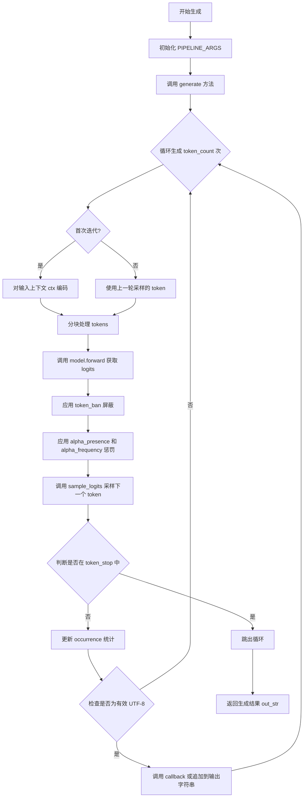
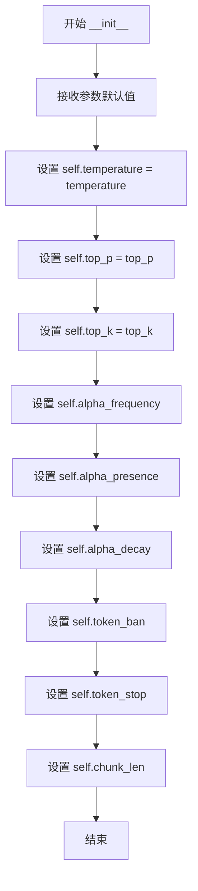
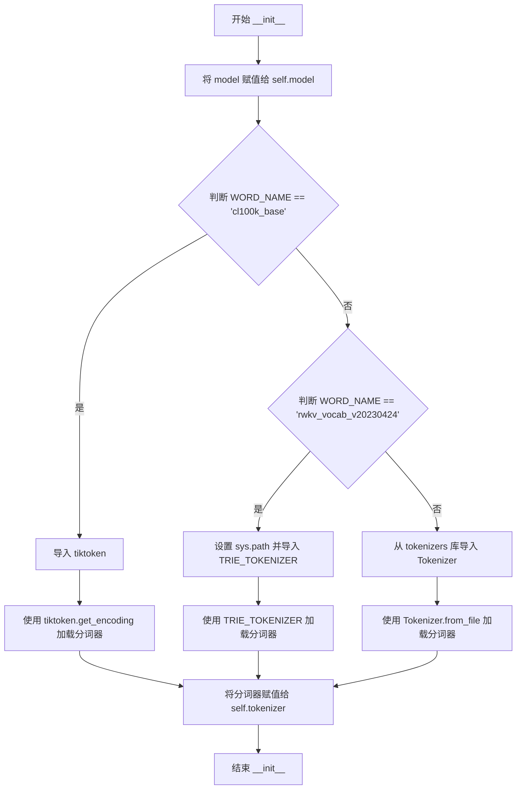
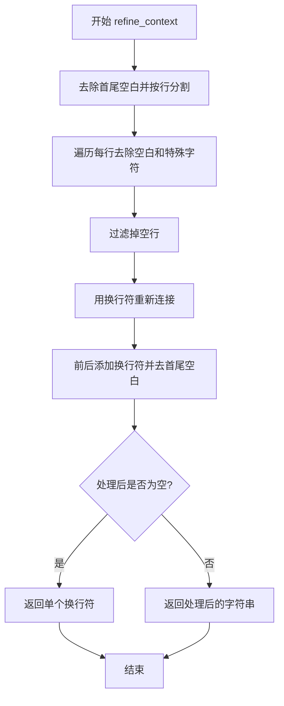
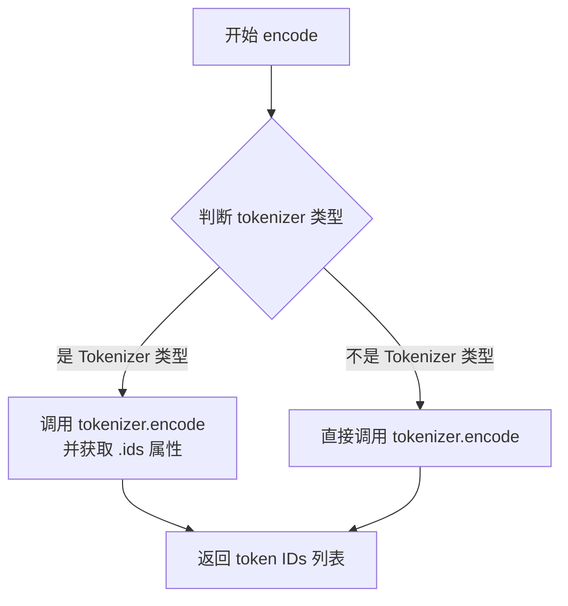
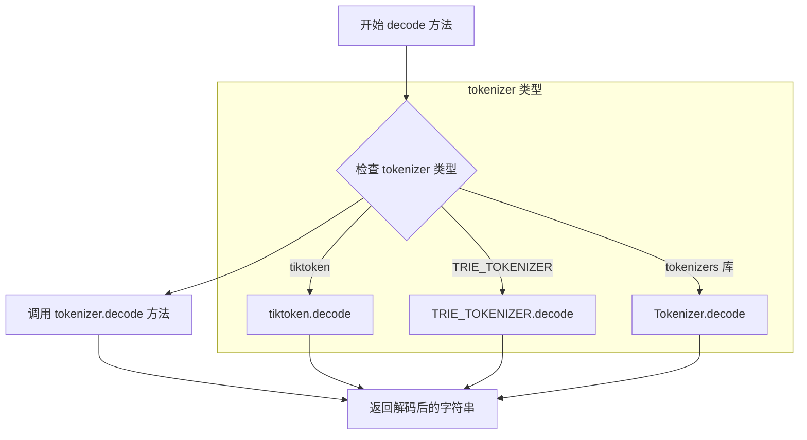

# `ChatRWKV\rwkv_pip_package\src\rwkv\utils.py` 详细设计文档

这是 RWKV 语言模型的推理管道实现，提供了文本生成所需的分词、采样和生成逻辑。通过支持多种分词器（cl100k_base、rwkv_vocab_v20230424 以及通用 tokenizers），结合温度采样、Top-P/Top-K 过滤和词频惩罚机制，实现可控的文本生成功能。

## 整体流程



## 类结构

```
PIPELINE_ARGS (参数配置类)
└── __init__(temperature, top_p, top_k, alpha_frequency, alpha_presence, alpha_decay, token_ban, token_stop, chunk_len)

PIPELINE (核心管道类)
├── __init__(model, WORD_NAME)
├── refine_context(context)
├── encode(x)
├── decode(x)
├── sample_logits(logits, temperature, top_p, top_k)
└── generate(ctx, token_count, args, callback, state)
```

## 全局变量及字段


### `os`
    
操作系统路径与环境变量操作模块

类型：`module`
    


### `sys`
    
Python 解释器相关系统功能模块

类型：`module`
    


### `np`
    
NumPy 数值计算库

类型：`module`
    


### `torch`
    
PyTorch 深度学习张量与神经网络模块

类型：`module`
    


### `F`
    
torch.nn.functional 函数式接口模块

类型：`module`
    


### `PIPELINE_ARGS.temperature`
    
采样温度，控制随机性

类型：`float`
    


### `PIPELINE_ARGS.top_p`
    
Nucleus Sampling 阈值

类型：`float`
    


### `PIPELINE_ARGS.top_k`
    
Top-K 采样限制

类型：`int`
    


### `PIPELINE_ARGS.alpha_frequency`
    
词频惩罚系数

类型：`float`
    


### `PIPELINE_ARGS.alpha_presence`
    
词存在惩罚系数

类型：`float`
    


### `PIPELINE_ARGS.alpha_decay`
    
惩罚衰减因子

类型：`float`
    


### `PIPELINE_ARGS.token_ban`
    
禁止生成的 token 列表

类型：`list`
    


### `PIPELINE_ARGS.token_stop`
    
停止生成的 token 列表

类型：`list`
    


### `PIPELINE_ARGS.chunk_len`
    
分块处理长度，用于节省显存

类型：`int`
    


### `PIPELINE.model`
    
RWKV 语言模型实例

类型：`torch.nn.Module`
    


### `PIPELINE.tokenizer`
    
分词器对象，支持 tiktoken、trie_tokenizer 或 tokenizers 库

类型：`Tokenizer`
    
    

## 全局函数及方法


### PIPELINE_ARGS.__init__

该方法是PIPELINE_ARGS类的构造函数，用于初始化文本生成管道所需的各项参数配置，包括采样参数（temperature、top_p、top_k）、惩罚参数（alpha_frequency、alpha_presence、alpha_decay）、token过滤参数（token_ban、token_stop）以及性能优化参数（chunk_len）。

参数：

- `temperature`：`float`，温度参数，控制生成文本的随机性，值越大越随机，为0时使用默认值1.0
- `top_p`：`float`，核采样（nucleus sampling）概率阈值，默认为0.85，用于过滤低概率词汇
- `top_k`：`int`，top-k采样参数，限制采样候选词的数量，默认为0表示不限制
- `alpha_frequency`：`float`，频率惩罚系数，用于降低频繁出现词汇的概率，模拟GPT-3的频率惩罚机制
- `alpha_presence`：`float`，存在惩罚系数，只要词汇出现过就施加惩罚，模拟GPT-3的存在惩罚机制
- `alpha_decay`：`float`，惩罚衰减因子，用于逐渐衰减历史token的惩罚权重，默认0.996
- `token_ban`：`list`，禁止生成的token列表，强制排除某些token不被生成
- `token_stop`：`list`，停止token列表，当生成到列表中的token时立即停止生成
- `chunk_len`：`int`，输入分块长度，用于将长输入分割成多个小块以节省显存，默认为256

返回值：`None`，无返回值（构造函数）

#### 流程图



#### 带注释源码

```python
class PIPELINE_ARGS():
    def __init__(self, temperature=1.0, top_p=0.85, top_k=0, alpha_frequency=0.2, alpha_presence=0.2, alpha_decay=0.996, token_ban=[], token_stop=[], chunk_len=256):
        """
        初始化文本生成参数配置类
        
        参数:
            temperature: float, 采样温度，控制随机性，默认为1.0
            top_p: float, 核采样概率阈值，默认为0.85
            top_k: int, top-k采样保留的token数量，0表示不限制，默认为0
            alpha_frequency: float, 频率惩罚系数，用于减少高频词出现概率，默认为0.2
            alpha_presence: float, 存在惩罚系数，只要token出现过就施加惩罚，默认为0.2
            alpha_decay: float, 惩罚衰减因子，用于逐渐衰减历史惩罚效果，默认为0.996
            token_ban: list, 强制禁止生成的token ID列表，默认为空列表
            token_stop: list, 遇到即停止生成的token ID列表，默认为空列表
            chunk_len: int, 输入分块长度，用于VRAM显存优化，较短会更慢但更节省显存，默认为256
        """
        self.temperature = temperature  # 采样温度参数
        self.top_p = top_p  # 核采样概率阈值
        self.top_k = top_k  # top-k采样参数
        self.alpha_frequency = alpha_frequency  # 频率惩罚（GPT-3风格）
        self.alpha_presence = alpha_presence  # 存在惩罚（GPT-3风格）
        self.alpha_decay = alpha_decay  # 惩罚逐渐衰减
        self.token_ban = token_ban  # 禁止生成某些token
        self.token_stop = token_stop  # 看到任何此处token即停止生成
        self.chunk_len = chunk_len  # 分割输入成块以节省显存（越短->越慢）
```


### `PIPELINE.__init__`

这是 PIPELINE 类的构造函数，用于初始化语言模型推理管道。它接收模型和分词器名称，根据不同的分词器类型（cl100k_base、rwkv_vocab_v20230424 或其他）加载相应的分词器，并将其存储在实例变量中以供后续的编码和解码操作使用。

参数：

- `model`：`torch.nn.Module`，RWKV 语言模型实例，用于执行前向传播
- `WORD_NAME`：`str`，分词器名称或配置文件路径，用于确定使用哪种分词器

返回值：`None`，构造函数无返回值

#### 流程图



#### 带注释源码

```python
def __init__(self, model, WORD_NAME):
    # 将传入的模型保存为实例变量，供后续 forward 方法调用
    self.model = model
    
    # 根据不同的分词器名称选择对应的加载方式
    if WORD_NAME == 'cl100k_base':
        # 处理 OpenAI 的 cl100k_base 分词器（用于 GPT-4 等模型）
        import tiktoken
        self.tokenizer = tiktoken.get_encoding(WORD_NAME)
    
    elif WORD_NAME == 'rwkv_vocab_v20230424':
        # 处理 RWKV 项目自定义的分词器，使用 TRIE 树结构实现
        # 将当前文件目录添加到 sys.path 以便导入模块
        sys.path.insert(0, os.path.dirname(os.path.abspath(__file__)))
        # 动态导入 RWKV 专用的分词器类
        from rwkv_tokenizer import TRIE_TOKENIZER
        # 构造分词器词汇表文件路径并初始化分词器
        self.tokenizer = TRIE_TOKENIZER(os.path.dirname(os.path.abspath(__file__)) + '/rwkv_vocab_v20230424.txt')        
    
    else:
        # 处理通用的 Hugging Face tokenizers 库支持的 JSON 配置文件
        from tokenizers import Tokenizer
        self.tokenizer = Tokenizer.from_file(WORD_NAME)
```


### `PIPELINE.refine_context`

该方法用于对输入的上下文文本进行清洗和格式化处理，通过去除多余空白字符、空行以及特殊unicode字符，规范化文本结构以便后续模型处理。

参数：

- `context`：`str`，需要清洗格式化的原始上下文文本

返回值：`str`，格式化处理后的上下文字符串

#### 流程图



#### 带注释源码

```
def refine_context(self, context):
    # Step 1: 去除字符串首尾空白后按换行符分割成列表
    context = context.strip().split('\n')
    
    # Step 2: 遍历每一行，去除首尾空白、中文全角空格\u3000和回车符\r
    for c in range(len(context)):
        context[c] = context[c].strip().strip('\u3000').strip('\r')
    
    # Step 3: 过滤掉空行，移除所有空字符串元素
    context = list(filter(lambda c: c != '', context))
    
    # Step 4: 用换行符重新连接各行，并去除首尾空白
    context = '\n' + ('\n'.join(context)).strip()
    
    # Step 5: 如果处理后为空字符串，则返回单个换行符作为默认上下文
    if context == '':
        context = '\n'
    
    return context
```


### `PIPELINE.encode`

该方法负责将输入的文本字符串编码为对应的 token ID 列表，根据不同的 tokenizer 类型采用不同的调用方式以获取标准的 token IDs。

参数：
- `x`：`str`，需要编码的输入文本字符串

返回值：`list[int]`，编码后的 token ID 列表

#### 流程图



#### 带注释源码

```
def encode(self, x):
    # 检查 tokenizer 对象的类型名称中是否包含 'Tokenizer' 字符串
    if 'Tokenizer' in str(type(self.tokenizer)):
        # 使用 tiktoken 或其他 Tokenizer 对象时，encode 方法返回的对象包含 ids 属性
        return self.tokenizer.encode(x).ids
    else:
        # 使用其他 tokenizer（如 TRIE_TOKENIZER）时，encode 方法直接返回 IDs 列表
        return self.tokenizer.encode(x)
```


### PIPELINE.decode

该方法是PIPELINE类的解码方法，负责将模型输出的token ID列表转换为可读的中文字符串。它是对encode方法的逆操作，封装了不同tokenizer的decode接口，为文本生成提供最终输出。

参数：

- `self`：PIPELINE类实例本身，隐含参数
- `x`：`List[int]`，需要解码的token ID列表（由模型输出或encode方法生成的IDs）

返回值：`str`，解码后的文本字符串

#### 流程图



#### 带注释源码

```python
def decode(self, x):
    """
    将token ID列表解码为文本字符串
    
    参数:
        x: List[int] - token ID列表，需要解码的整数序列
    
    返回:
        str: 解码后的文本字符串
    """
    # 调用tokenizer的decode方法，根据初始化时加载的tokenizer类型
    # 自动选择对应的解码实现（tiktoken/TRIE_TOKENIZER/tokenizers）
    return self.tokenizer.decode(x)
```


### `PIPELINE.sample_logits`

该方法负责从模型输出的原始 logits 中根据指定的采样策略（temperature、top_p、top_k）选取下一个 token。它首先将 logits 转换为概率分布，然后依次应用核采样（top-p）、top-k 采样和温度缩放，最后根据概率分布进行随机采样得到最终的 token ID。

参数：

- `logits`：`torch.Tensor` 或 `numpy.ndarray`，模型输出的原始 logits（未归一化的分数）
- `temperature`：`float`，采样温度，用于控制输出的随机性，值越大输出越随机，值为 1 时不做缩放
- `top_p`：`float`，核采样（Nucleus Sampling）阈值，保留累积概率达到此阈值的最小 token 集合，值为 0 或 1 时表示不进行核采样
- `top_k`：`int`，top-k 采样参数，保留概率最高的 k 个 token，值为 0 时表示不进行 top-k 筛选

返回值：`int`，采样得到的 token ID

#### 流程图

```mermaid
flowchart TD
    A[开始 sample_logits] --> B{检查 temperature == 0?}
    B -->|是| C[设置 temperature = 1.0, top_p = 0]
    B -->|否| D[继续]
    C --> E[将 logits 转换为概率分布 F.softmax]
    D --> E
    E --> F{设备类型是 CPU 或 privateuseone?}
    F -->|是| G[使用 NumPy 处理]
    F -->|否| H[使用 PyTorch 处理]
    G --> I1[argsort 排序获取 sorted_ids 和 sorted_probs]
    I1 --> I2[计算累积概率 cumulative_probs]
    I2 --> I3[根据 top_p 确定 cutoff 值]
    I3 --> I4[将概率低于 cutoff 的值置为 0]
    I4 --> I5{top_k > 0 且 top_k < len(probs)?]
    I5 -->|是| I6[将 top_k 之外的 token 概率置为 0]
    I5 -->|否| I7{temperature != 1.0?}
    I6 --> I7
    I7 -->|是| I8[应用温度缩放: probs = probs ** (1/temperature)]
    I7 -->|否| I9[归一化概率分布]
    I8 --> I9
    I9 --> I10[np.random.choice 根据概率采样]
    I10 --> I11[返回 int 类型的 token ID]
    
    H --> J1[torch.argsort 排序获取 sorted_ids 和 sorted_probs]
    J1 --> J2[flip 翻转 sorted_probs]
    J2 --> J3[计算累积概率 cumulative_probs]
    J3 --> J4[根据 top_p 确定 cutoff 值]
    J4 --> J5[将概率低于 cutoff 的值置为 0]
    J5 --> J6{top_k > 0 且 top_k < len(probs)?]
    J6 -->|是| J7[将 top_k 之外的 token 概率置为 0]
    J6 -->|否| J8{temperature != 1.0?}
    J7 --> J8
    J8 -->|是| J9[应用温度缩放: probs = probs ** (1/temperature)]
    J8 -->|否| J10[torch.multinomial 根据概率采样]
    J9 --> J10
    J10 --> J11[返回 int 类型的 token ID]
```

#### 带注释源码

```python
def sample_logits(self, logits, temperature=1.0, top_p=0.85, top_k=0):
    # 如果 temperature 为 0，则设为默认值 1.0，top_p 设为 0（相当于贪婪搜索）
    if temperature == 0:
        temperature = 1.0
        top_p = 0
    
    # 将 logits 转换为概率分布（使用 softmax）
    probs = F.softmax(logits.float(), dim=-1)
    
    # 将 top_k 转换为整数类型
    top_k = int(top_k)
    
    # 'privateuseone' 是自定义设备类型（如 torch_directml.device()）
    # 根据设备类型选择不同的处理方式：CPU 或自定义设备使用 NumPy，GPU 使用 PyTorch
    if probs.device.type in ['cpu', 'privateuseone']:
        # ========== NumPy 处理路径（CPU/自定义设备）==========
        
        # 转换为 NumPy 数组进行操作
        probs = probs.cpu().numpy()
        
        # 获取排序后的索引和对应的概率（降序排列）
        sorted_ids = np.argsort(probs)
        sorted_probs = probs[sorted_ids][::-1]
        
        # 计算累积概率
        cumulative_probs = np.cumsum(sorted_probs)
        
        # 根据 top_p 找到 cutoff 值：累积概率首次超过 top_p 时的概率值
        cutoff = float(sorted_probs[np.argmax(cumulative_probs >= top_p)])
        
        # 将低于 cutoff 的概率置为 0（实现核采样）
        probs[probs < cutoff] = 0
        
        # 应用 top-k 采样：保留概率最高的 top_k 个 token
        if top_k < len(probs) and top_k > 0:
            probs[sorted_ids[:-top_k]] = 0
        
        # 应用温度缩放：调整概率分布的平滑度
        if temperature != 1.0:
            probs = probs ** (1.0 / temperature)
        
        # 重新归一化概率分布（确保总和为 1）
        probs = probs / np.sum(probs)
        
        # 根据概率分布进行随机采样
        out = np.random.choice(a=len(probs), p=probs)
        
        # 返回整数类型的 token ID
        return int(out)
    else:
        # ========== PyTorch 处理路径（GPU/加速设备）==========
        
        # 获取排序后的索引
        sorted_ids = torch.argsort(probs)
        sorted_probs = probs[sorted_ids]
        
        # 翻转数组使概率降序排列
        sorted_probs = torch.flip(sorted_probs, dims=(0,))
        
        # 计算累积概率（转换为 CPU NumPy 进行后续处理）
        cumulative_probs = torch.cumsum(sorted_probs, dim=-1).cpu().numpy()
        
        # 根据 top_p 找到 cutoff 值
        cutoff = float(sorted_probs[np.argmax(cumulative_probs >= top_p)])
        
        # 将低于 cutoff 的概率置为 0
        probs[probs < cutoff] = 0
        
        # 应用 top-k 采样
        if top_k < len(probs) and top_k > 0:
            probs[sorted_ids[:-top_k]] = 0
        
        # 应用温度缩放
        if temperature != 1.0:
            probs = probs ** (1.0 / temperature)
        
        # 使用 PyTorch 的 multinomial 进行采样
        out = torch.multinomial(probs, num_samples=1)[0]
        
        # 返回整数类型的 token ID
        return int(out)
```

#### 关键组件信息

| 组件名称 | 一句话描述 |
|---------|-----------|
| `F.softmax` | PyTorch 官方函数，用于将 logits 转换为概率分布 |
| `np.argsort` | NumPy 函数，返回数组排序后的索引 |
| `np.cumsum` | NumPy 函数，计算累积和，用于核采样 |
| `np.random.choice` | NumPy 函数，根据概率分布进行随机采样 |
| `torch.argsort` | PyTorch 函数，在 GPU 上进行排序操作 |
| `torch.cumsum` | PyTorch 函数，计算累积概率 |
| `torch.multinomial` | PyTorch 函数，根据概率分布进行多项式采样 |

#### 潜在的技术债务或优化空间

1. **重复代码**：CPU 路径和 GPU 路径存在大量重复代码（排序、截断、温度缩放等），可以通过抽象公共逻辑来减少代码冗余。

2. **NumPy/PyTorch 混合处理**：GPU 路径中 `cumulative_probs` 转换为 NumPy 再进行 `np.argmax` 操作，造成了不必要的设备间数据传输开销，可以考虑纯 PyTorch 实现。

3. **缺乏类型注解**：方法参数和返回值都缺少类型注解，不利于代码可读性和静态分析工具的使用。

4. **top_k 边界处理**：在 GPU 路径中 `sorted_ids[:-top_k]` 的处理逻辑与 CPU 路径一致但实现方式不同，可能存在潜在的行为不一致性。

5. **random 种子控制**：使用 `np.random.choice` 和 `torch.multinomial` 时未提供随机种子控制选项，不利于可复现性测试。

#### 其它项目

- **设计目标**：实现灵活多样的 token 采样策略，支持贪婪搜索（temperature=0）、随机采样、top-k 采样和核采样等多种模式。
- **约束**：必须兼容 CPU 和 GPU 两种设备类型，以及自定义设备（如 DirectML）。
- **错误处理**：当前代码未对异常输入（如负温度、超过 1 的 top_p）进行校验。
- **外部依赖**：依赖 PyTorch (`torch.nn.functional`, `torch`) 和 NumPy 进行张量运算。


### PIPELINE.generate

该方法是PIPELINE类的核心生成方法，用于基于给定的上下文通过RWKV语言模型生成文本。该方法通过迭代采样下一个token，应用频率和存在性惩罚来避免重复生成，并支持流式输出回调。

参数：

- `ctx`：`str`，输入的上下文字符串，作为文本生成的起点
- `token_count`：`int`，要生成的token数量，默认为100
- `args`：`PIPELINE_ARGS`，生成参数对象，包含temperature、top_p、top_k、token_ban、token_stop等配置，默认为`PIPELINE_ARGS()`
- `callback`：`callable`，可选的回调函数，用于流式输出生成的文本片段，默认为None
- `state`：模型初始状态，用于保持连续生成的上下文，默认为None

返回值：`str`，返回生成的完整文本字符串

#### 流程图

```mermaid
flowchart TD
    A[开始 generate] --> B[初始化变量: all_tokens, out_last, out_str, occurrence]
    B --> C{循环 i from 0 to token_count}
    C --> D{是否为首次迭代 i==0?}
    D -->|是| E[将上下文ctx编码为tokens]
    D -->|否| F[使用上一个token: [token]]
    E --> G[分块处理tokens]
    F --> G
    G --> H[调用model.forward获取输出logits和新state]
    H --> I[应用token_ban惩罚: 将禁用token的logits设为-inf]
    I --> J[应用occurrence惩罚: 根据token出现次数调整logits]
    J --> K[调用sample_logits采样下一个token]
    K --> L{token在token_stop中?}
    L -->|是| M[break 退出循环]
    L -->|否| N[将token添加到all_tokens]
    N --> O[衰减occurrence计数: occurrence *= alpha_decay]
    O --> P[解码token并判断字符类型]
    P --> Q[更新token的occurrence计数]
    Q --> R[解码最新生成的tokens片段]
    R --> S{是否为有效UTF-8?}
    S -->|是| T[调用callback回调并追加到out_str]
    S -->|否| U[跳过本次输出]
    T --> V[更新out_last = i + 1]
    U --> C
    V --> C
    M --> W[返回out_str]
```

#### 带注释源码

```
def generate(self, ctx, token_count=100, args=PIPELINE_ARGS(), callback=None, state=None):
    # 初始化变量
    all_tokens = []          # 存储所有生成的token
    out_last = 0             # 上次输出的位置（用于流式输出）
    out_str = ''             # 生成的完整文本字符串
    occurrence = {}          # 记录每个token的出现次数，用于频率/存在性惩罚
    
    # 迭代生成token
    for i in range(token_count):

        # 第一次迭代时将上下文编码为tokens，后续迭代使用前一个生成的token
        tokens = self.encode(ctx) if i == 0 else [token]
        
        # 分块处理tokens以节省显存
        # 每次处理args.chunk_len大小的块
        while len(tokens) > 0:
            out, state = self.model.forward(tokens[:args.chunk_len], state)
            tokens = tokens[args.chunk_len:]
            
        # 禁用特定token：将其logits设为负无穷
        for n in args.token_ban:
            out[n] = -float('inf')
            
        # 应用存在性和频率惩罚：减少已出现token的生成概率
        # occurrence[n]表示token n已出现的次数
        for n in occurrence:
            out[n] -= (args.alpha_presence + occurrence[n] * args.alpha_frequency)
        
        # 采样下一个token
        token = self.sample_logits(out, temperature=args.temperature, top_p=args.top_p, top_k=args.top_k)
        
        # 如果遇到停止token则退出生成
        if token in args.token_stop:
            break
            
        # 记录生成的token
        all_tokens += [token]
        
        # 衰减所有token的出现计数（实现惩罚的逐渐衰减）
        for xxx in occurrence:
            occurrence[xxx] *= args.alpha_decay
        
        # 解码当前token并判断字符类型
        ttt = self.decode([token])
        www = 1
        # 空格、制表符、数字的权重设为0（更容易连续生成）
        if ttt in ' \t0123456789':
            www = 0
        # 更新token的出现次数权重
        if token not in occurrence:
            occurrence[token] = www
        else:
            occurrence[token] += www
        
        # 流式输出处理
        # 解码最新生成的tokens片段
        tmp = self.decode(all_tokens[out_last:])
        # 检查是否为有效的UTF-8字符串（不包含替换字符\ufffd）
        if '\ufffd' not in tmp:
            if callback:
                callback(tmp)  # 调用回调函数输出文本片段
            out_str += tmp      # 追加到完整输出字符串
            out_last = i + 1   # 更新输出位置
            
    # 返回生成的完整文本
    return out_str
```

## 关键组件


### PIPELINE_ARGS 类

采样参数配置类，封装了文本生成过程中的温度、top-p、top-k、token惩罚等控制参数。

### PIPELINE 类

核心推理管道类，负责模型推理、tokenization和文本生成的完整流程。

### tokenizer (分词器)

支持多种分词器适配，包括 tiktoken (cl100k_base)、自定义 TRIE_TOKENIZER (rwkv_vocab) 和 Hugging Face tokenizers，根据 WORD_NAME 动态加载。

### refine_context 方法

上下文精炼函数，去除空白字符和无效行，规范化为标准格式。

### encode/decode 方法

分词编码和解码接口，统一不同分词器库的调用方式。

### sample_logits 方法

核心采样逻辑，支持 temperature、top-p、top-k 采样，根据设备类型(CPU/CUDA)选择对应实现，支持随机采样和确定性采样。

### generate 方法

主生成循环，负责迭代生成token，应用token惩罚策略，调用模型前向传播，处理chunk分块以节省显存，并通过回调函数输出结果。

### alpha_frequency/alpha_presence 惩罚机制

频率惩罚和存在性惩罚机制，用于控制生成文本中token的重复频率，模拟GPT-3的惩罚策略。

### chunk_len 分块处理

将长输入分块处理以节省VRAM的策略，通过 chunk_len 参数控制块大小。

### token_ban/token_stop 机制

token禁止和停止机制，用于控制生成过程中禁止或停止特定token的输出。

### 设备适配逻辑

sample_logits 中针对 CPU 和自定义设备(privateuseone如DirectML)的特殊处理，确保跨平台兼容性。


## 问题及建议


### 已知问题

- **编码方式不统一且扩展性差**：encode方法中通过字符串匹配判断tokenizer类型（'Tokenizer' in str(type(self.tokenizer))），这种类型检查方式脆弱且难以维护，新增tokenizer类型需要修改多处代码。
- **sample_logits方法存在代码重复**：CPU/GPU两条分支有大量重复逻辑（排序、top_p截断、top_k屏蔽、温度调整），违反DRY原则，修改一处逻辑容易遗漏另一处。
- **generate方法中token处理逻辑混乱**：第一次循环用ctx编码，之后用单个token包装成列表，逻辑不清晰；tokens分块处理后直接修改原列表可能导致边界情况问题。
- **硬编码字符集缺乏灵活性**：空格、数字等字符判断采用硬编码（' \t0123456789'），若需调整判断规则需修改源码，不利于配置化。
- **缺少错误处理和防御性编程**：未对model、tokenizer等关键依赖进行空值检查，encode/decode操作无异常捕获，生成过程遇到无效token可能中断。
- **PIPELINE_ARGS设计不够规范**：使用普通类而非dataclass或namedtuple，参数定义冗长，缺少类型注解和默认值验证。
- **occurrence字典每次迭代全量衰减**：对所有已出现token进行alpha_decay乘法操作，词典会随生成长度线性增长，内存占用无上限。
- **依赖管理依赖运行时导入**：tokenizer相关库（tiktoken、tokenizers）在__init__中动态导入，若缺失运行时错误信息不友好。

### 优化建议

- **重构tokenizer初始化**：采用策略模式或注册机制管理不同tokenizer，encode/decode方法统一接口，避免类型检查分支。
- **提取sample_logits公共逻辑**：将排序、top_p截断、概率归一化等操作抽象为独立函数，CPU/GPU分支仅保留设备特定的多项式采样逻辑。
- **简化generate方法token处理**：明确区分首次编码和后续token处理逻辑，或将tokens分块逻辑封装为独立方法。
- **配置化字符判断规则**：将空格、数字等判断字符集提取为PIPELINE_ARGS的可配置参数，或提供回调函数供自定义判断。
- **添加必要错误处理**：在__init__中验证model和tokenizer有效性，在encode/decode/generate中添加try-except捕获并给出明确错误信息。
- **改进PIPELINE_ARGS设计**：使用dataclass改写，添加类型注解和__post_init__验证；或直接使用Python标准库argparse.Namespace。
- **优化occurrence内存管理**：定期清理长期未出现的token或设置最大容量限制，避免词典无限增长；或改用collections.Counter并定期清理低频项。
- **优化依赖导入**：在模块顶部统一导入或提供明确的依赖缺失提示，使用importlib.util动态检查并给出友好安装指引。

## 其它


### 设计目标与约束

本代码作为 RWKV 语言模型的文本生成管道，核心目标是为预训练的语言模型提供灵活的文本生成能力，支持多种 tokenizer（cl100k_base、rwkv_vocab_v20230424 及通用 tokenizers）、可配置的温度、top-p、top-k 采样策略，以及基于频率和存在性的 token 惩罚机制。设计约束包括：1）模型前向传播必须支持分块处理以节省显存（chunk_len 参数）；2）需兼容 CPU 和自定义设备（如 torch_directml）；3）输出必须是有效的 UTF-8 字符串。

### 错误处理与异常设计

**Tokenizer 初始化异常**：当 WORD_NAME 不匹配已知 tokenizer 类型时，尝试使用通用的 tokenizers 库加载，若失败则抛出 ImportError 或 FileNotFoundError。**encode/decode 异常**：encode 方法对不同 tokenizer 类型使用不同接口，若 tokenizer 对象不匹配预期类型，可能返回错误格式的 ids。**采样异常**：sample_logits 方法中，当 temperature <= 0 时会重置为 1.0，top_p <= 0 时重置为 0，避免除零错误。**生成过程异常**：generate 方法中，若模型 forward 返回的 out 为 None 或 state 格式不匹配，可能导致后续处理失败。当前实现缺乏显式的异常捕获和重试机制，建议增加对 model.forward 返回值的校验。

### 数据流与状态机

**主数据流**：输入文本 (ctx) → refine_context 清洗 → encode 为 token IDs → 分块前向传播 → sample_logits 采样 → decode 为文本 → 回调输出。**状态机**：generate 方法内部维护三个关键状态：1）all_tokens 已生成的所有 token 列表；2）occurrence 记录每个 token 出现的加权重计数值（用于惩罚计算）；3）state 模型上下文状态（在分块处理间传递）。每个生成迭代的状态转换：初始化 → 编码当前上下文 → 模型前向 → logits 调整（ban/penalty）→ 采样 → 检查 stop token → 更新 occurrence → 回调输出 → 进入下一迭代或终止。

### 外部依赖与接口契约

**核心依赖**：1）torch (PyTorch) - 张量计算和神经网络前向传播；2）numpy - CPU 端概率计算和随机采样；3）tiktoken - OpenAI 的 cl100k_base 分词器；4）tokenizers - Hugging Face 的通用分词器；5）rwkv_tokenizer (自定义) - RWKV 专用 TRIE_TOKENIZER。**模型接口契约**：self.model.forward(tokens, state) 必须返回 (logits, new_state)，其中 logits 为形状 (batch_size, vocab_size) 的张量，state 为模型特定的状态对象。**回调函数接口**：callback(tmp) 接收当前生成的字符串片段，需支持同步调用。

### 性能考量与优化建议

**显存优化**：chunk_len 参数将长输入分块处理，当前默认 256，建议根据 GPU 显存调整（大显存可设为 1024 或更高以减少迭代次数）。**CPU 采样优化**：sample_logits 对 CPU 和 privateuseone 设备使用 numpy 实现，避免 PyTorch CPU 张量操作开销。**tokenizer 缓存**：tokenizer 在 __init__ 中一次性加载，建议单例模式复用。**批处理缺失**：当前 generate 方法仅支持单序列生成，无批处理能力，可考虑增加 batch_size 参数。**建议优化**：1）将 occurrence 更新和 decode 移至采样之后并行执行；2）对频繁调用的 decode([token]) 可考虑预计算单 token 缓存；3）使用 torch.compile 加速模型前向（PyTorch 2.0+）。

### 安全性考虑

**Token Ban 安全**：token_ban 参数允许显式禁用特定 token 生成，但未验证禁用 token 是否影响输出完整性。**UTF-8 验证**：使用 '\ufffd' 检测无效 UTF-8 字符串，该方法可能漏检部分编码错误。**代码注入风险**：context 和生成输出未经 sanitization，直接用于文本回调，建议在生产环境中增加输出过滤。**建议**：增加对 user-provided callback 的异常捕获，防止回调函数崩溃导致生成中断。

### 配置管理

**PIPELINE_ARGS 配置项**：1）temperature (float, 默认 1.0) - 采样温度，控制概率分布平滑度；2）top_p (float, 默认 0.85) - 核采样阈值；3）top_k (int, 默认 0) - top-k 采样保留词数，0 表示不限制；4）alpha_frequency (float, 0.2) - 频率惩罚系数；5）alpha_presence (float, 0.2) - 存在性惩罚系数；6）alpha_decay (float, 0.996) - 惩罚衰减因子；7）token_ban (list, 默认 []) - 禁止生成的 token ID 列表；8）token_stop (list, 默认 []) - 停止 token ID 列表；9）chunk_len (int, 默认 256) - 输入分块长度。所有参数支持运行时动态修改。

### 测试策略建议

**单元测试**：1）test_refine_context - 验证空白符、多行、空输入的处理；2）test_encode_decode_roundtrip - 验证 encode-decode 往返一致性；3）test_sample_logits_deterministic - 设置 temperature=0 验证确定性采样；4）test_sample_logits_distribution - 验证采样概率分布归一化。**集成测试**：1）test_pipeline_generate_endto end - 端到端生成测试，验证输出非空且为有效 UTF-8；2）test_token_stop_works - 验证遇到 stop token 正确终止；3）test_chunk_len_efficiency - 验证分块处理与不分块输出一致性。**性能测试**：1）benchmark_generate_throughput - 测试不同 chunk_len 下的生成速度。

### 版本兼容性与依赖

**Python 版本**：建议 Python 3.8+。**PyTorch 版本**：需支持 torch.nn.functional.softmax 和 torch.multinomial，建议 PyTorch 1.9+。**torch.compile 优化**：若使用 PyTorch 2.0+ 可启用模型编译加速。**Tokenizer 兼容性**：cl100k_base 需 tiktoken>=0.4.0；通用 tokenizers 需 tokenizers>=0.13.0；RWKV tokenizer 需 rwkv_tokenizer 包或等效 TRIE 实现。**设备兼容性**：CPU 和 CUDA 已验证，privateuseone (DirectML) 需自定义设备实现。

### 监控与日志建议

**当前日志缺失**：代码中仅有 `# debug` 注释的 print(occurrence)，无正式日志机制。**建议增加**：1）INFO 级别 - 生成开始/结束、token 生成数量、迭代耗时；2）DEBUG 级别 - occurrence 更新详情、每轮采样概率分布统计；3）WARNING 级别 - tokenizer 加载降级、采样参数边界值调整；4）ERROR 级别 - model.forward 失败、UTF-8 解码错误。**性能监控**：建议记录每轮 forward 耗时、采样耗时、decode 耗时，便于定位瓶颈。

### 部署架构建议

**典型部署模式**：1）单机单卡 - 直接加载模型和 tokenizer，pipeline 实例作为生成服务；2）多模型并行 - 初始化多个 PIPELINE 实例对应不同模型，配合任务队列分配；3）API 服务化 - 将 generate 方法包装为 REST/gRPC 接口，args 参数通过请求传递。**资源规划**：1）显存需求 ≈ 模型参数体积 + (chunk_len * vocab_size * 4 bytes) + 中间激活值；2）tokenizer 文件加载约需 1-10MB 内存。建议增加模型热加载和 pipeline 实例池化机制以提升并发能力。

    