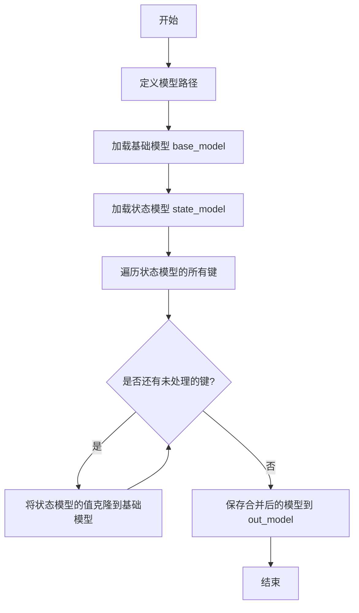
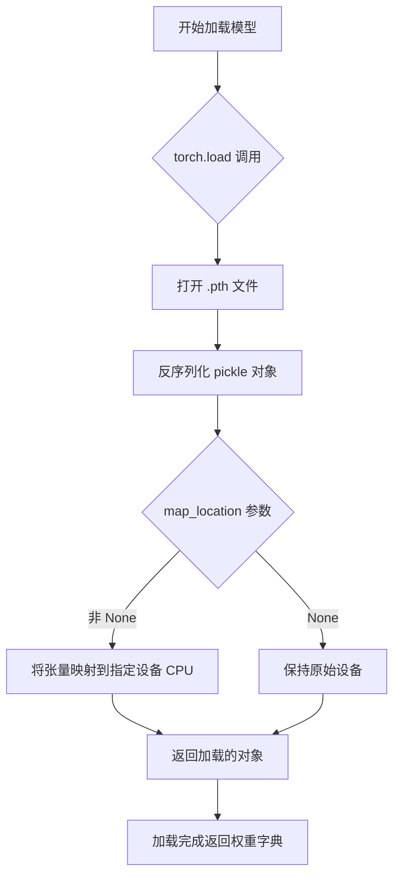
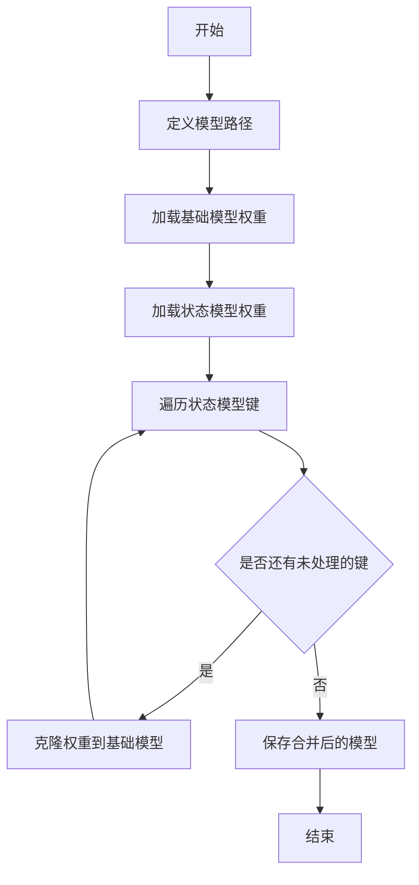
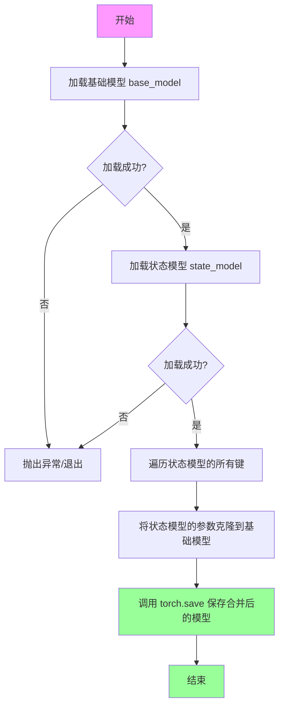
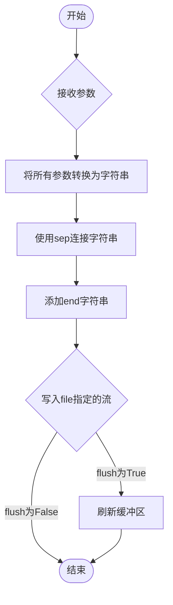

# `ChatRWKV\rwkv_state_merger.py` 详细设计文档

这是一个PyTorch模型权重合并脚本，用于将一个状态模型的权重合并到基础模型中，生成新的合并模型文件。

## 整体流程



## 类结构

```
该脚本为扁平化结构，无类层次结构
```

## 全局变量及字段


### `base_model`
    
文件系统路径，指向基础RWKV模型权重文件(.pth)

类型：`str`
    


    

## 全局函数及方法


### `torch.load`

`torch.load` 是 PyTorch 提供的模型加载函数，用于从磁盘读取之前通过 `torch.save` 保存的模型权重、对象或检查点。在本代码中，该函数被用于加载两个预训练模型的权重文件（base_model 和 state_model），并将它们加载到 CPU 设备上。

参数：

- `f`：`str` 或 `file object`，模型文件的路径或文件对象，指定要加载的 .pth 文件位置
- `map_location`：`str` 或 `torch.device`，指定如何将张量映射到目标设备，代码中传入 `"cpu"` 表示将模型权重加载到 CPU 内存中

返回值：`dict` 或 `torch.nn.Module`，返回加载的对象，通常是模型权重字典（state dict）或完整的模型对象

#### 流程图



#### 带注释源码

```python
# torch.load 函数签名（简化版）
# torch.load(f, map_location=None, pickle_module=..., weights_only=False, ...)

# 第一次调用：加载基础模型权重
print('loading...', base_model)  # 输出: loading... E:/RWKV-Runner/models/rwkv-final-v6-2.1-3b.pth
base = torch.load(base_model, map_location="cpu")
# 参数说明：
#   - base_model: 字符串，基础模型的 .pth 文件路径
#   - map_location="cpu": 字符串，将所有张量映射到 CPU 内存（无论原始保存时在什么设备）
# 返回值：base 是一个 dict，包含了模型的所有权重参数（key 为参数名，value 为张量）

# 第二次调用：加载状态模型权重
print('loading...', state_model)  # 输出: loading... E:/RWKV-Runner/models/rwkv-x060-chn_single_round_qa-3B-20240505-ctx1024.pth
state = torch.load(state_model, map_location="cpu")
# 参数说明：
#   - state_model: 字符串，需要合并的状态模型的 .pth 文件路径
#   - map_location="cpu": 同样将权重加载到 CPU
# 返回值：state 是一个 dict，包含要合并的模型权重
```


### `全局脚本流程`

该脚本用于合并两个PyTorch模型权重文件，将状态模型的权重覆盖到基础模型上，并保存为新的模型文件。

#### 文件的整体运行流程

1. 定义三个模型文件路径（基础模型、状态模型、输出模型）
2. 使用torch.load加载基础模型权重到内存
3. 使用torch.load加载状态模型权重到内存
4. 遍历状态模型的键，将状态模型的权重克隆并赋值给基础模型（覆盖同名键）
5. 使用torch.save将合并后的模型保存到输出路径

#### 全局变量信息

| 变量名称 | 类型 | 描述 |
|---------|------|------|
| `base_model` | `str` | 基础模型权重文件路径 |
| `state_model` | `str` | 状态模型权重文件路径 |
| `out_model` | `str` | 输出（合并后）模型保存路径 |
| `base` | `dict` | 基础模型的权重字典 |
| `state` | `dict` | 状态模型的权重字典 |

#### 流程图



#### 带注释源码

```python
import torch  # 导入PyTorch库，用于模型加载和保存

# 模型文件路径定义
base_model = 'E:/RWKV-Runner/models/rwkv-final-v6-2.1-3b.pth'  # 基础模型路径（将被覆盖）
state_model = 'E:/RWKV-Runner/models/rwkv-x060-chn_single_round_qa-3B-20240505-ctx1024.pth'  # 状态模型路径（提供新权重）
out_model = 'E:/RWKV-Runner/models/rwkv-final-v6-2.1-3b-20240505.pth'  # 输出模型路径

print('loading...', base_model)  # 打印加载信息
# 加载基础模型权重，使用cpu加载（map_location="cpu"）
base = torch.load(base_model, map_location="cpu")

print('loading...', state_model)  # 打印加载信息
# 加载状态模型权重，使用cpu加载
state = torch.load(state_model, map_location="cpu")

# 遍历状态模型的所有键
for k in list(state.keys()):
    # 将状态模型的权重克隆并赋值给基础模型（覆盖同名键）
    base[k] = state[k].clone()

print('saving...', out_model)  # 打印保存信息
# 将合并后的模型保存到输出路径
torch.save(base, out_model)
```

#### 关键组件信息

| 组件名称 | 描述 |
|---------|------|
| `torch.load` | PyTorch模型加载函数，支持从磁盘加载序列化模型 |
| `torch.save` | PyTorch模型保存函数，支持将模型权重保存到磁盘 |
| `.clone()` | Tensor复制方法，用于深拷贝权重数据 |

#### 潜在的技术债务或优化空间

1. **错误处理缺失**：没有对文件路径有效性、文件完整性、模型键匹配性进行验证
2. **硬编码路径**：模型路径直接硬编码，应考虑使用配置文件或命令行参数
3. **内存效率**：使用`.clone()`会复制完整权重，对于大模型可能导致内存翻倍，可考虑直接引用或使用更高效的内存管理
4. **日志完善**：缺少详细的日志记录，无法追踪合并过程中的详细信息
5. **配置灵活性**：不支持选择性合并（即只合并部分键）

#### 其它项目

**设计目标与约束**
- 目标：将状态模型的权重合并到基础模型中，实现模型权重的叠加
- 约束：状态模型的键将完全覆盖基础模型的同名键

**错误处理与异常设计**
- 未实现任何异常捕获机制
- 建议添加：文件不存在检查、模型格式验证、键匹配警告等

**数据流与状态机**
- 数据流：磁盘文件 → torch.load → 内存字典 → torch.save → 磁盘文件
- 状态：LOADING → MERGING → SAVING → COMPLETE

**外部依赖与接口契约**
- 依赖：`torch` 库
- 接口契约：输入为两个.pth文件路径，输出为合并后的.pth文件


### `torch.save`

该脚本通过加载预训练的基础模型和微调状态模型，将状态模型中的权重参数合并到基础模型中，最终保存为新的合并模型文件，实现模型权重的增量更新或模型融合功能。

#### 流程图



#### 带注释源码

```python
import torch  # 导入PyTorch库，用于模型加载和保存

# 定义模型文件路径
base_model = 'E:/RWKV-Runner/models/rwkv-final-v6-2.1-3b.pth'  # 基础预训练模型路径
state_model = 'E:/RWKV-Runner/models/rwkv-x060-chn_single_round_qa-3B-20240505-ctx1024.pth'  # 增量状态模型路径
out_model = 'E:/RWKV-Runner/models/rwkv-final-v6-2.1-3b-20240505.pth'  # 输出合并模型路径

print('loading...', base_model)
# 从磁盘加载基础模型到CPU内存（map_location="cpu"确保在CPU上加载）
base = torch.load(base_model, map_location="cpu")

print('loading...', state_model)
# 从磁盘加载状态模型到CPU内存
state = torch.load(state_model, map_location="cpu")

# 遍历状态模型的所有参数字段键
for k in list(state.keys()):
    # 将状态模型的参数克隆并赋值给基础模型，实现权重合并
    # clone()创建张量的副本，避免共享内存导致的潜在问题
    base[k] = state[k].clone()

print('saving...', out_model)
# 将合并后的模型字典保存到指定路径，使用torch.save函数
# 参数base: 要保存的Python对象（字典类型，包含模型权重）
# 参数out_model: 保存路径（字符串或文件对象）
torch.save(base, out_model)
```

---

### 关键组件信息

| 组件名称 | 描述 |
|---------|------|
| `base_model` | 基础预训练模型文件路径 |
| `state_model` | 增量微调状态模型文件路径 |
| `out_model` | 输出合并模型保存路径 |
| `base` | 加载后的基础模型参数字典 |
| `state` | 加载后的状态模型参数字典 |
| `torch.load` | PyTorch模型加载函数 |
| `torch.save` | PyTorch模型保存函数 |

---

### 潜在的技术债务或优化空间

1. **硬编码路径问题**：模型路径直接写死在代码中，缺乏灵活性，应考虑使用配置文件或命令行参数
2. **错误处理缺失**：未对文件加载失败、路径不存在等情况进行异常捕获和处理
3. **内存效率问题**：使用`clone()`复制张量会占用额外内存，对于大模型可能导致内存不足
4. **缺乏日志记录**：仅使用print输出，缺少统一的日志级别管理
5. **覆盖风险**：输出路径可能覆盖已有文件，缺乏确认机制

---

### 其它项目

#### 设计目标与约束
- **目标**：将微调模型的权重合并到基础模型中，实现模型权重的增量更新
- **约束**：两个模型的结构应兼容（键名匹配），否则合并后模型可能无法正常使用

#### 错误处理与异常设计
- 当前代码无try-except保护，文件不存在或格式错误时会抛出Python异常
- 建议添加：文件存在性检查、加载异常捕获、键不匹配警告等

#### 数据流与状态机
1. 加载状态（Loading）→ 合并状态（Merging）→ 保存状态（Saving）
2. 数据流：base_model → base字典 + state字典 → base字典（合并后）→ out_model

#### 外部依赖与接口契约
- 依赖：PyTorch库（torch）
- 输入：两个有效的.pth模型文件
- 输出：合并后的.pth模型文件


### print

Python内置的打印函数，用于将对象以文本形式输出到标准输出流（默认为控制台），支持多个参数输出、分隔符设置、输出结尾自定义及输出流指定。

参数：

- `*args`：`任意类型`，要打印的对象，可接受零个或多个位置参数，函数会将每个参数转换为字符串并连接输出
- `sep`：`str`，可选，指定多个参数之间的分隔符，默认为一个空格字符`' '`
- `end`：`str`，可选，指定打印结束时的字符串，默认为换行符`'\n'`
- `file`：`可写对象`，可选，指定输出目标文件流，默认为`sys.stdout`
- `flush`：`bool`，可选，指定是否立即刷新输出缓冲区，默认为`False`

返回值：`None`，该函数不返回任何值

#### 流程图



#### 带注释源码

```python
# 代码中使用的print语句

# 第一个print调用：输出加载基础模型的信息
print('loading...', base_model)
# 'loading...'：静态字符串，作为输出前缀
# base_model：变量，存储基础模型文件路径 'E:/RWKV-Runner/models/rwkv-final-v6-2.1-3b.pth'
# 实际输出：loading... E:/RWKV-Runner/models/rwkv-final-v6-2.1-3b.pth

# 第二个print调用：输出加载状态模型的信息
print('loading...', state_model)
# 'loading...'：静态字符串前缀
# state_model：变量，存储状态模型文件路径 'E:/RWKV-Runner/models/rwkv-x060-chn_single_round_qa-3B-20240505-ctx1024.pth'
# 实际输出：loading... E:/RWKV-Runner/models/rwkv-x060-chn_single_round_qa-3B-20240505-ctx1024.pth

# 第三个print调用：输出保存模型的信息
print('saving...', out_model)
# 'saving...'：静态字符串，表示保存操作
# out_model：变量，存储输出模型文件路径 'E:/RWKV-Runner/models/rwkv-final-v6-2.1-3b-20240505.pth'
# 实际输出：saving... E:/RWKV-Runner/models/rwkv-final-v6-2.1-3b-20240505.pth
```


## 关键组件


## 一段话描述

该代码是一个PyTorch模型权重合并脚本，用于将微调后的状态模型（state_model）的权重克隆并覆盖到基础模型（base_model）上，最终保存为合并后的输出模型（out_model），常见于大语言模型（如RWKV）的增量训练或微调模型与基础模型的权重融合场景。

## 文件的整体运行流程

1. 定义三个模型文件路径：基础模型、状态模型、输出模型
2. 使用`torch.load()`将基础模型加载到CPU内存
3. 使用`torch.load()`将状态模型加载到CPU内存
4. 遍历状态模型的所有键，通过`.clone()`方法将状态模型的张量复制到基础模型中
5. 使用`torch.save()`将合并后的模型保存到指定输出路径

## 全局变量详情

### base_model

- 类型：str
- 描述：基础模型的权重文件路径，通常为原始预训练模型

### state_model

- 类型：str
- 描述：状态模型的权重文件路径，通常为微调或增量训练后的模型

### out_model

- 类型：str
- 描述：合并后输出模型的保存路径

### base

- 类型：dict
- 描述：加载后的基础模型权重字典，键为模型参数名称，值为PyTorch张量

### state

- 类型：dict
- 描述：加载后的状态模型权重字典，键为模型参数名称，值为PyTorch张量

## 全局函数详情

### torch.load()

- 参数：
  - f：模型文件路径（str）
  - map_location：设备映射，设置为"cpu"表示加载到CPU内存
- 返回值类型：dict
- 返回值描述：返回模型权重字典，包含所有模型参数

### torch.save()

- 参数：
  - obj：要保存的对象（dict）
  - f：输出文件路径（str）
- 返回值类型：None
- 返回值描述：无返回值，将对象序列化保存到指定路径

### list()

- 参数：
  - iterable：可迭代对象（dict_keys）
- 返回值类型：list
- 返回值描述：返回字典键的列表，用于遍历

### .clone()

- 参数：无
- 返回值类型：Tensor
- 返回值描述：返回张量的深拷贝，确保不共享底层内存

## 关键组件信息

### 模型权重合并器

负责将两个PyTorch模型权重字典进行合并，使用克隆操作确保权重数据的独立性

### 路径配置模块

定义三个模型文件的路径常量，用于模型的加载和保存操作

## 潜在的技术债务或优化空间

1. **缺少错误处理**：未对文件路径有效性、模型加载失败、键不匹配等情况进行异常捕获和处理
2. **硬编码路径**：模型路径直接硬编码，缺乏灵活性，应考虑使用配置文件或命令行参数
3. **内存效率**：未使用`mmap`或流式加载，大模型可能占用大量内存
4. **键冲突处理**：当前直接覆盖，可能丢失base_model中独有的键，未提供合并策略选项
5. **设备适配性**：固定加载到CPU，未考虑GPU环境下的优化
6. **进度反馈**：缺乏加载和保存进度提示，大模型操作时用户体验不佳

## 其它项目

### 设计目标与约束

- 目标：将微调模型的权重合并到基础模型中
- 约束：使用CPU加载，输出为单个合并后的模型文件

### 错误处理与异常设计

- 缺少文件不存在、权限问题、模型格式错误等异常处理
- 建议添加`try-except`块捕获`FileNotFoundError`、`OSError`等异常

### 数据流与状态机

- 数据流：base_model → torch.load() → base dict → 键值克隆 → out_model → torch.save()
- 状态：LOADING → MERGING → SAVING → COMPLETED

### 外部依赖与接口契约

- 依赖：PyTorch库（torch）
- 接口：仅使用`torch.load`和`torch.save`两个公开API


## 问题及建议


### 已知问题

- **缺乏异常处理**：代码未对文件不存在、模型加载失败、磁盘空间不足等情况进行异常捕获，可能导致程序崩溃且无明确的错误信息
- **内存效率低下**：使用`state[k].clone()`会创建完整的张量副本，导致内存占用翻倍，对于大型模型（3B参数）可能引发内存溢出
- **硬编码路径**：模型路径直接写在代码中，缺乏灵活性和可配置性
- **无进度反馈**：合并大模型时无进度条或日志输出，用户无法感知执行状态
- **键值覆盖逻辑不明确**：直接覆盖base中存在的键，若base_model和state_model有重叠的权重键，state_model的权重会覆盖base_model的权重，这种行为可能是隐式的设计缺陷
- **缺乏模型验证**：加载后未验证模型完整性、键匹配度或参数有效性
- **资源未显式释放**：加载完成后未显式删除中间变量（state），依赖Python垃圾回收

### 优化建议

- **添加异常处理**：使用try-except包裹关键操作，捕获FileNotFoundError、RuntimeError等异常，并输出友好错误信息
- **优化内存使用**：直接赋值`base[k] = state[k]`而非克隆，或使用`state[k].clone_(base[k])`进行原地操作；处理完毕后显式删除`del state`释放内存
- **命令行参数化**：使用argparse模块将路径改为可配置的命令行参数，便于在不同环境中使用
- **添加进度显示**：在循环中添加进度条（如tqdm库）或打印当前处理的键数量
- **添加模型验证**：在合并前检查键的兼容性，合并后验证模型参数的合理性（如检查NaN、Inf值）
- **使用新保存格式**：使用`torch.save(base, out_model, _use_new_zipfile_serialization=True)`采用更高效的zipfile序列化格式
- **代码模块化**：将合并逻辑封装为函数，添加类型注解和文档字符串，提高可维护性和可测试性
- **考虑设备优化**：对于大模型加载，可使用`mmap_file=True`参数减少内存占用


## 其它


### 设计目标与约束

本代码旨在将两个RWKV模型权重文件合并为一个单一的模型文件，其中state_model的权重会覆盖base_model中的同名权重。约束条件包括：两个模型文件必须具有兼容的权重结构，输出路径必须具有写入权限，磁盘空间必须足够存储合并后的模型文件。

### 错误处理与异常设计

代码缺少错误处理机制，应添加以下异常处理：文件不存在时抛出FileNotFoundError并给出友好提示；磁盘空间不足时抛出OSError并建议清理空间；模型权重结构不兼容时抛出RuntimeError并说明冲突的键名；内存不足时抛出MemoryError并建议关闭其他程序。

### 外部依赖与接口契约

主要依赖为PyTorch库（torch），版本需兼容torch.load和torch.save函数。输入接口为三个文件路径（字符串类型），输出接口为合并后的模型文件。模型文件格式为PyTorch的.pth格式，采用pickle序列化。

### 性能考虑

当前实现使用CPU加载和保存模型，大模型场景下性能较低。优化方向包括：使用map_location="cuda"利用GPU加速；采用内存映射（mmap）减少内存占用；分块处理大模型避免内存溢出；考虑使用torch.save的optimize参数压缩输出文件。

### 安全性考虑

代码直接读取任意路径的模型文件，存在路径遍历攻击风险。建议添加路径验证逻辑，限制输入路径在允许的目录范围内。同时模型文件来源需可信，防止加载恶意构造的权重文件。

### 兼容性考虑

模型合并基于键名匹配，要求两个模型的键集合存在包含或重叠关系。不同版本的RWKV模型可能存在键名或结构差异，需明确支持的模型版本范围。建议在代码中添加版本检查逻辑。

### 配置管理

当前配置以硬编码方式存在代码中，建议重构为配置文件（如JSON或YAML）或命令行参数，提升灵活性和可维护性。配置项包括：输入模型路径、输出模型路径、日志级别等。

### 日志与监控

代码仅使用print输出基本状态信息，建议引入标准日志模块（logging）实现分级日志输出，支持配置日志级别和输出格式，便于生产环境的问题排查和运行监控。

### 部署要求

部署环境需要安装PyTorch库，硬件要求取决于模型文件大小（3B模型约6GB内存）。建议提供Dockerfile或环境配置文件，确保部署一致性。

### 测试考虑

建议添加单元测试覆盖以下场景：正常合并流程、文件不存在处理、权限不足处理、模型键不兼容处理、内存不足模拟。可使用pytest框架并mock torch相关函数实现隔离测试。


    