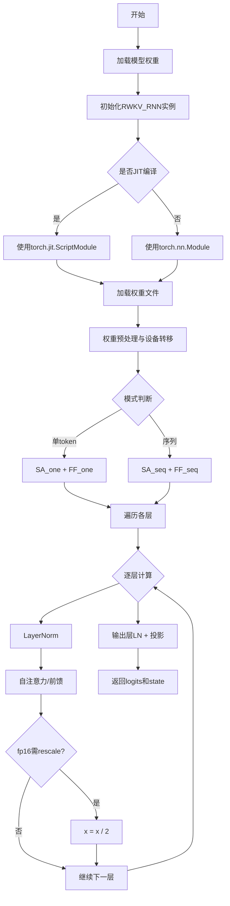
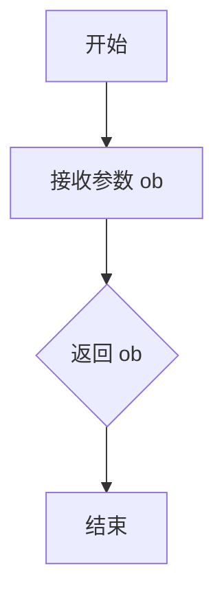
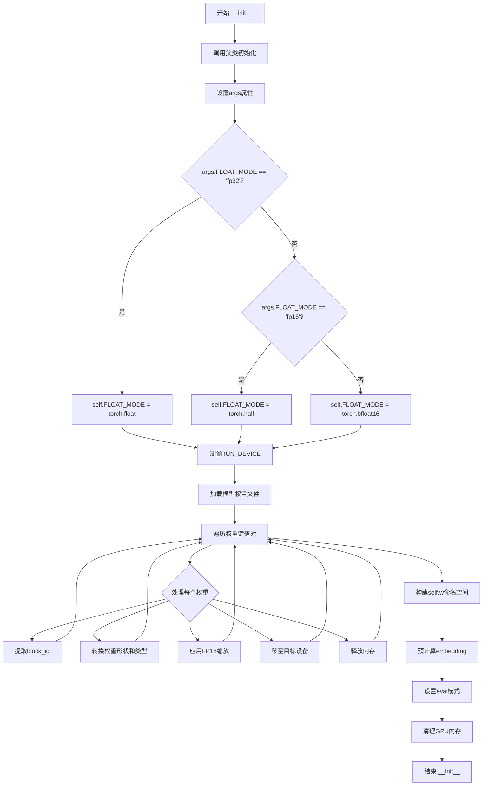
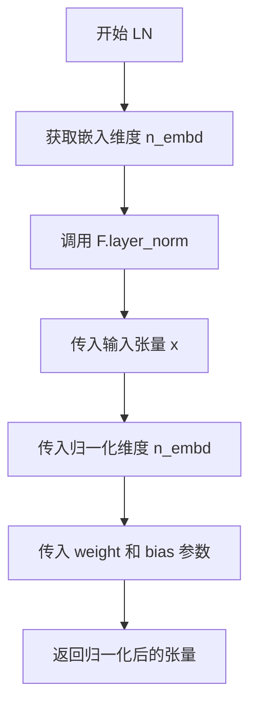

# `ChatRWKV\src\model_run.py` 详细设计文档

RWKV是一个基于RNN架构的大语言模型实现，采用独特的时间混合机制实现高效推理，支持一次性处理单个token(SA_one/FF_one)和完整序列(SA_seq/FF_seq)两种模式，通过WKV计算实现类似Transformer的自注意力效果，同时具备RNN的线性推理复杂度优势。

## 整体流程



## 类结构

```
RWKV_RNN (主模型类)
├── 权重命名空间 self.w
│   ├── emb (embedding)
│   ├── blocks[i].att (注意力参数)
│   ├── blocks[i].ffn (前馈参数)
│   └── ln_out (输出层归一化)
└── 方法
    ├── LN (层归一化)
    ├── FF_one (单token前馈)
    ├── FF_seq (序列前馈)
    ├── SA_one (单token自注意力)
    ├── SA_seq (序列自注意力)
    └── forward (主前向传播)
```

## 全局变量及字段


### `RWKV_JIT_ON`
    
JIT编译开关，从环境变量读取，用于控制是否启用PyTorch JIT编译

类型：`int`
    


### `RWKV_RESCALE_LAYER`
    
层重缩放因子，用于FP16模式下每6层对激活值进行缩放以防止溢出

类型：`int`
    


### `MyModule`
    
模块基类，根据JIT开关选择torch.nn.Module或torch.jit.ScriptModule

类型：`Type[torch.nn.Module]`
    


### `MyFunction`
    
函数装饰器，根据JIT开关选择__nop函数或torch.jit.script_method

类型：`Callable`
    


### `RWKV_RNN.args`
    
模型配置参数对象，包含FLOAT_MODE、RUN_DEVICE、MODEL_NAME、n_embd、n_layer、ctx_len等属性

类型：`object`
    


### `RWKV_RNN.FLOAT_MODE`
    
浮点数据类型，根据配置为torch.float、torch.half或torch.bfloat16

类型：`torch.dtype`
    


### `RWKV_RNN.RUN_DEVICE`
    
运行设备标识符，值为'cpu'或'cuda'开头用于指定计算设备

类型：`str`
    


### `RWKV_RNN.w`
    
权重命名空间，以层级结构存储所有模型权重参数

类型：`types.SimpleNamespace`
    
    

## 全局函数及方法


### `__nop`

该函数是一个空操作函数（No-Operation），在非JIT模式下作为函数装饰器的替代实现，用于直接返回传入的对象而不做任何处理。

参数：

- `ob`：`object`（任意类型，但在实际使用场景中多为 `torch.nn.Module` 类型），需要处理的模块对象

返回值：`object`，返回输入的对象本身，不做任何修改

#### 流程图



#### 带注释源码

```python
# 定义一个空操作函数，用于非JIT模式
# 当 RWKV_JIT_ON 为 0 时，不使用 torch.jit.script_method 装饰器
# 该函数直接返回传入的对象，不做任何处理
def __nop(ob):
    return ob  # 直接返回输入对象，无任何操作
```


### `RWKV_RNN.__init__`

这是RWKV模型的RNN实现类的初始化方法，负责加载预训练权重、配置浮点运算模式（fp32/fp16/bf16）、处理和转换权重矩阵、对嵌入层进行预计算，并将模型设置为评估模式。

参数：

- `self`：`RWKV_RNN`，RWKV模型实例
- `args`：`object`，包含模型配置的对象，必须属性包括MODEL_NAME（模型文件路径）、FLOAT_MODE（浮点模式：fp32/fp16/bf16）、RUN_DEVICE（运行设备）、ctx_len（上下文长度）

返回值：无，返回None

#### 流程图



#### 带注释源码

```python
def __init__(self, args):
    """
    初始化RWKV_RNN模型
    
    参数:
        args: 包含以下属性的配置对象:
            - MODEL_NAME: 模型权重文件路径
            - FLOAT_MODE: 浮点模式 ('fp32', 'fp16', 'bf16')
            - RUN_DEVICE: 运行设备 ('cuda' 或 'cpu')
    """
    # 1. 调用父类Module的初始化方法
    super().__init__()
    
    # 2. 保存配置参数
    self.args = args
    
    # 3. 根据FLOAT_MODE设置浮点数据类型
    if args.FLOAT_MODE == 'fp32':
        self.FLOAT_MODE = torch.float       # 32位浮点
    elif args.FLOAT_MODE == 'fp16':
        self.FLOAT_MODE = torch.half         # 16位浮点
    elif args.FLOAT_MODE == 'bf16':
        self.FLOAT_MODE = torch.bfloat16     # Brain浮点
    self.RUN_DEVICE = args.RUN_DEVICE        # 保存运行设备
    
    # 4. 加载模型权重（使用torch.no_grad()避免梯度计算）
    with torch.no_grad():
        # 从磁盘加载权重字典
        w = torch.load(args.MODEL_NAME + '.pth', map_location='cpu')
        gc.collect()  # 垃圾回收释放内存
        
        # 从embedding权重获取模型维度信息
        args.n_embd = w['emb.weight'].shape[1]
        args.n_layer = 0  # 初始化层数为0
        
        keys = list(w.keys())  # 获取所有权重键
        print_need_newline = False
        
        # 5. 遍历并处理每个权重
        for x in keys:
            w[x].requires_grad = False  # 权重不需要梯度
            
            # 跳过embedding层和首个layer norm
            if x == 'emb.weight' or 'ln0' in x:
                continue
            
            # 提取block编号，计算总层数
            block_id = int(x.split('.')[1]) if ('blocks.' in x) else 0
            args.n_layer = max(args.n_layer, block_id+1)
            
            # 时间衰减权重：转置、转为float、负指数
            if '.time_' in x:
                w[x] = w[x].squeeze()  # 移除单维度
            
            # 线性层权重转置（矩阵乘法需求）
            if 'key.weight' in x or 'value.weight' in x or 'receptance.weight' in x or 'output.weight' in x:
                w[x] = w[x].t()
            
            # 时间衰减：转为float并取负指数
            if '.time_decay' in x:
                w[x] = w[x].float()
                w[x] = -torch.exp(w[x])
            # 时间首值：直接转float
            elif '.time_first' in x:
                w[x] = w[x].float()
            else:
                w[x] = w[x].to(dtype=self.FLOAT_MODE)  # 转为指定浮点类型
            
            # FP16模式下的缩放处理（防止溢出）
            if args.FLOAT_MODE == 'fp16':
                if 'att.output.weight' in x:
                    w[x] = w[x] / (2 ** int(block_id // RWKV_RESCALE_LAYER))
                if 'ffn.value.weight' in x:
                    w[x] = w[x] / (2 ** int(block_id // RWKV_RESCALE_LAYER))
            
            # 移动权重到指定设备
            if 'cuda' in args.RUN_DEVICE:
                w[x] = w[x].to(self.RUN_DEVICE)
            
            # FFN权重处理后清理GPU缓存
            if 'ffn.value.weight' in x:
                gc.collect()
                if 'cuda' in args.RUN_DEVICE:
                    torch.cuda.empty_cache()
            
            # 打印权重信息
            shape = w[x].shape
            shape = [i for i in shape if i != 1]  # 移除维度为1的
            if len(shape) > 1:
                shape = f"  {str(shape[0]).rjust(5)} {str(shape[1]).rjust(5)}"
            else:
                shape = f"  {str(shape[0]).rjust(5)}      "
            if block_id == 0:
                if print_need_newline:
                    print('\n', end = '')
                    print_need_newline = False
                print(x.ljust(32), str(w[x].dtype).replace('torch.', '').ljust(10), w[x].device, shape)
            else:
                print_need_newline = True
                print('.', end = '', flush = True)
    
    # 打印模型结构信息
    print(f'\nn_layer {args.n_layer} n_embd {args.n_embd} ctx_len {args.ctx_len}')
    
    # 6. 构建嵌套命名空间self.w存储权重
    keys = list(w.keys())
    self.w = types.SimpleNamespace()
    for x in keys:
        xx = x.split('.')
        here = self.w
        for i in range(len(xx)):
            if xx[i].isdigit():
                ii = int(xx[i])
                if ii not in here:
                    here[ii] = types.SimpleNamespace()
                here = here[ii]
            else:
                if i == len(xx) - 1:
                    setattr(here, xx[i], w[x])  # 设置最终属性
                elif not hasattr(here, xx[i]):
                    if xx[i+1].isdigit():
                        setattr(here, xx[i], {})  # 数字索引用字典
                    else:
                        setattr(here, xx[i], types.SimpleNamespace())
                here = getattr(here, xx[i])
    
    # 7. 预计算embedding（LayerNorm）
    with torch.no_grad():
        try:
            x = self.LN(self.w.emb.weight, self.w.blocks[0].ln0)
        except:
            # 备用方案：使用F.layer_norm
            x = F.layer_norm(self.w.emb.weight.float(), (self.args.n_embd,), 
                           weight=self.w.blocks[0].ln0.weight.float(), 
                           bias=self.w.blocks[0].ln0.bias.float())
        self.w.emb.weight = x.to(dtype=self.FLOAT_MODE)
    
    # 8. 设置为评估模式
    self.eval()
    
    # 9. 最终内存清理
    gc.collect()
    if 'cuda' in args.RUN_DEVICE:
        torch.cuda.empty_cache()
```


### `RWKV_RNN.LN`

实现 RWKV 模型中的 Layer Normalization（层归一化）操作，对输入张量进行归一化处理，利用 PyTorch 的 `F.layer_norm` 函数实现。

参数：

- `self`：RWKV_RNN 类实例，隐式参数
- `x`：`torch.Tensor`，需要进行归一化的输入张量
- `w`：包含 `weight` 和 `bias` 属性的对象，LayerNorm 的可学习参数（权重和偏置）

返回值：`torch.Tensor`，返回归一化后的张量

#### 流程图



#### 带注释源码

```python
def LN(self, x, w):
    """
    Layer Normalization 层的实现
    
    参数:
        x: 输入张量，需要进行归一化处理
        w: 包含 weight 和 bias 属性的参数对象，用于 LayerNorm 的可学习参数
    
    返回值:
        归一化后的张量
    """
    # 使用 PyTorch 的 Layer Normalization 实现
    # 参数:
    #   - x: 输入张量
    #   - (self.args.n_embd,): 归一化的特征维度
    #   - weight=w.weight: 可学习的缩放参数
    #   - bias=w.bias: 可学习的偏置参数
    return F.layer_norm(x, (self.args.n_embd,), weight=w.weight, bias=w.bias)
```


### `RWKV_RNN.FF_one`

该函数实现了RWKV模型中单个时间步的Feed-Forward（前馈）网络计算，负责处理当前输入token的状态更新与输出，使用time-mix机制融合历史状态信息，并通过ReLU激活和Sigmoid门控计算最终输出。

参数：

- `self`：`RWKV_RNN`，RWKV模型的主类实例，隐式参数
- `x`：`torch.Tensor`，当前输入的token嵌入向量，形状为 `[n_embd]`
- `state`：`torch.Tensor`，模型状态数组，用于存储历史信息，形状为 `[n_layer * 5, n_embd]`
- `i`：`int`，当前层的索引，用于计算状态数组中的偏移位置
- `time_mix_k`：`torch.Tensor`，用于key的时间混合权重张量，控制历史状态对当前key的贡献比例
- `time_mix_r`：`torch.Tensor`，用于receptance的时间混合权重张量，控制历史状态对当前receptance的贡献比例
- `kw`：`torch.Tensor`，key的权重矩阵，用于将输入投影到key空间
- `vw`：`torch.Tensor`，value的权重矩阵，用于将输入投影到value空间
- `rw`：`torch.Tensor`，receptance的权重矩阵，用于计算门控信号

返回值：`torch.Tensor`，返回前馈网络的输出结果，形状为 `[n_embd]`，计算方式为门控信号与key-value乘积的逐元素乘积

#### 流程图

```mermaid
flowchart TD
    A[开始 FF_one] --> B[从state读取历史状态xx]
    B --> C[计算time-mix后的key: xk]
    C --> D[计算time-mix后的receptance: xr]
    D --> E[更新state中对应层的状态]
    E --> F[计算receptance门控: r = sigmoid(xr @ rw)]
    F --> G[计算key: k = square.relu(xk @ kw)]
    G --> H[计算key-value乘积: kv = k @ vw]
    H --> I[返回输出: r * kv]
```

#### 带注释源码

```python
@MyFunction
def FF_one(self, x, state, i:int, time_mix_k, time_mix_r, kw, vw, rw):
    """
    RWKV模型单步前馈网络计算
    
    参数:
        x: 当前输入token的嵌入向量 [n_embd]
        state: 模型状态数组 [n_layer * 5, n_embd]
        i: 当前层索引
        time_mix_k: key的时间混合权重
        time_mix_r: receptance的时间混合权重
        kw: key权重矩阵
        vw: value权重矩阵
        rw: receptance权重矩阵
    
    返回:
        前馈网络输出 [n_embd]
    """
    # 从状态数组中提取当前层的历史状态（ffn_xx）
    # state[5*i+0] 存储第i层的ffn历史状态
    xx = state[5*i+0].to(dtype=self.FLOAT_MODE)
    
    # 使用time-mix机制计算key: 融合当前输入与历史状态
    # 公式: xk = x * time_mix_k + xx * (1 - time_mix_k)
    xk = x * time_mix_k + xx * (1 - time_mix_k)
    
    # 使用time-mix机制计算receptance: 融合当前输入与历史状态
    # 公式: xr = x * time_mix_r + xx * (1 - time_mix_r)
    xr = x * time_mix_r + xx * (1 - time_mix_r)
    
    # 更新状态数组中的历史状态为当前输入
    # 存储float类型以保持精度
    state[5*i+0] = x.float()

    # 计算receptance门控信号: 使用sigmoid函数将值压缩到(0,1)
    # 公式: r = sigmoid(xr @ rw)
    r = torch.sigmoid(xr @ rw)
    
    # 计算key: 先通过ReLU激活，再平方
    # 公式: k = square(relu(xk @ kw))
    # 使用ReLU确保正值，square用于非线性变换
    k = torch.square(torch.relu(xk @ kw))
    
    # 计算key-value乘积
    # 公式: kv = k @ vw
    kv = k @ vw
    
    # 最终输出: 门控信号与key-value乘积的逐元素乘积
    # 公式: return = r * kv
    # 这实现了类似门控机制: r控制有多少kv信息通过
    return r * kv
```


### `RWKV_RNN.FF_seq`

`FF_seq` 是 RWKV 模型中前馈神经网络（Feed Forward）模块的序列模式实现，用于处理变长序列输入。该方法通过时间混合机制融合当前输入与历史状态，计算 key、value 和 receptance 通道，并使用门控机制生成输出。

参数：

- `self`：RWKV_RNN，模型实例（隐式参数）
- `x`：torch.Tensor，当前层的输入序列，形状为 (seq_len, n_embd)
- `state`：torch.Tensor，模型状态张量，存储历史信息用于自回归计算
- `i`：int，当前层的索引，用于访问对应的状态位置
- `time_mix_k`：tensor，时间混合权重，用于 key 通道的时序信息融合
- `time_mix_r`：tensor，时间混合权重，用于 receptance 通道的时序信息融合
- `kw`：tensor，key 权重矩阵，形状为 (n_embd, n_embd)
- `vw`：tensor，value 权重矩阵，形状为 (n_embd, n_embd)
- `rw`：tensor，receptance 权重矩阵，形状为 (n_embd, n_embd)

返回值：`torch.Tensor`，形状为 (seq_len, n_embd)，经过门控计算后的前馈输出

#### 流程图

```mermaid
flowchart TD
    A[输入 x, state, i, 权重] --> B[拼接历史状态<br/>xx = concat state[5*i+0], x[:-1]]
    B --> C[计算混合 key<br/>xk = x * time_mix_k + xx * (1 - time_mix_k)]
    C --> D[计算混合 receptance<br/>xr = x * time_mix_r + xx * (1 - time_mix_r)]
    D --> E[更新状态<br/>state[5*i+0] = x[-1]]
    E --> F[计算 receptance 门控<br/>r = sigmoid(xr @ rw)]
    F --> G[计算 key<br/>k = square relu xk @ kw]
    G --> H[计算 value<br/>kv = k @ vw]
    H --> I[输出门控结果<br/>return r * kv]
```

#### 带注释源码

```
@MyFunction
def FF_seq(self, x, state, i:int, time_mix_k, time_mix_r, kw, vw, rw):
    # 步骤1: 拼接历史状态与当前输入序列
    # 将上一时刻的隐藏状态与当前序列（除最后一个元素）拼接
    # state[5*i+0] 存储 FFN 的时间状态信息
    xx = torch.cat((state[5*i+0].to(dtype=self.FLOAT_MODE).unsqueeze(0), x[:-1,:]))
    
    # 步骤2: 时间混合计算 key
    # 使用 time_mix_k 在当前输入与历史状态之间进行线性插值
    # 实现类似 RNN 的历史信息融合机制
    xk = x * time_mix_k + xx * (1 - time_mix_k)
    
    # 步骤3: 时间混合计算 receptance
    # 使用 time_mix_r 融合历史信息，控制信息的保留与遗忘
    xr = x * time_mix_r + xx * (1 - time_mix_r)
    
    # 步骤4: 更新状态
    # 将当前序列最后一个 token 的隐藏状态保存到 state
    # 供下一个序列计算时使用
    state[5*i+0] = x[-1,:].float()

    # 步骤5: 计算 receptance 门控
    # 使用 sigmoid 函数将 receptance 权重归一化到 (0,1)
    # 用于控制输出信息的通过量
    r = torch.sigmoid(xr @ rw)
    
    # 步骤6: 计算 key 并应用 ReLU 激活
    # 先通过线性变换，再用 ReLU 激活（负值置零）
    # 最后平方以增强非线性特性
    k = torch.square(torch.relu(xk @ kw))
    
    # 步骤7: 计算 value
    # 将激活后的 key 与 value 权重相乘
    kv = k @ vw
    
    # 步骤8: 门控输出
    # 将 receptance 门控值与 key-value 积相乘
    # 实现类似 LSTM 的门控机制，控制信息流动
    return r * kv
```


### `RWKV_RNN.SA_one`

该函数是 RWKV 模型中单步自注意力（Self-Attention One-Step）计算的核心实现，负责处理单个 token 的注意力计算、状态更新以及 WKV（Weighted Key-Value）机制的运算，是 RWKV 递归神经网络处理时序数据的关键组件。

参数：

- `self`：RWKV_RNN 类实例，包含了模型的权重和配置
- `x`：`torch.Tensor`，当前层的输入 token 表征向量，形状为 `[n_embd]`
- `state`：`list[torch.Tensor]` 或 `torch.Tensor`，模型状态向量，包含 5*i+1 到 5*i+4 四个状态元素，分别存储注意力输出 aa、bb、pp（累积注意力状态）
- `i`：`int`，当前层的索引，用于计算状态数组的偏移量
- `time_mix_k`：`torch.Tensor`，时间混合权重，用于 key 的时间步间插值
- `time_mix_v`：`torch.Tensor`，时间混合权重，用于 value 的时间步间插值
- `time_mix_r`：`torch.Tensor`，时间混合权重，用于 receptance 的时间步间插值
- `time_first`：`torch.Tensor`，时间注意力偏置，控制第一时间步的注意力权重
- `time_decay`：`torch.Tensor`，时间衰减因子，控制历史信息的衰减率
- `kw`：`torch.Tensor`，key 权重矩阵
- `vw`：`torch.Tensor`，value 权重矩阵
- `rw`：`torch.Tensor`，receptance 权重矩阵，用于门控
- `ow`：`torch.Tensor`，output 权重矩阵，将注意力输出映射回模型空间

返回值：`torch.Tensor`，经过注意力机制处理后的输出向量，形状为 `[n_embd]`

#### 流程图

```mermaid
flowchart TD
    A[开始 SA_one] --> B[从 state 提取注意力状态]
    B --> C[计算混合表征: xk, xv, xr]
    C --> D[更新 state[5*i+1] = x]
    E[计算门控 r = sigmoid(xr @ rw)] --> F[计算 k, v]
    F --> G[获取状态 aa, bb, pp]
    G --> H[第一阶段注意力计算]
    H --> I[更新累积状态 aa, bb]
    I --> J[第二阶段注意力计算]
    J --> K[更新最终状态 aa, bb, pp]
    K --> L[计算 wkv = a/b]
    L --> M[输出 r * wkv @ ow]
```

#### 带注释源码

```python
@MyFunction
def SA_one(self, x, state, i:int, time_mix_k, time_mix_v, time_mix_r, time_first, time_decay, kw, vw, rw, ow):
    # 从状态中提取上一时间步的注意力输出作为当前输入的上下文参考
    # state[5*i+1] 存储的是该层上一时间步的输出向量
    xx = state[5*i+1].to(dtype=self.FLOAT_MODE)
    
    # 使用时间混合机制对输入进行平滑处理，实现时序信息的插值
    # xk: 用于计算 key 的混合表征，结合当前输入和历史状态
    xk = x * time_mix_k + xx * (1 - time_mix_k)
    # xv: 用于计算 value 的混合表征
    xv = x * time_mix_v + xx * (1 - time_mix_v)
    # xr: 用于计算 receptance（门控信号）的混合表征
    xr = x * time_mix_r + xx * (1 - time_mix_r)
    
    # 将当前输入存入状态，供下一时间步使用
    state[5*i+1] = x.float()

    # 计算 receptance（门控向量），使用 sigmoid 激活函数将值域限制在 (0,1)
    r = torch.sigmoid(xr @ rw)
    
    # 将 key 和 value 投影到浮点精度空间进行注意力计算
    # k: 查询向量
    k = (xk @ kw).float()
    # v: 值向量
    v = (xv @ vw).float()

    # 从状态中提取累积注意力状态
    # aa: 累积的 a 值（分子部分）
    # bb: 累积的 b 值（分母部分）
    # pp: 历史峰值位置，用于数值稳定性的指数运算
    aa = state[5*i+2]
    bb = state[5*i+3]
    pp = state[5*i+4]
    
    # 第一阶段：计算包含 time_first 的注意力贡献
    # 将第一时间偏置加到 key 上
    ww = time_first + k
    # 使用 max 操作找到最大值位置，用于数值稳定性
    p = torch.maximum(pp, ww)
    # 计算指数衰减因子
    e1 = torch.exp(pp - p)
    e2 = torch.exp(ww - p)
    # 累积新的 a 和 b 值
    a = e1 * aa + e2 * v
    b = e1 * bb + e2
    
    # 第二阶段：计算 time_decay 衰减后的注意力贡献
    # 对历史状态应用时间衰减
    ww = pp + time_decay
    # 再次使用 max 操作确保数值稳定性
    p = torch.maximum(ww, k)
    # 计算指数衰减因子
    e1 = torch.exp(ww - p)
    e2 = torch.exp(k - p)
    
    # 更新状态中的累积注意力值
    state[5*i+2] = e1 * aa + e2 * v
    state[5*i+3] = e1 * bb + e2
    state[5*i+4] = p
    
    # 计算最终的 WKV（Weighted Key-Value）向量
    # 这里使用 a/b 进行归一化
    wkv = (a / b).to(dtype=self.FLOAT_MODE)
    
    # 将门控向量 r 与 WKV 相乘，并通过输出权重矩阵映射回模型空间
    return (r * wkv) @ ow
```


### `RWKV_RNN.SA_seq`

这是 RWKV 模型中用于处理序列模式的自注意力（Self-Attention）计算方法，采用 RWKV 特有的时间混合机制和状态更新策略，在序列长度为 1 时会调用 SA_one 方法。

参数：

- `self`：RWKV_RNN 类实例
- `x`：`torch.Tensor`，输入的 token 嵌入序列，形状为 [seq_len, n_embd]
- `state`：`torch.Tensor`，维护注意力状态的张量，包含 5 个子状态（ffn_xx, att_xx, att_aa, att_bb, att_pp）
- `i`：`int`，当前层的索引，用于计算状态数组中的偏移量
- `time_mix_k`：`torch.Tensor`，用于 key 的时间混合权重
- `time_mix_v`：`torch.Tensor`，用于 value 的时间混合权重
- `time_mix_r`：`torch.Tensor`，用于 receptance 的时间混合权重
- `time_first`：`torch.Tensor`，初始时间偏移量，用于控制注意力机制的初始状态
- `time_decay`：`torch.Tensor`，时间衰减因子，控制历史信息的衰减速度
- `kw`：`torch.Tensor`，key 权重矩阵
- `vw`：`torch.Tensor`，value 权重矩阵
- `rw`：`torch.Tensor`，receptance 权重矩阵，用于门控机制
- `ow`：`torch.Tensor`，output 权重矩阵

返回值：`torch.Tensor`，经过自注意力计算后的输出向量，形状为 [seq_len, n_embd]

#### 流程图

```mermaid
flowchart TD
    A[开始 SA_seq] --> B[拼接状态与输入序列]
    B --> C[计算时间混合: xk, xv, xr]
    C --> D[更新状态: state[5*i+1]]
    D --> E[计算门控: r = sigmoid(xr @ rw)]
    E --> F[计算 k, v: k = xk @ kw, v = xv @ vw]
    F --> G[获取注意力状态 aa, bb, pp]
    G --> H{遍历序列 t = 0 to T-1}
    H --> I[计算 ww = time_first + k[t]]
    I --> J[p = max(pp, ww)]
    J --> K[e1 = exp(pp - p), e2 = exp(ww - p)]
    K --> L[a = e1*aa + e2*v[t], b = e1*bb + e2]
    L --> M[ww = pp + time_decay]
    M --> N[p = max(ww, k[t])]
    N --> O[e1 = exp(ww - p), e2 = exp(k[t] - p)]
    O --> P{判断 t != T-1?}
    P -->|是| Q[更新 aa, bb, pp]
    P -->|否| R[更新状态 state[5*i+2], state[5*i+3], state[5*i+4]]
    Q --> S[计算 xx[t] = a/b]
    R --> S
    S --> H
    H -->|结束遍历| T[返回 (r * xx) @ ow]
```

#### 带注释源码

```python
@MyFunction
def SA_seq(self, x, state, i:int, time_mix_k, time_mix_v, time_mix_r, time_first, time_decay, kw, vw, rw, ow):
    """
    RWKV 自注意力机制的序列版本，处理完整的输入序列
    
    参数:
        x: 输入张量 [seq_len, n_embd]
        state: 状态张量，维护注意力状态
        i: 层索引
        time_mix_*: 时间混合权重
        time_first/time_decay: 时间偏移参数
        kw/vw/rw/ow: 权重矩阵
    """
    # 从状态中提取前一时刻的隐藏状态，并与当前序列拼接
    # state[5*i+1] 存储 att_xx（注意力机制的隐藏状态）
    xx = torch.cat((state[5*i+1].to(dtype=self.FLOAT_MODE).unsqueeze(0), x[:-1,:]))
    
    # 时间混合：当前输入与历史状态进行线性插值
    # xk: key 的混合表示
    xk = x * time_mix_k + xx * (1 - time_mix_k)
    # xv: value 的混合表示
    xv = x * time_mix_v + xx * (1 - time_mix_v)
    # xr: receptance（门控信号）的混合表示
    xr = x * time_mix_r + xx * (1 - time_mix_r)
    
    # 更新状态：保存当前序列最后一个token的隐藏状态
    state[5*i+1] = x[-1,:].float()

    # 计算 receptance 门控信号 (sigmoid 激活，范围 0-1)
    r = torch.sigmoid(xr @ rw)
    
    # 将 key 和 value 转换为 float32 进行精确计算
    k = (xk @ kw).float()
    v = (xv @ vw).float()

    # 从状态中获取注意力机制的内部状态
    # aa: 累积的注意力分子
    # bb: 累积的分母
    # pp: 累积的最大值（用于数值稳定性的指数偏移）
    aa = state[5*i+2]
    bb = state[5*i+3]
    pp = state[5*i+4]
    
    # 获取序列长度
    T = x.shape[0]
    
    # 逐时间步遍历序列，计算 RWKV 注意力
    for t in range(T):
        # 第一阶段：计算新的注意力上下文
        # 结合初始时间偏移和当前 key
        ww = time_first + k[t]
        # 使用 max 进行数值稳定的 softmax 计算
        p = torch.maximum(pp, ww)
        e1 = torch.exp(pp - p)
        e2 = torch.exp(ww - p)
        # 累积加权值
        a = e1 * aa + e2 * v[t]
        b = e1 * bb + e2
        
        # 第二阶段：应用时间衰减并更新状态
        ww = pp + time_decay
        p = torch.maximum(ww, k[t])
        e1 = torch.exp(ww - p)
        e2 = torch.exp(k[t] - p)
        
        # 非最后时刻：更新中间状态供后续使用
        if t != T - 1:
            aa = e1 * aa + e2 * v[t]
            bb = e1 * bb + e2
            pp = p
        else:
            # 最后时刻：将最终状态写回 state 数组
            state[5*i+2] = e1 * aa + e2 * v[t]
            state[5*i+3] = e1 * bb + e2
            state[5*i+4] = p
        
        # 计算当前时间步的输出（注意力权重归一化后的值）
        xx[t] = (a / b).to(dtype=self.FLOAT_MODE)
    
    # 最终输出：门控信号与上下文向量的乘积，再通过输出权重矩阵
    return (r * xx) @ ow
```


### `RWKV_RNN.forward`

该方法是 RWKV 语言模型的核心前向传播函数，负责将输入的 token 序列转换为 logits 输出，同时维护 RNN 状态以支持自回归生成。方法支持两种模式：单 token 推理（`seq_mode=False`）和序列处理（`seq_mode=True`），并通过 `preprocess_only` 参数控制是否仅更新状态而不计算输出。

参数：

- `tokens`：`torch.Tensor` 或 `list`，输入的 token ID。单 token 模式下为包含单个整数的列表，序列模式下为整数列表
- `state`：`torch.Tensor` 或 `None`，RNN 状态向量，用于维护多层注意力机制和前馈网络的上下文信息。若为 `None` 则初始化为零状态
- `preprocess_only`：`bool`，预处理标志。为 `True` 时仅更新并返回状态，不计算最终输出；为 `False` 时执行完整前向传播

返回值：

- 若 `preprocess_only=True`：返回 `torch.Tensor`，更新后的 RNN 状态
- 若 `preprocess_only=False`：返回元组 `(torch.Tensor, torch.Tensor)`，第一个元素为输出的 logits（float32），第二个元素为更新后的状态

#### 流程图

```mermaid
flowchart TD
    A[开始 forward] --> B{seq_mode = len(tokens) > 1}
    B -->|True| C[获取序列embedding: w.emb.weight[tokens]]
    B -->|False| D[获取单token embedding: w.emb.weight[tokens[0]]
    C --> E[移动embedding到RUN_DEVICE]
    D --> E
    E --> F{state == None?}
    F -->|Yes| G[初始化零状态向量<br/>state = zeros n_layer*5, n_embd]
    F -->|No| H[保持现有state]
    G --> I[设置state最后一项为-1e30]
    H --> I
    I --> J[选择SA模式: SA_seq 或 SA_one]
    J --> K[选择FF模式: FF_seq 或 FF_one]
    K --> L{for i in range n_layer}
    L --> M[执行Self-Attention: SA]
    M --> N[执行FeedForward: FF]
    N --> O{fp16 rescale?}
    O -->|Yes| P[x = x / 2]
    O --> No
    P --> Q{下一层?}
    Q -->|Yes| L
    Q -->|No| R{preprocess_only?}
    R -->|Yes| S[返回 state]
    R -->|No| T[最终LayerNorm + Linear]
    T --> U[返回 logits, state]
    S --> V[结束]
    U --> V
```

#### 带注释源码

```python
def forward(self, tokens, state, preprocess_only = False):
    """
    RWKV 模型的前向传播方法
    
    参数:
        tokens: 输入的token，可以是单个token[list]或token序列[Tensor]
        state: RNN状态，None时初始化
        preprocess_only: 是否只预处理不输出logits
    
    返回:
        preprocess_only=True: state
        preprocess_only=False: (logits, state)
    """
    # 使用 torch.no_grad() 禁用梯度计算，节省内存和计算资源
    with torch.no_grad():
        w = self.w              # 模型权重命名空间
        args = self.args        # 模型配置参数

        # 判断是否序列模式：序列长度>1为序列模式，否则为单token模式
        seq_mode = len(tokens) > 1

        # 获取embedding: 序列模式下为2D tensor [seq_len, n_embd]，单token下为1D [n_embd]
        x = w.emb.weight[tokens] if seq_mode else w.emb.weight[tokens[0]]
        
        # 将embedding移到运行设备(CPU/CUDA)
        if 'cuda' in self.RUN_DEVICE:
            x = x.to(self.RUN_DEVICE)

        # 初始化状态: 如果state为None，创建零状态向量
        # 状态结构: [n_layer * 5, n_embd]
        # 5个分量对应: ffn_xx, att_xx, att_aa, att_bb, att_pp
        if state == None:
            state = torch.zeros(args.n_layer * 5, args.n_embd, device=self.RUN_DEVICE)
            # 初始化时将att_pp设为很小的负数，使得第一个token的attention权重趋向于time_first
            for i in range(args.n_layer):
                state[5*i+4] -= 1e30

        # 根据模式选择自注意力函数实现
        SA = self.SA_seq if seq_mode else self.SA_one
        # 根据模式选择前馈网络函数实现
        FF = self.FF_seq if seq_mode else self.FF_one

        # 遍历每一层Transformer层
        for i in range(args.n_layer):
            # === 自注意力层 ===
            ww = w.blocks[i].att  # 当前层的attention权重
            # LayerNorm -> Self-Attention -> 残差连接
            x = x + SA(self.LN(x, w.blocks[i].ln1), state, i, 
                ww.time_mix_k, ww.time_mix_v, ww.time_mix_r, ww.time_first, ww.time_decay, 
                ww.key.weight, ww.value.weight, ww.receptance.weight, ww.output.weight)
            
            # === 前馈网络层 ===
            ww = w.blocks[i].ffn  # 当前层的ffn权重
            # LayerNorm -> FeedForward -> 残差连接
            x = x + FF(self.LN(x, w.blocks[i].ln2), state, i, 
                ww.time_mix_k, ww.time_mix_r, 
                ww.key.weight, ww.value.weight, ww.receptance.weight)
            
            # FP16模式下，每RWKV_RESCALE_LAYER层进行数值缩放以避免溢出
            if args.FLOAT_MODE == 'fp16':
                if (i+1) % RWKV_RESCALE_LAYER == 0:
                    x = x / 2

        # 如果只做预处理，直接返回更新后的状态
        if preprocess_only:
            return state

        # === 输出层 ===
        # 最终LayerNorm: 序列模式取最后一个token，单token模式直接用
        x = self.LN(x[-1,:], w.ln_out) if seq_mode else self.LN(x, w.ln_out)
        # 线性投影到词汇表大小得到logits
        x = w.head.weight @ x

        # 返回float32的logits和更新后的state
        return x.float(), state
```

## 关键组件


### RWKV_RNN 类

RWKV语言模型的核心递归神经网络类，负责加载模型权重、执行前馈网络和自注意力计算、管理模型状态，并支持多种数值精度模式（FP32/FP16/BF16）的推理。

### 权重加载与预处理模块

负责从磁盘加载预训练权重，进行形状调整、数据类型转换、设备转移，并根据层级应用FP16重缩放以避免溢出，同时将权重组织为嵌套的命名空间结构便于访问。

### 前馈网络（FFN）模块

实现RWKV的前馈网络，包含FF_one（单步推理）和FF_seq（序列推理）两个方法，使用time_mix机制融合当前输入与历史状态，通过relu激活和sigmoid门控计算输出。

### 自注意力（SA）模块

实现RWKV特有的自注意力机制，包含SA_one和SA_seq方法，采用WKV（weighted-key-value）计算方式处理时序信息，通过time_first和time_decay参数控制注意力衰减，支持高效的迭代状态更新。

### 层归一化（LN）模块

利用PyTorch的F.layer_norm实现层归一化，对输入进行标准化处理，包含权重和偏置参数，用于稳定训练和推理过程。

### 状态管理模块

维护模型推理过程中的隐藏状态，状态数组包含5个分量：ffn_xx、att_xx、att_aa、att_bb、att_pp，用于存储不同层和不同时间步的中间计算结果，支持增量推理。

### 数值精度管理模块

支持fp32、fp16、bf16三种精度模式，根据FLOAT_MODE配置选择张量数据类型，并在FP16模式下对特定层级应用2的幂次缩放（RWKV_RESCALE_LAYER=6）防止数值溢出。

### JIT编译模块

根据RWKV_JIT_ON环境变量选择使用torch.jit.ScriptModule和torch.jit.script_method进行JIT编译加速，或使用普通模块以支持动态图调试。

### CUDA优化模块

配置CUDA后端的cudnn benchmarch、TF32计算和矩阵乘法TF32支持，将模型权重和计算迁移至GPU设备，并使用gc.collect()和torch.cuda.empty_cache()管理显存。

### 嵌入层预处理模块

在推理前对词嵌入权重进行预计算和格式转换，应用初始层归一化（ln0），将嵌入矩阵转换为目标精度格式，提升后续推理效率。


## 问题及建议


### 已知问题

-   **环境变量未做默认值处理**：`int(os.environ["RWKV_JIT_ON"])` 直接读取环境变量，若变量不存在会抛出 `KeyError` 异常
-   **Magic Number 硬编码**：状态数组索引 `5*i+0`、`5*i+1` 等多处使用魔数，RWKV_RESCALE_LAYER=6 也是硬编码，初始化状态使用 `-1e30` 这种魔数
-   **代码重复**：`FF_one`/`FF_seq` 和 `SA_one`/`SA_seq` 之间存在大量重复代码，可通过抽象统一接口减少冗余
-   **权重加载逻辑复杂**：权重处理包含大量 if 判断且全部堆叠在 `__init__` 中，违反单一职责原则
-   **类型转换开销**：频繁使用 `.to(dtype=...)` 和 `.float()` 进行类型转换，尤其在 `SA_seq` 的循环中每次迭代都进行转换
-   **JIT与普通模式混用**：通过条件分支动态切换 `MyModule` 和 `MyFunction`，导致同一份代码两份实现路径，难以维护
-   **错误处理不足**：权重加载、模型初始化等关键步骤缺少异常捕获和参数校验
- **状态管理不透明**：state 数组的含义通过注释 `# state[] 0=ffn_xx 1=att_xx 2=att_aa 3=att_bb 4=att_pp` 说明，但没有对应的枚举或常量定义

### 优化建议

-   **使用配置类管理常量**：定义 `StateIndex` 枚举或常量类，将 magic number 替换为有意义的常量名称
-   **添加环境变量默认值**：使用 `os.environ.get("RWKV_JIT_ON", "0")` 提供默认值，增强鲁棒性
-   **提取权重处理逻辑**：将权重加载、预处理、转移设备等逻辑拆分为独立的 `WeightManager` 类
-   **抽象前向传播接口**：创建基类或策略模式统一 `*_one` 和 `*_seq` 的调用逻辑，减少代码重复
-   **优化类型转换**：在循环外预先计算或缓存类型，使用 `torch.empty_like` 配合 `copy_` 减少转换开销
-   **添加参数校验**：在 `forward` 方法中校验 `tokens` 和 `state` 的合法性，给出明确的错误信息
-   **减少隐式全局状态**：将 `self.RUN_DEVICE` 等运行时配置通过参数传递，减少类成员依赖
-   **考虑使用 dataclass 或 NamedTuple**：将 args 封装为结构化对象，提升代码类型安全性和可读性


## 其它


### 设计目标与约束

本代码实现RWKV（Receptance Weighted Key Value）循环神经网络语言模型，核心目标是提供一个高效、易于部署的推理框架，支持多种精度模式（fp32/fp16/bf16）和JIT编译优化。设计约束包括：1）仅支持推理不支持训练；2）模型权重需预先转换为特定格式；3）需要CUDA环境才能发挥最佳性能；4）状态管理采用显式state传递而非自动状态维护。

### 错误处理与异常设计

权重加载使用torch.load配合map_location='cpu'，若文件不存在会抛出FileNotFoundError。精度模式仅接受'fp32'/'fp16'/'bf16'三种字符串，否则无法匹配条件导致FLOAT_MODE为None后续可能报错。设备指定通过字符串匹配'cuda'判断，需确保CUDA可用否则会因.to(device)失败。gc.collect()和torch.cuda.empty_cache()的调用封装在异常处理外，若GPU内存不足可能导致OOM。此外代码中try-except用于embedding预处理，但异常捕获较宽泛可能掩盖真实问题。

### 数据流与状态机

数据流主要分为两个阶段：初始化阶段加载权重并预处理embedding，推理阶段逐层计算。状态机包含5个状态向量：ffn_xx（FFN中间状态）、att_xx（注意力输入状态）、att_aa（注意力累积分子）、att_bb（注意力累积分母）、att_pp（注意力最大值状态）。每层独立维护5个状态，通过state[5*i+0]到state[5*i+4]索引。状态在首次调用时初始化为0，att_pp初始化为-1e30（负无穷）以保证首token正确计算。序列模式下状态随token序列更新，单token模式下仅使用前一个状态。

### 外部依赖与接口契约

主要依赖包括：torch、torch.nn.functional、types、math、os、gc。环境变量RWKV_JIT_ON控制JIT编译（值为0/1）。输入接口为forward方法，参数tokens支持单token（int）或序列（list），state支持None或已有状态张量，preprocess_only仅返回状态。输出接口返回x.float()和更新后的state，其中x为logits向量。模型文件约定为args.MODEL_NAME + '.pth'格式，权重键名包含'emb.weight'、'blocks.*'、'ln_out'、'head.weight'等结构化命名。

### 性能优化策略

当前已实现：1）JIT编译MyModule和MyFunction；2）torch.backends.cudnn.benchmark和TF32启用；3）权重转置(key/value/receptance/output weight)；4）time_decay取负指数；5）fp16模式下每RWKV_RESCALE_LAYER层(6层)进行2的幂次缩放防止溢出；6）gc.collect和cuda.empty_cache定期释放内存。潜在优化方向：1）混合精度计算进一步优化；2）kv cache策略；3）批处理推理支持；4）算子融合；5）移动端适配。

### 配置与参数说明

关键配置参数：RWKV_RESCALE_LAYER=6控制层间缩放频率；args.FLOAT_MODE控制计算精度；args.RUN_DEVICE指定运行设备；args.MODEL_NAME指定模型文件路径；args.ctx_len（隐式从权重推断）决定上下文长度。time_mix系列参数（time_mix_k/v/r）控制token混合比例，time_first和time_decay控制自注意力衰减。

### 版本兼容性信息

代码适配PyTorch 1.7+特性（TF32、bfloat16）。torch.jit在早期版本行为可能有差异。CUDA版本需支持TF32运算。SimpleNamespace使用types模块保证兼容性。无torchversion检查，建议运行时验证PyTorch>=1.7。

### 安全考虑

代码无用户输入校验，tokens未做范围检查（依赖于emb.weight.shape边界）。模型文件路径未做路径穿越校验。环境变量RWKV_JIT_ON直接用于int转换需确保合法整数。无沙箱隔离，直接操作GPU张量。

### 测试与验证建议

1）单token推理与序列推理结果一致性验证；2）fp32/fp16/bf16精度对比测试；3）状态持久化（save/load state）测试；4）长序列内存泄漏检测；5）不同batch size性能基准；6）JIT vs non-JIT性能对比；7）多GPU模型并行测试；8）边界条件测试（空序列、极长序列）。


    