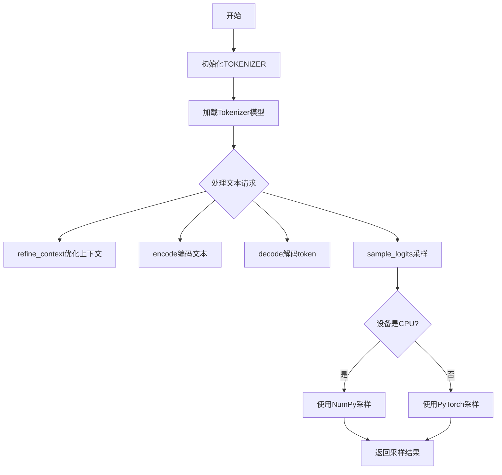
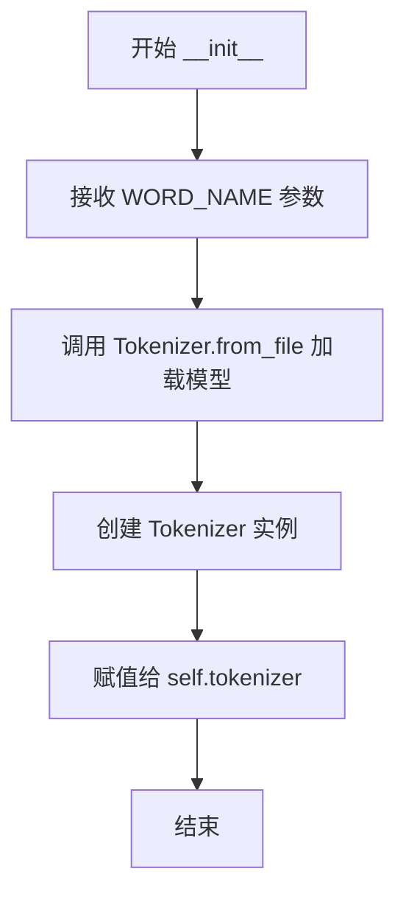
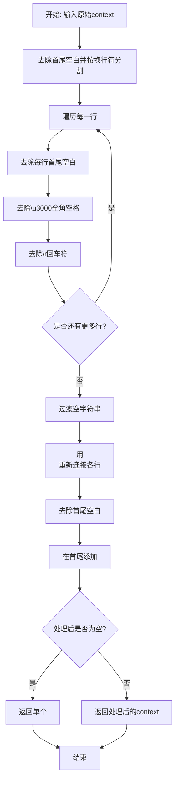
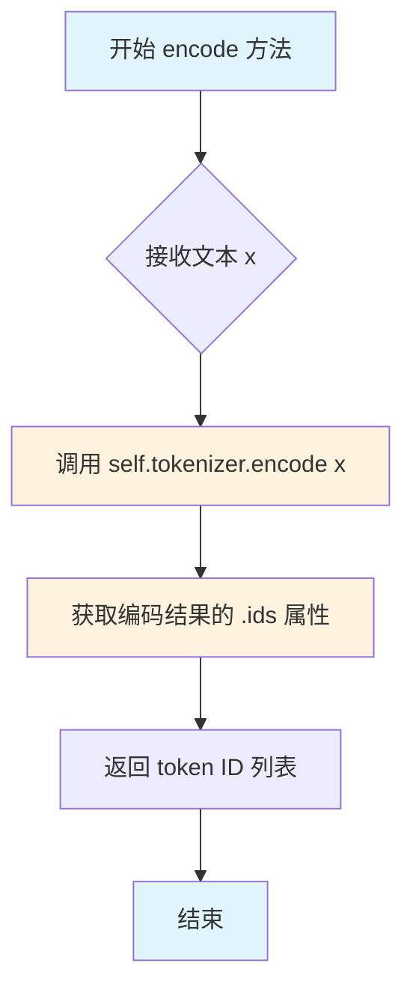
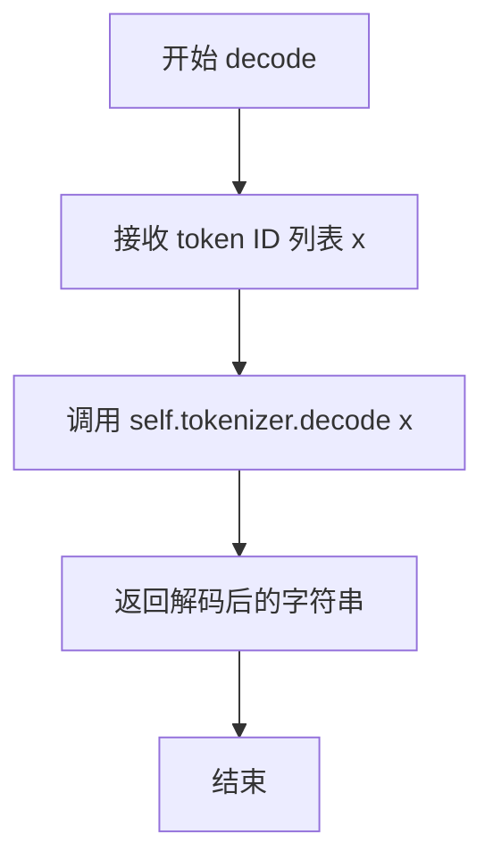

# `ChatRWKV\src\utils.py` 详细设计文档

这是一个RWKV语言模型的分词器模块，提供了文本编码、解码和基于logits的采样功能，支持CPU和GPU设备的不同采样策略。

## 整体流程



## 类结构

```
TOKENIZER (分词器类)
└── Tokenizer (第三方tokenizers库)
```

## 全局变量及字段


### `time_slot`
    
存储各操作的时间记录

类型：`dict`
    


### `time_ref`
    
时间参考点（纳秒级时间戳）

类型：`int`
    


### `TOKENIZER.tokenizer`
    
第三方分词器实例

类型：`Tokenizer`
    
    

## 全局函数及方法


### `record_time`

记录给定名称的时间戳，用于性能测量。如果当前时间比之前记录的时间更短，则更新时间槽中的最小时间。

参数：

-  `name`：`str`，用于标识计时任务的名称

返回值：`None`，无返回值

#### 流程图

```mermaid
flowchart TD
    A[开始 record_time] --> B{name 是否在 time_slot 中}
    B -->|否| C[初始化 time_slot[name] = 1e20]
    B -->|是| D[跳过初始化]
    C --> E[计算当前时间差 tt]
    D --> E
    E --> F[计算时间差 tt = (time.time_ns - time_ref) / 1e9]
    F --> G{tt < time_slot[name]?}
    G -->|是| H[更新 time_slot[name] = tt]
    G -->|否| I[不更新]
    H --> J[结束]
    I --> J
```

#### 带注释源码

```python
# 全局时间槽字典，用于存储各名称的最小时间记录
time_slot = {}
# 参考时间点（程序启动时的时间戳）
time_ref = time.time_ns()

def record_time(name):
    """
    记录给定名称的时间戳
    
    该函数用于性能测量，记录从程序开始到当前时刻的时间。
    如果当前时间比之前记录的时间更短，则更新最小时间记录。
    
    Args:
        name: str，用于标识计时任务的名称
    
    Returns:
        None
    """
    # 如果名称不存在于时间槽中，初始化为极大值（1e20）
    if name not in time_slot:
        time_slot[name] = 1e20
    
    # 计算当前时间与参考时间的时间差（单位：秒）
    tt = (time.time_ns() - time_ref) / 1e9
    
    # 如果当前时间差小于之前记录的时间，则更新最小时间
    if tt < time_slot[name]:
        time_slot[name] = tt
```


### `TOKENIZER.__init__`

该方法是 `TOKENIZER` 类的构造函数，用于初始化分词器，加载指定的 tokenizer 模型文件并创建内部的分词器实例。

参数：

- `WORD_NAME`：`str`，tokenizer 模型文件的路径或名称，用于加载预训练的 tokenizer 配置和词表

返回值：`None`，该方法为构造函数，不返回任何值

#### 流程图



#### 带注释源码

```python
def __init__(self, WORD_NAME):
    # 参数 WORD_NAME: str 类型，表示预训练 tokenizer 的文件路径或名称
    # 该方法无返回值，仅初始化实例属性
    
    # 使用 Hugging Face tokenizers 库的 Tokenizer.from_file 方法
    # 从指定的 WORD_NAME 路径加载预训练的 tokenizer 配置和词表
    self.tokenizer = Tokenizer.from_file(WORD_NAME)
    # 将加载的 tokenizer 实例存储为类的属性，供后续 encode/decode 方法使用
```


### `TOKENIZER.refine_context`

该方法用于清理和规范化输入的文本上下文，通过去除空白字符、过滤空行并在首尾添加换行符来标准化文本格式。

参数：

- `context`：`str`，需要清理的原始上下文文本

返回值：`str`，清理并规范化后的上下文文本

#### 流程图



#### 带注释源码

```
def refine_context(self, context):
    """
    清理并规范化输入的文本上下文
    
    处理步骤：
    1. 去除首尾空白，按换行符分割成列表
    2. 遍历每一行，去除首尾空白、全角空格(\u3000)和回车符(\r)
    3. 过滤掉空字符串
    4. 用换行符重新连接，并在首尾添加换行符
    5. 如果结果为空，则返回单个换行符
    """
    # 第一步：去除首尾空白，按换行符分割
    context = context.strip().split('\n')
    
    # 第二步：遍历每一行进行清理
    for c in range(len(context)):
        # 去除首尾空白 -> 去除全角空格\u3000 -> 去除回车符\r
        context[c] = context[c].strip().strip('\u3000').strip('\r')
    
    # 第三步：过滤空字符串（去除空行）
    context = list(filter(lambda c: c != '', context))
    
    # 第四步：用换行符重新连接，并在首尾添加换行符
    context = '\n' + ('\n'.join(context)).strip()
    
    # 第五步：确保至少返回一个换行符
    if context == '':
        context = '\n'
    
    return context
```


### `TOKENIZER.encode`

该方法是 TOKENIZER 类的核心编码方法，负责将输入的文本字符串转换为对应的 token ID 列表。它内部调用了 Hugging Face tokenizers 库的 Tokenizer 对象完成实际的编码工作。

参数：

- `x`：`str`，需要编码的文本字符串

返回值：`List[int]`，返回编码后的 token ID 列表

#### 流程图



#### 带注释源码

```python
def encode(self, x):
    """
    将输入文本编码为 token ID 列表
    
    参数:
        x: str - 要编码的文本字符串
    
    返回:
        List[int] - 编码后的 token ID 列表
    """
    # 调用 Hugging Face tokenizers 库的 encode 方法进行分词
    # 并通过 .ids 获取 token 对应的整数 ID 序列
    return self.tokenizer.encode(x).ids
```


### `TOKENIZER.decode`

该方法是 TOKENIZER 类的实例方法，负责将编码后的 token ID 序列解码为人类可读的文本字符串。它内部直接调用了 `tokenizers` 库中 Tokenizer 对象的 decode 方法，是实现文本生成流程中从模型输出token ID转换回文本的关键环节。

参数：

- `x`：`List[int]`，待解码的 token ID 序列（通常为模型输出的 token 列表）

返回值：`str`，解码后的文本字符串

#### 流程图



#### 带注释源码

```python
def decode(self, x):
    """
    将 token ID 序列解码为文本字符串
    
    参数:
        x: token ID 列表, 由模型生成的 token 序列
    
    返回:
        解码后的文本字符串
    """
    return self.tokenizer.decode(x)  # 调用 tokenizers 库的 decode 方法进行解码
```


### `TOKENIZER.sample_logits`

该函数负责从模型输出的logits中根据温度（temperature）和核采样（top-p）策略进行概率采样，生成下一个token的ID。函数会根据运行环境（CPU或GPU）选择不同的计算路径，以优化采样效率。

#### 参数

- `logits`：`torch.Tensor`，模型输出的原始logits向量
- `x`：未使用（可能是遗留参数），通常为当前的token ID或上下文
- `ctx_len`：`int`，上下文长度，当前未被使用
- `temperature`：`float`，温度参数，控制采样随机性，值越大概率分布越平坦，1.0为默认不调整
- `top_p`：`float`，核采样阈值，仅保留累积概率达到该值的最高概率token，1.0表示保留所有token

#### 返回值

`int`，采样得到的token ID

#### 流程图

```mermaid
flowchart TD
    A[开始: sample_logits] --> B[对logits进行softmax得到概率分布probs]
    B --> C{运行环境是CPU?}
    C -->|是| D[将probs转为numpy数组]
    C -->|否| E[使用torch排序概率]
    D --> F[排序概率并计算累积和]
    E --> G[计算累积概率并转numpy]
    F --> H[找到top_p cutoff阈值]
    G --> H
    H --> I[将低于cutoff的概率置零]
    I --> J{温度不等于1.0?}
    J -->|是| K[应用温度缩放: probs = probs ** (1/temperature)]
    J -->|否| L[跳过温度调整]
    K --> M[归一化概率分布]
    L --> N{运行环境是CPU?}
    M --> O{是CPU?}
    N -->|是| P[使用np.random.choice采样]
    N -->|否| Q[使用torch.multinomial采样]
    O --> P
    O --> Q
    P --> R[返回采样token ID]
    Q --> R
```

#### 带注释源码

```python
def sample_logits(self, logits, x, ctx_len, temperature=1.0, top_p=1.0):
    # 将logits通过softmax转换为概率分布
    probs = F.softmax(logits.float(), dim=-1)

    # 判断运行环境：如果是CPU则使用numpy，GPU则使用torch
    if os.environ["RWKV_RUN_DEVICE"] == "cpu":
        # ========== CPU分支 ==========
        # 转换为numpy数组进行操作
        probs = probs.numpy()
        
        # 按概率降序排序
        sorted_probs = np.sort(probs)[::-1]
        
        # 计算累积概率分布
        cumulative_probs = np.cumsum(sorted_probs)
        
        # 找到累积概率首次达到top_p的阈值（cutoff）
        cutoff = float(sorted_probs[np.argmax(cumulative_probs >= top_p)])
        
        # 将低于阈值的概率置零（实现核采样）
        probs[probs < cutoff] = 0
        
        # 如果温度不等于1.0，调整概率分布
        # 温度 > 1.0 使分布更平坦（增加随机性）
        # 温度 < 1.0 使分布更尖锐（减少随机性）
        if temperature != 1.0:
            probs = probs ** (1.0 / temperature)
        
        # 重新归一化概率，使其和为1
        probs = probs / np.sum(probs)
        
        # 根据概率分布进行采样
        out = np.random.choice(a=len(probs), p=probs)
        return int(out)
    else:
        # ========== GPU分支 ==========
        # 使用torch进行排序（降序）
        sorted_probs = torch.sort(probs, descending=True)[0]
        
        # 计算累积概率并转到numpy
        cumulative_probs = torch.cumsum(sorted_probs, dim=-1).cpu().numpy()
        
        # 找到cutoff阈值
        cutoff = float(sorted_probs[np.argmax(cumulative_probs >= top_p)])
        
        # 屏蔽低概率token
        probs[probs < cutoff] = 0
        
        # 应用温度调整
        if temperature != 1.0:
            probs = probs ** (1.0 / temperature)
        
        # 使用torch的多项式分布进行采样
        out = torch.multinomial(probs, num_samples=1)[0]
        return int(out)
```

## 关键组件


### TOKENIZER 类

负责文本的编码、解码以及从模型输出 logits 中采样下一个 token 的核心类，封装了 tokenizers 库的功能并提供了跨设备的采样策略。

### refine_context 方法

清理和格式化输入上下文文本，去除空白字符、过滤空行，规范化为标准格式。

### encode 方法

将输入字符串转换为 token ID 列表。

### decode 方法

将 token ID 列表转换回字符串。

### sample_logits 方法

根据温度和 top_p 参数从模型输出的 logits 中采样下一个 token，根据设备（CPU/GPU）选择不同的实现路径。

### record_time 函数

记录代码执行时间，用于性能分析。

### time_slot 全局变量

存储各模块的最短执行时间记录。


## 问题及建议


### 已知问题

- **环境变量未做默认值处理**：`os.environ["RWKV_RUN_DEVICE"]`直接读取环境变量，若该环境变量未设置会抛出`KeyError`异常
- **CPU/GPU分支存在大量重复逻辑**：`sample_logits`方法中两套分支（cpu和cuda）的cutoff计算、温度处理逻辑几乎相同，违反DRY原则
- **类型注解完全缺失**：所有函数参数、返回值、类字段均无类型提示，影响代码可维护性和IDE支持
- **缺少错误处理机制**：`encode`和`decode`方法未对输入做校验，tokenizer可能抛出异常；`refine_context`未对空输入做保护
- **numpy/torch混用效率问题**：CPU分支先将tensor转numpy处理后，最终又转回python int，存在不必要的设备间数据迁移
- **时间记录实现不够健壮**：`time_ref`为全局变量且仅初始化一次，若程序运行时间过长可能面临时间戳溢出风险（虽然目前不太可能）
- **缺乏文档注释**：类和方法均无docstring，后续维护者难以理解设计意图
- **魔法数字**：如`1e20`、`1e9`等数值未做常量提取，可读性差

### 优化建议

- 为`os.environ.get("RWKV_RUN_DEVICE", "cpu")`添加默认值，避免环境变量缺失导致的崩溃
- 重构`sample_logits`方法，提取公共逻辑（如cutoff计算、温度调整）到独立函数，减少代码冗余
- 为所有函数参数、返回值添加类型注解，提升代码可读性和可维护性
- 在`encode`、`decode`方法添加try-except异常处理，提升鲁棒性
- 考虑使用`torch.where`替代numpy交互，减少设备间数据迁移开销
- 将魔法数字提取为具名常量，如`TIME_INIT`, `NANO_TO_SEC`等
- 为核心类和方法补充docstring，说明功能、参数和返回值含义
- `refine_context`方法可使用列表推导式和更Pythonic的方式重写，提升可读性

## 其它


### 设计目标与约束

设计目标：实现高效、准确的文本分词和采样功能，支持RWKV语言模型的推理过程。
约束：
- 依赖tokenizers库进行高效分词
- 支持CPU和GPU设备的不同采样逻辑
- 必须设置RWKV_RUN_DEVICE环境变量指定运行设备

### 错误处理与异常设计

1. Tokenizer加载失败：Tokenizer.from_file()可能抛出异常，需确保WORD_NAME指向有效的tokenizer文件
2. 环境变量未设置：RWKV_RUN_DEVICE未设置时会导致KeyError，需确保环境变量已正确配置
3. 空上下文处理：refine_context方法处理空字符串情况，返回单个换行符
4. 采样概率异常：top_p参数可能导致所有概率被置零，需添加保护逻辑

### 数据流与状态机

数据流：
1. 输入原始文本 → refine_context() 清理格式 → encode() 转换为token IDs
2. 模型输出logits → sample_logits() 采样下一个token → decode() 转换回文本
3. 时间记录：record_time() 记录各阶段耗时

状态机：
- 初始化状态：加载tokenizer配置
- 就绪状态：tokenizer准备完成，可进行编码/解码
- 采样状态：根据logits和采样参数生成下一个token
- 完成状态：采样完成，返回token ID

### 外部依赖与接口契约

外部依赖：
- tokenizers库：使用HuggingFace的tokenizers进行高效分词
- numpy：CPU设备上的概率处理
- torch：GPU设备上的概率处理和采样
- os：环境变量读取

接口契约：
- TOKENIZER类：封装分词器功能
  - 构造函数：接收WORD_NAME参数，加载tokenizer
  - refine_context()：输入原始字符串，返回清理后的字符串
  - encode()：输入字符串，返回token ID列表
  - decode()：输入token ID列表，返回原始字符串
  - sample_logits()：输入logits、上下文等参数，返回采样得到的token ID
- record_time()：记录性能数据，接收name参数

### 性能考虑

1. CPU vs GPU分支：sample_logits针对不同设备有不同实现，CPU使用numpy，GPU使用torch
2. 概率排序优化：使用torch.sort和torch.cumsum进行高效计算
3. 时间记录开销：record_time使用time.time_ns()获取高精度时间

### 配置与参数说明

- WORD_NAME：tokenizer配置文件路径
- temperature：采样温度，控制概率分布的平滑程度，值越大越随机
- top_p：核采样阈值，只保留累积概率达到top_p的token
- ctx_len：上下文长度，用于特定采样策略

### 使用示例

```python
# 初始化tokenizer
tokenizer = TOKENIZER("path/to/tokenizer.json")

# 编码文本
context = "Hello, world!"
context = tokenizer.refine_context(context)
tokens = tokenizer.encode(context)

# 采样下一个token
logits = model_output  # 模型输出的logits
next_token = tokenizer.sample_logits(logits, tokens, ctx_len=512, temperature=1.0, top_p=0.9)

# 解码
output_text = tokenizer.decode([next_token])
```

    