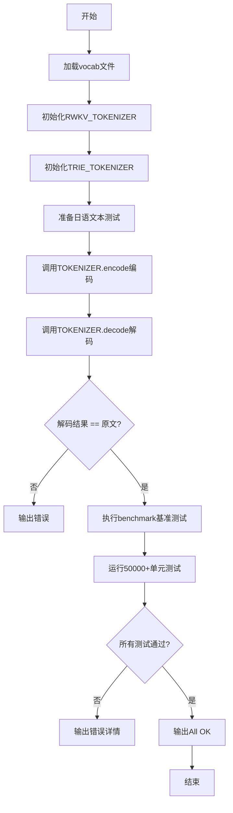
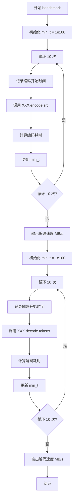
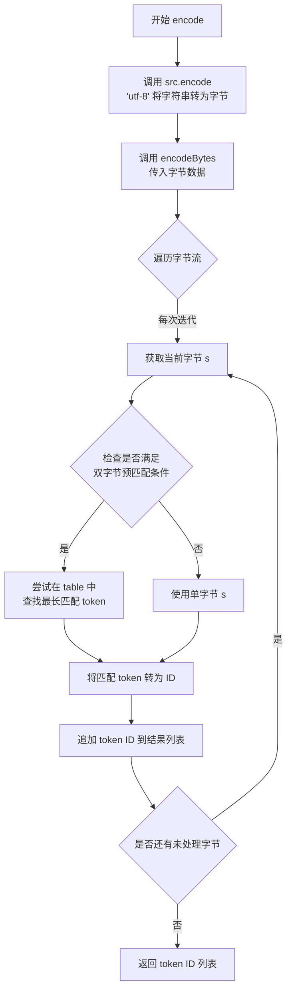
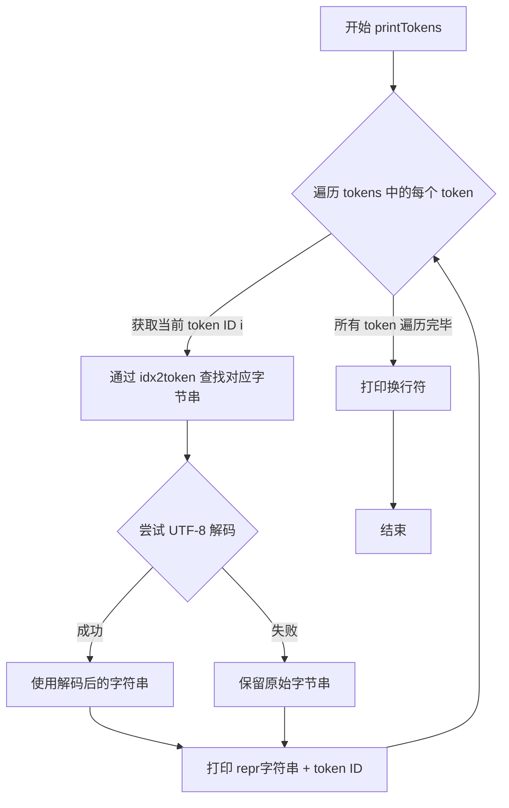
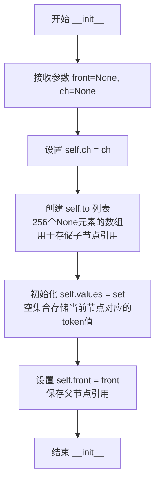
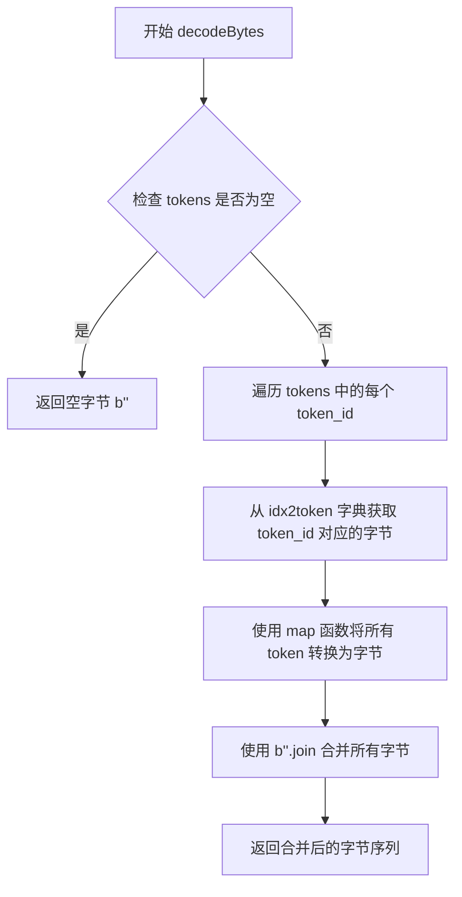
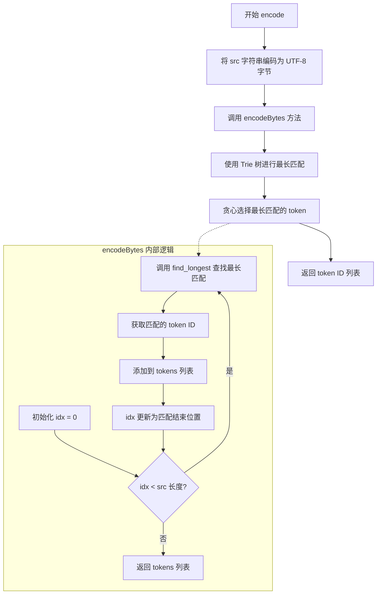
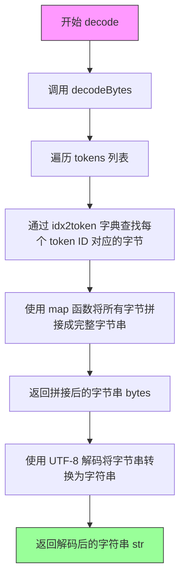

# `ChatRWKV\tokenizer\rwkv_tokenizer.py` 详细设计文档

RWKV语言模型的Tokenizer实现，提供两种编码方案：基于表的贪心编码(RWKV_TOKENIZER)和基于Trie树的快速编码(TRIE_TOKENIZER)，支持多语言UTF-8文本的token化， vocab大小为65536，特别优化了对数字和多种语言的支持。

## 整体流程



## 类结构

```
RWKV_TOKENIZER (基于表的Tokenizer)
├── table: list[list[list[bytes]]] - 256x256查找表
├── good: list[set[int]] - 有效字节对集合
├── wlen: list[int] - 最大token长度
├── idx2token: dict - ID到token映射
└── token2idx: dict - token到ID映射

TRIE (Trie树节点)
├── ch: 字符
├── to: list - 256个子节点
├── values: set - 存储的值
└── front: 父节点引用

TRIE_TOKENIZER (基于Trie树的Tokenizer)
├── idx2token: dict
├── token2idx: dict
└── root: TRIE根节点
```

## 全局变量及字段


### `TOKENIZER`
    
基于表的tokenizer实例

类型：`RWKV_TOKENIZER`
    


### `TRIE_TEST`
    
基于Trie树的tokenizer实例

类型：`TRIE_TOKENIZER`
    


### `src`
    
日语测试文本

类型：`str`
    


### `src_len`
    
文本长度

类型：`int`
    


### `tokens`
    
编码后的token列表

类型：`list[int]`
    


### `QQQ`
    
单元测试数据列表

类型：`list`
    


### `i`
    
循环变量

类型：`int`
    


### `x`
    
临时字符串变量

类型：`str`
    


### `TRIAL`
    
测试轮次

类型：`int`
    


### `min_t`
    
最小执行时间

类型：`float`
    


### `t_begin`
    
开始时间戳

类型：`int`
    


### `RWKV_TOKENIZER.table`
    
预计算的256x256查找表，用于快速匹配

类型：`list[list[list[bytes]]]`
    


### `RWKV_TOKENIZER.good`
    
记录有效的起始字节对

类型：`list[set[int]]`
    


### `RWKV_TOKENIZER.wlen`
    
记录每个起始字节对应的最大token长度

类型：`list[int]`
    


### `RWKV_TOKENIZER.idx2token`
    
token ID到token bytes的映射

类型：`dict`
    


### `RWKV_TOKENIZER.token2idx`
    
token bytes到ID的反向映射

类型：`dict`
    


### `TRIE.ch`
    
当前节点的字符

类型：`字节`
    


### `TRIE.to`
    
256个元素的子节点列表

类型：`list`
    


### `TRIE.values`
    
存储的值集合

类型：`set`
    


### `TRIE.front`
    
父节点引用

类型：`TRIE`
    


### `TRIE_TOKENIZER.idx2token`
    
token ID到token bytes的映射

类型：`dict`
    


### `TRIE_TOKENIZER.token2idx`
    
token bytes到ID的反向映射

类型：`dict`
    


### `TRIE_TOKENIZER.root`
    
Trie树的根节点

类型：`TRIE`
    
    

## 全局函数及方法


### `benchmark`

性能基准测试函数，用于测试编码和解码速度，测量tokenizer对象的编码和解码性能，输出编码和解码的吞吐量（MB/s）。

参数：

- `XXX`：`object`，RWKV_TOKENIZER 或 TRIE_TOKENIZER 对象，需要进行性能测试的tokenizer实例

返回值：`None`，仅打印性能结果

#### 流程图



#### 带注释源码

```python
def benchmark(XXX):
    """
    性能基准测试函数，测试编码和解码速度
    
    参数:
        XXX: tokenizer对象，支持encode和decode方法
             例如 RWKV_TOKENIZER 或 TRIE_TOKENIZER 实例
    
    返回:
        None: 仅打印性能结果到标准输出
    """
    
    # ==================== 编码速度测试 ====================
    # 初始化最小时间为一个很大的值
    min_t = 1e100
    
    # 循环10次取最小耗时，消除系统波动影响
    for i in range(10):
        # 记录编码开始时间（纳秒精度）
        t_begin = time.time_ns()
        
        # 执行编码：将字符串编码为token列表
        tokens = XXX.encode(src)
        
        # 计算本次编码耗时，更新最小时间
        min_t = min(time.time_ns() - t_begin, min_t)
    
    # 输出编码速度：src_len / min_t * 1e3 得到 MB/s
    # src_len 是字符数，min_t 是纳秒
    # 除以 1e6 转换为秒，再乘以 1e3 得到 MB/s
    print('Encode', round(src_len / min_t * 1e3, 3), 'MB/s')

    # ==================== 解码速度测试 ====================
    # 重新初始化最小时间
    min_t = 1e100
    
    # 循环10次取最小耗时
    for i in range(10):
        # 记录解码开始时间
        t_begin = time.time_ns()
        
        # 执行解码：将token列表解码回字符串
        sss = XXX.decode(tokens)
        
        # 计算本次解码耗时，更新最小时间
        min_t = min(time.time_ns() - t_begin, min_t)
    
    # 输出解码速度
    print('Decode', round(src_len / min_t * 1e3, 3), 'MB/s')
```


### `RWKV_TOKENIZER.printTokens` / `TRIE_TOKENIZER.printTokens`

打印token列表，将每个token转换为其文本表示并输出对应的ID。

参数：

-  `tokens`：`list[int]`，要打印的token ID列表

返回值：`None`，无返回值，仅打印到标准输出

#### 流程图

```mermaid
flowchart TD
    A[开始 printTokens] --> B{遍历 tokens 中的每个 token}
    B -->|取出一个 token i| C[通过 idx2token 查找对应的 bytes]
    D{尝试 UTF-8 解码}
    C --> D
    D -->|成功| E[s = 解码后的字符串]
    D -->|失败| F[保持 bytes 不变]
    E --> G[打印 repr(s) + i]
    F --> G
    G --> H{是否还有更多 token}
    H -->|是| B
    H -->|否| I[打印换行符]
    I --> J[结束]
```

#### 带注释源码

```python
def printTokens(self, tokens):
    # 遍历传入的token ID列表
    for i in tokens:
        # 通过ID查找对应的token bytes
        s = self.idx2token[i]
        
        # 尝试将bytes解码为UTF-8字符串
        # 如果失败（如二进制token），则保持bytes不变
        try:
            s = s.decode('utf-8')
        except:
            pass
        
        # 打印token的repr表示和对应的ID
        # 使用repr确保不可打印字符也能正确显示
        # end=' ' 使每个token以空格分隔
        print(f'{repr(s)}{i}', end=' ')
        # 注释掉的备用打印方式
        # print(repr(s), i)
    
    # 打印换行符，结束输出
    print()
```


### `RWKV_TOKENIZER.__init__`

构造函数，加载 vocab 文件并初始化 `idx2token`、`token2idx` 映射表以及用于快速编码的查找表（`table`, `good`, `wlen`）。

参数：
- `self`：`RWKV_TOKENIZER`，类的实例本身。
- `file_name`：`str`，vocab 文件的路径。

返回值：`None`，无返回值，仅用于初始化对象状态。

#### 流程图

```mermaid
graph TD
    A[开始: 接收 file_name] --> B[打开文件并读取所有行]
    B --> C{遍历每一行}
    C -->|解析行| D[提取 idx 和 token (bytes)]
    D --> E[构建 idx2token 映射]
    C --> F[结束遍历]
    F --> G[构建 token2idx 反向映射]
    G --> H[初始化 table, good, wlen 加速表]
    H --> I{逆序遍历 token 列表}
    I -->|长度 >= 2| J[填充 table[s0][s1] 列表]
    J --> I
    I --> K[更新 wlen 和 good 集合]
    K --> I
    I --> L[结束]
```

#### 带注释源码

```python
def __init__(self, file_name):
    # 1. 初始化 token 索引映射字典
    self.idx2token = {}
    sorted = []  # 必须已经是排序好的 (文件按字节长度降序)
    
    # 2. 读取 vocab 文件
    lines = open(file_name, "r", encoding="utf-8").readlines()
    
    # 3. 解析每一行，提取 token ID 和 token 内容
    for l in lines:
        # 提取索引号 (行首到第一个空格)
        idx = int(l[:l.index(' ')])
        # 提取 token 字符串 (第一个空格到最后一个空格之间)
        x = eval(l[l.index(' '):l.rindex(' ')])
        # 如果是字符串则编码为 bytes
        x = x.encode("utf-8") if isinstance(x, str) else x
        # 断言确保 token 是 bytes 类型
        assert isinstance(x, bytes)
        # 断言确保 token 长度与文件最后记录的长度一致
        assert len(x) == int(l[l.rindex(' '):])
        
        sorted += [x]
        self.idx2token[idx] = x

    # 4. 构建反向映射 token -> idx
    self.token2idx = {}
    for k, v in self.idx2token.items():
        self.token2idx[v] = int(k)

    # 5. 预计算用于快速匹配的查找表 (贪心编码优化)
    # table: 二维列表，存储以特定字节对开头的所有 token 列表
    self.table = [[[] for j in range(256)] for i in range(256)]
    # good: 集合数组，记录哪些字节对是有效的 (存在于 vocab 中)
    self.good = [set() for i in range(256)]
    # wlen: 数组，记录以特定字节开头的 token 的最大长度
    self.wlen = [0 for i in range(256)]

    # 6. 逆序遍历 (匹配更长的 token 优先)
    for i in reversed(range(len(sorted))):
        s = sorted[i]
        if len(s) >= 2:
            s0 = int(s[0])
            s1 = int(s[1])
            # 将 token 加入对应的查找表
            self.table[s0][s1] += [s]
            # 更新最大长度
            self.wlen[s0] = max(self.wlen[s0], len(s))
            # 标记该字节对是有效的
            self.good[s0].add(s1)
```


### `RWKV_TOKENIZER.encodeBytes`

将输入的字节序列按照贪婪最长匹配原则编码为对应的token ID列表。该方法利用预计算的查找表（table、good、wlen）实现高效的字节到token的映射，是RWKV_TOKENIZER的核心编码方法。

参数：

- `self`：`RWKV_TOKENIZER`，Tokenizer实例，持有词汇表和预计算的匹配表
- `src`：`bytes`，待编码的UTF-8字节序列

返回值：`list[int]`，编码后的token ID列表

#### 流程图

```mermaid
flowchart TD
    A[开始 encodeBytes] --> B[获取src长度]
    B --> C[初始化空tokens列表和索引i=0]
    C --> D{i &lt; src_len?}
    D -->|否| K[返回tokens列表]
    D -->|是| E[提取单字节s = src[i:i+1]]
    E --> F{i &lt; src_len - 1?}
    F -->|否| H[查token2idx表获取token ID]
    F -->|是| G{第二个字节在good表中?}
    G -->|否| H
    G -->|是| I[提取可能的最长匹配sss]
    I --> J[从table中筛选最长匹配的token]
    J --> H
    H --> L[将token ID加入tokens]
    L --> M[i += len(s)]
    M --> D
```

#### 带注释源码

```python
def encodeBytes(self, src: bytes) -> list[int]:
    """
    将字节序列编码为token ID列表（贪婪最长匹配）
    
    算法说明：
    1. 从输入字节序列的起始位置开始
    2. 尝试匹配最长（字节数最多）的token
    3. 将匹配到的token ID添加到结果列表
    4. 移动到下一个未编码的位置，重复上述过程
    """
    src_len: int = len(src)              # 获取输入字节序列长度
    tokens: list[int] = []                # 初始化结果token列表
    i: int = 0                           # 当前处理位置索引
    
    # 遍历整个输入字节序列
    while i < src_len:
        # 默认情况下，提取当前字节作为最小匹配单元
        s: bytes = src[i : i + 1]        # 提取单字节作为基础匹配
        
        # 尝试进行更长的匹配（两字节前缀匹配）
        if i < src_len - 1:
            s1: int = int(src[i + 1])    # 第二个字节的整数值
            s0: int = int(src[i])        # 第一个字节的整数值
            
            # 检查第一个字节对应的good集合是否包含第二个字节
            # good表记录了哪些(第一个字节, 第二个字节)组合可能存在多字节token
            if s1 in self.good[s0]:
                # 提取从当前字节开始、可能最长长度的字节序列
                sss: bytes = src[i : i + self.wlen[s0]]
                try:
                    # 从table中查找以sss开头的最长匹配token
                    # table[s0][s1]存储了所有以s0开头、第二个字节为s1的token
                    # filter + next 实现贪婪匹配（取列表中第一个匹配，即最长匹配，因为列表已逆序）
                    s = next(filter(sss.startswith, self.table[s0][s1]))
                except:
                    # 如果没有找到匹配，保持使用单字节s
                    pass
        
        # 将匹配到的字节序列转换为token ID
        tokens.append(self.token2idx[s])
        
        # 移动到下一个未处理的位置
        i += len(s)
    
    return tokens
```


### `RWKV_TOKENIZER.decodeBytes`

将token ID列表解码为原始字节序列。该方法是RWKV_TOKENIZER类的核心解码方法，通过查表方式将数字token ID转换回对应的字节数据。

参数：
- `self`：RWKV_TOKENIZER实例，解码器对象本身
- `tokens`：`list[int]`，待解码的token ID列表，每个元素为整数类型的token标识符

返回值：`bytes`，解码后的字节串，将所有token对应的字节拼接而成

#### 流程图

```mermaid
flowchart TD
    A[开始 decodeBytes] --> B[输入: tokens list[int]]
    B --> C[使用 map 函数遍历 tokens]
    C --> D[对每个 token_id 执行 lambda i: idx2token[i]]
    D --> E[从 idx2token 字典查找对应字节]
    E --> F[将所有字节使用 b''.join 拼接]
    F --> G[返回拼接后的 bytes 对象]
    G --> H[结束]
```

#### 带注释源码

```python
def decodeBytes(self, tokens):
    """
    将token ID列表解码为字节串
    
    参数:
        tokens: list[int] - token ID列表，每个元素为整数
    
    返回:
        bytes - 解码后的字节串
    """
    # 使用 map 函数对每个 token ID 执行查找操作
    # idx2token 是类中维护的 token ID 到字节的映射字典
    # lambda i: self.idx2token[i] 表示从映射表中取出对应字节
    # b''.join(...) 将所有字节拼接成最终的字节串
    return b''.join(map(lambda i: self.idx2token[i], tokens))
```

**代码解析：**
1. `self.idx2token` 是类初始化时构建的字典，键为token ID（整数），值为对应的字节数据（bytes类型）
2. `map(lambda i: self.idx2token[i], tokens)` 对输入的每个token ID执行查表操作，返回对应的字节对象迭代器
3. `b''.join(...)` 将所有字节对象拼接成单一的字节串，这是Python中高效的字节串拼接方式
4. 该方法不进行UTF-8解码，仅返回原始字节，适用于encodeBytes的逆操作


### `RWKV_TOKENIZER.encode`

将输入的 UTF-8 字符串编码为对应的 token ID 列表。该方法是 `RWKV_TOKENIZER` 类的核心接口，通过调用内部方法 `encodeBytes` 实现实际的编码逻辑，采用贪婪匹配策略（优先选择最长匹配）。

参数：
- `self`：`RWKV_TOKENIZER`， tokenizer 实例，持有词汇表和编码所需的数据结构
- `src`：`str`，待编码的 UTF-8 字符串

返回值：`list[int]`，编码后的 token ID 列表

#### 流程图



#### 带注释源码

```python
def encode(self, src: str):
    """
    将 UTF-8 字符串编码为 token ID 列表
    
    参数:
        src: 输入的 UTF-8 编码字符串
    
    返回:
        编码后的 token ID 列表
    """
    # 步骤1: 将字符串编码为 UTF-8 字节
    # 使用 Python 内置的 encode 方法将 str 转换为 bytes
    # 这一步是必要的，因为底层编码操作是基于字节的
    return self.encodeBytes(src.encode("utf-8"))
```

---

**补充说明**

| 项目 | 描述 |
|------|------|
| **设计目标** | 提供简单易用的字符串转 token 接口，隐藏字节级编码细节 |
| **约束条件** | 输入必须是有效的 UTF-8 字符串；词汇表必须在初始化时加载 |
| **核心依赖** | `encodeBytes` 方法、`token2idx` 字典（token 到 ID 的映射） |
| **编码策略** | 贪婪算法（Greedy Matching）：从字节流起始位置开始，每次尝试匹配最长可能的 token |
| **性能特性** | 编码时间复杂度为 O(n)，其中 n 为输入字节数；实际速度取决于 `encodeBytes` 的实现 |
| **错误处理** | 若输入包含无效 UTF-8 序列，`encode("utf-8")` 会抛出 `UnicodeEncodeError` |
| **数据流** | `str` → UTF-8 `bytes` → `list[int]` (token IDs) |


### `RWKV_TOKENIZER.decode`

将 token ID 列表解码为对应的 UTF-8 字符串。该方法是编码的逆操作，通过查询预建的词表将数字 token 序列转换回可读文本。

参数：

- `tokens`：`list[int]`，需要解码的 token ID 列表，每个元素为词表中的索引

返回值：`str`，解码后的 UTF-8 字符串

#### 流程图

```mermaid
flowchart TD
    A[开始 decode] --> B[接收 tokens: list[int]]
    B --> C[调用 decodeBytes 方法]
    C --> D[遍历 tokens 列表]
    D --> E[通过 idx2token 查找每个 token ID 对应的字节]
    E --> F[使用 map 和 lambda 将所有 token 转换为字节]
    F --> G[使用 b''.join 拼接所有字节为完整字节串]
    G --> H[调用 .decode('utf-8') 将字节串解码为字符串]
    H --> I[返回解码后的字符串]
    
    style A fill:#e1f5fe
    style I fill:#c8e6c9
```

#### 带注释源码

```python
def decode(self, tokens):
    """
    将 token ID 列表解码为对应的 UTF-8 字符串。
    
    这是 encode 方法的逆操作：
    encode: str -> list[int] (字符串编码为 token ID 列表)
    decode: list[int] -> str (token ID 列表解码为字符串)
    
    参数:
        tokens (list[int]): 需要解码的 token ID 列表。
                           每个 ID 对应词表中一个唯一的 token (字节序列)。
    
    返回:
        str: 解码后的 UTF-8 字符串。
    """
    # 调用 decodeBytes 方法将 token IDs 转换为字节串
    # decodeBytes 内部实现: b''.join(map(lambda i: self.idx2token[i], tokens))
    # 即遍历每个 token ID，通过 idx2token 字典查找对应的字节数据，最后拼接成完整字节串
    return self.decodeBytes(tokens).decode('utf-8')

# -------------------------------------------------------------------------
# 配合理解的辅助方法 decodeBytes:
# -------------------------------------------------------------------------
def decodeBytes(self, tokens):
    """
    将 token ID 列表解码为原始字节串（不进行 UTF-8 解码）。
    
    参数:
        tokens (list[int]): token ID 列表
    
    返回:
        bytes: 拼接后的原始字节数据
    """
    # self.idx2token: dict[int, bytes] - 词表字典，key 是 token ID，value 是对应的字节数据
    # 使用 map 将每个 token ID 映射到对应的字节，然后使用 b''.join 拼接
    return b''.join(map(lambda i: self.idx2token[i], tokens))
```


### `RWKV_TOKENIZER.printTokens`

该函数用于调试目的，将给定的token ID列表逐个转换为其对应的字符串表示形式，并连同token ID一起打印到标准输出，方便开发者在调试过程中查看tokenization的结果。

参数：

- `self`：`RWKV_TOKENIZER`，RWKV_TOKENIZER类的实例，包含了词表映射关系（idx2token和token2idx）
- `tokens`：`list[int]`，要打印的token ID列表，每个元素是一个整数类型的token标识符

返回值：`None`，该函数没有返回值，仅执行打印操作

#### 流程图



#### 带注释源码

```python
def printTokens(self, tokens):
    """
    打印token及其ID用于调试
    
    参数:
        tokens: list[int], 要打印的token ID列表
    
    返回值:
        None
    """
    # 遍历传入的每个token ID
    for i in tokens:
        # 根据token ID从idx2token字典中获取对应的字节串
        s = self.idx2token[i]
        
        # 尝试将字节串解码为UTF-8字符串
        try:
            s = s.decode('utf-8')
        except:
            # 如果解码失败（如二进制token），保留原始字节串
            pass
        
        # 打印token的repr表示和对应的ID，end=' '保持输出在同一行
        print(f'{repr(s)}{i}', end=' ')
        # 备用打印方式（已注释）: print(repr(s), i)
    
    # 打印换行符，结束本次输出
    print()
```


### `TRIE.__init__`

该函数是TRIE（字典树）数据结构的节点构造函数，用于初始化一个Trie树节点，分配256个子节点的引用槽位、值集合以及指向父节点的引用，为构建高效的多字节字符查找树奠定基础。

参数：

- `self`：`TRIE`，指向实例本身的引用
- `front`：`TRIE | None`，指向父节点的TRIE对象引用，用于在遍历时回溯路径，根节点时为None
- `ch`：`int | None`，当前节点代表的字节值(0-255)，None表示根节点

返回值：`None`，构造函数不返回值，仅通过修改实例属性完成初始化

#### 流程图



#### 带注释源码

```python
def __init__(self, front=None, ch=None):
    """
    Trie树节点的构造函数
    
    参数:
        front: 父节点引用，用于构建节点间的父子关系
        ch: 当前节点代表的字节值(0-255)，根节点时为None
    """
    # 设置当前节点的字符/字节值
    self.ch = ch
    
    # 初始化子节点数组，包含256个槽位
    # 每个槽位对应一个可能的字节值(0-255)
    # 初始时所有槽位都为None，表示没有子节点
    self.to = [None for ch in range(256)]
    
    # 初始化当前节点的值的集合
    # 用于存储以当前节点为结尾的token信息
    self.values = set()
    
    # 保存父节点引用，便于后续遍历和回溯
    self.front = front
```


### `TRIE.__repr__`

该方法返回 TRIE 树节点的字符串表示形式，通过遍历节点的前向指针（front）构建从根节点到当前节点的字符路径，并以特定格式输出节点字符序列和关联的值集合。

参数：

- `self`：`TRIE`，TRIE 类的实例方法，表示当前 TRIE 树节点

返回值：`str`，返回格式为 `<TRIE [字符列表] [值集合]>` 的字符串，其中字符列表为从根到当前节点的路径（已反转），值集合为该节点存储的值

#### 流程图

```mermaid
flowchart TD
    A[开始 __repr__] --> B[初始化 fr = self, ret = []]
    B --> C{fr != None?}
    C -->|是| D{fr.ch != None?}
    D -->|是| E[ret.append(fr.ch)]
    D -->|否| F[fr = fr.front]
    E --> F
    C -->|否| G[ret[::-1] 反转列表]
    G --> H[<TRIE %s %s> % (ret[::-1], self.values)]
    H --> I[返回字符串]
```

#### 带注释源码

```python
def __repr__(self):
    """
    返回 TRIE 树节点的字符串表示
    
    该方法通过遍历 front 指针链（从当前节点到根节点），
    收集路径上的所有字符，然后反转得到从根到当前节点的正确顺序。
    最后以特定格式返回节点信息和值集合。
    
    Returns:
        str: 格式为 "<TRIE [字符列表] [值集合]>" 的字符串表示
    """
    fr = self                  # 从当前节点开始遍历
    ret = []                   # 用于存储路径上的字符
    
    # 沿着 front 指针向前遍历直到根节点
    while(fr != None):
        if(fr.ch != None):     # 如果当前节点有字符，则添加到列表
            ret.append(fr.ch)
        fr = fr.front          # 移动到前一个节点
    
    # 反转列表得到从根到当前节点的字符顺序
    return "<TRIE %s %s>" % (ret[::-1], self.values)
```


### `TRIE.add`

向 Trie 树中添加一个键（key），如果未指定值则默认使用 key 本身作为值。通过递归方式在 Trie 树中逐层向下创建或访问节点，直到键的末尾并将值添加到该节点的 values 集合中。

**参数：**

- `self`：`TRIE`，方法调用者，当前 Trie 树节点
- `key`：`bytes`，要添加的键（字节序列）
- `idx`：`int`，当前处理的字节索引位置，默认为 0
- `val`：`any`，可选，要存储的值，默认为 None（如果为 None，则使用 key 本身作为值）

**返回值：**`TRIE`，返回当前节点对象，支持链式调用

#### 流程图

```mermaid
flowchart TD
    A[开始 add 方法] --> B{idx == len(key)?}
    B -- 是 --> C{val is None?}
    C -- 是 --> D[val = key]
    C -- 否 --> E[保持 val 不变]
    D --> F[将 val 添加到 self.values]
    F --> G[返回 self]
    B -- 否 --> H[ch = key[idx]]
    H --> I{self.to[ch] is None?}
    I -- 是 --> J[创建新节点 TRIE, front=self, ch=ch]
    J --> K[self.to[ch] = 新节点]
    K --> L[递归调用 self.to[ch].add]
    L --> M[传入 idx+1 和 val]
    I -- 否 --> L
```

#### 带注释源码

```python
def add(self, key: bytes, idx: int = 0, val=None):
    """
    向 Trie 树中添加一个键值对
    
    参数:
        key: 要添加的键（字节序列）
        idx: 当前处理的字节索引，默认为 0
        val: 可选的值，如果为 None 则使用 key 本身作为值
    
    返回:
        返回当前节点（self），支持链式调用
    """
    # 递归终止条件：已处理完 key 的所有字节
    if idx == len(key):
        # 如果未指定值，则使用 key 本身作为值
        if val is None:
            val = key
        # 将值添加到当前节点的 values 集合中
        self.values.add(val)
        # 返回当前节点，支持链式调用
        return self
    
    # 获取当前索引位置的字节值
    ch = key[idx]
    
    # 如果对应的子节点不存在，则创建新的 Trie 节点
    if self.to[ch] is None:
        # 创建新节点，front 指向当前节点，ch 为该节点的标识字节
        self.to[ch] = TRIE(front=self, ch=ch)
    
    # 递归调用子节点的 add 方法，处理下一个字节
    return self.to[ch].add(key, idx=idx+1, val=val)
```


### `TRIE.find_longest`

该方法用于在 Trie 树中查找从指定位置开始的最长匹配token。从当前节点出发，沿着输入字节序列向下遍历，记录最后一个具有有效值的节点，最终返回匹配结束位置、Trie节点和对应的token值集合。

参数：

- `self`：`TRIE`，调用该方法的 Trie 树节点实例
- `key`：`bytes`，要搜索的输入字节序列
- `idx`：`int`，开始搜索的起始索引（默认为0）

返回值：`tuple`，包含三个元素：(1) `idx`：匹配结束后的索引位置，类型为 `int`；(2) `u`：匹配结束时的 Trie 节点，类型为 `TRIE`；(3) `u.values`：该节点存储的 token 值集合，类型为 `set`

#### 流程图

```mermaid
flowchart TD
    A[开始: find_longest] --> B[初始化 u = self, ch = key[idx]]
    B --> C{当前节点的子节点<br/>u.to[ch] 是否存在?}
    C -->|否| D[返回 ret (最长匹配结果)]
    C -->|是| E[u = u.to[ch], idx += 1]
    E --> F{当前节点是否有值<br/>u.values 非空?}
    F -->|是| G[更新 ret = idx, u, u.values]
    F -->|否| H{idx 是否已到达<br/>key 末尾?}
    G --> H
    H -->|否| I[ch = key[idx], 继续循环]
    I --> C
    H -->|是| D
```

#### 带注释源码

```python
def find_longest(self, key: bytes, idx: int = 0):
    """
    在 Trie 树中查找从指定位置开始的最长匹配 token。
    
    算法思路：
    1. 从当前节点出发，沿着 key 的字节序列向下遍历
    2. 每次移动到子节点时，检查该节点是否有 token 值
    3. 如果有值，则更新当前找到的最长匹配结果
    4. 当无法继续向下遍历或到达 key 末尾时，返回最后记录的最长匹配
    
    参数:
        key: bytes - 要搜索的输入字节序列
        idx: int - 开始搜索的起始索引，默认为 0
    
    返回:
        tuple - (匹配结束位置, Trie节点, token值集合)
    """
    u: TRIE = self    # 当前遍历的节点，初始为调用节点本身
    ch: int = key[idx]  # 当前要匹配的字节值（转为整数用于索引）
    
    # 持续向下遍历直到没有子节点或到达 key 末尾
    while (u.to[ch] is not None):
        u = u.to[ch]      # 移动到下一个节点
        idx += 1           # 索引位置前移
        
        # 如果当前节点存储了 token 值，更新最长匹配记录
        # 这里使用 if 而非 elif，确保在循环结束时 ret 已被正确赋值
        if (u.values):
            ret = idx, u, u.values
        
        # 到达 key 末尾时退出循环
        if (idx == len(key)):
            break
        
        # 读取下一个字节继续匹配
        ch = key[idx]
    
    # 返回找到的最长匹配结果（可能是初始的空值）
    return ret
```

#### 设计说明

该方法是 Trie _TOKENIZER 高效编码的核心组件，其设计特点如下：

1. **贪心匹配策略**：通过 `while` 循环尽可能深地遍历 Trie 树，确保找到最长（字节数最多）的匹配 token，这符合 RWKV 分词器"始终选择最长匹配"的设计原则。

2. **原地更新最长匹配**：在遍历过程中使用 `ret` 变量持续记录最后一个具有 `values` 的节点，这样在循环结束时自然保留了最长匹配信息。

3. **类型提示清晰**：为局部变量 `u`、`ch` 添加了类型注解，提高代码可读性和维护性。

4. **潜在优化空间**：如果 key 为空或 idx 超出范围，方法可能抛出索引错误；此外，`ret` 变量在某些边界情况下可能未定义，建议添加初始值或异常处理来增强健壮性。


### `TRIE_TOKENIZER.__init__`

构造函数，加载vocab文件并构建用于快速token编码的Trie树结构。

参数：

-  `self`：`TRIE_TOKENIZER`，类的实例本身
-  `file_name`：`str`，vocab文件的路径

返回值：`None`，无返回值（构造函数）

#### 流程图

```mermaid
flowchart TD
    A[开始 __init__] --> B[初始化 idx2token 字典和 sorted 列表]
    B --> C[打开 vocab 文件并读取所有行]
    C --> D{遍历每一行}
    D -->|是| E[提取 token 索引: int(l[:l.index(' ')])]
    E --> F[提取 token 字符串: eval(l[space:rspace])]
    F --> G{判断 x 是否为字符串?}
    G -->|是| H[将字符串编码为 bytes: x.encode('utf-8')]
    G -->|否| I[直接使用 bytes]
    H --> J[验证 x 是 bytes 类型]
    I --> J
    J --> K[验证 token 字节长度]
    K --> L[添加 token 到 sorted 列表]
    L --> M[添加 idx 到 idx2token 字典]
    M --> D
    D -->|否| N[构建 token2idx 反向字典]
    N --> O[创建 Trie 树根节点]
    O --> P{遍历 token2idx}
    P -->|是| Q[向 Trie 树添加 token 及其索引]
    Q --> P
    P -->|否| R[结束 __init__]
```

#### 带注释源码

```python
def __init__(self, file_name: str):
    """
    构造函数，加载vocab文件并构建Trie树用于高效编码
    
    参数:
        file_name: vocab文件的路径，文件格式为每行包含"索引 token 长度"
    """
    # 初始化索引到token的映射字典
    self.idx2token = {}
    # 用于存储按长度排序的token列表（必须已排序）
    sorted = []  # must be already sorted
    
    # 打开并读取vocab文件
    with open(file_name, "r", encoding="utf-8") as f:
        lines = f.readlines()
    
    # 遍历文件每一行，解析vocab
    for l in lines:
        # 提取token索引（第一个空格之前）
        idx = int(l[:l.index(' ')])
        
        # 提取token字符串（首尾空格之间），使用eval解析
        x = eval(l[l.index(' '):l.rindex(' ')])
        
        # 如果是字符串，则编码为bytes；否则保持bytes类型
        x = x.encode("utf-8") if isinstance(x, str) else x
        
        # 断言确保x是bytes类型
        assert isinstance(x, bytes)
        # 断言确保token长度与文件记录一致
        assert len(x) == int(l[l.rindex(' '):])
        
        # 添加到排序列表和映射字典
        sorted += [x]
        self.idx2token[idx] = x
    
    # 构建token到索引的反向映射字典
    self.token2idx = {}
    for k, v in self.idx2token.items():
        self.token2idx[v] = int(k)
    
    # 创建Trie树根节点
    self.root = TRIE()
    
    # 将所有token添加到Trie树中
    # 每个token对应一个(tok, idx)的元组值
    for t, i in self.token2idx.items():
        _ = self.root.add(t, val=(t, i))
```


### `TRIE_TOKENIZER.encodeBytes`

使用 Trie 树对输入的字节序列进行贪婪编码，每次找到最长匹配的 token 并返回对应的 token ID 列表。

参数：

- `self`：`TRIE_TOKENIZER`，Tokenizer 实例，隐式传入
- `src`：`bytes`，要编码的 UTF-8 字节数据

返回值：`list[int]`，返回编码后的 token ID 列表

#### 流程图

```mermaid
flowchart TD
    A[开始 encodeBytes] --> B[初始化 idx = 0, tokens = []]
    B --> C{idx < len(src)?}
    C -->|Yes| D[保存当前 idx 到 _idx]
    D --> E[调用 root.find_longest 查找最长匹配]
    E --> F[返回最长匹配的结束位置 idx 和 values]
    F --> G{idx != _idx?}
    G -->|Yes| H[从 values 中获取第一个 token]
    H --> I[tokens.append(token)]
    I --> C
    C -->|No| J[返回 tokens 列表]
    J --> K[结束]
    G -->|No| L[断言失败: 索引未前进]
```

#### 带注释源码

```python
def encodeBytes(self, src: bytes):
    """
    使用 Trie 树对字节序列进行贪婪编码
    
    核心逻辑：
    1. 从输入字节的起始位置开始
    2. 每次调用 find_longest 找到从当前位置开始的最长匹配 token
    3. 将匹配到的 token ID 加入结果列表
    4. 移动到下一个位置，重复上述过程直到处理完所有字节
    
    这种方式确保了：
    - 贪婪匹配：总是选择最长（字节数最多）的 token
    - 高效查找：利用 Trie 树的公共前缀特性加速匹配
    """
    idx: int = 0                    # 当前处理位置
    tokens: list[int] = []          # 存储编码结果的 token ID 列表
    
    # 循环处理直到到达字节序列末尾
    while (idx < len(src)):
        _idx: int = idx              # 记录本次循环开始的位置，用于断言检查
        
        # 调用 Trie 树的 find_longest 方法查找最长匹配
        # 返回值: (新位置, trie节点, values集合)
        # values 存储所有以该字符串结尾的 token (token_bytes, token_id) 元组
        idx, _, values = self.root.find_longest(src, idx)
        
        # 断言确保索引有前进，否则会陷入无限循环
        assert(idx != _idx)
        
        # 从 values 集合中获取第一个 token 元组 (token_bytes, token_id)
        # 使用 next(iter(values)) 获取集合中的任意元素
        _, token = next(iter(values))
        
        # 将 token ID 添加到结果列表
        tokens.append(token)
    
    return tokens
```

#### 关键实现细节

| 细节 | 说明 |
|------|------|
| **匹配策略** | 贪婪匹配：始终选择最长（字节数最多）的 token |
| **时间复杂度** | O(n * L)，其中 n 是输入字节数，L 是最大 token 长度 |
| **空间复杂度** | O(k)，k 是输出 token 数量 |
| **核心依赖** | `TRIE.find_longest()` 方法，从 Trie 树根节点查找最长匹配 |


### `TRIE_TOKENIZER.decodeBytes`

将 token 列表解码为原始字节序列，是编码过程的逆操作。

参数：

-  `tokens`：`list[int]`，需要解码的 token ID 列表

返回值：`bytes`，解码后的字节数据

#### 流程图



#### 带注释源码

```python
def decodeBytes(self, tokens):
    """
    将 token 列表解码为字节序列
    
    参数:
        tokens: list[int], token ID 列表
    
    返回:
        bytes, 解码后的字节序列
    """
    # 使用 map 函数遍历 tokens 列表
    # 对每个 token_id，从 idx2token 字典中查找对应的字节数据
    # 然后使用 b''.join 将所有字节拼接成完整的字节序列
    return b''.join(map(lambda i: self.idx2token[i], tokens))
```


### `TRIE_TOKENIZER.encode`

将输入的 UTF-8 字符串编码为对应的 token ID 列表，采用 Trie 树结构实现最长匹配的贪心编码算法。

**参数：**

- `src`：`str`，待编码的 UTF-8 字符串

**返回值：** `list[int]`，返回 token ID 列表

#### 流程图



#### 带注释源码

```python
def encode(self, src):
    """
    将字符串编码为 token ID 列表
    
    参数:
        src: str - 待编码的 UTF-8 字符串
    
    返回:
        list[int] - token ID 列表
    """
    # 1. 将输入字符串编码为 UTF-8 字节
    # 2. 调用 encodeBytes 进行实际的 token 编码
    return self.encodeBytes(src.encode("utf-8"))
```

#### 相关联的 `encodeBytes` 方法源码

```python
def encodeBytes(self, src:bytes):
    """
    使用 Trie 树对字节序列进行贪心最长匹配编码
    
    参数:
        src: bytes - UTF-8 编码的字节序列
    
    返回:
        list[int] - token ID 列表
    """
    idx:int = 0           # 当前处理位置
    tokens = []            # 存储编码结果
    
    # 持续遍历直到处理完所有字节
    while (idx < len(src)):
        _idx:int = idx    # 记录当前位置用于检测是否取得进展
        # 调用 Trie 树的 find_longest 方法查找最长匹配
        # 返回: (新位置, trie节点, 匹配的token值集合)
        idx, _, values = self.root.find_longest(src, idx)
        
        # 断言确保匹配有进展，防止无限循环
        assert(idx != _idx)
        
        # 从匹配集合中获取第一个 (token_bytes, token_id) 元组
        # 取第一个元素是因为词汇表按长度降序排列，确保最长匹配
        _, token = next(iter(values))            
        
        # 将 token ID 添加到结果列表
        tokens.append(token)
    
    return tokens
```

#### Trie 树 `find_longest` 方法源码

```python
def find_longest(self, key:bytes, idx:int=0):
    """
    在 Trie 树中查找从指定位置开始的最长匹配
    
    参数:
        key: bytes - 要搜索的字节序列
        idx: int - 搜索起始位置
    
    返回:
        tuple - (结束位置, trie节点, token值集合)
    """
    u:TRIE = self          # 从当前节点开始
    ch:int = key[idx]      # 获取当前字节
    
    # 持续向下遍历直到无法继续或到达末尾
    while(u.to[ch] is not None):
        u = u.to[ch]       # 移动到子节点
        idx += 1           # 前进一个字节
        
        # 如果当前节点有 token 值，记录为候选匹配
        if(u.values):
            ret = idx, u, u.values
            
        # 如果已到达序列末尾，停止搜索
        if(idx==len(key)):
            break
            
        # 获取下一个字节继续尝试匹配
        ch = key[idx]
    
    # 返回最后一次有效匹配的信息
    return ret
```


### `TRIE_TOKENIZER.decode`

将 token ID 列表解码为对应的 UTF-8 字符串。

参数：
- `self`：隐藏的实例引用
- `tokens`：`list[int]`，要解码的 token ID 列表

返回值：`str`，解码后的 UTF-8 字符串

#### 流程图



#### 带注释源码

```python
def decode(self, tokens):
    """
    将 token ID 列表解码为 UTF-8 字符串
    
    参数:
        tokens: list[int], token ID 列表
    
    返回:
        str, 解码后的 UTF-8 字符串
    """
    # 第一步：调用 decodeBytes 将 token ID 列表转换为字节串
    # decodeBytes 内部通过 idx2token 字典进行映射
    # idx2token: dict[int, bytes] - 存储 token ID 到原始字节的映射
    bytes_data = self.decodeBytes(tokens)
    
    # 第二步：使用 UTF-8 编码将字节串解码为 Python 字符串
    # 这是因为原始文本在编码时使用了 UTF-8 编码
    return bytes_data.decode('utf-8')
```

---

**补充说明**

该方法是 `encode` 方法的逆操作。解码过程依赖于初始化时构建的 `idx2token` 字典，该字典在 `TRIE_TOKENIZER.__init__` 方法中从词汇表文件加载并构建。如果提供的 token ID 不存在于词汇表中，可能会抛出 `KeyError` 异常。


### `TRIE_TOKENIZER.printTokens`

该方法用于将token列表转换为可读形式并打印到控制台，主要用于调试目的。它遍历传入的token ID列表，查找对应的token字节内容，尝试将其解码为UTF-8字符串（如果失败则保留原始字节），然后以`{repr}{token_id}`的格式打印每个token。

参数：

- `self`：`TRIE_TOKENIZER`，Tokenizer实例本身
- `tokens`：`list[int]`，要打印的token ID列表

返回值：`None`，无返回值，仅打印到标准输出

#### 流程图

```mermaid
flowchart TD
    A[开始 printTokens] --> B{遍历 tokens 中的每个 token_id}
    B -->|还有未处理 token| C[获取 token_id 对应的字节数据]
    C --> D{尝试 UTF-8 解码}
    D -->|成功| E[使用解码后的字符串]
    D -->|失败| F[保留原始字节]
    E --> G[打印 repr(token) + token_id, 以空格分隔]
    F --> G
    G --> B
    B -->|遍历完成| H[打印换行符]
    H --> I[结束]
```

#### 带注释源码

```python
def printTokens(self, tokens):
    """
    打印token列表用于调试
    
    参数:
        tokens: list[int], 要打印的token ID列表
    
    返回:
        None, 直接打印到标准输出
    """
    # 遍历传入的每个token ID
    for i in tokens:
        # 从 idx2token 字典中获取该ID对应的token字节数据
        s = self.idx2token[i]
        
        # 尝试将字节数据解码为UTF-8字符串
        # 如果token不是有效的UTF-8序列，解码会抛出异常
        try:
            s = s.decode('utf-8')
        except:
            # 解码失败时保留原始字节对象
            pass
        
        # 打印token的表示形式和对应的ID
        # repr(s) 会给字符串加上引号，非打印字符显示为转义序列
        # 格式: 'token'i (例如: 'hello'h123)
        print(f'{repr(s)}{i}', end=' ')
    
    # 打印换行符，结束本次输出
    print()
```

## 关键组件


### RWKV_TOKENIZER

基于预计算查找表的tokenizer实现，使用贪心编码策略（最长字节匹配）进行快速分词。通过逆向排序确保优先匹配较长token，适合对速度要求不高的场景。

### TRIE_TOKENIZER

基于Trie树数据结构的tokenizer实现，使用最长前缀匹配进行编码。相比RWKV_TOKENIZER，TRIE_TOKENIZER在编码速度上有显著提升（10x以上），适合生产环境使用。

### TRIE

Trie树节点类，用于TRIE_TOKENIZER的构建和最长匹配查找。采用字典结构存储子节点，支持高效的token前缀查找。

### encodeBytes / encode

字节序列编码功能，将输入的字节/字符串编码为token ID列表。RWKV_TOKENIZER使用预计算表进行O(n)匹配，TRIE_TOKENIZER使用Trie树进行最长前缀匹配。

### decodeBytes / decode

token序列解码功能，将token ID列表还原为原始字节/字符串。两个实现均通过查表方式完成，复杂度为O(n)。

### printTokens

调试用方法，将token ID转换为可视化表示并打印输出，支持显示token的字符串形式和对应ID。

### idx2token / token2idx

词表映射表，idx2token存储ID到token字节的映射，token2idx存储token字节到ID的反向映射。两者共同构成完整的双向词表查找能力。

### 预计算加速结构

RWKV_TOKENIZER中的table、good、wlen三个预计算结构用于加速编码：table为256x256的token候选表，good为有效字节对集合，wlen记录每个起始字节的最大token长度。这些结构在初始化时构建，使编码过程无需动态搜索。


## 问题及建议


### 已知问题

-   **使用危险的 `eval()` 函数**: 两类分词器中都使用 `eval(l[l.index(' '):l.rindex(' ')])` 来解析词汇表文件，存在安全风险且执行效率低
-   **变量名遮蔽内置函数**: 使用 `sorted` 作为变量名，会遮蔽 Python 内置的 `sorted()` 函数
-   **TRIE 类的 find_longest 方法存在潜在 bug**: 方法开始时 `ret` 变量未初始化，如果循环体从未执行（虽然理论上不太可能），会导致未定义变量错误
- **缺少文件 I/O 异常处理**: 打开词汇表文件时没有 try-except 包装，文件不存在或读取错误时会抛出原始异常
- **重复计算字符串位置**: 对同一行字符串多次调用 `l.index(' ')` 和 `l.rindex(' ')`，效率低下
- **类型注解不完整**: `decodeBytes`、`decode`、`encode` 等方法缺少返回类型注解；`TRIE_TOKENIZER.encodeBytes` 方法参数缺少类型注解
- **方法参数无文档注释**: 所有类方法都缺少参数和返回值的文档说明
- **全局状态依赖**: `benchmark()` 函数依赖外部全局变量 `src`，破坏了函数的自包含性
- **Magic Number**: 多次使用数字 256 而无解释说明，应定义为常量
- **printTokens 方法无实际作用**: 该方法仅用于调试，打印结果未被利用

### 优化建议

-   **替换 eval 为安全的解析方式**: 使用 `ast.literal_eval()` 或手动解析字符串，避免使用 `eval()`
-   **重构变量命名**: 将 `sorted` 改为 `sorted_tokens` 或 `sorted_list`，避免遮蔽内置函数
-   **完善类型注解和文档**: 为所有方法添加完整的类型注解和 docstring，说明参数和返回值含义
-   **添加异常处理**: 为文件读取操作添加 try-except 包装，提供友好的错误信息
-   **缓存词汇表**: 考虑实现词汇表的缓存机制，避免重复加载
-   **优化字符串解析**: 预先计算空格位置一次，避免重复查找
-   **提取常量**: 将 256 等魔数定义为类或模块级常量，如 `BYTE_RANGE = 256`
-   **重构 benchmark 函数**: 将 `src` 作为参数传入，使函数更加独立和可测试
-   **考虑使用 __slots__**: 在 `RWKV_TOKENIZER` 类上也应用 `__slots__` 优化内存使用
-   **使用 mypyc 编译**: 代码注释已提及此优化方式，编译后可获得 10 倍性能提升


## 其它


### 设计目标与约束

本tokenizer的设计目标是为一个支持多语言的RWKV语言模型提供高效、准确的tokenization功能。核心约束包括：1) vocab大小固定为65536，使用0作为endoftext标记；2) 支持UTF-8编码的输入文本；3) 采用贪心编码策略，始终选择最长（字节数最多）的匹配token；4) vocab设计尊重词边界和UTF-8边界，对数字有良好的支持。

### 错误处理与异常设计

代码中的错误处理主要包括：1) 在加载vocab文件时，使用assert验证token的字节长度与文件记录一致；2) 在encodeBytes过程中，使用try-except捕获filter的StopIteration异常；3) 解码时使用UTF-8解码，通过try-except处理可能的解码错误。潜在改进：可添加更详细的错误码和错误信息，支持自定义错误回调函数。

### 数据流与状态机

RWKV_TOKENIZER的数据流：读取vocab文件 → 构建idx2token和token2idx映射 → 预计算table/good/wlen表用于快速匹配 → encode时逐字节扫描并匹配最长token → decode时通过映射还原原始字节。TRIE_TOKENIZER的数据流：读取vocab文件 → 构建TRIE树 → encode时从根节点开始贪心查找最长匹配 → decode时同样通过映射还原。

### 外部依赖与接口契约

主要外部依赖：1) Python标准库：os, sys, time, random；2) vocab文件（rwkv_vocab_v20230424.txt）。接口契约：encode(src: str) → list[int]，decode(tokens: list[int]) → str，encodeBytes(src: bytes) → list[int]，decodeBytes(tokens: list[int]) → bytes。所有方法均为实例方法，需要先实例化Tokenizer类并加载vocab文件。

### 性能特征

根据benchmark代码，TOKENIZER（RWKV_TOKENIZER）采用基于表的贪心匹配，TRIE_TOKENIZER采用Trie树结构。两者均支持encode和decode操作，encode采用贪心最长匹配策略。代码注释中提到可通过mypyc编译获得10x加速。典型性能：encode/decode速度可达到数MB/s级别。

### 安全性考虑

本代码主要处理文本tokenization，安全性考虑包括：1) vocab文件路径需验证，防止路径遍历攻击；2) 输入文本需为有效UTF-8，否则decode可能抛出异常；3) 对于超长输入（如99999个随机生成的Unicode字符），需考虑内存和性能影响。当前代码对异常UTF-8序列的处理相对简单，未完全遵循Unicode安全最佳实践。

### 版本历史和变更日志

代码开头注释表明：This tokenizer is not used in any RWKV models yet. I plan to use it for the future multilang RWKV models. 版本标识为v20230424（vocab文件）。当前为参考实现（tokenizer #1）和更快实现（tokenizer #2，基于Trie）。

### 测试覆盖率

代码包含丰富的测试：1) Demo测试：使用日文文本进行encode/decode往返测试；2) Benchmark测试：重复20倍文本进行性能测试；3) 单元测试：生成多种边界条件测试用例（500个随机组合、5000个空格重复、5000个单字符重复、99999个随机Unicode字符），以及UTF-8解码器压力测试文件。所有测试验证encode/decode往返一致性和两种tokenizer结果一致性。

### 部署和集成说明

部署要求：1) Python 3.9+（使用类型注解）；2) vocab文件需与脚本同目录或通过路径指定；3) 可选：使用mypyc编译提升性能。集成方式：from rwkv_tokenizer import RWKV_TOKENIZER或TRIE_TOKENIZER，加载vocab文件后调用encode/decode方法。

### 许可证和版权信息

代码头部标注：The RWKV Language Model - https://github.com/BlinkDL/RWKV-LM，采用开源许可证（具体许可证需查看GitHub仓库）。Tokenizer的vocab设计和测试文件包含UTF-8标准测试样例（Markus Kuhn的UTF-8压力测试，CC BY 4.0）。

    