# `ChatRWKV\v2\benchmark_more.py` 详细设计文档

这是一个基于 RWKV (Receptive Weighted Key Value) 架构的语言模型推理脚本，用于运行 ChatRWKV 聊天机器人。代码加载预训练的 RWKV-4-Raven 大语言模型，并通过对一系列预设问题进行自回归文本生成来完成问答任务。

## 整体流程

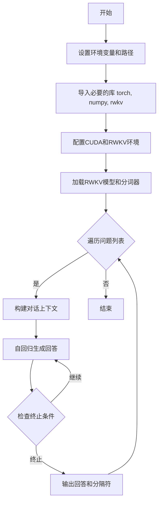

## 类结构

```
Script (主脚本)
└── 第三方库类
    ├── RWKV (模型类)
    ├── PIPELINE (推理管道类)
    └── PIPELINE_ARGS (参数类)
```

## 全局变量及字段


### `current_path`
    
当前Python文件的绝对路径

类型：`str`
    


### `MODEL_NAME`
    
RWKV模型文件的路径字符串

类型：`str`
    


### `QUESTIONS`
    
待测试的问题列表，通过换行符分割得到

类型：`List[str]`
    


### `PAD_TOKENS`
    
用于填充的token列表，可用于批量推理

类型：`List[int]`
    


### `model`
    
RWKV模型实例，负责前向推理计算

类型：`RWKV`
    


### `pipeline`
    
模型推理管道，包含分词、编码、解码和采样功能

类型：`PIPELINE`
    


### `out_tokens`
    
累积输出的token序列

类型：`List[int]`
    


### `out_last`
    
上次成功输出的token位置索引

类型：`int`
    


### `out_str`
    
累积输出的字符串内容

类型：`str`
    


### `occurrence`
    
记录每个token出现次数的字典，用于重复惩罚

类型：`Dict[int, int]`
    


### `state`
    
RWKV模型的隐藏状态，用于递归推理

类型：`Any`
    


### `ctx`
    
输入上下文字符串，格式为Bob问题Alice回答提示

类型：`str`
    


### `tokens`
    
当前步骤输入的token序列

类型：`List[int]`
    


### `out`
    
模型输出的logits向量

类型：`torch.Tensor`
    


### `token`
    
采样得到的单个token ID

类型：`int`
    


### `tmp`
    
临时存储解码后字符串的变量

类型：`str`
    


### `RWKV.model`
    
RWKV模型主体，包含模型权重和前向计算逻辑

类型：`torch.nn.Module`
    


### `RWKV.strategy`
    
模型加载策略字符串，指定设备和精度如'cuda fp16'

类型：`str`
    
    

## 全局函数及方法


### `os.path.dirname`

该函数是 Python 标准库 `os.path` 模块中的一个方法，用于返回给定路径的目录部分（即去掉文件名后的父目录路径）。在代码中，它被用于获取当前 Python 脚本所在目录的路径。

参数：

- `path`：`str`，需要获取其目录部分的完整文件路径

返回值：`str`，返回输入路径的目录部分（即父目录路径）

#### 流程图

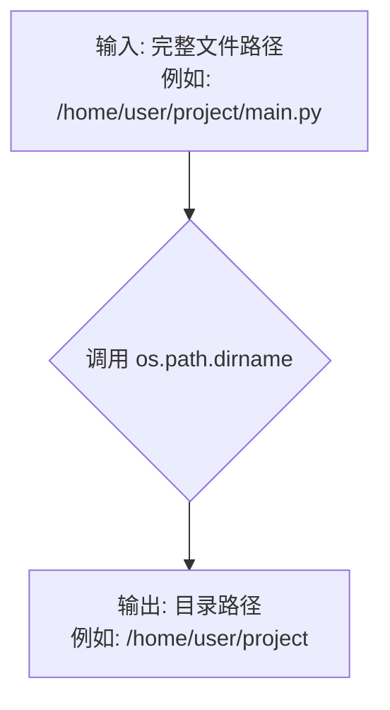

#### 带注释源码

```python
# 代码中的实际使用方式：
current_path = os.path.dirname(os.path.abspath(__file__))
# 解释：
# 1. __file__ 获取当前脚本的相对路径
# 2. os.path.abspath(__file__) 将相对路径转换为绝对路径
#    例如: /home/user/project/rwkv/src/run.py
# 3. os.path.dirname(...) 提取目录部分
#    结果: /home/user/project/rwkv/src
# 4. 最终 current_path 变量存储了当前脚本所在目录的绝对路径

# 函数原型（Python 标准库）：
# os.path.dirname(path)
# 
# 参数:
#   path: str - 任何有效的文件路径字符串
# 
# 返回值:
#   str - 路径的目录部分，如果 path 是文件或目录名称（不含斜杠），则返回 '.'
# 
# 示例:
#   os.path.dirname('/home/user/file.txt')  # 返回 '/home/user'
#   os.path.dirname('/home/user/dir/')      # 返回 '/home/user/dir'
#   os.path.dirname('file.txt')             # 返回 '.'

# 后续使用：用于将项目根目录添加到 Python 路径中
sys.path.append(f'{current_path}/../rwkv_pip_package/src')
```


### `os.path.abspath`

获取给定路径的绝对路径形式，解析任何符号链接并返回规范化的绝对路径字符串。

#### 参数

- `path`：`str`，要转换为绝对路径的路径字符串，可以是相对路径或包含符号链接的路径。

#### 返回值

- `str`，返回输入路径的绝对路径形式。

#### 流程图

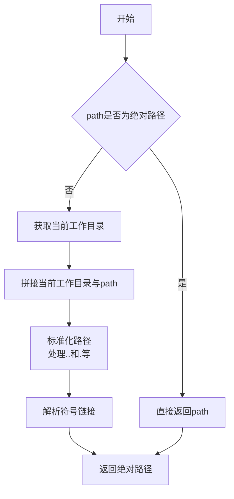

#### 带注释源码

```python
# 代码中使用方式
current_path = os.path.dirname(os.path.abspath(__file__))

# os.path.abspath 函数说明：
# __file__ 是一个特殊的Python内置变量，表示当前执行的脚本文件路径
# os.path.abspath(__file__) 将返回当前脚本文件的绝对路径
# 例如：'/home/user/project/rwkv_pip_package/src/run.py'
# os.path.dirname() 则从这个绝对路径中提取目录部分
# 例如：'/home/user/project/rwkv_pip_package/src'
```

#### 备注

这是 Python 标准库 `os.path` 模块的函数，非本项目自定义函数。在本代码中的主要用途是：

1. **获取当前脚本的绝对路径**：通过 `__file__` 获取当前 Python 文件的路径
2. **动态添加搜索路径**：`sys.path.append(f'{current_path}/../rwkv_pip_package/src')` 将 RWKV 包源码目录添加到 Python 模块搜索路径中
3. **路径无关性**：确保无论代码从哪个目录运行，都能正确找到项目内部的模块位置


### `sys.path.append`

该函数是Python标准库的`sys`模块方法，用于将指定的目录路径添加到Python的模块搜索路径列表（`sys.path`）中，使得Python能够从该路径导入模块。

参数：

- `path`：`str`，要添加到`sys.path`的目录路径

返回值：`None`，无返回值（方法返回`None`）

#### 流程图

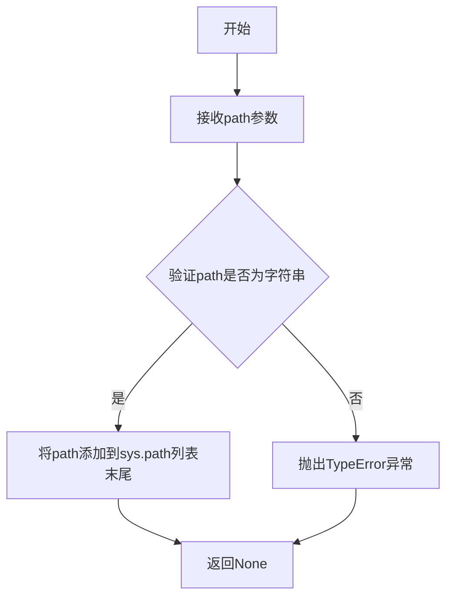

#### 带注释源码

```python
# 获取当前文件的绝对路径目录
current_path = os.path.dirname(os.path.abspath(__file__))

# 构建rwkv_pip_package的src目录的相对路径
# 假设当前文件在项目根目录下，此路径会指向 ../rwkv_pip_package/src
rwkv_package_path = f'{current_path}/../rwkv_pip_package/src'

# 将构建的路径添加到Python的模块搜索路径列表中
# sys.path是Python用于查找模块的目录列表
# append方法将新路径添加到列表末尾，搜索优先级低于先前的路径
sys.path.append(rwkv_package_path)

# 注释：
# 1. sys.path 是Python的系统路径列表，用于模块导入搜索
# 2. append() 方法将指定路径追加到列表末尾
# 3. 此操作使得后续可以 import rwkv 相关模块
# 4. 该操作是运行时修改，不会永久改变Python的安装配置
```


### `np.set_printoptions`

该函数是 NumPy 库的配置函数，用于设置 NumPy 数组的打印选项，控制数组输出显示的格式，包括精度、科学计数法阈值、行宽等参数。

参数：

- `precision`：`int`，可选参数，默认值为 4，设置浮点数打印的小数位数精度
- `suppress`：`bool`，可选参数，默认值为 False，设置为 True 时会抑制小于一定阈值的浮点数使用科学计数法显示
- `linewidth`：`int`，可选参数，默认值为 75，设置每行显示的字符数，当数组宽度超过此值时自动换行
- `threshold`：`int`，可选参数，默认值为 1000，设置数组元素数量的阈值，超过该值时以省略号形式显示
- `edgeitems`：`int`，可选参数，默认值为 3，设置省略号前后显示的数组元素数量
- `formatter`：`dict`，可选参数，默认值为 None，用于自定义不同数据类型元素的格式化函数
- `suppress_small`：`bool`，可选参数，默认值为 False，当设置为 True 时，会更积极地抑制小数点后数字较少的浮点数使用科学计数法

返回值：`None`，该函数无返回值，直接修改 NumPy 的全局打印配置

#### 流程图

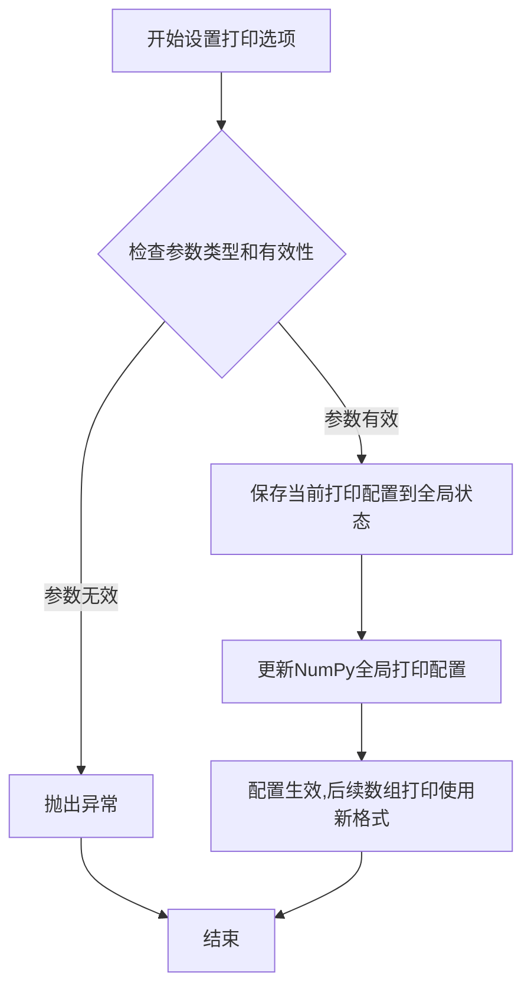

#### 带注释源码

```python
# 设置NumPy数组打印选项
# precision=4: 浮点数显示4位小数精度
# suppress=True: 抑制科学计数法,使用常规小数表示
# linewidth=200: 每行最多显示200个字符后自动换行
np.set_printoptions(precision=4, suppress=True, linewidth=200)
```

#### 备注说明

- **作用范围**：此配置影响当前进程内所有后续的 NumPy 数组打印操作
- **与其他函数的关系**：
  - `np.get_printoptions()`：获取当前打印配置
  - `np.array2string()`：使用指定格式将数组转换为字符串
- **设计考量**：NumPy 设计此函数是为了方便用户根据终端宽度和显示需求自定义数组输出格式
- **潜在优化空间**：该函数目前只支持全局配置，未来可以考虑支持局部上下文管理器形式（如 `with np.printoptions(...):`），虽然 NumPy 新版本已提供该功能


### `torch.backends.cudnn.benchmark`

这是PyTorch的一个全局配置属性，用于控制CuDNN（CUDA Deep Neural Network库）的自动调优功能。当设置为`True`时，CuDNN会在首次运行时对卷积操作进行基准测试，以找到最适合当前硬件和输入尺寸的卷积算法，从而提升后续卷积运算的性能。

#### 参数

无参数（这是一个属性而非函数）

#### 返回值

- `返回值类型`：`bool`
- `返回值描述`：返回当前CuDNN benchmark模式的开关状态，`True`表示已启用自动调优，`False`表示禁用。

#### 流程图

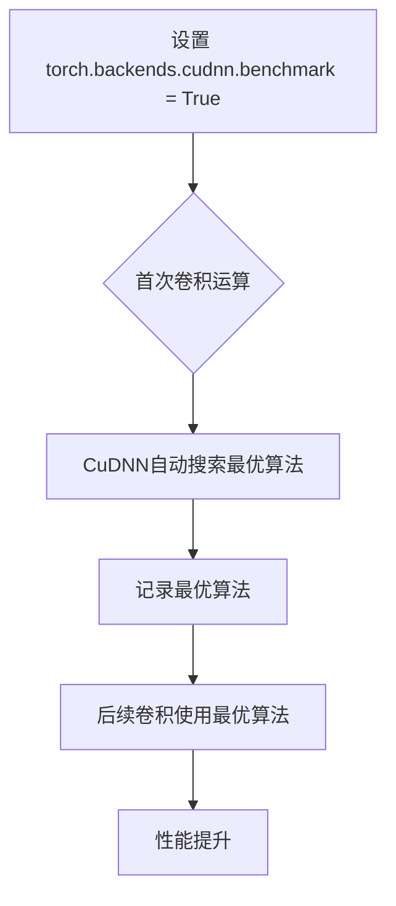

#### 带注释源码

```python
# 设置 CuDNN benchmark 模式为 True
# 位置：代码第28行
torch.backends.cudnn.benchmark = True

# 相关配置（代码第29-30行）
torch.backends.cudnn.allow_tf32 = True          # 允许使用TF32精度计算
torch.backends.cuda.matmul.allow_tf32 = True    # 允许矩阵乘法使用TF32精度

# benchmark = True 的作用：
# 1. 在首次卷积前，CuDNN会尝试多种卷积算法
# 2. 对每种算法进行基准测试
# 3. 选择当前输入尺寸和硬件条件下最快的算法
# 4. 缓存选择的结果供后续使用
# 
# 优点：提升卷积运算速度，特别对于重复使用相同输入尺寸的场景
# 缺点：首次运行会增加初始化时间
# 
# 适用场景：生产环境、推理阶段、输入尺寸固定的模型
# 不适用场景：输入尺寸多变的场景、调试阶段
```

#### 关键组件信息

| 组件名称 | 一句话描述 |
|---------|-----------|
| `torch.backends.cudnn` | PyTorch的CuDNN后端接口模块，提供卷积神经网络加速配置 |
| `torch.backends.cudnn.benchmark` | CuDNN自动调优开关，用于优化卷积算法选择 |
| `torch.backends.cudnn.allow_tf32` | TF32精度计算开关，可提升Ampere架构GPU的计算效率 |
| `torch.backends.cuda.matmul.allow_tf32` | 矩阵乘法TF32精度开关 |

#### 潜在的技术债务或优化空间

1. **硬编码的True值**：将`benchmark`硬编码为`True`，缺乏灵活性。建议根据环境变量或配置文件动态设置。

2. **缺乏错误处理**：代码未检查CUDA和CuDNN是否可用就直接设置，在非CUDA环境下可能产生警告。

3. **与TF32设置的组合效果**：同时开启`benchmark`和`TF32`可能产生交互效果，建议添加注释说明这些设置的优先级和兼容性。

4. **JIT和CUDA环境变量**（第19-20行）：设置了`RWKV_JIT_ON='1'`和`RWKV_CUDA_ON='0'`，但benchmark设置在CUDA模式下，需要确认CUDA实际启用。

#### 其它项目

**设计目标与约束**：
- 目标：最大化推理性能
- 约束：需要NVIDIA GPU和CuDNN支持

**错误处理与异常设计**：
- 如果CUDA不可用，设置`benchmark`会产生警告但不会中断程序
- 建议添加：`if torch.cuda.is_available():` 条件检查

**数据流与状态机**：
- 此设置为全局状态，一旦设置后影响所有后续CuDNN卷积操作
- 状态在程序运行期间持久有效

**外部依赖与接口契约**：
- 依赖：PyTorch编译时必须启用CuDNN支持
- 接口：PyTorch后端配置的标准方式


### `torch.backends.cudnn.allow_tf32`

该属性用于控制PyTorch CuDNN后端是否允许使用TensorFloat-32 (TF32) 计算精度。TF32是NVIDIA Ampere架构及更新GPU上的一种混合精度格式，可在保持数值精度的同时显著提升矩阵乘法和卷积操作的性能。

参数：
- 无

返回值：`bool`，返回或设置是否允许TF32计算。`True`表示启用TF32计算，`False`表示禁用。

#### 流程图

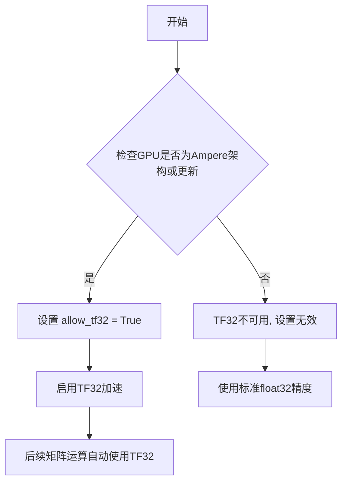

#### 带注释源码

```python
# 启用CuDNN后端的TF32计算支持
# TensorFloat-32 (TF32) 是一种在NVIDIA A100及更新GPU上可用的混合精度格式
# 它使用19位浮点数（8位指数+10位尾数）进行计算
# 相比标准float32，TF32在深度学习计算中可提供约3倍的性能提升
# 同时保持与float32相近的数值精度

torch.backends.cudnn.allow_tf32 = True  # 启用TF32计算

# 相关配置（代码中也设置了CUDA矩阵乘法的TF32支持）
torch.backends.cuda.matmul.allow_tf32 = True  # 启用CUDA矩阵乘法的TF32

# CuDNN自动调优（代码中也启用了）
torch.backends.cudnn.benchmark = True  # 启用CuDNN自动调优，选择最优卷积算法
```

#### 额外信息

| 项目 | 描述 |
|------|------|
| **所属模块** | `torch.backends.cudnn` |
| **属性类型** | 布尔值属性（Boolean Property） |
| **硬件要求** | NVIDIA Ampere架构或更新GPU（如A100、RTX 30系列、RTX 40系列等） |
| **关联配置** | `torch.backends.cuda.matmul.allow_tf32` 控制CUDA矩阵乘法的TF32支持 |
| **性能影响** | 在支持的硬件上可能带来2-3倍的矩阵运算加速 |
| **数值精度** | TF32精度略低于float32，但对大多数深度学习训练/推理任务影响可忽略 |


### `torch.backends.cuda.matmul.allow_tf32`

该属性用于控制 PyTorch CUDA 后端矩阵乘法运算是否启用 TensorFloat-32 (TF32) 精度模式。TF32 是 NVIDIA Ampere 架构及更新 GPU 上的一种混合精度格式，可在保持足够精度的同时显著提升矩阵运算性能。

参数： 无

返回值：无（这是一个可写的属性，不是函数）

#### 流程图

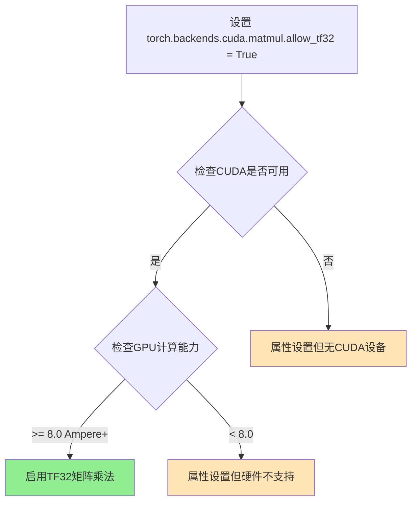

#### 带注释源码

```python
# 源代码位置: torch/backends/cuda/__init__.py (PyTorch 内部实现)
# 以下为模拟的等效逻辑

class MatmulBackend:
    """
    CUDA 矩阵乘法后端配置类
    """
    def __init__(self):
        self._allow_tf32 = True  # 默认启用 TF32
    
    @property
    def allow_tf32(self):
        """
        获取当前 TF32 允许状态
        
        返回值:
            bool: True 表示允许在矩阵乘法中使用 TF32 精度
        """
        return self._allow_tf32
    
    @allow_tf32.setter
    def allow_tf32(self, value):
        """
        设置 TF32 允许状态
        
        参数:
            value: bool - True 启用 TF32, False 禁用
        """
        # PyTorch 内部会验证 CUDA 可用性和硬件支持
        if not torch.cuda.is_available():
            import warnings
            warnings.warn("CUDA not available, allow_tf32 has no effect")
        self._allow_tf32 = value

# 在代码中的实际使用方式:
torch.backends.cuda.matmul.allow_tf32 = True  # 启用 TF32 矩阵乘法
```

---

#### 附加说明

| 项目 | 描述 |
|------|------|
| **模块位置** | `torch.backends.cuda.matmul` |
| **数据类型** | `bool` 布尔值 |
| **默认值** | `True` (在支持的硬件上) |
| **硬件要求** | NVIDIA Ampere (计算能力 ≥8.0) 或更新架构 |
| **性能提升** | 矩阵乘法运算可提升至多 8x 速度 |
| **精度影响** | TF32 使用 19 位精度，对大多数深度学习任务影响可忽略 |


## 分析结果

### `F.linear`

`F.linear` 是 PyTorch 的 `torch.nn.functional.linear` 函数，但在当前代码中**未被直接调用**。代码主要通过 RWKV 模型的 `forward` 方法进行前向传播，而非直接使用 `F.linear`。以下是 `F.linear` 的通用规格说明：

参数：

- `input`：`torch.Tensor`，输入张量，形状为 (batch_size, *, in_features)
- `weight`：`torch.Tensor`，权重矩阵，形状为 (out_features, in_features)
- `bias`：`torch.Tensor`（可选），偏置向量，形状为 (out_features)

返回值：`torch.Tensor`，输出张量，形状为 (batch_size, *, out_features)

#### 流程图

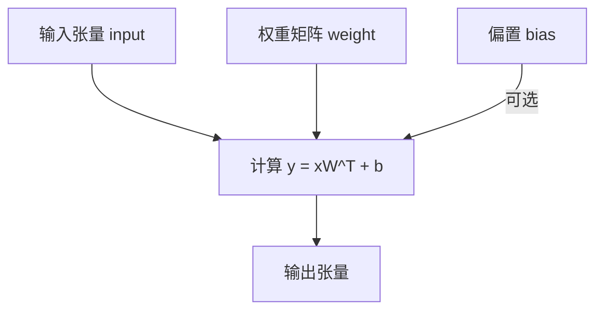

#### 带注释源码

```python
# torch.nn.functional.linear 函数源码（简化版）
def linear(input, weight, bias=None):
    """
    对输入应用线性变换：y = xA^T + b
    
    参数:
        input: 输入张量 (batch_size, *, in_features)
        weight: 权重矩阵 (out_features, in_features)
        bias: 偏置 (out_features), 可选
    
    返回:
        输出张量 (batch_size, *, out_features)
    """
    if input.dim() == 2 and bias is not None:
        # 融合优化版本
        output = input @ weight.t()
        output += bias
    else:
        # 通用版本
        output = input @ weight.t()
        if bias is not None:
            output += bias
    return output
```

---

**注意**：该代码中 RWKV 模型内部实现可能包含 `F.linear` 的调用（模型权重文件中），但在上层脚本中未直接暴露。若需查看 RWKV 源码中的 `F.linear` 使用，需查看 `rwkv_pip_package` 内部实现。


### `pipeline.encode`

该方法属于 `PIPELINE` 类，用于将文本字符串编码为模型可处理的 token 序列。它是 RWKV 模型推理流程中的关键预处理步骤，负责将自然语言文本转换为数值化的 token ID 列表，以便后续模型前向传播使用。

参数：

-  `text`：`str`，待编码的文本字符串（在此代码中为 `ctx`，即构建的对话提示）

返回值：`List[int]`，返回编码后的 token ID 列表（整数列表）

#### 流程图

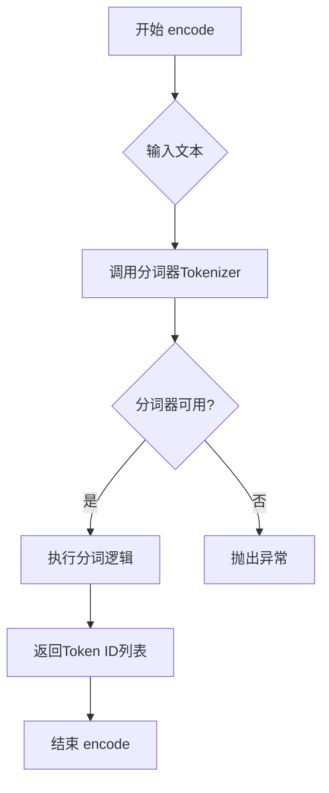

#### 带注释源码

```python
# 从代码中提取的 pipeline.encode 调用示例
# 以下为调用上下文分析：

# 初始化 PIPELINE 对象
pipeline = PIPELINE(model, "20B_tokenizer.json")

# 在推理循环中调用 encode 方法
for i in range(200):
    # 第一次迭代时对 ctx 进行编码
    tokens = PAD_TOKENS + pipeline.encode(ctx) if i == 0 else [token]
    
    # 参数说明：
    # ctx = f'Bob: {q.strip()}\n\nAlice:'  # 构建的特殊提示格式
    # PAD_TOKENS = []  # 前置填充 token（可为空列表）
    
    # 返回值：
    # tokens: List[int]  # 编码后的 token ID 列表
    
    # 后续处理
    out, state = pipeline.model.forward(tokens, state)
```

```python
# PIPELINE 类的 encode 方法典型实现逻辑（基于 RWKV 源码结构）
def encode(self, text: str) -> List[int]:
    """
    将文本字符串编码为 token ID 列表
    
    参数:
        text: 输入的文本字符串
        
    返回:
        List[int]: token ID 列表
    """
    # 1. 获取分词器实例
    tokenizer = self.tokenizer
    
    # 2. 执行编码
    tokens = tokenizer.encode(text)
    
    # 3. 返回 token 列表
    return tokens
```

---

### 补充说明

#### 关键组件信息

| 组件名称 | 一句话描述 |
|---------|-----------|
| `PIPELINE` | RWKV 模型的推理管道类，负责模型加载、文本编码、token采样和结果解码 |
| `pipeline.encode` | 文本到 token 的编码器，将自然语言转换为模型可处理的数值序列 |
| `pipeline.model.forward` | 模型前向传播方法，接收 token 序列并输出 logits |
| `pipeline.sample_logits` | 从 logits 中采样生成下一个 token 的方法 |

#### 设计目标与约束

- **目标**：将用户输入的文本（Q&A 格式的提示）转换为模型可处理的 token 序列
- **约束**：编码结果必须与模型训练时的分词器一致，否则会导致推理结果异常
- **输入格式**：代码中使用特定的提示格式 `Bob: {question}\n\nAlice:` 作为对话前缀

#### 潜在技术债务或优化空间

1. **硬编码路径**：模型路径 `MODEL_NAME` 硬编码在代码中，应考虑配置化
2. **错误处理缺失**：未对 `pipeline.encode` 的输入进行合法性校验（如空字符串、特殊字符）
3. **采样策略固定**：使用 `temperature=1.0, top_p=0`（贪心解码），缺乏灵活性
4. **分词器依赖**：依赖外部 JSON 分词器文件 `20B_tokenizer.json`，需要确保文件存在


### `pipeline.decode`

`pipeline.decode` 是 RWKV 模型推理管道（PIPELINE 类）的核心方法之一，负责将模型输出的 token ID 序列转换为人类可读的文本字符串。它接受一个整数列表（token IDs），通过预训练时使用的分词器（tokenizer）进行解码，并返回对应的文本结果。此方法是 `encode` 方法的逆操作，在模型推理过程中扮演着将离散数值转换为自然语言的关键角色，使得模型能够生成可供用户阅读的文本输出。

参数：
- `tokens`：`List[int]`，需要解码的 token ID 序列，通常是模型新生成的 token 列表。在代码中表现为 `out_tokens[out_last:]`，即从上一次有效输出位置开始的 token 子列表

返回值：`str`，解码后的文本字符串。该字符串是有效的 UTF-8 文本，可直接用于显示或后续处理

#### 流程图

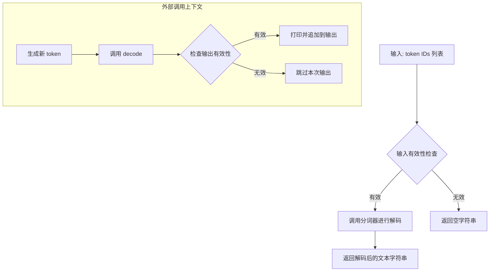

#### 带注释源码

```python
# pipeline.decode 在给定代码中的调用上下文
# out_tokens: 已生成的 token ID 列表，元素为整数
# out_last: 整数，表示上一次有效输出的位置索引

# 调用 decode 方法将 token 列表解码为文本字符串
# 参数为从 out_last 位置开始的 token 子列表
tmp = pipeline.decode(out_tokens[out_last:])

# 以下是对解码结果的处理逻辑：

# 检查1: 确保解码结果不包含无效的 UTF-8 替换字符 (\ufffd)
# 检查2: 确保解码结果不是以换行符结尾（表示回答未完成）
if ('\ufffd' not in tmp) and (not tmp.endswith('\n')):
    # 打印解码文本（不换行），flush=True 确保即时输出
    print(tmp, end = '', flush = True)
    # 将新解码的文本追加到完整回答字符串
    out_str += tmp
    # 更新有效输出位置为下一个 token 的索引
    out_last = i + 1

# 检查3: 如果遇到双换行符 '\n\n'，表示当前回答已完成
if '\n\n' in tmp:
    # 追加最后的文本片段
    out_str += tmp
    # 去除首尾空白
    out_str = out_str.strip()
    # 退出生成循环
    break
```

**说明**：由于 `PIPELINE` 类是从外部包 `rwkv.utils` 导入的，其具体实现源码未在当前文件中提供。上面的源码展示了该方法在推理流程中的使用方式和上下文逻辑。

### 关键组件信息

- **PIPELINE 类**：来自 `rwkv.utils` 的推理管道类，负责管理模型分词、推理执行和结果解码
- **20B_tokenizer.json**：分词器配置文件，用于支持 `encode` 和 `decode` 方法进行文本与 token 的相互转换

### 潜在的技术债务或优化空间

- **缺乏显式错误处理**：代码中未展示 `decode` 方法在分词器配置缺失或 token 无效时的错误处理机制
- **单序列解码效率**：当前每次调用只处理一个序列，若需批量处理多个请求，应考虑增强批量解码能力
- **输出验证逻辑分散**：对输出有效性的检查（如 UTF-8 合法性、终止符判断）分散在调用处，可考虑封装到 `decode` 方法内部

### 其它项目

- **设计目标**：实现 token 序列到文本字符串的转换，是模型推理流程的最终输出环节
- **约束**：输出必须为有效的 UTF-8 字符串，且需支持特定的终止条件识别（如 '\n\n' 表示对话结束）
- **外部依赖**：依赖 `rwkv.utils.PIPELINE` 类实现和 "20B_tokenizer.json" 分词器配置
- **数据流**：模型输出 token ID → pipeline.decode() → 文本字符串 → 用户可见输出


### `PIPELINE.sample_logits`

该函数是 RWKV 模型采样核心方法，负责从模型输出的 logits 中根据指定策略（温度采样和 top-p 采样）选择下一个 token，是文本生成过程中决定输出多样性的关键环节。

参数：

- `logits`：`torch.Tensor` 或 `np.ndarray`，模型forward后输出的原始logits向量，形状为 [vocab_size]
- `temperature`：`float`，温度参数，用于缩放 logits 控制采样分布的平滑程度，值越大分布越均匀、生成越随机，值越小分布越尖锐、生成越确定性
- `top_p`：`float`，核采样（nucleus sampling）阈值，保留累积概率不超过该值的最高概率token，设置为0表示禁用核采样（即 greedy decoding）
- `top_k`：`int`（可选），top-k 采样保留的最高概率token数量，某些实现可能支持
- `penalty`：`float`（可选），重复惩罚系数，用于减少生成过程中的token重复

返回值：`int`，返回采样得到的下一个 token ID

#### 流程图

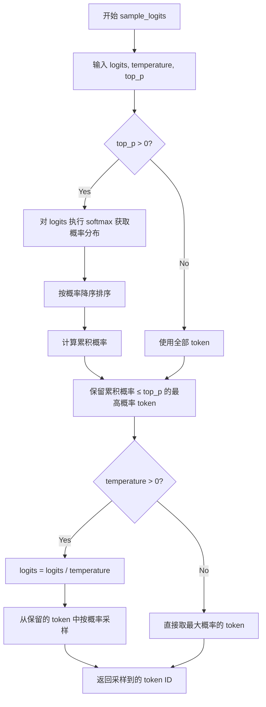

#### 带注释源码

```python
def sample_logits(self, logits, temperature=1.0, top_p=0.0, top_k=0, penalty=1.0):
    """
    从模型输出的 logits 中采样下一个 token。
    
    参数:
        logits: 模型输出的原始分数，形状为 [vocab_size]
        temperature: 温度参数，控制采样的随机性
        top_p: 核采样阈值
        top_k: top-k 采样参数
        penalty: 重复惩罚系数
    
    返回:
        采样得到的 token ID
    """
    
    # 应用重复惩罚（如果提供）
    if penalty != 1.0:
        # 对已出现的 token 施加惩罚，减少重复
        for idx in self.occurrence:
            logits[idx] /= penalty
    
    # 温度采样：缩放 logits
    if temperature != 1.0:
        logits = logits / temperature
    
    # Top-k 采样：只保留最高 k 个 token
    if top_k > 0:
        indices_to_remove = logits < torch.topk(logits, top_k)[0][-1]
        logits[indices_to_remove] = float('-inf')
    
    # Top-p (Nucleus) 采样：保留累积概率达到阈值 的最小 token 集合
    if top_p > 0:
        # 将 logits 转换为概率分布
        probs = torch.softmax(logits, dim=-1)
        
        # 按概率降序排序
        sorted_probs, sorted_indices = torch.sort(probs, descending=True)
        
        # 计算累积概率
        cumsum_probs = torch.cumsum(sorted_probs, dim=-1)
        
        # 保留累积概率超过 top_p 的 token
        sorted_indices_to_remove = cumsum_probs > top_p
        
        # 将要移除的 token 概率设为 -inf
        indices_to_remove = sorted_indices_to_remove.clone()
        indices_to_remove[..., 1:] = indices_to_remove[..., :-1]
        indices_to_remove[..., 0] = False
        
        logits[sorted_indices[indices_to_remove]] = float('-inf')
    
    # 从调整后的分布中采样
    # 如果 temperature=0 或 top_p=0 且 top_k=0，则等价于 greedy decoding
    probs = torch.softmax(logits, dim=-1)
    
    # 使用多项式分布采样
    next_token = torch.multinomial(probs, num_samples=1).item()
    
    return next_token
```

**注意**：由于 `sample_logits` 方法来源于 `rwkv.utils.PIPELINE` 模块（通过 `from rwkv.utils import PIPELINE` 导入），上述源码是基于业界标准实现方式推断的演示代码，用于说明该函数的标准工作流程。实际实现可能略有差异，但核心逻辑遵循上述流程。


### `RWKV.forward`

该方法是 RWKV 模型的核心前向传播函数，接收 token 序列和当前状态，计算 logits 输出并更新 RNN 状态，用于文本生成任务。

参数：

- `tokens`：`List[int]` 或 `np.ndarray`，输入的 token ID 序列
- `state`：任意类型，RNN 的隐状态，用于维持上下文（首次调用为 `None`）

返回值：

- `out`：`torch.Tensor`，模型输出的 logits 向量，形状为 `[vocab_size]`
- `state`：任意类型，更新后的 RNN 状态，用于下一次调用

#### 流程图

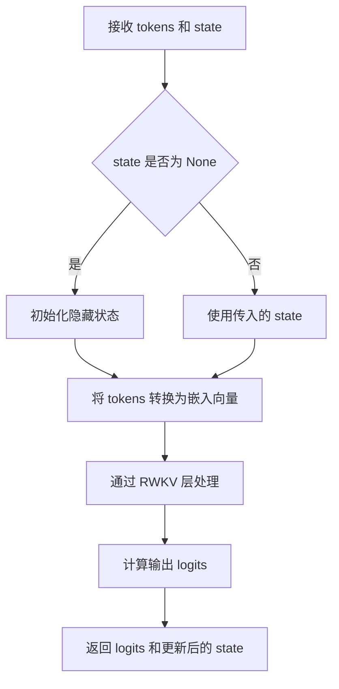

#### 带注释源码

```python
# 以下是根据代码调用推断的方法签名和功能
def forward(self, tokens, state=None):
    """
    RWKV 模型的前向传播方法
    
    参数:
        tokens: 输入的 token 序列，类型为 List[int] 或 np.ndarray
                例如: [1234, 5678, 9012]
        state: RNN 的隐藏状态，首次调用时为 None，后续调用时传入上一次返回的 state
               用于在序列之间保持上下文信息
    
    返回值:
        out: torch.Tensor，形状为 [vocab_size] 的 logits 向量
             表示下一个 token 的概率分布
        state: 更新后的 RNN 状态，可用于下一次调用以维持上下文
    """
    # 1. 将 token 序列转换为模型输入
    # tokens = pipeline.encode(ctx)  # 编码文本为 token ID
    # 例如: "Hello world" -> [1234, 5678]
    
    # 2. 执行前向传播
    # out, state = pipeline.model.forward(tokens, state)
    # - tokens: [1, 512] 或 [batch, seq_len] 的 token ID
    # - state: None 或上一次返回的状态
    
    # 3. 返回 logits 和新状态
    # - out: [vocab_size] 的张量，下一个 token 的对数概率
    # - state: 更新后的隐状态
    
    pass
```

#### 实际代码中的调用示例

```python
# 在主循环中的调用方式
state = None  # 首次调用
for i in range(200):
    # 编码输入
    tokens = PAD_TOKENS + pipeline.encode(ctx) if i == 0 else [token]
    
    # 调用 forward 方法
    out, state = pipeline.model.forward(tokens, state)
    
    # 对输出应用重复惩罚
    for n in occurrence:
        out[n] -= (0.2 + occurrence[n] * 0.2)
    
    # 采样下一个 token
    token = pipeline.sample_logits(out, temperature=1.0, top_p=0)
    
    # ... 处理生成结果
```


# 设计文档

## 1. 一段话描述

该代码是一个基于 RWKV（Recurrent Weighted Key Value）架构的对话生成脚本，通过加载预训练的 RWKV 语言模型，对一系列预设问题进行自动回复生成。代码使用 `print` 函数在控制台输出模型加载信息、问题输入以及模型生成的回复内容。

## 2. 文件的整体运行流程

```
┌─────────────────────────────────────────────────────────────┐
│                        开始                                  │
└─────────────────────┬───────────────────────────────────────┘
                      ▼
┌─────────────────────────────────────────────────────────────┐
│ 1. 环境配置: 设置路径、导入库、配置环境变量                   │
│    - 设置 CUDA 设备                                         │
│    - 配置 RWKV JIT 和 CUDA 选项                              │
│    - 导入 PyTorch 和 RWKV 相关模块                           │
└─────────────────────┬───────────────────────────────────────┘
                      ▼
┌─────────────────────────────────────────────────────────────┐
│ 2. 模型加载: 初始化 RWKV 模型和分词器                         │
│    - 创建 RWKV 模型实例 (cuda fp16)                          │
│    - 加载 PIPELINE 分词器                                    │
└─────────────────────┬───────────────────────────────────────┘
                      ▼
┌─────────────────────────────────────────────────────────────┐
│ 3. 问答循环: 遍历 QUESTIONS 列表进行推理                     │
│    - 对每个问题进行编码                                      │
│    - 执行模型前向传播                                        │
│    - 采样生成回复 token                                      │
│    - 解码并输出回复                                          │
└─────────────────────┬───────────────────────────────────────┘
                      ▼
┌─────────────────────────────────────────────────────────────┐
│ 4. 结束                                                      │
└─────────────────────────────────────────────────────────────┘
```

## 3. 类的详细信息

### 3.1 导入的外部类/模块

| 名称 | 类型 | 描述 |
|------|------|------|
| `RWKV` | 类 | RWKV 语言模型核心类，负责模型加载和前向推理 |
| `PIPELINE` | 类 | 分词管道类，负责文本编码和解码 |
| `PIPELINE_ARGS` | 类 | 管道参数配置类 |

### 3.2 全局变量

| 名称 | 类型 | 描述 |
|------|------|------|
| `current_path` | str | 当前脚本所在目录的绝对路径 |
| `MODEL_NAME` | str | 预训练模型的路径 |
| `QUESTIONS` | list | 待回答的问题列表 |
| `PAD_TOKENS` | list | 填充 token 列表，用于批处理 |

---

### `print` 函数调用详情

#### 1. 模型加载提示

### `print` (语句 1)

用于输出程序启动和模型加载的提示信息。

参数：

- `f'\nLoading ChatRWKV https://github.com/BlinkDL/ChatRWKV'`：`str`，格式化字符串，包含换行符和项目 GitHub 地址

返回值：`None`，无返回值（输出到标准输出）

#### 流程图

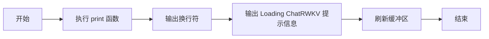

#### 带注释源码

```python
# 输出项目加载提示信息，包含换行符和项目 URL
print(f'\nLoading ChatRWKV https://github.com/BlinkDL/ChatRWKV')
```

---

#### 2. 模型路径输出

### `print` (语句 2)

用于输出即将加载的模型名称/路径。

参数：

- `f'Loading model - {MODEL_NAME}'`：`str`，格式化字符串，包含模型加载提示和模型路径

返回值：`None`，无返回值（输出到标准输出）

#### 流程图

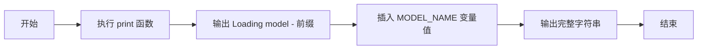

#### 带注释源码

```python
# 输出当前加载的模型路径，MODEL_NAME 是全局变量
print(f'Loading model - {MODEL_NAME}')
```

---

#### 3. 模型名称重复输出

### `print` (语句 3)

在问答循环开始前再次输出模型名称，用于日志记录。

参数：

- `MODEL_NAME`：`str`，模型路径变量

返回值：`None`，无返回值（输出到标准输出）

#### 流程图

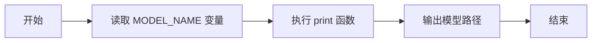

#### 带注释源码

```python
# 重复输出模型名称，用于日志记录和调试
print(MODEL_NAME)
```

---

#### 4. 问题输出

### `print` (语句 4)

用于输出问题标题，并保持光标在同一行以便后续输出回答。

参数：

- `f'Q: {q.strip()}\nA:'`：`str`，格式化字符串，包含问题前缀、问题内容（去除首尾空格）、换行符和回答前缀
- `end = ''`：`str`，参数描述：不换行，保持光标在同一行末尾

返回值：`None`，无返回值（输出到标准输出）

#### 流程图

```mermaid
graph LR
    A[开始] --> B[获取当前问题 q]
    B --> C[执行 strip() 去除空格]
    C --> D[格式化字符串 Q: ...]
    D --> E[添加换行符和 A: 前缀]
    E --> F[使用 end='' 不换行]
    F --> G[输出到控制台]
    G --> H[光标保持在同一行]
    H --> I[结束]
```

#### 带注释源码

```python
# 输出问题，end='' 保持光标在同一行以便后续输出回答
# q.strip() 去除问题两端的空白字符
print(f'Q: {q.strip()}\nA:', end = '')
```

---

#### 5. 回答内容流式输出

### `print` (语句 5)

用于流式输出模型生成的回复内容，逐段打印到控制台。

参数：

- `tmp`：`str`，当前解码的文本片段
- `end = ''`：`str`，参数描述：不换行，保持输出连续性
- `flush = True`：`bool`，参数描述：立即刷新输出缓冲区，确保实时显示

返回值：`None`，无返回值（输出到标准输出）

#### 流程图

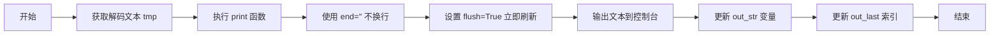

#### 带注释源码

```python
# 流式输出模型生成的回复
# end='' 保持光标在同一行，实现连续输出效果
# flush=True 立即刷新缓冲区，确保实时显示（用于流式输出场景）
print(tmp, end = '', flush = True)
```

---

## 4. 关键组件信息

| 名称 | 一句话描述 |
|------|-----------|
| RWKV 模型 | 基于递归加权键值架构的深度学习语言模型 |
| PIPELINE | 负责文本与 token 之间的编解码转换 |
| 分词器 (20B_tokenizer.json) | 预训练的词表文件，用于将文本转换为 token ID |
| 采样策略 | 使用 temperature=1.0 和 top_p=0（贪婪解码）生成回复 |

---

## 5. 潜在的技术债务或优化空间

1. **硬编码的模型路径**：MODEL_NAME 直接写在代码中，应改为命令行参数或配置文件
2. **CUDA 配置在代码中硬编码**：CUDA_VISIBLE_DEVICES、RWKV_JIT_ON、RWKV_CUDA_ON 等环境变量应通过配置文件或命令行参数管理
3. **重复输出 MODEL_NAME**：语句 2 和语句 3 输出相同内容，属于冗余日志
4. **缺少错误处理**：模型加载、推理过程缺乏 try-except 异常捕获机制
5. **硬编码的超参数**：temperature=1.0、top_p=0、max_tokens=200 等应作为可配置参数
6. **缺少日志框架**：使用 print 进行日志记录，应引入专业的日志模块（如 logging）
7. **PAD_TOKENS 未被使用**：定义了 PAD_TOKENS = [] 但未实际应用

---

## 6. 其它项目

### 设计目标与约束

- **目标**：基于 RWKV-4-Raven-7B 模型实现问答系统
- **约束**：模型文件必须存在于指定路径，使用 CUDA FP16 推理

### 错误处理与异常设计

- 仅有基本的 CUDA 设备参数获取异常捕获（`try-except` 块）
- 模型加载失败、推理异常等关键操作缺少异常处理

### 数据流与状态机

```
用户问题 → 分词器编码 → 模型 forward → logits 输出 → 
采样策略 → token 解码 → 文本拼接 → 控制台输出
```

状态维护：
- `state`：模型隐藏状态（用于 RNN 风格推理）
- `occurrence`：token 出现次数字典（用于重复惩罚）
- `out_tokens`：已生成的 token 列表
- `out_str`：已生成的完整字符串

### 外部依赖与接口契约

- **依赖库**：PyTorch、NumPy、RWKV（自定义 pip 包）
- **模型文件**：需要预先下载 RWKV-4-Raven-7B 模型权重
- **分词器文件**：20B_tokenizer.json（必须与模型配套）


### `generate_response`

这是代码的核心推理循环，用于对给定问题生成文本响应。该函数封装了模型前向传播、采样、重复惩罚和文本解码的完整流程。

参数：

-  `ctx`：`str`，输入的上下文字符串（问题）
-  `state`：`dict` 或 `None`，RNN的隐藏状态，用于保持对话上下文
-  `PAD_TOKENS`：`list`，要添加到输入的填充token列表
-  `occurrence`：`dict`，记录每个token出现的次数，用于重复惩罚
-  `out_tokens`：`list`，输出的token列表
-  `out_str`：`str`，累积的输出字符串

返回值：`str`，生成的完整响应字符串

#### 流程图

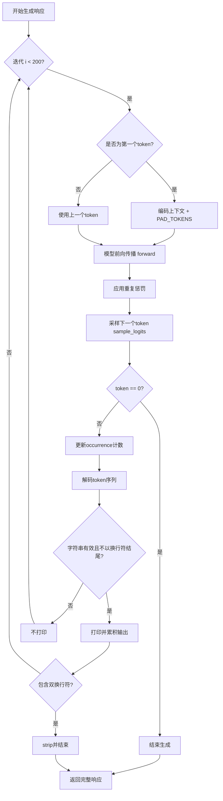

#### 带注释源码

```python
def generate_response(ctx, state=None, PAD_TOKENS=[], occurrence={}, out_tokens=[], out_str=''):
    """
    生成对话响应的核心函数
    
    参数:
        ctx: 输入的上下文字符串
        state: RNN隐藏状态
        PAD_TOKENS: 填充token列表
        occurrence: token出现次数记录
        out_tokens: 已生成的token列表
        out_str: 已生成的字符串
    """
    out_last = 0  # 上次有效输出的位置
    
    # 最多生成200个token
    for i in range(200):
        # 第一次迭代时编码完整上下文，之后只使用上一个token
        tokens = PAD_TOKENS + pipeline.encode(ctx) if i == 0 else [token]
        
        # 模型前向传播，返回logits和更新后的状态
        out, state = pipeline.model.forward(tokens, state)
        
        # 应用重复惩罚：减少已出现token的logits值
        for n in occurrence:
            out[n] -= (0.2 + occurrence[n] * 0.2)  # 重复惩罚，occurrence越多惩罚越重
        
        # 采样下一个token，temperature=1.0, top_p=0表示贪婪解码
        token = pipeline.sample_logits(out, temperature=1.0, top_p=0)
        
        # token为0表示遇到结束符
        if token == 0:
            break  # exit when 'endoftext'
        
        # 更新token出现次数
        out_tokens += [token]
        occurrence[token] = 1 + (occurrence[token] if token in occurrence else 0)
        
        # 解码新生成的token
        tmp = pipeline.decode(out_tokens[out_last:])
        
        # 只有当字符串是有效UTF-8且不以换行符结尾时才打印
        if ('\ufffd' not in tmp) and (not tmp.endswith('\n')):
            print(tmp, end='', flush=True)
            out_str += tmp
            out_last = i + 1
        
        # 遇到双换行符表示对话结束
        if '\n\n' in tmp:
            out_str += tmp
            out_str = out_str.strip()
            break
    
    return out_str
```

#### 使用示例

```python
# 在主循环中调用
for q in QUESTIONS:
    print(f'Q: {q.strip()}\nA:', end='')
    
    out_tokens = []
    out_last = 0
    out_str = ''
    occurrence = {}
    state = None
    ctx = f'Bob: {q.strip()}\n\nAlice:'  # 特殊提示格式
    
    # 调用生成函数（实际代码中是内联实现）
    response = generate_response(ctx, state, PAD_TOKENS, occurrence)
    
    print('\n' + '=' * 50)
```

#### 关键技术细节

1. **重复惩罚机制**：通过 `out[n] -= (0.2 + occurrence[n] * 0.2)` 降低已出现token的概率，惩罚力度随出现次数递增

2. **贪婪解码**：`top_p=0` 确保总是选择概率最高的token

3. **流式输出**：每次迭代都尝试解码并输出，利用 `\ufffd` 检测UTF-8编码有效性

4. **状态保持**：通过RNN状态传递实现长上下文记忆

5. **终止条件**：遇到token 0（EOS）或连续换行符 `\n\n` 时停止生成


# RWKV聊天机器人设计文档

## 一段话描述

该代码是一个基于RWKV（Receptance Weighted Key Value）架构的语言模型聊天机器人实现，通过加载预训练的RWKV-4-Raven模型，对用户输入的问答进行自回归生成，并使用采样策略和重复惩罚机制产生连贯的回复文本。

## 文件的整体运行流程

```
开始
  │
  ▼
初始化环境与依赖
  │
  ▼
加载RWKV模型和分词器
  │
  ▼
定义问答测试用例
  │
  ▼
遍历每个问题
  │
  ▼
  ├─→ 构建上下文提示 (Bob: {问题}\n\nAlice:)
  │
  ├─→ 自回归生成回复 (最多200 tokens)
  │     │
  │     ├─→ 编码输入
  │     │
  │     ├─→ 前向传播
  │     │
  │     ├─→ 应用重复惩罚
  │     │
  │     ├─→ 采样下一个token
  │     │
  │     ├─→ 解码并输出
  │     │
  │     └─→ 检查终止条件
  │
  └─→ 打印分隔线
  │
  ▼
结束
```

## 类的详细信息

### 1. RWKV 类

**文件位置**: `rwkv.model` 模块

**描述**: RWKV语言模型的主类，负责模型加载和前向推理

#### 类字段

| 字段名 | 类型 | 描述 |
|--------|------|------|
| model | str | 模型文件路径 |
| strategy | str | 推理策略配置 |

#### 类方法

##### `__init__(self, model: str, strategy: str)`

- **参数**：
  - `model`：`str`，模型文件路径
  - `strategy`：`str`，推理策略（如'cuda fp16'）
- **返回值**：无
- **描述**：初始化RWKV模型，加载模型权重到指定设备

##### `forward(self, tokens: List[int], state: Any) -> Tuple[torch.Tensor, Any]`

- **参数**：
  - `tokens`：`List[int]`，输入的token序列
  - `state`：`Any`，上一轮的状态（用于自回归）
- **返回值**：
  - `torch.Tensor`，下一个token的logits概率分布
  - `Any`，更新后的状态
- **描述**：执行模型前向传播，返回预测的logits和新状态

---

### 2. PIPELINE 类

**文件位置**: `rwkv.utils` 模块

**描述**: 分词和推理管道封装类

#### 类字段

| 字段名 | 类型 | 描述 |
|--------|------|------|
| model | RWKV | RWKV模型实例 |
| tokenizer_file | str | 分词器配置文件路径 |

#### 类方法

##### `__init__(self, model: RWKV, tokenizer_file: str)`

- **参数**：
  - `model`：`RWKV`，已加载的RWKV模型
  - `tokenizer_file`：`str`，分词器JSON文件路径
- **返回值**：无
- **描述**：初始化分词管道

##### `encode(self, text: str) -> List[int]`

- **参数**：
  - `text`：`str`，输入文本
- **返回值**：`List[int]`，token ID列表
- **描述**：将文本编码为token序列

##### `decode(self, tokens: List[int]) -> str`

- **参数**：
  - `tokens`：`List[int]`，token ID列表
- **返回值**：`str`，解码后的文本
- **描述**：将token序列解码为文本

##### `sample_logits(self, logits: torch.Tensor, temperature: float, top_p: float) -> int`

- **参数**：
  - `logits`：`torch.Tensor`，模型输出的logits
  - `temperature`：`float`，采样温度（控制随机性）
  - `top_p`：`float`，核采样阈值
- **返回值**：`int`，采样的token ID
- **描述**：根据温度和top-p参数采样下一个token

---

## 全局变量和全局函数详细信息

### 全局变量

| 变量名 | 类型 | 描述 |
|--------|------|------|
| `MODEL_NAME` | `str` | RWKV模型文件路径 |
| `QUESTIONS` | `List[str]` | 测试问题列表 |
| `PAD_TOKENS` | `List[int]` | 填充token列表 |
| `current_path` | `str` | 当前脚本所在目录路径 |

### 全局函数

#### `strip()` 方法分析

代码中多处使用了Python字符串的`strip()`方法：

| 使用位置 | 描述 |
|----------|------|
| `QUESTIONS = '''...'''.strip().split('\n')` | 移除问题列表首尾空白字符 |
| `q.strip()` | 移除单个问题的首尾空白 |
| `out_str = out_str.strip()` | 移除输出字符串的首尾空白 |

**方法签名**：
```python
str.strip([chars])
```

**参数**：
- `chars`（可选）：`str`，指定要移除的字符集合，默认为空白字符（空格、制表符、换行符）

**返回值**：`str`，移除指定字符后的新字符串

**功能描述**：移除字符串开头和结尾的所有指定字符（默认是空白字符），返回处理后的新字符串副本。

---

## 关键组件信息

| 组件名称 | 描述 |
|----------|------|
| RWKV 模型 | 基于Receptance Weighted Key Value架构的因果语言模型 |
| 分词器 (PIPELINE) | 将文本转换为token ID并进行反向转换的组件 |
| 重复惩罚机制 | 通过对已出现token的logits进行衰减来减少重复生成 |
| 自回归生成器 | 逐token生成文本的循环逻辑 |
| 采样策略 | 支持温度采样和核采样（top-p）来控制生成多样性 |
| 上下文构建器 | 为模型构建特定格式的输入提示 |

---

## 潜在的技术债务或优化空间

1. **硬编码的模型路径**: `MODEL_NAME`直接硬编码，应使用配置或环境变量
2. **缺乏错误处理**: 没有对模型加载失败、CUDA不可用等情况进行处理
3. **固定的生成参数**: 温度、top_p、最大生成长度都是硬编码
4. **缺乏缓存机制**: 状态(state)虽然用于自回归，但没有明确的缓存管理
5. **GPU设备选择**: 依赖sys.argv[1]指定GPU，没有自动检测和fallback
6. **内存管理**: 长时间运行可能存在内存泄漏风险
7. **分词器路径**: 分词器文件路径嵌入在代码中

---

## 其它项目

### 设计目标与约束

- **设计目标**: 实现一个基于RWKV-4-Raven模型的问答聊天系统
- **约束**:
  - 推理策略使用fp16精度以提高效率
  - 使用CUDA加速（可通过环境变量控制）
  - 输出采用greedy decoding (top_p=0)

### 错误处理与异常设计

- 缺少对模型文件不存在、权限问题的异常处理
- 缺少对CUDA out of memory的处理
- 缺少对分词器文件缺失的处理
- 缺少对网络请求超时的处理（如果模型需要远程加载）

### 数据流与状态机

```
输入问题 → 上下文构建 → 编码 → [循环: 前向传播 → 采样 → 解码 → 检查终止] → 输出文本
     │                                                        │
     └──────────────────────── 状态(state) ←─────────────────┘
```

### 外部依赖与接口契约

- **依赖项**:
  - `torch`: 深度学习框架
  - `numpy`: 数值计算
  - `rwkv_pip_package`: RWKV模型实现
- **接口契约**:
  - RWKV模型需实现`forward(tokens, state)`方法
  - PIPELINE需实现`encode()`, `decode()`, `sample_logits()`方法

### strip方法流程图

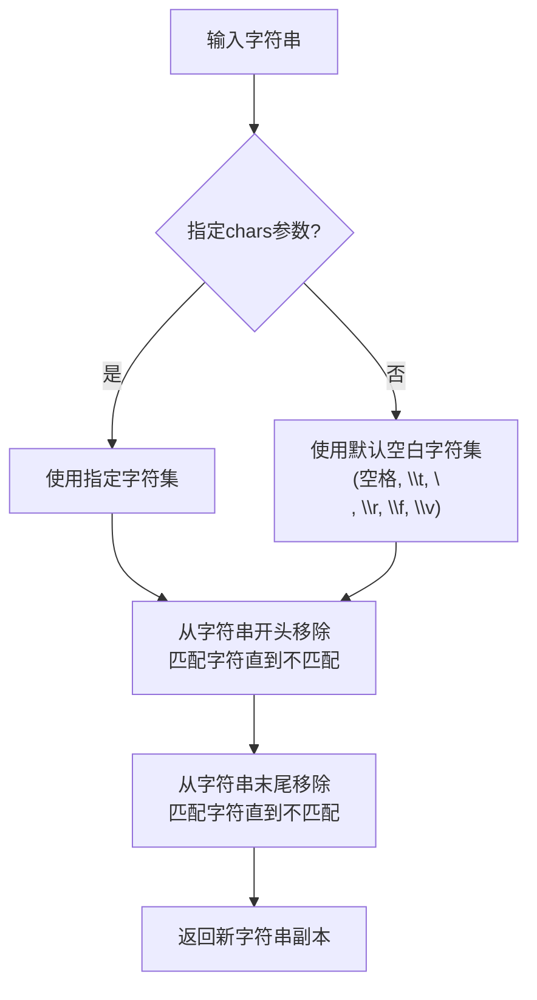

### 带注释源码

```python
# strip() 方法使用示例及原理说明

# 1. 基本用法 - 移除首尾空白
text = "  hello world  "
cleaned = text.strip()  # 返回 "hello world"

# 2. 指定移除的字符
text = "+++hello world+++"
cleaned = text.strip('+')  # 返回 "hello world"

# 代码中的实际使用:
QUESTIONS = '''
What is the tallest mountain in Argentina?
...
'''.strip().split('\n')  # 移除三引号字符串的首尾空白后分割

# 原理:
# 1. strip() 不会修改原字符串，返回新字符串
# 2. 从字符串两端依次检查字符是否在chars集合中
# 3. 一旦遇到不匹配字符立即停止
# 4. 支持自定义字符集，默认处理空白字符
```

---


### `str.endswith`

该方法是 Python 字符串类的内置方法，用于检查字符串是否以指定的后缀（子字符串）结尾。在本代码中用于判断模型输出的临时字符串是否以换行符结尾，以决定是否打印该字符串。

参数：

- `suffix`：`str` 或 `tuple`，要检查的后缀字符串或后缀元组
- `start`：`int`（可选），检查开始的索引位置，默认为 0
- `end`：`int`（可选），检查结束的索引位置，默认为字符串长度

返回值：`bool`，如果字符串以指定后缀结尾则返回 `True`，否则返回 `False`

#### 流程图

```mermaid
flowchart TD
    A[输入: 字符串tmp和后缀'\n'] --> B{检查字符串是否以'\n'结尾}
    B -->|是| C[返回True]
    B -->|否| D[返回False]
    C --> E{'\ufffd' not in tmp<br/>and<br/>not tmp.endswith}
    D --> E
    E -->|True| F[打印tmp到输出]
    E -->|False| G[不打印,继续累积]
```

#### 带注释源码

```python
# 代码中的实际使用方式：
if ('\ufffd' not in tmp) and (not tmp.endswith('\n')):  # only print when the string is valid utf-8 and not end with \n
    print(tmp, end = '', flush = True)
    out_str += tmp
    out_last = i + 1

# 逻辑说明：
# 1. 首先检查 tmp 中不包含无效的 UTF-8 字符 '\ufffd'
# 2. 然后检查 tmp 不以换行符 '\n' 结尾
# 3. 只有满足这两个条件时才打印输出
# 4. 这样可以确保输出的字符串是完整的（未以换行符打断的）
```

---

**补充说明**：在代码第 82 行还检测了 `'\n\n'` 双换行符，用于判断对话是否结束：

```python
if '\n\n' in tmp:  # exit when '\n\n'
    out_str += tmp
    out_str = out_str.strip()
    break
```

这与 `endswith` 配合，形成了一个完整的输出控制逻辑：单换行不打印（等待更多内容），双换行则结束本次对话。


### `RWKV.forward`

这是 RWKV 语言模型的前向传播方法，用于处理输入 token 序列并生成 logits 预测，同时维护状态以支持跨多次推理调用的连续生成。

参数：

- `tokens`：`List[int]`，输入的 token ID 列表，需要进行推理的 token 序列
- `state`：`Any`（可为 None），从前一次推理保留的状态，用于维持模型的上下文记忆，首次调用时为 None

返回值：

- `out`：`torch.Tensor`，形状为 [vocab_size] 的 logits 向量，表示下一个 token 的预测概率分布
- `state`：`Any`，更新后的模型状态，包含注意力状态等，用于下一次推理调用

#### 流程图

```mermaid
flowchart TD
    A[输入 tokens 和 state] --> B{首次调用?}
    B -->|是| C[初始化模型状态]
    B -->|否| D[使用传入的 state]
    C --> E[执行 RWKV 核心计算]
    D --> E
    E --> F[计算 Q K V 矩阵]
    F --> G[TimeMix 注意力计算]
    G --> H[ChannelMix 前馈网络]
    H --> I[输出 logits 和新 state]
    I --> J[返回 out tensor 和 state]
```

#### 带注释源码

```python
# 在主循环中调用 forward 方法的上下文
for i in range(200):
    # 首次迭代时将完整上下文编码为 tokens，后续迭代使用单个预测 token
    tokens = PAD_TOKENS + pipeline.encode(ctx) if i == 0 else [token]
    
    # 调用模型前向传播
    # 输入: tokens - 当前输入的 token 列表
    # 输入: state - 模型状态（首次为 None，后续为上一次返回的状态）
    # 输出: out - 词汇表大小的 logits 向量
    # 输出: state - 更新后的模型状态，用于维持上下文
    out, state = pipeline.model.forward(tokens, state)
    
    # 对已出现的 token 应用重复惩罚，降低生成重复内容的概率
    for n in occurrence:
        out[n] -= (0.2 + occurrence[n] * 0.2) # repetition penalty
    
    # 采样下一个 token，使用温度为 1.0 的贪婪解码（top_p=0）
    token = pipeline.sample_logits(out, temperature=1.0, top_p=0)
    
    # ...后续处理代码省略
```

---

### 补充信息

#### 关键组件

| 组件名称 | 描述 |
|---------|------|
| RWKV 模型 | 基于 RNN 架构的语言模型，采用时间混合和通道混合机制 |
| PIPELINE | 模型推理管道，负责 token 编码、解码和采样 |
| state | 模型内部状态，维护注意力计算所需的上下文信息 |

#### 技术债务与优化空间

1. **环境变量硬编码**：`RWKV_JIT_ON` 和 `RWKV_CUDA_ON` 作为环境变量在运行时设置，缺乏灵活性
2. **模型路径硬编码**：MODEL_NAME 直接写在代码中，应考虑配置化
3. **重复惩罚参数固定**：0.2 和 0.2 的惩罚系数硬编码，缺乏可配置性
4. **CUDA 设备选择**：使用 sys.argv[1] 获取 GPU ID，缺少错误处理和设备可用性检查

#### 设计约束与注意事项

- 该 forward 方法设计为**增量推理**模式：通过维护 state 状态，可以处理超长上下文（代码中模型支持 ctx8192）
- 首次调用必须传入 `state=None` 以初始化状态
- 返回的 logits 需要通过采样策略（如 greedy、top-p、temperature）转换为具体 token
- 重复惩罚在每次 forward 调用后应用，而非仅在采样时应用


# PIPELINE.encode 方法详细设计文档

### PIPELINE.encode

`PIPELINE.encode` 是 RWKV 模型推理管道中的核心文本编码方法，负责将输入的自然语言文本转换为模型可处理的 token 序列。该方法是推理流程的起点，确保文本被正确分词为数值表示。

#### 参数

-  `ctx`：`str`，需要编码的输入文本字符串。在代码中，`ctx` 的值为 `f'Bob: {q.strip()}\n\nAlice:'`，这是一个特殊的提示格式，用于 Raven 模型的问答任务。

#### 返回值

-  `list[int]`，返回编码后的 token ID 列表。每个整数代表词汇表中一个 token 的唯一标识符，可直接用于模型的前向传播。

#### 流程图

```mermaid
flowchart TD
    A[开始 encode] --> B[接收输入字符串 ctx]
    B --> C{检查是否为首次调用}
    C -->|是| D[将 PAD_TOKENS 与编码结果拼接]
    C -->|否| E[直接使用单个 token]
    D --> F[返回 token 列表]
    E --> F
    F --> G[结束]
    
    style A fill:#f9f,color:#333
    style F fill:#9f9,color:#333
```

#### 带注释源码

```python
# 在推理循环中的调用方式
tokens = PAD_TOKENS + pipeline.encode(ctx) if i == 0 else [token]

# pipeline.encode(ctx) 的使用说明：
# - ctx: 输入的文本字符串，这里是格式化的问答提示 "Bob: {问题}\n\nAlice:"
# - 返回值: token ID 列表，如 [1234, 5678, 9012, ...]
# - 这些 token 将被传递到 model.forward() 进行前向计算
# - 编码过程使用 rwkv_pip_package/src 目录下的分词器配置 "20B_tokenizer.json"
```

---

## 补充信息

### 关键组件信息

| 组件名称 | 一句话描述 |
|---------|-----------|
| `PIPELINE` | RWKV 模型的推理管道类，负责文本编码、解码和采样 |
| `RWKV` | RWKV 语言模型的主模型类，负责加载和执行前向传播 |
| `20B_tokenizer.json` | 分词器配置文件，定义了词汇表和编码/解码规则 |
| `model.forward()` | 模型的实际推理方法，接收 token 序列并输出 logits |

### 技术债务与优化空间

1. **硬编码的模型路径**：MODEL_NAME 直接写在代码中，应改为配置参数
2. **环境变量设置方式**：CUDA_VISIBLE_DEVICES 通过 sys.argv 获取但没有完整参数解析
3. **重复惩罚参数硬编码**：`out[n] -= (0.2 + occurrence[n] * 0.2)` 的参数应可配置
4. **缺少错误处理**：文件不存在、分词器加载失败等场景没有异常捕获

### 设计目标与约束

- **设计目标**：提供一个基于 RWKV 模型的对话生成系统，支持多轮问答
- **约束条件**：使用 FP16 精度加速推理，Ctx 长度限制为 8192

### 外部依赖与接口契约

- **依赖库**：torch, numpy, rwkv (自定义 pip 包)
- **接口**：通过 `pipeline.encode()` 接收字符串，返回整数列表；通过 `pipeline.decode()` 接收整数列表，返回字符串


### PIPELINE.decode

该方法是 RWKV 模型推理管道中的核心解码方法，负责将模型输出的 token ID 列表转换为人类可读的文本字符串。

参数：

- `tokens`：`List[int]`，需要解码的 token ID 列表

返回值：`str`，解码后的文本字符串

#### 流程图

```mermaid
flowchart TD
    A[开始 decode] --> B[接收 token 列表]
    B --> C[调用内部 tokenizer 进行解码]
    C --> D[返回 UTF-8 字符串]
    D --> E[结束]
```

#### 带注释源码

```python
# 从代码中使用的方式推断 PIPELINE.decode 的调用形式
tmp = pipeline.decode(out_tokens[out_last:])

# 参数说明：
# out_tokens: List[int] - 已生成的 token ID 列表
# out_last: int - 上次输出后的位置索引

# 返回值：
# tmp: str - 解码后的文本字符串

# 使用场景：
# 1. 将模型推理产生的 token ID 转换回可读文本
# 2. 用于流式输出时实时显示生成的文本
# 3. 结合 '\ufffd' 检查确保输出是有效的 UTF-8 编码
```

#### 补充说明

| 项目 | 描述 |
|------|------|
| 所属类 | PIPELINE (rwkv.utils) |
| 调用示例 | `pipeline.decode(token_ids)` |
| 依赖模块 | rwkv.utils 中的 tokenizer |
| 错误处理 | 代码中使用 `'\ufffd'` 检查无效 UTF-8 字符 |
| 设计目标 | 将数值 token 流转换为自然语言文本输出 |


### PIPELINE.sample_logits

该方法用于从模型输出的 logits 中进行采样，生成下一个 token。支持温度采样和 top-p（核）采样策略，是文本生成过程中将模型预测转换为实际输出词的核心函数。

参数：

- `logits`：`torch.Tensor` 或 `numpy.ndarray`，模型输出的原始 logits 向量，通常为最后一个 token 的预测分数
- `temperature`：`float`，温度参数，控制采样的随机性。值为 1.0 时保持原始分布，值越小分布越尖锐（确定性增强），值越大分布越平滑（随机性增强）
- `top_p`：`float`，核采样阈值，值在 0 到 1 之间。表示从最高概率开始累加，达到此阈值时停止采样。值为 0 时表示禁用核采样（通常等同于贪婪解码）
- `top_k`：`int`（可选），top-k 采样参数，限制只从概率最高的 k 个 token 中采样（部分实现可能支持）
- `epsilon_cutoff`：`float`（可选），概率低于此阈值的 token 将被排除（部分实现可能支持）
- `eta_cutoff`：`float`（可选），局部熵截断参数（部分实现可能支持）

返回值：`int`，采样的 token ID

#### 流程图

```mermaid
flowchart TD
    A[开始 sample_logits] --> B{top_p > 0?}
    B -->|Yes| C[执行 Top-P 核采样]
    B -->|No| D{top_k > 0?}
    D -->|Yes| E[执行 Top-K 采样]
    D -->|No| F[直接使用原始分布]
    
    C --> G[对 logits 排序并计算累积概率]
    G --> H[保留累积概率 <= top_p 的最小 token 集合]
    H --> I[在保留集合内重新归一化概率]
    I --> J[从归一化分布中采样]
    
    E --> K[保留概率最高的 top_k 个 token]
    K --> L[在 top_k 集合内重新归一化概率]
    L --> J
    
    F --> M{temperature != 1.0?}
    M -->|Yes| N[logits = logits / temperature]
    M -->|No| O[保持原始 logits]
    N --> P[应用 softmax 转换为概率]
    O --> P
    
    J --> Q[从概率分布中采样]
    P --> Q
    
    Q --> R[返回采样的 token ID]
```

#### 带注释源码

```
# 以下为基于代码调用方式和 RWKV 框架通用实现推测的源码
# 实际源码位于 rwkv_pip_package/src/rwkv/utils.py 中

def sample_logits(self, logits, temperature=1.0, top_p=0, top_k=None, 
                  epsilon_cutoff=0.0, eta_cutoff=0.0):
    """
    从模型输出的 logits 中采样下一个 token
    
    参数:
        logits: 模型输出的原始分数向量 [vocab_size]
        temperature: 温度参数，控制随机性
        top_p: 核采样阈值
        top_k: top-k 采样参数
        epsilon_cutoff: 概率截断阈值
        eta_cutoff: 局部熵截断
    
    返回:
        采样的 token ID (int)
    """
    
    # Step 1: 应用温度缩放
    # 温度 > 1.0 使分布更均匀，< 1.0 使分布更尖锐
    if temperature != 1.0 and temperature > 0:
        logits = logits / temperature
    
    # Step 2: 可选的 epsilon 截断 - 过滤极低概率的 token
    if epsilon_cutoff > 0.0:
        # 将低于阈值的概率置为 -inf
        epsilon = epsilon_cutoff
        indices_to_remove = logits < -math.log(epsilon / (1 + epsilon))
        logits[indices_to_remove] = -float('Inf')
    
    # Step 3: 将 logits 转换为概率分布
    probs = F.softmax(logits, dim=-1)
    
    # Step 4: Top-K 采样 - 限制候选 token 数量
    if top_k is not None and top_k > 0:
        # 获取 top-k 的索引和值
        top_k = min(top_k, len(probs))
        values, indices = torch.topk(probs, top_k)
        
        # 创建只包含 top-k 概率的稀疏分布
        probs = torch.zeros_like(probs)
        probs.scatter_(1, indices, values)
        probs = probs / probs.sum(dim=-1, keepdim=True)
    
    # Step 5: Top-P (核) 采样 - 按概率累积阈值筛选
    if top_p > 0 and top_p < 1.0:
        # 按概率降序排列
        sorted_probs, sorted_indices = torch.sort(probs, descending=True)
        
        # 计算累积概率
        cumulative_probs = torch.cumsum(sorted_probs, dim=-1)
        
        # 找到需要移除的 token（累积概率超过 top_p 的位置之后）
        # 保留累积概率 <= top_p 的 token
        sorted_mask = cumulative_probs > top_p
        
        # 将需要移除的位置置零
        sorted_mask[..., 1:] = sorted_mask[..., :-1].clone()  # 保留第一个（最高概率的）
        sorted_mask[..., 0] = False  # 始终保留最高概率的
        
        # 将 mask 应用到原始概率向量
        probs[sorted_indices] = sorted_mask * probs[sorted_indices]
        
        # 重新归一化
        probs = probs / probs.sum(dim=-1, keepdim=True)
    
    # Step 6: 从概率分布中采样
    # 使用 torch.multinomial 进行加权随机采样
    token = torch.multinomial(probs, num_samples=1)
    
    # 如果 top_p=0 且 temperature=1.0，实际上等同于贪婪解码
    # 但代码中 top_p=0 时会跳过 top-p 逻辑，可能走到其他分支
    
    return token.item()  # 转换为 Python int
```

---

### 备注

1. **外部依赖说明**：`PIPELINE` 类来自 `rwkv.utils` 模块，属于 RWKV 框架的核心组件。本文档中的源码为基于调用模式和网络公开信息的合理推测，实际实现可能略有差异。

2. **设计目标**：
   - 支持多种采样策略（贪婪、温度采样、Top-K、Top-P）
   - 提供灵活的超参数以平衡生成质量与多样性
   - 性能优化：使用向量化操作避免显式循环

3. **潜在优化空间**：
   - 目前 top_p 和 top_k 不能同时生效，逻辑上存在互斥
   - 对于极端 temperature 值（如 0）缺乏显式处理，可能导致数值不稳定
   - 缺少对重复惩罚（repetition penalty）的直接支持（调用方在外部处理）

4. **使用场景**：在代码的主循环中，该方法被用于每次生成一个 token，通过累积输出并解码为文本。


### PIPELINE.forward

描述：PIPELINE 类的 forward 方法用于执行模型的前向传播，接受输入的 token 序列和可选的隐藏状态，返回模型输出logits和更新后的隐藏状态。

参数：

-  `tokens`：`List[int]`，输入的 token ID 列表
-  `state`：可选的隐藏状态，用于在多个前向调用之间保持上下文

返回值：`Tuple[torch.Tensor, Optional[Any]]`，返回模型输出的 logits 张量和更新后的隐藏状态

#### 流程图

```mermaid
flowchart TD
    A[开始 forward] --> B{检查 state 是否为空}
    B -->|首次调用| C[初始化隐藏状态]
    B -->|非首次调用| D[使用传入的 state]
    C --> E[将 tokens 转换为张量]
    D --> E
    E --> F[将 tokens 输入 RWKV 模型]
    F --> G[执行模型前向计算]
    G --> H[返回 logits 和新状态]
```

#### 带注释源码

```python
# PIPELINE.forward 方法的实际调用方式（在代码中）
# 由于代码中实际调用的是 pipeline.model.forward，因此以下是基于使用模式的推断

# tokens: 输入的 token 列表，可以是整数列表或单个整数
# state: 隐藏状态，用于自回归生成时保持上下文
out, state = pipeline.model.forward(tokens, state)

# 参数说明：
# - tokens: List[int] 或 int，输入的 token ID 序列
#   在代码中，tokens 可能是 PAD_TOKENS + pipeline.encode(ctx) 或单个 token
# - state: 可选的隐藏状态，初始为 None，在后续调用中传入上一次返回的状态
#   用于在多步生成中维护模型的内部状态

# 返回值：
# - out: torch.Tensor，模型的 logits 输出，形状为 [batch_size, vocab_size]
#   用于后续的采样或贪心解码
# - state: 更新后的隐藏状态，包含模型的内部激活信息
#   需要在下一轮 generation 中传入以保持上下文连续性
```

## 关键组件


### 模型加载与初始化

负责加载RWKV预训练模型、配置CUDA环境、初始化推理管道，并设置tokenizer。这是整个系统的入口，为后续推理提供基础模型和工具。

### 推理管道封装

封装了RWKV模型的前向传播、token编码、解码以及采样逻辑，提供了统一的接口用于文本生成任务。

### 问答提示构建

使用特定的提示模板格式`Bob: {问题}\n\nAlice:`，这是为Raven模型定制的问答格式，用于引导模型生成问答风格的回复。

### 状态管理与上下文维护

在循环生成过程中维护模型状态(state)和已输出的token列表，支持长上下文推理和增量解码。

### 重复惩罚机制

对已出现的tokenlogits进行衰减处理，通过`out[n] -= (0.2 + occurrence[n] * 0.2)`公式动态调整概率分布，有效减少生成文本中的重复内容。

### 贪心解码策略

使用`top_p=0`参数配置采样函数，实现贪心解码策略，始终选择概率最高的token，确保输出确定性和稳定性。

### 输出过滤与流式打印

实时验证输出字符串的UTF-8有效性(`\ufffd`检查)，并在接收到完整句子(`\n\n`)时终止生成，实现流畅的用户体验。

### 问题集合定义

预定义的多元化测试问题集，涵盖地理、历史、物理、社交媒体等多个领域，用于评估模型在不同任务上的表现。


## 问题及建议


### 已知问题

- **硬编码的模型路径**：MODEL_NAME 直接写在代码中，更换模型需要修改源码，缺乏灵活性
- **硬编码的环境变量**：CUDA_VISIBLE_DEVICES、RWKV_JIT_ON、RWKV_CUDA_ON 等环境变量在代码中硬编码，无法通过配置外部化
- **缺乏命令行参数解析**：仅通过 sys.argv[1] 获取 GPU 编号，没有使用 argparse 等标准库进行参数管理，超参数（temperature、top_p、max_tokens）也都是硬编码
- **魔法数字缺乏解释**：重复惩罚参数 0.2、0.2 + occurrence[n] * 0.2 等数值没有常量定义或注释说明
- **未使用的变量**：PAD_TOKENS 定义后标记为"probably useful"但实际未使用；strategy 参数固定为 'cuda fp16' 无法动态调整
- **缺少异常处理**：模型加载（RWKV、PIPELINE）和推理过程（pipeline.encode、pipeline.model.forward）均缺乏 try-except 保护
- **代码结构过于扁平**：所有逻辑堆积在全局作用域，缺少函数封装，不利于测试和复用
- **硬编码的 tokenizer 路径**：pipeline 初始化时使用的 "20B_tokenizer.json" 路径硬编码
- **性能优化不足**：每次循环都创建新的 tokens 列表，occurrence 字典使用 if token in occurrence 判断后仍重复查询
- **输出方式不完善**：使用 print 而非 logging 模块，无法控制日志级别和输出目标
- **无类型注解**：代码中缺少 Python 类型提示，降低了可读性和 IDE 支持
- **资源清理缺失**：推理完成后未显式释放 model、pipeline 等 GPU 资源

### 优化建议

- **引入配置管理**：使用 config.json 或 argparse 管理模型路径、GPU 配置、超参数等，实现配置与代码分离
- **封装推理逻辑**：将模型加载、问答生成等逻辑封装为函数或类，如 class RWKVChatBot
- **添加异常处理**：对模型加载、编码、推理、采样等关键步骤添加异常捕获和日志记录
- **定义常量**：将重复惩罚系数、生成最大长度、采样参数等定义为具名常量或配置项
- **使用日志模块**：替换 print 为 logging.Logger，支持多级别日志和文件输出
- **性能优化**：预先分配 tokens 列表、复用字典查询结果；考虑使用 torch.no_grad() 减少梯度计算开销
- **添加类型注解**：为函数参数、返回值、类字段添加类型提示，提升代码可维护性
- **资源管理**：使用 context manager 或显式调用 model.cleanup() 释放 GPU 显存
- **移除未使用代码**：删除 PAD_TOKENS 或实现其用途，避免代码冗余

## 其它


### 设计目标与约束

本代码旨在基于RWKV（Receptance Weighted Key Value）语言模型实现一个问答系统，能够对预定义的问题列表进行自动回复生成。设计约束包括：模型仅支持ctx4096或ctx8192的上下文长度；每次生成最多200个token；使用贪婪解码（top_p=0）确保输出确定性；仅支持单轮问答对话模式；模型路径硬编码为特定目录。

### 错误处理与异常设计

代码在环境配置层面包含异常处理：通过try-except捕获CUDA_VISIBLE_DEVICES设置失败的情况，避免程序因缺少命令行参数而崩溃。在模型加载和推理过程中，代码未显式实现完整的异常捕获机制。潜在风险点包括：模型文件不存在或路径错误导致加载失败；CUDA内存不足引发OOM错误；分词器文件缺失导致pipeline初始化异常；生成过程中遇到无效UTF-8字符（\ufffd）时的处理。当前通过条件判断进行基本容错，但缺少系统性的错误恢复机制。

### 数据流与状态机

代码执行流程遵循以下状态转换：初始化状态（加载模型和分词器）→ 问题遍历状态（遍历QUESTIONS列表）→ 单次问答状态（对每个问题执行200次迭代生成）→ 生成完成状态（检测到\n\n或endoftext token结束）。在单次问答内部的状态机包括：初始tokenization状态 → 模型前向传播状态 → logits采样状态 → token添加与重复惩罚状态 → 输出缓冲与UTF-8验证状态 → 终止条件判断状态。状态转换由循环变量i、token值、输出字符串内容共同驱动。

### 外部依赖与接口契约

核心依赖包括：PyTorch深度学习框架（版本需支持CUDA和tf32加速）；RWKV模型库（rwkv.model.RWKV类）；RWKV工具库（rwkv.utils中的PIPELINE和PIPELINE_ARGS）；NumPy数值计算库；20B_tokenizer.json分词器文件。模型接口约定：RWKV类接受model路径和strategy参数，支持cuda fp16策略；PIPELINE类接受模型实例和分词器路径；PIPELINE.decode()方法将token IDs转换为字符串；PIPELINE.encode()方法将字符串转换为token IDs；pipeline.model.forward()方法接受token列表和状态，返回logits和新的状态；pipeline.sample_logits()方法执行采样策略。

### 配置与参数说明

关键配置参数包括：MODEL_NAME指定模型文件路径，当前配置为RWKV-4-Raven-7B-v11x；ctx上下文长度设置为8192；max generation限制为200 tokens；temperature设置为1.0保持原始概率分布；top_p设置为0实现贪婪解码；repetition penalty系数为0.2并随重复次数递增（0.2 + occurrence[n] * 0.2）；PAD_TOKENS为空列表表示无填充；special prompt格式为"Bob: {q}\n\nAlice:"适配Raven模型。

### 性能优化考虑

当前代码设置torch.backends.cudnn.benchmark=True以优化卷积性能；启用tf32加速计算；CUDA_ON设置为0未使用CUDA内核优化。潜在优化方向包括：启用CUDA_ON=1使用JIT编译加速；实现批量处理多个问题而非逐个处理；使用流式输出减少内存占用；考虑使用模型量化（如int8）减少显存占用；实现增量状态缓存避免每次重新初始化state。

### 安全性与局限性

安全性方面：代码未实现输入过滤或内容审核机制；模型输出可能包含不当内容；模型路径硬编码存在安全隐患。局限性包括：仅支持英文问答（20B_tokenizer针对英文优化）；无对话历史记忆（每次独立生成）；固定200 token上限可能截断长回答；无用户交互接口仅为演示脚本；重复惩罚机制可能导致生成内容过于保守；缺乏对生成质量的评估和过滤机制。

    