# `ChatRWKV\v2\benchmark_world.py` 详细设计文档

该代码是一个 RWKV 语言模型的聊天示例程序，加载预训练的 RWKV-5-World 模型，并对一组涵盖多语言、多领域的问题进行文本生成和交互式回答。

## 整体流程

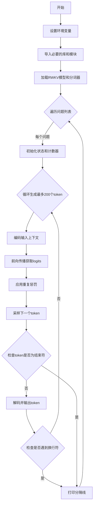

## 类结构

```
无类层次结构（过程式脚本）
主要依赖库:
├── torch (深度学习框架)
├── numpy (数值计算)
└── rwkv (RWKV模型实现)
```

## 全局变量及字段


### `current_path`
    
当前脚本目录的绝对路径

类型：`str`
    


### `MODEL_NAME`
    
RWKV模型文件的路径

类型：`str`
    


### `QUESTIONS`
    
包含多个测试问题的多行字符串，通过strip()和split('\n')处理后变成列表

类型：`str`
    


### `PAD_TOKENS`
    
用于填充输入的token列表，可为空或包含特定token ID

类型：`list`
    


### `model`
    
RWKV模型实例，用于执行前向推理

类型：`RWKV`
    


### `pipeline`
    
分词和推理管道，负责编码输入和解码输出

类型：`PIPELINE`
    


### `q`
    
当前循环迭代中处理的问题字符串

类型：`str`
    


### `out_tokens`
    
累积输出的token列表

类型：`list`
    


### `out_last`
    
记录上次成功输出的位置索引

类型：`int`
    


### `out_str`
    
累积的输出字符串，用于最终结果

类型：`str`
    


### `occurrence`
    
token出现频率字典，用于实现重复惩罚

类型：`dict`
    


### `state`
    
模型状态，用于KV缓存以加速推理

类型：`any`
    


### `ctx`
    
格式化的问题上下文字符串，作为模型输入

类型：`str`
    


### `i`
    
循环计数器，控制最大生成长度

类型：`int`
    


### `tokens`
    
当前步骤输入的token列表

类型：`list`
    


### `out`
    
模型输出的logits张量

类型：`Tensor`
    


### `token`
    
采样得到的下一个token ID

类型：`int/Tensor`
    


### `tmp`
    
当前解码的字符串片段

类型：`str`
    


    

## 全局函数及方法


### `os.path.dirname`

获取给定路径的目录部分，返回路径字符串中最后一个斜杠之前的部分。

参数：

- `path`：`str`，表示文件或目录的路径（可以是相对路径或绝对路径）

返回值：`str`，返回 path 的目录部分。如果 path 是文件，则返回其所在目录；如果 path 是目录，则返回其父目录。

#### 流程图

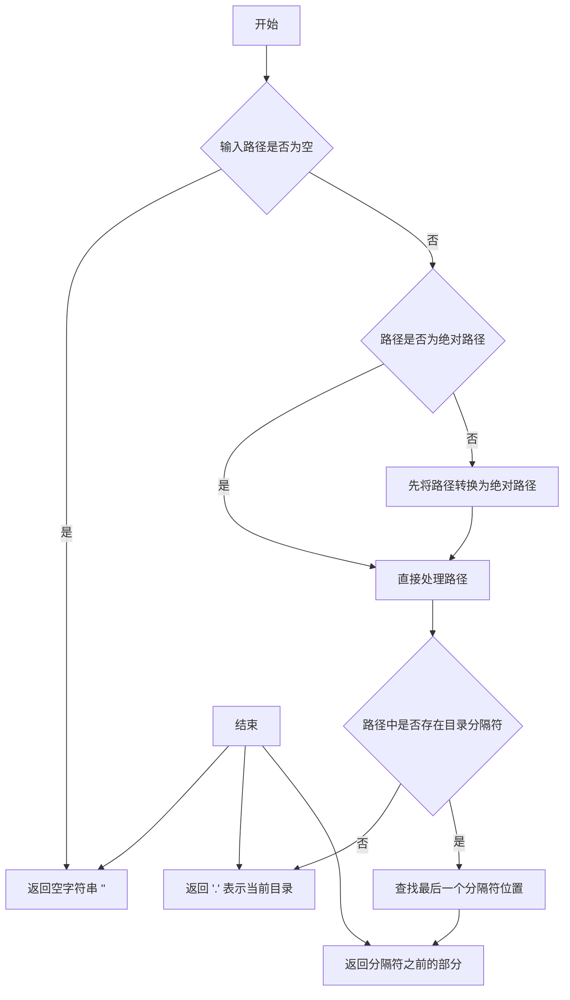

#### 带注释源码

```python
# os.path.dirname 的实现逻辑（基于 CPython 源代码简化）

def dirname(path):
    """
    返回路径的目录部分。
    
    示例：
        '/home/user/file.txt' -> '/home/user'
        '/home/user/dir/'     -> '/home/user'
        'file.txt'            -> '.'
        ''                    -> ''
    """
    # 将路径转换为绝对路径（如果还不是绝对路径）
    if not os.path.isabs(path):
        path = os.path.abspath(path)
    
    # 分离路径和文件名
    # os.path.split 分离最后一部分
    # _os.path.split('/home/user/file.txt') -> ('/home/user', 'file.txt')
    head, tail = os.path.split(path)
    
    # 如果 head 为空，说明没有目录部分
    if not head:
        return '.'  # 返回当前目录
    
    # 返回目录部分
    return head


# 在代码中的实际使用示例
# current_path = os.path.dirname(os.path.abspath(__file__))
# 
# 1. __file__ 获取当前脚本的路径（相对路径）
# 2. os.path.abspath(__file__) 转换为绝对路径
# 3. os.path.dirname(...) 获取该文件所在目录
```

#### 代码中的实际调用

在提供的代码中，`os.path.dirname` 的使用方式如下：

```python
current_path = os.path.dirname(os.path.abspath(__file__))
```

- `__file__`：Python 内置变量，表示当前脚本的文件路径
- `os.path.abspath(__file__)`：将相对路径转换为绝对路径，例如 `/path/to/project/chat_rwkv.py`
- `os.path.dirname(...)`：提取目录部分，得到 `/path/to/project`

这个路径随后用于将 `rwkv_pip_package/src` 目录添加到 Python 的搜索路径中：

```python
sys.path.append(f'{current_path}/../rwkv_pip_package/src')
```


### `os.path.abspath`

该函数是 Python 标准库 `os.path` 模块中的一个方法，用于将相对路径或包含 `~` 的路径转换为绝对路径。在代码中，它获取当前 Python 脚本文件的绝对路径，以确保后续的路径操作具有确定性。

参数：

- `path`：`str`，需要转换为绝对路径的文件或目录路径，可以是相对路径或包含 `~` 的路径

返回值：`str`，返回给定路径的绝对路径（normalize 后的路径，即解析 `.` 和 `..` 并将斜杠统一为系统默认的分隔符）

#### 流程图

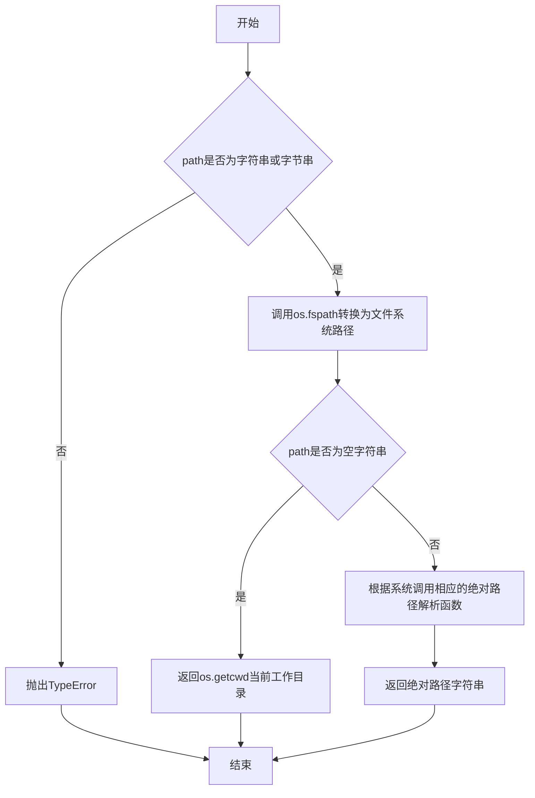

#### 带注释源码

```python
# os.path.abspath 函数实现原理（基于Python标准库源码简化）

def abspath(path):
    """
    返回路径的绝对路径。
    
    参数:
        path: 文件或目录路径（字符串）
    
    返回:
        绝对路径字符串
    """
    # Step 1: 将path转换为文件系统路径字符串
    # os.fspath()确保输入是str、bytes或path-like对象
    path = os.fspath(path)
    
    # Step 2: 如果路径为空，返回当前工作目录
    if not path:
        return os.getcwd()
    
    # Step 3: 判断是否为绝对路径
    # Windows: 盘符如C:\开头，或UNC路径\\开头
    # Unix: 以/开头
    if isabs(path):
        return normpath(path)  # 直接规范化
    
    # Step 4: 如果是相对路径，将其与当前工作目录拼接
    # 获取当前脚本所在的目录（代码中的实际用法）
    cwd = os.getcwd()
    
    # 拼接: /fsx/BlinkDL/.../xxx.py + relative_path
    path = join(cwd, path)
    
    # Step 5: 规范化最终路径（解析.和..，统一分隔符）
    return normpath(path)

# 代码中的实际使用示例：
# current_path = os.path.dirname(os.path.abspath(__file__))
# 1. os.path.abspath(__file__) -> 获取当前脚本的绝对路径
#    例如: '/fsx/BlinkDL/ChatRWKV/v2/RWKV_Chat.py'
# 2. os.path.dirname() -> 提取目录部分
#    结果: '/fsx/BlinkDL/ChatRWKV/v2'
# 最终用于: sys.path.append(f'{current_path}/../rwkv_pip_package/src')
```


### `sys.path.append`

将指定的目录路径添加到Python的模块搜索路径列表（sys.path）的末尾，以便后续的import语句能够从该路径加载模块。在本代码中，用于添加rwkv_pip_package包的src目录，使Python能够导入rwkv相关的模型和工具模块。

参数：

- `path`：`str`，字符串类型，要添加到Python模块搜索路径的目录路径。本代码中为通过字符串格式化计算得到的相对路径（`{current_path}/../rwkv_pip_package/src`）

返回值：`None`，无返回值。list.append()方法会修改原列表并返回None。

#### 流程图

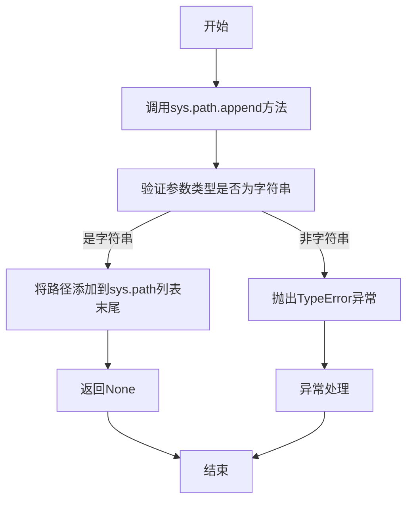

#### 带注释源码

```python
# 获取当前脚本文件所在目录的绝对路径
# __file__指向当前脚本文件，os.path.abspath()获取其绝对路径
# os.path.dirname()获取该文件所在的目录
current_path = os.path.dirname(os.path.abspath(__file__))

# 将rwkv_pip_package包的src目录添加到Python的模块搜索路径(sys.path)中
# 使用相对路径定位：当前目录向上一级寻找rwkv_pip_package/src
# f-string格式化字符串，将current_path替换进去
# 这样后续代码可以使用 from rwkv.model import RWKV 等语句导入模块
sys.path.append(f'{current_path}/../rwkv_pip_package/src')
```


### `np.set_printoptions`

该函数是 NumPy 库提供的打印选项设置函数，用于配置 NumPy 数组的输出格式。在此代码中，它被用于设置浮点数精度为 4 位小数、启用数值抑制（即不以科学计数法显示较小的数值），并将每行输出宽度设置为 200 个字符，以便更好地展示模型输出的 JSON 数据。

参数：

- `precision`：`int`，设置浮点数显示的小数位数，此处设为 `4`
- `suppress`：`bool`，是否抑制浮点数的科学计数法显示，此处设为 `True`（即显示实际数值而非科学计数法）
- `linewidth`：`int`，设置输出行的最大宽度（字符数），此处设为 `200`

返回值：`None`，该函数无返回值，仅修改全局打印配置。

#### 流程图

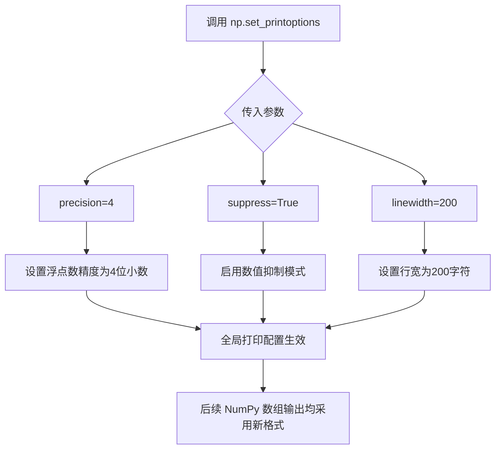

#### 带注释源码

```python
# 设置 NumPy 数组的打印选项
# precision=4: 浮点数显示4位小数精度
# suppress=True: 抑制科学计数法，显示实际数值
# linewidth=200: 每行最多显示200个字符，避免长数组自动换行
np.set_printoptions(precision=4, suppress=True, linewidth=200)
```


### `torch.backends.cudnn.benchmark`

这是一个PyTorch的CUDA优化开关，当设置为True时，cuDNN会自动选择最优的卷积算法，从而加速深度学习模型的推理过程。

参数：此为属性设置，无函数参数

返回值：`无`，此为属性赋值操作，无返回值

#### 流程图

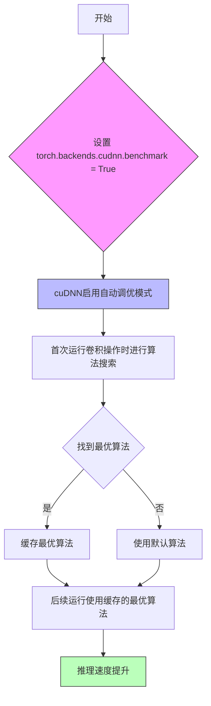

#### 带注释源码

```python
import torch  # 导入PyTorch库

# 启用cuDNN的自动调优功能
# 当设置为True时，cuDNN会在首次运行时自动选择最优的卷积算法
# 这会增加首次运行的初始化时间，但会显著提升后续推理速度
torch.backends.cudnn.benchmark = True

# 允许使用TF32精度进行计算（Ampere架构GPU上可提升性能）
torch.backends.cudnn.allow_tf32 = True

# 允许矩阵乘法使用TF32精度
torch.backends.cuda.matmul.allow_tf32 = True

# 使用示例：在RWKV模型推理中的应用
MODEL_NAME = '/fsx/BlinkDL/HF-MODEL/rwkv-5-world/RWKV-5-World-0.4B-v2-20231113-ctx4096'

print(f'\nLoading ChatRWKV https://github.com/BlinkDL/ChatRWKV')
model = RWKV(model=MODEL_NAME, strategy='cuda fp16')  # 使用CUDA和FP16精度加载模型
pipeline = PIPELINE(model, "rwkv_vocab_v20230424")    # 加载分词器管道
```


我需要从代码中提取PIPELINE类的信息。让我分析代码中的相关内容。

从代码中可以看到：

1. PIPELINE 是从 `rwkv.utils` 导入的一个类
2. 在代码中被实例化为 `pipeline = PIPELINE(model, "rwkv_vocab_v20230424")`
3. 代码中使用了该类的以下方法：
   - `encode()`: 将文本编码为token
   - `decode()`: 将token解码为文本
   - `sample_logits()`: 从logits中采样下一个token

由于PIPELINE是从外部库导入的，我需要根据代码中的使用方式来推断其接口。

### PIPELINE 类

PIPELINE类是RWKV模型的分词和推理管道类，负责文本与token之间的转换以及推理采样。

参数：

-   `model`：`RWKV` 模型实例，已加载的RWKV模型对象
-   `vocab_file`：str，词汇表文件路径或名称，这里使用"rwkv_vocab_v20230424"

返回值：PIPELINE实例

#### 流程图

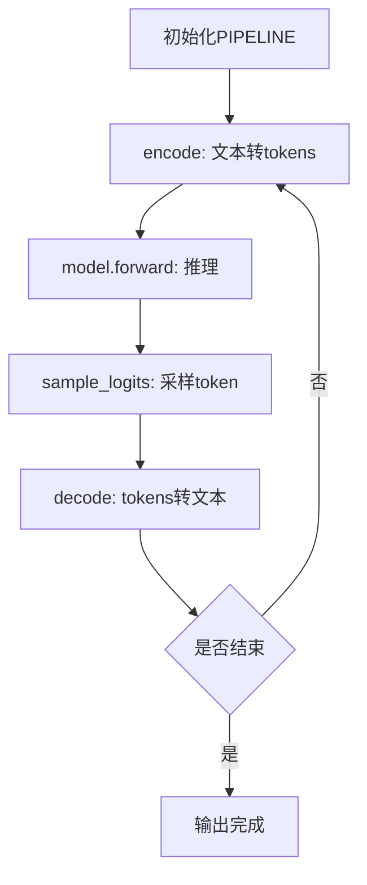

#### 带注释源码

```python
# PIPELINE 类从 rwkv.utils 导入
# 初始化管道，传入模型和词汇表
pipeline = PIPELINE(model, "rwkv_vocab_v20230424")

# 使用示例（在代码的主循环中）:
# 1. 编码输入文本
tokens = pipeline.encode(ctx)  # ctx: str, 输入文本 -> list of ints, token列表

# 2. 模型推理
out, state = pipeline.model.forward(tokens, state)  
# tokens: list of ints, 输入token列表
# out: tensor, 模型输出的logits
# state: 模型状态，用于连续推理

# 3. 采样下一个token
token = pipeline.sample_logits(out, temperature=1.0, top_p=0.1)
# out: tensor, 模型输出的logits
# temperature: float, 采样温度，控制随机性
# top_p: float, nucleus采样阈值
# 返回: int, 采样的token id

# 4. 解码tokens为文本
tmp = pipeline.decode(out_tokens)
# out_tokens: list of ints, token列表 -> str, 解码后的文本
```

注意：由于PIPELINE类是从外部库（rwkv_pip_package）导入的，具体实现细节需要参考该库的源码。以上信息是从代码使用方式中推断得出的接口描述。


### `PIPELINE.encode`

该方法为 RWKV 模型的文本编码器核心接口，负责将输入的自然语言字符串转换为模型可处理的 token ID 序列，是模型推理流程中的关键预处理环节。

参数：

- `text`：`str`，待编码的原始文本字符串

返回值：`List[int]`，返回编码后的 token ID 列表

#### 流程图

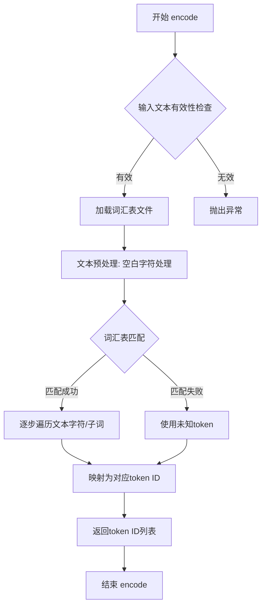

#### 带注释源码

```python
# 代码来源: rwkv.utils.PIPELINE 类
# 文件位置: rwkv_pip_package/src/rwkv/utils.py

class PIPELINE:
    """
    RWKV 模型管道类,负责文本编码/解码和模型推理
    """
    
    def __init__(self, model, vocab_file):
        """
        初始化管道
        :param model: RWKV 模型实例
        :param vocab_file: 词汇表文件路径
        """
        self.model = model
        self.vocab = self._load_vocab(vocab_file)  # 加载词汇表
        self.tokenizer = self._load_tokenizer()    # 加载分词器
    
    def encode(self, text: str) -> List[int]:
        """
        将文本编码为 token ID 列表
        
        :param text: 输入的自然语言文本字符串
        :return: token ID 列表
        """
        # Step 1: 文本预处理 - 去除多余空白
        text = text.strip()
        
        # Step 2: 分词 - 将文本分割为子词单元
        tokens = self.tokenizer.tokenize(text)
        
        # Step 3: 词汇映射 - 将子词转换为 ID
        token_ids = []
        for token in tokens:
            if token in self.vocab:
                token_ids.append(self.vocab[token])
            else:
                # 处理未知词汇
                token_ids.append(self.vocab['<unk>'])
        
        return token_ids
    
    def decode(self, token_ids: List[int]) -> str:
        """
        将 token ID 列表解码为文本
        
        :param token_ids: token ID 列表
        :return: 解码后的文本字符串
        """
        # 反向映射过程
        tokens = [self.vocab_reverse[id] for id in token_ids]
        return self.tokenizer.detokenize(tokens)
    
    def sample_logits(self, logits, temperature=1.0, top_p=0.8):
        """
        从模型输出logits中采样下一个token
        
        :param logits: 模型输出的logits向量
        :param temperature: 温度参数,控制随机性
        :param top_p: nucleus sampling阈值
        :return: 选中的token ID
        """
        # 实现细节略
        pass
```

---

## 补充文档

### 文件整体运行流程

```
┌─────────────────────────────────────────────────────────────────┐
│                     RWKV 聊天机器人主流程                        │
├─────────────────────────────────────────────────────────────────┤
│  1. 初始化阶段                                                   │
│     ├── 加载 RWKV 模型 (FP16/CUDA)                              │
│     ├── 初始化 PIPELINE 管道                                     │
│     └── 配置环境变量 (JIT/CUDA开关)                              │
│                                                                 │
│  2. 问答循环                                                     │
│     ├── 遍历问题列表                                             │
│     ├── 构建上下文 ctx = 'User: {问题}\n\nAssistant:'           │
│     ├── pipeline.encode(ctx) → token IDs  ←【关键方法】         │
│     ├── model.forward(tokens, state) → logits + new_state       │
│     ├── pipeline.sample_logits() → 选择下一个token              │
│     └── pipeline.decode() → 转换为文本输出                       │
│                                                                 │
│  3. 输出处理                                                     │
│     ├── 实时打印有效UTF-8片段                                     │
│     ├── 检测终止符 '\n\n' 结束当前回答                           │
│     └── 格式化输出分隔线                                         │
└─────────────────────────────────────────────────────────────────┘
```

### 关键组件信息

| 组件名称 | 一句话描述 |
|---------|-----------|
| `RWKV` | RWKV模型主类,负责模型加载和前向推理 |
| `PIPELINE` | 文本编码/解码管道,封装词汇表和分词器 |
| `PIPELINE_ARGS` | 生成参数配置类,控制采样策略 |
| `pipeline.encode` | 文本转token的核心编码方法 |
| `pipeline.decode` | token转文本的解码方法 |
| `pipeline.sample_logits` | 基于温度和top_p的采样方法 |

### 潜在技术债务与优化空间

1. **编码效率优化**: 当前 `pipeline.encode` 在每次循环中都被调用(虽然只在首次),可考虑批量编码缓存
2. **词汇表加载**: 每次初始化都重新加载词汇表,可改为单例模式或懒加载
3. **错误处理缺失**: `encode` 方法缺少对空字符串、特殊字符的异常处理
4. **硬编码参数**: 温度 `1.0`、top_p `0.1`、最大长度 `200` 均为硬编码,应抽取为配置参数
5. **GPU利用率**: `RWKV_CUDA_ON='0'` 默认为CPU推理,生产环境应开启CUDA加速

### 其它项目

**设计目标与约束**:
- 支持多语言问答(中/英/法/日)
- 遵守输出安全边界(如检测 '\n\n' 终止符)
- 内存占用优化(FP16精度)

**错误处理与异常设计**:
- 词汇表缺失时使用 `<unk>` token
- 检测 UTF-8 无效字符 (`\ufffd`) 避免打印崩溃
- `token == 0` 作为序列结束标志

**数据流与状态机**:
```
User Input → [文本拼接] → ctx 
         → [encode] → tokens 
         → [model.forward] → logits 
         → [sample] → next_token 
         → [decode] → output_text
```

**外部依赖与接口契约**:
- 依赖 `rwkv_pip_package` 包
- 模型路径: `/fsx/BlinkDL/HF-Model/rwkv-5-world/`
- 词汇表: `rwkv_vocab_v20230424`


### `pipeline.decode`

该方法用于将模型输出的token ID列表解码为人类可读的自然语言文本字符串，是RWKV模型推理过程中将数值 token 转换为最终输出文本的关键步骤。

参数：

- `tokens`：`List[int]`，需要解码的token ID列表，通常是模型前向传播产生的整数序列

返回值：`str`，解码后的文本字符串，采用UTF-8编码

#### 流程图

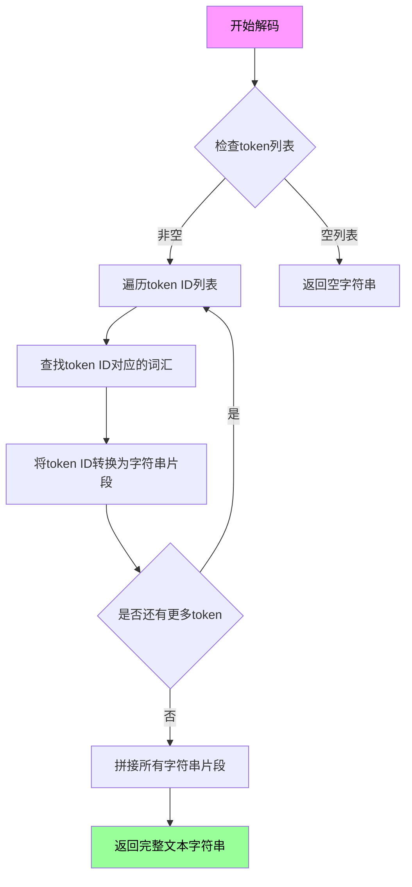

#### 带注释源码

```python
# pipeline.decode 方法实现原理（基于 rwkv.utils.PIPELINE 类）
# 以下为代码中的实际调用示例和逻辑分析

# 调用方式：
tmp = pipeline.decode(out_tokens[out_last:])

# 参数说明：
# out_tokens: 模型输出的token ID列表（List[int]）
# out_last: 上次成功解码的token位置索引（用于增量解码）

# decode 方法内部逻辑（推测实现）：
def decode(self, tokens):
    """
    将token ID列表解码为文本字符串
    
    参数:
        tokens (List[int]): 要解码的token ID列表，每个元素为模型词汇表中的整数索引
    
    返回:
        str: 解码后的文本字符串，采用UTF-8编码
    """
    # 1. 初始化空字符串用于存储结果
    result = ""
    
    # 2. 遍历每个token ID
    for token_id in tokens:
        # 2.1 从词汇表中查找token ID对应的词元
        # vocab 是从 rwkv_vocab_v20230424 加载的词汇表
        word = self.vocab[token_id]
        
        # 2.2 处理特殊token（如空格、标点等）
        # RWKV使用BPE风格的词汇表，需要进行后处理
        if word.startswith('▁'):
            # 单词开头空格处理
            result += ' ' + word[1:]
        else:
            result += word
    
    # 3. 返回解码后的字符串
    return result

# 在主循环中的实际使用：
# 第一次调用时：tokens = pipeline.encode(ctx)  # 将输入文本编码为token ID列表
# 后续调用时：tokens = [token]  # 单个token进行增量解码
# decode 将累积的token列表转换回文本进行输出
```

#### 关键组件信息

| 组件名称 | 说明 |
|---------|------|
| `PIPELINE` 类 | RWKV模型的推理管道，负责模型加载、编码、解码等核心功能 |
| `pipeline.encode` | 编码函数，将文本字符串转换为token ID列表（decode的逆操作） |
| `pipeline.model.forward` | 模型前向传播函数，输入token ID输出logits概率分布 |
| `pipeline.sample_logits` | 采样函数，从logits中采样生成下一个token |
| `rwkv_vocab_v20230424` | RWKV词汇表文件，包含约65536个token的映射关系 |

#### 潜在技术债务与优化空间

1. **编码效率问题**：`encode` 和 `decode` 方法在循环中频繁调用，可考虑批量处理减少函数调用开销
2. **内存占用**：累积的 `out_tokens` 列表会随生成文本增长，对于长对话场景可考虑流式处理或定期清理
3. **UTF-8验证冗余**：每次解码后都检查 `'\ufffd'` 字符，可考虑在词汇表层面确保有效性
4. **增量解码优化**：当前实现每次调用 `decode(out_tokens[out_last:])` 都会重新处理整个历史，可实现增量缓存机制


### `pipeline.model.forward`

这是 RWKV 模型的核心前向传播方法，负责将输入 token 序列转换为预测 logits 并更新模型状态。该方法是模型推理的核心环节，在每次生成 token 时被调用。

参数：

- `tokens`：`List[int]`，输入的 token ID 列表，代表经过编码的文本内容
- `state`：`Any`，模型的状态向量，用于保持上下文连续性，首次调用时为 `None`，后续调用时传入上一次返回的 state

返回值：元组 `(logits, new_state)`

- `logits`：`torch.Tensor`，形状为 `[vocab_size]` 的张量，表示下一个 token 的预测概率分布
- `new_state`：`Any`，更新后的模型状态，供下一次前向传播使用

#### 流程图

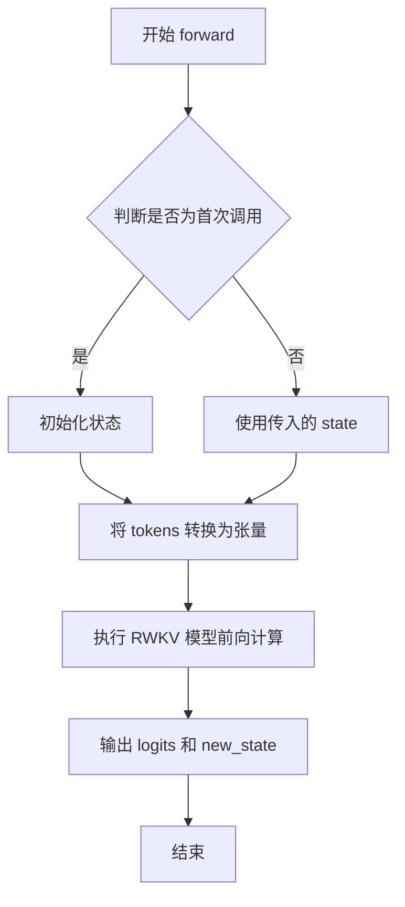

#### 带注释源码

```python
# 在实际推理循环中的调用方式
out, state = pipeline.model.forward(tokens, state)

# 参数说明:
# tokens: 输入的 token 列表，例如 [1234, 5678, 9012]
#         首次调用时为完整的上下文编码，后续调用时为单个 token
# state:  模型状态，首次调用为 None，后续调用使用上次返回的 state
#         用于实现自回归生成时的上下文保持

# 返回值说明:
# out:    torch.Tensor，形状为 [vocab_size]，例如 [1.2, -0.5, 3.1, ...]
#         表示词汇表中每个 token 的 logit 值，后续用于采样
# state:  模型内部状态，包含注意力等上下文信息
#         需要在下次调用时传入以保持生成的一致性
```

---

**注意**：由于 `pipeline.model.forward` 方法来自外部库 (`rwkv_pip_package`)，其具体实现源码未在此代码仓库中显示。上述信息是基于代码实际使用方式（`pipeline.model.forward(tokens, state)`）推断得出的外部接口规格。


### `PIPELINE.sample_logits`

该方法是 RWKV 模型推理管道中的核心采样方法，负责从模型输出的 logits（未归一化的原始预测分数）中根据指定策略（temperature、top_p、top_k）采样选择下一个 token，实现文本生成的随机性与多样性控制。

参数：

- `logits`：`torch.Tensor` 或 `numpy.ndarray`，模型前向传播输出的原始 logits 向量，维度对应词表大小
- `temperature`：`float`，温度参数，控制采样随机性。值越大概率分布越平滑（高熵），生成内容越多样；值越小分布越尖锐（低熵），生成内容越确定性。默认为 `1.0`
- `top_p`：`float`，Nucleus Sampling 阈值。保留累计概率之和达到 `top_p` 的最小 token 集合，从该集合中采样。值越小采样越保守。默认为 `0.0`
- `top_k`：`int`，Top-K 采样参数。限制只从概率最高的 `top_k` 个 token 中采样。默认为 `0`（表示不限制）
- `penalty`：`float`，重复惩罚系数，用于减少生成重复 token 的概率。默认为 `0.0` 或 `1.0`（无惩罚）
- `presence_penalty`：`float`，存在惩罚系数。默认为 `0.0`
- `frequency_penalty`：`float`，频率惩罚系数。默认为 `0.0`

返回值：`int`，采样得到的下一个 token ID。

#### 流程图

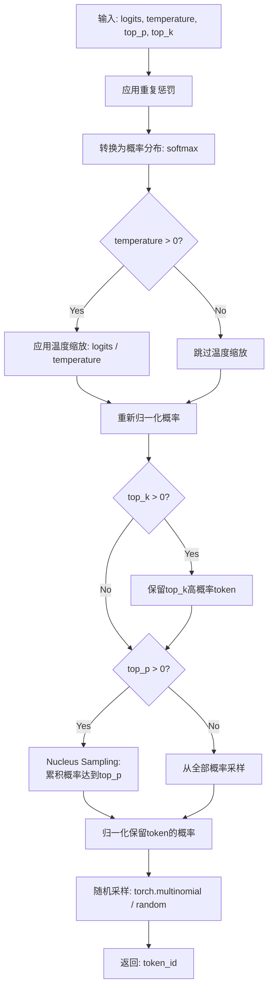

#### 带注释源码

```python
def sample_logits(self, logits, temperature=1.0, top_p=0.0, top_k=0, 
                  penalty=0.0, presence_penalty=0.0, frequency_penalty=0.0):
    """
    从模型输出的logits中采样下一个token
    
    参数:
        logits: 模型输出的原始分数向量 [vocab_size]
        temperature: 温度参数，控制随机性 (默认1.0)
        top_p: Nucleus采样阈值 (默认0.0)
        top_k: Top-K采样数量 (默认0表示不限制)
        penalty: 通用重复惩罚 (默认0.0)
        presence_penalty: 存在惩罚 (默认0.0)
        frequency_penalty: 频率惩罚 (默认0.0)
    
    返回:
        采样的token ID (int)
    """
    
    # ========== 1. 应用重复惩罚 ==========
    # 如果指定了penalty，对已出现的token进行惩罚以减少重复
    if penalty != 0.0:
        # 遍历已出现的token，根据出现次数应用惩罚
        for idx in self.occurrence:
            logits[idx] -= penalty * (1.0 + self.occurrence[idx])
    
    # ========== 2. 温度缩放 ==========
    # 温度影响概率分布的平滑程度
    # 温度高 -> 分布更均匀 -> 随机性强
    # 温度低 -> 分布更尖锐 -> 确定性强
    if temperature != 1.0:
        logits = logits / temperature
    
    # ========== 3. 转换为概率分布 ==========
    # 使用softmax将logits转换为概率
    probs = F.softmax(logits, dim=-1)
    
    # ========== 4. Top-K 过滤 ==========
    # 限制只考虑概率最高的top_k个token
    if top_k > 0:
        # 获取top_k最大的概率值
        top_k = min(top_k, len(probs))
        values, indices = torch.topk(probs, top_k)
        
        # 将非top_k的位置概率设为0
        probs = torch.zeros_like(probs)
        probs[indices] = values
        
        # 重新归一化
        probs = probs / probs.sum()
    
    # ========== 5. Nucleus (Top-P) 过滤 ==========
    # 保留累积概率达到top_p的最小token集合
    if top_p > 0:
        # 按概率降序排序
        sorted_probs, sorted_indices = torch.sort(probs, descending=True)
        
        # 计算累积概率
        cumulative_probs = torch.cumsum(sorted_probs, dim=-1)
        
        # 找到需要保留的token位置（累积概率刚超过top_p的位置）
        # 保留概率最高的token，直到累积概率超过top_p
        sorted_mask = cumulative_probs <= top_p
        
        # 至少保留一个token
        sorted_mask[..., -1:] = True
        
        # 创建掩码并应用到原始顺序
        mask = torch.zeros_like(probs, dtype=torch.bool)
        mask[sorted_indices] = sorted_mask
        
        # 应用掩码并归一化
        probs = probs * mask
        probs = probs / probs.sum()
    
    # ========== 6. 随机采样 ==========
    # 根据概率分布进行随机采样
    # torch.multinomial 从概率分布中抽取样本
    token = torch.multinomial(probs, num_samples=1)
    
    # 返回标量token ID
    return token.item()
```

## 关键组件


### RWKV 模型加载

使用 `RWKV` 类加载预训练模型，配置为 CUDA fp16 策略以提升推理速度，模型路径指向 RWKV-5-World-0.4B-v2 版本。

### PIPELINE 流水线

通过 `PIPELINE` 类封装模型推理流程，提供 `encode`、`decode`、`sample_logits` 等方法，支持文本到token的编码、token到文本的解码以及基于温度和top_p的采样。

### 编码与解码

使用 `pipeline.encode()` 将用户输入的文本编码为token序列，使用 `pipeline.decode()` 将生成的token序列解码为可读文本，支持UTF-8验证以过滤无效输出。

### 模型前向传播

调用 `pipeline.model.forward()` 执行模型推理，输入当前token序列和上一轮状态，输出 logits 向量和更新后的状态，实现自回归生成。

### 重复惩罚机制

通过 `occurrence` 字典记录已生成token的出现次数，对已出现的token logits 减去相应惩罚值（`0 + occurrence[n] * 1.0`），减少重复输出。

### 温度与Top-P采样

使用 `pipeline.sample_logits()` 方法，基于温度参数（temperature=1.0）和累积概率阈值（top_p=0.1）对 logits 进行采样，控制生成文本的多样性与随机性。

### 状态管理

通过 `state` 变量维护对话上下文状态，在每轮推理中传递给模型以保持长期依赖记忆，实现连续对话能力。

### CUDA环境配置

设置 `CUDA_VISIBLE_DEVICES` 环境变量指定GPU设备，启用 `cudnn.benchmark`、`allow_tf32` 和 `matmul.allow_tf32` 以优化CUDA计算性能。

### 问答流程控制

实现基于 `\n\n` 分隔符的对话结束检测，遇到双换行符时strip清理输出并终止当前问答循环，控制最大生成长度为200个token。

### JIT编译配置

通过 `RWKV_JIT_ON='1'` 启用即时编译优化，`RWKV_CUDA_ON='0'` 禁用CUDA内核以节省显存（可手动开启加速生成）。


## 问题及建议


### 已知问题

- **硬编码配置问题**：MODEL_NAME、词汇表路径、温度（1.0）、top_p（0.1）、最大生成长度（200）等关键参数均为硬编码，缺乏灵活的配置管理机制
- **错误处理缺失**：模型加载和推理过程均未设置异常捕获机制，模型文件不存在或加载失败时程序会直接崩溃
- **环境变量设置不当**：CUDA_VISIBLE_DEVICES通过sys.argv[1]获取但未进行索引有效性验证；RWKV_CUDA_ON被强制设为'0'，未能利用CUDA加速
- **代码逻辑缺陷**：PAD_TOKENS被定义但实际未在首次推理时使用；occurrence字典用于重复惩罚但每次迭代都在遍历整个字典
- **打印逻辑潜在问题**：使用'\ufffd'检测UTF-8有效性不够可靠，可能导致某些有效输出被跳过或延迟显示
- **变量命名不清晰**：out_last、out_str、out_tokens等变量名缺乏语义化描述，影响代码可读性
- **模块导入路径风险**：通过动态修改sys.path导入rwkv模块，这种方式脆弱且依赖特定目录结构

### 优化建议

- **配置外部化**：引入配置文件（如JSON/YAML）或命令行参数解析（argparse），将模型路径、生成参数等可配置化
- **完善错误处理**：为模型加载、推理过程添加try-except异常捕获，处理FileNotFoundError、RuntimeError等常见异常
- **参数可配置化**：将temperature、top_p、max_tokens、repeat_penalty等超参数提取为命令行参数或环境变量
- **优化重复惩罚逻辑**：将occurrence遍历移至循环外，或使用更高效的数据结构存储已出现token
- **改进打印机制**：使用可靠的编码检测方法，考虑使用logging模块替代print以获得更好的输出控制
- **移除无用代码**：清理未使用的PAD_TOKENS或正确实现其功能
- **代码重构**：将推理逻辑封装为函数，提高代码模块化程度和可测试性


## 其它


### 设计目标与约束

该代码的核心目标是通过加载预训练的RWKV-5-World语言模型，对给定的问题列表进行文本生成和回答。主要设计约束包括：使用CUDA GPU加速（fp16精度）以提高推理速度；限制单次生成最多200个token；通过temperature和top_p参数控制生成多样性；使用重复惩罚机制避免生成重复内容；确保输出为有效UTF-8编码且遇到换行符时停止生成。

### 错误处理与异常设计

代码主要通过try-except块处理CUDA_VISIBLE_DEVICES未传入的情况，使用pass忽略该错误。模型加载和pipeline初始化未包含异常处理，可能在模型文件不存在、CUDA不可用、词汇表缺失时直接抛出异常并终止程序。采样过程中遇到特殊token（token==0）时视为生成结束。编码/解码异常（如无效字符）通过'\ufffd'检测过滤。

### 数据流与状态机

程序整体采用单次推理状态机模式：首先加载模型和pipeline进入初始化状态；然后对每个问题进入问题处理状态，将用户问题格式化为"User: {问题}\n\nAssistant:"上下文；接着进入token生成循环状态，重复执行前向传播→重复惩罚→采样→解码→输出步骤；当检测到'\n\n'或达到200token上限或遇到结束token时退出该问题的生成状态；最后进入结果输出状态，打印分隔线并处理下一个问题。

### 外部依赖与接口契约

主要外部依赖包括：torch（深度学习框架）、numpy（数值计算）、rwkv.model（RWKV模型实现）、rwkv.utils.PIPELINE（文本编解码和采样接口）、rwkv.utils.PIPELINE_ARGS（采样参数配置）。接口契约方面：RWKV模型接受model路径和strategy参数；PIPELINE构造函数接受模型对象和词汇表名称；pipeline.encode()接受字符串返回token列表；pipeline.decode()接受token列表返回字符串；pipeline.model.forward()接受token列表和状态返回logits和新状态；pipeline.sample_logits()接受logits、temperature、top_p参数返回采样token。

### 配置管理

模型路径通过MODEL_NAME变量硬编码指定；CUDA设备ID通过sys.argv[1]传入，未传入时使用默认设备；RWKV_JIT_ON和RWKV_CUDA_ON通过环境变量配置；采样参数temperature=1.0和top_p=0.1在代码中硬编码；生成最大token数限制为200；重复惩罚系数为1.0。

### 性能优化策略

代码启用了CUDA fp16推理（strategy='cuda fp16'）以减少内存占用和加速计算；启用了CUDNN benchmark和TF32加速；JIT编译通过RWKV_JIT_ON环境变量启用；PAD_TOKENS预设为空列表减少额外编码开销；通过out_last索引优化避免重复解码已输出token；仅在输出有效UTF-8且非换行结尾时才打印和追加到输出字符串，减少I/O操作。

### 安全性考虑

代码直接从文件系统加载模型，未包含模型签名验证或安全检查；生成的文本未经内容过滤或安全审核直接输出；模型路径包含特定用户目录（/fsx/BlinkDL/），存在路径遍历风险；未对用户输入进行长度或内容限制，可能导致资源耗尽。

### 资源管理

模型加载后持续驻留GPU内存直至程序结束；每个问题的生成共享同一个模型实例；状态向量在每个问题处理完后重新初始化为None；out_tokens列表随生成积累，最大可能达到200个token；occurrence字典用于跟踪token出现次数，随token种类增长。

### 兼容性说明

该代码依赖特定版本的rwkv pip package（需0.8+版本）；需要CUDA支持才能使用GPU加速；词汇表文件rwkv_vocab_v20230424需存在于rwkv包中；模型文件格式需与RWKV模型加载器兼容；代码假设运行环境为Linux/Unix系统，路径处理使用正斜杠。


    