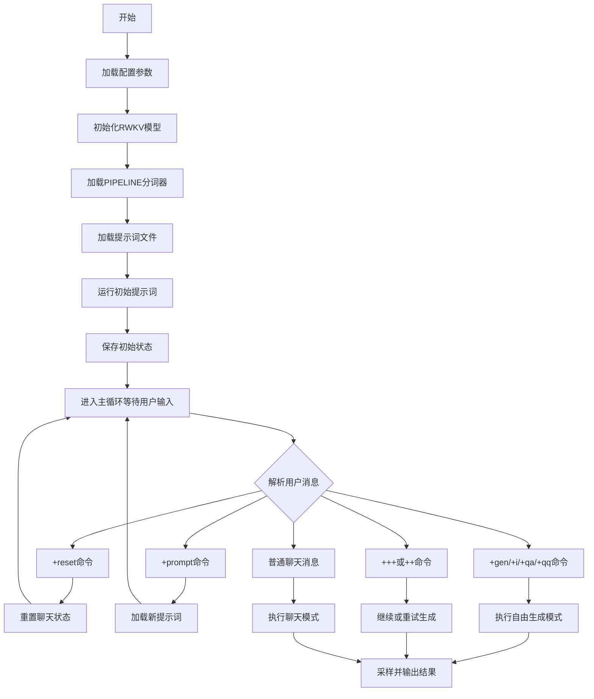
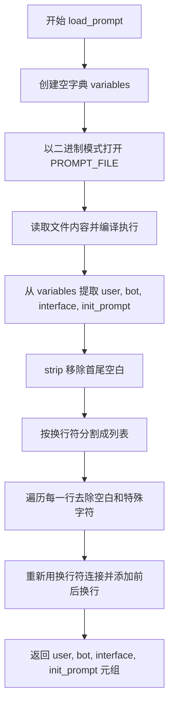
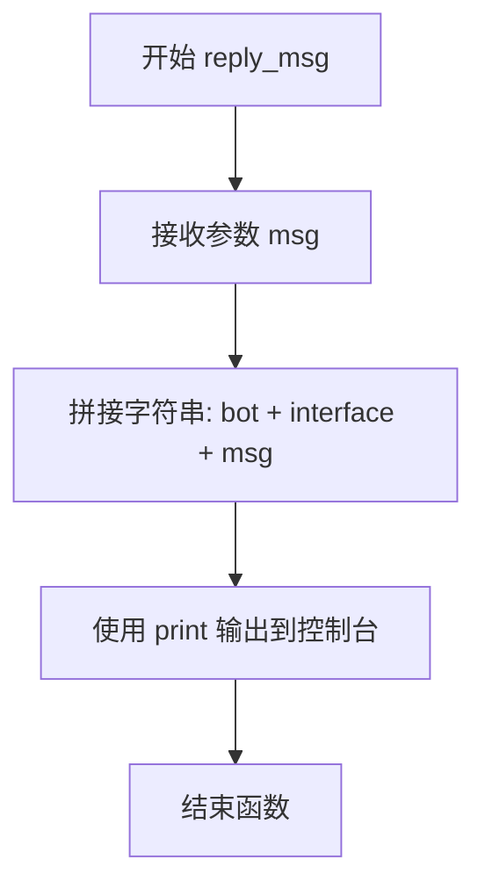
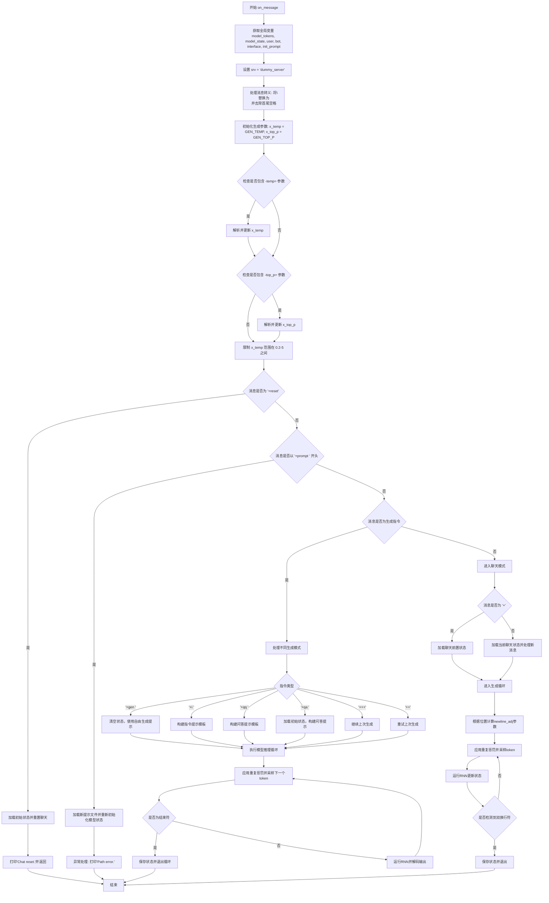
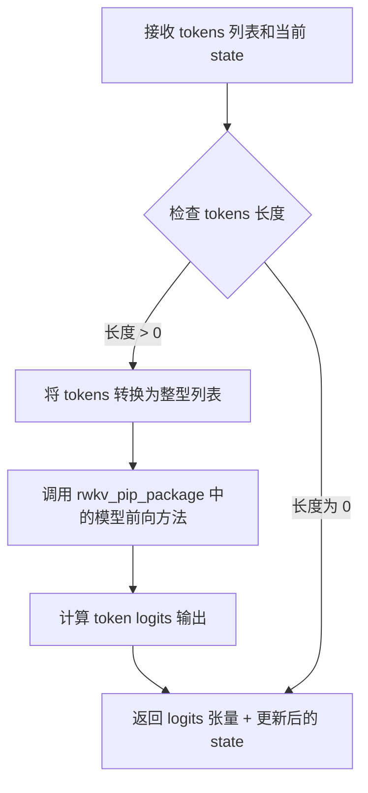
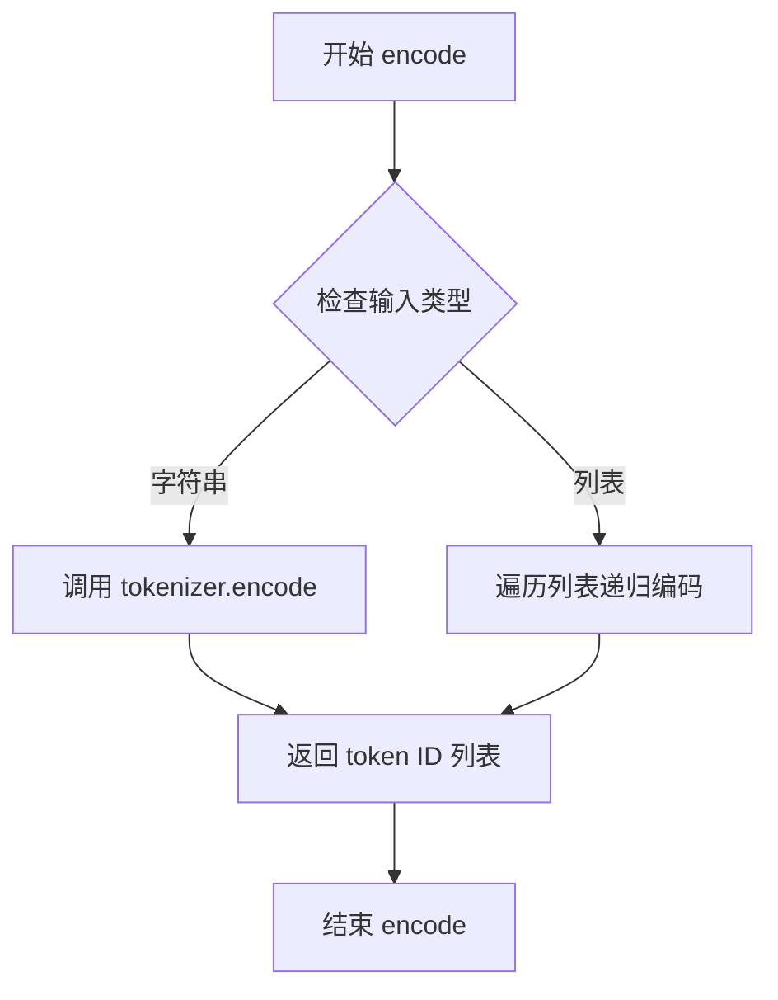
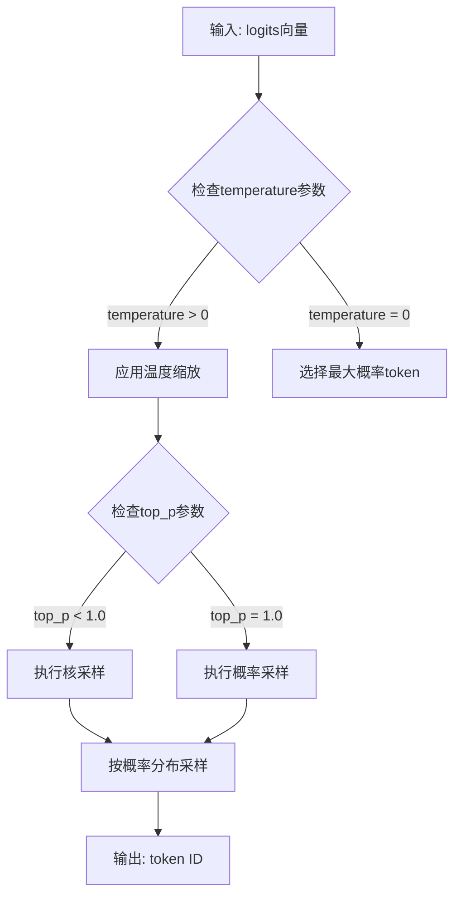

# `ChatRWKV\v2\chat.py` 详细设计文档

ChatRWKV是一个基于RWKV（Receptive Weighted Key Value）语言模型的聊天/文本生成应用，支持多种交互模式包括自由对话、指令微调（Instruct）、问答（QA）和文本续写（Generation），通过提示词工程实现不同场景的文本生成任务。

## 整体流程



## 类结构

```
main (主程序入口)
├── 配置常量 (CHAT_LANG, args, GEN_TEMP等)
├── 核心对象 (model, pipeline, all_state)
├── 工具函数
│   ├── load_prompt()
│   ├── run_rnn()
│   ├── save_all_stat()
│   ├── load_all_stat()
│   ├── fix_tokens()
│   ├── reply_msg()
│   └── on_message()
└── 主循环 (while True)
```

## 全局变量及字段


### `args`
    
Global configuration namespace containing model settings and command-line arguments

类型：`types.SimpleNamespace`
    


### `model`
    
The RWKV language model instance loaded from file

类型：`RWKV`
    


### `pipeline`
    
Tokenizer and encoding/decoding pipeline for text processing

类型：`PIPELINE`
    


### `model_tokens`
    
Global list storing current sequence of token IDs being processed

类型：`list`
    


### `model_state`
    
Global RNN state of the model, maintained across forward passes

类型：`tensor/None`
    


### `all_state`
    
Dictionary storing all saved conversation and generation states

类型：`dict`
    


### `CHAT_LANG`
    
Language setting for chat ('English', 'Chinese', or 'Japanese')

类型：`str`
    


### `PROMPT_FILE`
    
File path to the prompt configuration file

类型：`str`
    


### `CHAT_LEN_SHORT`
    
Short chat length threshold (40 tokens) for generation control

类型：`int`
    


### `CHAT_LEN_LONG`
    
Long chat length threshold (150 tokens) for generation control

类型：`int`
    


### `FREE_GEN_LEN`
    
Maximum length for free generation (256 tokens)

类型：`int`
    


### `GEN_TEMP`
    
Generation temperature parameter (1.2) controlling randomness

类型：`float`
    


### `GEN_TOP_P`
    
Top-p sampling parameter (0.5) for nucleus sampling

类型：`float`
    


### `GEN_alpha_presence`
    
Presence penalty (0.4) to reduce token repetition

类型：`float`
    


### `GEN_alpha_frequency`
    
Frequency penalty (0.4) to reduce frequent token repetition

类型：`float`
    


### `GEN_penalty_decay`
    
Penalty decay rate (0.996) for occurrence tracking

类型：`float`
    


### `AVOID_REPEAT`
    
String of characters (Chinese punctuation) to avoid repeating

类型：`str`
    


### `AVOID_REPEAT_TOKENS`
    
Tokenized list of characters to avoid during generation

类型：`list`
    


### `CHUNK_LEN`
    
Chunk length (256) for splitting input to save VRAM

类型：`int`
    


### `END_OF_TEXT`
    
Token ID for end of text (0)

类型：`int`
    


### `END_OF_LINE`
    
Token ID for end of line (11 or 187)

类型：`int`
    


### `END_OF_LINE_DOUBLE`
    
Token ID for double end of line (535)

类型：`int`
    


### `user`
    
User name/placeholder from prompt configuration

类型：`str`
    


### `bot`
    
Bot name/placeholder from prompt configuration

类型：`str`
    


### `interface`
    
Interface marker string from prompt configuration

类型：`str`
    


### `init_prompt`
    
Initial system prompt loaded from prompt file

类型：`str`
    


### `srv_list`
    
List of server names for state management (contains 'dummy_server')

类型：`list`
    


### `args.strategy`
    
Model loading strategy (e.g., 'cuda fp16', 'cpu fp32')

类型：`str`
    


### `args.MODEL_NAME`
    
Path to the RWKV model file or directory

类型：`str`
    


    

## 全局函数及方法


### `load_prompt`

该函数用于加载聊天提示文件，读取并执行 Python 格式的提示文件，提取其中的用户、机器人、接口名称以及初始化提示内容，并对提示内容进行清理和格式化处理。

参数：

- `PROMPT_FILE`：`str`，提示文件的路径，指向包含用户/机器人名称和初始对话提示的 Python 文件

返回值：`tuple`，包含四个字符串元素：

- `user`：`str`，用户名/角色名
- `bot`：`str`，机器人名/角色名
- `interface`：`str`，接口名称/分隔符
- `init_prompt`：`str`，处理后的初始化提示内容

#### 流程图



#### 带注释源码

```python
def load_prompt(PROMPT_FILE):
    # 创建一个空字典用于存储执行文件后的变量
    variables = {}
    
    # 以二进制读取模式打开提示文件
    with open(PROMPT_FILE, 'rb') as file:
        # 读取文件内容，编译并执行，将结果存入 variables 字典
        # 这会执行 Python 文件中的代码，定义 user, bot, interface, init_prompt 变量
        exec(compile(file.read(), PROMPT_FILE, 'exec'), variables)
    
    # 从执行后的 variables 字典中提取四个关键变量
    user, bot, interface, init_prompt = variables['user'], variables['bot'], variables['interface'], variables['init_prompt']
    
    # 清理 init_prompt：首先去除首尾空白
    init_prompt = init_prompt.strip().split('\n')
    
    # 遍历每一行，去除多余空白和全角空格等特殊字符
    for c in range(len(init_prompt)):
        init_prompt[c] = init_prompt[c].strip().strip('\u3000').strip('\r')
    
    # 重新组合：添加前导换行，去除多余空白，添加尾部双换行
    init_prompt = '\n' + ('\n'.join(init_prompt)).strip() + '\n\n'
    
    # 返回四个元素：用户名、机器人名、接口名、格式化后的初始提示
    return user, bot, interface, init_prompt
```


### `run_rnn`

该函数是 RWKV 模型推理的核心入口，接收 token 序列并通过分块处理方式调用模型前向传播，同时调整换行符概率并应用重复惩罚，最后返回模型输出的 logits。

#### 参数

- `tokens`：`list`，输入的 token 序列（整数或可转换为整数的元素），代表待处理的文本 token
- `newline_adj`：`int`，可选参数，默认值为 0，用于调整换行符（END_OF_LINE）的概率权重，正值增加换行概率，负值降低换行概率

#### 返回值

- `out`：`numpy.ndarray` 或 `torch.Tensor`，模型输出的 logits 向量，维度为词表大小，表示下一个 token 的概率分布（需经过采样得到最终 token）

#### 流程图

```mermaid
flowchart TD
    A[开始: run_rnn] --> B[将 tokens 转换为整数列表]
    B --> C[将 tokens 追加到全局 model_tokens]
    C --> D{剩余 tokens 数量 > 0?}
    D -->|是| E[取前 CHUNK_LEN 个 tokens]
    E --> F[调用 model.forward 处理当前块]
    F --> G[更新 model_state 和获取输出 out]
    G --> H[移除已处理 tokens]
    H --> D
    D -->|否| I[调整换行符概率: out[END_OF_LINE] += newline_adj]
    I --> J{最后一个 token 在 AVOID_REPEAT_TOKENS 中?}
    J -->|是| K[将该 token 概率设为极低值 -999999999]
    J -->|否| L[返回 out]
    K --> L
```

#### 带注释源码

```python
def run_rnn(tokens, newline_adj = 0):
    """
    运行 RWKV 模型进行推理，处理输入 token 序列并返回预测 logits
    
    参数:
        tokens: 输入的 token 列表，可以是整数或可转换为整数的对象
        newline_adj: 换行符概率调整值，用于控制生成文本的长度风格
    
    返回:
        out: 模型输出的 logits 向量，用于下一次 token 采样
    """
    global model_tokens, model_state  # 声明使用全局变量以保存推理状态

    # 将所有 token 转换为整数类型，确保类型一致性
    tokens = [int(x) for x in tokens]
    
    # 将当前输入的 tokens 追加到全局 token 历史记录中
    # 用于追踪完整的对话上下文 token 序列
    model_tokens += tokens

    # 分块处理 tokens，每块长度为 CHUNK_LEN (256)
    # 这样可以有效管理显存，避免一次性处理过长序列
    while len(tokens) > 0:
        # 调用 RWKV 模型的前向传播
        # 传入当前块 tokens 和之前的 RNN 状态 model_state
        # model_state 用于保持跨 token 的上下文记忆
        out, model_state = model.forward(tokens[:CHUNK_LEN], model_state)
        
        # 移除已处理完的 tokens 块
        tokens = tokens[CHUNK_LEN:]

    # 调整换行符 '\n' 的概率
    # newline_adj 为正时增加换行概率，为负时减少换行概率
    # 在聊天场景中用于控制回复的长度
    out[END_OF_LINE] += newline_adj

    # 应用重复惩罚：如果最后一个 token 是需要避免的字符
    # 将其概率设为极低值，防止模型生成重复内容
    if model_tokens[-1] in AVOID_REPEAT_TOKENS:
        out[model_tokens[-1]] = -999999999
    
    # 返回模型输出的 logits，用于后续的 token 采样
    return out
```


### `save_all_stat`

保存模型的当前状态（包括 RNN 状态、token 列表和输出 logits）到全局字典中，以便后续恢复或切换对话上下文。

参数：

- `srv`：`str`，服务标识符，用于区分不同的服务器或会话实例
- `name`：`str`，名称标识符，用于区分不同的状态场景（如 'chat'、'gen_0' 等）
- `last_out`：`numpy.ndarray` 或 `torch.Tensor`，模型的输出 logits（预测概率分布）

返回值：`None`，无返回值，仅执行状态保存操作

#### 流程图

```mermaid
flowchart TD
    A[开始 save_all_stat] --> B[拼接状态键: name_srv]
    B --> C[在 all_state 中创建空字典]
    C --> D[保存 last_out 到 all_state[n]['out']]
    E[深拷贝 model_state] --> F[保存到 all_state[n]['rnn']]
    G[深拷贝 model_tokens] --> H[保存到 all_state[n]['token']]
    F --> I[结束]
    H --> I
```

#### 带注释源码

```python
# 全局状态字典，用于存储所有保存的模型状态
all_state = {}

def save_all_stat(srv, name, last_out):
    """
    保存模型的当前状态到全局字典中
    
    参数:
        srv: str - 服务标识符，用于区分不同的服务器实例
        name: str - 名称标识符，用于区分不同的状态场景
        last_out: tensor - 模型的输出 logits
    """
    # 拼接状态键，格式为 {name}_{srv}，确保唯一性
    n = f'{name}_{srv}'
    
    # 初始化该键对应的字典
    all_state[n] = {}
    
    # 保存当前的输出 logits（预测概率分布）
    all_state[n]['out'] = last_out
    
    # 深拷贝 RNN 模型状态，确保后续修改不影响保存的状态
    all_state[n]['rnn'] = copy.deepcopy(model_state)
    
    # 深拷贝 token 列表，保存完整的生成历史
    all_state[n]['token'] = copy.deepcopy(model_tokens)
```


### `load_all_stat`

该函数用于从全局状态字典 `all_state` 中恢复模型的状态（模型tokens、模型状态和输出），通过给定的服务器标识符和名称加载之前保存的对话或生成状态，使模型能够继续之前的会话或生成任务。

参数：

- `srv`：`str`，服务器标识符，用于区分不同的会话或服务实例
- `name`：`str`，状态名称，用于标识要加载的具体状态（如 'chat_init', 'chat', 'gen_0' 等）

返回值：`any`，返回之前保存的模型输出（out），通常是一个 numpy 数组或 PyTorch 张量，包含模型的 logits 输出，用于后续的采样和生成

#### 流程图

```mermaid
flowchart TD
    A[开始 load_all_stat] --> B[构建状态键: n = '{name}_{srv}']
    B --> C[从 all_state[n] 加载 RNN 状态]
    C --> D[深拷贝 model_state]
    D --> E[深拷贝 model_tokens]
    E --> F[返回 all_state[n]['out']]
    G[全局变量更新: model_tokens 和 model_state 被恢复]
    
    C --> G
    E --> G
    G --> F
```

#### 带注释源码

```python
def load_all_stat(srv, name):
    """
    加载之前保存的模型状态（tokens、 RNN state 和 output）
    
    参数:
        srv: 服务器/会话标识符，用于区分不同实例
        name: 状态名称，如 'chat_init', 'chat', 'gen_0' 等
    
    返回:
        之前保存的模型输出（logits），用于后续生成
    """
    global model_tokens, model_state  # 声明使用全局变量
    
    # 构造状态键名，格式为 '{name}_{srv}'
    n = f'{name}_{srv}'
    
    # 从全局状态字典中恢复 RNN 状态（深层拷贝以避免共享引用）
    model_state = copy.deepcopy(all_state[n]['rnn'])
    
    # 恢复模型 tokens（深层拷贝）
    model_tokens = copy.deepcopy(all_state[n]['token'])
    
    # 返回之前保存的输出，用于后续的 token 采样
    return all_state[n]['out']
```


### `fix_tokens`

该函数用于修复token序列中的换行符问题。由于模型在训练时将 `'\n\n'` 识别为 `[187, 187]`（两个END_OF_LINE），但tokenizer可能会输出 `[535]`（END_OF_LINE_DOUBLE）来表示相同的含义，此函数将单一的 `END_OF_LINE_DOUBLE` token 转换为两个 `END_OF_LINE` tokens，以保证模型能正确处理。

参数：
-  `tokens`：`List[int]`，需要修复的token整数列表

返回值：`List[int]`，修复后的token列表

#### 流程图

```mermaid
flowchart TD
    A[开始 fix_tokens] --> B{检查模型类型是否为 world 系列}
    B -->|是| C[直接返回原 tokens]
    B -->|否| D{检查 tokens 是否非空且最后一个 token == END_OF_LINE_DOUBLE}
    D -->|否| C
    D -->|是| E[将最后一个 token 替换为 [END_OF_LINE, END_OF_LINE]]
    E --> F[返回修复后的 tokens]
```

#### 带注释源码

```python
# Model only saw '\n\n' as [187, 187] before, but the tokenizer outputs [535] for it at the end
def fix_tokens(tokens):
    # 如果是 world 系列模型，直接返回原 tokens，不需要修复
    if 'world/' in args.MODEL_NAME or '-World-' in args.MODEL_NAME:
        return tokens
    
    # 检查 tokens 是否非空，且最后一个 token 是否为 END_OF_LINE_DOUBLE (535)
    # END_OF_LINE_DOUBLE = 535 表示 '\n\n'，而模型习惯用两个 END_OF_LINE (187) 表示
    if len(tokens) > 0 and tokens[-1] == END_OF_LINE_DOUBLE:
        # 将末尾的单个 535 替换为两个 187
        tokens = tokens[:-1] + [END_OF_LINE, END_OF_LINE]
    
    # 返回处理后的 tokens
    return tokens
```


### `reply_msg`

该函数用于在聊天界面中打印机器人的回复消息，将机器人的名称（bot）和接口标识（interface）与消息内容结合后输出到控制台。

参数：

- `msg`：`str`，用户传入的待打印消息内容

返回值：`None`，该函数无返回值，仅执行打印操作

#### 流程图



#### 带注释源码

```python
def reply_msg(msg):
    """
    打印机器人的回复消息到控制台
    
    参数:
        msg: str - 要打印的消息内容
    
    返回值:
        None - 该函数仅执行打印操作，无返回值
    """
    # 格式化输出：机器人名称 + 接口标识 + 消息内容 + 换行符
    # bot 和 interface 是从 prompt 文件加载的全局变量
    # 分别代表机器人的名称和接口标识符
    print(f'{bot}{interface} {msg}\n')
```

#### 补充说明

- **全局依赖**：该函数依赖于在代码开头通过 `load_prompt()` 函数加载的 `bot` 和 `interface` 全局变量
- **功能定位**：这是一个简单的辅助函数，用于在终端中格式化输出聊天机器人的回复
- **使用场景**：在 `on_message()` 函数中，当用户发送 `+reset` 指令重置聊天时，会调用此函数输出"Chat reset."消息


### `on_message`

该函数是ChatRWKV聊天机器人的核心消息处理函数，负责接收用户输入、解析命令、调用RWKV模型进行推理，并生成相应的回复。函数支持多种交互模式，包括普通聊天、指令执行、文本续写和问答等。

参数：

-  `message`：`str`，用户的输入消息，包含聊天内容或特殊指令

返回值：`None`，该函数不返回值，主要通过打印输出和修改全局状态来产生交互效果

#### 流程图



#### 带注释源码

```python
def on_message(message):
    """
    处理用户消息的主函数，支持多种交互模式：
    - 普通聊天
    - +reset: 重置对话
    - +prompt: 加载新提示
    - +gen: 自由文本生成
    - +i: 指令执行
    - +qa/+qq: 问答模式
    - +++/++: 继续或重试生成
    """
    # 声明使用全局变量以保存模型状态和对话历史
    global model_tokens, model_state, user, bot, interface, init_prompt

    # 服务器标识符（当前为模拟服务器）
    srv = 'dummy_server'

    # 处理消息中的转义字符：将 \\n 替换为真实换行符
    msg = message.replace('\\n','\n').strip()

    # 从全局配置初始化生成温度和top_p参数
    x_temp = GEN_TEMP
    x_top_p = GEN_TOP_P
    
    # 解析可选的温度参数覆盖 (-temp=)
    if ("-temp=" in msg):
        x_temp = float(msg.split("-temp=")[1].split(" ")[0])
        msg = msg.replace("-temp="+f'{x_temp:g}', "")
    
    # 解析可选的top_p参数覆盖 (-top_p=)
    if ("-top_p=" in msg):
        x_top_p = float(msg.split("-top_p=")[1].split(" ")[0])
        msg = msg.replace("-top_p="+f'{x_top_p:g}', "")
    
    # 限制温度参数的有效范围 [0.2, 5]
    if x_temp <= 0.2:
        x_temp = 0.2
    if x_temp >= 5:
        x_temp = 5
    
    # 确保top_p参数非负
    if x_top_p <= 0:
        x_top_p = 0
    
    msg = msg.strip()
    
    # ==========================================
    # 命令模式处理
    # ==========================================
    
    # +reset: 重置聊天到初始状态
    if msg == '+reset':
        out = load_all_stat('', 'chat_init')
        save_all_stat(srv, 'chat', out)
        reply_msg("Chat reset.")
        return
    
    # +prompt: 加载新的提示文件
    elif msg[:8].lower() == '+prompt ':
        print("Loading prompt...")
        try:
            # 提取提示文件路径并加载
            PROMPT_FILE = msg[8:].strip()
            user, bot, interface, init_prompt = load_prompt(PROMPT_FILE)
            # 使用新提示初始化模型状态
            out = run_rnn(fix_tokens(pipeline.encode(init_prompt)))
            save_all_stat(srv, 'chat', out)
            print("Prompt set up.")
            # 清理内存
            gc.collect()
            torch.cuda.empty_cache()
        except:
            print("Path error.")

    # 生成模式: +gen/+i/+qa/+qq/+++ /++
    elif msg[:5].lower() == '+gen ' or msg[:3].lower() == '+i ' or msg[:4].lower() == '+qa ' or msg[:4].lower() == '+qq ' or msg.lower() == '+++' or msg.lower() == '++':

        # +gen: 自由文本续写模式
        if msg[:5].lower() == '+gen ':
            new = '\n' + msg[5:].strip()
            # 重置模型状态以确保干净的生成环境
            model_state = None
            model_tokens = []
            out = run_rnn(pipeline.encode(new))
            save_all_stat(srv, 'gen_0', out)

        # +i: 指令执行模式（Instruct）
        elif msg[:3].lower() == '+i ':
            msg = msg[3:].strip().replace('\r\n','\n').replace('\n\n','\n')
            new = f'''
Below is an instruction that describes a task. Write a response that appropriately completes the request.

# Instruction:
{msg}

# Response:
'''
            model_state = None
            model_tokens = []
            out = run_rnn(pipeline.encode(new))
            save_all_stat(srv, 'gen_0', out)

        # +qq: 简略问答模式
        elif msg[:4].lower() == '+qq ':
            new = '\nQ: ' + msg[4:].strip() + '\nA:'
            model_state = None
            model_tokens = []
            out = run_rnn(pipeline.encode(new))
            save_all_stat(srv, 'gen_0', out)

        # +qa: 完整问答模式（使用聊天模板）
        elif msg[:4].lower() == '+qa ':
            out = load_all_stat('', 'chat_init')

            real_msg = msg[4:].strip()
            # 构建标准问答格式
            new = f"{user}{interface} {real_msg}\n\n{bot}{interface}"
            
            out = run_rnn(pipeline.encode(new))
            save_all_stat(srv, 'gen_0', out)

        # +++: 继续上一次生成
        elif msg.lower() == '+++':
            try:
                out = load_all_stat(srv, 'gen_1')
                save_all_stat(srv, 'gen_0', out)
            except:
                return

        # ++: 重试上一次生成
        elif msg.lower() == '++':
            try:
                out = load_all_stat(srv, 'gen_0')
            except:
                return

        # ==========================================
        # 自由生成循环
        # ==========================================
        begin = len(model_tokens)
        out_last = begin
        occurrence = {}  # token出现次数记录，用于重复惩罚
        
        # 执行FREE_GEN_LEN+100步生成（或直到遇到结束符）
        for i in range(FREE_GEN_LEN+100):
            # 应用存在惩罚和频率惩罚
            for n in occurrence:
                out[n] -= (GEN_alpha_presence + occurrence[n] * GEN_alpha_frequency)
            
            # 使用采样策略选择下一个token
            token = pipeline.sample_logits(
                out,
                temperature=x_temp,
                top_p=x_top_p,
            )
            
            # 检查是否遇到文本结束符
            if token == END_OF_TEXT:
                break
            
            # 衰减历史token的出现次数
            for xxx in occurrence:
                occurrence[xxx] *= GEN_penalty_decay
            
            # 更新当前token的出现次数
            if token not in occurrence:
                occurrence[token] = 1
            else:
                occurrence[token] += 1

            # 对问答模式使用特殊的newline调整
            if msg[:4].lower() == '+qa ':
                out = run_rnn([token], newline_adj=-2)
            else:
                out = run_rnn([token])
            
            # 解码并输出生成内容
            xxx = pipeline.decode(model_tokens[out_last:])
            if '\ufffd' not in xxx:  # 避免UTF-8显示问题
                print(xxx, end='', flush=True)
                out_last = begin + i + 1
                if i >= FREE_GEN_LEN:
                    break
        print('\n')
        # 保存生成状态供后续继续使用
        save_all_stat(srv, 'gen_1', out)

    # ==========================================
    # 聊天模式（默认模式）
    # ==========================================
    else:
        # '+': 替换上一次回复
        if msg.lower() == '+':
            try:
                out = load_all_stat(srv, 'chat_pre')
            except:
                return
        else:
            # 加载当前聊天状态并添加新消息
            out = load_all_stat(srv, 'chat')
            msg = msg.strip().replace('\r\n','\n').replace('\n\n','\n')
            new = f"{user}{interface} {msg}\n\n{bot}{interface}"
            # 使用极大的负值调整使模型倾向于生成换行
            out = run_rnn(pipeline.encode(new), newline_adj=-999999999)
            save_all_stat(srv, 'chat_pre', out)

        # ==========================================
        # 交互式聊天生成循环
        # ==========================================
        begin = len(model_tokens)
        out_last = begin
        print(f'{bot}{interface}', end='', flush=True)
        occurrence = {}
        
        # 最多生成999个token
        for i in range(999):
            # 根据生成位置动态调整换行偏好
            if i <= 0:
                newline_adj = -999999999  # 初始位置避免换行
            elif i <= CHAT_LEN_SHORT:
                # 短回复区域：逐渐增加换行概率
                newline_adj = (i - CHAT_LEN_SHORT) / 10
            elif i <= CHAT_LEN_LONG:
                # 中等长度：保持中性
                newline_adj = 0
            else:
                # 超过长阈值：增加结束倾向
                newline_adj = min(3, (i - CHAT_LEN_LONG) * 0.25)

            # 应用重复惩罚
            for n in occurrence:
                out[n] -= (GEN_alpha_presence + occurrence[n] * GEN_alpha_frequency)
            
            # 采样下一个token
            token = pipeline.sample_logits(
                out,
                temperature=x_temp,
                top_p=x_top_p,
            )
            
            # 衰减历史token计数
            for xxx in occurrence:
                occurrence[xxx] *= GEN_penalty_decay            
            
            # 更新当前token计数
            if token not in occurrence:
                occurrence[token] = 1
            else:
                occurrence[token] += 1
            
            # 运行RNN更新模型状态
            out = run_rnn([token], newline_adj=newline_adj)
            # 禁用结束文本token以确保完整回复
            out[END_OF_TEXT] = -999999999

            # 解码并实时显示输出
            xxx = pipeline.decode(model_tokens[out_last:])
            if '\ufffd' not in xxx:
                print(xxx, end='', flush=True)
                out_last = begin + i + 1
            
            # 检查是否生成了完整的回复（以双换行符结束）
            send_msg = pipeline.decode(model_tokens[begin:])
            if '\n\n' in send_msg:
                send_msg = send_msg.strip()
                break

        # 保存当前聊天状态
        save_all_stat(srv, 'chat', out)
```


### `RWKV.forward()`

该方法是 RWKV 语言模型的前向传播函数，接收 token 序列和当前模型状态，计算下一个 token 的 logit 概率分布，并返回更新后的模型状态供后续调用使用。

参数：

-  `tokens`：`List[int]`，要处理的 token ID 列表，每个元素为整型 token
-  `state`：模型状态对象（类型取决于实现，通常为字典或张量），用于保持跨批次调用的 RNN 状态

返回值：`Tuple[torch.Tensor, Any]`

-  第一个元素为 `torch.Tensor`，形状为 `[vocab_size]` 的 logit 向量，表示下一个 token 的未归一化概率分布
-  第二个元素为更新后的模型状态对象，用于下一次 forward 调用

#### 流程图



#### 带注释源码

```python
# 以下是调用 RWKV.forward() 的上下文代码（位于 run_rnn 函数中）
def run_rnn(tokens, newline_adj = 0):
    global model_tokens, model_state

    # 将 token 转换为整型
    tokens = [int(x) for x in tokens]
    model_tokens += tokens

    # 分块处理 tokens，每次处理 CHUNK_LEN=256 个 token
    while len(tokens) > 0:
        # 调用模型的前向传播方法
        # 参数1: 当前块的 token 列表
        # 参数2: 当前的 RNN 状态（首次调用为 None）
        # 返回: (logits向量, 更新后的模型状态)
        out, model_state = model.forward(tokens[:CHUNK_LEN], model_state)
        tokens = tokens[CHUNK_LEN:]  # 处理下一块

    # 调整换行符的概率（用于控制生成文本的换行频率）
    out[END_OF_LINE] += newline_adj

    # 避免重复：如果最后一个 token 在禁止重复列表中，将其概率设为极低
    if model_tokens[-1] in AVOID_REPEAT_TOKENS:
        out[model_tokens[-1]] = -999999999
    
    return out  # 返回最终的 logits 向量，供 sample_logits 采样使用
```


### PIPELINE.encode()

将文本字符串编码为对应的 token ID 列表。PIPELINE 类是 RWKV 模型的核心工具类，提供了模型推理所需的分词、采样和解码功能。

#### 参数

-  `text`：`str`，需要进行编码的文本字符串

#### 返回值：`List[int]`，返回编码后的 token ID 列表

#### 流程图



#### 带注释源码

```
# 在 rwkv/utils/PIPELINE.py 中（推断）
# 以下是根据代码使用方式推断的实现逻辑

class PIPELINE:
    def __init__(self, model, vocab_file):
        """
        初始化 PIPELINE
        :param model: RWKV 模型实例
        :param vocab_file: 词表文件路径
        """
        self.model = model
        self.vocab = load_vocab(vocab_file)  # 加载词表
        
    def encode(self, text):
        """
        将文本编码为 token ID 列表
        
        :param text: 输入文本字符串
        :return: token ID 列表
        """
        # 使用词表将文本转换为 token
        # 对于单词直接在词表中查找
        # 对于未知字符使用 BPE 或类似方法进行分词
        tokens = []
        for char in text:
            if char in self.vocab:
                tokens.append(self.vocab[char])
            else:
                # 处理未登录词
                sub_tokens = self._tokenize_unknown(char)
                tokens.extend(sub_tokens)
        return tokens
    
    def _tokenize_unknown(self, char):
        """
        处理未知字符的分词方法
        """
        # 使用子词分词方法（如 BPE）
        # 将未知字符分解为已知的子词单元
        pass
    
    # 在 ChatRWKV 代码中的使用示例：
    # 1. 编码单个字符用于避免重复
    # dd = pipeline.encode(i)  # i 是字符串如 '，'
    # 
    # 2. 编码提示词
    # out = run_rnn(fix_tokens(pipeline.encode(init_prompt)))
    # 
    # 3. 编码用户消息
    # out = run_rnn(pipeline.encode(new))
```


### `PIPELINE.decode()`

该方法用于将模型输出的token ID列表解码为人类可读的自然语言文本字符串，是RWKV模型推理过程中将数值转换为语言的关键转换函数。

参数：

-  `tokens`：`List[int]` 或 `numpy.ndarray`，待解码的token ID序列，通常来自模型的输出logits经采样得到的token列表

返回值：`str`，解码后的人类可读文本字符串

#### 流程图

```mermaid
flowchart TD
    A[接收token列表] --> B{检查token列表是否为空}
    B -->|是| C[返回空字符串]
    B -->|否| D{使用词表映射表}
    D --> E[将token ID转换为子词单元]
    E --> F{处理特殊token]
    F --> G[拼接子词单元为完整字符串]
    G --> H[返回解码后的文本]
```

#### 带注释源码

```python
# pipeline.decode() 在代码中的典型调用方式：

# 1. 在模型初始化后打印初始token（空列表）
print(f'{pipeline.decode(model_tokens)}'.replace(f'\n\n{bot}',f'\n{bot}'), end='')

# 2. 在生成循环中，解码自上一次位置到当前的token序列
xxx = pipeline.decode(model_tokens[out_last:])
if '\ufffd' not in xxx:  # 避免UTF-8显示问题
    print(xxx, end='', flush=True)
    out_last = begin + i + 1

# 3. 在聊天回复中，解码从begin位置开始的所有token
send_msg = pipeline.decode(model_tokens[begin:])
if '\n\n' in send_msg:
    send_msg = send_msg.strip()
    break

# 4. 调试时打印完整模型输出
# print(f'### model ###\n{tokens}\n[{pipeline.decode(model_tokens)}]')
```

#### 补充说明

- **调用来源**：`PIPELINE`类来自`rwkv.utils`模块（`from rwkv.utils import PIPELINE`），其`decode`方法是RWKV词表与tokenizer的核心实现
- **词表选择**：根据模型类型选择不同词表
  - `world/`或`-World-`模型使用`"rwkv_vocab_v20230424"`
  - 其他模型使用`{current_path}/20B_tokenizer.json`
- **反向操作**：对应的编码方法为`pipeline.encode()`，将字符串转换为token列表
- **特殊处理**：代码中避免了`\ufffd`（替换字符，Unicode U+FFFD）的输出，以防止UTF-8显示问题
- **潜在优化**：如果需要处理更长的上下文或批量推理，可考虑在`decode`前进行token过滤或特殊token替换


### `PIPELINE.sample_logits`

该函数是RWKV模型推理管道中的核心采样方法，负责从模型输出的logits概率分布中根据温度（temperature）和核采样（top-p）策略选择下一个token。

参数：

- `logits`：`numpy.ndarray` 或 `torch.Tensor`，模型前向传播输出的原始logits向量，维度为词汇表大小
- `temperature`：`float`，采样温度参数，控制输出的随机性。值越大输出越随机，值越小输出越确定（通常范围0.1-2.0）
- `top_p`：`float`，核采样（nucleus sampling）阈值参数，限制累计概率覆盖的token范围（通常范围0.0-1.0）

返回值：`int`，选中的下一个token的ID

#### 流程图



#### 带注释源码

```python
# 调用示例1: 自由生成模式 (+gen/+i/+qa/+++)
# 在FREE_GEN_LEN循环中每轮调用
token = pipeline.sample_logits(
    out,                    # 模型输出的logits向量
    temperature=x_temp,     # 温度参数 (GEN_TEMP = 1.2)
    top_p=x_top_p,          # top_p参数 (GEN_TOP_P = 0.5)
)

# 调用示例2: 聊天模式
# 在chat循环中每轮调用
token = pipeline.sample_logits(
    out,                    # 模型输出的logits向量
    temperature=x_temp,     # 温度参数 (可动态调整)
    top_p=x_top_p,          # top_p参数 (可动态调整)
)

# 采样策略说明:
# 1. temperature=0.2时: 输出更确定性，适合Q&A
# 2. temperature=1.2时: 输出更多样化，适合创意生成
# 3. top_p=0.5时: 只保留累计概率前50%的token
# 4. 结合presence/frequency penalty减少重复
```

#### 外部依赖说明

该方法的实际实现位于 `rwkv.utils` 模块中，是RWKV库的内部实现。从代码使用方式可推断其核心逻辑：
1. 对logits除以temperature进行缩放
2. 转换为概率分布
3. 根据top_p进行核采样或直接采样
4. 返回采样到的token ID


## 关键组件


### RWKV模型加载与推理

负责加载RWKV语言模型，并根据指定的策略（如cuda fp16、cpu fp32等）进行推理。模型通过`RWKV`类实现，支持分块处理（CHUNK_LEN=256）以节省显存。

### 张量索引与惰性加载

通过`run_rnn()`函数使用`tokens[:CHUNK_LEN]`分块索引，将长序列分割为多个块逐步处理，每次只加载当前块的状态，实现惰性加载以节省显存。

### 反量化支持

通过`args.strategy`配置支持多种量化策略：fp16（GPU）、fp32（CPU）、bf16（部分CPU）以及xxxi8量化（如fp16i8，可节省50%显存）。

### 量化策略

策略配置包括：cuda fp16、cuda:0 fp16 -> cuda:1 fp16、cuda fp16i8 *10 -> cuda fp16、cuda fp16i8 -> cpu fp32 *10等多种组合方式，用于平衡推理速度和显存占用。

### RNN状态管理

使用`model_state`变量维护RNN的隐藏状态，配合`model_tokens`记录已处理的token序列，实现多轮对话的状态续接和上下文保持。

### 状态保存与恢复

通过`save_all_stat()`和`load_all_stat()`函数实现多状态管理，可保存/恢复不同服务（如chat_init、chat、gen_0、gen_1等）的模型输出和RNN状态。

### 流水线编码与采样

使用`PIPELINE`类进行token编码（`pipeline.encode()`）和解码（`pipeline.decode()`），通过`pipeline.sample_logits()`实现基于temperature和top_p的采样。

### 重复惩罚机制

在生成过程中对已出现的token应用presence penalty和frequency penalty，并使用`GEN_penalty_decay`衰减因子，存储在`occurrence`字典中跟踪token出现次数。

### 提示加载与格式处理

`load_prompt()`函数从指定文件加载对话提示模板，解析user、bot、interface和init_prompt变量，支持多种语言（English、Chinese、Japanese）。

### 对话模式处理

通过`on_message()`函数处理多种命令：+gen（自由生成）、+i（指令生成）、+qa（问答）、+qq（问答格式）、+++（继续生成）、++（重试）、+reset（重置对话）。

### Token修复与特殊处理

`fix_tokens()`函数处理world模型与其他模型的tokenization差异，将END_OF_LINE_DOUBLE（535）转换为双END_OF_LINE（187），确保模型输出正确性。

### 显存管理

使用`gc.collect()`和`torch.cuda.empty_cache()`在关键节点清理显存，包括提示加载后和模型推理间隙。

### 聊天长度控制

通过`CHAT_LEN_SHORT`和`CHUNK_LEN`参数控制生成长度，早期使用强负惩罚（newline_adj=-999999999）抑制换行，后期逐渐放松约束。

### 避免重复字符

通过`AVOID_REPEAT`和`AVOID_REPEAT_TOKENS`记录需要避免重复的字符（如中文标点），在生成时将对应token概率设为极低值。


## 问题及建议


### 已知问题

-   **过度使用全局变量**：`model_tokens`, `model_state`, `all_state`, `model` 等全局变量使代码难以测试、难以维护，且存在隐式状态依赖
-   **异常处理过于宽泛**：多处 `try/except` 块直接 `pass`，会静默吞掉潜在错误，掩盖问题根源
-   **硬编码配置值**：模型路径、策略参数、生成参数等大量硬编码，缺乏配置管理机制
-   **Magic Numbers 泛滥**：如 `-999999999`、`CHUNK_LEN = 256`、`END_OF_LINE_DOUBLE = 535` 等魔法数字缺乏注释和常量定义
-   **命令行参数不安全**：`sys.argv[1]` 未检查索引是否存在即直接使用，会导致 `IndexError`
-   **代码重复**：多处相似的 token 生成和状态保存逻辑重复，违反 DRY 原则
-   **注释代码残留**：代码中保留大量注释掉的代码行，表明开发过程中的犹豫和未完成的清理
-   **主程序逻辑未封装**：所有逻辑直接在模块顶层执行，限制了代码作为库被其他模块导入使用
-   **状态管理脆弱**：依赖 `copy.deepcopy` 频繁复制状态，可能导致内存和性能问题
-   **环境变量直接修改**：`os.environ` 的修改可能影响同一进程中的其他模块
-   **缺乏输入验证**：消息处理、文件路径等缺少必要的输入验证
-   **错误信息不明确**：`except: print("Path error.")` 等错误处理无法帮助调试

### 优化建议

-   **引入配置管理**：使用 `argparse` 或配置文件（如 YAML/JSON）管理所有可配置参数，将硬编码值提取为配置项
-   **重构为面向对象设计**：将模型、会话状态、生成器等封装为类，减少全局变量使用，提高可测试性
-   **规范化异常处理**：为不同错误类型定义具体异常类，添加有意义的错误信息和日志记录
-   **提取常量定义**：将魔法数字定义为有意义的常量，并添加注释说明其用途和来源
-   **命令行参数解析**：使用 `argparse` 替代 `sys.argv` 直接访问，提供帮助信息和参数验证
-   **消除重复代码**：提取通用的 token 生成、状态管理逻辑为独立函数或方法
-   **清理注释代码**：删除不再使用的注释代码，或使用版本控制系统保留历史
-   **封装入口点**：将主程序逻辑封装在 `if __name__ == "__main__"` 块中，便于模块导入复用
-   **优化状态管理**：考虑使用不可变数据结构或更高效的状态序列化方式，减少 deepcopy 开销
-   **添加输入验证**：对文件路径、用户输入、模型名称等进行有效性验证
-   **改进错误提示**：提供具体、可操作的错误信息，便于问题诊断和用户反馈


## 其它


### 设计目标与约束

**设计目标**：
实现一个基于RWKV（Recurrent Weighted Key-Value）架构的交互式聊天机器人系统，支持多语言（英语、中文、日语）对话、问答、指令执行和文本续写功能，提供流畅的对话体验和灵活的使用方式。

**约束条件**：
- 模型策略约束：支持CPU fp32、CUDA fp16、fp16i8量化等多种推理策略
- 显存约束：通过CHUNK_LEN=256分块处理输入以节省显存
- 上下文长度约束：支持ctx8192或ctx4096等不同上下文长度
- 兼容性约束：需要PyTorch 1.13+支持JIT编译，CUDA编译需要C++编译器和CUDA库

### 错误处理与异常设计

**异常处理机制**：
- 动态配置读取：使用try-except捕获CUDA_VISIBLE_DEVICES未传入的情况
- 模型加载容错：检查模型路径末尾斜杠，自动选择最新模型文件
- Tokenizer适配：根据模型类型（world/其他）选择不同tokenizer和结束符
- 用户输入验证：检查空输入并给出错误提示
- 路径错误处理：+prompt命令加载失败时输出"Path error"

**关键异常点**：
- 模型文件不存在或路径错误
- GPU不可用时的回退处理
- tokenizer编码失败（assert len(dd)==1）
- 状态加载失败（try-except捕获）

### 数据流与状态机

**状态管理**：
- `model_tokens`：全局token序列列表，存储当前对话的所有token
- `model_state`：RNN隐状态，保存模型推理过程中的上下文状态
- `all_state`：多会话状态字典，存储不同服务/场景的模型状态快照

**状态转换流程**：
```
初始状态 → load_prompt加载提示词 → run_rnn处理初始prompt → chat_init状态保存
    ↓
对话状态 → 用户输入 → 消息处理 → 状态更新 → 模型推理 → 生成回复 → chat状态保存
    ↓
重置状态 → +reset命令 → 加载chat_init状态 → 清空当前对话
```

**数据流向**：
```
用户消息 → on_message()处理 → 编码为tokens → run_rnn()前向推理 → 
sample_logits采样 → 解码为文本 → 输出到终端
```

### 外部依赖与接口契约

**核心依赖**：
- `rwkv.model.RWKV`：模型加载与推理核心类
- `rwkv.utils.PIPELINE`：tokenizer编码和解码管道
- `torch`：深度学习框架
- `numpy`：数值计算
- `prompt_toolkit`：交互式命令行输入
- `20B_tokenizer.json`：标准tokenizer文件
- `rwkv_vocab_v20230424`：world系列模型vocab

**接口契约**：
- RWKV模型加载：`RWKV(model=path, strategy=string)`返回模型实例
- pipeline编码：`pipeline.encode(string)`返回token列表
- pipeline解码：`pipeline.decode(tokens)`返回字符串
- pipeline采样：`pipeline.sample_logits(out, temperature, top_p)`返回下一个token

### 配置管理与环境变量

**环境变量**：
- `RWKV_JIT_ON`：JIT编译开关（'1'启用）
- `RWKV_CUDA_ON`：CUDA内核编译开关（'0'禁用，需C++编译器）
- `CUDA_VISIBLE_DEVICES`：指定GPU设备编号

**命令行参数**：
- `sys.argv[1]`：可选的GPU设备号

### 性能优化策略

**已有优化**：
- `torch.backends.cudnn.benchmark = True`：CuDNN自动调优
- `torch.backends.cudnn.allow_tf32 = True`：TF32计算
- `torch.backends.cuda.matmul.allow_tf32 = True`：矩阵乘法TF32
- `CHUNK_LEN = 256`：分块处理长序列节省显存
- `copy.deepcopy`：状态深拷贝确保隔离

**优化空间**：
- 启用CUDA内核编译（RWKV_CUDA_ON=1）可提速10倍
- 考虑使用模型量化（fp16i8）节省50%显存
- 多GPU并行策略配置
- JIT编译配置调优

### 安全与限制机制

**内容安全**：
- `AVOID_REPEAT`：避免重复字符（'，：？！'）
- `END_OF_TEXT`禁用：防止生成失控
- 重复惩罚：`GEN_alpha_presence`和`GEN_alpha_frequency`参数
- `GEN_penalty_decay`：重复衰减系数

**生成限制**：
- `CHAT_LEN_SHORT=40`：短回复阈值
- `CHAT_LEN_LONG=150`：长回复阈值
- `FREE_GEN_LEN=256`：自由生成最大长度
- 聊天模式最大999轮迭代

### 使用模式与命令系统

**支持的命令**：
- 直接输入：普通聊天
- `+`：切换回复
- `+reset`：重置对话
- `+gen`：自由续写
- `+i`：指令模式
- `+qa`：问答模式
- `+qq`：简答模式
- `+++`：继续生成
- `++`：重新生成
- `+prompt`：加载新提示词

**参数覆盖**：
- `-temp=`：温度参数
- `-top_p`：top-p采样参数


    