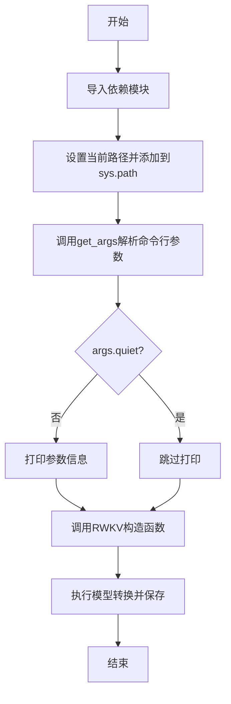
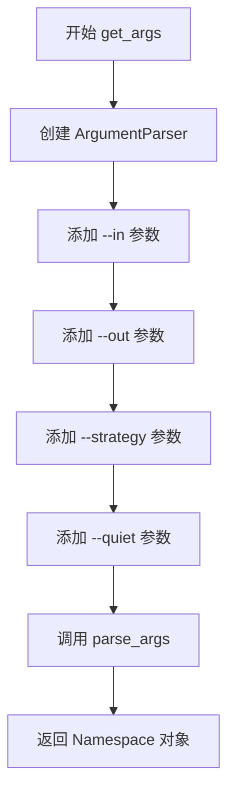

# `ChatRWKV\v2\convert_model.py` 详细设计文档

一个用于将RWKV模型转换为特定格式以实现更快加载并节省CPU内存的命令行工具，通过解析输入模型路径、输出模型路径和策略参数，调用RWKV库的转换功能完成模型格式转换。

## 整体流程



## 类结构

```
convert_model.py (主脚本文件，无类定义)
```

## 全局变量及字段


### `current_path`
    
当前脚本所在目录的绝对路径

类型：`str`
    


### `args`
    
解析后的命令行参数对象，包含in、out、strategy和quiet等参数

类型：`argparse.Namespace`
    


    

## 全局函数及方法


### `get_args`

解析命令行参数，返回argparse.Namespace对象，包含--in、--out、--strategy和--quiet参数。

参数： 无

返回值：`argparse.Namespace`，包含以下属性：
- `in`：`str`，输入模型的文件名
- `out`：`str`，输出模型的文件名
- `strategy`：`str`，模型加载策略（包含空格和特殊字符，需要加引号）
- `quiet`：`bool`，是否静默模式（仅显示错误）

#### 流程图



#### 带注释源码

```python
def get_args():
    """
    解析命令行参数，返回包含模型转换配置的 Namespace 对象
    """
    # 创建 ArgumentParser 实例，指定程序名称和描述
    p = argparse.ArgumentParser(
        prog = 'convert_model', 
        description = 'Convert RWKV model for faster loading and saves cpu RAM.'
    )
    
    # 添加 --in 参数：输入模型文件路径（必选）
    p.add_argument(
        '--in', 
        metavar = 'INPUT', 
        help = 'Filename for input model.', 
        required = True
    )
    
    # 添加 --out 参数：输出模型文件路径（必选）
    p.add_argument(
        '--out', 
        metavar = 'OUTPUT', 
        help = 'Filename for output model.', 
        required = True
    )
    
    # 添加 --strategy 参数：模型加载策略（必选）
    p.add_argument(
        '--strategy', 
        help = 'Please quote the strategy as it contains spaces and special characters. See https://pypi.org/project/rwkv/ for strategy format definition.', 
        required = True
    )
    
    # 添加 --quiet 参数：静默模式标志（可选，默认为 False）
    p.add_argument(
        '--quiet', 
        action = 'store_true', 
        help = 'Suppress normal output, only show errors.'
    )
    
    # 解析命令行参数并返回 Namespace 对象
    return p.parse_args()
```

## 关键组件


### 命令行参数解析模块

负责解析用户输入的转换参数，包括输入模型路径、输出模型路径、转换策略和其他选项。

### 模型转换核心模块

调用RWKV类的转换功能，根据指定的策略（cuda fp16、cuda fp16i8等）将输入模型转换为目标格式并保存。

### 策略配置模块

定义和支持不同的量化策略（如fp16、fp16i8 *10等），用于控制模型的精度和性能平衡。

### 参数验证与输出模块

验证输入参数的合法性，并在非静默模式下输出转换任务的详细信息供用户确认。


## 问题及建议


### 已知问题

- **硬编码的系统路径依赖**：使用 `sys.path.append` 添加相对路径依赖当前文件位置，降低了脚本的可移植性和独立性
- **未使用的注释代码**：包含大段注释掉的命令行示例（lines 7-9），既占用空间又可能造成混淆
- **缺少输入验证**：未检查输入模型路径是否存在、输出路径是否可写、strategy 参数格式是否合法
- **argparse 参数访问方式不规范**：使用 `getattr(args, 'in')` 而非直接使用 `args.in`（虽然功能上可行，但风格不佳）
- **缺乏错误处理**：未对文件读写异常、模型转换失败等情况进行捕获和处理
- **无日志记录标准**：仅使用 print 输出信息，未采用 Python 标准 logging 模块，不利于生产环境运维
- **缺少类型注解**：函数和变量均无类型提示，降低了代码可维护性和 IDE 辅助能力

### 优化建议

- 使用 `pathlib` 或 `os.path` 在执行前验证输入输出路径的合法性
- 将策略验证逻辑封装为独立函数，参考官方 strategy 格式定义进行校验
- 采用 `logging` 模块替代 print，支持配置日志级别和输出目标
- 为关键函数添加类型注解（如 `get_args() -> argparse.Namespace`）
- 引入 try-except 块包装核心转换逻辑，捕获并合理处理 `FileNotFoundError`、`OSError` 等异常
- 将注释中的示例用法迁移至 README 文档或 `--help` 说明中，保持代码简洁
- 考虑添加dry-run模式或verbose选项以增强用户控制能力


## 其它


### 设计目标与约束

本代码的设计目标是将RWKV模型从一种格式转换为另一种格式，以实现更快的加载速度和更低的CPU内存占用。约束条件包括：输入模型路径必须存在且有效，输出路径需要具有写权限，策略字符串必须符合rwkv库定义的格式规范。

### 错误处理与异常设计

代码主要依赖RWKV类的构造函数进行模型加载和转换。当输入路径不存在、模型文件损坏或策略无效时，RWKV类会抛出相应的异常。脚本本身通过argparse的required=True确保必需参数的存在，并通过not args.quiet条件打印输出。潜在的异常包括：FileNotFoundError（输入文件不存在）、ValueError（策略格式错误）、RuntimeError（模型加载失败）等。

### 数据流与状态机

数据流从命令行参数输入开始，经过参数解析、路径验证，然后传递给RWKV类进行模型加载、转换和保存。状态转换包括：初始状态（参数解析）-> 加载模型状态 -> 转换模型状态 -> 保存模型状态 -> 结束状态。转换过程由rwkv库的convert_and_save_and_exit参数控制完成。

### 外部依赖与接口契约

主要依赖rwkv库（pip包rwkv）中的RWKV类。接口契约要求：输入路径（--in）必须是有效的RWKV模型目录路径，输出路径（--out）是转换后模型的保存路径，策略（--strategy）必须符合pypi.org/project/rwkv/定义的格式。RWKV类的构造函数签名为RWKV(model, strategy, verbose, convert_and_save_and_exit)。

### 性能考虑与基准测试

代码本身的性能开销很小，主要性能取决于RWKV类的模型转换和保存过程。对于大型模型（如14B参数模型），转换可能需要大量内存和磁盘空间，代码注释中提到需要增加swap/virtual ram大小。性能优化主要通过策略参数实现，如使用cuda fp16策略可以减少内存占用。

### 安全性考虑

代码执行时需要注意：输入模型路径的可访问性验证，输出目录的写权限检查，策略参数的安全性（避免注入恶意命令）。由于代码直接执行模型转换，建议在受控环境中运行，避免处理来自不可信来源的模型文件。

### 配置管理

所有配置通过命令行参数传递，包括输入路径、输出路径、策略和静默模式。配置在运行时解析，不涉及配置文件或环境变量的使用。策略参数是最复杂的配置项，需要用户参考官方文档指定正确的格式。

### 兼容性说明

该脚本与rwkv库的版本紧密相关，不同版本的rwkv库可能支持不同的策略格式。代码中引用的策略示例（cuda fp16、cuda fp16i8等）对应特定版本的库。脚本适用于Linux文件系统（使用/fsx/路径示例），在Windows或macOS上可能需要调整路径格式。

### 使用示例与文档

代码中已包含注释形式的典型使用示例，包括14B、7B和3B模型的转换命令。--quiet参数用于抑制正常输出，仅显示错误信息。完整的策略格式说明需要参考https://pypi.org/project/rwkv/网站。

### 许可证与版权信息

代码本身未包含明确的许可证声明。RWKV模型和相关库可能有独立的许可证，使用时需参考rwkv项目的许可证条款。

    