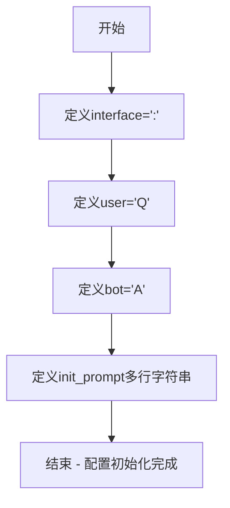

# `ChatRWKV\v2\prompt\default\Chinese-1.py` 详细设计文档

这是一个简单的配置初始化代码片段，定义了聊天界面的符号标记、用户和机器人的标识符，以及一个用于初始化提示词的多行字符串模板，用于构建研究专家问答系统的基础配置。

## 整体流程



## 类结构

```
该代码片段无类层次结构
仅包含全局变量定义
```

## 全局变量及字段


### `interface`
    
聊天界面的符号标记，值为冒号

类型：`str`
    


### `user`
    
用户标识符，值为'Q'

类型：`str`
    


### `bot`
    
机器人标识符，值为'A'

类型：`str`
    


### `init_prompt`
    
初始化提示词模板，包含系统角色定义和研究专家问答场景描述

类型：`str`
    


    

## 全局函数及方法


## 关键组件


### interface

全局变量，用于定义接口标识符，值为冒号":"，可能用于分隔符或协议标识。

### user

全局变量，定义用户消息的前缀标识，值为"Q"（代表Question），用于区分用户输入。

### bot

全局变量，定义机器人回复的前缀标识，值为"A"（代表Answer），用于区分系统输出。

### init_prompt

全局变量，系统初始化提示词模板，包含了"Expert Questions & Helpful Answers"和"Ask Research Experts"等核心指导信息，用于设定AI助手的专业研究问答角色定位。


## 问题及建议


### 已知问题

-   **冗余的 f-string 语法**：`init_prompt` 使用了 f-string 格式化语法，但未插入任何变量，等同于普通字符串，增加了不必要的解析开销
-   **变量命名语义不清**：`interface = ":"` 中 "interface" 命名与值 ":" 不匹配，":" 通常作为分隔符使用，此处用途不明
-   **缺乏类型注解**：所有变量均无类型声明，降低了代码的可读性和静态分析友好度
-   **全局变量缺乏组织**：配置性质的变量（interface、user、bot、init_prompt）以散落形式定义，无结构化封装
-   **无文档说明**：缺少模块级或变量级注释，无法明确这些配置项的实际用途和使用场景

### 优化建议

-   将 `init_prompt` 改为普通三引号字符串，去除不必要的 f-string 前缀
-   重命名 `interface` 变量为更清晰的标识（如 `separator`），或补充注释说明其用途
-   引入类型注解，例如 `interface: str = ":"`、`user: str = "Q"` 等
-   使用配置类或配置字典封装相关变量，提升可维护性，例如创建 `PromptConfig` 类或 `DEFAULT_CONFIG` 字典
-   添加模块级文档字符串，说明此模块的功能定位和配置项用途


## 其它


### 设计目标与约束

本代码主要用于配置简单问答系统的基础参数，定义用户标识、机器人标识、界面标识以及初始化提示语。设计约束为轻量级配置，不涉及复杂业务逻辑，需要保持配置项的简洁性和可读性。

### 错误处理与异常设计

当前代码为纯配置定义，不涉及运行时错误处理。若后续扩展，建议添加配置验证机制，确保interface、user、bot等变量非空且符合预期格式（如user和bot应为单字符）。对于init_prompt，应检查其不为空字符串。

### 数据流与状态机

该代码为静态配置定义，不涉及运行时数据流和状态机。init_prompt作为初始化提示词，在系统启动时由聊天机器人框架加载并显示给用户，作为系统角色的定义。

### 外部依赖与接口契约

本代码无外部依赖，仅使用Python内置的f-string格式化功能。接口契约方面，interface、user、bot三个变量应保持字符串类型，init_prompt应为字符串类型且可被后续模块引用。

### 安全性考虑

当前代码无敏感信息，但建议在实际部署时注意：init_prompt如包含敏感内容需进行脱敏处理；避免在代码中硬编码真实用户ID或系统密钥；考虑添加配置加载的环境变量注入机制以支持不同部署环境。

### 性能要求

由于仅为配置定义代码，无性能瓶颈。唯一需注意的是init_prompt字符串长度不宜过大，否则可能影响系统启动速度和内存占用。

### 可扩展性设计

当前设计缺乏扩展性，建议：1) 将配置抽离至独立配置文件（如config.py或config.json）；2) 支持从环境变量或配置文件加载参数；3) 添加配置验证和默认值的处理逻辑。

### 配置管理

建议采用集中式配置管理，将interface、user、bot、init_prompt等配置项统一管理。考虑支持多环境配置（如development、production），通过环境变量或配置文件切换不同环境下的参数值。

### 测试策略

由于为简单配置代码，单元测试重点应包括：配置项类型验证、配置值有效性检查、init_prompt模板渲染测试。建议添加配置完整性测试，确保所有必要配置项均已定义。

### 部署要求

该代码可直接作为模块导入使用。部署时需确保Python环境版本兼容（建议Python 3.6+以支持f-string语法）。如涉及容器化部署，需将配置文件挂载为卷或通过环境变量注入。

### 监控和日志

当前代码不产生运行时日志。建议在后续使用该配置的模块中添加日志记录，记录配置加载状态、初始化提示词渲染结果等信息，便于问题排查和系统监控。

### 版本管理

建议在代码头部添加版本号和修改记录，格式如下：
```
# Version: 1.0.0
# Last Modified: 2024-01-01
# Changelog: Initial release
```

### 代码规范

建议遵循PEP 8代码规范，为每个配置变量添加文档字符串说明。例如：
```python
interface = ":"  # 界面标识符
user = "Q"       # 用户角色标识
bot = "A"        # 机器人角色标识
```


    