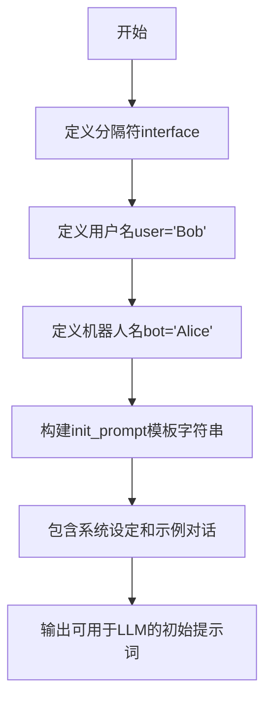

# `ChatRWKV\v2\prompt\default\Chinese-2.py` 详细设计文档

这是一个对话系统的初始化提示词模板文件，通过预定义的格式和示例对话来设置AI聊天机器人的角色和行为风格。

## 整体流程



## 类结构

```
该文件为纯脚本文件，无类层次结构
仅包含全局变量和初始化逻辑
```

## 全局变量及字段


### `interface`
    
分隔符，用于分隔说话者和内容

类型：`str`
    


### `user`
    
用户名称，在示例对话中代表用户角色

类型：`str`
    


### `bot`
    
机器人名称，在示例对话中代表AI角色

类型：`str`
    


### `init_prompt`
    
完整的初始化提示词模板，包含系统设定和示例对话

类型：`str`
    


    

## 全局函数及方法


## 关键组件


### interface 变量

定义用户与机器人对话时的分隔符标识，用于在提示词模板中分离用户和机器人的发言内容。

### user 变量

存储对话中用户的名称，用于在初始化提示词中代入具体的用户名，实现个性化的对话设置。

### bot 变量

存储对话中机器人的名称，用于在初始化提示词中设定机器人的身份和角色特征。

### init_prompt 变量

包含完整的系统提示词和示例对话内容，定义了机器人的角色设定（中文女孩Alice）、对话风格（聪明、创意、友好），并预置了两个问答示例（LHC相关知识、企鹅是否会飞），用于初始化对话模型的上下文。


## 问题及建议


### 已知问题

-   **全局变量无封装**：变量`interface`、`user`、`bot`、`init_prompt`以裸全局变量形式定义，缺乏访问控制，无法在多实例场景下复用
-   **硬编码内容过多**：用户名称（Bob/Alice）、分隔符（:）、初始化对话内容全部硬编码，后期维护成本高
-   **字符串拼接方式低效**：使用`f-string`+反斜杠`\`换行拼接长字符串，可读性差且易引入格式错误
-   **缺乏类型注解**：所有变量和方法均无类型标注，不利于静态分析和IDE智能提示
-   **注释说明不完整**：仅有一条关于换行的注释，缺乏对配置项用途的说明
-   **无错误处理机制**：未考虑变量为空、接口符号异常等边界情况
-   **配置与业务逻辑耦合**：prompt模板与变量定义混在一起，未分离配置层与业务层

### 优化建议

-   **引入配置类或配置文件**：将`interface`、`user`、`bot`等配置项封装为配置类或YAML/JSON配置文件，提高可维护性
-   **结构化Prompt模板**：使用模板引擎（如`string.Template`）或拆分Prompt为结构化数据块，避免长字符串拼接
-   **添加类型注解**：为所有变量添加明确的类型声明，如`interface: str`、`user: str`
-   **增加配置校验**：在初始化时校验配置合法性（如`interface`非空、用户/机器人名称合理性）
-   **抽取对话样本数据**：将示例对话内容单独存放，支持动态加载和扩展
-   **增加日志记录**：添加适当的日志输出，便于调试和追踪
-   **考虑国际化支持**：若面向多语言场景，将固定中文文本抽离为语言包


## 其它


### 设计目标与约束

本代码的核心设计目标是创建一个用于AI对话系统的初始化提示词模板，通过预定义的对话示例来引导AI助手（Alice）的回复风格和内容。设计约束包括：1）必须保持用户（Bob）和机器人（Alice）消息之间的换行格式，以确保提示词的格式正确；2）机器人角色被设定为友好、有帮助且知识渊博的女性形象；3）对话内容应涵盖科学知识等多样化主题。

### 错误处理与异常设计

由于本代码为简单的数据定义模块，未实现复杂的错误处理机制。潜在的风险点包括：1）如果interface、user或bot变量未定义或为空，将导致f-string格式化失败；2）init_prompt中的对话内容格式依赖于变量值，错误的变量类型可能引发TypeError；3）建议在实际使用前对变量进行类型检查和非空验证，特别是当这些变量来自外部配置或用户输入时。

### 数据流与状态机

数据流较为简单：变量interface、user、bot作为输入源，经过f-string格式化处理后输出为init_prompt字符串常量。不存在复杂的状态机设计，代码为纯静态配置定义，不涉及运行时状态管理或状态转换逻辑。该模块作为对话系统的初始化数据提供者，被动等待上游系统调用。

### 外部依赖与接口契约

本模块几乎无外部依赖，仅使用Python标准库的内置功能（字符串格式化f-string）。接口契约方面：1）模块导出init_prompt全局变量供外部调用；2）期望调用方能够正确导入并使用该字符串作为AI系统的系统提示词；3）建议调用方不要修改interface、user、bot的值，以免破坏预设的对话格式和角色设定。

    