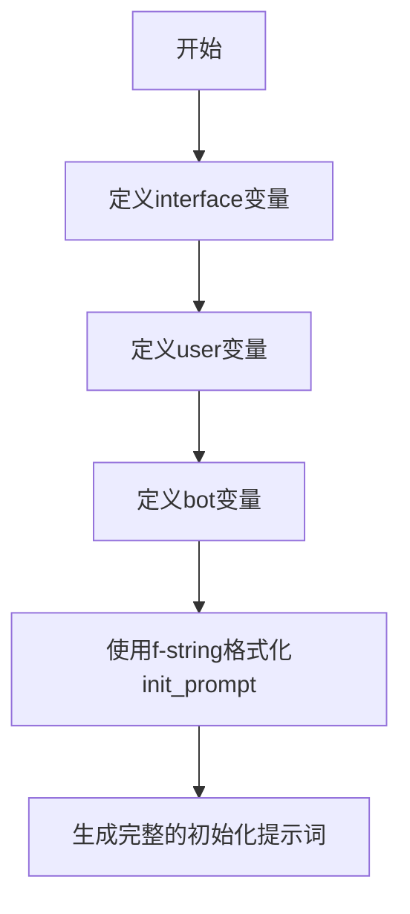

# `ChatRWKV\v2\prompt\default\English-0.py` 详细设计文档

这段代码定义了一个简单的聊天机器人初始化提示词模板，通过全局变量配置用户和机器人的标识符，并使用f-string格式化生成初始对话场景的提示文本。

## 整体流程



## 类结构

```
该代码不包含任何类定义，仅包含全局变量和字符串格式化操作
```

## 全局变量及字段


### `interface`
    
分隔符字符，用于分隔用户和机器人的角色标识

类型：`str`
    


### `user`
    
用户角色名称标识，用于提示模板中标识用户输入

类型：`str`
    


### `bot`
    
机器人角色名称标识，用于提示模板中标识机器人响应

类型：`str`
    


### `init_prompt`
    
初始化提示文本，通过f-string格式化生成，包含用户和机器人的对话模板

类型：`str`
    


    

## 全局函数及方法


## 关键组件


### interface

定义用户和机器人之间的交互分隔符，值为":"，用于在提示模板中分隔用户和机器人的角色名称。

### user

用户角色标识符，固定值为"Question"，表示用户提问的角色名称。

### bot

机器人角色标识符，固定值为"Answer"，表示助手回答的角色名称。

### init_prompt

使用f-string格式化的初始化提示模板，通过变量插值将interface、user、bot的值嵌入到预定义的提示结构中，生成完整的系统初始化对话示例。


## 问题及建议


### 已知问题

-   硬编码问题：interface、user、bot变量以及init_prompt模板内容均为硬编码，缺乏灵活性
-   缺乏验证逻辑：未对interface、user、bot等变量进行有效性检查或类型验证
-   可维护性差：多行f-string的格式化依赖空白符缩进，修改时容易破坏格式
-   国际化支持缺失：用户和机器人的标签（"Question"/"Answer"）硬编码，不支持多语言场景
-   扩展性受限：interface仅定义为简单的冒号，无法满足更复杂的界面分隔需求
-   上下文缺失：代码片段缺少类或模块封装，无法体现其在上层系统中的职责定位

### 优化建议

-   将interface、user、bot等配置项抽取至独立的配置文件或环境变量，提升可配置性
-   引入配置类或数据类（dataclass）封装相关变量，提供默认值和验证逻辑
-   考虑使用模板引擎（如jinja2）或配置中心管理提示模板，提升可维护性
-   添加类型注解（type hints），增强代码可读性和IDE支持
-   将init_prompt的构建逻辑封装为函数，支持动态参数传入和模板复用
-   若项目需要国际化，使用gettext或类似的本地化框架替代硬编码文本


## 其它


### 一段话描述

该代码定义了一个简单的对话系统初始化配置，通过预定义的接口符、用户和机器人角色名称，以及一个初始提示模板，构建了人机对话的基本框架，用于设置对话系统的起始状态。

### 文件的整体运行流程

该代码文件为静态配置定义，无运行时流程。主要流程为：定义接口分隔符 → 定义对话参与者名称 → 组合生成初始化提示模板字符串，供后续对话系统调用。

### 全局变量详细信息

### interface

- **类型**: 字符串 (str)
- **描述**: 对话接口的分隔符，用于分隔用户角色和机器人角色的标识符号

### user

- **类型**: 字符串 (str)
- **描述**: 用户角色的名称标识，在提示模板中代表提问方

### bot

- **类型**: 字符串 (str)
- **描述**: 机器人角色的名称标识，在提示模板中代表回答方

### init_prompt

- **类型**: 字符串 (str)
- **描述**: 格式化后的初始化提示模板，包含完整的对话开场白，定义了机器人的角色定位和行为准则

### 关键组件信息

### 对话配置组件

- **名称**: 对话系统配置
- **描述**: 包含接口符、用户名称、机器人名称的初始化配置模块

### 提示模板组件

- **名称**: 初始化提示生成器
- **描述**: 将配置参数组合为结构化提示字符串的模板组件

### 潜在的技术债务或优化空间

### 1. 硬编码配置问题

- 当前所有配置均以硬编码方式直接定义在全局变量中，缺乏灵活性
- 建议：引入配置文件或环境变量机制，支持运行时配置

### 2. 模板格式化方式

- 使用f-string进行格式化，虽然简洁但在大规模应用时可读性较差
- 建议：考虑使用模板引擎或配置文件管理复杂模板

### 3. 缺乏验证机制

- 未对接口符、用户/机器人名称进行格式验证
- 建议：添加输入验证逻辑，确保符合预期格式

### 4. 国际化支持缺失

- 提示模板为英文硬编码，不支持多语言
- 建议：提取为独立资源文件，支持本地化配置

### 设计目标与约束

### 设计目标

- 建立简洁的对话系统初始化框架
- 提供清晰的角色定义和交互规范
- 支持快速部署和集成到现有对话系统

### 设计约束

- 保持代码 minimal 和简洁性
- 不引入外部依赖，纯 Python 内置实现
- 仅支持单轮对话初始化场景

### 错误处理与异常设计

### 当前状态

- 该代码片段未包含任何错误处理机制
- 所有输入均为静态字符串字面量，无运行时错误风险

### 潜在风险

- 如果未来改为动态赋值，可能出现空值或类型错误
- 格式化字符串时如果包含占位符冲突可能导致意外输出

### 建议改进

- 添加类型检查确保赋值类型正确
- 对关键变量提供默认值或空值保护

### 外部依赖与接口契约

### 外部依赖

- 无外部依赖，仅使用 Python 标准库

### 接口契约

- **输入接口**: 无（静态定义）
- **输出接口**: init_prompt 字符串变量，供外部系统读取使用
- **调用方式**: 直接导入全局变量使用

### 数据流与状态机

### 数据流

```
静态定义 → 接口符/角色名称 → 字符串格式化 → 初始化提示模板 → 对话系统消费
```

### 状态说明

- **初始状态**: 变量定义完成
- **就绪状态**: init_prompt 格式化完成
- **使用状态**: 被对话系统调用

### 可扩展性分析

### 当前扩展性

- 支持通过修改全局变量值来调整配置
- 模板结构支持扩展新角色或对话阶段

### 扩展建议

- 考虑将配置封装为配置类或配置字典
- 支持从外部配置文件加载配置参数
- 提供配置验证和默认值填充机制


    