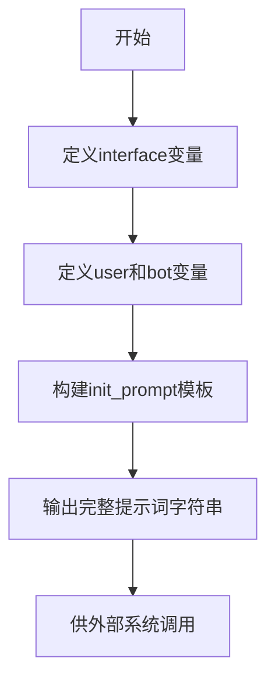

# `ChatRWKV\v2\prompt\default\English-1.py` 详细设计文档

这是一个对话式AI系统的提示词模板初始化脚本，定义了用户与AI助手交互时使用的基础提示词（init_prompt），包含了角色设定（User和Bot）、对话分隔符（interface）以及多轮对话示例，用于为语言模型提供上下文学习的基础。

## 整体流程



## 类结构

```
无类层次结构（脚本级代码）
```

## 全局变量及字段


### `interface`
    
对话界面分隔符，用于在提示词中区分用户消息和机器人消息

类型：`str`
    


### `user`
    
用户名称标识，用于在提示词模板中代表用户角色

类型：`str`
    


### `bot`
    
机器人名称标识，用于在提示词模板中代表AI助手角色

类型：`str`
    


### `init_prompt`
    
初始化提示词模板，通过f-string格式化包含对话角色定义和示例对话内容

类型：`str`
    


    

## 全局函数及方法


## 关键组件


### interface (分隔符)

用于分隔对话中用户名/机器人名与实际消息内容的字符，定义用户和AI发言的格式

### user (用户名标识)

字符串常量，定义对话中人类用户的名称标识

### bot (机器人名标识)

字符串常量，定义对话中AI助手的名称标识

### init_prompt (初始化提示模板)

多行字符串，包含预定义的对话示例，用于初始化AI助手的对话上下文和风格设定


## 问题及建议


### 已知问题

-   **硬编码配置值**：interface、user、bot 等关键配置以硬编码方式定义，缺乏从配置文件或环境变量读取的机制，不利于多环境部署和配置管理
-   **无输入验证**：interface 符号无长度和合法性校验，可能导致格式错误的提示词
-   **注释不够规范**：注释 "# If you modify this, make sure you have newlines between user and bot words too" 过于口语化，不符合生产代码规范
-   **示例数据质量**：示例对话存在语法错误（如 "wat is lhc" 应为 "what is lhc"，"guess i marry who ?" 语句不通顺），可能影响模型学习效果
-   **字符串拼接低效**：使用多行 f-string 拼接大型模板，可维护性差，难以扩展
-   **无类型注解**：缺少类型提示，降低代码可读性和 IDE 辅助能力
-   **无错误处理**：变量值异常时无回退机制，可能导致运行时错误
-   **魔法数字**：示例中的年份（1789、1999、2008、2012）和数字未提取为常量

### 优化建议

-   将配置抽离至独立的配置文件（如 config.yaml）或环境变量，使用配置管理类加载
-   为 interface 添加正则校验，确保为单字符或合法字符串
-   将示例对话数据迁移至外部 JSON/YAML 文件存储，便于非技术人员维护
-   使用 dataclass 或 Pydantic 模型重构配置结构，添加类型注解和验证
-   统一修正示例对话中的拼写和语法错误
-   将年份和关键数字提取为常量或配置项
-   添加日志记录和异常处理机制
-   编写正式的代码注释和文档字符串
-   考虑使用模板引擎（如 Jinja2）替代字符串拼接，提高可维护性


## 其它


### 设计目标与约束

该代码的核心目标是为对话系统提供一个初始化提示模板，用于设置AI助手与用户之间的对话上下文。设计约束包括：提示模板必须遵循特定格式（用户问题后跟接口符号和机器人回答），且必须包含足够多样的示例对话以展示系统能力。

### 错误处理与异常设计

由于该代码仅为数据定义（字符串模板），不涉及运行时逻辑，因此错误处理主要体现在配置验证阶段。需要检查：interface符号不能为空、user和bot名称不能包含特殊字符、init_prompt必须符合预期的对话格式结构。

### 数据流与状态机

该代码作为静态配置数据被加载到对话系统的提示模板引擎中。数据流为：配置文件 → 模板解析器 → 对话上下文初始化器 → 语言模型。状态机方面，对话系统初始状态为"等待用户输入"，接收到init_prompt后进入"预热状态"。

### 外部依赖与接口契约

该代码依赖于对话系统的其他组件：模板引擎负责解析和填充init_prompt变量、语言模型接口接收格式化后的完整提示文本。接口契约规定：init_prompt必须是字符串类型、变量占位符{user}、{bot}、{interface}必须被正确替换。

### 安全性考虑

init_prompt内容需经过内容安全审核，确保不包含恶意指令或提示注入风险。示例对话中应避免敏感话题、不当语言或可能被滥用的信息。变量替换需进行输入 sanitization，防止特殊字符导致提示注入攻击。

### 性能要求

作为静态配置，init_prompt的加载时间应低于100ms。模板字符串长度建议控制在合理范围内（通常不超过4096 tokens），以确保语言模型处理效率。

### 配置管理

interface、user、bot等配置项应支持外部配置文件或环境变量覆盖，实现灵活部署。init_prompt模板应支持多版本管理，便于A/B测试和迭代优化。

### 可扩展性设计

当前设计支持通过修改init_prompt内容扩展对话示例数量和类型。架构上应预留提示模板插件化接口，支持不同场景（客服、教育、娱乐）使用不同的初始化提示。

### 测试策略

应包含以下测试用例：变量替换完整性测试、提示格式规范性测试、内容安全性扫描、与不同语言模型的兼容性测试、以及对话上下文一致性验证。

### 日志与监控

虽然该代码为静态配置，但应记录提示模板的加载状态和版本信息，便于问题排查和变更追踪。建议在模板引擎中增加加载耗时监控。


    