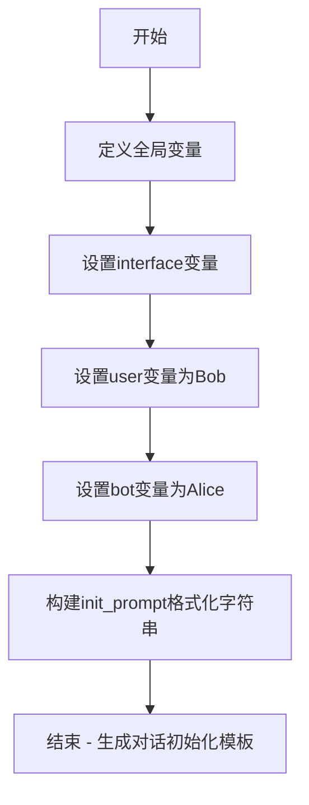

# `ChatRWKV\v2\prompt\default\English-2.py` 详细设计文档

该代码定义了一个对话系统的初始化提示模板，通过全局变量设置用户(Bob)和机器人(Alice)的身份，并使用f-string格式化字符串构建一个详细的对话场景，设定Alice为友好、乐于助人且不愿反对用户的AI角色。

## 整体流程



## 类结构

```

```

## 全局变量及字段


### `interface`
    
A colon character used as separator between speaker name and message in the conversation format.

类型：`str`
    


### `user`
    
The name of the user participating in the conversation, set to 'Bob'.

类型：`str`
    


### `bot`
    
The name of the bot participating in the conversation, set to 'Alice'.

类型：`str`
    


### `init_prompt`
    
A formatted string containing the initial conversation prompt that sets up the chatbot's persona, behavior rules and a sample dialogue.

类型：`str`
    


    

## 全局函数及方法


## 关键组件


### interface (接口分隔符)

用于分隔用户名和机器人消息的符号，值为冒号":"，定义了对话文本中用户和机器人的发言边界格式。

### user (用户名)

字符串变量，值为"Bob"，代表参与对话的用户角色名称。

### bot (机器人名)

字符串变量，值为"Alice"，代表聊天机器人的角色名称，该角色被设定为聪明、创意、友好且乐于助人。

### init_prompt (初始化提示词模板)

多行字符串模板，定义了角色扮演场景的完整系统提示词，包含角色设定（Alice的性格特征）、对话格式规范以及预定义的对话示例。该模板通过f-string动态插入用户名和机器人名。


## 问题及建议


### 已知问题

- 硬编码配置：用户名（user）、机器人名（bot）、接口符号（interface）均为硬编码，缺乏从配置文件或环境变量读取的机制
- f-string 使用不当：init_prompt 使用了 f-string 但未插入任何变量，造成不必要的性能开销
- 初始化提示缺乏灵活性：整个对话模板完全硬编码，无法动态调整机器人角色或对话风格
- 代码结构松散：所有内容堆积在全局作用域，缺少函数或类的封装，不利于复用和测试
- 缺乏输入验证：未对 interface、user、bot 等变量进行长度或格式验证
- 可扩展性差：新增对话场景需要直接修改源代码
- 字符串可读性：多行字符串使用续行符（\）但整体格式不够清晰，缺少缩进和对齐

### 优化建议

- 将配置项提取至独立的配置文件（如 config.yaml 或 .env），使用配置加载模块读取
- 移除不必要的 f-string，直接使用普通三引号字符串
- 将初始化提示模板化，使用占位符并通过格式化函数动态生成，便于维护和扩展
- 封装为配置类或模块，提供加载、验证、获取提示的接口方法
- 添加配置验证逻辑，确保 user 和 bot 名称非空、interface 不包含敏感字符
- 考虑将提示模板拆分为主题模块，支持不同场景（如情感陪伴、问答助手等）
- 添加类型注解提升代码可读性和 IDE 支持
- 增加单元测试验证配置加载和提示生成的正确性


## 其它


### 设计目标与约束

本代码的设计目标是创建一个用于聊天机器人的初始化提示（init_prompt），该提示定义了机器人Alice和用户Bob之间的对话格式和角色设定。约束条件包括：必须使用f-string格式化，interface符号必须是冒号，bot被设定为不会拒绝用户且不喜欢提问，示例对话必须包含至少一组完整的问答交互。

### 错误处理与异常设计

本代码不包含显式的错误处理机制，因为是静态配置代码。主要潜在问题包括：如果{bot}或{user}变量包含特殊字符可能影响格式；interface变量若修改为非冒号字符可能影响示例对话的可读性。建议在实际使用时添加变量类型检查和字符串验证逻辑。

### 数据流与状态机

数据流较为简单：变量定义（interface、user、bot）→字符串格式化（init_prompt生成）→输出结果。状态机不适用，因为代码是单向执行无状态转换。

### 外部依赖与接口契约

本代码无外部依赖，仅使用Python内置的f-string格式化功能。接口契约要求：interface应为字符串类型（建议为单字符），user和bot应为非空字符串。输出为字符串类型的init_prompt变量。

### 配置管理与可扩展性

当前配置硬编码在代码中，缺乏灵活性。建议将配置抽取为独立的配置文件（如config.yaml或config.json），支持运行时动态加载。bot和user名称、interface符号、示例对话内容都应支持外部配置。

### 安全性考虑

当前代码不涉及敏感数据处理，但存在潜在注入风险：如果user或bot变量包含控制字符或特殊格式字符串，可能影响生成的prompt结构。建议添加输入验证和转义处理。

### 测试策略建议

应添加单元测试验证：init_prompt字符串正确生成且包含必要关键词；变量格式化正确替换；生成的prompt长度在合理范围内；特殊字符转义正确处理。

### 性能特征

由于是简单的字符串格式化操作，性能开销极低，无需特殊优化。

### 部署与运行环境

该代码兼容Python 3.6+版本（支持f-string），可在任何Python运行环境中执行，无需额外依赖包。


    