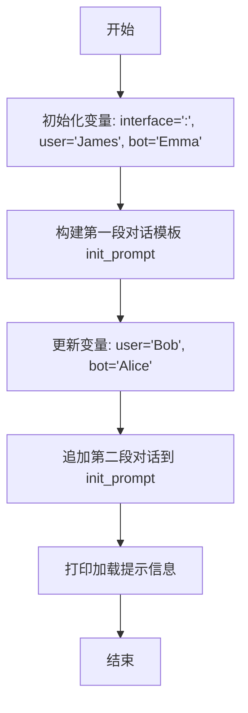

# `ChatRWKV\v2\prompt\default\English-3.py` 详细设计文档

该代码定义了一个用于聊天机器人的初始提示模板，包含用户和机器人的对话示例，用于引导AI对话风格和内容。代码主要通过f-string构建多轮对话场景，并预留了可定制的用户名和机器人名称。

## 整体流程



## 类结构

```
模块级别 (module)
├── 全局变量
│   ├── interface
│   ├── user
│   ├── bot
│   └── init_prompt
└── 无类定义
```

## 全局变量及字段


### `interface`
    
The separator string used between speaker names and their dialogue in the conversation format

类型：`str`
    


### `user`
    
The name of the human user in the conversation, initially 'James' but reassigned to 'Bob'

类型：`str`
    


### `bot`
    
The name of the AI bot in the conversation, initially 'Emma' but reassigned to 'Alice'

类型：`str`
    


### `init_prompt`
    
A multi-line string containing the initial system prompt that defines the chatbot's persona, behavior rules, and includes sample conversations demonstrating the dialogue style

类型：`str`
    


    

## 全局函数及方法


## 关键组件


### 接口符号定义 (interface)

用于分隔用户和机器人话语的符号，在对话中作为分隔标识。

### 用户与机器人名称定义 (user, bot)

第一组为示例用途（James 和 Emma），第二组为实际使用的真实名称（Bob 和 Alice）。

### 初始提示构建 (init_prompt)

一个很长的字符串变量，通过多行 f-string 构建，包含完整的对话场景设定和两段示例对话，用于初始化聊天机器人的上下文。

### 对话示例内容 (两段对话)

第一段对话展示了一个关于社交焦虑的咨询场景，第二段对话展示了关于饮品和聊天的日常场景，用于引导机器人的回复风格。

### 提示加载信息输出

print 语句输出模型加载提示信息，建议使用 ctx8192 模型和启用 RWKV_CUDA_ON = 1 以处理长上下文。


## 问题及建议


### 已知问题

- **字符串拼接效率低下**：使用 `+=` 运算符追加大量字符串到 `init_prompt`，由于Python字符串不可变特性，每次操作都会创建新字符串对象，当字符串很大时性能较差
- **重复代码（DRY原则违反）**：关于bot和user角色描述的完整提示模板在两段对话中完全重复，造成代码冗余
- **变量重复赋值**：user和bot变量被赋值两次（示例值和真实值），第一次赋值的结果被完全覆盖，容易引起误解和维护困惑
- **硬编码配置未分离**：interface分隔符、提示信息等配置直接硬编码在代码中，缺乏配置管理
- **缺少模块化和函数封装**：整个脚本是扁平的结构，没有将逻辑封装为可复用的函数或类
- **缺乏输入验证和错误处理**：代码没有对任何输入参数进行验证，也没有异常处理机制
- **可读性差**：多行字符串格式化（f-string）过长，难以阅读和维护
- **注释误导**：注释说明"only for chat sample. see below for real user name"，但实际上第一段对话被追加到init_prompt中而不是被替换
- **魔法字符串**：打印语句中的模型提示（ctx8192、RWKV_CUDA_ON）是硬编码的魔法字符串

### 优化建议

- **使用list + join替代字符串拼接**：将每部分字符串添加到列表，最后用 `''.join(parts)` 合并，大幅提升性能
- **提取重复模板为函数**：创建函数生成基础角色描述模板，避免代码重复
- **使用配置文件或常量类**：将interface分隔符、用户/机器人名称、模型提示等配置抽取到单独的配置模块
- **重构为函数式结构**：将init_prompt的构建逻辑封装为函数，接收user、bot、interface等参数，提高可复用性
- **添加文档字符串**：为代码添加docstring说明脚本用途、参数和返回值
- **清理无用代码**：移除第一次user和bot的示例赋值，直接使用最终值
- **考虑使用数据驱动**：将对话样本数据化，可以存储在JSON或YAML配置中，通过加载器动态生成
- **添加类型注解**：为变量添加类型提示，提高代码可维护性和IDE支持


## 其它


### 设计目标与约束

- **核心目标**：构建一个基于大语言模型的聊天机器人系统，通过精心设计的提示词（Prompt）来引导AI扮演特定角色（Alice/Bob）进行友好、有帮助的对话
- **约束条件**：
  - 提示词需要足够长以填充上下文窗口（建议使用ctx8192模型）
  - 对话示例需要包含多样化的场景和话题
  - 机器人角色设定为女性（girl），名字为Alice
  - 机器人应避免提问，喜欢分享个人观点和建议

### 错误处理与异常设计

- **模型选择警告**：代码末尾的print语句提示需要使用ctx8192模型和RWKV_CUDA_ON=1，否则可能因提示过长导致性能问题
- **内存限制**：超长字符串可能导致内存占用过高，需考虑模型上下文窗口限制
- **字符编码**：需确保中文字符正确处理，避免编码错误

### 数据流与状态机

- **数据流**：
  1. 定义interface分隔符
  2. 设置初始用户名和机器人名（示例用）
  3. 构建包含多轮对话的init_prompt字符串
  4. 重新定义实际的用户名和机器人名
  5. 追加新的对话场景到init_prompt
  6. 输出提示信息，建议使用特定模型配置
- **状态转换**：单次执行脚本，无状态变化

### 外部依赖与接口契约

- **依赖项**：
  - RWKV语言模型（ctx8192版本）
  - CUDA加速支持（RWKV_CUDA_ON=1）
- **接口规范**：
  - init_prompt字符串作为输入传递给LLM的system prompt
  - interface变量作为对话中用户和机器人的分隔符
  - user和bot变量定义对话参与者身份

### 性能优化建议

- **模型选择**：使用ctx8192模型以支持长上下文
- **GPU加速**：启用CUDA加速提高推理速度
- **内存管理**：考虑分块加载提示或使用模型蒸馏技术

### 安全性与隐私保护

- **用户数据**：示例中的用户名（James、Bob）为虚构人物
- **敏感信息**：提示中未包含真实敏感信息
- **建议**：如用于生产环境，需添加输入过滤和敏感信息脱敏机制

### 可扩展性分析

- **提示扩展**：可轻松添加更多对话示例
- **角色定制**：通过修改user/bot变量和init_prompt内容可快速适配不同角色
- **场景扩展**：可追加更多话题领域（如教育、技术、娱乐等）

### 测试策略建议

- **单元测试**：验证变量赋值正确性
- **集成测试**：测试与LLM模型的集成效果
- **对话质量评估**：人工评估或使用自动指标评估回复质量

### 部署与运维考量

- **环境要求**：Python运行环境，支持CUDA的GPU
- **配置管理**：模型参数（ctx8192、RWKV_CUDA_ON）需在部署时配置
- **日志记录**：建议添加运行时日志记录init_prompt构建过程

### 监控与日志设计

- **当前实现**：仅在控制台输出加载提示信息
- **建议改进**：添加结构化日志，记录提示构建耗时、字符串长度等指标

### 版本控制与变更管理

- **当前状态**：单文件脚本，无版本控制
- **建议**：纳入版本控制系统，记录prompt工程的历史变更

### 文档与知识管理

- **代码注释**：现有代码注释较少，建议增加模块级文档字符串
- **设计文档**：建议维护独立的提示工程设计文档，说明对话策略和示例选择理由

### 用户体验设计

- **对话风格**：机器人采用友好、乐于分享的建议型风格
- **话题引导**：通过示例展示如何自然地从日常话题过渡到建议类话题
- **交互模式**：机器人不主动提问，而是分享观点和提供建议

### 配置管理

- **可配置项**：
  - interface分隔符
  - user/bot名称
  - init_prompt内容
- **建议**：提取为独立配置文件或环境变量，便于调整

### 错误恢复机制

- **当前实现**：无错误恢复机制
- **建议**：添加异常捕获和降级策略，如模型不支持长上下文时的处理

### 合规性与法律考量

- **数据合规**：确保对话内容符合相关法律法规
- **内容审核**：建议添加输出内容过滤机制


    