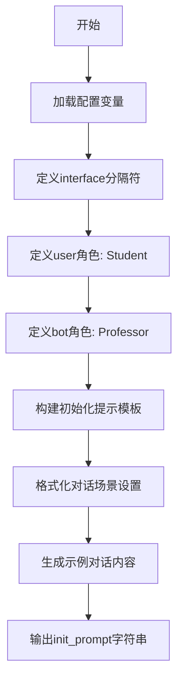

# `ChatRWKV\v2\prompt\default\English-4.py` 详细设计文档

该代码定义了一个AI对话系统的初始化提示（System Prompt），构建了一个Student与Professor之间的Q&A会话场景，用于模拟教授回答学生关于哲学、量子力学等学术问题的交互式学习环境。

## 整体流程



## 类结构

```
无类层次结构
该文件为纯配置/数据定义模块
仅包含全局变量定义
```

## 全局变量及字段


### `interface`
    
分隔符字符，用于分隔用户和机器人的对话信息

类型：`str`
    


### `user`
    
用户角色名称，设置为Student（学生）

类型：`str`
    


### `bot`
    
机器人角色名称，设置为Professor（教授）

类型：`str`
    


### `init_prompt`
    
初始化对话提示词，包含角色设定和示例对话内容

类型：`str`
    


    

## 全局函数及方法


## 关键组件


### 角色定义与配置

定义了对话系统的基本角色标识，包括用户（Student）和机器人（Professor）的角色名称，以及用于分隔角色和内容的接口符号（冒号）。

### 动态提示模板生成

使用 Python f-string 机制将用户和机器人的角色名称动态插入到系统提示模板中，实现角色配置的灵活性。

### 系统提示词结构

包含对话场景设置、角色行为定义（教授应友好、知识渊博、不轻易反对用户）、以及预定义的示例对话轮次，用于引导对话机器人的交互风格和响应模式。

### 预定义对话示例

包含多轮问答示例，涵盖哲学、量子隧穿、自旋与磁性、海森堡不确定性原理等主题，用于Few-shot学习或示例演示。

### 主题内容覆盖

对话示例涵盖了多个科学和哲学主题，包括量子力学中的隧穿现象、自旋与磁性的关系、不确定性原理等，展示了系统可处理的知识领域范围。


## 问题及建议


### 已知问题

-   **硬编码的对话内容**：所有对话文本都是硬编码的字符串，修改和维护困难，不符合DRY原则
-   **重复的模式定义**：{user}{interface} 和 {bot}{interface} 格式在字符串中重复出现多次，应该提取为可复用的模式
-   **缺乏数据结构化**：对话内容没有使用列表、字典等数据结构存储，而是以原始字符串形式存在，导致难以程序化处理（如添加、删除、修改对话轮次）
-   **魔法字符串（Magic Strings）**：interface、user、bot作为变量名但在代码中多处直接使用字符串值，缺乏统一管理
-   **字符串拼接效率**：使用多行f-string进行大量字符串拼接，可能影响性能和可读性
-   **缺乏类型提示**：Python代码中没有使用类型注解（type hints），降低代码的可维护性和IDE支持
-   **无输入验证**：对interface、user、bot等变量没有进行任何校验（如空值检查、长度限制）
-   **紧耦合设计**：对话内容与系统配置紧耦合，难以适配不同的对话场景或用户角色
-   **国际化/本地化困难**：所有文本硬编码为英文，改造成本高
-   **无错误处理机制**：代码中没有任何异常处理逻辑
-   **文档缺失**：没有模块级或函数级的文档字符串（docstring）

### 优化建议

-   **数据结构化**：将对话内容转换为列表或字典结构，例如使用 `List[Dict[str, str]]` 存储每轮对话的发言者和内容
-   **配置对象化**：创建配置类或使用dataclass/dataclass来统一管理interface、user、bot等配置参数
-   **模板方法提取**：编写辅助函数（如 `format_message(speaker, message)`）来消除重复的格式化模式
-   **类型注解**：为所有变量添加类型提示，如 `user: str = "Student"`
-   **配置分离**：将硬编码的对话内容迁移到独立的配置文件（如JSON或YAML）或数据库中
-   **国际化支持**：引入gettext或类似的国际化框架，支持多语言切换
-   **输入验证**：在初始化时添加参数校验逻辑，确保必要配置不为空
-   **日志记录**：添加适当的日志记录，便于调试和监控
-   **文档完善**：为模块和关键函数添加docstring，说明用途和使用方式


## 其它


### 设计目标与约束

该代码的核心目标是构建一个用于AI对话系统的初始化提示模板，通过预设的学生与教授角色定义来引导对话方向。约束条件包括：仅支持固定的角色定义（学生和教授），不支持动态角色切换，提示模板内容为只读且预先定义。

### 错误处理与异常设计

由于该代码仅包含静态字符串定义，不涉及运行时错误处理。对于实际应用场景，应考虑：接口字符为空或格式错误时的默认值回退机制；用户/机器人名称为空时的异常捕获；提示模板解析失败时的备用默认提示。

### 数据流与状态机

数据流为单向流动：变量定义 → 字符串格式化 → 提示模板生成 → 传递给对话系统。无状态机设计，状态转换依赖于调用方的对话管理模块。

### 外部依赖与接口契约

该代码无外部依赖，仅使用Python内置的f-string格式化功能。接口契约要求调用方必须提供有效的user和bot字符串变量，init_prompt输出为格式化后的字符串。

### 安全性考虑

提示模板中包含示例对话内容，应确保在实际部署时进行内容过滤和审核，防止生成不当回答。此外，模板中的占位符替换需防止注入攻击。

### 性能要求

由于是静态字符串模板，性能要求较低。主要关注点在于字符串格式化效率和大上下文场景下的内存占用优化。

### 可扩展性设计

当前设计扩展性受限，建议：提取接口符号至配置中心；支持从外部文件加载对话示例；增加模板变量验证机制；支持多语言/多场景模板切换。

### 配置管理

当前配置以硬编码方式定义，建议外部化：接口符号、用户名称、机器人名称应支持运行时配置；提示模板主体应支持从配置文件或数据库加载。

### 版本兼容性

该代码仅使用Python 3.6+的f-string特性，确保运行时Python版本不低于3.6。建议在文档中明确标注Python版本依赖要求。

    