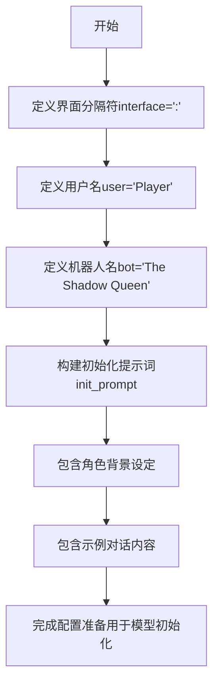

# `ChatRWKV\v2\prompt\default\English-5.py` 详细设计文档

这是一个角色扮演对话系统的初始化配置文件，定义了用户与名为'The Shadow Queen'的AI角色之间的交互界面分隔符、角色名称，并预设了详细的角色背景故事和示例对话内容，用于初始化对话模型的上下文提示词。

## 整体流程



## 类结构

```

```

## 全局变量及字段


### `interface`
    
对话界面分隔符

类型：`字符串类型`
    


### `user`
    
用户角色名称

类型：`字符串类型`
    


### `bot`
    
AI角色名称

类型：`字符串类型`
    


### `init_prompt`
    
包含角色设定和示例对话的初始化提示词

类型：`字符串类型`
    


    

## 全局函数及方法


## 关键组件


### 对话界面分隔符

定义用户与机器人对话的分隔符，用于在提示词中区分说话者和内容。

### 用户角色配置

定义对话中用户的名称标识，用于在提示词模板中动态插入用户名。

### 机器人角色配置

定义对话中机器人的名称标识，用于在提示词模板中动态插入机器人名称并构建其角色设定。

### 角色扮演初始化提示符

包含完整角色设定、背景故事和示例对话的格式化字符串，用于初始化AI对话系统的上下文。


## 问题及建议


### 已知问题

- **硬编码问题**：用户接口标识`: `、用户名`Player`和机器人名`The Shadow Queen`被硬编码在全局变量中，缺乏灵活的配置机制，难以适应不同场景或通过外部配置修改
- **字符串模板冗余**：`init_prompt`中的对话内容以多行字符串形式硬编码，机器人的自我介绍在模板中出现两次（存在重复内容），且对话流程被固定在字符串中，无法程序化地动态生成或修改对话
- **无函数化封装**：代码缺乏函数或类的封装，所有变量均为全局声明，无法作为模块被其他代码安全导入和使用（直接导入会立即执行）
- **无类型提示**：缺少Python类型注解，降低了代码的可读性和静态分析工具的检查能力
- **魔法字符串**：interface分隔符`": "`作为魔法字符串散布在模板中，若修改分隔符需同时手动修改模板内的所有出现位置
- **无输入验证**：对配置的接口、用户名、机器人名等变量没有任何校验逻辑（如空值检查、长度限制等）

### 优化建议

- **配置外部化**：将`interface`、`user`、`bot`等配置项提取到配置文件（如`config.json`、`.env`）或接受命令行参数输入，提高代码的可配置性
- **函数化/类化封装**：将提示词生成逻辑封装为函数（如`generate_init_prompt(user, bot, interface)`）或类（如`ConversationPromptGenerator`），使代码可测试、可复用，并避免全局命名空间污染
- **消除重复内容**：将模板中的重复对话内容提取为可复用的片段或常量，避免冗余存储
- **添加类型注解**：为变量和函数参数添加明确的类型提示，提升代码可维护性
- **模板与数据分离**：将对话结构（如角色定义、对话历史列表）与具体文本内容分离，采用数据结构（如字典列表）存储对话，再通过渲染函数生成最终提示词
- **增加输入校验**：在函数入口或配置加载时添加必要的参数校验，确保必要字段非空、格式正确
- **考虑模板引擎**：对于复杂的多角色对话模板，可考虑使用`string.Template`或`jinja2`等模板引擎，提高可维护性和可扩展性


## 其它


### 一段话描述

该代码创建了一个用于AI角色扮演对话系统的初始化提示词（init_prompt），定义了一个名为"The Shadow Queen"（暗影女王）的角色，她是一个曾经是恶魔、现已成为人类的角色，与玩家进行互动对话。

### 文件的整体运行流程

该代码文件为静态配置脚本，无运行时流程。执行顺序为：
1. 定义接口符号（interface）
2. 定义用户名（user）和机器人名（bot）
3. 使用f-string构建初始化提示词模板（init_prompt）

### 全局变量详细信息

| 变量名称 | 类型 | 描述 |
|---------|------|------|
| interface | str | 对话界面分隔符，值为冒号":" |
| user | str | 用户角色名称，值为"Player" |
| bot | str | 机器人角色名称，值为"The Shadow Queen" |
| init_prompt | str | 包含角色设定和示例对话的初始化提示词模板 |

### 关键组件信息

| 组件名称 | 描述 |
|---------|------|
| init_prompt | 初始化提示词模板，包含角色背景故事设定和示例对话内容，用于引导AI扮演指定角色 |

### 潜在的技术债务或优化空间

1. **硬编码问题**：所有配置（角色名、接口符、对话内容）均为硬编码，缺乏灵活性
2. **可维护性差**：多行字符串模板难以维护和版本控制
3. **缺乏验证**：没有对变量进行类型检查或有效性验证
4. **国际化支持缺失**：不支持多语言或动态内容替换
5. **配置与逻辑混合**：提示词模板作为代码一部分而非独立配置文件
6. **重复代码风险**：如果多个对话场景需要不同角色设定，代码复用性低

### 设计目标与约束

- **设计目标**：为AI对话系统提供角色设定和示例对话模板，确保角色行为一致性
- **约束条件**：
  - 角色设定需符合原始背景（恶魔→人类转变）
  - 对话风格需体现角色的成长和改变
  - 提示词需包含足够上下文使AI理解角色性格

### 错误处理与异常设计

- **当前状态**：该代码为纯数据定义，无运行时错误处理机制
- **潜在问题**：
  - f-string中变量未定义会导致NameError
  - 特殊字符可能导致字符串格式化问题
- **建议改进**：添加变量存在性检查和默认值处理

### 数据流与状态机

- **数据流**：
  - 输入：user、bot、interface变量
  - 处理：f-string格式化
  - 输出：init_prompt字符串
- **状态机**：不适用，该代码为静态配置，无状态变化

### 外部依赖与接口契约

- **外部依赖**：无外部依赖，仅使用Python内置f-string功能
- **接口契约**：
  - init_prompt输出为字符串类型
  - 预期用途：作为AI模型（如GPT）的system prompt输入
  - 格式要求：符合对话上下文格式，包含角色设定和示例对话

### 代码结构分析

- **模块化程度**：低，所有代码在单一文件/脚本中
- **单一职责**：符合，每个变量负责单一配置任务
- **开闭原则**：不符合，新增角色需要修改源码
- **可测试性**：低，无可测试的业务逻辑

### 配置管理建议

1. 将提示词模板外部化为JSON/YAML配置文件
2. 支持通过环境变量或配置文件动态修改角色名和接口符
3. 使用模板引擎（如jinja2）提高可维护性
4. 添加配置验证机制确保数据完整性

### 安全性考虑

- **当前风险**：较低，无用户输入处理
- **潜在风险**：
  - 如果bot变量来自用户输入，可能存在Prompt Injection风险
  - 长字符串可能包含敏感信息泄露
- **建议**：对外部输入进行严格的清理和验证

### 可扩展性设计

- 当前设计难以支持多角色切换
- 建议重构为：
  - 角色配置类（RoleConfig）
  - 提示词生成器类（PromptGenerator）
  - 支持从数据库或配置文件加载角色设定


    