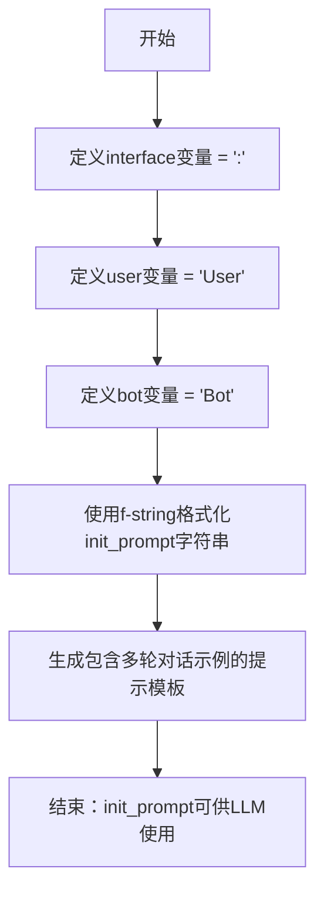

# `ChatRWKV\v2\prompt\default\Japanese-1.py` 详细设计文档

这段代码定义了一个用于AI对话系统的初始化提示模板，通过变量赋值和字符串格式化构建了一个包含用户（User）和AI助手（Bot）角色的多轮对话场景，用于引导大语言模型进行特定角色扮演和问答任务。

## 整体流程



## 类结构

```
无类层次结构
该代码仅包含全局变量定义和字符串格式化操作
```

## 全局变量及字段


### `interface`
    
分隔符，连接用户/机器人名称与对话内容

类型：`str`
    


### `user`
    
用户角色名称标识

类型：`str`
    


### `bot`
    
AI助手角色名称标识

类型：`str`
    


### `init_prompt`
    
格式化后的多行初始化提示字符串，包含系统设定和多轮对话示例

类型：`str`
    


    

## 全局函数及方法


## 关键组件


### 一段话描述

该代码定义了一个AI对话系统的初始化提示模板，通过预定义的变量（用户角色、机器人角色、对话分隔符）和包含多个问答示例的多行字符串，构建了一个用于引导AI助手进行特定风格对话的基础提示框架。

### 文件的整体运行流程

该代码文件为纯变量定义模块，无执行流程。运行时首先定义角色标识变量（interface、user、bot），然后通过f-string格式化字符串将变量注入到预定义的对话模板中，生成最终的初始化提示字符串供外部调用。

### 全局变量详细信息

#### interface
- 类型：str
- 描述：对话分隔符，用于在用户和机器人的话语之间添加标识符号

#### user
- 类型：str
- 描述：用户角色名称变量，用于在提示模板中标识用户身份

#### bot
- 类型：str
- 描述：AI助手角色名称变量，用于在提示模板中标识机器人身份

#### init_prompt
- 类型：str
- 描述：多行格式化字符串，包含完整的对话系统初始化提示，涵盖角色设定、对话格式规范及多个问答示例

### 关键组件信息

#### 张量索引与惰性加载
本代码中不涉及张量操作或惰性加载机制

#### 反量化支持
本代码中不涉及量化或反量化操作

#### 量化策略
本代码中不涉及模型量化策略

#### 对话格式模板
使用f-string和三引号字符串构建的初始化提示，包含角色设定（{bot}是聪明、博学、礼貌的AI助手）、对话格式（{user}{interface} 和 {bot}{interface}）、以及5个不同类型的问答示例（历史事实、数学计算、个人问题、数学求解、科学知识）

### 潜在的技术债务或优化空间

1. **硬编码问题**：问答示例直接嵌入字符串中，难以维护和扩展，应考虑外部配置或数据库存储
2. **缺乏国际化支持**：虽然使用日语编写，但变量名和结构未设计为多语言版本
3. **无版本控制**：提示模板内容变更无法追踪历史版本
4. **扩展性受限**：添加新示例需要修改源代码，不便于动态更新

### 其它项目

#### 设计目标与约束
- 目标：构建一个符合特定角色设定的AI对话初始化提示
- 约束：使用固定的角色名称和分隔符，示例内容需符合"知识丰富、聪明、礼貌"的设定

#### 错误处理与异常设计
本代码未实现任何错误处理机制，因其为纯数据定义模块

#### 数据流与状态机
数据流为：变量定义 → f-string格式化 → 初始化提示生成 → 外部调用，无状态机设计

#### 外部依赖与接口契约
- 无外部依赖
- 接口契约：外部模块通过导入init_prompt变量获取格式化后的提示字符串


## 问题及建议


### 已知问题

-   **硬编码的对话示例缺乏结构化**：init_prompt 中的对话内容以字符串形式硬编码，数据未分离，难以维护、扩展和动态管理
-   **缺少输入验证**：interface、user、bot 变量缺乏输入校验，若包含特殊字符可能导致格式化异常
-   **无模块化封装**：所有代码位于全局作用域，未封装为函数或类，难以测试和复用
-   **缺乏错误处理**：代码未考虑任何异常情况，无防御性编程
-   **魔法字符串未统一管理**：interface 分隔符作为字符串字面量分散使用，应定义为常量
-   **国际化支持缺失**：提示文本硬编码为日文，无法支持多语言切换
-   **代码可读性不足**：缺少文档字符串和注释说明代码用途

### 优化建议

-   **结构化对话数据**：使用列表或字典存储对话示例，通过函数动态生成 init_prompt，实现数据与逻辑分离
-   **添加输入验证**：在字符串插值前校验变量合法性，防止注入或格式错误
-   **封装为函数/类**：将提示生成逻辑封装为函数，例如 `generate_init_prompt(bot_name, user_name, interface, examples)`
-   **定义常量**：将 interface、user、bot 改为常量或配置对象，如 `INTERFACE = ":"`，`DEFAULT_BOT = "Bot"`
-   **支持多语言**：将提示模板外部化，通过配置文件或参数指定语言
-   **添加类型注解**：为变量添加类型提示，提升代码可读性和 IDE 支持


## 其它


### 设计目标与约束

该代码的设计目标是构建一个用于AI对话系统的初始化提示词模板，通过预定义的对话示例来指导AI助手的行为方式，使其表现出知识丰富、礼貌和理性的特点。约束条件包括：必须保持用户和机器人名称的可配置性，接口符号可自定义，对话示例需要包含多样化的场景（历史问题、数学问题、个人问题和科学问题），并且提示词需要使用日语编写以符合示例对话的语言环境。

### 错误处理与异常设计

由于该代码仅涉及静态变量定义和字符串格式化，不涉及运行时错误处理。潜在的问题包括：如果interface、user或bot变量为空字符串，可能导致生成的提示词格式不清晰；如果格式化字符串中的占位符与实际变量不匹配，可能导致KeyError。改进建议：添加输入验证函数，检查必要变量是否为空；使用try-except包装格式化操作以捕获KeyError；为关键变量提供默认值或抛出明确的异常信息。

### 数据流与状态机

该代码的数据流较为简单：输入层包含interface、user、bot三个配置变量，经过f-string格式化引擎处理后，输出init_prompt字符串变量。状态机方面不适用，因为代码是静态的，仅在模块加载时执行一次初始化过程。如果需要实现状态机功能，可以考虑将init_prompt的生成过程封装为函数，支持动态添加对话历史记录。

### 外部依赖与接口契约

该代码没有外部依赖，仅使用Python标准库中的字符串格式化功能。接口契约方面：模块级别的全局变量interface、user、bot应为字符串类型，init_prompt应为字符串类型。如果需要扩展，建议提供get_init_prompt()函数作为统一接口，返回格式化后的提示词字符串，便于后续模块调用和测试。

### 版本兼容性说明

该代码使用了Python 3.6+的f-string语法（格式化字符串字面量），不兼容Python 2.x版本。建议在代码头部添加版本注释说明，或考虑使用str.format()方法以提高兼容性。f-string语法的优势是代码简洁可读性高，在现代Python项目中已成为主流的字符串格式化方式。

### 配置管理建议

当前代码将配置直接硬编码在模块顶层，不利于后期维护和修改。建议采用以下改进方案：1）使用配置文件（如config.yaml或config.json）存储interface、user、bot等参数；2）创建配置类或配置模块，统管理所有配置项；3）支持环境变量覆盖默认配置，提高部署灵活性；4）将示例对话内容分离到单独的数据文件中，便于非技术人员修改对话示例。

### 国际化与本地化

当前代码使用日语编写提示词，如果需要支持其他语言，建议：1）创建独立的国际化模块，使用gettext或类似的i18n框架；2）将interface、user、bot以及示例对话内容提取为语言资源文件；3）设计支持多语言的初始化提示词生成器函数，根据传入的语言参数返回对应语言的提示词。

### 安全性考虑

当前代码不涉及用户输入处理，因此不存在典型的安全风险。但如果该init_prompt将用于AI系统的实际对话中，需要注意：1）确保示例对话不包含敏感或不当内容；2）如果示例对话来自外部来源，需要进行内容过滤和验证；3）避免在提示词中泄露系统架构或安全相关的配置信息。

### 性能特征

该代码的性能特征非常优秀：模块加载时仅执行简单的字符串赋值和格式化操作，时间复杂度为O(n)，其中n为生成提示词的长度。内存占用极低，仅存储几个字符串变量。在实际应用中，init_prompt通常只会在对话系统初始化时生成一次，因此不会成为性能瓶颈。

### 测试策略建议

虽然该代码较为简单，但仍建议编写单元测试以确保正确性：1）测试interface、user、bot变量类型和内容；2）测试init_prompt字符串的格式是否符合预期；3）测试f-string格式化是否正确替换了所有占位符；4）测试生成的提示词是否包含所有示例对话场景。可以使用Python的unittest框架或pytest编写测试用例。

### 可扩展性设计

当前代码的可扩展性有限，可以通过以下方式改进：1）将init_prompt的生成逻辑封装为可配置的函数，支持动态传入参数；2）设计对话场景管理器类，支持添加、删除和修改示例对话；3）实现对话模板系统，支持不同类型的对话场景（如问答、推理、情感交互等）；4）考虑支持对话历史记录功能，允许在初始化提示词中包含多轮对话历史。


    