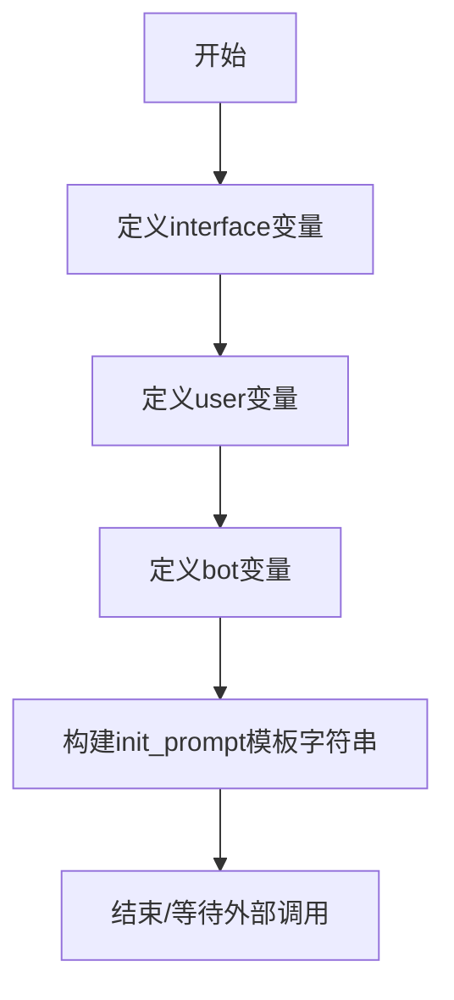

# `ChatRWKV\v2\prompt\default\Japanese-2.py` 详细设计文档

这是一个聊天机器人的初始化提示词配置文件，通过定义用户（Bob）和AI角色（Alice）的身份设定、对话界面格式（冒号），以及包含角色性格特征和示例对话的多行字符串，构建用于初始化AI聊天机器人的系统提示词，使其能够以友好、有帮助的方式与用户进行对话。

## 整体流程



## 类结构

```
无类层次结构（纯配置文件）
```

## 全局变量及字段


### `interface`
    
用户与机器人对话界面的分隔符，值为冒号

类型：`str`
    


### `user`
    
用户名，值为Bob，代表与机器人对话的用户

类型：`str`
    


### `bot`
    
机器人名称，值为Alice，代表对话中的AI角色

类型：`str`
    


### `init_prompt`
    
初始对话提示词模板，包含机器人和用户的角色设定及初始对话内容

类型：`str`
    


    

## 全局函数及方法


## 关键组件


### interface 变量

定义对话中用户和机器人之间的分隔符，用于在提示词模板中分隔用户名和机器人名与它们的话语。

### user 变量

存储用户名称，在示例对话和角色设定中代表与机器人互动的用户角色。

### bot 变量

存储机器人名称，定义了在对话中扮演的AI角色身份，该角色被设定为聪明、友好且乐于助人的女性角色。

### init_prompt 变量

核心的初始化提示词模板，通过f-string将变量动态嵌入到多行字符串中，包含角色设定和示例对话，用于为对话系统设置上下文和人格特征。

### 角色设定组件

提示词中定义的bot人格特征，包括：聪明、富有想象力、友好、从不对用户持反对意见、不擅长提问、喜欢分享个人想法和观点、总是提供有帮助的建议。

### 对话格式组件

定义用户和机器人之间的交互格式，使用interface变量作为分隔符标识说话者，每个对话轮次格式为"{说话者}{interface} {内容}"。

### 示例对话内容

预置的一段日语对话示例，展示用户和bot之间的日常交流场景，包含问候、讨论饮品等轻松话题，用于演示对话风格和互动模式。


## 问题及建议


### 已知问题

-   **拼写错误**：代码中存在拼写错误，如"あなな"应为"あなた"，"モカラテ"应为"マフラテ"或"モカ・ラテ"，"香りはとても甘いです"语义重复
-   **硬编码配置**：interface、user、bot变量硬编码在全局，后续修改需要改动多处，缺乏配置管理
-   **字符串格式问题**：init_prompt中的f-string使用了三个引号但未实际使用变量插值（f-string在此处使用不当），且文本中直接包含了interface变量值而非通过插值获取
-   **缺乏模块化**：没有将配置与逻辑分离，没有参数化设计，可扩展性差
-   **日语文本编码**：日文字符串可能存在编码问题，未明确指定编码格式
-   **无错误处理**：没有输入验证，没有异常捕获机制
-   **注释误导**：注释"# If you modify this, make sure you have newlines between user and bot words too"与实际代码行为不符

### 优化建议

-   **修正拼写错误**：检查并修正init_prompt中的日语文本拼写和语法错误
-   **配置外部化**：将interface、user、bot等配置项提取到独立的配置文件（如config.yaml或.env）
-   **重构字符串构造**：移除不必要的f-string，或正确使用变量插值构建对话模板
-   **添加类型注解**：为变量添加类型注解，提高代码可读性和IDE支持
-   **模块化设计**：将提示模板生成逻辑封装为函数，支持参数化调用
-   **添加编码声明**：在文件开头添加编码声明（# -*- coding: utf-8 -*-）
-   **输入验证**：添加对interface、user、bot变量的基本验证
-   **使用日志替代print**：如需调试输出，考虑使用logging模块

## 其它


### 设计目标与约束

本代码的核心目标是为对话系统提供一个角色扮演风格的初始化提示模板，定义机器人"Alice"与用户"Bob"之间的对话场景。设计约束包括：1) 仅支持日语对话内容；2) 机器人角色设定为总是同意用户、乐于分享观点但不擅长提问；3) 使用固定的角色名称（Alice和Bob）和接口符号（冒号）；4) 提示模板中的占位符用于动态替换用户名和机器人名。

### 错误处理与异常设计

当前代码无运行时错误处理机制。潜在问题包括：1) f-string格式化时若user或bot变量包含特殊字符可能导致输出异常；2) 多行字符串中的反斜杠续行符在不同Python版本中行为可能不一致；3) 若interface变量为空或包含非标准字符，可能导致输出格式混乱。建议添加输入验证函数，确保user、bot、interface变量符合预期格式（非空字符串，不包含控制字符）。

### 数据流与状态机

本代码为静态配置模块，无状态机设计。数据流如下：全局变量定义（interface、user、bot）→ init_prompt模板填充→ 生成完整的对话初始化字符串。输出结果作为对话模型的系统提示（system prompt）使用，决定后续对话的角色设定和行为模式。

### 外部依赖与接口契约

本代码无外部依赖，仅使用Python标准库。接口契约方面：1) init_prompt为只读字符串常量，供上游对话系统读取作为输入；2) 全局变量user、bot、interface为可配置项，由外部系统注入或修改；3) 无返回值，无函数调用，为配置声明式代码。

### 配置管理与可扩展性设计

当前硬编码设计缺乏灵活性。建议改进方向：1) 将角色设定（总是同意用户、乐于分享等）提取为独立配置项；2) 支持多组对话模板切换；3) 将interface符号、默认用户名等提取为配置文件或环境变量；4) 提供函数接口支持动态生成不同场景的init_prompt。

### 国际化与本地化考虑

当前代码混用日语对话内容和中文注释，init_prompt内容固定为日语。若要支持多语言版本，需要：1) 将对话文本外部化到语言资源文件；2) 设计多语言模板渲染机制；3) 考虑字符编码（当前UTF-8）的一致性处理。

### 安全性考虑

当前代码无敏感信息处理，但存在潜在风险：1) 若user、bot变量来自用户输入，未做转义可能导致提示注入（prompt injection）；2) 多行字符串中的特殊序列可能产生意外行为。建议对外部输入进行白名单校验，过滤控制字符和特殊符号。

### 测试与验证策略

建议补充测试用例：1) 验证init_prompt字符串格式正确性；2) 测试不同user/bot名称组合的模板渲染；3) 边界情况测试（空字符串、超长输入、特殊字符）；4) 确认输出字符串可被主流对话模型正确解析。

### 文档与注释规范

当前代码仅有少量中文注释。建议补充：1) 模块级文档字符串说明用途；2) 每个全局变量添加类型注解和说明；3) 记录设计决策（如为何选择日语对话、角色设定逻辑）；4) 提供使用示例和预期输出样本。


    