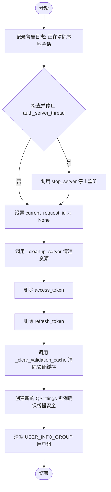

# `comic-translate\app\account\auth\auth_client.py` 详细设计文档

这是一个基于PySide6的认证客户端模块，负责处理用户登录、令牌管理（验证、刷新）、会话检查及登出操作。它通过本地HTTP服务器接收授权回调，并与后端API安全交互以维护用户会话。

## 整体流程

```mermaid
graph TD
    User[用户] -->|触发登录| AuthClient
    AuthClient -->|启动本地监听服务器| AuthServerThread[AuthServerThread]
    AuthClient -->|发送登录URL| UI[UI (WebView)]
    UI -->|打开登录页面| User
    User -->|输入凭证| Backend[后端]
    Backend -->|重定向并携带Token| AuthServerThread
    AuthServerThread -->|发送Token| AuthClient._handle_token_callback
    AuthClient -->|存储Token| TokenStorage[token_storage]
    AuthClient -->|发射成功信号| User

    subgraph 后台验证流程
        App[应用] -->|调用| AuthClient.validate_token
        AuthClient -->|检查缓存| Cache{缓存有效?}
        Cache -- 是 --> ReturnTrue[返回 True]
        Cache -- 否 --> Backend
        Backend -->|验证结果| AuthClient
        AuthClient -->|判断无效| Refresh{需要刷新?}
        Refresh -- 是 --> AuthClient.refresh_token
        Refresh -- 否 --> ReturnResult[返回结果]
    end
```

## 类结构

```
QThread (PySide6)
└── SessionCheckThread (后台会话验证线程)
QObject (PySide6)
└── AuthClient (核心认证客户端)
```

## 全局变量及字段


### `logger`
    
模块级日志记录器，用于记录认证模块的运行状态和错误信息

类型：`logging.Logger`
    


### `DESKTOP_CALLBACK_HOST`
    
桌面回调主机地址，使用127.0.0.1避免IPv6解析问题并确保与服务器绑定地址一致

类型：`str`
    


### `USER_INFO_GROUP`
    
QSettings中用于存储用户信息分组的键名

类型：`str`
    


### `EMAIL_KEY`
    
QSettings中用于存储用户邮箱地址的键名

类型：`str`
    


### `TIER_KEY`
    
QSettings中用于存储用户订阅等级的键名

类型：`str`
    


### `CREDITS_KEY`
    
QSettings中用于存储用户积分余额的键名

类型：`str`
    


### `MONTHLY_CREDITS_KEY`
    
QSettings中用于存储用户月度积分的键名

类型：`str`
    


### `SessionCheckThread.auth_client`
    
认证客户端实例，用于在后台线程中执行令牌验证和用户信息获取

类型：`AuthClient`
    


### `AuthClient.api_url`
    
后端API服务器的URL地址，用于认证相关接口调用

类型：`str`
    


### `AuthClient.frontend_url`
    
前端Web服务器的URL地址，用于构建登录跳转链接

类型：`str`
    


### `AuthClient.current_request_id`
    
当前正在进行中的认证请求唯一标识符，用于防止重复请求和回调验证

类型：`Optional[str]`
    


### `AuthClient.auth_server_thread`
    
本地HTTP服务器线程实例，用于接收后端OAuth回调

类型：`Optional[AuthServerThread]`
    


### `AuthClient.settings`
    
Qt持久化设置存储实例，用于保存用户信息和应用配置

类型：`QSettings`
    


### `AuthClient._request_lock`
    
线程锁，用于同步关键HTTP请求（验证、刷新）避免竞态条件

类型：`threading.Lock`
    


### `AuthClient._session`
    
主HTTP会话实例，用于执行关键认证操作（令牌验证、刷新、登出通知）

类型：`requests.Session`
    


### `AuthClient._bg_request_lock`
    
后台请求专用线程锁，用于隔离非关键操作的并发控制

类型：`threading.Lock`
    


### `AuthClient._bg_session`
    
后台HTTP会话实例，用于执行非关键操作（如用户信息获取）避免阻塞主请求

类型：`requests.Session`
    


### `AuthClient._validated_token`
    
已验证通过的访问令牌缓存，用于实现短期的本地验证缓存

类型：`Optional[str]`
    


### `AuthClient._validated_token_ok_until_monotonic`
    
令牌验证缓存的到期时间戳（单调时钟），用于判断缓存是否仍然有效

类型：`float`
    


### `AuthClient._validated_token_ttl_s`
    
令牌验证缓存的生存时间（秒），默认30秒，用于控制缓存有效期

类型：`float`
    


### `AuthClient._last_refresh_failure_kind`
    
最近一次令牌刷新失败的原因分类，用于区分临时性错误和永久性错误

类型：`Optional[str]`
    
    

## 全局函数及方法


### `SessionCheckThread.run()`

该方法在后台线程中验证用户会话令牌的有效性，若令牌有效则同时获取最新的用户信息，最终通过信号发射验证结果。

参数：

- 该方法无显式参数。依赖通过 `__init__` 传入的 `self.auth_client`（类型：`AuthClient`）进行操作。

返回值：`None`（无返回值），验证结果通过 `result` 信号（类型：`bool`）异步发送。

#### 流程图


#### 带注释源码

```python
def run(self):
    """
    重写 QThread 的 run 方法，在后台线程中执行会话验证逻辑。
    """
    # 调用 AuthClient 的 validate_token 方法验证令牌有效性
    # validate_token 可能包含缓存检查、远程校验和自动刷新逻辑
    is_valid = self.auth_client.validate_token()
    
    # 如果令牌有效（或者处于离线状态且保持会话），
    # 机会性地刷新用户信息。内部的异常处理会捕获并记录失败。
    if is_valid:
        self.auth_client.fetch_user_info()
    
    # 发射验证结果信号，通知主线程验证状态
    # 接收者（如 AuthClient._handle_session_check_result）会处理此信号
    self.result.emit(is_valid)
```


### `AuthClient._is_gui_thread`

该方法用于判断当前代码执行线程是否为 Qt 应用程序的主 GUI 线程。通常用于在进行跨线程操作前（例如显示对话框或更新 UI），判断当前上下文是否允许执行可能会阻塞或需要特定线程 affinity 的操作。

**参数：**
- (无显式参数，仅隐含 `self`)

**返回值：**
- `bool`，如果当前线程是 GUI 主线程则返回 `True`，否则返回 `False`。

#### 流程图


#### 带注释源码

```python
def _is_gui_thread(self) -> bool:
    """
    检查当前执行线程是否为 Qt GUI 主线程。
    """
    try:
        # 1. 获取 QCoreApplication 的单例实例
        app = QCoreApplication.instance()
        
        # 2. 如果应用实例不存在（例如已关闭或未初始化），返回 False
        if app is None:
            return False
            
        # 3. 获取当前线程与应用程序主线程进行比较
        return QThread.currentThread() == app.thread()
    except Exception:
        # 4. 异常处理：任何意外错误都视为非 GUI 线程，以保证安全
        return False
```


### `AuthClient._show_critical_if_gui`

这是一个私有方法，用于解决跨线程 UI 交互的安全性问题。它确保错误提示框只在 GUI 主线程中弹出，而在后台线程中则降级为记录日志，从而避免应用程序阻塞或崩溃。

参数：

- `title`：`str`，对话框的标题栏内容，用于简要说明错误类别。
- `message`：`str`，具体的错误信息详情。

返回值：`None`，该方法不返回任何值。

#### 流程图


#### 带注释源码

```python
def _show_critical_if_gui(self, title: str, message: str) -> None:
    """
    永远不要在后台线程中阻塞或崩溃应用程序来显示模态 UI。

    具体来说，token 刷新/验证可能在 QThread 中运行（例如 SettingsPage 启动时的积分刷新）。
    QMessageBox 必须只在 GUI 线程中显示。
    """
    # 调用内部方法检查当前执行线程是否与 QCoreApplication 实例所属线程相同
    if self._is_gui_thread():
        # 如果当前是 GUI 线程，则显示关键的错误消息框
        # 传入 None 作为父组件，确保对话框作为顶级窗口显示
        QMessageBox.critical(None, title, message)
    else:
        # 如果当前是后台线程（例如 SessionCheckThread），则不能显示 QMessageBox
        # 因为这会导致 Qt 应用程序崩溃或冻结。
        # 降级处理：仅记录错误日志。
        logger.error(f"{title}: {message}")
```


### `AuthClient._clear_validation_cache`

该方法用于清除令牌验证缓存。它通过将内存中缓存的已验证令牌及其有效期时间戳重置为默认值（`None` 和 `0.0`），从而确保在后续的令牌验证流程中，系统会强制重新查询后端，而不是直接使用本地缓存的“有效”状态。

参数： (无)

返回值： `None`，无返回值，仅执行清除操作。

#### 流程图


#### 带注释源码

```python
def _clear_validation_cache(self) -> None:
    """
    清除令牌验证缓存。
    
    当本地令牌发生变化（例如被刷新或删除）时调用此方法，
    以确保不会使用过期的缓存验证结果，强制下次验证请求直接与后端交互。
    """
    self._validated_token = None
    self._validated_token_ok_until_monotonic = 0.0
```


### `AuthClient._clear_local_session`

该方法用于强制清除本地的会话信息，包括删除存储的令牌（Access Token 和 Refresh Token）以及清除缓存的用户信息。它是一个线程安全的设计，允许从任何线程调用，以确保应用退出登录状态。

参数：  
该方法没有显式参数（仅包含 `self`）。

返回值：`None`，无返回值。

#### 流程图



#### 带注释源码

```python
def _clear_local_session(self) -> None:
    """Force local sign-out (delete tokens + cached user info). Safe to call from any thread."""
    # 记录警告日志，表明正在清除会话
    logger.warning("Clearing local session (tokens + cached user info).")
    
    # 停止任何正在进行的认证监听器，以便用户可以再次登录
    try:
        if self.auth_server_thread and self.auth_server_thread.isRunning():
            self.auth_server_thread.stop_server()
        # 清除当前请求ID，防止回调错配
        self.current_request_id = None
        # 清理服务器线程资源
        self._cleanup_server()
    except Exception as e:
        logger.warning(f"Failed to stop auth listener during local session clear: {e}")

    # 尝试删除访问令牌，即使失败也不中断流程
    try:
        delete_token("access_token")
    except Exception as e:
        logger.debug(f"Local session clear: access_token delete failed/absent: {e}")
        
    # 尝试删除刷新令牌
    try:
        delete_token("refresh_token")
    except Exception as e:
        logger.debug(f"Local session clear: refresh_token delete failed/absent: {e}")

    # 清除内存中的令牌验证缓存
    self._clear_validation_cache()

    # 清除本地存储的用户信息 (QSettings)
    try:
        # 使用新的 QSettings 实例以确保线程安全
        settings = QSettings("ComicLabs", "ComicTranslate")
        settings.beginGroup(USER_INFO_GROUP)
        settings.remove("") # 移除组内的所有键
        settings.endGroup()
    except Exception as e:
        logger.debug(f"Local session clear: failed clearing cached user info: {e}")
```


### `AuthClient.start_auth_flow`

启动本地认证流程。该方法生成一个唯一的请求ID，启动一个后台线程（`AuthServerThread`）用于在本地监听OAuth回调，同时构建包含回调地址的授权URL，并通过 `request_login_view` 信号通知UI层加载登录页面。

参数：
- 无（仅包含实例属性 `self`）

返回值：
- `None`，无返回值。主要通过信号（Signals）进行异步通信和状态通知。

#### 流程图


#### 带注释源码

```python
def start_auth_flow(self):
    """Starts the new authentication flow."""
    # If a previous thread object is still referenced but already finished, clear it.
    if self.auth_server_thread and not self.auth_server_thread.isRunning():
        logger.debug("Found stale auth server thread reference; clearing.")
        self.auth_server_thread = None

    if self.auth_server_thread and self.auth_server_thread.isRunning():
        logger.warning("Authentication flow already in progress. Ignoring new request.")
        return

    # 1. Generate unique request ID
    self.current_request_id = secrets.token_urlsafe(32)
    logger.info(f"Generated request_id: {self.current_request_id}")

    # 2. Start local server to receive the token callback from backend
    # Pass the expected request_id to the server thread for verification
    self.auth_server_thread = AuthServerThread(expected_request_id=self.current_request_id)
    self.auth_server_thread.tokens_received.connect(self._handle_token_callback)
    self.auth_server_thread.error.connect(self._handle_server_error)
    self.auth_server_thread.finished.connect(self._on_server_finished)
    self.auth_server_thread.start()

    # Give the server a moment to start and potentially retry port binding
    # Let's wait briefly for the port to be potentially available.
    wait_count = 0
    while not self.auth_server_thread.port and wait_count < 20: # Wait up to 2 seconds
        QThread.msleep(100)
        wait_count += 1

    # Check if server started successfully (it emits error if not)
    if not self.auth_server_thread or not self.auth_server_thread.port:
        logger.error("Auth server thread failed to start or find a port.")
        if not self.signalsBlocked(): # Check if signals can be emitted
            self.auth_error.emit("Failed to start local authentication listener.")
        self.current_request_id = None 
        self._cleanup_server() 
        return

    actual_port = self.auth_server_thread.port
    logger.info(f"Auth server started on port: {actual_port}")

    # 3. Prepare backend authorization URL
    desktop_callback_uri = f"http://{DESKTOP_CALLBACK_HOST}:{actual_port}/callback"
    params = {
        "request_id": self.current_request_id,
        "desktop_callback_uri": desktop_callback_uri,
        "prompt": "login"
    }
    # Include trailing slash to prevent production server redirect (308) that strips query params
    login_url = f"{self.frontend_url.rstrip('/')}/login/"
    auth_url = f"{login_url}?{urllib.parse.urlencode(params)}"
    logger.info(f"Requesting login view for: {auth_url}")

    # 4. Emit signal to request the web view instead of opening browser directly
    self.request_login_view.emit(auth_url)
```


### `AuthClient._handle_token_callback`

该方法是 `AuthClient` 类的核心回调处理函数，负责处理本地身份验证服务器（AuthServerThread）捕获的令牌信息。它充当后端授权流程与应用程序状态管理之间的桥梁，将接收到的安全令牌持久化到本地存储，清除旧的验证缓存，并根据结果通过信号通知 UI 层更新登录状态或抛出错误。

参数：

-   `access_token`：`str`，后端返回的访问令牌（Access Token），用于授权后续 API 请求。
-   `refresh_token`：`str`，后端返回的刷新令牌（Refresh Token），用于在访问令牌失效时获取新的访问令牌。如果后端未返回，则可能为空的字符串。
-   `user_info`：`dict`，包含用户信息的字典（如邮箱、等级、积分等），通常由后端在回调中一并返回。

返回值：`None`，该方法不通过 `return` 语句返回数据，而是通过 Qt 信号（Signals）传递结果（`auth_success` 或 `auth_error`）。

#### 流程图


#### 带注释源码

```python
def _handle_token_callback(self, access_token: str, refresh_token: str, user_info: dict):
    """
    处理从本地服务器接收到的令牌和用户信息回调。
    
    这是认证流程的最后一步，负责将临时凭据转换为持久化会话，
    并通知 UI 层认证结果。
    """
    logger.info("Tokens and user info received callback handled in main client.")
    try:
        # 1. 安全地存储访问令牌
        # 使用专门的 keyring 存储助手，确保令牌不泄漏到代码或磁盘明文中。
        set_token("access_token", access_token)
        
        # 2. 清除验证缓存
        # 由于获得了新令牌，之前缓存的验证状态（_validated_token）已失效，
        # 必须强制重新验证。
        self._clear_validation_cache()
         
        # 3. 处理刷新令牌
        # 检查后端是否下发了刷新令牌。如果没发，可能意味着此次登录是一次性的
        # 或者后端配置变更，需清理旧的刷新令牌。
        if refresh_token:
            set_token("refresh_token", refresh_token)
        else:
            logger.warning("Refresh token was not received from backend callback.")
            delete_token("refresh_token")

        logger.info("Tokens stored successfully.")
        
        # 4. 通知 UI 层
        # 发射成功信号，传入用户信息以供 UI 立即显示（如更新用户名、积分）。
        self.auth_success.emit(user_info)

    except Exception as e:
        # 5. 错误处理
        # 任何存储或数据处理过程中的异常都会导致认证失败，
        # 需要通知 UI 进行反馈。
        logger.error(f"Error storing tokens: {e}", exc_info=True)
        self.auth_error.emit(f"Failed to store authentication tokens securely: {str(e)}")
    finally:
        # 6. 清理状态
        # 无论成功或失败，都必须清除当前请求 ID，防止旧的回调在未来的请求中被误触发。
        self.current_request_id = None
```


### `AuthClient._handle_server_error`

该方法用于处理本地认证服务器线程 (`AuthServerThread`) 运行过程中发生的错误。它负责记录错误日志，区分用户主动取消与其他类型错误，并在满足条件时通过 Qt 信号 (`auth_error`) 向 UI 通知认证监听器出现的故障，同时重置当前请求 ID 以允许重试。

参数：

-  `error_message`：`str`，从 `AuthServerThread` 传递过来的错误描述信息。

返回值：`None`（无返回值），该方法不通过 return 返回数据，而是通过 Qt 信号 (`auth_error`) 进行状态通知。

#### 流程图


#### 带注释源码

```python
def _handle_server_error(self, error_message: str):
    """Handles errors emitted by the AuthServerThread."""
    # 1. 记录错误日志，供调试和审计使用
    logger.error(f"Auth server error: {error_message}")
    
    # 2. 过滤特定错误：如果用户主动取消了流程，则不再发送错误信号，
    #    避免与 cancel_auth_flow 发送的 auth_cancelled 信号冲突或产生困扰。
    if "cancelled by user" not in error_message:
        # 3. 安全检查：确认当前对象可以发射信号（例如对象未被销毁且未手动阻塞信号）
        if not self.signalsBlocked(): 
            # 4. 发射错误信号通知 UI 层，提示认证监听器出错
            self.auth_error.emit(f"Authentication listener error: {error_message}")
            
    # 5. 无论是否发射信号，都需要清理当前请求 ID，
    #    以便用户可以重新发起认证流程。
    self.current_request_id = None
    
    # 注意：最终的清理工作（如停止线程）由 AuthServerThread 的 finished 信号处理
    # 即通过 _on_server_finished 槽函数执行。
```


### `AuthClient._on_server_finished`

当本地认证服务器线程 (`AuthServerThread`) 结束运行时，此槽函数（Slot）被触发。它负责记录线程结束日志，并调用内部清理方法以安全地移除线程引用，防止资源泄漏或状态错误。

参数：

- (无)

返回值：`None`，无返回值。

#### 流程图


#### 带注释源码

```python
def _on_server_finished(self):
    """
    Called when the AuthServerThread finishes execution.
    
    This method acts as a cleanup handler triggered by the QThread's finished signal.
    It ensures that once the local HTTP server listening for the OAuth callback 
    stops running, the reference to that thread object is cleared from the client.
    """
    logger.info("Auth server thread finished.")
    self._cleanup_server()
```


### `AuthClient._cleanup_server`

该方法是一个私有辅助函数，用于安全地清除 `AuthClient` 实例中持有的 `auth_server_thread` 引用。它在认证流程结束后被调用，以确保没有悬挂的线程引用，即使线程可能尚未完全退出（仅记录警告），最终将引用置为 `None` 以允许垃圾回收。

参数：无（仅包含隐式参数 `self`）

返回值：`None`，无返回值

#### 流程图


#### 带注释源码

```python
def _cleanup_server(self):
    """Safely attempts to clear server thread reference."""
    # 记录调试日志，表明开始清理流程
    logger.debug("Cleaning up auth server thread reference...")
    
    # 获取当前保存的线程引用
    thread = self.auth_server_thread
    
    # 检查线程引用是否存在以及线程是否仍在运行
    if thread and thread.isRunning():
        # 如果线程仍在运行，记录警告。
        # 注意：这里不调用 stop() 或 wait()，因为调用者（如 _on_server_finished 或 logout）
        # 通常已经处理了停止逻辑，或者这是在清理一个残留的引用。
        logger.warning("Cleanup called but server thread is still marked as running (might be finishing).")
    
    # 核心逻辑：将引用置为 None，允许对象被垃圾回收
    self.auth_server_thread = None
    
    # 记录清理完成的日志
    logger.debug("Auth server thread reference cleared.")
```


### `AuthClient.shutdown`

**描述**：此方法作为 `AuthClient` 类的析构函数或退出清理接口，在应用程序关闭时被调用。其主要职责是安全地停止并清理内部运行的后台线程（身份验证监听线程和会话检查线程），确保没有孤立的线程在后台运行，防止资源泄漏或应用程序挂起。

参数：
- （无，仅包含隐式参数 `self`）

返回值：`None`，该方法不返回任何值，仅执行清理副作用。

#### 流程图


#### 带注释源码

```python
def shutdown(self):
    """Clean up threads before application exit."""
    # 记录关闭日志
    logger.info("Shutting down AuthClient...")
    
    # 1. 停止 AuthServerThread (本地认证监听服务器线程)
    # 检查线程对象是否存在（不为 None）
    if self.auth_server_thread:
        logger.debug("Stopping AuthServerThread...")
        # 只有在线程正在运行时才执行停止操作
        if self.auth_server_thread.isRunning():
            # 通知服务器线程停止接受新连接
            self.auth_server_thread.stop_server()
            # 请求线程退出 Qt 事件循环
            self.auth_server_thread.quit()
            # 阻塞调用线程，等待线程完全退出
            self.auth_server_thread.wait()
        # 清除引用，允许对象被垃圾回收
        self.auth_server_thread = None

    # 2. 停止 SessionCheckThread (后台会话验证线程)
    # 使用 hasattr 安全检查可选的会话检查线程属性是否存在
    if hasattr(self, '_session_check_thread') and self._session_check_thread:
         logger.debug("Stopping SessionCheckThread...")
         if self._session_check_thread.isRunning():
             # 请求线程退出并等待其结束
             self._session_check_thread.quit()
             self._session_check_thread.wait()
         self._session_check_thread = None
    
    logger.info("AuthClient shutdown complete.")
```


### `AuthClient.cancel_auth_flow`

该方法用于取消当前正在进行的身份验证流程。它会尝试停止负责监听后端回调的本地服务器线程，清除当前的请求ID以防止处理延迟的回调，并在确认流程正在运行时向UI发出取消信号。

参数：

- `self`：`AuthClient`，调用此方法的 AuthClient 实例本身。

返回值：`None`，该方法不返回任何值，主要通过修改内部状态和发送信号来完成操作。

#### 流程图


#### 带注释源码

```python
def cancel_auth_flow(self):
    """Cancels the currently active authentication flow."""
    logger.info("Attempting to cancel authentication flow.")
    was_running = False
    
    # 检查认证服务器线程是否存在且正在运行
    if self.auth_server_thread and self.auth_server_thread.isRunning():
        logger.debug("Requesting auth server thread to stop.")
        # 请求服务器线程关闭
        self.auth_server_thread.stop_server() 
        was_running = True
        # 线程停止时会发出 finished 信号，触发 _on_server_finished 进行清理。
        # 这里不等待以避免阻塞 UI 线程。
    else:
        logger.debug("No active auth server thread found or it wasn't running.")

    # 无论服务器是否在运行，都清除请求 ID，以防止服务器已发送回调导致的 ID 不匹配
    self.current_request_id = None
    logger.debug("Cleared current_request_id.")

    # 仅当流程可能处于活跃状态时才发出错误信号以通知 UI
    # 在发出信号前检查信号是否被阻塞
    if was_running and not self.signalsBlocked():
        logger.info("Emitting auth_cancelled signal.")
        self.auth_cancelled.emit() 
    elif not was_running:
        logger.debug("Skipping auth_cancelled emit as no server thread was running.")
```


### `AuthClient.refresh_token`

使用存储在本地密钥库（Keyring）中的刷新令牌（Refresh Token）向认证服务器请求新的访问令牌（Access Token）。如果请求成功，它会更新本地的访问令牌，并处理刷新令牌的轮换（Rotation）。该方法包含完善的错误处理逻辑，能够区分网络错误、服务器错误和令牌无效（被撤销）的错误，并根据错误类型决定是否清除本地会话（例如当令牌被撤销时强制登出）。

参数：
- `self`：`AuthClient`，隐式参数，代表调用此方法的类实例本身。

返回值：`bool`，如果令牌刷新成功（包含新的访问令牌）则返回 `True`，如果刷新失败（缺少令牌、网络不可达、HTTP 错误等）则返回 `False`。

#### 流程图


#### 带注释源码

```python
def refresh_token(self) -> bool:
    """Refresh the access token using the stored refresh token."""
    logger.info("Attempting to refresh token...")
    try:
        self._last_refresh_failure_kind = None

        # 1. Retrieve stored tokens from secure storage
        refresh_token = get_token("refresh_token")
        access_token = get_token("access_token")
        
        # 2. Check if tokens exist locally
        if not (refresh_token and access_token):
            logger.warning("Cannot refresh: Tokens not found.")
            self._last_refresh_failure_kind = "missing_tokens"
            return False

        # 3. Build the request payload and headers
        headers = {"Authorization": f"Bearer {access_token}"}
        token_url = f"{self.api_url}/auth/v1/token" 
        payload = {
            "grant_type": "refresh_token",
            "refresh_token": refresh_token,
        }
        logger.debug(f"Posting to {token_url} for token refresh.")

        # 4. Send the refresh request (thread-safe using lock)
        with self._request_lock:
            response = self._session.post(
                token_url, 
                json=payload,
                headers=headers, 
                timeout=20
            )

        # 5. Check for HTTP errors (e.g., 401 if refresh token is revoked)
        response.raise_for_status()

        # 6. Parse the new tokens
        token_data = response.json()
        new_access_token = token_data.get("access_token")
        new_refresh_token = token_data.get("refresh_token") 

        # 7. Validate response content
        if not new_access_token:
            logger.error("Token refresh response missing access_token.")
            return False

        # 8. Update local tokens
        set_token("access_token", new_access_token)
        self._clear_validation_cache()
        
        # Handle refresh token rotation (if server provides a new one)
        if new_refresh_token:
            logger.info("Refresh token rotated. Storing new refresh token.")
            set_token("refresh_token", new_refresh_token)

        logger.info("Token refreshed successfully.")
        self._last_refresh_failure_kind = None
        return True
    
    # 9. Error Handling
    except requests.exceptions.HTTPError as http_err:
        resp = getattr(http_err, "response", None)
        if resp is None:
            try:
                resp = response
            except Exception:
                resp = None
        try:
            error_data = resp.json() if resp is not None else {}
            error_desc = error_data.get('error_description') or error_data.get('error') or str(http_err)
        except Exception:
            error_desc = str(http_err)
        logger.error(f"HTTP error during token refresh: {error_desc}")
        status_code = getattr(resp, "status_code", None)
        
        # Handle specific status codes
        if status_code in [400, 401]:
            # If the user was deleted / refresh token was revoked, never block app startup.
            # Clear local tokens so the app can continue in a signed-out state.
            logger.warning("Refresh token seems invalid. Forcing local sign-out (clearing tokens).")
            self._last_refresh_failure_kind = "invalid"
            self._clear_local_session()
        elif isinstance(status_code, int) and status_code >= 500:
            # Server-side issues shouldn't force a logout (signing in again won't help).
            logger.warning("Token refresh failed due to server error. Keeping local session.")
            self._last_refresh_failure_kind = "server"
        else:
            self._last_refresh_failure_kind = "http"
        return False
            
    except requests.exceptions.RequestException as e:
        error_msg = f"Network error during token refresh: {str(e)}"
        logger.error(error_msg)
        self._last_refresh_failure_kind = "network"
        return False
    
    except Exception as e:
        error_msg = f"Unexpected error during token refresh: {str(e)}"
        logger.error(error_msg, exc_info=True)
        self._last_refresh_failure_kind = "unexpected"
        return False
```


### `AuthClient.is_authenticated`

**描述**：该方法用于快速检查客户端本地是否存储了访问令牌（Access Token）。它仅读取本地安全存储（Keyring）检查令牌是否存在，并不与后端服务器通信进行有效性验证（验证令牌有效性通常使用 `validate_token` 方法）。这是一种轻量级的状态检查，用于判断用户会话的先决条件是否存在。

参数：

-  `self`：`AuthClient`，调用此方法的 `AuthClient` 实例本身。

返回值：`bool`，返回 `True` 表示本地存在有效的 access_token；返回 `False` 表示未找到 token 或在读取过程中发生异常。

#### 流程图

```mermaid
flowchart TD
    A([Start is_authenticated]) --> B{尝试获取 access_token}
    B -->|成功获取| C{bool(access_token)}
    C -->|True| D[日志: 找到令牌]
    D --> E[Return True]
    C -->|False| F[日志: 未找到令牌]
    F --> E
    B -->|发生异常| G[日志: 读取令牌错误]
    G --> H[Return False]
```

#### 带注释源码

```python
def is_authenticated(self) -> bool:
    """Check if user has a locally stored access token. Does NOT validate it here."""
    # 这是一个快速检查。验证应在敏感操作前进行。
    logger.debug("Checking for local access token...")
    try:
        # 尝试从本地存储（通常是系统 Keyring）获取 access_token
        access_token = get_token("access_token")
        # 将获取到的值转换为布尔值（None 或空字符串会被视为 False）
        is_present = bool(access_token)
        logger.debug(f"Access token found: {is_present}")
        return is_present
    except Exception as e:
        # 捕获可能发生的异常（例如 Keyring 服务不可用），并记录错误
        logger.error(f"Error checking for access token in keyring: {e}")
        return False
```


### `AuthClient.validate_token`

验证当前存储的 Access Token 的有效性。该方法采用多级验证策略：首先检查本地缓存以优化性能；若缓存失效，则向后端发送验证请求。若后端返回令牌无效或即将过期，系统会自动尝试刷新令牌。若刷新成功或因网络/服务器暂时不可用导致验证失败，方法会保持本地会话（返回 `True`），以保证用户体验；仅当令牌确实无效（如被撤销）且刷新失败时才返回 `False`。

参数：

-  无显式参数（隐含参数 `self` 为 `AuthClient` 实例）

返回值：`bool`
-  `True`: 令牌有效，或刷新成功，或因网络/服务器问题无法验证但保持本地会话。
-  `False`: 本地无令牌，或令牌无效且刷新失败（非 transient 错误）。

#### 流程图

```mermaid
flowchart TD
    Start([开始验证]) --> GetToken[获取本地 access_token]
    GetToken --> CheckToken{Token 是否存在?}
    CheckToken -- 否 --> ReturnFalse[返回 False]
    CheckToken -- 是 --> CheckCache{当前时间 < 缓存有效期?}
    CheckCache -- 是 --> ReturnTrue1[返回 True (缓存命中)]
    CheckCache -- 否 --> RequestValidate[向后端 /auth/v1/validate 发送验证请求]
    
    RequestValidate --> HandleResp{处理响应}
    
    %% Success path
    HandleResp -- valid == True --> UpdateCache[更新验证缓存]
    UpdateCache --> ReturnTrue2[返回 True]
    
    %% Invalid path
    HandleResp -- valid == False --> TryRefresh[调用 refresh_token()]
    TryRefresh --> RefreshResult{刷新是否成功?}
    RefreshResult -- 是 --> ReturnTrue2
    
    %% Refresh failed path
    RefreshResult -- 否 --> CheckFailKind{失败原因是否为网络/服务器?}
    CheckFailKind -- 是 --> ReturnTrue2
    CheckFailKind -- 否 --> ReturnFalse
    
    %% Exception path
    RequestValidate -.-> HandleEx[捕获异常]
    
    HandleEx --> IsTimeout{是否为 Timeout?}
    IsTimeout -- 是 --> ReturnTrue3[返回 True (假设离线)]
    IsTimeout -- 否 --> IsHTTPError{是否为 HTTPError 401?}
    
    IsHTTPError -- 是 --> TryRefresh
    IsHTTPError -- 否 --> ReturnFalse2[返回 False]
```

#### 带注释源码

```python
def validate_token(self) -> bool:
    """
    Check the validity of the current access token with the backend.
    Triggers a refresh if the backend response indicates the token is
    invalid (either definitively expired/bad or near expiry).

    Returns:
        bool: True if the token is currently valid (and not near expiry)
              OR if it was successfully refreshed after being reported invalid/near-expiry.
              False if the token was reported invalid/near-expiry AND refresh failed
              for non-transient reasons, or if no token exists.
    """
    logger.info("Checking access token validity with backend...")
    access_token: Optional[str] = None
    try:
        access_token = get_token("access_token")
        if not access_token:
            logger.info("No access token found locally. Cannot validate.")
            return False

        now = time.monotonic()
        # 检查本地缓存是否仍然有效，避免不必要的网络请求
        if (
            self._validated_token == access_token
            and now < self._validated_token_ok_until_monotonic
        ):
            logger.debug("Token validation cache hit (skipping backend validate).")
            return True

        # 缓存失效，构造请求
        validate_url = f"{self.api_url}/auth/v1/validate"
        headers = {"Authorization": f"Bearer {access_token}"}

        logger.debug(f"Sending validation request to {validate_url}")
        with self._request_lock:
            response = self._session.get(validate_url, headers=headers, timeout=10.0)
        response.raise_for_status()

        data = response.json()
        is_valid = data.get("valid")

        if is_valid is True:
            # 后端明确表示令牌有效且未接近过期
            logger.info("Token validation successful (via backend).")
            self._validated_token = access_token
            self._validated_token_ok_until_monotonic = time.monotonic() + self._validated_token_ttl_s
            return True
        elif is_valid is False:
            # 后端表示无效或接近过期，尝试刷新
            reason = data.get("reason", "unspecified")
            status_code = response.status_code 
            logger.info(f"Token reported as invalid by backend (status: {status_code}, reason: {reason}). Attempting refresh...")
            refreshed = self.refresh_token() 
            if refreshed:
                return True
            
            # 如果刷新失败，检查是否为 transient 错误（网络或服务器）
            if self._last_refresh_failure_kind in ("network", "server"):
                logger.warning(
                    "Token refresh failed due to %s issue; keeping local session.",
                    self._last_refresh_failure_kind,
                )
                return True
            return False
        else:
            # 响应格式不符合预期，视为无效
            logger.error(f"Backend validation response (status: {response.status_code}) missing or has invalid 'valid' field. Assuming invalid.")
            return False

    except requests.exceptions.Timeout:
        # 网络超时，假设离线，保持会话
        logger.warning("Token validation request timed out. Assuming offline/unreachable. Keeping session.")
        return True
    except requests.exceptions.HTTPError as e:
        if e.response.status_code == 401:
            # 收到 401，尝试刷新
            logger.info("Token validation returned 401. Attempting refresh...")
            refreshed = self.refresh_token()
            if refreshed:
                return True
            if self._last_refresh_failure_kind in ("network", "server"):
                logger.warning(
                    "Token refresh failed due to %s issue; keeping local session.",
                    self._last_refresh_failure_kind,
                )
                return True
            return False
        logger.error(f"HTTP error during token validation: {str(e)}. Assuming invalid.")
        return False
    except requests.exceptions.RequestException as e:
        # 其他网络错误，假设离线
        logger.warning(f"Network error during token validation: {str(e)}. Assuming offline/unreachable. Keeping session.")
        return True
    except Exception as e: # 捕获 keyring 错误等
        logger.error(f"Unexpected error during token validation check setup: {e}", exc_info=True)
        return False # 失败安全
```


### `AuthClient.logout`

该方法负责安全地终止用户会话。它首先停止任何活跃的本地认证监听线程，然后清除本地的所有凭证（令牌和用户信息），最后向后端发送注销请求以使服务器端会话失效，并在完成后发出信号通知UI。

参数：
- 无

返回值：
- `None`，该方法通过副作用（信号发射和状态变更）完成操作，无直接返回值。

#### 流程图


#### 带注释源码

```python
def logout(self):
    """Clear stored credentials, user info, and notify backend."""
    logger.info("Initiating logout.")

    # 1. 清理阶段：停止可能存在的认证监听线程，防止用户重新登录时被旧回调干扰。
    # 如果之前的回调服务器挂起，这一步很重要。
    try:
        if self.auth_server_thread and self.auth_server_thread.isRunning():
            logger.info("Logout: Stopping active authentication listener thread.")
            self.auth_server_thread.stop_server()
        self.current_request_id = None
        self._cleanup_server()
    except Exception as e:
        logger.warning(f"Logout: Failed to stop auth listener cleanly: {e}")

    # 获取访问令牌，用于后续通知后端（在删除本地令牌之前获取）。
    access_token: Optional[str] = None
    try:
        # Retrieve token *before* deleting it locally
        access_token = get_token("access_token")
    except Exception as e:
        logger.warning(f"Could not retrieve access token for signout notification: {e}")

    # 2. 本地数据清理：优先清除本地数据，即使后端通知失败，也要保证本地处于登出状态。
    try:
        logger.debug("Deleting local tokens from keyring...")
        delete_token("access_token")
        self._clear_validation_cache()
    except Exception as e:
        # Log error but continue - local logout is priority
        logger.warning(f"Could not delete access token from keyring (might not exist): {e}")
    try:
        delete_token("refresh_token")
    except Exception as e:
        # Log error but continue
        logger.warning(f"Could not delete refresh token from keyring (might not exist): {e}")

    # Clear user info from QSettings
    logger.debug("Clearing user info from settings...")
    self.settings.beginGroup(USER_INFO_GROUP)
    self.settings.remove("") # Remove all keys within the group
    self.settings.endGroup()
    logger.info("Local tokens and user info cleared.")

    # 3. 后端通知：通知后端当前用户已注销。
    if access_token:
        try:
            logger.debug("Notifying backend of signout...")
            signout_url = f"{self.api_url}/auth/v1/signout?scope=local"
            headers = {"Authorization": f"Bearer {access_token}"}
            with self._request_lock:
                response = self._session.post(
                    signout_url,
                    headers=headers,
                    timeout=20
                )
            response.raise_for_status()
            logger.info("Backend successfully processed signout notification.")

        except requests.exceptions.HTTPError as http_err:
            # 处理HTTP错误，尝试解析错误信息并显示给用户。
            try:
                error_data = response.json()
                error_desc = error_data.get('error_description') or error_data.get('error') or str(http_err)
            except Exception:
                error_desc = str(http_err)
            self._show_critical_if_gui("Logout Error", error_desc)
            logger.error(f"HTTP error during token refresh: {error_desc}")

        except requests.exceptions.RequestException as e:
            # 处理网络错误，记录日志并显示错误。
            error_msg = f"Network error during logout: {str(e)}"
            logger.error(error_msg)
            self._show_critical_if_gui("Logout Error", error_msg)

        except Exception as e:
            # 处理意外错误。
            error_msg = f"Unexpected error during logout: {str(e)}"
            logger.error(error_msg, exc_info=True)
            self._show_critical_if_gui("Logout Error", error_msg)
    else:
        logger.debug("No access token found, skipping backend signout notification.")

    # 4. 完成：发出信号通知UI注销流程结束。
    # Emit signal indicating logout is complete locally
    self.logout_success.emit()
    logger.info("Logout process complete.")
```


### `AuthClient.fetch_user_info`

该方法用于从后端服务获取当前登录用户的最新详细信息（包含邮箱、等级、积分等）。它通过独立的后台网络会话（`_bg_session`）发起请求，以避免阻塞主线程或关键的身份验证操作。请求结果通过 Qt 信号（`auth_success` 或 `auth_error`）异步通知调用者。

参数：

-  `self`：`AuthClient`，隐式参数，表示当前类的实例。

返回值：`None`（无返回值）。该方法通过 Qt 信号进行异步通信：
- 成功时：发射 `auth_success` 信号（参数：`dict`，包含用户信息）。
- 失败时：发射 `auth_error` 信号（参数：`str`，错误信息）。

#### 流程图


#### 带注释源码

```python
def fetch_user_info(self):
    """Fetch the latest email/tier/credits from the backend and emit auth_success."""
    try:
        # 1. 从本地存储获取访问令牌
        token = get_token("access_token")
        
        # 2. 检查令牌是否存在，若不存在则发出错误信号并终止
        if not token:
            self.auth_error.emit("No access token available for fetching user info")
            return
            
        # 3. 准备 HTTP 请求头，使用 Bearer Token 认证
        headers = {"Authorization": f"Bearer {token}"}
        
        # 4. 使用后台会话和锁来执行请求，避免与主业务流程（如 token 刷新）冲突
        with self._bg_request_lock:
            response = self._bg_session.get(
                f"{self.api_url}/auth/v1/user_info", 
                headers=headers, 
                timeout=10
            )
            
        # 5. 检查 HTTP 响应状态，若出错则抛出异常
        response.raise_for_status()
        
        # 6. 解析返回的 JSON 数据
        user_info = response.json()
        
        # 7. 重新利用 auth_success 信号，将最新的用户信息发送给 UI 层（如 SettingsPage）
        self.auth_success.emit(user_info)
        
    except requests.exceptions.RequestException as e:
        # 8. 处理网络请求异常（如超时、连接失败）
        # 在这种情况下，通常视为用户离线，保留本地缓存的用户信息，不触发严重错误
        logger.debug(f"Could not refresh user info (offline/unreachable): {e}")
        
    except Exception as e:
        # 9. 处理其他非预期错误，并通知 UI
        self.auth_error.emit(f"Failed to fetch user info: {e}")
```


### `AuthClient.check_session_async`

该方法用于在后台线程中异步验证用户会话。它首先检查是否已有线程正在运行或本地是否存在访问令牌，若通过检查，则启动一个 `SessionCheckThread` 来执行实际的令牌验证和用户信息获取，并通过 Qt 信号机制通知调用者验证结果。

参数：
- `self`：`AuthClient` 实例本身，无需显式传递。

返回值：`None`（无返回值）。该方法通过启动线程和 Qt 信号 (`session_check_finished`) 来传递结果。

#### 流程图

```mermaid
flowchart TD
    A([开始 check_session_async]) --> B{检查是否存在正在运行的<br>SessionCheckThread?}
    B -- 是 --> C[日志记录：重复请求]
    C --> D([直接返回，不进行操作])
    
    B -- 否 --> E{本地是否存在访问令牌<br>is_authenticated()?}
    E -- 否 --> F[日志记录：无令牌]
    F --> G([直接返回])
    
    E -- 是 --> H[实例化 SessionCheckThread]
    H --> I[连接信号: result -> _handle_session_check_result]
    I --> J[连接信号: finished -> deleteLater]
    J --> K[启动线程 .start()]
    K --> L([结束])
```

#### 带注释源码

```python
def check_session_async(self):
    """Validates the session in a background thread."""
    logger.debug("Starting async session check...")
    try:
        # 1. 防止重复启动：检查是否已经存在一个正在运行的会话检查线程。
        # 使用 hasattr 和异常处理确保在属性不存在或对象已销毁时也能安全执行。
        if hasattr(self, "_session_check_thread") and self._session_check_thread:
            if self._session_check_thread.isRunning():
                logger.debug("Async session check already running; skipping duplicate start.")
                return
    except Exception:
        pass

    # 2. 前置条件检查：确认用户本地是否持有访问令牌。
    # 如果连令牌都没有，就没必要去后台验证，直接返回。
    if not self.is_authenticated():
        logger.debug("No access token present; skipping async session check.")
        return

    # 3. 创建后台线程：传入 self (AuthClient)，以便线程可以调用 validate_token 等方法。
    self._session_check_thread = SessionCheckThread(self)
    
    # 4. 信号连接：
    #    result: 线程验证完成后，发射布尔值通知主线程验证是否成功。
    #    finished: 线程结束后，调用 deleteLater 释放 QThread 对象内存。
    self._session_check_thread.result.connect(self._handle_session_check_result)
    self._session_check_thread.finished.connect(self._session_check_thread.deleteLater)
    
    # 5. 启动线程：QThread 必须调用 start() 才能真正执行 run() 方法中的逻辑。
    self._session_check_thread.start()
```


### `AuthClient._handle_session_check_result`

该方法是 `AuthClient` 类的私有槽函数（Slot），用于处理后台会话检查线程完成后的回调。它接收后台线程发来的验证结果（布尔值），并将此结果通过 Qt 信号 `session_check_finished` 转发给前端界面，以更新 UI 的登录状态显示。

参数：

-  `is_valid`：`bool`，后台线程验证 token 有效性的结果（True 表示有效或处于离线保持会话状态，False 表示验证失败）。

返回值：`None`，该方法不通过 return 返回值，而是通过 Qt 信号传递状态。

#### 流程图


#### 带注释源码

```python
def _handle_session_check_result(self, is_valid: bool):
    """
    处理异步会话检查完成后的结果。

    当 SessionCheckThread (后台线程) 完成 token 验证后，会触发 result 信号，
    Qt 调度该信号到主线程调用此槽函数。此函数的主要作用是解耦后台逻辑与 UI 更新。

    参数:
        is_valid (bool): 后台验证的结果。如果为 True，表示 token 有效或是允许保持的离线状态；
                         如果为 False，表示 token 无效且刷新失败（对于非瞬态错误）。
    """
    # 记录调试日志，供开发人员排查异步流程使用
    logger.debug(f"Async session check finished. Valid: {is_valid}")
    
    # 发射信号通知 UI 层会话状态已更新，允许 UI 组件（如设置页面）据此刷新显示
    self.session_check_finished.emit(is_valid)
```

## 关键组件


### AuthClient (主认证类)
负责管理用户认证生命周期，包括登录、Token刷新、会话验证、登出等核心功能。继承自QObject，使用信号槽机制与UI层通信。

### SessionCheckThread (后台会话验证线程)
QThread子类，用于在后台线程中验证用户Token的有效性，并通过信号返回验证结果，避免阻塞主UI线程。

### Token管理模块
包含Token的存储、获取、删除及刷新逻辑。通过`token_storage`模块与系统Keyring交互，支持Access Token和Refresh Token的轮换。

### 认证流程控制器
管理OAuth认证流程的完整生命周期，包括生成唯一请求ID、启动本地回调服务器、构建授权URL、监听Token回调等。

### 本地回调服务器管理
通过`AuthServerThread`启动本地HTTP服务器接收后端认证回调，验证请求ID防止CSRF攻击，并在认证成功后清理服务器资源。

### 双Session请求管理
使用`_request_lock`保护主请求Session，用于关键操作（Token验证、刷新）；使用`_bg_request_lock`保护后台Session，用于非关键操作（用户信息获取），实现请求优先级分离。

### Token验证缓存机制
通过`_validated_token`和`_validated_token_ok_until_monotonic`实现本地缓存验证结果，TTL为30秒，减少不必要的网络请求。

### 会话状态机
管理认证状态转换：未认证 -> 认证中 -> 已认证 -> 登出，包含`is_authenticated()`快速检查和`validate_token()`深度验证。

### 错误处理与恢复策略
针对Token刷新失败分为不同类型处理（missing_tokens, invalid, server, network, unexpected），网络错误时保持本地会话以提供离线可用性。

### 线程安全锁定机制
使用`threading.Lock`保护对HTTP Session的并发访问，防止多线程环境下的竞态条件。

### 信号系统
定义多个Qt信号用于异步通知UI：`auth_success`, `auth_error`, `auth_cancelled`, `request_login_view`, `logout_success`, `session_check_finished`。

### 配置与常量管理
通过QSettings持久化用户信息（邮箱、等级、积分），使用`DESKTOP_CALLBACK_HOST`常量确保本地回调地址的IPv4一致性。

### 资源清理机制
`shutdown()`方法确保应用退出时正确停止所有后台线程（AuthServerThread, SessionCheckThread），避免资源泄漏。

### 登出流程控制器
`logout()`方法执行完整的登出操作：停止认证监听、清除本地Token和缓存、通知后端、清除用户信息，并通过信号通知UI。


## 问题及建议


### 已知问题

-   **QSettings 线程安全隐患**：`logout` 方法中直接使用了 `self.settings`（实例变量）来清除用户信息。根据 Qt 文档，`QSettings` 并非完全线程安全。虽然在 `_clear_local_session` 中代码特意创建了新的 QSettings 实例，但在 `logout` 主逻辑中忽略了这一点，如果在非 GUI 线程调用 `logout`，可能导致数据竞争或崩溃。
-   **同步网络请求阻塞**：在 `logout` 和 `refresh_token` 方法中使用了同步的 `requests` 库进行网络请求。如果在主线程（UI 线程）调用，会造成界面卡顿或无响应，尤其是在网络环境较差时。
-   **异常处理逻辑冗余且易错**：在 `refresh_token` 的 `HTTPError` 捕获块中，试图通过 `response` 变量获取错误详情，但该变量在网络异常时可能未定义（代码虽有空值处理，但逻辑不够健壮）。此外，错误处理代码与 `validate_token` 中的处理逻辑重复。
-   **Session 管理混乱**：代码维护了两个 `requests.Session` 对象（`_session` 和 `_bg_session`）和两把锁，但其使用规则不透明（例如 `validate_token` 使用 `_session`，`fetch_user_info` 使用 `_bg_session`），增加了理解成本和维护难度。
-   **后台线程终止不可靠**：`shutdown` 方法中使用 `wait()` 等待线程结束，但没有设置超时时间。如果后台线程因网络请求卡住，应用将无法正常退出。
-   **硬编码配置**：API 路径、超时时间（20s, 10s）等数值散落在代码各处，缺乏统一的配置管理。

### 优化建议

-   **异步化网络交互**：建议使用 `QThread` + `asyncio` 或 `qasync` 将 `logout`、`refresh_token` 等涉及网络的操作异步化，避免阻塞 UI 线程。
-   **统一资源清理与错误处理**：
    -   提取通用的 HTTP 错误处理和 Token 清理逻辑为独立方法。
    -   在 `logout` 方法中统一使用新建的 `QSettings` 实例以确保线程安全。
-   **增强线程管理**：
    -   在 `shutdown` 方法中的 `wait()` 调用添加超时参数（如 `wait(2000)`），或在 `SessionCheckThread` 中实现更积极的中断机制。
    -   对 `auth_server_thread` 的所有访问（启动、停止、检查）使用锁或信号量保护，防止竞态条件。
-   **配置与常量管理**：创建一个配置类或常量文件，集中管理 API URL、密钥名称、超时时长等 magic numbers。
-   **简化 Session 管理**：评估是否真的需要两个 Session。如果是为了区分优先级，建议通过更明确的标志位或队列来管理请求，而不是维护两套完全独立的 session 和 lock。


## 其它


### 设计目标与约束

**设计目标**：为ComicTranslate桌面应用提供安全、可靠且非阻塞的OAuth2认证管理能力，支持完整的登录、Token刷新、会话验证和登出流程，并确保后台操作不阻塞GUI主线程。

**约束条件**：
- 必须运行在PySide6事件循环中，遵守Qt的信号槽线程模型
- 仅支持HTTP/HTTPS协议，不支持其他认证协议
- Token必须安全存储在系统Keyring中，不能以明文保存
- 所有网络请求必须设置合理的超时时间（10-20秒），避免无限阻塞

### 错误处理与异常设计

**异常分类与处理**：
- **网络异常（Network Error）**：在`refresh_token`和`validate_token`中捕获`RequestException`，记录警告日志并保留本地会话，视为临时性故障
- **HTTP错误（HTTP Error）**：
  - 401/400：视为认证失败或Token revoked，清除本地会话（`_clear_local_session`）
  - 5xx：视为服务端临时故障，保留本地会话
- **关键异常（Critical Error）**：如Keyring访问失败、服务器启动失败等，通过`_show_critical_if_gui`在GUI线程弹出错误框，或记录Error日志

**错误传播机制**：通过`auth_error(str)`信号将错误信息传递给UI层进行展示

### 数据流与状态机

**核心状态**：
- **Idle（空闲）**：未发起任何认证请求
- **Authenticating（认证中）**：已启动`AuthServerThread`等待回调，等待用户登录
- **Validated（已验证）**：Token经过后端验证为有效
- **Refreshing（刷新中）**：正在使用refresh_token换取新access_token
- **LoggedOut（已登出）**：本地Token已清除

**状态转换流程**：
- Idle -> Authenticating：调用`start_auth_flow`
- Authenticating -> Validated：收到`_handle_token_callback`且Token验证成功
- Validated -> Refreshing：`validate_token`发现Token无效/即将过期
- Refreshing -> Validated：`refresh_token`成功
- Any -> LoggedOut：调用`logout`或Token刷新彻底失败

### 外部依赖与接口契约

**外部依赖**：
- `requests`：HTTP客户端，用于与后端API通信
- `PySide6.QtCore`：提供QThread、Signal、QSettings等Qt核心组件
- `PySide6.QtWidgets`：提供QMessageBox用于关键错误提示
- `secrets`：生成密码学安全的request_id
- `urllib.parse`：URL编码
- `AuthServerThread`（内部模块）：本地HTTP服务器接收OAuth回调
- `token_storage`（内部模块）：系统Keyring交互

**接口契约**：
- `auth_success(dict)`：认证成功时发射，参数为用户信息字典
- `auth_error(str)`：认证失败时发射，参数为错误描述
- `auth_cancelled()`：用户取消认证流程时发射
- `request_login_view(str)`：请求加载登录页面时发射，参数为URL
- `logout_success()`：登出完成时发射
- `session_check_finished(bool)`：异步会话检查完成时发射

### 安全性考虑

- **Token存储**：使用`token_storage`模块将access_token和refresh_token存储在系统Keyring中，而非明文文件或QSettings
- **HTTPS强制**：生产环境API URL应为HTTPS，防止Token在传输过程中被截获
- **Request ID验证**：使用`secrets.token_urlsafe(32)`生成唯一的request_id，并在回调时验证，防止CSRF攻击
- **敏感信息脱敏**：日志中不记录Token的实际值（仅记录是否存在），错误信息不暴露内部实现细节
- **线程安全**：使用`threading.Lock`保护对`requests.Session`的并发访问

### 并发与线程模型

- **主线程**：AuthClient实例通常创建在GUI主线程，信号槽自动跨线程工作
- **AuthServerThread**：继承QThread，在独立线程中运行本地HTTP服务器接收OAuth回调
- **SessionCheckThread**：继承QThread，用于在后台验证Token有效性，不阻塞UI
- **锁机制**：
  - `_request_lock`：保护主会话`_session`，用于关键操作（验证、刷新、登出通知）
  - `_bg_request_lock`：保护后台会话`_bg_session`，用于非关键操作（获取用户信息）
- **Qt信号槽**：所有线程通过Signal与主线程通信，确保UI更新在主线程执行

### 性能优化

- **Token验证缓存**：`_validated_token`和`_validated_token_ok_until_monotonic`实现了30秒缓存期，缓存期内跳过后端验证
- **后台会话分离**：将用户信息获取等非关键请求与验证/刷新请求使用不同的Session和锁，避免排队等待
- **端口等待重试**：启动本地服务器时使用循环等待（最多2秒）以应对端口占用后快速释放的情况
- **延迟清理**：使用`deleteLater`销毁已完成的SessionCheckThread，避免立即回收导致的潜在问题

### 日志与监控

- **日志级别**：
  - `DEBUG`：缓存命中、参数细节
  - `INFO`：流程节点（开始认证、Token刷新成功）
  - `WARNING`：非关键异常（网络超时、Keyring访问失败但有缓存）
  - `ERROR`：关键故障（服务器启动失败、后端返回500）
- **关键监控点**：
  - Token刷新失败原因（`_last_refresh_failure_kind`）
  - 认证流程是否被重复启动
  - 服务器线程是否正常停止

### 配置管理

- **QSettings**：
  - 组织名（Organization）："ComicLabs"
  - 应用名（Application）："ComicTranslate"
  - 用户信息组（user_info）：存储email、tier、credits、monthly_credits
- **硬编码常量**：
  - `DESKTOP_CALLBACK_HOST`: "127.0.0.1"（避免IPv6问题）
  - Token验证缓存TTL：30秒
  - 各API超时时间：10-20秒

### 测试策略

- **单元测试**：
  - 测试`_is_gui_thread`的线程判断逻辑
  - 测试`_clear_local_session`对QSettings的清理
  - 测试Token验证缓存逻辑
- **集成测试**：
  - Mock `requests.Session`的响应，测试`validate_token`的状态转换
  - Mock `token_storage`，测试Token不存在时的行为
- **UI测试**：
  - 模拟从`AuthServerThread`发射`tokens_received`信号，验证`auth_success`是否正确发射

    