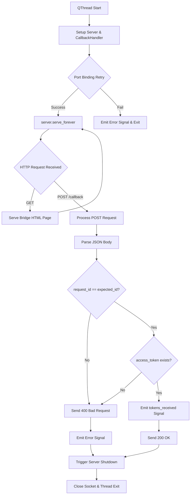
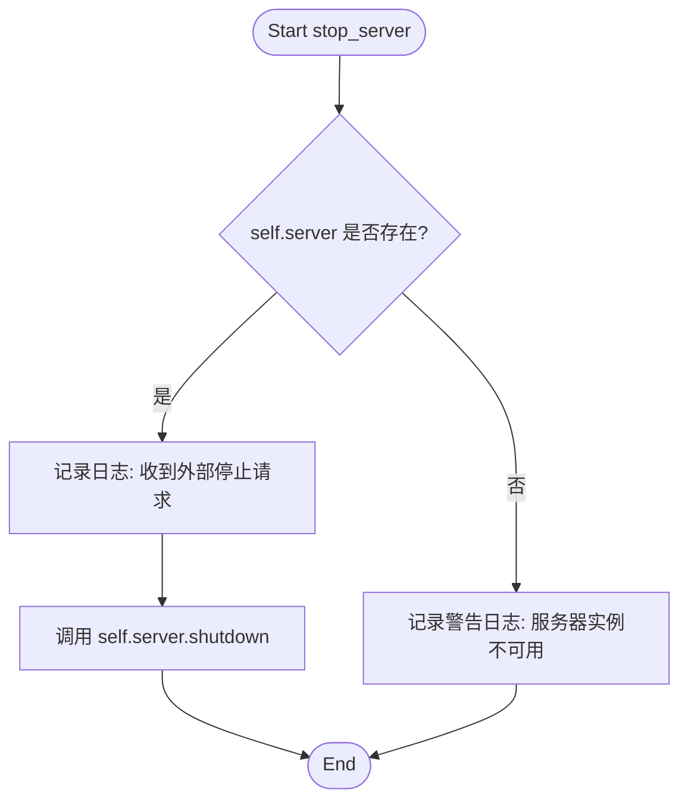
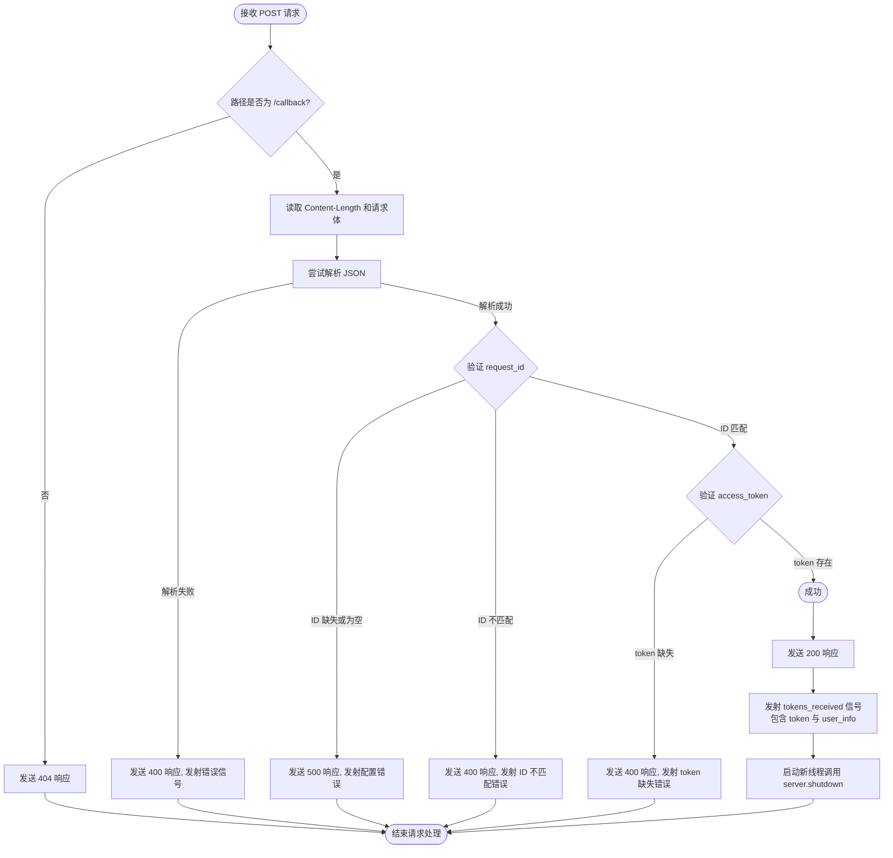
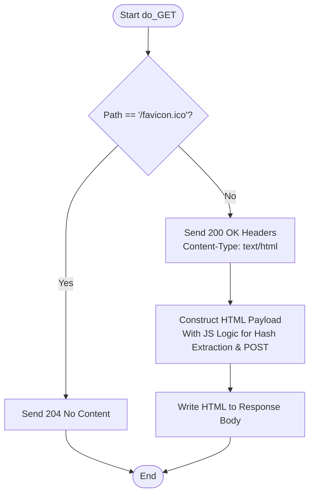

# `comic-translate\app\account\auth\auth_server.py` 详细设计文档

A PySide6 QThread-based local HTTP server that implements an authentication callback receiver. It runs on a random or specified port, serves a bridge HTML page to process OAuth redirects, receives POST requests containing access/refresh tokens and user info, validates the request ID, and emits the credentials to the main application via signals before shutting down.

## 整体流程



## 类结构

```
AuthServerThread (QThread)
└── CallbackHandler (BaseHTTPRequestHandler - Inner Class)
```

## 全局变量及字段


### `logger`
    
Module-level logger instance.

类型：`logging.Logger`
    


### `AuthServerThread._port_preference`
    
User-defined port preference.

类型：`Optional[int]`
    


### `AuthServerThread.port`
    
The port successfully bound to.

类型：`Optional[int]`
    


### `AuthServerThread.server`
    
The TCP server instance.

类型：`Optional[socketserver.TCPServer]`
    


### `AuthServerThread.max_retries`
    
Maximum number of port binding attempts.

类型：`int`
    


### `AuthServerThread.expected_request_id`
    
ID used to verify callback authenticity.

类型：`Optional[str]`
    


### `CallbackHandler.parent_thread`
    
Reference to the parent thread to emit signals.

类型：`AuthServerThread`
    
    

## 全局函数及方法


### `AuthServerThread.__init__`

该方法作为 `AuthServerThread` 类的构造函数，负责初始化实例的核心配置参数。它主要完成两项关键任务：一是调用父类 `QThread` 的构造函数以确保 Qt 线程框架正确初始化；二是设置本地回调服务器（Local OAuth Server）的初始状态，包括端口偏好、服务器占位符、重试次数以及用于安全验证的 `request_id`。

参数：

- `port`：`Optional[int]`，可选。指定希望绑定的端口号。如果未提供（为 `None`），服务器将在 `run()` 方法执行时随机选择一个空闲端口。
- `expected_request_id`：`Optional[str]`，可选。存储预期收到的回调请求中的 `request_id`，用于在回调处理时验证请求的合法性，防止跨站请求伪造（CSRF）。

返回值：`None`，因为 `__init__` 方法在 Python 中不返回任何内容（隐式返回 `None`）。

#### 流程图

```mermaid
flowchart TD
    A([Start __init__]) --> B[调用 super().__init__() 初始化 QThread]
    B --> C[设置 self._port_preference = port]
    C --> D[设置 self.port = None 预留给运行时]
    D --> E[设置 self.server = None 初始化服务器句柄]
    E --> F[设置 self.max_retries = 5]
    F --> G[设置 self.expected_request_id = expected_request_id]
    G --> H([End __init__])
```

#### 带注释源码

```python
def __init__(self, port: Optional[int] = None, expected_request_id: Optional[str] = None):
    """
    初始化认证服务器线程。

    Args:
        port: 可选的端口号，用于绑定本地回调服务器。
        expected_request_id: 可选的请求ID，用于验证后续收到的OAuth回调。
    """
    super().__init__() # 调用父类 QThread 的构造函数，初始化 Qt 线程基类
    
    # 保存用户指定的端口偏好。如果为 None，将在 run() 中随机生成
    self._port_preference = port 
    
    # 初始化实例属性。实际端口在 run() 阶段确定
    self.port: Optional[int] = None 
    
    # 初始化 TCP 服务器实例为 None，表示当前服务器未启动
    self.server: Optional[socketserver.TCPServer] = None 
    
    # 设置端口绑定失败时的最大重试次数
    self.max_retries = 5 
    
    # 存储用于验证回调请求的 ID，以确保回调确实是由本应用发起的请求返回的
    self.expected_request_id = expected_request_id
```


### `AuthServerThread.stop_server`

该方法是一个公开的线程安全接口，用于从外部（例如主线程或 GUI 控制器）请求关闭在 `AuthServerThread` 内部运行的本地 HTTP 服务器。它通过调用 `socketserver` 的 `shutdown` 方法来中断阻塞的 `serve_forever()` 循环，从而实现线程的退出。

参数：

- `self`：`AuthServerThread`，表示类的实例本身，持有服务器对象和端口信息。

返回值：`None`，该方法不返回任何值，仅执行关闭操作。

#### 流程图



#### 带注释源码

```python
def stop_server(self):
    """Requests the server to shut down."""
    # 检查服务器实例是否存在（可能在服务器启动失败后为 None）
    if self.server:
        # 记录日志，说明是外部请求触发的关闭，并记录当前端口
        logger.info(f"External request received to stop server on port {self.port}.")
        
        # 调用 TCPServer 的 shutdown 方法。
        # 该方法是线程安全的，并且会中断 serve_forever() 的循环，
        # 使 QThread 的 run 方法得以执行完毕并退出。
        self.server.shutdown()
    else:
        # 如果服务器未启动或初始化失败，记录警告
        logger.warning("Stop server requested, but server instance is not available.")
```


### `AuthServerThread.run`

该方法是 `AuthServerThread` 类的核心执行单元，继承自 `QThread`。它负责启动一个临时的本地 HTTP 服务器，充当 OAuth/OAuth2 认证流程的回调接收器。其主要职责包括：配置服务器、绑定端口（带重试逻辑）、处理前端发来的 GET 请求（提供桥接页面以提取 URL 片段）、处理后端发来的 POST 请求（验证 token 并发出信号）、以及最终的资源清理。

#### 参数

- `self`：`AuthServerThread`，线程实例本身，包含端口偏好和预期的请求 ID。

#### 返回值

- `None`，该方法通过信号（Signals）传递结果，方法本身不返回值。

#### 流程图

```mermaid
flowchart TD
    A([Start run]) --> B[Define CallbackHandler Class]
    B --> C{Check Port Preference}
    C -->|Has Preference| D[Use Preferred Port]
    C -->|No Preference| E[Generate Random Port 8001-9000]
    D --> F[Loop: Retry 0 to 5]
    E --> F
    
    F --> G[Attempt Bind to 127.0.0.1:Port]
    G --> H{Bind Success?}
    H -->|Yes| I[Log Success, Break Loop]
    H -->|No| J{Error == EADDRINUSE?}
    J -->|Yes| K[Log Warning, Backoff, Increment Retry]
    K --> F
    J -->|No| L[Log Error, Emit Error Signal, Return]
    
    I --> M[Start serve_forever]
    M --> N[Block: Listen & Handle Requests]
    
    subgraph Handler [Request Handling (In subprocess/thread)]
    N --> O[Receive GET /callback]
    O --> P[Serve HTML/JS Payload]
    P --> Q[JS extracts hash, POSTs to /callback]
    
    N --> R[Receive POST /callback]
    R --> S[Parse JSON Payload]
    S --> T{Validation}
    T -->|Fail| U[Emit Error Signal, Send 4xx]
    T -->|Pass| V[Emit tokens_received Signal, Send 200]
    
    V --> W[Trigger Server Shutdown]
    end
    
    M --> X[Shutdown Triggered]
    X --> Y[server_close Cleanup]
    Y --> Z([End])
```

#### 带注释源码

```python
def run(self):
    """
    主线程运行方法。启动本地HTTP服务器以接收OAuth回调。
    """
    # 1. 定义内部请求处理类
    # 在run方法内部定义handler是为了在每个实例中传递parent_thread引用
    class CallbackHandler(http.server.BaseHTTPRequestHandler):
        # Pass the parent thread instance and expected request ID
        parent_thread: AuthServerThread = self

        def do_POST(self):
            """处理后端发送的包含Token的POST请求。"""
            parent = self.__class__.parent_thread
            expected_id = parent.expected_request_id
            content_length = int(self.headers.get('Content-Length', 0))
            post_body = self.rfile.read(content_length)
            response_code = 500 # 默认内部错误
            response_body = b"Internal Server Error"
            should_shutdown = True # 处理后关闭服务器

            logger.info(f"Received POST request on callback server (Path: {self.path})")

            if '/callback' in self.path:
                try:
                    # 2. 解析并验证数据
                    data = json.loads(post_body)
                    received_request_id = data.get("request_id")
                    access_token = data.get("access_token")
                    refresh_token = data.get("refresh_token") 
                    user_info = data.get("user_info", {}) 

                    # 验证 request_id 是否匹配，防止伪造回调
                    if not expected_id:
                        logger.error("Server started without an expected_request_id.")
                        response_code = 500
                        response_body = b"Server configuration error: Missing expected request ID."
                        parent.error.emit("Internal error: Server missing expected request ID.")
                    elif received_request_id != expected_id:
                        logger.warning(f"Mismatched request_id! Expected '{expected_id}', received '{received_request_id}'.")
                        response_code = 400
                        response_body = b"Invalid request: request_id mismatch."
                        parent.error.emit("Authentication failed: Invalid callback received (ID mismatch).")
                    elif not access_token:
                        logger.error("Callback received without an access_token.")
                        response_code = 400
                        response_body = b"Invalid request: Missing access_token."
                        parent.error.emit("Authentication failed: Invalid callback received (missing token).")
                    else:
                        # 3. 成功：发射信号并响应
                        logger.info("Request ID verified successfully. Emitting tokens and user info.")
                        response_code = 200
                        response_body = b"Tokens received successfully by desktop app."
                        parent.tokens_received.emit(access_token, refresh_token or "", user_info)

                    # 4. 发送HTTP响应
                    self.send_response(response_code)
                    self.send_header('Content-type', 'text/plain')
                    self.end_headers()
                    self.wfile.write(response_body)

                except json.JSONDecodeError:
                    # 错误处理：JSON格式错误
                    logger.error("Failed to decode JSON from callback POST body.")
                    response_code = 400
                    response_body = b"Invalid request: Malformed JSON."
                    self.send_response(response_code)
                    self.send_header('Content-type', 'text/plain')
                    self.end_headers()
                    self.wfile.write(response_body)
                    parent.error.emit("Authentication failed: Invalid data format received from backend.")
                except Exception as e:
                    logger.error(f"Error processing callback POST: {str(e)}", exc_info=True)
                    if not self.wfile.closed:
                        try:
                            self.send_response(500)
                            self.send_header('Content-type', 'text/plain')
                            self.end_headers()
                            self.wfile.write(f"Internal Server Error: {str(e)}".encode())
                        except Exception as send_err:
                            logger.error(f"Error sending 500 response: {send_err}")
                    parent.error.emit(f"Internal error processing authentication callback: {str(e)}")
                finally:
                    # 5. 请求处理完毕，关闭服务器
                    if should_shutdown and parent.server:
                        logger.debug("Requesting server shutdown from handler.")
                        # 使用daemon thread避免在非线程化服务器中关闭时的死锁
                        threading.Thread(target=parent.server.shutdown, daemon=True).start()
            else:
                # 未知路径
                logger.warning(f"Received POST on unexpected path: {self.path}")
                self.send_response(404)
                self.send_header('Content-type', 'text/plain')
                self.end_headers()
                self.wfile.write(b"Not found")
                should_shutdown = False

        def do_GET(self):
            """处理GET请求，发送用于桥接的HTML/JS页面。"""
            logger.debug(f"Received GET request for {self.path}")
            
            # 简单的favicon处理
            if self.path == '/favicon.ico':
                self.send_response(204)
                self.end_headers()
                return

            # 发送桥接页面 (HTML/JS代码省略见原文...)
            self.send_response(200)
            self.send_header('Content-type', 'text/html')
            self.end_headers()
            # 此处应包含大段HTML，用于从URL fragment中提取token并POST回服务器
            html = "..." 
            self.wfile.write(html.encode("utf-8"))

        def log_message(self, format, *args):
            # 压制默认日志或自定义
            return

    # 6. 服务器启动逻辑与端口重试
    server_started = False
    # 决定端口：如果有偏好用偏好，否则随机
    port_to_try = self._port_preference if self._port_preference else random.randint(8001, 9000)

    for attempt in range(self.max_retries + 1):
        try:
            # 动态绑定parent_thread到Handler类
            CallbackHandler.parent_thread = self

            socketserver.TCPServer.allow_reuse_address = True
            # 使用ThreadingTCPServer以避免在serve_forever中处理请求导致的关闭死锁
            self.server = socketserver.ThreadingTCPServer(("127.0.0.1", port_to_try), CallbackHandler)
            self.server.daemon_threads = True
            self.port = port_to_try
            server_started = True
            logger.info(f"Auth server successfully bound to port {self.port} (Attempt {attempt + 1})")
            break
        except OSError as e:
            if e.errno == errno.WSAEADDRINUSE or e.errno == errno.EADDRINUSE:
                logger.warning(f"Port {port_to_try} already in use.")
                if attempt < self.max_retries:
                    # 如果是指定端口则重试该端口，否则换随机端口
                    if self._port_preference is not None:
                        port_to_try = self._port_preference
                    else:
                        port_to_try = random.randint(8001, 9000)
                    time.sleep(0.1 * (attempt + 1))
                else:
                    # 重试耗尽
                    err_msg = f"Server error: Failed to bind to a port after {self.max_retries + 1} attempts."
                    logger.error(err_msg)
                    self.error.emit(err_msg)
                    return
            else:
                err_msg = f"Server OS error during setup: {str(e)}"
                logger.error(err_msg, exc_info=True)
                self.error.emit(err_msg)
                return
        except Exception as e:
            err_msg = f"Unexpected server setup error: {str(e)}"
            logger.error(err_msg, exc_info=True)
            self.error.emit(err_msg)
            return

    # 7. 进入服务器主循环
    if server_started and self.server:
        try:
            logger.info(f"Auth server running on http://127.0.0.1:{self.port}. Waiting for callback...")
            self.server.serve_forever() # 阻塞直到 shutdown() 被调用
        except Exception as e:
            logger.error(f"Error during server runtime: {str(e)}", exc_info=True)
            if not self.signalsBlocked(): self.error.emit(f"Error during server runtime: {str(e)}")
        finally:
            # 8. 清理资源
            logger.debug(f"Closing server socket on port {self.port}...")
            self.server.server_close()
            logger.info(f"Server on port {self.port} closed.")
            self.server = None
    else:
        logger.error("Server startup failed silently.")
        if not self.signalsBlocked(): self.error.emit("Server could not be started.")
```


### `CallbackHandler.do_POST`

该方法是本地认证回调服务器的核心处理单元。当后端服务完成用户登录验证后，会向此端点发送 POST 请求。该方法负责解析请求体中的 JSON 数据，验证 `request_id` 与当前会话是否匹配，提取令牌（access_token, refresh_token）和用户信息，最终通过信号机制将数据传递至主线程，并安全地关闭本地服务器。

参数：

-  `self`：`BaseHTTPRequestHandler` (具体为 `CallbackHandler` 的实例)。隐式参数，代表当前的 HTTP 请求处理器实例，包含了请求路径 (`self.path`)、请求头 (`self.headers`)、输入流 (`self.rfile`) 和输出流 (`self.wfile`)。

返回值：`None`（无返回值）。该方法通过 `self.wfile` 直接写入 HTTP 响应报文，不通过 Python return 语句返回数据。

#### 流程图



#### 带注释源码

```python
def do_POST(self):
    """Handle POST request from the backend containing tokens."""
    # 获取父线程 (AuthServerThread) 实例以访问预期ID和信号发射器
    parent = self.__class__.parent_thread
    expected_id = parent.expected_request_id
    
    # 1. 获取请求体
    content_length = int(self.headers.get('Content-Length', 0))
    post_body = self.rfile.read(content_length)
    
    # 默认响应：服务器内部错误
    response_code = 500 
    response_body = b"Internal Server Error"
    should_shutdown = True # 处理完成后是否关闭服务器

    logger.info(f"Received POST request on callback server (Path: {self.path})")

    # 2. 检查路径
    if '/callback' in self.path:
        try:
            # 解析 JSON 数据
            data = json.loads(post_body)
            received_request_id = data.get("request_id")
            access_token = data.get("access_token")
            refresh_token = data.get("refresh_token") # May be None/missing
            
            # 提取用户信息 (可选)
            user_info = data.get("user_info", {}) # Optional, defaults to empty dict

            logger.debug(f"Callback Data Received: request_id={received_request_id}, user={user_info.get('email')}")

            # 3. 验证 request_id
            if not expected_id:
                logger.error("Server started without an expected_request_id. Cannot verify callback.")
                response_code = 500
                response_body = b"Server configuration error: Missing expected request ID."
                # 发射错误信号通知 UI
                parent.error.emit("Internal error: Server missing expected request ID.")
            elif received_request_id != expected_id:
                logger.warning(f"Mismatched request_id! Expected '{expected_id}', received '{received_request_id}'. Rejecting.")
                response_code = 400 # Bad Request
                response_body = b"Invalid request: request_id mismatch."
                parent.error.emit("Authentication failed: Invalid callback received (ID mismatch).")
            # 4. 验证 access_token
            elif not access_token:
                logger.error("Callback received without an access_token. Rejecting.")
                response_code = 400
                response_body = b"Invalid request: Missing access_token."
                parent.error.emit("Authentication failed: Invalid callback received (missing token).")
            else:
                # 5. 验证成功：发送成功响应并发射信号
                logger.info("Request ID verified successfully. Emitting tokens and user info.")
                response_code = 200
                response_body = b"Tokens received successfully by desktop app."
                # 关键：发射信号将数据传回主线程
                parent.tokens_received.emit(access_token, refresh_token or "", user_info)

            # 6. 发送 HTTP 响应回后端
            self.send_response(response_code)
            self.send_header('Content-type', 'text/plain')
            self.end_headers()
            self.wfile.write(response_body)
            logger.debug(f"Sent {response_code} response back to backend.")

        except json.JSONDecodeError:
            logger.error("Failed to decode JSON from callback POST body.")
            response_code = 400
            response_body = b"Invalid request: Malformed JSON."
            self.send_response(response_code)
            self.send_header('Content-type', 'text/plain')
            self.end_headers()
            self.wfile.write(response_body)
            parent.error.emit("Authentication failed: Invalid data format received from backend.")
            
        except Exception as e:
            logger.error(f"Error processing callback POST: {str(e)}", exc_info=True)
            # 尝试发送 500 错误响应
            if not self.wfile.closed:
                try:
                    self.send_response(500)
                    self.send_header('Content-type', 'text/plain')
                    self.end_headers()
                    self.wfile.write(f"Internal Server Error: {str(e)}".encode())
                except Exception as send_err:
                    logger.error(f"Error sending 500 response during exception handling: {send_err}")

            parent.error.emit(f"Internal error processing authentication callback: {str(e)}")
        finally:
             # 7. 无论如何处理（成功或失败），通常在此场景下都应关闭服务器以释放资源
             # 避免在 handler 内部直接调用 shutdown 导致死锁，因此启动新线程
            if should_shutdown and parent.server:
                logger.debug("Requesting server shutdown from handler.")
                threading.Thread(target=parent.server.shutdown, daemon=True).start()
    else:
        logger.warning(f"Received POST on unexpected path: {self.path}")
        self.send_response(404)
        self.send_header('Content-type', 'text/plain')
        self.end_headers()
        self.wfile.write(b"Not found")
        # 意外路径不关闭服务器
        should_shutdown = False
```


### `CallbackHandler.do_GET`

该方法负责处理来自浏览器的 GET 请求。当本地认证服务器接收到请求时，它会返回一个包含嵌入式 JavaScript 的 HTML 页面。此页面充当“桥接器”，在客户端（浏览器）中解析 URL 片段（Hash）中的令牌，并通过 JavaScript 的 `fetch` API 将其以 POST 方式重新发送回本地服务器（`/callback` 端点），从而实现桌面应用对浏览器认证结果的捕获。

参数：
- `self`：`CallbackHandler`（继承自 `BaseHTTPRequestHandler`），请求处理程序实例，提供对请求路径 (`self.path`) 和响应输出流 (`self.wfile`) 的访问。

返回值：`None`，该方法直接向客户端写入响应数据，不返回任何值。

#### 流程图



#### 带注释源码

```python
def do_GET(self):
    """Handle GET requests - serve the JS bridge page for /callback."""
    logger.debug(f"Received GET request for {self.path}")
    
    # 1. 处理 favicon 请求，避免日志刷屏
    if self.path == '/favicon.ico':
        self.send_response(204) # No content
        self.end_headers()
        return

    # 2. 对于 /callback 路径（或根路径），服务桥接页面
    self.send_response(200)
    self.send_header('Content-type', 'text/html')
    self.end_headers()
    
    # 3. HTML 内容：包含 CSS 样式和核心 JavaScript 逻辑
    # 嵌入的 JS 会读取 URL hash，解析令牌，并通过 POST 发送给服务器
    html = """
        <!DOCTYPE html>
        <html>
        <head>
            <title>Completing Login...</title>
            <style>
                body { font-family: -apple-system, BlinkMacSystemFont, "Segoe UI", Roboto, Helvetica, Arial, sans-serif; background: #f1f5f9; display: flex; align-items: center; justify-content: center; height: 100vh; margin: 0; }
                .card { background: white; padding: 2rem; border-radius: 12px; box-shadow: 0 4px 6px -1px rgb(0 0 0 / 0.1); max-width: 400px; width: 100%; text-align: center; }
                .spinner { border: 4px solid #f3f3f3; border-top: 4px solid #3b82f6; border-radius: 50%; width: 40px; height: 40px; animation: spin 1s linear infinite; margin: 0 auto 1rem; }
                @keyframes spin { 0% { transform: rotate(0deg); } 100% { transform: rotate(360deg); } }
                .success { color: #10b981; font-weight: 500; }
                .error { color: #ef4444; }
            </style>
        </head>
        <body>
            <div class="card">
                <div id="spinner" class="spinner"></div>
                <h3 id="title">Finishing Sign In...</h3>
                <p id="message" style="color: #64748b;">Please wait while we complete the authentication process.</p>
            </div>
            <script>
                (function() {
                    // 检测用户语言 (仅支持 fr, ko, zh 前缀路由)
                    function detectLanguage() {
                        const langs = navigator.languages || [navigator.language || navigator.userLanguage];
                        
                        for (let i = 0; i < langs.length; i++) {
                            const lang = langs[i];
                            if (!lang) continue;
                            
                            if (lang.startsWith('en')) return null; // English = no prefix
                            if (lang.startsWith('fr')) return 'fr';
                            if (lang.startsWith('ko')) return 'ko';
                            if (lang.startsWith('zh')) return 'zh';
                        }
                        return null; 
                    }
                    
                    // 1. 从 URL 片段 (hash) 中提取参数
                    const hash = window.location.hash.substring(1);
                    if (!hash) {
                        document.getElementById('spinner').style.display = 'none';
                        if (window.location.pathname.includes('callback')) {
                            document.getElementById('title').innerText = 'Authentication Error';
                            document.getElementById('message').innerText = 'No authentication token received in URL fragment.';
                            document.getElementById('message').className = 'error';
                        } else {
                            document.getElementById('title').innerText = 'Auth Listener Active';
                            document.getElementById('message').innerText = 'This window handles desktop authentication.';
                        }
                        return;
                    }

                    const params = new URLSearchParams(hash);
                    const payload = {};
                    for (const [key, value] of params.entries()) {
                        payload[key] = value;
                    }

                    // 2. 解析 user_info JSON 字符串（如果存在）
                    if (payload.user_info) {
                        try {
                            payload.user_info = JSON.parse(payload.user_info);
                        } catch (e) {
                            console.warn("Failed to parse user_info JSON:", e);
                        }
                    }

                    // 3. 通过 POST 将数据发送到本地服务器
                    fetch('/callback', {
                        method: 'POST',
                        headers: { 'Content-Type': 'application/json' },
                        body: JSON.stringify(payload)
                    })
                    .then(async response => {
                        const text = await response.text();
                        document.getElementById('spinner').style.display = 'none';
                        
                        if (response.ok) {
                            // 成功！重定向到本地化的成功页面
                            const userLang = detectLanguage();
                            const redirectPath = userLang 
                                ? `/${userLang}/auth/desktop-login-success` 
                                : '/auth/desktop-login-success';
                            
                            window.location.href = `https://comic-translate.com${redirectPath}`;
                        } else {
                            document.getElementById('title').innerText = 'Sign In Failed';
                            document.getElementById('message').innerText = text || 'The application rejected the login attempt.';
                            document.getElementById('message').className = 'error';
                        }
                    })
                    .catch(err => {
                        document.getElementById('spinner').style.display = 'none';
                        document.getElementById('title').innerText = 'Connection Error';
                        document.getElementById('message').innerText = 'Failed to communicate with the desktop application.';
                        document.getElementById('message').className = 'error';
                    });
                })();
            </script>
        </body>
        </html>
    """
    self.wfile.write(html.encode("utf-8"))
```


### `CallbackHandler.log_message`

该方法是 `http.server.BaseHTTPRequestHandler` 的标准方法的重写实现。在 `AuthServerThread` 启动的本地 HTTP 服务器中，所有来自后端的 HTTP 请求（包括 GET 和 POST）默认都会调用此方法记录访问日志。该实现覆盖了默认行为，直接丢弃日志信息（静默），以避免在控制台输出大量 HTTP 访问日志，保持认证流程的日志清洁度。

参数：
- `self`：`CallbackHandler`，处理当前 HTTP 请求的处理器实例。
- `format`：`str`，标准的日志格式字符串（例如 `"%s - - [%s] %s"`）。
- `*args`：`tuple`，用于填充 `format` 字符串的可变参数，通常包含请求路径、状态码等。

返回值：`None`，该方法不返回任何值，仅执行控制流。

#### 流程图

```mermaid
flowchart TD
    A([Start: log_message]) --> B{是否需要详细日志?}
    B -- 是 (代码未注释) --> C[使用 logger.debug 输出日志]
    B -- 否 (当前实现) --> D[直接返回 (Suppress)]
    C --> E([End])
    D --> E
```
*(注：当前代码实现中默认为“否”，直接返回。)*

#### 带注释源码

```python
def log_message(self, format, *args):
    # Suppress default logging or customize
    # 如果需要调试或查看请求日志，可以取消下面的注释，
    # 将日志信息输出到项目的 debug 级别日志中。
    # logger.debug(format % args) # Uncomment for verbose request logging
    
    # 执行 return 结束函数，默认不进行任何操作，
    # 从而阻止了 BaseHTTPRequestHandler 默认将请求信息打印到 stderr/stdout。
    return
```


## 关键组件


### AuthServerThread

主服务器线程类，继承自 QThread，负责在后台启动本地 HTTP 服务器以接收 OAuth 回调。

### CallbackHandler

内部 HTTP 请求处理类，继承自 BaseHTTPRequestHandler，负责处理后端发送的 POST 回调请求和浏览器 GET 请求。

### HTTP 服务器启动逻辑

包含端口选择、重试机制和服务器初始化的逻辑，支持动态端口分配和地址重用。

### 回调请求验证流程

验证 request_id、解析 access_token、refresh_token 和 user_info 的完整流程。

### 前端桥接页面

嵌入在 do_GET 中的 HTML/JS 页面，用于从 URL 片段提取令牌并通过 POST 发送到本地服务器。

### 信号发射机制

通过 tokens_received 和 error 信号将认证结果和错误信息传递给主应用程序。

### 服务器生命周期管理

包括 start、serve_forever、shutdown 和 server_close 的完整服务器生命周期控制。


## 问题及建议


### 已知问题

-   **非标准的 QThread 使用方式**：代码继承 `QThread` 并重写 `run` 方法来启动 `TCPServer`。这虽然可行，但容易与 Qt 的事件循环产生冲突，且不符合 Qt 官方推荐的 Worker 模式（通过 `moveToThread`）。直接在其中运行阻塞的 `serve_forever()` 会使线程难以优雅地通过 Qt 信号停止。
-   **嵌套类定义导致性能开销**：`CallbackHandler` 类定义在 `run()` 方法内部。这意味着每次 `AuthServerThread` 启动时都会重新定义一个类。虽然 Python 会进行垃圾回收，但这增加了启动开销并可能导致 ID 查找稍慢。
-   **全局状态污染**：`socketserver.TCPServer.allow_reuse_address = True` 被设置为全局类属性，这会影响该进程后续创建的所有服务器实例，应改为实例属性。
-   **端口选择策略风险**：使用 `random.randint` 随机选择端口在端口占用率高或并发场景下可能导致不必要的重试，增加启动延迟。
-   **缺乏安全响应头**：HTTP 响应（尤其是包含内联 JS 的 HTML）缺少 `Content-Security-Policy` (CSP) 头，存在潜在的内容安全风险。
-   **硬编码配置**：HTML 响应中的重定向 URL (`https://comic-translate.com`) 被硬编码在字符串中，降低了代码的可移植性和配置灵活性。

### 优化建议

-   **重构为 Worker 模式**：不要继承 `QThread`，而是创建一个普通的 `QThread`，在内部初始化一个 `AuthServer` 对象（不继承 QThread），通过信号槽与主线程通信。这样可以更好地管理服务器生命周期。
-   **提取 Handler 类**：将 `CallbackHandler` 移至模块级别或作为 `AuthServerThread` 的静态属性/嵌套类（但定义在方法外），避免每次运行都重新定义类。
-   **改进端口分配逻辑**：优先使用系统分配的空闲端口（port=0）或维护一个已知可用的高端口列表进行遍历，而不是完全随机重试。
-   **添加安全头**：在 `do_GET` 和 `do_POST` 响应中添加必要的 HTTP 头，如 `Content-Security-Policy`、`X-Frame-Options` 等。
-   **配置外部化**：将重定向域名、端口范围等配置提取为类的初始化参数或配置文件，而非硬编码在 HTML 字符串中。
-   **加强错误处理**：在 `run()` 方法的异常捕获中，确保日志记录的完整性，并考虑对 `server.server_close()` 添加更健壮的异常处理，防止端口泄漏。

## 其它


### 设计目标与约束

**设计目标**：为桌面应用程序提供一个本地HTTP服务器，用于接收后端OAuth/OAuth2认证流程的回调，验证请求ID安全性，提取令牌（access_token、refresh_token）和用户信息，并通过Qt Signal机制将认证结果传递回主应用程序，实现桌面端与Web端的无缝认证桥接。

**约束条件**：
- 仅支持IPv4环回地址（127.0.0.1），禁止外部网络访问
- 服务器为单次使用设计，每次认证流程启动一次，接收回调后立即关闭
- 依赖PySide6 QThread进行线程管理，确保Qt事件循环兼容性
- 端口范围限制在8001-9000（随机）或用户指定端口

### 错误处理与异常设计

**错误分类与处理**：
1. **端口占用错误**（OSError, errno.EADDRINUSE/WSAEADDRINUSE）：最多重试5次，每次重试间隔递增（0.1s * attempt），若用户指定固定端口则仅在该端口重试
2. **JSON解析错误**（json.JSONDecodeError）：返回400 Bad Request，发送"Invalid request: Malformed JSON."，触发error Signal
3. **请求ID不匹配**：返回400 Bad Request，记录警告日志，触发error Signal
4. **缺少access_token**：返回400 Bad Request，记录错误日志，触发error Signal
5. **服务器配置错误**（无expected_request_id）：返回500 Internal Server Error，触发error Signal
6. **运行时异常**（Exception）：捕获并记录堆栈信息，尝试发送500响应，确保服务器关闭

**异常传播机制**：
- 通过Qt Signal（error Signal）将错误信息传递至主线程
- 错误信息包含人类可读的错误描述和可选的技术细节

### 数据流与状态机

**数据流**：
1. 用户在浏览器中完成Web端OAuth认证
2. 后端重定向浏览器至本地服务器URL（包含令牌于URL hash中）
3. 浏览器请求GET /callback，本地服务器返回HTML桥接页面
4. 桥接页面JavaScript从URL hash提取令牌和user_info
5. JavaScript POST数据至本地服务器 /callback
6. 服务器验证request_id，提取令牌，通过Signal发出
7. 服务器发送响应至后端并关闭

**状态机**：
- **INITIAL**：线程未启动，等待run()调用
- **STARTING**：尝试绑定端口，重试机制生效
- **RUNNING**：serve_forever()阻塞，等待HTTP请求
- **PROCESSING**：接收到POST /callback，正在处理认证数据
- **SHUTTING_DOWN**：shutdown()已调用，server_close()执行中
- **TERMINATED**：线程结束

### 外部依赖与接口契约

**外部依赖**：
- `http.server`：提供BaseHTTPRequestHandler
- `socketserver`：提供TCPServer、ThreadingTCPServer
- `threading`：提供Thread用于安全关闭服务器
- `PySide6.QtCore`：提供QThread、Signal用于Qt集成
- `json`：解析回调请求体
- `random`：生成随机端口
- `logging`：日志记录
- `typing`：类型注解

**接口契约**：
- **Signal接口**：
  - `tokens_received(str access_token, str refresh_token, dict user_info)`：认证成功时发出
  - `error(str message)`：发生错误时发出
- **HTTP接口**：
  - `GET /callback`：返回HTML桥接页面
  - `POST /callback`：接收JSON格式的认证数据 `{request_id, access_token, refresh_token, user_info}`
- **控制接口**：
  - `stop_server()`：外部调用请求服务器关闭

### 关键组件信息

- **AuthServerThread (QThread)**：核心组件，管理本地HTTP服务器生命周期，继承Qt线程类
- **CallbackHandler (BaseHTTPRequestHandler)**：内部请求处理器类，处理GET/POST请求
- **Embedded HTML/JS Bridge**：嵌入的HTML页面，负责从URL hash提取数据并POST回服务器

### 潜在技术债务与优化空间

1. **ThreadingTCPServer线程安全**：虽然设置了daemon_threads=True，但长时间运行可能存在资源泄漏风险
2. **硬编码域名**：成功重定向URL中硬编码了"comic-translate.com"，应抽取为配置项
3. **国际化检测逻辑**：浏览器的语言检测逻辑位于HTML中，提取为独立模块或API更佳
4. **端口重试逻辑**：当指定固定端口且被占用时，持续重试可能造成死循环，应增加最大等待时间或明确失败
5. **日志冗余**：部分日志记录级别可调整为DEBUG以减少生产环境噪声
6. **HTML内联**：完整的HTML/JS代码嵌入Python字符串中，难以维护，建议分离为独立模板文件或资源文件

### 设计模式分析

- **观察者模式**：通过PySide6 Signal/Slot机制实现，AuthServerThread为被观察者，主线程为观察者
- **命令模式**：stop_server()作为关闭命令的抽象
- **工厂模式**：CallbackHandler在每次请求时实例化，类似工厂生产处理器
- **模板方法模式**：run()方法中定义了服务器启动的标准流程

### 安全性考量

- **本地绑定**：仅绑定127.0.0.1，防止外部访问
- **请求ID验证**：通过expected_request_id防止回调伪造
- **Daemon线程**：服务器线程设为daemon，确保主程序退出时自动终止
- **输入验证**：对JSON字段进行存在性和类型验证
- **错误信息脱敏**：向外部（后端）返回的错误信息为通用描述，不泄露内部实现细节

    