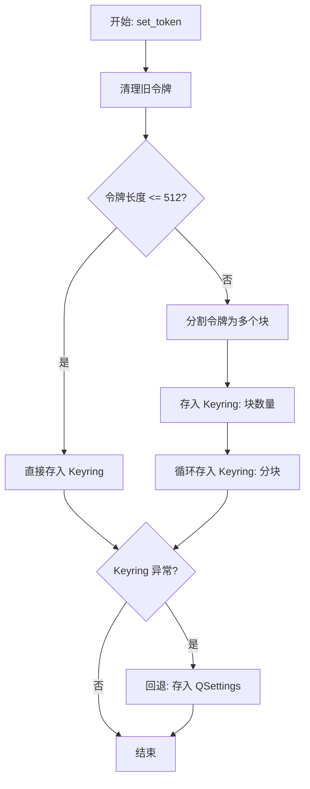
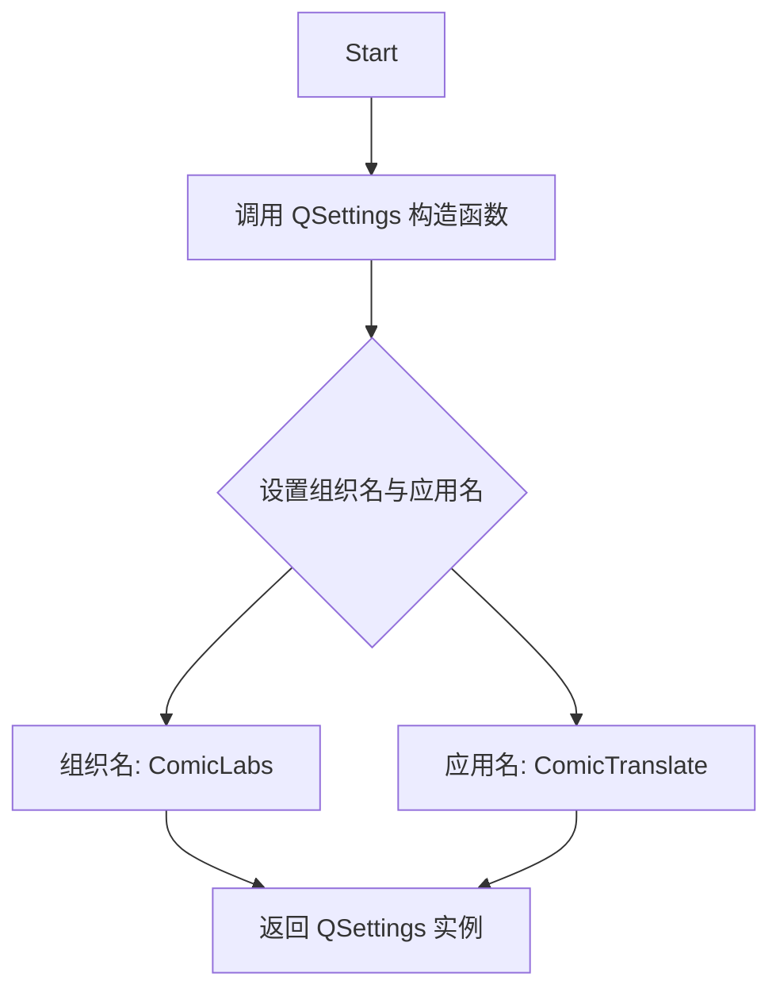
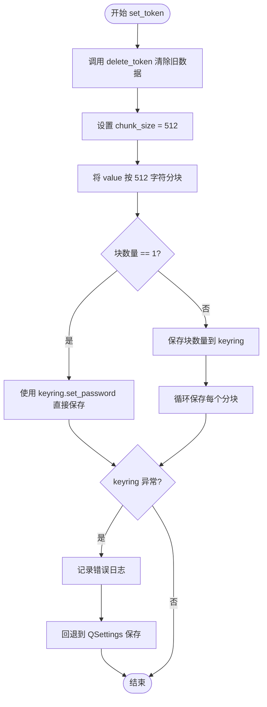
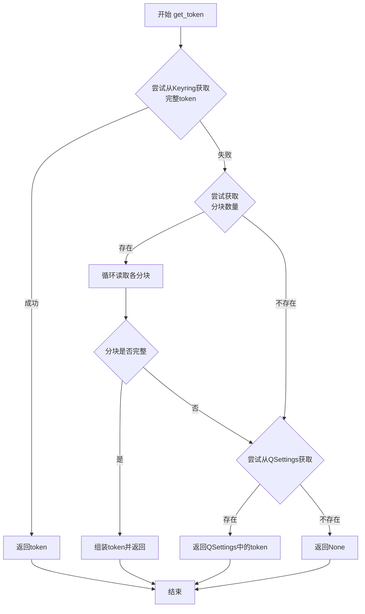
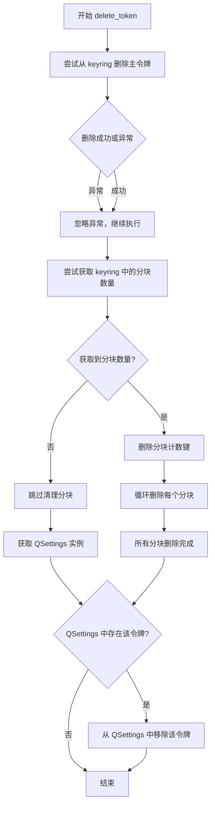
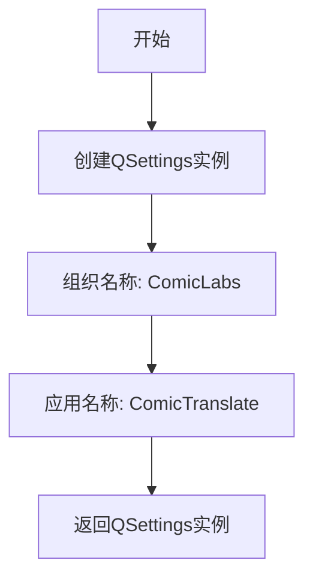
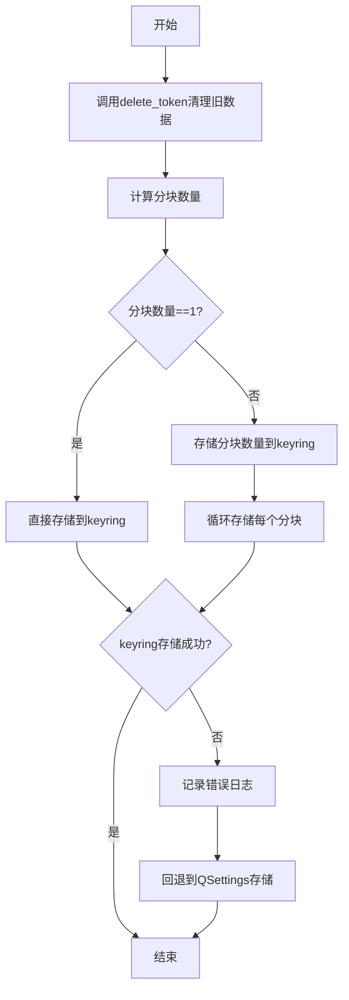
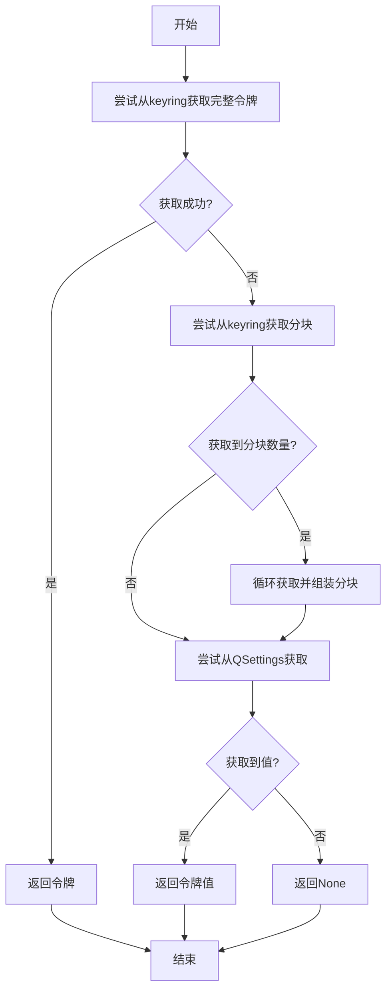
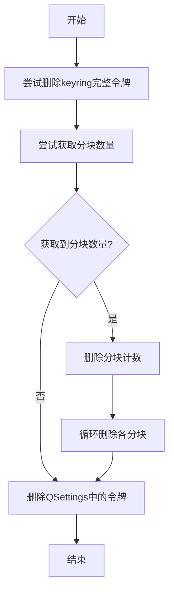

# `comic-translate\app\account\auth\token_storage.py` 详细设计文档

这是一个用于管理认证令牌的 Python 脚本，核心功能是安全地存储和检索用户凭证。它优先使用操作系统级别的 keyring 库进行安全存储，并支持将过长的令牌分割成多个块；若 keyring 不可用，则回退到 QSettings（本地配置文件）进行存储。

## 整体流程



## 类结构

```
auth_storage (模块)
├── get_settings (获取 QSettings 实例)
├── set_token (存储令牌)
├── get_token (检索令牌)
└── delete_token (删除令牌)
```

## 全局变量及字段


### `KEYRING_SERVICE`
    
Keyring服务名称常量，用于标识 comic-translate 应用的身份验证存储服务

类型：`str`
    


### `SETTINGS_GROUP`
    
QSettings分组名称常量，用于在本地配置文件中标识认证相关设置的分组路径

类型：`str`
    


### `logger`
    
模块级日志记录器对象，用于记录密钥存储操作的成功、失败及回退行为日志

类型：`logging.Logger`
    


    

## 全局函数及方法


### `get_settings`

该函数是一个全局辅助函数，用于初始化并返回一个针对 "ComicLabs" 组织下 "ComicTranslate" 应用程序的 `QSettings` 实例，作为应用配置的统一入口。

参数：
- (无)

返回值：`QSettings`，返回 Qt 框架的配置管理对象，用于在本地持久化存储和读取应用程序的设置项。

#### 流程图



#### 带注释源码

```python
def get_settings():
    """
    获取应用程序的设置实例。
    内部封装了 QSettings 的初始化逻辑，统一配置组织名为 'ComicLabs' 
    和应用名为 'ComicTranslate'，确保所有模块使用同一配置文件。
    """
    return QSettings("ComicLabs", "ComicTranslate")
```


### `set_token`

安全地存储令牌，如果令牌过长则进行分块存储。如果 keyring 存储失败，则回退到 QSettings。

参数：

- `name`：`str`，令牌的标识名称，用于在存储后端中作为键
- `value`：`str`，要存储的令牌值，可能是较长的字符串

返回值：`None`，该函数无返回值（执行完成后直接结束）

#### 流程图



#### 带注释源码

```python
def set_token(name: str, value: str):
    """Securely store a token, chunking it if necessary. Fallback to QSettings if keyring fails."""
    # First, try to clear any existing chunks to avoid stale data
    # 清除任何已存在的分块数据，避免残留数据造成混淆
    delete_token(name)
    
    # Use a smaller chunk size to be safe (512 chars ~ 512-2048 bytes depending on encoding)
    # 设置分块大小为 512 字符，兼容不同编码的存储限制
    chunk_size = 512 
    # 将令牌值按 chunk_size 进行分块处理
    chunks = [value[i:i+chunk_size] for i in range(0, len(value), chunk_size)]
    
    try:
        # If it fits in one, just save it normally
        # 如果令牌可以一次性存储，则直接使用 keyring 保存
        if len(chunks) == 1:
            keyring.set_password(KEYRING_SERVICE, name, value)
            return

        # Otherwise, save counts and chunks
        # 如果需要分块，先保存块数量，再逐个保存每个分块
        keyring.set_password(KEYRING_SERVICE, f"{name}_chunks", str(len(chunks)))
        for i, chunk in enumerate(chunks):
            keyring.set_password(KEYRING_SERVICE, f"{name}_chunk_{i}", chunk)
            
    except Exception as e:
        # 如果 keyring 存储失败，记录错误并回退到 QSettings
        # 注意：QSettings 安全性较低，但能保证应用功能正常运行
        logger.error(f"Keyring storage failed for {name} (Size: {len(value)}): {e}. Falling back to QSettings.")
        # Fallback: Store in QSettings (Encodings issues handled by QSettings, hopefully)
        # Note: This is less secure, but allows the app to function.
        settings = get_settings()
        settings.setValue(f"{SETTINGS_GROUP}/{name}", value)
```


### `get_token`

该函数用于检索存储的认证令牌，采用三级降级策略：首先尝试从系统密钥环（keyring）获取单个完整令牌，若失败则尝试重组分块存储的令牌，最后降级到QSettings本地存储中查找。

参数：

- `name`：`str`，token的名称/标识符，用于在存储系统中定位对应的凭证

返回值：`Optional[str]`：成功检索到token时返回字符串形式的口令；若未找到任何存储的凭证则返回None

#### 流程图



#### 带注释源码

```python
def get_token(name: str) -> Optional[str]:
    """Retrieve a token, checking keyring first, then QSettings callback."""
    # 第一步：尝试从通用keyring查找
    # 使用keyring.get_password尝试获取名称对应的单个完整token
    # 如果成功且token存在，则直接返回
    try:
        token = keyring.get_password(KEYRING_SERVICE, name)
        if token:
            return token
    except Exception: pass  # 静默处理异常，继续下一步
    
    # 第二步：尝试从keyring获取分块存储的token
    # 某些token可能因长度超过keyring限制而被拆分存储
    # 首先获取分块数量的记录
    try:
        chunk_count_str = keyring.get_password(KEYRING_SERVICE, f"{name}_chunks")
        if chunk_count_str:
            chunk_count = int(chunk_count_str)  # 转换为整数
            assembled_token = ""  # 初始化组装字符串
            # 遍历所有分块索引，逐一读取并拼接
            for i in range(chunk_count):
                chunk = keyring.get_password(KEYRING_SERVICE, f"{name}_chunk_{i}")
                if chunk is None:
                    raise ValueError("Missing chunk")  # 缺少分块则抛出异常
                assembled_token += chunk
            return assembled_token  # 返回组装后的完整token
    except Exception: pass  # 静默处理任何异常
    
    # 第三步：降级方案 - 从QSettings本地存储获取
    # 如果keyring中未找到，尝试从应用配置文件中读取
    settings = get_settings()
    if settings.contains(f"{SETTINGS_GROUP}/{name}"):
        return str(settings.value(f"{SETTINGS_GROUP}/{name}"))
        
    # 第四步：所有存储位置均未找到token
    return None
```


### `delete_token`

删除指定的令牌及其所有可能的分块数据，同时清理 keyring 和 QSettings 中的存储。

参数：

- `name`：`str`，要删除的令牌名称

返回值：`None`，无返回值（执行清理操作后直接返回）

#### 流程图



#### 带注释源码

```python
def delete_token(name: str):
    """Delete a token and all its potential chunks (keyring & QSettings)."""
    # --------------------------------------------------
    # 步骤1: 尝试从 keyring 删除主令牌
    # --------------------------------------------------
    try:
        # 尝试删除存储在 keyring 中的主令牌
        keyring.delete_password(KEYRING_SERVICE, name)
    except Exception: 
        # 如果删除失败（如令牌不存在），忽略异常继续执行
        pass

    # --------------------------------------------------
    # 步骤2: 清理 keyring 中的分块数据
    # --------------------------------------------------
    try:
        # 获取分块数量（如果有分块存储）
        chunk_count_str = keyring.get_password(KEYRING_SERVICE, f"{name}_chunks")
        if chunk_count_str:
            # 将分块数量字符串转换为整数
            chunk_count = int(chunk_count_str)
            # 删除分块计数键
            keyring.delete_password(KEYRING_SERVICE, f"{name}_chunks")
            # 遍历并删除每个分块
            for i in range(chunk_count):
                try:
                    keyring.delete_password(KEYRING_SERVICE, f"{name}_chunk_{i}")
                except Exception: 
                    # 单个分块删除失败时继续删除其他分块
                    pass
    except Exception: 
        # 获取分块信息失败时忽略异常（如 keyring 不可用）
        pass
    
    # --------------------------------------------------
    # 步骤3: 清理 QSettings 中的备用存储
    # --------------------------------------------------
    # 获取 QSettings 实例
    settings = get_settings()
    # 检查 QSettings 中是否存在该令牌
    if settings.contains(f"{SETTINGS_GROUP}/{name}"):
        # 从 QSettings 中移除该令牌
        settings.remove(f"{SETTINGS_GROUP}/{name}")
```

## 关键组件


### 令牌分块机制

将大令牌分割为固定大小（512字符）的块进行存储，解决某些系统对单条密码长度限制的问题。

### Keyring系统集成

封装keyring库的密码存储API，提供set_password和get_password方法，支持通过系统密钥链服务安全存储敏感令牌。

### QSettings回退机制

当Keyring存储失败时，自动降级到QSettings进行明文存储，保证应用在不支持Keyring的系统上仍能正常运行。

### 令牌统一删除管理

在Keyring和QSettings两个存储后端中递归清理主令牌及所有分块数据，防止遗留数据造成存储泄漏。

## 问题及建议


### 已知问题

-   **异常被静默吞掉**：多处使用 `except Exception: pass`，这会隐藏潜在错误，使得调试困难，且可能导致安全问题被忽略。
-   **先删除后存储的逻辑风险**：`set_token` 开始就调用 `delete_token(name)`，如果后续存储失败，会导致令牌被意外删除，造成数据丢失。
-   **字符串拼接性能低下**：`get_token` 中使用 `assembled_token += chunk` 进行循环拼接，在 token 较长时会产生多个临时字符串对象，性能不佳。
-   **缺少输入验证**：函数未对 `name` 和 `value` 参数进行有效性检查（如空值、None、超长等），可能导致意外行为。
-   **资源管理效率低**：每次调用 `get_settings()` 都会创建新的 `QSettings` 实例，没有复用，可能影响性能。
-   **硬编码的 chunk_size**：`chunk_size = 512` 是硬编码值，未考虑不同操作系统或 keyring 后端对密码长度的实际限制。
-   **分块命名空间冲突风险**：分块键名 `{name}_chunk_{i}` 相对简单，虽然加了服务名前缀，但在同一服务下不同应用或场景下可能存在理论上的命名冲突风险。
-   **缺乏线程安全**：代码直接操作共享的 keyring 和 QSettings，没有线程同步机制，在多线程环境下可能导致竞争条件。

### 优化建议

-   **改进异常处理**：为异常处理添加日志记录，至少记录异常类型或使用更具体的异常类型捕获，避免完全静默。
-   **事务性存储**：在 `set_token` 中实现类似事务的逻辑，确保删除旧数据和存储新数据要么都成功，要么都回滚，或者在存储失败时提供恢复机制。
-   **优化字符串构建**：使用列表收集分块，最后用 `''.join(chunks)` 拼接，提高性能。
-   **添加输入验证**：在函数入口检查参数有效性，如 `name` 不能为空，`value` 不能为 None 等。
-   **缓存 QSettings 实例**：考虑使用单例模式或缓存 `QSettings` 实例，避免重复创建。
-   **配置化 chunk_size**：将 chunk_size 提取为可配置的常量或从配置文件读取，以适应不同环境需求。
-   **添加线程锁**：如果应用是多线程的，使用线程锁（如 `threading.Lock`）保护 keyring 和 QSettings 的操作。
-   **增强 delete_token 原子性**：考虑在删除失败时记录日志或提供清理失败的提示。

## 其它


### 一段话描述

该模块用于安全存储和检索认证令牌，集成keyring系统密钥库作为主要存储后端，并使用Qt的QSettings作为后备方案，支持对较长令牌进行自动分块存储，提供了set_token、get_token和delete_token三个核心函数以实现令牌的设置、获取和删除操作。

### 整体运行流程

**set_token流程：**
1. 调用delete_token(name)清理可能存在的旧令牌数据
2. 将令牌值按512字符进行分块
3. 尝试将令牌存储到keyring：
   - 若令牌可一次性存储（单块），直接调用keyring.set_password
   - 若需分块，先存储分块数量，再依次存储各分块
4. 若keyring存储失败，记录错误日志并回退到QSettings存储

**get_token流程：**
1. 首先尝试从keyring获取完整令牌（单次存储）
2. 若未获取到，尝试获取分块令牌并重新组装
3. 若keyring中未找到，尝试从QSettings获取
4. 若均未找到，返回None

**delete_token流程：**
1. 尝试从keyring删除完整令牌
2. 尝试获取并删除keyring中的分块令牌及其计数
3. 尝试从QSettings中删除令牌

### 全局变量

### KEYRING_SERVICE

- **类型**: str
- **描述**: keyring服务标识符，用于在系统密钥库中标识应用命名空间

### SETTINGS_GROUP

- **类型**: str
- **描述**: QSettings中的认证信息分组名称，用于组织存储的令牌数据

### 全局函数

### get_settings

- **参数**: 无
- **返回值类型**: QSettings
- **返回值描述**: 返回配置好的QSettings实例，用于持久化存储
- **mermaid流程图**: 

- **带注释源码**:
```python
def get_settings():
    return QSettings("ComicLabs", "ComicTranslate")
```

### set_token

- **参数name**: name
- **参数类型**: str
- **参数描述**: 要存储的令牌标识名称
- **参数value**: value
- **参数类型**: str
- **参数描述**: 要存储的令牌值
- **返回值类型**: None
- **返回值描述**: 该函数不返回任何值，仅执行存储操作
- **mermaid流程图**: 

- **带注释源码**:
```python
def set_token(name: str, value: str):
    """Securely store a token, chunking it if necessary. Fallback to QSettings if keyring fails."""
    # First, try to clear any existing chunks to avoid stale data
    delete_token(name)
    
    # Use a smaller chunk size to be safe (512 chars ~ 512-2048 bytes depending on encoding)
    chunk_size = 512 
    # 将值分割成多个块
    chunks = [value[i:i+chunk_size] for i in range(0, len(value), chunk_size)]
    
    try:
        # If it fits in one, just save it normally
        if len(chunks) == 1:
            keyring.set_password(KEYRING_SERVICE, name, value)
            return

        # Otherwise, save counts and chunks
        keyring.set_password(KEYRING_SERVICE, f"{name}_chunks", str(len(chunks)))
        for i, chunk in enumerate(chunks):
            keyring.set_password(KEYRING_SERVICE, f"{name}_chunk_{i}", chunk)
            
    except Exception as e:
        logger.error(f"Keyring storage failed for {name} (Size: {len(value)}): {e}. Falling back to QSettings.")
        # Fallback: Store in QSettings (Encodings issues handled by QSettings, hopefully)
        # Note: This is less secure, but allows the app to function.
        settings = get_settings()
        settings.setValue(f"{SETTINGS_GROUP}/{name}", value)
```

### get_token

- **参数name**: name
- **参数类型**: str
- **参数描述**: 要检索的令牌标识名称
- **返回值类型**: Optional[str]
- **返回值描述**: 成功返回令牌值，未找到返回None
- **mermaid流程图**: 

- **带注释源码**:
```python
def get_token(name: str) -> Optional[str]:
    """Retrieve a token, checking keyring first, then QSettings callback."""
    # 1. Try generic keyring lookup
    try:
        token = keyring.get_password(KEYRING_SERVICE, name)
        if token:
            return token
    except Exception: pass
    
    # 2. Try keyring chunks
    try:
        chunk_count_str = keyring.get_password(KEYRING_SERVICE, f"{name}_chunks")
        if chunk_count_str:
            chunk_count = int(chunk_count_str)
            assembled_token = ""
            for i in range(chunk_count):
                chunk = keyring.get_password(KEYRING_SERVICE, f"{name}_chunk_{i}")
                if chunk is None:
                    raise ValueError("Missing chunk")
                assembled_token += chunk
            return assembled_token
    except Exception: pass

    # 3. Fallback: QSettings
    settings = get_settings()
    if settings.contains(f"{SETTINGS_GROUP}/{name}"):
        return str(settings.value(f"{SETTINGS_GROUP}/{name}"))
        
    return None
```

### delete_token

- **参数name**: name
- **参数类型**: str
- **参数描述**: 要删除的令牌标识名称
- **返回值类型**: None
- **返回值描述**: 该函数不返回任何值，仅执行删除操作
- **mermaid流程图**: 

- **带注释源码**:
```python
def delete_token(name: str):
    """Delete a token and all its potential chunks (keyring & QSettings)."""
    # Keyring cleanup
    try:
        keyring.delete_password(KEYRING_SERVICE, name)
    except Exception: pass

    try:
        chunk_count_str = keyring.get_password(KEYRING_SERVICE, f"{name}_chunks")
        if chunk_count_str:
            chunk_count = int(chunk_count_str)
            keyring.delete_password(KEYRING_SERVICE, f"{name}_chunks")
            for i in range(chunk_count):
                try:
                    keyring.delete_password(KEYRING_SERVICE, f"{name}_chunk_{i}")
                except Exception: pass
    except Exception: pass
    
    # QSettings cleanup
    settings = get_settings()
    if settings.contains(f"{SETTINGS_GROUP}/{name}"):
        settings.remove(f"{SETTINGS_GROUP}/{name}")
```

### 关键组件信息

### keyring库

- **描述**: Python系统密钥库接口，用于安全存储敏感信息到系统密钥链

### QSettings

- **描述**: Qt框架的持久化配置存储组件，用于存储应用配置和轻量级数据

### 令牌分块机制

- **描述**: 将超过keyring长度限制的长令牌分割为多个小块进行存储的机制

### 关键设计原则与约束

### 设计目标

1. **安全性优先**: 优先使用系统密钥库(keyring)存储敏感令牌，确保安全
2. **容错性**: 当主要存储方式失败时，提供QSettings作为后备方案保证应用可用性
3. **透明分块**: 对用户隐藏令牌分块细节，提供统一的存储和检索接口
4. **跨平台兼容**: 通过keyring和Qt实现跨平台密钥存储

### 设计约束

1. keyring可能不支持超长密码，存在存储上限
2. QSettings存储安全性较低，仅作为降级方案
3. 分块大小(512字符)为硬编码，不支持运行时配置

### 错误处理与异常设计

### 异常处理策略

- **keyring异常**: 捕获所有Exception，静默处理并回退到QSettings
- **分块缺失异常**: 当检测到分块缺失时抛出ValueError
- **QSettings异常**: 使用contains检查存在性，避免异常

### 存在问题

1. 使用空except块捕获所有异常，可能隐藏真实错误
2. 异常被静默吞掉，缺乏详细的错误传播机制
3. 错误日志仅记录到logger，未提供调用者可处理的异常

### 数据流与状态机

### 数据存储状态

1. **keyring单块存储**: 令牌较短时直接存储
2. **keyring分块存储**: 令牌较长时分块存储并保存分块计数
3. **QSettings存储**: keyring不可用时的降级存储

### 数据检索优先级

keyring完整令牌 -> keyring分块令牌 -> QSettings令牌 -> None

### 外部依赖与接口契约

### 外部依赖

- **keyring**: Python库，访问系统密钥链
- **PySide6.QtCore.QSettings**: Qt配置存储
- **logging**: Python标准日志模块
- **typing**: 类型提示

### 接口契约

| 函数 | 输入 | 输出 | 副作用 |
|------|------|------|--------|
| set_token | name:str, value:str | None | 存储令牌到keyring或QSettings |
| get_token | name:str | Optional[str] | 读取令牌，可能返回None |
| delete_token | name:str | None | 删除keyring和QSettings中的令牌 |

### 潜在技术债务与优化空间

### 高优先级

1. **具体化异常处理**: 将空except块替换为具体异常类型(keyring.BackendError, keyring.NoPasswordError等)，提供更有意义的错误处理

2. **增加配置接口**: 将KEYRING_SERVICE、SETTINGS_GROUP、chunk_size等硬编码值提取为可配置参数

3. **加密增强**: QSettings后备方案当前明文存储，建议在降级时进行简单加密或添加安全警告

### 中优先级

4. **完善日志记录**: 在get_token成功获取、delete_token清理数据等关键操作处增加info级别日志

5. **类型提示增强**: get_settings返回值类型标注为QSettings，但实际返回需要from PySide6.QtCore import QSettings

6. **原子性保证**: set_token操作涉及删除和存储多个keyring项，建议使用事务或补偿机制保证原子性

### 低优先级

7. **性能优化**: 当前每次调用都创建新的QSettings实例，可考虑缓存

8. **测试覆盖**: 缺少单元测试，特别是keyring失败的场景模拟

9. **文档完善**: 补充usage示例和错误码说明

### 其它项目

### 安全考量

- QSettings后备方案存储在明文，安全性较低
- 分块存储增加了攻击面，每个分块独立存储
- 未实现令牌过期机制或访问审计

### 并发注意事项

- 当前实现非线程安全，多线程并发访问keyring可能有竞态条件
- 建议在多线程环境下添加锁机制

### 兼容性说明

- keyring后端实现因操作系统而异(Windows Credential Manager/macOS Keychain/Linux Secret Service)
- QSettings存储格式因Qt配置路径而异


    