# `comic-translate\app\controllers\batch_report.py` 详细设计文档

批量报告控制器，用于管理漫画翻译应用中的批量处理任务报告，包括记录跳过的图像、格式化错误信息、本地化错误描述、生成并显示批量处理报告的UI组件。

## 整体流程

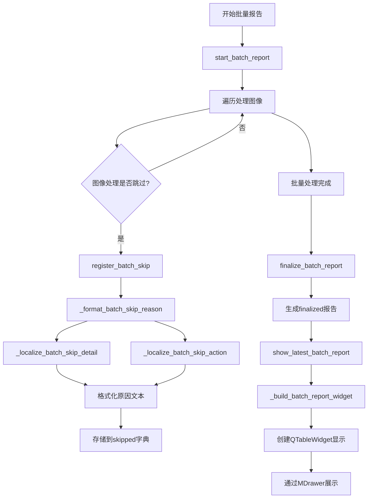

## 类结构

```
BatchReportController (批量报告控制器)
├── 字段
│   ├── main: ComicTranslate
│   ├── _current_batch_report: dict | None
│   ├── _latest_batch_report: dict | None
│   └── _batch_report_drawer: MDrawer | None
└── 方法
    ├── start_batch_report
    ├── register_batch_skip
    ├── finalize_batch_report
    ├── show_latest_batch_report
    ├── shutdown
    ├── _sanitize_batch_skip_error
    ├── _is_content_flagged_error_text
    ├── _is_user_skip_reason
    ├── _is_no_text_detection_skip
    ├── _localize_batch_skip_detail
    ├── _localize_batch_skip_action
    ├── _format_batch_skip_reason
    ├── _open_image_from_batch_report
    ├── _open_report_row_image
    └── _build_batch_report_widget
```

## 全局变量及字段


### `os`
    
操作系统模块，用于文件路径操作

类型：`module`
    


### `datetime`
    
日期时间模块，用于记录时间戳

类型：`module`
    


### `TYPE_CHECKING`
    
类型检查标志，用于类型提示

类型：`bool`
    


### `QtCore`
    
PySide6核心模块

类型：`module`
    


### `QtWidgets`
    
PySide6控件模块

类型：`module`
    


### `MDrawer`
    
抽屉组件，用于显示报告面板

类型：`class`
    


### `MMessage`
    
消息提示组件，用于显示警告和信息

类型：`class`
    


### `BatchReportController.main`
    
主控制器引用

类型：`ComicTranslate`
    


### `BatchReportController._current_batch_report`
    
当前进行中的批量报告

类型：`dict | None`
    


### `BatchReportController._latest_batch_report`
    
最新完成的批量报告

类型：`dict | None`
    


### `BatchReportController._batch_report_drawer`
    
报告抽屉组件

类型：`MDrawer | None`
    
    

## 全局函数及方法


### `BatchReportController.__init__`

该方法是 `BatchReportController` 类的构造函数，用于初始化批量报告控制器的实例。它接收主控制器引用，并初始化相关的内部状态变量，包括当前批次报告、最新批次报告以及UI抽屉组件。

参数：

-  `main`：`ComicTranslate`，主控制器对象的引用，用于访问应用程序的主要功能和状态

返回值：`None`，构造函数不返回任何值

#### 流程图

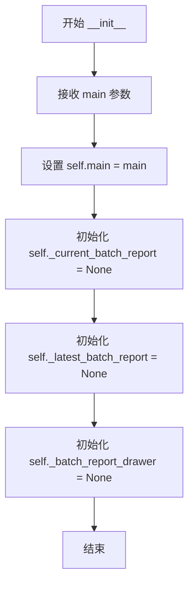

#### 带注释源码

```
def __init__(self, main: ComicTranslate):
    """
    初始化 BatchReportController 实例
    
    参数:
        main: ComicTranslate 类型，主控制器对象的引用
    """
    # 存储对主控制器的引用，用于访问应用程序的主要功能
    self.main = main
    
    # 当前正在进行的批次报告，初始为 None
    self._current_batch_report = None
    
    # 最新的已完成批次报告，初始为 None
    self._latest_batch_report = None
    
    # UI 抽屉组件，用于显示批次报告，初始为 None（未创建）
    self._batch_report_drawer: MDrawer | None = None
```

#### 关联类信息

**类名**: `BatchReportController`

**类字段**:

| 字段名称 | 类型 | 描述 |
|---------|------|------|
| `main` | `ComicTranslate` | 主控制器对象的引用 |
| `_current_batch_report` | `dict \| None` | 当前正在进行的批次报告 |
| `_latest_batch_report` | `dict \| None` | 最新的已完成批次报告 |
| `_batch_report_drawer` | `MDrawer \| None` | 用于显示批次报告的UI抽屉组件 |

**类方法** (部分关键方法):

| 方法名称 | 功能描述 |
|---------|---------|
| `start_batch_report` | 启动新的批次报告，记录要处理的图片路径 |
| `register_batch_skip` | 注册跳过的图片及其原因 |
| `finalize_batch_report` | 完成批次报告，生成统计数据 |
| `show_latest_batch_report` | 显示最新的批次报告UI |
| `shutdown` | 关闭并清理批次报告相关的资源 |


### `BatchReportController.start_batch_report`

该方法负责初始化批处理报告，过滤掉用户标记为跳过的图片路径，并创建一个包含开始时间、追踪路径集合和跳过记录的内部报告对象。

参数：

- `batch_paths`：`list[str]`，待处理的图片路径列表

返回值：`None`，无返回值（更新内部状态）

#### 流程图

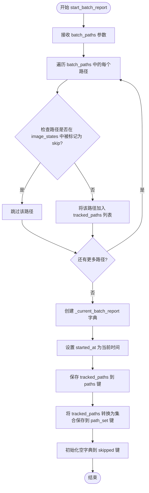

#### 带注释源码

```python
def start_batch_report(self, batch_paths: list[str]):
    """
    初始化批处理报告，过滤掉用户标记为跳过的图片路径。
    
    Args:
        batch_paths: 待处理的图片路径列表
        
    Returns:
        None
        
    Note:
        该方法仅初始化报告数据结构，实际的跳过记录通过 register_batch_skip 方法添加。
    """
    # 过滤路径列表，只保留未被用户标记为跳过的路径
    # image_states 是一个字典，存储每个图片的状态信息
    # skip 字段表示用户是否手动选择跳过该图片
    tracked_paths = [
        path
        for path in batch_paths
        if not self.main.image_states.get(path, {}).get("skip", False)
    ]
    
    # 初始化当前批处理报告对象
    # started_at: 批处理开始时间
    # paths: 追踪的图片路径列表（已过滤跳过的路径）
    # path_set: 用于快速查找的路径集合
    # skipped: 存储处理过程中被跳过的图片及其原因
    self._current_batch_report = {
        "started_at": datetime.now(),
        "paths": tracked_paths,
        "path_set": set(tracked_paths),
        "skipped": {},
    }
```


### `BatchReportController._sanitize_batch_skip_error`

该方法负责对批处理操作中产生的原始错误信息进行“清洗”和简化。其核心逻辑是遍历错误字符串的每一行，过滤掉 Python 异常堆栈中的冗余信息（如文件路径、Traceback 标记等），提取出最顶层的错误描述，并处理可能过长的文本，以便在前端 UI 中以简洁的形式展示。

参数：
-  `error`：`str`，需要清理的原始错误字符串（可能包含多行堆栈跟踪）。

返回值：`str`，清理后仅包含核心错误描述的字符串。如果未找到有效描述行（如仅有堆栈跟踪），则返回空字符串。

#### 流程图

```mermaid
flowchart TD
    A([Start]) --> B{error is empty?}
    B -- Yes --> C[Return ""]
    B -- No --> D[Split error by newlines]
    
    D --> E{Loop through lines}
    
    E --> F{Line is empty?}
    F -- Yes --> E
    F -- No --> G{Starts with 'traceback'? (case-insensitive)}
    
    G -- Yes --> H[Break loop]
    G -- No --> I{Starts with 'File "...'? (Path)}
    
    I -- Yes --> E
    I -- No --> J{Starts with 'During handling...'? (Context)}
    
    J -- Yes --> E
    J -- No --> K{Length > 180?}
    
    K -- Yes --> L[Return line truncated to 177 chars + '...']
    K -- No --> M[Return line content]
    
    H --> N{Loop Finished?}
    N -- Yes --> C
    
    C --> Z([End])
    L --> Z
    M --> Z
```

#### 带注释源码

```python
def _sanitize_batch_skip_error(self, error: str) -> str:
    """
    清理错误信息，提取关键描述行。
    旨在去除 Python 异常堆栈的干扰，仅保留错误类型和消息。
    """
    # 1. 边界检查：如果错误为空，直接返回空字符串
    if not error:
        return ""

    # 2. 遍历错误字符串的每一行
    for raw_line in str(error).splitlines():
        line = raw_line.strip()
        
        # 2.1 跳过空行
        if not line:
            continue
        
        # 2.2 如果遇到 Traceback 标记，说明已经是堆栈部分，停止提取
        if line.lower().startswith("traceback"):
            break
        
        # 2.3 跳过文件路径行 (Python 异常堆栈常见格式)
        if line.startswith('File "') or line.startswith("File '"):
            continue
            
        # 2.4 跳过异常上下文行
        if line.startswith("During handling of the above exception"):
            continue
            
        # 2.5 长度截断处理：为了 UI 美观，如果描述过长则截断
        if len(line) > 180:
            return f"{line[:177]}..."
            
        # 2.6 返回找到的第一行有意义的错误描述
        return line
        
    # 3. 如果循环结束或中断（例如只有 traceback），返回空字符串
    return ""
```


### `BatchReportController._is_content_flagged_error_text`

该方法是一个私有辅助方法，用于检查传入的错误文本是否包含与 AI 安全过滤器相关的特定关键词（如“flagged as unsafe”、“safety filters”等），以判断当前错误是否为内容安全策略违规。

参数：

-  `error`：`str`，需要检查的原始错误信息字符串。

返回值：`bool`，如果错误文本中包含与内容安全相关的关键词则返回 `True`，否则返回 `False`。

#### 流程图

```mermaid
flowchart TD
    A([Start]) --> B[Input error string]
    B --> C{error is falsy?}
    C -->|Yes| D[Set error to ""]
    C -->|No| E[Convert error to lowercase]
    D --> E
    E --> F{Check keywords in lowered text}
    F -->|Contains "flagged as unsafe"| G[Return True]
    F -->|Contains "content was flagged"| G
    F -->|Contains "safety filters"| G
    F -->|None match| H[Return False]
    G --> I([End])
    H --> I
```

#### 带注释源码

```python
def _is_content_flagged_error_text(self, error: str) -> bool:
    """
    检查错误文本是否表示 AI 提供商因安全策略而标记了内容。

    参数:
        error (str): 原始错误字符串。

    返回:
        bool: 如果错误涉及内容安全标记则返回 True，否则返回 False。
    """
    # 使用 (error or "") 处理可能的 None 值，并转换为小写以进行不区分大小写的匹配
    lowered = (error or "").lower()
    
    # 检查错误文本中是否包含特定的安全策略相关关键词
    return (
        "flagged as unsafe" in lowered
        or "content was flagged" in lowered
        or "safety filters" in lowered
    )
```


### `BatchReportController._is_user_skip_reason`

该方法用于判断给定的跳过原因（`skip_reason`）和错误信息（`error`）组合后是否表明这是由用户主动操作导致的跳过（例如用户手动标记为跳过）。如果检测到包含用户跳过的标识，则返回 `True`，否则返回 `False`。这主要用于在生成批处理报告时，过滤掉用户主动跳过的图片，专注于记录因工具或服务错误导致的跳过。

参数：

- `skip_reason`：`str`，触发跳过的原因描述（例如 "OCR", "Translator", "user-skipped"）。
- `error`：`str`，（可选）捕获的异常或错误信息文本，默认为空字符串。

返回值：`bool`，如果组合文本中包含 "user-skipped" 或 "user skipped"（不区分大小写），则返回 `True`，否则返回 `False`。

#### 流程图

```mermaid
flowchart TD
    A([开始 _is_user_skip_reason]) --> B[输入: skip_reason, error]
    B --> C[拼接并转小写: text = f&quot;{skip_reason} {error}&quot;.lower()]
    C --> D{text 中是否包含<br>'user-skipped' 或 'user skipped'?}
    D -- 是 --> E[返回 True]
    D -- 否 --> F[返回 False]
```

#### 带注释源码

```python
def _is_user_skip_reason(self, skip_reason: str, error: str = "") -> bool:
    """
    判断是否为用户主动跳过的操作。

    将跳过原因和错误信息合并后转为小写，检查是否包含
    用户主动跳过的关键词，以此区分系统错误导致的跳过。

    参数:
        skip_reason: 跳过的原因字符串。
        error: 相关的错误信息字符串（可选）。

    返回:
        bool: 如果是用户主动跳过则返回 True，否则返回 False。
    """
    # 将原因和错误信息合并，并转为小写以进行不区分大小写的匹配
    text = f"{skip_reason} {error}".lower()
    # 检查是否包含 "user-skipped" (连字符) 或 "user skipped" (空格)
    return ("user-skipped" in text) or ("user skipped" in text)
```


### `BatchReportController._is_no_text_detection_skip`

该方法用于判断给定的跳过原因是否为"无文本块检测"类型，即跳过原因等于字符串"Text Blocks"时返回 True，否则返回 False。

参数：

- `skip_reason`：`str`，需要检查的跳过原因字符串

返回值：`bool`，如果跳过原因等于"Text Blocks"则返回 True，否则返回 False

#### 流程图

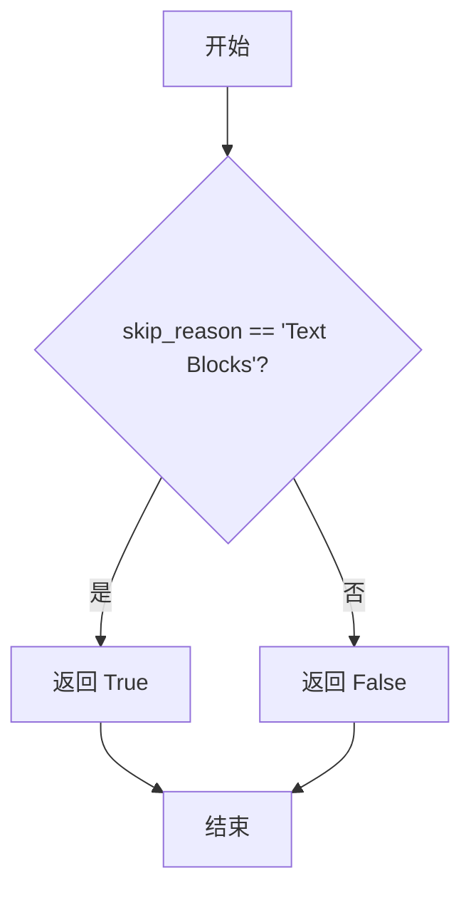

#### 带注释源码

```python
def _is_no_text_detection_skip(self, skip_reason: str) -> bool:
    """
    判断给定的跳过原因是否为"无文本块检测"类型。
    
    Args:
        skip_reason: 需要检查的跳过原因字符串
        
    Returns:
        bool: 如果跳过原因等于"Text Blocks"则返回 True，否则返回 False
    """
    return skip_reason == "Text Blocks"
```


### `BatchReportController._localize_batch_skip_detail`

该方法负责将批处理过程中产生的原始错误信息（字符串）进行清洗、识别，并转换为对终端用户友好的本地化（国际化）描述文本。它通过模式匹配识别常见的 API 或网络错误，并将翻译工作委托给 `self.main.tr` 以支持多语言界面。

参数：
- `error`：`str`，原始的异常或错误信息字符串。

返回值：`str`，一段本地化的、简短的错误描述文本（例如“请求超时”、“认证失败”），如果无法识别则返回默认错误信息。

#### 流程图

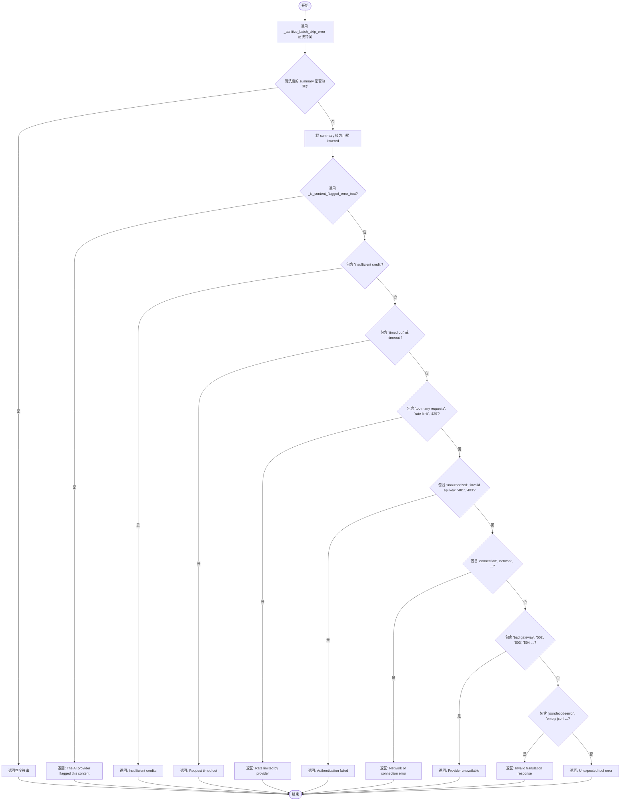

#### 带注释源码

```python
def _localize_batch_skip_detail(self, error: str) -> str:
    """
    将批处理中的原始错误信息转换为用户可读的本地化错误描述。
    
    处理流程：
    1. 首先调用 _sanitize_batch_skip_error 对原始错误进行清洗（去除堆栈跟踪、文件路径等噪音）。
    2. 如果清洗后无有效内容，直接返回空字符串。
    3. 检查错误是否包含特定的关键字或模式（如超时、余额不足、API错误等）。
    4. 匹配成功后，调用 self.main.tr() 返回对应的翻译文本。
    5. 如果无法匹配任何已知模式，返回默认的 "Unexpected tool error"。
    """
    # 1. 清洗错误信息，提取核心摘要
    summary = self._sanitize_batch_skip_error(error)
    
    # 2. 如果没有有效摘要，直接返回，避免显示无意义的空信息
    if not summary:
        return ""

    lowered = summary.lower()

    # 3. 特定内容安全错误优先处理
    if self._is_content_flagged_error_text(summary):
        return self.main.tr("The AI provider flagged this content")
    
    # 4. 检查余额相关错误
    if "insufficient credit" in lowered:
        return self.main.tr("Insufficient credits")
    
    # 5. 检查超时错误
    if "timed out" in lowered or "timeout" in lowered:
        return self.main.tr("Request timed out")
    
    # 6. 检查请求频率限制 (429)
    if (
        "too many requests" in lowered
        or "rate limit" in lowered
        or "429" in lowered
    ):
        return self.main.tr("Rate limited by provider")
    
    # 7. 检查认证授权错误 (401, 403)
    if (
        "unauthorized" in lowered
        or "invalid api key" in lowered
        or "401" in lowered
        or "403" in lowered
    ):
        return self.main.tr("Authentication failed")
    
    # 8. 检查网络连接错误
    if (
        "connection" in lowered
        or "network" in lowered
        or "name or service not known" in lowered
        or "failed to establish" in lowered
    ):
        return self.main.tr("Network or connection error")
    
    # 9. 检查服务端不可用错误 (502, 503, 504)
    if (
        "bad gateway" in lowered
        or "service unavailable" in lowered
        or "gateway timeout" in lowered
        or "502" in lowered
        or "503" in lowered
        or "504" in lowered
    ):
        return self.main.tr("Provider unavailable")
    
    # 10. 检查 JSON 解析错误（通常为 API 返回异常）
    if (
        "jsondecodeerror" in lowered
        or "empty json" in lowered
        or "expecting value" in lowered
    ):
        return self.main.tr("Invalid translation response")
    
    # 11. 默认兜底错误
    return self.main.tr("Unexpected tool error")
```


### `BatchReportController._localize_batch_skip_action`

该方法根据错误文本和跳过原因生成用户友好的操作建议，帮助用户理解批处理跳过的原因并提供下一步操作指引。

参数：

- `skip_reason`：`str`，导致跳过操作的原因（如 "OCR"、"Translator"、"Text Blocks" 等）
- `error`：`str`，详细的错误信息文本

返回值：`str`，本地化的用户操作建议文本

#### 流程图

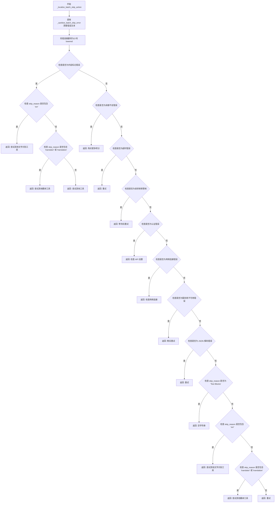

#### 带注释源码

```python
def _localize_batch_skip_action(self, skip_reason: str, error: str) -> str:
    """
    根据错误信息和跳过原因生成用户友好的操作建议。
    
    该方法是批处理报告系统的一部分，用于将技术性错误转换为
    用户可理解的行动指引。
    
    Args:
        skip_reason: str，导致跳过操作的原因标识符
                     常见值: "Text Blocks", "OCR", "Translator", 
                     "OCR Chunk Failed", "Translation Chunk Failed"
        error: str，完整的错误信息字符串，可能包含堆栈跟踪
    
    Returns:
        str，本地化的用户操作建议。如果无具体建议则返回空字符串。
    """
    # 步骤1: 清理错误文本，去除堆栈跟踪等冗余信息
    summary = self._sanitize_batch_skip_error(error)
    
    # 步骤2: 转换为小写以进行不区分大小写的匹配
    lowered = summary.lower()

    # 步骤3: 检查是否为内容安全标记错误
    # 这是最高优先级的情况，可能需要根据跳过原因提供不同建议
    if self._is_content_flagged_error_text(summary):
        # 根据跳过原因类型提供针对性建议
        if "ocr" in (skip_reason or "").lower():
            # 内容被标记且发生在 OCR 阶段
            return self.main.tr("Try another text recognition tool")
        if "translator" in (skip_reason or "").lower() or "translation" in (
            skip_reason or ""
        ).lower():
            # 内容被标记且发生在翻译阶段
            return self.main.tr("Try another translator")
        # 默认建议
        return self.main.tr("Try another tool")
    
    # 步骤4: 检查余额不足错误
    if "insufficient credit" in lowered:
        return self.main.tr("Buy more credits")
    
    # 步骤5: 检查超时错误
    if "timed out" in lowered or "timeout" in lowered:
        return self.main.tr("Try again")
    
    # 步骤6: 检查请求频率限制（Rate Limit）
    if (
        "too many requests" in lowered
        or "rate limit" in lowered
        or "429" in lowered
    ):
        return self.main.tr("Wait and try again")
    
    # 步骤7: 检查认证失败错误
    if (
        "unauthorized" in lowered
        or "invalid api key" in lowered
        or "401" in lowered
        or "403" in lowered
    ):
        return self.main.tr("Check API settings")
    
    # 步骤8: 检查网络连接错误
    if (
        "connection" in lowered
        or "network" in lowered
        or "name or service not known" in lowered
        or "failed to establish" in lowered
    ):
        return self.main.tr("Check your connection")
    
    # 步骤9: 检查服务端不可用错误（5xx 系列）
    if (
        "bad gateway" in lowered
        or "service unavailable" in lowered
        or "gateway timeout" in lowered
        or "502" in lowered
        or "503" in lowered
        or "504" in lowered
    ):
        return self.main.tr("Try again later")
    
    # 步骤10: 检查 JSON 解析错误
    if (
        "jsondecodeerror" in lowered
        or "empty json" in lowered
        or "expecting value" in lowered
    ):
        return self.main.tr("Try again")

    # 步骤11: 如果没有具体错误，检查跳过原因本身
    # "Text Blocks" 表示未检测到文字，无需操作建议
    if skip_reason == "Text Blocks":
        return ""
    
    # 步骤12: 根据跳过原因类型提供通用建议
    if "ocr" in (skip_reason or "").lower():
        return self.main.tr("Try another text recognition tool")
    if "translator" in (skip_reason or "").lower() or "translation" in (
        skip_reason or ""
    ).lower():
        return self.main.tr("Try another translator")
    
    # 步骤13: 默认返回重试建议
    return self.main.tr("Try again")
```


### `BatchReportController._format_batch_skip_reason`

该方法用于将批量处理中图像被跳过的原因格式化 为用户可读的描述文本。它通过本地化错误详情和建议操作，并结合跳过原因的映射表，生成包含原因、细节和解决方案的完整描述信息返回给调用者。

参数：

- `skip_reason`：`str`，表示图像被跳过的原因类型（如"Text Blocks"、"OCR"、"Translator"等）
- `error`：`str`，表示实际的错误信息或异常内容

返回值：`str`，返回格式化后的完整原因描述字符串，包含基础原因、错误详情（如有）和建议操作（如有）

#### 流程图

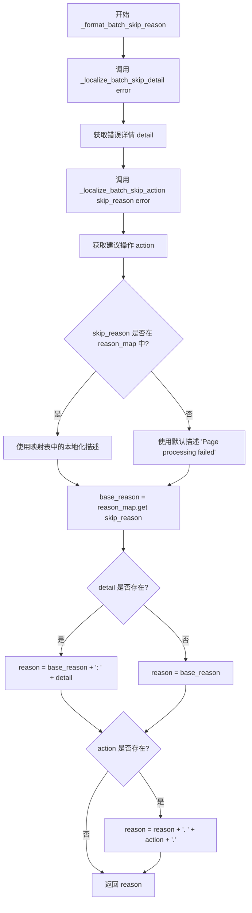

#### 带注释源码

```python
def _format_batch_skip_reason(self, skip_reason: str, error: str) -> str:
    """
    格式化批量跳过原因，生成用户可读的完整描述
    
    参数:
        skip_reason: 跳过原因的类型标识
        error: 原始错误信息
    返回:
        格式化的原因描述字符串
    """
    # 调用内部方法将错误信息本地化为用户友好的描述
    detail = self._localize_batch_skip_detail(error)
    
    # 根据跳过原因和错误信息获取建议的操作
    action = self._localize_batch_skip_action(skip_reason, error)
    
    # 建立跳过原因类型到本地化描述的映射字典
    reason_map = {
        "Text Blocks": self.main.tr("No text blocks detected"),  # 未检测到文本块
        "OCR": self.main.tr("Text recognition failed"),           # 文字识别失败
        "Translator": self.main.tr("Translation failed"),         # 翻译失败
        "OCR Chunk Failed": self.main.tr("Webtoon text recognition chunk failed"),  # 条漫文字识别失败
        "Translation Chunk Failed": self.main.tr(
            "Webtoon translation chunk failed"
        ),  # 条漫翻译失败
    }
    
    # 从映射表中获取基础原因描述，若未匹配则使用默认描述
    base_reason = reason_map.get(skip_reason, self.main.tr("Page processing failed"))
    
    # 初始原因为基础原因
    reason = base_reason
    
    # 如果存在错误详情，则追加到原因描述中
    if detail:
        reason = f"{base_reason}: {detail}"
    
    # 如果存在建议操作，则追加到原因描述末尾
    if action:
        reason = f"{reason}. {action}."
    
    return reason
```


### `BatchReportController.register_batch_skip`

该方法用于在批处理翻译过程中记录图像被跳过的信息，过滤用户主动跳过和无文本检测的情况，并将标准化的跳过原因追加到当前批处理报告中。

参数：

- `image_path`：`str`，待跳过图像的完整文件路径
- `skip_reason`：`str`，跳过原因的类型标识（如 "OCR"、"Translator" 等）
- `error`：`str`，底层错误或异常信息，用于生成详细的跳过描述

返回值：`None`，该方法直接修改内部状态，不返回任何值

#### 流程图

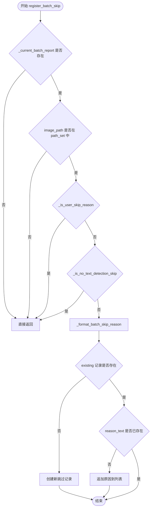

#### 带注释源码

```
def register_batch_skip(self, image_path: str, skip_reason: str, error: str):
    """
    记录批处理过程中被跳过的图像
    
    参数:
        image_path: 图像的完整路径
        skip_reason: 跳过原因标识
        error: 底层错误信息
    """
    # 获取当前批处理报告对象
    report = self._current_batch_report
    
    # 若当前无活跃的批处理报告，直接返回
    if not report:
        return
    
    # 检查该图像是否在当前批处理的路径集合中
    if image_path not in report["path_set"]:
        return
    
    # 检查是否为用户主动选择跳过（用户跳过的记录不纳入报告）
    if self._is_user_skip_reason(skip_reason, error):
        return
    
    # 检查是否为无文本检测导致的跳过（此类跳过不计入报告）
    if self._is_no_text_detection_skip(skip_reason):
        return

    # 根据跳过原因和错误信息生成格式化的描述文本
    reason_text = self._format_batch_skip_reason(skip_reason, error)
    
    # 尝试获取该图像已有的跳过记录
    existing = report["skipped"].get(image_path)
    
    # 若无现有记录，则创建新的跳过记录结构
    if existing is None:
        report["skipped"][image_path] = {
            "image_path": image_path,
            "image_name": os.path.basename(image_path),
            "reasons": [reason_text] if reason_text else [],
        }
        return

    # 若已有记录且新原因文本不存在，则追加到原因列表
    if reason_text and reason_text not in existing["reasons"]:
        existing["reasons"].append(reason_text)
```


### `BatchReportController.finalize_batch_report`

该方法作为批处理流程的收尾阶段，负责汇总批处理期间的统计数据（包括总图片数、跳过数、完成数），对跳过条目进行排序整理，并生成一份包含时间戳和详细错误原因的最终报告。该方法还会重置当前的批处理状态，并将生成的报告缓存至历史记录，最后通过启用UI按钮来允许用户查看结果。

参数：

- `was_cancelled`：`bool`，表示批处理任务是否被用户手动取消。

返回值：`dict | None`，返回包含批处理统计信息（开始时间、结束时间、总数、跳过数、完成数及详细条目）的字典；如果当前没有正在进行的批处理任务（即 `_current_batch_report` 为空），则返回 `None`。

#### 流程图

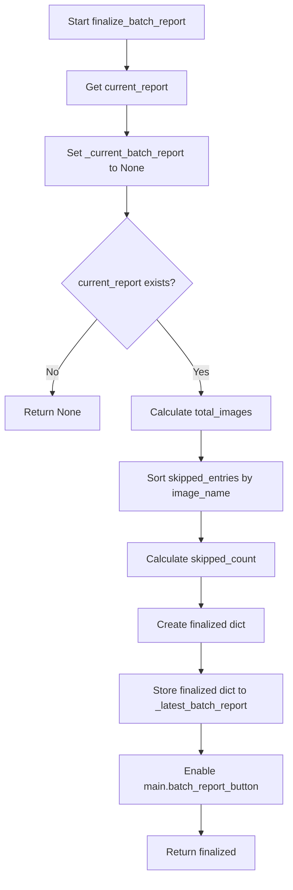

#### 带注释源码

```python
def finalize_batch_report(self, was_cancelled: bool):
    """
    完成批处理报告的生成与汇总。

    1. 提取当前批处理数据。
    2. 立即重置当前批处理状态（_current_batch_report 设为 None），防止数据残留。
    3. 计算统计数据：总图片数、跳过图片数（通过排序后的条目计算）、完成数。
    4. 封装最终报告对象，包含时间戳、执行状态及详细列表。
    5. 将报告缓存到 _latest_batch_report 供 UI 后续读取。
    6. 启用主界面的“查看报告”按钮。

    参数:
        was_cancelled: bool, 标记批处理过程是否因用户中断而结束。

    返回:
        dict | None: 包含 'started_at', 'finished_at', 'was_cancelled', 
        'total_images', 'skipped_count', 'completed_count', 'skipped_entries' 的字典。
        如果没有进行中的批处理，返回 None。
    """
    # 1. 获取当前批处理报告的引用
    report = self._current_batch_report
    
    # 2. 重置内部状态，标记批处理已结束
    self._current_batch_report = None
    
    # 3. 防御性检查：如果报告不存在（例如未曾启动批处理），直接返回
    if not report:
        return None

    # 4. 提取路径列表并计算总图片数
    total_images = len(report["paths"])
    
    # 5. 获取跳过的条目并按图片名称排序（忽略大小写），保证UI显示的一致性
    # report["skipped"] 是一个字典，值为包含 image_path, image_name, reasons 的对象
    skipped_entries = sorted(
        report["skipped"].values(),
        key=lambda entry: entry["image_name"].lower(),
    )
    skipped_count = len(skipped_entries)

    # 6. 构建最终报告数据结构
    finalized = {
        "started_at": report["started_at"],         # 批处理开始时间
        "finished_at": datetime.now(),              # 批处理结束时间（当前时刻）
        "was_cancelled": bool(was_cancelled),       # 任务是否被取消
        "total_images": total_images,               # 总处理图片数
        "skipped_count": skipped_count,            # 跳过的图片数
        "completed_count": max(0, total_images - skipped_count), # 成功完成的图片数
        "skipped_entries": skipped_entries,        # 详细的跳过原因列表
    }
    
    # 7. 将报告存入实例变量，以便 UI 层后续通过 show_latest_batch_report 读取
    self._latest_batch_report = finalized
    
    # 8. 更新 UI：启用主窗口中的“批处理报告”按钮，允许用户查看结果
    self.main.batch_report_button.setEnabled(True)
    
    return finalized
```

#### 关键技术点与设计备注

1.  **状态管理 (State Management)**:
    *   该方法严格遵守“获取即销毁”（Fetch-and-Clear）的模式。在读取 `self._current_batch_report` 后立即将其置为 `None`。这确保了如果用户在查看报告后再次启动批处理，旧的报告数据不会与新数据混淆。
    *   使用了 `_current_batch_report`（临时态）和 `_latest_batch_report`（持久态）的双缓冲设计。

2.  **数据一致性**:
    *   在返回统计数据前，对 `skipped_entries` 进行了排序。这对于 UI 展示至关重要，因为字典在 Python 3.7+ 虽然保持插入顺序，但用户通常期望看到按字母顺序排列的文件列表。
    *   `completed_count` 使用了 `max(0, ...)` 进行保护，尽管逻辑上不应为负，但这是防御性编程的体现，防止极端边界情况下的计数错误。

3.  **与 UI 的耦合**:
    *   方法内部直接调用了 `self.main.batch_report_button.setEnabled(True)`。这虽然方便，但增加了控制器与视图的耦合度。如果未来需要脱离 GUI 使用此控制器逻辑（例如单元测试），这部分代码可能会导致错误。理想情况下，可以将此 UI 更新逻辑剥离至回调或信号槽中，但在当前的 Qt  MVC 架构下，直接控制是常见做法。

4.  **潜在的优化空间**:
    *   如果批处理图片数量极其巨大（例如成千上万张），在 `finalize_batch_report` 中对所有 `skipped_entries` 进行排序可能会产生性能开销。不过通常批处理报告的数量级较小，此问题可以忽略不计。


### `BatchReportController._open_image_from_batch_report`

该方法用于从批处理报告中打开指定图片。它首先验证图片路径是否存在于当前项目内，若不存在则弹出警告；若存在，则定位图片索引并切换到主页面选中对应图片。

参数：

- `image_path`：`str`，需要打开的图片文件路径

返回值：`None`，无返回值（仅执行界面操作）

#### 流程图

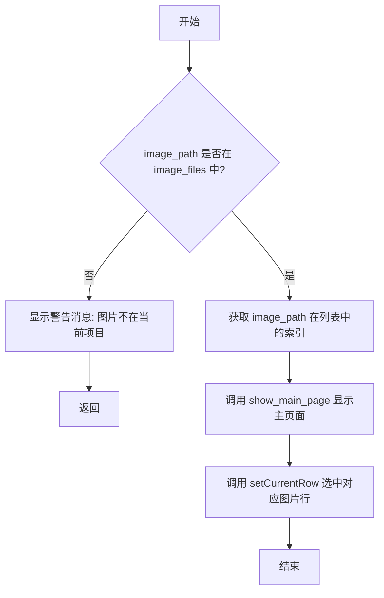

#### 带注释源码

```python
def _open_image_from_batch_report(self, image_path: str):
    """
    从批处理报告打开指定图片

    参数:
        image_path: 需要打开的图片文件路径
    """
    # 检查图片路径是否在当前项目的图片列表中
    if image_path not in self.main.image_files:
        # 图片不在当前项目中，显示警告提示用户
        MMessage.warning(
            text=self.main.tr("This image is not in the current project."),
            parent=self.main,
            duration=5,
            closable=True,
        )
        return  # 直接返回，不执行后续操作

    # 图片存在于项目中，获取其在图片文件列表中的索引位置
    index = self.main.image_files.index(image_path)

    # 切换到主页面视图
    self.main.show_main_page()

    # 在页面列表控件中选中对应的图片行
    self.main.page_list.setCurrentRow(index)
```


### `BatchReportController._open_report_row_image`

该方法是一个事件回调函数，充当批处理报告表格（QTableWidget）与应用主视图之间的桥梁。当用户在批处理报告抽屉中双击某一行时，此方法被触发，负责提取该行关联的图像路径，并导航至主界面中对应的图像页面。

参数：

- `table`：`QtWidgets.QTableWidget`，用户双击的表格控件，用于从中提取数据。
- `row`：`int`，双击行的索引。

返回值：`None`，该方法直接操作UI和调用内部方法，不返回数据。

#### 流程图

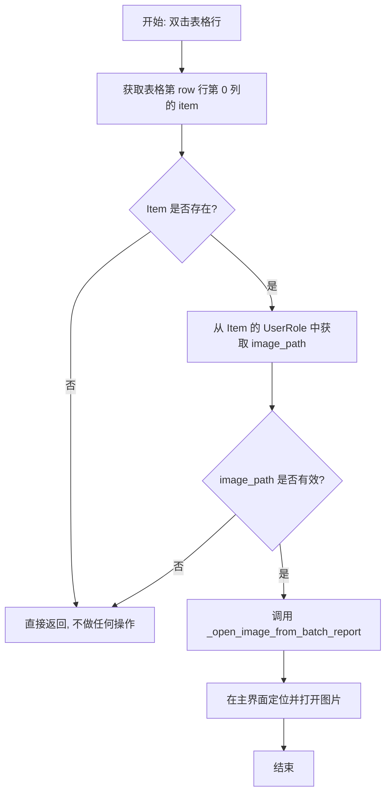

#### 带注释源码

```python
def _open_report_row_image(self, table: QtWidgets.QTableWidget, row: int):
    """
    处理批处理报告表格中的双击事件。
    提取选中行的图像路径，并尝试在主界面中打开该图像。

    参数:
        table: 包含图像列表的 QTableWidget 对象。
        row: 用户双击的行索引 (int)。
    """
    # 1. 获取表格指定行第一列的数据项
    item = table.item(row, 0)
    
    # 2. 防御性检查：如果单元格为空（例如点击了空白区域），则直接退出
    if item is None:
        return
    
    # 3. 提取存储在 UserRole 中的图像路径
    #    (在创建表格时，图像路径通常绑定在 UserRole 数据角色中)
    image_path = item.data(QtCore.Qt.ItemDataRole.UserRole)
    
    # 4. 检查路径有效性
    if not image_path:
        return
    
    # 5. 触发内部方法，将控制权交给视图切换逻辑
    self._open_image_from_batch_report(image_path)
```


### `BatchReportController._build_batch_report_widget`

该方法负责构建批处理报告的 UI 组件。它接收一个包含批处理报告信息的字典，创建一个容器 widget，包含报告的元信息（状态、完成时间）、统计卡片展示图片总数和跳过数量，以及一个表格展示被跳过的图片及其原因（支持双击打开对应页面）。

参数：

- `report`：`dict`，批处理报告数据字典，包含 `was_cancelled`、`finished_at`、`total_images`、`skipped_count`、`skipped_entries` 等字段

返回值：`QtWidgets.QWidget`，返回构建完成的批处理报告 UI 容器组件

#### 流程图

```mermaid
flowchart TD
    A[开始构建批处理报告组件] --> B[创建容器 QWidget 和 QVBoxLayout]
    B --> C[设置布局边距和间距]
    C --> D[根据 was_cancelled 确定状态文本]
    D --> E[创建元信息标签: 状态 | 更新时间]
    E --> F[创建统计卡片布局 make_stat_card]
    F --> G[添加'总数'统计卡片]
    G --> H[添加'跳过数'统计卡片]
    H --> I{检查 skipped_entries 是否有数据}
    I -->|是| J[创建提示标签]
    J --> K[创建 QTableWidget 表格]
    K --> L[设置表格列数和表头]
    L --> M[配置表格属性: 只读、行选择、无垂直表头等]
    M --> N[循环遍历 skipped_entries]
    N --> O[为每行填充图片名称和原因]
    O --> P[连接双击事件到打开图片方法]
    P --> Q[将表格添加到布局]
    I -->|否| R[创建空状态标签]
    R --> S[将标签添加到布局]
    S --> T[添加弹性空间]
    T --> U[返回容器组件]
    Q --> T
```

#### 带注释源码

```python
def _build_batch_report_widget(self, report: dict) -> QtWidgets.QWidget:
    # 创建主容器 widget，用于放置所有报告组件
    container = QtWidgets.QWidget()
    # 创建垂直布局管理器
    layout = QtWidgets.QVBoxLayout(container)
    # 设置布局的边距为 8 像素
    layout.setContentsMargins(8, 8, 8, 8)
    # 设置布局内组件之间的间距为 10
    layout.setSpacing(10)

    # 根据报告的取消状态确定显示的文本
    status_text = self.main.tr("Cancelled") if report["was_cancelled"] else self.main.tr("Completed")
    # 格式化完成时间
    finished = report["finished_at"].strftime("%Y-%m-%d %H:%M")
    # 创建元信息标签，显示状态和完成时间
    meta_label = QtWidgets.QLabel(
        self.main.tr("{0}  |  Updated {1}").format(status_text, finished)
    )
    # 设置标签的样式颜色
    meta_label.setStyleSheet("color: rgba(130,130,130,0.95);")
    # 将元信息标签添加到布局
    layout.addWidget(meta_label)

    # 创建水平布局用于放置统计卡片
    stats_layout = QtWidgets.QHBoxLayout()
    # 设置统计卡片之间的间距
    stats_layout.setSpacing(8)

    # 定义内部函数：创建统计卡片
    def make_stat_card(label: str, value: str) -> QtWidgets.QFrame:
        # 创建卡片框架
        card = QtWidgets.QFrame()
        # 设置卡片对象名称
        card.setObjectName("batchStatCard")
        # 创建卡片的垂直布局
        card_layout = QtWidgets.QVBoxLayout(card)
        # 设置卡片布局边距
        card_layout.setContentsMargins(10, 8, 10, 8)
        # 设置卡片内组件间距
        card_layout.setSpacing(2)

        # 创建显示数值的标签
        value_label = QtWidgets.QLabel(value)
        value_label.setObjectName("batchStatValue")
        # 设置数值标签居中对齐
        value_label.setAlignment(QtCore.Qt.AlignmentFlag.AlignCenter)

        # 创建显示标签文本的标签
        label_widget = QtWidgets.QLabel(label)
        label_widget.setObjectName("batchStatLabel")
        # 设置标签文本居中对齐
        label_widget.setAlignment(QtCore.Qt.AlignmentFlag.AlignCenter)

        # 将数值标签和文本标签添加到卡片布局
        card_layout.addWidget(value_label)
        card_layout.addWidget(label_widget)
        return card

    # 添加总数统计卡片
    stats_layout.addWidget(make_stat_card(self.main.tr("Total"), str(report["total_images"])))
    # 添加跳过数统计卡片
    stats_layout.addWidget(make_stat_card(self.main.tr("Skipped"), str(report["skipped_count"])))
    # 将统计卡片布局添加到主布局
    layout.addLayout(stats_layout)

    # 设置容器样式表，包含卡片边框、圆角、数值字体大小和标签颜色
    container.setStyleSheet(
        "QFrame#batchStatCard { border: 1px solid rgba(128,128,128,0.35); border-radius: 8px; }"
        "QLabel#batchStatValue { font-size: 18px; font-weight: 600; }"
        "QLabel#batchStatLabel { color: rgba(140,140,140,0.95); font-size: 11px; }"
    )

    # 创建跳过图片的表头标签
    header_label = QtWidgets.QLabel(
        self.main.tr("Skipped Images ({0})").format(report["skipped_count"])
    )
    # 设置表头加粗
    header_label.setStyleSheet("font-weight: 600;")
    # 将表头标签添加到布局
    layout.addWidget(header_label)

    # 获取跳过的图片条目列表
    skipped_entries = report["skipped_entries"]
    # 检查是否有跳过的图片
    if skipped_entries:
        # 创建提示信息标签
        hint = QtWidgets.QLabel(self.main.tr("Double-click a row to open that page."))
        # 允许标签自动换行
        hint.setWordWrap(True)
        # 将提示标签添加到布局
        layout.addWidget(hint)

        # 创建表格组件，行数为跳过图片数量，列数为 2（图片名称、原因）
        table = QtWidgets.QTableWidget(len(skipped_entries), 2)
        # 设置表格水平表头标签
        table.setHorizontalHeaderLabels([self.main.tr("Image"), self.main.tr("Reason")])
        # 设置表格不可编辑
        table.setEditTriggers(QtWidgets.QAbstractItemView.EditTrigger.NoEditTriggers)
        # 设置选择行为为整行选择
        table.setSelectionBehavior(QtWidgets.QAbstractItemView.SelectionBehavior.SelectRows)
        # 设置选择模式为单选
        table.setSelectionMode(QtWidgets.QAbstractItemView.SelectionMode.SingleSelection)
        # 隐藏垂直表头
        table.verticalHeader().setVisible(False)
        # 让最后一列自动拉伸
        table.horizontalHeader().setStretchLastSection(True)
        # 设置第一列根据内容调整宽度
        table.horizontalHeader().setSectionResizeMode(
            0, QtWidgets.QHeaderView.ResizeMode.ResizeToContents
        )
        # 设置第二列自动拉伸填充
        table.horizontalHeader().setSectionResizeMode(1, QtWidgets.QHeaderView.ResizeMode.Stretch)
        # 禁用自动换行
        table.setWordWrap(False)
        # 设置垂直滚动模式为逐像素滚动
        table.setVerticalScrollMode(QtWidgets.QAbstractItemView.ScrollMode.ScrollPerPixel)
        # 设置垂直滚动条按需显示
        table.setVerticalScrollBarPolicy(QtCore.Qt.ScrollBarPolicy.ScrollBarAsNeeded)
        # 计算可见行数，范围在 4-12 行之间
        visible_rows = min(max(len(skipped_entries), 4), 12)
        # 计算表格高度：行数 * 28 + 36（表头高度）
        table_height = (visible_rows * 28) + 36
        # 设置表格最小高度
        table.setMinimumHeight(table_height)
        # 设置表格最大高度
        table.setMaximumHeight(table_height)

        # 遍历所有跳过的图片条目
        for row, entry in enumerate(skipped_entries):
            # 创建图片名称的表格项
            image_item = QtWidgets.QTableWidgetItem(entry["image_name"])
            # 将图片路径存储为用户角色数据
            image_item.setData(QtCore.Qt.ItemDataRole.UserRole, entry["image_path"])
            # 设置单元格的提示文本为完整路径
            image_item.setToolTip(entry["image_path"])
            # 将图片项添加到第一列
            table.setItem(row, 0, image_item)
            # 创建原因描述的表格项，多个原因用分号连接
            reason_item = QtWidgets.QTableWidgetItem(
                "; ".join(entry["reasons"]) or self.main.tr("Skipped")
            )
            # 设置原因项的提示文本
            reason_item.setToolTip(reason_item.text())
            # 将原因项添加到第二列
            table.setItem(row, 1, reason_item)

        # 连接表格双击事件到打开图片的方法
        table.itemDoubleClicked.connect(
            lambda item, t=table: self._open_report_row_image(t, item.row())
        )
        # 将表格添加到布局
        layout.addWidget(table)
    else:
        # 没有跳过的图片时，显示空状态标签
        empty_label = QtWidgets.QLabel(self.main.tr("No skipped images in this batch."))
        # 允许标签自动换行
        empty_label.setWordWrap(True)
        # 将空状态标签添加到布局
        layout.addWidget(empty_label)

    # 添加弹性空间，让内容顶部对齐
    layout.addStretch()
    # 返回构建完成的容器组件
    return container
```


### `BatchReportController.show_latest_batch_report`

该方法负责在用户界面上展示最新的批处理报告，通过创建或重用一个侧边抽屉（Drawer）组件来呈现批处理任务的统计信息，包括总图片数、跳过的图片数以及被跳过的图片详情列表。

参数： 无

返回值：`None`，无返回值（该方法直接操作UI组件）

#### 流程图

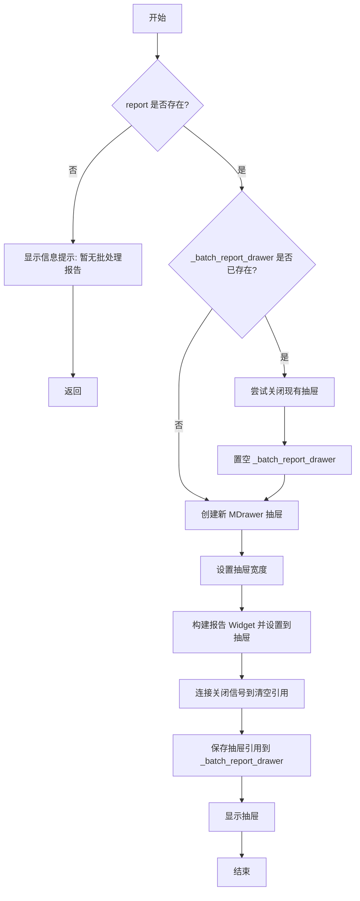

#### 带注释源码

```python
def show_latest_batch_report(self):
    """
    展示最新的批处理报告。
    如果没有报告，则显示提示信息；否则在侧边抽屉中展示详细统计。
    """
    # 获取最新的批处理报告
    report = self._latest_batch_report
    
    # 如果报告不存在（尚未生成或已清除），显示提示信息并直接返回
    if report is None:
        MMessage.info(
            text=self.main.tr("No batch report is available yet."),  # 国际化文本：暂无批处理报告
            parent=self.main,
            duration=5,
            closable=True,
        )
        return

    # 如果已有打开的抽屉，先关闭它以避免重复显示
    if self._batch_report_drawer is not None:
        try:
            self._batch_report_drawer.close()
        except Exception:
            pass  # 忽略关闭时的异常
        # 置空引用，避免悬空指针
        self._batch_report_drawer = None

    # 创建新的侧边抽屉，设置标题为"Batch Report"并右对齐
    drawer = MDrawer(self.main.tr("Batch Report"), parent=self.main).right()
    
    # 设置抽屉宽度：取固定460像素与主窗口宽度42%中的较大值，确保响应式布局
    drawer.setFixedWidth(max(460, int(self.main.width() * 0.42)))
    
    # 构建报告内容Widget并设置到抽屉中
    drawer.set_widget(self._build_batch_report_widget(report))
    
    # 连接关闭信号：当抽屉关闭时自动清空引用
    drawer.sig_closed.connect(lambda: setattr(self, "_batch_report_drawer", None))
    
    # 保存抽屉引用以便后续管理（如关闭或再次打开）
    self._batch_report_drawer = drawer
    
    # 显示抽屉
    drawer.show()
```


### `BatchReportController.shutdown`

该方法用于安全地关闭并清理批量报告抽屉（Drawer）组件，确保在控制器关闭时释放相关资源。

参数： 无

返回值：`None`，无返回值描述（Python 中无显式 return 的函数默认返回 None）

#### 流程图

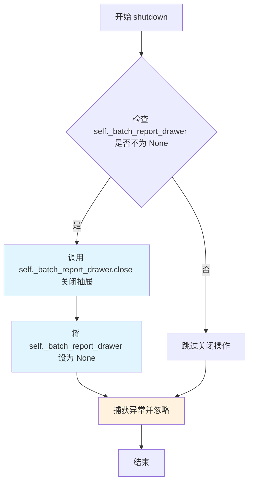

#### 带注释源码

```python
def shutdown(self):
    """
    关闭并清理批量报告抽屉组件。
    
    该方法在应用关闭或控制器销毁时被调用，确保正确释放
    MDrawer 组件资源，避免内存泄漏或窗口残留问题。
    """
    try:
        # 检查抽屉组件是否存在（不为 None）
        if self._batch_report_drawer is not None:
            # 调用 close 方法关闭抽屉窗口
            self._batch_report_drawer.close()
            # 将引用设为 None，帮助垃圾回收器回收内存
            self._batch_report_drawer = None
    except Exception:
        # 捕获所有异常并静默处理，防止关闭过程中出现错误导致程序崩溃
        # 这确保了 shutdown 方法总是能够安全退出
        pass
```

## 关键组件


### 批量报告数据管理

管理当前批次报告和最新批次报告的状态，包括开始时间、路径列表、跳过条目等信息，用于跟踪批量处理的结果。

### 跳过原因本地化与格式化

将技术性的跳过原因和错误信息转换为用户友好的本地化文本，包括错误详情描述和建议操作，帮助用户理解图像被跳过的原因。

### 错误类型检测

识别特定类型的错误情况，如内容被标记为不安全、用户主动跳过、无文本检测等，以便进行针对性的处理和报告。

### 错误文本清理

清理堆栈跟踪等冗余信息，从完整的错误文本中提取关键的摘要信息，便于后续的本地化处理和显示。

### 批量报告UI构建

动态构建包含统计卡片和跳过图像表格的UI组件，展示批次处理的完成状态、总图像数、跳过数以及每个跳过图像的详细信息。

### 报告抽屉管理

使用MDrawer组件以右侧抽屉的形式显示批量报告，支持关闭操作和宽度自适应，提供良好的用户体验。

### 图像导航功能

支持从批量报告列表中直接双击打开对应的图像页面，实现与主界面图像列表的联动导航。


## 问题及建议


### 已知问题

-   **重复代码严重**：`BatchReportController` 类中存在大量重复的错误类型匹配逻辑，`_localize_batch_skip_detail` 和 `_localize_batch_skip_action` 方法重复检查相同的错误关键字（如 "insufficient credit"、"timeout"、"unauthorized" 等），违反 DRY 原则。
-   **魔法字符串和硬编码**：错误类型字符串（如 "flagged as unsafe"、"content was flagged"、"Text Blocks" 等）和 HTTP 状态码（401、403、429、502、503、504）散落在多个方法中，缺乏统一的常量定义。
-   **使用字典作为数据结构**：`BatchReportController` 类中 `_current_batch_report` 和 `_latest_batch_report` 使用普通字典存储结构化数据（如 paths、path_set、skipped 等），缺乏类型安全和清晰的字段定义。
-   **UI 构建逻辑与业务逻辑耦合**：`_build_batch_report_widget` 方法长达 150+ 行，直接在控制器中创建大量 Qt 组件（QTableWidget、QLabel、QVBoxLayout 等），违反单一职责原则。
-   **私有方法命名导致测试困难**：所有业务方法均使用单下划线前缀（`_sanitize_batch_skip_error`、`_is_content_flagged_error_text` 等），导致这些核心逻辑难以进行单元测试。
-   **字符串拼接构造逻辑**：`skip_reason` 和 `error` 的组合逻辑在多个地方使用 `f"{skip_reason} {error}".lower()` 形式重复构造，降低可维护性。
-   **异常处理过于宽泛**：`shutdown` 方法中使用 `except Exception: pass` 吞掉所有异常，可能隐藏潜在问题；`_open_image_from_batch_report` 中访问 `self.main.image_files` 缺乏边界检查。
-   **缺乏数据持久化**：批处理报告仅存储在内存中（`_latest_batch_report`），应用关闭后数据丢失，无法支持历史报告查询。
-   **性能优化不足**：`register_batch_skip` 方法多次访问 `report["skipped"]` 字典，`reason_map` 在每次调用 `_format_batch_skip_reason` 时重新创建。

### 优化建议

-   **提取错误类型常量**：创建 `BatchSkipErrorType` 枚举或常量类，将所有错误匹配模式（关键字、HTTP 状态码）统一管理。
-   **重构数据结构**：使用 `@dataclass` 或 `NamedTuple` 定义 `BatchReport` 和 `SkipEntry` 等数据结构，替代隐式字典。
-   **提取 UI 构建逻辑**：将 `_build_batch_report_widget` 拆分为独立的 `BatchReportView` 类或函数，降低控制器复杂度。
-   **合并重复逻辑**：提取 `_localize_batch_skip_detail` 和 `_localize_batch_skip_action` 中的公共部分，使用配置驱动的错误映射机制。
-   **增强错误处理**：为关键操作添加具体异常捕获，避免使用裸 `except Exception`，并记录日志而非静默忽略。
-   **支持报告持久化**：考虑将报告序列化存储（JSON/SQLite），支持历史报告查看功能。
-   **优化性能**：将 `reason_map` 提升为类常量或模块级常量，避免重复创建；使用局部变量缓存字典访问结果。
-   **改进可测试性**：将核心业务逻辑提取到独立的纯函数中，与 Qt 依赖解耦，便于单元测试。

## 其它


### 设计目标与约束

该模块的核心设计目标是为漫画翻译工具提供批量处理报告功能，追踪批量翻译过程中的跳过情况，并将错误信息本地化为用户友好的提示。约束条件包括：仅处理未被跳过的图片路径、过滤用户主动跳过的情况、依赖主控制器（ComicTranslate）的翻译和UI上下文。

### 错误处理与异常设计

错误处理采用分层策略：1）`_sanitize_batch_skip_error` 方法清理原始错误信息，去除Traceback和文件路径，截断过长行；2）`_localize_batch_skip_detail` 和 `_localize_batch_skip_action` 方法将错误分类并映射为本地化文本；3）GUI层通过 `MMessage` 显示警告信息。异常捕获主要在 `shutdown` 方法中使用 try-except 防止关闭时崩溃。

### 数据流与状态机

该模块存在三种状态：初始状态（`_current_batch_report` 为 None）、进行中状态（调用 `start_batch_report` 后）、已完成状态（调用 `finalize_batch_report` 后）。数据流为：batch_paths → start_batch_report → register_batch_skip（多次） → finalize_batch_report → show_latest_batch_report。

### 外部依赖与接口契约

主要依赖：1）PySide6（QtCore、QtWidgets）用于GUI构建；2）MDrawer（侧边栏组件）和 MMessage（消息提示）来自 app.ui.dayu_widgets；3）主控制器 ComicTranslate 提供 tr() 方法用于国际化、image_states 和 image_files 状态管理。接口契约：start_batch_report 接收图片路径列表、register_batch_skip 接收图片路径和错误信息、show_latest_batch_report 无参数且无返回值。

### 性能考虑

优化点包括：使用 set 进行路径查找（O(1)复杂度）、表格行数限制在4-12行以平衡显示和性能、延迟加载 GUI 组件（仅在 show 时构建）。潜在瓶颈：大量 skipped_entries 时表格渲染、大量 batch_paths 时 start_batch_report 的过滤操作。

### 安全性考虑

该模块为纯业务逻辑和UI展示，无敏感数据处理。安全措施包括：路径仅使用 os.path.basename 展示文件名、错误信息经过 sanitize 过滤防止信息泄露、UserRole 存储路径而非直接显示。

### 国际化/本地化设计

所有用户可见文本均通过 `self.main.tr()` 方法进行国际化处理，包括状态标签（"Cancelled"/"Completed"）、统计卡片、表格头部、错误描述和操作建议。支持运行时语言切换。

### 用户交互流程

用户触发批量翻译 → 系统记录开始时间戳 → 翻译过程中调用 register_batch_skip 记录失败项 → 翻译完成或取消后调用 finalize_batch_report → 用户点击报告按钮调用 show_latest_batch_report → 展示侧边栏抽屉，包含统计信息和跳过图片表格 → 双击表格行可跳转到对应图片。

### 配置与参数说明

主要配置参数：drawer 固定宽度（默认460px 或 42% 主窗口宽度）、表格可见行数范围（4-12行）、单行高度（28px）、消息显示时长（5秒）。

### 测试考虑

建议测试场景：1）空 batch_paths 调用 start_batch_report；2）重复注册同一 image_path 的 skip；3）多种错误类型（timeout、API key、network、content flagged）的本地化映射；4）was_cancelled 为 True/False 的 finalize 行为；5）无报告时调用 show_latest_batch_report；6）多语言环境下的 tr() 调用。

### 部署与运维

该类作为 ComicTranslate 主控制器的内部组件，无需独立部署。运维关注点：长时间运行时的内存泄漏风险（建议定期调用 shutdown 清理 drawer 引用）、批量处理大量图片时的性能监控。


    