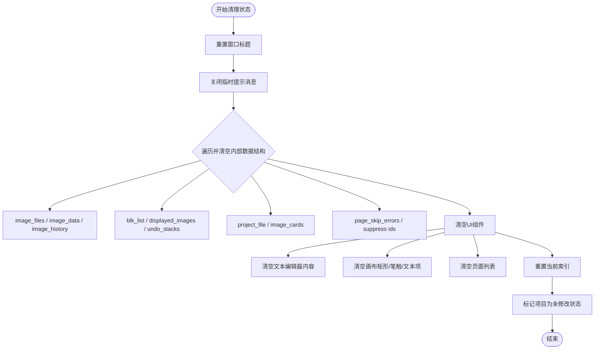

# `comic-translate\app\controllers\image.py` 详细设计文档

ImageStateController 是漫画翻译应用的核心控制器，负责管理图像的异步加载、缓存、历史记录、撤销/重做堆栈（Undo Stack）以及页面切换时的状态恢复（包含普通模式和网页漫画模式），同时处理页面跳过错误和UI组件的同步。

## 整体流程

```mermaid
graph TD
    Start([用户操作/加载项目]) --> IsProject{是 .ctpr 项目文件?}
    IsProject -- 是 --> LoadProject[调用项目控制器加载]
    IsProject -- 否 --> PrepareFiles[准备文件列表]
    PrepareFiles --> ClearState[清空当前状态]
    ClearState --> ThreadLoad[启动后台线程加载图像]
    ThreadLoad --> LoadCallback{图像加载回调}
    LoadCallback --> InitHistory[初始化图像历史与状态]
    LoadCallback --> UpdateUI[更新UI列表与缩略图]
    LoadCallback --> Display[显示图像]
    Display --> LoadState[加载保存的视图状态]
    LoadState --> End([操作完成])

subgraph 页面切换流程
    UserClick[用户点击/切换页面] --> AsyncNav[_run_async_nav_load]
    AsyncNav --> PreloadPatch[预加载修复块]
    AsyncNav --> DisplayLoaded[显示已加载图像]
    DisplayLoaded --> LoadPageState[加载页面状态(文字/涂抹)]
end

subgraph 错误处理流程
    ProcessError[处理页面错误/跳过] --> BuildMsg[构建错误消息]
    BuildMsg --> CheckType{错误类型判定}
    CheckType -- 内容 flagged --> ShowError[显示严重错误]
    CheckType -- 普通跳过 --> ShowWarn[显示警告/信息]
end
```

## 类结构

```
ImageStateController (核心控制器)
└── 依赖: ComicTranslate (主窗口)
└── 依赖: ListViewImageLoader (缩略图懒加载)
└── 依赖: GenericWorker (线程任务)
```

## 全局变量及字段


### `ImageStateController.main`
    
主应用实例

类型：`ComicTranslate`
    


### `ImageStateController._nav_request_id`
    
导航请求ID，用于取消过期请求

类型：`int`
    


### `ImageStateController._nav_worker`
    
当前异步加载的工作器

类型：`GenericWorker | None`
    


### `ImageStateController._page_skip_errors`
    
页面跳过错误缓存

类型：`dict[str, dict]`
    


### `ImageStateController._active_page_error_message`
    
当前显示的错误弹窗

类型：`MMessage | None`
    


### `ImageStateController._active_page_error_path`
    
当前显示错误的文件路径

类型：`str | None`
    


### `ImageStateController._suppress_dismiss_message_ids`
    
需抑制关闭信号的消息ID集合

类型：`set[int]`
    


### `ImageStateController._active_transient_skip_message`
    
临时通知消息

类型：`MMessage | None`
    


### `ImageStateController.page_list_loader`
    
列表视图图像加载器

类型：`ListViewImageLoader`
    
    

## 全局函数及方法


### `ImageStateController.__init__`

这是 `ImageStateController` 类的构造函数，用于初始化图像状态控制器的实例，设置主控制器引用、导航工作线程、页面跳过错误跟踪、错误消息显示以及页面列表的延迟加载器。

参数：

-  `main`：`ComicTranslate`，主应用程序控制器实例，用于访问和管理应用程序的核心功能和数据。

返回值：`None`，构造函数不返回值。

#### 流程图


#### 带注释源码

```python
def __init__(self, main: ComicTranslate):
    # 引用主应用程序控制器，用于访问全局状态和方法
    self.main = main
    
    # 导航请求计数器，用于管理异步导航请求的版本
    self._nav_request_id = 0
    
    # 当前活跃的导航工作线程，用于异步加载图像
    self._nav_worker: GenericWorker | None = None
    
    # 存储页面跳过错误的字典，键为文件路径，值为错误详情字典
    self._page_skip_errors: dict[str, dict] = {}
    
    # 当前显示的页面级别错误消息对象
    self._active_page_error_message: MMessage | None = None
    
    # 当前显示的页面级别错误对应的文件路径
    self._active_page_error_path: str | None = None
    
    # 用于存储需要抑制关闭消息的ID集合，避免在清除错误时触发相关回调
    self._suppress_dismiss_message_ids: set[int] = set()
    
    # 当前显示的临时跳过通知消息对象
    self._active_transient_skip_message: MMessage | None = None
    
    # 初始化页面列表的延迟图像加载器，用于在列表视图中异步加载图像缩略图
    # avatar_size设置为(35, 50)以适配列表项的显示
    self.page_list_loader = ListViewImageLoader(
        self.main.page_list,
        avatar_size=(35, 50)
    )
```


### `ImageStateController._is_content_flagged_error`

该方法用于检查给定的错误信息是否表示内容安全策略违规（如内容被标记为不安全或触发安全过滤器）。

参数：

-  `error`：`str`，后端处理（如翻译或OCR）返回的错误信息字符串。

返回值：`bool`，如果错误匹配已知的内容标记模式（如 "flagged as unsafe"），则返回 `True`；否则返回 `False`。

#### 流程图

```mermaid
flowchart TD
    A([Start _is_content_flagged_error]) --> B[Input: error]
    B --> C{error is None or empty?}
    C -->|Yes| D[lowered = ""]
    C -->|No| E[lowered = error.lower()]
    D --> F{Contains 'flagged as unsafe'?}
    E --> F
    F -->|Yes| G([Return True])
    F -->|No| H{Contains 'content was flagged'?}
    H -->|Yes| G
    H -->|No| I{Contains 'safety filters'?}
    I -->|Yes| G
    I -->|No| J([Return False])
```

#### 带注释源码

```python
def _is_content_flagged_error(self, error: str) -> bool:
    # 将错误信息转换为小写，以便进行不区分大小写的匹配
    # 使用 (error or "") 处理 error 为 None 的情况，防止 .lower() 报错
    lowered = (error or "").lower()
    
    # 检查错误信息中是否包含内容被标记为不安全的关键词
    # 这里使用了 'in' 操作符进行子串匹配
    return (
        "flagged as unsafe" in lowered
        or "content was flagged" in lowered
        or "safety filters" in lowered
    )
```


### `ImageStateController._resolve_skip_message_type`

该方法负责确定当图像被跳过（处理失败或手动跳过）时，界面上显示的消息类型（Info、Warning 或 Error）。它基于跳过原因（`skip_reason`）和具体的错误详情（`error`）来进行判断，以提供适当的用户反馈。

参数：

- `skip_reason`：`str`，触发跳过处理的原因（例如 `"Text Blocks"`, `"OCR"`, `"Translator"`）。
- `error`：`str`，如果处理过程中发生错误，这里包含具体的错误信息；如果无错误则为空字符串。

返回值：`str`，返回消息的类型常量。可能的返回值包括 `MMessage.ErrorType`（错误）、`MMessage.InfoType`（信息）或 `MMessage.WarningType`（警告）。

#### 流程图


#### 带注释源码

```python
def _resolve_skip_message_type(self, skip_reason: str, error: str) -> str:
    """
    根据跳过原因和错误信息解析并返回对应的消息类型。

    Args:
        skip_reason: str，导致跳过处理的业务原因。
        error: str，具体的错误描述文本。

    Returns:
        str，返回 MMessage 类型的静态常量，决定了UI提示框的样式。
    """
    # 1. 如果错误是由于内容安全过滤器触发的（例如涉黄、涉暴），
    #    则始终显示为错误类型，以引起用户重视。
    if self._is_content_flagged_error(error):
        return MMessage.ErrorType
    
    # 2. 如果跳过原因是由于“没有检测到文本”，这通常是一个正常流程，
    #    不是程序错误，使用信息提示（Info）即可。
    if skip_reason == "Text Blocks":
        return MMessage.InfoType
    
    # 3. 其他情况（例如OCR失败、翻译失败等），通常意味着处理流程受阻，
    #    使用警告提示（Warning）。
    return MMessage.WarningType
```


### `ImageStateController._summarize_skip_error`

该方法用于将完整的错误信息（可能是完整的堆栈跟踪）精简为一行简短的摘要消息，便于在用户界面上显示。如果错误信息较短且不包含 Traceback，则直接返回原始错误；否则遍历错误行，跳过文件路径和异常处理相关的行，返回第一行有意义的错误描述。

参数：

- `error`：`str`，需要处理的完整错误信息字符串，可能包含多行堆栈跟踪

返回值：`str`，处理后的简短错误摘要字符串，如果无法提取有效信息则返回空字符串

#### 流程图

```mermaid
flowchart TD
    A[开始] --> B{error 是否为空}
    B -->|是| C[返回 ""]
    B -->|否| D{"Traceback" 不在 error 且 len < 500}
    D -->|是| E[返回 error.strip]
    D -->|否| F[遍历 error.splitlines]
    F --> G{当前行是否为空}
    G -->|是| F
    G -->|否| H{line.lower().startswith "traceback"}
    H -->|是| I[break 退出循环]
    H -->|否| J{line.startswith 'File "' 或 "File '"}
    J -->|是| F
    J -->|否| K{line.startswith "During handling"}
    K -->|是| F
    K -->|否| L[返回该行]
    I --> M[返回 ""]
    E --> M
    L --> M
```

#### 带注释源码

```
def _summarize_skip_error(self, error: str) -> str:
    # 如果错误为空，直接返回空字符串
    if not error:
        return ""
    
    # 如果错误不包含 Traceback 且长度小于 500，认为是简短的自定义消息
    # （如翻译结果），直接返回完整内容而不进行截取
    if "Traceback" not in error and len(error) < 500:
        return error.strip()

    # 遍历错误信息的每一行
    for raw_line in error.splitlines():
        line = raw_line.strip()
        # 跳过空行
        if not line:
            continue
        # 如果遇到 Traceback 行，停止遍历
        if line.lower().startswith("traceback"):
            break
        # 跳过文件路径行（Python 堆栈跟踪中的文件信息）
        if line.startswith('File "') or line.startswith("File '"):
            continue
        # 跳过异常处理说明行
        if line.startswith("During handling of the above exception"):
            continue
        # 返回第一个有意义的错误行
        return line
    
    # 没有找到有效信息，返回空字符串
    return ""
```


### `ImageStateController._build_skip_message`

该方法根据图像路径、跳过原因和错误信息构建用户友好的跳过消息文本。它通过查询消息映射表获取对应的本地化提示语，并附加文件名及错误摘要，生成完整的错误展示内容。

参数：

- `image_path`：`str`，需要构建跳过消息的图像文件路径
- `skip_reason`：`str`，导致图像被跳过的原因（如 "Text Blocks"、"OCR"、"Translator" 等）
- `error`：`str`，处理过程中产生的错误信息字符串

返回值：`str`，格式化的完整跳过消息文本，包含原因描述、文件名及错误详情

#### 流程图


#### 带注释源码

```python
def _build_skip_message(self, image_path: str, skip_reason: str, error: str) -> str:
    """
    构建图像跳过消息的完整文本。
    
    Args:
        image_path: 图像文件的完整路径
        skip_reason: 跳过原因类型（如 "Text Blocks"、"OCR"、"Translator" 等）
        error: 原始错误信息字符串
    
    Returns:
        格式化的用户可见跳过消息文本
    """
    # 从完整路径中提取文件名部分
    file_name = os.path.basename(image_path)
    
    # 简化错误信息，提取关键错误描述
    reason = self._summarize_skip_error(error)
    
    # 获取 Qt 翻译函数用于本地化
    t = QtCore.QCoreApplication.translate

    # 原因类型到用户消息的映射字典
    message_map = {
        "Text Blocks": t("Messages", "No Text Blocks Detected.\nSkipping:"),
        "OCR": t("Messages", "Could not recognize detected text.\nSkipping:"),
        "Translator": t("Messages", "Could not get translations.\nSkipping:"),
        "OCR Chunk Failed": t("Messages", "Could not recognize webtoon chunk.\nSkipping:"),
        "Translation Chunk Failed": t("Messages", "Could not translate webtoon chunk.\nSkipping:"),
    }

    # 根据跳过原因获取对应消息，未找到时使用默认消息
    base = message_map.get(
        skip_reason,
        t("Messages", "Page processing failed.\nSkipping:")
    )
    
    # 拼接基础消息和文件名
    text = f"{base} {file_name}"
    
    # 如果存在错误详情，则追加到消息末尾
    if reason:
        text += f"\n{reason}"
        
    return text
```


### `ImageStateController._close_transient_skip_notice`

该方法用于关闭当前显示的临时跳过通知消息（Transient Skip Notice），通常在需要清除或更替旧的跳过提示时调用。它会安全地关闭消息窗口并将内部状态重置为无活动消息。

参数： 无

返回值：`None`，无返回值，用于清除临时跳过通知的UI显示和内部状态

#### 流程图


#### 带注释源码

```python
def _close_transient_skip_notice(self):
    """
    关闭当前显示的临时跳过通知消息，并重置内部状态。
    
    该方法通常在以下情况被调用：
    1. 显示新的临时跳过通知之前
    2. 清除状态时（如 clear_state 方法中）
    3. 清理资源时（如 cleanup 方法中）
    """
    # 获取当前活动的临时跳过消息对象
    msg = self._active_transient_skip_message
    
    # 如果没有活动的消息，直接返回，无需执行后续操作
    if msg is None:
        return
    
    # 尝试关闭消息窗口，使用 try-except 防止窗口已被销毁或出现异常
    try:
        msg.close()
    except Exception:
        # 静默处理异常，避免因UI组件问题导致程序崩溃
        pass
    
    # 重置内部状态，将活动消息引用设为 None
    self._active_transient_skip_message = None
```


### `ImageStateController._show_transient_skip_notice`

该方法负责在用户界面上显示一个短暂的“跳过提示”通知（Toast/Flyout），用于反馈页面处理失败或被跳过的状态。它会先关闭之前的短暂通知，然后根据传入的消息类型（信息、警告、错误）选择对应的展示函数，最后将新创建的消息对象缓存到 `_active_transient_skip_message` 中以便后续管理。

参数：

- `text`：`str`，需要显示的提示文本内容，通常包含文件名和简短的错误原因。
- `dayu_type`：`str`，消息的类型标识，用于决定视觉样式（如：警告、错误、信息），对应 `MMessage` 的类型常量。

返回值：`None`，该方法没有返回值。

#### 流程图


#### 带注释源码

```python
def _show_transient_skip_notice(self, text: str, dayu_type: str):
    """
    显示一个短暂的跳过提示通知。

    该方法首先关闭之前可能存在的短暂通知，然后根据 dayu_type 
    创建一个新的临时消息显示在界面上。

    参数:
        text (str): 要显示的文本内容。
        dayu_type (str): 消息的类型，决定了显示的图标和颜色（例如 'info', 'warning', 'error'）。
    """
    # 1. 关闭之前可能正在显示的短暂通知，防止界面堆叠多个通知
    self._close_transient_skip_notice()

    # 2. 根据传入的 dayu_type 构建映射表，获取对应的显示函数
    #    MMessage 通常提供 info, warning, error 等静态方法来显示不同类型的消息
    show_func = {
        MMessage.InfoType: MMessage.info,
        MMessage.WarningType: MMessage.warning,
        MMessage.ErrorType: MMessage.error,
    }.get(dayu_type, MMessage.warning) # 如果类型不匹配，默认使用 warning

    # 3. 调用选定的函数显示消息
    #    parent 设为 self.main 确保消息显示在主窗口上
    #    duration=6 设置显示时长为 6 秒
    #    closable=True 允许用户手动关闭该消息
    self._active_transient_skip_message = show_func(
        text=text,
        parent=self.main,
        duration=6,
        closable=True,
    )
```


### `ImageStateController._hide_active_page_skip_error`

该方法用于隐藏当前活动的页面跳过错误消息，并清理相关的状态信息。它首先检查是否存在活动的错误消息，如果有则安全地关闭消息并将相关状态变量重置为 None，同时将消息 ID 加入抑制集合以防止触发关闭回调。

参数： 无

返回值：`None`，无返回值

#### 流程图


#### 带注释源码

```python
def _hide_active_page_skip_error(self):
    """
    隐藏当前活动的页面跳过错误消息，并清理相关状态。
    
    此方法执行以下操作：
    1. 检查是否存在活动的错误消息
    2. 如果不存在，直接返回并清理路径状态
    3. 如果存在，将消息ID加入抑制集合（防止触发关闭回调）
    4. 安全关闭消息（捕获可能的异常）
    5. 重置所有相关状态变量
    """
    # 获取当前活动的错误消息
    msg = self._active_page_error_message
    
    # 如果没有活动的错误消息，直接返回并清理路径状态
    if msg is None:
        self._active_page_error_error_path = None
        return
    
    # 将消息的ID添加到抑制集合，防止在关闭时触发 _on_page_error_closed 回调
    # 这是为了避免在程序主动隐藏消息时更新 _page_skip_errors 状态
    self._suppress_dismiss_message_ids.add(id(msg))
    
    # 安全地尝试关闭消息，捕获可能发生的任何异常
    try:
        msg.close()
    except Exception:
        # 忽略关闭失败的情况，避免中断主流程
        pass
    
    # 清理所有相关的状态变量
    self._active_page_error_message = None
    self._active_page_error_path = None
```


### `ImageStateController._on_page_error_closed`

处理页面错误消息被关闭时的回调逻辑，管理页面跳过错误的状态更新。

参数：

- `file_path`：`str`，与错误消息关联的文件路径，用于定位对应的页面错误状态
- `message`：`MMessage`，被关闭的错误消息对象，用于判断是否为当前活动消息

返回值：`None`，无返回值

#### 流程图


#### 带注释源码

```python
def _on_page_error_closed(self, file_path: str, message: MMessage):
    """处理页面错误消息被关闭时的回调。
    
    当页面错误消息被用户关闭时，此方法负责：
    1. 检查该关闭操作是否应该被抑制（programmatic close）
    2. 如果不是抑制操作，则将对应的页面错误状态标记为已Dismissed
    3. 如果关闭的是当前活动的错误消息，则清除活动状态
    
    Args:
        file_path: 与错误消息关联的文件路径
        message: 被关闭的MMessage对象
    """
    # 获取消息对象的唯一标识符
    msg_id = id(message)
    
    # 检查该消息是否在抑制集合中
    # 抑制集合用于区分程序主动关闭 vs 用户手动关闭
    if msg_id in self._suppress_dismiss_message_ids:
        # 如果是程序主动关闭，则从抑制集合中移除该ID
        # 不需要标记为dismissed，因为这不是用户主动关闭的
        self._suppress_dismiss_message_ids.discard(msg_id)
    else:
        # 用户手动关闭了消息
        # 获取该文件路径对应的错误状态
        state = self._page_skip_errors.get(file_path)
        if state:
            # 将该错误状态标记为已Dismissed
            # 这样在下次导航到该页面时不会再次显示错误提示
            state["dismissed"] = True
    
    # 检查被关闭的消息是否是当前活动的页面错误消息
    if self._active_page_error_message is message:
        # 清除活动错误消息的状态
        # 允许显示其他页面的错误消息
        self._active_page_error_message = None
        self._active_page_error_path = None
```


### `ImageStateController._show_page_skip_error_for_file`

该方法负责在用户导航到特定页面时，如果该页面存在处理错误（如 OCR 失败、翻译失败），则向用户显示一个非模态的持久通知（Message）。它会检查错误状态，避免重复显示已忽略或当前已显示的错误。

参数：

- `file_path`：`str`，需要显示错误信息的图片文件的完整路径。

返回值：`None`，该方法通过副作用更新 UI 状态，不返回计算结果。

#### 流程图


#### 带注释源码

```python
def _show_page_skip_error_for_file(self, file_path: str):
    # 1. 从错误字典中获取该文件对应的错误状态（包含文本和类型）
    state = self._page_skip_errors.get(file_path)
    
    # 2. 逻辑过滤：如果没有错误记录，或者错误已被用户忽略（dismissed），则直接退出
    if not state or state.get("dismissed"):
        return
        
    # 3. 防重复检查：如果当前显示的错误消息正是这个页面的，并且窗口还可见，则不再重复显示
    if (
        self._active_page_error_path == file_path
        and self._active_page_error_message is not None
        and self._active_page_error_message.isVisible()
    ):
        return

    # 4. 清理：隐藏当前可能存在的任何其他页面的错误提示，以保持一次只有一个页面错误
    self._hide_active_page_skip_error()
    
    # 5. 类型路由：根据存储的错误类型（Info/Warning/Error）选择合适的 MMessage 函数
    show_func = {
        MMessage.InfoType: MMessage.info,
        MMessage.WarningType: MMessage.warning,
        MMessage.ErrorType: MMessage.error,
    }.get(state.get("dayu_type"), MMessage.warning)
    
    # 6. 展示：构造并显示消息。duration=None 表示常驻，不自动消失；closable=True 允许用户关闭
    message = show_func(
        text=state.get("text", ""),
        parent=self.main,
        duration=None,
        closable=True,
    )
    
    # 7. 交互处理：监听用户关闭消息的事件，以便将错误标记为已处理
    message.sig_closed.connect(
        lambda fp=file_path, msg=message: self._on_page_error_closed(fp, msg)
    )
    
    # 8. 状态更新：记录当前哪个页面拥有活跃的错误提示，用于后续的隐藏或去重逻辑
    self._active_page_error_message = message
    self._active_page_error_path = file_path
```


### `ImageStateController.handle_webtoon_page_focus`

该方法用于管理 Webtoon 模式下的页面跳过错误弹窗显示策略。当用户显式导航到某个页面（如通过页面列表点击）时，显示该页面的跳过错误信息；当用户被动滚动切换页面时，则隐藏当前的错误弹窗。

参数：

- `file_path`：`str`，被聚焦/导航到的页面文件路径，用于标识需要显示或隐藏错误的页面
- `explicit_navigation`：`bool`，导航类型标志。`True` 表示显式 Deliberate 跳转（如页面列表点击、报告跳转），`False` 表示被动滚动驱动的页面更改

返回值：`None`，该方法无返回值，仅执行副作用操作（显示或隐藏页面跳过错误弹窗）

#### 流程图


#### 带注释源码

```python
def handle_webtoon_page_focus(self, file_path: str, explicit_navigation: bool):
    """Apply page-skip popup policy for webtoon navigation.

    explicit_navigation=True means deliberate jump (page list/report),
    False means passive scroll-driven page change.
    """
    # 根据导航类型决定错误弹窗策略
    if explicit_navigation:
        # 显式导航：用户主动点击页面列表或通过报告跳转
        # 此时应该显示该页面的跳过错误信息（如翻译失败、安全过滤拦截等）
        self._show_page_skip_error_for_file(file_path)
    else:
        # 被动滚动：用户通过滑动滚轮或拖动滚动切换页面
        # 此时隐藏当前的错误弹窗，避免干扰用户的浏览体验
        self._hide_active_page_skip_error()
```


### `ImageStateController._clear_page_skip_error`

该方法负责清除与特定文件路径关联的页面跳过错误状态。它首先从错误记录字典中移除指定路径的条目，如果该路径正是当前显示错误信息的页面，则同时隐藏该错误提示框。

参数：

- `file_path`：`str`，需要清除错误状态的文件路径。

返回值：`None`，该方法不返回任何值，仅执行副作用操作。

#### 流程图


#### 带注释源码

```python
def _clear_page_skip_error(self, file_path: str):
    """Clear the page skip error state for a specific file path.

    This method removes the error record from the internal dictionary
    and dismisses the visible error message if it matches the current active path.

    Args:
        file_path: The file path whose error state needs to be cleared.
    """
    # Remove the skip error record for the specific file path from the internal dictionary.
    # Using pop with default None prevents KeyError if the path wasn't registered.
    self._page_skip_errors.pop(file_path, None)

    # Check if the file path being cleared is the one currently showing an error message.
    if self._active_page_error_path == file_path:
        # If so, hide the active page error message UI element.
        self._hide_active_page_skip_error()
```


### `ImageStateController.clear_page_skip_errors_for_paths`

该方法用于批量清除指定文件路径的页面跳过错误状态。它遍历传入的文件路径列表，依次调用内部方法 `_clear_page_skip_error` 来清除每个路径对应的错误记录，并在必要时隐藏当前显示的错误提示消息。

参数：

- `file_paths`：`List[str]`，需要清除错误状态的图片文件路径列表

返回值：`None`，该方法无返回值，仅执行副作用操作

#### 流程图

```mermaid
flowchart TD
    A[开始 clear_page_skip_errors_for_paths] --> B{遍历 file_paths}
    B -->|迭代| C[取出单个 file_path]
    C --> D[调用 _clear_page_skip_error]
    D --> E{file_path 在 _page_skip_errors 中?}
    E -->|是| F[从字典中移除该条目]
    E -->|否| G[检查是否为当前活动错误路径]
    F --> G
    G -->{file_path == _active_page_error_path?}
    G -->|是| H[调用 _hide_active_page_skip_error 隐藏错误消息]
    G -->|否| I{继续遍历}
    H --> I
    I -->|还有更多路径| C
    I -->|遍历完成| J[结束]
```

#### 带注释源码

```python
def clear_page_skip_errors_for_paths(self, file_paths: List[str]):
    """
    批量清除指定文件路径的页面跳过错误状态。
    
    该方法接收一个文件路径列表，遍历每个路径并调用内部方法
    _clear_page_skip_error 来清除对应的错误记录。如果被清除的路径
    正好是当前正在显示的错误消息对应的路径，则会同时隐藏该错误消息。
    
    Args:
        file_paths: 需要清除错误状态的图片文件路径列表
    """
    # 遍历传入的每个文件路径
    for file_path in file_paths:
        # 调用内部方法清除单个路径的错误状态
        # 该内部方法会:
        # 1. 从 _page_skip_errors 字典中移除该路径的记录
        # 2. 如果该路径正是当前活动错误路径，则隐藏错误消息
        self._clear_page_skip_error(file_path)
```


### `ImageStateController._current_file_path`

获取当前显示的图像文件路径。

参数：

- 该方法没有显式参数（除了隐式的 `self`）

返回值：`str | None`，返回当前图像文件的完整路径，如果当前没有有效的图像则返回 `None`。

#### 流程图

```mermaid
flowchart TD
    A[开始] --> B{检查 curr_img_idx 是否在有效范围内}
    B -->|是| C[返回 image_files[curr_img_idx]]
    B -->|否| D[返回 None]
    C --> E[结束]
    D --> E
```

#### 带注释源码

```python
def _current_file_path(self) -> str | None:
    """获取当前显示的图像文件路径。
    
    检查当前图像索引是否在有效范围内，如果是则返回
    对应的文件路径，否则返回 None。
    
    Returns:
        str | None: 当前图像文件的完整路径，如果没有有效图像则返回 None
    """
    # 检查当前索引是否在有效范围内
    if 0 <= self.main.curr_img_idx < len(self.main.image_files):
        # 返回当前索引对应的文件路径
        return self.main.image_files[self.main.curr_img_idx]
    # 索引无效，返回 None
    return None
```


### `ImageStateController.load_initial_image`

该方法负责在应用启动或批量加载图像时准备文件路径列表，加载第一张图像作为初始显示图像，并维护主控制器中的图像文件列表。

参数：

- `file_paths`：`List[str]`，需要加载的图像文件路径列表

返回值：`np.ndarray | None`，成功加载时返回初始图像的 numpy 数组，失败或文件列表为空时返回 `None`

#### 流程图

```mermaid
flowchart TD
    A[开始: load_initial_image] --> B[调用 file_handler.prepare_files 处理文件路径]
    B --> C[将处理后的路径赋值给 main.image_files]
    D{file_paths 是否非空?}
    C --> D
    D -- 是 --> E[调用 load_image 加载第一张图像 file_paths[0]]
    E --> F[返回加载的图像数组]
    D -- 否 --> G[返回 None]
    F --> H[结束]
    G --> H
```

#### 带注释源码

```python
def load_initial_image(self, file_paths: List[str]):
    """
    加载初始图像，用于应用启动或批量加载图像时。
    
    该方法完成以下工作：
    1. 通过文件处理器准备（验证/规范化）文件路径
    2. 将准备好的文件路径列表保存到主控制器的 image_files 属性中
    3. 如果存在有效文件路径，则加载第一张图像作为当前显示的初始图像
    
    Args:
        file_paths: 需要加载的图像文件路径列表
        
    Returns:
        成功加载图像时返回 numpy 数组 (np.ndarray)，否则返回 None
    """
    # 调用文件处理器的 prepare_files 方法，对输入路径进行预处理
    # 可能包括路径规范化、验证文件存在性、排序等操作
    file_paths = self.main.file_handler.prepare_files(file_paths)
    
    # 将处理后的文件路径列表保存到主控制器对象中
    # 这会更新应用当前管理的所有图像文件
    self.main.image_files = file_paths

    # 检查文件路径列表是否非空
    if file_paths:
        # 存在有效文件，加载第一张图像并返回
        # load_image 方法会检查内存缓存、历史记录或直接从磁盘加载
        return self.load_image(file_paths[0])
    
    # 文件列表为空，返回 None
    return None
```


### `ImageStateController.load_image`

该方法负责加载图像文件，实现了多层级的缓存查找机制：优先从内存缓存加载，其次从临时历史文件加载，最后才从原始文件路径读取，确保图像加载的高效性和历史状态的恢复能力。

参数：

-  `file_path`：`str`，要加载的图像文件的完整路径

返回值：`np.ndarray`，加载后的RGB图像数据（NumPy数组格式），如果加载失败可能返回None

#### 流程图


#### 带注释源码

```python
def load_image(self, file_path: str) -> np.ndarray:
    """加载图像，支持多层级缓存查找。
    
    查找优先级：
    1. 内存缓存 (image_data)
    2. 临时历史文件 (image_history)
    3. 原始文件路径
    """
    # 第一优先级：检查图像是否已存在于内存缓存中
    if file_path in self.main.image_data and self.main.image_data[file_path] is not None:
        return self.main.image_data[file_path]

    # 第二优先级：检查图像是否在历史记录中（曾经显示过）
    if file_path in self.main.image_history:
        # 获取当前历史索引，定位到该图像的版本
        current_index = self.main.current_history_index[file_path]
        
        # 获取临时文件路径（可能是编辑后的版本）
        current_temp_path = self.main.image_history[file_path][current_index]
        
        # 尝试从临时文件加载图像
        rgb_image = imk.read_image(current_temp_path)
        
        if rgb_image is not None:
            return rgb_image

    # 第三优先级：都不是，从原始文件路径加载
    rgb_image = imk.read_image(file_path)
    return rgb_image
```


### `ImageStateController.clear_state`

该方法是一个全面的状态重置函数，用于在关闭项目或加载新项目时清理所有运行时数据。它不仅清除了内存中的图像数据、图像历史记录和撤销栈，还重置了UI界面上的文本编辑器、画布覆盖层以及页面列表，仿佛应用程序刚刚启动一样，并将项目标记为“干净”状态。

#### 参数

- 无（该方法仅使用实例属性 `self`）

#### 返回值

- `None`：无返回值。此方法直接修改 `self.main` 的状态及UI组件，不返回任何数据。

#### 流程图



#### 带注释源码

```python
def clear_state(self):
    # 1. 重置窗口标题，去除可能存在的修改标记 [*]
    self.main.setWindowTitle("Project1.ctpr[*]")
    
    # 2. 关闭可能存在的临时通知（如下滑错误提示）
    self._close_transient_skip_notice()
    self._hide_active_page_skip_error()
    
    # 3. 清除所有与错误相关的内部缓存
    self._page_skip_errors.clear()
    self._suppress_dismiss_message_ids.clear()
    
    # 4. 清空核心图像数据存储（内存中的图像）
    self.main.image_files = []  # 文件路径列表
    self.main.image_states = [] # 图像状态（语言、块信息等）
    self.main.image_data.clear() # 实际像素数据
    self.main.image_history.clear() # 撤销/重做历史记录
    self.main.current_history_index.clear() # 历史索引指针
    
    # 5. 清空与当前编辑相关的列表
    self.main.blk_list = [] # 文本块列表
    self.main.displayed_images.clear() # 已显示过的图像记录
    
    # 6. 清理画布（Viewer）上的覆盖层（矩形框、笔触、文本项）
    self.main.image_viewer.clear_rectangles(page_switch=True)
    self.main.image_viewer.clear_brush_strokes(page_switch=True)
    self.main.image_viewer.clear_text_items()
    
    # 7. 清空源语言和目标语言的文本编辑框
    self.main.s_text_edit.clear()
    self.main.t_text_edit.clear()
    
    # 8. 清理已加载图像列表和内存补丁缓存
    self.main.loaded_images = []
    self.main.in_memory_history.clear()
    self.main.undo_stacks.clear() # 撤销栈
    self.main.image_patches.clear() # 持久化补丁
    self.main.in_memory_patches.clear() # 内存中补丁
    
    # 9. 重置项目文件和UI卡片状态
    self.main.project_file = None
    self.main.image_cards.clear()
    self.main.current_card = None
    
    # 10. 清理页面列表（使用信号阻塞防止触发选中事件）
    self.main.page_list.blockSignals(True)
    self.main.page_list.clear()
    self.main.page_list.blockSignals(False)
    
    # 11. 清理懒加载器的缓存
    self.page_list_loader.clear()

    # 12. 重置当前图像索引为无效值 (-1)
    self.main.curr_img_idx = -1
    
    # 13. 标记项目状态为“干净”（未修改），更新窗口标题
    self.main.set_project_clean()
```


### `ImageStateController.thread_load_images`

该方法负责异步加载图像文件或项目文件。首先检查传入路径列表的第一个元素是否为项目文件（`.ctpr` 扩展名），如果是则调用项目控制器加载项目；否则清除当前状态并启动后台线程加载图像列表。

参数：

- `paths`：`List[str]`，需要加载的图像文件路径列表

返回值：`None`，无返回值

#### 流程图


#### 带注释源码

```python
def thread_load_images(self, paths: List[str]):
    """异步加载图像文件列表或项目文件。
    
    Args:
        paths: 需要加载的图像文件路径列表
    """
    # 检查第一个路径是否为项目文件(.ctpr)
    if paths and paths[0].lower().endswith('.ctpr'):
        # 如果是项目文件，调用项目控制器加载项目
        self.main.project_ctrl.thread_load_project(paths[0])
        return
    
    # 如果是图像文件，先清除当前状态
    self.clear_state()
    
    # 使用线程池异步加载图像
    # 参数：工作函数, 成功回调, 错误处理, 额外参数, 传给工作函数的参数
    self.main.run_threaded(
        self.load_initial_image,           # 后台执行的工作函数
        self.on_initial_image_loaded,      # 成功完成后的回调
        self.main.default_error_handler,   # 错误处理函数
        None,                               # 传递给回调的额外数据
        paths                               # 传递给工作函数的参数
    )
```


### `ImageStateController.thread_insert`

该方法负责在当前已加载的图片列表中插入新的图片文件。它首先保存当前图片状态，然后在新线程中预处理文件（验证文件有效性），接着将新文件插入到图片列表末尾，初始化相关数据结构（图像状态、历史记录、撤销栈等），最后根据是否处于网页漫画模式调用不同的更新策略来刷新界面。

参数：

-  `paths`：`List[str]`，需要插入的图片文件路径列表

返回值：`None`，该方法不返回任何值

#### 流程图


#### 带注释源码

```python
def thread_insert(self, paths: List[str]):
    """
    在当前已加载的图片列表中插入新的图片文件。
    
    该方法执行以下操作：
    1. 保存当前图片状态
    2. 在后台线程中预处理文件
    3. 将新文件插入到图片列表末尾
    4. 初始化相关数据结构
    5. 根据模式(webtoon/普通)刷新界面
    
    Args:
        paths: 需要插入的图片文件路径列表
    """
    # 检查是否有已加载的图片
    if self.main.image_files:
        # 定义文件准备完成后的回调函数
        def on_files_prepared(prepared_files):
            # 如果没有成功准备的文件，直接返回
            if not prepared_files:
                return
            
            # 保存当前图片的状态信息
            self.save_current_image_state()
            
            # 计算插入位置：当前列表的末尾
            insert_position = len(self.main.image_files)
            
            # 遍历准备好的文件，将其插入到列表中
            for i, file_path in enumerate(prepared_files):
                # 在指定位置插入文件路径
                self.main.image_files.insert(insert_position + i, file_path)
                
                # 初始化图像数据为 None（尚未加载到内存）
                self.main.image_data[file_path] = None
                # 初始化图像历史记录
                self.main.image_history[file_path] = [file_path]
                self.main.in_memory_history[file_path] = []
                self.main.current_history_index[file_path] = 0
                
                # 初始化空白的图像状态
                skip_status = False
                self.main.image_states[file_path] = {
                    'viewer_state': {},  # 查看器状态
                    'source_lang': self.main.s_combo.currentText(),  # 源语言
                    'target_lang': self.main.t_combo.currentText(),  # 目标语言
                    'brush_strokes': [],  # 画笔笔画
                    'blk_list': [],       # 文本块列表（新图像为空）
                    'skip': skip_status, # 跳过状态
                }
                
                # 为新文件创建撤销栈
                stack = QtGui.QUndoStack(self.main)
                # 连接修改信号
                stack.cleanChanged.connect(self.main._update_window_modified)
                self.main.undo_stacks[file_path] = stack
                self.main.undo_group.addStack(stack)
            
            # 处理 webtoon 模式特定的更新
            if self.main.webtoon_mode:
                # 使用专门的 insert_pages 方法处理网页漫画模式
                success = self.main.image_viewer.webtoon_manager.insert_pages(
                    prepared_files, 
                    insert_position
                )
                
                if success:
                    # 成功插入：更新图像卡片并选中第一个插入的图像
                    self.update_image_cards()
                    self.main.page_list.blockSignals(True)
                    self.main.page_list.setCurrentRow(insert_position)
                    self.highlight_card(insert_position)
                    self.main.page_list.blockSignals(False)
                    
                    # 更新当前索引指向第一个插入的图像
                    self.main.curr_img_idx = insert_position
                else:
                    # 插入失败：回退到完整重载策略
                    current_page = max(0, self.main.curr_img_idx)
                    self.main.image_viewer.webtoon_manager.load_images_lazy(
                        self.main.image_files, 
                        current_page
                    )
                    self.update_image_cards()
                    self.main.page_list.blockSignals(True)
                    self.main.page_list.setCurrentRow(current_page)
                    self.highlight_card(current_page)
                    self.main.page_list.blockSignals(False)
            else:
                # 普通模式处理
                self.update_image_cards()
                self.main.page_list.setCurrentRow(insert_position)
                
                # 加载并显示第一个插入的图像
                path = prepared_files[0]
                new_index = self.main.image_files.index(path)
                im = self.load_image(path)
                self.display_image_from_loaded(im, new_index, False)
            
            # 标记项目已被修改
            self.main.mark_project_dirty()

        # 在后台线程中运行文件准备任务
        self.main.run_threaded(
            lambda: self.main.file_handler.prepare_files(paths, True),  # 后台任务
            on_files_prepared,  # 成功回调
            self.main.default_error_handler  # 错误处理
        )
    else:
        # 没有已加载图像时，调用 thread_load_images 加载新图像
        self.thread_load_images(paths)
```


### `ImageStateController.on_initial_image_loaded`

这是 `ImageStateController` 类中的一个回调方法，用于处理初始图片（或第一批图片）加载完成后的逻辑。它负责更新内存中的图片数据、初始化图片历史记录、设置Undo/Redo栈、以及更新UI（如页面列表和图片查看器）。

参数：

-  `self`：隐式参数，类型 `ImageStateController`，控制器的实例本身。
-  `rgb_image`：`np.ndarray`，成功加载的图像数据（NumPy 数组）。如果加载失败，此参数可能为 None（尽管方法内部有检查）。

返回值：`None`，该方法通过副作用（修改 `self.main` 对象的状态和UI）完成工作，不返回任何值。

#### 流程图

```mermaid
flowchart TD
    A([Start: on_initial_image_loaded]) --> B{rgb_image is not None?}
    
    %% 处理第一张图片的数据初始化
    B -- Yes --> C[在 image_data 中注册第一张图片]
    C --> D[初始化 image_history, in_memory_history, current_history_index]
    D --> E[保存第一张图片的状态 save_image_state]
    B -- No --> F
    
    %% 循环处理所有文件（无论是刚开始加载还是加载失败）
    F[遍历所有 image_files] --> G[为每个文件调用 save_image_state]
    G --> H[创建 QUndoStack 实例]
    H --> I[连接 cleanChanged 和 indexChanged 信号]
    I --> J[将栈加入 undo_stacks 和 undo_group]
    J --> K{遍历结束?}
    K -- No --> G
    
    %% UI 更新逻辑
    K -- Yes --> L{image_files 列表是否为空?}
    
    %% 非空列表处理
    L -- No (有空) --> M[清空 image_viewer 场景]
    L -- Yes (有文件) --> N[阻塞 page_list 信号]
    N --> O[调用 update_image_cards 更新列表项]
    O --> P[选中第一行 (index 0)]
    P --> Q[将第一张图片加入 loaded_images 列表]
    
    %% 视图调整
    Q --> R[重置图片查看器变换矩阵 resetTransform]
    R --> S[自适应视图 fitInView]
    M --> S
    
    %% 标记项目状态
    S --> T[调用 mark_project_dirty 标记脏数据]
    T --> Z([End])
```

#### 带注释源码

```python
def on_initial_image_loaded(self, rgb_image: np.ndarray):
    """
    处理初始图片加载完成后的回调。
    负责数据模型的初始化、Undo栈的建立以及UI的初步展示。
    """
    # 1. 如果图片加载成功，初始化该图片的数据结构和历史记录
    if rgb_image is not None:
        # 将图片数据存入内存缓存
        self.main.image_data[self.main.image_files[0]] = rgb_image
        
        # 初始化该文件的浏览历史（从原始文件开始）
        self.main.image_history[self.main.image_files[0]] = [self.main.image_files[0]]
        
        # 记录内存中的图片数据历史（用于撤销/重做）
        self.main.in_memory_history[self.main.image_files[0]] = [rgb_image.copy()]
        
        # 初始化当前历史索引
        self.main.current_history_index[self.main.image_files[0]] = 0
        
        # 保存当前图片的状态（ viewer state, text blocks, etc.）
        self.save_image_state(self.main.image_files[0])

    # 2. 遍历所有图片文件，为每个文件建立撤销栈并保存状态
    for file in self.main.image_files:
        # 确保每个文件都有对应的状态字典
        self.save_image_state(file)
        
        # 为每个图片文件创建一个独立的 QUndoStack，用于管理其编辑操作
        stack = QtGui.QUndoStack(self.main)
        
        # 连接窗口标题更新信号（当操作被撤销/重做时，标题栏显示 * 号）
        stack.cleanChanged.connect(self.main._update_window_modified)
        
        # 如果存在搜索控制器，连接索引变化信号（用于高亮显示）
        try:
            if hasattr(self.main, "search_ctrl") and self.main.search_ctrl is not None:
                stack.indexChanged.connect(self.main.search_ctrl.on_undo_redo)
        except Exception:
            pass
        
        # 将栈存入管理器和活动组
        self.main.undo_stacks[file] = stack
        self.main.undo_group.addStack(stack)

    # 3. 更新 UI 组件
    if self.main.image_files:
        # 暂时阻塞信号，防止在批量更新时触发不必要的选中事件
        self.main.page_list.blockSignals(True)
        
        # 更新侧边栏的图片卡片列表
        self.update_image_cards()
        
        # 恢复信号
        self.main.page_list.blockSignals(False)
        
        # 选中新加载图片列表的第一个项目
        self.main.page_list.setCurrentRow(0)
        
        # 标记第一张图片为已加载
        self.main.loaded_images.append(self.main.image_files[0])
    else:
        # 如果没有文件（例如加载失败），清空查看器场景
        self.main.image_viewer.clear_scene()

    # 4. 调整图片查看器视图
    # 重置缩放和平移状态
    self.main.image_viewer.resetTransform()
    # 将图片缩放以适应窗口
    self.main.image_viewer.fitInView()
    
    # 5. 标记项目状态
    # 如果有文件，标记项目为“脏”（有未保存更改）
    if self.main.image_files:
        self.main.mark_project_dirty()
```


### `ImageStateController.update_image_cards`

该方法负责刷新页面列表（page_list）中的图像卡片显示。它首先清空现有的列表项和卡片，然后根据当前 `image_files` 重新创建列表项和对应的 `ClickMeta` 卡片对象，同时应用跳过状态（如果之前被标记为跳过），最后初始化延迟加载器以支持高效的缩略图加载。

参数： 无（仅包含 `self`）

返回值：`None`，无返回值描述

#### 流程图

```mermaid
flowchart TD
    A[开始 update_image_cards] --> B[清空 page_list]
    B --> C[清空 image_cards 列表]
    C --> D[重置 current_card 为 None]
    D --> E{遍历 image_files}
    E -->|对每个 file_path| F[获取文件名]
    F --> G[创建 QListWidgetItem]
    G --> H[设置 UserRole 数据为 file_path]
    H --> I[创建 ClickMeta 卡片]
    I --> J[setup_data 设置标题]
    J --> K[设置 list_item sizeHint]
    K --> L{检查跳过状态}
    L -->|是| M[调用 card.set_skipped True]
    L -->|否| N[不设置跳过]
    M --> O[添加 item 到 page_list]
    N --> O
    O --> P[设置 item widget 为 card]
    P --> Q[将 card 添加到 image_cards 列表]
    Q --> E
    E -->|遍历完成| R[调用 page_list_loader.set_file_paths 初始化延迟加载]
    R --> S[结束]
```

#### 带注释源码

```python
def update_image_cards(self):
    # Clear existing items
    # 清空页面列表控件中的所有项
    self.main.page_list.clear()
    # 清空图像卡片列表
    self.main.image_cards.clear()
    # 重置当前选中的卡片为 None
    self.main.current_card = None

    # Add new items
    # 遍历所有图像文件路径，为每个文件创建列表项和卡片
    for index, file_path in enumerate(self.main.image_files):
        # 从完整路径中提取文件名
        file_name = os.path.basename(file_path)
        # 创建列表项
        list_item = QtWidgets.QListWidgetItem(file_name)
        # 将文件路径存储在 UserRole 中，便于后续获取
        list_item.setData(QtCore.Qt.ItemDataRole.UserRole, file_path)
        # 创建 ClickMeta 卡片对象，设置头像尺寸为 (35, 50)
        card = ClickMeta(extra=False, avatar_size=(35, 50))
        # 设置卡片数据，标题为文件名，头像将延迟加载
        card.setup_data({
            "title": file_name,
            # Avatar will be loaded lazily
        })
        
        # Set the list item size hint to match the card size
        # 设置列表项的大小提示，以匹配卡片的尺寸
        list_item.setSizeHint(card.sizeHint())
        
        # re-apply strike-through if previously skipped
        # 如果图像之前被标记为跳过，则应用删除线样式
        if self.main.image_states.get(file_path, {}).get('skip'):
            card.set_skipped(True)
        # 将列表项添加到页面列表
        self.main.page_list.addItem(list_item)
        # 设置列表项的Widget为对应的卡片
        self.main.page_list.setItemWidget(list_item, card)
        # 将卡片添加到图像卡片列表中
        self.main.image_cards.append(card)

    # Initialize lazy loading for the new cards
    # 为新卡片初始化延迟加载器，传入文件路径列表和卡片列表
    self.page_list_loader.set_file_paths(self.main.image_files, self.main.image_cards)
```


### `ImageStateController._resolve_reordered_paths`

该方法负责将用户界面中重新排序的文件标识符（如拖放操作后的文件名列表）解析为当前项目实际管理的完整文件路径。当项目中存在相同文件名的图片（位于不同目录）时，此方法通过上下文逻辑消除歧义，确定哪个路径应该移动到哪个位置。

参数：

-  `ordered_items`：`list[str]`，表示期望的新顺序的文件名或路径列表（通常来自列表视图的拖放结果）。

返回值：`list[str] | None`，如果成功解析，返回按新顺序排列的完整文件路径列表；如果解析失败（例如长度不匹配或无法找到对应文件），则返回 `None`。

#### 流程图

```mermaid
flowchart TD
    A[输入: ordered_items] --> B{len(ordered_items) == len(current_files)?}
    B -- 否 --> C[返回 None]
    B -- 是 --> D[构建 current_set 和 name_to_paths 字典]
    D --> E[初始化 resolved, used 集合]
    E --> F{遍历 ordered_items 中的每个 token}
    
    F --> G{token 在 current_set 且未使用?}
    G -- 是 --> H[chosen = token]
    G -- 否 --> I[从 name_to_paths 获取候选列表]
    I --> J{候选列表非空?}
    J -- 否 --> K[返回 None]
    J -- 是 --> L[移除已使用的候选, 选择第一个]
    L --> H
    
    H --> M[将 chosen 加入 resolved 和 used]
    M --> N[从 name_to_paths 中移除已选路径]
    N --> F
    
    F --> O{遍历结束?}
    O -- 否 --> F
    O -- 是 --> P{set(resolved) == current_set?}
    P -- 否 --> C
    P -- 是 --> Q[返回 resolved]
```

#### 带注释源码

```python
def _resolve_reordered_paths(self, ordered_items: list[str]) -> list[str] | None:
    current_files = self.main.image_files
    # 1. 基础校验：检查数量是否一致
    if len(ordered_items) != len(current_files):
        return None

    # 2. 建立索引：构建当前文件集合和文件名到路径的映射
    #    用于处理重名文件（不同目录下的同名图片）
    current_set = set(current_files)
    name_to_paths: dict[str, list[str]] = {}
    for path in current_files:
        name_to_paths.setdefault(os.path.basename(path), []).append(path)

    resolved: list[str] = []
    used: set[str] = set()

    # 3. 逐个解析排序标记
    for token in ordered_items:
        chosen = None

        # 优先尝试将 token 作为完整路径匹配
        if token in current_set and token not in used:
            chosen = token
        else:
            # 如果不是完整路径，则尝试通过文件名（basename）匹配
            candidates = name_to_paths.get(token, [])
            # 过滤掉已经被使用过的同名文件路径
            while candidates and candidates[0] in used:
                candidates.pop(0)
            if candidates:
                chosen = candidates.pop(0)

        # 4. 异常处理：无法找到对应的文件路径
        if not chosen:
            return None

        # 5. 更新状态
        used.add(chosen)
        resolved.append(chosen)

        # 6. 更新映射表：为下一个同名文件让出位置
        chosen_name = os.path.basename(chosen)
        remaining = name_to_paths.get(chosen_name, [])
        if chosen in remaining:
            remaining.remove(chosen)

    # 7. 最终校验：确保解析结果覆盖了所有原文件
    if set(resolved) != current_set:
        return None
    return resolved
```


### `ImageStateController.handle_image_reorder`

该方法负责处理用户通过拖拽操作重新排序图像列表的逻辑。它接收重排序后的文件路径列表，解析并验证新顺序，更新内部图像文件集合，调整当前选中的图像索引，同时处理 Webtoon 模式和普通模式下的差异（如延迟加载图像、更新页面列表 UI、恢复撤销堆栈等），并在完成后标记项目为脏状态以提示保存。

参数：

- `ordered_items`：`list[str]`，用户通过 UI（如列表控件）提交的重排序后的文件路径列表，元素顺序代表用户期望的新顺序

返回值：`None`，该方法直接修改对象状态，不返回任何值

#### 流程图

```mermaid
flowchart TD
    A[开始 handle_image_reorder] --> B{image_files 是否为空?}
    B -->|是| C[直接返回]
    B -->|否| D[调用 _resolve_reordered_paths 解析新顺序]
    D --> E{解析结果是否有效?}
    E -->|否| C
    E -->|是| F{新顺序与原顺序相同?}
    F -->|是| C
    F -->|否| G[获取当前文件路径]
    G --> H{当前文件存在?}
    H -->|是| I[调用 save_current_image_state 保存当前状态]
    H -->|否| J[更新 image_files 为新顺序]
    I --> J
    J --> K{当前文件是否在新顺序中?}
    K -->|是| L[更新 curr_img_idx 为当前文件的新索引]
    K -->|否| M{新顺序是否为空?}
    M -->|否| N[设置 curr_img_idx 为 0]
    M -->|是| O[设置 curr_img_idx 为 -1]
    L --> P{是否为 Webtoon 模式?}
    N --> P
    O --> P
    P -->|是| Q[保存场景项状态]
    Q --> R[调用 load_images_lazy 延迟加载]
    P -->|否| S[阻止页面列表信号]
    R --> T[更新图像卡片]
    S --> T
    T --> U[设置当前行为选中行]
    U --> V[高亮当前卡片]
    V --> W[强制加载当前卡片图片]
    W --> X[激活当前文件的撤销堆栈]
    X --> Y[解除页面列表信号阻塞]
    Y --> Z[标记项目为脏状态]
    Z --> AA[结束]
```

#### 带注释源码

```python
def handle_image_reorder(self, ordered_items: list[str]):
    """处理用户重新排序图像列表的操作
    
    参数:
        ordered_items: 重排序后的文件路径列表，代表用户期望的新顺序
    """
    # 检查当前是否有加载的图像文件，若无则直接返回，不做任何处理
    if not self.main.image_files:
        return

    # 调用内部方法解析并验证用户提交的重排序结果
    # 该方法会处理文件名冲突、路径匹配等复杂情况
    new_order = self._resolve_reordered_paths(ordered_items)
    
    # 验证解析结果：若解析失败或新顺序与原顺序完全相同，则无需继续处理
    if not new_order or new_order == self.main.image_files:
        return

    # 获取当前正在查看的文件路径，以便在重排序后保持视图位置
    current_file = self._current_file_path()
    if current_file:
        # 在改变顺序前，先保存当前图像的状态（包含文本块、画笔等）
        self.save_current_image_state()

    # 更新主控制器中的图像文件列表为新顺序
    self.main.image_files = new_order

    # 调整当前图像索引：优先保持用户当前查看的页面
    if current_file in self.main.image_files:
        # 原来查看的文件仍在新列表中，更新索引指向其新位置
        self.main.curr_img_idx = self.main.image_files.index(current_file)
    elif self.main.image_files:
        # 原文件已被移除，选择新列表的第一个文件
        self.main.curr_img_idx = 0
    else:
        # 新列表为空，置为无效索引
        self.main.curr_img_idx = -1

    # 处理 Webtoon 模式（长图漫画模式）的特殊需求
    if self.main.webtoon_mode and hasattr(self.main.image_viewer, "webtoon_manager"):
        manager = self.main.image_viewer.webtoon_manager
        try:
            # 保存所有场景项（如文本框、修复区域等）的状态到持久化存储
            manager.scene_item_manager.save_all_scene_items_to_states()
        except Exception:
            # 忽略保存失败，避免阻断主流程
            pass
        # 根据新顺序重新加载图像，采用延迟加载优化性能
        current_page = max(0, self.main.curr_img_idx)
        manager.load_images_lazy(self.main.image_files, current_page)

    # --- UI 更新阶段 ---
    
    # 暂时阻止页面列表的信号，防止触发额外的事件处理
    self.main.page_list.blockSignals(True)
    
    # 重建页面列表中的图像卡片（重新生成 QListWidgetItem 和对应的卡片组件）
    self.update_image_cards()
    
    # 确保列表的选中状态与内部索引一致
    if 0 <= self.main.curr_img_idx < len(self.main.image_files):
        self.main.page_list.setCurrentRow(self.main.curr_img_idx)
        # 高亮当前选中的卡片（改变视觉样式）
        self.highlight_card(self.main.curr_img_idx)
        # 立即触发当前卡片的缩略图加载，确保用户体验流畅
        self.page_list_loader.force_load_image(self.main.curr_img_idx)
        # 恢复撤销/重做堆栈的上下文，使得后续操作计入正确的文件历史
        current_path = self.main.image_files[self.main.curr_img_idx]
        if current_path in self.main.undo_stacks:
            self.main.undo_group.setActiveStack(self.main.undo_stacks[current_path])
    
    # 恢复页面列表的信号处理
    self.main.page_list.blockSignals(False)

    # 标记项目已修改，提示用户保存
    self.main.mark_project_dirty()
```


### `ImageStateController.on_card_selected`

处理图像卡片被选中时的逻辑，包括获取文件路径、在不同模式下（Webtoon/普通）加载图像、管理页面状态和错误提示。

参数：

- `current`：`QListWidgetItem | None`，当前选中的列表项
- `previous`：`QListWidgetItem | None`，之前选中的列表项（当前未使用）

返回值：`None`，该方法通过副作用更新状态，无返回值

#### 流程图

```mermaid
flowchart TD
    A[on_card_selected 被调用] --> B{current 是否为空?}
    B -->|是| C[隐藏当前页面跳过错误]
    C --> D[直接返回]
    B -->|否| E[获取 current 的 file_path]
    E --> F{file_path 有效且在 image_files 中?}
    F -->|是| G[直接从列表获取 index]
    F -->|否| H[从 page_list 获取行号]
    H --> I{index 合法?}
    I -->|否| J[隐藏错误并返回]
    I -->|是| K[获取 file_path]
    K --> L[清空 curr_tblock_item]
    L --> M[强制加载缩略图]
    M --> N[隐藏活动页面跳过错误]
    N --> O{正在处理页面切换?}
    O -->|是| P[显示页面跳过错误并返回]
    O -->|否| Q{是否 Webtoon 模式?}
    Q -->|是| R{image_viewer 有照片?}
    R -->|是| S[设置 curr_img_idx 并滚动到页面]
    S --> T[加载语言设置并清空文本编辑]
    R -->|否| U[异步加载页面]
    Q -->|否| V[异步加载页面]
    V --> W[显示页面跳过错误]
    T --> W
```

#### 带注释源码

```
def on_card_selected(self, current, previous):
    # 参数: current - 当前选中的QListWidgetItem, previous - 之前选中的项（未使用）
    
    # 如果没有选中任何卡片，隐藏错误提示并直接返回
    if not current:
        self._hide_active_page_skip_error()
        return

    # 从当前选中项获取文件路径（存储在UserRole中）
    file_path = current.data(QtCore.Qt.ItemDataRole.UserRole)
    
    # 尝试通过直接查找获取索引
    if isinstance(file_path, str) and file_path in self.main.image_files:
        index = self.main.image_files.index(file_path)
    else:
        # 如果路径无效，从列表控件获取行号作为索引
        index = self.main.page_list.row(current)
        # 验证索引有效性
        if not (0 <= index < len(self.main.image_files)):
            self._hide_active_page_skip_error()
            return
        file_path = self.main.image_files[index]
    
    # 重置当前文本块选中项
    self.main.curr_tblock_item = None
    
    # 强制加载选中项的缩略图（立即加载而非延迟）
    self.page_list_loader.force_load_image(index)
    
    # 隐藏之前的页面跳过错误提示
    self._hide_active_page_skip_error()

    # 避免在Webtoon模式下循环调用
    # 如果正在处理页面切换，直接显示错误并返回
    if getattr(self.main, '_processing_page_change', False):
        self._show_page_skip_error_for_file(file_path)
        return
    
    # 根据模式选择处理方式
    if self.main.webtoon_mode:
        # Webtoon模式：使用统一图像查看器滚动到页面
        if self.main.image_viewer.hasPhoto():
            # 打印调试信息
            print(f"Card selected: scrolling to page {index}")
            
            # 立即设置当前索引以避免混淆
            self.main.curr_img_idx = index
            
            # 滚动到指定页面（设置 _programmatic_scroll = True）
            self.main.image_viewer.scroll_to_page(index)
            # 高亮现在由 on_selection_changed 处理
            
            # 加载最小页面状态，不干扰Webtoon视图
            if file_path in self.main.image_states:
                state = self.main.image_states[file_path]
                # 仅加载语言设置（Webtoon模式）
                # 阻止信号以防止加载状态时触发保存
                self.main.s_combo.blockSignals(True)
                self.main.t_combo.blockSignals(True)
                self.main.s_combo.setCurrentText(state.get('source_lang', ''))
                self.main.t_combo.setCurrentText(state.get('target_lang', ''))
                self.main.s_combo.blockSignals(False)
                self.main.t_combo.blockSignals(False)
                
            # 清空文本编辑控件
            self.main.text_ctrl.clear_text_edits()
        else:
            # Webtoon查看器未就绪，回退到常规模式
            self._run_async_nav_load(index)
    else:
        # 常规模式：异步加载并显示图像
        self._run_async_nav_load(index)

    # 显示当前页面的跳过错误信息（如果有）
    self._show_page_skip_error_for_file(file_path)
```


### `ImageStateController.navigate_images`

该方法用于在图像列表中根据指定方向（向前或向后）导航到指定的图像，通过设置页面列表的当前选中项来实现。

参数：

- `direction`：`int`，导航方向，正值表示向后（下一页），负值表示向前（上一页）

返回值：`None`，无返回值

#### 流程图

```mermaid
flowchart TD
    A[开始 navigate_images] --> B{self.main.image_files 是否存在}
    B -->|否| Z[结束]
    B -->|是| C[计算新索引: new_index = curr_img_idx + direction]
    C --> D{0 <= new_index < len(image_files)}
    D -->|否| Z
    D -->|是| E[获取列表项: item = page_list.item(new_index)]
    E --> F[设置当前项: page_list.setCurrentItem(item)]
    F --> Z
```

#### 带注释源码

```python
def navigate_images(self, direction: int):
    """Navigate to the next or previous image in the list.
    
    Args:
        direction: Navigation direction. Positive value moves forward (next image),
                   negative value moves backward (previous image).
    """
    # Check if there are any images loaded
    if self.main.image_files:
        # Calculate the new index based on current position and direction
        new_index = self.main.curr_img_idx + direction
        
        # Verify the new index is within valid bounds
        if 0 <= new_index < len(self.main.image_files):
            # Get the list widget item at the new index
            item = self.main.page_list.item(new_index)
            
            # Set the current item in the page list, which will trigger
            # on_card_selected to handle the actual image loading/displaying
            self.main.page_list.setCurrentItem(item)
```


### `ImageStateController._run_async_nav_load`

该方法用于在不进入批处理队列的情况下异步加载选中的图像，保持页面切换的响应性，同时允许批处理继续进行。

参数：

- `index`：`int`，要加载的图像在 `image_files` 列表中的索引

返回值：`None`，该方法通过副作用更新 UI，不直接返回值

#### 流程图

```mermaid
flowchart TD
    A[开始 _run_async_nav_load] --> B{检查索引是否有效}
    B -->|无效| C[直接返回]
    B -->|有效| D[递增 _nav_request_id]
    D --> E[获取文件路径]
    E --> F[定义后台加载函数 _bg_load]
    F --> G[在后台线程加载图像]
    G --> H{检查请求ID是否匹配当前ID}
    H -->|匹配| I[预加载图像的inpaint patches]
    H -->|不匹配| J[跳过预加载]
    I --> K[返回加载的图像]
    J --> K
    K --> L[创建 GenericWorker]
    L --> M[定义结果处理函数 _on_result]
    M --> N{检查请求ID是否匹配}
    N -->|不匹配| O[忽略过期的加载结果]
    N -->|匹配| P[调用 display_image_from_loaded]
    P --> Q[连接结果信号并延迟执行]
    Q --> R[连接错误信号并延迟执行]
    R --> S[保存worker引用]
    S --> T[启动worker执行任务]
    T --> U[结束]
```

#### 带注释源码

```python
def _run_async_nav_load(self, index: int):
    """Load a selected image asynchronously without entering the batch queue.

    This keeps page switching responsive while batch processing is ongoing.
    """
    # 参数检查：确保索引在有效范围内
    if not (0 <= index < len(self.main.image_files)):
        return

    # 递增导航请求ID，用于跟踪最新的导航请求
    # 当用户快速切换页面时，旧请求会被标记为过时
    self._nav_request_id += 1
    req_id = self._nav_request_id
    # 获取要加载的图像文件路径
    file_path = self.main.image_files[index]

    def _bg_load():
        """后台加载函数，在独立线程中执行"""
        # 加载图像数据
        img = self.load_image(file_path)
        # Preload inpaint patches into memory so that load_patch_state
        # doesn't hit disk on the main thread.
        # 预加载inpaint patches到内存，避免在主线程中阻塞磁盘读取
        if req_id == self._nav_request_id:
            self._preload_patches(file_path, request_id=req_id)
        return img

    # 创建通用工作线程，用于后台执行图像加载
    worker = GenericWorker(_bg_load)

    def _on_result(result):
        """处理加载结果"""
        # Ignore stale loads when user switched pages rapidly.
        # 如果请求ID不匹配，说明用户已经切换到其他页面，忽略过时的加载结果
        if req_id != self._nav_request_id:
            return
        # 显示加载完成的图像
        self.display_image_from_loaded(result, index)

    # 连接结果信号，使用singleShot(0, ...)确保在下一个事件循环周期执行
    # 避免在信号处理中直接调用UI方法可能引发的问题
    worker.signals.result.connect(
        lambda result: QtCore.QTimer.singleShot(0, lambda: _on_result(result))
    )
    # 连接错误信号，统一由default_error_handler处理异常
    worker.signals.error.connect(
        lambda error: QtCore.QTimer.singleShot(0, lambda: self.main.default_error_handler(error))
    )
    # 保存当前worker引用，可能用于后续取消或状态检查
    self._nav_worker = worker
    # 将worker添加到线程池开始执行
    self.main.threadpool.start(worker)
```


### `ImageStateController._preload_patches`

该方法负责在后台线程中将图像修补（inpaint patches）从磁盘预加载到内存中，以避免在用户切换页面时因同步磁盘读取而阻塞主线程。通过维护内存缓存（`in_memory_patches`）并使用 `request_id` 机制取消过时的预加载任务，确保 UI 响应的流畅性。

参数：

- `file_path`：`str`，需要预加载修补数据的图像文件路径（键名）
- `request_id`：`int | None`，可选的请求标识符，用于终止已过时的预加载操作（当页面已切换时）

返回值：`None`，该方法直接修改实例的内部状态（`in_memory_patches` 字典），不返回任何值

#### 流程图

```mermaid
flowchart TD
    A[开始 _preload_patches] --> B{从 image_patches 获取保存的修补数据}
    B -->|无数据| C[直接返回]
    B -->|有数据| D[获取 in_memory_patches 中的现有列表]
    D --> E[构建已有补丁的哈希集合 mem_hashes]
    E --> F{遍历 saved_patches 中的每个补丁}
    F -->|遍历下一个| G{检查 request_id 是否过期}
    G -->|是| H[提前返回，终止预加载]
    G -->|否| I{当前补丁哈希是否已存在}
    I -->|是| F
    I -->|否| J{使用 imkit 读取补丁图像}
    J -->|读取失败| F
    J -->|读取成功| K[构建补丁条目: bbox, image, hash]
    K --> L[添加到 loaded 列表]
    L --> F
    F -->|遍历完成| M{loaded 列表是否有新条目}
    M -->|否| C
    M -->|是| N[将新条目添加到 in_memory_patches]
    N --> O[结束]
```

#### 带注释源码

```python
def _preload_patches(self, file_path: str, request_id: int | None = None):
    """Read patch images from disk into in_memory_patches on a worker thread.

    This prevents load_patch_state from blocking the main thread with
    synchronous disk reads when the user switches pages.
    """
    # 从持久化存储中获取该文件对应的已保存补丁列表
    saved_patches = self.main.image_patches.get(file_path)
    if not saved_patches:
        # 如果没有保存的补丁，直接返回，无需预加载
        return
    
    # 获取该文件当前已在内存中的补丁列表
    mem_list = self.main.in_memory_patches.get(file_path, [])
    # 提取已加载补丁的哈希值，用于快速去重判断
    mem_hashes = {m['hash'] for m in mem_list}
    
    # 存储本次预加载成功的补丁条目
    loaded = []
    
    # 遍历所有需要预加载的补丁
    for saved in saved_patches:
        # 如果传入了 request_id，检查是否为过期的预加载请求
        # 当用户快速切换页面时，旧页面的预加载任务应被取消
        if request_id is not None and request_id != self._nav_request_id:
            return
        
        # 仅加载尚未存在于内存中的补丁（通过哈希值判断）
        if saved['hash'] not in mem_hashes:
            # 使用 imkit 库从磁盘读取补丁图像
            rgb_img = imk.read_image(saved['png_path'])
            if rgb_img is not None:
                # 构建内存补丁条目，包含边界框、图像数据、哈希值
                loaded.append({
                    'bbox': saved['bbox'],
                    'image': rgb_img,
                    'hash': saved['hash'],
                })
    
    # 如果有新增的预加载条目，将其合并到内存缓存中
    if loaded:
        self.main.in_memory_patches.setdefault(file_path, []).extend(loaded)
```


### ImageStateController.highlight_card

该方法用于在程序化控制页面列表（如信号被阻塞时）下，高亮显示指定索引的图像卡片，并更新当前选中的卡片状态。

参数：
- `index`：`int`，需要高亮显示的卡片在列表中的索引位置。

返回值：`None`，无返回值，仅修改UI组件状态。

#### 流程图

```mermaid
flowchart TD
    A([开始]) --> B[遍历所有卡片清除高亮状态]
    B --> C{检查索引是否有效}
    C -->|无效/越界| D[将当前卡片设为 None]
    C -->|有效| E[高亮指定索引的卡片]
    E --> F[更新当前选中卡片为该卡片]
    D --> G([结束])
    F --> G
```

#### 带注释源码

```python
def highlight_card(self, index: int):
    """Highlight a single card (used for programmatic selection when signals are blocked)."""
    # 1. 清除所有现有卡片的高亮状态
    for card in self.main.image_cards:
        card.set_highlight(False)
        
    # 2. 检查索引是否在卡片列表范围内
    if 0 <= index < len(self.main.image_cards):
        # 3. 如果索引有效，设置指定卡片为高亮状态
        self.main.image_cards[index].set_highlight(True)
        # 4. 更新当前选中的卡片对象
        self.main.current_card = self.main.image_cards[index]
    else:
        # 5. 如果索引无效，重置当前选中卡片
        self.main.current_card = None
```


### `ImageStateController.on_selection_changed`

处理列表视图中选中项的变化，更新所有选中卡片的视觉高亮状态，并维护当前选中的卡片引用。

参数：

- `selected_indices`：`list`，包含所有选中卡片索引的列表

返回值：`None`，该方法无返回值，仅执行状态更新操作

#### 流程图

```mermaid
flowchart TD
    A[开始 on_selection_changed] --> B{selected_indices 是否为空}
    B -->|是| C[将 self.main.current_card 设为 None]
    B -->|否| D[遍历所有卡片]
    D --> E[清除所有卡片的高亮状态]
    E --> F{selected_indices 中是否有更多索引}
    F -->|是| G[获取下一个索引]
    G --> H{索引是否在有效范围内}
    H -->|是| I[设置该卡片为高亮状态]
    H -->|否| F
    I --> F
    F -->|否| J[获取最后一个选中索引作为当前索引]
    J --> K{当前索引是否在有效范围内}
    K -->|是| L[更新 self.main.current_card 为对应卡片]
    K -->|否| M[设置 current_card 为 None]
    C --> N[结束]
    L --> N
    M --> N
```

#### 带注释源码

```python
def on_selection_changed(self, selected_indices: list):
    """Handle selection changes and update visual highlighting for all selected cards."""
    # 1. 首先清除所有现有卡片的高亮状态
    for card in self.main.image_cards:
        card.set_highlight(False)
    
    # 2. 遍历所有选中的索引，为它们设置高亮状态
    for index in selected_indices:
        # 检查索引是否在有效范围内，避免越界访问
        if 0 <= index < len(self.main.image_cards):
            self.main.image_cards[index].set_highlight(True)
    
    # 3. 维护当前卡片引用
    if selected_indices:
        # 使用最后一个选中的索引作为当前选中项
        current_index = selected_indices[-1]  # Use the last selected as current
        # 再次检查索引有效性
        if 0 <= current_index < len(self.main.image_cards):
            self.main.current_card = self.main.image_cards[current_index]
    else:
        # 如果没有选中任何项，将当前卡片设为 None
        self.main.current_card = None
```


### `ImageStateController.handle_image_deletion`

处理根据提供的文件名删除图像的功能，包括清理相关的图像数据、撤销栈和 UI 状态。

参数：

- `file_names`：`list[str]`，要删除的图像文件名列表

返回值：`None`，无返回值（该方法直接修改实例状态）

#### 流程图

```mermaid
flowchart TD
    A[开始 handle_image_deletion] --> B[保存当前图像状态 save_current_image_state]
    B --> C[初始化 removed_any = False]
    C --> D{遍历 file_names}
    
    D -->|每个 file_name| E[查找完整文件路径]
    E --> F{找到路径?}
    F -->|是| G[从 image_files 移除]
    G --> H[清除页面跳过错误]
    H --> I[清除关联数据: image_data, image_history, in_memory_history, current_history_index, image_states, image_patches, in_memory_patches]
    I --> J[处理撤销栈: removeStack]
    J --> K[从 displayed_images 和 loaded_images 移除]
    K --> L[removed_any = True]
    F -->|否| M[跳过处理]
    
    D -->|完成| N{webtoon_mode?}
    
    N -->|是| O{还有图像?}
    O -->|是| P[获取 webtoon 管理器中的文件路径]
    P --> Q[非破坏性移除页面 remove_pages]
    Q --> R{成功?}
    R -->|是| S[调整 curr_img_idx]
    S --> T[更新图像卡片和页面列表]
    R -->|否| U[完全重新加载图像]
    U --> T
    O -->|否| V[退出 webtoon 模式，重置为拖动浏览器]
    V --> W[更新图像卡片]
    
    N -->|否| X{还有图像?}
    X -->|是| Y[调整 curr_img_idx]
    Y --> Z[显示上一个图像]
    Z --> AA[更新图像卡片和页面列表]
    X -->|否| AB[重置为拖动浏览器]
    AB --> AA
    
    T --> AC{removed_any?}
    AA --> AC
    AC -->|是| AD[标记项目为脏 mark_project_dirty]
    AC -->|否| AE[结束]
    AD --> AE
```

#### 带注释源码

```python
def handle_image_deletion(self, file_names: list[str]):
    """Handles the deletion of images based on the provided file names."""

    # 首先保存当前图像的状态，确保任何未保存的更改都被持久化
    self.save_current_image_state()
    removed_any = False
    
    # 删除文件，首先遍历所有要删除的文件名
    for file_name in file_names:
        # 根据文件名查找完整的文件路径
        # 使用 next() 查找第一个匹配的文件路径
        file_path = next((f for f in self.main.image_files if os.path.basename(f) == file_name), None)
        
        if file_path:
            # 从 image_files 列表中移除该文件
            self.main.image_files.remove(file_path)
            removed_any = True
            # 清除该页面相关的跳过错误信息
            self._clear_page_skip_error(file_path)
            
            # 移除关联的数据结构中的所有相关数据
            self.main.image_data.pop(file_path, None)              # 图像数据
            self.main.image_history.pop(file_path, None)           # 图像历史
            self.main.in_memory_history.pop(file_path, None)       # 内存中的历史
            self.main.current_history_index.pop(file_path, None)   # 当前历史索引
            self.main.image_states.pop(file_path, None)            # 图像状态
            self.main.image_patches.pop(file_path, None)           # 图像补丁
            self.main.in_memory_patches.pop(file_path, None)        # 内存中的补丁

            # 检查并处理该文件的撤销栈
            if file_path in self.main.undo_stacks:
                stack = self.main.undo_stacks[file_path]
                # 从撤销组中移除该栈
                self.main.undo_group.removeStack(stack)
            
            # 从其他集合中移除该文件路径
            self.main.undo_stacks.pop(file_path, None)
                
            # 从已显示图像集合中移除
            if file_path in self.main.displayed_images:
                self.main.displayed_images.remove(file_path)
                
            # 从已加载图像列表中移除
            if file_path in self.main.loaded_images:
                self.main.loaded_images.remove(file_path)

    # 处理 webtoon 模式下的特定更新
    if self.main.webtoon_mode:
        # 在 webtoon 模式下使用非破坏性页面移除
        if self.main.image_files:
            # 从 webtoon 管理器的文件路径中获取已删除文件的完整路径
            webtoon_file_paths = self.main.image_viewer.webtoon_manager.image_loader.image_file_paths
            deleted_file_paths = []
            for file_name in file_names:
                # 在 webtoon 管理器中查找匹配的文件路径
                matching_paths = [fp for fp in webtoon_file_paths if os.path.basename(fp) == file_name]
                deleted_file_paths.extend(matching_paths)
            
            # 从 webtoon 管理器非破坏性移除页面
            success = self.main.image_viewer.webtoon_manager.remove_pages(deleted_file_paths)
            
            if success:
                # 如有必要调整当前索引
                if self.main.curr_img_idx >= len(self.main.image_files):
                    self.main.curr_img_idx = len(self.main.image_files) - 1
                
                current_page = max(0, self.main.curr_img_idx)
                self.update_image_cards()
                # 阻止信号以防止触发保存
                self.main.page_list.blockSignals(True)
                self.main.page_list.setCurrentRow(current_page)
                self.highlight_card(current_page)
                self.main.page_list.blockSignals(False)
            else:
                # 如果非破坏性移除失败，回退到完全重新加载
                current_page = max(0, self.main.curr_img_idx)
                self.main.image_viewer.webtoon_manager.load_images_lazy(self.main.image_files, current_page)
                self.update_image_cards()
                self.main.page_list.blockSignals(True)
                self.main.page_list.setCurrentRow(current_page)
                self.highlight_card(current_page)
                self.main.page_list.blockSignals(False)
        else:
            # 如果没有剩余图像，退出 webtoon 模式并重置为拖动浏览器
            self.main.webtoon_mode = False
            self.main.image_viewer.webtoon_manager.clear()
            self.main.curr_img_idx = -1
            self.main.central_stack.setCurrentWidget(self.main.drag_browser)
            self.update_image_cards()
    else:
        # 处理普通模式
        if self.main.image_files:
            # 如果当前索引超出范围，调整为最后一个有效索引
            if self.main.curr_img_idx >= len(self.main.image_files):
                self.main.curr_img_idx = len(self.main.image_files) - 1

            # 加载并显示上一个图像（删除后向前移动）
            new_index = max(0, self.main.curr_img_idx - 1)
            file = self.main.image_files[new_index]
            im = self.load_image(file)
            self.display_image_from_loaded(im, new_index, False)
            self.update_image_cards()
            self.main.page_list.blockSignals(True)
            self.main.page_list.setCurrentRow(new_index)
            self.highlight_card(new_index)
            self.main.page_list.blockSignals(False)
        else:
            # 如果没有图像剩余，重置视图到拖动浏览器
            self.main.curr_img_idx = -1
            self.main.central_stack.setCurrentWidget(self.main.drag_browser)
            self.update_image_cards()
    
    # 如果有删除操作，标记项目为脏，表示项目有未保存的更改
    if removed_any:
        self.main.mark_project_dirty()
```


### `ImageStateController.handle_toggle_skip_images`

处理图像的跳过状态切换功能，用于标记或取消标记图像为跳过状态，并支持撤销操作。

参数：

- `file_names`：`list[str]`，需要更新的文件名列表
- `skip_status`：`bool`，如果为 True，则标记为跳过；如果为 False，则取消跳过标记

返回值：`None`，该方法无返回值

#### 流程图

```mermaid
flowchart TD
    A[开始 handle_toggle_skip_images] --> B{遍历 file_names}
    B --> C[根据文件名查找对应文件路径]
    C --> D{找到有效路径?}
    D -->|是| E[将路径添加到 file_paths 列表]
    D -->|否| F[跳过该文件名]
    E --> B
    F --> G{file_paths 为空?}
    G -->|是| H[直接返回，不做任何操作]
    G -->|否| I{检查状态是否改变}
    I --> J{任何图像的 skip 状态与目标状态不同?}
    J -->|否| K[直接返回，避免无效操作]
    J -->|是| L[创建 ToggleSkipImagesCommand 命令]
    L --> M{获取活动撤销栈}
    M --> N[将命令推送到撤销栈]
    M --> O[直接执行命令的 redo 方法]
    N --> P[标记项目为已修改状态]
    O --> P
    K --> Q[结束]
    H --> Q
    P --> Q
```

#### 带注释源码

```python
def handle_toggle_skip_images(self, file_names: list[str], skip_status: bool):
    """
    Handle toggling skip status for images
    
    Args:
        file_names: List of file names to update
        skip_status: If True, mark as skipped; if False, mark as not skipped
    """
    # 第一步：将文件名转换为文件路径
    # 遍历传入的文件名列表，通过 basename 匹配找到对应的完整文件路径
    file_paths = []
    for name in file_names:
        # 使用 next 查找第一个匹配的文件路径
        path = next((p for p in self.main.image_files if os.path.basename(p) == name), None)
        if path:
            file_paths.append(path)

    # 第二步：验证是否存在有效的文件路径
    # 如果没有找到任何匹配的文件路径，直接返回，不执行后续操作
    if not file_paths:
        return

    # 第三步：检查状态是否真的会改变
    # 避免创建不必要的命令，提高性能
    changed = False
    for path in file_paths:
        # 获取当前图像的 skip 状态，如果不存在默认为 False
        current_skip = self.main.image_states.get(path, {}).get('skip', False)
        if current_skip != skip_status:
            changed = True
            break
    
    # 如果状态没有变化，直接返回，不创建命令
    if not changed:
        return

    # 第四步：创建并执行命令
    # 创建 ToggleSkipImagesCommand 命令对象，封装了状态变更逻辑
    command = ToggleSkipImagesCommand(self.main, file_paths, skip_status)
    
    # 第五步：决定如何执行命令
    # 优先使用撤销栈来支持撤销/重做功能
    stack = self.main.undo_group.activeStack()
    if stack:
        # 将命令推送到撤销栈，自动记录到历史中
        stack.push(command)
    else:
        # 如果没有活动撤销栈（如新项目），直接执行命令
        command.redo()
        # 手动标记项目为已修改状态
        self.main.mark_project_dirty()
```


### `ImageStateController.display_image_from_loaded`

该方法负责将已加载的图像数据显示到界面上，并维护图像的历史记录和内存管理。它首先将图像数据存储到主控制器的数据字典中，然后初始化图像的历史记录（如果该图像是首次加载），接着调用display_image方法显示图像，最后管理已加载图像列表，确保内存使用不超过预设的最大值。

参数：

- `rgb_image`：`np.ndarray`，已加载的RGB图像数据
- `index`：`int`，目标图像在`image_files`列表中的索引位置
- `switch_page`：`bool`，是否触发页面切换逻辑，默认为`True`

返回值：`None`，该方法无返回值

#### 流程图

```mermaid
flowchart TD
    A[开始: display_image_from_loaded] --> B[获取file_path = self.main.image_files[index]]
    B --> C[将rgb_image存入self.main.image_data字典]
    C --> D{检查file_path是否在image_history中?}
    D -->|否| E[初始化image_history: 记录文件路径]
    E --> F[初始化in_memory_history: 存储图像副本]
    F --> G[初始化current_history_index为0]
    D -->|是| H[跳过初始化历史记录]
    H --> I[调用display_image方法显示图像]
    I --> J{检查file_path是否在loaded_images中?}
    J -->|否| K[将file_path添加到loaded_images列表]
    K --> L{loaded_images数量是否超过max_images_in_memory?}
    J -->|是| M[直接结束]
    L -->|是| N[弹出最早的图像路径oldest_image]
    N --> O[从image_data中删除oldest_image]
    O --> P[清空in_memory_history中对应记录]
    P --> Q[从in_memory_patches中移除oldest_image]
    L -->|否| M
    M --> Z[结束]
```

#### 带注释源码

```python
def display_image_from_loaded(self, rgb_image, index: int, switch_page: bool = True):
    """
    将已加载的图像显示到界面上
    
    参数:
        rgb_image: numpy数组格式的RGB图像数据
        index: 图像在文件列表中的索引
        switch_page: 是否执行页面切换相关的保存操作
    """
    # 根据索引获取当前图像的文件路径
    file_path = self.main.image_files[index]
    # 将加载的图像数据缓存到主控制器的图像数据字典中
    self.main.image_data[file_path] = rgb_image
    
    # 检查是否为首次加载该图像若是新图像则初始化历史记录
    if file_path not in self.main.image_history:
        # 记录原始文件路径到历史记录
        self.main.image_history[file_path] = [file_path]
        # 在内存历史中保存图像的副本用于撤销/重做功能
        self.main.in_memory_history[file_path] = [rgb_image.copy()]
        # 设置当前历史索引指向最新图像
        self.main.current_history_index[file_path] = 0

    # 调用内部方法执行实际的图像显示和页面切换逻辑
    self.display_image(index, switch_page)

    # 内存管理:维护已加载图像的列表防止内存溢出
    if file_path not in self.main.loaded_images:
        # 将当前图像添加到已加载列表
        self.main.loaded_images.append(file_path)
        # 检查已加载图像数量是否超过内存限制
        if len(self.main.loaded_images) > self.main.max_images_in_memory:
            # 移除最早加载的图像以释放内存空间
            oldest_image = self.main.loaded_images.pop(0)
            # 从图像数据缓存中删除
            del self.main.image_data[oldest_image]
            # 清空该图像的内存历史记录
            self.main.in_memory_history[oldest_image] = []

            # 清除相关的修复补丁数据
            self.main.in_memory_patches.pop(oldest_image, None)
```


### `ImageStateController.set_image`

设置当前页面的图像数据，通过命令模式支持撤销/重做功能。

参数：

- `rgb_img`：`np.ndarray`，要设置的RGB图像数据（NumPy数组格式）
- `push`：`bool`，是否将命令推入撤销栈以支持撤销操作，默认为True；设为False时直接执行而不记录到撤销历史

返回值：`None`，该方法无返回值

#### 流程图

```mermaid
flowchart TD
    A[开始 set_image] --> B{检查 curr_img_idx >= 0}
    B -->|否| C[直接返回]
    B -->|是| D[获取当前文件路径 file_path]
    D --> E[创建 SetImageCommand]
    E --> F{检查 push 参数}
    F -->|True| G[推入撤销栈 activeStack.push]
    F -->|False| H[直接执行命令 command.redo]
    G --> I[结束]
    H --> I
```

#### 带注释源码

```python
def set_image(self, rgb_img: np.ndarray, push: bool = True):
    """Set the current page's image data with undo/redo support.
    
    Args:
        rgb_img: The RGB image data as a NumPy array.
        push: If True, push the command to the undo stack for potential undo/redo.
              If False, execute directly without recording to undo history.
    """
    # Check if there is a valid current image index
    if self.main.curr_img_idx >= 0:
        # Get the file path for the current image
        file_path = self.main.image_files[self.main.curr_img_idx]
        
        # Create a command object that encapsulates the image change
        # This allows the change to be undone/redone later
        command = SetImageCommand(self.main, file_path, rgb_img)
        
        # Decide whether to push to undo stack or execute directly
        if push:
            # Push to the active undo stack for undo/redo support
            self.main.undo_group.activeStack().push(command)
        else:
            # Execute directly without recording to undo history
            # Used when loading state programmatically
            command.redo()
```


### `ImageStateController.load_patch_state`

该方法用于将图像的修复状态（inpaint patches）加载到内存并在界面上绘制显示。首先检查补丁是否已存在于内存中，如不存在则从磁盘读取图像，然后将每个补丁绘制到图像查看器场景中。

参数：

-  `file_path`：`str`，要加载补丁状态的文件路径

返回值：`None`，该方法无返回值，仅执行副作用（加载补丁到内存并绘制到场景）

#### 流程图

```mermaid
flowchart TD
    A[开始: load_patch_state] --> B[获取或初始化 mem_list = in_memory_patches[file_path]]
    B --> C{遍历 image_patches[file_path] 中的每个 saved 补丁}
    C --> D[查找 mem_list 中 hash 匹配的补丁]
    D --> E{找到匹配?}
    E -->|是| F[构建 prop 字典<br/>使用内存中的图像]
    E -->|否| G[从磁盘读取图像: imk.read_image(saved.png_path)]
    G --> H[构建 prop 字典<br/>使用读取的图像并添加到 mem_list]
    F --> I{场景中是否存在相同补丁?}
    H --> I
    I -->|否| J[创建补丁项目: PatchCommandBase.create_patch_item]
    I -->|是| K[跳过创建]
    J --> C
    K --> C
    C -->|遍历完成| L[结束]
```

#### 带注释源码

```python
def load_patch_state(self, file_path: str):
    # 用于持久化存储中的每个补丁：
    # 获取该文件在内存中的补丁列表，如不存在则初始化为空列表
    mem_list = self.main.in_memory_patches.setdefault(file_path, [])
    
    # 遍历该文件在持久化存储中的所有补丁数据
    for saved in self.main.image_patches.get(file_path, []):
        # 尝试在内存补丁列表中查找 hash 匹配的补丁
        match = next((m for m in mem_list if m['hash'] == saved['hash']), None)
        
        if match:
            # 如果已加载到内存，直接使用内存中的图像数据构建属性
            prop = {
                'bbox': saved['bbox'],
                'image': match['image'],
                'hash': saved['hash']
            }
        else:
            # 如果未加载到内存，从磁盘读取图像文件
            rgb_img = imk.read_image(saved['png_path'])
            prop = {
                'bbox': saved['bbox'],
                'image': rgb_img,
                'hash': saved['hash']
            }
            # 将新加载的补丁添加到内存缓存中
            self.main.in_memory_patches[file_path].append(prop)
        
        # 在查看器场景中绘制补丁
        # 先检查场景中是否已存在相同的补丁项，避免重复绘制
        if not PatchCommandBase.find_matching_item(self.main.image_viewer._scene, prop):   
            # 创建补丁项并添加到场景中
            PatchCommandBase.create_patch_item(prop, self.main.image_viewer)
```


### `ImageStateController.save_current_image`

该方法用于将当前显示的图像保存到指定的文件路径。根据应用是否处于 Webtoon 模式（长图滚动模式），它会调用不同的图像获取方法：在 Webtoon 模式下获取可见区域图像（包含所有可见页面），在普通模式下获取当前单张图像，然后使用 imkit 库将图像写入磁盘。

参数：

- `file_path`：`str`，指定要保存的图片文件路径

返回值：`None`，无返回值（该方法直接写入文件，不返回任何数据）

#### 流程图

```mermaid
flowchart TD
    A[开始 save_current_image] --> B{检查 webtoon_mode}
    B -->|是 Webtoon 模式| C[调用 get_visible_area_image]
    B -->|否 普通模式| D[调用 get_image_array]
    C --> E[获取图像数据 final_rgb]
    D --> E
    E --> F[调用 imk.write_image 保存图像]
    F --> G[结束]
```

#### 带注释源码

```python
def save_current_image(self, file_path: str):
    """
    保存当前显示的图像到指定文件路径。
    
    根据应用模式选择不同的图像获取方式：
    - Webtoon 模式：获取所有可见页面的组合图像
    - 普通模式：获取当前单张图像
    """
    
    # 判断当前是否处于 Webtoon 模式（长图滚动浏览模式）
    if self.main.webtoon_mode:
        # Webtoon 模式下，获取当前可见区域图像
        # paint_all=True 表示绘制所有内容（包括文本、修复等）
        final_rgb, _ = self.main.image_viewer.get_visible_area_image(paint_all=True)
    else:
        # 普通模式下，获取当前单张图像
        # paint_all=True 表示包含所有绘制层（文本、画笔等）
        final_rgb = self.main.image_viewer.get_image_array(paint_all=True)

    # 使用 imkit 库将图像写入指定路径
    imk.write_image(file_path, final_rgb)
```


### `ImageStateController.save_image_state`

该方法用于将当前图像的状态保存到 `image_states` 字典中，包括查看器状态、语言设置、画笔笔触、文本块列表和跳过状态，确保用户对图像的修改可以被持久化和恢复。

参数：

- `file`：`str`，图像文件路径，用于标识需要保存状态的图像文件

返回值：`None`，该方法直接修改 `self.main.image_states` 字典，不返回任何值

#### 流程图

```mermaid
flowchart TD
    A[开始 save_image_state] --> B[获取跳过状态 skip_status]
    B --> C{self.main.image_states 中是否存在该文件?}
    C -->|是| D[从现有状态中获取 skip 值]
    C -->|否| E[使用默认 False]
    D --> F[构建状态字典]
    E --> F
    F --> G[调用 self.main.image_viewer.save_state 获取查看器状态]
    G --> H[获取源语言 self.main.s_combo.currentText]
    H --> I[获取目标语言 self.main.t_combo.currentText]
    I --> J[调用 self.main.image_viewer.save_brush_strokes 获取画笔笔触]
    J --> K[复制 self.main.blk_list 列表]
    K --> L[将所有状态信息存入字典]
    L --> M[self.main.image_states[file] = 状态字典]
    M --> N[结束]
```

#### 带注释源码

```python
def save_image_state(self, file: str):
    """
    保存指定图像文件的完整状态到 image_states 字典中。
    
    该方法收集并持久化以下信息：
    - 查看器状态（缩放、平移、矩形框等）
    - 语言设置（源语言和目标语言）
    - 画笔笔触数据
    - 文本块列表
    - 跳过状态标志
    
    注意：blk_list 使用 copy() 创建副本，避免引用导致的意外修改。
    
    参数:
        file: 图像文件的完整路径，用于作为状态字典的键
    """
    # 获取当前图像的跳过状态，如果不存在则默认为 False
    # skip_status 用于标记该图像是否在批处理中被跳过
    skip_status = self.main.image_states.get(file, {}).get('skip', False)
    
    # 构建状态字典，包含图像的所有相关状态信息
    self.main.image_states[file] = {
        # 保存图像查看器的当前状态，包括缩放比例、位置、矩形框、文本项等
        'viewer_state': self.main.image_viewer.save_state(),
        
        # 保存当前源语言设置
        'source_lang': self.main.s_combo.currentText(),
        
        # 保存当前目标语言设置
        'target_lang': self.main.t_combo.currentText(),
        
        # 保存画笔笔触数据，用于恢复图像编辑历史
        'brush_strokes': self.main.image_viewer.save_brush_strokes(),
        
        # 复制文本块列表，使用 copy() 创建独立副本而非引用
        # 这样可以避免后续对 blk_list 的修改影响已保存的状态
        'blk_list': self.main.blk_list.copy(),
        
        # 保存跳过状态标志
        'skip': skip_status,
    }
```


### `ImageStateController.save_current_image_state`

该方法用于保存当前显示图像的状态信息。当用户切换页面或执行其他操作前，调用此方法将当前图像的查看器状态、语言设置、笔触、文本块列表等信息持久化到 `image_states` 字典中。

参数：无（仅包含隐含的 `self` 参数）

返回值：`None`，无返回值

#### 流程图

```mermaid
flowchart TD
    A[开始 save_current_image_state] --> B{检查 curr_img_idx >= 0?}
    B -->|是| C[获取当前文件路径]
    C --> D[调用 save_image_state]
    D --> E[结束]
    B -->|否| E
```

#### 带注释源码

```python
def save_current_image_state(self):
    """
    保存当前图像的状态信息。
    
    此方法在页面切换前被调用，确保当前图像的所有状态
    （如查看器变换、文本块、笔触等）都被正确保存。
    """
    # 检查当前是否有有效的图像被选中（索引 >= 0 表示有图像被加载）
    if self.main.curr_img_idx >= 0:
        # 获取当前显示图像的完整文件路径
        current_file = self.main.image_files[self.main.curr_img_idx]
        
        # 调用 save_image_state 方法将状态保存到 image_states 字典中
        self.save_image_state(current_file)
```


### `ImageStateController.load_image_state`

该方法负责恢复指定图像文件的完整UI状态。流程上首先从内存缓存获取图像数据并在查看器中显示；随后检查是否存在保存的状态信息。若存在历史状态（通常为已编辑过的页面），则恢复文字区块、视图变换、笔触以及语言偏好；若为新插入的页面（无历史状态），则清空相关编辑区域。最后，该方法通过禁用视图更新并在 `finally` 块中重新启用来优化大量UI元素渲染时的性能。

参数：

- `file_path`：`str`，需要加载状态的图像文件路径。

返回值：`None`，该方法执行状态恢复操作，不返回任何值。

#### 流程图

```mermaid
flowchart TD
    A([开始加载图像状态]) --> B[获取图像数据 & 图像查看器]
    B --> C[禁用视图更新 setUpdatesEnabled]
    C --> D[在查看器中显示图像]
    D --> E{检查状态字典<br>self.main.image_states}
    E -- 不存在 --> J[清空文本编辑区]
    E -- 存在 --> F{检查 viewer_state}
    F -- 空 / 新图像 --> G[清空矩形框/笔触/文字项]
    F -- 有历史状态 --> H[恢复 blk_list / 视图状态 / 语言 / 笔触]
    H --> I{是否需要推入撤销栈?}
    I -- 是 --> K[执行 AddTextItemCommand 入栈]
    I -- 否 --> L[加载图像修复块 load_patch_state]
    K --> L
    G --> J
    L --> J
    J --> M[启用视图更新 & 刷新视口]
    M --> Z([结束])
```

#### 带注释源码

```python
def load_image_state(self, file_path: str):
    rgb_image = self.main.image_data[file_path]
    viewer = self.main.image_viewer

    # 避免在页面切换时恢复大量项目时发生频繁的重绘。
    viewer.setUpdatesEnabled(False)
    try:
        # 直接显示图像，而不通过 SetImageCommand。
        # 页面切换不会修改图像，因此我们跳过
        # update_image_history 的开销（load_image + np.array_equal + 
        # SetImageCommand.__init__ 中可能的临时文件写入）。
        # 此处始终跳过 fitInView：对于重新访问的页面，load_state 会恢复
        # 保存的变换；对于首次显示的页面，display_image 会在此方法返回后调用 fitInView。
        viewer.display_image_array(rgb_image, fit=False)

        if file_path in self.main.image_states:
            state = self.main.image_states[file_path]

            # 跳过对新插入图像的状态加载（这些图像的 viewer_state 为空）。
            # 这可以防止加载不完整的状态或无效的变换数据。
            # 一旦图像被保存一次，它就会有一个填充的 viewer_state。
            if state.get('viewer_state'):

                push_to_stack = state.get('viewer_state', {}).get('push_to_stack', False)

                # 加载列表的副本，而不是引用
                self.main.blk_list = state['blk_list'].copy()
                viewer.load_state(state['viewer_state'])
                # 阻塞信号以防止在加载状态时触发保存
                self.main.s_combo.blockSignals(True)
                self.main.t_combo.blockSignals(True)
                self.main.s_combo.setCurrentText(state['source_lang'])
                self.main.t_combo.setCurrentText(state['target_lang'])
                self.main.s_combo.blockSignals(False)
                self.main.t_combo.blockSignals(False)
                viewer.load_brush_strokes(state['brush_strokes'])

                # load_state 使用的 add_text_item/add_rectangle 已经发射了
                # viewer's connect_* 信号，所以这里不需要额外的信号连接。
                if push_to_stack:
                    self.main.undo_stacks[file_path].beginMacro('text_items_rendered')
                    for text_item in viewer.text_items:
                        command = AddTextItemCommand(self.main, text_item)
                        self.main.undo_stacks[file_path].push(command)
                    self.main.undo_stacks[file_path].endMacro()
                    state['viewer_state'].update({'push_to_stack': False})

                self.load_patch_state(file_path)
            else:
                # 新图像 - 只设置语言偏好并清除其他所有内容
                self.main.blk_list = []
                # 阻塞信号以防止在加载状态时触发保存
                self.main.s_combo.blockSignals(True)
                self.main.t_combo.blockSignals(True)
                self.main.s_combo.setCurrentText(state.get('source_lang', self.main.s_combo.currentText()))
                self.main.t_combo.setCurrentText(state.get('target_lang', self.main.t_combo.currentText()))
                self.main.s_combo.blockSignals(False)
                self.main.t_combo.blockSignals(False)
                viewer.clear_rectangles(page_switch=True)
                viewer.clear_brush_strokes(page_switch=True)
                viewer.clear_text_items()

        self.main.text_ctrl.clear_text_edits()
    finally:
        viewer.setUpdatesEnabled(True)
        viewer.viewport().update()
```


### `ImageStateController.display_image`

该方法负责将视图切换到指定索引的图像。它处理页面状态的保存与恢复、Undo/Redo栈的管理、Webtoon模式与普通模式的显示差异，以及图像的首次加载适配（FitInView）。

参数：

-  `index`：`int`，目标图像在 `image_files` 列表中的索引。
-  `switch_page`：`bool`（默认为 `True`），是否在切换前保存当前页面的状态。设置为 `False` 常用于重做（Redo）操作或初始化时的状态加载，以避免产生不必要的撤销步骤。

返回值：`None`，该方法直接操作 UI 和内部状态，不返回数据。

#### 流程图

```mermaid
flowchart TD
    A([Start display_image]) --> B{Bounds Check: index valid?}
    B -->|No| C([Return / Do Nothing])
    B -->|Yes| D{switch_page?}
    D -->|Yes| E[save_current_image_state]
    D -->|No| F[Update curr_img_idx]
    E --> F
    F --> G[Get file_path from image_files]
    G --> H[Set Active Undo Stack for file]
    H --> I{Is First Time Display?}
    I -->|Yes| J[load_image_state]
    I -->|No| K[load_image_state]
    J --> L{Check webtoon_mode}
    K --> L
    L -->|Yes| M[scroll_to_page]
    L -->|No| N
    M --> O[Set central_stack to image_viewer]
    N --> O
    O --> P[Activate Layout]
    P --> Q{Is First Time & Not Webtoon?}
    Q -->|Yes| R[fitInView & Add to displayed_images]
    Q -->|No| S([End])
    R --> S
```

#### 带注释源码

```python
def display_image(self, index: int, switch_page: bool = True):
    # 边界检查：确保索引在有效范围内
    if 0 <= index < len(self.main.image_files):
        # 如果需要切换页面（即不是因为重做/初始化），则保存当前页面的状态
        # 这确保了用户切换回来时能恢复之前的编辑（如文字、涂抹等）
        if switch_page:
            self.save_current_image_state()
        
        # 更新主控制器中的当前图像索引
        self.main.curr_img_idx = index
        file_path = self.main.image_files[index]

        # 为当前图像设置活动的撤销栈（Undo Stack）
        # 这样undo/redo操作只会影响当前显示的这张图
        if file_path in self.main.undo_stacks:
            self.main.undo_group.setActiveStack(self.main.undo_stacks[file_path])
        
        # 检查该图像是否曾经显示过（用于决定是否自动缩放）
        # 如果不在 displayed_images 集合中，则视为首次显示
        first_time_display = file_path not in self.main.displayed_images
        
        # 加载该图像对应的状态（文字框、涂抹、语言设置等）
        self.load_image_state(file_path)
        
        # 根据模式决定显示方式
        if self.main.webtoon_mode:
            # Webtoon模式：使用统一的查看器滚动到指定页
            self.main.image_viewer.scroll_to_page(index)
            self.main.central_stack.setCurrentWidget(self.main.image_viewer)
        else:
            # 普通模式：显示单张图像组件
            self.main.central_stack.setCurrentWidget(self.main.image_viewer)
            
        # 激活布局以确保组件正确更新
        self.main.central_stack.layout().activate()
        
        # 视图适配逻辑
        # 仅在首次显示且非Webtoon模式下自动适应视图（缩放至全屏）
        if first_time_display and not self.main.webtoon_mode:
            self.main.image_viewer.fitInView()
            # 标记该文件已显示，避免下次切换回来时再次自动缩放
            self.main.displayed_images.add(file_path)
```

#### 关键组件与依赖信息

在执行此方法时，主要依赖 `ImageStateController` 的以下成员变量或 `self.main` 的状态：

-   **`self.main.image_files`**：`List[str]`，项目中的所有图像文件路径列表。
-   **`self.main.curr_img_idx`**：`int`，当前正在查看的图像索引。
-   **`self.main.displayed_images`**：`Set[str]`，记录哪些图像已经完成过首次显示（避免重复执行 `fitInView`）。
-   **`self.main.webtoon_mode`**：`bool`，标志当前是否处于 Webtoon（长图滚动）模式。

#### 潜在的技术债务与优化空间

1.  **冗余赋值**：在代码第 253 行 `file_path = self.main.image_files[index]` 出现了两次（第 253 行和第 257 行附近），虽然逻辑正确，但存在冗余赋值，可以优化以提高可读性。
2.  **状态同步逻辑分散**：判断“首次显示”的逻辑既涉及到 `displayed_images` 集合，又涉及到 `load_image_state` 内部的逻辑。如果未来有更多“首次”行为（如弹窗提示），维护成本可能增加。建议将“首次加载”的钩子（Hook）统一化。
3.  **UI 耦合度**：`display_image` 方法直接操作了大量的 UI 组件 (`central_stack`, `image_viewer`, `fitInView`)。对于一个名为 `StateController` 的类来说，其 UI 操作的占比过高，理论上可以通过暴露更多接口或事件来降低耦合。


### `ImageStateController.on_image_processed`

该方法作为图像批量处理流程中的回调函数。当指定的图像（可能经过OCR、翻译或重绘等处理）处理完成后，此方法会被触发。它负责判断处理结果与当前视图的关系：若处理的是当前显示的页面，则直接更新视图；若处理的是后台页面，则将结果存储至对应文件的 Undo Stack 中，以便用户后续切换到该页面时能够使用已处理的结果，并支持撤销操作。

参数：

-  `index`：`int`，处理结果在批处理队列中的索引。
-  `image`：`np.ndarray`，处理完成后返回的图像数据（NumPy 数组）。
-  `image_path`：`str`，处理完成的图像文件路径。

返回值：`None`，无返回值。

#### 流程图

```mermaid
flowchart TD
    A[开始 on_image_processed] --> B[获取当前显示的文件路径 file_on_display]
    B --> C{self.main.selected_batch 是否存在}
    C -- 是 --> D[使用 selected_batch[index] 作为 current_batch_file]
    C -- 否 --> E[使用 image_files[index] 作为 current_batch_file]
    D --> F[调用 _clear_page_skip_error 清除 current_batch_file 的错误状态]
    E --> F
    F --> G{image_path != current_batch_file}
    G -- 是 --> H[清除 image_path 的错误状态]
    G -- 否 --> I{current_batch_file == file_on_display}
    H --> I
    I -- 是 --> J[调用 set_image(image) 更新当前视图]
    I -- 否 --> K[创建 SetImageCommand (push=False)]
    K --> L[将命令推入 current_batch_file 对应的 undo_stacks]
    L --> M[更新内存缓存 self.main.image_data]
    J --> N[结束]
    M --> N
```

#### 带注释源码

```python
def on_image_processed(self, index: int, image: np.ndarray, image_path: str):
    """
    处理批处理队列中单个图像处理完成后的回调。
    
    参数:
        index: 处理任务在队列中的索引。
        image: 处理后的图像数据。
        image_path: 处理完成的文件路径。
    """
    # 1. 获取当前界面上显示的文件路径
    file_on_display = self.main.image_files[self.main.curr_img_idx]
    
    # 2. 确定当前处理的是哪个文件
    # 如果存在选定的批处理列表（selected_batch），则使用该列表中的路径；
    # 否则回退到主图片列表。
    current_batch_file = self.main.selected_batch[index] if self.main.selected_batch else self.main.image_files[index]
    
    # 3. 清除该文件之前可能存在的错误/跳过状态
    self._clear_page_skip_error(current_batch_file)
    
    # 4. 如果实际处理完成的路径与逻辑目标路径不同，也清除其错误状态
    if image_path != current_batch_file:
        self._clear_page_skip_error(image_path)
    
    # 5. 判断处理结果与当前视图的关系
    if current_batch_file == file_on_display:
        # 场景A：处理完成的正是用户当前正在看的页面
        # 直接调用 set_image 将新图像显示到界面上
        self.set_image(image)
    else:
        # 场景B：处理的是后台页面（用户没在看它）
        # 创建一个 SetImageCommand，但标记为不推入当前活动栈 (push=False 似乎是构造函数参数，
        # 实际逻辑中手动推入了特定文件的栈)
        command = SetImageCommand(self.main, image_path, image, False)
        
        # 将命令推入该特定页面文件对应的 Undo Stack 中
        # 这样用户切换到该页面时，可以进行撤销操作
        self.main.undo_stacks[current_batch_file].push(command)
        
        # 更新内存中的图像缓存，以便后续加载时无需重新处理
        self.main.image_data[image_path] = image
```


### `ImageStateController.on_render_state_ready`

当批处理渲染状态准备完成时刷新当前可见页面，解决页面选择与批处理进行期间的竞争条件：inpaint色块可能先出现，而文本项目稍后才在image_states中可用。一旦渲染负载准备就绪，我们重新加载当前页面状态。

参数：
- `file_path`：`str`，文件路径，表示批处理渲染状态已准备好的文件路径

返回值：`None`，无返回值

#### 流程图

```mermaid
flowchart TD
    A[开始: on_render_state_ready] --> B{是否是webtoon模式?}
    B -->|是| C[直接返回]
    B -->|否| D{当前索引是否有效?}
    D -->|否| C
    D -->|是| E{file_path是否等于当前文件?}
    E -->|否| C
    E -->|是| F{viewer_state是否有text_items_state?}
    F -->|否| C
    F -->|是| G[递增_nav_request_id取消待处理的异步导航]
    G --> H[禁用viewer更新 setUpdatesEnabled False]
    H --> I[清空viewer的文本项 clear_text_items]
    I --> J[重置curr_tblock_item和curr_tblock为None]
    J --> K[清空text_ctrl的文本编辑区域]
    K --> L[从image_states加载blk_list]
    L --> M[遍历text_items_state逐个添加文本项到viewer]
    M --> N{viewer_state需要push_to_stack?}
    N -->|是| O[开始宏, 将文本项作为命令压入undo栈, 结束宏]
    N -->|否| P[恢复viewer更新 setUpdatesEnabled True]
    O --> P
    P --> Q[更新viewport]
    Q --> R[结束]
```

#### 带注释源码

```python
def on_render_state_ready(self, file_path: str):
    """Refresh the currently visible page when batch render state is finalized.

    This closes a race where page selection occurs mid-batch: inpaint patches
    may appear first, while text items become available slightly later in
    image_states. We reload the current page state once the render payload is ready.
    """
    # Webtoon模式下不处理，跳过刷新
    if self.main.webtoon_mode:
        return
    
    # 检查当前页面索引是否有效
    if self.main.curr_img_idx < 0 or self.main.curr_img_idx >= len(self.main.image_files):
        return
    
    # 获取当前显示的文件路径
    current_file = self.main.image_files[self.main.curr_img_idx]
    
    # 仅当file_path匹配当前文件时才处理
    if current_file != file_path:
        return

    # 从image_states获取viewer_state
    viewer_state = self.main.image_states.get(file_path, {}).get('viewer_state', {})
    
    # 检查是否有text_items_state需要刷新
    if not viewer_state or not viewer_state.get('text_items_state'):
        return

    # 取消待处理的异步导航加载，防止过期回调覆盖此刷新
    self._nav_request_id += 1

    # 仅刷新文本项；不调用display_image/load_state，因为那会
    # 重新应用保存的变换并导致可见的缩放/平移跳跃
    viewer = self.main.image_viewer
    
    # 禁用更新以避免在恢复期间重复重绘
    viewer.setUpdatesEnabled(False)
    try:
        # 清空文本项
        viewer.clear_text_items()
        
        # 重置当前文本块相关状态
        self.main.curr_tblock_item = None
        self.main.curr_tblock = None
        
        # 清空文本编辑控件
        self.main.text_ctrl.clear_text_edits()

        # 重新加载blk_list，使点击文本项时能找到
        # 对应的TextBlock（包含OCR文本）用于s_text_edit
        stored_blk_list = self.main.image_states.get(file_path, {}).get('blk_list', [])
        self.main.blk_list = stored_blk_list.copy() if stored_blk_list else []

        # 遍历text_items_state，逐个添加到viewer
        for data in viewer_state.get('text_items_state', []):
            viewer.add_text_item(data)

        # 如果需要将文本项压入撤销栈
        if viewer_state.get('push_to_stack', False):
            stack = self.main.undo_stacks.get(file_path)
            if stack:
                # 开始宏命令，记录文本项渲染操作
                stack.beginMacro('text_items_rendered')
                for text_item in viewer.text_items:
                    command = AddTextItemCommand(self.main, text_item)
                    stack.push(command)
                stack.endMacro()
            # 重置标志，避免重复操作
            viewer_state['push_to_stack'] = False
    finally:
        # 恢复viewer更新
        viewer.setUpdatesEnabled(True)
        # 强制更新视口
        viewer.viewport().update()
```


### `ImageStateController.on_image_skipped`

该方法在图像被跳过（因文本块检测失败、OCR识别失败、翻译失败等原因）时调用，负责记录跳过原因、生成用户友好的错误消息，并根据当前页面是否正在显示来决定展示页面级错误弹窗还是临时通知。

参数：

- `image_path`：`str`，被跳过的图像文件的完整路径
- `skip_reason`：`str`，跳过原因的类型（如 "Text Blocks"、"OCR"、"Translator" 等）
- `error`：`str`，详细的错误信息，可能包含异常堆栈跟踪

返回值：`None`，该方法不返回任何值，仅执行副作用（更新状态、显示消息）

#### 流程图

```mermaid
flowchart TD
    A[开始 on_image_skipped] --> B[调用 _summarize_skip_error 简化错误信息]
    B --> C{是否有 register_batch_skip 方法}
    C -->|是| D[调用 main.register_batch_skip 记录批处理跳过]
    C -->|否| E{是否为内容标记错误}
    D --> E
    E -->|是| F[提取错误原因和文件名]
    E -->|否| G[调用 _build_skip_message 构建普通跳过消息]
    F --> H[获取内容被标记的提示文本]
    H --> I[组合最终显示文本]
    G --> I
    I --> J[调用 _resolve_skip_message_type 确定消息类型]
    J --> K[将错误信息存入 _page_skip_errors 字典]
    K --> L{当前显示页面路径是否等于 image_path}
    L -->|是| M[隐藏当前活动页面错误消息]
    L -->|否| N[显示临时跳过通知]
    M --> O[显示页面级跳过错误弹窗]
    N --> P{是否有活动页面错误消息}
    P -->|是| Q[隐藏并重新显示页面级错误弹窗]
    P -->|否| R[结束]
    O --> R
    Q --> R
```

#### 带注释源码

```python
def on_image_skipped(self, image_path: str, skip_reason: str, error: str):
    """处理图像被跳过的情况，生成错误消息并显示通知。
    
    当批处理过程中图像因各种原因被跳过时调用此方法。
    它会：
    1. 简化错误信息以便显示
    2. 记录批处理跳过事件（如果有相关方法）
    3. 根据错误类型构建适当的用户消息
    4. 保存错误状态以便后续查看
    5. 根据当前是否在该页面显示页面级错误或临时通知
    """
    # 第一步：简化错误信息，提取关键内容
    summarized_error = self._summarize_skip_error(error)
    
    # 如果主控制器有注册批处理跳过的方法，则记录此次跳过
    if hasattr(self.main, "register_batch_skip"):
        self.main.register_batch_skip(image_path, skip_reason, summarized_error)

    # 第二步：根据错误类型构建显示文本
    if self._is_content_flagged_error(error):
        # 内容被安全过滤器标记的情况
        # 从简化错误中提取具体原因
        reason = summarized_error.split(": ")[-1] if ": " in summarized_error else summarized_error
        file_name = os.path.basename(image_path)
        # 获取内容被标记的本地化提示文本
        flagged_msg = Messages.get_content_flagged_text(
            details=reason,
            context=skip_reason,
        )
        # 组合最终显示的消息：前缀 + 文件名 + 详细原因
        skip_prefix = QtCore.QCoreApplication.translate("Messages", "Skipping:")
        text = f"{skip_prefix} {file_name}\n{flagged_msg}"
    else:
        # 普通的跳过原因（OCR失败、翻译失败等）
        text = self._build_skip_message(image_path, skip_reason, summarized_error)
    
    # 第三步：确定消息类型（信息、警告、错误）
    dayu_type = self._resolve_skip_message_type(skip_reason, error)
    
    # 第四步：保存错误状态到字典中
    self._page_skip_errors[image_path] = {
        "text": text,
        "dayu_type": dayu_type,
        "dismissed": False,
    }

    # 第五步：根据用户当前是否在该页面决定显示方式
    # 如果用户当前正在查看被跳过的页面，立即显示页面级错误弹窗（无过期时间）
    # 否则显示临时通知
    if self._current_file_path() == image_path:
        # 隐藏任何现有的临时通知
        self._hide_active_page_skip_error()
        # 显示页面作用域的错误弹窗
        self._show_page_skip_error_for_file(image_path)
        return

    # 用户不在该页面时，显示临时通知
    self._show_transient_skip_notice(text, dayu_type)
    # 如果之前有该页面的活动错误消息，刷新显示
    if self._active_page_error_path == image_path:
        self._hide_active_page_skip_error()
        self._show_page_skip_error_for_file(image_path)
```


### `ImageStateController.on_inpaint_patches_processed`

该方法是一个回调函数，当图像修复（Inpaint）补丁在后台线程处理完毕后被调用。它的主要职责是根据当前应用的视图模式（Webtoon 模式或普通模式）以及页面导航的稳定性，决定是否立即将处理好的补丁渲染到当前的图像查看器中，并将该操作封装为命令推入对应的撤销栈（Undo Stack），以支持撤销/重做功能。

参数：
- `patches`：`list`，包含处理完成的补丁数据列表（例如包含边界框和图像数据的字典）。
- `file_path`：`str`，对应的源图像文件的绝对路径。

返回值：`None`，该方法无返回值，主要通过修改 UI 状态和操作命令栈来产生副作用。

#### 流程图

```mermaid
flowchart TD
    A[开始: on_inpaint_patches_processed] --> B[获取文件对应的 UndoStack]
    B --> C{当前是否为 Webtoon 模式?}
    
    C -->|是| D[检查 file_path 是否在已加载页面 loaded_pages 中]
    D --> E{页面已加载?}
    E -->|是| F[should_display = True]
    E -->|否| G[should_display = False]
    
    C -->|否| H[检查页面列表当前行 currentRow 是否等于 curr_img_idx]
    H --> I{导航稳定?}
    I -->|是| J[检查 file_path 是否等于当前显示的文件]
    J --> K{文件在显示?}
    K -->|是| L{查看器是否激活且有图像?}
    L -->|是| M[should_display = True]
    L -->|否| N[should_display = False]
    K -->|否| O[should_display = False]
    I -->|否| P[should_display = False]
    
    F --> Q[创建 PatchInsertCommand]
    G --> Q
    M --> Q
    N --> Q
    O --> Q
    P --> Q
    
    Q --> R[将命令推入目标 UndoStack]
    R --> S[结束]
```

#### 带注释源码

```python
def on_inpaint_patches_processed(self, patches: list, file_path: str):
    # 1. 获取该图像文件对应的撤销栈（Undo Stack）
    # 每个图像文件都有独立的撤销栈，以支持针对特定页面的撤销操作。
    target_stack = self.main.undo_stacks[file_path]

    # 2. 决定是否立即显示这些补丁 (should_display)
    # 需要对比查看器的实际模式状态，因为可能处于 Webtoon -> Regular 的过渡态。
    should_display = False
    
    if self.main.image_viewer.webtoon_mode:
        # --- Webtoon 模式逻辑 ---
        # 在 Webtoon 模式下，显示连续的多页。只有当补丁所属的页面
        # 已经由 WebtoonManager 加载到当前视口（loaded_pages）时，才应该显示。
        loaded_pages = self.main.image_viewer.webtoon_manager.loaded_pages
        page_index = None
        
        # 查找该文件路径对应的页面索引
        if file_path in self.main.image_files:
            page_index = self.main.image_files.index(file_path)
            
        # 如果页面索引存在且已加载，则允许显示
        if page_index is not None and page_index in loaded_pages:
            should_display = True
    else:
        # --- 普通模式逻辑 ---
        # 在普通模式下，只有当页面导航完全稳定时，才绘制补丁。
        # 这避免了用户快速切换页面时，异步任务完成的补丁被绘制到错误的场景/页面上。
        
        # 获取 UI 列表当前选中的行
        current_row = self.main.page_list.currentRow()
        
        # 判断导航是否稳定：UI选中的行是否与内存中的当前索引一致
        nav_stable = current_row == self.main.curr_img_idx
        
        # 判断文件是否正在显示
        file_on_display = (
            self.main.image_files[self.main.curr_img_idx]
            if (0 <= self.main.curr_img_idx < len(self.main.image_files))
            else None
        )
        
        # 综合判断：导航稳定 且 文件匹配 且 查看器正是当前活动组件 且 查看器有图像
        should_display = (
            nav_stable and
            file_path == file_on_display and
            self.main.central_stack.currentWidget() == self.main.image_viewer and
            self.main.image_viewer.hasPhoto()
        )

    # 3. 创建并执行命令
    # 创建插入补丁的命令，传入 should_display 标志以控制是否立即重绘。
    command = PatchInsertCommand(self.main, patches, file_path, display=should_display)
    
    # 将命令推入对应的撤销栈
    target_stack.push(command)
```


### `ImageStateController.apply_inpaint_patches`

该方法用于将处理后的图像修补补丁（inpaint patches）应用到当前活动图像的撤销堆栈中，通过创建并执行 `PatchInsertCommand` 来实现补丁的插入操作。

参数：

- `patches`：`list`，需要应用的修补补丁列表

返回值：`None`，无返回值

#### 流程图

```mermaid
flowchart TD
    A[开始 apply_inpaint_patches] --> B[获取当前图像文件路径]
    B --> C[self.main.image_files[self.main.curr_img_idx]]
    D[创建 PatchInsertCommand] --> E[推送到活动 undo 栈]
    E --> F[结束]
    
    B -.-> D
```

#### 带注释源码

```python
def apply_inpaint_patches(self, patches):
    """Apply inpaint patches to the current image's undo stack.
    
    Creates a PatchInsertCommand with the provided patches and the current
    image file path, then pushes it onto the active undo stack for proper
    history tracking and potential undo/redo operations.
    
    Args:
        patches: List of inpaint patch objects to be applied
    """
    # Get the file path of the currently displayed image
    current_file_path = self.main.image_files[self.main.curr_img_idx]
    
    # Create a patch insert command with patches and target file path
    command = PatchInsertCommand(self.main, patches, current_file_path)
    
    # Push the command onto the active undo stack for history management
    self.main.undo_group.activeStack().push(command)
```


### `ImageStateController.cleanup`

清理控制器资源，包括关闭延迟加载器并清除UI状态。

参数：

-  `无`：该方法无需显式传入参数（仅包含隐式的 `self`）。

返回值：

-  `None`：无返回值，表示该方法执行清理操作后不返回任何数据。

#### 流程图

```mermaid
flowchart TD
    A([开始]) --> B[调用 _close_transient_skip_notice]
    B --> C[调用 _hide_active_page_skip_error]
    C --> D{检查 page_list_loader 属性是否存在}
    D -- 是 --> E[调用 page_list_loader.shutdown]
    D -- 否 --> F([结束])
    E --> F
```

#### 带注释源码

```python
    def cleanup(self):
        """Clean up resources, including the lazy loader."""
        # 关闭可能存在的临时跳过提示消息
        self._close_transient_skip_notice()
        # 隐藏当前显示的页面错误消息
        self._hide_active_page_skip_error()
        # 如果存在页面列表的延迟加载器，则将其关闭以释放资源
        if hasattr(self, 'page_list_loader'):
            self.page_list_loader.shutdown()
```

## 关键组件


### 图像状态控制器 (ImageStateController)

负责整个应用程序的图像加载、缓存、状态管理、页面切换、错误处理以及Webtoon模式和普通模式下的图像显示逻辑。

### 惰性图像加载与缓存系统

使用 `ListViewImageLoader` 实现列表视图中图像缩略图的惰性加载，结合内存缓存（`image_data`）和历史记录（`image_history`、`in_memory_history`）机制，实现图像按需加载并在内存中保留指定数量的图像（`max_images_in_memory`），避免一次性加载所有图像导致内存溢出。

### 异步导航加载

通过 `_run_async_nav_load` 方法实现页面切换的异步加载，使用 `GenericWorker` 在后台线程加载图像，结合请求ID（`_nav_request_id`）机制处理快速页面切换时的竞态条件，确保只显示最新请求的图像结果。

### 补丁预加载机制

`_preload_patches` 方法在后台线程将图像补丁从磁盘预加载到内存（`in_memory_patches`），避免在页面切换时因同步磁盘读取而阻塞主线程，显著提升页面导航的响应速度。

### 页面跳过错误处理

维护 `_page_skip_errors` 字典存储页面跳过错误信息，通过 `_show_page_skip_error_for_file` 显示持久化错误弹窗，使用 `_show_transient_skip_notice` 显示临时通知消息，支持错误类型识别（如内容标记为不安全）和不同严重程度的消息类型（Info、Warning、Error）。

### Webtoon模式支持

处理Webtoon模式下特有的页面滚动（`scroll_to_page`）、页面插入（`insert_pages`）、页面删除（`remove_pages`）和惰性加载（`load_images_lazy`）逻辑，根据 `webtoon_mode` 标志位在统一图像查看器和传统单页模式间切换。

### 图像状态持久化

`save_image_state` 和 `load_image_state` 方法分别负责保存和恢复单个图像的完整状态，包括视图变换、画笔笔触、文本块列表、语言设置和跳过标记，实现页面切换时的状态无缝恢复。

### 撤销/重做系统

为每个图像文件维护独立的 `QUndoStack`，通过 `SetImageCommand`、`PatchInsertCommand`、`ToggleSkipImagesCommand` 等命令类封装图像操作，支持对单个页面或批量页面的撤销/重做操作。

### 图像重新排序

`handle_image_reorder` 方法处理页面列表的拖拽排序，通过 `_resolve_reordered_paths` 解析新的文件顺序，同时处理文件名冲突和路径解析，维护图像文件列表与UI同步更新。

### 图像删除处理

`handle_image_deletion` 方法在普通模式和Webtoon模式下分别处理图像文件的删除，更新所有相关数据结构（`image_files`、`image_data`、`image_history`、`undo_stacks` 等），并处理Webtoon模式下的非破坏性页面移除。

### 图像跳过切换

`handle_toggle_skip_images` 方法通过 `ToggleSkipImagesCommand` 批量更新图像的跳过状态，支持撤销操作，并在UI上通过卡片组件的删除线样式展示跳过状态。

### 渲染状态就绪回调

`on_render_state_ready` 方法在批处理渲染完成后刷新当前页面的文本项，解决文本项目和修复补丁在不同时间点到达的竞态问题，仅刷新文本项而不重新应用视图变换以避免视觉跳跃。


## 问题及建议


### 已知问题

-   **异常处理过于宽泛**：在 `_close_transient_skip_notice`、`_hide_active_page_skip_error` 等多处使用 `except Exception: pass`，会静默吞掉潜在的真实错误，导致问题难以调试。
-   **方法职责过于复杂**：`clear_state` 方法直接清理了20多项状态，违反单一职责原则，且任何状态遗漏都可能导致内存泄漏或UI错误。
-   **状态管理缺乏封装**：`_page_skip_errors` 字典使用裸字典存储复杂状态（包含 text、dayu_type、dismissed 等），缺少专门的 DTO/ dataclass 定义，导致访问模式不一致且易出错。
-   **魔法字符串和硬编码**：`_resolve_skip_message_type` 中的 `skip_reason` 比较、"Text Blocks"、"OCR" 等键值硬编码在 `message_map` 中，扩展性差。
-   **重复代码模式**：`handle_image_deletion` 方法在 Webtoon 模式和普通模式分支中有大量相似逻辑（更新卡片、设置选中行、高亮卡片），可抽取为私有辅助方法。
-   **类型提示不完整**：`display_image_from_loaded` 方法的 `rgb_image` 参数缺少类型注解；部分局部变量类型推断困难。
-   **性能优化隐患**：`update_image_cards` 每次都清空并重建所有列表项和卡片组件，没有实现增量更新，在图像数量多时会产生明显性能开销。

### 优化建议

-   **细化异常处理**：将 `except Exception: pass` 改为具体异常类型捕获（如 `RuntimeError`），或至少记录日志；关键路径的错误应向上传播而非静默忽略。
-   **拆分状态清理逻辑**：将 `clear_state` 拆分为多个私有方法如 `_clear_image_data`、`_clear_undo_stacks`、`_clear_ui_state` 等，每方法负责一类状态的清理，提高可维护性和测试性。
-   **引入数据结构类**：为 `_page_skip_errors` 的值创建 `PageSkipError` dataclass，定义清晰字段和类型；为图像状态字典也采用类似处理（如 `ImageState` dataclass）。
-   **消除硬编码**：将 `skip_reason` 键值和消息映射抽取为常量或配置，支持外部化；考虑使用枚举类定义 `SkipReason`。
-   **抽取重复逻辑**：在 `handle_image_deletion` 中，将更新 page_list、设置当前行、高亮卡片等操作抽取为 `_update_page_list_selection(index)` 方法。
-   **补充类型注解**：为所有方法参数和返回值补充完整类型注解，使用 `typing.Protocol` 或抽象基类定义外部依赖接口。
-   **实现增量更新**：`update_image_cards` 可考虑对比新旧文件列表，仅处理增删改的项，而非全量重建；或引入虚拟滚动机制处理大量图像。

## 其它


### 设计目标与约束

该模块是ComicTranslate漫画翻译应用的核心图像状态控制器，负责管理图像的加载、显示、状态保存与恢复、页面导航、撤销/重做等功能。设计目标包括：1）支持普通模式与Webtoon模式两种视图；2）实现图像的异步加载以保持UI响应性；3）提供完整的撤销/重做机制；4）支持页面跳过和错误提示功能。约束条件包括：最大内存图像数量限制为max_images_in_memory，使用QUndoStack进行撤销管理，以及需要与主控制器ComicTranslate紧密耦合。

### 错误处理与异常设计

代码实现了多层次的错误处理机制。在页面跳过错误处理方面：`_is_content_flagged_error()`方法检测内容是否被标记为不安全（包含"flagged as unsafe"、"content was flagged"、"safety filters"等关键词）；`_resolve_skip_message_type()`根据跳过原因和错误类型返回对应的消息类型（MMessage.InfoType/WarningType/ErrorType）；`_summarize_skip_error()`提取错误信息的关键行，过滤掉Traceback等冗余信息。错误消息通过`_build_skip_message()`构建国际化文本，使用Qt的translate机制支持多语言。在UI层面，通过`_show_transient_skip_notice()`显示临时通知消息，通过`_show_page_skip_error_for_file()`显示页面级别的错误弹窗。

### 数据流与状态机

数据存储采用多个字典结构：`image_data`存储图像数组；`image_history`存储原始文件路径历史；`in_memory_history`存储内存中的图像历史；`current_history_index`记录当前历史索引；`image_states`存储每个图像的完整状态（viewer_state、source_lang、target_lang、brush_strokes、blk_list、skip）；`image_patches`存储持久化的修复补丁；`in_memory_patches`存储内存中的修复补丁图像；`loaded_images`记录已加载的图像路径列表。状态转换流程：初始加载→图像状态初始化→用户操作（编辑/翻译）→状态保存→页面切换时自动保存当前状态并加载新页面状态。Webtoon模式下状态管理由webtoon_manager统一处理。

### 外部依赖与接口契约

主要依赖包括：imkit（图像读写，使用imk.read_image和imk.write_image）；numpy（图像数据为np.ndarray）；PySide6（QtCore、QtWidgets、QtGui）；自定义组件（ClickMeta、MMessage、ListViewImageLoader、GenericWorker）；命令模式类（SetImageCommand、ToggleSkipImagesCommand、PatchInsertCommand、PatchCommandBase、AddTextItemCommand）。与主控制器ComicTranslate的耦合通过self.main属性访问所有主程序状态，包括image_files、image_data、image_states、curr_img_idx、webtoon_mode、undo_stacks、undo_group等。

### 并发与线程模型

采用异步加载模式避免阻塞主线程：`_run_async_nav_load()`使用GenericWorker在后台线程加载图像，通过_nav_request_id管理请求优先级以处理快速页面切换场景；`_preload_patches()`预加载修复补丁到内存，减少主线程磁盘IO；thread_load_images()和thread_insert()使用run_threaded启动后台任务。关键设计：使用请求ID机制（_nav_request_id）取消过期的异步操作，确保用户快速切换页面时不会覆盖最新结果。

### 资源管理与内存优化

内存管理策略：display_image_from_loaded()中检查loaded_images数量，超过max_images_in_memory时删除最旧的图像数据并清空对应的in_memory_history和in_memory_patches；采用延迟加载模式，page_list_loader仅在需要时加载列表视图缩略图；图像历史采用写时复制策略（rgb_image.copy()）避免引用共享。

### 性能考虑

优化措施包括：页面切换时使用blockSignals(True)阻止信号触发，避免频繁保存状态；load_image_state()中使用setUpdatesEnabled(False)批量恢复状态后统一更新；_resolve_reordered_paths()使用集合和字典优化路径解析；对于Webtoon模式，使用load_images_lazy和insert_pages进行增量更新而非全量reload。

### 安全性考虑

安全措施：_summarize_skip_error()限制错误信息长度为500字符，防止过长错误信息导致UI问题；文件操作使用os.path.basename防止路径遍历；文件路径验证确保只在image_files列表中的文件才被处理。

### 测试考量

测试应覆盖：1）普通模式和Webtoon模式下的页面切换流程；2）撤销/重做栈的正确维护；3）异步加载的取消机制（快速连续切换页面）；4）内存限制触发时的图像清理；5）各种错误场景（内容标记、翻译失败、OCR失败等）的错误消息显示；6）图像重排序逻辑；7）图像删除后的状态清理。

    