# `comic-translate\app\controllers\manual_workflow.py` 详细设计文档

ManualWorkflowController 是漫画翻译应用的核心控制器，负责协调手动工作流程，包括文本块检测、OCR识别、翻译、图像修复（inpainting）和分割（segmentation）操作，支持单页和多页（webtoon）模式。

## 整体流程

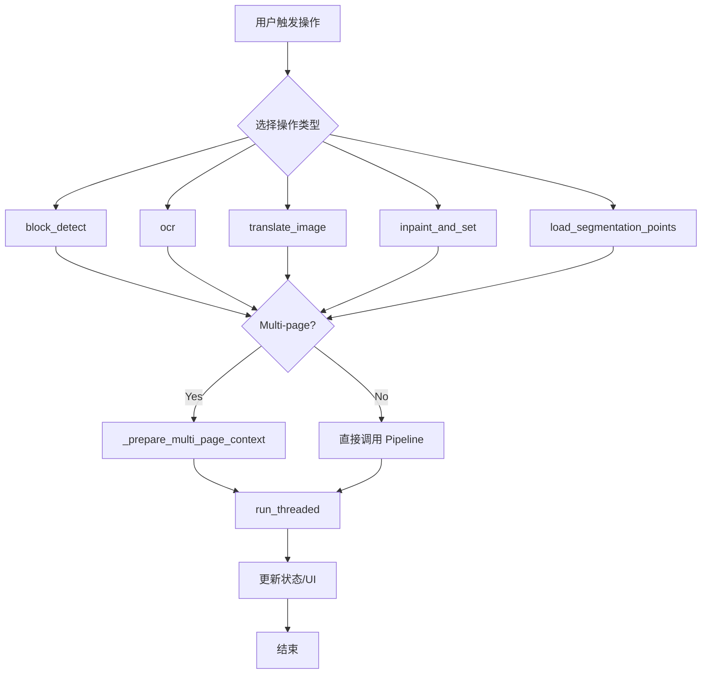

## 类结构

```
ComicTranslate (主应用程序)
└── ManualWorkflowController (工作流控制器)
```

## 全局变量及字段


### `ManualWorkflowController.main`
    
主程序实例引用，用于访问主应用程序的状态和方法

类型：`ComicTranslate`
    
    

## 全局函数及方法


### `ManualWorkflowController.__init__`

该方法是 `ManualWorkflowController` 类的构造函数，用于初始化手动工作流控制器，并将主应用程序控制器实例存储为类属性，以便后续方法访问主程序的状态和功能。

参数：

- `main`：`ComicTranslate`，主应用程序控制器实例，包含了整个应用的上下文、UI 元素、配置和业务逻辑

返回值：`None`，构造函数不返回值，仅用于初始化对象状态

#### 流程图

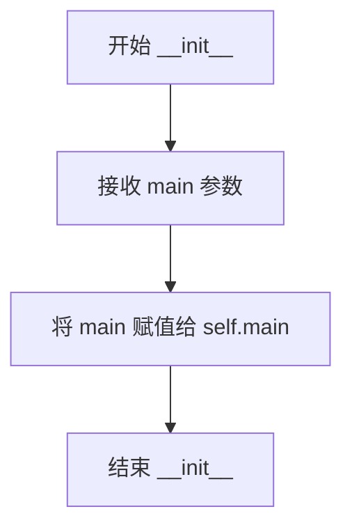

#### 带注释源码

```python
def __init__(self, main: ComicTranslate) -> None:
    """
    初始化 ManualWorkflowController 实例。
    
    参数:
        main: ComicTranslate - 主应用程序控制器实例，
              包含图像处理、UI 管理、翻译流程等核心功能
    """
    # 将主应用程序控制器引用存储为实例属性
    # 以便类中的其他方法可以访问主程序的状态和功能
    self.main = main
```


### `ManualWorkflowController._current_file_path`

该方法是一个简化的路径获取辅助方法，用于在手动工作流控制器中根据当前页面索引获取对应的图片文件路径。若当前索引在有效范围内，则返回对应的文件路径；否则返回 None。

参数：无（仅包含隐式参数 `self`）

返回值：`str | None`，返回当前页面的文件路径字符串，若索引无效则返回 `None`

#### 流程图

```mermaid
flowchart TD
    A[开始] --> B{检查索引有效性<br/>0 <= curr_img_idx < len(image_files)}
    B -->|是| C[返回 image_files[curr_img_idx]]
    B -->|否| D[返回 None]
    C --> E[结束]
    D --> E
```

#### 带注释源码

```python
def _current_file_path(self) -> str | None:
    """
    获取当前页面图片的文件路径。
    
    该方法检查当前图片索引是否在有效范围内，如果有效则返回
    对应的文件路径，否则返回 None。
    
    参数：
        无（仅包含隐式参数 self）
    
    返回值：
        str | None：当前页面的文件路径，若索引无效则返回 None
    """
    # 检查当前索引是否在有效范围内（大于等于0且小于文件列表长度）
    if 0 <= self.main.curr_img_idx < len(self.main.image_files):
        # 索引有效，返回对应的图片文件路径
        return self.main.image_files[self.main.curr_img_idx]
    # 索引无效，返回 None
    return None
```


### `ManualWorkflowController._selected_page_paths`

该方法是一个委托包装器，用于从主应用程序控制器获取当前用户界面上选中的页面文件路径列表。它充当了工作流控制器与主应用状态之间的桥梁，使得多页面处理逻辑（如批量检测、OCR、翻译）能够统一获取目标操作的文件集。

参数：

-  `self`：`ManualWorkflowController`，调用此方法的类实例本身，包含对主控制器（`main`）的引用。

返回值：`list[str]`，返回当前选中的页面所对应的文件路径列表。如果未选中任何页面或选区无效，通常返回空列表（具体行为取决于 `self.main.get_selected_page_paths()` 的实现）。

#### 流程图

```mermaid
graph TD
    A[Start: _selected_page_paths] --> B[Delegate: self.main.get_selected_page_paths()]
    B --> C[Return: List[str]]
```

#### 带注释源码

```python
def _selected_page_paths(self) -> list[str]:
    """
    获取当前选中的页面文件路径列表。

    此方法是对 ComicTranslate 主控制器方法的简单封装。
    它用于在工作流操作（如批量 OCR、翻译或文本检测）前，
    确定需要对哪些具体的图像文件进行处理。

    Returns:
        list[str]: 包含选中页面绝对路径的字符串列表。
    """
    # 调用主控制器实例的方法来获取当前选中的页面路径
    return self.main.get_selected_page_paths()
```


### `ManualWorkflowController._load_page_image`

该方法负责加载页面图像，优先从内存缓存中读取，若缓存未命中则调用图像控制器加载新图像，并将其存入缓存以供后续使用。

参数：

- `file_path`：`str`，要加载的图像文件路径

返回值：`Any`，返回加载的图像对象，若加载失败则返回 `None`

#### 流程图

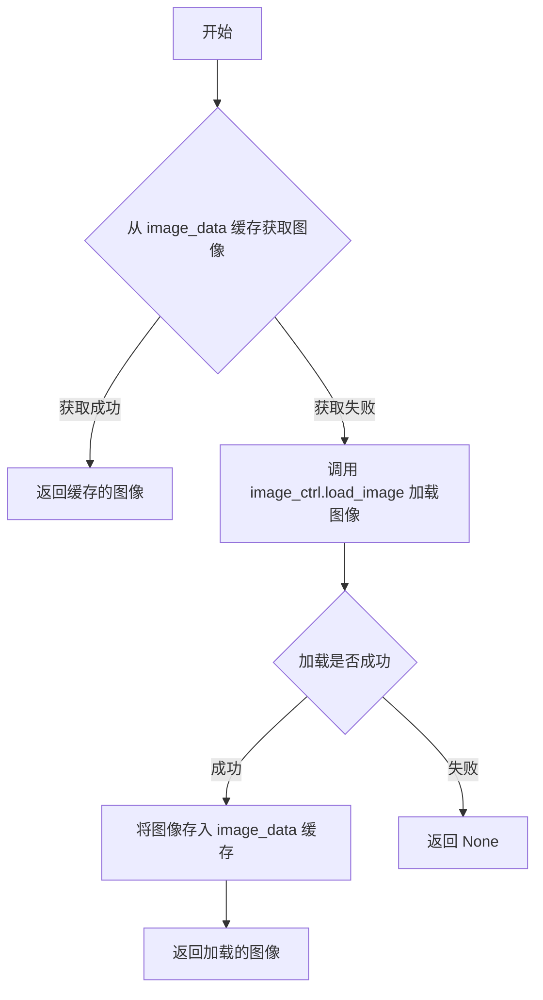

#### 带注释源码

```
def _load_page_image(self, file_path: str):
    """
    加载页面图像，优先使用缓存。
    
    参数:
        file_path: 要加载的图像文件路径
        
    返回:
        加载的图像对象，若加载失败则返回 None
    """
    # 尝试从内存缓存中获取图像
    img = self.main.image_data.get(file_path)
    
    # 如果缓存中没有该图像
    if img is None:
        # 调用图像控制器加载图像
        img = self.main.image_ctrl.load_image(file_path)
        
        # 加载成功后存入缓存，供后续使用
        if img is not None:
            self.main.image_data[file_path] = img
    
    # 返回图像（可能是缓存的或新加载的）
    return img
```


### `ManualWorkflowController._prepare_multi_page_context`

该方法用于在多页面处理场景下准备上下文环境，根据是否启用Webtoon模式执行不同的状态保存与页面卸载逻辑，并返回包含当前文件路径及页面卸载状态的字典，供后续操作判断当前页面是否需要重新加载。

参数：

- `selected_paths`：`list[str]`，选中的页面文件路径列表

返回值：`dict[str, Any]`，包含当前文件路径（current_file）和当前页面是否已卸载（current_page_unloaded）的上下文字典

#### 流程图

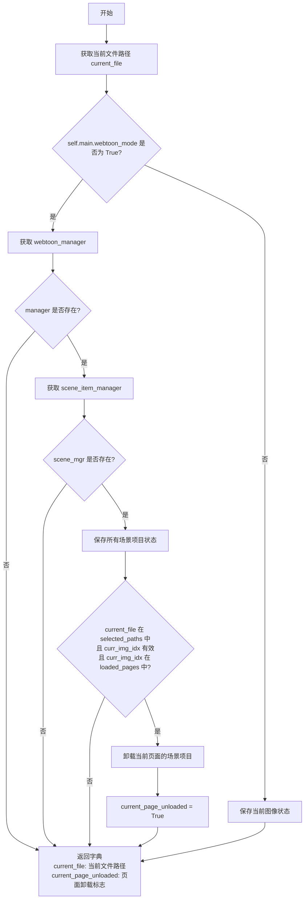

#### 带注释源码

```python
def _prepare_multi_page_context(self, selected_paths: list[str]) -> dict[str, Any]:
    """
    准备多页面处理的上下文环境。
    
    在Webtoon模式下，该方法会保存所有场景项目状态，并在特定条件下卸载当前页面的场景项目，
    以便在后续操作中重新加载。对于非Webtoon模式，则直接保存当前图像状态。
    
    返回的字典包含当前文件路径和页面卸载标志，用于后续操作判断当前页面是否需要重新加载。
    """
    
    # 获取当前显示的页面文件路径
    current_file = self._current_file_path()
    
    # 初始化当前页面卸载标志为False
    current_page_unloaded = False
    
    # 判断是否处于Webtoon模式
    if self.main.webtoon_mode:
        # 从image_viewer中获取webtoon_manager对象
        manager = getattr(self.main.image_viewer, "webtoon_manager", None)
        
        # 从manager中获取scene_item_manager
        scene_mgr = getattr(manager, "scene_item_manager", None) if manager is not None else None
        
        # 如果scene_item_manager存在
        if scene_mgr is not None:
            # 保存所有场景项目状态到持久化存储
            scene_mgr.save_all_scene_items_to_states()
            
            # 检查当前文件是否在选中的路径中，
            # 当前页面索引是否有效，
            # 当前页面是否已加载
            if (
                current_file in selected_paths
                and 0 <= self.main.curr_img_idx < len(self.main.image_files)
                and self.main.curr_img_idx in manager.loaded_pages
            ):
                # 卸载当前页面的场景项目以释放内存
                scene_mgr.unload_page_scene_items(self.main.curr_img_idx)
                
                # 标记当前页面已被卸载
                current_page_unloaded = True
    else:
        # 非Webtoon模式下，保存当前图像的编辑状态
        self.main.image_ctrl.save_current_image_state()

    # 返回包含当前文件路径和页面卸载状态的字典
    return {
        "current_file": current_file,
        "current_page_unloaded": current_page_unloaded,
    }
```


### `ManualWorkflowController._reload_current_webtoon_page`

该方法用于在 Webtoon（漫画）模式下重新加载当前页面的场景项，当多页面编辑中当前页面被临时卸载后需要恢复显示时调用此方法。它会检查必要的 Webtoon 管理器和场景项管理器是否存在，并验证当前页面索引的有效性，然后将页面场景项重新加载到视图中，最后清除文本编辑控件的内容。

参数：

- `self`：`ManualWorkflowController`，隐式参数，表示类的实例本身

返回值：`None`，无返回值

#### 流程图

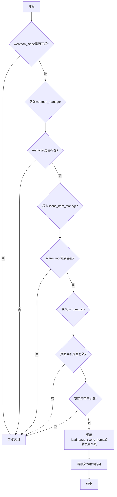

#### 带注释源码

```python
def _reload_current_webtoon_page(self) -> None:
    """
    在Webtoon模式下重新加载当前页面的场景项。
    当多页面编辑时当前页面被卸载后，调用此方法恢复页面显示。
    """
    # 检查是否处于webtoon模式，非webtoon模式直接返回
    if not self.main.webtoon_mode:
        return
    
    # 获取webtoon管理器实例
    manager = getattr(self.main.image_viewer, "webtoon_manager", None)
    # 如果管理器不存在则返回
    if manager is None:
        return
    
    # 获取场景项管理器
    scene_mgr = getattr(manager, "scene_item_manager", None)
    # 如果场景管理器不存在则返回
    if scene_mgr is None:
        return
    
    # 获取当前页面索引
    page_idx = self.main.curr_img_idx
    # 验证页面索引是否在有效范围内
    if not (0 <= page_idx < len(self.main.image_files)):
        return
    
    # 检查当前页面是否已经加载到内存中
    if page_idx not in manager.loaded_pages:
        return
    
    # 重新加载指定页面的场景项
    scene_mgr.load_page_scene_items(page_idx)
    
    # 清除当前的文本编辑内容
    self.main.text_ctrl.clear_text_edits()
```


### `ManualWorkflowController._serialize_rectangles_from_blocks`

将 TextBlock 对象列表序列化为包含矩形位置、旋转角度和变换原点的字典列表，用于保存或传输视图状态。

参数：

- `blk_list`：`list[TextBlock]`，包含 TextBlock 对象的列表，每个 TextBlock 代表一个文本块区域

返回值：`list[dict]`，返回序列化的矩形数据字典列表，每个字典包含 rect（矩形坐标和尺寸）、rotation（旋转角度）和 transform_origin（变换原点）

#### 流程图

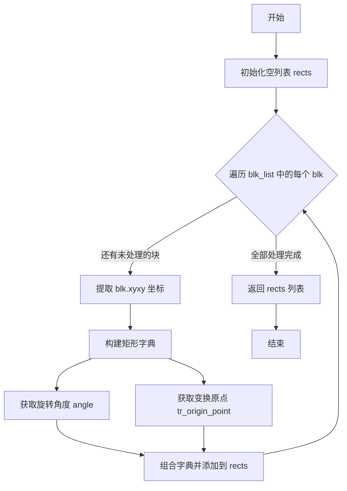

#### 带注释源码

```python
def _serialize_rectangles_from_blocks(self, blk_list: list[TextBlock]) -> list[dict]:
    """
    将 TextBlock 对象列表序列化为包含矩形位置、旋转角度和变换原点的字典列表
    
    参数:
        blk_list: 包含 TextBlock 对象的列表
        
    返回:
        序列化的矩形数据字典列表
    """
    rects: list[dict] = []  # 初始化用于存储序列化结果的空列表
    for blk in blk_list:    # 遍历输入的每个 TextBlock 对象
        x1, y1, x2, y2 = blk.xyxy  # 提取文本块的坐标 (左上角和右下角)
        rects.append(       # 将序列化后的矩形信息添加到结果列表
            {
                "rect": (float(x1), float(y1), float(x2 - x1), float(y2 - y1)),  # 转换为 (x, y, width, height) 格式
                "rotation": float(getattr(blk, "angle", 0)),  # 获取旋转角度，默认为 0
                # 获取变换原点，若不存在则默认为 (0.0, 0.0)
                "transform_origin": tuple(blk.tr_origin_point) if getattr(blk, "tr_origin_point", None) else (0.0, 0.0),
            }
        )
    return rects  # 返回序列化后的矩形数据列表
```


### `ManualWorkflowController._serialize_segmentation_strokes`

该方法用于将文本块（TextBlock）列表中的分割笔画（segmentation strokes）序列化为字典格式。它遍历每个文本块，提取其中的内部绘制边界框（inpaint_bboxes），通过图像查看器的绘图管理器生成笔画数据，并返回包含所有有效笔画的字典列表。

参数：

- `blk_list`：`list[TextBlock]`，待序列化的文本块列表，每个文本块应包含 `inpaint_bboxes` 属性存储分割边界框

返回值：`list[dict]`：序列化后的笔画数据字典列表，每个字典包含笔画的坐标和变换信息

#### 流程图

```mermaid
flowchart TD
    A[开始 _serialize_segmentation_strokes] --> B[获取 drawing_manager 的 make_segmentation_stroke_data 方法]
    B --> C[初始化空列表 strokes]
    C --> D{遍历 blk_list 中的每个 blk}
    D -->|是| E[获取 blk.inpaint_bboxes]
    E --> F{bboxes 不为 None 且长度大于 0?}
    F -->|否| D
    F -->|是| G[调用 build_stroke(bboxes) 生成笔画数据]
    G --> H{stroke 不为 None?}
    H -->|否| D
    H -->|是| I[将 stroke 添加到 strokes 列表]
    I --> D
    D -->|遍历完成| J[返回 strokes 列表]
    J --> K[结束]
```

#### 带注释源码

```python
def _serialize_segmentation_strokes(self, blk_list: list[TextBlock]) -> list[dict]:
    """
    将文本块列表中的分割笔画序列化为字典格式
    
    参数:
        blk_list: 文本块列表，每个块包含 inpaint_bboxes 属性
        
    返回:
        序列化后的笔画数据字典列表
    """
    # 初始化存储笔画结果的列表
    strokes: list[dict] = []
    
    # 从图像查看器的绘图管理器获取创建分割笔画数据的方法
    # drawing_manager 是 main.image_viewer.drawing_manager
    # make_segmentation_stroke_data 是一个可调用方法，用于将边界框数据转换为笔画格式
    build_stroke = self.main.image_viewer.drawing_manager.make_segmentation_stroke_data
    
    # 遍历所有文本块
    for blk in blk_list:
        # 获取当前文本块的内部绘制边界框（inpaint bboxes）
        # 这些边界框定义了需要分割/修复的区域
        bboxes = blk.inpaint_bboxes
        
        # 检查边界框是否存在且非空
        # 如果为 None 或空列表，则跳过该块
        if bboxes is None or len(bboxes) == 0:
            continue
        
        # 使用绘图管理器的方法将边界框转换为笔画数据
        stroke = build_stroke(bboxes)
        
        # 检查生成的笔画数据是否有效
        # 如果返回 None（可能是无效输入），则跳过
        if stroke is not None:
            # 将有效笔画添加到结果列表中
            strokes.append(stroke)
    
    # 返回所有序列化后的笔画数据
    return strokes
```


### `ManualWorkflowController.block_detect`

该方法是手动工作流控制器的核心功能之一，负责执行文本块检测操作。它根据用户选中的页面数量（单页或多页）分别处理：在多页模式下，批量检测所有选中页面并将结果保存到各页面状态中；在单页模式下，直接调用管道检测当前页面。方法通过后台线程执行检测以保持UI响应性，并在完成后更新项目状态。

参数：

- `load_rects`：`bool`，可选参数，默认为`True`，指示检测完成后是否加载矩形框到当前视图

返回值：`None`，该方法不返回任何值，通过回调函数处理结果

#### 流程图

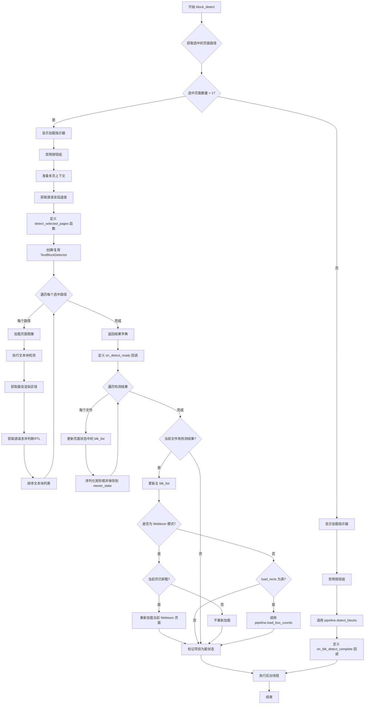

#### 带注释源码

```python
def block_detect(self, load_rects: bool = True) -> None:
    """
    执行文本块检测操作。
    
    根据选中的页面数量决定执行单页检测还是多页批量检测。
    检测过程在后台线程中执行，完成后通过回调更新UI状态。
    
    参数:
        load_rects: 布尔值，指示检测完成后是否加载矩形框到视图，默认为True
    """
    # 获取用户选中的所有页面路径
    selected_paths = self._selected_page_paths()
    
    # 判断是否为多页模式（选中超过1个页面）
    if len(selected_paths) > 1:
        # ============ 多页批量检测流程 ============
        
        # 1. 显示加载指示器，提示用户等待
        self.main.loading.setVisible(True)
        
        # 2. 禁用按钮组，防止用户在检测过程中进行其他操作
        self.main.disable_hbutton_group()
        
        # 3. 准备多页上下文环境，包括当前文件路径和页面卸载状态
        context = self._prepare_multi_page_context(selected_paths)
        
        # 4. 获取源语言的回退值（当页面未设置语言时使用）
        source_lang_fallback = self.main.s_combo.currentText()

        # 定义多页检测的内部函数，在后台线程中执行
        def detect_selected_pages() -> dict[str, list[TextBlock]]:
            """
            批量检测所有选中页面的文本块。
            
            遍历每个选中的页面，加载图像，执行文本块检测，
            并根据语言设置对结果进行排序（RTL支持）。
            
            返回:
                字典，键为文件路径，值为对应的TextBlock列表
            """
            # 创建文本块检测器（使用缓存避免重复创建）
            if self.main.pipeline.block_detection.block_detector_cache is None:
                self.main.pipeline.block_detection.block_detector_cache = TextBlockDetector(self.main.settings_page)
            detector = self.main.pipeline.block_detection.block_detector_cache
            
            results: dict[str, list[TextBlock]] = {}
            
            # 遍历每个选中的页面路径进行检测
            for file_path in selected_paths:
                # 加载页面图像
                image = self._load_page_image(file_path)
                if image is None:
                    continue
                
                # 执行文本块检测
                blk_list = detector.detect(image)
                
                # 如果检测到文本块，计算最佳渲染区域
                if blk_list:
                    get_best_render_area(blk_list, image)
                
                # 获取页面状态中的源语言设置
                state = self.main.image_states.get(file_path, {})
                source_lang = state.get("source_lang", source_lang_fallback)
                
                # 映射语言代码并判断是否为RTL语言（日语）
                source_lang_en = self.main.lang_mapping.get(source_lang, source_lang)
                rtl = source_lang_en == "Japanese"
                
                # 对文本块列表进行排序（支持RTL）
                results[file_path] = sort_blk_list(blk_list, rtl)
            
            return results

        # 定义检测完成后的回调函数，在主线程中执行UI更新
        def on_detect_ready(results: dict[str, list[TextBlock]]) -> None:
            """
            处理批量检测结果。
            
            将检测到的文本块保存到各页面的状态中，
            并更新当前页面的显示。
            """
            current_file = context["current_file"]
            current_blocks: list[TextBlock] | None = None
            
            # 遍历检测结果，更新每个页面的状态
            for file_path, blk_list in (results or {}).items():
                state = self.main.image_states.get(file_path)
                if state is None:
                    continue
                
                # 保存文本块列表到页面状态
                state["blk_list"] = blk_list
                
                # 创建或更新viewer_state，保存序列化后的矩形框
                viewer_state = state.setdefault("viewer_state", {})
                viewer_state["rectangles"] = self._serialize_rectangles_from_blocks(blk_list)
                
                # 如果是当前文件，保存一份副本用于当前页面显示
                if file_path == current_file:
                    current_blocks = blk_list

            # 如果当前页面有检测结果，更新主文本块列表
            if current_blocks is not None:
                self.main.blk_list = current_blocks.copy()
                
                # Webtoon模式特殊处理
                if self.main.webtoon_mode:
                    # 如果当前页面之前被卸载，现在需要重新加载
                    if context["current_page_unloaded"]:
                        self._reload_current_webtoon_page()
                # 非Webtoon模式且需要加载矩形框
                elif load_rects:
                    self.main.pipeline.load_box_coords(self.main.blk_list)

            # 如果有检测结果，标记项目为脏状态（需要保存）
            if results:
                self.main.mark_project_dirty()

        # 在后台线程中执行检测，传入主线程回调和错误处理
        self.main.run_threaded(
            detect_selected_pages,
            on_detect_ready,
            self.main.default_error_handler,
            self.main.on_manual_finished,
        )
        return

    # ============ 单页检测流程 ============
    
    # 1. 显示加载指示器
    self.main.loading.setVisible(True)
    
    # 2. 禁用按钮组
    self.main.disable_hbutton_group()
    
    # 3. 调用pipeline的单页检测方法
    # 参数load_rects决定是否加载检测到的矩形框
    self.main.run_threaded(
        self.main.pipeline.detect_blocks,           # 检测函数
        self.main.pipeline.on_blk_detect_complete,  # 完成回调
        self.main.default_error_handler,             # 错误处理
        self.main.on_manual_finished,                # 完成后的最终处理
        load_rects,                                  # 传递给检测函数的参数
    )
```


### `ManualWorkflowController.finish_ocr_translate`

该方法用于完成OCR和翻译操作后的收尾工作：选中当前处理的文本块、切换工具至"box"模式、并触发手动操作完成回调。

参数：

- `single_block`：`bool`，默认为 `False`，表示是否仅处理当前选中的单个文本块

返回值：`None`，无返回值

#### 流程图

```mermaid
flowchart TD
    A[开始] --> B{self.main.blk_list 是否存在}
    B -->|否| H[直接跳到步骤G]
    B -->|是| C{single_block 是否为 True}
    C -->|是| D[获取选中的矩形: selected_rect]
    C -->|否| E{是否 Webtoon 模式}
    E -->|是| F1[获取第一个可见文本块<br/>get_first_visible_block]
    E -->|否| F2[直接使用 blk_list[0]]
    F1 --> F3[查找对应矩形<br/>find_corresponding_rect]
    F2 --> F3
    D --> I[选中矩形 select_rectangle]
    F3 --> I
    I --> G[设置工具为 'box']
    G --> J[触发完成回调 on_manual_finished]
    J --> K[结束]
```

#### 带注释源码

```python
def finish_ocr_translate(self, single_block: bool = False) -> None:
    """
    完成OCR翻译后的收尾工作
    
    参数:
        single_block: 是否仅处理当前选中的单个文本块
    """
    # 检查是否存在文本块列表
    if self.main.blk_list:
        if single_block:
            # 单块模式：直接使用当前选中的矩形区域
            rect = self.main.image_viewer.selected_rect
        else:
            # 多块模式：根据不同视图模式获取第一个文本块
            if self.main.webtoon_mode:
                # Webtoon模式：获取可见区域内的第一个文本块
                first_block = get_first_visible_block(
                    self.main.blk_list, self.main.image_viewer
                )
                # 若无可见块，则回退到列表第一个
                if first_block is None:
                    first_block = self.main.blk_list[0]
            else:
                # 普通模式：直接使用列表中的第一个块
                first_block = self.main.blk_list[0]
            
            # 根据文本块查找对应的矩形区域（0.5为容差系数）
            rect = self.main.rect_item_ctrl.find_corresponding_rect(first_block, 0.5)
        
        # 在图像查看器中选中该矩形区域
        self.main.image_viewer.select_rectangle(rect)
    
    # 切换工具为"box"（框选工具）
    self.main.set_tool("box")
    # 触发手动操作完成回调
    self.main.on_manual_finished()
```


### `ManualWorkflowController.ocr`

该方法是手动工作流的核心部分，负责执行光学字符识别（OCR）。它根据当前选择的页面数量和模式（是否为单块模式）分别处理批量页面OCR、单页OCR或可见区域OCR，并利用缓存机制避免重复识别，同时管理UI的加载状态。

参数：

-  `single_block`：`bool`，默认为 `False`。指示是否仅对当前选中的文本块进行OCR（若为True，则忽略多选页面逻辑，仅处理当前页面），否则处理整页或可见区域。

返回值：`None`，该方法通过回调函数和修改主程序状态（`self.main`）来完成业务流程。

#### 流程图

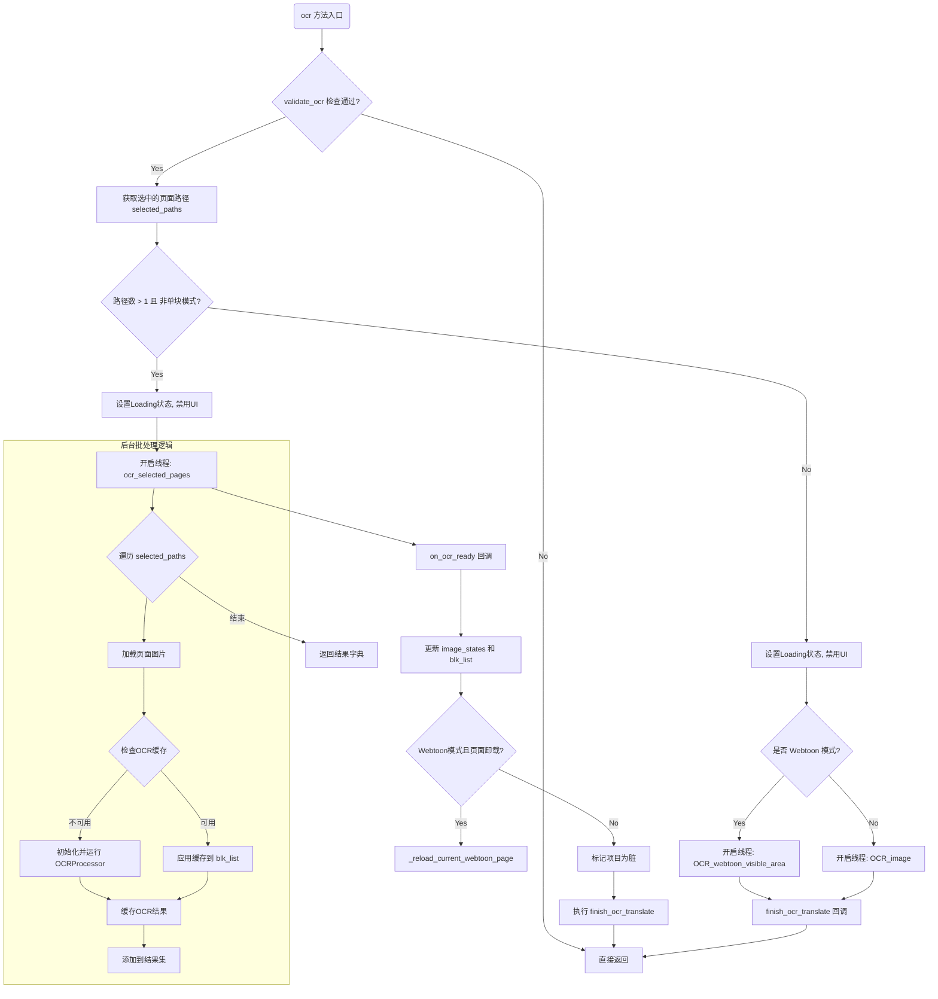

#### 带注释源码

```python
def ocr(self, single_block: bool = False) -> None:
    """
    执行OCR识别。
    根据选择路径的数量和 single_block 参数决定是批量处理多页，
    还是处理当前页面的全部/可见区域。
    """
    # 1. 前置验证：检查OCR配置是否完整（如模型是否选择）
    if not validate_ocr(self.main):
        return

    # 2. 获取用户选中的所有页面路径
    selected_paths = self._selected_page_paths()

    # 3. 判断逻辑分支：
    #    如果选中了多个页面 且 不是单块模式，则进入批量处理流程
    if len(selected_paths) > 1 and not single_block:
        # --- 批量处理分支 ---
        self.main.loading.setVisible(True)
        self.main.disable_hbutton_group()
        
        # 准备多页上下文，处理webtoon模式下的页面卸载逻辑
        context = self._prepare_multi_page_context(selected_paths)
        source_lang_fallback = self.main.s_combo.currentText()

        # 定义后台线程函数：逐个页面进行OCR
        def ocr_selected_pages() -> dict[str, list[TextBlock]]:
            cache_manager = self.main.pipeline.cache_manager
            ocr = OCRProcessor()
            ocr_model = self.main.settings_page.get_tool_selection("ocr")
            device = resolve_device(self.main.settings_page.is_gpu_enabled())
            results: dict[str, list[TextBlock]] = {}

            for file_path in selected_paths:
                state = self.main.image_states.get(file_path, {})
                blk_list = state.get("blk_list", [])
                if not blk_list:
                    continue
                
                image = self._load_page_image(file_path)
                if image is None:
                    continue
                
                source_lang = state.get("source_lang", source_lang_fallback)
                
                # 尝试从缓存获取
                cache_key = cache_manager._get_ocr_cache_key(image, source_lang, ocr_model, device)
                if cache_manager._can_serve_all_blocks_from_ocr_cache(cache_key, blk_list):
                    # 命中缓存，直接应用
                    cache_manager._apply_cached_ocr_to_blocks(cache_key, blk_list)
                else:
                    # 未命中缓存，执行OCR
                    ocr.initialize(self.main, source_lang)
                    ocr.process(image, blk_list)
                    # 保存结果到缓存
                    cache_manager._cache_ocr_results(cache_key, blk_list)
                
                results[file_path] = blk_list
            return results

        # 定义主线程回调：更新UI和状态
        def on_ocr_ready(results: dict[str, list[TextBlock]]) -> None:
            current_file = context["current_file"]
            # 遍历结果更新状态字典
            for file_path, blk_list in (results or {}).items():
                state = self.main.image_states.get(file_path)
                if state is None:
                    continue
                state["blk_list"] = blk_list
                # 如果是当前显示的页面，更新内存中的块列表
                if file_path == current_file:
                    self.main.blk_list = blk_list.copy()

            # 如果是Webtoon模式且之前卸载了当前页，重新加载
            if self.main.webtoon_mode and context["current_page_unloaded"]:
                self._reload_current_webtoon_page()

            if results:
                self.main.mark_project_dirty()

        # 启动线程
        self.main.run_threaded(
            ocr_selected_pages,
            on_ocr_ready,
            self.main.default_error_handler,
            lambda: self.finish_ocr_translate(single_block), # 完成后调用 finish
        )
        return

    # --- 单页/可见区域处理分支 ---
    self.main.loading.setVisible(True)
    self.main.disable_hbutton_group()

    if self.main.webtoon_mode:
        # Webtoon 模式下处理可见区域
        self.main.run_threaded(
            lambda: self.main.pipeline.OCR_webtoon_visible_area(single_block),
            None,
            self.main.default_error_handler,
            lambda: self.finish_ocr_translate(single_block),
        )
    else:
        # 普通模式处理整页或单块
        self.main.run_threaded(
            lambda: self.main.pipeline.OCR_image(single_block),
            None,
            self.main.default_error_handler,
            lambda: self.finish_ocr_translate(single_block),
        )
```


### `ManualWorkflowController.translate_image`

该方法负责执行图像文本翻译操作，支持单页/多页模式以及单块/全块模式。它首先获取用户选中的页面路径，根据选中数量决定是执行多页翻译还是单页翻译。在多页模式下，会检查所有页面是否存在可翻译文本，验证目标语言是否有效，然后通过后台线程遍历每个页面的文本块进行翻译。而在单页模式下，则直接验证当前页面的文本和翻译器配置，根据是否处于Webtoon模式调用相应的管道翻译方法。

参数：

- `single_block`：`bool`，可选参数，指定是否仅翻译选中的单个文本块，默认为 `False`（翻译所有文本块）

返回值：`None`，该方法不返回任何值，通过回调函数 `update_translated_text_items` 更新翻译结果

#### 流程图

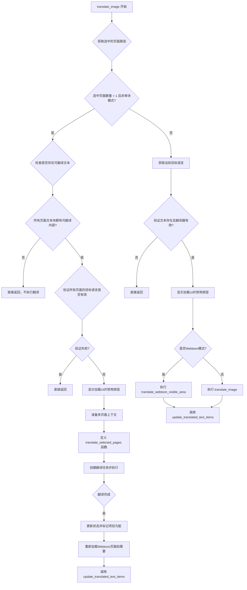

#### 带注释源码

```python
def translate_image(self, single_block: bool = False) -> None:
    """
    执行图像文本翻译操作
    
    参数:
        single_block: bool, 是否仅翻译当前选中的单个文本块
                      默认为 False，表示翻译页面中所有文本块
    返回:
        None: 该方法通过回调函数 update_translated_text_items 更新UI
    """
    
    # 步骤1: 获取用户选中的所有页面路径
    selected_paths = self._selected_page_paths()
    
    # 步骤2: 判断是否为多页面翻译模式
    # 多页面模式条件: 选中页面数 > 1 且不是单块翻译模式
    if len(selected_paths) > 1 and not single_block:
        
        # 步骤2.1: 检查选中页面中是否存在可翻译的文本
        has_any_text = False
        for file_path in selected_paths:
            # 从页面状态中获取文本块列表
            blk_list = self.main.image_states.get(file_path, {}).get("blk_list", [])
            # 检查该页面的文本块是否包含可翻译内容
            if is_there_text(blk_list):
                has_any_text = True
                break
        
        # 如果没有任何可翻译文本，直接返回
        if not has_any_text:
            return
        
        # 步骤2.2: 验证所有选中页面的目标语言是否有效
        for file_path in selected_paths:
            # 获取该页面保存的目标语言，若无则使用当前UI选中的语言
            target_lang = self.main.image_states.get(file_path, {}).get(
                "target_lang", self.main.t_combo.currentText()
            )
            # 验证翻译器配置是否有效
            if not validate_translator(self.main, target_lang):
                return

        # 步骤2.3: 准备翻译前的UI状态
        self.main.loading.setVisible(True)           # 显示加载指示器
        self.main.disable_hbutton_group()             # 禁用用户交互按钮
        
        # 步骤2.4: 准备多页面上下文环境（处理Webtoon模式的页面卸载）
        context = self._prepare_multi_page_context(selected_paths)
        
        # 步骤2.5: 获取翻译所需的配置参数
        source_lang_fallback = self.main.s_combo.currentText()  # 源语言
        target_lang_fallback = self.main.t_combo.currentText()  # 目标语言
        settings_page = self.main.settings_page                  # 设置页面
        extra_context = settings_page.get_llm_settings()["extra_context"]  # LLM额外上下文
        translator_key = settings_page.get_tool_selection("translator")    # 翻译器选择
        upper_case = settings_page.ui.uppercase_checkbox.isChecked()       # 是否大写

        # 步骤2.6: 定义多页面翻译的内部函数
        def translate_selected_pages() -> dict[str, list[TextBlock]]:
            """
            在后台线程中翻译所有选中的页面
            
            返回:
                dict: 键为文件路径，值为翻译后的TextBlock列表
            """
            cache_manager = self.main.pipeline.cache_manager
            results: dict[str, list[TextBlock]] = {}
            
            # 遍历每个选中的页面进行翻译
            for file_path in selected_paths:
                state = self.main.image_states.get(file_path, {})
                blk_list = state.get("blk_list", [])
                
                # 跳过没有文本块的页面
                if not blk_list:
                    continue
                
                # 加载页面图像
                image = self._load_page_image(file_path)
                if image is None:
                    continue
                
                # 获取源语言和目标语言
                source_lang = state.get("source_lang", source_lang_fallback)
                target_lang = state.get("target_lang", target_lang_fallback)
                
                # 创建翻译器实例
                translator = Translator(self.main, source_lang, target_lang)
                
                # 构建缓存键
                cache_key = cache_manager._get_translation_cache_key(
                    image,
                    source_lang,
                    target_lang,
                    translator_key,
                    extra_context,
                )
                
                # 检查翻译缓存是否可用
                if cache_manager._can_serve_all_blocks_from_translation_cache(cache_key, blk_list):
                    # 直接从缓存应用翻译结果
                    cache_manager._apply_cached_translations_to_blocks(cache_key, blk_list)
                else:
                    # 执行实际翻译操作
                    translator.translate(blk_list, image, extra_context)
                    # 缓存翻译结果
                    cache_manager._cache_translation_results(cache_key, blk_list)
                
                # 根据设置应用大写转换
                set_upper_case(blk_list, upper_case)
                results[file_path] = blk_list
            
            return results

        # 步骤2.7: 定义翻译完成后的回调函数
        def on_translation_ready(results: dict[str, list[TextBlock]]) -> None:
            """
            翻译完成后的处理逻辑
            
            参数:
                results: 翻译结果字典，键为文件路径，值为TextBlock列表
            """
            current_file = context["current_file"]
            
            # 更新每个页面的状态
            for file_path, blk_list in (results or {}).items():
                state = self.main.image_states.get(file_path)
                if state is None:
                    continue
                state["blk_list"] = blk_list
                
                # 如果是当前文件，更新主控制器的blk_list
                if file_path == current_file:
                    self.main.blk_list = blk_list.copy()

            # 如果是Webtoon模式且当前页被卸载过，重新加载
            if self.main.webtoon_mode and context["current_page_unloaded"]:
                self._reload_current_webtoon_page()

            # 标记项目需要保存
            if results:
                self.main.mark_project_dirty()

        # 步骤2.8: 在后台线程执行翻译任务
        self.main.run_threaded(
            translate_selected_pages,
            on_translation_ready,
            self.main.default_error_handler,
            lambda: self.update_translated_text_items(single_block),
        )
        return

    # 步骤3: 单页面翻译模式
    # 获取当前UI中选中的目标语言
    target_lang = self.main.t_combo.currentText()
    
    # 验证当前页面是否有可翻译文本且翻译器配置有效
    if not is_there_text(self.main.blk_list) or not validate_translator(
        self.main, target_lang
    ):
        return
    
    # 准备UI状态
    self.main.loading.setVisible(True)
    self.main.disable_hbutton_group()

    # 步骤3.1: 根据模式选择不同的翻译方法
    if self.main.webtoon_mode:
        # Webtoon模式：仅翻译可见区域的文本
        self.main.run_threaded(
            lambda: self.main.pipeline.translate_webtoon_visible_area(single_block),
            None,
            self.main.default_error_handler,
            lambda: self.update_translated_text_items(single_block),
        )
    else:
        # 普通模式：翻译整张图片的所有文本
        self.main.run_threaded(
            lambda: self.main.pipeline.translate_image(single_block),
            None,
            self.main.default_error_handler,
            lambda: self.update_translated_text_items(single_block),
        )
```


### `ManualWorkflowController._get_visible_text_items`

该方法用于获取当前视图中可见的文本项目列表。在 Webtoon 模式下，它会调用工具函数根据 Webtoon 管理器过滤出当前可见的文本块；在普通模式下，直接返回图像查看器中的所有文本项。

参数：无显式外部参数（隐式使用 `self`）

返回值：`list[TextBlockItem]`，返回当前可见的文本块项目列表

#### 流程图

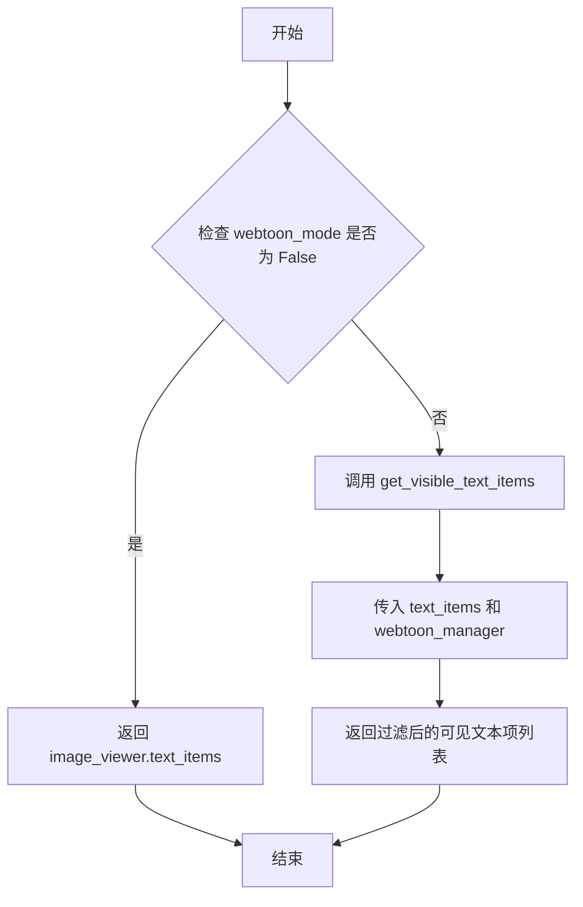

#### 带注释源码

```
def _get_visible_text_items(self) -> list[TextBlockItem]:
    """
    获取当前视图可见的文本项目列表。
    
    在 Webtoon 模式下，需要根据页面可见性过滤文本项；
    在普通模式下，直接返回所有文本项。
    
    Returns:
        list[TextBlockItem]: 可见的文本块项目列表
    """
    # 检查是否处于 Webtoon 模式
    if not self.main.webtoon_mode:
        # 普通模式：直接返回图像查看器中的所有文本项
        return self.main.image_viewer.text_items
    
    # Webtoon 模式：调用工具函数根据可见性过滤文本项
    return get_visible_text_items(
        self.main.image_viewer.text_items, 
        self.main.image_viewer.webtoon_manager
    )
```


### `ManualWorkflowController.update_translated_text_items`

该方法负责在翻译完成后更新画布上的文本项目。它首先获取当前可见的文本项目，然后对每个文本块进行格式化处理（包括换行、大小写转换等），并在后台线程中执行文本换行计算，最后将处理后的文本更新到对应的TextBlockItem中。

参数：

- `single_blk`：`bool`，表示是否仅处理单个文本块（True表示单块模式，False表示批量处理）

返回值：`None`，该方法无返回值，通过副作用更新UI

#### 流程图

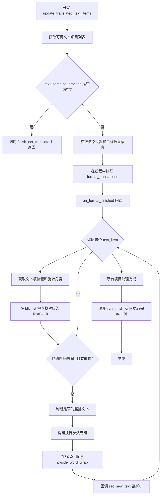

#### 带注释源码

```python
def update_translated_text_items(self, single_blk: bool) -> None:
    """更新翻译后的文本项目到UI中
    
    Args:
        single_blk: bool - 是否只处理单个文本块
    """
    
    def set_new_text(
        text_item: TextBlockItem, 
        wrapped: str, 
        font_size: int
    ) -> None:
        """内部函数：设置文本项的新文本内容
        
        Args:
            text_item: TextBlockItem - 要更新的文本项
            wrapped: str - 换行处理后的文本
            font_size: int - 计算得到的字体大小
        """
        # 如果目标语言是无空格语言，移除所有空格
        if is_no_space_lang(trg_lng_cd):
            wrapped = wrapped.replace(" ", "")
        # 更新文本项的纯文本内容
        text_item.set_plain_text(wrapped)
        # 设置字体大小
        text_item.set_font_size(font_size)

    # 获取当前可见的文本项目列表（支持Webtoon模式）
    text_items_to_process = self._get_visible_text_items()
    
    # 如果没有可见的文本项目，直接完成OCR/翻译流程
    if not text_items_to_process:
        self.finish_ocr_translate(single_blk)
        return

    # 获取渲染设置
    rs = self.main.render_settings()
    # 获取大写设置
    upper = rs.upper_case
    # 获取目标语言的英文映射
    target_lang_en = self.main.lang_mapping.get(self.main.t_combo.currentText(), None)
    # 获取目标语言代码
    trg_lng_cd = get_language_code(target_lang_en)

    def on_format_finished() -> None:
        """格式化完成后的回调函数，处理每个文本项"""
        # 遍历所有需要处理的文本项
        for text_item in text_items_to_process:
            # 取消选择文本项
            text_item.handleDeselection()
            # 获取文本项的屏幕坐标
            x1, y1 = int(text_item.pos().x()), int(text_item.pos().y())
            # 获取旋转角度
            rot = text_item.rotation()

            # 在blk_list中查找位置和角度匹配的TextBlock
            blk = next(
                (
                    b
                    for b in self.main.blk_list
                    if is_close(b.xyxy[0], x1, 5)
                    and is_close(b.xyxy[1], y1, 5)
                    and is_close(b.angle, rot, 1)
                ),
                None,
            )
            
            # 如果没找到匹配的块或没有翻译内容，跳过
            if not (blk and blk.translation):
                continue

            # 判断是否为竖排文本块
            vertical = is_vertical_block(blk, trg_lng_cd)
            
            # 构建换行参数元组
            wrap_args = (
                blk.translation,  # 翻译文本
                text_item.font_family,  # 字体族
                blk.xyxy[2] - blk.xyxy[0],  # 宽度
                blk.xyxy[3] - blk.xyxy[1],  # 高度
                float(text_item.line_spacing),  # 行间距
                float(text_item.outline_width),  # 轮廓宽度
                text_item.bold,  # 粗体
                text_item.italic,  # 斜体
                text_item.underline,  # 下划线
                text_item.alignment,  # 对齐方式
                text_item.direction,  # 文本方向
                rs.max_font_size,  # 最大字体大小
                rs.min_font_size,  # 最小字体大小
                vertical,  # 是否竖排
            )

            # 在后台线程中执行文本换行计算
            self.main.run_threaded(
                pyside_word_wrap,  # 换行函数
                lambda wrap_res, ti=text_item: set_new_text(
                    ti, wrap_res[0], wrap_res[1]
                ),  # 回调：设置新文本
                self.main.default_error_handler,
                None,
                *wrap_args,
            )

        # 执行完成后的回调
        self.main.run_finish_only(finished_callback=self.main.on_manual_finished)

    # 在后台线程中执行翻译格式化处理
    self.main.run_threaded(
        lambda: format_translations(self.main.blk_list, trg_lng_cd, upper_case=upper),
        None,
        self.main.default_error_handler,
        on_format_finished,
    )
```


### `ManualWorkflowController.inpaint_and_set`

该方法负责执行图像修复（Inpainting）操作。它首先检查当前图像视图是否已加载图片，然后根据选定的页面数量（单页或多页）以及是否存在用户绘制的笔触（brush strokes）来决定处理流程。在多页模式下，它并行处理所有选中的页面；在单页模式下，它仅处理当前页面中包含笔触的图像区域。整个过程涉及后台线程执行、撤销栈管理以及图像视图的更新。

参数：
- `self`：隐式参数，表示 `ManualWorkflowController` 的实例。

返回值：`None`，该方法直接操作 UI 和图像状态，不返回具体数据。

#### 流程图

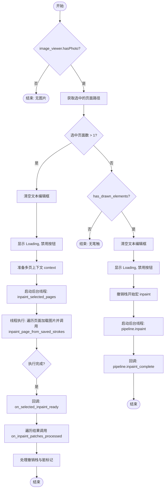

#### 带注释源码

```python
def inpaint_and_set(self) -> None:
    # 1. 前置检查：确保图像查看器已加载图片
    if not self.main.image_viewer.hasPhoto():
        return

    # 2. 获取当前选中的所有页面路径
    selected_paths = self._selected_page_paths()
    
    # 3. 判断是否为多页模式（选中页面数 > 1）
    if len(selected_paths) > 1:
        # --- 多页处理逻辑 ---
        
        # 3.1 UI 准备：清空文本、显示加载状态、禁用交互按钮
        self.main.text_ctrl.clear_text_edits()
        self.main.loading.setVisible(True)
        self.main.disable_hbutton_group()
        
        # 3.2 准备上下文信息（保存当前页面状态等）
        context = self._prepare_multi_page_context(selected_paths)

        # 3.3 定义多页修复的后台任务
        def inpaint_selected_pages() -> dict[str, list[dict]]:
            results: dict[str, list[dict]] = {}
            # 建立路径到索引的映射，用于 Webtoon 模式坐标转换
            path_to_index = {p: i for i, p in enumerate(self.main.image_files)}

            # 遍历所有选中的文件
            for file_path in selected_paths:
                state = self.main.image_states.get(file_path, {})
                # 获取该页面的笔触数据
                strokes = state.get("brush_strokes", [])
                if not strokes:
                    continue
                
                # 加载页面图片
                image = self._load_page_image(file_path)
                if image is None:
                    continue

                # 调用 Pipeline 进行修复，返回补丁列表
                patches = self.main.pipeline.inpainting.inpaint_page_from_saved_strokes(
                    image,
                    strokes,
                )

                # 如果是 Webtoon 模式，需要将补丁坐标转换为场景坐标
                if self.main.webtoon_mode and patches:
                    page_idx = path_to_index.get(file_path)
                    if page_idx is not None:
                        for patch in patches:
                            x, y, _w, _h = patch['bbox']
                            # 转换页面坐标到场景坐标
                            scene_pos = self.main.image_viewer.page_to_scene_coordinates(
                                page_idx,
                                QtCore.QPointF(x, y),
                            )
                            if scene_pos is not None:
                                patch['scene_pos'] = [scene_pos.x(), scene_pos.y()]
                                patch['page_index'] = page_idx

                results[file_path] = patches

            return results

        # 3.4 定义多页修复完成后的回调函数
        def on_selected_inpaint_ready(results: dict[str, list[dict]]) -> None:
            current_file = context["current_file"]
            processed_any = False

            # 遍历处理结果
            for file_path, patches in (results or {}).items():
                # 开启撤销宏
                stack = self.main.undo_stacks.get(file_path)
                if stack is not None:
                    stack.beginMacro("inpaint")
                try:
                    if patches:
                        # 应用修复补丁到图像控制器
                        self.main.image_ctrl.on_inpaint_patches_processed(patches, file_path)
                finally:
                    if stack is not None:
                        stack.endMacro()

                # 清除该页面的笔触状态
                state = self.main.image_states.get(file_path)
                if state is not None:
                    state['brush_strokes'] = []
                processed_any = True

            # 如果不是 Webtoon 模式且当前文件有结果，清除视图上的笔触
            if not self.main.webtoon_mode and current_file in (results or {}):
                self.main.image_viewer.clear_brush_strokes(page_switch=True)

            # 如果是 Webtoon 模式且之前卸载了当前页，重新加载
            if self.main.webtoon_mode and context["current_page_unloaded"]:
                self._reload_current_webtoon_page()

            # 标记项目已修改
            if processed_any:
                self.main.mark_project_dirty()

        # 3.5 启动多页后台任务
        self.main.run_threaded(
            inpaint_selected_pages,
            on_selected_inpaint_ready,
            self.main.default_error_handler,
            self.main.on_manual_finished,
        )
        return

    # 4. 单页处理逻辑（选中页面数 <= 1）
    # 检查当前页面是否有用户绘制的元素（笔触）
    if self.main.image_viewer.has_drawn_elements():
        # 4.1 UI 准备
        self.main.text_ctrl.clear_text_edits()
        self.main.loading.setVisible(True)
        self.main.disable_hbutton_group()
        
        # 4.2 开启撤销宏
        self.main.undo_group.activeStack().beginMacro("inpaint")
        
        # 4.3 启动单页后台任务
        self.main.run_threaded(
            self.main.pipeline.inpaint,
            self.main.pipeline.inpaint_complete,
            self.main.default_error_handler,
            self.main.on_manual_finished,
        )
```


### `ManualWorkflowController.blk_detect_segment`

该方法作为块检测（Block Detection）流程完成后的回调函数（Callback）。它主要用于分割（Segmentation）工作流中，接收到检测到的文本块列表后，将其更新到主控制器的状态中，并在图像查看器上绘制对应的分割线（Mask线），同时将这一系列操作包裹在一个撤销宏中。

参数：

- `result`：`tuple[list[TextBlock], bool] | tuple[list[TextBlock], bool, Any]`，块检测函数的返回结果。其中包含检测到的 `TextBlock` 对象列表，以及一个布尔值标志（通常用于指示是否需要加载矩形框）。支持长度为 2 或 3 的元组（长度为 3 时多一个未使用的参数）。

返回值：`None`，该方法通过副作用（更新 UI 和状态）完成工作，不返回具体数据。

#### 流程图

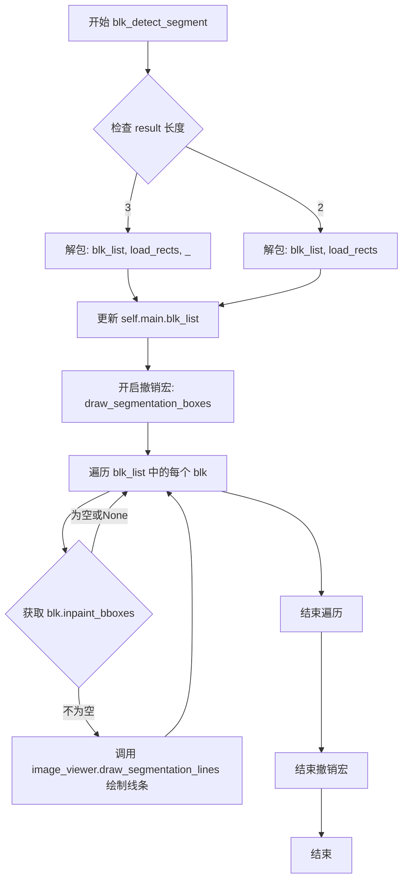

#### 带注释源码

```python
def blk_detect_segment(
    self, 
    result: tuple[list[TextBlock], bool] | tuple[list[TextBlock], bool, Any]
) -> None:
    """
    处理块检测结果，更新主文本块列表并绘制分割线。
    用作 detect_blocks 流程完成后的回调。
    """
    # 根据元组长度解包结果，提取文本块列表和加载矩形标志
    if len(result) == 3:
        blk_list, load_rects, _ = result
    else:
        blk_list, load_rects = result
    
    # 1. 更新主控制器的文本块列表
    self.main.blk_list = blk_list
    
    # 2. 开启撤销宏，将绘制操作合并为一个可撤销的整体操作
    self.main.undo_group.activeStack().beginMacro("draw_segmentation_boxes")
    
    # 3. 遍历所有文本块，绘制分割线（Mask）
    for blk in self.main.blk_list:
        # 获取当前块的修复区域（Inpaint BBoxes）
        bboxes = blk.inpaint_bboxes
        # 如果存在有效的区域坐标，则绘制
        if bboxes is not None and len(bboxes) > 0:
            self.main.image_viewer.draw_segmentation_lines(bboxes)
            
    # 4. 结束撤销宏
    self.main.undo_group.activeStack().endMacro()
```


### `ManualWorkflowController.load_segmentation_points`

该函数是手动工作流的核心入口之一，负责为当前的文本块加载或计算分割点（用于图像修复的遮罩区域）。它首先清理UI并准备绘图环境，然后根据当前是否有文本块（blk_list）以及是否是多页模式来决定是直接计算分割区域还是先运行文本块检测。

参数：

- 无显式参数（依赖类实例 `self` 和主控制器的上下文）。

返回值：`None`，该函数通过副作用（修改UI状态、运行线程任务）完成功能。

#### 流程图

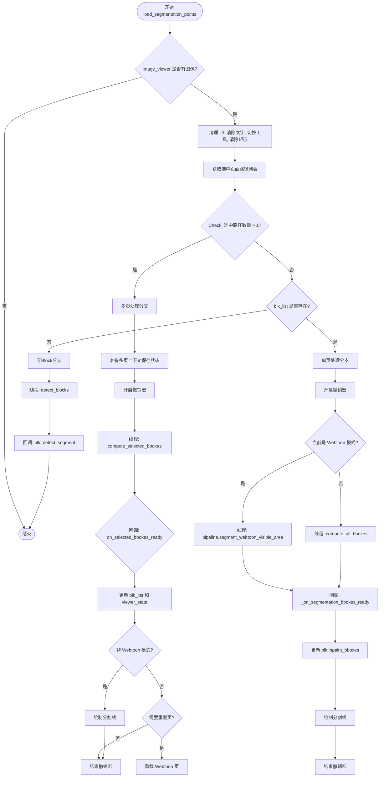

#### 带注释源码

```python
    def load_segmentation_points(self) -> None:
        """
        加载分割点的入口函数。
        逻辑：根据是否有图像、是否多页、是否有文本块来分发处理流程。
        """
        # 1. 前置检查与 UI 准备
        if self.main.image_viewer.hasPhoto():
            # 清除现有文本编辑器和形状，准备进入绘制模式
            self.main.text_ctrl.clear_text_edits()
            self.main.set_tool("brush") # 切换到画笔工具
            self.main.disable_hbutton_group()
            self.main.image_viewer.clear_rectangles()
            self.main.image_viewer.clear_text_items()

            self.main.loading.setVisible(True)
            self.main.disable_hbutton_group()

            # 2. 获取当前选中的页面路径
            selected_paths = self._selected_page_paths()
            
            # 3. 分支判断：多页处理 vs 单页处理
            if len(selected_paths) > 1:
                # === 多页模式处理逻辑 ===
                self.main.undo_group.activeStack().beginMacro("draw_segmentation_boxes")
                context = self._prepare_multi_page_context(selected_paths)

                def compute_selected_bboxes() -> dict[str, list[TextBlock]]:
                    """后台线程：为选中的所有页面计算 inpaint_bboxes"""
                    results: dict[str, list[TextBlock]] = {}
                    for file_path in selected_paths:
                        state = self.main.image_states.get(file_path, {})
                        blk_list = state.get("blk_list", [])
                        if not blk_list:
                            continue
                        image = self._load_page_image(file_path)
                        if image is None:
                            continue
                        # 遍历每个块，计算其分割区域
                        for blk in blk_list:
                            blk.inpaint_bboxes = get_inpaint_bboxes(blk.xyxy, image)
                        results[file_path] = blk_list
                    return results

                def on_selected_bboxes_ready(results: dict[str, list[TextBlock]]) -> None:
                    """多页计算完成后的回调"""
                    current_file = context["current_file"]
                    for file_path, blk_list in (results or {}).items():
                        state = self.main.image_states.get(file_path)
                        if state is None:
                            continue
                        state["blk_list"] = blk_list
                        viewer_state = state.setdefault("viewer_state", {})
                        viewer_state["rectangles"] = [] # 清空旧矩形
                        # 序列化分割笔触用于保存
                        state["brush_strokes"] = self._serialize_segmentation_strokes(blk_list)
                        
                        if file_path == current_file:
                            self.main.blk_list = blk_list.copy()

                    # 如果是非 Webtoon 模式，在当前视图绘制线条
                    if (
                        not self.main.webtoon_mode
                        and current_file is not None
                        and current_file in (results or {})
                    ):
                        for blk in self.main.blk_list:
                            bboxes = blk.inpaint_bboxes
                            if bboxes is not None and len(bboxes) > 0:
                                self.main.image_viewer.draw_segmentation_lines(bboxes)

                    # Webtoon 模式下处理页面重载
                    if self.main.webtoon_mode and context["current_page_unloaded"]:
                        self._reload_current_webtoon_page()

                    if results:
                        self.main.mark_project_dirty()
                    self.main.undo_group.activeStack().endMacro()

                def on_selected_bboxes_error(error_tuple: tuple) -> None:
                    """错误处理：确保撤销宏被关闭"""
                    try:
                        self.main.undo_group.activeStack().endMacro()
                    except Exception:
                        pass
                    self.main.default_error_handler(error_tuple)

                self.main.run_threaded(
                    compute_selected_bboxes,
                    on_selected_bboxes_ready,
                    on_selected_bboxes_error,
                    self.main.on_manual_finished,
                )
                return

            # === 单页处理逻辑 (blk_list 存在的情况) ===
            if self.main.blk_list:
                self.main.undo_group.activeStack().beginMacro("draw_segmentation_boxes")

                if self.main.webtoon_mode:
                    # Webtoon 模式：只计算可见区域的分割
                    self.main.run_threaded(
                        lambda: self.main.pipeline.segment_webtoon_visible_area(),
                        self._on_segmentation_bboxes_ready,
                        self.main.default_error_handler,
                        self.main.on_manual_finished,
                    )
                else:
                    # 普通模式：计算当前页所有块的分割
                    def compute_all_bboxes() -> list[tuple[TextBlock, Any]]:
                        image = self.main.image_viewer.get_image_array()
                        results: list[tuple[TextBlock, Any]] = []
                        for blk in self.main.blk_list:
                            bboxes = get_inpaint_bboxes(blk.xyxy, image)
                            results.append((blk, bboxes))
                        return results

                    self.main.run_threaded(
                        compute_all_bboxes,
                        self._on_segmentation_bboxes_ready,
                        self.main.default_error_handler,
                        self.main.on_manual_finished,
                    )

            # === 处理没有 blk_list 的情况 (首次检测) ===
            else:
                self.main.run_threaded(
                    self.main.pipeline.detect_blocks,
                    self.blk_detect_segment,
                    self.main.default_error_handler,
                    self.main.on_manual_finished,
                )
```


### `ManualWorkflowController._on_segmentation_bboxes_ready`

该方法用于处理分割边界框计算完成后的回调，将计算得到的分割框数据绑定到对应的文本块上，并在界面上绘制分割线，最后结束撤销宏。

参数：

- `results`：`Sequence[tuple[TextBlock, Any]]`，包含文本块与其对应分割边界框的序列

返回值：`None`，无返回值

#### 流程图

```mermaid
flowchart TD
    A[开始] --> B{遍历 results 中的每个 (blk, bboxes) 对}
    B --> C[将 bboxes 赋值给 blk.inpaint_bboxes]
    C --> D{bboxes 不为空且长度大于 0?}
    D -->|是| E[调用 image_viewer.draw_segmentation_lines 绘制分割线]
    D -->|否| F[继续下一个块]
    E --> F
    F --> G{还有更多块?}
    G -->|是| B
    G -->|否| H[结束当前撤销宏: undo_group.activeStack().endMacro]
    H --> I[结束]
```

#### 带注释源码

```
def _on_segmentation_bboxes_ready(
    self, 
    results: Sequence[tuple[TextBlock, Any]]
) -> None:
    """
    处理分割边界框计算完成的回调函数。
    该函数在后台线程完成分割框计算后被调用，负责将计算结果
    绑定到对应的 TextBlock 对象，并在界面上可视化显示。
    
    参数:
        results: 包含 (TextBlock, 分割边界框数据) 元组的序列
    """
    
    # 遍历所有计算结果，将分割框数据绑定到对应的文本块
    for blk, bboxes in results:
        # 将计算得到的分割框数据存储到文本块对象中
        blk.inpaint_bboxes = bboxes
        
        # 检查分割框是否有效（非空且有内容）
        if bboxes is not None and len(bboxes) > 0:
            # 在图像查看器界面上绘制分割线/区域
            self.main.image_viewer.draw_segmentation_lines(bboxes)
    
    # 结束在 load_segmentation_points 中开始的撤销宏
    # 确保这一系列操作可以作为单个撤销单元
    self.main.undo_group.activeStack().endMacro()
```

## 关键组件


### 多页面上下文管理 (_prepare_multi_page_context)

在处理多页面时准备上下文环境，保存和卸载当前页面状态，支持webtoon模式和普通模式的状态管理。

### 文本块检测 (block_detect)

调用TextBlockDetector对选定的页面进行文本块检测，支持单页和多页批量检测，处理RTL语言（日本語），并通过缓存提升性能。

### OCR处理 (ocr)

对图像中的文本区域进行光学字符识别，集成了缓存机制避免重复识别，支持单块模式和批量多页处理。

### 翻译处理 (translate_image)

调用Translator对OCR识别后的文本进行翻译，支持多页批量翻译，应用缓存机制，处理大小写转换和目标语言验证。

### 分割线加载 (load_segmentation_points)

加载或计算文本块的分割边界框（inpaint_bboxes），支持webtoon模式和普通模式，处理分割线的绘制和状态序列化。

### 图像修复 (inpaint_and_set)

使用Inpainting技术基于笔触（brush strokes）对图像进行修复处理，处理多页场景并管理撤销栈。

### 翻译文本项更新 (update_translated_text_items)

格式化并更新翻译后的文本项，应用自动换行（word wrap），处理垂直文本和无空格语言特殊需求。

### 序列化工具 (_serialize_rectangles_from_blocks, _serialize_segmentation_strokes)

将TextBlock对象序列化为可存储的字典格式，包含坐标、旋转角度和变换原点，支持分割笔触数据的构建。

### Webtoon页面重载 (_reload_current_webtoon_page)

在多页面操作后重新加载当前webtoon页面，管理和恢复场景项状态。

### 可见文本项获取 (_get_visible_text_items)

根据当前模式（webtoon或普通）获取屏幕上可见的文本块项，支持分页滚动场景下的文本过滤。


## 问题及建议


### 已知问题

-   **方法过长且嵌套复杂**：`block_detect`、`ocr`、`translate_image` 等方法包含大量嵌套函数和业务逻辑，导致代码可读性和维护性差，单个方法超过 200 行。
-   **大量使用 `getattr` 访问可选组件**：在 `_prepare_multi_page_context` 和 `_reload_current_webtoon_page` 中频繁使用 `getattr(self.main.image_viewer, "webtoon_manager", None)`，缺乏明确的接口契约，增加运行时错误风险。
-   **重复代码模式**：多页面与单页面处理逻辑在多个方法中重复出现（如 `_selected_page_paths` 调用、状态保存与恢复逻辑），未进行有效抽象。
- **实例重复创建**：在 `ocr` 和 `translate_image` 的多页面处理中，循环内部每次都创建新的 `OCRProcessor` 或 `Translator` 实例，而非复用已初始化的对象。
- **类型注解不完整**：使用 `Any` 类型（如 `blk_detect_segment` 中的 `Any`，`compute_all_bboxes` 中的 `Any`），掩盖了具体的数据结构意图。
- **错误处理过于宽泛**：部分 `try/except` 块捕获所有异常且无具体处理（如 `on_selected_bboxes_error` 中的空 `pass`），掩盖了真实错误。
- **潜在的变量作用域问题**：在 `update_translated_text_items` 中，嵌套函数 `set_new_text` 引用了外层作用域的 `trg_lng_cd`，虽然 Python 允许这种闭包行为，但在多线程或异步上下文中可能导致意外行为。
- **魔数缺乏解释**：代码中存在硬编码的数值如 `5`（`is_close` 容忍度）、`0.5`（矩形查找偏移量），缺乏常量定义或配置说明。
- **状态管理耦合度高**：直接访问 `self.main` 的大量属性（如 `blk_list`, `image_files`, `curr_img_idx`, `webtoon_mode` 等），使得 `Controller` 与主应用紧耦合，难以独立测试。
- **多线程回调中的闭包风险**：在多处使用 `lambda: self.finish_ocr_translate(single_block)` 形式的回调，存在引用延迟绑定变量的潜在风险。

### 优化建议

-   **提取多页面处理抽象**：将多页面与单页面的差异化逻辑封装为独立方法或策略类，减少 `if len(selected_paths) > 1` 的重复判断。
-   **强化接口访问**：将 `webtoon_manager`、`scene_item_manager` 等组件通过依赖注入或显式属性提供，替代 `getattr` 动态查找，并增加类型提示。
-   **缓存处理器实例**：在类初始化或首次使用时创建 `TextBlockDetector`、`OCRProcessor`、`Translator` 实例并缓存，避免在循环或每次调用时重新实例化。
-   **提取常量与配置**：将魔数提取为类常量或配置文件（如 `TOLERANCE = 5`, `DEFAULT_OFFSET = 0.5`），增强代码可读性。
-   **完善错误处理**：为关键操作添加具体的异常捕获与日志记录，区分可恢复错误与致命错误，避免使用空的 `except Exception: pass`。
-   **拆分巨型方法**：将 `block_detect`、`ocr`、`translate_image` 等方法按职责拆分为更小的子方法（如 `detect_single_page`, `detect_multi_page`），提高可测试性。
-   **减少全局状态依赖**：通过方法参数传递必要状态，而非直接读取 `self.main` 的多个属性，提升函数的纯度与可测试性。
-   **规范化类型注解**：为所有使用 `Any` 的位置提供具体的类型定义，明确数据结构。


## 其它


### 设计目标与约束

本模块的设计目标是实现漫画/图片的手动翻译工作流控制，支持单页和多页处理模式，并兼容Webtoon（长条漫画）和普通分页模式。主要约束包括：1) 必须通过线程处理耗时的检测、OCR和翻译操作以保持UI响应；2) 多页处理时需要管理页面加载状态和内存；3) 需要支持撤销/重做操作；4) Webtoon模式下需要处理场景项的序列化和反序列化。

### 错误处理与异常设计

代码采用回调式错误处理机制，通过`default_error_handler`处理所有线程化操作的异常。在`on_selected_bboxes_error`中显式捕获异常以确保撤销栈正确结束。潜在的优化空间包括：添加更具体的异常类型区分（如网络超时、模型加载失败、内存不足等）；为关键操作添加重试机制；实现用户友好的错误提示而非仅记录日志。

### 数据流与状态机

数据流遵循以下状态转换：初始状态 → 检测文本块(blk_list) → OCR识别 → 翻译 → 格式化 → 渲染显示。每个页面在`image_states`字典中维护独立状态，包含blk_list、viewer_state、brush_strokes等信息。多页处理时通过`selected_paths`管理当前选中的页面集合，通过`cache_manager`缓存OCR和翻译结果以加速重复处理。

### 外部依赖与接口契约

核心依赖包括：1) PySide6用于UI交互；2) TextBlockDetector处理文本块检测；3) OCRProcessor处理光学字符识别；4) Translator处理翻译；5) 渲染模块(pyside_word_wrap等)处理文本排版。主要接口契约：检测器输入图像输出TextBlock列表；OCR输入图像和TextBlock列表并填充translation字段；翻译器输入TextBlock列表和图像并填充translation字段；缓存管理器提供`get/set`方法操作OCR和翻译缓存。

### 缓存策略

系统实现三级缓存：1) block_detector_cache缓存检测器实例避免重复创建；2) OCR缓存通过`_get_ocr_cache_key`生成键值，存储识别的文本结果；3) 翻译缓存通过`_get_translation_cache_key`存储翻译结果。缓存键由图像、源语言、目标语言、模型选择和额外上下文共同决定，确保缓存准确性。

### 并发模型

采用Python线程池模式，通过`run_threaded`方法将耗时操作分发到后台线程。回调模式包含三个参数：成功回调、错误回调、完成回调。存在一个问题是部分调用传入了`None`作为成功回调（如OCR和翻译的某些路径），这可能导致状态更新延迟。

### UI状态管理

通过`main.loading`控制加载指示器可见性，通过`disable_hbutton_group`禁用按钮组防止重复操作。工具状态通过`set_tool`切换（"box"或"brush"）。页面切换时通过`save_current_image_state`和`save_all_scene_items_to_states`持久化场景状态。

### 事务与撤销机制

使用Qt的UndoStack实现操作的事务性：1) `beginMacro`和`endMacro`包装多个原子操作；2) 图像修复操作使用命名宏"inpaint"；3) 分割线绘制使用"draw_segmentation_boxes"宏。这确保用户可以撤销整个多步骤操作。

### 潜在技术债务与优化空间

1) 代码重复：多页处理逻辑在block_detect、ocr、translate_image中高度相似，可提取公共函数；2) 类型注解不完整：部分内部函数缺少参数类型注解；3) 魔法数字：如5像素的距离比较`is_close(b.xyxy[0], x1, 5)`应提取为常量；4) 异步回调链较长：部分操作通过多层lambda包装回调，调试困难；5) 缓存清理机制缺失：长期运行可能导致缓存占用过多内存；6) 缺少单元测试覆盖关键业务逻辑。

    