# `comic-translate\app\controllers\projects.py` 详细设计文档

该代码实现了一个ProjectController类，作为漫画翻译应用的核心控制器之一，负责项目的保存、加载、状态管理、图像渲染导出以及UI设置的持久化，支持普通模式和Webtoon长图模式的项目处理。

## 整体流程

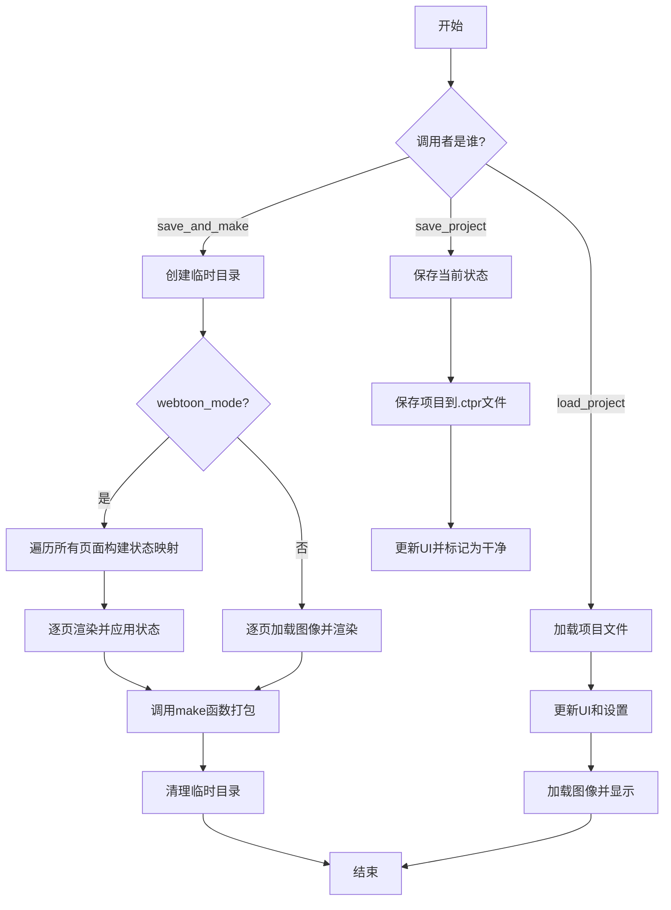

## 类结构

```
ComicTranslate (主应用控制器)
└── ProjectController (项目控制器)
    ├── 依赖: ImageSaveRenderer (图像渲染器)
    ├── 依赖: TextBlockItem (文本块项)
    ├── 依赖: TextItemProperties (文本项属性)
    └── 依赖: WebtoonManager (Webtoon管理器)
```

## 全局变量及字段


### `os`
    
Python标准库，提供操作系统相关功能如路径操作

类型：`module`
    


### `shutil`
    
Python标准库，提供高级文件操作如删除目录树

类型：`module`
    


### `tempfile`
    
Python标准库，用于创建临时文件和目录

类型：`module`
    


### `TYPE_CHECKING`
    
仅在类型检查时导入，避免循环导入

类型：`typing constant`
    


### `asdict`
    
dataclasses模块函数，将dataclass对象转换为字典

类型：`function`
    


### `is_dataclass`
    
dataclasses模块函数，检查对象是否为dataclass

类型：`function`
    


### `imk`
    
imkit库，提供图像处理相关功能

类型：`module`
    


### `QtWidgets`
    
PySide6 Qt模块，提供Qt窗口部件

类型：`module`
    


### `QSettings`
    
PySide6类，用于持久化应用程序设置

类型：`class`
    


### `QUndoStack`
    
PySide6类，提供撤销/重做功能

类型：`class`
    


### `TextBlockItem`
    
自定义类，表示画布上的文本块项目

类型：`class`
    


### `TextItemProperties`
    
自定义类，管理文本项的属性和序列化

类型：`class`
    


### `ImageSaveRenderer`
    
自定义类，用于将状态渲染到图像并保存

类型：`class`
    


### `save_state_to_proj_file`
    
自定义函数，将项目状态保存到.ctpr文件

类型：`function`
    


### `load_state_from_proj_file`
    
自定义函数，从.ctpr文件加载项目状态

类型：`function`
    


### `make`
    
自定义函数，将临时目录打包成最终输出文件

类型：`function`
    


### `ComicTranslate`
    
主应用程序类，项目控制器持有的主应用引用

类型：`class`
    


### `ProjectController.main`
    
主应用实例引用，提供对整个应用状态的访问

类型：`ComicTranslate`
    
    

## 全局函数及方法


### `save_state_to_proj_file`

该函数是项目状态序列化的核心入口，用于将当前应用程序的完整状态（包括图像列表、编辑状态、文本块信息、补丁数据等）持久化到指定的 `.ctpr` 项目文件中。此函数定义在模块 `app.projects.project_state` 中，在 `ProjectController` 类中被调用。

参数：

-  `main`：`ComicTranslate`（主应用程序实例），包含 `image_files`（图像路径列表）、`image_states`（每张图的编辑状态）、`image_patches`（图像修补数据）等项目数据。
-  `file_name`：`str`，用户选择的目标项目文件保存路径（通常为 `.ctpr` 扩展名）。

返回值：`None`，该函数主要通过副作用（写入文件）生效，`save_project` 方法未接收其返回值。

#### 流程图

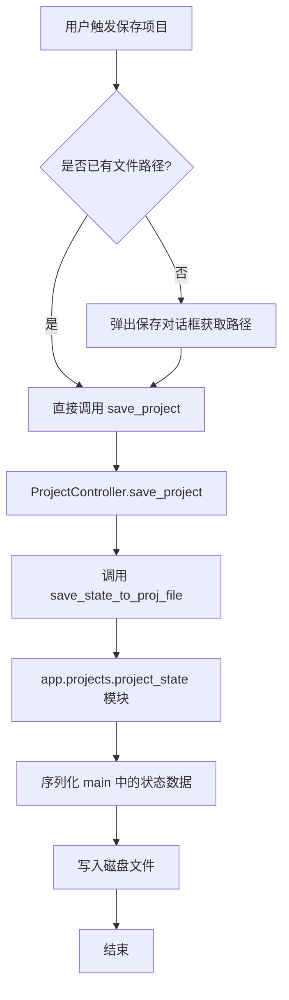

#### 带注释源码

> **注意**：`save_state_to_proj_file` 的具体实现逻辑位于 `app.projects.project_state` 模块中，当前文件中仅包含其调用方式。以下为 `ProjectController` 类中调用该函数的包装方法 `save_project` 的源码。

```python
def save_project(self, file_name):
    """
    执行项目保存的实际逻辑。
    此方法作为桥梁，调用 app.projects.project_state 模块中的 save_state_to_proj_file 函数。
    
    参数:
        file_name (str): 项目文件的完整路径。
    """
    # 调用外部模块的保存函数，传入主应用实例以获取需要保存的状态
    save_state_to_proj_file(self.main, file_name)
```


### `load_state_from_proj_file`

该函数是一个项目状态管理模块的导出函数，负责从 `.ctpr` 项目文件中加载数据。它读取指定路径的文件，解析其中的项目状态（可能包含图像状态、UI设置或额外的上下文文本），并将解析后的数据返回给调用者，以便应用程序恢复项目界面。

参数：

- `main`：`ComicTranslate`，主应用程序实例，用于访问全局状态或配置。
- `file_name`：`str`，要加载的项目文件（`.ctpr`）的完整路径。

返回值：`str`，从项目中提取的上下文字符串（通常为 JSON 格式），用于填充 UI 设置页面的文本域。

#### 流程图

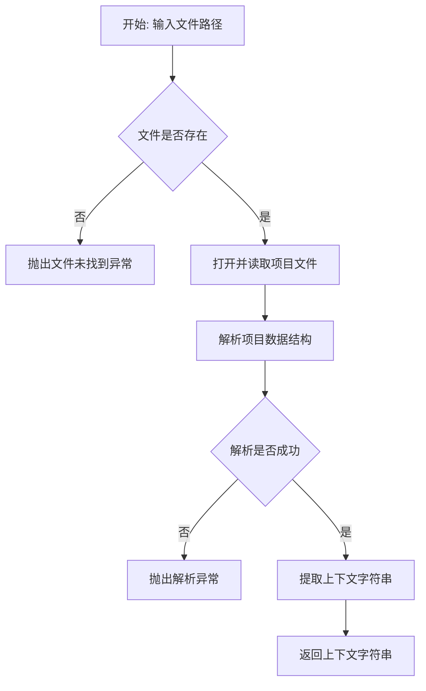

#### 带注释源码

由于该函数定义在 `app.projects.project_state` 模块中且未在当前代码段中展开实现体，以下为其在 `ProjectController` 中的**调用方式**及**基于功能的逻辑推测源码**。

```python
# 导入声明 (位于文件顶部)
# from app.projects.project_state import save_state_to_proj_file, load_state_from_proj_file

# --- 在 ProjectController 类中的调用上下文 ---

def load_project(self, file_name: str):
    """
    在线程中运行的项目加载逻辑。
    1. 设置当前项目文件路径。
    2. 调用 load_state_from_proj_file 加载数据。
    """
    self.main.project_file = file_name
    
    # 调用目标函数：加载状态
    # 参数 1: main (主控制器上下文)
    # 参数 2: file_name (文件路径)
    return load_state_from_proj_file(self.main, file_name)

# --- 推测的 load_state_from_proj_file 实现逻辑 ---

def load_state_from_proj_file(main, file_name: str) -> str:
    """
    假设的实现逻辑：
    1. 验证文件路径。
    2. 尝试以只读模式打开文件。
    3. 读取特定的数据字段（例如 JSON 格式的 extra_context）。
    4. 返回读取的字符串。
    """
    import json
    
    # 假设项目文件本质是一个 JSON 或者是包含 JSON 的压缩包
    # 这里仅为逻辑演示，实际可能涉及 zipfile 或 pickle
    
    try:
        # 模拟读取文件内容
        # with open(file_name, 'r', encoding='utf-8') as f:
        #     data = json.load(f)
        
        # 假设 data 是字典，包含了 'extra_context' 键
        # saved_context = data.get('extra_context', '')
        
        saved_context = "" # 假设的返回值
        return saved_context
    except Exception as e:
        print(f"Failed to load project state: {e}")
        return ""
```


### `make` (从 `modules.utils.archives` 导入)

归档处理函数，用于将临时目录中的文件打包成最终输出文件。

参数：

- `temp_dir`：`str`，临时目录路径，包含待归档的图像文件
- `output_path`：`str`，输出文件的目标路径

返回值：`None`（根据调用方式推断），该函数直接操作文件系统完成归档，不返回具体值

#### 流程图

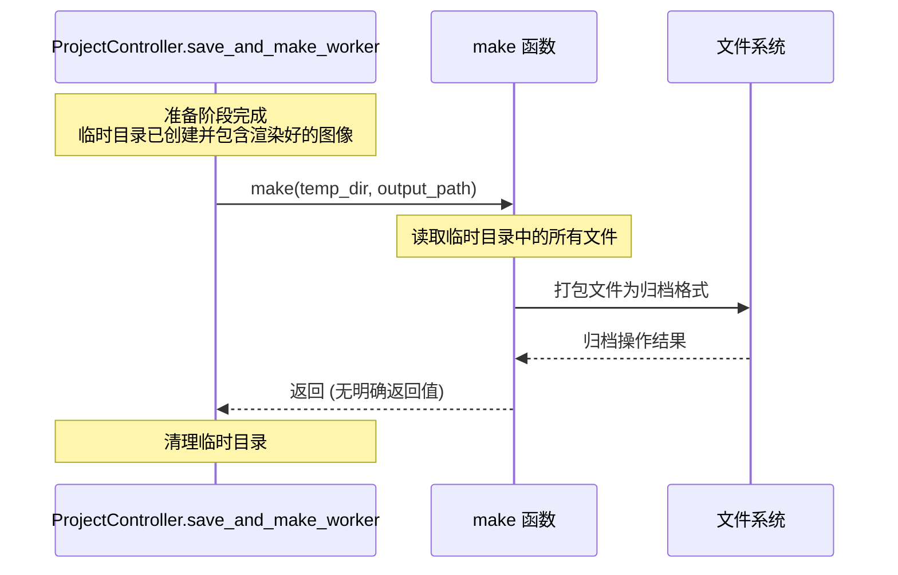

#### 带注释源码

```python
# 调用位置：ProjectController.save_and_make_worker 方法内部
# 该函数从 modules.utils.archives 模块导入
# 在此处被调用以完成项目的最终输出

# 模块导入语句
from modules.utils.archives import make

# ... 前面的代码创建了临时目录并渲染了所有页面图像 ...

# 调用 make 函数进行归档
# 参数1: temp_dir - 包含已渲染图像的临时目录
# 参数2: output_path - 用户指定的输出文件路径
make(temp_dir, output_path)

# 调用完成后，finally 块会清理临时目录
finally:
    shutil.rmtree(temp_dir)

# 注意：实际的 make 函数定义不在本代码文件中
# 其源码位于 modules.utils.archives 模块中
# 以下为基于调用方式的合理推断：

# def make(source_dir: str, output_path: str) -> None:
#     """
#     将源目录中的文件打包成归档文件
#     
#     参数:
#         source_dir: 包含待归档文件的临时目录路径
#         output_path: 目标归档文件的完整路径
#     """
#     ... (实际实现未知，需要查看 modules.utils.archives 模块)
```


### `tempfile.mkdtemp`

这是 Python 标准库 `tempfile` 模块中的函数，用于创建一个临时目录。在代码中的 `save_and_make_worker` 方法内被调用，用于在保存和打包项目时创建临时工作目录。

参数：

- `suffix`：`str`，可选，临时目录名称的后缀
- `prefix`：`str`，可选，临时目录名称的前缀，默认为 `'tmp'`
- `dir`：`str`，可选，指定临时目录创建的父目录，默认为系统默认的临时文件目录

返回值：`str`，新创建的临时目录的绝对路径

#### 流程图

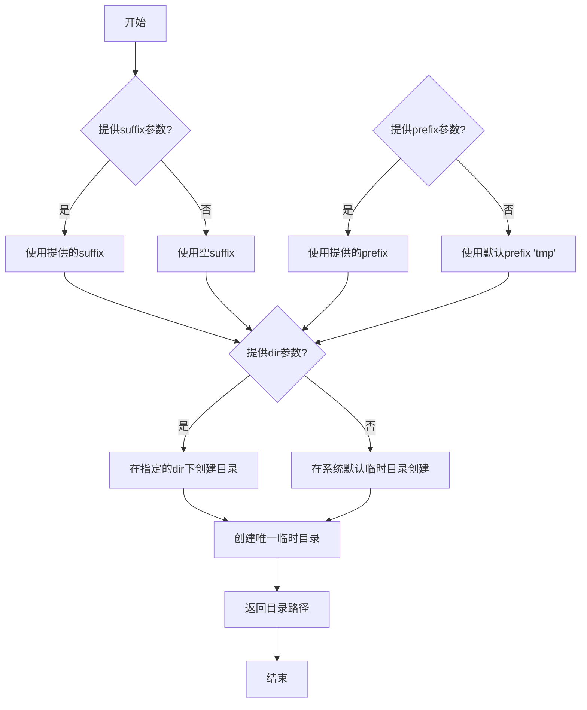

#### 带注释源码

```python
import tempfile
import os
import shutil

# 在 save_and_make_worker 方法中调用
def save_and_make_worker(self, output_path: str):
    # ... 前置代码 ...
    
    # 创建临时目录
    # 参数说明：
    # - 不带参数时，会在系统默认临时目录（如 Linux 的 /tmp，Windows 的 C:\Users\xxx\AppData\Local\Temp）下创建
    # - 目录名格式为 tmpXXXXXX（X为随机字符）
    temp_dir = tempfile.mkdtemp()
    
    try:
        # ... 执行保存和渲染逻辑 ...
        
        # 业务逻辑完成后，最终在 finally 块中清理临时目录
        shutil.rmtree(temp_dir)
    except Exception as e:
        # 确保异常情况下也清理临时目录
        shutil.rmtree(temp_dir)
        raise
```

#### 在代码中的具体使用上下文

```python
def save_and_make_worker(self, output_path: str):
    # ... 省略其他代码 ...
    
    temp_dir = tempfile.mkdtemp()  # 创建临时目录用于存放渲染后的图片
    try:            
        if self.main.webtoon_mode:
            # Webtoon模式：两遍渲染逻辑
            # 第一遍：为所有页面构建最新的状态映射
            all_pages_current_state = {}
            loaded_pages = self.main.image_viewer.webtoon_manager.loaded_pages

            for page_idx, file_path in enumerate(self.main.image_files):
                if page_idx in loaded_pages:
                    # 对于已加载页面，从当前场景创建状态
                    viewer_state = self._create_text_items_state_from_scene(page_idx)
                else:
                    # 对于未加载页面，使用已存储的状态
                    viewer_state = self.main.image_states[file_path].get('viewer_state', {}).copy()
                all_pages_current_state[file_path] = {'viewer_state': viewer_state}

            # 第二遍：使用完整状态映射渲染每一页
            for page_idx, file_path in enumerate(self.main.image_files):
                bname = os.path.basename(file_path)
                rgb_img = self.main.load_image(file_path)

                renderer = ImageSaveRenderer(rgb_img)
                viewer_state = all_pages_current_state[file_path]['viewer_state']
                
                temp_main_page_context = type('TempMainPage', (object,), {
                    'image_files': self.main.image_files,
                    'image_states': all_pages_current_state
                })()

                renderer.apply_patches(self.main.image_patches.get(file_path, []))
                renderer.add_state_to_image(viewer_state, page_idx, temp_main_page_context)
                sv_pth = os.path.join(temp_dir, bname)  # 保存到临时目录
                renderer.save_image(sv_pth)
        else:
            # 普通模式
            for file_path in self.main.image_files:
                bname = os.path.basename(file_path)
                rgb_img = self.main.load_image(file_path)

                renderer = ImageSaveRenderer(rgb_img)
                viewer_state = self.main.image_states[file_path]['viewer_state']
                renderer.apply_patches(self.main.image_patches.get(file_path, []))
                renderer.add_state_to_image(viewer_state)
                sv_pth = os.path.join(temp_dir, bname)  # 保存到临时目录
                renderer.save_image(sv_pth)

        # 调用 make 函数生成最终输出
        make(temp_dir, output_path)
    finally:
        # 清理临时目录，释放磁盘空间
        shutil.rmtree(temp_dir)
```


### `shutil.rmtree`

删除指定目录路径的目录树，递归删除所有子目录和文件。

参数：

- `path`：`str`，要删除的目录路径，即 `temp_dir`（临时工作目录）
- `ignore_errors`：`bool`，可选，是否忽略删除错误，默认为 `False`
- `onerror`：`Callable`，可选，一个接收 (function, path, excinfo) 三个参数的回调函数，用于处理删除错误，默认为 `None`
- `onexc`：`Callable`，可选，一个接收 (exc, path) 两个参数的回调函数，用于处理异常（Python 3.12+），默认为 `None`

返回值：`None`，该函数不返回任何值，仅执行目录删除操作

#### 流程图

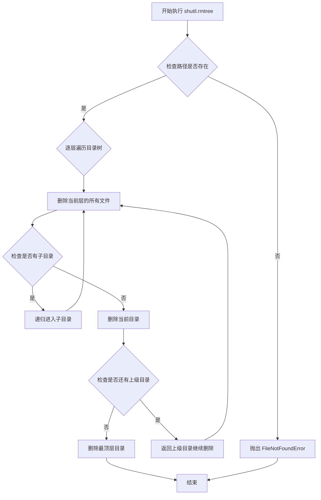

#### 带注释源码

```python
# 代码中的实际调用位置：ProjectController.save_and_make_worker 方法的 finally 块
finally:
    # Clean up temp directory
    # 调用 shutil.rmtree 删除临时目录 temp_dir
    # 参数 temp_dir 是通过 tempfile.mkdtemp() 创建的临时目录路径
    # 该函数会递归删除目录中的所有文件和子目录
    shutil.rmtree(temp_dir)
```


### `ProjectController.__init__`

这是 `ProjectController` 类的构造函数，用于初始化项目控制器并保存对主应用程序实例的引用，以便后续访问应用程序的主要功能和数据。

参数：

- `main`：`ComicTranslate`，主控制器实例，包含了应用程序的主要功能、数据和 UI 组件的引用

返回值：`None`，无返回值（构造函数）

#### 流程图

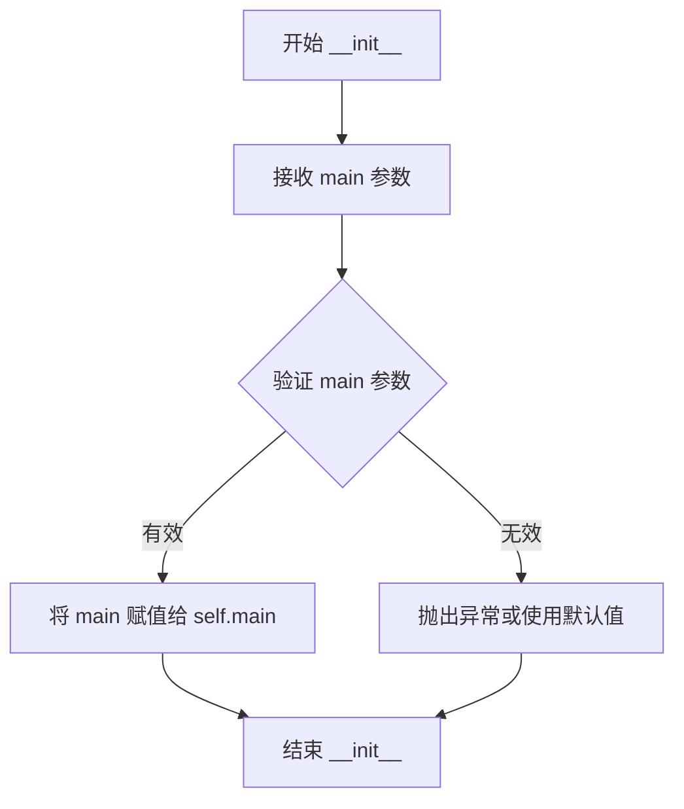

#### 带注释源码

```python
def __init__(self, main: ComicTranslate):
    """
    ProjectController 类的构造函数
    
    参数:
        main (ComicTranslate): 主控制器实例,包含了应用程序的主要功能、
                              数据和UI组件的引用
    
    返回值:
        None: 构造函数不返回值
    
    功能说明:
        - 接收主应用程序实例的引用
        - 将主实例保存为类属性,以便在整个类的方法中访问
        - 初始化控制器的基本状态
    """
    # 将传入的主控制器实例保存为类属性
    # 这样可以在类的其他方法中通过 self.main 访问应用程序的功能
    self.main = main
```


### `ProjectController.save_and_make`

该方法是项目保存和打包流程的触发器。它作为一个轻量级包装器（Wrapper），通过调用主控制器（`main`）的线程管理方法 `run_threaded`，将耗时的保存与归档操作（由 `save_and_make_worker` 实现）转移到后台线程执行，从而确保 GUI 界面不会因文件 IO 操作而冻结。

参数：

-  `output_path`：`str`，目标输出文件的路径，指定最终生成的归档文件（如 ZIP 压缩包）的存放位置。

返回值：`None`，该方法仅负责调度任务，不直接返回结果，结果通过异步回调机制处理。

#### 流程图

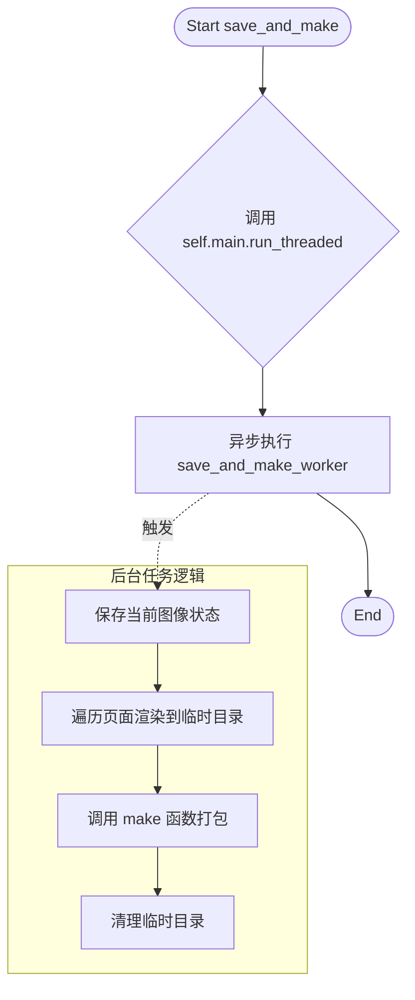

#### 带注释源码

```python
def save_and_make(self, output_path: str):
    """
    触发项目保存并打包的异步任务。
    
    参数:
        output_path: 字符串，指定输出文件的完整路径。
    """
    # 使用主窗口的线程运行器来执行后台任务，以保持UI响应。
    # 参数依次为：工作函数(on_success), 成功回调, 错误处理, 完成回调, 额外参数
    self.main.run_threaded(self.save_and_make_worker, None, self.main.default_error_handler, None, output_path)
```


### `ProjectController.save_and_make_worker`

这是一个核心的导出线程方法，负责将项目中的所有页面渲染并打包成输出文件。该方法首先保存当前编辑状态，然后创建临时目录。根据 `webtoon_mode` 配置，它会在 Webtoon 模式下执行两遍扫描（第一遍收集状态，第二遍渲染），或在普通模式下直接逐页渲染。最后调用 `make` 函数生成归档，并自动清理临时目录。

参数：

- `output_path`：`str`，指定输出文件的完整路径。

返回值：`None`，无返回值。

#### 流程图

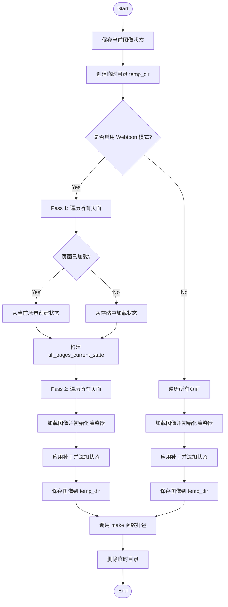

#### 带注释源码

```python
def save_and_make_worker(self, output_path: str):
    # 1. 保存当前页面的编辑状态（如文本、贴图等）
    self.main.image_ctrl.save_current_image_state()
    
    # 2. 创建一个临时目录用于存放渲染好的图片
    temp_dir = tempfile.mkdtemp()
    try:            
        # 3. 判断当前模式：Webtoon（长图）模式 或 普通（分页）模式
        if self.main.webtoon_mode:
            # --- PASS 1: 预构建所有页面的完整、最新的状态映射 ---
            all_pages_current_state = {}
            loaded_pages = self.main.image_viewer.webtoon_manager.loaded_pages

            # 遍历项目中所有的图片文件
            for page_idx, file_path in enumerate(self.main.image_files):
                if page_idx in loaded_pages:
                    # 对于已加载的页面，从当前活动场景中创建状态。
                    # 此状态仅包含“属于”该页面的项目。
                    viewer_state = self._create_text_items_state_from_scene(page_idx)
                else:
                    # 对于未加载的页面，使用已存储的状态。
                    viewer_state = self.main.image_states[file_path].get('viewer_state', {}).copy()
                all_pages_current_state[file_path] = {'viewer_state': viewer_state}

            # --- PASS 2: 使用完整的状态映射渲染每一页 ---
            for page_idx, file_path in enumerate(self.main.image_files):
                bname = os.path.basename(file_path)
                rgb_img = self.main.load_image(file_path)

                renderer = ImageSaveRenderer(rgb_img)
                
                # 使用预构建的、该页面最新的状态
                viewer_state = all_pages_current_state[file_path]['viewer_state']
                
                # 创建一个临时的上下文对象传给渲染器
                temp_main_page_context = type('TempMainPage', (object,), {
                    'image_files': self.main.image_files,
                    'image_states': all_pages_current_state
                })()

                # 应用补丁（如翻译结果等）
                renderer.apply_patches(self.main.image_patches.get(file_path, []))
                # 将状态渲染到图片上
                renderer.add_state_to_image(viewer_state, page_idx, temp_main_page_context)
                # 保存到临时目录
                sv_pth = os.path.join(temp_dir, bname)
                renderer.save_image(sv_pth)
        else:
            # 普通模式：使用原始逻辑
            for file_path in self.main.image_files:
                bname = os.path.basename(file_path)
                rgb_img = self.main.load_image(file_path)

                renderer = ImageSaveRenderer(rgb_img)
                viewer_state = self.main.image_states[file_path]['viewer_state']
                renderer.apply_patches(self.main.image_patches.get(file_path, []))
                renderer.add_state_to_image(viewer_state)
                sv_pth = os.path.join(temp_dir, bname)
                renderer.save_image(sv_pth)

        # 4. 调用打包函数生成最终输出文件
        make(temp_dir, output_path)
    finally:
        # 5. 无论成功与否，清理临时目录
        shutil.rmtree(temp_dir)
```


### `ProjectController._create_text_items_state_from_scene`

该方法负责在 Webtoon 模式下，为当前已加载的页面从场景（Scene）中提取文本项目的数据。它通过计算文本项目的坐标是否落在当前页面的垂直边界内来判断该项目是否“属于”该页面，并将坐标转换为页面本地的相对坐标。

参数：
- `page_idx`：`int`，目标页面的索引。

返回值：`dict`，包含页面文本项目状态的字典。字典结构为 `{'text_items_state': List[dict], 'push_to_stack': bool}`。

#### 流程图

```mermaid
flowchart TD
    A[Start _create_text_items_state_from_scene] --> B[Get webtoon_manager and page_y_start]
    B --> C{Calculate page_y_end}
    C --> D{Is last page?}
    D -->|Yes| E[Load image file to calculate height]
    E --> F[page_y_end = page_y_start + image_height]
    D -->|No| G[page_y_end = image_positions[page_idx + 1]]
    F --> H[Initialize text_items_data]
    G --> H
    H --> I[Iterate over scene items]
    I --> J{Is item TextBlockItem?}
    J -->|No| I
    J -->|Yes| K{Is item y within [page_y_start, page_y_end)?}
    K -->|No| I
    K -->|Yes| L[Calculate page_local_x and page_local_y]
    L --> M[Create TextItemProperties from item]
    M --> N[Override position to local coordinates]
    N --> O[Append properties dict to text_items_data]
    O --> I
    I --> P[Return dict with text_items_state and push_to_stack=False]
```

#### 带注释源码

```python
def _create_text_items_state_from_scene(self, page_idx: int) -> dict:
    """
    Create text items state from current scene items for a loaded page in webtoon mode.
    An item "belongs" to a page if its origin point is within that page's vertical bounds.
    """
    
    # 获取 Webtoon 管理器和当前页面的起始 Y 坐标
    webtoon_manager = self.main.image_viewer.webtoon_manager
    page_y_start = webtoon_manager.image_positions[page_idx]
    
    # 计算页面底部边界
    if page_idx < len(webtoon_manager.image_positions) - 1:
        # 如果不是最后一页，下一页的起始位置即为当前页的结束位置
        page_y_end = webtoon_manager.image_positions[page_idx + 1]
    else:
        # 对于最后一页，需要加载图片来计算其高度
        file_path = self.main.image_files[page_idx]
        rgb_img = self.main.load_image(file_path)
        page_y_end = page_y_start + rgb_img.shape[0]
    
    text_items_data = []
    
    # 遍历场景中的所有项目，寻找属于该页面的文本项目
    # Find all text items that BELONG to this page
    for item in self.main.image_viewer._scene.items():
        if isinstance(item, TextBlockItem):
            text_item = item
            text_y = text_item.pos().y()
            
            # 检查文本项目的原点是否在该页面范围内
            # Check if the text item's origin is on this page
            if text_y >= page_y_start and text_y < page_y_end:
                # 转换为页面本地坐标 (相对于页面顶部的偏移)
                # Convert to page-local coordinates
                scene_pos = text_item.pos()
                page_local_x = scene_pos.x()
                page_local_y = scene_pos.y() - page_y_start
                
                # 使用 TextItemProperties 进行一致的序列化
                # Use TextItemProperties for consistent serialization
                text_props = TextItemProperties.from_text_item(text_item)
                # 覆盖位置信息为页面本地坐标
                # Override position to use page-local coordinates
                text_props.position = (page_local_x, page_local_y)
                
                text_items_data.append(text_props.to_dict())
    
    # 返回包含文本项目状态的视图状态字典
    # Return viewer state with the collected text items
    return {
        'text_items_state': text_items_data,
        'push_to_stack': False  # Don't push to undo stack during save
    }
```


### `ProjectController.launch_save_proj_dialog`

该函数是 `ProjectController` 类的一个方法，用于弹出一个 Qt 原生的文件保存对话框，供用户选择项目文件的保存路径和名称。

参数：

- `self`：`ProjectController`，调用该方法的类实例，隐含参数。

返回值：
- `str`，用户选择的文件绝对路径字符串。如果用户点击“取消”，则返回空字符串。

#### 流程图

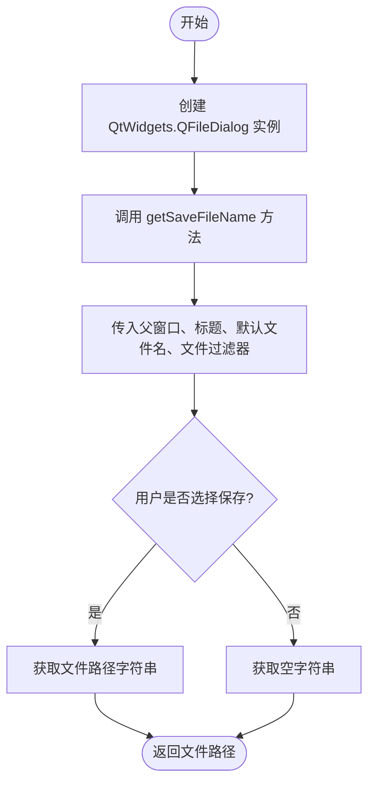

#### 带注释源码

```python
def launch_save_proj_dialog(self):
    """
    弹出保存项目文件的对话框。
    """
    # 实例化 PySide6 的文件对话框组件
    file_dialog = QtWidgets.QFileDialog()
    
    # 调用静态方法 getSaveFileName 打开保存对话框
    # 参数依次为：父窗口对象、对话框标题、默认文件名、文件类型过滤器
    # 返回值为一个元组 (fileName, selectedFilter)，这里用 _ 丢弃了过滤器选择结果
    file_name, _ = file_dialog.getSaveFileName(
        self.main,                  # 父窗口，传入主控制器实例
        "Save Project As",          # 对话框标题
        "untitled",                 # 默认文件名
        "Project Files (*.ctpr);;All Files (*)" # 文件类型过滤器
    )

    # 返回用户选择的文件路径，如果用户取消，此处返回空字符串
    return file_name
```


### `ProjectController.run_save_proj`

该方法负责将当前项目保存到指定文件，包括设置项目文件名、更新窗口标题、显示加载指示器、禁用交互按钮，然后在后台线程中执行实际的项目保存操作，最后在保存完成后清理状态并调用可选的回调函数。

参数：

- `file_name`：`str`，要保存的项目文件路径
- `post_save_callback`：`Callable | None`，可选参数，保存成功完成后执行的回调函数，默认为 None

返回值：`None`，无返回值（VOID）

#### 流程图

```mermaid
flowchart TD
    A[开始 run_save_proj] --> B[设置 self.main.project_file = file_name]
    B --> C[更新窗口标题为文件名]
    C --> D[显示加载指示器 loading]
    D --> E[禁用按钮组 disable_hbutton_group]
    E --> F[初始化 save_failed 字典]
    F --> G[定义内部错误处理函数 on_error]
    G --> H[定义内部完成处理函数 on_finished]
    H --> I[调用 self.main.run_threaded 执行保存]
    I --> J[结束]
    
    G -.-> K[设置 save_failed['value'] = True]
    K --> L[调用默认错误处理器]
    
    H -.-> M[调用 on_manual_finished]
    M --> N{保存是否成功?}
    N -->|是| O[设置项目为干净状态 set_project_clean]
    O --> P{是否有 post_save_callback?}
    P -->|是| Q[执行 post_save_callback]
    P -->|否| J
    N -->|否| J
    Q --> J
```

#### 带注释源码

```python
def run_save_proj(self, file_name: str, post_save_callback: callable = None):
    """
    运行保存项目流程。
    
    参数:
        file_name: 要保存的项目文件路径
        post_save_callback: 可选的保存完成后的回调函数
    """
    # 1. 设置项目文件路径到主控制器
    self.main.project_file = file_name
    
    # 2. 更新窗口标题，显示文件名（[*] 表示未保存修改标记位置）
    self.main.setWindowTitle(f"{os.path.basename(file_name)}[*]")
    
    # 3. 显示加载指示器，提示用户正在保存
    self.main.loading.setVisible(True)
    
    # 4. 禁用按钮组，防止用户在保存过程中进行其他操作
    self.main.disable_hbutton_group()
    
    # 5. 使用字典来保存失败状态（字典可变性使其可在内部函数中修改）
    save_failed = {'value': False}

    # 6. 定义错误处理内部函数
    def on_error(error_tuple):
        """保存失败时的错误回调"""
        save_failed['value'] = True  # 标记保存失败
        self.main.default_error_handler(error_tuple)  # 调用默认错误处理器

    # 7. 定义完成处理内部函数
    def on_finished():
        """保存完成后的回调"""
        self.main.on_manual_finished()  # 触发手动完成事件
        
        # 只有在保存未失败的情况下才执行后续操作
        if not save_failed['value']:
            self.main.set_project_clean()  # 将项目标记为干净状态（无未保存更改）
            
            # 如果提供了保存后的回调函数，则执行它
            if post_save_callback:
                post_save_callback()

    # 8. 在后台线程中执行实际的项目保存操作
    # run_threaded 签名: run_threaded(worker_fn, success_callback, error_callback, finished_callback, *args)
    self.main.run_threaded(
        self.save_project,      # 工作函数：执行实际保存
        None,                   # 成功回调：这里不需要，成功由 finished 回调处理
        on_error,               # 错误回调
        on_finished,            # 完成回调
        file_name               # 传递给 save_project 的参数
    )
```


### `ProjectController.save_current_state`

该方法用于保存当前项目的状态。根据运行模式（Webtoon模式或普通模式），它会调用不同的保存逻辑来确保所有图像和场景项的状态被正确持久化。

参数：
- 无

返回值：`None`，无返回值描述

#### 流程图

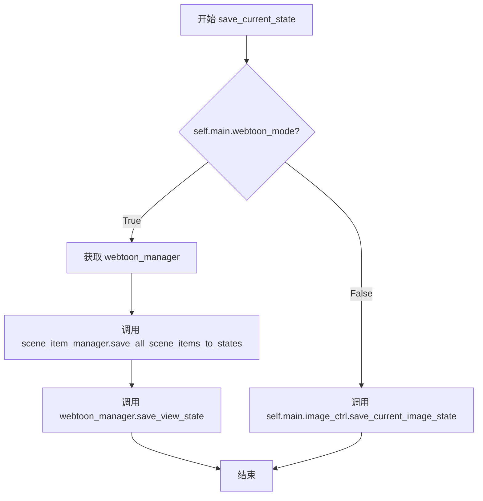

#### 带注释源码

```python
def save_current_state(self):
    """
    保存当前项目的状态。
    根据是否启用 Webtoon 模式，采用不同的保存策略：
    - Webtoon 模式：保存所有场景项和视图状态
    - 普通模式：保存当前图像状态
    """
    # 判断当前是否处于 Webtoon（长图）模式
    if self.main.webtoon_mode:
        # 获取 Webtoon 管理器实例
        webtoon_manager = self.main.image_viewer.webtoon_manager
        
        # 保存所有已加载页面的场景项到状态中
        webtoon_manager.scene_item_manager.save_all_scene_items_to_states()
        
        # 保存 Webtoon 视图状态（如滚动位置等）
        webtoon_manager.save_view_state()
    else:
        # 普通模式下，直接保存当前图像的编辑状态
        self.main.image_ctrl.save_current_image_state()
```


### `ProjectController.thread_save_project`

该方法负责触发项目文件的保存流程。首先，它会将当前内存中的图像状态（如文本框、图层等）持久化到内存中的状态字典。随后，它检查项目是否已有保存路径：若有，则直接使用该路径；若没有，则弹出系统保存对话框让用户选择路径。确认路径后，它在后台线程中执行实际的磁盘写入操作，并返回一个布尔值表示保存流程是否被成功触发（用户是否选择了文件）。

参数：

- `post_save_callback`：`Optional[Callable]`，（可选）保存操作成功完成后要执行的回调函数。

返回值：`bool`，如果用户成功选择了文件路径并启动了保存线程则返回 `True`，如果用户取消对话框或未提供文件名则返回 `False`。

#### 流程图

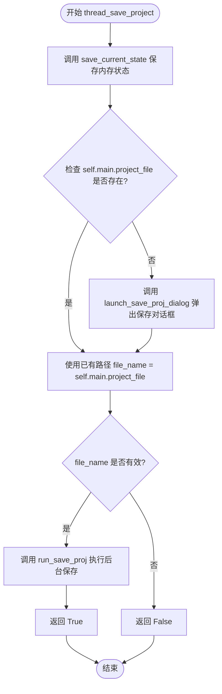

#### 带注释源码

```python
def thread_save_project(self, post_save_callback=None) -> bool:
    """
    触发项目保存流程。
    1. 先保存当前状态到内存。
    2. 检查是否需要弹出保存对话框。
    3. 在线程中运行保存操作。
    
    参数:
        post_save_callback: 保存成功后执行的回调函数。
    返回:
        bool: 是否成功启动了保存流程。
    """
    file_name = ""  # 初始化文件名
    
    # 步骤 1: 将当前UI中的状态（文本、图像Patch等）保存到内存中的 image_states
    self.save_current_state()
    
    # 步骤 2: 检查项目是否已经有文件路径
    if self.main.project_file:
        # 如果已经打开过项目，直接使用已有路径
        file_name = self.main.project_file
    else:
        # 如果是新项目，弹出"另存为"对话框让用户选择路径
        file_name = self.launch_save_proj_dialog()

    # 步骤 3: 如果用户选择了路径（file_name 不为空）
    if file_name:
        # 调用内部方法，通过线程安全地写入文件，并在完成后执行回调
        self.run_save_proj(file_name, post_save_callback)
        return True  # 返回 True 表示流程启动成功
    
    # 用户取消了对话框或未输入文件名
    return False
```


### `ProjectController.thread_save_as_project`

该方法是项目“另存为”（Save As）功能的入口点。它通过弹出系统文件对话框获取用户指定的保存路径，如果用户确认保存，则先同步保存当前内存中的项目状态（如文本块、图像状态等）到内存，随后触发异步任务将项目数据写入磁盘文件，并可选地执行保存后的回调逻辑。

参数：

- `post_save_callback`：`Callable | None`，一个可选的回调函数。如果指定，该函数会在项目文件保存成功完成后被调用，常用于执行保存后的业务逻辑（如显示提示、刷新UI等）。

返回值：`bool`，表示是否成功启动了保存流程。如果用户取消保存对话框返回 `False`，否则返回 `True`。

#### 流程图

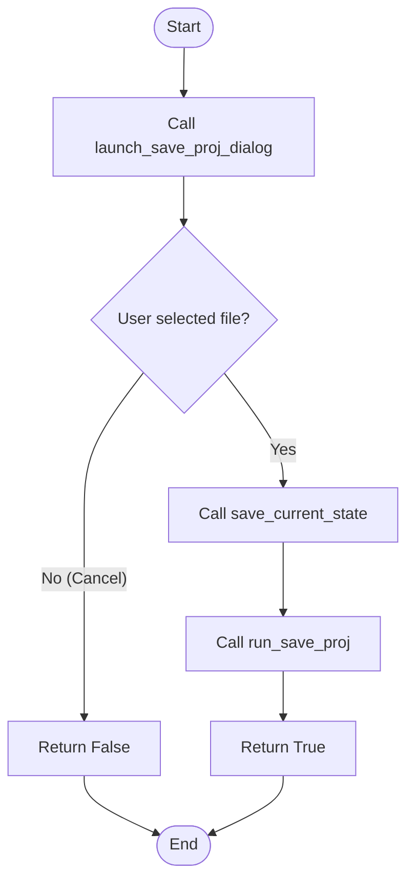

#### 带注释源码

```python
def thread_save_as_project(self, post_save_callback=None) -> bool:
    """
    启动 '另存为' (Save As) 流程。
    1. 弹出文件保存对话框获取目标路径。
    2. 如果用户选择路径，则保存当前状态并执行异步保存。
    
    Args:
        post_save_callback: 保存成功后执行的回调函数，默认为 None。
        
    Returns:
        bool: 如果用户保存了文件（未取消）返回 True，否则返回 False。
    """
    # 1. 弹出保存对话框，让用户选择新文件位置
    file_name = self.launch_save_proj_dialog()
    
    # 检查用户是否选择了文件（如果取消，file_name 通常为空字符串）
    if file_name:
        # 2. 在保存之前，先将当前内存中的数据（如文本块、图像状态）同步到内存中的项目状态对象中
        # 这确保了保存到文件的数据是最新的
        self.save_current_state()
        
        # 3. 执行实际的保存操作（异步运行，不会阻塞主UI线程）
        self.run_save_proj(file_name, post_save_callback)
        
        # 4. 返回 True 表示成功启动了保存流程
        return True
        
    # 用户取消了对话框
    return False
```


### `ProjectController.save_project`

该方法是项目控制器的核心保存接口，负责将当前项目状态持久化到指定的 `.ctpr` 项目文件中。它充当高层调度者，实际的序列化逻辑委托给 `save_state_to_proj_file` 函数执行。

参数：

- `file_name`：`str`，要保存的项目文件路径（包括文件名和扩展名）

返回值：`None`，该方法直接修改项目状态文件，不返回任何值

#### 流程图

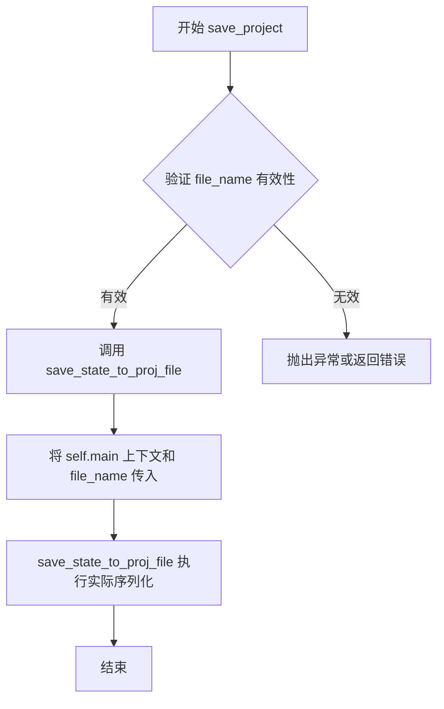

#### 带注释源码

```python
def save_project(self, file_name):
    """
    保存项目状态到指定文件。
    
    这是一个轻量级的包装方法，实际的保存逻辑由 app.projects.project_state
    模块中的 save_state_to_proj_file 函数完成。该方法主要负责：
    1. 接收并传递文件路径
    2. 确保 main 应用实例的上下文被正确传递
    
    参数:
        file_name (str): 项目文件的完整路径，格式为 .ctpr
    
    返回:
        None: 此方法不返回值，状态直接写入文件
    """
    # 调用项目状态模块的保存函数，传入主应用实例和文件名
    # save_state_to_proj_file 负责读取 self.main 中的所有相关状态
    # (如 image_files, image_states, image_patches 等) 并序列化为项目文件
    save_state_to_proj_file(self.main, file_name)
```


### `ProjectController.update_ui_from_project`

该方法负责在项目加载完成后更新用户界面，包括高亮显示当前页面、初始化撤销栈以及在后台线程中加载当前图像。

参数：无

返回值：`None`，无返回值

#### 流程图

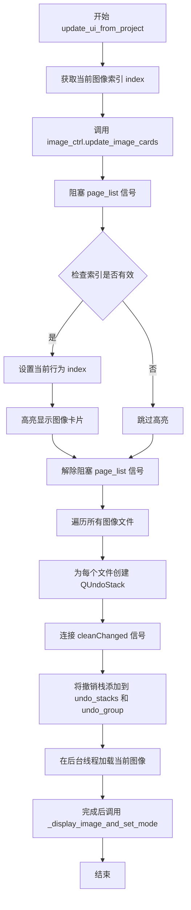

#### 带注释源码

```python
def update_ui_from_project(self):
    """
    在项目加载完成后更新UI界面。
    包括：更新图像卡片列表、高亮当前页面、初始化撤销栈、异步加载当前图像。
    """
    # 获取当前图像索引
    index = self.main.curr_img_idx
    
    # 更新图像卡片显示
    self.main.image_ctrl.update_image_cards()

    # 高亮显示与当前图像匹配的行
    # 阻塞信号以防止在程序化选择时触发不必要的信号处理
    self.main.page_list.blockSignals(True)
    
    # 检查索引是否在有效范围内
    if 0 <= index < self.main.page_list.count():
        # 设置当前选中的行
        self.main.page_list.setCurrentRow(index)
        # 高亮显示对应的图像卡片
        self.main.image_ctrl.highlight_card(index)
    
    # 解除信号阻塞
    self.main.page_list.blockSignals(False)

    # 为每个图像文件初始化撤销栈
    for file in self.main.image_files:
        # 创建新的撤销栈
        stack = QUndoStack(self.main)
        # 连接 cleanChanged 信号到窗口修改状态更新
        stack.cleanChanged.connect(self.main._update_window_modified)
        # 将撤销栈存储到对应的文件键下
        self.main.undo_stacks[file] = stack
        # 将撤销栈添加到撤销组
        self.main.undo_group.addStack(stack)

    # 在后台线程中加载当前图像
    self.main.run_threaded(
        # 加载图像的工作函数
        lambda: self.main.load_image(self.main.image_files[index]),
        # 加载完成后的回调函数
        lambda result: self._display_image_and_set_mode(result, index),
        # 错误处理函数
        self.main.default_error_handler
    )
```


### `ProjectController._display_image_and_set_mode`

该方法负责在加载项目后将图像显示在界面上，并根据当前项目模式（普通模式或网页漫画模式）来激活相应的界面状态，同时将项目状态标记为已保存（干净）状态。

参数：

- `rgb_image`：图像数据（类型根据调用上下文推断为 numpy 数组或类似的图像对象），要显示的图像数据
- `index`：`int`，当前图像在图像列表中的索引

返回值：`None`，无返回值（该方法直接作用于主控制器的状态和UI，不返回任何值）

#### 流程图

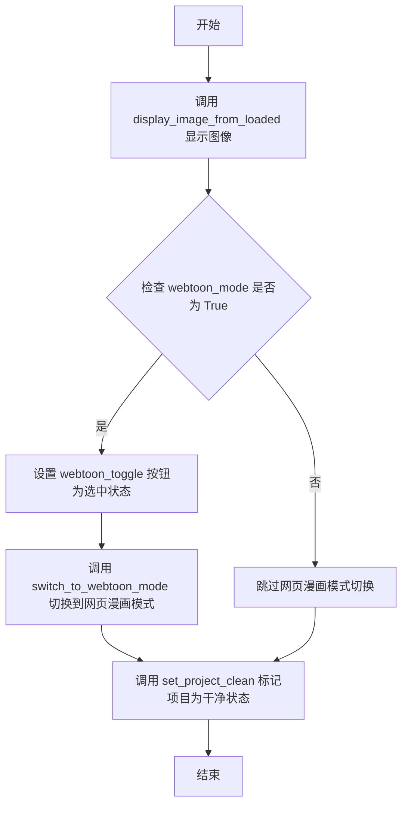

#### 带注释源码

```python
def _display_image_and_set_mode(self, rgb_image, index: int):
    """Display the image and then set the appropriate mode."""
    # 首先正常显示图像，switch_page=False 表示不切换页面焦点
    self.main.image_ctrl.display_image_from_loaded(rgb_image, index, switch_page=False)
    
    # 现在 UI 已经准备好，根据模式激活网页漫画模式
    if self.main.webtoon_mode:
        # 触发网页漫画模式的切换按钮为选中状态
        self.main.webtoon_toggle.setChecked(True)
        # 执行实际的模式切换逻辑
        self.main.webtoon_ctrl.switch_to_webtoon_mode()
    # 将项目状态标记为已保存（干净）状态，清除修改标志
    self.main.set_project_clean()
```


### `ProjectController.thread_load_project`

该方法负责启动项目的异步加载流程。首先清除当前的图像状态以确保新项目加载时的环境干净，更新窗口标题以反映新项目的信息，然后通过 `run_threaded` 启动后台线程执行实际的文件 I/O 和数据恢复操作，并在成功、失败和完成时分别调用相应的回调函数更新 UI。

参数：
-  `file_name`：`str`，要加载的项目文件路径（通常为 `.ctpr` 文件）。

返回值：`None`，该方法仅启动异步任务并立即返回。

#### 流程图

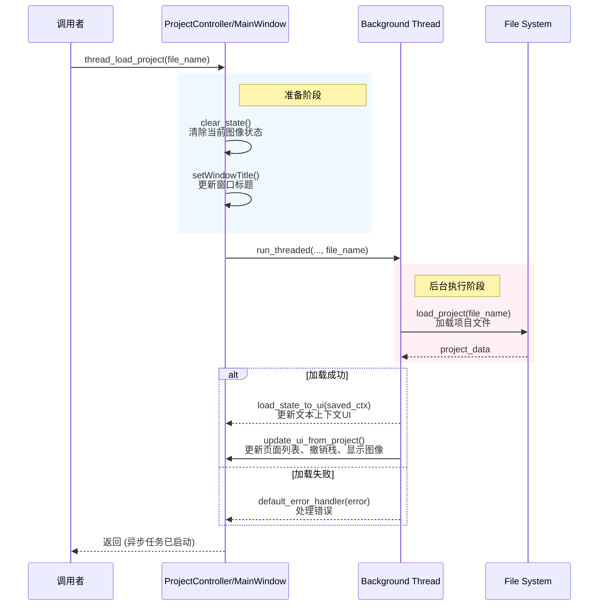

#### 带注释源码

```python
def thread_load_project(self, file_name: str):
    """
    启动异步项目加载流程。
    
    步骤：
    1. 清除当前编辑状态。
    2. 更新窗口标题。
    3. 在后台线程中加载项目文件，并在成功/失败/完成时更新UI。
    """
    
    # 清除当前的图像状态和撤销栈等，确保加载新项目时环境干净
    self.main.image_ctrl.clear_state()
    
    # 更新主窗口标题，显示文件名，并在标题栏标记为已修改（[*]）
    self.main.setWindowTitle(f"{os.path.basename(file_name)}[*]")
    
    # 使用主控制器的线程管理器启动后台任务
    # 参数顺序：worker_fn, success_cb, error_cb, finished_cb, worker_args
    self.main.run_threaded(
        self.load_project,                  # 后台 worker：负责读取文件
        self.load_state_to_ui,              # 成功回调：更新界面上的额外文本上下文
        self.main.default_error_handler,    # 错误回调：处理加载过程中的异常
        self.update_ui_from_project,        # 完成回调：刷新页面列表、重建撤销栈、加载首张图片
        file_name                           # 传递给 worker 的文件路径参数
    )
```


### `ProjectController.load_project`

该方法负责将指定的项目文件路径设置为当前项目文件，并调用项目状态加载函数从文件中读取并返回项目状态数据。

参数：

- `file_name`：`str`，要加载的项目文件的路径

返回值：`Any`，从项目文件中加载的状态数据（具体类型取决于 `load_state_from_proj_file` 的实现，通常为字典或项目状态对象）

#### 流程图

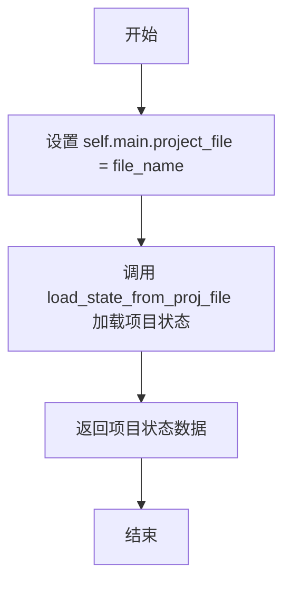

#### 带注释源码

```python
def load_project(self, file_name: str):
    """
    加载项目文件并返回项目状态数据。
    
    Args:
        file_name: 要加载的项目文件路径
        
    Returns:
        从项目文件中加载的状态数据
    """
    # 将传入的文件路径设置为当前项目的文件路径
    self.main.project_file = file_name
    
    # 调用项目状态加载函数，从文件中读取项目数据并返回
    return load_state_from_proj_file(self.main, file_name)
```


### `ProjectController.load_state_to_ui`

该方法用于将项目文件中保存的额外上下文内容加载到主界面的文本编辑器中，使用户能够查看或编辑之前保存的项目相关信息。

参数：

- `saved_ctx`：`str`，从项目文件中加载的额外上下文字符串

返回值：`None`，无返回值

#### 流程图

```mermaid
flowchart TD
    A[开始] --> B[将 saved_ctx 设置到 UI 文本框]
    B --> C[调用 setPlainText 方法]
    C --> D[结束]
```

#### 带注释源码

```python
def load_state_to_ui(self, saved_ctx: str):
    """
    将保存的上下文内容加载到UI的文本框中。
    
    参数:
        saved_ctx: 从项目文件加载的额外上下文字符串
    """
    # 使用 QPlainTextEdit 的 setPlainText 方法将字符串设置到文本框中
    # extra_context 是界面上的一个 QPlainTextEdit 控件
    self.main.settings_page.ui.extra_context.setPlainText(saved_ctx)
```


### `ProjectController.save_main_page_settings`

该方法负责将主页面的大部分应用设置保存到本地配置文件中，包括文本渲染参数、语言设置、绘图模式、画笔橡皮擦大小以及窗口状态等。

参数：无需参数（仅使用 `self` 访问控制器实例）

返回值：`None`，无返回值（将设置持久化到本地文件）

#### 流程图

```mermaid
flowchart TD
    A[开始 save_main_page_settings] --> B[创建 QSettings 对象]
    B --> C[调用 process_group 保存 text_rendering 设置]
    C --> D[开始 main_page 设置组]
    D --> E[获取并保存源语言映射]
    E --> F[获取并保存目标语言映射]
    F --> G{检查手动模式单选框状态}
    G -->|选中| H[保存模式为 'manual']
    G -->|未选中| I[保存模式为 'automatic']
    H --> J[保存画笔大小]
    J --> K[保存橡皮擦大小]
    K --> L[结束 main_page 设置组]
    L --> M[开始 MainWindow 设置组]
    M --> N[保存窗口几何数据]
    N --> O[保存窗口状态数据]
    O --> P[结束 MainWindow 设置组]
    P --> Q[结束]
```

#### 带注释源码

```python
def save_main_page_settings(self):
    """
    保存主页面设置到本地配置文件（QSettings）。
    包含：文本渲染选项、语言设置、绘图模式、画笔/橡皮擦大小、窗口状态。
    """
    # 初始化 QSettings，指定组织名和应用名
    settings = QSettings("ComicLabs", "ComicTranslate")

    # 使用通用方法处理 text_rendering 组的序列化保存
    # 调用 render_settings() 获取渲染配置的数据类，递归写入 settings
    self.process_group('text_rendering', self.main.render_settings(), settings)

    # === 保存 main_page 相关设置 ===
    settings.beginGroup("main_page")
    
    # 保存源语言：使用 lang_mapping 将界面显示的语言名称映射为英文标识
    settings.setValue("source_language", self.main.lang_mapping[self.main.s_combo.currentText()])
    # 保存目标语言：同上
    settings.setValue("target_language", self.main.lang_mapping[self.main.t_combo.currentText()])

    # 保存当前翻译模式：根据手动/自动单选框状态保存对应字符串
    settings.setValue("mode", "manual" if self.main.manual_radio.isChecked() else "automatic")

    # 保存画笔和橡皮擦的当前尺寸
    settings.setValue("brush_size", self.main.image_viewer.brush_size)
    settings.setValue("eraser_size", self.main.image_viewer.eraser_size)

    settings.endGroup()

    # === 保存窗口状态（用于下次启动时恢复界面布局） ===
    settings.beginGroup("MainWindow")
    settings.setValue("geometry", self.main.saveGeometry())   # 窗口位置和大小
    settings.setValue("state", self.main.saveState())         # 工具栏、侧边栏等可见状态
    settings.endGroup()
```


### `ProjectController.load_main_page_settings`

从 QSettings 存储中加载并恢复主页面所有设置，包括语言选项、翻译模式、画笔/橡皮擦大小、窗口几何状态以及文本渲染相关参数（如字体、对齐方式、颜色等）。

参数：
- 该方法无参数

返回值：`None`，无返回值（方法执行完成后直接返回）

#### 流程图

```mermaid
flowchart TD
    A[开始 load_main_page_settings] --> B[创建 QSettings 对象<br/>组织: ComicLabs, 应用: ComicTranslate]
    B --> C[进入 main_page 设置组]
    C --> D[读取 source_language 和 target_language]
    D --> E[通过 reverse_lang_mapping 转换回界面显示的语言名称]
    E --> F[设置 s_combo 和 t_combo 的当前选项]
    F --> G[读取 mode 设置<br/>判断 manual 或 automatic]
    G --> H{mode == 'manual'?}
    H -->|是| I[选中 manual_radio<br/>调用 manual_mode_selected]
    H -->|否| J[选中 automatic_radio<br/>调用 batch_mode_selected]
    I --> K
    J --> K
    K[读取 brush_size 和 eraser_size]
    K --> L[设置 image_viewer 的 brush_size 和 eraser_size]
    L --> M[退出 main_page 组]
    M --> N[进入 MainWindow 设置组]
    N --> O{geometry 存在?}
    O -->|是| P[调用 restoreGeometry 恢复窗口几何]
    O -->|否| Q[跳过几何恢复]
    P --> R{state 存在?}
    Q --> R
    R -->|是| S[调用 restoreState 恢复窗口状态]
    R -->|否| T[跳过状态恢复]
    S --> U
    T --> U
    U[退出 MainWindow 组]
    U --> V[进入 text_rendering 设置组]
    V --> W[读取 alignment_id 设置<br/>设置对齐工具组]
    W --> X[读取 font_family 并设置字体下拉框]
    X --> Y[读取 min_font_size 和 max_font_size<br/>设置字体大小范围]
    Y --> Z[读取 color 设置<br/>设置字体颜色按钮样式和属性]
    Z --> AA[读取 uppercase 和 outline 设置<br/>设置复选框状态]
    AA --> AB[读取 line_spacing 和 outline_width<br/>设置下拉框当前文本]
    AB --> AC[读取 outline_color<br/>设置轮廓颜色按钮样式和属性]
    AC --> AD[读取 bold, italic, underline 设置<br/>设置相应按钮的选中状态]
    AD --> AE[退出 text_rendering 组]
    AE --> AF[结束方法]
```

#### 带注释源码

```python
def load_main_page_settings(self):
    """
    从 QSettings 加载并恢复主页面所有设置。
    包括：语言选择、翻译模式、画笔/橡皮擦大小、窗口状态、文本渲染设置等。
    """
    # 创建 QSettings 对象，指定组织名和应用名
    settings = QSettings("ComicLabs", "ComicTranslate")
    
    # 进入 main_page 设置组
    settings.beginGroup("main_page")

    # ---------------------------------------------------------
    # 1. 语言设置加载
    # ---------------------------------------------------------
    # 从设置中读取源语言和目标语言（存储的是英文键名）
    source_lang = settings.value("source_language", "Korean")
    target_lang = settings.value("target_language", "English")

    # 使用反向语言映射将英文键名转换回界面显示的语言名称
    self.main.s_combo.setCurrentText(self.main.reverse_lang_mapping.get(source_lang, self.main.tr("Korean")))
    self.main.t_combo.setCurrentText(self.main.reverse_lang_mapping.get(target_lang, self.main.tr("English")))

    # ---------------------------------------------------------
    # 2. 翻译模式设置加载
    # ---------------------------------------------------------
    mode = settings.value("mode", "manual")
    if mode == "manual":
        # 手动模式：选中手动单选按钮并触发相关回调
        self.main.manual_radio.setChecked(True)
        self.main.manual_mode_selected()
    else:
        # 自动/批量模式：选中自动单选按钮并触发相关回调
        self.main.automatic_radio.setChecked(True)
        self.main.batch_mode_selected()

    # ---------------------------------------------------------
    # 3. 画笔和橡皮擦大小加载
    # ---------------------------------------------------------
    # 从设置中读取画笔大小，默认值为 10
    brush_size = int(settings.value("brush_size", 10))
    # 从设置中读取橡皮擦大小，默认值为 20
    eraser_size = int(settings.value("eraser_size", 20))
    # 应用到图像查看器
    self.main.image_viewer.brush_size = brush_size
    self.main.image_viewer.eraser_size = eraser_size

    # 退出 main_page 设置组
    settings.endGroup()

    # ---------------------------------------------------------
    # 4. 窗口状态加载
    # ---------------------------------------------------------
    # 进入 MainWindow 设置组
    settings.beginGroup("MainWindow")
    # 读取窗口几何和状态
    geometry = settings.value("geometry")
    state = settings.value("state")
    # 如果存在则恢复窗口几何形状
    if geometry is not None:
        self.main.restoreGeometry(geometry)
    # 如果存在则恢复窗口状态（工具栏、停靠窗口等）
    if state is not None:
        self.main.restoreState(state)
    # 退出 MainWindow 设置组
    settings.endGroup()

    # ---------------------------------------------------------
    # 5. 文本渲染设置加载
    # ---------------------------------------------------------
    # 进入 text_rendering 设置组
    settings.beginGroup('text_rendering')
    
    # 读取对齐方式，默认值为 1（居中）
    alignment = settings.value('alignment_id', 1, type=int)
    # 设置对齐工具组的选中状态
    self.main.alignment_tool_group.set_dayu_checked(alignment)

    # 读取字体家族并设置到字体下拉框
    self.main.font_dropdown.setCurrentText(settings.value('font_family', ''))
    # 读取最小和最大字体大小，默认值分别为 5 和 40
    min_font_size = settings.value('min_font_size', 5)
    max_font_size = settings.value('max_font_size', 40)
    # 设置字体大小范围到对应的微调框
    self.main.settings_page.ui.min_font_spinbox.setValue(int(min_font_size))
    self.main.settings_page.ui.max_font_spinbox.setValue(int(max_font_size))

    # 读取字体颜色，默认黑色
    color = settings.value('color', '#000000')
    # 设置字体颜色按钮的样式（背景色）和自定义属性
    self.main.block_font_color_button.setStyleSheet(f"background-color: {color}; border: none; border-radius: 5px;")
    self.main.block_font_color_button.setProperty('selected_color', color)
    # 读取大写和轮廓设置，设置对应的复选框状态
    self.main.settings_page.ui.uppercase_checkbox.setChecked(settings.value('upper_case', False, type=bool))
    self.main.outline_checkbox.setChecked(settings.value('outline', True, type=bool))

    # 读取行间距和轮廓宽度，设置下拉框当前文本
    self.main.line_spacing_dropdown.setCurrentText(settings.value('line_spacing', '1.0'))
    self.main.outline_width_dropdown.setCurrentText(settings.value('outline_width', '1.0'))
    # 读取轮廓颜色，默认白色
    outline_color = settings.value('outline_color', '#FFFFFF')
    # 设置轮廓颜色按钮的样式
    self.main.outline_font_color_button.setStyleSheet(f"background-color: {outline_color}; border: none; border-radius: 5px;")
    self.main.outline_font_color_button.setProperty('selected_color', outline_color)

    # 读取加粗、斜体、下划线样式，设置对应按钮的选中状态
    self.main.bold_button.setChecked(settings.value('bold', False, type=bool))
    self.main.italic_button.setChecked(settings.value('italic', False, type=bool))
    self.main.underline_button.setChecked(settings.value('underline', False, type=bool))
    
    # 退出 text_rendering 设置组
    settings.endGroup()
```


### `ProjectController.process_group`

这是一个递归辅助函数，用于将配置组及其嵌套值递归地处理并保存到 Qt QSettings 对象中，支持数据类自动转换和值映射翻译。

参数：

- `self`：隐藏的实例引用
- `group_key`：`str`，表示配置组的键名
- `group_value`：`Any`，表示配置组的值，可以是字典、数据类或其他类型
- `settings_obj`：`QSettings`，Qt 设置对象，用于持久化存储配置

返回值：`None`，该方法无返回值，直接修改 settings_obj

#### 流程图

```mermaid
flowchart TD
    A[开始 process_group] --> B{group_value 是否是 dataclass?}
    B -- 是 --> C[将 dataclass 转换为字典]
    C --> D{group_value 是否是 dict?}
    B -- 否 --> D
    D -- 是 --> E[在 settings_obj 中开始组: group_key]
    E --> F[遍历 dict 中的每个 sub_key 和 sub_value]
    F --> G[递归调用 process_group sub_key, sub_value, settings_obj]
    G --> H{dict 中还有更多项?}
    H -- 是 --> F
    H -- 否 --> I[在 settings_obj 中结束组]
    I --> J[结束]
    D -- 否 --> K[使用 value_mappings 获取映射后的值]
    K --> L[在 settings_obj 中设置值: group_key = mapped_value]
    L --> J
```

#### 带注释源码

```python
def process_group(self, group_key, group_value, settings_obj: QSettings):
    """
    Helper function to process a group and its nested values.
    
    递归地将配置组写入 QSettings 对象，支持嵌套字典和数据类。
    """
    # 检查 group_value 是否是 dataclass，如果是则转换为字典
    if is_dataclass(group_value):
        group_value = asdict(group_value)
    
    # 判断 group_value 是否为字典类型（表示有嵌套配置）
    if isinstance(group_value, dict):
        # 开始一个新的设置组
        settings_obj.beginGroup(group_key)
        
        # 递归处理字典中的每个键值对
        for sub_key, sub_value in group_value.items():
            self.process_group(sub_key, sub_value, settings_obj)
        
        # 结束当前设置组，返回上一级
        settings_obj.endGroup()
    else:
        # 如果不是字典，则为叶子节点值
        # 将值转换为英文（如果存在映射）
        mapped_value = self.main.settings_page.ui.value_mappings.get(group_value, group_value)
        
        # 将键值对写入设置对象
        settings_obj.setValue(group_key, mapped_value)
```

## 关键组件


### Webtoon 模式状态预构建 (Two-Pass State Building)

在 webtoon 模式下,使用两轮遍历策略:第一轮为所有页面构建完整且最新的状态映射(all_pages_current_state),第二轮使用预构建的状态进行渲染。loaded_pages 字典实现惰性加载,仅对已加载页面从实时场景创建状态,对未加载页面复用已存储状态。

### 文本项状态坐标转换 (Text Item Coordinate Transformation)

_create_text_items_state_from_scene 方法将场景坐标转换为页面局部坐标。通过计算文本项的原点位置是否在当前页面的垂直边界内(page_y_start 到 page_y_end)来确定文本项所属页面,然后将场景坐标转换为页面本地坐标(position - page_y_start)。

### 临时上下文对象构造 (Dynamic Context Object Creation)

使用 type() 动态创建临时上下文对象 TempMainPage,包含 image_files 和 image_states 属性,用于传递给渲染器的 add_state_to_image 方法,实现渲染器与主控制器的解耦。

### 页面边界计算 (Page Boundary Calculation)

对于最后一个页面,动态计算页面底部边界:通过 load_image 加载图像后,使用 image.shape[0] 获取图像高度,结合 page_y_start 计算 page_y_end,确保页面边界计算的准确性。

### 场景项过滤与归属判定 (Scene Item Filtering)

遍历场景中的所有项,使用 isinstance(item, TextBlockItem) 过滤文本块项,通过比较 text_y (文本项 y 坐标) 与页面垂直边界来判断文本项是否属于当前页面,实现基于原点位置的页面归属逻辑。


## 问题及建议


### 已知问题

-   **临时类动态创建**：在 `save_and_make_worker` 方法中使用 `type()` 动态创建临时类 `TempMainPage`，这种做法缺乏类型安全性、可读性差，难以调试和维护。
-   **资源清理缺乏容错**：`finally` 块中使用 `shutil.rmtree(temp_dir)` 直接删除临时目录，若遇到权限问题或文件被占用，会抛出异常导致清理失败，且错误被静默忽略。
-   **魔法数字分散**：多处硬编码的默认值散落在代码各处（如 `brush_size=10`、`eraser_size=20`、`min_font_size=5`、`max_font_size=40` 等），未集中管理，修改时容易遗漏。
-   **硬编码字符串重复**：应用名称 `"ComicLabs"` 和 `"ComicTranslate"` 在多处重复出现，应提取为常量。
-   **代码重复**：`thread_save_project` 和 `thread_save_as_project` 方法中均调用 `save_current_state()`，存在重复逻辑；`_create_text_items_state_from_scene` 中加载图像的逻辑与外部代码重复。
-   **类型提示不完整**：部分方法参数和返回值缺少类型注解（如 `save_and_make_worker`、`save_project`、`update_ui_from_project` 等），影响代码可维护性。
-   **状态同步线程安全风险**：`update_ui_from_project` 方法中直接操作 `self.main.undo_stacks` 和 UI 组件，可能存在线程安全隐患。
-   **回调函数过度封装**：多处使用 `lambda` 包装回调函数（如 `self.main.run_threaded` 的调用），增加了代码理解难度。
-   **不必要的字典封装**：`save_failed = {'value': False}` 使用字典包装布尔值，代码风格不直观，可直接使用类属性或实例变量。
-   **命名不一致**：方法命名风格不统一，如 `save_project`、`save_and_make_worker` 等，破坏了代码的可读性。

### 优化建议

-   **重构临时类**：创建正式的 `PageContext` 数据类或字典结构替代动态临时类，增强类型安全和可读性。
-   **改进资源清理**：使用 `try-except` 捕获清理异常并记录日志，或考虑使用上下文管理器管理临时目录。
-   **集中管理配置**：创建配置类或枚举定义所有默认值和魔法数字，便于统一维护。
-   **提取常量**：将 `"ComicLabs"`、`"ComicTranslate"` 等硬编码字符串提取为模块级常量。
-   **消除重复代码**：将 `save_current_state()` 的调用逻辑提取为公共方法；将图像加载逻辑封装为独立函数。
-   **完善类型提示**：为所有公开方法添加完整的类型注解，包括参数和返回值类型。
-   **线程安全优化**：确保涉及 UI 更新的代码在主线程执行，使用信号槽机制进行跨线程通信。
-   **简化回调逻辑**：将复杂的 `lambda` 回调提取为独立的方法，提高代码可读性。
-   **优化状态管理**：使用类属性替代字典封装布尔值，或考虑使用 `dataclass` 定义更结构化的状态对象。
-   **统一命名规范**：遵循 PEP8 命名约定，保持方法命名风格一致。

## 其它


### 设计目标与约束

**设计目标**：
- 提供项目保存、加载和导出的完整生命周期管理
- 支持Webtoon模式和普通模式两种图像处理方式
- 实现图像状态与UI的同步保存与恢复
- 支持多语言用户界面的设置持久化

**约束条件**：
- 文件格式：使用.ctpr作为项目文件扩展名
- 图像格式：支持常见RGB图像格式（PNG、JPG等）
- 临时文件：使用Python的tempfile模块创建临时目录，导出完成后立即清理
- 线程安全：通过run_threaded方法将耗时操作放入后台线程执行

### 错误处理与异常设计

**异常捕获机制**：
- 使用try-finally确保临时目录无论成功或失败都能被清理
- save_failed字典用于在多线程环境中传递错误状态
- default_error_handler用于统一处理错误

**主要错误场景**：
- 文件路径不存在或无效
- 图像加载失败
- 保存过程中磁盘空间不足
- 项目文件损坏或格式错误

**错误处理流程**：
- 错误发生时通过on_error回调通知UI层
- 错误信息通过error_tuple传递，包含错误类型和描述

### 数据流与状态机

**状态流转**：
- 初始状态 -> 项目加载 -> 编辑状态 -> 保存状态 -> 导出状态
- 退出时检查项目是否有未保存的修改（通过窗口标题的[*]标记）

**关键数据流**：
- 图像数据流：文件路径 -> load_image -> rgb_img -> renderer -> 保存/导出
- 文本状态流：scene items -> _create_text_items_state_from_scene -> viewer_state -> save_project -> .ctpr文件
- Webtoon模式特殊处理：需要维护all_pages_current_state映射，确保所有页面的状态都是最新的

**状态持久化**：
- image_states：存储每个图像文件的viewer_state和patches
- undo_stacks：每个文件独立的QUndoStack用于撤销/重做
- settings：使用QSettings持久化UI设置

### 外部依赖与接口契约

**直接依赖模块**：
- imkit (imk)：图像处理工具库
- PySide6.QtWidgets：Qt GUI框架
- PySide6.QtCore：Qt核心功能（QSettings）
- PySide6.QtGui：Qt图形功能（QUndoStack）
- dataclasses：Python数据类支持
- os, shutil, tempfile：标准库文件系统操作

**项目内部依赖**：
- TextBlockItem, TextItemProperties：文本项目数据结构
- ImageSaveRenderer：图像渲染器
- save_state_to_proj_file, load_state_from_proj_file：项目文件序列化
- make函数：从modules.utils.archives导入的打包函数
- ComicTranslate：主控制器类（main对象）

**接口契约**：
- save_and_make：异步保存项目并导出，支持进度回调和错误处理
- thread_load_project/thread_save_project：线程安全的项目操作
- update_ui_from_project：UI更新必须在主线程执行

### 性能考虑

**优化策略**：
- Webtoon模式使用两遍处理：第一遍构建完整状态映射，第二遍渲染
- 仅对已加载页面使用实时场景状态，未加载页面使用缓存状态
- 临时目录在操作完成后立即清理，避免磁盘空间浪费

**性能瓶颈**：
- 大量图像时的加载和保存操作
- Webtoon模式下每个页面都需要重新渲染
- 每次保存都遍历所有页面构建状态

### 安全考虑

**输入验证**：
- file_dialog.getSaveFileName验证用户输入的文件名
- 文件路径使用os.path.basename防止路径遍历攻击

**资源管理**：
- tempfile.mkdtemp创建的临时目录在finally块中确保删除
- 使用shutil.rmtree递归删除临时目录

### 测试策略

**单元测试建议**：
- 测试_create_text_items_state_from_scene的页面边界计算逻辑
- 测试TextItemProperties的序列化/反序列化
- 测试process_group的嵌套设置处理

**集成测试建议**：
- 测试完整的保存-加载-恢复流程
- 测试Webtoon模式和普通模式的导出功能
- 测试错误处理流程（模拟文件不存在等情况）

### 部署与配置

**配置文件位置**：
- QSettings存储位置：Windows注册表HKEY_CURRENT_USER\Software\ComicLabs\ComicTranslate
- 包含设置组：main_page、text_rendering、MainWindow

**部署要求**：
- PySide6依赖Qt运行时库
- imkit模块必须正确安装
- 项目文件.ctpr需要与应用关联

    