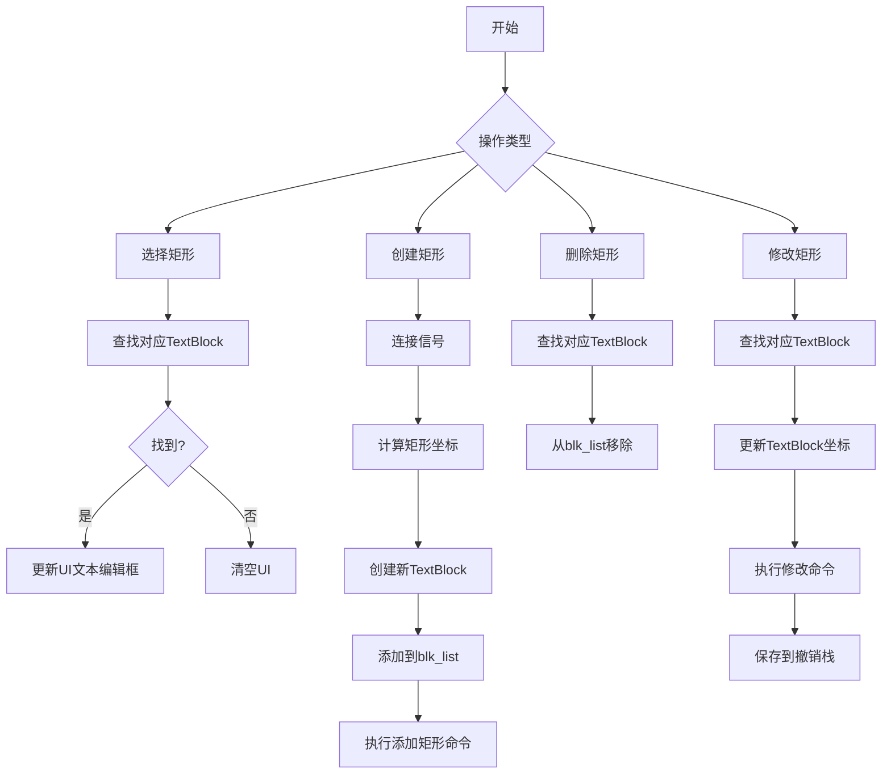
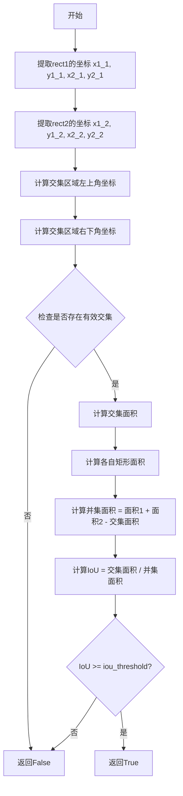
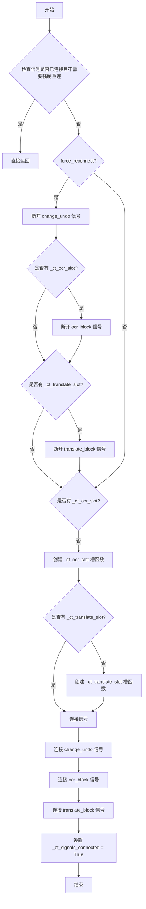
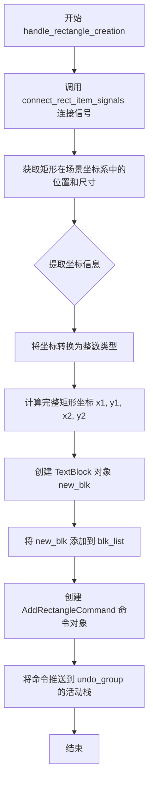
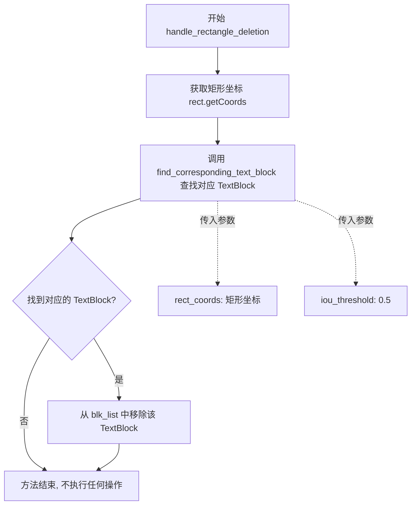
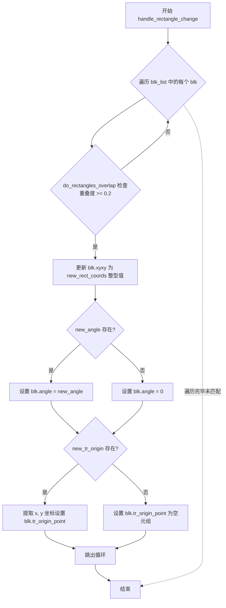
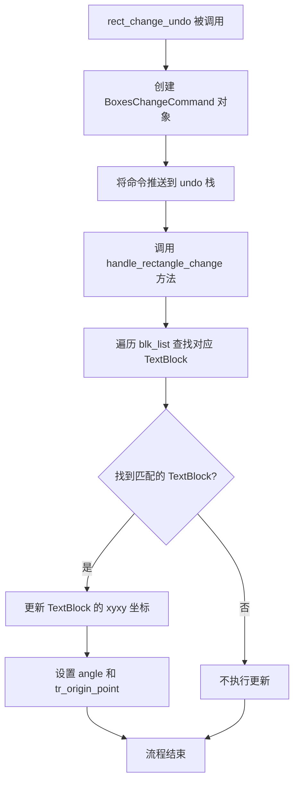
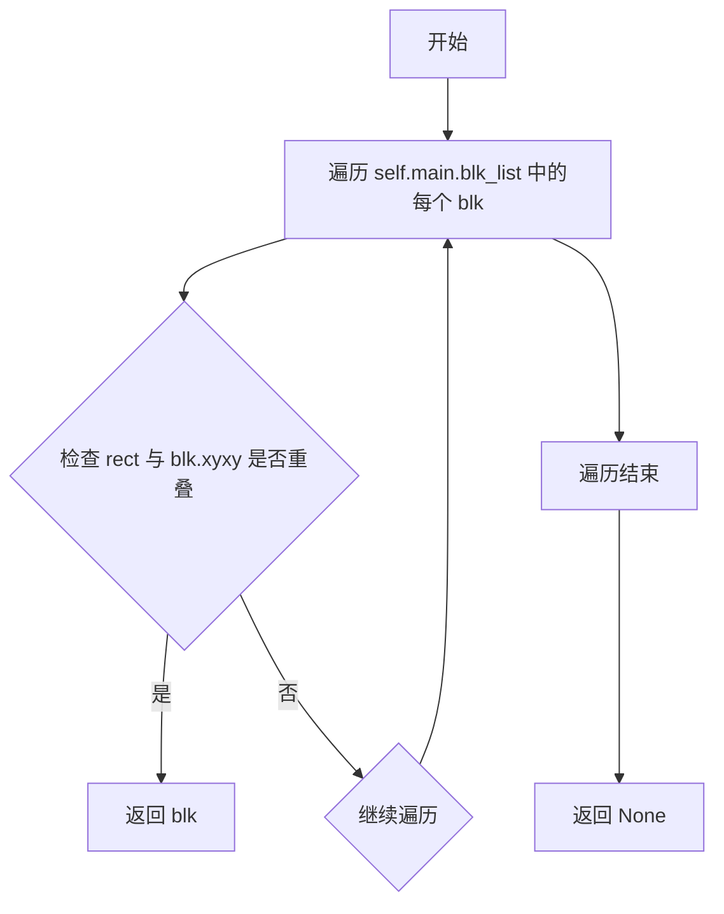

```mermaid
flowchart TD
    A[开始 find_corresponding_rect] --> B[获取 image_viewer.rectangles 列表]
    B --> C{rects 中是否有未遍历的矩形}
    C -->|是| D[获取当前矩形 rect]
    D --> E[将矩形映射到场景坐标: mp_rect = rect.mapRectToScene&#40;rect.rect&#41;]
    E --> F[获取场景坐标矩形的坐标: x1, y1, w, h = mp_rect.getRect&#40;]
    F --> G[计算矩形坐标: rect_coord = &#40;x1, y1, x1 + w, y1 + h&#41;]
    G --> H{do_rectangles_overlap&#40;rect_coord, tblock.xyxy, iou_threshold&#41;?}
    H -->|是| I[返回当前矩形 rect]
    H -->|否| C
    C -->|否| J[返回 None]
    I --> K[结束]
    J --> K
```

# `comic-translate\app\controllers\rect_item.py` 详细设计文档

该模块是漫画翻译应用中处理画布矩形项的核心控制器，负责协调图形界面中的可移动矩形（代表文本区域）与后端文本块数据之间的交互，包括矩形的创建、选择、删除、修改、同步以及撤销操作，并利用IOU阈值算法实现矩形与文本块的相互查找。

## 整体流程



## 类结构

```
RectItemController (主控制器类)
├── 依赖: MoveableRectItem (Qt图形项)
├── 依赖: TextBlock (数据模型)
├── 依赖: AddRectangleCommand (命令模式-添加)
└── 依赖: BoxesChangeCommand (命令模式-修改)
```

## 全局变量及字段


### `MoveableRectItem._ct_signals_connected`
    
标记矩形项的信号是否已连接，避免重复连接

类型：`bool`
    


### `MoveableRectItem._ct_ocr_slot`
    
矩形项的OCR处理回调函数，用于触发OCR识别

类型：`Callable`
    


### `MoveableRectItem._ct_translate_slot`
    
矩形项的翻译处理回调函数，用于触发翻译功能

类型：`Callable`
    


### `RectItemController.main`
    
主控制器引用，提供对整个应用状态和功能的访问

类型：`ComicTranslate`
    
    

## 全局函数及方法


### `do_rectangles_overlap`

该函数用于检测两个矩形是否重叠，通过计算两个矩形的交并比（IoU）并与阈值比较来判断重叠程度。

参数：

- `rect1`：`tuple[float, float, float, float]`，第一个矩形的坐标，格式为 (x1, y1, x2, y2)
- `rect2`：`tuple[float, float, float, float]`，第二个矩形的坐标，格式为 (x1, y1, x2, y2)
- `iou_threshold`：`float`，IoU阈值，范围0到1之间，表示判断矩形重叠的最小IoU值

返回值：`bool`，如果两个矩形的IoU值大于等于阈值返回True，否则返回False

#### 流程图



#### 带注释源码

```python
def do_rectangles_overlap(rect1: tuple, rect2: tuple, iou_threshold: float) -> bool:
    """
    检测两个矩形是否重叠（基于IoU阈值）
    
    参数:
        rect1: 第一个矩形坐标, 格式为 (x1, y1, x2, y2)
        rect2: 第二个矩形坐标, 格式为 (x1, y1, x2, y2)
        iou_threshold: IoU阈值，范围0-1之间
    
    返回:
        bool: 如果IoU大于等于阈值返回True，否则返回False
    """
    # 提取矩形1的坐标
    x1_1, y1_1, x2_1, y2_1 = rect1
    # 提取矩形2的坐标
    x1_2, y1_2, x2_2, y2_2 = rect2
    
    # 计算交集区域的左上角坐标（取两个矩形x和y的最大值）
    x1_i = max(x1_1, x1_2)
    y1_i = max(y1_1, y1_2)
    
    # 计算交集区域的右下角坐标（取两个矩形x和y的最小值）
    x2_i = min(x2_1, x2_2)
    y2_i = min(y2_1, y2_2)
    
    # 检查是否存在交集（如果左上角在右下角的右侧或下方，则无交集）
    if x2_i < x1_i or y2_i < y1_i:
        return False
    
    # 计算交集面积
    intersection_area = (x2_i - x1_i) * (y2_i - y1_i)
    
    # 计算各自矩形的面积
    area1 = (x2_1 - x1_1) * (y2_1 - y1_1)
    area2 = (x2_2 - x1_2) * (y2_2 - y1_2)
    
    # 计算并集面积（避免除零错误）
    union_area = area1 + area2 - intersection_area
    if union_area <= 0:
        return False
    
    # 计算IoU（Intersection over Union）
    iou = intersection_area / union_area
    
    # 与阈值比较，返回结果
    return iou >= iou_threshold
```


### `RectItemController.connect_rect_item_signals`

该方法用于将矩形项（MoveableRectItem）的信号与控制器中的槽函数进行连接或重连接，确保当矩形发生变更、OCR请求或翻译请求时，能够触发相应的处理逻辑。

参数：

- `rect_item`：`MoveableRectItem`，需要连接信号的矩形项对象
- `force_reconnect`：`bool = False`，是否强制重新连接信号

返回值：`None`，无返回值

#### 流程图



#### 带注释源码

```
def connect_rect_item_signals(self, rect_item: MoveableRectItem, force_reconnect: bool = False):
    """
    连接矩形项的信号到控制器的槽函数
    
    参数:
        rect_item: MoveableRectItem - 要连接信号的矩形项
        force_reconnect: bool - 是否强制重新连接
    
    返回:
        None
    """
    # 检查信号是否已经连接过，且不需要强制重连
    if getattr(rect_item, "_ct_signals_connected", False) and not force_reconnect:
        return  # 如果已经连接且不强制重连，则直接返回

    # 如果需要强制重连，先断开现有的信号连接
    if force_reconnect:
        try:
            # 断开变更撤销信号
            rect_item.signals.change_undo.disconnect(self.rect_change_undo)
        except (TypeError, RuntimeError):
            pass  # 忽略断开失败的情况
        
        # 如果存在OCR槽函数，断开OCR信号
        if hasattr(rect_item, "_ct_ocr_slot"):
            try:
                rect_item.signals.ocr_block.disconnect(rect_item._ct_ocr_slot)
            except (TypeError, RuntimeError):
                pass
        
        # 如果存在翻译槽函数，断开翻译信号
        if hasattr(rect_item, "_ct_translate_slot"):
            try:
                rect_item.signals.translate_block.disconnect(rect_item._ct_translate_slot)
            except (TypeError, RuntimeError):
                pass

    # 如果不存在OCR槽函数，创建它（调用主控制器的OCR功能）
    if not hasattr(rect_item, "_ct_ocr_slot"):
        rect_item._ct_ocr_slot = lambda: self.main.ocr(True)
    
    # 如果不存在翻译槽函数，创建它（调用主控制器的翻译功能）
    if not hasattr(rect_item, "_ct_translate_slot"):
        rect_item._ct_translate_slot = lambda: self.main.translate_image(True)

    # 连接变更撤销信号
    rect_item.signals.change_undo.connect(self.rect_change_undo)
    
    # 连接OCR块信号
    rect_item.signals.ocr_block.connect(rect_item._ct_ocr_slot)
    
    # 连接翻译块信号
    rect_item.signals.translate_block.connect(rect_item._ct_translate_slot)
    
    # 标记信号已连接，避免重复连接
    rect_item._ct_signals_connected = True
```


### `RectItemController.handle_rectangle_selection`

处理矩形选中事件，当用户选中一个矩形区域时，该方法会查找对应的文本块并将文本和翻译内容填充到界面编辑框中。如果未找到对应的文本块，则清空编辑框内容。

参数：

- `rect`：`QRectF`，Qt矩形对象，表示用户在画布上选中的矩形区域

返回值：`None`，该方法无返回值，主要通过修改主控制器的状态来更新UI

#### 流程图

```mermaid
flowchart TD
    A[开始 handle_rectangle_selection] --> B[获取矩形坐标: rect.getCoords()]
    B --> C[调用 find_corresponding_text_block 查找对应文本块]
    C --> D{找到对应的 TextBlock?}
    D -->|是| E[阻塞源文本编辑框信号]
    E --> F[阻塞翻译文本编辑框信号]
    F --> G[设置源文本编辑框内容为 curr_tblock.text]
    G --> H[设置翻译文本编辑框内容为 curr_tblock.translation]
    H --> I[解除源文本编辑框信号阻塞]
    I --> J[解除翻译文本编辑框信号阻塞]
    J --> K[结束]
    D -->|否| L[清空源文本编辑框]
    L --> M[清空翻译文本编辑框]
    M --> N[设置 curr_tblock 为 None]
    N --> K
```

#### 带注释源码

```python
def handle_rectangle_selection(self, rect: QRectF):
    """
    处理矩形选中事件
    当用户在画布上选中一个矩形时，查找对应的文本块并更新UI
    
    参数:
        rect: QRectF类型，表示选中的矩形区域
    """
    # 获取矩形的坐标元组 (x1, y1, x2, y2)
    rect = rect.getCoords()
    
    # 根据矩形坐标查找对应的文本块，使用0.5的IOU阈值
    self.main.curr_tblock = self.find_corresponding_text_block(rect, 0.5)
    
    # 判断是否找到对应的文本块
    if self.main.curr_tblock:
        # 阻塞源文本编辑框的信号，防止触发不必要的信号连锁反应
        self.main.s_text_edit.blockSignals(True)
        # 阻塞翻译文本编辑框的信号
        self.main.t_text_edit.blockSignals(True)
        
        # 将找到的文本块内容填充到源文本编辑框
        self.main.s_text_edit.setPlainText(self.main.curr_tblock.text)
        # 将文本块的翻译内容填充到翻译文本编辑框
        self.main.t_text_edit.setPlainText(self.main.curr_tblock.translation)
        
        # 解除源文本编辑框的信号阻塞，恢复正常信号传递
        self.main.s_text_edit.blockSignals(False)
        # 解除翻译文本编辑框的信号阻塞
        self.main.t_text_edit.blockSignals(False)
    else:
        # 未找到对应的文本块时，清空源文本编辑框
        self.main.s_text_edit.clear()
        # 清空翻译文本编辑框
        self.main.t_text_edit.clear()
        # 重置当前文本块为None
        self.main.curr_tblock = None
```


### `RectItemController.handle_rectangle_creation`

该方法负责处理新矩形的创建逻辑，包括连接信号、将矩形坐标转换为场景坐标、创建对应的TextBlock对象、将其添加到块列表，并通过命令模式将操作推送到撤销栈中以支持撤销功能。

参数：

- `rect_item`：`MoveableRectItem`，需要进行创建处理的矩形项目对象，包含位置和尺寸信息

返回值：`None`，该方法不返回任何值，通过副作用（添加块到列表、推送命令到撤销栈）完成操作

#### 流程图



#### 带注释源码

```python
def handle_rectangle_creation(self, rect_item: MoveableRectItem):
    """
    处理新矩形的创建操作。
    
    该方法执行以下步骤：
    1. 连接矩形项目的信号槽
    2. 将矩形坐标转换到场景坐标系
    3. 创建对应的 TextBlock 并添加到列表
    4. 通过命令模式推送撤销操作
    """
    # Step 1: 连接矩形项目的信号，确保后续的撤销、OCR、翻译操作能够正常工作
    self.connect_rect_item_signals(rect_item)
    
    # Step 2: 获取矩形在场景坐标系中的位置和尺寸
    # mapRectToScene 将矩形从项目坐标转换到场景坐标
    new_rect = rect_item.mapRectToScene(rect_item.rect())
    
    # Step 3: 提取矩形的坐标和宽高
    x1, y1, w, h = new_rect.getRect()
    
    # Step 4: 将坐标转换为整数类型，确保后续处理的精度
    x1, y1, w, h = int(x1), int(y1), int(w), int(h)
    
    # Step 5: 计算完整的矩形坐标 (x1, y1, x2, y2)
    new_rect_coords = (x1, y1, x1 + w, y1 + h)
    
    # Step 6: 创建新的 TextBlock 对象，包含矩形的边界框信息
    new_blk = TextBlock(text_bbox=np.array(new_rect_coords))
    
    # Step 7: 将新创建的 TextBlock 添加到主程序的块列表中
    self.main.blk_list.append(new_blk)
    
    # Step 8: 创建添加矩形的命令对象，用于撤销功能
    # AddRectangleCommand 封装了添加操作，支持后续撤销
    command = AddRectangleCommand(self.main, rect_item, new_blk, self.main.blk_list)
    
    # Step 9: 将命令推送到撤销栈，使其生效
    self.main.undo_group.activeStack().push(command)
```


### `RectItemController.handle_rectangle_deletion`

该方法负责处理画布上矩形框的删除操作。当用户删除一个矩形框时，此方法根据矩形坐标找到对应的文本块（TextBlock），并将其从系统的文本块列表（blk_list）中移除，实现UI元素与底层数据模型的同步删除。

参数：

- `rect`：`QRectF`，要删除的矩形框对象，包含矩形的位置和尺寸信息

返回值：`None`，该方法直接修改`self.main.blk_list`列表，不返回任何值

#### 流程图



#### 带注释源码

```python
def handle_rectangle_deletion(self, rect: QRectF):
    """
    处理矩形框删除事件的控制器方法
    
    当用户在画布上删除一个矩形框时，此方法负责：
    1. 获取被删除矩形框的坐标信息
    2. 在文本块列表中查找与该矩形对应的TextBlock对象
    3. 将找到的TextBlock从blk_list中移除
    
    注意：如果未找到对应的TextBlock（例如已被删除或不存在），
    remove操作会抛出ValueError，但根据调用场景此处未做额外保护。
    
    参数:
        rect (QRectF): 要删除的矩形框对象，包含x1, y1, x2, y2坐标
    
    返回:
        None: 直接修改self.main.blk_list，不返回任何值
    """
    # 将QRectF对象转换为坐标元组 (x1, y1, x2, y2)
    rect_coords = rect.getCoords()
    
    # 根据矩形坐标在blk_list中查找对应的TextBlock
    # 使用0.5的IOU阈值进行匹配判断
    current_text_block = self.find_corresponding_text_block(rect_coords, 0.5)
    
    # 从主控制器的文本块列表中移除找到的TextBlock
    self.main.blk_list.remove(current_text_block)
```


### `RectItemController.handle_rectangle_change`

该方法负责在用户拖拽或调整矩形框（MoveableRectItem）后，将新的矩形坐标、同步更新到对应的 TextBlock 数据模型中，维持视图层与数据层的一致性。

参数：

- `old_rect_coords`：`tuple`，旧的矩形坐标，格式为 (x1, y1, x2, y2)
- `new_rect_coords`：`tuple`，新的矩形坐标，格式为 (x1, y1, x2, y2)
- `new_angle`：`float`，矩形的新旋转角度
- `new_tr_origin`：`QPointF`，矩形变换原点（transform origin）的坐标

返回值：`None`，该方法直接修改 `self.main.blk_list` 中对应 TextBlock 对象的属性，无返回值

#### 流程图



#### 带注释源码

```python
def handle_rectangle_change(
        self, 
        old_rect_coords: tuple, 
        new_rect_coords: tuple, 
        new_angle: float, 
        new_tr_origin: QPointF
    ):
        # 在 blk_list 中查找与旧矩形重叠的 TextBlock
        # 重叠阈值设为 0.2（20%），允许一定程度的容差
        for blk in self.main.blk_list:
            if do_rectangles_overlap(blk.xyxy, old_rect_coords, 0.2):
                # 更新 TextBlock 的坐标边界 (xyxy 格式: [x1, y1, x2, y2])
                blk.xyxy[:] = [int(new_rect_coords[0]), 
                               int(new_rect_coords[1]),
                               int(new_rect_coords[2]), 
                               int(new_rect_coords[3])]
                
                # 更新旋转角度，若无角度则默认为 0
                blk.angle = new_angle if new_angle else 0
                
                # 更新变换原点坐标，若无变换原点则为空的元组
                blk.tr_origin_point = (new_tr_origin.x(), new_tr_origin.y()) if new_tr_origin else ()
                
                # 找到对应的 TextBlock 后立即跳出循环，避免不必要的遍历
                break
```


### `RectItemController.rect_change_undo`

该方法用于处理矩形项的撤销操作，当矩形发生变化（如移动、缩放、旋转）时，创建对应的撤销命令并更新关联的 TextBlock 数据。

参数：

- `old_state`：状态对象，包含矩形变化前的状态信息（包含 `rect`、`rotation`、`transform_origin` 等属性）
- `new_state`：状态对象，包含矩形变化后的状态信息（包含 `rect`、`rotation`、`transform_origin` 等属性）

返回值：`None`，该方法无返回值，仅执行副作用操作（推送命令到撤销栈并更新数据）

#### 流程图



#### 带注释源码

```python
def rect_change_undo(self, old_state, new_state):
    """
    处理矩形项的撤销操作
    
    当矩形发生变化时，此方法会被调用以：
    1. 创建一个可撤销的命令对象
    2. 将该命令推送到撤销栈以便后续可以撤销/重做
    3. 更新底层 TextBlock 的数据以保持同步
    
    参数:
        old_state: 包含矩形变化前状态的对象，需有 rect 属性
        new_state: 包含矩形变化后状态的对象，需有 rect、rotation、transform_origin 属性
    
    返回:
        None
    """
    # 创建 BoxesChangeCommand 命令对象，用于封装矩形变化以便撤销
    # 参数依次为：图像查看器、旧状态、新状态、文本块列表
    command = BoxesChangeCommand(self.main.image_viewer, old_state,
                                 new_state, self.main.blk_list)
    
    # 将命令推送到当前活动的撤销栈，实现撤销功能
    self.main.undo_group.activeStack().push(command)
    
    # 调用 handle_rectangle_change 方法更新底层 TextBlock 数据
    # 传递旧矩形坐标、新矩形坐标、旋转角度和变换原点
    self.handle_rectangle_change(
        old_state.rect,        # 变化前的矩形坐标
        new_state.rect,        # 变化后的矩形坐标
        new_state.rotation,    # 新的旋转角度
        new_state.transform_origin  # 新的变换原点
    )
```


### `RectItemController.find_corresponding_text_block`

在 `blk_list` 中查找与给定矩形重叠的文本块，如果找到则返回该 `TextBlock` 对象，否则返回 `None`。

参数：

-  `rect`：`tuple[float]`，矩形的坐标元组，格式为 (x1, y1, x2, y2)
-  `iou_threshold`：`int`，IOU 阈值，用于判断矩形是否重叠，默认为 0.5

返回值：`TextBlock | None`，如果找到对应的文本块则返回该 `TextBlock` 对象，否则返回 `None`

#### 流程图



#### 带注释源码

```python
def find_corresponding_text_block(self, rect: tuple[float], iou_threshold: int = 0.5):
    """
    在 blk_list 中查找与给定矩形重叠的文本块
    
    参数:
        rect: 矩形的坐标元组，格式为 (x1, y1, x2, y2)
        iou_threshold: IOU 阈值，用于判断矩形是否重叠，默认为 0.5
    
    返回:
        如果找到对应的文本块则返回该 TextBlock 对象，否则返回 None
    """
    # 遍历主控制器中的所有文本块
    for blk in self.main.blk_list:
        # 使用几何工具函数检查两个矩形是否重叠
        if do_rectangles_overlap(rect, blk.xyxy, iou_threshold):
            # 如果重叠，返回当前匹配的文本块
            return blk
    # 遍历完成未找到匹配项，返回 None
    return None
```


### `RectItemController.find_corresponding_rect`

该方法用于在图像查看器的所有矩形项中，根据给定的 TextBlock 找到与之对应的矩形项。它通过遍历图像查看器中的所有矩形，将每个矩形映射到场景坐标，然后使用 IOU（Intersection over Union）阈值判断矩形与 TextBlock 是否重叠，从而找到匹配的矩形项。

参数：

- `tblock`：`TextBlock`，需要查找对应矩形的文本块对象，包含其坐标信息 `xyxy`
- `iou_threshold`：`int`，IOU 阈值，用于判断矩形与文本块是否重叠，值越大表示要求重叠程度越高

返回值：`MoveableRectItem | None`，返回与给定 TextBlock 对应的矩形项（MoveableRectItem），如果未找到匹配的矩形则返回 `None`

#### 流程图



#### 带注释源码

```python
def find_corresponding_rect(self, tblock: TextBlock, iou_threshold: int):
    """
    根据给定的 TextBlock 查找对应的矩形项
    
    参数:
        tblock: TextBlock - 需要查找对应矩形的文本块对象
        iou_threshold: int - IOU 阈值，用于判断重叠程度
    
    返回:
        MoveableRectItem | None - 找到的对应矩形项，未找到则返回 None
    """
    # 遍历图像查看器中的所有矩形项
    for rect in self.main.image_viewer.rectangles:
        # 将矩形项的局部坐标映射到场景坐标
        mp_rect = rect.mapRectToScene(rect.rect())
        
        # 获取场景坐标矩形的坐标信息 (x, y, width, height)
        x1, y1, w, h = mp_rect.getRect()
        
        # 计算矩形的完整坐标 (x1, y1, x2, y2)
        rect_coord = (x1, y1, x1 + w, y1 + h)
        
        # 检查矩形坐标与 TextBlock 的 xyxy 坐标是否重叠
        # 使用 iou_threshold 作为重叠阈值
        if do_rectangles_overlap(rect_coord, tblock.xyxy, iou_threshold):
            # 如果重叠，返回当前找到的矩形项
            return rect
    
    # 遍历完所有矩形仍未找到匹配的项，返回 None
    return None
```

## 关键组件


### RectItemController (矩形项控制器)

负责管理画布上文本块矩形的选择、创建、删除、修改以及与UI的信号连接，是矩形项与后端数据模型(TextBlock)之间的桥梁。

### MoveableRectItem (可移动矩形项)

Qt图形项，代表画布上可拖拽、旋转的文本框区域，通过信号机制触发OCR、翻译和撤销操作。

### TextBlock (文本块数据模型)

存储文本区域的坐标(xyxy)、角度(angle)、翻译原点(transform_origin_point)、原文(text)和翻译(translation)的数据结构。

### 信号连接机制 (Signal Connection)

实现了矩形项的change_undo、ocr_block、translate_block信号与主控制器方法的动态绑定，支持强制重连和防重复连接。

### AddRectangleCommand (添加矩形命令)

命令模式实现，封装添加新矩形到blk_list的操作，支持撤销功能。

### BoxesChangeCommand (变更矩形命令)

命令模式实现，封装矩形坐标、旋转角度、变换原点的变更操作，支持撤销功能。

### 矩形重叠检测 (do_rectangles_overlap)

基于IOU阈值的矩形重叠判断算法，用于建立矩形项与TextBlock之间的映射关系。

### 撤销/重做堆栈管理 (Undo Stack)

通过Qt的QUndoStack管理命令队列，实现矩形操作的原子性撤销和重做。


## 问题及建议


### 已知问题

- **信号连接状态管理脆弱**：使用 `_ct_signals_connected` 标志和 `hasattr` 检查来管理信号连接状态，这种方式容易产生状态不一致，且无法保证在所有场景下都能正确处理
- **缺少空值检查**：在 `handle_rectangle_selection` 和 `handle_rectangle_deletion` 方法中，`find_corresponding_text_block` 可能返回 `None`，但代码直接访问其属性而未进行空值检查，可能导致 `AttributeError`
- **硬编码的阈值**：0.5 和 0.2 的 IOU 阈值硬编码在多个方法中，降低了代码的灵活性和可配置性
- **参数类型不一致**：`find_corresponding_text_block` 方法的 `iou_threshold` 参数类型声明为 `int`，但实际传入的是浮点数（如 0.5），类型标注不准确
- **职责不清晰**：`rect_change_undo` 方法同时执行命令推送和直接修改数据，两种操作混在一起容易导致状态同步问题
- **直接修改对象内部状态**：在 `handle_rectangle_change` 中直接使用 `blk.xyxy[:] = [...]` 修改列表内容，绕过了可能的 setter 逻辑
- **重复代码模式**：`connect_rect_item_signals` 方法中多次使用 `try/except` 块来断开信号连接，代码冗余

### 优化建议

- **增加空值保护**：在访问 `curr_tblock` 属性前检查其是否为 `None`
- **提取配置参数**：将 IOU 阈值作为类属性或配置项统一管理
- **修复类型标注**：将 `iou_threshold` 的类型改为 `float`
- **分离关注点**：将 `rect_change_undo` 中的命令执行和数据更新分离到独立方法
- **使用上下文管理器或装饰器**：重构信号连接逻辑，使用更可靠的状态管理模式
- **添加文档字符串**：为关键方法添加参数和返回值说明
- **统一命名规范**：确保参数命名在类内部保持一致性


## 其它


### 设计目标与约束

本类（RectItemController）旨在解耦UI层的矩形图形项（MoveableRectItem）与业务层的文本块数据（TextBlock）之间的逻辑，实现矩形操作（创建、删除、选择、修改）与文本块数据的双向同步。设计约束包括：1）依赖PySide6信号槽机制；2）假定main控制器对象包含blk_list（文本块列表）、image_viewer（图像查看器）、undo_group（撤销组）、ocr/translate方法及文本编辑框等属性；3）使用命令模式支持撤销/重做；4）IOU阈值默认0.5用于矩形匹配。

### 错误处理与异常设计

信号连接采用try-except捕获TypeError和RuntimeError，防止重复断开未连接信号；find_corresponding_text_block和find_corresponding_rect返回None表示未匹配；handle_rectangle_selection中访问curr_tblock前先判断是否存在；矩形坐标转换使用int()强制取整避免浮点精度问题。

### 数据流与状态机

数据流：用户操作矩形 → 信号触发 → Controller方法处理 → 更新blk_list → 执行命令（撤销栈） → UI反馈。状态转换：矩形创建（handle_rectangle_creation）→ 添加到blk_list并推入撤销命令；矩形选择（handle_rectangle_selection）→ 查找对应TextBlock并填充文本编辑框；矩形修改（handle_rectangle_change）→ 更新TextBlock的xyxy/angle/tr_origin_point属性；矩形删除（handle_rectangle_deletion）→ 从blk_list移除。

### 外部依赖与接口契约

依赖：numpy（数组操作）、PySide6.QtCore（QRectF/QPointF几何类型）、MoveableRectItem（自定义矩形项类，含signals属性）、AddRectangleCommand/BoxesChangeCommand（命令类）、do_rectangles_overlap（几何重叠检测函数）、TextBlock（文本块数据类）、ComicTranslate（主控制器类）。接口契约：main参数需包含blk_list、image_viewer、undo_group、curr_tblock、s_text_edit、t_text_edit、ocr、translate_image属性；rect_item需包含signals（change_undo/ocr_block/translate_block信号）、rect()、mapRectToScene()方法。

### 性能考虑

find_corresponding_text_block和find_corresponding_rect采用线性遍历，blk_list和rectangles规模较大时可考虑空间索引（如R树）优化；信号连接带缓存标志_ct_signals_connected避免重复连接；批量操作时可考虑合并撤销命令。

### 线程安全性

本类主要运行在主UI线程，未使用多线程机制；若有后台OCR/翻译线程，需通过信号槽跨线程通信，避免直接操作UI元素。

### 资源管理

rect_item通过_ct_ocr_slot和_ct_translate_slot属性持有lambda闭包引用，需在矩形项销毁时显式断开信号连接（force_reconnect=True）防止内存泄漏；命令对象由undo_group生命周期管理。

### 配置与扩展性

IOU阈值（iou_threshold）参数化便于调整匹配精度；可通过继承RectItemController重写handle_*方法扩展自定义逻辑；支持force_reconnect参数灵活控制信号重连策略。

### 安全性考虑

输入验证：handle_rectangle_creation中强制int()转换防止非整数坐标；rect_change_undo直接使用传入的old_state/new_state参数，需确保调用方可信；无用户输入直接执行危险操作（如文件/网络访问）。

### 测试策略

单元测试：mock ComicTranslate对象，测试各handle方法对blk_list的修改；测试find_corresponding_text_block/rect的匹配准确性；测试信号连接/断开的边界情况。集成测试：模拟用户拖拽矩形，验证撤销栈和UI更新一致性。

    