# `comic-translate\app\controllers\search_replace.py` 详细设计文档

这是一个漫画翻译应用中的搜索和替换控制器（SearchReplaceController），用于在多个图像和文本块中进行文本搜索和替换操作。支持正则表达式、大小写匹配、全词匹配、保留大小写等功能，并支持Webtoon模式和普通模式下的文本替换，同时处理富文本（HTML）格式以保留原始样式。

## 整体流程

```mermaid
graph TD
    A[开始] --> B[用户输入搜索关键字并点击搜索]
B --> C[收集搜索选项 (_gather_options)]
C --> D[编译搜索模式 (compile_search_pattern)]
D --> E{正则表达式有效?}
E -- 否 --> F[显示搜索错误]
E -- 是 --> G[遍历文本块 (_iter_blocks)]
G --> H[对每个块的源文本或目标文本进行匹配]
H --> I{找到匹配?}
I -- 否 --> J[显示无结果]
I -- 是 --> K[保存匹配结果到 _matches]
K --> L[高亮显示第一个匹配]
L --> M[用户选择操作: 替换当前/替换全部/下一个/上一个]
M --> N{操作类型}
N -- 替换当前 --> O[替换当前匹配 (replace_current)]
N -- 替换全部 --> P[替换所有匹配 (replace_all)]
N -- 下一个 --> Q[跳转到下一个匹配 (next_match)]
N -- 上一个 --> R[跳转到上一个匹配 (prev_match)]
O --> S[执行撤销命令并更新UI]
P --> S
Q --> T[_jump_to_match 异步等待页面加载后选中块]
R --> T
```

## 类结构

```
BlockKey (数据类-表示文本块位置)
SearchOptions (数据类-搜索选项)
SearchMatch (数据类-搜索匹配结果)
SearchReplaceController (Qt控制器类)
```

## 全局变量及字段


### `BlockKey`
    
用于唯一标识文本块的键，包含文件路径、坐标和旋转角度

类型：`dataclass`
    


### `SearchOptions`
    
搜索替换选项的数据类，包含查询字符串、替换字符串和各种匹配选项

类型：`dataclass`
    


### `SearchMatch`
    
搜索匹配结果的数据类，包含匹配的块键、位置信息和预览文本

类型：`dataclass`
    


### `_vscode_regex_replacement_to_python`
    
将VS Code风格的正则替换语法转换为Python的re模块语法

类型：`function`
    


### `_apply_preserve_case`
    
根据原匹配文本的大小写模式调整替换文本的大小写

类型：`function`
    


### `compile_search_pattern`
    
根据搜索选项编译正则表达式模式

类型：`function`
    


### `find_matches_in_text`
    
在文本中查找所有匹配项并返回位置列表

类型：`function`
    


### `_make_preview`
    
生成匹配文本的上下文预览字符串

类型：`function`
    


### `_looks_like_html`
    
检查文本是否包含HTML标签

类型：`function`
    


### `_to_qt_plain`
    
将普通换行符转换为Qt的段落分隔符

类型：`function`
    


### `_qt_plain_to_user`
    
将Qt的段落分隔符转换回普通换行符

类型：`function`
    


### `_apply_replacements_to_html`
    
对HTML格式文本应用替换并保留富文本格式

类型：`function`
    


### `_rect_area`
    
计算Qt矩形区域的面积

类型：`function`
    


### `_apply_text_delta_to_document`
    
以最小化编辑方式更新Qt文档文本

类型：`function`
    


### `replace_nth_match`
    
仅替换文本中第n个匹配项

类型：`function`
    


### `replace_all_matches`
    
替换文本中所有匹配的项

类型：`function`
    


### `SearchReplaceController.main`
    
主应用控制器引用

类型：`ComicTranslate`
    


### `SearchReplaceController._matches`
    
当前搜索结果列表

类型：`list[SearchMatch]`
    


### `SearchReplaceController._active_match_index`
    
当前活动匹配索引

类型：`int`
    


### `SearchReplaceController._shortcuts`
    
键盘快捷方式列表

类型：`list[QShortcut]`
    


### `SearchReplaceController._jump_nonce`
    
跳转nonce防重复

类型：`int`
    
    

## 全局函数及方法


### `_vscode_regex_replacement_to_python`

将 VS Code 风格的正则替换标记（如 `$1`、`$&`、`${name}`、`$$`）转换为 Python `re` 模块兼容的替换字符串格式（`\g<1>`、`\g<0>` 等），用于在 Python 代码中实现与 VS Code 相同的正则替换功能。

参数：

- `repl`：`str`，VS Code 风格的正则替换字符串

返回值：`str`，转换后的 Python `re` 模块兼容替换字符串

#### 流程图

```mermaid
flowchart TD
    A[开始: 传入替换字符串 repl] --> B{repl 是否为空?}
    B -->|是| C[直接返回空字符串]
    B -->|否| D[定义 sentinel = '\u0000']
    D --> E[将 '$$' 替换为 sentinel]
    E --> F[将 '$&' 替换为 '\g<0>']
    F --> G[使用正则替换 ${name} 格式为 \g<name>]
    G --> H[使用正则替换 $数字 格式为 \g<数字>]
    H --> I[将 sentinel 还原为 '$']
    I --> J[返回转换后的字符串]
```

#### 带注释源码

```python
def _vscode_regex_replacement_to_python(repl: str) -> str:
    """
    Best-effort conversion of VS Code-style regex replacement tokens to Python's re:
    - $1, $2 ... -> \\g<1>, \\g<2> ...
    - $& -> \\g<0>
    - ${name} -> \\g<name>
    - $$ -> $
    """
    # 如果替换字符串为空，直接返回空字符串
    if not repl:
        return repl
    
    # 使用 Unicode 零字符作为临时占位符，避免与后续转换冲突
    sentinel = "\u0000"
    
    # 第一步：处理 $$ 转义为 $（使用 sentinel 临时替换，防止后续被误处理）
    repl = repl.replace("$$", sentinel)
    
    # 第二步：处理 $&（匹配整个正则表达式的匹配部分）替换为 \g<0>
    repl = repl.replace("$&", r"\g<0>")
    
    # 第三步：处理 ${name} 命名捕获组替换为 \g<name>
    # 正则: \$\{([A-Za-z_][A-Za-z0-9_]*)\} 匹配 ${name} 格式
    # 替换为: \\g<\1> 其中 \1 是第一个捕获组的内容
    repl = re.sub(r"\$\{([A-Za-z_][A-Za-z0-9_]*)\}", r"\\g<\1>", repl)
    
    # 第四步：处理 $1, $2 等数字捕获组替换为 \g<1>, \g<2> 等
    # 正则: \$(\d+) 匹配 $数字 格式
    # 替换为: \\g<\1> 其中 \1 是数字部分
    repl = re.sub(r"\$(\d+)", r"\\g<\1>", repl)
    
    # 最后一步：将 sentinel 还原为 $（完成 $$ -> $ 的转换）
    return repl.replace(sentinel, "$")
```


### `_apply_preserve_case`

该函数是一个全局工具函数，用于在搜索替换功能中实现“保留大小写”（Preserve Case）特性。它通过分析匹配文本（`matched_text`）的字符特征（是否全小写、全大写、标题式大小写或首字母大写），动态调整替换文本（`replacement`）的大小写格式，确保替换后的文本在视觉上与原文保持一致的格式风格。

参数：

-  `matched_text`：`str`，原始匹配到的文本，用于检测其大小写模式（例如：全大写、全小写、Title Case等）。
-  `replacement`：`str`，用户输入的替换文本，需要根据匹配文本的模式进行转换。

返回值：`str`，应用了匹配文本大小写模式后的替换文本。

#### 流程图

```mermaid
flowchart TD
    A([Start: _apply_preserve_case]) --> B{ matched_text 或 replacement 是否为空?}
    B -- 是 --> C[直接返回 replacement]
    B -- 否 --> D{matched_text 是否全小写?}
    D -- 是 --> E[返回 replacement.lower()]
    D -- 否 --> F{matched_text 是否全大写?}
    F -- 是 --> G[返回 replacement.upper()]
    F -- 否 --> H{matched_text 是否为 Title Case?}
    H -- 是 --> I[返回 replacement.title()]
    H -- 否 --> J{matched_text 首字符是否大写?}
    J -- 是 --> K{replacement 长度 > 1?}
    K -- 是 --> L[返回 replacement[0].upper() + replacement[1:]]
    K -- 否 --> M[返回 replacement.upper()]
    J -- 否 --> N[返回原始 replacement]
```

#### 带注释源码

```python
def _apply_preserve_case(matched_text: str, replacement: str) -> str:
    """
    Apply the case pattern of matched_text to replacement.
    
    Patterns detected:
    - all lowercase -> replacement lowercase
    - ALL UPPERCASE -> REPLACEMENT UPPERCASE  
    - Title Case / Capitalized -> Replacement Capitalized
    - First char upper, rest mixed -> First char of replacement upper
    """
    # 边界情况处理：如果匹配文本或替换文本为空，则不做任何转换，直接返回原始替换文本
    if not matched_text or not replacement:
        return replacement
    
    # 1. 检查是否全部为小写
    if matched_text.islower():
        return replacement.lower()
    
    # 2. 检查是否全部为大写
    if matched_text.isupper():
        return replacement.upper()
    
    # 3. 检查是否为 Title Case (每个单词首字母大写)
    if matched_text.istitle():
        return replacement.title()
    
    # 4. 检查首字符是否为大写 (Capitalized，即仅第一个字符大写，其余小写)
    if matched_text[0].isupper():
        # 如果替换文本长度大于1，首字母大写，剩余部分小写
        # 如果长度为1，则全部大写
        return replacement[0].upper() + replacement[1:] if len(replacement) > 1 else replacement.upper()
    
    # 5. 默认情况：保持替换文本原样
    return replacement
```


### `compile_search_pattern`

该函数负责将用户提供的搜索选项（SearchOptions）转换为可执行的正则表达式对象。它处理查询字符串的预处理（如转义、添加单词边界等）以及正则表达式标志的设置，是搜索功能的核心编译环节。

参数：

- `opts`：`SearchOptions`，包含查询字符串、替换字符串及各种匹配选项（区分大小写、全词匹配、正则表达式模式等）的数据类对象

返回值：`re.Pattern[str]`，编译后的 Python 正则表达式对象，可用于文本匹配

#### 流程图

```mermaid
flowchart TD
    A[开始] --> B[提取并清理查询字符串]
    B --> C{查询是否为空?}
    C -->|是| D[抛出 ValueError: Empty query]
    C -->|否| E[设置正则标志: re.UNICODE]
    E --> F{是否不区分大小写?}
    F -->|是| G[添加 re.IGNORECASE 标志]
    F -->|否| H[保持原标志]
    G --> I{是否为正则表达式模式?}
    H --> I
    I -->|是| J[直接使用查询字符串作为 body]
    I -->|否| K[使用 re.escape 转义查询字符串]
    J --> L{是否全词匹配?}
    K --> L
    L -->|是| M[添加单词边界 (?<!\w) 和 (?!\w)]
    L -->|否| N[保持原 body]
    M --> O[使用 re.compile 编译正则表达式]
    N --> O
    O --> P[返回编译后的正则表达式对象]
```

#### 带注释源码

```python
def compile_search_pattern(opts: SearchOptions) -> re.Pattern[str]:
    """
    根据 SearchOptions 配置编译并返回正则表达式对象。
    
    处理流程：
    1. 提取并清理查询字符串
    2. 验证非空
    3. 配置正则标志（大小写敏感）
    4. 根据 regex 选项决定是否转义
    5. 根据 whole_word 选项添加单词边界
    6. 编译并返回 Pattern 对象
    """
    # 步骤1: 提取查询字符串并去除首尾空格
    query = (opts.query or "").strip()
    
    # 步骤2: 验证查询不能为空
    if not query:
        raise ValueError("Empty query")

    # 步骤3: 设置正则表达式标志，默认使用 UNICODE 支持
    flags = re.UNICODE
    # 如果不区分大小写，则添加 IGNORECASE 标志
    if not opts.match_case:
        flags |= re.IGNORECASE

    # 步骤4: 根据 regex 选项决定正则表达式主体
    if opts.regex:
        # 正则表达式模式：直接使用用户输入
        body = query
    else:
        # 普通文本模式：转义特殊字符以实现_literal_匹配
        body = re.escape(query)

    # 步骤5: 如果需要全词匹配，添加单词边界
    # (?<!\w) 确保前面不是字母数字下划线
    # (?!\w) 确保后面不是字母数字下划线
    if opts.whole_word:
        body = rf"(?<!\w)(?:{body})(?!\w)"

    # 步骤6: 编译正则表达式并返回
    return re.compile(body, flags=flags)
```


### `find_matches_in_text`

在给定文本中使用预编译的正则表达式模式查找所有非空匹配，并返回每个匹配在文本中的起始和结束位置列表。

参数：

- `text`：`str`，要搜索的文本内容
- `pattern`：`re.Pattern[str]`，已编译的正则表达式模式对象

返回值：`list[tuple[int, int]]`，返回匹配位置的列表，其中每个元素为一个 `(起始索引, 结束索引)` 的元组

#### 流程图

```mermaid
flowchart TD
    A[开始] --> B[初始化空列表 out]
    B --> C[遍历 pattern.finditer 的所有匹配]
    C --> D{匹配起始位置 == 结束位置?}
    D -->|是| E[跳过该匹配继续下一个]
    D -->|否| F[将 (start, end) 添加到 out]
    E --> C
    F --> C
    C --> G[返回 out 列表]
    G --> H[结束]
```

#### 带注释源码

```python
def find_matches_in_text(text: str, pattern: re.Pattern[str]) -> list[tuple[int, int]]:
    """
    在给定文本中使用预编译的正则表达式模式查找所有非空匹配。
    
    参数:
        text: 要搜索的文本内容
        pattern: 已编译的正则表达式模式对象
    
    返回:
        匹配位置的列表，每个元素为 (起始索引, 结束索引) 的元组
    """
    # 初始化用于存储匹配结果的列表
    out: list[tuple[int, int]] = []
    
    # 使用 finditer 遍历文本中所有匹配项
    # text or "" 确保 text 为 None 时使用空字符串
    for m in pattern.finditer(text or ""):
        # 跳过零长度匹配（如空字符串匹配）
        if m.start() == m.end():
            continue
        # 将匹配的起始和结束位置添加到结果列表
        out.append((m.start(), m.end()))
    
    # 返回所有非空匹配的位置信息
    return out
```


### `_make_preview`

该函数用于生成搜索匹配的上下文预览字符串，将匹配部分的周围文本提取出来，并用省略号标记截断部分。

参数：

- `text`：`str`，输入的原始文本字符串
- `start`：`int`，匹配部分的起始索引位置
- `end`：`int`，匹配部分的结束索引位置
- `radius`：`int`，上下文半径，默认为30，表示在匹配部分前后提取的字符数

返回值：`str`，返回包含匹配部分及其上下文的预览字符串

#### 流程图

```mermaid
flowchart TD
    A[开始] --> B{text是否为空}
    B -->|是| C[设置text为空字符串]
    B -->|否| D[使用原text]
    C --> E[统一换行符为\n]
    D --> E
    E --> F[将\n转换为\\n]
    F --> G[计算left: max(0, start - radius)]
    G --> H[计算right: min(len(safe), end + radius)]
    H --> I{left > 0?}
    I -->|是| J[prefix = '…']
    I -->|否| K[prefix = '']
    J --> L{right < len(safe)?}
    K --> L
    L -->|是| M[suffix = '…']
    L -->|否| N[suffix = '']
    M --> O[返回 prefix + safe[left:right] + suffix]
    N --> O
```

#### 带注释源码

```python
def _make_preview(text: str, start: int, end: int, radius: int = 30) -> str:
    """
    生成搜索匹配的上下文预览字符串。
    
    参数:
        text: 输入的原始文本字符串
        start: 匹配部分的起始索引位置
        end: 匹配部分的结束索引位置
        radius: 上下文半径，默认为30，表示在匹配部分前后提取的字符数
    
    返回:
        包含匹配部分及其上下文的预览字符串
    """
    # 处理空字符串情况
    text = text or ""
    
    # 统一换行符：将Windows风格\r\n和旧Mac风格\r统一为Unix风格\n
    safe = text.replace("\r\n", "\n").replace("\r", "\n")
    
    # 将换行符转换为可见的转义序列\n，便于在单行预览中显示
    safe = safe.replace("\n", "\\n")
    
    # 计算左侧边界：确保不小于0
    left = max(0, start - radius)
    
    # 计算右侧边界：确保不超过文本长度
    right = min(len(safe), end + radius)
    
    # 如果左侧有截断，添加省略号前缀
    prefix = "…" if left > 0 else ""
    
    # 如果右侧有截断，添加省略号后缀
    suffix = "…" if right < len(safe) else ""
    
    # 组合最终预览字符串：前缀 + 上下文内容 + 后缀
    return f"{prefix}{safe[left:right]}{suffix}"
```


### `_looks_like_html`

这是一个全局辅助函数，用于通过正则表达式检查输入的字符串是否包含类似 HTML 标签的结构。

参数：
- `text`：`str`，需要检测的文本内容。

返回值：`bool`，如果文本中包含 HTML 标签（例如 `<tag>`）则返回 `True`，否则返回 `False`。

#### 流程图

```mermaid
flowchart TD
    A[Start _looks_like_html] --> B{Is text empty?}
    B -- Yes --> C[Return False]
    B -- No --> D[Regex Search <[^>]+>]
    D --> E{Match Found?}
    E -- Yes --> F[Return True]
    E -- No --> G[Return False]
```

#### 带注释源码

```python
def _looks_like_html(text: str) -> bool:
    """
    检查给定的文本是否看起来像包含HTML标签。
    """
    # 如果文本为空，则直接返回 False，认为其不包含HTML
    if not text:
        return False
    
    # 使用正则表达式搜索 HTML 标签模式
    # 正则表达式 <[^>]+> 匹配:
    # <: 字符 '<'
    # [^>]+: 一个或多个非 '>' 字符
    # >: 字符 '>'
    # 如果找到匹配项，re.search 返回对象（真值），否则返回 None（假值）
    return bool(re.search(r"<[^>]+>", text))
```


### `_to_qt_plain`

将普通文本中的换行符转换为 Qt QTextDocument 内部使用的段落分隔符（U+2029），以便正确地在 Qt 富文本编辑器中插入纯文本。

参数：

- `text`：`str`，需要进行转换的原始文本字符串

返回值：`str`，转换后的文本，其中所有换行符（\n）已被替换为 Qt 段落分隔符（U+2029）

#### 流程图

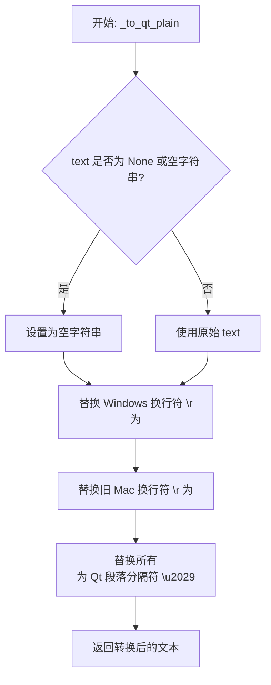

#### 带注释源码

```python
def _to_qt_plain(text: str) -> str:
    """
    将普通文本中的换行符转换为 Qt QTextDocument 使用的段落分隔符（U+2029）。
    
    QTextDocument 的 toPlainText() 方法使用 U+2029 (Paragraph Separator) 作为换行符。
    为了确保插入的纯文本在 Qt 控件中正确显示换行，需要进行此转换。
    
    参数:
        text: 需要转换的原始文本字符串
        
    返回:
        转换后的文本，其中换行符已被替换为 U+2029
    """
    # 先处理空值情况，确保 text 是字符串
    t = (text or "").replace("\r\n", "\n").replace("\r", "\n")
    
    # 将所有 Unix 风格换行符 \n 替换为 Qt 的段落分隔符 U+2029
    # 这是因为 QTextDocument 内部使用 U+2029 表示换行
    return t.replace("\n", "\u2029")
```

#### 设计说明

1. **设计目标**：解决 Qt QTextDocument 在处理纯文本换行符时的兼容性问题，确保文本在 Qt 富文本编辑器中正确显示。

2. **转换逻辑**：
   - 第一步统一换行符格式：将 Windows 的 `\r\n` 和旧 Mac 的 `\r` 统一转换为 Unix 风格的 `\n`
   - 第二步进行 Qt 特定转换：将 `\n` 替换为 Qt 内部使用的 `\u2029`

3. **相关配对函数**：通常与 `_qt_plain_to_user` 函数配合使用，后者将 Qt 的 `\u2029` 转换回用户友好的 `\n` 进行显示。

4. **潜在优化空间**：当前实现简洁高效，但由于是私有函数（单下划线前缀），如需更复杂的文本处理（如保留特定格式），可考虑扩展功能。


### `_qt_plain_to_user`

该函数用于将 Qt 文档内部的纯文本表示转换回用户友好的格式，将 Qt 使用的段落分隔符（U+2029）替换为标准的换行符（\n），主要服务于 QTextDocument 的 toPlainText() 输出与普通文本之间的格式互转。

参数：

- `text`：`str`，需要转换的 Qt 纯文本字符串，可能包含 U+2029 段落分隔符

返回值：`str`，转换后的普通文本字符串，其中所有段落分隔符已被替换为换行符

#### 流程图

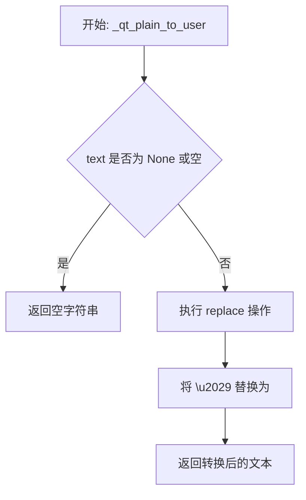

#### 带注释源码

```python
def _qt_plain_to_user(text: str) -> str:
    """
    将 Qt 文档内部格式的纯文本转换为用户友好的文本格式。
    
    QTextDocument 的 toPlainText() 方法会将普通换行符 (\n) 转换为
    U+2029 (段落分隔符)。此函数执行反向转换，将 U+2029 替换回 \n，
    以便用户查看和编辑。
    
    参数:
        text: 输入的 Qt 纯文本字符串，可能包含 U+2029 段落分隔符
        
    返回:
        转换后的普通文本字符串，所有段落分隔符已替换为换行符
    """
    # 使用短路求值：如果 text 为 None 或其他 falsy 值，替换为空字符串
    # 然后执行字符替换：将 Qt 的段落分隔符 \u2029 替换为标准换行符 \n
    return (text or "").replace("\u2029", "\n")
```


### `_apply_replacements_to_html`

该函数是搜索与替换功能的核心辅助方法，主要用于处理包含富文本（HTML 格式）的文本块。它通过构造一个临时的 Qt `QTextDocument` 来执行替换操作，从而能够在保留原有字体、颜色、超链接等格式的前提下，精确地修改文本内容。

参数：

- `existing_html`：`str`，待处理的现有文本内容，可能是纯文本或包含 HTML 标签的富文本。
- `pattern`：`re.Pattern[str]`，编译后的正则表达式对象，用于在文本中定位待替换的匹配项。
- `replacement`：`str`，用于替换匹配项的文本字符串。
- `regex_mode`：`bool`（关键字参数），指示替换时是否将 `replacement` 视为正则表达式模板（如 `$1`, `$&` 等）。
- `preserve_case`：`bool`（关键字参数，默认 False），如果为 True，则替换文本的大小写将模仿原匹配文本的大小写格式（如全大写、全小写、首字母大写等）。
- `nth`：`int | None`（关键字参数），指定仅替换第 n 个（从 0 开始）匹配项。如果为 None，则替换所有匹配项。

返回值：`tuple[str, str, str, int]`

- `old_plain`：替换发生前的纯文本版本（去除了 Qt 内部换行符）。
- `new_plain`：替换发生后的纯文本版本。
- `new_html`：替换发生后重新生成的 HTML 内容（保留了原有的富文本格式）。
- `int`：实际发生替换的匹配项数量。

#### 流程图

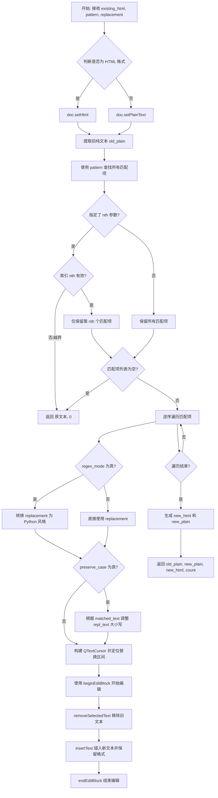

#### 带注释源码

```python
def _apply_replacements_to_html(
    existing_html: str,
    pattern: re.Pattern[str],
    replacement: str,
    *,
    regex_mode: bool,
    preserve_case: bool = False,
    nth: int | None = None,
) -> tuple[str, str, str, int]:
    """
    Apply replacements directly to a QTextDocument created from existing HTML to preserve rich formatting.
    Returns (old_plain, new_plain, new_html, count).
    """
    # 1. 初始化 QTextDocument，用于解析和管理富文本
    doc = QtGui.QTextDocument()
    # 2. 根据文本外观决定是解析为 HTML 还是纯文本
    if _looks_like_html(existing_html):
        doc.setHtml(existing_html)
    else:
        doc.setPlainText(existing_html or "")

    # 3. 获取替换前的纯文本 (将 Qt 内部的段落分隔符转换回换行符)
    old_plain = _qt_plain_to_user(doc.toPlainText())
    
    # 4. 在纯文本上查找所有匹配项
    matches = [m for m in pattern.finditer(old_plain) if m.start() != m.end()]
    
    # 5. 如果指定了 nth (第 n 个匹配)，则只处理那一个
    if nth is not None:
        # 如果索引越界或无效，直接返回原样，替换计数为 0
        if nth < 0 or nth >= len(matches):
            return old_plain, old_plain, doc.toHtml(), 0
        matches = [matches[nth]]

    # 6. 如果没有匹配项，直接返回原文本
    if not matches:
        return old_plain, old_plain, doc.toHtml(), 0

    # 7. 准备替换文本
    # 如果是 regex 模式，需要将 VS Code 风格的 ($1, $&) 转为 Python 风格 (\g<1>, \g<0>)
    py_repl = _vscode_regex_replacement_to_python(replacement) if regex_mode else replacement

    # 8. 逆序遍历匹配项 (从后往前替换，防止前面替换影响后面的索引)
    for m in reversed(matches):
        start, end = m.start(), m.end()
        try:
            # 使用 match 对象的 expand 方法进行正则替换 (如果是 regex 模式)
            repl_text = m.expand(py_repl) if regex_mode else py_repl
        except Exception:
            # 如果 expand 失败 (如反向引用无效)，降级为普通文本替换
            repl_text = py_repl if isinstance(py_repl, str) else ""
        
        # 9. 如果开启了保留大小写选项，根据原匹配文本调整替换文本的大小写
        if preserve_case:
            matched_text = old_plain[start:end]
            repl_text = _apply_preserve_case(matched_text, repl_text)

        # 10. 使用 QTextCursor 进行精确替换
        # 获取起始位置的字符格式，以确保插入的新文本保持原有格式（颜色、字体等）
        fmt_cur = QTextCursor(doc)
        fmt_cur.setPosition(start)
        fmt = fmt_cur.charFormat()

        # 创建游标并选中待替换区域
        cursor = QTextCursor(doc)
        cursor.setPosition(start)
        cursor.setPosition(end, QTextCursor.KeepAnchor)
        
        # 开启编辑块，保证撤销/重做的原子性
        cursor.beginEditBlock()
        cursor.removeSelectedText() # 删除旧文本
        # 插入新文本，并应用之前保存的字符格式
        cursor.insertText(_to_qt_plain(repl_text), fmt)
        cursor.endEditBlock()

    # 11. 生成最终结果
    new_html = doc.toHtml()
    new_plain = _qt_plain_to_user(doc.toPlainText())
    return old_plain, new_plain, new_html, len(matches)
```


### `_rect_area`

该函数是一个模块级别的私有辅助函数，用于计算 Qt 矩形对象的面积。通过确保宽度和高度为非负值，避免计算负数面积。

参数：

- `r`：`QtCore.QRectF`，要计算面积的 Qt 矩形对象

返回值：`float`，返回矩形的面积（始终为非负值）

#### 流程图

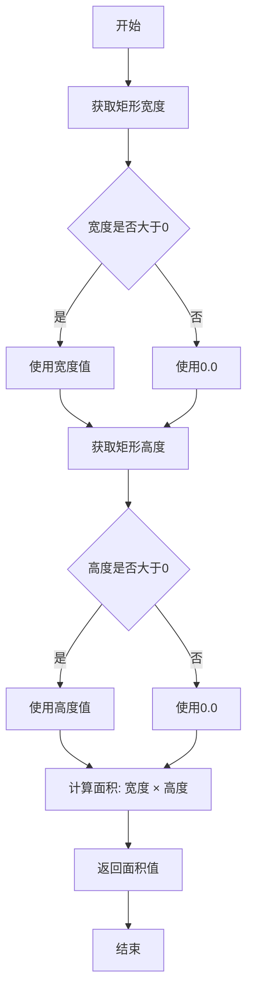

#### 带注释源码

```python
def _rect_area(r: QtCore.QRectF) -> float:
    """
    计算 Qt 矩形对象的面积。
    
    参数:
        r: QtCore.QRectF 类型的矩形对象
    
    返回:
        float: 矩形的面积，确保为非负值
    """
    # 使用 max(0.0, ...) 确保宽度不为负数，避免异常面积
    # float() 将 Qt 的 qreal 类型转换为 Python float
    return max(0.0, float(r.width())) * max(0.0, float(r.height()))
```


### `_apply_text_delta_to_document`

该函数用于高效地更新 `QTextDocument` 的内容。它通过计算旧文本与新文本之间的差异（前缀和后缀），仅对发生变化的中间部分进行删除和插入操作，从而尽可能保留文档中未修改部分的格式。此外，它会尝试获取光标插入点前的字符格式，并将其应用于新插入的文本，以保持文本样式的连续性（例如在已有文本后继续输入）。

参数：

-  `doc`：`QtGui.QTextDocument`，目标 Qt 文本文档对象。
-  `new_text`：`str`，要应用的新文本内容。

返回值：`bool`，如果文档内容发生了更改则返回 `True`；如果新文本与旧文本相同则返回 `False`。

#### 流程图

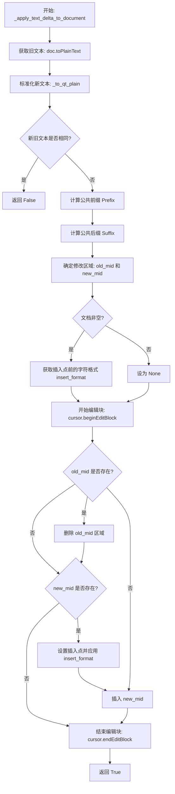

#### 带注释源码

```python
def _apply_text_delta_to_document(doc: QtGui.QTextDocument, new_text: str) -> bool:
    """
    使用增量方式更新 QTextDocument 的文本内容，并尝试保留格式。
    
    算法逻辑：
    1. 比较旧文本与新文本，找出公共前缀和公共后缀。
    2. 只有中间部分发生变化，我们只需要删除旧中间部分并插入新中间部分。
    3. 为了保持文本连续性，新插入的文本会继承插入点前一个字符的格式。
    """
    # 1. 获取文档当前的纯文本内容
    old_text = doc.toPlainText()
    
    # 2. 将新文本转换为 Qt 内部的纯文本格式 (换行符 \n -> \u2029)
    new_text_qt = _to_qt_plain(new_text)
    
    # 3. 如果内容完全一致，则无需修改，直接返回
    if old_text == new_text_qt:
        return False

    # 4. 计算公共前缀 (Common Prefix)
    # 从字符串开头开始逐一对比，直到遇到不同的字符为止
    prefix = 0
    max_prefix = min(len(old_text), len(new_text_qt))
    while prefix < max_prefix and old_text[prefix] == new_text_qt[prefix]:
        prefix += 1

    # 5. 计算公共后缀 (Common Suffix)
    # 从字符串末尾开始逐一对比，找出末尾不变的部分
    suffix = 0
    max_suffix = min(len(old_text) - prefix, len(new_text_qt) - prefix)
    while suffix < max_suffix and old_text[-(suffix + 1)] == new_text_qt[-(suffix + 1)]:
        suffix += 1

    # 6. 确定需要被替换的中间部分
    # old_mid: 旧文本中需要删除的部分
    # new_mid: 新文本中需要插入的部分
    old_mid_end = len(old_text) - suffix
    new_mid_end = len(new_text_qt) - suffix
    old_mid = old_text[prefix:old_mid_end]
    new_mid = new_text_qt[prefix:new_mid_end]

    # 7. 决定插入新文本时使用的字符格式
    # 逻辑：如果插入点在文本中间，则继承该位置的格式；如果在文本末尾，则继承前一个字符的格式
    cursor = QTextCursor(doc)
    insert_format = None
    if old_text:
        if prefix < len(old_text):
            cursor.setPosition(prefix)
            insert_format = cursor.charFormat()
        elif prefix > 0:
            cursor.setPosition(prefix - 1)
            insert_format = cursor.charFormat()

    # 8. 执行原子编辑操作
    cursor.beginEditBlock()
    
    # 删除旧中间部分
    if old_mid:
        cursor.setPosition(prefix)
        cursor.setPosition(prefix + len(old_mid), QTextCursor.KeepAnchor)
        cursor.removeSelectedText()
    
    # 插入新中间部分，并应用继承的格式
    if new_mid:
        cursor.setPosition(prefix)
        if insert_format is not None:
            cursor.setCharFormat(insert_format)
        cursor.insertText(new_mid)
        
    cursor.endEditBlock()
    return True
```


### `replace_nth_match`

该函数用于在文本中替换第 n 个匹配项（从 0 开始索引），支持普通文本替换和正则表达式替换两种模式，并返回替换后的新文本及是否成功替换的标志。

参数：

- `text`：`str`，原始文本字符串
- `pattern`：`re.Pattern[str]`，已编译的正则表达式模式对象
- `replacement`：`str`，用于替换匹配项的文本
- `n`：`int`，要替换的匹配项的索引（从 0 开始）
- `regex_mode`：`bool`，是否启用正则表达式替换模式

返回值：`tuple[str, bool]`，返回元组 (new_text, replaced)，其中 new_text 是替换后的文本，replaced 表示是否成功进行了替换

#### 流程图

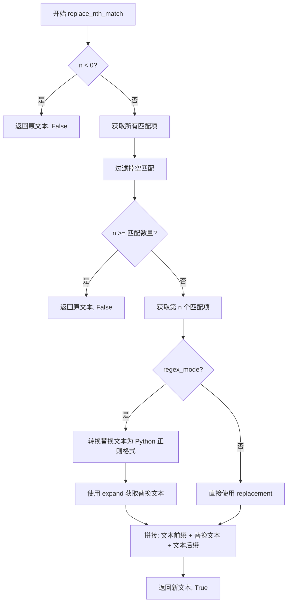

#### 带注释源码

```python
def replace_nth_match(
    text: str,
    pattern: re.Pattern[str],
    replacement: str,
    n: int,
    regex_mode: bool,
) -> tuple[str, bool]:
    """
    Replace only the nth match in `text` (0-based). Returns (new_text, replaced?).
    """
    # 如果索引为负数，直接返回原文本和 False（未替换）
    if n < 0:
        return text, False
    
    # 使用 finditer 查找所有匹配项，并处理空文本情况
    matches = list(pattern.finditer(text or ""))
    # 过滤掉 start == end 的空匹配项
    matches = [m for m in matches if m.start() != m.end()]
    
    # 如果索引超出匹配范围，返回原文本和 False
    if n >= len(matches):
        return text, False
    
    # 获取第 n 个匹配项
    m = matches[n]
    
    # 根据模式决定替换文本的获取方式
    if regex_mode:
        # 将 VS Code 风格的正则替换转换为 Python 风格
        py_repl = _vscode_regex_replacement_to_python(replacement)
        # 使用 expand 方法处理反向引用等
        repl_text = m.expand(py_repl)
    else:
        # 普通模式直接使用 replacement
        repl_text = replacement
    
    # 拼接：文本前缀 + 替换文本 + 文本后缀
    return (text[: m.start()] + repl_text + text[m.end() :], True)
```


### `replace_all_matches`

该函数在给定文本中执行全局替换操作，支持正则表达式模式和大小写保留功能，返回替换后的新文本和替换次数。

参数：

- `text`：`str`，要进行替换的原始文本
- `pattern`：`re.Pattern[str]`，编译后的正则表达式模式对象
- `replacement`：`str`，用于替换匹配项的文本
- `regex_mode`：`bool`，指示是否为正则表达式模式；若为 `True` 则将 replacement 转换为 Python 正则替换格式
- `preserve_case`：`bool`，是否保留匹配文本的大小写格式；默认为 `False`

返回值：`tuple[str, int]`，返回替换后的新文本和实际发生的替换次数

#### 流程图

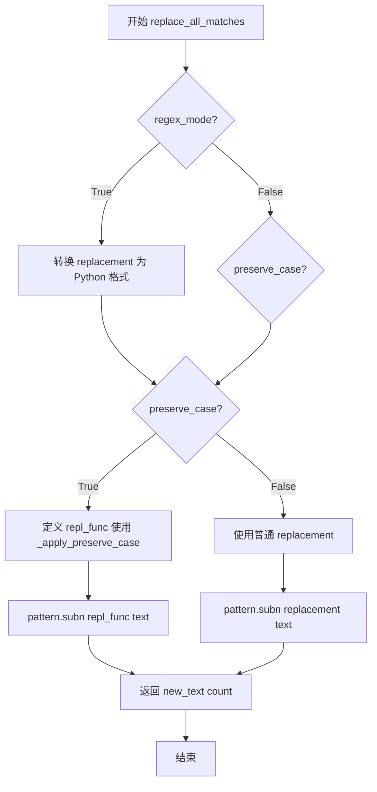

#### 带注释源码

```python
def replace_all_matches(
    text: str,
    pattern: re.Pattern[str],
    replacement: str,
    regex_mode: bool,
    preserve_case: bool = False,
) -> tuple[str, int]:
    """
    在给定文本中替换所有匹配项。
    
    参数:
        text: 要搜索和替换的文本
        pattern: re.compile 编译后的正则表达式模式
        replacement: 替换文本
        regex_mode: 是否使用正则表达式匹配模式
        preserve_case: 是否保留匹配文本的大小写格式
    
    返回:
        (替换后的文本, 替换次数)
    """
    # 如果使用正则表达式模式，先将 VS Code 风格的替换符转换为 Python 格式
    if regex_mode:
        py_repl = _vscode_regex_replacement_to_python(replacement)
        
        # 如果需要保留大小写，定义自定义替换函数
        if preserve_case:
            def repl_func(m):
                # 先展开正则替换中的反向引用
                expanded = m.expand(py_repl)
                # 再将匹配文本的大小写模式应用到替换文本
                return _apply_preserve_case(m.group(0), expanded)
            # subn 返回替换后的文本和替换次数
            new_text, count = pattern.subn(repl_func, text or "")
        else:
            # 直接使用转换后的替换文本
            new_text, count = pattern.subn(py_repl, text or "")
        return new_text, count
    
    # 非正则模式处理
    if preserve_case:
        def repl_func(m):
            # 对每个匹配应用大小写保留转换
            return _apply_preserve_case(m.group(0), replacement)
        new_text, count = pattern.subn(repl_func, text or "")
    else:
        # 最简单的情况：所有匹配都替换为同一个字符串
        new_text, count = pattern.subn(lambda _m: replacement, text or "")
    return new_text, count
```


### `SearchReplaceController.__init__`

该方法是 `SearchReplaceController` 类的构造函数，负责初始化搜索替换功能的核心控制器。它主要完成三项工作：初始化内部状态变量、建立与主程序 UI 面板（`search_panel`）的信号连接、以及注册必要的键盘快捷键。如果主界面中不存在搜索面板，该控制器将无法生效。

参数：

-  `self`：隐式参数，表示类的实例本身。
-  `main`：`ComicTranslate`，主应用程序控制器实例，用于访问应用程序的状态、UI 组件（如搜索面板）和图像数据。

返回值：`None`，该方法为初始化方法，不返回任何值。

#### 流程图

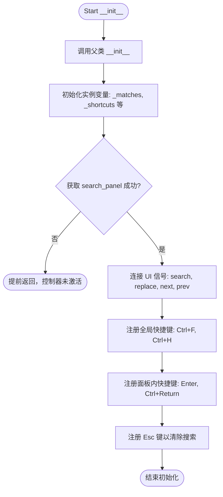

#### 带注释源码

```python
def __init__(self, main: ComicTranslate):
    # 调用父类 QtCore.QObject 的构造函数，将 self 注册到 parent (main) 对象树中
    super().__init__(main)
    
    # 1. 初始化内部状态
    self.main = main  # 缓存主控制器引用
    self._matches: list[SearchMatch] = []  # 存储当前搜索结果
    self._active_match_index: int = -1  # 当前高亮匹配的索引
    self._shortcuts: list[QtGui.QShortcut] = []  # 管理生命周期中的快捷键对象
    self._jump_nonce: int = 0  # 用于防止竞态条件的跳转随机数

    # 2. 获取搜索面板
    # 使用 getattr 安全获取，如果主界面尚未加载搜索面板，则该控制器无法工作
    panel = getattr(self.main, "search_panel", None)
    if panel is None:
        return

    # 3. 建立信号与槽的连接 (UI -> Controller)
    # 将面板上的用户操作（搜索、替换、翻页）连接到具体的处理方法
    panel.search_requested.connect(self.search)
    panel.next_requested.connect(self.next_match)
    panel.prev_requested.connect(self.prev_match)
    panel.replace_requested.connect(self.replace_current)
    panel.replace_all_requested.connect(self.replace_all)
    panel.result_activated.connect(self._on_result_activated)

    # 4. 注册全局快捷键 (Main Window 级别)
    # Ctrl+F: 聚焦搜索输入框
    QtGui.QShortcut(QtGui.QKeySequence.Find, self.main, activated=self.focus_find)
    # Ctrl+H: 聚焦替换输入框
    QtGui.QShortcut(QtGui.QKeySequence.Replace, self.main, activated=self.focus_replace)

    # 5. 注册面板内部快捷键
    # 回车键：在搜索框输入后直接跳转到下一个匹配项
    panel.find_input.returnPressed.connect(self.next_match)
    # Ctrl+回车：跳转到上一个匹配项
    self._shortcuts.append(
        QtGui.QShortcut(QtGui.QKeySequence("Ctrl+Return"), panel, activated=self.prev_match)
    )

    # 6. 注册清除快捷键 (Esc)
    # 仅在搜索面板或其子控件获得焦点时生效
    clear_sc = QtGui.QShortcut(QtGui.QKeySequence(QtCore.Qt.Key.Key_Escape), panel, activated=panel._clear_find)
    clear_sc.setContext(QtCore.Qt.ShortcutContext.WidgetWithChildrenShortcut)
    self._shortcuts.append(clear_sc)
```


### `SearchReplaceController.focus_find`

该方法负责将用户界面切换到搜索模式并聚焦于搜索输入框。它首先检测主应用程序是否支持侧边栏搜索模式（如 Webtoon 模式下的侧边栏），如果支持则打开侧边栏；否则直接聚焦于内置搜索面板中的查找输入框并选中其内容。

参数：

- `self`：`SearchReplaceController`，调用此方法的控制器实例本身，包含主应用引用（`self.main`）和面板引用。

返回值：`None`，该方法仅执行界面操作，不返回任何数据。

#### 流程图

```mermaid
flowchart TD
    A([开始 focus_find]) --> B{主应用是否支持 show_search_sidebar?}
    B -- 是 --> C[调用 main.show_search_sidebar<br/>参数: focus="find"]
    C --> D([结束])
    B -- 否 --> E[获取搜索面板 panel]
    E --> F[聚焦输入框 panel.find_input.setFocus()]
    F --> G[全选文本 panel.find_input.selectAll()]
    G --> D
```

#### 带注释源码

```python
def focus_find(self):
    """
    将焦点设置到搜索输入框。
    如果主窗口支持侧边栏搜索模式，则打开侧边栏；否则聚焦于面板内的输入框。
    """
    # 检查 main 对象是否有 show_search_sidebar 方法（通常用于侧边栏 UI）
    if hasattr(self.main, "show_search_sidebar"):
        # 调用该方法并指定聚焦于 'find' (查找) 输入区域
        self.main.show_search_sidebar(focus="find")
        return

    # 如果没有侧边栏模式，则获取标准的搜索面板对象
    panel = self.main.search_panel

    # 将键盘焦点移动到搜索输入框
    panel.find_input.setFocus()

    # 选中输入框中的所有现有文本，方便用户直接输入新的搜索词
    panel.find_input.selectAll()
```


### `SearchReplaceController.focus_replace`

该方法用于将焦点设置到搜索面板的替换输入框中，支持两种模式：如果主窗口存在侧边栏显示方法，则调用该方法并将焦点置于替换输入；否则直接聚焦并全选替换输入框中的文本。

参数： 无

返回值：`None`，无返回值

#### 流程图

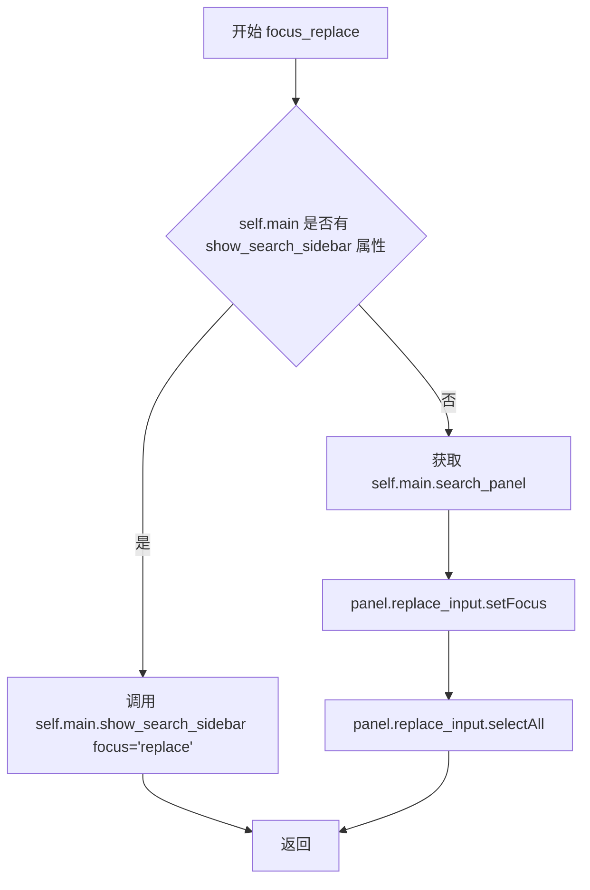

#### 带注释源码

```python
def focus_replace(self):
    """
    将焦点设置到搜索面板的替换输入框。
    如果主窗口支持侧边栏模式，则显示侧边栏并聚焦替换输入；
    否则直接聚焦并全选替换输入框中的文本。
    """
    # 检查主窗口是否实现了 show_search_sidebar 方法（侧边栏模式）
    if hasattr(self.main, "show_search_sidebar"):
        # 侧边栏模式：调用方法显示侧边栏并聚焦替换输入
        self.main.show_search_sidebar(focus="replace")
        return
    
    # 非侧边栏模式：直接操作搜索面板的替换输入框
    panel = self.main.search_panel
    # 将键盘焦点设置到替换输入框
    panel.replace_input.setFocus()
    # 选中替换输入框中的所有文本，便于用户直接输入替换内容
    panel.replace_input.selectAll()
```


### `SearchReplaceController._capture_focus_state`

该方法用于捕获当前焦点所在控件的状态信息（光标位置、选中文本等），以便在执行搜索跳转等操作后能够恢复焦点状态。

参数：
- 该方法无参数（仅包含隐式参数 `self`）

返回值：`dict | None`，返回包含焦点控件状态信息的字典，如果无法获取则返回 `None`

#### 流程图

```mermaid
flowchart TD
    A[开始] --> B[获取焦点控件: w = self.main.focusWidget]
    B --> C{异常或 w is None?}
    C -->|是| D[返回 None]
    C -->|否| E{检查控件是否为 QLineEdit-like}
    E -->|否| D
    E -->|是| F{尝试获取选择信息}
    F --> G{sel_start >= 0?}
    G -->|否| H[sel_len = 0]
    G -->|是| I[sel_len = len(selectedText)]
    H --> J[返回包含 widget, cursor_pos, sel_start, sel_len 的字典]
    I --> J
    F -->|异常| K[返回仅包含 widget 的字典]
    J --> L[结束]
    K --> L
    D --> L
```

#### 带注释源码

```
def _capture_focus_state(self):
    """
    捕获当前焦点控件的状态信息，用于后续恢复焦点状态。
    
    该方法主要用于搜索/替换功能中，当执行跳转操作时，
    需要先保存当前输入框的光标位置和选中文本信息，
    跳转完成后再恢复这些状态，以提供更好的用户体验。
    """
    # 尝试获取当前焦点所在的控件
    try:
        w = self.main.focusWidget()
    except Exception:
        return None
    
    # 如果没有焦点控件，返回 None
    if w is None:
        return None
    
    # 仅保存 QLineEdit-like 控件的状态（MLineEdit 是 QLineEdit 的子类）
    # 需要具有 cursorPosition、selectionStart、selectedText 方法
    if hasattr(w, "cursorPosition") and hasattr(w, "selectionStart") and hasattr(w, "selectedText"):
        try:
            # 获取选区起始位置
            sel_start = int(w.selectionStart())
            # 计算选区长度（如果起始位置有效）
            sel_len = len(w.selectedText() or "") if sel_start >= 0 else 0
            # 返回包含完整焦点状态信息的字典
            return {
                "widget": w,              # 焦点控件引用
                "cursor_pos": int(w.cursorPosition()),  # 光标位置
                "sel_start": sel_start,   # 选区起始位置
                "sel_len": sel_len,       # 选区长度
            }
        except Exception:
            # 如果获取选区信息失败，至少返回控件引用
            return {"widget": w}
    
    # 如果不是 QLineEdit-like 控件，返回 None
    return None
```


### `SearchReplaceController._restore_focus_state`

该方法用于恢复之前捕获的焦点状态，包括恢复输入框的焦点、选中文本或光标位置。由于焦点恢复可能与选择/跳转逻辑冲突，方法使用延迟执行（`QTimer.singleShot(0, ...)`）来确保在当前事件循环结束后再应用焦点状态，从而赢得焦点竞争。

参数：

- `state`：`dict`，从 `_capture_focus_state()` 获取的焦点状态字典，包含 widget（控件对象）、cursor_pos（光标位置）、sel_start（选区起始位置）、sel_len（选区长度）等信息。如果为 `None` 或空字典则直接返回。

返回值：`None`，无返回值，仅执行焦点恢复操作。

#### 流程图

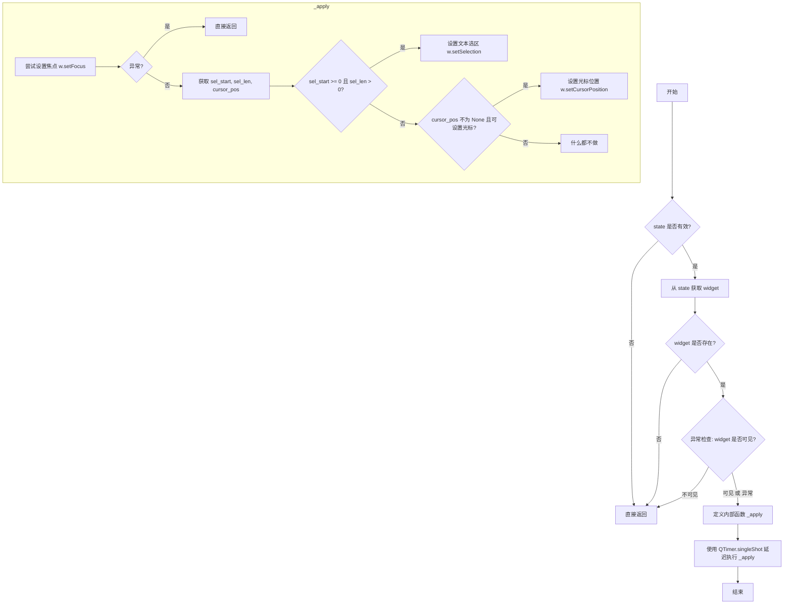

#### 带注释源码

```python
def _restore_focus_state(self, state):
    """
    Restore focus state captured by _capture_focus_state.
    Uses deferred execution to win focus race against selection/jump logic.
    """
    # Step 1: Validate input state - return early if None or empty
    if not state:
        return
    
    # Step 2: Extract widget from state dictionary
    w = state.get("widget")
    if w is None:
        return
    
    # Step 3: Check widget visibility, skip if not visible
    # Wrap in try-except to handle potential runtime errors
    try:
        if not w.isVisible():
            return
    except Exception:
        pass

    # Define inner function to apply focus state
    def _apply():
        """Inner function that performs actual focus restoration."""
        try:
            # Attempt to set focus to the widget
            w.setFocus()
        except Exception:
            # Exit early if focusing fails (e.g., widget disabled)
            return
        
        try:
            # Extract cursor/selection state from captured data
            sel_start = state.get("sel_start", -1)
            sel_len = state.get("sel_len", 0)
            cursor_pos = state.get("cursor_pos", None)
            
            # Priority 1: Restore text selection if exists
            if sel_start is not None and sel_start >= 0 and sel_len:
                w.setSelection(sel_start, sel_len)
            # Priority 2: Restore cursor position if no selection
            elif cursor_pos is not None and hasattr(w, "setCursorPosition"):
                w.setCursorPosition(int(cursor_pos))
        except Exception:
            # Silently ignore errors during restoration
            pass

    # Defer execution to ensure we win against any focus changes
    # from selection/jump logic that may happen in current event loop
    QtCore.QTimer.singleShot(0, _apply)
```


### `SearchReplaceController._gather_options`

该方法负责从搜索面板的 UI 控件中收集用户设置的搜索和替换选项，并将其封装为 `SearchOptions` 数据类对象供后续搜索和替换操作使用。

参数：
- `self`：`SearchReplaceController`，隐式参数，表示当前控制器实例

返回值：`SearchOptions`，包含所有搜索和替换选项的数据类对象

#### 流程图

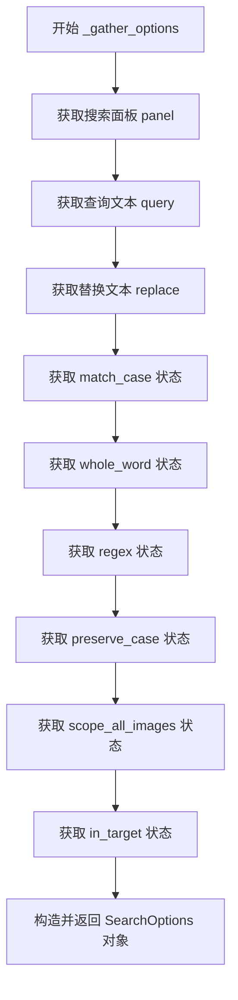

#### 带注释源码

```python
def _gather_options(self) -> SearchOptions:
    """
    从搜索面板UI控件中收集搜索和替换选项，构建SearchOptions对象。
    
    该方法读取以下UI元素：
    - find_input: 搜索查询文本
    - replace_input: 替换文本
    - match_case_btn: 区分大小写复选框
    - whole_word_btn: 全词匹配复选框
    - regex_btn: 正则表达式复选框
    - preserve_case_btn: 保留大小写复选框
    - scope_combo: 搜索范围组合框（当前图片/所有图片）
    - field_combo: 搜索字段组合框（源文本/目标文本）
    """
    # 获取主窗口中的搜索面板组件
    panel = self.main.search_panel
    
    # 从面板各控件中提取用户设置的搜索选项
    return SearchOptions(
        query=panel.find_input.text(),                          # 搜索查询字符串
        replace=panel.replace_input.text(),                      # 替换为的字符串
        match_case=panel.match_case_btn.isChecked(),              # 是否区分大小写
        whole_word=panel.whole_word_btn.isChecked(),              # 是否全词匹配
        regex=panel.regex_btn.isChecked(),                        # 是否使用正则表达式
        preserve_case=panel.preserve_case_btn.isChecked(),        # 是否保留原大小写格式
        scope_all_images=(panel.scope_combo.currentData() == "all"),  # 搜索范围：所有图片还是当前图片
        in_target=(panel.field_combo.currentData() == "target"),     # 搜索目标：源文本还是翻译文本
    )
```


### `SearchReplaceController._format_pattern_error`

该方法负责将搜索或替换过程中捕获的异常转换为用户界面可展示的本地化字符串。它专门针对“空查询”这一常见 ValidationError 进行了国际化处理，其余情况则直接返回异常的标准错误信息。

参数：

-  `err`：`Exception`，需要格式化的异常对象。

返回值：`str`，返回处理后的错误消息字符串。

#### 流程图

```mermaid
flowchart TD
    A([Start _format_pattern_error]) --> B{err is not None?}
    B -- Yes --> C[msg = str(err)]
    B -- No --> D[msg = ""]
    C --> E{isinstance(err, ValueError) AND msg == 'Empty query'}
    D --> E
    E -- Yes --> F[Return QtCore.QCoreApplication.translate("SearchReplaceController", "Empty query")]
    E -- No --> G[Return msg]
    F --> H([End])
    G --> H
```

#### 带注释源码

```python
def _format_pattern_error(self, err: Exception) -> str:
    """
    Map common validation errors to localized strings.
    
    用于将异常转换为友好的提示信息，特别是对空查询进行本地化处理。
    """
    # 安全获取异常的消息字符串，如果异常对象为 None，则设为空字符串
    msg = str(err) if err is not None else ""
    
    # 判断是否为特定的 "Empty query" ValueError
    if isinstance(err, ValueError) and msg == "Empty query":
        # 如果是，则返回本地化（翻译）后的 "Empty query"
        return QtCore.QCoreApplication.translate("SearchReplaceController", "Empty query")
    
    # 其它情况直接返回原始异常消息
    return msg
```


### `SearchReplaceController.on_undo_redo`

在撤销/重做操作后刷新搜索结果，但不进行跳转或获取焦点，保持用户当前的编辑状态。

参数：

- `self`：`SearchReplaceController`，方法的隐式参数，代表当前控制器实例
- `*_args`：`Any`（可变参数），用于接收undo/redo事件传递的额外参数（通常不需要使用）

返回值：`None`，该方法没有返回值

#### 流程图

```mermaid
flowchart TD
    A[开始 on_undo_redo] --> B{获取 search_panel}
    B --> C{panel 是否为 None?}
    C -->|是| D[直接返回]
    C -->|否| E{检查搜索输入框文本}
    E --> F{文本是否为空?}
    F -->|是| D
    F -->|否| G[调用 self.search<br/>jump_to_first=False]
    G --> H[结束]
    
    style D fill:#ffcccc
    style H fill:#ccffcc
```

#### 带注释源码

```
def on_undo_redo(self, *_args):
    """Refresh search results after undo/redo without jumping/focusing."""
    # 1. 获取搜索面板，如果不存在则直接返回
    #    使用getattr安全获取，避免属性不存在导致的异常
    panel = getattr(self.main, "search_panel", None)
    if panel is None:
        return
    
    # 2. 检查搜索输入框是否有文本内容
    #    如果没有搜索关键词，则无需刷新搜索结果
    if not (panel.find_input.text() or "").strip():
        return
    
    # 3. 刷新搜索结果
    #    jump_to_first=False 表示刷新后不自动跳转到第一个匹配项
    #    这样可以保持用户当前的焦点位置和编辑状态
    self.search(jump_to_first=False)
```


### `SearchReplaceController._iter_blocks`

这是一个内部生成器方法，用于根据 `SearchOptions` 中定义的搜索范围（当前图片、Webtoon 模式下的可见页面或所有图片）迭代文本块。它充当了一个抽象层，统一了不同查看模式下的块遍历逻辑，并负责在需要时保存当前编辑状态。

参数：

-  `opts`：`SearchOptions`，搜索选项数据类，包含查询内容、替换内容及搜索范围（如 `scope_all_images`）等配置。

返回值：`Iterator[tuple[str, list, int, object]]`，一个迭代器，产生元组 `(file_path, blk_list, index, blk)`。
- `file_path` (str): 图片文件路径。
- `blk_list` (list): 该文件对应的块列表。
- `index` (int): 块在列表中的索引。
- `blk` (object): 具体的文本块对象（通常包含 `text`, `translation`, `xyxy` 等属性）。

#### 流程图

```mermaid
flowchart TD
    A[Start _iter_blocks] --> B{image_files 是否为空?}
    B -- 是 --> C[Return (结束)]
    B -- 否 --> D{scope_all_images (搜索所有图片)?}
    
    D -- 是 --> E[如果不是 Webtoon 模式, 保存当前图片状态]
    E --> F[遍历 image_files]
    F --> G[获取文件对应的 image_state]
    G --> H[获取 blk_list]
    H --> I{Yield (file_path, blk_list, idx, blk)}
    I --> F
    
    D -- 否 (仅当前图片) --> J{是否是 Webtoon 模式?}
    
    J -- 是 --> K[获取 layout_manager 和 viewport]
    K --> L[计算可见页面 get_pages_for_scene_bounds]
    L --> M{是否获取到可见页面?}
    M -- 否 --> N[回退到 curr_img_idx]
    M -- 是 --> O[遍历可见页面索引]
    O --> P[获取页面 state 和 blk_list]
    P --> Q{Yield (file_path, blk_list, idx, blk)}
    Q --> O
    
    J -- 否 (普通模式) --> R{curr_img_idx 是否有效?}
    R -- 否 --> S[Return]
    R -- 是 --> T[获取当前图片 blk_list]
    T --> U{Yield (file_path, blk_list, idx, blk)}
    U --> T
```

#### 带注释源码

```python
def _iter_blocks(self, opts: SearchOptions) -> Iterator[tuple[str, list, int, object]]:
    """
    Yields (file_path, blk_list, index, blk) for the requested scope.
    """
    # 1. 边界检查：如果没有图片文件，直接返回
    if not self.main.image_files:
        return

    # 2. 搜索范围：当前图片 (非全部)
    if not opts.scope_all_images:
        # --- 处理 Webtoon 模式 ---
        if getattr(self.main, "webtoon_mode", False):
            viewer = getattr(self.main, "image_viewer", None)
            webtoon_manager = getattr(viewer, "webtoon_manager", None) if viewer is not None else None
            layout_manager = getattr(webtoon_manager, "layout_manager", None) if webtoon_manager is not None else None
            
            if layout_manager is not None:
                try:
                    visible_pages = set()
                    # 尝试通过视口矩形获取当前可见页面
                    if (
                        viewer is not None
                        and hasattr(layout_manager, "get_pages_for_scene_bounds")
                        and hasattr(viewer, "viewport")
                        and viewer.viewport() is not None
                    ):
                        viewport_rect = viewer.mapToScene(viewer.viewport().rect()).boundingRect()
                        visible_pages |= set(layout_manager.get_pages_for_scene_bounds(viewport_rect) or set())
                    elif hasattr(layout_manager, "get_visible_pages"):
                        # 备用方案：获取可见页面列表
                        visible_pages |= set(layout_manager.get_visible_pages() or set())
                except Exception:
                    visible_pages = set()

                # 如果无法确定可见范围，回退到当前页
                if not visible_pages and self.main.curr_img_idx >= 0:
                    visible_pages = {self.main.curr_img_idx}

                # 遍历所有可见页面
                for page_idx in sorted(visible_pages):
                    if not (0 <= page_idx < len(self.main.image_files)):
                        continue
                    file_path = self.main.image_files[page_idx]
                    # 从持久化状态中获取块列表
                    state = self.main.image_states.get(file_path) or {}
                    blks = state.get("blk_list") or []
                    for idx, blk in enumerate(blks):
                        yield file_path, blks, idx, blk
                return

        # --- 处理普通单图模式 ---
        if self.main.curr_img_idx < 0:
            return
        file_path = self.main.image_files[self.main.curr_img_idx]
        # 使用内存中的当前块列表
        for idx, blk in enumerate(self.main.blk_list or []):
            yield file_path, self.main.blk_list, idx, blk
        return

    # 3. 搜索范围：所有图片 (scope_all_images)
    # 确保当前图片的编辑已保存到 image_states 中 (非 Webtoon 模式)
    if not getattr(self.main, "webtoon_mode", False):
        try:
            self.main.image_ctrl.save_current_image_state()
        except Exception:
            pass

    # 遍历所有图片文件
    for file_path in self.main.image_files:
        state = self.main.image_states.get(file_path) or {}
        blks = state.get("blk_list") or []
        for idx, blk in enumerate(blks):
            yield file_path, blks, idx, blk
```


### `SearchReplaceController.search`

执行搜索操作，根据用户配置的搜索选项（查询字符串、匹配模式、作用域等）在项目的文本块中查找匹配项，更新内部匹配列表，并在界面上显示搜索结果。

参数：

- `jump_to_first`：`bool`，默认为 `True`，是否在搜索完成后自动跳转到第一个匹配项

返回值：`None`，无返回值（该方法通过修改对象状态和UI组件来返回结果）

#### 流程图

```mermaid
flowchart TD
    A[开始 search 方法] --> B[获取搜索面板和搜索选项]
    B --> C[捕获当前焦点状态]
    C --> D{尝试编译搜索模式}
    D -->|成功| E[初始化匹配列表和命中图像集合]
    D -->|失败| F[显示错误状态并清空结果]
    F --> Z[结束]
    E --> G[遍历文本块迭代器]
    G --> H{当前块有匹配?}
    H -->|是| I[添加匹配到结果列表]
    H -->|否| J[继续下一块]
    I --> K{继续遍历?}
    J --> K
    K -->|是| G
    K -->|否| L[更新匹配列表和活动索引]
    L --> M{有匹配项?}
    M -->|是| N[尝试保持之前的匹配位置]
    M -->|否| O[设置状态为无结果]
    N --> P[更新面板结果]
    P --> Q{需要跳转?}
    Q -->|是| R[判断是否应聚焦编辑器]
    Q -->|否| S[选中当前匹配项]
    R --> T[跳转并聚焦/保持焦点状态]
    O --> Z
    S --> Z
    T --> Z
```

#### 带注释源码

```python
def search(self, jump_to_first: bool = True):
    """
    执行搜索操作。
    
    参数:
        jump_to_first: 布尔值，指示是否在搜索完成后自动跳转到第一个匹配项。
                      默认为 True。当为 False 时，仅执行搜索但不跳转，
                      用于刷新搜索结果（如撤销/重做后）。
    
    返回值:
        无。该方法通过修改内部状态（self._matches, self._active_match_index）
        和更新UI面板来返回结果。
    """
    # 1. 获取搜索面板引用和用户配置的搜索选项
    panel = self.main.search_panel
    opts = self._gather_options()
    
    # 2. 捕获当前焦点状态，以便搜索后恢复
    focus_state = self._capture_focus_state()
    
    # 3. 获取之前的活动匹配项（用于保持位置）
    prev_match = None
    if 0 <= self._active_match_index < len(self._matches):
        prev_match = self._matches[self._active_match_index]
    
    # 4. 尝试编译搜索模式（正则表达式编译）
    try:
        pattern = compile_search_pattern(opts)
    except Exception as e:
        # 编译失败时显示错误状态并清空结果
        panel.set_status(QtCore.QCoreApplication.translate('SearchReplaceController', 'Search Error') + ": " + self._format_pattern_error(e))
        panel.set_results([], 0, 0)
        self._matches = []
        self._active_match_index = -1
        return

    # 5. 初始化匹配结果收集器
    matches: list[SearchMatch] = []
    images_with_hits: set[str] = set()

    # 6. 遍历所有文本块查找匹配项
    for file_path, _blk_list, idx, blk in self._iter_blocks(opts) or []:
        # 根据选项决定搜索目标文本（翻译或原文）
        text = blk.translation if opts.in_target else blk.text
        # 在文本中查找所有匹配位置
        spans = find_matches_in_text(text, pattern)
        if not spans:
            continue
        
        # 记录包含匹配项的图像文件
        images_with_hits.add(file_path)
        
        # 为每个匹配位置创建SearchMatch对象
        for ordinal, (start, end) in enumerate(spans):
            key = BlockKey(
                file_path=file_path,
                xyxy=(int(blk.xyxy[0]), int(blk.xyxy[1]), int(blk.xyxy[2]), int(blk.xyxy[3])),
                angle=float(getattr(blk, "angle", 0.0) or 0.0),
            )
            matches.append(
                SearchMatch(
                    key=key,
                    block_index_hint=idx,
                    match_ordinal_in_block=ordinal,
                    start=start,
                    end=end,
                    preview=_make_preview(text, start, end),
                )
            )

    # 7. 更新内部匹配列表
    self._matches = matches
    
    # 8. 确定活动匹配索引（优先保持之前的位置）
    if matches:
        if prev_match is not None:
            try:
                self._active_match_index = next(
                    i
                    for i, mm in enumerate(matches)
                    if mm.key == prev_match.key
                    and mm.match_ordinal_in_block == prev_match.match_ordinal_in_block
                    and mm.start == prev_match.start
                    and mm.end == prev_match.end
                )
            except StopIteration:
                self._active_match_index = 0
        else:
            self._active_match_index = 0
    else:
        self._active_match_index = -1

    # 9. 更新UI面板显示搜索结果
    panel.set_results(matches, len(images_with_hits), len(matches))
    
    # 10. 根据是否有匹配项执行后续操作
    if matches:
        panel.set_status(QtCore.QCoreApplication.translate("SearchReplaceController", "Ready"))
        if jump_to_first:
            # 判断是否应该聚焦编辑器（避免抢夺查找输入框的焦点）
            focus_editor = not (panel.find_input.hasFocus() or panel.replace_input.hasFocus())
            self._jump_to_match(
                self._active_match_index if self._active_match_index >= 0 else 0,
                focus=focus_editor,
                preserve_focus_state=focus_state if not focus_editor else None,
            )
        else:
            # 仅选中当前匹配项，不跳转
            if self._active_match_index >= 0:
                panel.select_match(matches[self._active_match_index])
    else:
        panel.set_status(QtCore.QCoreApplication.translate("SearchReplaceController", "No results"))
```


### `SearchReplaceController.next_match`

该方法负责将当前选中的匹配项移动到列表中的下一个匹配项。如果当前处于最后一个匹配项，则循环回到第一个匹配项。同时，该方法会捕获当前的焦点状态，并根据焦点位置决定是否需要将焦点移动到编辑器或保留在搜索面板中。

参数： 无显式参数（仅包含 `self`）

返回值：`None`，无返回值（隐式返回 `None`）

#### 流程图

```mermaid
flowchart TD
    A[开始 next_match] --> B{self._matches 是否为空?}
    B -->|是| C[直接返回]
    B -->|否| D[计算新的活动匹配索引<br/>self._active_match_index = (self._active_match_index + 1) % len(self._matches)]
    D --> E[获取 search_panel 引用]
    E --> F[调用 _capture_focus_state 捕获当前焦点状态]
    F --> G{判断搜索输入框或替换输入框是否拥有焦点}
    G -->|是| H[focus_editor = False]
    G -->|否| I[focus_editor = True]
    H --> J[调用 _jump_to_match 方法跳转至匹配项]
    I --> J
    J --> K[结束]
    
    style A fill:#e1f5fe
    style K fill:#e1f5fe
    style C fill:#ffcdd2
    style J fill:#c8e6c9
```

#### 带注释源码

```python
def next_match(self):
    """
    将当前活动匹配项移动到下一个匹配项。
    如果当前是最后一个匹配项，则循环回到第一个匹配项。
    同时处理焦点状态，确保用户界面交互的自然性。
    """
    # 检查是否有可用的匹配项列表
    if not self._matches:
        return
    
    # 计算下一个匹配项的索引，使用取模运算实现循环
    # 例如：当索引为最后一个时，(最后+1) % 总数 = 0，实现循环回到第一个
    self._active_match_index = (self._active_match_index + 1) % len(self._matches)
    
    # 获取搜索面板引用，用于后续UI操作
    panel = self.main.search_panel
    
    # 捕获当前焦点状态，以便后续恢复
    # 这对于用户在搜索过程中不希望丢失焦点位置很重要
    focus_state = self._capture_focus_state()
    
    # 判断是否需要将焦点移动到编辑器
    # 如果搜索输入框或替换输入框当前拥有焦点，则不移动焦点到编辑器
    focus_editor = not (panel.find_input.hasFocus() or panel.replace_input.hasFocus())
    
    # 执行跳转到匹配项的操作
    # 参数说明：
    # - self._active_match_index: 目标匹配项的索引
    # - focus: 是否需要聚焦编辑器
    # - preserve_focus_state: 如果不聚焦编辑器，则保留之前捕获的焦点状态
    self._jump_to_match(
        self._active_match_index, 
        focus=focus_editor, 
        preserve_focus_state=focus_state if not focus_editor else None
    )
```


### `SearchReplaceController.prev_match`

**描述**：处理用户请求跳转到上一个搜索匹配项。该方法负责维护匹配项索引的循环逻辑（在列表首尾之间循环），并在跳转前捕获当前焦点状态，以决定跳转后是否需要归还焦点给文本编辑器，从而提升用户体验。

参数：
- `self`：`SearchReplaceController`，隐式参数，指向当前控制器的实例。

返回值：`None` (`None`)，该方法不返回任何数据，仅通过修改对象状态和调用 `_jump_to_match` 执行跳转操作。

#### 流程图

```mermaid
flowchart TD
    A([开始]) --> B{self._matches 是否为空?}
    B -- 是 --> C[直接返回, 不做任何操作]
    B -- 否 --> D[计算新索引: (self._active_match_index - 1) % len(self._matches)]
    D --> E[获取 self.main.search_panel]
    E --> F[调用 self._capture_focus_state 记录当前焦点组件状态]
    F --> G{panel.find_input 或 replace_input 当前是否拥有焦点?}
    G -- 是 --> H[设置 focus_editor = False, 保持输入框焦点]
    G -- 否 --> I[设置 focus_editor = True, 准备跳转焦点到编辑器]
    H --> J[调用 self._jump_to_match]
    I --> J
    J --> K([结束])
```

#### 带注释源码

```python
def prev_match(self):
    """
    跳转到上一个搜索匹配项。
    实现了循环导航：如果当前是第一个匹配项，则跳转到列表末尾。
    """
    # 1. 检查是否存在有效的搜索结果列表
    if not self._matches:
        return

    # 2. 更新当前活动匹配项的索引。
    # 使用模运算 (%) 实现从第一个跳转到最后一个的循环逻辑。
    # 例如：如果当前是第0项，-1 % 5 = 4 (最后一项)。
    self._active_match_index = (self._active_match_index - 1) % len(self._matches)

    # 3. 获取搜索面板引用
    panel = self.main.search_panel

    # 4. 捕获当前的焦点状态（光标位置、选中文本等），以便跳转后恢复。
    focus_state = self._capture_focus_state()

    # 5. 判断编辑器（查找/替换输入框）是否当前获得焦点。
    # 如果用户正在输入框中输入关键字按下了 Prev (Ctrl+Return)，则跳转后不应抢夺焦点。
    # 只有当焦点在编辑器外部时，跳转后才应该聚焦到文本块编辑器。
    focus_editor = not (panel.find_input.hasFocus() or panel.replace_input.hasFocus())

    # 6. 调用核心跳转逻辑，传入索引、是否聚焦编辑器以及焦点状态。
    # preserve_focus_state 参数确保只有在不抢夺输入框焦点时才尝试恢复焦点。
    self._jump_to_match(
        self._active_match_index, 
        focus=focus_editor, 
        preserve_focus_state=focus_state if not focus_editor else None
    )
```


### `SearchReplaceController._set_current_row_for_file`

该方法负责将视图切换到指定的图片文件。它通过查找文件在 `image_files` 列表中的索引，并与当前索引对比，如果不相同则通过 UI 控件触发页面切换。

参数：

-  `file_path`：`str`，需要切换到的图片文件路径。

返回值：`bool`，如果文件存在于列表中并成功设置（或已是当前文件）返回 `True`，否则返回 `False`。

#### 流程图

```mermaid
flowchart TD
    A([开始]) --> B{尝试在 image_files 中查找 file_path}
    B -- 未找到 (ValueError) --> C[返回 False]
    B -- 找到索引 idx --> D{idx 是否等于当前索引 curr_img_idx?}
    D -- 是 (已是当前页) --> E[返回 True]
    D -- 否 (需要切换) --> F[调用 page_list.setCurrentRow(idx) 触发 UI 切换]
    F --> E
```

#### 带注释源码

```python
def _set_current_row_for_file(self, file_path: str) -> bool:
    """
    尝试将当前视图切换到指定的文件。

    1. 查找文件在图片列表中的索引。
    2. 如果文件不存在，返回 False。
    3. 如果文件已是当前显示页面，直接返回 True。
    4. 否则，通过 UI 列表控件触发页面加载和切换。
    """
    try:
        # 查找文件路径在主程序图片列表中的索引
        idx = self.main.image_files.index(file_path)
    except ValueError:
        # 如果文件列表中不存在该文件，返回失败
        return False

    # 如果目标索引就是当前索引，无需操作
    if self.main.curr_img_idx == idx:
        return True

    # 触发 UI 更新：这会调用 ImageStateController.on_card_selected 
    # 并异步加载图片和状态
    self.main.page_list.setCurrentRow(idx)
    return True
```


### `SearchReplaceController._find_block_in_current_image`

该方法是一个私有辅助方法，用于在当前已加载的图片（`blk_list`）中根据坐标和旋转角度查找匹配的文本/翻译块。该方法特别处理了“网页漫画模式”(Webtoon mode)下的坐标系转换问题，因为在该模式下，搜索索引中存储的坐标通常是页面本地坐标，而内存中加载的块使用的是场景坐标。

参数：

-  `key`：`BlockKey`，包含要查找的文件路径（`file_path`）、包围盒坐标（`xyxy`）和旋转角度（`angle`）。

返回值：`Optional[object]`，如果找到对应的块则返回该块对象（通常为 `blk`），否则返回 `None`。

#### 流程图

```mermaid
flowchart TD
    A[Start: _find_block_in_current_image] --> B{curr_img_idx < 0?}
    B -- Yes --> C[Return None]
    B -- No --> D{current_file == key.file_path?}
    D -- No --> C
    D -- Yes --> E[Calculate scene_xyxy for Webtoon]
    E --> F[Iterate blk in blk_list]
    F --> G[Get blk angle and bxyxy]
    G --> H{Exact Match? <br>(bxyxy == key.xyxy && angle close)}
    H -- Yes --> I[Return blk]
    H -- No --> J{Webtoon Mode? <br>(scene_xyxy exists)}
    J -- Yes --> K{Scene Coordinate Match? <br>(bxyxy close to scene_xyxy)}
    K -- Yes --> I
    K -- No --> L{More blocks in list?}
    J -- No --> L
    L -- Yes --> F
    L -- No --> M[Return None]
```

#### 带注释源码

```python
def _find_block_in_current_image(self, key: BlockKey) -> Optional[object]:
    # 如果当前没有加载任何图片（索引无效），则直接返回 None
    if self.main.curr_img_idx < 0:
        return None
    
    # 获取当前图片的文件路径
    current_file = self.main.image_files[self.main.curr_img_idx]
    
    # 如果当前图片路径与目标 Key 的路径不匹配（忽略大小写），则无法在当前 blk_list 中找到
    if os.path.normcase(current_file) != os.path.normcase(key.file_path):
        return None

    # 定义内部函数：用于将 Key 中的页面本地坐标转换为场景坐标
    # 这主要是因为在 Webtoon 模式下，blk_list 中的坐标是基于场景的，而索引 key 可能是基于页面的
    def _key_xyxy_to_scene() -> tuple[float, float, float, float] | None:
        if not getattr(self.main, "webtoon_mode", False):
            return None
        viewer = getattr(self.main, "image_viewer", None)
        webtoon_manager = getattr(viewer, "webtoon_manager", None) if viewer is not None else None
        converter = getattr(webtoon_manager, "coordinate_converter", None) if webtoon_manager is not None else None
        if converter is None:
            return None
        try:
            page_idx = self.main.image_files.index(key.file_path)
        except ValueError:
            return None
        try:
            # 将 Key 的左上角和右下角从页面局部坐标转换为场景坐标
            tl = QtCore.QPointF(float(key.xyxy[0]), float(key.xyxy[1]))
            br = QtCore.QPointF(float(key.xyxy[2]), float(key.xyxy[3]))
            stl = converter.page_local_to_scene_position(tl, page_idx)
            sbr = converter.page_local_to_scene_position(br, page_idx)
            return (float(stl.x()), float(stl.y()), float(sbr.x()), float(sbr.y()))
        except Exception:
            return None

    # 计算可能的场景坐标
    scene_xyxy = _key_xyxy_to_scene()
    
    # 遍历当前图片的所有文本块
    for blk in self.main.blk_list or []:
        angle = float(getattr(blk, "angle", 0.0) or 0.0)
        try:
            bxyxy = (float(blk.xyxy[0]), float(blk.xyxy[1]), float(blk.xyxy[2]), float(blk.xyxy[3]))
        except Exception:
            continue

        # 1. 精确匹配模式：直接比较坐标和角度
        # 适用于普通模式，或者已经是场景坐标的 Key
        if (
            (int(bxyxy[0]), int(bxyxy[1]), int(bxyxy[2]), int(bxyxy[3])) == key.xyxy
            and is_close(angle, key.angle, 0.5)
        ):
            return blk

        # 2. Webtoon 模式匹配：
        # 如果处于 Webtoon 模式且计算出了场景坐标，则尝试匹配场景坐标
        # 这种情况发生在：Key 来自持久化存储（页面局部坐标），而 blk_list 来自场景加载（场景坐标）
        if scene_xyxy is not None and is_close(angle, key.angle, 0.5):
            if (
                is_close(bxyxy[0], scene_xyxy[0], 5)
                and is_close(bxyxy[1], scene_xyxy[1], 5)
                and is_close(bxyxy[2], scene_xyxy[2], 5)
                and is_close(bxyxy[3], scene_xyxy[3], 5)
            ):
                return blk
    return None
```


### `SearchReplaceController._find_text_item_for_block`

根据给定的文本块（blk），在图像查看器的文本项列表中查找与该块区域重叠度最高的 `QGraphicsTextItem` 对象。

参数：

- `blk`：`object`，要查找对应文本项的文本块对象，应包含 `xyxy` 属性（表示块的四边形坐标）

返回值：`Optional[QtGui.QTextCursor]` 或 `None`，返回与给定块重叠度最高的文本项对象，如果找不到合适的匹配项则返回 `None`

#### 流程图

```mermaid
flowchart TD
    A[开始] --> B{image_viewer是否存在?}
    B -->|否| C[返回None]
    B -->|是| D{text_items是否存在?}
    D -->|否| C
    D -->|是| E{能否获取blk.xyxy?}
    E -->|否| C
    E -->|是| F[创建block_rect并计算面积]
    F --> G{block_area > 0?}
    G -->|否| C
    G -->|是| H[遍历text_items]
    H --> I{获取item_rect成功?}
    I -->|否| H
    I -->|是| J{block_rect与item_rect相交?}
    J -->|否| H
    J -->|是| K[计算inter_area]
    K --> L{inter_area > 0?}
    L -->|否| H
    L -->|是| M[计算重叠得分: inter_area / min(block_area, item_area)]
    M --> N{得分 > best_score?}
    N -->|是| O[更新best和best_score]
    N -->|否| H
    O --> H
    H --> P{遍历完成?}
    P -->|否| H
    P -->|是| Q{best_score >= 0.15?}
    Q -->|是| R[返回best]
    Q -->|否| C
```

#### 带注释源码

```python
def _find_text_item_for_block(self, blk: object):
    """
    根据文本块查找对应的图形文本项。
    通过计算块与各文本项的重叠区域面积来确定最佳匹配。
    """
    # 检查 image_viewer 是否存在
    if not getattr(self.main, "image_viewer", None):
        return None
    
    # 获取图像查看器中的文本项列表
    text_items = getattr(self.main.image_viewer, "text_items", None)
    if not text_items:
        return None
    
    # 尝试从块对象中解包坐标
    try:
        x1, y1, x2, y2 = blk.xyxy
    except Exception:
        return None

    # 构建块的矩形区域 (QRectF)
    block_rect = QtCore.QRectF(float(x1), float(y1), float(x2 - x1), float(y2 - y1))
    # 计算块面积
    block_area = _rect_area(block_rect)
    if block_area <= 0:
        return None

    best = None          # 最佳匹配的文本项
    best_score = 0.0     # 最佳重叠得分
    
    # 遍历所有文本项寻找最佳匹配
    for item in text_items:
        try:
            # 将文本项的局部坐标映射到场景坐标
            item_rect = item.mapToScene(item.boundingRect()).boundingRect()
        except Exception:
            continue
        
        # 检查块与文本项是否相交
        if not block_rect.intersects(item_rect):
            continue
        
        # 计算相交区域
        inter = block_rect.intersected(item_rect)
        inter_area = _rect_area(inter)
        if inter_area <= 0:
            continue
        
        # 计算重叠得分：相交面积 / (块面积与文本项面积的较小值)
        score = inter_area / max(1e-6, min(block_area, _rect_area(item_rect)))
        
        # 更新最佳匹配
        if score > best_score:
            best_score = score
            best = item

    # 要求一定的重叠度，避免误选无关的文本项
    # 阈值 0.15 表示至少需要 15% 的重叠才认为是有效匹配
    if best is not None and best_score >= 0.15:
        return best
    return None
```


### `SearchReplaceController._select_block`

在搜索替换功能中，该方法负责将指定的文本块（Block）选中并显示在界面上。它实现了三种选择策略的优先级切换：首先尝试通过渲染的 TextBlockItem 进行可视化选择（高优先级），其次尝试通过矩形区域进行选择（中等优先级），最后降级为仅更新文本编辑框的内容而不改变视觉选中状态（兜底方案）。

参数：

- `blk`：`object`，要选中的文本块对象，通常包含 `text`（原文）、`translation`（译文）、`xyxy`（坐标）和 `angle`（旋转角度）等属性。

返回值：`None`，该方法直接修改对象状态，不返回任何值。

#### 流程图

```mermaid
flowchart TD
    A[开始: _select_block] --> B{尝试查找文本项}
    B -->|成功找到 text_item| C{text_item 是否存在}
    C -->|是| D[取消当前所有选中]
    D --> E[设置 text_item.selected = True]
    E --> F[调用 setSelected(True)]
    F --> G{是否在编辑模式}
    G -->|否| H[发射 item_selected 信号]
    G -->|是| I[跳过发射]
    H --> J[居中显示 text_item]
    J --> K[结束并返回]
    C -->|否| L[进入矩形选择尝试]
    B -->|查找失败| L
    L --> M{查找对应矩形}
    M -->|找到 rect| N[调用 select_rectangle 选中矩形]
    N --> K
    M -->|未找到| O[进入文本编辑兜底方案]
    O --> P[设置 curr_tblock 为当前块]
    P --> Q[阻塞源文本和目标文本编辑器的信号]
    Q --> R[设置源文本编辑框内容]
    R --> S[设置目标文本编辑框内容]
    S --> T[解除信号阻塞]
    T --> K
```

#### 带注释源码

```python
def _select_block(self, blk: object):
    """
    选中指定的文本块 blk。
    优先级策略：
    1. 优先通过渲染的 TextBlockItem 进行可视化选中（保留富文本格式）。
    2. 次选通过矩形区域选中。
    3. 兜底：仅更新文本编辑框内容，不改变视觉选中状态。
    """
    # 策略一：尝试查找并选中渲染的 TextBlockItem
    # 适用于已加载页面且文本块有可视化表示的情况
    try:
        # 查找与 blk 关联的 QGraphicsTextItem
        text_item = self._find_text_item_for_block(blk)
        if text_item is not None:
            # 清除其他所有选中状态
            self.main.image_viewer.deselect_all()
            # 标记为已选中（逻辑选中）
            text_item.selected = True
            # 触发 Qt 的选中状态（视觉选中）
            text_item.setSelected(True)
            try:
                # 如果当前不在编辑模式，发射选中信号以通知其他组件
                if not getattr(text_item, "editing_mode", False):
                    text_item.item_selected.emit(text_item)
            except Exception:
                pass
            try:
                # 将视图中心移动到选中的文本项处
                self.main.image_viewer.centerOn(text_item)
            except Exception:
                pass
            # 成功选中后直接返回，不再尝试后续策略
            return
    except Exception:
        pass

    # 策略二：尝试通过矩形选中
    # 适用于有矩形表示但没有文本项的情况（如仅绘制了边框的区域）
    try:
        # 根据 blk 查找对应的矩形对象（容差 0.2）
        rect = self.main.rect_item_ctrl.find_corresponding_rect(blk, 0.2)
        if rect:
            # 调用 viewer 的矩形选中功能
            self.main.image_viewer.select_rectangle(rect)
            return
    except Exception:
        pass

    # 策略三（兜底）：仅更新文本编辑框
    # 适用于页面未加载、 blk 无可视化表示等异常情况
    # Fallback: update text edits only.
    try:
        # 记录当前选中的文本块
        self.main.curr_tblock = blk
        # 阻塞信号以防止触发编辑事件（如自动保存）
        self.main.s_text_edit.blockSignals(True)
        self.main.t_text_edit.blockSignals(True)
        # 从 blk 对象中提取原文和译文并设置到编辑框
        self.main.s_text_edit.setPlainText(getattr(blk, "text", "") or "")
        self.main.t_text_edit.setPlainText(getattr(blk, "translation", "") or "")
        # 恢复信号
        self.main.s_text_edit.blockSignals(False)
        self.main.t_text_edit.blockSignals(False)
    except Exception:
        pass
```


### `SearchReplaceController._highlight_in_target_edit`

该方法用于在目标文本编辑框（Target Text Edit）中，高亮显示指定文本范围（从 start 到 end），通常用于搜索匹配结果的可视化定位。

参数：

- `start`：`int`，匹配文本的起始字符位置（0-based index）
- `end`：`int`，匹配文本的结束字符位置（0-based index）

返回值：`None`，该方法无返回值，通过副作用（Qt UI状态变更）完成功能

#### 流程图

```mermaid
graph TD
    A[开始: _highlight_in_target_edit] --> B[获取目标编辑框控件 t_text_edit]
    B --> C[创建文本光标 QTextCursor]
    C --> D[设置光标起始位置为 start]
    D --> E[设置光标结束位置为 end, KeepAnchor 模式]
    E --> F[将光标应用到编辑框]
    F --> G[确保光标可见 ensureCursorVisible]
    G --> H[结束]
    
    B -.->|异常发生| I[捕获异常并忽略]
    E -.->|异常发生| I
    F -.->|异常发生| I
    G -.->|异常发生| I
    
    I --> H
```

#### 带注释源码

```python
def _highlight_in_target_edit(self, start: int, end: int):
    """
    在目标文本编辑框中高亮显示指定范围的文本。
    
    该方法通常在搜索结果导航时被调用，用于可视化地定位匹配文本。
    它通过设置 QTextCursor 的选择范围来实现文本高亮。
    
    参数:
        start: 选区起始位置的字符索引 (0-based)
        end: 选区结束位置的字符索引 (0-based)
    """
    try:
        # 获取主控制器中的目标语言文本编辑框控件
        # t_text_edit 通常是目标翻译文本的 QPlainTextEdit 或 QTextEdit
        edit = self.main.t_text_edit
        
        # 从编辑框获取当前的文本光标对象
        # QTextCursor 用于操作文本选区、插入符位置等
        cursor = edit.textCursor()
        
        # 将光标移动到选区的起始位置
        cursor.setPosition(start)
        
        # 将光标移动到选区的结束位置
        # QTextCursor.KeepAnchor 模式表示从上一次位置到当前位置形成选区
        # 这样可选中 start 到 end 之间的所有文本
        cursor.setPosition(end, QTextCursor.KeepAnchor)
        
        # 将设置好的光标应用回编辑框，实现高亮显示
        edit.setTextCursor(cursor)
        
        # 确保选中的区域可见，如果不在可视区域则自动滚动
        edit.ensureCursorVisible()
    except Exception:
        # 静默处理所有异常，避免因UI问题导致搜索功能崩溃
        # 可能失败的原因：编辑框不可用、位置越界等
        pass
```


### `SearchReplaceController._highlight_in_source_edit`

在源文本编辑框（source edit）中高亮显示指定范围的文本，用于在搜索结果中标识匹配文本的原始位置。

参数：

-  `start`：`int`，高亮区域的起始位置（字符索引）
-  `end`：`int`，高亮区域的结束位置（字符索引）

返回值：`None`，该方法无返回值，仅执行UI操作

#### 流程图

```mermaid
flowchart TD
    A[开始] --> B[获取源文本编辑框 s_text_edit]
    B --> C[获取文本光标 cursor]
    C --> D[设置光标起始位置 start]
    D --> E[设置光标结束位置为 end, 保持锚点选择]
    E --> F[将光标设置回编辑框]
    F --> G{是否发生异常?}
    G -->|是| H[捕获异常并忽略]
    G -->|否| I[确保光标可见 ensureCursorVisible]
    H --> J[结束]
    I --> J
```

#### 带注释源码

```python
def _highlight_in_source_edit(self, start: int, end: int):
    """
    在源文本编辑框中高亮显示指定范围的文本。
    
    参数:
        start: 高亮区域的起始字符位置
        end: 高亮区域的结束字符位置
    """
    try:
        # 获取主窗口中的源文本编辑框 (source text edit)
        edit = self.main.s_text_edit
        
        # 从编辑框获取当前的文本光标对象
        cursor = edit.textCursor()
        
        # 将光标移动到高亮区域的起始位置
        cursor.setPosition(start)
        
        # 将光标的结束位置设置为 end，KeepAnchor 表示保持锚点选择状态
        # 这样可以选中从 start 到 end 之间的所有文本
        cursor.setPosition(end, QTextCursor.KeepAnchor)
        
        # 将设置好的光标应用回编辑框，实现文本选中效果
        edit.setTextCursor(cursor)
        
        # 滚动编辑器使选中的文本可见
        edit.ensureCursorVisible()
    except Exception:
        # 静默处理所有异常，避免因UI问题导致搜索功能中断
        pass
```


### `SearchReplaceController._apply_match_selection`

该方法负责将搜索匹配结果应用到界面选中状态，包括选中对应的文本块、在编辑框中高亮匹配文本，并根据参数设置焦点。

参数：

- `m`：`SearchMatch`，搜索匹配对象，包含匹配的位置信息（start、end）和相关键值
- `blk`：`object`，匹配所属的文本块对象，用于在界面上选中该块
- `focus`：`bool`，是否需要将焦点设置到编辑框
- `preserve_focus_state`：`Optional[dict]`，可选，保存的焦点状态，用于后续恢复

返回值：`None`，该方法直接修改UI状态，不返回任何值

#### 流程图

```mermaid
flowchart TD
    A[开始 _apply_match_selection] --> B[调用 _select_block 选中 blk]
    B --> C{_gather_options in_target?}
    C -->|True| D[调用 _highlight_in_target_edit 高亮目标文本]
    C -->|False| E[调用 _highlight_in_source_edit 高亮源文本]
    D --> F{focus?}
    E --> G{focus?}
    F -->|True| H[调用 t_text_edit.setFocus 聚焦目标编辑框]
    F -->|False| I[跳过聚焦]
    G -->|True| J[调用 s_text_edit.setFocus 聚焦源编辑框]
    G -->|False| K[跳过聚焦]
    H --> L{preserve_focus_state 且 not focus?}
    I --> L
    J --> L
    L -->|True| M[调用 _restore_focus_state 恢复焦点状态]
    L -->|False| N[结束]
    M --> N
```

#### 带注释源码

```python
def _apply_match_selection(self, m: SearchMatch, blk: object, focus: bool, preserve_focus_state=None):
    """
    将搜索匹配结果应用到UI选中状态。
    
    参数:
        m: SearchMatch - 搜索匹配对象，包含匹配的位置信息
        blk: object - 匹配的文本块对象
        focus: bool - 是否需要聚焦到编辑框
        preserve_focus_state: Optional[dict] - 可选的焦点状态，用于恢复
    """
    # 1. 选中对应的文本块（通过TextBlockItem或fallback方式）
    self._select_block(blk)
    
    # 2. 根据搜索选项判断是在目标文本还是源文本中操作
    if self._gather_options().in_target:
        # 在目标翻译文本中高亮匹配区域
        self._highlight_in_target_edit(m.start, m.end)
        if focus:
            # 需要聚焦时，设置焦点到目标编辑框
            self.main.t_text_edit.setFocus()
    else:
        # 在源文本中高亮匹配区域
        self._highlight_in_source_edit(m.start, m.end)
        if focus:
            # 需要聚焦时，设置焦点到源编辑框
            self.main.s_text_edit.setFocus()
    
    # 3. 如果不需要聚焦且保存了焦点状态，则恢复之前的焦点
    if preserve_focus_state is not None and not focus:
        self._restore_focus_state(preserve_focus_state)
```


### `SearchReplaceController._apply_webtoon_fallback_selection`

在 Webtoon 模式下，当目标页面尚未加载到场景时，该方法从页面存储的 `blk_list` 中查找匹配的块，并将其选中以填充 MTPE（Machine Translation Post-Editing）编辑框。如果找不到匹配的块，则直接返回；否则执行块选中、高亮显示匹配文本，并根据参数设置焦点和恢复焦点状态。

参数：

- `m`：`SearchMatch`，当前搜索匹配对象，包含要跳转到的匹配项的关键信息（文件路径、坐标、角度、匹配位置等）
- `focus`：`bool`，是否需要将焦点设置到编辑控件上
- `preserve_focus_state`：可选参数，类型为 `Any`（字典或 None），用于在焦点转移前保存当前焦点状态，以便后续恢复

返回值：`None`，该方法没有显式返回值，主要通过副作用（选中块、高亮文本、设置焦点）来完成任务

#### 流程图

```mermaid
flowchart TD
    A[开始] --> B[获取匹配项的文件路径对应的图像状态]
    B --> C{图像状态是否存在?}
    C -->|否| D[获取空字典]
    C -->|是| E[获取 blk_list]
    D --> E
    E --> F[在 blks 中查找 xyxy 和 angle 都匹配的块]
    F --> G{找到匹配的块?}
    G -->|否| H[直接返回]
    G -->|是| I[调用 _select_block 选中该块]
    I --> J{搜索选项是否在目标文本?}
    J -->|是| K[调用 _highlight_in_target_edit 高亮目标编辑框中的匹配文本]
    J -->|否| L[调用 _highlight_in_source_edit 高亮源编辑框中的匹配文本]
    K --> M{focus 为真?}
    L --> M
    M -->|是| N[设置焦点到对应的编辑控件]
    M -->|否| O{preserve_focus_state 不为空且 focus 为假?}
    N --> O
    O -->|是| P[调用 _restore_focus_state 恢复焦点状态]
    O -->|否| Q[结束]
    H --> Q
    P --> Q
```

#### 带注释源码

```python
def _apply_webtoon_fallback_selection(self, m: SearchMatch, focus: bool, preserve_focus_state=None):
    # Webtoon 模式回退选择：当页面尚未加载到场景时，
    # 从页面存储的 blk_list 中查找匹配的块，以至少填充 MTPE 编辑框。
    
    # 1. 获取匹配项对应文件的图像状态（包含该页面的块列表等数据）
    state = self.main.image_states.get(m.key.file_path) or {}
    
    # 2. 从状态中获取该页面的块列表（blk_list），如果不存在则为空列表
    blks = state.get("blk_list") or []
    
    # 3. 在块列表中查找与匹配项的 key（文件路径、xyxy 坐标、angle 角度）完全匹配的块
    #    使用生成器表达式遍历所有块，筛选条件为：
    #    - 块的 xyxy 坐标与 key.xyxy 完全相等
    #    - 块的旋转角度与 key.angle 接近（误差允许 0.5 度）
    blk = next(
        (
            b
            for b in blks
            if (int(b.xyxy[0]), int(b.xyxy[1]), int(b.xyxy[2]), int(b.xyxy[3])) == m.key.xyxy
            and is_close(float(getattr(b, "angle", 0.0) or 0.0), m.key.angle, 0.5)
        ),
        None,  # 如果没找到匹配块，返回 None
    )
    
    # 4. 如果没有找到匹配的块，直接返回，不执行后续操作
    if blk is None:
        return
    
    # 5. 调用内部方法选中该块（会选中对应的图形项或更新编辑框内容）
    self._select_block(blk)
    
    # 6. 根据搜索选项判断是在目标翻译文本还是源文本中查找
    if self._gather_options().in_target:
        # 在目标编辑框中高亮显示匹配文本的起止位置
        self._highlight_in_target_edit(m.start, m.end)
        # 如果需要获取焦点，将焦点设置到目标文本编辑框
        if focus:
            self.main.t_text_edit.setFocus()
    else:
        # 在源文本编辑框中高亮显示匹配文本的起止位置
        self._highlight_in_source_edit(m.start, m.end)
        # 如果需要获取焦点，将焦点设置到源文本编辑框
        if focus:
            self.main.s_text_edit.setFocus()
    
    # 7. 如果传入了焦点状态保存信息，且不需要获取焦点，则恢复之前的焦点状态
    #    （这样可以避免搜索面板丢失焦点）
    if preserve_focus_state is not None and not focus:
        self._restore_focus_state(preserve_focus_state)
```


### `SearchReplaceController._wait_for_webtoon_match_loaded`

该函数是一个递归轮询方法，专门用于 **Webtoon（长图）模式**。当用户跳转到搜索结果时，对应的页面或文本块可能尚未完全加载到内存和场景中。此方法会每隔 60 毫秒检查一次目标块是否可用，如果超过约 2 秒（35次尝试）仍未加载，则降级为基于持久化数据的回退选择逻辑，确保搜索跳转不会因异步加载而彻底失败。

参数：

- `match_index`：`int`，要跳转的搜索结果在 `self._matches` 列表中的索引。
- `focus`：`bool`，是否在选中块后将 UI 焦点聚焦到对应的文本编辑框。
- `attempt_load`：`int`（关键字参数），内部计数器，记录当前轮询的次数（初始为 0）。
- `preserve_focus_state`：`dict | None`（关键字参数），用于保存跳转前的焦点状态，以便操作完成后恢复。
- `nonce`：`int | None`（关键字参数），操作 nonce 标识，用于取消过期的跳转请求（例如用户连续快速点击不同结果）。

返回值：`None`，无直接返回值（流程通过回调或状态修改完成）。

#### 流程图

```mermaid
flowchart TD
    A([开始 _wait_for_webtoon_match_loaded]) --> B{nonce 是否有效?}
    B -- 否 --> C([结束])
    B -- 是 --> D{match_index 是否越界?}
    D -- 是 --> C
    D -- 否 --> E[获取匹配项 m]
    F[调用 _find_block_in_current_image 查找块] --> G{块是否找到?}
    G -- 是 --> H[调用 _apply_match_selection 并结束]
    G -- 否 --> I{attempt_load >= 35?}
    I -- 是 --> J[调用 _apply_webtoon_fallback_selection 并结束]
    I -- 否 --> K[设置单次定时器 60ms]
    K --> L([递归调用自身, attempt_load + 1])
```

#### 带注释源码

```python
def _wait_for_webtoon_match_loaded(
    self,
    match_index: int,
    focus: bool,
    *,
    attempt_load: int,
    preserve_focus_state=None,
    nonce: int | None = None,
):
    # 1. 验证 nonce：如果当前已经产生了新的跳转请求（nonce 改变），则停止执行旧的轮询。
    if nonce is not None and nonce != self._jump_nonce:
        return

    # 2. 验证索引合法性
    if match_index < 0 or match_index >= len(self._matches):
        return

    # 3. 获取目标匹配项
    m = self._matches[match_index]

    # 4. 尝试在当前已加载的图像块列表中找到对应的 Block 对象
    blk = self._find_block_in_current_image(m.key)
    
    # 5. 如果块已加载（异步加载完成），则直接选中并返回
    if blk is not None:
        self._apply_match_selection(m, blk, focus, preserve_focus_state)
        return

    # 6. 如果块未找到，检查是否超时（60ms * 35 ≈ 2.1秒）
    if attempt_load >= 35:  # ~2s (35 * 60ms)
        # 超时后，回退到使用持久化状态（如 image_states）中的原始数据来进行选择，
        # 虽不能完全保证视图聚焦，但能确保文本被加载到编辑框中。
        self._apply_webtoon_fallback_selection(m, focus, preserve_focus_state)
        return

    # 7. 如果未超时，注册下一个轮询任务
    QtCore.QTimer.singleShot(
        60,
        lambda: self._wait_for_webtoon_match_loaded(
            match_index,
            focus,
            attempt_load=attempt_load + 1,
            preserve_focus_state=preserve_focus_state,
            nonce=nonce,
        ),
    )
```


### `SearchReplaceController._jump_to_match_when_ready`

该方法是一个私有异步等待方法，用于处理搜索替换功能中的页面跳转逻辑。它通过轮询和延迟机制等待目标页面加载完成（处理页面异步加载场景），并在页面就绪后调用`_apply_match_selection`将搜索匹配项选中并高亮显示，同时支持取消过期的跳转请求（通过nonce机制）。

参数：

-  `match_index`：`int`，要跳转的匹配项在`_matches`列表中的索引
-  `focus`：`bool`，跳转成功后是否聚焦到对应的文本编辑控件（源文本或目标翻译）
-  `attempt`：`int` = 0，当前尝试次数，用于控制重试轮询的上限（默认0，最多50次约3秒）
-  `preserve_focus_state`：可选参数，类型取决于`_capture_focus_state`的返回（通常是包含widget、cursor_pos等信息的字典或None），用于在跳转后恢复之前的焦点状态
-  `nonce`：`int | None`，用于标识当前跳转请求的版本号，如果nonce变化则忽略请求（避免竞态条件）

返回值：`None`，该方法没有返回值，通过副作用完成匹配项的选中和高亮

#### 流程图

```mermaid
flowchart TD
    A[开始 _jump_to_match_when_ready] --> B{nonce有效?}
    B -->|否| Z[直接返回]
    B -->|是| C{match_index在有效范围内?}
    C -->|否| Z
    C -->|是| D{当前页面索引curr_img_idx >= 0?}
    D -->|否| E{attempt > 50?}
    E -->|是| Z
    E -->|否| F[延迟60ms后递归调用自身<br/>attempt+1]
    F --> A
    D -->|是| G{当前文件路径与匹配项文件路径一致?}
    G -->|否| H{attempt > 50?}
    H -->|是| Z
    H -->|否| I[延迟60ms后递归调用自身<br/>attempt+1 保留preserve_focus_state]
    I --> A
    G -->|是| J{在当前页面中找到对应Block?}
    J -->|否| K{webtoon_mode模式?}
    K -->|是| L[调用_wait_for_webtoon_match_loaded<br/>异步等待场景项加载]
    L --> Z
    K -->|否| M{attempt > 50?}
    M -->|是| Z
    M -->|否| N[延迟60ms后递归调用自身<br/>attempt+1 保留preserve_focus_state]
    N --> A
    J -->|是| O[调用_apply_match_selection<br/>选中Block并高亮匹配文本]
    O --> Z
```

#### 带注释源码

```python
def _jump_to_match_when_ready(
    self, match_index: int, focus: bool, attempt: int = 0, preserve_focus_state=None, nonce: int | None = None
):
    """
    异步等待跳转至匹配项的核心方法。
    处理页面异步加载场景：regular模式下页面切换是异步的，需要轮询等待；
    webtoon模式下需要等待场景项（TextBlockItem）加载完成。
    
    参数:
        match_index: 匹配项索引
        focus: 是否在跳转后聚焦文本编辑控件
        attempt: 当前轮询尝试次数
        preserve_focus_state: 需保存的焦点状态字典
        nonce: 请求版本号，用于取消过期请求
    """
    # nonce机制：防止旧的异步请求在新的请求之后执行
    if nonce is not None and nonce != self._jump_nonce:
        return
    # 边界检查：索引无效直接返回
    if match_index < 0 or match_index >= len(self._matches):
        return
    m = self._matches[match_index]

    # regular模式下，页面切换是异步的，需要等待curr_img_idx更新
    if self.main.curr_img_idx < 0:
        if attempt > 50:  # 最多等待约3秒 (50 * 60ms)
            return
        # 延迟60ms后重试
        QtCore.QTimer.singleShot(
            60, lambda: self._jump_to_match_when_ready(match_index, focus, attempt + 1, nonce=nonce)
        )
        return

    # 检查当前显示的页面是否为目标匹配项所在的页面
    current_file = self.main.image_files[self.main.curr_img_idx] if self.main.image_files else ""
    if os.path.normcase(current_file) != os.path.normcase(m.key.file_path):
        if attempt > 50:
            return
        QtCore.QTimer.singleShot(
            60,
            lambda: self._jump_to_match_when_ready(
                match_index, focus, attempt + 1, preserve_focus_state, nonce=nonce
            ),
        )
        return

    # 尝试在当前页面的blk_list中查找匹配的Block
    blk = self._find_block_in_current_image(m.key)
    if blk is None:
        # Webtoon模式：页面可能已切换但场景项尚未完全加载
        if getattr(self.main, "webtoon_mode", False):
            # 委托给专门的webtoon加载等待方法
            self._wait_for_webtoon_match_loaded(
                match_index, focus, attempt_load=0, preserve_focus_state=preserve_focus_state, nonce=nonce
            )
            return

        # Regular模式：块可能尚未加载，继续轮询等待
        if attempt > 50:
            return
        QtCore.QTimer.singleShot(
            60,
            lambda: self._jump_to_match_when_ready(
                match_index, focus, attempt + 1, preserve_focus_state, nonce=nonce
            ),
        )
        return

    # 所有条件满足：页面已加载、Block已找到，执行选中和高亮逻辑
    self._apply_match_selection(m, blk, focus, preserve_focus_state)
```


### `SearchReplaceController._jump_to_match`

该方法负责将搜索结果视图定位到指定的匹配项。它首先验证索引有效性并在搜索面板中选中该结果，随后触发图片页面切换（如果当前不在该图片上），并通过异步机制确保在页面加载完成后执行最终的高亮和焦点定位。

参数：

- `match_index`：`int`，要跳转到的匹配项在搜索结果列表中的索引。
- `focus`：`bool`，是否在跳转后聚焦到文本编辑框（默认为 False）。
- `preserve_focus_state`：`Any`（可选），当 `focus` 为 False 时，用于保存和恢复跳转前的界面焦点状态。

返回值：`None`，该方法通过副作用完成跳转逻辑。

#### 流程图

```mermaid
flowchart TD
    A[Start _jump_to_match] --> B{Is match_index valid?}
    B -- No --> C[Return (Exit)]
    B --> D[Get SearchMatch object m]
    E[Update Sidebar UI: panel.select_match] --> F{Check _set_current_row_for_file}
    F -- Fail/Error --> C
    F -- Success --> G[Increment _jump_nonce]
    G --> H[Generate nonce for current request]
    H --> I[Call _jump_to_match_when_ready]
    I --> J[End]
```

#### 带注释源码

```python
def _jump_to_match(self, match_index: int, focus: bool = False, preserve_focus_state=None):
    """
    跳转到指定索引的搜索匹配项。
    1. 验证索引并在侧边栏选中。
    2. 切换到对应的图片页面。
    3. 等待页面加载完成后，执行最终的高亮和聚焦操作。
    """
    # 1. 检查索引是否在有效范围内
    if match_index < 0 or match_index >= len(self._matches):
        return
    
    # 2. 获取目标匹配项对象
    m = self._matches[match_index]
    panel = self.main.search_panel
    
    # 3. 在搜索结果面板中更新选中状态（UI反馈）
    panel.select_match(m)

    # 4. 尝试切换到匹配项所在的图片文件
    # 如果当前不在该图片上，此处会触发页面切换
    if not self._set_current_row_for_file(m.key.file_path):
        return

    # 5. 递增 nonce，用于标记本次跳转请求
    # 如果有旧的跳转请求还未执行（页面未加载完成），新请求会覆盖旧请求
    self._jump_nonce += 1
    nonce = self._jump_nonce
    
    # 6. 启动异步等待流程
    # 由于页面切换和资源加载是异步的，需要等待目标页面加载完成后才能进行高亮
    self._jump_to_match_when_ready(
        match_index, 
        focus, 
        attempt=0, 
        preserve_focus_state=preserve_focus_state, 
        nonce=nonce
    )
```


### SearchReplaceController._on_result_activated

处理搜索结果列表中项目被激活（选中）的事件。根据选中的 SearchMatch 对象更新内部的当前匹配索引，并触发跳转到该匹配项所在的位置，同时尝试聚焦编辑器。

参数：

-  `match`：`SearchMatch`，搜索结果列表中当前被用户激活（选中）的搜索匹配项对象。

返回值：`None`，无返回值。该方法主要执行状态更新和跳转逻辑，不返回数据。

#### 流程图

```mermaid
flowchart TD
    A([开始 _on_result_activated]) --> B[尝试在 self._matches 中查找 match 的索引]
    B --> C{是否找到?}
    C -->|是| D[更新 self._active_match_index 为新索引]
    C -->|否| E[保持原有索引, idx 设为 -1]
    D --> F[调用 _jump_to_match 跳转至匹配项]
    E --> F
    F --> G{跳转是否成功 (索引 >= 0)?}
    G -->|是| H[聚焦编辑器]
    G -->|否| I([结束])
    H --> I
```

#### 带注释源码

```python
    def _on_result_activated(self, match: SearchMatch):
        """
        处理搜索结果的激活事件（用户点击或选择搜索结果）。
        """
        # 尝试在当前匹配的列表中查找被激活匹配项的索引
        try:
            idx = self._matches.index(match)
        except ValueError:
            # 如果未找到（例如结果已被删除），则标记为无效索引 -1
            idx = -1
        
        # 只有在找到有效匹配项时才更新当前的活跃匹配索引
        if idx >= 0:
            self._active_match_index = idx
        
        # 触发跳转到匹配项的操作，传入当前活跃索引，并设置 focus=True 以便聚焦编辑器
        self._jump_to_match(self._active_match_index, focus=True)
```


### `SearchReplaceController._apply_block_text`

该方法是一个包装器方法，用于将新的文本内容应用到指定的文本块。它调用 `_apply_block_text_with_html` 方法来执行实际的文本替换操作，同时处理目标文本（翻译）或源文本的更新，并确保界面和持久化状态保持同步。

参数：

-  `self`：`SearchReplaceController` 实例，当前类的实例引用
-  `opts`：`SearchOptions`，搜索和替换的选项配置，包含查询字符串、替换字符串、是否区分大小写、是否正则表达式、是否保留大小写、是否在目标文本中搜索等选项
-  `key`：`BlockKey`，文本块的唯一标识键，包含文件路径 `file_path`、坐标矩形 `xyxy`（左上角和右下角坐标）以及旋转角度 `angle`，用于定位和匹配文本块
-  `new_text`：`str`，要替换的新文本内容

返回值：`None`，该方法直接调用 `_apply_block_text_with_html` 并返回其结果（该方法无显式返回值）

#### 流程图

```mermaid
flowchart TD
    A[_apply_block_text 被调用] --> B[调用 _apply_block_text_with_html]
    B --> C[传入参数: opts, key, new_text, html_override=None]
    C --> D[_apply_block_text_with_html 内部处理流程]
    
    subgraph D [_apply_block_text_with_html 处理流程]
        E[从 image_states 获取文件状态] --> F{state 存在?}
        F -->|是| G[遍历 blk_list 查找匹配的块]
        F -->|否| H[跳过此步骤]
        
        G --> I{找到匹配块?}
        I -->|是| J[根据 opts.in_target 更新 translation 或 text]
        I -->|否| K[继续]
        
        J --> L{opts.in_target?}
        L -->|是| M[查找匹配的文本项状态并同步]
        L -->|否| N[跳过]
        
        M --> O[查找当前图像中的块并更新]
        N --> O
        
        O --> P{找到当前图像中的块?}
        P -->|是| Q[更新块内容和文本项]
        P -->|否| R[返回]
        
        Q --> S[同步文本编辑器的显示内容]
        S --> T[标记项目为脏]
        T --> U[结束]
    end
    
    D --> V[返回]
```

#### 带注释源码

```
def _apply_block_text(self, opts: SearchOptions, key: BlockKey, new_text: str):
    """
    应用新文本到指定的文本块。
    
    这是一个包装方法，调用 _apply_block_text_with_html 来执行实际的处理。
    html_override 参数设置为 None，表示使用纯文本模式（不使用 HTML 覆盖）。
    
    参数:
        opts: SearchOptions 对象，包含搜索和替换的选项配置
        key: BlockKey 对象，用于唯一标识文本块（包含文件路径、坐标和角度）
        new_text: str，要替换的新文本内容
    
    返回:
        无返回值（None）
    """
    # 调用 _apply_block_text_with_html 方法，传入 html_override=None
    # 这样不会使用 HTML 覆盖，而是直接应用纯文本
    return self._apply_block_text_with_html(opts, key, new_text, html_override=None)
```


### `SearchReplaceController._find_matching_text_item_state`

该方法用于在给定的图像状态（`state`）中查找与指定块键（`key`）匹配的文本项状态。它通过比较位置坐标（x、y）和旋转角度来寻找匹配项，常用于在替换操作时定位需要更新的富文本项。

参数：

-  `state`：`dict`，包含图像状态的字典，通常包含 `viewer_state` 和 `text_items_state`
-  `key`：`BlockKey`，要匹配的块键，包含文件路径、坐标框和旋转角度信息

返回值：`Optional[dict]`，返回匹配的文本项状态字典，如果没有找到匹配项则返回 `None`

#### 流程图

```mermaid
flowchart TD
    A[开始] --> B[从 state 获取 viewer_state]
    B --> C[从 viewer_state 获取 text_items_state 列表]
    C --> D{遍历 text_items_state 中的每个 ti}
    D -->|遍历| E[获取 ti 的 position]
    E --> F{position 有效?}
    F -->|否| D
    F -->|是| G[获取 rotation 值]
    G --> H{检查 x 坐标是否接近 key.xyxy[0]}
    H -->|否| D
    H -->|是| I{检查 y 坐标是否接近 key.xyxy[1]}
    I -->|否| D
    I -->|是| J{检查 rotation 是否接近 key.angle}
    J -->|否| D
    J -->|是| K[返回匹配的 ti]
    D -->|遍历完成| L[返回 None]
```

#### 带注释源码

```python
def _find_matching_text_item_state(self, state: dict, key: BlockKey) -> Optional[dict]:
    """
    在给定的图像状态中查找与指定 BlockKey 匹配的文本项状态。
    匹配依据是位置坐标 (x, y) 和旋转角度。
    
    参数:
        state: 包含图像状态的字典，通常包含 'viewer_state'
        key: BlockKey 对象，包含 file_path, xyxy, angle
    
    返回:
        匹配的文本项状态字典，如果没有找到则返回 None
    """
    # 1. 获取 viewer_state，如果不存在则为空字典
    viewer_state = state.get("viewer_state") or {}
    
    # 2. 从 viewer_state 中获取 text_items_state 列表
    text_items_state = viewer_state.get("text_items_state") or []
    
    # 3. 遍历每个文本项状态，查找匹配项
    for ti in text_items_state:
        # 获取位置信息，如果不存在则默认为 (None, None)
        pos = ti.get("position") or (None, None)
        
        # 获取旋转角度，默认为 0.0
        rot = float(ti.get("rotation") or 0.0)
        
        # 如果位置无效（x 为 None），跳过当前项
        if pos[0] is None:
            continue
        
        # 4. 检查位置和旋转角度是否与 key 匹配
        # 使用 is_close 函数进行近似比较，容差分别为 5 像素和 1 度
        if (
            is_close(float(pos[0]), float(key.xyxy[0]), 5)   # x 坐标匹配
            and is_close(float(pos[1]), float(key.xyxy[1]), 5)  # y 坐标匹配
            and is_close(rot, key.angle, 1.0)              # 旋转角度匹配
        ):
            # 找到匹配项，返回该文本项状态
            return ti
    
    # 5. 遍历完成未找到匹配项，返回 None
    return None
```


### `SearchReplaceController._apply_block_text_with_html`

该方法负责将替换后的新文本应用到指定的文本块上，同时尝试保持和同步富文本 HTML 格式。它会同时更新内存中的块数据、持久化的状态（image_states）以及当前 UI 显示的文本编辑器。

参数：

- `self`：`SearchReplaceController`，SearchReplaceController 类的实例
- `opts`：`SearchOptions`，搜索选项，包含是否在目标文本（translation）中替换等配置
- `key`：`BlockKey`，目标块的键，包含 file_path（文件路径）、xyxy（坐标四元组）、angle（旋转角度）
- `new_text`：`str`，替换后的新文本内容
- `html_override`：`str | None`，可选的 HTML 覆盖值，用于直接指定更新后的 HTML（通常在富文本替换时传递）

返回值：`None`，无返回值（该方法直接修改对象状态）

#### 流程图

```mermaid
flowchart TD
    A[开始] --> B{获取 image_states[key.file_path]}

    B -->|存在| C[遍历 blk_list]
    B -->|不存在| D[跳过块更新]

    C --> E{匹配块<br/>xyxy == key.xyxy<br/>angle 接近}
    E -->|是| F{opts.in_target?}
    E -->|否| C

    F -->|是| G[更新 blk.translation = new_text]
    F -->|否| H[更新 blk.text = new_text]

    G --> I{opts.in_target?}
    H --> I

    I -->|是| J[查找匹配的 text_item_state]
    J --> K{找到匹配的 ti?}
    K -->|是| L{html_override<br/>不为空?}
    K -->|否| M

    L -->|是| M1[ti.text = html_override]
    L -->|否| M2{现有 ti.text<br/>是 HTML?}
    M2 -->|是| M3[用 _apply_text_delta_to_document<br/>计算新 HTML]
    M2 -->|否| M4[ti.text = new_text]
    M1 --> M
    M3 --> M

    M --> N[调用 _find_block_in_current_image<br/>查找当前显示的块]

    N --> O{找到 blk?}
    O -->|否| P[返回]
    O -->|是| Q{opts.in_target?}
    Q -->|是| R[blk.translation = new_text]
    Q -->|否| S[blk.text = new_text]

    R --> T{opts.in_target?}
    S --> T

    T -->|是| U[遍历 image_viewer.text_items]
    T -->|否| V

    U --> W{找到匹配的<br/>text_item<br/>位置和旋转?}
    W -->|是| X[调用 apply_text_from_command<br/>更新 text_item]
    W -->|否| V

    X --> V

    V --> Y{curr_tblock<br/>是 blk?}
    Y -->|是| Z{opts.in_target?}
    Y -->|否| AA

    Z -->|是| AB[更新 t_text_edit]
    Z -->|否| AC[更新 s_text_edit]
    AB --> AA
    AC --> AA

    AA --> AD[调用 mark_project_dirty]
    AD --> AE[结束]
```

#### 带注释源码

```python
def _apply_block_text_with_html(
    self, opts: SearchOptions, key: BlockKey, new_text: str, *, html_override: str | None
):
    """
    将 new_text 应用到由 key 指定的块。
    - 如果 opts.in_target 为 True，操作 blk.translation（目标/翻译文本）
    - 否则操作 blk.source（原文）
    - 同步保持 HTML 富文本格式（无论是持久化状态还是当前显示的 UI）
    """
    # 1. 从 image_states（持久化存储）中获取该文件对应的状态字典
    state = self.main.image_states.get(key.file_path)
    if state:
        # 2. 获取该文件下的所有块列表
        blks = state.get("blk_list") or []
        # 3. 遍历查找与 key 匹配的块（通过坐标和旋转角）
        for blk in blks:
            xyxy = (int(blk.xyxy[0]), int(blk.xyxy[1]), int(blk.xyxy[2]), int(blk.xyxy[3]))
            angle = float(getattr(blk, "angle", 0.0) or 0.0)
            # 坐标完全一致且旋转角误差在 0.5 度以内视为匹配
            if xyxy == key.xyxy and is_close(angle, key.angle, 0.5):
                # 4. 根据模式更新块的实际文本属性
                if opts.in_target:
                    blk.translation = new_text
                else:
                    blk.text = new_text
                break

            # 5. 如果是目标文本替换，需要同步更新持久化的 text_items_state
            # （避免切换页面后显示旧文本）
            if opts.in_target:
                # 查找该块对应的富文本状态
                ti = self._find_matching_text_item_state(state, key)
                if ti is not None:
                    # 如果直接提供了 HTML 覆盖值，直接使用
                    if html_override is not None:
                        ti["text"] = html_override
                    else:
                        # 否则尝试保留原 HTML 格式，只修改纯文本部分
                        existing = ti.get("text") or ""
                        if _looks_like_html(existing):
                            try:
                                # 构造 QTextDocument 解析 HTML，计算最小文本差异
                                doc = QtGui.QTextDocument()
                                doc.setHtml(existing)
                                if _apply_text_delta_to_document(doc, new_text):
                                    ti["text"] = doc.toHtml()
                            except Exception:
                                pass
                        else:
                            # 原文本非 HTML，直接赋值
                            ti["text"] = new_text

    # 6. 如果该页面正好是当前显示的页面，还需要更新 UI 层
    # （在 scene 中根据 key 找到对应的 blk 对象）
    blk = self._find_block_in_current_image(key)
    if blk is None:
        # 当前未加载该页面，无需更新 UI
        return

    # 7. 再次同步更新 blk 对象（内存中的当前状态）
    if opts.in_target:
        blk.translation = new_text
    else:
        blk.text = new_text

    # 8. 如果当前有渲染的 TextBlockItem（富文本块），同步其内容
    if opts.in_target:
        try:
            # 遍历当前显示的所有文本图元，查找位置和旋转角匹配的项
            for text_item in self.main.image_viewer.text_items:
                x = float(text_item.pos().x())
                y = float(text_item.pos().y())
                rot = float(text_item.rotation())
                # 容差 5 像素、1 度
                if is_close(x, key.xyxy[0], 5) and is_close(y, key.xyxy[1], 5) and is_close(rot, key.angle, 1.0):
                    # 调用专门的文本更新方法，保持格式
                    if html_override is not None:
                        self.main.text_ctrl.apply_text_from_command(text_item, new_text, html=html_override, blk=blk)
                    else:
                        # 尝试原地解析现有 HTML 并应用最小修改
                        html = None
                        try:
                            existing = text_item.document().toHtml()
                            if _looks_like_html(existing):
                                doc = QtGui.QTextDocument()
                                doc.setHtml(existing)
                                if _apply_text_delta_to_document(doc, new_text):
                                    html = doc.toHtml()
                        except Exception:
                            html = None
                        self.main.text_ctrl.apply_text_from_command(text_item, new_text, html=html, blk=blk)
                    break
        except Exception:
            pass

    # 9. 如果用户当前正在编辑该块的文本，同步更新编辑器内容
    try:
        if self.main.curr_tblock is blk:
            if opts.in_target:
                # 更新目标文本编辑框
                self.main.t_text_edit.blockSignals(True)
                self.main.t_text_edit.setPlainText(new_text)
                self.main.t_text_edit.blockSignals(False)
            else:
                # 更新源文本编辑框
                self.main.s_text_edit.blockSignals(True)
                self.main.s_text_edit.setPlainText(new_text)
                self.main.s_text_edit.blockSignals(False)
    except Exception:
        pass

    # 10. 标记项目状态为脏，提示需要保存
    try:
        self.main.mark_project_dirty()
    except Exception:
        pass
```


### `SearchReplaceController._apply_block_text_by_key`

该方法是搜索替换控制器的内部方法，用于通过块键（BlockKey）直接定位并更新指定文本块的内容，同时支持可选的HTML覆盖功能。

参数：

-  `self`：`SearchReplaceController`，类实例本身
-  `in_target`：`bool`，指示替换目标是翻译文本（True）还是源文本（False）
-  `file_path`：`str`，目标文本块所属的文件路径
-  `xyxy`：`tuple[int, int, int, int]`，文本块的坐标矩形 (x1, y1, x2, y2)
-  `angle`：`float`，文本块的角度（用于旋转后的文本块匹配）
-  `new_text`：`str`，要替换或设置的新文本内容
-  `html_override`：`str | None`，可选的HTML覆盖值，用于保留富文本格式

返回值：`None`，该方法无返回值，直接修改内部状态

#### 流程图

```mermaid
flowchart TD
    A[开始 _apply_block_text_by_key] --> B{构建 BlockKey}
    B --> C[创建 SearchOptions 对象]
    C --> D{调用 _apply_block_text_with_html}
    D --> E[更新内存中的 blk_list]
    E --> F{查找匹配的 TextItem 状态}
    F --> G[更新 persisted viewer_state 中的 text_items_state]
    H{当前显示的是同一文件?}
    H -->|Yes| I[查找当前图像中的块]
    H -->|No| J[结束]
    I --> K{找到匹配的 TextBlockItem?}
    K -->|Yes| L[同步更新渲染的文本项目]
    K -->|No| M[仅更新内存块]
    L --> N{当前编辑的是同一块?}
    N -->|Yes| O[更新文本编辑框显示]
    N -->|No| P[跳过]
    O --> Q[标记项目为脏]
    M --> Q
    P --> Q
    Q --> J[结束]
```

#### 带注释源码

```python
def _apply_block_text_by_key(
    self,
    *,
    in_target: bool,
    file_path: str,
    xyxy: tuple[int, int, int, int],
    angle: float,
    new_text: str,
    html_override: str | None = None,
):
    """
    通过块键直接更新指定文本块的内容。
    
    参数:
        in_target: True 表示替换翻译文本, False 表示替换源文本
        file_path: 文本块所属的图片文件路径
        xyxy: 文本块的坐标矩形 (x1, y1, x2, y2)
        angle: 文本块的角度
        new_text: 要设置的新文本内容
        html_override: 可选的HTML格式覆盖,用于保留富文本样式
    """
    # 1. 根据提供的文件路径、坐标和角度构建 BlockKey 对象
    # BlockKey 是一个 frozen dataclass,用于唯一标识一个文本块
    key = BlockKey(file_path=file_path, xyxy=xyxy, angle=angle)
    
    # 2. 创建 SearchOptions 对象
    # 这里创建的是一个"空"的搜索选项,因为该方法不是执行搜索替换,
    # 而是直接设置文本。query 和 replace 字段为空,仅使用 in_target 字段
    opts = SearchOptions(query="", replace="", in_target=bool(in_target))
    
    # 3. 调用内部方法执行实际的文本应用逻辑
    # 该方法会处理:
    # - 更新 image_states 中持久化的 blk_list
    # - 更新 viewer_state 中的 text_items_state (用于页面切换时恢复富文本)
    # - 如果当前显示的是同一文件,还会更新 UI 中的文本编辑框
    self._apply_block_text_with_html(opts, key, new_text, html_override=html_override)
```


### `SearchReplaceController.replace_current`

用于替换当前搜索结果中选中的匹配项。该方法支持富文本（HTML）替换、正则替换和大小写保持，并通过命令模式（Undo/Redo）管理文本更改，最后更新界面状态并刷新搜索结果。

参数：
-  `self`：`SearchReplaceController`，调用此方法的控制器实例，包含搜索上下文和主应用连接。

返回值：`None`，该方法通过副作用（修改数据模型与 UI）完成操作，不返回具体值。

#### 流程图

```mermaid
flowchart TD
    Start([开始 replace_current]) --> ValidCheck{索引有效性检查<br/>_matches 或 _active_match_index}
    ValidCheck -- 无效 --> ReturnNone([返回])
    ValidCheck -- 有效 --> GatherOpts[获取搜索选项 (SearchOptions)<br/>编译正则模式 (compile_search_pattern)]
    GatherOpts --> CheckPattern{正则编译成功?}
    CheckPattern -- 失败 --> SetStatusErr[设置错误状态]
    SetStatusErr --> ReturnNone
    CheckPattern -- 成功 --> GetMatch[获取当前匹配项 m]
    GetMatch --> StateCheck{检查 image_states 中的富文本状态}
    StateCheck -- 存在HTML --> ApplyHtml[调用 _apply_replacements_to_html<br/>更新 old_text, new_text, new_html]
    StateCheck -- 无HTML --> FindBlk[查找当前页或状态中的目标块 blk]
    ApplyHtml --> CheckBlock{块是否存在?}
    FindBlk --> CheckBlock
    CheckBlock -- 块不存在 --> ReturnNone
    CheckBlock -- 块存在 --> CalcRepl[调用 replace_nth_match<br/>计算替换后的文本]
    CalcRepl --> ChangedCheck{文本是否改变?}
    ChangedCheck -- 未改变 --> ReturnNone
    ChangedCheck -- 已改变 --> GetStack[获取 Undo Stack]
    GetStack --> StackExists{Stack 存在?}
    StackExists -- 是 --> CreateCmd[创建 ReplaceBlocksCommand<br/>包含 old_text, new_text, old_html, new_html]
    StackExists -- 否 --> DirectApply[直接调用 _apply_block_text_with_html]
    CreateCmd --> PushCmd[stack.push(cmd)]
    PushCmd --> UpdateUI[panel.set_status<br/>"Replaced 1 occurrence(s)"]
    DirectApply --> UpdateUI
    UpdateUI --> Refresh[self.search() 刷新搜索结果]
    Refresh --> End([结束])
```

#### 带注释源码

```python
def replace_current(self):
    """
    替换当前高亮的匹配项。
    """
    # 1. 检查当前是否有有效的匹配项
    if not self._matches or self._active_match_index < 0:
        return
    
    panel = self.main.search_panel
    # 2. 获取搜索选项（查询内容、替换内容、大小写敏感等）
    opts = self._gather_options()
    
    # 3. 编译正则表达式，处理错误
    try:
        pattern = compile_search_pattern(opts)
    except Exception as e:
        panel.set_status(QtCore.QCoreApplication.translate('SearchReplaceController', 'Replace Error') + ": " + self._format_pattern_error(e))
        return

    # 4. 获取当前活跃的匹配对象
    m = self._matches[self._active_match_index]
    old_html = None
    new_html = None

    # 5. 如果目标是目标文本（翻译），尝试处理富文本（HTML）以保留格式
    state = self.main.image_states.get(m.key.file_path) or {}
    if opts.in_target:
        ti = self._find_matching_text_item_state(state, m.key)
        existing_html = (ti.get("text") if ti else None) if isinstance(ti, dict) else None
        # 如果存在 HTML 格式的文本，进行原地替换
        if isinstance(existing_html, str) and _looks_like_html(existing_html):
            old_text, new_text, new_html, count = _apply_replacements_to_html(
                existing_html,
                pattern,
                opts.replace,
                regex_mode=opts.regex,
                preserve_case=opts.preserve_case,
                nth=m.match_ordinal_in_block,
            )
            # 如果没有发生替换则退出
            if count <= 0 or new_text == old_text:
                return
            old_html = existing_html
        else:
            # 标记为 None，以便后续从 Block 对象中获取纯文本
            old_text = None
            new_text = None
    else:
        old_text = None
        new_text = None

    # 6. 如果无法从 HTML 状态获取文本，则从当前加载的 Block 或持久化 Block 中获取
    if old_text is None:
        target_blk = self._find_block_in_current_image(m.key)
        if target_blk is None:
            # 尝试从 image_states 的 blk_list 中查找
            blks = state.get("blk_list") or []
            target_blk = next(
                (
                    blk
                    for blk in blks
                    if (int(blk.xyxy[0]), int(blk.xyxy[1]), int(blk.xyxy[2]), int(blk.xyxy[3])) == m.key.xyxy
                    and is_close(float(getattr(blk, "angle", 0.0) or 0.0), m.key.angle, 0.5)
                ),
                None,
            )
        if target_blk is None:
            return
        
        # 获取原始文本并计算新文本
        old_text = target_blk.translation if opts.in_target else target_blk.text
        new_text, changed = replace_nth_match(
            old_text, pattern, opts.replace, m.match_ordinal_in_block, regex_mode=opts.regex
        )
        if not changed or new_text == old_text:
            return

    # 7. 使用命令模式应用更改（支持撤销/重做），或直接应用
    stack = self.main.undo_group.activeStack()
    if stack:
        cmd = ReplaceBlocksCommand(
            self,
            in_target=opts.in_target,
            changes=[
                ReplaceChange(
                    file_path=m.key.file_path,
                    xyxy=m.key.xyxy,
                    angle=m.key.angle,
                    old_text=old_text,
                    new_text=new_text,
                    old_html=old_html,
                    new_html=new_html,
                )
            ],
            text=QtCore.QCoreApplication.translate("SearchReplaceController", "Replace"),
        )
        stack.push(cmd)
    else:
        # 如果没有撤销栈（如某些特殊情况），直接修改文本
        self._apply_block_text_with_html(opts, m.key, new_text, html_override=new_html)
    
    # 8. 更新 UI 状态并刷新搜索
    panel.set_status(QtCore.QCoreApplication.translate("SearchReplaceController", "Replaced 1 occurrence(s)"))
    self.search()
```


### `SearchReplaceController.replace_all`

该方法实现了“全部替换”功能。它遍历当前搜索范围内（当前页或所有页）的所有文本块，根据用户配置的搜索选项（正则、大小写、整词等）和替换文本，对每个块中的内容进行替换。该方法支持富文本（HTML）格式的保留，并集成了撤销/重做机制（通过命令栈），最终刷新搜索结果列表。

参数：

-  `self`：`SearchReplaceController`，调用此方法的控制器实例本身。

返回值：`None`，无返回值。该方法通过副作用（更新UI状态、修改文本数据、记录撤销栈）生效。

#### 流程图

```mermaid
flowchart TD
    A([开始 replace_all]) --> B[获取搜索面板与选项]
    B --> C[编译正则表达式模式]
    C --> D{模式是否有效?}
    D -- 否 --> E[设置错误状态并返回]
    D -- 是 --> F[初始化替换计数器和变更列表]
    F --> G[通过 _iter_blocks 遍历文本块]
    G --> H{是否还有未处理的块?}
    H -- 否 --> I{是否有变更?}
    H -- 是 --> J[获取当前块的键Key]
    J --> K{目标是否为富文本HTML?}
    K -- 是 --> L[调用 _apply_replacements_to_html 保留格式替换]
    K -- 否 --> M[调用 replace_all_matches 纯文本替换]
    L --> N[累加计数并记录变更]
    M --> N
    N --> G
    I -- 否 --> O[设置面板状态: 无替换]
    I -- 是 --> P[获取活动撤销栈]
    P --> Q{撤销栈是否存在?}
    Q -- 是 --> R[创建 ReplaceBlocksCommand 并压入栈]
    Q -- 否 --> S[直接应用变更 _apply_block_text]
    R --> T[刷新搜索结果]
    S --> T
    O --> T
    T --> Z([结束])
```

#### 带注释源码

```python
def replace_all(self):
    """
    替换所有匹配项。
    """
    # 1. 获取UI面板和用户配置的搜索/替换选项
    panel = self.main.search_panel
    opts = self._gather_options()

    # 2. 编译搜索模式，若失败则报错返回
    try:
        pattern = compile_search_pattern(opts)
    except Exception as e:
        panel.set_status(QtCore.QCoreApplication.translate('SearchReplaceController', 'Replace Error') + ": " + self._format_pattern_error(e))
        return

    # 3. 初始化计数器和变更列表
    total_replacements = 0
    changes: list[ReplaceChange] = []

    # 4. 遍历所有目标块（可能是当前页或所有页）
    for file_path, _blk_list, _idx, blk in self._iter_blocks(opts) or []:
        # 构造块的唯一标识Key
        key = BlockKey(
            file_path=file_path,
            xyxy=(int(blk.xyxy[0]), int(blk.xyxy[1]), int(blk.xyxy[2]), int(blk.xyxy[3])),
            angle=float(getattr(blk, "angle", 0.0) or 0.0),
        )

        old_html = None
        new_html = None

        # 获取当前文件的状态存储
        state = self.main.image_states.get(file_path) or {}
        
        # 5. 判断是替换“译文本”还是“原文”
        if opts.in_target:
            # 查找对应的富文本状态项（用于保留格式）
            ti = self._find_matching_text_item_state(state, key)
            existing_html = (ti.get("text") if ti else None) if isinstance(ti, dict) else None
            
            # 如果存在HTML格式，则使用专门的HTML替换函数
            if isinstance(existing_html, str) and _looks_like_html(existing_html):
                old_text, new_text, new_html, count = _apply_replacements_to_html(
                    existing_html,
                    pattern,
                    opts.replace,
                    regex_mode=opts.regex,
                    preserve_case=opts.preserve_case,
                    nth=None, # 替换所有
                )
                # 如果没有变化，则跳过该块
                if count <= 0 or new_text == old_text:
                    continue
                old_html = existing_html
            else:
                # 纯文本替换逻辑
                old_text = blk.translation
                new_text, count = replace_all_matches(
                    old_text, pattern, opts.replace,
                    regex_mode=opts.regex, preserve_case=opts.preserve_case
                )
                if count <= 0 or new_text == old_text:
                    continue
        else:
            # 替换原文逻辑（同样区分HTML和纯文本，此处为简化直接获取blk.text）
            old_text = blk.text
            new_text, count = replace_all_matches(
                old_text, pattern, opts.replace,
                regex_mode=opts.regex, preserve_case=opts.preserve_case
            )
            if count <= 0 or new_text == old_text:
                continue

        # 6. 记录本次替换的详细信息
        total_replacements += count
        changes.append(
            ReplaceChange(
                file_path=key.file_path,
                xyxy=key.xyxy,
                angle=key.angle,
                old_text=old_text,
                new_text=new_text,
                old_html=old_html,
                new_html=new_html,
            )
        )

    # 7. 执行替换操作
    if changes:
        stack = self.main.undo_group.activeStack()
        if stack:
            # 如果有撤销栈，创建命令对象并推入栈（支持Ctrl+Z撤销）
            cmd = ReplaceBlocksCommand(
                self,
                in_target=opts.in_target,
                changes=changes,
                text=QtCore.QCoreApplication.translate("SearchReplaceController", "Replace All"),
            )
            stack.push(cmd)
        else:
            # 如果没有撤销栈（如某些特殊情况），直接应用变更
            for ch in changes:
                self._apply_block_text(opts, ch.key, ch.new_text)

    # 8. 更新UI状态并刷新搜索列表
    if total_replacements:
        panel.set_status(QtCore.QCoreApplication.translate("SearchReplaceController", "Replaced {0} occurrence(s)").format(total_replacements))
    else:
        panel.set_status(QtCore.QCoreApplication.translate("SearchReplaceController", "No replacements"))

    self.search()
```

## 关键组件


### SearchReplaceController

主控制器类，负责管理搜索和替换功能的整个生命周期，包括UI交互、搜索执行、结果导航和文本替换逻辑。

### BlockKey

用于唯一标识图像中的文本块的数据类，包含文件路径、坐标框(xyxy)和旋转角度，用于在搜索结果和实际块之间建立映射关系。

### SearchOptions

封装搜索和替换选项的数据类，支持大小写匹配、整词匹配、正则表达式、保留大小写、全图像范围搜索和目标字段选择。

### SearchMatch

存储单个搜索匹配结果的数据类，包含块键、块索引提示、块内匹配序号、起始位置、结束位置和文本预览。

### SearchReplaceController.search()

执行搜索的核心方法，遍历指定范围的图像块，使用编译的正则表达式模式匹配文本，并收集所有匹配项。

### SearchReplaceController._iter_blocks()

迭代器方法，根据搜索选项确定作用域（当前图像或所有图像），在Webtoon模式下还处理可见页面的逻辑判断。

### SearchReplaceController._jump_to_match()

处理跳转到特定匹配项的逻辑，首先切换到目标图像页面，然后等待页面加载完成后高亮显示匹配的文本块。

### _apply_replacements_to_html()

在保持富文本格式的同时应用替换的函数，通过QTextDocument操作HTML内容，支持正则表达式替换和保留大小写选项。

### _vscode_regex_replacement_to_python()

将VS Code风格的正则替换语法转换为Python re模块语法的辅助函数，处理$1、$&、${name}和$$等替换标记。

### _apply_preserve_case()

根据匹配文本的大小写模式调整替换文本的大小写，支持全小写、全大写、首字母大写和标题大小写。

### SearchReplaceController._find_block_in_current_image()

在当前图像的块列表中查找与给定BlockKey匹配的块，处理普通模式和Webtoon模式下的坐标转换差异。

### SearchReplaceController._select_block()

选择并高亮显示指定的文本块，优先使用渲染的TextBlockItem，其次使用矩形选择，最后降级到编辑框文本更新。

### SearchReplaceController.replace_current()

替换当前活动匹配项的文本，创建Undo命令以支持撤销操作，并处理富文本HTML的更新。

### SearchReplaceController.replace_all()

替换所有匹配项的文本，批量收集所有变更并通过单个Undo命令提交，保持与replace_current一致的替换逻辑。


## 问题及建议


### 已知问题

-   **过于宽泛的异常捕获**：在多处方法（如 `_select_block`, `_find_text_item_for_block`, `_capture_focus_state`）中使用了 `except Exception: pass` 或类似的宽泛异常捕获。这会 silently 掩盖潜在的 bug，使调试变得困难，并可能导致程序在遇到意外错误时表现出不可预测的行为。
-   **与主控制器高耦合**：`SearchReplaceController` 强依赖 `self.main` 对象（`ComicTranslate` 实例），直接访问其大量内部属性（如 `image_viewer`, `text_ctrl`, `rect_item_ctrl`, `webtoon_mode` 等）。这违反了“最少知识原则”，使得该控制器难以独立测试或在其他上下文中复用，且主类膨胀。
-   **焦点管理逻辑复杂且脆弱**：`_capture_focus_state` 和 `_restore_focus_state` 的实现依赖于运行时检查、延迟执行 (`QTimer.singleShot(0)`) 和对特定 widget 类型的假设。虽然功能强大，但维护成本高，容易在 UI 交互逻辑变化时失效。
-   **代码重复 (DRY 原则)**：`replace_current` 和 `replace_all` 方法在遍历 block、查找匹配项、应用替换的逻辑上存在显著重复。虽然它们调用了通用的 `_iter_blocks`，但在处理 HTML 替换和状态更新的具体步骤上未能很好地复用代码。
-   **魔法数字与硬编码**：代码中散落着许多硬编码的数值，如超时时间（60ms, 2000ms）、像素容差（5px）、重叠阈值（0.15）、角度容差（0.5）等。这些参数散布在业务逻辑中，降低了可配置性。
-   **类型提示不足**：尽管使用了 `TYPE_CHECKING`，但内部变量如 `blk` (block), `state` (dict), `text_item` 等大量使用 `object` 或未标注类型，这降低了静态分析的有效性，增加了运行时错误的风险。

### 优化建议

-   **依赖注入与接口分离**：建议通过构造函数注入所需的依赖（如 `ImageViewerInterface`, `TextControllerInterface`），或者定义清晰的协议（Protocol），而不是直接操作 `self.main` 的各种属性。这将显著提高类的可测试性和模块化程度。
-   **提取通用替换引擎**：将文本替换的核心逻辑（无论是针对单个匹配还是全部匹配，无论是纯文本还是 HTML）抽取为独立的工具函数或策略类，以消除 `replace_current` 和 `replace_all` 中的重复代码。
-   **常量提取**：将所有魔法数字提取为类常量或配置文件。例如，将 `5` (像素容差) 定义为 `COORDINATE_TOLERANCE`，将 `0.15` 定义为 `INTERSECTION_SCORE_THRESHOLD`。
-   **细化异常处理**：将宽泛的 `except Exception` 替换为具体的异常类型，并在捕获异常时至少记录日志（logging），以便排查问题。对于可恢复的错误（如找不到 Block），应返回 Optional 值而非静默失败。
-   **强化类型定义**：为 `blk` (Block) 和 `state` (Image State) 定义 dataclass 或 TypedDict，并在类成员变量中严格执行类型注解。
-   **简化焦点逻辑**：考虑使用 Qt 自带的焦点策略或更显式的状态机来管理搜索面板与编辑器之间的焦点切换，减少对复杂的 `singleShot` 链式调用的依赖。


## 其它


### 设计目标与约束

**设计目标**：
- 为漫画翻译应用提供强大的搜索替换功能，支持在多个图片的文本块中进行查找和替换
- 支持多种搜索模式：正则表达式、大小写敏感、整词匹配、大小写保持替换
- 支持富文本（HTML）内容的替换，保持原有格式
- 支持两种工作模式：普通模式（单图）和Webtoon模式（长图连载）

**约束条件**：
- 必须保持UI响应性，所有耗时操作需异步执行
- 必须支持撤销/重做功能
- 必须支持搜索范围选择（当前图片/所有图片）
- 搜索和替换必须在源文本和目标翻译文本中均可执行

### 错误处理与异常设计

**异常处理策略**：
- **模式编译错误**：在`compile_search_pattern`中捕获`ValueError`，返回用户友好的国际化错误消息
- **文件查找错误**：使用`try-except`捕获，优雅降级返回空结果
- **状态恢复错误**：在`_capture_focus_state`和`_restore_focus_state`中使用异常处理确保不中断主流程
- **文本替换错误**：在`_apply_replacements_to_html`中捕获异常，使用空字符串作为备用

**错误传播方式**：
- 模式错误通过`panel.set_status`显示错误状态
- 查找失败返回空匹配列表并设置"无结果"状态
- 替换失败时跳过当前块继续处理其他块

### 数据流与状态机

**主要状态**：
1. **搜索结果状态**（`_matches`列表）：存储所有匹配的搜索结果
2. **当前匹配索引**（`_active_match_index`）：当前高亮的匹配项索引
3. **页面加载状态**：通过`_jump_nonce`和异步等待机制处理页面加载状态
4. **焦点状态**（`_capture_focus_state`）：保存和恢复输入框焦点位置

**状态转换**：
- `search()` → 搜索执行 → 更新`_matches`和`_active_match_index` → UI更新
- `next_match()/prev_match()` → 更新`_active_match_index` → 跳转至匹配项
- `replace_current()` → 执行替换 → 记录撤销命令 → 重新搜索刷新结果

### 外部依赖与接口契约

**外部依赖**：
- `PySide6.QtCore`：Qt核心功能（QObject、QTimer、QShortcut）
- `PySide6.QtGui`：文本处理（QTextDocument、QTextCursor、QTextFormat）
- `modules.utils.common_utils.is_close`：浮点数近似比较
- `app.ui.commands.search_replace`：撤销命令类（ReplaceBlocksCommand、ReplaceChange）
- `controller.ComicTranslate`：主控制器类型提示

**接口契约**：
- `SearchReplaceController`依赖主控制器具有`search_panel`、`image_files`、`image_states`、`blk_list`、`curr_img_idx`等属性
- `search_panel`必须具有信号：`search_requested`、`next_requested`、`prev_requested`、`replace_requested`、`replace_all_requested`、`result_activated`
- 搜索面板必须具有UI控件：`find_input`、`replace_input`、`match_case_btn`、`whole_word_btn`、`regex_btn`、`preserve_case_btn`、`scope_combo`、`field_combo`

### 性能考虑

**性能优化策略**：
- **异步等待机制**：使用`QTimer.singleShot`轮询等待页面加载，避免阻塞UI线程
- **增量更新**：文本差异更新（`_apply_text_delta_to_document`）只修改变化部分
- **按需加载**：Webtoon模式下仅加载可见页面的块
- **匹配缓存**：搜索结果缓存于`_matches`列表，避免重复搜索
- **正则编译缓存**：每次搜索前编译一次正则表达式模式

**性能约束**：
- 搜索操作应在100ms内完成（非Webtoon模式）
- 页面跳转等待最多3秒（50次×60ms）
- Webtoon模式块加载等待最多2.1秒（35次×60ms）

### 线程模型

**线程策略**：
- 所有操作在Qt主线程（GUI线程）执行
- 使用`QTimer.singleShot`实现异步非阻塞等待
- 不使用`QThread`或后台worker，避免多线程同步复杂性

**并发控制**：
- 通过`_jump_nonce`机制取消过期的跳转请求
- 搜索和替换操作对`_matches`列表的访问是串行的

### 配置与可扩展性

**SearchOptions配置项**：
- `query`：搜索查询字符串
- `replace`：替换字符串
- `match_case`：大小写敏感
- `whole_word`：整词匹配
- `regex`：正则表达式模式
- `preserve_case`：保持大小写
- `scope_all_images`：搜索范围（当前/全部）
- `in_target`：搜索目标（原文/译文）

**扩展点**：
- 可通过继承`SearchOptions`添加新的搜索选项
- 可通过修改`_vscode_regex_replacement_to_python`添加新的替换模式支持
- 可通过修改`_apply_preserve_case`添加新的大小写保持规则

### 国际化/本地化

**本地化实现**：
- 使用`QtCore.QCoreApplication.translate`进行字符串翻译
- 翻译上下文："SearchReplaceController"
- 本地化字符串包括：错误消息、状态消息、命令名称

**已本地化的字符串**：
- "Empty query"
- "Search Error"
- "Replace Error"
- "Ready"
- "No results"
- "Replace"
- "Replace All"
- "Replaced 1 occurrence(s)"
- "Replaced {0} occurrence(s)"
- "No replacements"


    