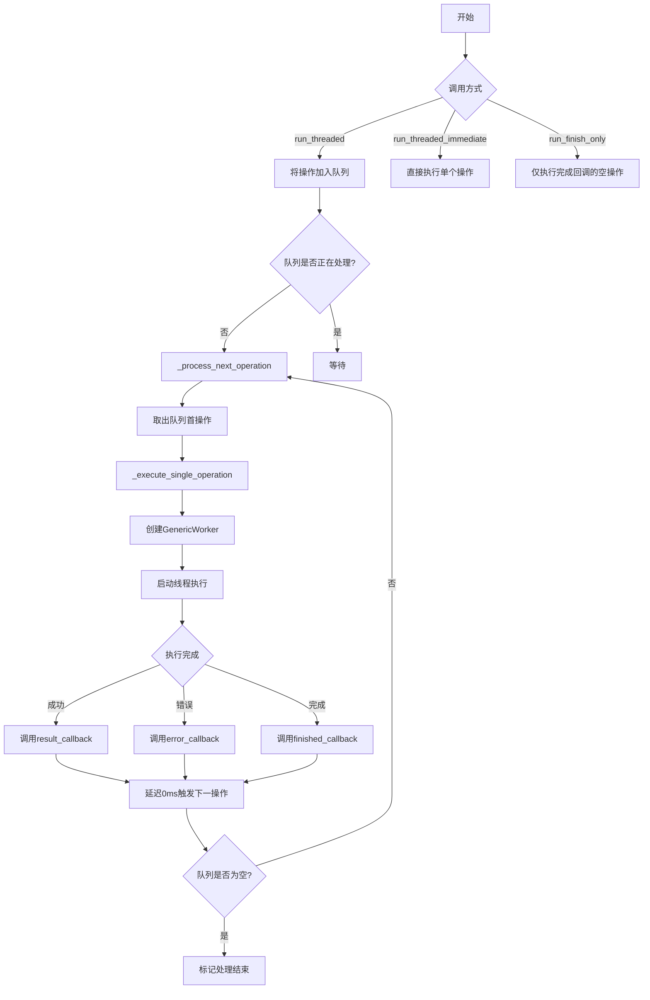
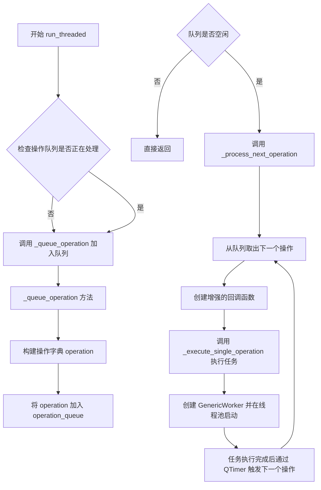
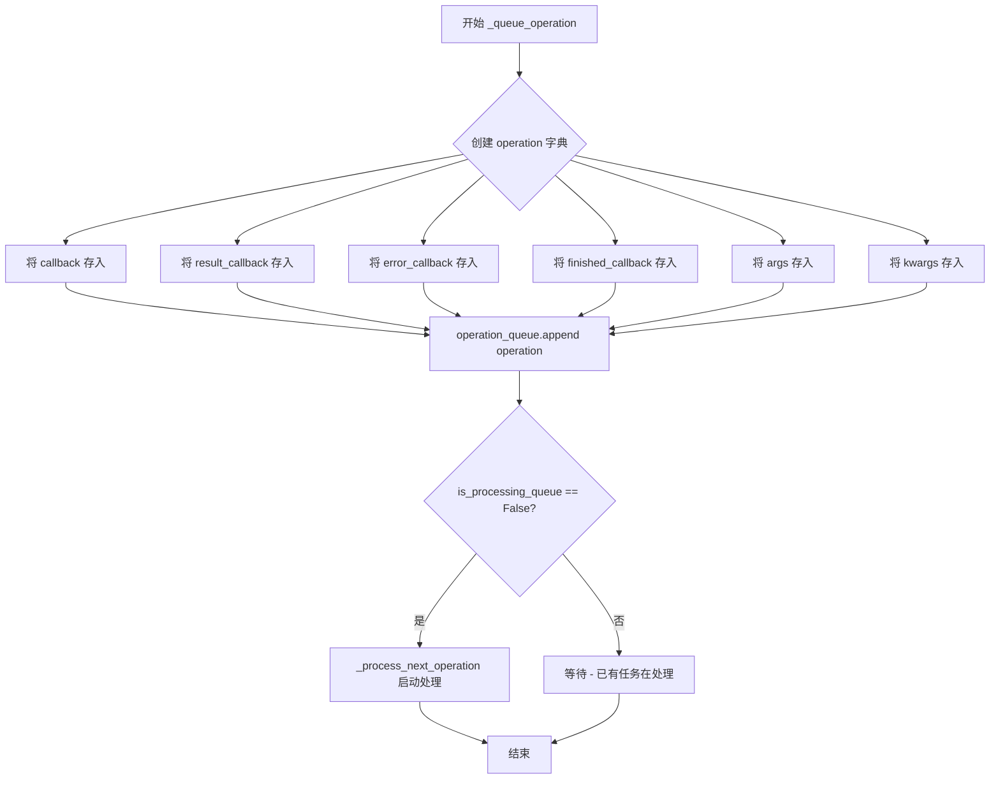
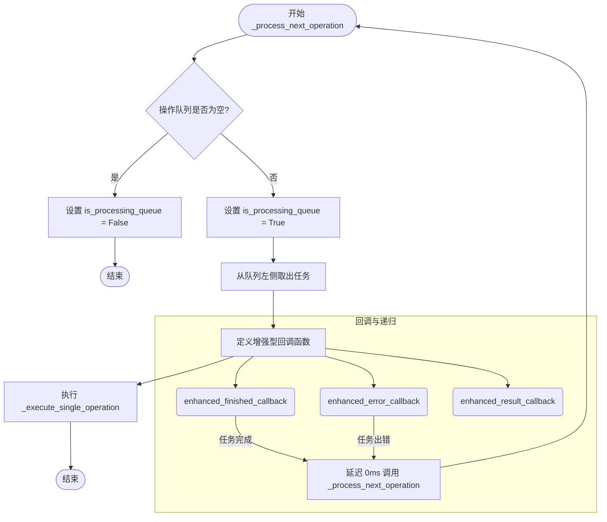
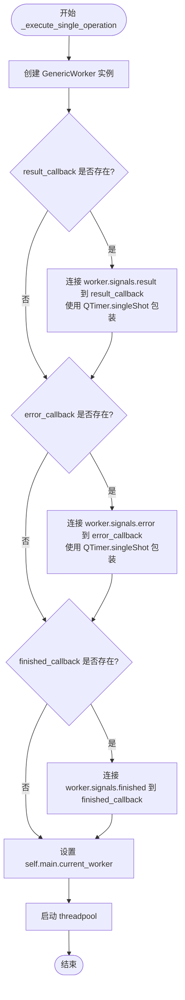
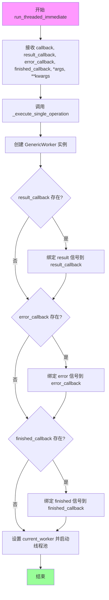
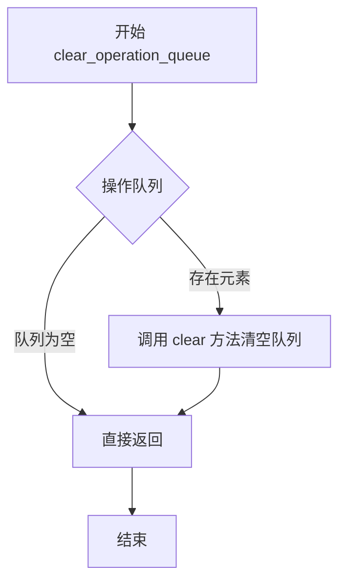
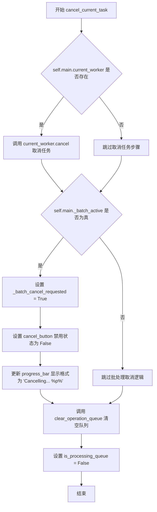
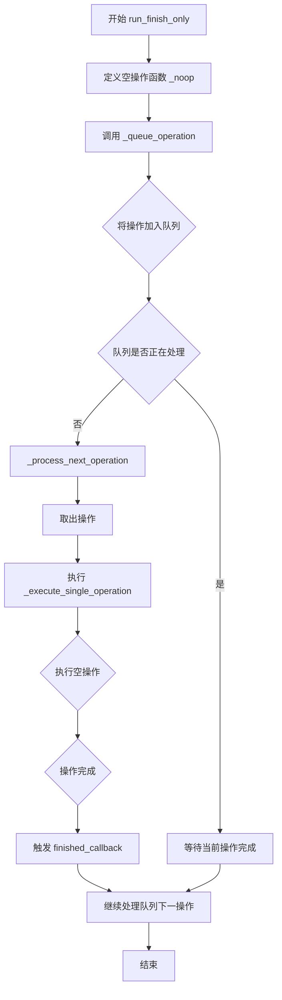

# `comic-translate\app\controllers\task_runner.py` 详细设计文档

这是一个基于Qt的漫画翻译应用的任务运行控制器，负责管理后台线程任务的队列化执行、支持即时执行、任务取消和完成回调，充当主应用与GenericWorker线程工作器之间的调度中心。

## 整体流程



## 类结构

```
TaskRunnerController (任务运行控制器)
```

## 全局变量及字段


### `TaskRunnerController.main`
    
主应用控制器引用

类型：`ComicTranslate`
    


### `TaskRunnerController.operation_queue`
    
操作队列

类型：`deque`
    


### `TaskRunnerController.is_processing_queue`
    
队列处理状态标志

类型：`bool`
    
    

## 全局函数及方法


### `TaskRunnerController.__init__`

这是`TaskRunnerController`类的构造函数，用于初始化任务运行控制器。它接收主控制器实例作为参数，并初始化任务队列和状态标志。

参数：

- `self`：隐式的`TaskRunnerController`实例对象
- `main`：`ComicTranslate`，主应用程序控制器实例，用于访问主窗口的线程池、工作线程等资源

返回值：无（`None`），该方法仅进行对象状态初始化

#### 流程图

```mermaid
flowchart TD
    A[开始 __init__] --> B[接收 main: ComicTranslate 参数]
    B --> C[设置 self.main = main]
    C --> D[初始化 self.operation_queue = deque()]
    D --> E[设置 self.is_processing_queue = False]
    E --> F[结束 __init__]
```

#### 带注释源码

```python
def __init__(self, main: ComicTranslate):
    """
    初始化任务运行控制器
    
    参数:
        main: ComicTranslate类型，主应用程序控制器实例
              用于在后续操作中访问线程池、当前工作线程等资源
    """
    # 保存主控制器引用，以便在执行任务时使用主程序的线程池等资源
    self.main = main
    
    # 初始化操作队列为双端队列，用于存储待执行的任务操作
    # 使用deque是为了高效地从队列两端添加和移除操作
    self.operation_queue = deque()
    
    # 标志位，标记当前是否正在处理队列中的操作
    # 初始值为False，表示初始状态下没有正在处理的任务队列
    self.is_processing_queue = False
```

#### 上下文信息

该方法是`TaskRunnerController`类的核心初始化逻辑，配合以下实例变量使用：

| 字段 | 类型 | 描述 |
|------|------|------|
| `self.main` | `ComicTranslate` | 主应用程序控制器引用 |
| `self.operation_queue` | `deque` | 待执行操作的任务队列 |
| `self.is_processing_queue` | `bool` | 队列处理状态标志 |

该类提供了任务队列管理功能，支持将回调函数加入队列并在后台线程中执行，同时提供任务取消和队列清理等能力。


### `TaskRunnerController.run_threaded`

该方法用于将任务异步执行并加入操作队列管理，通过回调函数处理结果、错误和完成状态，支持可变参数传递。

参数：

- `self`：`TaskRunnerController`，隐式参数，表示任务运行控制器实例
- `callback`：`Callable`，需要在线程中执行的主要业务逻辑回调函数
- `result_callback`：`Callable`，可选，任务成功执行完成后的回调函数，用于处理返回结果
- `error_callback`：`Callable`，可选，任务执行过程中发生异常时的回调函数，接收错误信息元组
- `finished_callback`：`Callable`，可选，任务最终完成时的回调函数（无论成功或失败）
- `*args`：`tuple`，可变位置参数，将传递给 callback 回调函数
- `**kwargs`：`dict`，可变关键字参数，将传递给 callback 回调函数

返回值：`None`，该方法将任务加入队列后直接返回，不等待任务执行完成

#### 流程图



#### 带注释源码

```python
def run_threaded(
    self,
    callback: Callable,
    result_callback: Callable = None,
    error_callback: Callable = None,
    finished_callback: Callable = None,
    *args,
    **kwargs,
):
    """
    将任务异步执行并加入操作队列管理
    
    参数:
        callback: 需要在线程中执行的主要业务逻辑回调函数
        result_callback: 任务成功执行完成后的回调函数，用于处理返回结果
        error_callback: 任务执行过程中发生异常时的回调函数
        finished_callback: 任务最终完成时的回调函数
        *args: 可变位置参数，将传递给 callback 回调函数
        **kwargs: 可变关键字参数，将传递给 callback 回调函数
    
    返回:
        None: 该方法将任务加入队列后直接返回，不等待任务执行完成
    """
    # 将任务委托给 _queue_operation 方法处理
    # 该方法会先将操作加入队列，然后触发队列处理流程
    return self._queue_operation(
        callback,
        result_callback,
        error_callback,
        finished_callback,
        *args,
        **kwargs,
    )
```


### `TaskRunnerController._queue_operation`

该方法是一个私有方法，用于将回调函数及其相关回调（结果回调、错误回调、完成回调）封装成一个操作对象并加入操作队列，同时检查队列是否正在处理中，若未处理则触发后续操作处理流程。

参数：

- `self`：隐式参数，方法所属的 `TaskRunnerController` 实例
- `callback`：`Callable`，主要要执行的回调函数
- `result_callback`：`Callable = None`，任务成功执行完成后的回调函数，用于传递结果
- `error_callback`：`Callable = None`，任务执行发生错误时的回调函数，用于传递错误信息
- `finished_callback`：`Callable = None`，任务执行完成后的回调函数（无论成功或失败）
- `*args`：`tuple`，可变位置参数，将传递给 `callback` 执行
- `**kwargs`：`dict`，可变关键字参数，将传递给 `callback` 执行

返回值：`None`，该方法不返回任何值

#### 流程图



#### 带注释源码

```python
def _queue_operation(
    self,
    callback: Callable,
    result_callback: Callable = None,
    error_callback: Callable = None,
    finished_callback: Callable = None,
    *args,
    **kwargs,
):
    """
    将一个操作加入队列并在后台线程执行
    
    参数:
        callback: 主要要执行的回调函数
        result_callback: 任务成功执行完成后的回调函数
        error_callback: 任务执行发生错误时的回调函数
        finished_callback: 任务执行完成后的回调函数
        *args: 传递给 callback 的位置参数
        **kwargs: 传递给 callback 的关键字参数
    """
    # 创建一个操作字典，用于封装所有回调和参数
    operation = {
        "callback": callback,           # 主回调函数
        "result_callback": result_callback,  # 结果回调
        "error_callback": error_callback,    # 错误回调
        "finished_callback": finished_callback,  # 完成回调
        "args": args,                   # 位置参数
        "kwargs": kwargs,               # 关键字参数
    }

    # 将操作添加到操作队列末尾
    self.operation_queue.append(operation)
    
    # 如果队列当前没有在处理中，则开始处理下一个操作
    if not self.is_processing_queue:
        self._process_next_operation()
```


### TaskRunnerController._process_next_operation

该方法负责从操作队列中取出并执行任务。它是任务调度链的核心，通过递归调用（由 QTimer 触发）来持续处理队列中的任务，直到队列为空。

参数：
- `self`：`TaskRunnerController`，控制器实例本身，包含主窗口引用和队列状态。

返回值：`None`，无返回值，主要通过回调函数传递结果。

#### 流程图



#### 带注释源码

```python
def _process_next_operation(self):
    # 检查操作队列是否为空
    if not self.operation_queue:
        # 如果为空，标记队列处理状态为未处理，并返回
        self.is_processing_queue = False
        return

    # 标记队列正在被处理
    self.is_processing_queue = True
    # 从队列左侧（队首）取出一个任务
    operation = self.operation_queue.popleft()

    # 定义增强版的完成回调：在原始回调执行后，触发下一次任务处理
    def enhanced_finished_callback():
        # 如果任务定义了原始的完成回调，则执行它
        if operation["finished_callback"]:
            operation["finished_callback"]()
        # 使用 QTimer.singleShot(0, ...) 将下一次操作调用放入事件循环尾部，
        # 从而实现非阻塞的队列循环处理
        QtCore.QTimer.singleShot(0, self._process_next_operation)

    # 定义增强版的错误回调：在原始错误回调执行后，触发下一次任务处理
    def enhanced_error_callback(error_tuple):
        # 如果任务定义了原始的错误回调，则执行它
        if operation["error_callback"]:
            operation["error_callback"](error_tuple)
        # 同样触发下一次任务处理
        QtCore.QTimer.singleShot(0, self._process_next_operation)

    # 定义增强版的结果回调：仅执行原始的结果回调，不触发递归
    # 递归只在 finished 或 error 时触发，以避免 result 多次触发
    def enhanced_result_callback(result):
        if operation["result_callback"]:
            operation["result_callback"](result)

    # 调用内部执行方法，传入原始任务及其增强后的回调
    self._execute_single_operation(
        operation["callback"],
        enhanced_result_callback,
        enhanced_error_callback,
        enhanced_finished_callback,
        *operation["args"],
        **operation["kwargs"],
    )
```


### `TaskRunnerController._execute_single_operation`

该方法负责在后台线程中执行单个任务。它通过实例化一个 `GenericWorker` 来封装待执行的回调函数及其参数，将结果、错误和完成信号连接到相应的回调函数（并通过 `QTimer.singleShot` 确保在主线程安全执行），最后将 worker 分配给主控制器并启动线程池。

参数：

- `self`：`TaskRunnerController`，控制器实例本身。
- `callback`：`Callable`，需要在后台线程中执行的核心业务逻辑函数。
- `result_callback`：`Callable`，可选，成功执行后的回调函数，用于处理返回结果。
- `error_callback`：`Callable`，可选，执行过程中发生异常时的回调函数。
- `finished_callback`：`Callable`，可选，任务完成（无论成功或失败）时的回调函数。
- `*args`：`tuple`，可变位置参数，将传递给 `callback`。
- `**kwargs`：`dict`，可变关键字参数，将传递给 `callback`。

返回值：`None`，该方法仅负责启动异步任务，不返回执行结果。

#### 流程图



#### 带注释源码

```python
def _execute_single_operation(
    self,
    callback: Callable,
    result_callback: Callable = None,
    error_callback: Callable = None,
    finished_callback: Callable = None,
    *args,
    **kwargs,
):
    # 1. 实例化 GenericWorker，传入回调函数及参数
    #    GenericWorker 会在其 run() 方法中调用 callback(*args, **kwargs)
    worker = GenericWorker(callback, *args, **kwargs)

    # 2. 如果提供了 result_callback，则连接 worker 的 result 信号
    #    使用 lambda 捕获 result，并通过 QTimer.singleShot(0, ...) 将结果回调调度到主线程
    if result_callback:
        worker.signals.result.connect(
            lambda result: QtCore.QTimer.singleShot(
                0, lambda: result_callback(result)
            )
        )

    # 3. 如果提供了 error_callback，则连接 worker 的 error 信号
    #    通常用于捕获线程中的异常
    if error_callback:
        worker.signals.error.connect(
            lambda error: QtCore.QTimer.singleShot(0, lambda: error_callback(error))
        )

    # 4. 如果提供了 finished_callback，则连接 worker 的 finished 信号
    if finished_callback:
        worker.signals.finished.connect(finished_callback)

    # 5. 保存当前活跃的 worker 引用，以便主控制器可以管理（如取消任务）
    self.main.current_worker = worker
    
    # 6. 将 worker 加入线程池开始执行
    self.main.threadpool.start(worker)
```


### `TaskRunnerController.run_threaded_immediate`

该方法用于立即执行线程任务，跳过任务队列，直接通过`GenericWorker`在线程池中执行传入的回调函数，并可选地绑定结果回调、错误回调和完成回调。

参数：

- `callback`：`Callable`，主要执行的任务回调函数，将在独立线程中运行
- `result_callback`：`Callable`，可选，任务成功完成后的回调，接收任务返回结果
- `error_callback`：`Callable`，可选，任务执行出错时的回调，接收错误信息元组
- `finished_callback`：`Callable`，可选，任务完成时的回调（无论成功或失败）
- `*args`：可变位置参数，将传递给callback函数
- `**kwargs`：可变关键字参数，将传递给callback函数

返回值：`None`，该方法直接调用`_execute_single_operation`执行任务，无返回值

#### 流程图



#### 带注释源码

```python
def run_threaded_immediate(
    self,
    callback: Callable,                      # 主要任务回调，在独立线程中执行
    result_callback: Callable = None,         # 任务成功完成后的回调，接收结果
    error_callback: Callable = None,          # 任务执行出错时的回调，接收错误元组
    finished_callback: Callable = None,       # 任务完成时的回调
    *args,                                    # 可变位置参数，传递给callback
    **kwargs,                                 # 可变关键字参数，传递给callback
):
    """
    立即执行线程任务，与 run_threaded 不同的是该方法不进入任务队列，
    而是直接创建 worker 并在线程池中立即执行。
    
    Args:
        callback: 要在线程中执行的回调函数
        result_callback: 可选，任务成功完成后的回调函数
        error_callback: 可选，任务执行出错时的回调函数
        finished_callback: 可选，任务完成时的回调函数
        *args: 传递给 callback 的位置参数
        **kwargs: 传递给 callback 的关键字参数
    
    Returns:
        None，该方法无返回值
    """
    # 直接调用内部方法 _execute_single_operation 执行任务
    # 跳过任务队列，实现立即执行
    return self._execute_single_operation(
        callback,
        result_callback,
        error_callback,
        finished_callback,
        *args,
        **kwargs,
    )
```


### `TaskRunnerController.clear_operation_queue`

清空任务运行器的操作队列，移除所有待执行的任务。

参数：无

返回值：`None`，无返回值描述

#### 流程图



#### 带注释源码

```python
def clear_operation_queue(self):
    """
    清空任务运行器的操作队列。
    
    该方法会清空 operation_queue 中所有待执行的任务操作。
    通常在取消当前任务或需要重置队列时调用。
    """
    self.operation_queue.clear()  # 清空 deque 队列中的所有元素
```


### `TaskRunnerController.cancel_current_task`

该方法负责取消当前正在执行的任务，包括终止工作线程、设置批处理取消标志、禁用取消按钮、更新进度条显示状态，以及清空操作队列并重置处理状态。

参数：

- `self`：隐式参数，`TaskRunnerController` 实例本身，无需额外描述

返回值：`None`，该方法不返回任何值，仅执行取消操作和状态更新

#### 流程图



#### 带注释源码

```
def cancel_current_task(self):
    """
    取消当前正在执行的任务
    
    该方法执行以下操作：
    1. 如果存在当前工作线程，则调用其 cancel() 方法终止任务
    2. 如果处于批处理模式，则设置取消标志、禁用取消按钮、更新进度条显示
    3. 清空操作队列并重置处理状态
    """
    
    # 检查是否存在当前正在执行的工作线程
    if self.main.current_worker:
        # 调用工作线程的 cancel 方法来终止任务
        self.main.current_worker.cancel()

    # 检查是否处于批处理模式
    if self.main._batch_active:
        # 设置批处理取消标志，通知系统取消请求已发出
        self.main._batch_cancel_requested = True
        
        # 禁用取消按钮，防止用户重复点击
        self.main.cancel_button.setEnabled(False)
        
        # 更新进度条显示格式，提示用户正在取消中
        # %p% 是 Qt 进度条百分比占位符
        self.main.progress_bar.setFormat(
            QCoreApplication.translate("Messages", "Cancelling... %p%")
        )

    # 清空待执行的操作队列
    self.clear_operation_queue()
    
    # 重置队列处理状态，表示当前没有在处理队列
    self.is_processing_queue = False
```


### `TaskRunnerController.run_finish_only`

该方法用于创建一个空操作（noop）并将其加入操作队列，仅在操作完成时触发指定的 `finished_callback` 回调，常用于等待前置任务完成后执行某些清理或收尾工作。

参数：

- `finished_callback`：`Callable`，当队列中的空操作完成时被调用的回调函数
- `error_callback`：`Callable`，可选参数，当操作执行过程中发生错误时被调用的回调函数

返回值：`None`，该方法没有返回值

#### 流程图



#### 带注释源码

```python
def run_finish_only(
    self, finished_callback: Callable, error_callback: Callable = None
):
    """
    创建一个空操作并加入队列，仅在完成时触发回调
    
    参数:
        finished_callback: 操作完成时执行的回调函数
        error_callback: 操作失败时执行的回调函数，可选
    """
    
    def _noop():
        """空操作函数，不执行任何实际任务"""
        pass

    # 将空操作加入队列，等待执行
    self._queue_operation(
        callback=_noop,          # 实际执行的回调（空操作）
        result_callback=None,    # 不需要结果回调
        error_callback=error_callback,  # 错误处理回调
        finished_callback=finished_callback,  # 完成回调
    )
```

## 关键组件


### 任务队列管理 (Operation Queue Management)

使用 `collections.deque` 作为操作队列，存储待执行的任务。`operation_queue` 保存所有排队的操作，`is_processing_queue` 标志位追踪队列处理状态。

### 异步任务执行器 (Threaded Task Executor)

通过 `GenericWorker` 在 Qt 线程池中执行后台任务，支持三种回调机制：结果回调、错误回调、完成回调。使用 `QTimer.singleShot(0, ...)` 实现非阻塞的链式队列处理。

### 队列链式处理机制 (Queue Chaining Mechanism)

`_process_next_operation` 方法在每个任务完成后自动调用自身，形成任务链。`enhanced_finished_callback` 和 `enhanced_error_callback` 在原始回调执行后触发下一个任务，实现队列自动流转。

### 任务取消系统 (Task Cancellation System)

`cancel_current_task` 方法支持取消当前正在执行的任务和待执行的队列任务。通过设置 `_batch_cancel_requested` 标志位和禁用取消按钮来管理批处理取消状态。

### 回调增强包装器 (Callback Enhancement Wrappers)

`_execute_single_operation` 为每个回调添加了 `QTimer.singleShot(0, ...)` 包装，确保回调在 Qt 事件循环中正确执行，防止阻塞线程池。

### 即时任务执行 (Immediate Task Execution)

`run_threaded_immediate` 方法绕过队列机制，直接在线程池中执行任务，适用于需要立即启动的紧急任务。

### 空操作执行器 (No-op Operation Executor)

`run_finish_only` 方法创建一个空回调 `_noop`，仅用于在队列中等待执行完成回调，常用于任务同步或占位操作。


## 问题及建议


### 已知问题

-   **Lambda闭包捕获潜在问题**：`_execute_single_operation` 中使用 `lambda result: QtCore.QTimer.singleShot(0, lambda: result_callback(result))` 存在双重lambda闭包捕获，可能导致回调行为异常或引用保留问题
-   **Worker引用管理缺陷**：`self.main.current_worker = worker` 直接覆盖可能丢失对前一个worker的引用，导致无法正确追踪和管理多个并发任务的生命周期
-   **状态标志不同步**：`is_processing_queue` 在队列为空时设为False，但此时最后一个操作可能仍在后台线程执行中，导致状态不一致
-   **批量取消逻辑耦合**：批量取消逻辑直接访问 `main` 对象的多个内部属性（`_batch_active`、`_batch_cancel_requested`、`cancel_button`、`progress_bar`），违反封装原则，增加耦合度
-   **冗余的run_finish_only实现**：`run_finish_only` 创建noop回调再入队执行相比直接调用finished_callback是不必要的开销
-   **回调参数类型不一致**：enhanced_error_callback 接收 `error_tuple` 参数，但实际传递的是 error 信号值，类型约定不明确

### 优化建议

-   **重构回调机制**：移除双重lambda，使用functools.partial或直接传递回调，避免闭包捕获问题
-   **改进Worker管理**：使用WeakRef或列表管理多个worker，支持并发任务追踪和批量取消
-   **状态机重构**：引入明确的任务状态枚举（IDLE、RUNNING、QUEUED、CANCELLING），替代布尔标志
-   **解耦批量操作**：将批量取消逻辑提取到独立的BatchTaskManager类，或通过事件/信号机制通信
-   **简化run_finish_only**：直接在当前线程或通过信号机制调用finished_callback，而非入队空操作
-   **统一错误回调签名**：明确定义error信号的参数类型，在文档和实现中保持一致
-   **添加线程安全保护**：如多线程访问operation_queue，应使用threading.Lock保护队列操作


## 其它


### 设计目标与约束

该模块的设计目标是提供一个线程任务管理框架，支持任务的串行队列执行、即时执行、任务取消等核心功能。约束条件包括：依赖PySide6的QThreadPool和信号槽机制；操作队列使用deque保证FIFO特性；任务取消依赖于GenericWorker的cancel方法。

### 错误处理与异常设计

错误处理采用回调机制，通过error_callback捕获线程中的异常。异常信息以元组形式(error_tuple)传递，包含异常类型和错误消息。队列处理中若发生错误，会触发enhanced_error_callback并继续处理下一操作，确保队列不会因单个任务失败而中断。

### 数据流与状态机

TaskRunnerController存在两种状态：空闲状态（is_processing_queue=False，无待处理任务）和处理状态（is_processing_queue=True）。数据流为：run_threaded -> _queue_operation（入队）-> _process_next_operation（出队并执行）-> _execute_single_operation（启动线程）-> 完成后通过Qt信号触发下一轮处理。

### 外部依赖与接口契约

外部依赖包括：（1）GenericWorker类：需实现signals属性，包含result、error、finished三个信号；（2）ComicTranslate主控制器：需提供current_worker属性、threadpool属性、_batch_active标志、_batch_cancel_requested标志、cancel_button、progress_bar等UI组件引用。调用方需保证callback为可调用对象，且result_callback/error_callback/finished_callback为可选的可调用对象或None。

### 线程安全与并发控制

线程安全主要体现在对operation_queue的append和popleft操作上，deque本身是线程安全的。但is_processing_queue的读写存在潜在的竞态条件，建议使用Qt的原子操作或锁保护。current_worker的赋值和访问也需要考虑线程安全，主线程和worker线程可能同时访问。

### 资源管理与生命周期

Worker对象通过threadpool启动后自动管理生命周期。current_worker保存当前活跃的worker引用，用于取消操作。cancel_current_task方法会禁用取消按钮并显示取消状态，完成资源清理后调用clear_operation_queue清空队列。

### 配置与扩展点

callback、result_callback、error_callback、finished_callback均支持自定义，实现扩展。kwargs机制允许传递任意参数，增加灵活性。run_finish_only提供了仅执行完成回调的快捷方式，用于同步状态或清理操作。

    