# `comic-translate\app\controllers\text.py` 详细设计文档

这是一个核心的控制器类 (TextController)，负责管理漫画翻译应用中的文本块交互、Qt UI 状态同步、文本渲染（手动排版）以及基于命令模式的撤销/重做操作，连接了底层 TextBlock 数据模型与前端的 TextBlockItem。

## 整体流程

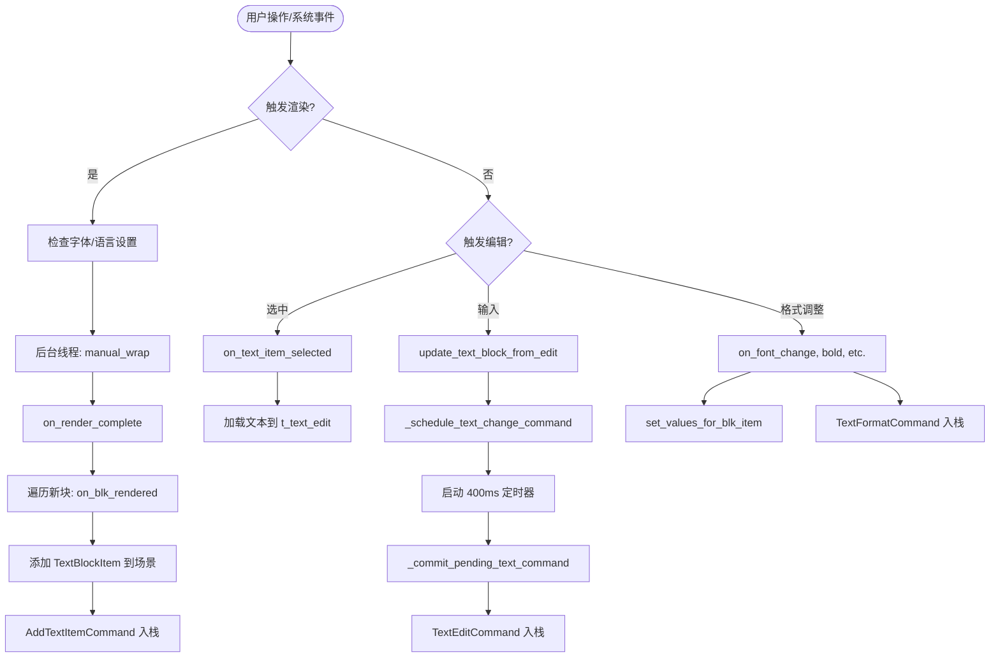

## 类结构

```
TextController (核心控制器类)
├── 依赖: ComicTranslate (主控制器 main)
├── 依赖: TextBlock (数据模型)
├── 依赖: TextBlockItem (Qt 图形项)
├── 依赖: Commands (Undo/Redo)
│   ├── TextFormatCommand
│   ├── AddTextItemCommand
│   ├── TextEditCommand
│   └── ResizeBlocksCommand
└── 依赖: Utils (工具函数)
    ├── get_language_code
    ├── get_smart_text_color
    ├── manual_wrap
    └── ...
```

## 全局变量及字段


### `TextController.main`
    
主应用实例引用，提供对整个应用程序状态和UI组件的访问

类型：`ComicTranslate`
    


### `TextController.widgets_to_block`
    
需要阻塞信号的UI组件列表，用于防止在批量更新时触发不必要的信号

类型：`list`
    


### `TextController._text_change_timer`
    
文本变更防抖定时器，用于延迟提交文本更改命令以提高性能

类型：`QtCore.QTimer`
    


### `TextController._pending_text_command`
    
待提交的文本命令缓存，存储文本项的旧值和新值以及关联的文本块

类型：`dict`
    


### `TextController._last_item_text`
    
文本项旧文本缓存，用于记录每个文本项的上一次文本内容以支持撤销功能

类型：`dict`
    


### `TextController._last_item_html`
    
文本项旧HTML缓存，用于记录每个文本项的上一次HTML内容以支持富文本撤销

类型：`dict`
    


### `TextController._suspend_text_command`
    
是否暂停命令提交标志，用于在特定操作期间临时禁用命令记录

类型：`bool`
    


### `TextController._is_updating_from_edit`
    
是否正在从编辑框更新标志，用于防止编辑框和文本项之间的循环更新

类型：`bool`
    
    

## 全局函数及方法


### `TextController.__init__`

该方法是 `TextController` 类的构造函数，负责初始化控制器与主应用（ComicTranslate）的连接、文本编辑相关的定时器、信号阻塞的UI组件列表以及用于跟踪文本项状态的各种内部状态字典。

参数：

-  `self`：隐藏的实例参数，代表 `TextController` 的当前实例
-  `main`：`ComicTranslate`，主应用控制器实例，用于访问应用的主要状态和UI组件

返回值：`None`，构造函数不返回任何值

#### 流程图

```mermaid
flowchart TD
    A[开始 __init__] --> B[接收 main: ComicTranslate 参数]
    B --> C[设置 self.main = main]
    C --> D[初始化 widgets_to_block 列表]
    D --> E[配置 _text_change_timer 定时器]
    E --> F[设置定时器参数: 单次触发, 400ms 间隔]
    F --> G[连接定时器 timeout 信号到 _commit_pending_text_command]
    G --> H[初始化内部状态变量]
    H --> I[_pending_text_command = None]
    I --> J[_last_item_text = {}]
    J --> K[_last_item_html = {}]
    K --> L[_suspend_text_command = False]
    L --> M[_is_updating_from_edit = False]
    M --> N[结束 __init__]
    
    D --> O[包含以下UI组件]
    O --> O1[font_dropdown]
    O --> O2[font_size_dropdown]
    O --> O3[line_spacing_dropdown]
    O --> O4[block_font_color_button]
    O --> O5[outline_font_color_button]
    O --> O6[outline_width_dropdown]
    O --> O7[outline_checkbox]
```

#### 带注释源码

```python
def __init__(self, main: ComicTranslate):
    """
    TextController 构造函数
    
    初始化控制器与主应用的连接，设置文本编辑相关的定时器，
    配置需要在手动渲染时阻塞信号的UI组件列表，以及初始化
    用于跟踪文本项状态的内部状态变量。
    
    参数:
        main: ComicTranslate - 主应用控制器实例
    """
    # 保存主应用引用，用于访问应用的主要状态和UI组件
    self.main = main

    # 手动渲染期间需要阻塞信号的UI组件列表
    # 这些组件包括字体选择、下拉框、颜色按钮和复选框
    # 在渲染过程中阻塞信号可以防止用户交互干扰自动渲染流程
    self.widgets_to_block = [
        self.main.font_dropdown,              # 字体下拉选择框
        self.main.font_size_dropdown,        # 字体大小下拉选择框
        self.main.line_spacing_dropdown,     # 行间距下拉选择框
        self.main.block_font_color_button,   # 文本颜色按钮
        self.main.outline_font_color_button, # 描边颜色按钮
        self.main.outline_width_dropdown,    # 描边宽度下拉选择框
        self.main.outline_checkbox           # 描边启用复选框
    ]
    
    # 创建文本变更定时器，用于延迟提交文本编辑命令
    # 使用延迟提交可以合并短时间内多次文本修改为单个撤销操作
    self._text_change_timer = QtCore.QTimer(self.main)
    
    # 设置定时器为单次触发模式（触发一次后停止）
    self._text_change_timer.setSingleShot(True)
    
    # 设置400毫秒的延迟间隔
    # 用户停止输入400毫秒后，定时器触发并提交待处理的文本命令
    self._text_change_timer.setInterval(400)
    
    # 连接定时器超时信号到文本命令提交方法
    self._text_change_timer.timeout.connect(self._commit_pending_text_command)
    
    # 待提交的文本命令容器，None表示没有待处理命令
    self._pending_text_command = None
    
    # 字典：存储每个文本项的最后纯文本内容
    # 用于检测文本变化并计算差异
    self._last_item_text = {}
    
    # 字典：存储每个文本项的最后HTML内容
    # 用于保留文本格式信息（如粗体、斜体等）
    self._last_item_html = {}
    
    # 标志：是否暂停文本命令执行
    # 当需要临时禁用文本命令追踪时设为True（如应用撤销/重做时）
    self._suspend_text_command = False
    
    # 标志：是否正在从编辑控件更新（避免循环更新）
    # 防止文本编辑控件和画布文本项之间的循环更新
    self._is_updating_from_edit = False
```


### `TextController.connect_text_item_signals`

该方法负责将 `TextBlockItem`（文本块图形项）的各类信号（Selection, Text Change, Undo）连接到 `TextController` 的槽函数，以实现 UI 交互、文本同步与撤销/重做功能。它包含防止重复连接的检查机制，并在连接时缓存当前文本状态以支持后续的差异计算。

参数：

- `text_item`：`TextBlockItem`，需要进行信号连接的目标文本块控件。
- `force_reconnect`：`bool`，如果为 `True`，则强制断开现有连接并进行重新连接，通常用于初始化或重置状态。

返回值：`None`，该方法无返回值，主要通过副作用（连接信号、修改字典状态）生效。

#### 流程图

```mermaid
flowchart TD
    A([开始]) --> B{text_item._ct_signals_connected <br>且 not force_reconnect?}
    B -- 是 --> C[直接返回]
    B -- 否 --> D{force_reconnect?}
    D -- 是 --> E[尝试断开所有已连接信号]
    D -- 否 --> F{hasattr text_item <br>'_ct_text_changed_slot'?}
    E --> F
    F -- 否 --> G[创建 Lambda 闭包槽函数 <br>_ct_text_changed_slot]
    F -- 是 --> H[连接信号到控制器]
    G --> H
    H --> I[连接 item_selected]
    I --> J[连接 item_deselected]
    J --> K[连接 text_changed <br>(使用 Slot)]
    K --> L[连接 text_highlighted]
    L --> M[连接 change_undo]
    M --> N[缓存当前文本到 <br>_last_item_text]
    N --> O[缓存当前HTML到 <br>_last_item_html]
    O --> P[设置 _ct_signals_connected = True]
    C --> P
    P --> Z([结束])
```

#### 带注释源码

```python
def connect_text_item_signals(self, text_item: TextBlockItem, force_reconnect: bool = False):
    # 检查信号是否已连接，避免重复连接
    # 如果已经连接且不强制重连，则直接跳过
    if getattr(text_item, "_ct_signals_connected", False) and not force_reconnect:
        return

    # 如果强制重连，先尝试断开所有可能的信号，防止内存泄漏或重复触发
    # 使用 try-except 防止信号未连接时报错
    if force_reconnect:
        try:
            text_item.item_selected.disconnect(self.on_text_item_selected)
        except (TypeError, RuntimeError):
            pass
        try:
            text_item.item_deselected.disconnect(self.on_text_item_deselected)
        except (TypeError, RuntimeError):
            pass
        # 断开文本改变信号时，需要断开特定的槽函数实例
        if hasattr(text_item, "_ct_text_changed_slot"):
            try:
                text_item.text_changed.disconnect(text_item._ct_text_changed_slot)
            except (TypeError, RuntimeError):
                pass
        try:
            text_item.text_highlighted.disconnect(self.set_values_from_highlight)
        except (TypeError, RuntimeError):
            pass
        try:
            text_item.change_undo.disconnect(self.main.rect_item_ctrl.rect_change_undo)
        except (TypeError, RuntimeError):
            pass

    # 如果槽函数不存在，则创建一个 Lambda 闭包
    # 这样可以将 item 实例绑定到方法调用中，避免循环引用或查找开销
    if not hasattr(text_item, "_ct_text_changed_slot"):
        text_item._ct_text_changed_slot = (
            lambda text, ti=text_item: self.update_text_block_from_item(ti, text)
        )

    # 开始连接新的信号
    text_item.item_selected.connect(self.on_text_item_selected)
    text_item.item_deselected.connect(self.on_text_item_deselected)
    text_item.text_changed.connect(text_item._ct_text_changed_slot)
    text_item.text_highlighted.connect(self.set_values_from_highlight)
    text_item.change_undo.connect(self.main.rect_item_ctrl.rect_change_undo)
    
    # 缓存当前的纯文本和 HTML，用于后续计算 Diff 或撤销操作
    self._last_item_text[text_item] = text_item.toPlainText()
    self._last_item_html[text_item] = text_item.document().toHtml()
    
    # 标记该对象已经连接过信号
    text_item._ct_signals_connected = True
```

#### 关键技术点与潜在优化

1.  **动态属性注入**：代码在 `text_item` 对象上动态添加了 `_ct_signals_connected` 和 `_ct_text_changed_slot` 属性。这虽然简化了逻辑（无需修改 `TextBlockItem` 类），但导致了类之间的耦合度增加，且 `TextBlockItem` 承载了过多的“控制器职责”。
2.  **异常处理过于宽泛**：在断开信号时使用了 `except (TypeError, RuntimeError): pass`。这虽然能防止程序崩溃，但如果在不期望断开时发生了错误（例如信号名称改变），这种吞异常的方式会掩盖潜在的 bug。
3.  **Lambda 闭包**：通过 `lambda text, ti=text_item: ...` 捕获变量。这种方式虽然便捷，但当 `text_item` 被删除时，可能会导致引用计数问题或内存泄漏（如果 Slot 持有引用）。可以考虑使用 `functools.partial` 或更强的引用管理。
4.  **重复逻辑**：连接和断开的信号列表硬编码在两处（断开逻辑和连接逻辑），如果新增信号容易遗漏。


### `TextController.clear_text_edits`

该方法用于重置文本编辑状态，清除当前选中的文本块引用，并将源代码和目标代码编辑框的内容清空。

参数：
- 无（仅包含 `self` 参数）

返回值：`None`，无返回值（Python 方法默认返回 None）

#### 流程图

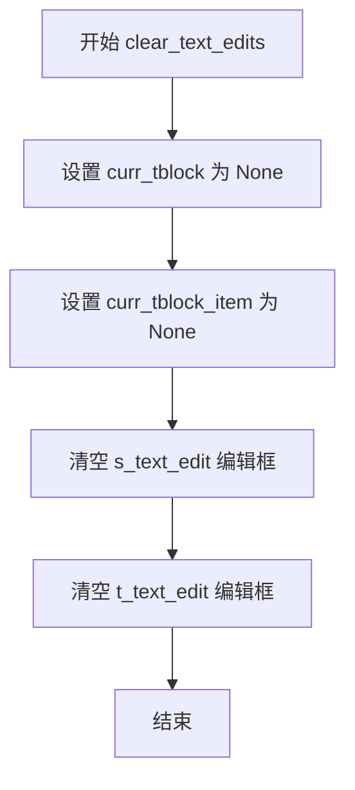

#### 带注释源码

```python
def clear_text_edits(self):
    """
    清除文本编辑状态
    
    该方法执行以下操作：
    1. 清除当前选中的 TextBlock 对象引用
    2. 清除当前选中的 TextBlockItem 对象引用
    3. 清空源代码编辑框的内容
    4. 清空目标翻译编辑框的内容
    
    通常在文本项取消选中时调用，用于重置 UI 状态。
    """
    # 清除当前选中的文本块对象引用
    self.main.curr_tblock = None
    
    # 清除当前选中的文本块项对象引用
    self.main.curr_tblock_item = None
    
    # 清空源代码编辑框的内容
    self.main.s_text_edit.clear()
    
    # 清空目标翻译编辑框的内容
    self.main.t_text_edit.clear()
```


### `TextController.on_blk_rendered`

该方法作为渲染流程的回调函数，在文本块（TextBlock）的渲染计算完成后被触发。其核心职责是根据传入的渲染参数和文本块数据，在 UI 界面上实例化对应的文本控件（TextItem），并将其纳入撤销/重做（Undo/Redo）的命令管理体系中。

参数：

-  `text`：`str`，渲染处理后的最终文本内容。
-  `font_size`：`int`，根据文本块尺寸和设置计算出的字体大小。
-  `blk`：`TextBlock`，原始文本块对象，包含了位置 `(xyxy)`、旋转角度 `(angle)`、原字体颜色 `(font_color)` 等关键元数据。
-  `image_path`：`str`，当前正在处理的图片文件路径，用于在多页面渲染时校验一致性。

返回值：`None`，该方法不返回任何值，主要通过副作用（修改 UI 状态）生效。

#### 流程图

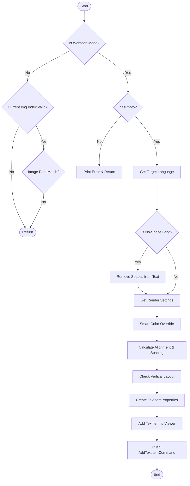

#### 带注释源码

```python
def on_blk_rendered(self, text: str, font_size: int, blk: TextBlock, image_path: str):
    """
    渲染完成后的回调，用于在界面上添加文本块。
    :param text: 渲染后的文本
    :param font_size: 计算后的字体大小
    :param blk: 原始文本块数据
    :param image_path: 当前图片路径
    """
    
    # 1. 环境校验：检查当前图片是否为显示的图片
    # 如果不是 Webtoon 模式，需要确保当前处理的图片是用户正在查看的图片
    # 以防止后台渲染时错误地更新 UI
    if not self.main.webtoon_mode:
        if self.main.curr_img_idx < 0 or self.main.curr_img_idx >= len(self.main.image_files):
            return
        current_file = self.main.image_files[self.main.curr_img_idx]
        if os.path.normcase(current_file) != os.path.normcase(image_path):
            return

    # 2. 基础检查：确保主图像已加载
    if not self.main.image_viewer.hasPhoto():
        print("No main image to add to.")
        return

    # 3. 语言与文本预处理
    # 获取目标语言映射
    target_lang = self.main.lang_mapping.get(self.main.t_combo.currentText(), None)
    # 获取语言代码
    trg_lng_cd = get_language_code(target_lang)
    # 如果目标语言是无空格语言（如中文、日文），去除文本中的所有空格
    if is_no_space_lang(trg_lng_cd):
        text = text.replace(' ', '')

    # 4. 获取渲染配置
    # 从 UI 控件和设置中获取当前的渲染参数（字体、颜色、对齐等）
    render_settings = self.render_settings()
    font_family = render_settings.font_family
    text_color_str = render_settings.color
    text_color = QColor(text_color_str)

    # 5. 智能颜色覆盖
    # 根据文本块原有的字体颜色智能调整当前颜色（例如处理白底黑字或黑底白字）
    text_color = get_smart_text_color(blk.font_color, text_color)

    # 6. 解析样式参数
    id = render_settings.alignment_id
    # 将 UI 的按钮 ID 转换为 Qt 对齐方式
    alignment = self.main.button_to_alignment[id]
    line_spacing = float(render_settings.line_spacing)
    
    # 轮廓颜色与宽度
    outline_color_str = render_settings.outline_color
    # 只有当轮廓复选框被勾选时才创建颜色对象，否则为 None
    outline_color = QColor(outline_color_str) if self.main.outline_checkbox.isChecked() else None
    outline_width = float(render_settings.outline_width)
    
    # 字形样式
    bold = render_settings.bold
    italic = render_settings.italic
    underline = render_settings.underline
    
    # 文本方向
    direction = render_settings.direction
    # 判断是否为竖排文本块
    vertical = is_vertical_block(blk, trg_lng_cd)

    # 7. 构建属性对象
    # 将所有渲染参数封装为 Properties 对象，用于创建 UI 元素
    properties = TextItemProperties(
        text=text,
        font_family=font_family,
        font_size=font_size,
        text_color=text_color,
        alignment=alignment,
        line_spacing=line_spacing,
        outline_color=outline_color,
        outline_width=outline_width,
        bold=bold,
        italic=italic,
        underline=underline,
        direction=direction,
        position=(blk.xyxy[0], blk.xyxy[1]), # 使用文本块的坐标
        rotation=blk.angle,                  # 使用文本块的旋转角度
        vertical=vertical,
    )
    
    # 8. 添加到视图
    # 调用 ImageViewer 将文本项添加到场景中
    text_item = self.main.image_viewer.add_text_item(properties)
    # 显式设置纯文本内容（覆盖 HTML 默认内容，确保一致性）
    text_item.set_plain_text(text)

    # 9. 命令记录
    # 将此添加操作封装为命令，以便支持撤销/重做
    command = AddTextItemCommand(self.main, text_item)
    self.main.push_command(command)
```


### `TextController.on_text_item_selected`

当用户在画布上选中一个文本项目（TextBlockItem）时触发该方法，负责将选中的文本项目与对应的原始文本块关联，并更新界面上的源文本编辑器和目标文本编辑器的显示内容，同时同步格式化参数。

参数：

- `text_item`：`TextBlockItem`，用户在画布上选中的文本项目对象

返回值：`None`，该方法无返回值，仅执行界面状态更新和数据同步操作

#### 流程图

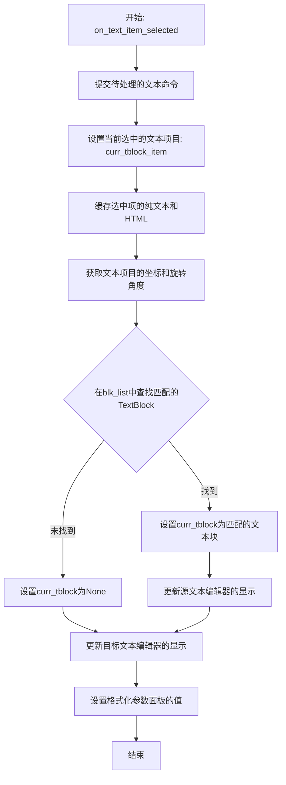

#### 带注释源码

```python
def on_text_item_selected(self, text_item: TextBlockItem):
    """
    当用户在画布上选中一个文本项目时调用。
    
    该方法执行以下操作：
    1. 提交任何待处理的文本编辑命令
    2. 记录当前选中的文本项目
    3. 缓存文本项目的文本内容用于后续比较
    4. 根据位置和旋转角度在blk_list中查找对应的原始文本块
    5. 更新源文本编辑器和目标文本编辑器的显示
    6. 同步格式化参数面板的值
    
    Args:
        text_item: 用户在画布上选中的TextBlockItem对象
    """
    # 1. 先提交任何待处理的文本编辑命令，确保之前的编辑被记录到撤销栈
    self._commit_pending_text_command()
    
    # 2. 记录当前选中的文本项目
    self.main.curr_tblock_item = text_item
    
    # 3. 缓存文本项目的纯文本和HTML，用于后续比较和命令执行
    self._last_item_text[text_item] = text_item.toPlainText()
    self._last_item_html[text_item] = text_item.document().toHtml()

    # 4. 获取文本项目的位置坐标和旋转角度，用于匹配原始文本块
    x1, y1 = int(text_item.pos().x()), int(text_item.pos().y())
    rotation = text_item.rotation()

    # 5. 在blk_list中查找位置和旋转角度匹配的原始文本块
    # 使用is_close函数进行近似匹配（位置误差5像素，角度误差1度）
    self.main.curr_tblock = next(
        (
        blk for blk in self.main.blk_list
        if is_close(blk.xyxy[0], x1, 5) and is_close(blk.xyxy[1], y1, 5)
        and is_close(blk.angle, rotation, 1)
        ),
        None
    )

    # 6. 更新源文本编辑器的显示（显示原始文本）
    if self.main.curr_tblock:
        self.main.s_text_edit.blockSignals(True)
        self.main.s_text_edit.setPlainText(self.main.curr_tblock.text)
        self.main.s_text_edit.blockSignals(False)

    # 7. 更新目标文本编辑器的显示（显示翻译文本）
    self.main.t_text_edit.blockSignals(True)
    self.main.t_text_edit.setPlainText(text_item.toPlainText())
    self.main.t_text_edit.blockSignals(False)

    # 8. 同步更新格式化参数面板（字体、大小、颜色、对齐等）
    self.set_values_for_blk_item(text_item)
```


### `TextController.on_text_item_deselected`

当用户取消选中某个文本块项目时，该方法负责清理待处理的文本编辑命令并重置编辑器界面状态。

参数： 无

返回值：`None`，该方法不返回任何值，仅执行副作用操作。

#### 流程图

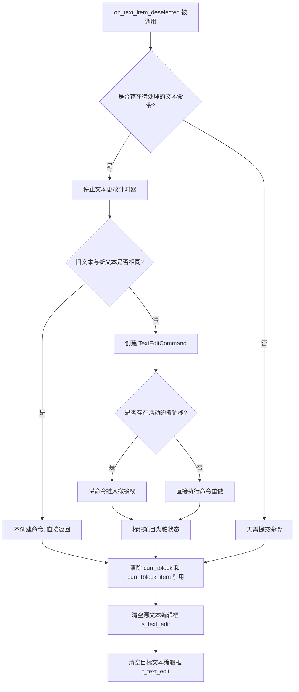

#### 带注释源码

```python
def on_text_item_deselected(self):
    """
    当文本块项目失去选中状态时调用的回调函数。
    负责：
    1. 提交任何待处理的文本编辑命令（确保选中文本时的编辑被保存到撤销栈）
    2. 清空编辑器界面的文本输入框和当前选中状态
    """
    # 1. 提交待处理的文本命令
    #    如果用户在文本项目选中状态下进行了编辑（如通过拖拽调整大小触发文本更新），
    #    这些更改会被暂存到 _pending_text_command 中。
    #    当取消选中时，需要将这些更改作为撤销命令提交，以支持撤销操作。
    self._commit_pending_text_command()
    
    # 2. 清空编辑器状态
    #    重置当前选中的文本块和文本块项目引用，并清空两个翻译编辑框的内容
    self.clear_text_edits()
```


### `TextController.update_text_block`

该方法负责将用户界面中源文本编辑框（`s_text_edit`）和目标文本编辑框（`t_text_edit`）的内容同步更新到当前选中的文本块数据模型（`curr_tblock`）中，并标记项目状态为已修改。

参数：

- `self`：`TextController`，表示 `TextController` 类的实例本身，用于访问控制器内部的 `main` 对象（主应用控制器）以及相关的 UI 组件和数据模型。

返回值：`None`，该方法主要执行副作用（更新数据模型和项目状态），不返回任何数据。

#### 流程图

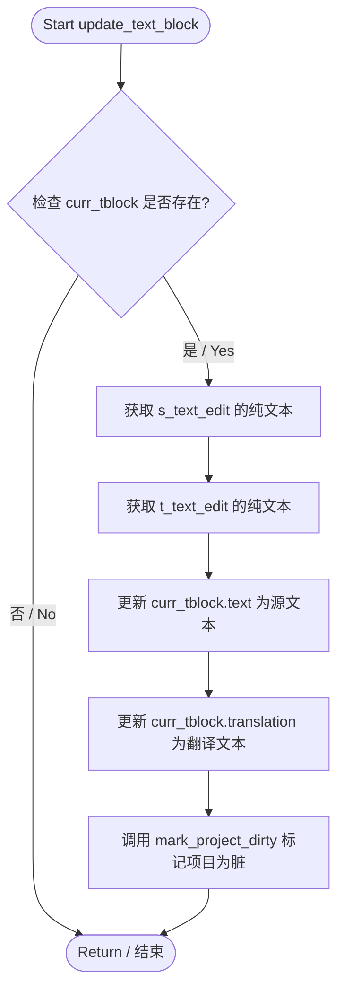

#### 带注释源码

```python
def update_text_block(self):
    """
    将 UI 中的文本编辑框内容更新到当前选中的 TextBlock 对象中。
    """
    # 检查是否存在当前选中的文本块 (curr_tblock)
    if self.main.curr_tblock:
        # 从源文本编辑框 (s_text_edit) 获取文本并更新数据模型
        self.main.curr_tblock.text = self.main.s_text_edit.toPlainText()
        
        # 从目标文本编辑框 (t_text_edit) 获取文本并更新数据模型
        self.main.curr_tblock.translation = self.main.t_text_edit.toPlainText()
        
        # 标记项目目录为脏（已修改），以便保存
        self.main.mark_project_dirty()
```


### `TextController.update_text_block_from_edit`

该方法负责将用户通过编辑界面（`t_text_edit`）输入的文本内容同步更新到对应的内部数据模型（`TextBlock.translation`）和图形界面元素（`TextBlockItem`）中，同时通过差异更新机制保持文本编辑器的光标位置，并利用 `_is_updating_from_edit` 标志防止由图形项触发的文本变更信号的循环调用。

参数： 无（仅包含隐式 `self` 参数）

返回值： `None`，该方法执行完成后不返回任何值

#### 流程图

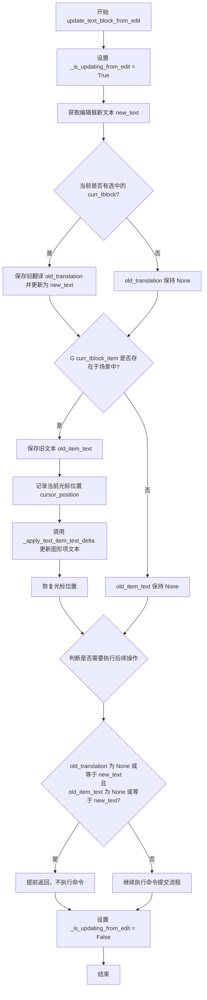

#### 带注释源码

```python
def update_text_block_from_edit(self):
    """
    当用户在目标文本编辑框 (t_text_edit) 中输入或修改文本后，
    此方法被调用以将编辑框中的内容同步到内部数据结构和图形界面元素中。
    """
    # 设置标志位，防止该方法触发的文本变更再次触发 item 的 text_changed 信号
    # 从而避免 update_text_block_from_item 的递归调用
    self._is_updating_from_edit = True
    try:
        # 1. 获取编辑框中的新文本内容
        new_text = self.main.t_text_edit.toPlainText()
        
        old_translation = None
        old_item_text = None
        
        # 2. 如果当前选中了文本块 (curr_tblock)，更新其翻译属性
        if self.main.curr_tblock:
            old_translation = self.main.curr_tblock.translation
            self.main.curr_tblock.translation = new_text

        # 3. 如果当前选中了图形项 (curr_tblock_item) 且该图形项存在于场景中
        if self.main.curr_tblock_item and self.main.curr_tblock_item in self.main.image_viewer._scene.items():
            old_item_text = self.main.curr_tblock_item.toPlainText()
            # 记录光标位置，以便在差异更新后恢复
            cursor_position = self.main.t_text_edit.textCursor().position()
            
            # 执行差异更新，只修改变化的部分，保持其他格式属性
            self._apply_text_item_text_delta(self.main.curr_tblock_item, new_text)

            # 恢复光标位置，避免文本更新导致光标跳至开头
            cursor = self.main.t_text_edit.textCursor()
            cursor.setPosition(cursor_position)
            self.main.t_text_edit.setTextCursor(cursor)
            
        # 4. 检查文本是否真的发生了变化
        # 如果翻译文本和图形项文本都未变化（或原本就等于新文本），则提前返回
        # 不需要创建撤销命令
        if (old_translation is None or old_translation == new_text) and (
            old_item_text is None or old_item_text == new_text
        ):
            return
    finally:
        # 确保无论如何都重置标志位，释放锁定
        self._is_updating_from_edit = False
```


### `TextController.update_text_block_from_item`

该方法负责响应用户在画布上对文本块（TextBlockItem）的直接编辑操作。当用户在图像上修改文本时，此方法会同步更新底层的数据模型（`TextBlock`），并刷新侧边栏的目标文本编辑框，同时准备撤销/重做命令。

参数：

-  `self`：隐藏参数，类实例本身。
-  `text_item`：`TextBlockItem`，在画布上触发文本变化的视觉元素。
-  `new_text`：`str`，文本框中的新文本内容。

返回值：`None`，该方法无返回值，主要通过副作用（修改对象状态）生效。

#### 流程图

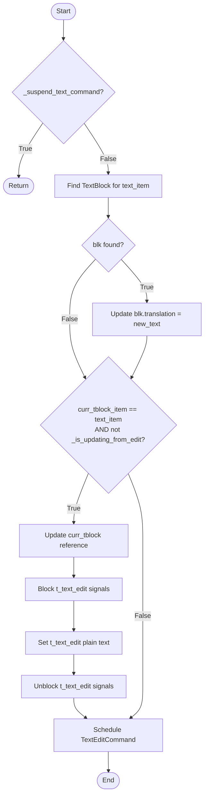

#### 带注释源码

```python
def update_text_block_from_item(self, text_item: TextBlockItem, new_text: str):
    # 如果当前正处于禁止执行文本命令的状态（例如正在应用命令），则直接返回，不做任何处理
    if self._suspend_text_command:
        return
    
    # 根据视觉元素找到对应的底层数据模型 TextBlock
    blk = self._find_text_block_for_item(text_item)
    
    # 如果找到了对应的数据块，则同步更新其翻译内容
    if blk:
        blk.translation = new_text

    # 检查当前在UI中选中的文本项是否就是正在编辑的这一项，
    # 并且确保当前不是处于“正在从编辑框更新”的递归调用中
    if self.main.curr_tblock_item == text_item and not self._is_updating_from_edit:
        # 更新当前控制器引用的块对象
        self.main.curr_tblock = blk
        
        # 暂时阻塞侧边栏目标编辑框的信号，防止触发 text_changed 信号的循环调用
        self.main.t_text_edit.blockSignals(True)
        self.main.t_text_edit.setPlainText(new_text)
        self.main.t_text_edit.blockSignals(False)

    # 安排一个延迟的文本编辑命令，用于实现撤销/重做功能
    # _schedule_text_change_command 会处理防抖和命令的生成
    self._schedule_text_change_command(text_item, new_text, blk)
```


### `TextController._apply_text_item_text_delta`

**描述**：该方法是一个高效的文本更新核心逻辑，通过计算旧文本与新文本之间的差异（Delta），仅修改发生变化的前缀和中间部分，保留不变的后缀及相关的字符格式（CharFormat），从而在保持文本样式一致性的同时，尽量减少文档对象的修改范围，以支持更好的撤销/重做体验。

参数：
- `self`：隐式参数，`TextController` 类实例。
- `text_item`：`TextBlockItem`，需要进行文本更新的Qt图形文本项对象。
- `new_text`：`str`，文本项的新内容。

返回值：`None`，该方法直接修改传入的 `text_item` 内部文档状态，无显式返回值。

#### 流程图

```mermaid
graph TD
    A[开始: _apply_text_item_text_delta] --> B[获取旧文本 old_text]
    B --> C{old_text == new_text?}
    C -- 是 --> D[直接返回]
    C -- 否 --> E[计算前缀长度 prefix]
    E --> F[计算后缀长度 suffix]
    F --> G[计算 old_mid 和 new_mid]
    G --> H{获取字符格式 insert_format}
    H --> I{old_text 是否为空?}
    I -- 否 --> J{prefix < len(old_text)?}
    I -- 是 --> K[设为 None]
    J -- 是 --> L[获取 prefix 位置格式]
    J -- 否 --> M{prefix > 0?}
    M -- 是 --> N[获取 prefix-1 位置格式]
    M -- 否 --> K
    N --> K
    L --> K
    K --> O[开始编辑块 beginEditBlock]
    O --> P{old_mid 是否存在?}
    P -- 是 --> Q[删除 old_mid]
    P -- 否 --> R{new_mid 是否存在?}
    Q --> R
    R -- 是 --> S[应用 insert_format]
    S --> T[插入 new_mid]
    R -- 否 --> U[结束编辑块 endEditBlock]
    T --> U
    U --> V[结束]
```

#### 带注释源码

```python
def _apply_text_item_text_delta(self, text_item: TextBlockItem, new_text: str):
    """
    计算并应用文本项的文本差异。
    
    该方法通过对比旧文本与新文本，找到两者相同的前缀和后缀，
    仅对中间部分进行修改，以此来尽量保留原有文本的格式信息，
    并减少Qt文档的修改范围。
    """
    # 1. 获取当前文本项中的纯文本内容
    old_text = text_item.toPlainText()
    
    # 2. 性能优化：如果文本没有变化，则直接返回，避免不必要的DOM操作
    if old_text == new_text:
        return

    # 3. 计算公共前缀 (Prefix)
    # 找到从开始到第一个不匹配字符的位置
    prefix = 0
    max_prefix = min(len(old_text), len(new_text))
    while prefix < max_prefix and old_text[prefix] == new_text[prefix]:
        prefix += 1

    # 4. 计算公共后缀 (Suffix)
    # 找到从结尾到第一个不匹配字符的长度
    suffix = 0
    max_suffix = min(len(old_text) - prefix, len(new_text) - prefix)
    while suffix < max_suffix and old_text[-(suffix + 1)] == new_text[-(suffix + 1)]:
        suffix += 1

    # 5. 提取需要替换的中间部分
    # old_mid: 旧文本中需要删除的部分
    # new_mid: 新文本中需要插入的部分
    old_mid_end = len(old_text) - suffix
    new_mid_end = len(new_text) - suffix
    old_mid = old_text[prefix:old_mid_end]
    new_mid = new_text[prefix:new_mid_end]

    # 6. 准备文本游标以执行操作
    doc = text_item.document()
    cursor = QTextCursor(doc)
    insert_format = None

    # 7. 尝试获取光标位置的字符格式
    # 优先使用前缀位置的格式，如果前缀已到达末尾，则回退到前缀之前的格式
    # 这样可以保证新插入的文本样式继承自其前面的字符
    if old_text:
        if prefix < len(old_text):
            cursor.setPosition(prefix)
            insert_format = cursor.charFormat()
        elif prefix > 0:
            cursor.setPosition(prefix - 1)
            insert_format = cursor.charFormat()

    # 8. 开始编辑块 (支持 Qt 的 Undo/Redo)
    cursor.beginEditBlock()
    
    # 9. 删除旧的中间文本
    if old_mid:
        cursor.setPosition(prefix)
        # KeepAnchor 表示选中文本
        cursor.setPosition(prefix + len(old_mid), QTextCursor.KeepAnchor)
        cursor.removeSelectedText()
        
    # 10. 插入新的中间文本并应用之前保存的格式
    if new_mid:
        cursor.setPosition(prefix)
        if insert_format is not None:
            cursor.setCharFormat(insert_format)
        cursor.insertText(new_mid)
        
    cursor.endEditBlock()
```

### 关键组件信息

*   **TextBlockItem**: 画布上的文本项，负责渲染和编辑文本内容。
*   **QTextCursor**: Qt 提供的用于操作 `QTextDocument`（底层文档模型）的核心工具，类似于 SQL 的游标，可以选中、删除、插入文本。
*   **QTextCharFormat**: 描述文本字符级别属性的对象（字体、颜色、大小等），用于确保新文本继承旧文本的样式。

### 潜在的技术债务或优化空间

1.  **格式获取逻辑的健壮性**:
    *   当前的逻辑通过判断 `prefix` 位置来选择格式，但在文本**全部替换**或**仅修改末尾**的场景下，格式继承可能并非用户预期（例如复制了全新的一段话粘贴进去）。这可能需要更复杂的智能格式推断逻辑。
2.  **后缀计算性能**:
    *   计算 `suffix` 的 `while` 循环在最坏情况下（文本末端有大量相同字符）是 O(N) 的。对于非常长的文本块，这可能造成轻微卡顿。考虑限制最大比对长度或使用更高效的比对算法。
3.  **与外部命令的耦合**:
    *   虽然内部使用了 `beginEditBlock`，但该方法通常被 `update_text_block_from_edit` 调用，而后者又被 `_schedule_text_change_command` 调度。这三层叠加的撤销管理（TextEditCommand -> QTextEdit -> QTextCursor）增加了调试难度。

### 其它项目

#### 设计目标与约束
*   **核心目标**: **增量更新**。避免每次修改都重新设置纯文本（`setPlainText`），因为那样会丢失所有的字符格式（如每个字的颜色、字体）。该方法是保持富文本格式的关键。
*   **约束**: 依赖于 Qt 的 `QTextDocument` 内部实现；假设输入的 `text_item` 是有效的。

#### 错误处理与异常设计
*   **前置检查**: 使用 `if old_text == new_text` 作为 Guard Clause，防止无效操作。
*   **异常传递**: 该方法内部未进行 `try-except` 捕获。如果 `text_item` 或其 `document()` 为 `None`，异常会直接向上抛出，要求调用方保证参数合法。

#### 数据流与状态机
*   **调用链**: 用户在 UI 编辑 -> `TextEditCommand` 触发 -> `TextController.update_text_block_from_edit` -> `_apply_text_item_text_delta`。
*   **状态依赖**: 该方法通常在 `_is_updating_from_edit` 状态为 `False` 时被调用，以避免循环更新（Loop）。


### `TextController.save_src_trg`

该方法主要用于保存当前界面上用户选定的源语言和目标语言设置。它会将语言配置写入当前图片的状态字典中，同时根据目标语言的特性（如从左到右或从右到左）更新翻译文本编辑器的排版方向。

参数：

-  `self`：`TextController`，表示 `TextController` 类的实例，用于管理文本块和UI交互。

返回值：`None`，该方法修改了对象状态和UI设置，不返回任何值。

#### 流程图

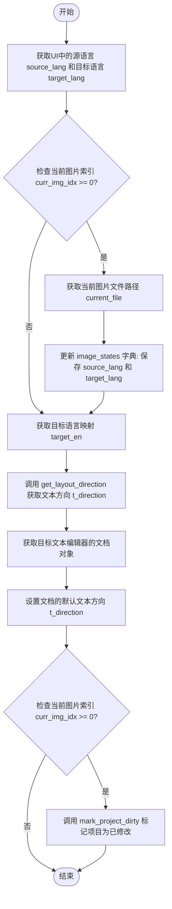

#### 带注释源码

```python
def save_src_trg(self):
    # 获取界面上源语言和目标语言下拉框的当前文本
    source_lang = self.main.s_combo.currentText()
    target_lang = self.main.t_combo.currentText()
    
    # 检查当前是否有图片正在被编辑（索引有效）
    if self.main.curr_img_idx >= 0:
        # 获取当前图片的完整路径
        current_file = self.main.image_files[self.main.curr_img_idx]
        
        # 将语言设置保存到该图片的状态字典中，以便持久化或后续读取
        self.main.image_states[current_file]['source_lang'] = source_lang
        self.main.image_states[current_file]['target_lang'] = target_lang

    # 通过语言映射获取目标语言的英文缩写（如 'en', 'ja'）
    target_en = self.main.lang_mapping.get(target_lang, None)
    
    # 根据目标语言获取对应的文本排版方向（从左到右或从右到左）
    t_direction = get_layout_direction(target_en)
    
    # 获取目标语言文本编辑器的文档对象
    t_text_option = self.main.t_text_edit.document().defaultTextOption()
    
    # 设置文档的文本排版方向
    t_text_option.setTextDirection(t_direction)
    
    # 将修改后的排版设置应用回文档
    self.main.t_text_edit.document().setDefaultTextOption(t_text_option)

    # 如果当前有图片加载，再次检查索引以标记项目为脏（需要保存）
    if self.main.curr_img_idx >= 0:
        self.main.mark_project_dirty()
```

#### 潜在的技术债务或优化空间

1.  **重复的条件判断**：代码中两次判断了 `self.main.curr_img_idx >= 0`（一次用于保存状态，一次用于标记脏数据）。虽然逻辑上是先尝试保存再尝试标记，但可以提取为一个变量 `is_image_loaded` 来使代码更清晰，避免潜在的索引越界风险（尽管 `mark_project_dirty` 内部可能也有保护）。
2.  **直接状态操作**：该方法直接读写 `self.main.image_states` 字典。如果后续 `image_states` 的结构发生变化（例如嵌套层级改变），这里需要手动修改，耦合度较高。建议通过专门的 State Manager 或 Controller 方法来封装这些操作。


### `TextController.set_src_trg_all`

该函数用于批量更新项目中所有图像的语言设置。它从界面上的语言选择器获取当前选中的源语言和目标语言，然后遍历项目中的所有图像文件，并将这两个语言参数同步更新到每张图像的状态字典中。最后，如果项目中有图像存在，则标记项目为“脏”状态（已修改），以便提示用户保存。

参数：

-  `self`：`TextController`，表示类的实例本身，包含主控制器引用 `self.main`。

返回值：`None`，该方法直接修改实例状态，不返回任何值。

#### 流程图

```mermaid
flowchart TD
    A([开始]) --> B[获取 UI 中的源语言 source_lang]
    B --> C[获取 UI 中的目标语言 target_lang]
    C --> D{遍历 image_files 列表}
    D -->|对于每个 image_path| E[更新对应图像状态 image_states[image_path] 的语言设置]
    E --> D
    D --> F{检查 image_files 是否为空}
    F -->|否| G[标记项目为已修改 mark_project_dirty]
    F -->|是| H([结束])
    G --> H
```

#### 带注释源码

```python
def set_src_trg_all(self):
    """
    批量设置所有图像的源语言和目标语言。
    """
    # 1. 获取当前 UI 上选中的源语言和目标语言
    source_lang = self.main.s_combo.currentText()
    target_lang = self.main.t_combo.currentText()

    # 2. 遍历项目中的所有图像文件
    for image_path in self.main.image_files:
        # 3. 在图像状态字典中更新对应图像的语言配置
        self.main.image_states[image_path]['source_lang'] = source_lang
        self.main.image_states[image_path]['target_lang'] = target_lang

    # 4. 如果项目中存在图像，则标记项目状态为已修改
    if self.main.image_files:
        self.main.mark_project_dirty()
```


### `TextController.change_all_blocks_size`

该方法负责根据用户输入的差值（diff）统一修改当前页面中所有文本块（TextBlock）的大小。它采用了**命令模式（Command Pattern）**来实现撤销/重做功能，如果当前有激活的撤销栈，则将操作压入栈中；如果没有激活的撤销栈（例如在某些只读模式下），则直接执行并标记项目为脏（dirty）。

参数：

-  `diff`：`int`，表示字体大小的增量（delta），可以是正数（放大）或负数（缩小）。

返回值：`None`，该方法不返回任何值。

#### 流程图

```mermaid
flowchart TD
    A([开始 change_all_blocks_size]) --> B{检查 blk_list 是否为空}
    B -- 是 --> C([直接返回，不做任何操作])
    B -- 否 --> D[创建 ResizeBlocksCommand 实例]
    D --> E{获取当前激活的 Undo Stack}
    E -- 有 Stack --> F[将命令 Push 到 Stack]
    E -- 无 Stack --> G[直接执行 command.redo()]
    F --> H([结束])
    G --> I[调用 main.mark_project_dirty 标记项目已修改])
    I --> H
```

#### 带注释源码

```python
def change_all_blocks_size(self, diff: int):
    """
    统一修改所有文本块的字体大小。

    参数:
        diff (int): 字体大小变化的增量，正值增加字体大小，负值减小。
    """
    # 1. 边界检查：如果当前没有文本块，则直接退出，避免无效操作
    if len(self.main.blk_list) == 0:
        return

    # 2. 创建命令对象
    # ResizeBlocksCommand 封装了具体的缩放逻辑和逆操作（撤销）
    command = ResizeBlocksCommand(self.main, self.main.blk_list, diff)

    # 3. 获取当前活动的撤销栈
    # 在编辑模式下通常存在，在某些只读或渲染模式下可能为 None
    stack = self.main.undo_group.activeStack()

    # 4. 根据栈的存在性决定执行方式
    if stack:
        # 如果有撤销栈，将命令推入栈中，等待用户触发撤销/重做
        stack.push(command)
    else:
        # 如果没有撤销栈（例如处于后台渲染或特定工具模式），直接执行命令
        command.redo()
        # 并标记项目状态为已修改（dirty），以提示用户保存
        self.main.mark_project_dirty()
```


### `TextController._find_text_block_for_item`

该方法负责建立GUI界面元素（`TextBlockItem`）与底层数据模型（`TextBlock`）之间的关联。它通过比较文本项的坐标（x, y）和旋转角度（rotation），在当前图像对应的 `blk_list` 中寻找最匹配的文本块数据对象。如果找不到匹配项，则返回 `None`。

参数：

- `text_item`：`TextBlockItem`，用户在画布上选中或正在操作的文本项实例。

返回值：`TextBlock | None`，返回匹配到的底层数据模型 `TextBlock`，如果位置和角度均不匹配则返回 `None`。

#### 流程图

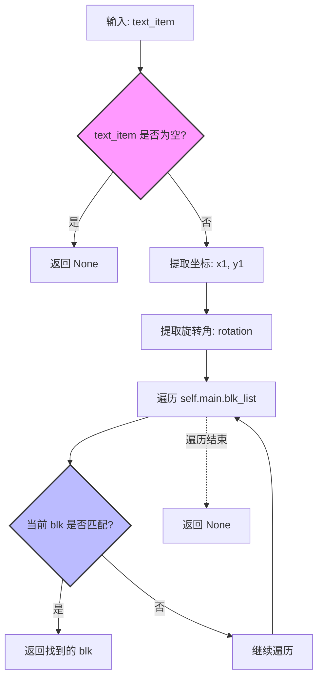

#### 带注释源码

```python
def _find_text_block_for_item(self, text_item: TextBlockItem) -> TextBlock | None:
    """
    根据 TextBlockItem 的位置和旋转角度，在 blk_list 中查找对应的 TextBlock。
    
    参数:
        text_item (TextBlockItem): 图形界面上的文本项。
        
    返回:
        TextBlock | None: 匹配的数据模型对象，如果未找到则返回 None。
    """
    # 1. 参数校验：如果传入的 text_item 为空，直接返回 None，避免后续操作崩溃
    if not text_item:
        return None

    # 2. 从 GUI 对象中提取关键属性：位置 (x, y) 和 旋转角度 (rotation)
    # 使用 int() 取整，因为像素坐标通常为整数
    x1, y1 = int(text_item.pos().x()), int(text_item.pos().y())
    rotation = text_item.rotation()

    # 3. 核心查找逻辑：使用生成器表达式遍历列表
    # 利用 next() 获取第一个满足条件的元素，
    # is_close 函数用于处理浮点数比较和容差（例如位置相差5像素以内，角度相差1度以内）
    return next(
        (
            blk for blk in self.main.blk_list
            # 检查 X 坐标是否接近 (容差 5)
            if is_close(blk.xyxy[0], x1, 5)
            # 检查 Y 坐标是否接近 (容差 5)
            and is_close(blk.xyxy[1], y1, 5)
            # 检查旋转角度是否接近 (容差 1)
            and is_close(blk.angle, rotation, 1)
        ),
        None # 如果遍历完毕没有找到，则返回 None
    )
```


### `TextController._schedule_text_change_command`

该方法负责**延迟提交（Debounce）文本更改命令**。当文本项的内容发生变化时，不会立即生成撤销命令，而是先将更改暂存到 `_pending_text_command` 中，并启动一个单次触发的计时器（400ms）。如果用户在计时结束前再次修改，则会更新暂存的命令，从而将多次快速修改合并为一条撤销记录。

参数：

- `self`：`TextController`，控制器实例本身。
- `text_item`：`TextBlockItem`，发生文本变化的 Qt 文本项对象。
- `new_text`：`str`，文本项的新内容。
- `blk`：`TextBlock | None`，与该文本项对应的后端数据块（包含翻译等状态），如果不存在则为 `None`。

返回值：`None`，该方法不返回值，仅通过副作用（更新内部状态和启动计时器）运作。

#### 流程图

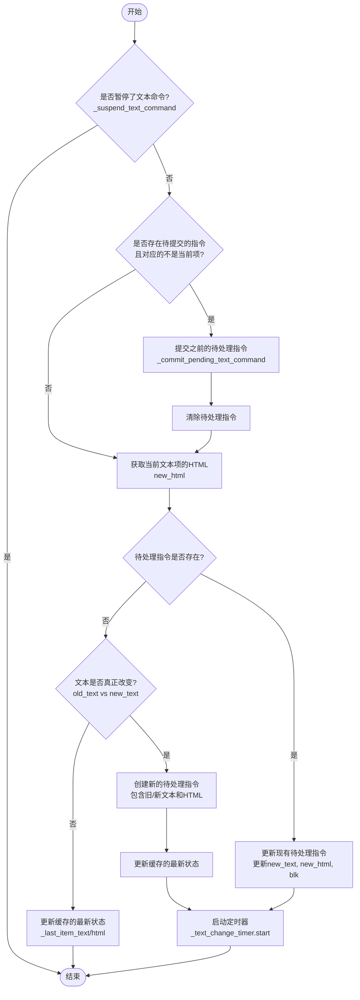

#### 带注释源码

```python
def _schedule_text_change_command(self, text_item: TextBlockItem, new_text: str, blk: TextBlock | None):
    # 1. 检查是否暂停了文本命令（例如在从命令回放文本时）
    if self._suspend_text_command:
        return

    # 2. 处理待提交命令：如果已有待处理命令且其对应的文本项不是当前项，
    # 则先提交之前的命令，避免丢失之前的编辑。
    pending = self._pending_text_command
    if pending and pending['item'] is not text_item:
        self._commit_pending_text_command()
        pending = None

    # 3. 获取文本项当前的 HTML（用于保存富文本格式状态）
    new_html = text_item.document().toHtml()

    # 4. 如果当前没有待处理的命令（pending is None）
    if pending is None:
        # 获取该文本项上次的文本和HTML状态
        old_text = self._last_item_text.get(text_item, new_text)
        old_html = self._last_item_html.get(text_item, new_html)

        # 如果文本实际上没有变化，则不生成命令，只更新缓存并返回
        if old_text == new_text:
            self._last_item_text[text_item] = new_text
            self._last_item_html[text_item] = new_html
            return
        
        # 如果文本确实改变了，创建新的待处理命令对象
        pending = {
            'item': text_item,
            'old_text': old_text,
            'new_text': new_text,
            'old_html': old_html,
            'new_html': new_html,
            'blk': blk,
        }
        self._pending_text_command = pending
    else:
        # 如果已有待处理命令（Debounce 情况），则只更新其中的新文本内容
        pending['new_text'] = new_text
        pending['new_html'] = new_html
        pending['blk'] = blk

    # 5. 更新该文本项的最后已知状态
    self._last_item_text[text_item] = new_text
    self._last_item_html[text_item] = new_html
    
    # 6. 启动计时器，400毫秒后如果用户没有进一步操作，则提交命令
    self._text_change_timer.start()
```


### `TextController._commit_pending_text_command`

该方法用于提交（Commit）累积的文本更改。当用户在文本编辑框中停止输入一定时间（由 `_text_change_timer` 设置，通常为 400ms）后，定时器会触发此方法。它负责将之前的文本状态（旧文本）和当前状态（新文本）封装为一个 `TextEditCommand` 命令对象，并将其推入撤销栈（Undo Stack），从而支持撤销/重做功能。如果当前没有活动的撤销栈（例如在某些只读或特殊模式下），则直接执行命令并将项目标记为已修改。

参数：

-  `self`：`TextController`，表示该方法的调用者实例，包含了文本编辑的状态控制器逻辑。

返回值：`None`，该方法不返回任何值，主要执行副作用（修改数据模型和UI状态）。

#### 流程图

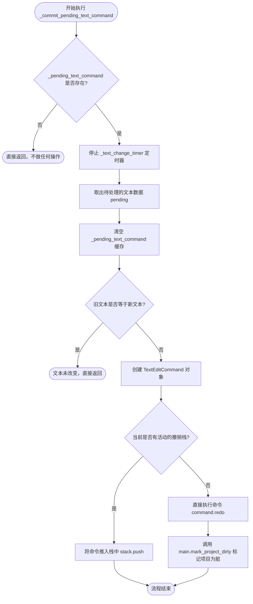

#### 带注释源码

```python
def _commit_pending_text_command(self):
    """
    提交待处理的文本命令。
    当定时器超时时调用，将累积的文本更改封装为命令并推入撤销栈。
    """
    # 1. 检查是否存在待处理的文本命令，如果没有则直接返回
    if not self._pending_text_command:
        return
    
    # 2. 停止定时器，防止在处理过程中再次触发或重复处理
    self._text_change_timer.stop()
    
    # 3. 取出待处理的命令数据（包含旧文本、新文本、关联的文本块等）
    pending = self._pending_text_command
    # 4. 立即清空待处理命令，防止数据残留
    self._pending_text_command = None

    # 5. 如果文本没有实际变化（例如在编辑中反复设置为相同内容），则不生成命令
    if pending['old_text'] == pending['new_text']:
        return

    # 6. 构造 TextEditCommand 命令对象
    # 该命令封装了旧文本与新文本的差异，用于支持撤销/重做
    command = TextEditCommand(
        self.main,
        pending['item'],         # 关联的 TextBlockItem (UI元素)
        pending['old_text'],     # 修改前的文本
        pending['new_text'],     # 修改后的文本
        old_html=pending.get('old_html'),
        new_html=pending.get('new_html'),
        blk=pending['blk']       # 关联的底层数据块 TextBlock
    )
    
    # 7. 获取当前活动的撤销栈
    stack = self.main.undo_group.activeStack()
    if stack:
        # 如果存在撤销栈（例如在正常编辑模式下），将命令推入栈
        # 用户可以通过 Ctrl+Z 撤销此次修改
        stack.push(command)
    else:
        # 如果没有撤销栈（例如在某些自动处理或只读流程中），
        # 直接执行命令以确保数据同步，并标记项目已修改
        command.redo()
        self.main.mark_project_dirty()
```


### `TextController.apply_text_from_command`

该方法用于在执行命令（如撤销/重做）时，将文本内容应用到界面的文本项、底层数据模型以及UI编辑框中，确保命令执行后的状态一致性。

参数：

- `self`：`TextController`，方法的拥有者
- `text_item`：`TextBlockItem`，需要应用文本的可视化文本项对象
- `text`：`str`，要应用的纯文本内容
- `html`：`str | None`，可选的HTML格式文本，若提供则优先使用
- `blk`：`TextBlock | None`，可选的底层文本块数据模型，若不提供则根据text_item查找

返回值：`None`，该方法无返回值

#### 流程图

```mermaid
flowchart TD
    A[开始 apply_text_from_command] --> B[设置 _suspend_text_command = True]
    B --> C{检查 text_item 是否有效且在场景中}
    C -->|是| D{html 参数是否提供}
    C -->|否| E[跳过更新 text_item]
    D -->|是| F{当前HTML与新HTML是否不同}
    F -->|是| G[设置 document().setHtml(html)]
    F -->|否| H[不更新HTML]
    D -->|否| I{纯文本是否不同}
    I -->|是| J[调用 set_plain_text(text)]
    I -->|否| K[不更新纯文本]
    G --> L
    H --> L
    J --> L
    K --> L
    L{检查 blk 是否为 None}
    L -->|是| M[调用 _find_text_block_for_item 查找blk]
    L -->|否| N[直接使用 blk]
    M --> O
    N --> O
    O{检查 blk 是否存在}
    O -->|是| P[更新 blk.translation = text]
    O -->|否| Q[跳过更新 blk]
    P --> R{检查 curr_tblock_item == text_item}
    Q --> R
    R -->|是| S{编辑框文本是否与text不同}
    R -->|否| T[跳过更新编辑框]
    S -->|是| U[阻塞编辑框信号]
    S -->|否| V[不更新编辑框]
    U --> W[设置编辑框纯文本]
    W --> X[解除阻塞编辑框信号]
    X --> Y
    V --> Y
    T --> Y
    Y[设置 _suspend_text_command = False]
    Y --> Z[更新 _last_item_text 和 _last_item_html 缓存]
    Z --> AA[结束]
```

#### 带注释源码

```python
def apply_text_from_command(self, text_item: TextBlockItem, text: str,
                            html: str | None = None, blk: TextBlock | None = None):
    """
    在执行命令（如撤销/重做）时应用文本内容到界面和数据模型
    
    参数:
        text_item: 可视化文本项对象
        text: 纯文本内容
        html: 可选的HTML格式文本
        blk: 可选的底层TextBlock数据模型
    """
    # 挂起文本命令，防止在应用过程中触发额外的文本变更命令
    self._suspend_text_command = True
    try:
        # 检查text_item是否有效且在场景中
        if text_item and text_item in self.main.image_viewer._scene.items():
            # 如果提供了html参数，优先使用html更新
            if html is not None:
                if text_item.document().toHtml() != html:
                    text_item.document().setHtml(html)
            # 否则使用纯文本更新
            elif text_item.toPlainText() != text:
                text_item.set_plain_text(text)
        
        # 如果没有提供blk，则根据text_item查找对应的blk
        if blk is None:
            blk = self._find_text_block_for_item(text_item)
        
        # 更新底层数据模型的翻译内容
        if blk:
            blk.translation = text
        
        # 如果当前选中的文本项就是text_item，则同步更新UI编辑框
        if self.main.curr_tblock_item == text_item:
            self.main.curr_tblock = blk
            # Only update if the text is actually different to avoid cursor reset
            # 只有文本实际不同时才更新，避免光标重置
            if self.main.t_text_edit.toPlainText() != text:
                self.main.t_text_edit.blockSignals(True)
                self.main.t_text_edit.setPlainText(text)
                self.main.t_text_edit.blockSignals(False)
    finally:
        # 无论是否发生异常，都恢复文本命令处理
        self._suspend_text_command = False
    
    # 更新缓存的文本和HTML，用于后续的变更检测
    if text_item:
        self._last_item_text[text_item] = text
        self._last_item_html[text_item] = text_item.document().toHtml()
```


### `TextController.on_font_dropdown_change`

该方法用于响应UI中字体下拉菜单的变化。当用户选择新字体时，它会获取当前选中的文本块，提取当前的字体大小，将新的字体族（Family）应用于该文本块，并创建一个格式更改命令以便撤销/重做。

参数：

- `font_family`：`str`，用户从字体下拉菜单中选定的字体名称（例如 "Arial", "SimSun"）。

返回值：`None`，该方法通过修改应用程序状态和命令栈来生效，不返回具体数据。

#### 流程图

```mermaid
flowchart TD
    A([方法入口]) --> B{检查 curr_tblock_item 是否存在且 font_family 有效?}
    B -- 否 --> C([结束])
    B -- 是 --> D[获取当前字体大小: int(font_size_dropdown.currentText())]
    D --> E[复制当前文本项状态为 old_item]
    E --> F[调用 curr_tblock_item.set_font 应用的字体更改]
    F --> G[实例化 TextFormatCommand 封装更改]
    G --> H[调用 main.push_command 添加到命令栈]
    H --> C
```

#### 带注释源码

```python
def on_font_dropdown_change(self, font_family: str):
    """
    处理字体下拉菜单更改事件。
    """
    # 检查是否有当前选中的文本块以及字体名称是否有效
    if self.main.curr_tblock_item and font_family:
        # 使用浅拷贝保存当前文本项的状态（旧状态），用于撤销功能
        old_item = copy.copy(self.main.curr_tblock_item)
        
        # 从UI的字体大小下拉框获取当前选中的字体大小
        font_size = int(self.main.font_size_dropdown.currentText())
        
        # 调用文本项的set_font方法，将新字体和新大小应用到界面上
        self.main.curr_tblock_item.set_font(font_family, font_size)

        # 创建一个格式命令对象，记录从旧状态到新状态的变化
        command = TextFormatCommand(self.main.image_viewer, old_item, self.main.curr_tblock_item)
        
        # 将该命令推入主控制器的命令栈，以支持撤销(Undo)和重做(Redo)
        self.main.push_command(command)
```


### `TextController.on_font_size_change`

当用户在UI的字体大小下拉框中选择新的字体大小时，该方法会被触发。它会获取当前选中的文本块项，保存其旧状态，然后将字体大小更新为新值，最后通过命令模式将此次更改封装为`TextFormatCommand`并推入命令栈，从而支持撤销/重做功能。

参数：

- `font_size`：`str`，从字体大小下拉菜单获取的字符串值（如 "12", "14" 等）

返回值：`None`，该方法不返回任何值，仅执行副作用操作

#### 流程图

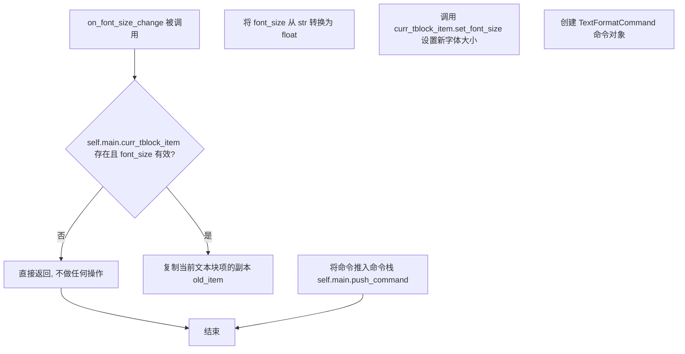

#### 带注释源码

```python
def on_font_size_change(self, font_size: str):
    """
    处理字体大小变化的回调函数。
    当用户从字体大小下拉菜单中选择新的大小时，此方法会被调用。
    它使用命令模式将字体大小更改封装为可撤销的操作。
    
    参数:
        font_size: str - 从UI字体大小下拉框获取的新字体大小值（字符串形式）
    返回:
        None
    """
    # 检查当前是否有选中的文本块项目，以及 font_size 参数是否有效
    if self.main.curr_tblock_item and font_size:
        # 深拷贝当前文本块项的副本，用于记录更改前的状态
        # 这样可以在撤销操作时恢复原始属性
        old_item = copy.copy(self.main.curr_tblock_item)
        
        # 将字符串格式的字体大小转换为浮点数
        font_size = float(font_size)
        
        # 调用文本块项的方法来更新其字体大小属性
        self.main.curr_tblock_item.set_font_size(font_size)

        # 创建格式化命令对象，记录旧状态和新状态
        # TextFormatCommand 会比较 old_item 和 curr_tblock_item 的差异
        command = TextFormatCommand(
            self.main.image_viewer, 
            old_item, 
            self.main.curr_tblock_item
        )
        
        # 将命令推入主控制器的命令栈，以支持撤销/重做功能
        self.main.push_command(command)
```


### `TextController.on_line_spacing_change`

当用户在界面中更改行间距设置时，此方法会被触发。它获取新的行间距值，将其转换为浮点数，应用到当前选中的文本块上，并创建一个可撤销的命令以记录此次更改。

参数：

- `line_spacing`：`str`，行间距值，通常为字符串形式的数字（如 "1.5"、"2.0"）

返回值：`None`，无返回值

#### 流程图

```mermaid
flowchart TD
    A[开始 on_line_spacing_change] --> B{检查 curr_tblock_item 和 line_spacing 是否有效}
    B -->|无效| Z[结束]
    B -->|有效| C[复制当前文本项状态为 old_item]
    C --> D[将 line_spacing 字符串转换为浮点数]
    D --> E[调用 curr_tblock_item.set_line_spacing 设置新行间距]
    E --> F[创建 TextFormatCommand 命令对象]
    F --> G[将命令推送到命令栈]
    G --> Z
```

#### 带注释源码

```python
def on_line_spacing_change(self, line_spacing: str):
    """
    处理行间距变化的槽函数。
    当用户通过UI更改行间距时调用此方法。
    
    Args:
        line_spacing: str，新的行间距值（字符串形式）
    """
    # 检查是否有当前选中的文本块以及行间距值是否有效
    if self.main.curr_tblock_item and line_spacing:
        # 复制当前文本项的深拷贝，用于命令的旧状态记录
        old_item = copy.copy(self.main.curr_tblock_item)
        
        # 将字符串形式的行间距转换为浮点数
        spacing = float(line_spacing)
        
        # 调用文本块的set_line_spacing方法更新行间距
        self.main.curr_tblock_item.set_line_spacing(spacing)

        # 创建格式化命令对象，记录从旧状态到新状态的变化
        command = TextFormatCommand(
            self.main.image_viewer, 
            old_item, 
            self.main.curr_tblock_item
        )
        
        # 将命令推送到命令栈，以支持撤销/重做功能
        self.main.push_command(command)
```


### `TextController.on_font_color_change`

该方法响应字体颜色变更事件，获取用户选择的颜色，更新界面按钮样式，并在存在当前文本块时，将其颜色属性设置为新颜色，同时将该操作封装为可撤销命令以支持撤销/重做功能。

参数：此方法无显式参数（隐式参数 `self` 为 `TextController` 实例）。

返回值：`None`（无返回值）。

#### 流程图

```mermaid
flowchart TD
    A[开始 on_font_color_change] --> B{获取颜色}
    B --> C[font_color = self.main.get_color]
    C --> D{颜色有效性检查}
    D -->|无效| K[结束]
    D -->|有效| E[更新按钮样式]
    E --> F[设置背景色为font_color.name]
    F --> G[设置selected_color属性]
    G --> H{是否存在当前文本块}
    H -->|否| K
    H -->|是| I[复制旧文本块]
    I --> J[设置新颜色到文本块]
    J --> L[创建TextFormatCommand]
    L --> M[推入命令栈]
    M --> K
```

#### 带注释源码

```python
def on_font_color_change(self):
    """
    处理字体颜色变更事件。
    当用户从颜色选择器选择新颜色时，应用于当前选中的文本块。
    """
    # 从主控制器获取用户选择的颜色对象
    font_color = self.main.get_color()
    
    # 检查颜色是否有效（有效指颜色值合法且可显示）
    if font_color and font_color.isValid():
        # 更新UI按钮的样式表，以可视化方式显示当前选中的颜色
        self.main.block_font_color_button.setStyleSheet(
            f"background-color: {font_color.name()}; border: none; border-radius: 5px;"
        )
        # 将选中的颜色值存储为按钮的Qt属性，供后续操作使用
        self.main.block_font_color_button.setProperty('selected_color', font_color.name())
        
        # 仅当存在当前选中的文本块时，才执行颜色应用逻辑
        if self.main.curr_tblock_item:
            # 复制当前文本块的状态作为"旧"状态，用于命令模式记录变更前后差异
            old_item = copy.copy(self.main.curr_tblock_item)
            
            # 调用文本块自身的方法设置新的字体颜色
            self.main.curr_tblock_item.set_color(font_color)

            # 创建格式变更命令，封装旧状态和新状态之间的差异
            command = TextFormatCommand(self.main.image_viewer, old_item, self.main.curr_tblock_item)
            
            # 将命令推入命令栈，实现撤销/重做功能
            self.main.push_command(command)
```


### `TextController.left_align`

该方法用于将当前选中的文本块项设置为左对齐，并通过命令模式记录此操作以支持撤销/重做功能。

参数：

- `self`：`TextController`，表示 `TextController` 类的实例方法，隐含参数

返回值：`None`，无返回值描述

#### 流程图

```mermaid
flowchart TD
    A[开始 left_align] --> B{检查 curr_tblock_item 是否存在}
    B -->|否| C[直接返回，不执行任何操作]
    B -->|是| D[复制当前文本块项的副本 old_item]
    E[调用 set_alignment 设置左对齐] --> F[创建 TextFormatCommand 命令对象]
    F --> G[调用 push_command 将命令推送到命令栈]
    G --> H[结束]
```

#### 带注释源码

```python
def left_align(self):
    """
    将当前选中的文本块项设置为左对齐。
    使用命令模式记录操作以支持撤销/重做功能。
    """
    # 检查是否存在当前选中的文本块项目
    if self.main.curr_tblock_item:
        # 复制当前文本块项的浅拷贝，保存操作前的状态
        old_item = copy.copy(self.main.curr_tblock_item)
        
        # 调用文本块项的 set_alignment 方法，设置左对齐标志
        self.main.curr_tblock_item.set_alignment(QtCore.Qt.AlignmentFlag.AlignLeft)

        # 创建文本格式命令对象，封装旧状态和新状态
        command = TextFormatCommand(self.main.image_viewer, old_item, self.main.curr_tblock_item)
        
        # 将命令推送到主控制器的命令栈，支持撤销/重做
        self.main.push_command(command)
```


### `TextController.center_align`

将当前选中的文本块项目设置为居中对齐（AlignCenter），并通过命令模式记录该操作以便支持撤销功能。

参数：

- `self`：实例方法，无额外参数

返回值：`None`，该方法直接修改对象状态，不返回任何值。

#### 流程图

```mermaid
flowchart TD
    A[开始 center_align] --> B{检查 curr_tblock_item 是否存在}
    B -->|不存在| C[直接返回, 不执行任何操作]
    B -->|存在| D[深拷贝当前文本块项目状态为 old_item]
    D --> E[调用 set_alignment 设置对齐方式为 AlignCenter]
    E --> F[创建 TextFormatCommand 命令对象]
    F --> G[将命令推送到命令栈]
    G --> H[结束]
```

#### 带注释源码

```python
def center_align(self):
    """
    将当前选中的文本块项目设置为居中对齐。
    使用命令模式记录操作以支持撤销功能。
    """
    # 检查是否存在当前选中的文本块项目
    if self.main.curr_tblock_item:
        # 深拷贝当前文本块项目的状态，用于后续命令的历史记录
        old_item = copy.copy(self.main.curr_tblock_item)
        
        # 设置当前文本块项目为居中对齐
        self.main.curr_tblock_item.set_alignment(QtCore.Qt.AlignmentFlag.AlignCenter)

        # 创建文本格式命令，记录格式变更以便撤销
        command = TextFormatCommand(self.main.image_viewer, old_item, self.main.curr_tblock_item)
        
        # 将命令推送到命令栈执行
        self.main.push_command(command)
```


### `TextController.right_align`

该方法是文本对齐功能的一部分，当用户在界面中点击“右对齐”按钮时触发。它负责将当前选中的文本块（`curr_tblock_item`）的对齐方式设置为右对齐，并利用**命令模式（Command Pattern）**将此次修改封装为可撤销的命令，以便支持撤销（Undo）和重做（Redo）操作。

参数：

-  `self`：`TextController`，表示 TextController 类的实例本身，用于访问控制器的主窗口对象 (`self.main`) 和当前选中的文本项。

返回值：`None`，该方法不返回任何值，仅执行状态修改和命令注册。

#### 流程图

```mermaid
flowchart TD
    A([开始]) --> B{检查 curr_tblock_item 是否存在}
    B -- 否 (None) --> C([结束 - 不执行任何操作])
    B -- 是 --> D[复制当前文本项状态 old_item]
    D --> E[调用 set_alignment 设置为右对齐]
    E --> F[创建 TextFormatCommand 命令对象]
    F --> G[将命令推入主程序命令栈 push_command]
    G --> C
```

#### 带注释源码

```python
def right_align(self):
    """
    将当前选中的文本块右对齐。
    """
    # 检查是否存在当前选中的文本项（TextBlockItem）
    if self.main.curr_tblock_item:
        # 1. 备份当前文本项的状态（用于撤销）
        # 使用 copy 模块创建浅拷贝，保留修改前的属性
        old_item = copy.copy(self.main.curr_tblock_item)
        
        # 2. 修改文本项的对齐方式为右对齐
        # QtCore.Qt.AlignmentFlag.AlignRight 是 Qt 的枚举值
        self.main.curr_tblock_item.set_alignment(QtCore.Qt.AlignmentFlag.AlignRight)

        # 3. 创建格式命令
        # TextFormatCommand 封装了"格式化文本"这一操作，包含修改前后的状态
        command = TextFormatCommand(self.main.image_viewer, old_item, self.main.curr_tblock_item)
        
        # 4. 执行命令并加入命令栈
        # 这样用户可以通过 Ctrl+Z 撤销这次对齐操作
        self.main.push_command(command)
```


### `TextController.bold`

该方法用于切换当前选中文本块的粗体格式。它获取粗体按钮的选中状态，将其应用到当前文本块，并创建相应的格式化命令以支持撤销/重做功能。

参数： 无（仅包含隐式参数 `self`）

返回值：`None`，该方法不返回任何值

#### 流程图

```mermaid
flowchart TD
    A[开始 bold 方法] --> B{检查 curr_tblock_item 是否存在}
    B -->|不存在| C[直接返回，不执行任何操作]
    B -->|存在| D[复制当前文本块为 old_item]
    D --> E[获取 bold_button 的当前选中状态]
    E --> F[调用 set_bold 设置文本块粗体状态]
    F --> G[创建 TextFormatCommand 命令对象]
    G --> H[调用 push_command 将命令推入命令栈]
    H --> I[结束方法]
```

#### 带注释源码

```python
def bold(self):
    """
    切换当前选中文本块的粗体格式。
    使用命令模式记录操作以支持撤销/重做功能。
    """
    # 检查是否有当前选中的文本块
    if self.main.curr_tblock_item:
        # 使用深复制保存文本块的旧状态，用于撤销功能
        old_item = copy.copy(self.main.curr_tblock_item)
        
        # 获取粗体按钮的当前选中状态（True为加粗，False为正常）
        state = self.main.bold_button.isChecked()
        
        # 调用文本块的set_bold方法实际修改粗体属性
        self.main.curr_tblock_item.set_bold(state)

        # 创建格式化命令，记录从旧状态到新状态的变化
        command = TextFormatCommand(
            self.main.image_viewer,  # 图像查看器实例
            old_item,                # 修改前的文本块状态
            self.main.curr_tblock_item  # 修改后的文本块状态
        )
        
        # 将命令推入命令栈，实现撤销/重做支持
        self.main.push_command(command)
```


### `TextController.italic`

该方法负责处理用户界面中“斜体（Italic）”按钮的点击事件。当用户点击斜体按钮时，此方法会被触发，它会获取当前选中的文本块项目（TextBlockItem），根据按钮状态切换其斜体属性，并创建一个可撤销的命令（Command）以支持撤销/重做操作。

参数：

- `self`：`TextController`，控制器的实例方法，表示当前对象本身。

返回值：`None`，该方法不返回任何值，主要通过副作用（修改UI状态和命令栈）生效。

#### 流程图

```mermaid
graph TD
    A([开始]) --> B{检查 curr_tblock_item 是否存在}
    B -- 否 --> C([结束])
    B -- 是 --> D[复制当前文本项为 old_item]
    D --> E[获取 italic_button 的选中状态 state]
    E --> F[调用 curr_tblock_item.set_italic(state) 应用样式]
    F --> G[实例化 TextFormatCommand]
    G --> H[调用 main.push_command 推入命令栈]
    H --> C
```

#### 带注释源码

```python
def italic(self):
    # 检查是否有文本块被选中
    if self.main.curr_tblock_item:
        # 为了支持撤销功能，先保存修改前的状态（深拷贝对象）
        old_item = copy.copy(self.main.curr_tblock_item)
        
        # 从 UI 控件获取用户点击的斜体状态（True 为选中，False 为未选中）
        state = self.main.italic_button.isChecked()
        
        # 在数据模型/视图对象上应用新的斜体样式
        self.main.curr_tblock_item.set_italic(state)

        # 创建格式命令对象，记录修改前后的状态，用于撤销/重做
        command = TextFormatCommand(self.main.image_viewer, old_item, self.main.curr_tblock_item)
        
        # 将命令压入命令栈，交由主程序统一管理撤销/重做
        self.main.push_command(command)
```


### `TextController.underline`

该方法用于处理文本项的下划线格式化操作。当用户点击下划线按钮时，复制当前文本项的旧状态，获取按钮的选中状态，调用文本项的设置方法更新下划线属性，并创建相应的命令以便支持撤销操作。

参数：
- `self`：`TextController`，隐式参数，表示当前 TextController 实例本身

返回值：`None`，无返回值，该方法执行副作用（修改文本项格式并推送到命令栈）

#### 流程图

```mermaid
flowchart TD
    A[开始] --> B{self.main.curr_tblock_item 是否存在}
    B -->|否| C[直接返回]
    B -->|是| D[复制当前文本项为 old_item]
    E[获取下划线按钮状态: state = self.main.underline_button.isChecked]
    D --> E
    E --> F[调用 self.main.curr_tblock_item.set_underline(state)]
    F --> G[创建 TextFormatCommand 命令]
    G --> H[执行 self.main.push_command(command)]
    H --> I[结束]
    C --> I
```

#### 带注释源码

```
def underline(self):
    """
    处理文本项的下划线格式化。
    当用户点击下划线按钮时，更新当前选中文本项的下划线样式，
    并将此次修改封装为命令以支持撤销/重做功能。
    """
    # 检查是否存在当前选中的文本项
    if self.main.curr_tblock_item:
        # 复制当前文本项的副本，用于记录修改前的状态
        old_item = copy.copy(self.main.curr_tblock_item)
        
        # 获取下划线按钮的当前选中状态（True为启用，False为禁用）
        state = self.main.underline_button.isChecked()
        
        # 调用文本项的set_underline方法更新下划线属性
        self.main.curr_tblock_item.set_underline(state)

        # 创建文本格式命令，记录修改前后的状态
        command = TextFormatCommand(
            self.main.image_viewer,  # 图像查看器实例
            old_item,                # 修改前的文本项状态
            self.main.curr_tblock_item  # 修改后的文本项状态
        )
        
        # 将命令推送到命令栈，支持撤销/重做
        self.main.push_command(command)
```


### `TextController.on_outline_color_change`

当用户更改文本轮廓颜色时调用此方法。它获取用户通过颜色选择器选取的颜色，更新界面按钮的视觉样式（显示所选颜色），并在满足条件（当前选中了文本块且启用了轮廓显示）时，将新的轮廓颜色和宽度应用到选中的文本项目上，同时创建并推送一个撤销命令以记录此次修改。

参数：
- `self`：`TextController`，表示 `TextController` 类的实例本身。

返回值：`None`，该方法执行副作用但不返回值。

#### 流程图

```mermaid
flowchart TD
    A([开始]) --> B[获取颜色: outline_color = self.main.get_color]
    B --> C{outline_color 是否有效且非空?}
    C -- 否 --> D([结束])
    C -- 是 --> E[更新按钮样式与属性]
    E --> F[获取轮廓宽度: outline_width]
    F --> G{是否选中文本项且轮廓复选框已勾选?}
    G -- 否 --> D
    G -- 是 --> H[深拷贝当前文本项状态]
    H --> I[应用新轮廓样式: set_outline]
    I --> J[创建格式命令: TextFormatCommand]
    J --> K[推送命令至栈: push_command]
    K --> D
```

#### 带注释源码

```python
def on_outline_color_change(self):
    """
    处理轮廓颜色变更事件。
    1. 获取用户选择的颜色。
    2. 如果颜色有效，则更新UI按钮样式。
    3. 如果当前有选中的文本块且轮廓功能开启，则应用新样式并记录命令。
    """
    # 1. 从主控制器获取用户选择的颜色对象
    outline_color = self.main.get_color()
    
    # 2. 检查颜色是否有效（有效指颜色值合法）
    if outline_color and outline_color.isValid():
        # 3. 更新轮廓颜色按钮的CSS样式，使其在界面上显示所选颜色
        self.main.outline_font_color_button.setStyleSheet(
            f"background-color: {outline_color.name()}; border: none; border-radius: 5px;"
        )
        # 4. 将颜色值保存为按钮的属性，供后续读取使用
        self.main.outline_font_color_button.setProperty('selected_color', outline_color.name())
        
        # 5. 从下拉框获取当前的轮廓宽度数值
        outline_width = float(self.main.outline_width_dropdown.currentText())

        # 6. 判断是否满足应用样式的条件：
        #    - 当前必须有选中的文本块 (curr_tblock_item)
        #    - 轮廓功能必须被勾选启用 (outline_checkbox)
        if self.main.curr_tblock_item and self.main.outline_checkbox.isChecked():
            # 7. 在修改文本块属性前，深拷贝其当前状态（用于生成撤销命令）
            old_item = copy.copy(self.main.curr_tblock_item)
            
            # 8. 调用文本块的接口，应用新的轮廓颜色和宽度
            self.main.curr_tblock_item.set_outline(outline_color, outline_width)

            # 9. 创建格式命令，记录修改前后的状态差异
            command = TextFormatCommand(self.main.image_viewer, old_item, self.main.curr_tblock_item)
            # 10. 将命令推入命令栈，执行修改并支持撤销/重做
            self.main.push_command(command)
```


### `TextController.on_outline_width_change`

当用户更改轮廓线宽度时，此方法会更新当前文本项目的轮廓线宽度和颜色设置，并将该格式更改操作包装成命令以支持撤销/重做功能。

参数：

- `outline_width`：`float`，用户选择的轮廓线宽度值（但方法内部会从下拉菜单重新获取最新值）

返回值：`None`，无返回值（该方法直接修改对象状态并推送命令）

#### 流程图

```mermaid
graph TD
    A[开始] --> B{检查 curr_tblock_item 存在且 outline_checkbox 已选中?}
    B -->|否| C[直接返回]
    B -->|是| D[复制当前文本项为 old_item]
    E[从 outline_width_dropdown 获取新宽度] --> F[获取 outline_font_color_button 的颜色属性]
    F --> G[创建 QColor 对象]
    G --> H[调用 curr_tblock_item.set_outline 设置轮廓线]
    H --> I[创建 TextFormatCommand]
    I --> J[通过 main.push_command 推送命令]
    J --> K[结束]
```

#### 带注释源码

```python
def on_outline_width_change(self, outline_width):
    """
    处理轮廓线宽度变化的槽函数。
    当用户更改轮廓线宽度时，更新当前文本项目的轮廓线设置。
    
    参数:
        outline_width: 用户选择的轮廓线宽度值（在此方法中会被覆盖）
    """
    # 检查是否有当前选中的文本项目且轮廓线功能已启用
    if self.main.curr_tblock_item and self.main.outline_checkbox.isChecked():
        # 复制当前文本项的深拷贝，用于记录修改前的状态
        old_item = copy.copy(self.main.curr_tblock_item)
        
        # 从UI控件获取最新的轮廓线宽度值
        outline_width = float(self.main.outline_width_dropdown.currentText())
        
        # 获取当前轮廓线颜色（从按钮的属性中读取）
        color_str = self.main.outline_font_color_button.property('selected_color')
        color = QColor(color_str)
        
        # 调用文本项的set_outline方法更新轮廓线样式
        self.main.curr_tblock_item.set_outline(color, outline_width)

        # 创建格式命令以支持撤销/重做功能
        command = TextFormatCommand(self.main.image_viewer, old_item, self.main.curr_tblock_item)
        
        # 将命令推入命令栈
        self.main.push_command(command)
```


### `TextController.toggle_outline_settings`

该方法响应UI中“描边”复选框的切换事件。它根据传入的`state`参数（Qt复选框状态）决定是启用还是禁用当前选中文本块的轮廓线（描边）效果。当启用时，方法会从下拉框和颜色按钮获取最新的描边参数，实时应用到文本渲染上，并利用命令模式（Command Pattern）记录此次修改，以便支持撤销（Undo）和重做（Redo）操作。

#### 参数

- `state`：`int`，Qt复选框的状态标识。通常 `2` 表示选中（Checked），`0` 表示未选中（Unchecked）。

#### 返回值

- `None`，该方法直接修改对象状态或UI，不返回任何值。

#### 流程图

```mermaid
flowchart TD
    A([开始: 接收 state 参数]) --> B{state == 2?}
    
    B -- 是 (启用描边) --> C{当前是否有选中文本项?}
    B -- 否 (禁用描边) --> C
    
    C -- 否 --> D([结束])
    
    C -- 是 --> E{是否禁用?}
    
    E -- 是 --> F[调用 set_outline(None, None) 移除描边]
    F --> D
    
    E -- 否 --> G[记录旧状态 old_item]
    G --> H[获取 UI 中的描边宽度和颜色]
    H --> I[调用 set_outline 应用新样式]
    I --> J[创建 TextFormatCommand 命令对象]
    J --> K[调用 push_command 执行命令]
    K --> D
```

#### 带注释源码

```python
def toggle_outline_settings(self, state):
    """
    切换当前文本项的描边设置。

    参数:
        state (int): Qt Checkbox的状态。
                    2 (Qt.Checked) -> 启用
                    0 (Qt.Unchecked) -> 禁用
    """
    # 将 state 转换为布尔值：2 代表启用，其他代表禁用
    enabled = True if state == 2 else False
    
    # 获取当前界面上选中的文本块项目
    text_item = self.main.curr_tblock_item
    
    # 只有在存在选中项时才执行操作
    if text_item:
        if not enabled:
            # 场景A: 禁用描边
            # 直接调用 set_outline 传入 None 来清除描边效果
            text_item.set_outline(None, None)
        else:
            # 场景B: 启用描边
            
            # 1. 深度复制当前文本项的状态，用于后续生成撤销命令
            old_item = copy.copy(text_item)
            
            # 2. 从UI控件获取描边参数
            # 获取宽度 (例如: "2.0")
            outline_width = float(self.main.outline_width_dropdown.currentText())
            # 获取颜色字符串 (例如: "#000000")
            color_str = self.main.outline_font_color_button.property('selected_color')
            # 转换为 QColor 对象
            color = QColor(color_str)
            
            # 3. 应用新设置到数据模型/视图
            text_item.set_outline(color, outline_width)

            # 4. 封装命令并执行
            # 创建一个格式化命令，记录 (旧状态 -> 新状态) 的变化
            command = TextFormatCommand(self.main.image_viewer, old_item, text_item)
            # 将命令推入主控制器的命令栈（触发undo/redo机制）
            self.main.push_command(command)
```


### `TextController.block_text_item_widgets`

该方法用于在程序化更新文本块属性（如字体、大小、颜色）时，暂时禁用相关 UI 控件的信号响应。其主要目的是防止当控制器根据选中的文本项自动填充 UI 控件（如字体下拉框）时，这些控件的变化触发信号回调，进而导致对文本项的重复或不必要的修改（死循环或竞争条件）。此外，由于 Qt 的 `blockSignals` 方法对某些按钮（如格式刷按钮）存在不稳定性，该方法直接断开这些按钮的信号连接。

参数：

-  `widgets`：`list`，需要阻止信号发射的 Qt 控件列表（通常为字体、大小、颜色等下拉框或按钮）。

返回值：`None`，无返回值。

#### 流程图

```mermaid
flowchart TD
    A([开始 block_text_item_widgets]) --> B{遍历 widgets 列表}
    B -->|对每个 widget| C[调用 widget.blockSignals(True)]
    C --> D[断开 bold_button 的 clicked 信号]
    D --> E[断开 italic_button 的 clicked 信号]
    E --> F[断开 underline_button 的 clicked 信号]
    F --> G[断开 Alignment 工具组按钮的 clicked 信号]
    G --> H([结束])
```

#### 带注释源码

```python
def block_text_item_widgets(self, widgets):
    # Block signals
    # 遍历传入的控件列表，阻止它们发送信号
    # 这防止了在 set_values_for_blk_item 等方法中
    # 动态设置控件值时触发 change 事件
    for widget in widgets:
        widget.blockSignals(True)

    # Block Signals is buggy for these, so use disconnect/connect
    # 对于特定的格式按钮，直接使用 disconnect 更加可靠
    # 断开粗体按钮的点击信号
    self.main.bold_button.clicked.disconnect(self.bold)
    # 断开斜体按钮的点击信号
    self.main.italic_button.clicked.disconnect(self.italic)
    # 断开下划线按钮的点击信号
    self.main.underline_button.clicked.disconnect(self.underline)

    # 断开对齐工具组（居左、居中、居右）的点击信号
    self.main.alignment_tool_group.get_button_group().buttons()[0].clicked.disconnect(self.left_align)
    self.main.alignment_tool_group.get_button_group().buttons()[1].clicked.disconnect(self.center_align)
    self.main.alignment_tool_group.get_button_group().buttons()[2].clicked.disconnect(self.right_align)
```


### `TextController.unblock_text_item_widgets`

该方法用于解除在批量更新文本项目属性时被阻塞的 UI 控件信号，并重新连接格式化和对齐按钮的点击信号，使界面恢复正常交互状态。

参数：

-  `widgets`：`List[QWidget]`，需要解除信号阻塞的 Qt 控件列表，通常为字体、大小、颜色等下拉框和按钮

返回值：`None`，该方法无返回值

#### 流程图

```mermaid
flowchart TD
    A[开始] --> B[遍历 widgets 列表]
    B --> C{还有更多 widgets?}
    C -->|是| D[widget.blockSignals False]
    D --> C
    C -->|否| E[连接 bold_button clicked 信号到 self.bold]
    E --> F[连接 italic_button clicked 信号到 self.italic]
    F --> G[连接 underline_button clicked 信号到 self.underline]
    G --> H[连接对齐按钮组: left_align]
    H --> I[连接对齐按钮组: center_align]
    I --> J[连接对齐按钮组: right_align]
    J --> K[结束]
```

#### 带注释源码

```python
def unblock_text_item_widgets(self, widgets):
    """
    解除 UI 控件的信号阻塞并重新连接按钮点击事件。
    该方法与 block_text_item_widgets 配合使用，用于在批量更新
    文本项目属性后恢复界面的正常交互功能。
    
    参数:
        widgets: 需要解除信号阻塞的 Qt 控件列表
    """
    # 解除信号阻塞
    # 遍历传入的控件列表，将每个控件的 signals 重新启用
    for widget in widgets:
        widget.blockSignals(False)

    # 重新连接格式化和对齐按钮的点击信号
    # 这些按钮之前在 block_text_item_widgets 中被断开连接
    # 以防止在批量设置属性时触发不必要的命令
    
    # 文本样式按钮：粗体、斜体、下划线
    self.main.bold_button.clicked.connect(self.bold)
    self.main.italic_button.clicked.connect(self.italic)
    self.main.underline_button.clicked.connect(self.underline)

    # 对齐工具组：左对齐、居中、右对齐
    # 通过 alignment_tool_group 获取按钮组并连接各个对齐方法
    self.main.alignment_tool_group.get_button_group().buttons()[0].clicked.connect(self.left_align)
    self.main.alignment_tool_group.get_button_group().buttons()[1].clicked.connect(self.center_align)
    self.main.alignment_tool_group.get_button_group().buttons()[2].clicked.connect(self.right_align)
```


### `TextController.set_values_for_blk_item`

该方法用于当用户在画布上选中文本项目时，将该文本项目的格式属性（字体、大小、颜色、对齐等）同步到UI的控件面板中显示。

参数：

- `text_item`：`TextBlockItem`，需要从中提取格式属性并设置到UI控件的文本块项目对象

返回值：`None`，该方法直接修改UI控件状态，无返回值

#### 流程图

```mermaid
flowchart TD
    A[开始 set_values_for_blk_item] --> B[调用 block_text_item_widgets 阻塞信号]
    B --> C[获取 text_item 的格式属性]
    C --> D[设置字体下拉框: font_family]
    C --> E[设置字体大小下拉框: font_size]
    C --> F[设置行距下拉框: line_spacing]
    C --> G[设置字体颜色按钮: text_color]
    C --> H{outline_color 是否存在?}
    H -->|是| I[设置轮廓颜色按钮: outline_color]
    H -->|否| J[设置轮廓颜色按钮为白色]
    I --> K[设置轮廓宽度下拉框: outline_width]
    J --> K
    K --> L[设置轮廓复选框: outline]
    C --> M[设置粗体复选框: bold]
    C --> N[设置斜体复选框: italic]
    C --> O[设置下划线复选框: underline]
    C --> P{alignment 映射}
    P --> Q[根据对齐方式选中对应按钮]
    Q --> R[调用 unblock_text_item_widgets 解除信号阻塞]
    R --> S[结束]
```

#### 带注释源码

```
def set_values_for_blk_item(self, text_item: TextBlockItem):
    """
    当文本项目被选中时，同步其格式属性到UI控件面板
    
    参数:
        text_item: TextBlockItem对象，包含需要同步到UI的格式属性
    """
    
    # 1. 阻塞信号，防止设置控件时触发其对应的change事件
    self.block_text_item_widgets(self.widgets_to_block)

    try:
        # 2. 设置字体族和字体大小
        self.main.font_dropdown.setCurrentText(text_item.font_family)
        self.main.font_size_dropdown.setCurrentText(str(int(text_item.font_size)))

        # 3. 设置行间距
        self.main.line_spacing_dropdown.setCurrentText(str(text_item.line_spacing))

        # 4. 设置字体颜色按钮（包含样式和属性）
        self.main.block_font_color_button.setStyleSheet(
            f"background-color: {text_item.text_color.name()}; border: none; border-radius: 5px;"
        )
        self.main.block_font_color_button.setProperty('selected_color', text_item.text_color.name())

        # 5. 设置轮廓颜色按钮（处理可能为None的情况）
        if text_item.outline_color is not None:
            self.main.outline_font_color_button.setStyleSheet(
                f"background-color: {text_item.outline_color.name()}; border: none; border-radius: 5px;"
            )
            self.main.outline_font_color_button.setProperty('selected_color', text_item.outline_color.name())
        else:
            self.main.outline_font_color_button.setStyleSheet(
                "background-color: white; border: none; border-radius: 5px;"
            )
            self.main.outline_font_color_button.setProperty('selected_color', '#ffffff')

        # 6. 设置轮廓宽度和轮廓开关
        self.main.outline_width_dropdown.setCurrentText(str(text_item.outline_width))
        self.main.outline_checkbox.setChecked(text_item.outline)

        # 7. 设置文本样式（粗体、斜体、下划线）
        self.main.bold_button.setChecked(text_item.bold)
        self.main.italic_button.setChecked(text_item.italic)
        self.main.underline_button.setChecked(text_item.underline)

        # 8. 设置对齐方式（通过映射Qt对齐标志到按钮索引）
        alignment_to_button = {
            QtCore.Qt.AlignmentFlag.AlignLeft: 0,
            QtCore.Qt.AlignmentFlag.AlignCenter: 1,
            QtCore.Qt.AlignmentFlag.AlignRight: 2,
        }

        alignment = text_item.alignment
        button_group = self.main.alignment_tool_group.get_button_group()

        if alignment in alignment_to_button:
            button_index = alignment_to_button[alignment]
            button_group.buttons()[button_index].setChecked(True)

    finally:
        # 9. 解除信号阻塞
        self.unblock_text_item_widgets(self.widgets_to_block)
```


### `TextController.set_values_from_highlight`

该方法用于在文本项被高亮选中时，将文本项的格式属性（如字体、颜色、对齐方式等）同步到UI控件上。它首先阻止控件信号以防止在更新时触发不必要的信号，然后从传入的属性字典中提取各项格式设置，最后更新对应的UI控件，并在finally块中重新解锁控件信号。

参数：

-  `item_highlighted`：`dict | None`，一个包含文本项格式属性的字典，键包括 font_family（字体家族）、font_size（字体大小）、text_color（文本颜色）、outline_color（轮廓颜色）、outline_width（轮廓宽度）、outline（是否启用轮廓）、bold（粗体）、italic（斜体）、underline（下划线）、alignment（对齐方式）等。如果为 None，则不执行任何操作。

返回值：`None`，该方法无返回值，仅执行UI状态的更新。

#### 流程图

```mermaid
graph TD
    A([开始]) --> B[阻止文本项控件信号]
    B --> C{item_highlighted 是否为 None?}
    C -->|是| Z([结束])
    C -->|否| D[从字典提取格式属性]
    D --> E[设置字体家族到下拉框]
    E --> F[设置字体大小到下拉框]
    F --> G{text_color 不为 None?}
    G -->|是| H[设置文本颜色按钮样式]
    G -->|否| I{outline_color 不为 None?}
    H --> I
    I -->|是| J[设置轮廓颜色按钮样式]
    I -->|否| K[设置轮廓颜色为白色默认值]
    J --> L{outline_width 不为 None?}
    K --> L
    L -->|是| M[设置轮廓宽度到下拉框]
    L -->|否| N[设置轮廓复选框状态]
    M --> N
    N --> O[设置粗体/斜体/下划线按钮状态]
    O --> P[根据对齐方式设置按钮组选中状态]
    P --> Q[解锁文本项控件信号]
    Q --> Z
```

#### 带注释源码

```python
def set_values_from_highlight(self, item_highlighted = None):
    """
    当文本项被高亮选中时，同步其格式属性到UI控件
    
    参数:
        item_highlighted: 包含文本项格式属性的字典，可能的键包括:
            - font_family: 字体家族 (str)
            - font_size: 字体大小 (int/float)
            - text_color: 文本颜色 (QColor/str)
            - outline_color: 轮廓颜色 (QColor/str)
            - outline_width: 轮廓宽度 (float)
            - outline: 是否启用轮廓 (bool)
            - bold: 粗体 (bool)
            - italic: 斜体 (bool)
            - underline: 下划线 (bool)
            - alignment: 对齐方式 (Qt.AlignmentFlag)
    """
    
    # 阻止所有文本相关控件的信号，防止在更新UI时触发槽函数
    self.block_text_item_widgets(self.widgets_to_block)

    # Attributes - 从传入字典中提取各项格式属性
    font_family = item_highlighted['font_family']
    font_size = item_highlighted['font_size']
    text_color =  item_highlighted['text_color']

    outline_color = item_highlighted['outline_color']
    outline_width =  item_highlighted['outline_width']
    outline = item_highlighted['outline']

    bold = item_highlighted['bold']
    italic =  item_highlighted['italic']
    underline = item_highlighted['underline']

    alignment = item_highlighted['alignment']

    try:
        # Set values - 将属性设置到对应的UI控件
        
        # 设置字体家族（如果存在）
        self.main.font_dropdown.setCurrentText(font_family) if font_family else None
        # 设置字体大小并转换为整数（如果存在）
        self.main.font_size_dropdown.setCurrentText(str(int(font_size))) if font_size else None

        # 设置文本颜色按钮的样式和属性
        if text_color is not None:
            self.main.block_font_color_button.setStyleSheet(
                f"background-color: {text_color}; border: none; border-radius: 5px;"
            )
            self.main.block_font_color_button.setProperty('selected_color', text_color)

        # 设置轮廓颜色按钮的样式和属性
        if outline_color is not None:
            self.main.outline_font_color_button.setStyleSheet(
                f"background-color: {outline_color}; border: none; border-radius: 5px;"
            )
            self.main.outline_font_color_button.setProperty('selected_color', outline_color)
        else:
            # 如果没有轮廓颜色，设置为默认白色
            self.main.outline_font_color_button.setStyleSheet(
                "background-color: white; border: none; border-radius: 5px;"
            )
            self.main.outline_font_color_button.setProperty('selected_color', '#ffffff')

        # 设置轮廓宽度（如果存在）
        self.main.outline_width_dropdown.setCurrentText(str(outline_width)) if outline_width else None
        # 设置轮廓复选框的选中状态
        self.main.outline_checkbox.setChecked(outline)

        # 设置文本样式按钮的状态（粗体、斜体、下划线）
        self.main.bold_button.setChecked(bold)
        self.main.italic_button.setChecked(italic)
        self.main.underline_button.setChecked(underline)

        # 对齐方式映射表：将Qt对齐标志映射到按钮索引
        alignment_to_button = {
            QtCore.Qt.AlignmentFlag.AlignLeft: 0,    # 左对齐对应按钮索引0
            QtCore.Qt.AlignmentFlag.AlignCenter: 1, # 居中对齐对应按钮索引1
            QtCore.Qt.AlignmentFlag.AlignRight: 2,  # 右对齐对应按钮索引2
        }

        # 获取按钮组并设置对应的对齐按钮为选中状态
        button_group = self.main.alignment_tool_group.get_button_group()

        if alignment in alignment_to_button:
            button_index = alignment_to_button[alignment]
            button_group.buttons()[button_index].setChecked(True)

    finally:
        # 无论是否发生异常，最后都要解锁之前阻止的信号
        self.unblock_text_item_widgets(self.widgets_to_block)
```


### `TextController.render_text`

该方法是文本渲染的核心入口，负责根据当前选中的页面或当前图像中的文本块（TextBlock）信息，在图像上生成对应的文字图形项（TextItem）。它会区分“批量渲染”（多页）和“单页渲染”两种模式，收集字体、颜色、对齐等设置，并在后台线程中执行文本换行计算，最后更新场景状态。

参数：

- `self`：`TextController`，隐式参数，表示类实例本身。

返回值：`None`，该方法无直接返回值，主要通过修改 `self.main` 关联的 UI 状态和图像场景来产生效果。

#### 流程图

```mermaid
flowchart TD
    Start([开始 render_text]) --> GetPaths[获取选中页面路径 selected_paths]
    GetPaths --> IsMultiPage{图像存在 && 路径数 > 1?}
    
    %% 多页模式分支
    IsMultiPage -- 是 --> MultiCheckFont[检查字体是否选中]
    MultiCheckFont --> MultiPrep[准备工作: 清除编辑, 显示Loading, 禁用按钮]
    MultiPrep --> MultiContext[调用 _prepare_multi_page_context]
    MultiContext --> MultiSettings[收集渲染设置: 字体/颜色/行距/对齐等]
    MultiSettings --> ThreadMulti[启动线程: render_selected_pages]
    ThreadMulti --> CallbackMulti[回调: on_selected_render_ready]
    CallbackMulti --> End([结束])
    
    %% 单页模式分支
    IsMultiPage -- 否 --> IsSinglePage{图像存在 && blk_list 存在?}
    IsSinglePage -- 是 --> SingleCheckFont[检查字体是否选中]
    SingleCheckFont --> SinglePrep[准备工作: 清除编辑, 显示Loading]
    SinglePrep --> AddToScene[将现有文字项加入场景]
    AddToScene --> IdentifyNew[根据位置和旋转识别新文本块]
    IdentifyNew --> ClearRect[清除当前矩形框]
    ClearRect --> SingleSettings[收集渲染设置]
    SingleSettings --> ThreadTrans[启动线程: format_translations]
    ThreadTrans --> ThreadWrap[启动线程: manual_wrap]
    ThreadWrap --> CallbackSingle[回调: on_render_complete]
    CallbackSingle --> End
    
    %% 结束分支
    IsSinglePage -- 否 --> End
```

#### 带注释源码

```python
def render_text(self):
    # 1. 获取当前选中的页面路径列表
    selected_paths = self.main.get_selected_page_paths()
    
    # 2. 判断是否为多页模式 (图像已加载 且 选中了多个页面)
    if self.main.image_viewer.hasPhoto() and len(selected_paths) > 1:
        # --- 多页渲染逻辑 ---
        self.main.set_tool(None)
        
        # 检查字体是否有效，无效则直接返回
        if not font_selected(self.main):
            return
            
        # UI 状态准备：清空编辑框，显示加载动画，禁用按钮组
        self.clear_text_edits()
        self.main.loading.setVisible(True)
        self.main.disable_hbutton_group()

        # 准备多页上下文环境
        context = self.main.manual_workflow_ctrl._prepare_multi_page_context(selected_paths)
        
        # 收集渲染参数：字体、字号、描边、对齐、方向等
        render_settings = self.render_settings()
        upper = render_settings.upper_case
        line_spacing = float(self.main.line_spacing_dropdown.currentText())
        font_family = self.main.font_dropdown.currentText()
        outline_width = float(self.main.outline_width_dropdown.currentText())
        bold = self.main.bold_button.isChecked()
        italic = self.main.italic_button.isChecked()
        underline = self.main.underline_button.isChecked()
        align_id = self.main.alignment_tool_group.get_dayu_checked()
        alignment = self.main.button_to_alignment[align_id]
        direction = render_settings.direction
        max_font_size = self.main.settings_page.get_max_font_size()
        min_font_size = self.main.settings_page.get_min_font_size()
        setting_font_color = QColor(render_settings.color)
        outline_color = (
            QColor(render_settings.outline_color)
            if render_settings.outline
            else None
        )

        # 定义内部渲染函数：遍历选中页，处理每个文件的文本块
        def render_selected_pages() -> set[str]:
            updated_paths: set[str] = set()
            target_lang_fallback = self.main.t_combo.currentText()
            for file_path in selected_paths:
                # 获取该页面的状态和文本块列表
                state = self.main.image_states.get(file_path, {})
                blk_list = state.get("blk_list", [])
                if not blk_list:
                    continue

                # 获取目标语言并进行格式化处理
                target_lang = state.get("target_lang", target_lang_fallback)
                target_lang_en = self.main.lang_mapping.get(target_lang, None)
                trg_lng_cd = get_language_code(target_lang_en)
                format_translations(blk_list, trg_lng_cd, upper_case=upper)

                # 获取现有的文本项状态，防止重复渲染
                viewer_state = state.setdefault("viewer_state", {})
                existing_text_items = list(viewer_state.get("text_items_state", []))
                existing_keys = {
                    (
                        int(item.get("position", (0, 0))[0]),
                        int(item.get("position", (0, 0))[1]),
                        float(item.get("rotation", 0)),
                    )
                    for item in existing_text_items
                }

                new_text_items_state = []
                # 遍历文本块，计算换行并生成新的文字属性
                for blk in blk_list:
                    blk_key = (int(blk.xyxy[0]), int(blk.xyxy[1]), float(blk.angle))
                    # 如果该位置已存在文字项，则跳过
                    if blk_key in existing_keys:
                        continue

                    x1, y1, width, height = blk.xywh
                    translation = blk.translation
                    if not translation or len(translation) == 1:
                        continue

                    # 判断是否为竖排文本
                    vertical = is_vertical_block(blk, trg_lng_cd)
                    
                    # 执行 PySide 换行算法，计算合适的字体大小
                    wrapped, font_size = pyside_word_wrap(
                        translation,
                        font_family,
                        width,
                        height,
                        line_spacing,
                        outline_width,
                        bold,
                        italic,
                        underline,
                        alignment,
                        direction,
                        max_font_size,
                        min_font_size,
                        vertical,
                    )
                    if is_no_space_lang(trg_lng_cd):
                        wrapped = wrapped.replace(" ", "")

                    # 获取智能字体颜色
                    font_color = get_smart_text_color(blk.font_color, setting_font_color)
                    
                    # 构造文字项属性对象
                    text_props = TextItemProperties(
                        text=wrapped,
                        font_family=font_family,
                        font_size=font_size,
                        text_color=font_color,
                        alignment=alignment,
                        line_spacing=line_spacing,
                        outline_color=outline_color,
                        outline_width=outline_width,
                        bold=bold,
                        italic=italic,
                        underline=underline,
                        direction=direction,
                        position=(x1, y1),
                        rotation=blk.angle,
                        scale=1.0,
                        transform_origin=blk.tr_origin_point if blk.tr_origin_point else (0, 0),
                        width=width,
                        vertical=vertical,
                    )
                    new_text_items_state.append(text_props.to_dict())

                # 如果生成了新的文字项，保存状态
                if new_text_items_state:
                    viewer_state["text_items_state"] = existing_text_items + new_text_items_state
                    viewer_state["push_to_stack"] = True
                    state["blk_list"] = blk_list
                    updated_paths.add(file_path)

            return updated_paths

        # 渲染完成后的回调函数
        def on_selected_render_ready(updated_paths: set[str]) -> None:
            if not updated_paths:
                return

            # 根据当前文件更新主界面的块列表
            current_file = context["current_file"]
            if current_file in updated_paths:
                self.main.blk_list = self.main.image_states.get(current_file, {}).get("blk_list", []).copy()
                # 处理 Webtoon 模式的页面重载或普通模式的渲染状态更新
                if self.main.webtoon_mode:
                    if context["current_page_unloaded"]:
                        self.main.manual_workflow_ctrl._reload_current_webtoon_page()
                else:
                    self.main.image_ctrl.on_render_state_ready(current_file)

            # 标记项目已修改
            self.main.mark_project_dirty()

        # 在后台线程执行渲染任务
        self.main.run_threaded(
            render_selected_pages,
            on_selected_render_ready,
            self.main.default_error_handler,
            self.main.on_manual_finished,
        )
        return

    # 3. 判断是否为单页模式 (图像存在 且 当前页有文本块)
    if self.main.image_viewer.hasPhoto() and self.main.blk_list:
        # --- 单页渲染逻辑 ---
        self.main.set_tool(None)
        if not font_selected(self.main):
            return
            
        self.clear_text_edits()
        self.main.loading.setVisible(True)
        self.main.disable_hbutton_group()

        # 确保现有文本项已被添加到场景中
        for item in self.main.image_viewer.text_items:
            if item not in self.main.image_viewer._scene.items():
                self.main.image_viewer._scene.addItem(item)

        # 创建现有文本项的位置/旋转映射，用于对比新旧块
        existing_text_items = {item: (int(item.pos().x()), int(item.pos().y()), item.rotation()) for item in self.main.image_viewer.text_items}

        # 找出新增的、未在场景中显示的文本块
        new_blocks = [
            blk for blk in self.main.blk_list
            if (int(blk.xyxy[0]), int(blk.xyxy[1]), blk.angle) not in existing_text_items.values()
        ]

        # 清理当前选中的矩形和状态
        self.main.image_viewer.clear_rectangles()
        self.main.curr_tblock = None
        self.main.curr_tblock_item = None

        # 收集渲染设置
        render_settings = self.render_settings()
        upper = render_settings.upper_case
        line_spacing = float(self.main.line_spacing_dropdown.currentText())
        font_family = self.main.font_dropdown.currentText()
        outline_width = float(self.main.outline_width_dropdown.currentText())
        bold = self.main.bold_button.isChecked()
        italic = self.main.italic_button.isChecked()
        underline = self.main.underline_button.isChecked()

        # 获取目标语言
        target_lang = self.main.t_combo.currentText()
        target_lang_en = self.main.lang_mapping.get(target_lang, None)
        trg_lng_cd = get_language_code(target_lang_en)

        # 后台线程处理翻译格式化
        self.main.run_threaded(
            lambda: format_translations(self.main.blk_list, trg_lng_cd, upper_case=upper)
        )

        # 获取字体大小限制
        min_font_size = self.main.settings_page.get_min_font_size()
        max_font_size = self.main.settings_page.get_max_font_size()

        # 获取对齐方式和文本方向
        align_id = self.main.alignment_tool_group.get_dayu_checked()
        alignment = self.main.button_to_alignment[align_id]
        direction = render_settings.direction

        # 获取当前图像路径，防止回调错误
        image_path = ""
        if 0 <= self.main.curr_img_idx < len(self.main.image_files):
            image_path = self.main.image_files[self.main.curr_img_idx]

        # 后台线程执行手动换行渲染 (manual_wrap)
        self.main.run_threaded(
            manual_wrap, 
            self.on_render_complete, 
            self.main.default_error_handler,
            None, 
            self.main, 
            new_blocks, 
            image_path,
            font_family, 
            line_spacing, 
            outline_width,
            bold, 
            italic, 
            underline, 
            alignment, 
            direction, 
            max_font_size,
            min_font_size
        )
```


### `TextController.on_render_complete`

该函数是文本渲染流程完成后的回调方法（Callback）。当后台线程完成文本的自动换行和渲染计算后，主线程会调用此方法来清理UI状态。它主要负责隐藏全屏加载指示器（Loading Indicator），恢复之前被禁用的按钮组以允许用户继续交互，并结束当前正在进行的撤销宏（Undo Macro），从而完成整个渲染事务。值得注意的是，尽管该方法接收了包含渲染结果的图像数据（`rendered_image`），但当前代码中直接更新视图的逻辑被注释掉了。

参数：

- `self`：`TextController`，`TextController` 类 的实例本身，包含主控制器引用 `self.main`。
- `rendered_image`：`np.ndarray`，渲染完成后的图像数据（NumPy 多维数组形式），用于传递给视图更新，但当前逻辑中此项未被使用。

返回值：`None`，该方法不返回任何值，仅执行 UI 状态更新操作。

#### 流程图

```mermaid
graph TD
    A([Start: on_render_complete]) --> B{接收渲染图像数据}
    B --> C[隐藏加载指示器: self.main.loading.setVisible(False)]
    C --> D[启用按钮组: self.main.enable_hbutton_group()]
    D --> E[结束撤销宏: self.main.undo_group.activeStack().endMacro()]
    E --> F([End])
```

#### 带注释源码

```python
def on_render_complete(self, rendered_image: np.ndarray):
    """
    渲染完成后的回调函数。
    用于在后台渲染线程结束后重置UI状态。
    
    Args:
        rendered_image (np.ndarray): 渲染后的图像数据。
    """
    # 注意：原本应该调用 set_image 更新视图，但此处被注释掉，
    # 意味着视图更新可能由其他机制控制，或者该功能在此处未完全实现。
    # self.main.set_image(rendered_image) 
    
    # 隐藏加载动画（Loading Spinner），表示长时间操作已结束
    self.main.loading.setVisible(False)
    
    # 重新启用之前在渲染开始时禁用的水平按钮组（如字体、大小等选项）
    self.main.enable_hbutton_group()
    
    # 结束当前正在运行的撤销宏（Undo Macro）。
    # 这通常标志着一系列原子性操作的结束（如批量添加文本块）。
    self.main.undo_group.activeStack().endMacro()
```


### `TextController.render_settings`

该方法负责从当前图形用户界面（UI）的各个控件（如字体下拉框、颜色选择器、对齐按钮等）中收集状态信息，并根据目标语言计算文本的排版方向，最终将这些配置封装成一个 `TextRenderingSettings` 对象，供文本渲染模块使用。

参数：

- `self`：`TextController`，调用此方法的控制器实例，包含了主应用的核心引用（`self.main`），用于访问UI控件。

返回值：`TextRenderingSettings`，一个数据类对象，包含了所有用于渲染文本的配置项（例如字体家族、颜色、对齐方式、轮廓设置等）。

#### 流程图

```mermaid
graph TD
    A([开始]) --> B[获取目标语言]
    B --> C{检查语言映射}
    C -->|映射存在| D[获取语言代码]
    C -->|映射不存在| E[传入None]
    D --> F[计算文本方向 LTR/RTL]
    E --> F
    F --> G[收集UI控件状态]
    G --> H[获取对齐ID]
    G --> I[获取字体家族与大小]
    G --> J[获取颜色与轮廓设置]
    G --> K[获取样式与行距]
    H --> L[构建TextRenderingSettings对象]
    I --> L
    J --> L
    K --> L
    L --> M([返回配置对象])
```

#### 带注释源码

```python
def render_settings(self) -> TextRenderingSettings:
    # 1. 获取目标语言
    # 从UI的目标语言下拉框 (t_combo) 获取当前选中的语言名称，并尝试通过 lang_mapping 映射为内部语言代码
    target_lang = self.main.lang_mapping.get(self.main.t_combo.currentText(), None)
    
    # 2. 计算文本方向
    # 根据目标语言获取文本的排版方向（例如：中文为LTR，阿拉伯文为RTL）
    direction = get_layout_direction(target_lang)

    # 3. 收集UI控件状态并构建配置对象
    return TextRenderingSettings(
        # 对齐方式：从工具组中获取当前选中的对齐按钮ID
        alignment_id = self.main.alignment_tool_group.get_dayu_checked(),
        # 字体家族
        font_family = self.main.font_dropdown.currentText(),
        # 最小字体大小
        min_font_size = int(self.main.settings_page.ui.min_font_spinbox.value()),
        # 最大字体大小
        max_font_size = int(self.main.settings_page.ui.max_font_spinbox.value()),
        # 文本颜色
        color = self.main.block_font_color_button.property('selected_color'),
        # 是否大写
        upper_case = self.main.settings_page.ui.uppercase_checkbox.isChecked(),
        # 是否启用轮廓
        outline = self.main.outline_checkbox.isChecked(),
        # 轮廓颜色
        outline_color = self.main.outline_font_color_button.property('selected_color'),
        # 轮廓宽度
        outline_width = self.main.outline_width_dropdown.currentText(),
        # 是否加粗
        bold = self.main.bold_button.isChecked(),
        # 是否斜体
        italic = self.main.italic_button.isChecked(),
        # 是否下划线
        underline = self.main.underline_button.isChecked(),
        # 行间距
        line_spacing = self.main.line_spacing_dropdown.currentText(),
        # 文本方向
        direction = direction
    )
```

## 关键组件


### TextController 类

核心控制器类，负责管理漫画翻译应用中的文本块编辑、渲染和UI交互。它协调文本项、文本块数据、命令模式和渲染流程之间的关系。

### 信号连接管理 (connect_text_item_signals)

管理文本项(TextBlockItem)的Qt信号连接，包括选中、取消选中、文本变化等事件的绑定与解绑，支持强制重连机制以确保信号正确传递。

### 文本差异更新 (_apply_text_item_text_delta)

通过计算旧文本与新文本的前缀和后缀差异，使用QTextCursor进行高效的局部更新，避免完全重置文本内容，同时保留光标位置和文本格式。

### 延迟命令提交机制 (_schedule_text_change_command & _commit_pending_text_command)

使用QTimer实现400ms去抖的文本更改命令调度，将多个快速连续的文本更改合并为单一命令，优化撤销栈的管理。

### 渲染流程 (render_text)

支持单页和多页渲染模式，协调字体设置、换行计算、文本块创建和场景添加的完整流程，包含异步线程处理和状态更新回调。

### 块渲染回调 (on_blk_rendered)

将TextBlock数据转换为TextItemProperties，创建可视化文本项，并执行添加命令到命令栈，处理智能颜色覆盖和多语言布局方向。

### 格式化命令 (TextFormatCommand 相关方法)

处理字体系列、字体大小、行间距、颜色、描边、对齐方式、粗体、斜体、下划线等文本格式的UI交互，每种格式变更都创建独立的命令以支持撤销/重做。

### 语言与布局管理 (save_src_trg & set_src_trg_all)

管理源语言和目标语言设置，根据目标语言获取语言代码和布局方向(RTL/LTR)，并应用于文本编辑器和所有图片。

### UI控件阻塞机制 (block_text_item_widgets & unblock_text_item_widgets)

在批量更新UI值时临时阻塞控件信号，防止触发不必要的回调函数，同时处理Qt信号阻塞和直接断开连接的混合策略。

### 文本块查找 (_find_text_block_for_item)

根据文本项的位置(x, y)和旋转角度，在blk_list中查找对应的TextBlock对象，使用近似匹配(容差5像素和1度)来处理坐标误差。

### 多页渲染上下文准备

在render_text方法中为多页模式准备渲染上下文，包括目标语言获取、翻译格式化、现有文本项状态跟踪和新项创建逻辑。


## 问题及建议


### 已知问题

1.  **职责过重（God Class 倾向）**：`TextController` 类承担了过多的职责，包括 UI 交互、命令模式执行、文本渲染逻辑、状态同步和业务逻辑。这导致 `render_text` 等方法极其臃肿（数百行），难以维护和测试。
2.  **UI 紧耦合**：类内部直接访问大量的 `self.main` 属性（如 `font_dropdown`, `image_viewer`, `blk_list` 等），形成了紧耦合。如果 UI 结构变化，控制器需要大幅修改。
3.  **重复与冗余代码**：
    *   `_last_item_text` 和 `_last_item_html` 的更新逻辑在 `_schedule_text_command`、`apply_text_from_command`、`on_text_item_selected` 等多处重复出现。
    *   `on_font_dropdown_change`, `on_font_size_change`, `on_line_spacing_change` 等方法结构高度相似，可以通过策略模式或更抽象的方法合并。
4.  **魔法数字与硬编码**：代码中散落着未解释的硬编码数值，如 `5`（坐标容差）、`1`（角度容差）、`400`（定时器间隔），这些应该被提取为类常量或配置项。
5.  **脆弱的信号管理**：`connect_text_item_signals` 方法手动处理信号的连接与断开（包含大量的 `try-except` 块），逻辑复杂且容易引入内存泄漏或连接错误。
6.  **状态同步机制复杂**：为了处理文本编辑的撤销/重做（Undo/Redo），引入了 `_pending_text_command` 定时器机制和 `_suspend_text_command` 标志。这种隐式的状态管理容易产生 bug，尤其是在高频文本输入时。
7.  **命令对象的浅拷贝风险**：在格式化操作中（如 `on_font_dropdown_change`），使用了 `copy.copy(self.main.curr_tblock_item)`。对于复杂的 Qt 对象，浅拷贝可能无法完全隔离状态，导致意外的副作用。
8.  **性能隐患**：`render_text` 方法在主线程或通过 `run_threaded` 执行大量计算（文本换行），且在循环中频繁创建 `TextItemProperties` 对象，可能导致内存抖动。

### 优化建议

1.  **拆分与重构**：
    *   将 `render_text` 拆分为独立的渲染策略类，分别处理“批量渲染”和“单页渲染”。
    *   将 UI 控件的访问封装为服务类或接口（例如 `TextSettingsService`），降低控制器对具体 UI 组件的依赖。
2.  **消除重复代码**：
    *   创建一个统一的方法（如 `_update_item_state_cache`）来管理 `_last_item_text` 和 `_last_item_html` 的更新。
    *   将格式变化的命令创建逻辑抽象为一个通用的 `apply_format_command` 方法。
3.  **配置与常量管理**：
    *   在类顶部定义常量，例如 `POSITION_TOLERANCE = 5`, `ANGLE_TOLERANCE = 1`, `TEXT_CHANGE_DEBOUNCE_MS = 400`。
4.  **改进命令模式**：
    *   考虑使用深拷贝或更安全的快照机制来记录命令的旧状态，确保 Undo/Redo 的准确性。
    *   将 `_pending_text_command` 的逻辑封装为一个 `TextChangeCommandManager` 类。
5.  **增强错误处理与日志**：
    *   替换 `except (TypeError, RuntimeError): pass` 这种吞掉异常的做法，改为记录日志（Logging），以便排查连接失败的原因。
6.  **优化性能**：
    *   在 `render_text` 的循环中重用对象，或使用生成器模式。
    *   评估 `text_item.document().toHtml()` 的调用频率，对于简单的文本更改，可以考虑仅比较纯文本以减少开销。

## 其它


### 设计目标与约束

本模块的核心设计目标是为漫画翻译应用提供一个统一的文本块管理和渲染控制器，支持多语言文本的垂直/水平排版、文本格式化（字体、颜色、对齐、轮廓）、以及基于命令模式的撤销/重做功能。主要约束包括：1）必须与主控制器ComicTranslate紧密耦合，依赖其状态管理；2）需要在主线程与后台线程间进行安全的数据传递；3）需要处理webtoon模式与普通模式两种渲染场景的差异。

### 错误处理与异常设计

代码中的错误处理主要通过以下方式进行：1）使用try-except捕获Qt信号连接/断开时的TypeError和RuntimeError（如connect_text_item_signals中的信号重连逻辑）；2）在render_text中通过default_error_handler处理线程化任务异常；3）在文件路径校验时使用os.path.normcase进行大小写不敏感比较；4）对于无效的文本项或文本块，通过is_close函数进行近似匹配而非精确比较。对于无法恢复的错误（如图像加载失败），代码选择静默返回并打印警告信息，而不是抛出异常中断流程。潜在改进点：可考虑引入更结构化的异常层次结构，区分可恢复错误与致命错误。

### 数据流与状态机

TextController的数据流主要包含三个核心循环：1）**文本编辑循环**：用户编辑文本项 → text_item.text_changed信号 → update_text_block_from_item → _schedule_text_change_command（延迟400ms） → _commit_pending_text_command → TextEditCommand入栈；2）**渲染循环**：用户触发渲染 → render_text → format_translations + manual_wrap（后台线程） → on_render_complete → 文本项添加到场景；3）**选择状态循环**：选中文本项 → on_text_item_selected → 更新curr_tblock和curr_tblock_item → 同步UI控件值。关键状态变量包括：_suspend_text_command（防止命令循环）、_is_updating_from_edit（区分编辑来源）、_pending_text_command（待提交命令）。

### 外部依赖与接口契约

本类依赖以下外部组件：1）**Qt框架**：QtCore.QTimer（文本变更延迟提交）、QColor（颜色处理）、QTextCursor（文本编辑）；2）**命令系统**：TextFormatCommand、AddTextItemCommand、ResizeBlocksCommand、TextEditCommand（均实现命令模式）；3）**渲染模块**：manual_wrap、pyside_word_wrap（文本自动换行）、TextRenderingSettings（渲染配置）；4）**工具模块**：get_language_code、get_layout_direction（语言处理）、get_smart_text_color（智能配色）、is_close（位置近似匹配）、format_translations（翻译格式化）；5）**主控制器**：ComicTranslate实例，通过self.main访问所有应用状态。对外接口主要包括：connect_text_item_signals（信号连接）、render_text（触发渲染）、各种on_*_change事件处理器。

### 线程安全与并发

代码中存在明显的线程交互：render_text中通过self.main.run_threaded将format_translations和manual_wrap放入后台线程执行，但回调函数on_render_complete在主线程执行。关键的数据同步点包括：1）_last_item_text和_last_item_html字典在主线程中读写；2）pending_text_command的创建和提交都在主线程；3）后台线程中只处理纯数据计算（blk_list处理、文本换行），不直接操作Qt UI对象。潜在风险：_last_item_text/_last_item_html在多线程环境下缺乏锁保护，但当前实现中所有访问均在主线程，暂时安全。

### 配置与扩展性

TextController通过render_settings方法从多个UI控件中聚合配置，形成TextRenderingSettings对象。扩展点包括：1）可通过添加新的TextFormatCommand子类来支持更多文本格式属性；2)render_text中的render_selected_pages函数支持扩展以添加额外的多页渲染逻辑；3）TextItemProperties类采用字典序列化，便于扩展新的渲染参数。当前硬编码的延迟Interval(400)和文本块近似匹配阈值(5像素、1度)可考虑提取为可配置参数。

### 测试策略建议

针对本类可设计以下测试用例：1）单元测试：测试_find_text_block_for_item的近似匹配逻辑、_apply_text_item_text_delta的文本差异计算；2）集成测试：测试完整的文本编辑→命令入栈→撤销→重做流程；3）多线程测试：模拟render_text在多页场景下的并发执行；4）UI交互测试：模拟快速连续的文本编辑，验证延迟提交机制正确合并多次更改。

### 关键组件信息

1. **TextBlockItem**：Qt图形项，表示画布上的文本块
2. **TextBlock**：数据模型，表示文本块的原始信息（位置、翻译内容等）
3. **TextItemProperties**：文本项属性集合，用于创建/更新TextBlockItem
4. **TextRenderingSettings**：渲染配置数据类
5. **命令类群**：TextFormatCommand、AddTextItemCommand、TextEditCommand等，实现命令模式支持撤销/重做
6. **ComicTranslate**：主控制器，提供应用状态和UI控件访问

    