# `comic-translate\app\controllers\webtoons.py` 详细设计文档

该代码实现了一个Webtoon控制器（WebtoonController），用于管理漫画阅读器的懒加载网页模式，支持在浏览多页漫画时按需加载图像，平衡内存使用与用户体验，提供常规模式与网页模式的平滑切换功能。

## 整体流程

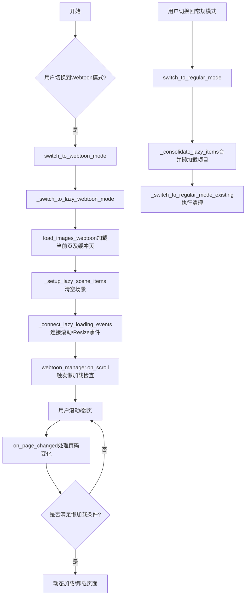

## 类结构

```
LazyLoadingConfig (数据类-配置)
WebtoonController (主控制器类)
├── 属性 (properties)
│   ├── image_viewer
│   ├── image_files
│   ├── image_states
│   └── current_file_path
├── Webtoon模式方法
switch_to_webtoon_mode
switch_to_lazy_webtoon_mode
setup_lazy_scene_items
connect_lazy_loading_events
on_page_changed
├── 常规模式方法
switch_to_regular_mode
consolidate_lazy_items
switch_to_regular_mode_existing
└── 辅助方法
    ├── _reset_page_change_flag
    └── _on_lazy_manager_ready
```

## 全局变量及字段


### `config`
    
懒加载配置实例

类型：`LazyLoadingConfig`
    


### `curr_img_idx`
    
当前图像索引(来自main)

类型：`int`
    


### `current_page`
    
基于curr_img_idx计算的当前页码

类型：`int`
    


### `success`
    
模式切换操作是否成功

类型：`bool`
    


### `manager`
    
图像查看器的webtoon管理器引用

类型：`WebtoonManager`
    


### `page_idx`
    
页码索引(循环变量)

类型：`int`
    


### `img_array`
    
图像数据数组(从manager获取)

类型：`ndarray`
    


### `file_path`
    
图像文件路径

类型：`str`
    


### `old_index`
    
切换前的页码

类型：`int`
    


### `state`
    
图像状态字典

类型：`dict`
    


### `explicit_navigation`
    
是否为显式导航标记

类型：`bool`
    


### `LazyLoadingConfig.enabled`
    
是否启用懒加载

类型：`bool`
    


### `LazyLoadingConfig.max_loaded_pages`
    
最大加载页数

类型：`int`
    


### `LazyLoadingConfig.viewport_buffer`
    
视口缓冲页数

类型：`int`
    


### `LazyLoadingConfig.load_timer_interval`
    
加载定时器间隔(毫秒)

类型：`int`
    


### `LazyLoadingConfig.scroll_debounce_delay`
    
滚动防抖延迟(毫秒)

类型：`int`
    


### `WebtoonController.main`
    
主控制器引用

类型：`ComicTranslate`
    


### `WebtoonController._initialization_complete`
    
初始化完成状态标记

类型：`bool`
    


### `WebtoonController.lazy_config`
    
懒加载配置对象

类型：`LazyLoadingConfig`
    


### `WebtoonController.lazy_loading_enabled`
    
懒加载启用标志

类型：`bool`
    
    

## 全局函数及方法


### `enhanced_wheel_event`

增强的滚轮事件处理函数，在原始滚轮事件处理后触发懒加载检查，用于在用户滚动页面时动态加载可视区域附近的页面。

参数：

-  `event`：`QEvent`，Qt 滚轮事件对象，包含滚轮滚动方向和增量信息

返回值：`任意类型`，原始滚轮事件处理函数的返回值

#### 流程图

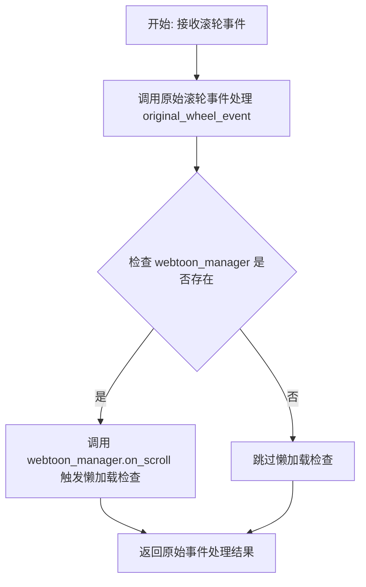

#### 带注释源码

```python
def enhanced_wheel_event(event):
    """增强的滚轮事件处理，触发懒加载检查。
    
    该函数是 _connect_lazy_loading_events 方法内的嵌套函数，
    用于包装原始的 wheelEvent 以在滚动时触发懒加载机制。
    
    参数:
        event: Qt 滚轮事件对象，包含滚动方向和增量信息
        
    返回值:
        原始 wheelEvent 的处理结果
    """
    # 调用图像查看器原本的 wheelEvent 处理函数
    result = original_wheel_event(event)
    
    # 在滚动后触发懒加载检查
    # 检查 webtoon_manager 是否已初始化（可能为 None 或不存在）
    if self.image_viewer.webtoon_manager:
        # 调用 on_scroll 方法触发懒加载逻辑
        # 这会根据当前可视区域加载/卸载页面
        self.image_viewer.webtoon_manager.on_scroll()
    
    # 返回原始事件处理的结果，保持事件传递链完整性
    return result
```


### `WebtoonController.enhanced_resizeEvent`

增强的窗口调整事件处理方法，作为原 `resizeEvent` 的包装器，在窗口大小改变时触发懒加载更新逻辑。

参数：

-  `event`：`QEvent`，Qt 窗口调整事件对象，包含窗口尺寸变化信息

返回值：`Any`，返回原 `resizeEvent` 的执行结果

#### 流程图

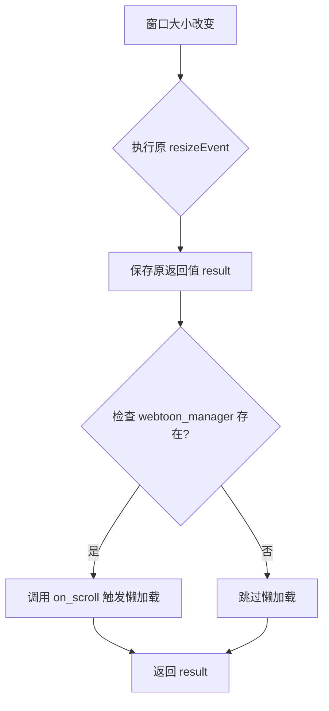

#### 带注释源码

```python
def enhanced_resizeEvent(event):
    # 执行原始的 resizeEvent，保存其返回值
    result = original_resizeEvent(event)
    
    # 触发懒加载更新 on viewport resize
    # 仅在 webtoon_manager 存在时才执行懒加载检查
    if self.image_viewer.webtoon_manager:
        self.image_viewer.webtoon_manager.on_scroll()
    
    # 返回原始 resizeEvent 的执行结果
    return result

# 将增强后的事件处理方法赋值回 image_viewer
self.image_viewer.resizeEvent = enhanced_resizeEvent
```


### `WebtoonController.__init__`

这是 `WebtoonController` 类的构造函数，负责初始化 Webtoon 控制器的核心状态和懒加载配置。

参数：

- `main`：`ComicTranslate`，主应用程序控制器实例，用于访问图像查看器、图像文件列表、图像状态等核心功能组件

返回值：`None`，构造函数无返回值

#### 流程图

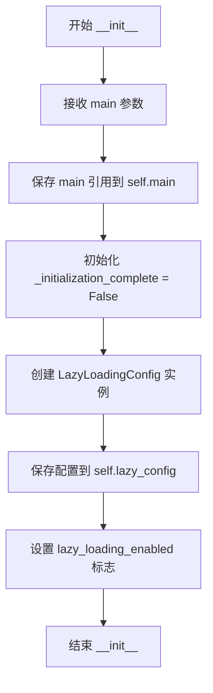

#### 带注释源码

```python
def __init__(self, main: ComicTranslate):
    """Initialize WebtoonController with main application reference.
    
    Args:
        main: ComicTranslate controller instance providing access to 
              image_viewer, image_files, image_states and other core components.
    """
    # Store reference to main application controller for later use
    self.main = main
    # Track whether lazy loading initialization has completed
    # Used to prevent premature page change handling
    self._initialization_complete = False  # Track initialization state
    
    # Load lazy loading configuration with default values
    # These settings control memory-efficient image loading behavior
    config = LazyLoadingConfig()
    self.lazy_config = config
    # Read enabled flag from config to determine if lazy loading should be active
    self.lazy_loading_enabled = self.lazy_config.enabled
```


### `WebtoonController.image_viewer`

该属性是一个只读的属性访问器，用于获取主应用程序中的图像查看器（ImageViewer）实例。它作为WebtoonController与主界面图像查看器之间的桥梁，使得Webtoon控制器能够直接操作底层的图像查看器组件。

参数： 无

返回值：`ImageViewer`（或Qt控件类型），返回主应用程序的图像查看器实例

#### 流程图

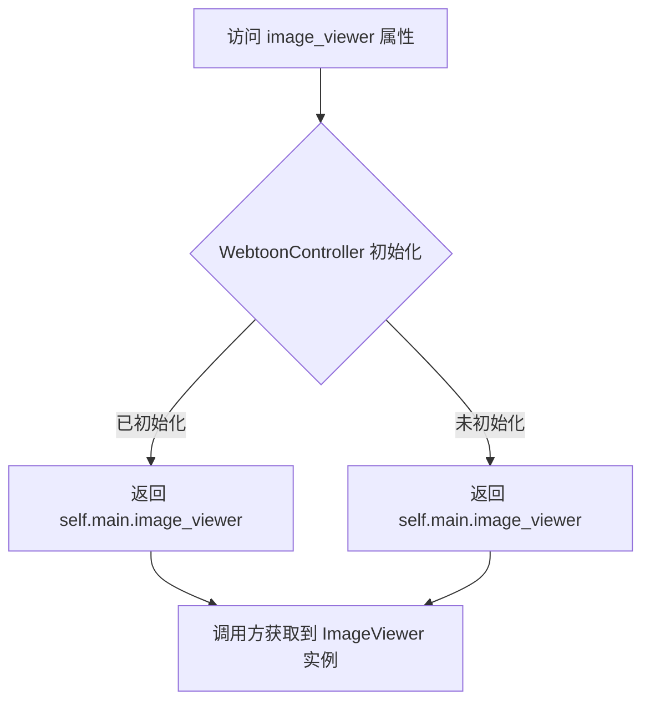

#### 带注释源码

```python
@property
def image_viewer(self):
    """获取主应用程序的图像查看器实例。
    
    这是一个只读属性，作为WebtoonController与主界面图像查看器之间的桥梁。
    通过此属性，Webtoon控制器可以访问底层的Qt图像查看器控件，
    从而进行webtoon模式下的各种图像操作和管理。
    
    Returns:
        ImageViewer: 主应用程序中的图像查看器实例
    """
    return self.main.image_viewer
```


### `WebtoonController.image_files`

这是一个只读属性方法，用于获取主控制器（ComicTranslate）中的图片文件列表。该属性作为代理属性，将对 `image_files` 的访问转发到主控制器的同名属性，使得 WebtoonController 可以方便地访问当前加载的图片文件。

参数：无需显式参数（隐式参数 `self` 表示类实例本身）

返回值：`Any`，返回当前已加载的图片文件列表（通常为文件路径列表），该列表来源于主控制器 `self.main.image_files`

#### 流程图

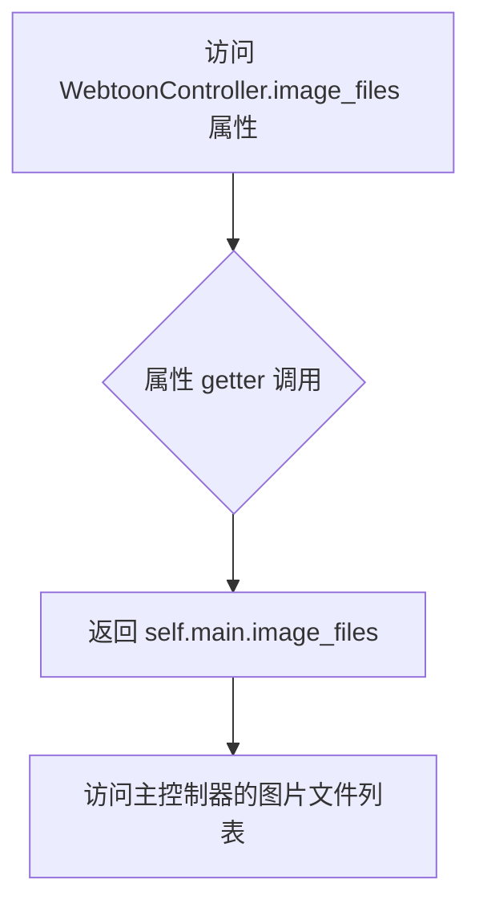

#### 带注释源码

```python
@property
def image_files(self):
    """获取主控制器中的图片文件列表。
    
    这是一个代理属性，将对 image_files 的访问转发到主控制器（main）。
    返回当前已加载的所有图片文件的路径列表。
    
    Returns:
        返回主控制器 ComicTranslate 中的 image_files 列表，
        其中包含所有已加载的图片文件路径。
    """
    return self.main.image_files
```


### `WebtoonController.image_states`

该属性是一个只读的 Python property，用于获取主控制器中存储的图像状态字典。它充当 `WebtoonController` 与 `ComicTranslate` 主控制器之间的桥梁，通过返回图像文件路径与对应状态（如语言设置、翻译状态等）之间的映射关系，使 Webtoon 控制器能够访问和管理各页面的状态数据。

参数：无（该方法为属性 getter，无显式参数）

返回值：`Dict[str, Any]`，返回主控制器中维护的图像状态字典，键为图像文件路径，值为包含该图像各种状态信息的字典对象（如源语言、目标语言等）

#### 流程图

```mermaid
flowchart TD
    A[访问 image_states 属性] --> B{检查 main 控制器是否存在}
    B -->|是| C[返回 self.main.image_states]
    B -->|否| D[抛出 AttributeError]
    
    C --> E[调用方使用返回的字典]
    E --> F[例如: image_states[file_path] 获取特定文件状态]
    
    style A fill:#f9f,color:#333
    style C fill:#9f9,color:#333
    style E fill:#bbf,color:#333
```

#### 带注释源码

```python
@property
def image_states(self):
    """
    获取图像状态字典的只读属性。
    
    该属性作为桥接属性，将 WebtoonController 与 ComicTranslate 主控制器中的
    image_states 数据源连接起来。它使得 Webtoon 控制器能够：
    1. 在页面切换时读取当前页面的语言设置状态
    2. 在滚动浏览时访问任意页面的状态信息
    3. 保持与主控制器状态的一致性
    
    返回值是一个字典，典型的结构为:
    {
        '/path/to/image1.png': {'source_lang': 'en', 'target_lang': 'ko', ...},
        '/path/to/image2.png': {'source_lang': 'ja', 'target_lang': 'zh', ...},
        ...
    }
    
    Returns:
        Dict[str, Any]: 图像文件路径到状态信息的映射字典
    """
    return self.main.image_states
```


### `WebtoonController.current_file_path`

获取当前图像索引对应的文件路径，基于 `curr_img_idx` 属性返回对应的图像文件路径，如果索引越界则返回 None。

参数：

-  `self`：`WebtoonController`，隐式参数，指向当前类实例

返回值：`Optional[str]`，返回当前索引位置的图像文件路径，若索引无效（小于0或大于等于列表长度）则返回 None

#### 流程图

```mermaid
flowchart TD
    A[开始] --> B[获取 self.main.curr_img_idx]
    B --> C{0 <= curr_idx < len(self.image_files)?}
    C -->|是| D[返回 self.image_files[curr_idx]]
    C -->|否| E[返回 None]
    D --> F[结束]
    E --> F
```

#### 带注释源码

```python
@property
def current_file_path(self):
    """Get the current file path based on curr_img_idx."""
    # 获取主控制器中当前图像索引
    curr_idx = self.main.curr_img_idx
    
    # 检查索引是否在有效范围内
    if 0 <= curr_idx < len(self.image_files):
        # 索引有效，返回对应索引位置的图像文件路径
        return self.image_files[curr_idx]
    
    # 索引越界，返回 None
    return None
```


### `WebtoonController.switch_to_webtoon_mode`

增强的Webtoon模式切换方法，支持懒加载选项。该方法首先验证是否有已加载的图像资源，若存在则调用内部懒加载切换逻辑，否则输出警告信息并返回失败状态。

参数： 无

返回值：`bool`，返回切换操作是否成功完成

#### 流程图

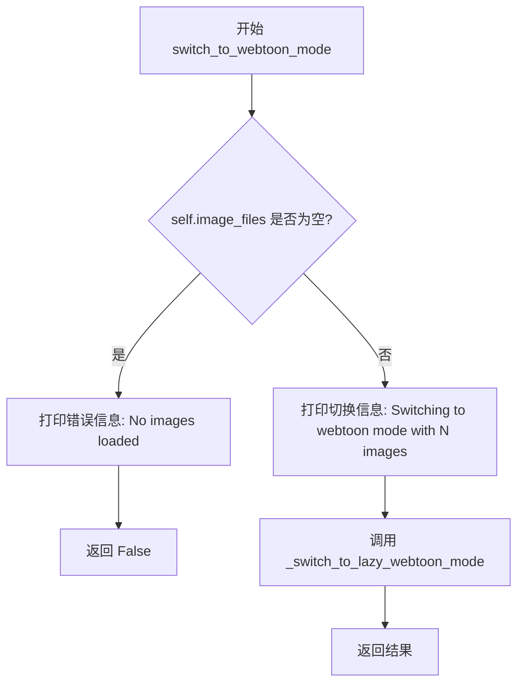

#### 带注释源码

```python
def switch_to_webtoon_mode(self) -> bool:
    """Enhanced webtoon mode switch with lazy loading option."""
    # 检查图像文件列表是否为空，若为空则无法切换到webtoon模式
    if not self.image_files:
        print("No images loaded, cannot switch to webtoon mode")
        return False
        
    # 输出切换信息，包含待加载的图像数量
    print(f"Switching to webtoon mode with {len(self.image_files)} images")
    
    # 调用内部懒加载切换方法完成实际切换逻辑
    return self._switch_to_lazy_webtoon_mode()
```


### `WebtoonController._switch_to_lazy_webtoon_mode`

该方法负责将应用切换到内存高效的懒加载 Webtoon 模式，初始化 Webtoon 管理器并配置懒加载参数，同时连接相关事件以支持滚动和视口变化时的动态内容加载。

参数：
- 该方法无显式参数（隐式接收 `self` 作为实例引用）

返回值：`bool`，返回 `True` 表示成功切换到懒加载 Webtoon 模式，返回 `False` 表示初始化失败

#### 流程图

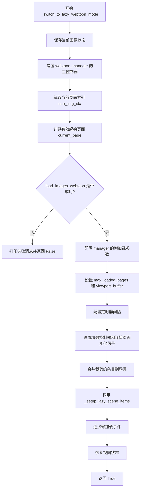

#### 带注释源码

```python
def _switch_to_lazy_webtoon_mode(self) -> bool:
    """Switch to memory-efficient lazy loading webtoon mode."""
    
    # 1. 保存当前图像状态，以便后续切换回普通模式时恢复
    self.main.image_ctrl.save_current_image_state()
    
    # 2. 将主控制器引用传递给 webtoon_manager，供其内部调用
    self.image_viewer.webtoon_manager.set_main_controller(self.main)
    
    # 3. 获取当前页面索引，用于确定懒加载的起始位置
    curr_img_idx = self.main.curr_img_idx
    
    # 4. 计算有效的起始页面索引，确保在有效范围内
    #    - 最小为 0（首页）
    #    - 最大为最后一个有效页面的索引
    current_page = max(0, min(curr_img_idx, len(self.image_files) - 1))
    
    # 5. 使用懒加载策略加载 Webtoon 图像，从当前页面开始
    success = self.image_viewer.load_images_webtoon(self.image_files, current_page)
    
    # 6. 如果加载失败，打印错误消息并返回 False
    if not success:
        print("Failed to initialize lazy webtoon mode")
        return False
    
    # 7. 获取 webtoon_manager 引用以配置懒加载参数
    manager = self.image_viewer.webtoon_manager
    
    # 8. 配置最大已加载页面数（控制内存使用）
    manager.max_loaded_pages = self.lazy_config.max_loaded_pages
    
    # 9. 配置视口缓冲（预加载视口前后 n 页）
    manager.viewport_buffer = self.lazy_config.viewport_buffer
    
    # 10. 配置加载定时器间隔（控制加载频率）
    manager.load_timer.setInterval(self.lazy_config.load_timer_interval)
    
    # 11. 配置滚动防抖定时器间隔（减少滚动时的频繁触发）
    manager.scroll_timer.setInterval(self.lazy_config.scroll_debounce_delay)
    
    # 12. 将主控制器引用传递给 manager
    manager.main = self.main
    
    # 13. 设置增强控制器（提供页面切换等高级功能）
    manager.set_enhanced_controller(self)
    
    # 14. 连接页面变化信号，以便在页面切换时执行特定逻辑
    self.image_viewer.page_changed.connect(self.on_page_changed)
    
    # 15. 保存增强控制器引用供后续使用
    manager.enhanced_controller = self
    
    # 16. 合并之前裁剪的条目（Webtoon 模式下可能需要重组场景项目）
    manager.scene_item_manager.merge_clipped_items_back()
    
    # 17. 设置懒加载场景项目（清空临时场景项目，由懒加载机制重新加载）
    self._setup_lazy_scene_items()
    
    # 18. 连接懒加载事件（滚轮事件和窗口大小调整事件触发懒加载检查）
    self._connect_lazy_loading_events()
    
    # 19. 恢复之前保存的视图状态（如滚动位置等）
    self.image_viewer.webtoon_manager.restore_view_state()

    # 20. 成功完成，返回 True
    return True
```


### `WebtoonController._setup_lazy_scene_items`

设置场景项目以进行延迟加载。此方法清空当前场景中的所有项目（blk_list 块列表、rectangles 矩形框、text_items 文本项），为懒加载模式做准备。这些项目将在懒加载页面时重新加载。

参数： 无

返回值：`None`，无返回值，该方法仅执行清空操作

#### 流程图

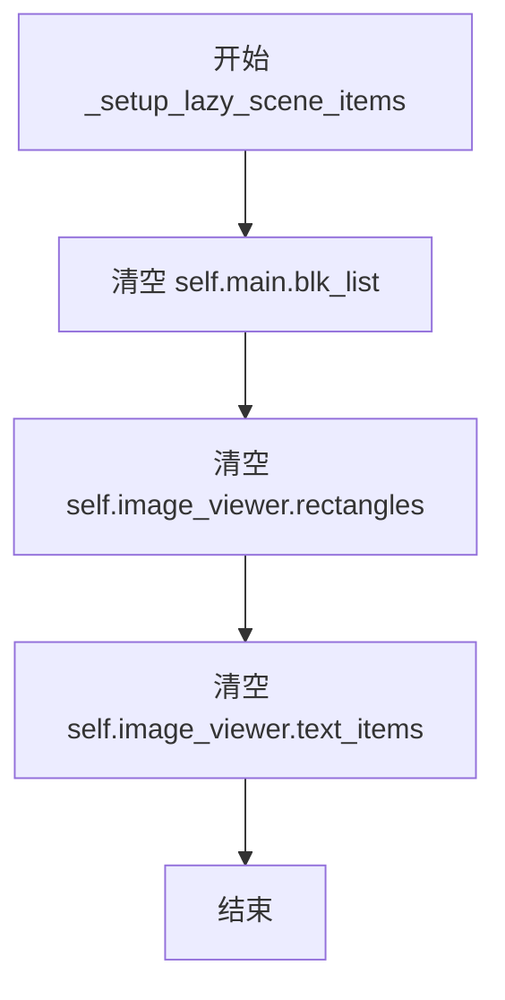

#### 带注释源码

```python
def _setup_lazy_scene_items(self):
    """Set up scene item management for lazy loading."""  
    # Clear scene items temporarily - they'll be reloaded when lazy pages load
    # 暂时清空场景项目 - 懒加载页面时会重新加载
    self.main.blk_list.clear()  # 清空主控制器中的块列表
    self.image_viewer.rectangles.clear()  # 清空图像查看器中的矩形框项目
    self.image_viewer.text_items.clear()  # 清空图像查看器中的文本项目
```


### `WebtoonController._connect_lazy_loading_events`

该方法用于连接图像查看器的滚动和调整大小事件，以便在用户滚动或调整窗口大小时触发延迟加载机制。通过包装原始事件处理函数，在事件执行完毕后调用 `webtoon_manager.on_scroll()` 来检查并加载可见区域内的页面。

参数：

- 该方法无显式参数（隐式接收 `self` 作为实例引用）

返回值：`None`，无返回值

#### 流程图

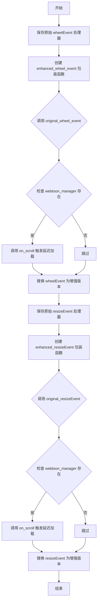

#### 带注释源码

```python
def _connect_lazy_loading_events(self):
    """Connect events for lazy loading triggers."""
    # 获取图像查看器原有的滚轮事件处理器，保存引用以便后续调用
    original_wheel_event = self.image_viewer.wheelEvent
    
    # 定义增强版滚轮事件处理函数，在原始滚动行为完成后触发延迟加载检查
    def enhanced_wheel_event(event):
        # 先执行原有的滚轮事件处理逻辑（Qt默认的滚动行为）
        result = original_wheel_event(event)
        # 滚动完成后，检查webtoon管理器是否存在，如存在则触发延迟加载逻辑
        if self.image_viewer.webtoon_manager:
            self.image_viewer.webtoon_manager.on_scroll()
        return result
    
    # 用增强版的事件处理器替换原有处理器，实现滚动时自动触发延迟加载
    self.image_viewer.wheelEvent = enhanced_wheel_event
    
    # 同样处理窗口大小调整事件，当视口尺寸变化时也需要触发延迟加载检查
    original_resizeEvent = self.image_viewer.resizeEvent
    
    def enhanced_resizeEvent(event):
        # 先执行原有的调整大小事件处理逻辑
        result = original_resizeEvent(event)
        # 调整大小完成后，检查webtoon管理器是否存在
        if self.image_viewer.webtoon_manager:
            # 触发延迟加载更新，因为视口大小变化可能改变可见页面范围
            self.image_viewer.webtoon_manager.on_scroll()
        return result
    
    # 替换resizeEvent为增强版本，实现窗口调整时自动触发延迟加载
    self.image_viewer.resizeEvent = enhanced_resizeEvent
```


### `WebtoonController.switch_to_regular_mode`

切换回常规模式（Regular Mode），并执行懒加载模式的相关清理工作，包括保存视图状态、断开的页面更改信号连接、整合懒加载项目到统一状态，以及清除懒加载管理器，最后调用现有的常规模式切换逻辑。

参数：

- 无参数（仅包含 `self`）

返回值：`None`，无返回值（Python 默认返回 None）

#### 流程图

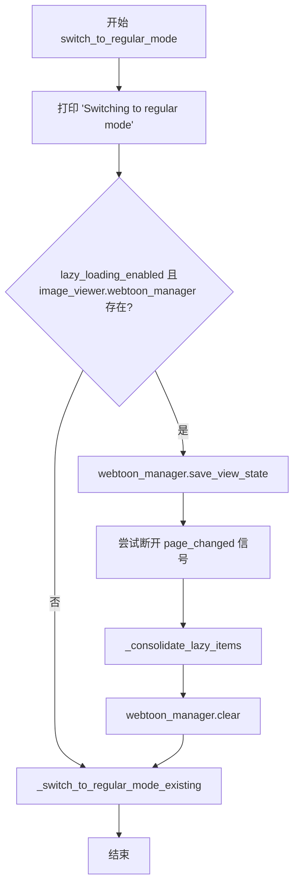

#### 带注释源码

```
def switch_to_regular_mode(self):
    """Switch back to regular mode with proper cleanup."""
    # 打印切换模式提示信息
    print("Switching to regular mode")
    
    # 检查懒加载是否启用且 webtoon_manager 存在
    if self.lazy_loading_enabled and hasattr(self.image_viewer, 'webtoon_manager'):
        # 保存当前视图状态，以便后续恢复
        self.image_viewer.webtoon_manager.save_view_state()
        
        # 断开页面更改信号连接，避免在常规模式下触发懒加载逻辑
        try:
            self.image_viewer.page_changed.disconnect(self.on_page_changed)
        except:
            pass  # 信号可能未连接，忽略异常
        
        # 将懒加载的项目合并回统一状态
        self._consolidate_lazy_items()
        
        # 清除懒加载管理器，释放相关资源
        self.image_viewer.webtoon_manager.clear()
    
    # 继续执行现有的常规模式切换逻辑
    self._switch_to_regular_mode_existing()
```


### `WebtoonController._consolidate_lazy_items`

该方法负责在从懒加载 Webtoon 模式切换回普通模式时，将懒加载的图像数据和场景项统一合并回主控制器的状态中，确保所有页面数据完整保存。

参数：无（仅包含 `self` 隐式参数）

返回值：`None`，无返回值

#### 流程图

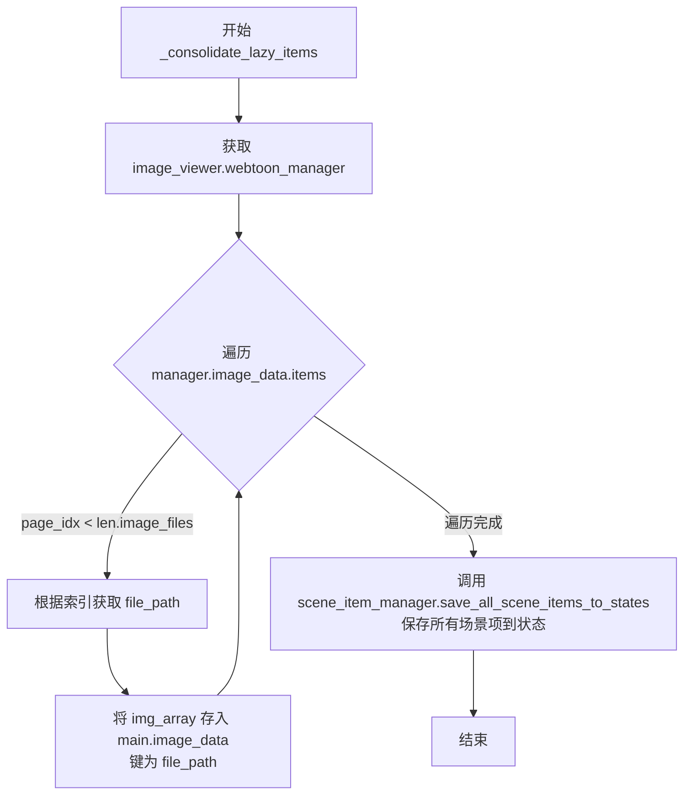

#### 带注释源码

```python
def _consolidate_lazy_items(self):
    """Consolidate lazy-loaded items back to unified scene state."""
    # 获取 Webtoon 管理器实例
    manager = self.image_viewer.webtoon_manager
    
    # Consolidate image data back to main controller
    # 将懒加载的图像数据合并回主控制器的 image_data 字典
    for page_idx, img_array in manager.image_data.items():
        # 检查页面索引是否在有效范围内
        if page_idx < len(self.image_files):
            # 根据页面索引获取对应的文件路径
            file_path = self.image_files[page_idx]
            # 将图像数据存回主控制器的 image_data 中
            self.main.image_data[file_path] = img_array
    
    # Save all currently visible scene items to their appropriate page states
    # This is crucial to ensure items from multiple pages are saved correctly
    # 调用场景项管理器，保存所有可见的场景项到各自页面的状态中
    # 这对于确保多页面场景项正确保存至关重要
    manager.scene_item_manager.save_all_scene_items_to_states()
```


### `WebtoonController._switch_to_regular_mode_existing`

该方法用于从 Webtoon 模式切换回普通模式，清理场景中的多页面项目，重置图像查看器的显示状态，并加载当前页面的项目。

参数：
- 无（仅包含 `self` 隐式参数）

返回值：`None`，无返回值

#### 流程图

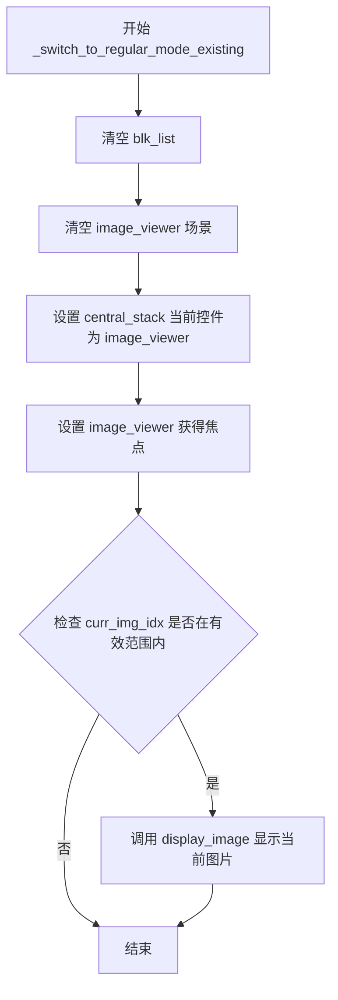

#### 带注释源码

```python
def _switch_to_regular_mode_existing(self):
    """Use existing regular mode switch logic."""
    
    # Clear the scene to remove multi-page items
    # 清空主控制器的块列表，移除所有多页面项目
    self.main.blk_list.clear()
    
    # 清空图像查看器的场景，清理所有图形项
    self.image_viewer.clear_scene()
    
    # Make sure the image viewer is the current widget
    # 将中央堆栈的当前控件设置为图像查看器
    self.main.central_stack.setCurrentWidget(self.image_viewer)
    
    # Ensure the image viewer has focus
    # 确保图像查看器获得焦点，以便接收键盘事件
    self.image_viewer.setFocus()
    
    # Display the current image in regular mode (this will load only the current page's items)
    # 获取当前图像索引
    curr_img_idx = self.main.curr_img_idx
    
    # 检查当前索引是否在有效范围内
    if 0 <= curr_img_idx < len(self.image_files):
        # 调用图像控制器显示当前图片，switch_page=False 表示不触发页面切换信号
        self.main.image_ctrl.display_image(curr_img_idx, switch_page=False)
```


### `WebtoonController.on_page_changed`

处理懒加载网页模式下页面切换时的状态更新和UI同步。

参数：

- `page_index`：`int`，即将切换到的目标页面索引

返回值：`None`，该方法通过修改主控制器的状态和UI组件来产生副作用，无返回值

#### 流程图

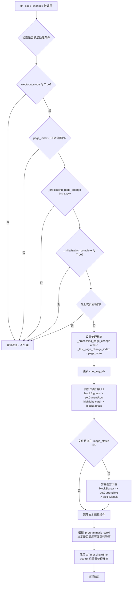

#### 带注释源码

```python
def on_page_changed(self, page_index: int):
    """Handle page changes in lazy loading webtoon mode."""
    # 检查是否满足处理条件：必须在webtoon模式、页面索引有效、未在处理其他页面切换、初始化已完成
    if (self.image_viewer.webtoon_mode and
        0 <= page_index < len(self.image_files) and
        not getattr(self.main, '_processing_page_change', False) and
        getattr(self, '_initialization_complete', False)):
        
        # 忽略对同一页面的快速连续切换请求
        if (hasattr(self.main, '_last_page_change_index') and 
            self.main._last_page_change_index == page_index):
            return
            
        # 设置处理标志以防止递归调用
        self.main._processing_page_change = True
        self.main._last_page_change_index = page_index
        
        try:
            # 更新当前图片索引
            old_index = self.main.curr_img_idx
            self.main.curr_img_idx = page_index
            
            # 更新页面列表选中状态，同时阻止信号触发以避免循环
            self.main.page_list.blockSignals(True)
            self.main.page_list.setCurrentRow(page_index)
            self.main.image_ctrl.highlight_card(page_index)
            self.main.page_list.blockSignals(False)
            
            # 在懒加载webtoon模式下，进行最轻量的状态管理以避免干扰滚动
            # 仅加载语言设置和基础状态
            file_path = self.image_files[page_index]
            if file_path in self.image_states:
                state = self.image_states[file_path]
                # 仅加载语言设置，不加载完整图片状态
                # 阻止信号以防止加载状态时触发保存
                self.main.s_combo.blockSignals(True)
                self.main.t_combo.blockSignals(True)
                self.main.s_combo.setCurrentText(state.get('source_lang', ''))
                self.main.t_combo.setCurrentText(state.get('target_lang', ''))
                self.main.s_combo.blockSignals(False)
                self.main.t_combo.blockSignals(False)
                
            # 清除文本编辑控件
            self.main.text_ctrl.clear_text_edits()

            # 页面跳转弹窗策略：
            # - 在显式程序跳转（页面列表/报告）时显示
            # - 在被动滚动页面切换时隐藏
            explicit_navigation = bool(getattr(self.image_viewer, "_programmatic_scroll", False))
            self.main.image_ctrl.handle_webtoon_page_focus(file_path, explicit_navigation)
                    
        finally:
            # 使用定时器重置处理标志以避免阻塞合法切换
            QTimer.singleShot(100, self._reset_page_change_flag)
```


### `WebtoonController._reset_page_change_flag`

重置页面变更处理标志，用于解除页面切换时的阻塞状态，允许后续的页面变更请求能够被正常处理。

参数： 无

返回值：`None`，无返回值描述（该方法仅执行状态重置操作）

#### 流程图

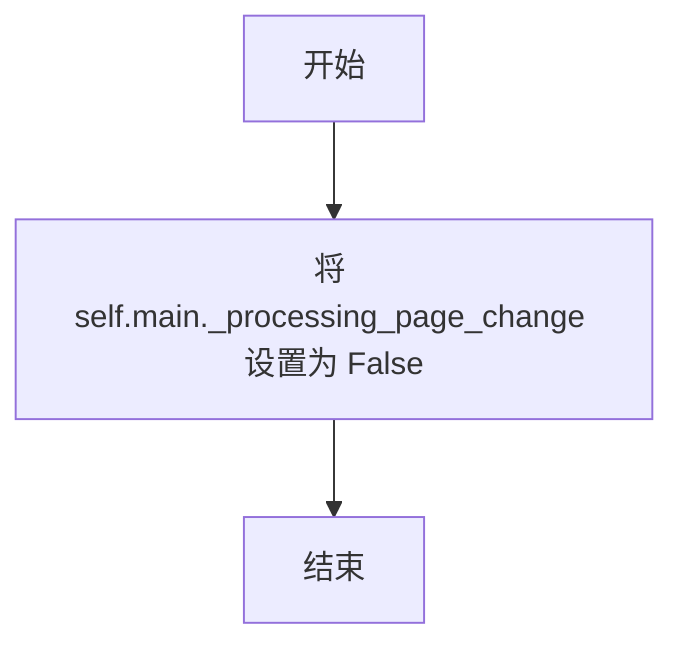

#### 带注释源码

```python
def _reset_page_change_flag(self):
    """Reset the page change processing flag."""
    # 将主控制器的页面变更处理标志设置为 False
    # 该标志在 on_page_changed 方法中被设置为 True 以防止递归调用
    # 100ms 后通过此方法重置为 False，以允许后续页面变更
    self.main._processing_page_change = False
```


### `WebtoonController._on_lazy_manager_ready`

该方法用于标记懒加载管理器初始化完成的状态。当懒加载管理器完成初始化后调用此方法，将 `_initialization_complete` 标志设置为 `True`，从而允许页面切换事件处理器 `on_page_changed` 开始响应页面变化事件。

参数： 无

返回值： `None`，无返回值

#### 流程图

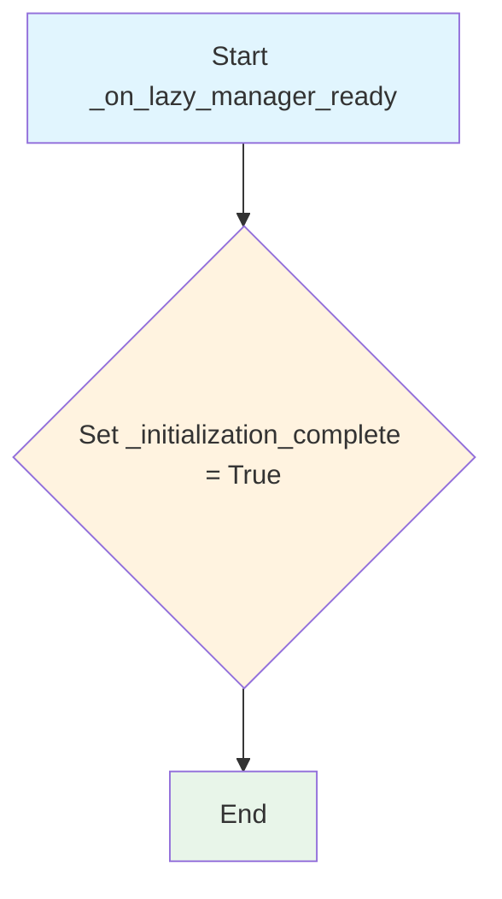

#### 带注释源码

```python
def _on_lazy_manager_ready(self):
    """Called when the lazy manager has completed initialization."""
    # Set the initialization complete flag to True
    # This flag is checked in on_page_changed to ensure
    # that page change events are only processed after
    # lazy loading has been fully initialized
    self._initialization_complete = True
```


### `WebtoonController.toggle_webtoon_mode`

该方法用于在普通图片查看器和Webtoon（长图）模式之间切换。它通过检查切换按钮的状态来决定目标模式，如果当前模式与请求模式相同则直接返回，否则调用相应的切换方法并在失败时回滚切换按钮状态。

参数： 无

返回值：`None`，无返回值

#### 流程图

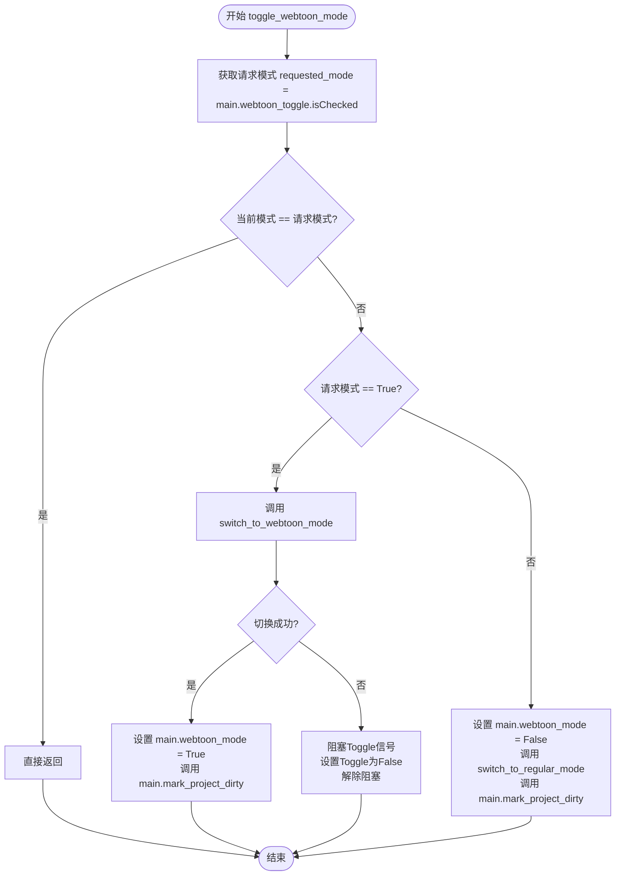

#### 带注释源码

```python
def toggle_webtoon_mode(self):
    """Toggle between regular image viewer and webtoon mode."""
    # 获取用户通过Toggle按钮请求的模式状态
    requested_mode = self.main.webtoon_toggle.isChecked()
    
    # 如果当前模式与请求模式相同，则无需执行任何操作，直接返回
    if self.main.webtoon_mode == requested_mode:
        return
    
    # 根据请求的模式执行相应的切换逻辑
    if requested_mode:
        # 用户请求切换到Webtoon模式
        # 调用Webtoon模式切换方法
        success = self.switch_to_webtoon_mode()
        
        if success:
            # 切换成功，更新主程序的状态标志
            self.main.webtoon_mode = True
            # 标记项目状态为已修改（脏）
            self.main.mark_project_dirty()
        else:
            # 切换失败，需要回滚Toggle按钮的状态到关闭状态
            # 先阻塞信号防止触发其他处理逻辑
            self.main.webtoon_toggle.blockSignals(True)
            self.main.webtoon_toggle.setChecked(False)
            # 恢复信号监听
            self.main.webtoon_toggle.blockSignals(False)
    else:
        # 用户请求切换回普通模式
        # 更新模式标志为False
        self.main.webtoon_mode = False
        # 执行普通模式的切换逻辑
        self.switch_to_regular_mode()
        # 标记项目状态为已修改
        self.main.mark_project_dirty()
```

## 关键组件


### 惰性加载配置 (LazyLoadingConfig)

用于配置Webtoon模式下的惰性加载行为的数据类，包含启用开关、最大加载页数、视口缓冲、加载定时器间隔和滚动防抖延迟等参数。

### 惰性加载管理器 (WebtoonController)

核心控制器类，负责管理Webtoon模式的切换、惰性加载逻辑、页面切换处理和视图状态管理，支持在内存受限环境下高效加载长篇漫画。

### 页面切换处理 (on_page_changed)

处理Webtoon模式下的页面切换事件，实现页面状态同步、语言设置加载和文本编辑清除，同时通过防重复机制避免频繁切换。

### 视图状态管理 (View State Management)

包含save_view_state和restore_view_state功能，用于在模式切换时保存和恢复滚动位置和视图状态，确保用户体验连贯性。

### 事件增强机制 (Enhanced Events)

通过包装wheelEvent和resizeEvent实现滚动和窗口大小改变时的惰性加载触发，支持视口变化时的动态加载。


## 问题及建议


### 已知问题

- **魔法数字硬编码**：`_reset_page_change_flag` 方法中使用了硬编码的 100ms 延迟 `QTimer.singleShot(100, ...)`，缺乏配置化
- **动态属性滥用**：`_initialization_complete`、`_processing_page_change`、`_last_page_change_index`、`_last_page_change_index` 等状态标志使用动态属性赋值，未在 `__init__` 中预定义，降低了代码可读性和可维护性
- **异常处理过于宽泛**：`except: pass` 会捕获所有异常并静默忽略，可能隐藏潜在的真实错误
- **事件处理返回值不一致**：`enhanced_wheel_event` 和 `enhanced_resizeEvent` 声称返回 `original_wheel_event(event)` 的结果，但 Qt 的 `wheelEvent` 和 `resizeEvent` 通常返回 `None`，返回值处理无实际意义
- **未使用的导入**：`TYPE_CHECKING` 分支导入的 `ComicTranslate` 仅用于类型注解，且 `annotations` 特性未在代码中体现实际用途
- **属性封装不足**：`image_viewer`、`image_files`、`image_states` 等属性直接代理 `self.main` 的属性，缺乏边界检查和统一的错误处理
- **状态清理不彻底**：`switch_to_regular_mode` 中虽然尝试断开信号连接，但未清理 `webtoon_manager` 的其他引用（如 `enhanced_controller`），可能导致内存泄漏或状态残留

### 优化建议

- 将状态标志变量在 `__init__` 中显式初始化为类属性或实例属性，并考虑使用 `dataclass` 或 `NamedTuple` 封装状态管理逻辑
- 将 100ms 延迟提取为 `LazyLoadingConfig` 的配置项，提高可配置性
- 缩小异常捕获范围，改为捕获特定异常类型或记录日志，避免静默吞掉错误
- 移除无用的返回值处理，统一事件处理函数的签名与 Qt 基类一致
- 在 `switch_to_regular_mode` 中添加更彻底的资源清理逻辑，包括清理 `enhanced_controller` 引用和重置 `webtoon_manager` 的状态
- 考虑将 `on_page_changed` 方法中的复杂逻辑拆分为更小的私有方法，提高可读性和可测试性

## 其它


### 设计目标与约束

**设计目标**：实现一个支持懒加载的Webtoon阅读模式控制器，优化内存使用，支持长篇漫画的流畅滚动和浏览，同时保持与常规阅读模式的无缝切换能力。

**约束条件**：
- 依赖PySide6 Qt框架
- 需要与ComicTranslate主控制器紧密集成
- 图像加载受max_loaded_pages限制
- 滚动和调整大小事件需要防抖处理

### 错误处理与异常设计

代码中的错误处理主要包括：
1. **switch_to_webtoon_mode**：当image_files为空时打印错误信息并返回False
2. **_switch_to_lazy_webtoon_mode**：初始化失败时打印错误并返回False
3. **on_page_changed**：通过try-finally确保_processing_page_change标志被重置
4. **switch_to_regular_mode**：使用try-except处理信号断开可能的异常

建议增加：
- 更细粒度的异常捕获和自定义异常类
- 错误状态码和错误消息的统一管理
- 用户友好的错误提示界面

### 数据流与状态机

**主要状态**：
- **常规模式（Regular Mode）**：单页显示，加载当前页所有内容
- **Webtoon模式（Webtoon Mode）**：多页懒加载显示，支持滚动浏览

**状态转换**：
- switch_to_webtoon_mode() → 进入Webtoon模式，初始化懒加载管理器
- switch_to_regular_mode() → 返回常规模式，清理懒加载资源
- toggle_webtoon_mode() → 两种模式间切换

**数据流向**：
- 图像数据：image_files → webtoon_manager.image_data
- 场景项目：scene_item_manager → 各页的image_states
- 页面状态：image_states → UI控件（语言选择等）

### 外部依赖与接口契约

**主要依赖**：
- ComicTranslate：主控制器类
- QTimer：单次定时器，用于延迟操作
- dataclasses：配置数据类
- TYPE_CHECKING：类型检查

**接口契约**：
- image_viewer：图像查看器对象，需要有webtoon_manager、load_images_webtoon等属性和方法
- main.image_ctrl：图像控制器，需要save_current_image_state、display_image等方法
- main.image_states：字典，存储各图像的状态信息

### 性能考虑与优化策略

**当前优化措施**：
1. 懒加载配置：限制最大加载页数和视口缓冲
2. 滚动防抖：scroll_debounce_delay = 150ms
3. 加载节流：load_timer_interval = 50ms
4. 页面变化快速返回：避免重复处理相同页面

**潜在优化空间**：
- 图像预加载策略可以根据滚动方向动态调整
- 内存使用监控和自动清理策略
- 场景项目按需加载，减少初始化时间

### 并发与线程安全

**当前设计**：
- 主要依赖Qt的主线程事件循环
- 使用QTimer.singleShot进行延迟操作避免阻塞

**注意事项**：
- _processing_page_change标志用于防止递归调用
- 信号槽机制本身是线程安全的，但需注意跨线程操作

### 可测试性设计

**当前可测试性**：
- 独立的配置类LazyLoadingConfig便于mock
- 各方法职责相对单一
- 使用@property提供依赖注入点

**建议改进**：
- 将_on_lazy_manager_ready等内部方法暴露给测试
- 增加单元测试用的接口mock对象

### 配置管理

**LazyLoadingConfig类**：
- enabled：是否启用懒加载
- max_loaded_pages：最大加载页数（默认10）
- viewport_buffer：视口缓冲页数（默认2）
- load_timer_interval：加载定时器间隔（默认50ms）
- scroll_debounce_delay：滚动防抖延迟（默认150ms）

配置目前硬编码在__init__中，建议增加从配置文件或用户设置加载的能力。

### 日志与监控

**当前日志**：
- 使用print输出基本状态信息
- 缺少详细的调试日志和运行监控

**建议增加**：
- 分级别的日志系统（DEBUG、INFO、WARNING、ERROR）
- 懒加载命中/未命中统计
- 内存使用监控

### 用户交互流程

1. 用户点击webtoon_toggle按钮
2. toggle_webtoon_mode()被调用
3. 根据当前状态切换到目标模式
4. 切换成功后更新main.webtoon_mode标志
5. 调用mark_project_dirty()标记项目需要保存

### 资源管理与生命周期

**资源获取**：
- 在switch_to_webtoon_mode时获取webtoon_manager
- 加载图像到内存

**资源释放**：
- switch_to_regular_mode时调用webtoon_manager.clear()
- 断开信号连接
- 清空blk_list、rectangles、text_items等场景项目

    