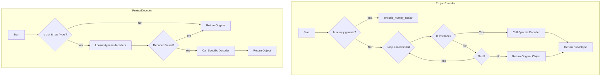
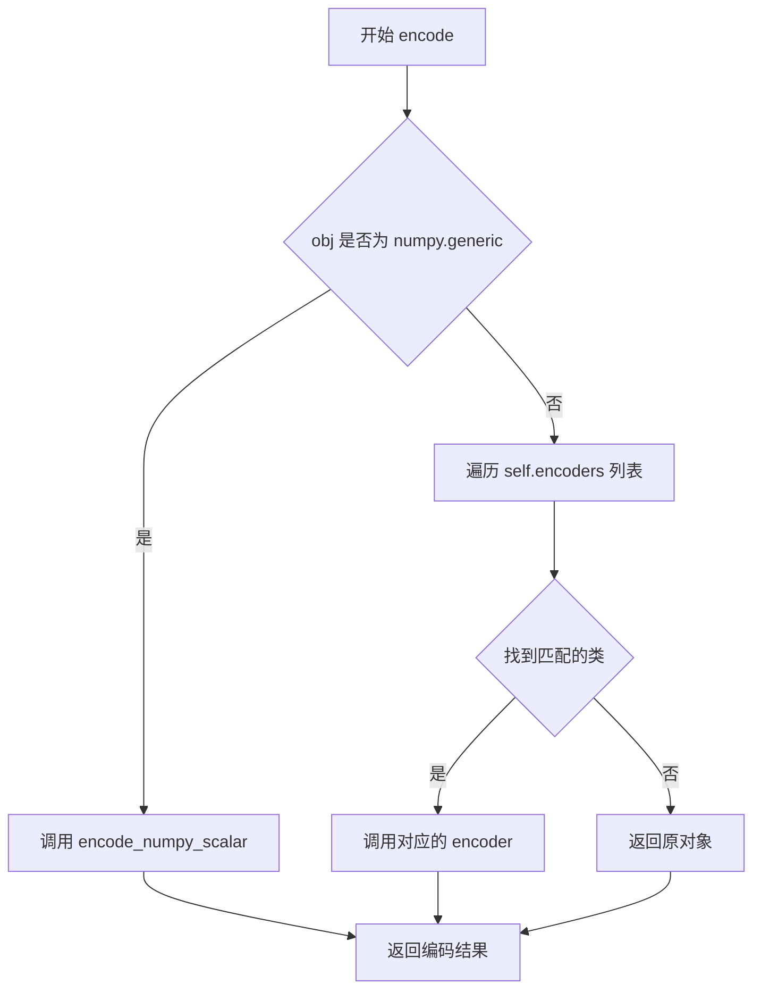
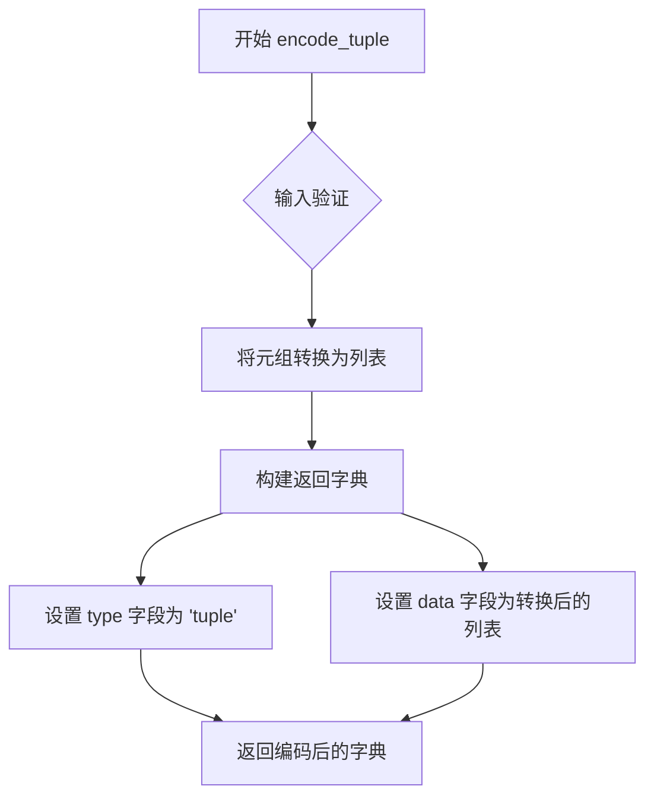
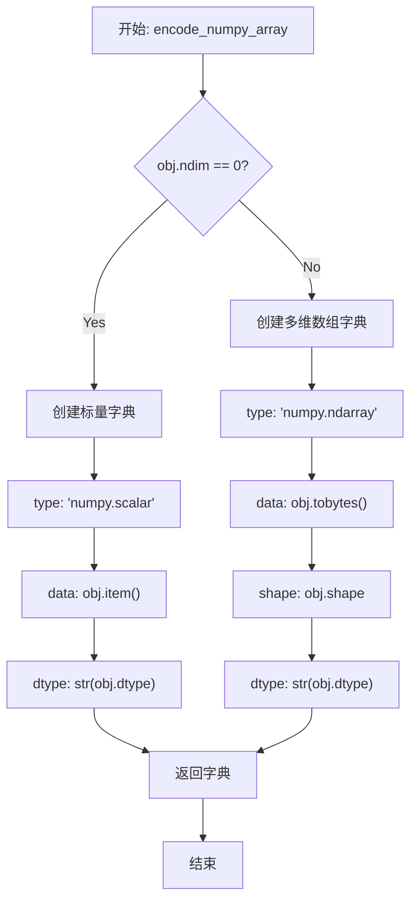
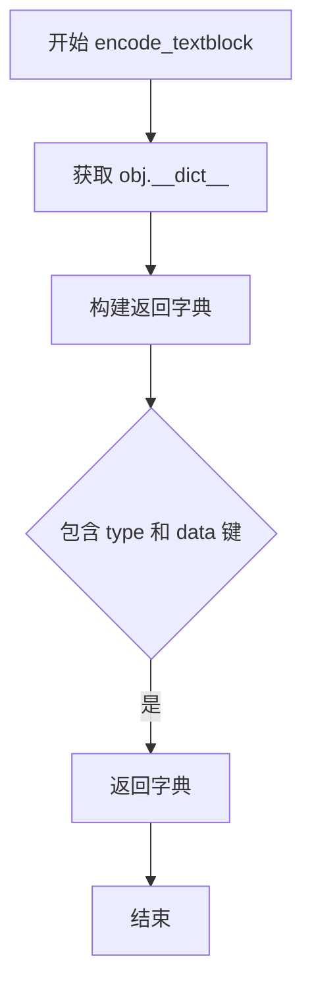
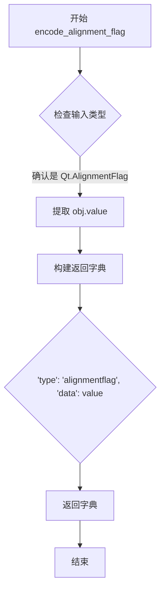
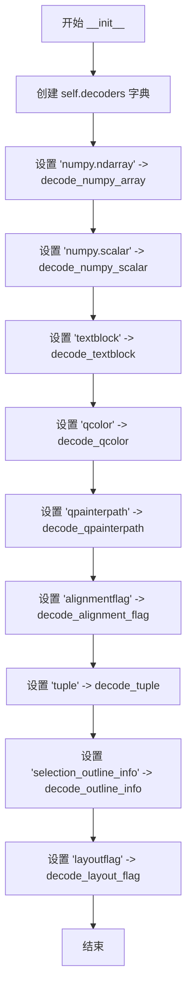

# `comic-translate\app\projects\parsers.py` 详细设计文档

该模块实现了一个通用的对象序列化与反序列化框架（ProjectEncoder 和 ProjectDecoder），专门用于处理 NumPy 数组、Qt GUI 对象（颜色、路径、标志）以及自定义数据结构（TextBlock、OutlineInfo）的编码和解码，支持项目数据的持久化与恢复。

## 整体流程



## 类结构

```
ProjectEncoder (序列化编码类)
├── encoders: List[Tuple[Type, EncoderMethod]]
└── methods: encode, encode_numpy_scalar, encode_tuple, encode_numpy_array, encode_textblock, encode_qcolor, encode_qpainterpath, encode_alignment_flag, encode_outline_info, encode_layout_flag
ProjectDecoder (反序列化解码类)
├── decoders: Dict[str, DecoderMethod]
└── methods: decode, decode_numpy_scalar, decode_tuple, decode_numpy_array, decode_textblock, decode_qcolor, decode_qpainterpath, decode_alignment_flag, decode_outline_info, decode_layout_flag
ensure_string_keys (全局工具函数)
```

## 全局变量及字段


### `ProjectEncoder.encoders`
    
编码器列表，包含类型到编码函数的映射元组，用于将不同类型的对象序列化为字典格式

类型：`list[tuple[type, method]]`
    


### `ProjectDecoder.decoders`
    
解码器字典，键为类型字符串，值为对应的解码函数，用于将字典格式反序列化为原始对象

类型：`dict[str, method]`
    
    

## 全局函数及方法


### `ensure_string_keys`

该函数递归地将字典中的所有键转换为字符串类型，确保在序列化或传输数据时字典键始终为字符串格式。

参数：

- `d`：任意类型，主要设计用于处理字典类型，递归遍历其所有键值对并将键转换为字符串

返回值：返回与输入类型相同的值，若输入为字典则所有键都被转换为字符串

#### 流程图

```mermaid
flowchart TD
    A[开始: ensure_string_keys] --> B{检查 d 是否为 dict}
    B -->|是| C[遍历字典所有键值对]
    B -->|否| F[返回原值 d]
    
    C --> D[将键 k 转换为字符串 str(k)]
    D --> E[递归调用 ensure_string_keys 处理值 v]
    E --> C
    
    C --> G[构建新字典 {str(k): 处理后的v}]
    G --> F
```

#### 带注释源码

```python
def ensure_string_keys(d):
    """
    递归确保字典的所有键都是字符串类型。
    
    该函数深度遍历字典结构，将所有嵌套字典的键转换为字符串。
    主要用于数据序列化前确保键类型一致性。
    """
    # 检查当前对象是否为字典类型
    if isinstance(d, dict):
        # 使用字典推导式构建新字典
        # 对每个键调用 str() 转换为字符串
        # 对每个值递归调用本函数处理（处理嵌套字典）
        return {str(k): ensure_string_keys(v) for k, v in d.items()}
    
    # 如果不是字典，直接返回原始值（可能是其他类型如列表、数字、字符串等）
    return d
```


### `ProjectEncoder.__init__`

初始化 `ProjectEncoder` 类的实例，构建类型编码器映射表，将特定数据类型（NumPy数组、TextBlock、QColor等）与其对应的编码方法关联起来，以便后续对项目数据进行序列化处理。

参数：

- 无

返回值：`None`，构造函数不返回任何值，仅初始化实例状态。

#### 流程图

```mermaid
flowchart TD
    A[开始 __init__] --> B[创建 self.encoders 列表]
    B --> C[添加 (np.ndarray, encode_numpy_array) 映射]
    C --> D[添加 (TextBlock, encode_textblock) 映射]
    D --> E[添加 (QtGui.QColor, encode_qcolor) 映射]
    E --> F[添加 (QtGui.QPainterPath, encode_qpainterpath) 映射]
    F --> G[添加 (Qt.AlignmentFlag, encode_alignment_flag) 映射]
    G --> H[添加 (tuple, encode_tuple) 映射]
    H --> I[添加 (OutlineInfo, encode_outline_info) 映射]
    I --> J[添加 (Qt.LayoutDirection, encode_layout_flag) 映射]
    J --> K[结束]
```

#### 带注释源码

```python
def __init__(self):
    # 初始化编码器列表，用于存储类型与编码方法的映射关系
    # 编码器列表格式: [(类型1, 编码方法1), (类型2, 编码方法2), ...]
    self.encoders = [
        # NumPy 多维数组编码器，用于序列化 numpy.ndarray 对象
        (np.ndarray, self.encode_numpy_array),
        
        # TextBlock 文本块编码器，用于序列化自定义文本块对象
        (TextBlock, self.encode_textblock),
        
        # Qt 颜色编码器，用于序列化 QColor 对象
        (QtGui.QColor, self.encode_qcolor),
        
        # Qt PainterPath 编码器，用于序列化 QPainterPath 路径对象
        (QtGui.QPainterPath, self.encode_qpainterpath),
        
        # Qt 对齐标志编码器，用于序列化 AlignmentFlag 枚举值
        (Qt.AlignmentFlag, self.encode_alignment_flag),
        
        # 元组编码器，用于序列化 Python tuple 对象
        (tuple, self.encode_tuple), 
        
        # 轮廓信息编码器，用于序列化选区轮廓信息对象
        (OutlineInfo, self.encode_outline_info),
        
        # Qt 布局方向编码器，用于序列化 LayoutDirection 枚举值
        (Qt.LayoutDirection, self.encode_layout_flag)
    ]
```


### `ProjectEncoder.encode`

该方法是 `ProjectEncoder` 类的核心编码方法，负责将各种类型的对象（NumPy数组、TextBlock、QColor等）编码为可序列化的字典格式，以便于存储或传输。

参数：

- `obj`：`任意类型`，需要编码的任意对象，支持 numpy 标量、numpy 数组、TextBlock、QColor、QPainterPath、AlignmentFlag、tuple、OutlineInfo、LayoutDirection 等类型

返回值：`任意类型`，编码后的对象，通常是字典格式；若找不到对应的编码器则返回原对象

#### 流程图



#### 带注释源码

```python
def encode(self, obj):
    """
    编码任意对象为可序列化格式
    
    参数:
        obj: 任意类型，需要编码的对象
        
    返回:
        编码后的对象（字典或其他），若无法编码则返回原对象
    """
    # 首先检查是否为 numpy 标量类型（np.generic）
    if isinstance(obj, np.generic):
        # 调用静态方法将 numpy 标量转换为 Python 原生类型
        return self.encode_numpy_scalar(obj)
    
    # 遍历预定义的编码器列表，查找匹配的类类型
    for cls, encoder in self.encoders:
        # isinstance 检查对象是否属于某个类或该类的子类
        if isinstance(obj, cls):
            # 找到对应的编码器并执行编码
            return encoder(obj)
    
    # 如果没有找到匹配的编码器，返回原始对象
    return obj
```


### `ProjectEncoder.encode_numpy_scalar`

该方法是一个静态编码方法，用于将 NumPy 标量（scalar）对象转换为 Python 原生类型，以便于序列化和存储。

参数：

- `obj`：`np.generic`，NumPy 标量对象（如 `np.int32`, `np.float64` 等）

返回值：`任意 Python 原生类型`，通过调用 NumPy 标量的 `.item()` 方法返回的对应 Python 原生类型值

#### 流程图

```mermaid
flowchart TD
    A[输入: numpy 标量对象 obj] --> B{调用 obj.item()}
    B --> C[输出: Python 原生类型值]
    
    subgraph 内部转换
        B -.->|numpy 内部| D[numpy scalar to python]
    end
```

#### 带注释源码

```python
@staticmethod
def encode_numpy_scalar(obj):
    """
    将 NumPy 标量（scalar）转换为 Python 原生类型
    
    参数:
        obj: np.generic 类型的 NumPy 标量对象
             例如: np.int32(5), np.float64(3.14) 等
    
    返回值:
        任意 Python 原生类型
             通过 .item() 方法将 NumPy 标量转换为对应的 Python 原生类型
             例如: np.int32(5).item() 返回 Python int 类型的 5
    
    注意:
        - 此方法仅处理 NumPy 标量（np.generic 的实例）
        - 对于 NumPy 数组（ndarray），请使用 encode_numpy_array 方法
        - .item() 方法会移除 NumPy 的类型包装，返回纯粹的 Python 对象
    """
    return obj.item()
```


### `ProjectEncoder.encode_tuple`

将 Python 元组对象编码为统一的字典格式，以便于序列化和存储。

参数：

- `obj`：`tuple`，需要编码的元组对象

返回值：`dict`，包含元组类型标识和列表数据的字典，结构为 `{'type': 'tuple', 'data': list(obj)}`

#### 流程图



#### 带注释源码

```python
@staticmethod
def encode_tuple(obj):
    """
    将 Python 元组编码为统一格式的字典
    
    参数:
        obj: tuple - 输入的元组对象
        
    返回:
        dict: 包含类型标识和数据列表的字典
              {
                  'type': 'tuple',  # 类型标识
                  'data': [...]     # 元组转换后的列表
              }
    """
    return {
        'type': 'tuple',    # 标识该对象为元组类型
        'data': list(obj)   # 将元组转换为列表以便序列化
    }
```


### `ProjectEncoder.encode_numpy_array`

该方法负责将 NumPy 数组（无论是一维、多维还是标量数组）序列化为字典格式，以便于存储或传输。它通过检查数组的维度来判断是标量数组还是多维数组，并分别处理其编码逻辑。

参数：

- `obj`：`np.ndarray`，待编码的 NumPy 数组对象

返回值：`dict`，包含编码后数据的字典。对于标量数组返回 `'numpy.scalar'` 类型及 `item()` 转换后的数据和 dtype；对于多维数组返回 `'numpy.ndarray'` 类型及原始字节数据、shape 和 dtype。

#### 流程图



#### 带注释源码

```python
@staticmethod
def encode_numpy_array(obj):
    """
    将 NumPy 数组编码为字典格式。
    
    参数:
        obj: np.ndarray - 要编码的 NumPy 数组
        
    返回:
        dict: 包含类型、数据、形状和数据类型的字典
    """
    # 检查是否为标量（0维）数组
    if obj.ndim == 0:  # scalar numpy array
        return {
            'type': 'numpy.scalar',     # 标记为 NumPy 标量类型
            'data': obj.item(),         # 将标量转换为 Python 原生类型
            'dtype': str(obj.dtype)     # 记录原始数据类型
        }
    # 处理多维数组
    return {
        'type': 'numpy.ndarray',        # 标记为 NumPy 数组类型
        'data': obj.tobytes(),          # 将数组序列化为字节流
        'shape': obj.shape,             # 记录数组形状
        'dtype': str(obj.dtype)         # 记录数组数据类型
    }
```


### `ProjectEncoder.encode_textblock`

将 TextBlock 对象编码为字典格式，用于序列化或数据传输。该方法提取对象的内部状态（`__dict__`）并包装在带有类型标识的字典中。

参数：

- `obj`：`TextBlock`，要编码的 TextBlock 对象

返回值：`dict`，包含类型标识和对象数据的字典，键为 `'type'`（值为 `'textblock'`）和 `'data'`（值为对象的 `__dict__` 属性）

#### 流程图



#### 带注释源码

```python
@staticmethod
def encode_textblock(obj):
    """
    将 TextBlock 对象编码为字典格式
    
    参数:
        obj: TextBlock 实例对象
        
    返回:
        dict: 包含类型标识和数据的字典
    """
    # 获取对象的 __dict__ 属性，包含所有实例变量
    data = obj.__dict__
    
    # 返回编码后的字典，包含类型标记 'textblock' 和对象数据
    return {
        'type': 'textblock',
        'data': data
    }
```


### `ProjectEncoder.encode_qcolor`

该方法是一个静态编码方法，用于将 QtGui.QColor 对象序列化为字典格式，其中包含颜色的类型标识和以十六进制 ARGB 格式表示的颜色值。

参数：

- `obj`：`QtGui.QColor`，需要编码的 Qt 颜色对象

返回值：`dict`，包含颜色类型标识和十六进制 ARGB 颜色字符串的字典

#### 流程图

```mermaid
graph TD
    A([开始 encode_qcolor]) --> B[接收 obj: QtGui.QColor]
    B --> C[调用 obj.name QtGui.QColor.HexArgb]
    C --> D[获取颜色的十六进制 ARGB 字符串表示]
    D --> E[构建返回字典]
    E --> F[返回 {'type': 'qcolor', 'data': <颜色字符串>}]
    F --> G([结束])
```

#### 带注释源码

```python
@staticmethod
def encode_qcolor(obj):
    """
    将 QtGui.QColor 对象编码为字典格式
    
    参数:
        obj: QtGui.QColor - Qt 颜色对象
        
    返回:
        dict: 包含类型标识和颜色数据的字典
              {
                  'type': 'qcolor',
                  'data': '#AARRGGBB'  # 十六进制 ARGB 格式的颜色字符串
              }
    """
    return {
        'type': 'qcolor',                                    # 标记该数据为 qcolor 类型
        'data': obj.name(QtGui.QColor.HexArgb)               # 获取颜色的十六进制 ARGB 字符串表示
    }
```


### `ProjectEncoder.encode_qpainterpath`

将 QPainterPath 对象编码为字典格式，使用 SVG 路径命令字符串表示路径元素，支持 MoveTo、LineTo、CurveTo 三种路径元素类型的转换。

参数：

- `obj`：`QtGui.QPainterPath`，待编码的 Qt 画家路径对象

返回值：`dict`，包含路径类型标识和 SVG 风格路径数据字符串的字典

#### 流程图

```mermaid
flowchart TD
    A[开始] --> B[初始化 path_str为空字符串<br/>i=0]
    B --> C{i < obj.elementCount?}
    C -->|是| D[获取元素 e = obj.elementAt(i)]
    D --> E{e.type == MoveToElement?}
    E -->|是| F[path_str += "M {e.x} {e.y} "]
    E -->|否| G{e.type == LineToElement?}
    G -->|是| H[path_str += "L {e.x} {e.y} "]
    G -->|否| I{e.type == CurveToElement?}
    I -->|是| J{i + 2 < obj.elementCount?}
    J -->|是| K[获取 c1, c2 = elementAt(i+1), elementAt(i+2)<br/>path_str += "C {e.x} {e.y} {c1.x} {c1.y} {c2.x} {c2.y} "<br/>i += 2]
    J -->|否| L[i += 1]
    I -->|否| L
    F --> L
    H --> L
    K --> L
    C -->|否| M[path_str = path_str.strip]
    M --> N[返回 {'type': 'qpainterpath', 'data': path_str}]
    N --> O[结束]
```

#### 带注释源码

```python
@staticmethod
def encode_qpainterpath(obj):
    """
    将 QPainterPath 对象编码为字典格式
    
    参数:
        obj: QtGui.QPainterPath 对象，待编码的路径
    
    返回:
        dict: 包含类型标识和 SVG 路径字符串的字典
    """
    path_str = ""  # 初始化路径字符串
    i = 0  # 元素索引计数器
    
    # 遍历路径中的所有元素
    while i < obj.elementCount():
        e = obj.elementAt(i)  # 获取当前索引处的路径元素
        
        # 判断元素类型并生成对应的 SVG 命令
        if e.type == QtGui.QPainterPath.ElementType.MoveToElement:
            # 移动到命令 M
            path_str += f"M {e.x} {e.y} "
        elif e.type == QtGui.QPainterPath.ElementType.LineToElement:
            # 直线命令 L
            path_str += f"L {e.x} {e.y} "
        elif e.type == QtGui.QPainterPath.ElementType.CurveToElement:
            # 曲线命令 C，需要两个控制点
            if i + 2 < obj.elementCount():
                c1, c2 = obj.elementAt(i + 1), obj.elementAt(i + 2)
                # 三次贝塞尔曲线命令 C
                path_str += f"C {e.x} {e.y} {c1.x} {c1.y} {c2.x} {c2.y} "
                i += 2  # 已处理额外两个元素（控制点），因此跳过
        i += 1  # 移动到下一个元素
    
    # 返回编码后的字典，去除首尾空格
    return {
        'type': 'qpainterpath',
        'data': path_str.strip()
    }
```


### `ProjectEncoder.encode_alignment_flag`

将 Qt 对齐标志（Qt.AlignmentFlag）编码为可序列化的字典格式，用于项目文件的保存。

参数：

- `obj`：`Qt.AlignmentFlag`，需要编码的 Qt 对齐标志对象

返回值：`dict`，包含类型标识和标志值的字典，用于持久化存储

#### 流程图



#### 带注释源码

```python
@staticmethod
def encode_alignment_flag(obj):
    """
    静态方法：将 Qt.AlignmentFlag 编码为字典格式
    
    参数:
        obj: Qt.AlignmentFlag 实例，Qt 的对齐标志枚举值
    
    返回:
        dict: 包含类型标识 'alignmentflag' 和标志值的字典
              格式: {'type': 'alignmentflag', 'data': <flag_value>}
    """
    return {
        'type': 'alignmentflag',  # 标识编码类型，用于解码时识别
        'data': obj.value        # 提取枚举的整数值，便于存储和传输
    }
```


### `ProjectEncoder.encode_outline_info`

该方法是一个静态方法，用于将 `OutlineInfo` 对象编码为可序列化的字典格式，以便于数据持久化或网络传输。它提取轮廓信息的选择区域起始位置、结束位置、颜色、宽度和类型，并将颜色进一步编码为十六进制字符串，最终返回一个包含类型标识和数据的结构化字典。

参数：

- `obj`：`OutlineInfo`，需要被编码的轮廓信息对象，包含选择区域的起始位置、结束位置、颜色、宽度和类型属性

返回值：`Dict`，返回一个包含类型标识 `'selection_outline_info'` 和数据字典的字典结构，数据字典包含 `start`、`end`（原始值）、`color`（编码后的颜色值）、`width`（原始值）和 `type`（枚举的整数值）

#### 流程图

```mermaid
flowchart TD
    A[开始 encode_outline_info] --> B{接收 obj 参数}
    B --> C[提取 obj.start]
    C --> D[提取 obj.end]
    D --> E[提取 obj.color]
    E --> F[提取 obj.width]
    F --> G[提取 obj.type]
    G --> H[调用 encode_qcolor 编码颜色]
    H --> I[构建返回字典]
    I --> J[返回 {'type': 'selection_outline_info', 'data': {...}}]
```

#### 带注释源码

```python
@staticmethod
def encode_outline_info(obj):
    """
    将 OutlineInfo 对象编码为可序列化的字典格式。
    
    该方法提取轮廓信息对象的所有属性，包括起始位置、结束位置、
    颜色、宽度和类型，并将它们打包成一个结构化的字典。
    
    参数:
        obj: OutlineInfo 类型的目标对象，需要包含 start, end, color, width, type 属性
    
    返回:
        Dict: 包含类型标识和数据的字典，可用于 JSON 序列化或数据传输
    """
    return {
        'type': 'selection_outline_info',  # 标识这是一个轮廓信息编码结果
        'data': {
            'start': obj.start,             # 选区起始位置（保持原值）
            'end': obj.end,                 # 选区结束位置（保持原值）
            'color': ProjectEncoder.encode_qcolor(obj.color),  # 将 QColor 编码为十六进制字符串
            'width': obj.width,             # 轮廓宽度（保持原值）
            'type': obj.type.value          # 将 OutlineType 枚举转换为其整数值
        }
    }
```


### `ProjectEncoder.encode_layout_flag`

该方法用于将 Qt 的布局方向枚举（Qt.LayoutDirection）编码为可序列化的字典格式，以便于数据持久化或网络传输。

参数：

- `obj`：`Qt.LayoutDirection`，表示 Qt 的布局方向枚举值（如 Qt.LeftToRight、Qt.RightToLeft 等）

返回值：`dict`，包含类型标识和值的字典，结构为 `{'type': 'layoutflag', 'data': <枚举的整数值>}`

#### 流程图

```mermaid
graph TD
    A[开始 encode_layout_flag] --> B{输入验证}
    B -->|是 Qt.LayoutDirection| C[获取枚举的 value 属性]
    C --> D[构建返回字典]
    D --> E[返回 {'type': 'layoutflag', 'data': obj.value}]
    
    style A fill:#f9f,stroke:#333
    style E fill:#9f9,stroke:#333
```

#### 带注释源码

```python
@staticmethod
def encode_layout_flag(obj):
    """
    将 Qt.LayoutDirection 枚举编码为字典格式
    
    参数:
        obj: Qt.LayoutDirection - Qt布局方向枚举值
        
    返回:
        dict: 包含类型标识和枚举值的字典
              {
                  'type': 'layoutflag',
                  'data': obj.value  # 枚举的整数值
              }
    """
    return {
        'type': 'layoutflag',    # 标识这是一个布局方向编码
        'data': obj.value         # 提取枚举的实际整数值
    }
```


### `ProjectDecoder.__init__`

该方法是 `ProjectDecoder` 类的构造函数，负责初始化解码器字典，将不同的数据类型映射到对应的解码方法，以支持对序列化数据的反向处理。

参数：
- 无

返回值：`None`，构造函数无返回值

#### 流程图



#### 带注释源码

```python
def __init__(self):
    """初始化 ProjectDecoder 实例，创建解码器映射字典"""
    # 定义一个字典，将数据类型字符串映射到对应的解码方法
    # 键为序列化时记录的类型标识，值为该类中的解码静态方法
    self.decoders = {
        'numpy.ndarray': self.decode_numpy_array,      # 解码 numpy 数组
        'numpy.scalar': self.decode_numpy_scalar,      # 解码 numpy 标量
        'textblock': self.decode_textblock,            # 解码 TextBlock 对象
        'qcolor': self.decode_qcolor,                  # 解码 QColor 颜色对象
        'qpainterpath': self.decode_qpainterpath,     # 解码 QPainterPath 路径对象
        'alignmentflag': self.decode_alignment_flag,  # 解码对齐标志
        'tuple': self.decode_tuple,                    # 解码元组
        'selection_outline_info': self.decode_outline_info,  # 解码轮廓信息
        'layoutflag': self.decode_layout_flag,        # 解码布局方向标志
    }
```


### `ProjectDecoder.decode`

该方法是项目解码器的核心方法，负责根据对象中存储的类型标识符（`type`字段）选择合适的解码器，将序列化后的数据恢复为原始的Python对象，支持numpy数组、Qt颜色、文本块等多种数据类型。

参数：

- `obj`：`Any`，需要进行解码的对象，通常是一个包含 `type` 字段和 `data` 字段的字典

返回值：`Any`，解码后的对象。如果对象不包含 `type` 字段或找不到对应的解码器，则返回原对象

#### 流程图

```mermaid
flowchart TD
    A[开始 decode] --> B{obj 是字典且包含 'type' 键?}
    B -->|否| C[返回原对象 obj]
    B -->|是| D[根据 obj['type'] 获取解码器]
    D --> E{找到解码器?}
    E -->|否| C
    E -->|是| F[调用解码器函数]
    F --> G[返回解码后的对象]
```

#### 带注释源码

```python
def decode(self, obj):
    """
    解码序列化对象的主方法。
    
    该方法检查对象是否包含类型标识符，如果有则根据类型
    选择相应的解码器进行数据还原。
    
    参数:
        obj: 需要解码的对象，通常是包含 'type' 字段的字典
        
    返回值:
        解码后的对象，如果无法解码则返回原对象
    """
    # 检查对象是否为字典且包含 'type' 字段
    if isinstance(obj, dict) and 'type' in obj:
        # 根据 'type' 字段的值从 decoders 字典中获取对应的解码器方法
        decoder = self.decoders.get(obj['type'])
        # 如果找到了对应的解码器
        if decoder:
            # 调用解码器方法并返回结果
            return decoder(obj)
    # 如果不符合解码条件（无 'type' 字段或未找到解码器），返回原对象
    return obj
```


### `ProjectDecoder.decode_numpy_scalar`

该方法用于将序列化的字典数据解码回 NumPy 标量类型。它接收一个包含 `dtype` 和 `data` 字段的字典，通过 NumPy 的 dtype 机制将数据转换回原始的标量类型（如 `np.int32`、`np.float64` 等）。

参数：

- `obj`：`Dict[str, Any]`，包含 `dtype`（字符串类型，如 'int32'、'float64'）和 `data`（实际数据值）的字典

返回值：`numpy.generic`，解码后的 NumPy 标量类型

#### 流程图

```mermaid
flowchart TD
    A[开始 decode_numpy_scalar] --> B{输入 obj 是字典?}
    B -->|是| C[获取 obj['dtype'] 字符串]
    C --> D[创建 np.dtype 对象]
    D --> E[调用 dtype.type obj['data'] 转换数据]
    E --> F[返回 NumPy 标量]
    B -->|否| G[直接返回原对象]
```

#### 带注释源码

```python
@staticmethod
def decode_numpy_scalar(obj):
    """
    将包含 dtype 和 data 的字典解码为 NumPy 标量类型
    
    参数:
        obj: 包含 'dtype' 和 'data' 键的字典
            - dtype: 字符串，如 'int32', 'float64' 等
            - data: 实际的标量数据值
    
    返回:
        numpy.generic: 对应 dtype 类型的 NumPy 标量
    """
    # 使用 np.dtype() 将字符串形式的 dtype 转换为 dtype 对象
    # 然后调用 dtype 对象的 .type() 方法将 Python 数据转换为对应的 NumPy 标量类型
    # 例如: np.dtype('float64').type(3.14) -> np.float64(3.14)
    return np.dtype(obj['dtype']).type(obj['data'])
```


### `ProjectDecoder.decode_tuple`

该方法是 ProjectDecoder 类的静态方法，负责将编码后的字典数据还原为 Python 元组（tuple）对象，是项目序列化/反序列化机制中处理元组类型的解码核心组件。

参数：

- `obj`：`dict`，包含序列化元组信息的字典对象，必须包含 `type` 键（值为 `'tuple'`）和 `data` 键（值为列表形式的元组数据）

返回值：`tuple`，从字典的 `data` 字段还原的 Python 元组对象

#### 流程图

```mermaid
flowchart TD
    A[开始 decode_tuple] --> B{输入校验}
    B -->|obj 为字典| C[提取 obj['data'] 字段]
    B -->|obj 非字典| D[返回原对象]
    C --> E[将列表转换为元组 tuple]
    E --> F[返回元组结果]
    D --> F
```

#### 带注释源码

```python
@staticmethod
def decode_tuple(obj):
    """
    将编码后的字典数据还原为 Python 元组对象。
    
    该方法是 ProjectDecoder 解码器的一部分，专门处理由 
    ProjectEncoder.encode_tuple 编码的元组类型数据。
    
    参数:
        obj (dict): 包含元组序列化数据的字典，必须具有以下结构:
            {
                'type': 'tuple',  # 类型标识
                'data': [...]     # 列表形式的元组数据
            }
    
    返回:
        tuple: 从字典 'data' 字段转换来的 Python 元组对象
    
    示例:
        >>> encoded = {'type': 'tuple', 'data': [1, 2, 3]}
        >>> ProjectDecoder.decode_tuple(encoded)
        (1, 2, 3)
    """
    # 从输入字典中提取 'data' 键对应的列表数据
    # 使用内置 tuple() 函数将列表转换为不可变的元组类型
    return tuple(obj['data'])
```


### `ProjectDecoder.decode_numpy_array`

该方法负责将序列化的NumPy数组数据（包含二进制数据、数据类型和形状信息）重新解码为原始的NumPy数组，支持标量、边界框和普通多维数组的重塑处理。

参数：

- `obj`：`dict`，包含序列化数组信息的字典，必须包含`data`（二进制数据）、`dtype`（数据类型）和`shape`（形状）三个键

返回值：`numpy.ndarray`，解码后的NumPy数组

#### 流程图

```mermaid
flowchart TD
    A[开始 decode_numpy_array] --> B[提取 binary_data = obj['data']]]
    B --> C[提取 dtype = np.dtype(obj['dtype']]]
    C --> D[提取 shape = tuple(obj['shape']]]
    D --> E[array = np.frombuffer binary_data]
    E --> F{判断 array.size == 4?}
    F -->|是| G[解包 x1, y1, x2, y2]
    G --> H[return np.array([x1,y1,x2,y2], dtype=dtype)]
    F -->|否| I{判断 shape != ()?}
    I -->|是| J[return array.reshape(shape)]
    I -->|否| K[return array.reshape(-1, 4)]
    H --> L[结束]
    J --> L
    K --> L
```

#### 带注释源码

```python
@staticmethod
def decode_numpy_array(obj):
    """
    将序列化的NumPy数组字典解码回NumPy数组对象
    
    参数:
        obj: dict, 包含以下键的字典:
            - 'data': 二进制数据 (bytes)
            - 'dtype': 数据类型字符串 (如 'float64')
            - 'shape': 形状元组 (如 (10, 20))
    
    返回:
        numpy.ndarray: 解码后的数组
    """
    # 从字典中提取二进制数据
    binary_data = obj['data']
    
    # 将字符串类型的dtype转换为NumPy dtype对象
    dtype = np.dtype(obj['dtype'])
    
    # 提取原始形状信息并转换为元组
    shape = tuple(obj['shape'])
    
    # 使用np.frombuffer将二进制数据转换为一维数组
    array = np.frombuffer(binary_data, dtype=dtype)
    
    # 处理特殊情况：数组大小为4时，视为边界框坐标
    if array.size == 4:
        # 解包四个坐标值 (如 x1, y1, x2, y2)
        x1, y1, x2, y2 = array
        # 返回特定格式的数组
        return np.array([x1, y1, x2, y2], dtype=dtype)
    
    # 如果原始形状不为空，按原始形状重塑数组
    elif shape != ():
        return array.reshape(shape)
    
    # 其他情况（标量数组），重塑为4列的二维数组
    else:
        return array.reshape(-1, 4)
```


### `ProjectDecoder.decode_textblock`

该方法负责将序列化的字典数据反序列化为 `TextBlock` 对象，通过直接更新目标对象的 `__dict__` 属性来恢复文本块的内部状态。

#### 参数

- `obj`：`dict`，包含已编码文本块数据的字典对象，必须包含 'data' 键，其值为编码前的 TextBlock 实例属性字典

#### 返回值

- `TextBlock`，恢复后的 TextBlock 实例对象

#### 流程图

```mermaid
flowchart TD
    A[开始 decode_textblock] --> B{检查输入 obj 是否为字典且包含 'data' 键}
    B -->|是| C[创建新的空 TextBlock 实例]
    C --> D[使用 __dict__.update 将 obj['data'] 映射到 text_block]
    D --> E[返回恢复后的 text_block]
    B -->|否| F[返回原始 obj]
```

#### 带注释源码

```python
@staticmethod
def decode_textblock(obj):
    """
    将序列化的字典数据反序列化为 TextBlock 对象
    
    参数:
        obj: dict, 包含 'data' 键的字典，存储了 TextBlock 的原始属性
    返回:
        TextBlock: 恢复后的 TextBlock 实例
    """
    # 步骤1: 创建一个新的空 TextBlock 实例
    text_block = TextBlock()
    
    # 步骤2: 将编码时保存的 data 字典直接更新到新实例的 __dict__ 中
    # 这种方式绕过了 TextBlock 的正常初始化逻辑，可能导致属性不一致
    text_block.__dict__.update(obj['data'])  
    
    # 步骤3: 返回恢复后的 TextBlock 对象
    return text_block
```

---

#### 补充信息

**类完整信息（ProjectDecoder）**

| 字段/方法 | 类型 | 描述 |
|-----------|------|------|
| `decoders` | `dict` | 存储类型标识符到解码方法的映射字典 |
| `decode()` | `instance method` | 主解码入口，根据 obj['type'] 分发到对应解码器 |
| `decode_numpy_scalar()` | `static method` | 将 numpy 标量数据反序列化为 numpy 标量 |
| `decode_tuple()` | `static method` | 将列表数据反序列化为元组 |
| `decode_numpy_array()` | `static method` | 将二进制数据反序列化为 numpy 数组 |
| `decode_textblock()` | `static method` | 将字典数据反序列化为 TextBlock 对象 |
| `decode_qcolor()` | `static method` | 将颜色字符串反序列化为 QColor 对象 |
| `decode_qpainterpath()` | `static method` | 将路径字符串反序列化为 QPainterPath 对象 |
| `decode_alignment_flag()` | `static method` | 将整数值反序列化为 Qt.AlignmentFlag 枚举 |
| `decode_outline_info()` | `static method` | 将轮廓信息字典反序列化为 OutlineInfo 对象 |
| `decode_layout_flag()` | `static method` | 将整数值反序列化为 Qt.LayoutDirection 枚举 |

**潜在技术债务与优化空间**

1. **直接操作 `__dict__` 的风险**：`decode_textblock` 使用 `text_block.__dict__.update(obj['data'])` 直接修改对象内部字典，绕过了 TextBlock 类的正常初始化逻辑（如属性验证、类型转换、默认值设置）。这可能导致：
   - 如果 TextBlock 在编码后增加了新属性，反序列化时可能丢失
   - 如果编码数据包含非法属性，可能污染对象状态
   - 建议：改为通过 TextBlock 的构造函数或专门的 `from_dict()` 类方法进行反序列化

2. **缺乏深拷贝机制**：直接 update `__dict__` 可能导致引用共享问题，如果 data 中包含可变对象（如列表、嵌套字典），原对象和恢复后的对象可能共享同一引用

3. **缺少类型安全检查**：未验证 `obj['data']` 的结构是否符合预期，缺少对必需字段的存在性检查

**外部依赖与接口契约**

- 依赖 `modules.utils.textblock.TextBlock` 类，该类必须支持通过 `__dict__` 直接注入属性
- 与 `ProjectEncoder.encode_textblock()` 成对使用，编码时保存 `obj.__dict__` 的副本
- 返回的 TextBlock 对象应与原始对象状态等价（除可能的引用共享外）


### `ProjectDecoder.decode_qcolor`

将包含颜色数据的字典解码为 QtGui.QColor 对象，用于反序列化 ProjectEncoder 编码的 QColor 数据。

参数：

- `obj`：`dict`，包含颜色数据的字典，需包含键 `'data'`，其值为十六进制颜色字符串（如 `"#RRGGBBAA"`）

返回值：`QtGui.QColor`，Qt 颜色对象

#### 流程图

```mermaid
flowchart TD
    A[开始 decode_qcolor] --> B{检查 obj 是否为 dict}
    B -->|是| C[提取 obj['data']]
    B -->|否| D[抛出异常或返回原对象]
    C --> E[创建 QtGui.QColor 对象]
    E --> F[使用 obj['data'] 初始化颜色]
    F --> G[返回 QColor 对象]
    D --> H[返回 obj]
```

#### 带注释源码

```python
@staticmethod
def decode_qcolor(obj):
    """
    解码 QColor 对象
    
    参数:
        obj: dict, 包含 'data' 键的字典，值为十六进制颜色字符串
        
    返回:
        QtGui.QColor: Qt 颜色对象
    """
    # 从字典中提取 'data' 字段，该字段包含十六进制格式的颜色字符串
    # 例如: "#FF0000FF" 表示红色 (RGBA 格式)
    color_string = obj['data']
    
    # 使用 QtGui.QColor 构造函数解析十六进制颜色字符串
    # QColor 支持多种格式: #RGB, #RRGGBB, #AARRGGBB, #RRRGGGBBB 等
    return QtGui.QColor(color_string)
```


### `ProjectDecoder.decode_qpainterpath`

该方法用于将序列化后的 QPainterPath 数据字符串解码回 Qt 的 QPainterPath 对象，通过解析包含 MoveTo(M)、LineTo(L) 和 CubicTo(C) 命令的字符串来重建路径。

参数：

- `obj`：`Dict`，包含序列化数据的字典对象，必须包含 `'data'` 键，其值为表示路径的字符串（如 `"M 0 0 L 10 10 C 10 10 20 20 30 30"`）

返回值：`QtGui.QPainterPath`，解码后的 Qt 画家路径对象

#### 流程图

```mermaid
flowchart TD
    A[开始 decode_qpainterpath] --> B[创建空的 QPainterPath 对象]
    B --> C[将 obj['data'] 字符串按空格分割为元素列表]
    C --> D[初始化索引 i = 0]
    D --> E{i < len(elements)?}
    E -->|是| F[读取命令 elements[i]]
    F --> G{命令类型}
    G -->|M| H[解析 M 命令: moveTo]
    G -->|L| I[解析 L 命令: lineTo]
    G -->|C| J[解析 C 命令: cubicTo]
    H --> K[i += 2]
    I --> K
    J --> L[i += 6]
    L --> K
    K --> D
    E -->|否| M[返回重建的 QPainterPath]
    M --> N[结束]
```

#### 带注释源码

```python
@staticmethod
def decode_qpainterpath(obj):
    """
    将序列化后的 QPainterPath 字符串数据解码回 QPainterPath 对象
    
    参数:
        obj: 包含 'data' 键的字典，'data' 值是路径命令字符串
             格式如: "M x y L x y C x1 y1 x2 y2 x3 y3"
    
    返回:
        QtGui.QPainterPath: 解码后的路径对象
    """
    # 步骤1: 创建一个空的 QPainterPath 对象用于构建路径
    path = QtGui.QPainterPath()
    
    # 步骤2: 将序列化的数据字符串按空格分割成元素列表
    # 例如 "M 0 0 L 10 10" 被分割为 ["M", "0", "0", "L", "10", "10"]
    elements = obj['data'].split()
    
    # 步骤3: 初始化索引 i，用于遍历元素列表
    i = 0
    
    # 步骤4: 循环解析每个命令
    while i < len(elements):
        # 读取当前命令（M=MoveTo, L=LineTo, C=CubicTo）
        cmd = elements[i]
        
        # 移动到下一个元素开始解析参数
        i += 1
        
        # 根据命令类型执行相应的路径操作
        if cmd == 'M':
            # MoveTo 命令：移动到指定点
            # 需要2个参数: x, y
            path.moveTo(float(elements[i]), float(elements[i+1]))
            i += 2  # 已消耗2个参数，索引前移2位
            
        elif cmd == 'L':
            # LineTo 命令：从当前位置画直线到指定点
            # 需要2个参数: x, y
            path.lineTo(float(elements[i]), float(elements[i+1]))
            i += 2
            
        elif cmd == 'C':
            # CubicTo 命令：三次贝塞尔曲线
            # 需要6个参数: control1_x, control1_y, control2_x, control2_y, end_x, end_y
            path.cubicTo(
                float(elements[i]), float(elements[i+1]),      # 第一控制点
                float(elements[i+2]), float(elements[i+3]),    # 第二控制点
                float(elements[i+4]), float(elements[i+5])      # 终点
            )
            i += 6  # 已消耗6个参数，索引前移6位
    
    # 步骤5: 返回重建的 QPainterPath 对象
    return path
```


### `ProjectDecoder.decode_alignment_flag`

该方法用于将编码后的对齐标志数据恢复为 Qt 的 `AlignmentFlag` 枚举类型，是 ProjectDecoder 类中处理 Qt 对齐标志序列化与反序列化的核心逻辑。

参数：

- `obj`：`dict`，包含待解码数据的字典对象，必须包含键 `'data'`，其值为对齐标志的整数值

返回值：`Qt.AlignmentFlag`，返回重构的 Qt 对齐标志枚举值

#### 流程图

```mermaid
flowchart TD
    A[开始 decode_alignment_flag] --> B[接收 obj 参数]
    B --> C[提取 obj['data']]
    C --> D[调用 Qt.AlignmentFlag 构造函数]
    D --> E[返回 Qt.AlignmentFlag 枚举值]
    
    style A fill:#f9f,color:#000
    style E fill:#9f9,color:#000
```

#### 带注释源码

```python
@staticmethod
def decode_alignment_flag(obj):
    """
    解码对齐标志枚举值。
    
    将包含对齐标志数据的字典对象转换为 Qt.AlignmentFlag 枚举类型。
    该方法是 ProjectDecoder 类的静态方法,被注册到 decoders 映射中,
    专门用于处理类型为 'alignmentflag' 的编码数据。
    
    参数:
        obj (dict): 包含对齐标志数据的字典对象,必须包含 'data' 键。
                   'data' 键对应的值为整数值,代表 Qt.AlignmentFlag 的枚举值。
    
    返回值:
        Qt.AlignmentFlag: 根据传入的整数值构造的 Qt 对齐标志枚举值。
                          例如传入 1 可能返回 Qt.AlignmentFlag.AlignLeft。
    
    典型调用场景:
        在 ProjectDecoder.decode 方法中,根据 obj['type'] === 'alignmentflag'
        时被调用,将序列化后的对齐标志数据恢复为可用的 Qt 枚举类型。
    """
    return Qt.AlignmentFlag(obj['data'])
```


### `ProjectDecoder.decode_outline_info`

该方法用于将序列化的轮廓信息数据解码为`OutlineInfo`对象。它从输入字典中提取`start`、`end`、`color`、`width`等属性，并根据数据中是否存在`type`字段来选择合适的`OutlineType`枚举值，最终构建并返回一个完整的`OutlineInfo`对象。

参数：

- `obj`：`dict`，包含序列化轮廓信息的字典对象，需包含`data`字段存储具体的轮廓属性

返回值：`OutlineInfo`，解码后的轮廓信息对象，包含起始位置、结束位置、颜色、宽度和类型等属性

#### 流程图

```mermaid
flowchart TD
    A[开始 decode_outline_info] --> B[提取 obj['data'] 数据]
    B --> C[获取 data['start'] 起始位置]
    C --> D[获取 data['end'] 结束位置]
    D --> E[获取 data['color'] 颜色]
    E --> F[获取 data['width'] 宽度]
    F --> G{检查 'type' 是否在 data 中}
    G -->|是| H[使用 OutlineType(data['type'])]
    G -->|否| I[使用默认 OutlineType.Selection]
    H --> J[创建 OutlineInfo 对象]
    I --> J
    J --> K[返回 OutlineInfo 对象]
```

#### 带注释源码

```python
@staticmethod
def decode_outline_info(obj):
    """
    解码轮廓信息对象
    
    参数:
        obj: 包含 'data' 字段的字典，存储序列化的轮廓信息
             data 应包含: start, end, color, width, type(可选)
    
    返回:
        OutlineInfo: 解码后的轮廓信息对象
    """
    # 从输入字典中提取数据部分
    data = obj['data']
    
    # 构建 OutlineInfo 对象
    # 注意: type 字段是可选的，若不存在则默认为 OutlineType.Selection
    return OutlineInfo(
        start=data['start'],          # 轮廓起始位置/索引
        end=data['end'],              # 轮廓结束位置/索引
        color=data['color'],          # 轮廓颜色 (QColor 对象)
        width=data['width'],          # 轮廓线条宽度
        type=OutlineType(data['type']) if 'type' in data else OutlineType.Selection  # 轮廓类型枚举
    )
```


### `ProjectDecoder.decode_layout_flag`

该方法用于将编码后的布局标志（layout flag）数据解码为 Qt 的 `LayoutDirection` 枚举类型。它从输入字典中提取整数值，并将其转换为对应的 Qt.LayoutDirection 枚举成员。

参数：

- `obj`：`dict`，包含编码后布局标志数据的字典对象，必须包含 'data' 键，其值为 Qt.LayoutDirection 的整数值

返回值：`Qt.LayoutDirection`，解码后的 Qt 布局方向枚举值

#### 流程图

```mermaid
flowchart TD
    A[开始 decode_layout_flag] --> B{输入有效性检查}
    B -->|obj 为字典| C[提取 obj['data'] 值]
    B -->|obj 不是字典| D[抛出异常或返回错误]
    C --> E[调用 Qt.LayoutDirection 构造函数]
    E --> F[返回 Qt.LayoutDirection 枚举值]
    
    style A fill:#f9f,color:#333
    style F fill:#9f9,color:#333
```

#### 带注释源码

```python
@staticmethod
def decode_layout_flag(obj):
    """
    解码布局标志（Layout Direction）数据。
    
    该方法为 ProjectDecoder 类的静态方法，用于将序列化后的布局标志
    数据恢复为 Qt.LayoutDirection 枚举类型。在编码过程中，布局标志
    被转换为包含 type 和 data 字段的字典，其中 data 存储了枚举的整数值。
    
    参数:
        obj (dict): 包含编码后数据的字典，必须包含 'data' 键。
                    例如: {'type': 'layoutflag', 'data': 1}
                    其中 data 值对应 Qt.LayoutDirection 的枚举值
                    （0=Qt.LayoutDirection.LeftToRight,
                     1=Qt.LayoutDirection.RightToLeft,
                     2=Qt.LayoutDirection.TopToBottom）
    
    返回:
        Qt.LayoutDirection: 解码后的 Qt 布局方向枚举值
    
    示例:
        >>> # 编码过程 (ProjectEncoder.encode_layout_flag)
        >>> # Qt.LayoutDirection.LeftToRight -> {'type': 'layoutflag', 'data': 0}
        >>> # 解码过程
        >>> obj = {'type': 'layoutflag', 'data': 0}
        >>> ProjectDecoder.decode_layout_flag(obj)
        <Qt.LayoutDirection.LeftToRight: 1>
    """
    return Qt.LayoutDirection(obj['data'])
```

## 关键组件


### ProjectEncoder 类

编码器类，负责将各种Python对象（numpy数组、TextBlock、QColor等）序列化为可存储的字典格式，支持多种数据类型的统一编码处理。

### ProjectDecoder 类

解码器类，负责将编码后的字典数据还原为原始Python对象，支持numpy数组、Qt图形对象、TextBlock等多种数据类型的反序列化。

### 张量索引与惰性加载

在 decode_numpy_array 方法中，通过 np.frombuffer 和 reshape 实现数据的延迟处理，根据shape参数动态重建数组，避免一次性加载全部数据到内存。

### 反量化支持

encode_numpy_scalar 和 decode_numpy_scalar 方法处理numpy标量类型，使用 obj.item() 获取Python原生类型，并通过 np.dtype().type() 还原为numpy标量。

### 量化策略

encode_numpy_array 根据数组维度(dimension)采用不同策略：标量数组返回标量类型，一维数组特殊处理为4元素坐标数组，多维数组完整存储shape和dtype信息。

### 编码器注册表

self.encoders 列表存储类型与编码方法的映射关系，支持运行时扩展新的数据类型编码器。

### 解码器注册表

self.decoders 字典存储类型字符串与解码方法的映射，通过类型标识符动态分发到对应的解码方法。

### OutlineInfo 编解码

专门处理选中区域轮廓信息的序列化，包含起始位置、结束位置、颜色、宽度和类型，支持 OutlineType 枚举的序列化和反序列化。

### QPainterPath 编解码

将QtPainter路径转换为SVG风格的路径字符串(M/L/C命令)，并在解码时还原为 QPainterPath 对象，支持复杂的曲线和直线组合。


## 问题及建议


### 已知问题

-   **numpy数组序列化的跨平台兼容性问题**：`encode_numpy_array`使用`obj.tobytes()`直接转换，可能存在字节序（endian）问题，在不同平台上反序列化时可能出错
-   **decode_numpy_array中的硬编码逻辑**：当`array.size == 4`时被特殊处理为边界框坐标，这种假设非常脆弱且缺乏文档说明，容易导致不可预期的行为
-   **encode_textblock直接暴露内部状态**：使用`obj.__dict__`序列化会包含所有实例属性，可能包含不应被序列化的内部状态或临时数据
- **decode_textblock使用危险的反序列化方式**：`text_block.__dict__.update(obj['data'])`会无差别地覆盖对象属性，缺乏验证机制，可能导致属性类型不匹配或非法属性注入
- **编码器和解码器维护不同步**：`encoders`列表和`decoders`字典分别定义，新增类型时容易遗漏其中一方，导致功能不完整
- **decode_qpainterpath缺少错误处理**：解析路径字符串时假设格式完全正确，没有任何异常捕获，格式错误时会直接崩溃
- **OutlineInfo解码时颜色未解码**：`decode_outline_info`中直接使用`data['color']`而未调用`decode_qcolor`，当color字段是编码后的字典时会出错

### 优化建议

-   **添加序列化版本控制**：在编码结果中增加版本号字段，支持未来格式演进和向后兼容
-   **使用base64编码numpy数组**：对二进制数据使用base64编码，避免字节序问题并提高跨平台兼容性
-   **定义显式的可序列化属性白名单**：为TextBlock等类定义哪些属性可以序列化，而非暴露整个`__dict__`
-   **重构反序列化方式**：使用构造函数参数或显式的属性赋值+验证，而非直接的`__dict__.update`
-   **统一注册机制**：创建装饰器或注册表模式，确保新增类型时自动同时注册编码器和解码器
-   **增加错误处理和默认值**：为关键解析逻辑添加try-except，提供有意义的错误信息或回退方案
-   **统一使用枚举或常量替代字符串类型标识**：定义`TypeEnum`类来管理所有类型标识，避免拼写错误

## 其它


### 设计目标与约束

本模块的核心设计目标是提供一个通用的对象序列化/反序列化框架，用于在Python对象与JSON兼容的字典格式之间进行双向转换。设计约束包括：1）仅支持预定义类型的编解码，不支持任意用户自定义类型；2）编码结果必须为JSON兼容的字典结构；3）解码时需要保证数据的完整性和类型一致性；4）需要处理NumPy数组的特殊性（包括标量和多维数组）；5）需要处理Qt框架中的特定对象类型。

### 错误处理与异常设计

当前代码的错误处理相对简单，主要通过isinstance检查和字典get方法避免KeyError。对于未知的类型，encode方法直接返回原对象，decode方法在无法找到对应解码器时也返回原对象。潜在问题：1）numpy数组解码时使用np.frombuffer，如果data不是有效的二进制数据可能抛出异常；2）TextBlock解码时使用__dict__.update，可能覆盖重要属性；3）QPainterPath解码时假设数据格式正确，未做格式验证；4）缺少对编码/解码失败的明确错误报告机制。建议：增加异常捕获和详细的错误信息记录，对输入数据格式进行预验证。

### 数据流与状态机

编码流程：1）检查是否为NumPy标量若是则使用encode_numpy_scalar；2）遍历encoders列表查找匹配的类类型；3）调用对应的编码方法生成字典。解码流程：1）检查对象是否为字典且包含type字段；2）根据type字段查找对应的解码器；3）调用解码器恢复原始对象。状态转换：原始Python对象 → 类型检查 → 编码/解码器分发 → 字典格式 → JSON存储 → 读取 → 字典格式 → 类型检查 → 解码器分发 → 原始Python对象。

### 外部依赖与接口契约

外部依赖包括：1）numpy库用于数组和数值处理；2）PySide6.QtGui用于Qt对象处理；3）PySide6.QtCore用于Qt枚举类型；4）modules.utils.textblock.TextBlock自定义文本块类；5）..ui.canvas.text_item.OutlineInfo和OutlineType用于轮廓信息。接口契约：1）Encoder的encode方法接受任意对象，返回字典或原对象；2）Decoder的decode方法接受包含type字段的字典，返回解码后的对象或原对象；3）所有编码/解码方法均为静态方法，不依赖实例状态；4）ensure_string_keys为独立函数用于递归转换字典键为字符串。

### 性能考虑

性能瓶颈分析：1）每次编码都需要遍历encoders列表进行isinstance检查，类型越多性能越低，建议使用字典映射替代列表；2）numpy数组的tobytes()和frombuffer操作在大型数组时可能内存占用较高；3）QPainterPath的编码使用while循环逐个处理元素，可考虑优化；4）TextBlock使用__dict__直接复制可能包含大量不必要的数据。建议优化：使用字典代替列表存储编码器映射；增加缓存机制；考虑使用更高效的序列化方式。

### 安全性考虑

当前代码存在以下安全风险：1）TextBlock和OutlineInfo解码时直接使用__dict__.update或构造器，如果数据被篡改可能导致属性注入；2）numpy数组解码使用frombuffer，恶意构造的二进制数据可能导致缓冲区溢出或内存错误；3）QPainterPath解码时直接使用float()转换，未验证数值范围；4）缺少对循环引用对象的处理。建议：增加输入数据验证；限制数值范围；对二进制数据进行长度校验。

### 兼容性考虑

版本兼容性：1）依赖特定版本的PySide6和numpy；2）Qt枚举类型在不同版本可能有细微差异；3）numpy的dtype和array序列化格式需要与目标环境的numpy版本匹配。平台兼容性：1）numpy的字节序在跨平台时可能出现大端/小端问题；2）Qt对象的序列化可能依赖特定平台。数据兼容性：1）当前版本号未包含在序列化数据中，未来格式变更可能导致旧数据无法解码；2）缺少数据版本管理和迁移机制。

### 使用示例

编码示例：encoder = ProjectEncoder(); result = encoder.encode(numpy.array([1,2,3])); 输出 {'type': 'numpy.ndarray', 'data': b'...', 'shape': (3,), 'dtype': 'int64'}。解码示例：decoder = ProjectDecoder(); result = decoder.decode({'type': 'numpy.ndarray', 'data': b'...', 'shape': (3,), 'dtype': 'int64'}); 输出 numpy.array([1, 2, 3])。

### 扩展性设计

当前架构支持通过修改encoders/decoders字典添加新类型的支持，但扩展性有限。建议：1）提供注册机制允许外部模块动态添加新的编码器/解码器；2）实现序列化器接口抽象；3）支持自定义类型自动发现；4）增加版本号和类型映射表以支持数据迁移；5）考虑使用抽象基类定义编码器/解码器规范。

    