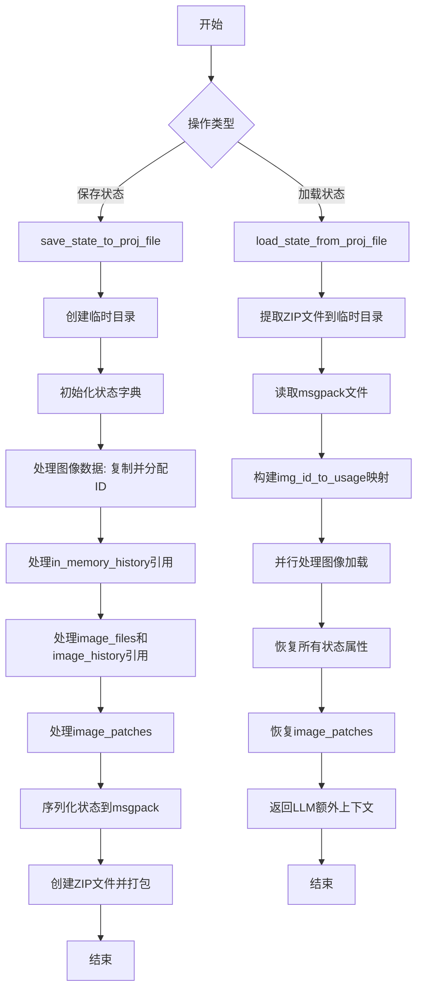
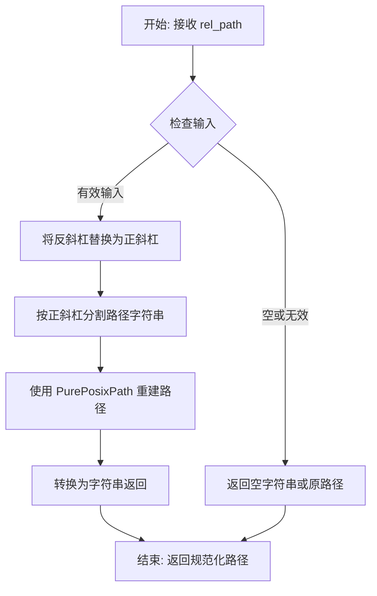
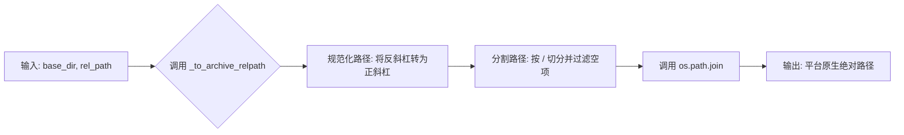
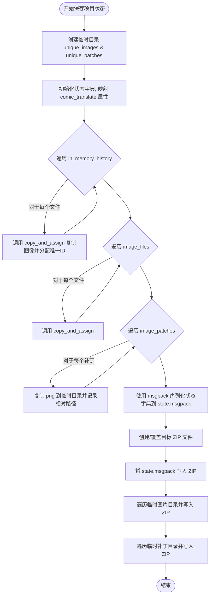
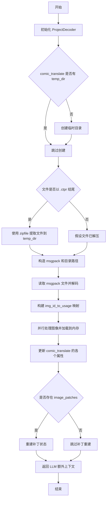

# `comic-translate\app\projects\project_state.py` 详细设计文档

该模块实现了一个漫画翻译项目的状态序列化和反序列化功能，能够将ComicTranslate对象的全部状态（包括图像、图像历史、补丁、设置等）保存为.msgpack格式并打包成.zip文件，同时支持从项目文件中恢复完整的工作状态。

## 整体流程



## 类结构

```
无类层次结构 - 该文件为模块级函数集合
辅助函数层
├── _to_archive_relpath (路径规范化)
└── _join_from_archive_relpath (路径连接)
核心功能层
├── save_state_to_proj_file (保存状态)
└── load_state_from_proj_file (加载状态)
```

## 全局变量及字段


### `encoder`
    
用于msgpack序列化状态对象的编码器

类型：`ProjectEncoder实例`
    


### `decoder`
    
用于msgpack反序列化状态对象的解码器

类型：`ProjectDecoder实例`
    


### `state`
    
存储项目状态数据的字典，包含图像索引、历史记录、图像引用等

类型：`字典`
    


### `unique_images`
    
将图像ID映射到唯一图像文件名的字典，用于去重和归档

类型：`字典`
    


### `image_path_to_id`
    
将图像文件路径映射到图像ID的字典，避免重复复制

类型：`字典`
    


### `image_id_counter`
    
用于生成唯一图像ID的计数器

类型：`整数`
    


### `img_id_to_usage`
    
将图像ID映射到其使用位置信息的字典，用于恢复图像数据

类型：`字典`
    


### `temp_dir`
    
临时目录路径，用于存放解压的项目文件和临时图像

类型：`字符串`
    


### `image_data`
    
缓存已加载图像数据的字典，键为文件路径，值为图像对象

类型：`字典`
    


### `in_memory_history`
    
存储内存中图像历史记录的字典，用于撤销/重做功能

类型：`字典`
    


### `image_history`
    
存储图像文件历史路径记录的字典，键为文件路径，值为路径列表

类型：`字典`
    


### `original_to_temp`
    
将原始图像路径映射到临时目录中图像路径的字典

类型：`字典`
    


    

## 全局函数及方法


### `_to_archive_relpath`

该函数用于规范化项目状态中存储的相对路径，将所有路径转换为使用 POSIX 风格分隔符（正斜杠 `/`），以确保在 Windows、macOS 和 Linux 系统之间交叉加载项目文件时的兼容性。

参数：

- `rel_path`：`str`，需要规范化的原始相对路径

返回值：`str`，使用 POSIX 风格分隔符的规范化相对路径

#### 流程图



#### 带注释源码

```python
def _to_archive_relpath(rel_path: str) -> str:
    """
    Normalize relative paths stored inside project state.

    We store paths using POSIX separators so project files created on Windows
    can be loaded on macOS/Linux (and vice versa).
    """
    # Keep this strictly relative; callers control the base directory.
    # 将输入转换为字符串（防止非字符串输入），然后：
    # 1. 将 Windows 反斜杠替换为 POSIX 正斜杠
    # 2. 按正斜杠分割成各个路径部分
    # 3. 使用 PurePosixPath 重新组合，确保统一使用正斜杠
    return str(PurePosixPath(*str(rel_path).replace("\\", "/").split("/")))
```


### `_join_from_archive_relpath`

该函数用于将项目中存储的 POSIX 风格（使用正斜杠 `/`）的相对路径与当前操作系统的原生基础目录相结合，以生成可供文件系统访问的绝对路径。这主要用于从项目存档（.ctpr）中解压并定位资源文件。

参数：
- `base_dir`：`str`，平台原生的基础目录（如临时解压目录 `temp_dir`）。
- `rel_path`：`str`，存储在存档内的 POSIX 风格相对路径。

返回值：`str`，拼接后的平台原生绝对文件路径。

#### 流程图



#### 带注释源码

```python
def _join_from_archive_relpath(base_dir: str, rel_path: str) -> str:
    """
    Join a POSIX-style relative path onto a platform-native base directory.
    """
    # 1. 首先调用辅助函数将路径统一转换为 POSIX 风格（确保跨平台兼容性）
    #    例如：将 "images\sub.png" 转换为 "images/sub.png"
    posix = _to_archive_relpath(rel_path)
    
    # 2. 分割路径并去除空字符串
    #    这可以处理如 "a//b" 或 "/path" 等边界情况
    parts = [p for p in posix.split("/") if p]
    
    # 3. 使用 os.path.join 将平台基础目录与路径部分拼接
    #    在 Windows 上会自动使用反斜杠，Linux/Mac 上使用正斜杠
    return os.path.join(base_dir, *parts)
```


### `save_state_to_proj_file`

该函数负责将 `ComicTranslate` 对象当前的运行状态（包括图像、补丁、设置和历史记录）序列化为一个 `.ctpr` 压缩文件。过程包括：去重图像和补丁文件、构建状态字典、使用 MsgPack 序列化元数据，并将所有数据打包进 ZIP 文件中。

参数：

-  `comic_translate`：`ComicTranslate`，包含应用当前所有状态数据（图像、配置、历史等）的核心对象。
-  `file_name`：`str`，目标输出文件（.ctpr 项目文件）的路径。

返回值：`None`，该函数通过副作用（写入文件）返回结果。

#### 流程图



#### 带注释源码

```python
def save_state_to_proj_file(comic_translate: ComicTranslate, file_name: str):
    """
    将 comic_translate 对象的状态保存到 msgpack 文件和唯一图像文件夹中。

    Parameters:
        comic_translate: 包含状态的对象。
        file_name (str): 输出 msgpack 文件的路径。
    """
    # 实例化项目编码器，用于处理特殊对象的序列化
    encoder = ProjectEncoder()

    # 创建临时目录以暂存唯一的资源文件
    with tempfile.TemporaryDirectory() as temp_dir:
        # 构建唯一图像和补丁的临时存储路径
        unique_images_dir = os.path.join(temp_dir, "unique_images")
        os.makedirs(unique_images_dir, exist_ok=True)
        unique_patches_dir = os.path.join(temp_dir, "unique_patches")
        os.makedirs(unique_patches_dir, exist_ok=True)

        # 初始化状态字典，提取 comic_translate 的核心属性
        state = {
            'current_image_index': comic_translate.curr_img_idx,
            'image_states': comic_translate.image_states,
            'unique_images': {},  # 将存储 id -> file_name 的映射
            'image_data_references': {},
            'image_files_references': {},
            'in_memory_history_references': {},
            'image_history_references': {},
            'original_image_files': comic_translate.image_files,
            'current_history_index': comic_translate.current_history_index,
            'displayed_images': list(comic_translate.displayed_images),
            'loaded_images': comic_translate.loaded_images,
            'image_patches': {}, 
            'llm_extra_context': comic_translate.settings_page.get_llm_settings().get('extra_context', ''),
            'webtoon_mode': comic_translate.webtoon_mode,
            'webtoon_view_state': comic_translate.image_viewer.webtoon_view_state
        }

        # 用于生成唯一ID的计数器和映射表
        image_id_counter = 0
        image_path_to_id = {}
        unique_images = {}

        # 内部辅助函数：复制文件到临时目录并分配唯一ID
        def copy_and_assign(file_path):
            nonlocal image_id_counter
            # 如果该路径尚未处理过，则进行去重处理
            if file_path not in image_path_to_id:
                image_id = image_id_counter
                image_id_counter += 1
                image_path_to_id[file_path] = image_id
                
                bname = os.path.basename(file_path)
                new_file_path = os.path.join(unique_images_dir, bname)
                
                # 将文件从磁盘复制到临时目录
                shutil.copy2(file_path, new_file_path)
                # 记录 ID 到文件名的映射
                unique_images[image_id] = bname
            
            return image_path_to_id[file_path]

        # 处理内存历史记录 (in_memory_history)
        # 遍历每个文件的操作历史
        for file, history in comic_translate.in_memory_history.items():
            state['in_memory_history_references'][file] = []
            for idx, img in enumerate(history):
                # 获取该历史步骤对应的图像路径
                path = comic_translate.image_history[file][idx]
                # 判断是否是当前指针指向的历史状态
                if idx == comic_translate.current_history_index.get(file, 0):
                    # 链接到 image_data
                    image_id = copy_and_assign(path)
                    state['image_data_references'][file] = image_id
                else:
                    image_id = copy_and_assign(path)
                state['in_memory_history_references'][file].append(image_id)

        # 处理当前图像文件列表和图像历史记录
        for file_path in comic_translate.image_files:
            # 总是分配一个新的图像ID -> 文件映射
            image_id = copy_and_assign(file_path)
            state['image_files_references'][file_path] = image_id

            # 如果存在历史记录，也填充历史列表
            if file_path in comic_translate.image_history:
                state['image_history_references'][file_path] = []
                for path in comic_translate.image_history[file_path]:
                    hist_id = copy_and_assign(path)
                    state['image_history_references'][file_path].append(hist_id)

        # 处理图像补丁 (Patches)
        for page_path, patch_list in comic_translate.image_patches.items():
            state['image_patches'][page_path] = []
            for patch in patch_list:
                src_png  = patch['png_path'] # 临时目录中的绝对路径
                # 保持每个页面一个子文件夹
                sub_dir  = os.path.join(unique_patches_dir, os.path.basename(page_path))
                os.makedirs(sub_dir, exist_ok=True)

                dst_png  = os.path.join(sub_dir, os.path.basename(src_png))
                # 复制补丁文件
                shutil.copy2(src_png, dst_png)

                # 更新状态中的补丁信息，使用 POSIX 风格分隔符以支持跨平台加载
                state['image_patches'][page_path].append({
                    'bbox': patch['bbox'],
                    'png_path': _to_archive_relpath(os.path.relpath(dst_png, unique_patches_dir)),
                    'hash': patch['hash'],
                })     

        # 确保键为字符串类型并加入状态
        state['unique_images'] = ensure_string_keys(unique_images)

        # 1. 将状态序列化到 msgpack 文件
        msgpack_file = os.path.join(temp_dir, "state.msgpack")
        with open(msgpack_file, 'wb') as file:
            msgpack.pack(state, file, default=encoder.encode, use_bin_type=True)

        # 2. 创建 ZIP 文件，包含 msgpack 文件和 unique_images 文件夹
        zip_file_name = file_name
        with zipfile.ZipFile(zip_file_name, 'w', zipfile.ZIP_STORED) as zipf:
            # 写入元数据
            zipf.write(msgpack_file, arcname="state.msgpack")
            
            # 遍历并写入唯一的图片
            for root, _, files in os.walk(unique_images_dir):
                for file in files:
                    file_path = os.path.join(root, file)
                    # 计算相对于临时目录根的路径作为压缩包内路径
                    arcname = os.path.relpath(file_path, temp_dir)
                    zipf.write(file_path, arcname=arcname)

            # 遍历并写入唯一的补丁
            for root, _ , files in os.walk(unique_patches_dir):
                for f in files:
                    fpath = os.path.join(root, f)
                    arcname = os.path.relpath(fpath, temp_dir)
                    zipf.write(fpath, arcname=arcname)
```

### 关键组件信息

1.  **`ProjectEncoder` (类)**: 自定义的 `msgpack` 编码器，用于处理不可直接序列化的 Python 对象（如 numpy 数组或特定类实例），将其转换为可存储的格式。
2.  **`_to_archive_relpath` (全局函数)**: 路径规范化辅助函数。确保存储在 ZIP 中的路径使用正斜杠 `/` (POSIX 风格)，从而保证在 Windows、macOS、Linux 之间项目文件的互操作性。
3.  **`image_path_to_id` (局部变量/映射)**: 内存中的哈希表，用于在保存过程中对重复的图像文件进行去重。它避免了将同一张图片在 ZIP 包中存储多次，极大减小了项目文件的体积。

### 潜在的技术债务与优化空间

1.  **同步 I/O 阻塞**: 代码中使用 `shutil.copy2` 在主线程中顺序执行文件复制操作。当项目包含大量高分辨率图像时，这可能会导致 UI 冻结或保存速度变慢。建议改为异步 I/O 或后台线程处理（类似 `load_state_from_proj_file` 中使用的 `ThreadPoolExecutor`）。
2.  **缺乏错误处理**: 在遍历文件进行复制（`shutil.copy2`）和写入 ZIP（`zipf.write`）的过程中，没有 `try-except` 块。如果源文件被删除、权限不足或磁盘空间不足，程序会直接崩溃，缺乏友好的错误提示。
3.  **硬编码的临时目录结构**: 代码中硬编码了 `"unique_images"` 和 `"unique_patches"` 字符串。如果未来项目结构变化，可能需要重构这部分逻辑。
4.  **序列化效率**: `state` 字典是全量构建在内存中的。对于超大型项目（几千张图片），这会消耗大量内存。流式处理或分块序列化可能是未来的优化方向。

### 其它项目说明

-   **设计目标与约束**: 该函数的设计目标是为了实现项目的“保存/加载”功能（Serialization/Deserialization）。核心约束是必须生成一个独立的、便携的文件（`.ctpr`），并且需要处理跨平台路径问题。
-   **外部依赖**:
    -   `msgpack`: 高效的二进制序列化格式。
    -   `zipfile`: 用于打包资源。
    -   `shutil`: 文件系统操作。
-   **数据流**: 数据流是单向的：`ComicTranslate` 对象 -> 内存字典 (`state`) -> 二进制文件 (`msgpack`) -> 归档文件 (`.ctpr`)。


### `load_state_from_proj_file`

该函数负责从 `.ctpr` 项目文件中加载并恢复 ComicTranslate 的完整状态，包括图像数据、历史记录、图像状态、webtoon模式设置以及补丁信息，并将临时目录中的文件路径映射回原始文件路径。

参数：

- `comic_translate`：`ComicTranslate`，需要恢复状态的漫画翻译对象
- `file_name`：`str`，要加载的 `.ctpr` 项目文件路径

返回值：`str`，保存的 LLM 额外上下文内容

#### 流程图



#### 带注释源码

```python
def load_state_from_proj_file(comic_translate: ComicTranslate, file_name: str):
    """
    从 .ctpr 项目文件加载并恢复 comic_translate 的完整状态。
    
    参数:
        comic_translate: ComicTranslate 对象，需要恢复状态的漫画翻译实例
        file_name: str, .ctpr 项目文件的路径
    
    返回:
        str: 保存的 LLM 额外上下文内容
    """
    # 初始化 ProjectDecoder 用于 msgpack 解码
    decoder = ProjectDecoder()

    # 确保 comic_translate 有临时目录用于存放解压的文件
    if not hasattr(comic_translate, 'temp_dir'):
        comic_translate.temp_dir = tempfile.mkdtemp()

    # 使用局部变量引用属性以提高访问速度
    image_data = comic_translate.image_data
    temp_dir = comic_translate.temp_dir
    in_memory_history = comic_translate.in_memory_history
    image_history = comic_translate.image_history
    original_to_temp = {}  # 原始路径到临时路径的映射

    # 初始化本地状态容器
    image_states = {}
    current_history_index = {}
    displayed_images = set()
    loaded_images = []

    # 如果是 .ctpr 文件（zip 格式），解压到临时目录
    if file_name.lower().endswith( '.ctpr'):
        with zipfile.ZipFile(file_name, 'r') as archive:
            for file in archive.namelist():
                archive.extract(file, temp_dir)

    # 构造必要的文件路径
    msgpack_file = os.path.join(temp_dir, "state.msgpack")
    unique_images_dir = os.path.join(temp_dir, "unique_images")
    unique_patches_dir = os.path.join(temp_dir, "unique_patches")

    # 读取并反序列化 msgpack 状态文件
    with open(msgpack_file, 'rb') as file:
        # 使用自定义 decoder 处理 msgpack 数据
        unpacker = msgpack.Unpacker(file, object_hook=decoder.decode, strict_map_key=True)
        try:
            # 读取地图（字典）的大小
            map_size = unpacker.read_map_header()
        except ValueError:
            raise ValueError("Invalid msgpack format: Expected a map at the root.")

        # 手动迭代读取键值对
        state = {}
        for _ in range(map_size):
            key = unpacker.unpack()
            value = unpacker.unpack()
            state[key] = value

    # 构建 img_id 到使用位置的映射关系
    # 用于跟踪每个图像 ID 在哪些地方被引用
    img_id_to_usage = {}

    def process_references(ref_dict, ref_type):
        """
        处理引用字典，构建 img_id 到使用位置的映射。
        
        参数:
            ref_dict: 引用字典 {file_path: img_id}
            ref_type: 引用类型 (image_data, image_files, in_memory_history, image_history)
        """
        for file_path, img_id_str in ref_dict.items():
            img_id = int(img_id_str)
            # 对于历史类引用，处理多个 ID
            if ref_type in ['in_memory_history', 'image_history']:
                for idx, img_id_sub_str in enumerate(img_id_str):
                    img_id_sub = int(img_id_sub_str)
                    img_id_to_usage.setdefault(img_id_sub, []).append((ref_type, file_path, idx))
            else:
                img_id_to_usage.setdefault(img_id, []).append((ref_type, file_path))

    # 处理各种类型的引用
    process_references(state.get('image_data_references', {}), 'image_data')
    process_references(state.get('image_files_references', {}), 'image_files')

    # 处理历史记录的引用
    for ref_type in ['in_memory_history_references', 'image_history_references']:
        for file_path, img_id_list in state.get(ref_type, {}).items():
            for idx, img_id_str in enumerate(img_id_list):
                img_id = int(img_id_str)
                usage_type = 'in_memory_history' if ref_type == 'in_memory_history_references' else 'image_history'
                img_id_to_usage.setdefault(img_id, []).append((usage_type, file_path, idx))

    # 获取唯一图像的映射表
    unique_images = state.get('unique_images', {})

    def process_image(img_file_name, usages, image_data,
                     original_to_temp, in_memory_history, image_history):
        """
        处理单个图像文件，根据使用类型将其加载到正确的位置。
        
        参数:
            img_file_name: 图像文件名
            usages: 该图像的所有使用位置列表
            image_data: 图像数据字典
            original_to_temp: 原始到临时路径映射
            in_memory_history: 内存中的历史记录
            image_history: 图像历史记录
        """
        img_path = os.path.join(unique_images_dir, img_file_name)

        for usage in usages:
            usage_type = usage[0]
            if usage_type == 'image_data':
                # 加载到 image_data 字典
                file_path = usage[1]
                img = imk.read_image(img_path)
                image_data[file_path] = img
            elif usage_type == 'in_memory_history':
                # 加载到内存历史记录
                img = imk.read_image(img_path)
                file_path, idx = usage[1], usage[2]
                in_memory_history.setdefault(file_path, [])
                history = in_memory_history[file_path]
                while len(history) <= idx:
                    history.append(None)
                history[idx] = img
            elif usage_type == 'image_files':
                # 记录文件路径映射
                file_path = usage[1]
                temp_path = img_path
                original_to_temp[file_path] = temp_path
            elif usage_type == 'image_history':
                # 加载到图像历史记录（仅路径）
                file_path, idx = usage[1], usage[2]
                image_history.setdefault(file_path, [])
                history = image_history[file_path]
                while len(history) <= idx:
                    history.append(None)
                history[idx] = img_path

    # 使用线程池并行处理图像加载
    with ThreadPoolExecutor() as executor:
        future_to_img_id = {
            executor.submit(process_image, img_file_name, img_id_to_usage[int(img_id)],
                            image_data, original_to_temp,
                            in_memory_history, image_history): img_id
            for img_id, img_file_name in unique_images.items() if int(img_id) in img_id_to_usage
        }

        # 等待所有任务完成并处理异常
        for future in as_completed(future_to_img_id):
            img_id = future_to_img_id[future]
            try:
                future.result()
            except Exception as exc:
                print(f'Image ID {img_id} generated an exception: {exc}')

    # ========== 更新 comic_translate 的各个属性 ==========
    
    # 恢复当前图像索引
    comic_translate.curr_img_idx = state.get('current_image_index', 0)
    
    # 恢复 webtoon 模式设置
    comic_translate.webtoon_mode = state.get('webtoon_mode', False)
    comic_translate.image_viewer.webtoon_view_state = state.get('webtoon_view_state', {})

    # 恢复图像文件列表（路径映射）
    original_image_files = state.get('original_image_files', [])
    comic_translate.image_files = [
        original_to_temp.get(file, file) for file in original_image_files
    ]

    # 恢复图像状态
    image_states = state.get('image_states', {})
    comic_translate.image_states = {
        original_to_temp.get(file, file): img_state for file, img_state in image_states.items()
    }

    # 恢复历史索引
    current_history_index = state.get('current_history_index', {})
    comic_translate.current_history_index = {
        original_to_temp.get(file, file): index for file, index in current_history_index.items()
    }

    # 恢复显示的图像集合
    displayed_images = state.get('displayed_images', [])
    comic_translate.displayed_images = set(
        original_to_temp.get(i, i) for i in displayed_images
    )
    
    # 恢复已加载的图像列表
    loaded_images = state.get('loaded_images', [])
    comic_translate.loaded_images = [
        original_to_temp.get(file, file) for file in loaded_images
    ]

    # 恢复图像数据（应用路径映射）
    comic_translate.image_data = {
        original_to_temp.get(file, file): img 
        for file, img in image_data.items()
    }

    # 恢复内存历史记录（应用路径映射）
    comic_translate.in_memory_history = {
        original_to_temp.get(file, file): imgs 
        for file, imgs in in_memory_history.items()
    }

    # 恢复图像历史记录（应用路径映射）
    comic_translate.image_history = {
        original_to_temp.get(file_path, file_path): history_list
        for file_path, history_list in image_history.items()
    }

    # ========== 恢复补丁状态 ==========
    saved_patches = state.get('image_patches')  
    if saved_patches and os.path.isdir(unique_patches_dir):
        reconstructed = {}
        for page_path, patch_list in saved_patches.items():
            new_list = []
            for p in patch_list:
                # 使用 POSIX 风格路径恢复绝对路径
                abs_png = _join_from_archive_relpath(unique_patches_dir, p.get('png_path', ''))
                if os.path.isfile(abs_png):  
                    new_list.append({'bbox': p['bbox'],
                                    'png_path': abs_png,
                                    'hash': p['hash']})
            if new_list:
                reconstructed[page_path] = new_list

        # 应用路径映射到页面
        comic_translate.image_patches = {
            original_to_temp.get(page, page): plist
            for page, plist in reconstructed.items()
        }

    # 恢复 LLM 额外上下文
    saved_ctx = state.get('llm_extra_context', '')
    return saved_ctx
```

## 关键组件


### 路径规范化组件

负责将Windows和Unix路径互相转换，确保跨平台项目文件的兼容性。使用PurePosixPath将路径统一转换为POSIX风格存储。

### 状态保存组件 (save_state_to_proj_file)

将ComicTranslate对象的状态序列化并保存到.ctpr格式的ZIP文件中，包含图像数据、图像历史、补丁等信息。使用msgpack进行序列化，tempfile管理临时文件。

### 状态加载组件 (load_state_from_proj_file)

从.ctpr格式的ZIP文件中解压缩并反序列化项目状态，支持图像数据、图像历史、补丁等完整状态的恢复。使用ThreadPoolExecutor并行处理图像加载。

### 图像ID管理组件

负责为每个唯一的图像文件分配整数ID，建立文件路径到ID的映射关系，用于去重和引用追踪。

### 引用处理组件 (process_references)

构建图像ID到使用位置的映射关系，追踪图像数据、内存历史、文件引用和历史记录的关联。

### 并行图像处理组件 (process_image)

使用ThreadPoolExecutor并行加载图像数据，根据不同的使用类型（image_data、in_memory_history、image_files、image_history）执行不同的处理逻辑。

### 补丁重建组件

从存档中恢复图像补丁状态，将相对路径转换为绝对路径，重建页面与补丁列表的映射关系。

### 跨平台路径转换组件 (_to_archive_relpath, _join_from_archive_relpath)

确保项目文件在不同操作系统间可移植，将路径转换为POSIX风格存储，读取时再转换回平台原生格式。


## 问题及建议


### 已知问题

- **Image ID遍历逻辑错误**：在`process_references`函数中，当`ref_type`为`in_memory_history`或`image_history`时，代码尝试对`img_id_str`进行`enumerate`，但`img_id_str`实际上是整数类型而非列表，导致迭代行为异常
- **资源泄漏风险**：`load_state_from_proj_file`中创建的`temp_dir`目录在加载失败时未被显式清理
- **临时文件冗余**：保存时先将图片复制到临时目录再打包成zip，加载时又解压到临时目录，过程中产生大量冗余IO操作
- **路径处理不一致**：部分位置使用`os.path.join`直接拼接，未统一使用`_to_archive_relpath`和`_join_from_archive_relpath`进行跨平台路径处理
- **并行处理不彻底**：图片加载使用线程池并行处理，但图片复制和打包过程仍为串行执行
- **类型转换开销**：Image ID在字典中使用字符串存储，但在处理时频繁转换为整数，增加不必要的性能开销
- **异常处理不完善**：文件读写、拷贝操作缺少完整的try-except保护，失败时可能导致状态不一致

### 优化建议

- **修复Image ID遍历逻辑**：检查`process_references`函数对列表类型数据的处理方式，确保正确解析历史记录中的多个image ID
- **引入资源管理上下文**：使用上下文管理器或try-finally确保临时目录在异常情况下也能被清理
- **优化文件操作流程**：考虑使用内存缓冲区直接创建zip，避免中间临时文件；或使用流式处理减少磁盘IO
- **统一路径处理**：全面使用路径规范化函数处理所有路径相关操作，确保跨平台兼容性
- **扩展并行处理范围**：将图片复制、打包等操作也纳入并行处理，或使用异步IO提升效率
- **优化数据结构**：使用整数作为字典主键，或在初始化时统一类型，避免运行时频繁转换
- **增强异常处理**：为关键文件操作添加详细的异常捕获和日志记录，确保失败时能回滚或提示用户

## 其它


### 设计目标与约束

**设计目标**：
1. 实现漫画翻译项目的完整状态序列化与反序列化，支持跨平台（Windows/macOS/Linux）加载项目文件
2. 将项目数据打包为单一的.ctpr文件，便于分发和存储
3. 通过去重机制优化图片存储空间
4. 支持增量历史记录的保存与恢复

**约束条件**：
1. 项目文件格式为ZIP压缩包，内部包含msgpack序列化的状态文件和图片资源
2. 路径存储统一使用POSIX风格分隔符，确保跨平台兼容性
3. 图片ID采用从0开始的整数自增策略
4. 临时文件存放在系统临时目录，函数结束后自动清理

### 错误处理与异常设计

**保存过程中的异常处理**：
- 文件IO异常：使用try-except捕获写入错误，zipfile写入失败时抛出异常
- 目录创建失败：os.makedirs失败时抛出PermissionError或OSError
- 图片复制失败：shutil.copy2失败时抛出异常

**加载过程中的异常处理**：
- 文件格式验证：检查文件扩展名是否为.ctpr，不符合则按普通zip处理
- msgpack解析错误：捕获ValueError并抛出"Invalid msgpack format"错误
- 图片加载异常：在ThreadPoolExecutor中捕获各线程异常并打印错误信息，但不影响其他图片加载
- 路径解析异常：_join_from_archive_relpath处理无效路径时返回错误路径

**关键异常类型**：
- ValueError：msgpack格式错误、参数类型错误
- OSError：文件系统操作失败
- KeyError：状态字典缺少必要键（但代码使用get提供默认值）

### 数据流与状态机

**保存数据流**：
```
ComicTranslate对象 → 提取状态字段 → 创建临时目录 → 
复制去重图片 → 序列化状态为msgpack → 打包为ZIP文件 → 清理临时目录
```

**加载数据流**：
```
ZIP文件 → 解压到临时目录 → 读取msgpack状态 → 
解析图片引用映射 → 并行加载图片 → 重建ComicTranslate对象状态 → 
清理临时目录（可选）
```

**状态转换关键点**：
1. 图片路径转换：原始路径 → 唯一图片ID → ZIP内文件名 → 临时目录路径 → 恢复原始路径映射
2. 历史记录重建：image_history_references包含文件路径到图片ID列表的映射
3. 补丁恢复：png_path从POSIX相对路径转换为平台原生绝对路径

### 外部依赖与接口契约

**直接依赖**：
- `msgpack`：Python对象序列化库
- `zipfile`：ZIP压缩包处理
- `shutil`：文件复制操作
- `os/pathlib`：文件系统操作
- `concurrent.futures.ThreadPoolExecutor`：并行图片加载
- `imkit.imk.read_image`：图片读取（外部库imkit）

**模块间接口**：
- `save_state_to_proj_file(comic_translate: ComicTranslate, file_name: str)`：保存项目状态
- `load_state_from_proj_file(comic_translate: ComicTranslate, file_name: str) -> str`：加载项目状态，返回LLM额外上下文字符串

**ComicTranslate对象依赖属性**：
- `curr_img_idx`：当前图片索引
- `image_states`：图片状态字典
- `image_files`：图片文件路径列表
- `image_data`：图片数据字典
- `image_history`：图片历史记录
- `in_memory_history`：内存历史记录
- `image_patches`：图片补丁列表
- `displayed_images`：显示的图片集合
- `loaded_images`：已加载图片列表
- `current_history_index`：当前历史索引
- `webtoon_mode`：网页漫画模式标志
- `settings_page.get_llm_settings()`：LLM设置
- `image_viewer.webtoon_view_state`：网页漫画视图状态

### 性能考虑

**优化策略**：
1. **并行图片加载**：使用ThreadPoolExecutor并发读取图片，提升IO密集型操作效率
2. **图片去重**：通过image_path_to_id字典避免重复复制相同图片
3. **局部变量缓存**：load_state_from_proj_file中使用局部变量缓存comic_translate属性，减少属性查找开销
4. **流式msgpack解析**：使用Unpacker进行流式解析，避免一次性加载整个状态字典

**性能瓶颈**：
1. 大型项目中图片数量多时，ZIP压缩可能较慢
2. 线程池默认使用系统CPU核心数，可能与主线程产生竞争
3. 图片数据全部加载到内存，大项目可能导致内存压力

### 安全性考虑

**潜在安全风险**：
1. **路径遍历攻击**：extractall解压缩时未验证文件路径，可能遭受ZIP路径遍历攻击
2. **任意文件覆盖**：直接使用os.path.join拼接文件名，可能被恶意.ctpr文件利用
3. **临时目录竞争**：使用tempfile.mkdtemp创建临时目录，存在TOCTOU竞争条件

**缓解措施**：
1. 验证msgpack文件存在性后再读取
2. 图片路径处理使用PurePosixPath规范化
3. 使用with语句确保临时目录正确清理

### 兼容性考虑

**平台兼容性**：
1. 路径存储使用POSIX风格（正斜杠），确保Windows/macOS/Linux互操作
2. _to_archive_relpath函数将反斜杠替换为正斜杠
3. _join_from_archive_relpath将POSIX路径转换回平台原生路径

**版本兼容性**：
1. 状态字典使用get方法提供默认值，兼容新旧版本字段差异
2. ProjectEncoder/ProjectDecoder提供自定义序列化钩子

### 测试策略

**建议测试用例**：
1. 空项目状态保存/加载
2. 包含大量图片的项目序列化
3. 跨平台路径处理（Windows保存，Linux加载）
4. 图片历史记录完整性验证
5. 损坏的.ctpr文件加载异常处理
6. 并行加载异常捕获

### 配置与扩展性

**可配置项**：
1. 临时目录位置（通过comic_translate.temp_dir属性）
2. 线程池大小（未暴露参数，使用系统默认）
3. ZIP压缩方式（当前使用ZIP_STORED，可扩展支持ZIP_DEFLATED）

**扩展方向**：
1. 支持增量备份而非全量保存
2. 添加加密压缩支持
3. 支持自定义图片压缩格式

    